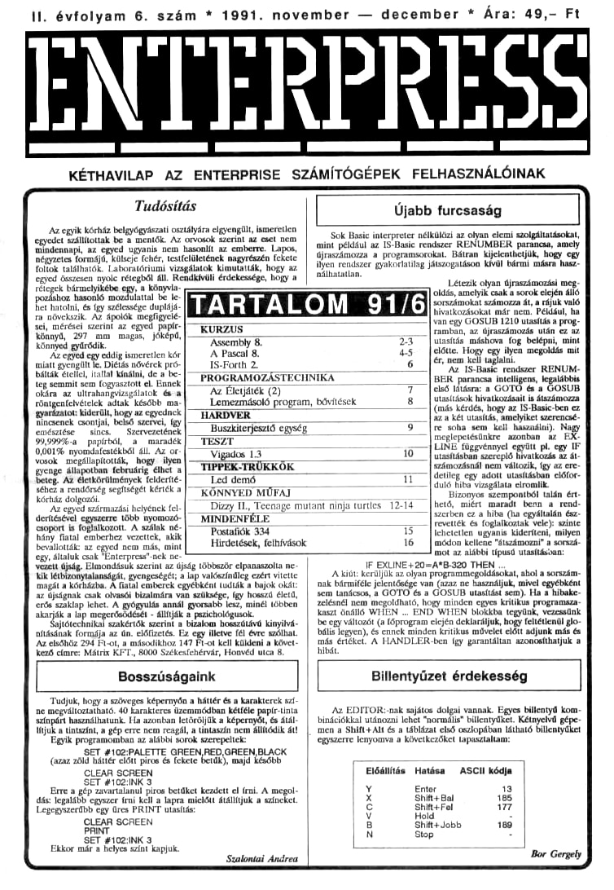

# Enterpress 1991/6 (1991.11-12)

[Оригінальний PDF](http://enterprise.iko.hu/magazines/Enterpress_1991-6.pdf) (угорською)

## Зміст

## Чернетка вмісту

"page-000.jpg" ------------------------------------------------------------ 
II. évfolyam 6. szám ! 1991. november — december !" Ára: 49,- Ft

ENTERPKESS

halsz nát ássmezszzsmmeazátnzátkzzítttmástteti
KÉTHAVILAP AZ ENTERPRISE SZÁMÍTÓGÉPEK FELHASZNÁLÓINAK

Tudósítás

e kotet bek mők. Az örgosok szertat áz eset nem). Sok Basic interpreter nélkülözi az olyan elemi szolgáltatásokat,
száítottak be a mentők, Az ornek szeri at ett Nem) mint példul az IS-asie rendszer RENUMBER pártcsa, amely
e e e kae tehén. tenfelületének nagyrészén feler] újraszámozza a programsorokat, Bálran kijelenthetjük, hogy egy
foltok találhatók. Laboratóriumi vizsgálatok kimutatták, hogy az ] ilyen rendszer gyakorlatilag játszogatáson kívül bármi másra hasz-

14] rálhatatlan.
egyed összesen nyolc rétegből All. Rendkívüli érdekessége, hogy Létezik olyan újroszássozási
elején álló

Újabb furcsaság

rétegek bármelyikébe egy, a könyvla-

ge vezetés era ssaléseák egen szán
KKLESSZSÁTTARTALOM 91/6 ESSZÉ

— — Ivan egy GOSUB 1210 utasítás a prog-
gr lgpengárás ag ve BÁLT] C [enabak, a újesemássásás utáő ég 6
könnyel gt gyársáik e FDA Assembíj B 73 [tasítás máshova fog belépni, mint
tádig ismeretlenkór] A Pascal 8. slőtie. Hory egy ilyen megoldás mit
miatt gyeneüttÍe Diétás nővérek pró] 1S-Fonh 2. 675 férni kölbeegete tajt.
bálták étellel, irattal kínálni, de a be. [ PROGRAMOZÁSTECIINIKA Bese gimnrzéri
ag semmit sem fogyasztott él. Hanek [— Zo ECTNIKA [BEM parancsa intéligsan jeglátbik
dlára az uitrahangvizsgálatok ésa] Az Filetjétek (2) hő tát fas éc
röntgentelvételek adtak később ma-] —— Lemezmásoló program, bővítések 8 [esett lltátosátt tmetenez
mgerizster kiásztó hogy az cgged egyetek [/ HARDVER Za két vtmaítánt kötelyöket saérenesé,
tmémtése tie  Szervesztásl fe soha sem kell használni). Ni
$99999a papírból a maradék. szesztás setét éb
OC tát kt temgett ——— 5— Í LINE függvénnyel együtt pi. egy IF
0460196 nyomdatestékből áll. Az a. btsíásba szereplő, hhatkozás Az ál.
fekszenek] Számozásnál nem változik, így az ere.
ke e ea eg —  ——— pr deep egy adott miastáábat létet.
éhez a rendőrség segítségét kérték utó hiba vizagálata elromlik,
kértél [KÖNNYED MŰFAT — Bizonyos szempontból talán ért-
íz - ninja es zi hető, miért maradt benn a rend-
aztáttlk samt tk lent ke IE tartes IZ szerben eza hiba (ha egyáltalán ész-
szpért 4 feljatkozott. A szálak mé Me ——, gy [77296 6 foglalkoztak vele): szinte
hány fiatal emberhez vezettek, akik] bostattók 904 fehctetlen ugyanis kideríteni, milyen
beveltották; áz frozonzadoren Hirdetések, felhívások módon Heltese iszáatotal sorszá-
, általuk csak CEnterpresst-nek ne- mm. taaításban:
"vezett újság, Elmondásuk szerint az újság többször elpanaszolta ne. IF EXLINE4:20-A9B-320 THEN
kik létbizonytalanságát, gyengeségét; a lap valószínűleg ezért vitette A kiút: kerüljük az olyan. fee ogp amavert szgdressáó sorszám-
 éjvárnk zak alvetól bítása Vág seltsége [ér hosárt élet, ] sem tanácsos, § GOTÓ és a CIOSUB utasítást sé). a 2 hibaba
Tett tehet A gyógyulás annál gyormebk less minél többet] selésmél nemm tmcgoldható, hogy minden egyen kell progrednsza:
akarják a -rősödését . Alíák a pszichológusok kaszt önálló WIEN .. END WHEN biokkba tegyünk, vezessünk
jiótechnikal szakértők szerint a bizalom hosszútávú kinyilvá-  ) be egy változót (a főprogram cicjén deklaráljuk, hogy feltétlenül glo-
atát tonnája az án, clőlietés Ez egy erve fá évre szlhal ). bála legyen), és ennek minden kölök möseleiclót munk mű és
Az elsőhöz 294 Ft-ot, a másodikhoz 147 Ft-ot kell küldeni a követ.) más értéket, A HANDLER-ben így garantáltan azonosíthatjuk a
kező címre: Mátriz KET, 8000 Székesfehérvár, Honvéd utca 8.) hibát.

Bosszúságaink Billentyűzet érdekesség

Tudjuk, hogy a szöveges képernyőn a háttér és a karakterek szf-
megváltoztatható, 40 Karakteres üzemmódban kétféle papírinta. ) Az EDITOR:-nak sajátos dolgai vannak. Egyes billentyű kom-
Színpárt használhatunk. Ha azonban letőröljük a képernyőt, és tál) binációkkal utánozni lehet "normál" billentyűket. Kétnyelvű gépe:
Mnjuk a tintszíni, a gép erre nem reagál, a tintaszín nem állítódik ál! ]. men a Shift.Alt és a táblázat első oszlopában látható billentyűket
Egyik programósban az alábbi torok szerepeltet egyszerre lenyomva a következőket tapasztaltam:
SET 9102:PALETTE GAEEN RED GREEN BLACK
(szaz zöld háttér előtt piros és fekete betük), majd Később s — ran
(CLEAR SCREEN Előállítás Hatása  ÁSCII kódja
Erre a gép zavartalanui piros betdket kezdett el íral. A megol: Ente 19
a gép zrvartálanai -t el feni k. ntor
dás legalább egyszer írni kell a lapra miciőtt átálíjuk a színeket. Shit-Bal 188
Legegyszerűbb egy üres PRINT utasítás snittet a

ShiftaJobb 189
INT
SET 102:1INK 3 98e 8.
Ekkor már a helyes színt kapjuk. I

"page-001.jpg" ------------------------------------------------------------ 
2 Kurzus HUHETHET

1991. november — december

Assembly

A sorozat előző részében tisztáztuk a perifériukezelő és a
csatorna fogalmát, megismerkedtünk hét EXOS funkcióhívás-
sal, Ebben a fejezetben példaprogramon keresztül egy újabb
fontos hívást fogok bemutatni.

A blokkírás és a szekvenciák

A múltkori példában felhasználtuk az EXOS 8 funkciót, de nem
sett szó ennek teljesebb használatáról. Ismétlésképpen annyit kell fel-
idézni a funkcióról; hogy segítségével egy csatornára (A) adott számú,
bájtot (BC) tudunk a tár adott helyéről (DE) küldeni, Éz egy megle-
hetőset álüalános lémertetése az EXOS E-nak, nézzünk három példát,
mire használható még;

- A memóriában levő adatokat tudjuk háttértárra (magnó, leme-
egység) menteni. Értelemszerűen A-ba a háttértárat azonosító csator-
ta számát, BC-be a kimentendő bájtok számát, DE-be az adatblokk
Mmemóriabeli kezdőcímét töltjük.

- Ugyanígy küldhetünk adatblokkot a hálózatnak, a soros vonalnak,
a nyomiatónak, az edítornak, a hangkezelőnek,

küld

szövegeket írhatunk, és cap szelveneiákat,
-enítés világos, de mit jelent az escape-szekven-

Nos, az cscape-szekvencia egyfajta különleges vezérlőködok soro-
atát jelenti. Nem csak a VIDEO: eszköznél értelmezett, de jelentő:
ségük talán itt a leg Az ASCII 27 (ez az escape kódja) karak-
terel kezdődő ik különféle parancsokat jelentenek az esz.
köznek. Szekvenciákkal tudjuk például a kurzort ki- és bekapcsolni, a
képemyő seroliozását jlttanjok, cngedélyezhatükő olvasni tudjuk a
kauzor pozíciót a színeket tudjuk beáítani stb, (A képkezet

toltok szekveheiőkat a könyv a IL 42-ml sorolja fd)

A példaprogram
A biokkírás testvére az EXOS 7 - karakter írása funkció, Ennél is
A-ba annak a csatornának a számát kell töltenünk, amelyikbe "poty-
vamtnai alaruak, a B-be pedig az elküldendő karta ASCII kódját
tesszük, A képer Petoatan ekő pálda (1úlna) szt éa
szeíveclák használatát ís bemutujn. (A könnyebb magyarázhatósá
kedvéért a LinePrint segítségével felorszámoztam a sorokat, termé"
Szetcsen a sorszámokat nem kell bepötyögni.)
A program a következőt teszi: megnyit egy 4027-es hardver szö-
eges képernyőt, majd ennek egészén ciklikusan megjeleníti az ASCII
karaktertartományt, Az ilyenfajta program a kezdők első mun-
ál közé tartozik.
Milyen feladatokat kell megoldanunk a rutinban?
1. Meg kell nyitnunk a csatornát.
27 Ki kell alakítanunk a karaktereket megjelenítő rutint.
3. Le kell zárnunk a csatornál és jöhet a visszatérés.
Az1, és 3. pont síma ügy. A megjelenítő rutint sokféleképpen ki
Tehet alakítani, én a következőket teszem:
Az akkumulátort duplán kihasználom: etben tárolom a megfele:
nítndő karakter kódját, és a kódot cikiusszámlálőként ís felt
 Felhaszsálok még kél repszten (D és B), ciklusokat alakíraa KÍ
velük, amelyeket csupán arra hogy pontosan 40727 darab,
azaz 1080 karaktert jelenítsek meg,
: Nem feledkezem el a karakter megjelenítésről, és a szabatos ve-
remkezelésről
Ez az első olyan program, amelyben makródefiníciót (3-8) haszná-
tunik. Ügyeljünk arra, hogy a val paraméter előtt ne álljon szóköz,
mert így az ASMON nem hajlandó átvennit
A 10-11 sorokban a képemyőméreteket adjuk meg, majd a 14-22-
ben beállítjuk a szükséges változókat, és megnyitjuk 10-es számon a
Videocsatornát, A 25.28-as sorokban a 76-78 részen deklarált 3 esca-
Pizzetvezaát kül e a catormába 76 kapja a kun 17,
ja a serollozást (set scroll o(f), végül ja a
ERRE lse a TELTET
si finkkciót hívjuk,

És most ástak a lényegett 39-é végzi el a ciklikusan a karakter.
megjelenést 39-nő az ilkumulítorba töljüt a legelsőnek kiírandó
Karakter kódját (ASCII 33, ami maga a felkiáltójel!) A karakterkódot

:n 128-ig növeljük majd. Ha még nem érte ezt el, akkor mindig
"isszaugrunk eyel 0-ra (40), ellenkező esetben pedig lezárjuk a csator-
nát, és jöhet a

40-nél a veremre tesszük a kódot azért, mert A-t az EXOS hívá-
soknál kell majd, használnunk. A 4143-ban kiírjuk a csatornába az
ASCII 30-at; ennek hatására a képernyő letörlése nélkül a bal felső
Sarokba (HOME) ugrik a kurzor.

A 44ves sorban a D regiszterbe töltjük a képemyó függőleges mé-
retek (öz oszlopok magaszág), így D a külső ciklus (gyel. 1) számlálója
kesz.

var

ga kepernyo defintalasa

£xos valtozo alli

kepernyo csatorna megnyitása
td ató c

6rg 01000h

makro
macro Bexvar ával

(d e/dexvar
td d/dval
exos 16

evar 22,0
evar 230
evar 24XS
var 25,y-

dt

eye
cíklusszafitaloja

eyelt oszlopok szama
idős Ea belso ciklus
eyet.2

Jr nzyeyél et, enem nulla es eyelet

Pop af  ;kürakterkod A-ba

Éfe a inovelese

cp128 FCAset4) 1287

57 nizeyélő iklsebb, -s eyel 0
a a videses

it
vid

jeg

seglen

dbé
defm nyIDEO:"

a szekvenciablokk

ikurzor kikapcs.
iseroll kikapcs;

poletti
Szekv. hossz

egy §-seg
end

1. tista
"page-002.jpg" ------------------------------------------------------------ 
1991. november — december NIERPRESS 3

3
Ezután (48) E-be a vízszintes méretet (a sorok hossza) töltjük, E 113
a belső cikits Ietutássinak számát (ege! 2) fogja vezérel / karakterek bj
irását úgy végezzük, hogy E darabot nk ki D darab sorban 42
AA Gyú2 ÜZ) kezdeténél a verem tetején van a megjelenhendő ú5
karakter ködja. Ebben a megoldásban kihasználjuk, hogy A sz AF-ben FH
a tankierkőd. Envtán gyorat újra elmentők a, karakierkódot (53), sé 4 kezdetet
s . jra elmentjök a ú ; e. kezddetnet
B tartalma jermészetesét nem romlik al a UH "tán Mivel EXOS íz iBekerül AL-be
ívás következik, így (5) elmentjük DE tartalmát. 55-$6-ban megje- .
enie kariker lncsést, amiért megszakítom a magyarázatot Mi Ú8 ia szegmensszem képzése mm zdoein felno resze
a sorozatot Írom, nem érkezik hozzám semmilyen olvasól kérdés, hoz. 50 , sgykeztosi
7ászólás, Kezderi úgy érezni, hogy senki sem olvassa az Asembly so. oh A-ba új kel
Tozatot, Kérek minden olyan olvasót, aki ezt a szándékosan a szövegbe Hi api 110000009  iessk e fele 2 big kolt
ett felhívást olvassa kérdezzen, szóljon hozzál Ha nine temmi kér. Hi rea beleptetes Jokerol
-, akkor is dobjon fel egy levelezőlapot, és legalább anyit írjon: Ét or 11111100b felso 6 bit bevítete
Ono a sorozatot" Hálásan Köszönörn) Levesszük a vereről B: HA fe400 e bg egvtttit,
19, majd a belső eikius számlálóját csökkentjük (58), és ha az nem 7 ké E tala jet ervekesáent
érte ej még a nullát (szaz még nem futott le annyiszor, Ahány karakter 4
Hosszú a sor), akkor viszatgrik (59) cel 2-re. Eztán [ezjük ugyanaz, B in szegn-elm eltolása a 16K-s KPage 1) tartánony
amiról ebben a m § szeg
Ha az E tartalma nullára csökkent, az azt jelenti, hogy egy sort 61 fh N2.segőők  .inem
a min, Egy djabby tor készen van, edát ezökkenten kelta sz ld de.32768  :ígen,32K eltolás
488 cattus (sorof) szkentéléját eggyel (60), Tia D értéke bem tutte 63 seg254 eg 254 szeg?
(62), akkor még nincs teleírva a ké folytatni kell eye 1-et (1 64 ÜL szseozős Re eg ettol
a megelőző két bekezdést). Tehát ez a ciklus gondoskodik a szükséges 65 gezágis jgen,4ék eltolas
számú (y. ize) sor megjelenítéséről. bá segöss ep lő, iStSSZBS
Amikor a képcrmyó megtelik az adott kódú karakterrel, akkor le- HESZE TES afzk tői
vesszűk a veremről a kódot (63), majd a következő kitételhez növeljük 88 szsz AS É55 gen nincs eltotas
értékét (64). Megvizsgáljuk, hogy elérte-e már a 128-at (65), Ha nem, ÁG EB EB la jee
kkor a eget 0-ra ugrik visza (66), és megjelentjül az újabb karak. 10 usd e. já [zet
tereket, ps
A 1271-es kódú karakter megjelenítése után A tartalma 128 lesz, 28 ZO SM ÁNNNNN E NEE röstágsst
vérebének a ekes Nine má hátra mint Iezdrni a viloosator TÁ ező. cim kezere a tek emel, es az eltel
mál(65-70), majd visszatérni; ja
ordíísuk le és indítsuk el a programot, de az indítás után ne ijod- 76 PI es P2 lapok mentése (2 szegnens esetere)
JELE zen Nem a tép örjela erett visza 5 Hare a program sz fe jpg torsszát: ő
ÖS hívások miatt ilyen lassú, Íme, egy ékes bizonyíték arrn, hogy 18 gat
[pon képermyőkezetési csak a közvellen videomcmélte kit érte, 79 na, CON)
Tiakel A médik program Elsa) iyen elvén működik, értelmezése b per ar LES ga, valt
ldük átjéti -HCs- 82 out (O81h),a a videoszegmensek
, arg 010004 Fi §
d Hi
2 JEXOS valtozo Stt ff [3
var merő Bexvarsöva
5 td beszsőreívar Hi kora ascii 0,
s id dzóvat 88 exel
: exe 16 Hi
b et 91 gel
10 ;kepernyomeretek 92 kids fine ht a következo hely
12 vette egi 2? Hi jr nzzevetez inom nulla s éyelté
bi eb 95 dec d" úszőéy kulso szaml, csokk.
csatorna szama 96 Jr nzjeyel  ;nem nulla -2 eyel 1
16. vehán egi 10 sz feb Hkezdocim vik 1 (Titasa
ne a es szamlalo novelese
ÁT sa valtozok beall ítasa 99 en, e eye
HA généset ől s de ntyevel0 — inem null "a gyelő
20 ever 87k TE la ölés
1ksize i PSEZNÍI
21 evar 259y-síze 105 ut CÖBthzya Pt
32 104
23 ja csatorna megnyita 105
Be ldavéhin 106.
25 1d aérvid JO? ;a videcesat Lezarasa
26 exonf a ille; [7]
HA 109
28 ;a szekvenciak elkütdese 110
28 19 azvehan, im
56 14 bévseglen 12 vid
Hi 14 derseg 1 ota nytorosm
os Szekvenetablokk
B 115 d 27.rot ikurzor kikapcs.
BE megjelenítés CDISP) 116 db 27/EV, 25532. 52.255 ,0,Ö-brő
HA 14 bév256e1 TI vegi pelettásáin
Tó 1 en egy §-s
37 (d degy sizer25ést 14 szagát" iákazi

2. lista

Fizessen elő a

Hobby Elektronika ss a Rádiótechnika

folyóiratokral Így biztosan mindig hozzájut!
A cím: 1374 Budapest, Pf. 603. Tel.: 117 - 0262
A szerkesztőségben regisztrált HE előfizetőknek ingyenes nyák-film melléklet.

"page-003.jpg" ------------------------------------------------------------ 
4 Kurzus ENILELRERI5SS] 1991. november — december
E. Hiszen a zárójetben álló kifejezés típusa logikai (BOOLEAN), és
. eza szintén logikai típusú TURÉSEN BELUL függvényazonosítónak

FS ELS értékül adható)

Az előző folytatásban az eljárásokról beszéltünk. Most megismer.
jük az eljárások egy különleges fajtáját, a függvéryeket.

A függvény egy olyan eljárás, amelyiknek saját értéke van. Ezt az
értéket a nevén - azonosítóján - keresztül hordozza, Ez azt jelenti, hogy
a föggvényszonosító bármilyen kifejezésbe beírható (természetesen a
típusósszeférhetőség figyelembe vételével), és ott úgy viselkedik, mint
egy változó, Az eltérés sz, hogy a változó mindaddig megtartja a ko:
rábban felvett értékét, amíg újat nem adunk neki, a függvény értéke
Viszont minden egyes hívatkozásnál újra kiszámítódik. A másik eltérés,
Hogy a függvénynek paraméterei (argumentumai) lehetnek, ugyanúgy,
"mint a normál (PROCEDURE) eljárásnak.

AA Pascal nyelv számos beépített függvénnyel rendelkezik, ezeket
majd később részletesen megjamerjük. Most csak néhány példát. A
valós típus

SINCX)
függvény a valós argumentum szinuszát számítja ki. Az

OROLX

függvény bármityen megszámlálható típus angumentum típuson
belüli sorszámát adja meg, Igy ha X karakter, ORD( X ) a karakter:
kódot adja vissza. Az argumentum nélküli MAXINT függvény az 45.
Fázolható legnagyobb egész számot adja ermdményül.

Saját függvények

"Természetesen saját függvényeink is lehetnek, ezeket a program
(vagy más blokk) deklarációs részében kell meghatározni; a függvény-
deklarációk az eljárásdeklarációkkal vegyesen szerepelhetnek. (Mint
tudjuk, a Turbo-Pascalban a deklarációk egészen szabadon kevered-
hetnek egymással.)

A függvény deklarációját a FUNCTION kulcsszó vezeti be, A t0-
vábbiakban a függvény deklarációjára ugyanaz vonatkozik, mint az el-
járáséra, tehát a formális paraméterek behelyettesítése az aktuális pa-
Taméterekkel ugyanágy megtörténik majd híváskor, mint az eljárások
€setében, Mivel a függvénynek értéke is van, a típusát ís deklarálni
kell, ezt a deklaráció végén kettőspont után megadott típusazonosító-
val érhetjük el;

Egyetlen fontos szabály van még; a függvény törzsében a függvény-
nek értéket kell adni, azaz a függvény nevét szerepeltetni kell egy (eset-
leg több) értékadás bal oldalán. Ha ezt elmulasztjuk, a függvény a hí-
"asakor értelmetlen értéket ad majd át.

Lássunk egy példát függvénydeklarációra

FUNCTION SZINUSZNEGYZETI X : REAL ) : REAL;
BEGIN
SZINUSZNEGYZET :— SIN(X ) " SIN(X );
END ( SZINUSZNEGYZET );
és a hívásra

S :m SZINUSZNEGYZET( PI/ 2)
4 KOSZINUSZNEGYZET( PI / 2);

(feltételezve, hogy KOSZINUSZNEGYZET megírása SZINUSZ-
NEGYZET ismeretében nem okozhat gondot).

11t sommásan látjuk az elmondottakat: a függvényt, amelynek ar-
gumentuma és saját értéke is valós, az értékadást a függvényazonosi-
Tóra és a hívást egy konkrét esetben.

Egy másik:

FUNCTION TURESEN. BELUL( X, Y, EPS : REAL ) :
BOOLEAN;
BEGIN
IF ABS(X-Y) cz EPS THEN
TURÉSEN BELUL :— TRUE
ELSE
TURESEN BELUL :— FALSE
LEND IF );
END ( TURÉSEN BELUL );

Ez a függvény igaz (TRUE) értéket ad vissza, ha az X és az. Y
KERET zta
rés, és hamis (FALSE) értéket ellenkező csetben. (A példabeli vizsgá
Tat numerikus integrálás és egyéb iteratív számítások esetén fordul
elő)

(A Piscal persze lehetőséget ad ennek jóval egyszerűbb kiszámítá-
tár: a BEGIN .. END utasítászárójel-pár közé elég annyit beírni,
hogy

TURESEN BELUL :— ( ABS(X -Y) €— ÉPS );

Egyvalamivel óvatosnak kell lennünk: ha a függvény azonosítója a
függvény törzsében értékadás jobb oldalán szerepei, ez rekurzív hívást
eredményez, hiszen a függvényérték kiszámításához a függvényt ismé-
telten meg kell hívni. Ez nem feltétlenül hiba, csak akkor, ha nem
megfelelően alkalmazzuk.

Próbáljuk meg egy korábban deklarált tömb elemeit összeadni az
OSSZEG függvénnyeit

TYPE
ARRAYTYPE — ARRAYI 1 .. 100 ] OF INTEGER;

FUNCNION OSSZEG X : ARRAYTYPE; N : INTEGER )

INTEGER;
VAR

! : INTEGER; ( CIKLUSSZÁMLÁLÓ )
BEGIN

OSSZEG :z 0;

FORI im 1 TÖN DO

OSSZEG 4 XCI]

pl
END ( OSSZEG [;
se kemzászámtsksst Efágásaae tv;
sk ÖKET ert gt NSRÉ SK
slea ölet et tak ÉSz TESTS
TESÜSZSE Se E NTK ás
ES TA e MET esó ezet te ésa
negy mi
FUNCTION OSSZEG( X : ARRAYTYPE; N : INTEGER ) :
a
Bani

( CIKLUSSZÁMLÁLÓ )
( IDEIGLENES VÁLTOZÓ )
: INTEGER;
BEGIN
FORT im 1 TON DO
SZUMMA :m SZUMMA 4 XI]
(END FOR !
ÖSSZEG :m SZUMMA;
END ( OSSZEG );

Amint látjuk, be kellett vezetni egy ideiglenes változót (SZUM-
MA), amelyben az összegzést elvégezzük, és csak a számítás legvégén
adjuk ezt az összeget értékül a függvényazonosítónak OSSZG így
csak a bal oldalon szerepel értékadó utasításban, így nem lesz rekurzív
Hívás,

Ugyancsak rekurzív hívást eredményez, ha egy függvény ugyan nem
Önmagát hívja, hanem egy másikat, az viszont újra meghívja az elsőt.
"együk fel, hogy egy grafikai programhoz gyors egész típusú szögfügg-
vényekre van szükségünk (a Pascal beépített sin és cos függvénye -
Togikusan - valós fpusú). Matekóráinkról emlékszünk, hogy

azaz rő tattaj -r cosélalta a 1
és "fetta) 1 cosítattag
costaltaj a T/1 - sinétattag

Gyorsan megírjuk a két függvényt (feltételezve, hogy az egész í-
Pusú INT SORT függvény már létezik):

FUNCTOON INT. SIN( X : INTEGER ) : INTEGER;

BEGIN

INT SIN :— INT. SORT( 1 -INT COS(X) "
INT COS(X f);

END ( INT SIN

FUNCTIONINT COS( X ! INTEGER ) : INTEGER;

BEGIN

8

A program (a mindjárt ismertetendő tefordul, de
futtatáskor elszáll, hiszen a két függvény vég nélkül hívogatja egymást.
Az ENTERPRISE -on is fütó Turbo-Pascal 3.01 esetén például majd-
mem 3000 oda-vissza hívás történik, mielőtt a program belehalna.
(Csak megjegyezzük, hogy ez a példa nem csak ebből az egy sebből
érzik, matematikailag is hibás)

"page-004.jpg" ------------------------------------------------------------ 
1991. november — december

NIERPR

Kurzus 5

Persze, az ilyen típus rekurzió is megengedett, ha megfelelően
alkalmazzuk, (gondoskodunk arról, hogy 2 hívások lánca valamikor
megszakadjon).

fögyeljünk arra, hogy bár a Pascal nyelv leírása tetszóleges típusa-
"zonosítót megenged a függvény típusának jában, a fordítók
lalában korlátozzák a megengedett típusokat, A Turbo-Pascal példá-
ui csak akalár jelleg típust enged meg, így itt sem rekord, sem tömb
nem használható, (A STRING akalárnak számít, az ARRAY OF
CHAR viszont már tömb!)

Min tegyünk, ha mindenképpen tömböt vagy rekordot kell vissza-
adnunk 1? Nagyon egyszerű: használjunk függvény helyett
sári, az eredményt pedig vátozóparaméterként káptajok, met.
"Ugyanezt tehetjük, ha a függvénynek egynél több ! kell visz-
Sztadnia. A fájlokkal végzett műveletekhez a FILE (és az ezzel rokon
TEXT) változót név szerint kell paraméterként átadni, hiszen a mű
velet során változik az értéke:

TYPE

NAME TYPE — STRING;

ACCESS TYPE — (FOR READ, FOR WATTEJ;
FUNCTION OPENFILE( VAR FF

FILE NAME : NAME TYPE;

ACCE : ACCESS TYPE ) : BOOLEAN;
BEGIN

END ( OPENFLE 1;

Ht az OPENFILE függvény (nem részletezett módon) megpróbálja
megnyitni a fájlt, és ha ez sikerül, a függvényérték TRUEB lesz, ellen-
kező csetben FALSE. A függvény hívása (pl. egy Iatázó programrész.
ben) ilyen lehet:
IF OPENFILE( DATAFILE, "DATA.DAT, FOR, READ )
THEN BEGIN
WHILE NOT EOF( DATAFILE ) DO BEGIN
READLN( DATAFILE, SZOVEGSOR );
WRITELN( SZOVEGSOR );
END ( WHILE
CLOSE DATAFILE );
END ELSE BEGIN

Nem tudom megnyitni az adattájttt );

A példa egyúttal ízelítőt ad a helyes programozási stílusból (meg-
degyezve, hogy nem feltétlenül ez az egyedül üivöztő megoldtegi SZÓ.

van deklarálva, lehetőleg a példát tar-
talmazó eljárásban lokális változóként.

Az előzetes deklaráció
A két egymást hívogató függvény néhány példával korábbról úgy,
ahogy van, nem fordítható le. A Pascal ugyanis minden esetben csak
ár deklarált objektumokra való hivatkozást fogad el. Ez érthető is,
hiszen a fordító nem tud mit kezdeni egy azonosítóval, ha azt sem
tudja, hogy az konstans, pun, változó vagy függvény, sem pedig, hogy
milyen típusá. [gy az INT. SIN függvény fordításakor az INT. COS
"Azonosítót még nem ismeri, Így hibát jelez. Mivel azonban ilyen jellegő
rekurzióra szükség lehet, a probléma az ú.n. előzetes
(FORWARD) deklaráció segétségével. Ennek a módja az, hogy a ké-
56bb definiálandó függvény vagy eljárás fejét felírjuk és pontosvesszó-
vel elválasztva utánattjuk a FORWARD kulemzőt, Ekkor már hivat:
Kozhatunk a nevére, magát a függvényt vagy eljárást ráérünk később
definiálni. A példa ennek fényében helyesen így néz kit
FUNCTION INT. COS( X : INTEGER ) :
INTEGER; FŐRWARD;
FUNCTION INT, SIN( X : INTEGER ) :
INTEGER;
BEGIN
INT SIN :m INT SORT( 1 - INT COS(XJ §
INT COS(X 1;
END ( INT SIN );
FUNCTION INT. COS;
BEGIN
INT 008 : INT. SORT( 1 - INT. SIN X)
INT SIN X)
END ( INT COS
a elet me, fogy a fűegyény tényleges deftldójátan már nem
adtunk meg sem típust, sem pedig a formális paraméterek listáját, hi-
Szen mindkettő már iamert a fordító számára az előzetes deklarációból.
Ügyeljünk arra, hogy az egyes megvalósításokban a FORWARD
deklaráció szintakszisa eltérő lehett
"Végül pedig lássunk egy példát a "hasznos" rekurzióral Minden tan-
Könyv a taktoriális számítását hozza fel példának a rekurzióra, hozzá:
téve, hogy egyáltalán nem ez a számítás egyetlen lehetséges (És legegy-

szerdbb!) módja; mi sem tesszük másként.
Mint tudjuk, n/ az m szám faktoriálisát, azaz az összes természetes.
szám szorzatát jelenti 1-től mig, Így
4-1
2-1x252
üztxéxöső
HZAKZKÖKA 24

stb, hozzátéve, hogy megállapodás szerint

Bár ennek alapján a laktoriális értéke egy 1-től n-g menő ciklussal
dgen egyszerően kiszámítható, a rekurzív függvényhívás menetének
megértéséhez mégis az alábbi függvényt írjuk meg

FUNCTION FACT( N : INTEGER ): INTEGER;
BEGIN
IFN OTHEN BEGIN
FACT im N " FACT(N-1
END ELSE BEGIN
FACT im
END ( IF
END ( FACT ];

A. módszer azon alapszik, hogy a definíció alapján bármely n ér-

tékmél
nent(n-tji

azaz bármelyik szám faktoriálisa kiszámítható a nála 1-gyel kisebb.
Szám (aktoriálisának és önmagának a szorzataként.

Hívjuk meg a függvényt a

WRITELN( FACT( 3 )

utasítással! A híváskor N felveszi a 3 értéket, Így a függvény tör-
sében a feltételvizsgálat eredménye IGAZ; a függvény ki akarja szá-
Mmolni a 3." 21 szorzatot, de ehhez szüksége van 21 értékére. Meghívja
tehát újra a FACT de most már N — 2 argumentummal

Az új híváskor a függvény adatterülete újra generálódik, így N el-
ző híváskori értéke nem vész el.

A függvény most újra végrehajtja a feltételvízagálatot, és mivel N
értéke (2) nagyobb nullánál, megint a szorzást hajtaná végre. Ehhez.
Szüksége van 11 értékére, ehhez meghívja a FACT függvényt Na 1
argumentummal.

Az újabb hívásnál az előzőek szerint játszódik le minden, a függ-

vény harmadszor is meghívja önmagát, most N a 0 argumentummal.
Válfe történik valami, a félétel ném teljesül, sz ELSE 4g ajtód
végre, a függvény a FACT — 1 értéket kapja, és a vezérlés visszaadódik.
a hívás helyének.

A hívó azonban ugyanez a FACT függvény volt, ahol ís N értéke
1, Végrehajtódik a FACT :- 1 " 1 értékadás, a vezérlés - és a függ.
Vényérték - visszaadódik a hívónak. A hívó a FACT függvény, de most
N értéke 2. Végrehajtódik a FACT :m 2." 1 értékadás, a hívó megint
megkapja a függvényértéket. Itt N értéke 3, a szorzás eredménye 4t-
adódik a legelső hívónak, ez a főprogrambeli WRITELN utasítás,
amely Ki ís írja a kapott 6 értéket. Ennyi az

AÁki még sohasem írt használt rekurziót, rajzolja fel magának egy.
más alá az egyes hívási szinteket, feltüntetve N és FACT értékét a
hívások és visszatérések láncán haladva, mondjuk, FACTT 4 ) csetént
Valahogy Így:

SZESZT

FAET ürtéke vis
vény törtméban ] ezatéréskor

FACTUNT

FAGTUNA

FAGTUNT]

FAT]

mines hivén

12 ismzntérén

FEYI vnszatérésn

221 onzntbránn

EY veszmtérén

A rekurzív technika alkalmazásánál azért ügyeljünk arra, hogy bár
thileg a rekurzió tetszőleges mélységű lehet, gyakorlatilag mindig van
egy határ, ez pedig a verem mélysége. Ne felejtsük el, hogy minden
újabb rekurzív hívásnál a verembe kerül a visszatérési cím és a para-
méterek, és ugyanide kerülnek az eljárás vagy függvény lokális változól.
Amint láttuk, a Turbo-Pascal az ENTERPRISE-on néhány ezres szín-
tet enged meg, Ha túl sok paramétert vagy változót használunk, a ve-
rem jóval hamarabb megtelik. Ha semmiképp nem elegendő a memó-
ria, fordítsuk le lemezre a programot, azaz készítsünk .COM fájlt és
azt futtasuk (HiSoft Pascal esetén fordítsuk magnóra, azaz készítsünk
betölthető programot), ekkor jóval több memóriát kapunk.

2ÜL-

"page-005.jpg" ------------------------------------------------------------ 
6 Kurzus .N I ERPRESSI 1991. november — december
hi Pr r oP, LDIA AND,
2.rész CP nep, DADD 9 ALD,
A Fortk Azzembler cPD CP, 1DADBA BAD
Az Í$-Forth olyan szótárat ís tartalmaz, amely a Z80 assembler ] CPOR POR LD AR ARO,
p segít Olyan esetben, ha a kész programot (allalmazást) [PI bass 10-AN ház
et fett egonak szt úgy ék el hogy a bcség kam részeket [/ GnGPR 192 "ETÉBEN,
újrafordnják. fs gt gk 2 ra arlo,
Áz assembler, Forth, ér a fordított (nndA Am OLD,
Minta Fort része az ttsemtler ír a fordkott lengyel jelölés elvén DBGr  rDÉG, LD (nndHL HL 0 LD,
dolgozik, amely szerint az operandusok (paraméterek) megelőzik a [DEC DEC, LD (nn.DE DE ma 0 LD,
operációt (műveletet) or b LD (nn.8P. SP
AA ZBO regis konstansként vannak definiálva, a többi utasítás ortt jos Hont
pedig olyan szóként működik, amely a paramétereit a veremról szeri] DJNZd  addrDUNZ, — LD (m)BC Ba OLD,
meg, a helyes műveleti kód előállításához, majd pedig ezt a kódot for- El EL LD mmm nat LD,
díja be a következő szabad szótárbeli memót A regiszterek, ) —— EX(SPJHL HLSPOEK  LD(Man 7 mirr0LD,
s fakétekáok 16 bis kovtanaként vannak def a lákó (ma [ EKOK KOPOO IDSPML HLS?ID,
gasat értékű) bájt tartalmazza regiszter ítes, 16-bi- EX(BPIY NSPOEK LD SPIX IX SP LD,
Tea), az alsó bájt pedig azt, hogy pontosan melyik fdksé SZAK APAPEK LÓGÁS
in tormába) felhasznáini, A típus bájt értéket / 8 É új
tése kezeket lem [ltazzdal A tes táténétel s EeDEM LOEB 150 100,
A regiszter konstansok és értékeik (hexadocimálisan): BXx Ex LDDR LDDR,
B FO00 (BO F800 HALT HALT, Lot LOL
c Foot 09 F810 Mn niM, LDIR LOR,
D Foo2 íj FBT INAIO)  CAIND, NEG NEG,
E Fo03 R FtoF NAN NAINO, NOP NOP,
hi p006- Ner r ING, ORr TOR,
L F005 Be 000 INC mr ING, ORn nOR
HU F006 DE E001 -OTDR OTOR, BAr rRA
A FOO7 HL E002 OTA OTIR, RACr 1 ARC,
ax) F606 AF E004 OUTD OUTD, ARO PRO,
ax. F7O6 x EEO2 oun oun, AST n n AST,
GYE) Ft08 v Eco2 PORm POP, SBO Ar TA SBO,
A Fs06 sp E008 PUSHT TPUSH,  SBCAn nA SBG,
Á önételkódok (feltételes vezértésátadó utsításokhoz) szinén! RESbir tb RES, SBCHLr HL BO,
konstansok. Az értékek a következőképpen alakulnak RET BET, ScF [éa
Ne Fo00 RETco —— 007RET, — SETbr b BET,
e Foot REN REN, SLA r TSA
Nz Fo02 RETN  RETN, SRA r 1 SRA
z Foos Air FAL SALT r SRL
Po FO04 RLA RLA, SUB r r SUB,
PE Foos RLCr FAL SUB n n SUB,
P: ps RLCA ALCA, XOR Fr rXOR,
Mm A
Táunató, hogy 32 Értékek megegyeznek a regisztereknél definiál A jelötések magyardsati BD vész
takkal, T-— 8-bites regiszter
AIX és TY regiszterek a követ használhatók A Z8O (5 — gét regiszter pb DE,

(Ny) át, (IX-4) hivatkozások megfelelnek a (TY-1) és (IX-) kódok:
ak olyan formában, hogy a eltolás (displacement) megelőzze a kódot.

Pelásúl az
UD AGYA
utasítás a Forth-assemblerben a szél
10 669) ALD,
Szekvenciának felel meg.
tasításkészjat

Az
Az utasítások a Zilog Z80 által használt mnemonikokat követik,
Persze a fordított lengyel jelölésnek megfelelően.
11t következnek az utasítások (Z80 formában, és a megfelelő Forth
Árámódban):

780 Forth 780 Forth
ADCAr 0 TAADO, ND no,
ADCAN  NAADG INOR INOR,

ADC Hár m HLADO, NI NI,

ADDAT TA ADD, NIR NIR,
ADDAN NA ADD, 9P (HU HL PO,
ADD HLr MT HLADD, JP DJ XX 9PO,

ADD XT TOCADD, PM 6. 9PO,

ADO NY eV ADD, Pn na 9PO,
ANDE 0 TAND, JP cen nn 00 74,
ANDN 0 NAND, JAd addr JA,
BTbr  rbBT JA cd addr 00 7JR,
CALL NN nn CALL 1DEBJA A BO LD
CALL cc.nn. nn cc ?CALL, LD (DEJA — , A DE LD,
ccF ccF, LD RA RALD,

a 2 öbites adat PL
aa — 16-bites adat

e 2 fehételkőd pl. PO,

5 — bitszám pl. 4 : adott regiszter 4.bitjének befolyásolásához,

4. — kettes kömplemensű 8 : bites eltolás - relatív

Amint az látható, a Forth-assemblerben a szavak végét vessző ()
jell,

li Mindez a következőkre vezethető vissza:
s Forth azok a szavak amelyek a szótárba fordt-
tanak, vesszóvel végződjenek (pl. C),

a vesszó jól elkülöníti az sssembler-szmakat a Fort-szaktól, a
gy nem lehet őket összekeveri (pl. XOR és XORJ,

2 általános Fonthvaszembier kód tartalmazhat több utasítást ie
egy adott soron belül (szemben a konvecionális assemblerek egy uta-
sás : egy sor szemléletével), A vessző a szavak végén az egyes utast.
Tások szétválasztását (elkülöníthetőségét) segíti.

Forth-assembler szavak definiálász:

CODE nér — END-CODE

ha a számrendszer decimális,

vagy
58 a CODE: END.CODE f ve
ahol a név természetesen a szó nevét amsembler,
ce (e mél forma ező rézéhen) Fortvsznattn Jelent
SE - paraméter verem (e tegfeső két elem külön regiszterben Ő
TE: vössztásási term ttttés jú
5 bető interpreter (NEXT) elme,
interpreter pointer (a végzeiajáára következő szó címe),

a végrehajtandó szó CFA
HL, DE - a paraméter verem legfelső két eleme.

Lágrádi Gábor

"page-006.jpg" ------------------------------------------------------------ 
1991. november — december

Programozástechnika 7

Az Életjáték (2)

őző szan megsneztetünk az Élejlék szabálya és
átgondoltuk a íval kapcsolatos problémák egy részét
Most Mássunk hozzá a programtervezésnekt Mielőtt bárki neklesne,
hogy

10LETI — 1 TO

vagy a mindenre, csak korszérű programozásra nem alkalmas fő
yamatábrát kezdenénk rajzolni, próbáljunk nagyobb léptékben gon-
dolkodni, A program két nagyobb egységre bontható, Az egyikben
mindenféle beálítást végztak kezdőértéket adunk a használt változók:
nak, letöröljük a képernyót, beáliítjuk a kiinduló konfigurációt stb. Ne.
ezik ezt a részt ELŐKÉSZÍTÉS-nek, A másik programrész a tulaj.
Sonképpeni Játék, melyben az jatb és abb liápotokat generáljuk.
Legyen ennék a neve JÁTÉK. Programunk tehát most így néz ki az
2 striktogramm tochnikával

ÉLETJÁTÉK:
ELŐKÉSZÍTÉS
JÁTÉK

és így az ennek megfelelő pszeudonyetven:

mictőiti BÉSEÁTÉN oson következtetési tennénk e két na-
£yobb egység felépítésére vonatkozóan (lehát mielőtt

100 FORI a 17024
MO FORJ a 1 TO 40

jellegű dolgokat kezdenénk írkálni), gondoljuk át, milyen módon
lehet az egyrmást követő generációkat a gépen ábrázolni! Ehhez nyilván
Valamiféle táblázatra lsz szükségünk. A feladat megfogalmazásából
azonban az is következik, hogy egyetlen táblázat nem elegendő, hiszen
az adott elemkonfiguráció csak akkor változhat meg, ha már a
Jelen konfigurációt kiértékeltük, ellenkező esetben a Í-
1ó1 függő, hamnis eredményt kapnánk.

Kézenfekvő volna egy olyan táblázatot használni, amelynek minden
leme két-két állapotot tárolna: a jelenlegit és a kiértékelés alatti kö-
"vetkezőt. Sajnos, a BASIC nyelvek többsége, így az IS-BASIC sem en-
§edi meg összetett típusok használatát. Maradna egy háromdimenziós
tömb lehetősége; amelyben az első két dimenzió értelemszerűen a sor-
s az oszlopkoordináta volna, a harmadik pedig mindössze két értékket
bírna, a jelenlegi és a következő állapot tárolására. Sajnos, az IS-BA-
SIC csak kétdimenziós tömböt enged meg, Summa-summárom, bár-
mennyire ellenkezik a józan programozói gondolkodással, marad a két.
Különböző táblázat használata. Ennél most ne ís menjünk tovább.

A program pszeudokódja most így néz ki:

ÉLETJÁTÉK:
vi

JAR,
TÁBLAI
TÁBLA-2

BEGIN
ELŐKÉSZÍTÉS;
JÁTÉK;

A program JÁTÉK részéről tudjuk, hogy ismétlődő folyamat:

JÁTÉK:
REPEAT
LÉPÉS
END-REPEAT;

sz gérllaa igy héz kit

JÁTÉK:
REPEAT
LÉPÉS

ELŐKÉSZÍTÉS tése peftbígy tonik tt

LAT, TÁBLA-:
CIÓ (TÁBLA);

LAPHELYZET he
ZZGKONEGÚ

EG
Önkényesen TÁBLA-1-et választottuk a kezdő konfiguráció szá-

"mára. A másik alternatíva ugyanilyen jó lett volna; mivel a döntésnek
nincs igazán jelentősége, nem töprengünk rajta sokáig (a tett halála az
okoskodás).

Finnck gralikus ábrázolását az olvasóra bízzuk, Ha valaki a teljes
programot fel akarja rajzolni, elegendő a magasabb szintű ábrába a
megfelelő téglalapok helyére berajzolni azok részletesebb rajzát. Mi
Azonban nem grandiózusságra törekszünk, hanem egyidőben csak egy-
gy Jól definiálható részfeladatra szeretnénk koncentrálni,

Most értünk el oda, hogy a táblázatok pontosabb definiálását már
nem lehet tovább halasztani, Kézenfekvő, hogy valami ilyesíajta dek-
larációjuk legyen;

VAR,
TÁBLA-1,
TÁBLA-2 : ARRAY ISOROK, OSZLOPOK] OF
KDRTELEM;

Egyáltalán nem sietünk viszont meghatározni, mit értnk sorokon
És oszlopokon, sem pedig adatelemen.
Ha viszont ismerjük a táblázatok szerkezetét, pontosíthatjuk a JÁ-
TÉK programrész LÉPÉS elemét:
LÉPÉS:
SOROKON.VÉGIG DO
ÖSZLOPOKON-VÉGIG DO
TEDD-AMIT-KELL;
END-DO;

ND LéPÉg

SOROKON VÉGIG
OSZLOPOKON VÉGIG
TEDD AMIT KELL
Tovább nem rudunk menni, mert nem tudjuk, MIT-KELL-TENNI
Előbb valamiféle döntést kell hoznunk az adatok ábrázolásáról
Pittanatra teve rossz BASIC-es beidegződéseinkről és
azzal járó 0 és 1 vagy hasonló választékról, meghatározzuk a táblt-
zatelemek típusát:
TYPE
ADATELEM : (ÉL, NEM-ÉLJ;

ennek alapját most már elég részletes megoldást tudunk adni az
ALAPHELYZET programrészre
ALAPHELYZET:
SOROKON VÉGIG DO
(OSZLOPOKON-VÉGIG DO
TÁBLA-1 (SOR, OSZLOPJ :m NEM-ÉL;
TÁBLA. (SOR, OSZLOP :- NEMÉL
END 50
END-D0
END (ALAPHELYZET)

AA két táblázatot alaphelyzetbe állíthattuk volna két külön ciklusban.
is, de intuitív módon gyorsabbnak találtuk ezt a megoldást. A kezdő
konfiguráció beállításával most nem törődünk; a program kipróbálá-
sához majd megadunk valami egyszerű elrendezést,

Mu az ideje, hogy komolyan belenézzűnk a megoldás részleteibe
Jól tudjuk, hogy egy adott cellában az ott lévő sejt megmaradása vagy
elpusztulása, illetve egy üres cellában egy sejt születése vagy nem szű-
letése valamilyen módon a cella szomszédaitól, egészen pontosan a
Szomszédai számától függ, Ez pontosan elegendő információ a folyta-
táshoz. Definiálunk egy FÜGGVÉNY nevű függvényt, amelynek be-
menő paraméterei a szomszédok száma és a cella, saját állapota (ÉL
vagy NEM-ÉL), a függvényérték pedig ugyanilyen típusú, vagyis azt
mondja meg, hogy a következő pillanatban ugyanitt lesz-e sejt vagy

TEDD-AMIT-KELL:
TÁBLAEELEM (MÁSIK-TÁBLA
FÜGGVÉNY (SZ DOK,
TÁBLAELEM (EGYIK TÁBLAJ;
END (TEDD-AMIT:KELL)

Most segítene, ha a táblázatokat értelmesen meg tudtuk volna ha-
tározni (sebaj majd egy értelmesebb programnyeiveni ), így kénytele.
nek vagyunk egy ostobább megoldást alkalmaz

"page-007.jpg" ------------------------------------------------------------ 
8  Programozástechnika

JE N HET EHET]

1991. november — december

LEMEZMÁSOLÓ PROGRAM

Ha csak egy meghajtóval rendelkezünk, nem célszerű a szek-
torról szektorra másoló DISKCOPY használata, A 16 kilobájtos
puffert használó program csak két meghajtó esetén másol gyor-
San. A DCOPY csak két azonosra formázott lemezt képes ke-
zelni, azonban kihasználja a teljes szabad memóriát. Alapkiépi-
tésú gép esetében 5-ször kevesebb csere szükséges. A szegmen-
Sk maximális száma 32, ennyit kezet az IS-DŐS. A

DOOPY a: b:
Parancs kiadása után bejelentkezik, majd várakozik az EN-
TER lenyomásáig, ezzel lehetőséget adva a lemez kicserélésére,

Ú 360 DATA ágú 56tO SBOZ 5550 MIG 044 4EST 4EME
0 DATA C100 OEFF 1802 0£01 DDZ1 1089 1110 0006
0 DATA 180 7E0S EG3F 6700 7E03 LES ac38 Dacb
570 DATA 9IC1 DDZ3 CD91 CIDD 280D 1910 E421 COBF
380 DATA 287E 2887 2006 5628 121
390 DATA 0700 1905
400 DATA 18DE 10F5
410 DATA" 2004 0ED0
420 DATA 7EF2 BB2O
430 ORTA 1CF3 DBBO
440 ORTA DÍCD 91CT
450 DATA BBOS 5649 76 CO6F 7c81 /
460 DATA EG3F B5DD 7702 3420 0235 C921
470 ORTA COBA 35C9 21C0 BAZ4 2002 35C9 2110 5835
480 DATA C9

DDFF DDI9
FBD9 EBB

100 PROGRAM üdcopy.bető
110 OPEN 1: Hdcopy con! ACCESS OUTPUT
120 Do.

180 READ IF KISSING EXIT DO:AS

140 DO UNTIL A$zt

150 PRINTCAT:HEKEASC:2))
160 LET ASELTRIMS(AS
A70 L06P

1 180 1o6e
190 CLOSE 41

) 290 DATA CS3A 0100 04 £36£ 5059 2056 312E 3020

736F 6674 2031 3939 312E 000£ 5072
220 DATA 6573 7320 454E 5445 5220 746F 2063 6F6E
250 DATA 7469 6E75 652E 2E2E ODÓA 3EFF 1103 0101
240 DATA 1B00 F7OB C227 0221 B502 ESA 0700 E6C0
250 DATA FECO 3EF7 C227 0208 B123 7708 B223 77ES
260 DATA 0EB2 CDOS 00£1 2371 2Z8F5 DIB7 EDSZ 20EB
270 DATA 7321 8100 CDÍ7 02D6 4132 AFOZ 5F3E 34
280 DATA JEÖZ 3E20 CDIE OZCD 1702 0641 3280 028I
290 DATA 3EAF CAZ7 023£ 3ACD 1E02 CD17 0287 C221
300 DATA 023£ FFI 1EO1 O11C 00F7 O8C2 2702 3EFE
10 DATA F70S 1100 3C0E 1ACD 0500 1100 002A AFOZ
520 DATA 2601 DEZF CDOS 0020 SEZA 133C 2822 B102
30 DATA 1100 400£ TACD 0500 1101 DOC 6202 1100
34O DATA EDE TACO 0500 1100 002A 5002 2601 0E2F
350 DATA CDOS 0020 323A 153C 2415 3EBD 2027 1100
60 DATA £00£ 1ACD 0500 1101 00CD 2FOZ CD62 022A
70 DATA 8302 7C85. 2073 C77E 23FE 2028 FACY BEZ3
BO DATA CEE AEIB 023E 9647 B7OE 800
90 DATA 8502 237£ D3B1 D92A B302 0120 OOAF ED42.
400 DATA 3004 0940 2E00 2283 02C5 DC COD C8ES
410 DATA 2A5O 0261 CSDE 30CD 0500 20CB 11? EBET
420 DATA 1800 2100 0022 5302 2185 0246 DSCS 237E
30 DATA D3B1 ESZA B102 0120 0087 ED42 3004 D94D
440 DATA ZEO0 2281 020€ 0028 1E2A 6302 0922 5302
450 DATA 2AAF 0261 CS0E 2FCD 0500 FÉMG 2889 FEES
460 DATA 2885 E119 EBAF 3CE1 C128 0210 C001 C901
ATÓ DATA 0200 0000 00

MOVE RENDSZERBŐVÍTŐ

A géptulajdonasok nagy része televízióval használja az EN-
TERPRISE-t. Legtöbb esetben a kép nincs a képernyő köze-
pén. Ezen kíván segíteni a MOVE bővítő, A parancskészletét
lekérhetjök a :HÉLP MOVE Parancs segítségével (LEFT,
RIGHT, UP, DOWN). A parancs több rendszerből is kiadható,
pl. BASÍC-ből :UP, WP-ből F8 UP. A vidcocsatorna ismételt
megnyitása esetén újra be kell állítani a vízszintes pozíciót.
TT]
ACCESS OUTPUT

TO PROGRAN "move;

MG EXIT DO:AS
MO DO UNTIL ASzün

450 PRINT PI:HEXS(AS(:2));
160 LET ASALTRIKS(AS(B:))

190 CLOSE 41
200 DATA 0006 8101 0000 0000 0000 0000 0000 0000
210 DATA 79FE 0228 28FE O3CO 7887 2000 D911 3FCO
220 DATA 0118 003£ FFF7 0809 C921 CBSCO CDB6 C0D0
230 DATA 113 COO1 4700 3EFF F708 0E00 C921 DOCO
240 DATA CDB6 C000 E94D 456 4520 2064 6973 706
250 DATA 6179 2070 6F73 6976 696F 6E00 OAB 6329
260 DATA 2048 S34F 4654 3A20 3139 3931 2E20 436F
270 DATA 6060 616£ 6473 3A20 4C45 4654 2C52 4967
280 DATA 6856 2CSS 502C 46467 574£ 000A C5DS 0901
290 DATA CID9 1348 0600 CD99 C03E 004F DD? C97E
500 DATA 2387 CBB9 2809 C602"B56F BC95 6718 FOCS
310 ORTA 0514 13ED A120 10EA ABCO 7E23 é66fF 0951
320 DATA CIA 9009 6737 C909 2323 DÍC1 1801 0440
30 DATA 6F56 6500 0000 O44C 4546 54ECC005 5249

FCODE BASIC-BŐVÍTŐ

Az IS-BASIC támogatja a gépi kódban írt rutinok haszná-
tatát. Sok időt takaríthatunk meg, ha ezt assemblerrel készítjük.
A CODE segítségével történő munkaigényes adatbevitett, jelen.
tősen egyszerűsíti az FCODE bővítés használata, Az utasítás
ellenőrzi a fejléc alapján, hogy a kód elfér-e az ALLOCATE
Parancs által lefoglalt területen, valamint hogy 2-es vagy 5-ös
típusról van-e szó. Hiba esetén a futás megszakad.

A kódíáji létrehozása:

Ha a kód abszolút címzést nem tartalmaz, elkészíthető 5-ös
fejléccel, pl. ASMON vagy GEN használatával.

Abszolút címzés használata esetén áthelyezhető formában
kell a kódot lefordítani, azaz 2-es fejléccel, pl. GEN "AR 27
fordítással,

Abszolút címzés mellett 5-ös fejlécet csak akkor használha.
tunk, ha a pontos betöltési címet ismerjük, valamint ez a cím
nem fog csetleg más alkalommal módosulni. Változást okoz pl.
BASIC-bővítő, vagy több ALLOCATE:kód használat, A pontos
címet lekérdezhetjük a PRINT PEEK(540)4 PEEKG541)"256
utasítással, Ezt a címet adjuk meg ORG kezdőcímdírektíva-
ként kódunk elején.

Beolvasás:

Nyitott csatornáról:

OPEN 1 FESZKÖZFÁJLT
FCODE változó 1 vagy FOODE at
CLOSE 41

Eszköz : fájlról (a 106-os csatorna lesz megnyitva, majd le-

FCODE változó —ESZKÖZ:FÁJL!
FCODE ztESZKÖZFÁJL!

(Hsog)

2cC4 OFBO 0C06
0000 0300 C000 103C 0204
BDA4 6219 3CBB 4568 BFGO OC91 D008
7460 ODA 580£ 0080 2770
Dú67 0119 046 7168 8800
7FOO C501 7688 9000 335
2801 04DE E016 FBSC 2c00
FOOO 3280 200A FI94 6600
0011 2480 DEED 6101 4842
300 DATA 1712 0449 2030 DZDC £ü4é 0986 9FCO 2746
10 DATA AOOS FEOZ 8807 2EDZ 592C 06£D 2087 0042
20 DATA A1O0 096£ ED29 3568 4210 0050 7024 1507
50 DATA 0040 9788 EA13 000A 008F 7050 6004 F7OF
40 DATA 0802 C220 EO0? EABA B2CO OBZ1 6018 7505
50 ORTA CO1E E036 FOCS 92CD 9EIF EE76 ÉCEC FF6F
Jé) DATA 8000 1800 0A50 0000 0090 0500 0000 0000
570 DATA 0000 0
BEZTS e tEVOG varámn 12 aztat rege pasi
mend, 6-féle diszkedítor, univerzális FORMAT, COPY, DGOPY, DEL, UNDELJ

CNKÖSK, gyon CD, nyomtatá ab. A program másik része bármely rendszerből
ható parasasbővítéseket tartalma, pl: EXOS, VIDBO, MONITOR és DESK direkt

A TANDEM Kereskedelmi és Szolgáltató Kft.-nél előnyös áron vásárolhat

utasításokat, A program ára 32 K-t epromban, gyorsteszttet: 900 Ft.

"page-008.jpg" ------------------------------------------------------------ 
1991. november — december

Hardver 9

tea 6. Telefon: 112-8604

ítógép-részegységeket, háttértárolókat, lemezeket és egyéb kiegészítőket. Cím: 1132 Budapest, Visegrádi

Buszkiterjesztő egység
több bővítőkártya illesztésére

Mint meretet sz ENTERPRISE tenssépi HBGyTő Könbőő
hova (pl. a lemezvezérlő) a gép jobboldalán található "SYTEM
HG tetsz ezta krn dupszatmák, Ezen a asta;
szón keresztül hozzáférhetünk a gép ez, rendelkezésre áll az
LÉTR él bllrotát a ESÉS veálörotatk ÉS
föpétenetek, és még Ely tár TÉágs fott 1g szik EKÁTT
sánálásttatsak, mele Csik IzüÖTTBE (NŐ, ést kes E tt
ségtelen dolgok közül is.

mond iltne jeesíszák a tübő ánytt Gt. lemezrzétő 3
égadltál E e b köteerrő a téréet ese K LÉKET E tt
ST sás e vén vért tették lék tüsekos,
Háros, éarr bég töb kcdTe Saabot KÉé bár teelenüi Tét
eti aztat kezet HASAT tétenom ia öt tgy átos
csatlakoztatását lehetővé tévő buszkiterjesztő egységet, amelyet a kö-
jztates TÓ

tnanés kagzáolát rlzot Z. rajt Mint látható, a vonalaksak
mintegy a felét erdenjak 3 Üss ÚT hitt eárreletálotat TAB
zá paty a Kinenő vzádáttlét S VÖGE KÖTE
tazkönöken él 05 anti el szálát 4 XV tápáesétttséget CÍ az
ÉNTEKEKISE GÁT JOÓ HGY ett CI pee: skála hót.
Aze sztév ÉSE LOV mill. lrvgálatoken, íg 5
MLLE SZE a bontreleze elebe e sit
bek gedie ölt maguk váikáteját ülsemlséssa (ala bone.
ázást e ávlt a ÁS

Talál írdezal még 2 Kártya égre eegjágg RGZ ÁK
jagálátsstsászé meets ella ihekatslk KÉSÉSE BA LÉT
E donnatűktensaszédő Úgye teezdtél kematátott e
Thus brlásetáztel így agy Káryactlakszó förtorrssz lán után köz.
ell ko degbetőls feet eveeretértő Háry tt a Sebe
emulátor. Másrészt némi átalakítás (egy fűrészelés, egy vágás, egy (c
EZ la tásra penelálálllese Elk E TTAT
Fisk levtes öntelt megis aho kádat Ggmonánésst

4 ltérajeső egyeétet ia felme tpti

MÁr smáral) TÉNEK get

Tverülbat a térdét miért cas lálkapátk vosálakátvestekönk;
ÖBÁNOK MTA VállE NOSE KT

Először: a kimaradt kimenetek vagy speciálisak (pl, HALT, -

TRESÍ), amelyeket valószínűleg csak egy kártya használ, vagy amágy

ís LS TTL áramkörökről jönnek (ilyen a 8 MHz, ezért van szüksége

jölakínek sz ENTERPRISE kapcsotáal mjzral), ezért nem igényelnek
meghajtót,

Másodszor: a számítógép digitális bemenetei legfeljebb egysés
tezhelést jelentenek a KÖNŐG számára, amelyekkel jól megbikézüet
a külső kártyák rendszerint US TIL kimenetek,

Harmadszor: a kétirányú adatbusz egy központi kártyán, kis kés-
leltetéssel történő erősítése komplikált. Ehhez minden bővítókányán
ki kellene alakítani egy olyan jelet, ami a megfelelő efmtartományban
az adatmeghajtót vezéri, és ezen jeleket kell a buszkiterjesztn logikai
VAGY-kapcsolatba hozni. Ez még nem olyan nagy feladat, hiszen az
említett jelekre az egyes kártyákon általában szükség van, ha nem a
Központi, akkor a kártyán lévő adatmeghajtó vezérlésére, A probléma
abban áll, hogy annak a bizonyos VAGY-kapcsolatnak a lélrehozása
Számottevő késleltetést okoz, így a központi kártyán történő adatbusz-
erősítés csetén célszerű lenne elhagyni a kártyákon lévő adatmeghaj:
Tókat, A kérdést a lemezvezérlő kártya döntötte el, Mivel azon rajta
van az ndutmeghajtó áramkör, én ís mindegyik kártyára ráterveztem
szg, száll a központi meghajtó elhagyhatóvá vált, elkerülve ezzel az
Adatvonalakon fellépő további jetkésleltetést,

A kártya fizikai megvalósításánál a ő szempont az volt, hot
meghajtóáramkörök minél közelebb kerüljenek a számítógéphez, mivel
a gép kíméletlenül megtorolja az akár csak tíz cm-es toldóvezetéket a
rendszerbuszán; bizonytalanná válik a működése, állandóan letagy,
516. stb. A meghajtóáramkörök után már viszonylag messze is elvezet:
hetők a jelek, a RAM-bővítő kártyát leszámítva, az ugyanis a géphez
fegközelebbi foglalatban érzi legjobban magát.

Ha valamely Nyájas Olvasó érdekli a buszkiterjesztő egység, illetve
az ahhoz csatlakoztatható többi bővítókártya, a következő címen ér-
deklődhet

M. GY. Hard.Szoft

Mészáros Gyula, 1029 Bp., Zsíroshegyi út 110.

éz h

]

f35-En szet

[sz szeszezett Ezt]
Té HEKEÁRRHEHERÚ011TTNTHNTNTT111HHEb
rz. HÉ
s
ü
1 HB

il

"page-009.jpg" ------------------------------------------------------------ 
10 Teszt

NIERPRESSI

1991. november — december

Vigados 1.3: Veled vagy nélküled?

A Mikrovilág olvasói előtt nem újdonság a Vigados 1.3 lemezkezelő
rogyam, amebyről ott rövidebb lelrást közöltek Ezért fogadtuk nagy
örömmel a KENSOFT hozzánk elküldő csomasjás mert (gy alkalmuk
nyilt a gyakorlatban

Tesztkoníigurációnk egy alapgépből, egy színes monítorból, egy
3.57-os és egy $.257-os lemezegységből állt. A készítő ajánlása ellenére.
tem hasznáítank menórtóstést sem egeret

A program elindítása után megjelenik a főmenü és a copyright szö-
veg Amegmyiben a program megsérül, vagy Mlegítá verzé, úgy a be
jelentkező képernyő tájékoztat erről. A program indult;
Tendszert a 3.57-os "gyárt" (értsd Enterprise) lemezegységről próbáltuk
betölteni. A harmadik rendszerindítás után a Vigados valahogy össze-
Szokott a meghajtóval, így végre kegyeskedett betöltődni. Ez különő-
tebben nem volt szimpati

Ha sikerült a startolás, akkor a főmend és öt ablak jelenik meg,
mindegyik ablak egy-egy lemezegységhez kapcsolódik (A: - B). Szo-
katlan, hogy a rendszer sben 4 fizikai lemezegysépei feltételez
a konfigurációban, holott a gazdagabb felhasználóknak sincs kettőnél
több.

A Vigados attribútum típusdi grafikus felületen kommunikál a fel-
használóval, magyar nyelven, Messze nincsenek kihasználva a képer-
nyőtípus lehetőségei, A főmenü és az ablakok színének megválasztása
nem esztétikus, kissé izlésrontó. A főmend Infó pontja például vítágos
mustársárga alapon, világoszöld betűkkel van kiírva. (Egyébként csak
a dokumentációból tudtuk megállapítani, hogy "Intó" van odaírva.

A Vigndos legördülős menürendszerének egy részénél szövegekre,
más részénél ikonokra kell rámutatnunk (egérrel, külső illetve belső
botkormánnyal), de a vezérléssel van egy kis bajd 4 menvezérlésmek
gyanár az a lényege, hogy a felhasználónak kényelmes használatot bíz:
tosítsom, Nos, a Vigados ezt nem ieljsíi, de erre alább még visszatérünk.

A programot először a szép kivitelű, jának minősíthető, 8 oldala
dokumentáció nélül próbáltuk használni: Ezzel a program tanulható-
ságát, egyértelműségét akartuk vizsgálni, és a funkciók felének hasz.
nálatára sikerűlt is rájónnünk. Ezután a dokumentációhoz fordultunk,
de annak clolvasára után sen sikerült mindent (Mozgatás) kielégítően
tisztáznunk.

A főmend 6 főfunkciót tartalmaz, sok mást (tartalomjegyzék meg-
jelenítés, (őjl-, könyvtárkijelölén, könyvtárváltás, mozgás a könyvtárban
914.) közvetlenül a meghajtókhoz tartozó ablakokban kell elvégeznünk.
Az egyes "ablakfunkciókal" az ablakok tetején álló ikonokkal aktívizál-
hatják. Véleményünk szerint a nehezen felismerhető ikonok egy része.
mem utal a funkcióra: a radír például az összes kijelölt fájl kijelöltségi
állapotát szünteti meg, de ugyanígy jelenthetné a főjítörtést is. A lé.
mezegységek közötti átkapcsoláshoz az ablak jobb felső sarkán álló
azonosítóra (A, B stb) kell kattintanunk.

Directory kéréshez (A: egység) az ablak tetején álló TA-LEMEZT
felíratra mutatunk, A katalóguslistában a fájlok és könyvtárak nevét,
iterjesztésüket láthatjuk alfabetikus sorrendben, Ez a sorharendezés
rendkívül hasznos dolog (ha valakit mégis zavarna, akkor kikapcsothatja
a rendezést), A Vigados megjelenít a jellemzőket (csak olvasható, hid-
den, rendszerfájl), ezenkívül a (áj! méretét vagy a készítés időpontját
Vagy dátumát frathatjuk ki. Ha a listában szereplő név egy alkönyvtárat
jelöl, akkor előtte egy sarkára állított négyzet látható, A sorok legelején
4 esetleges kijelöltségi sorszámot láthatjuk, hasonlóan a Pic/TOOLS-
hoz, Sajátos a könyvtárváltás (CD) megoldása: annak a sornak a leg.
végére állunk (a semmire), amelyben a könyvtár neve olvasható, majd
int kelt kattintanunk. Éz

Ha több lemezegységgel dolgozunk, akkor csak az akiálithoz tar-
tozó ablak látható tökéletesen. Ezzel a készítő eredeti szándékának ellen.
kezőjét érte e: gyakorlatilag mindig csak egy ablak hasznosítható, a töb-
Bi nem, a programhoz ilyen elven akár egy ablak is elég lett volna. Ha
az ablakok már összekuszálódtak, akkor valamelyik ablak bal felső sar-
án All6 valamire (egyesek szerint hamburgerre) kell rákattintani, így
jrarendeződnek (arrange).

Nézzük a főfunkciókatt Az első a Fájt, ahol a megjelenítés (vicv),
jelző beáltítás, új név és új dátummegadás, törlés mellett három továb:
Bi funkció van még;

A másolás használata egyértelmd; kijelöljük a tájtt (riálunk a ne
vére, és kattintunk), lehívjuk a Fájf-Másolás funkciót, majd a megjele-
16 Céf almenüben kijelóljűk a célmeghajtót (vagy a magnót), Mindez
egyszerű és szép,

A programóltés egy eddig szokatlan megoldás az Enterprise-nál.
Lényege, hogy a kiválasztott programot elindítja a Vigados. Ez a funk.
16 megnyerte tetszésünket.

A mozgatár valahogy biztosan működik, de mi a dokumentációt
tolvasva sem jöttünk rá használatára.

A második főfunkció a Könyvtár. It található funkciók megegyez

nek a Fájf-éval, de értelemszerűen könyvtárakra vonatkoznak. A moz-
atást itt sem tudtuk kipróbálni, ugyanakkor nagyon jól használható a
Szűntet funkció, Ezzel egy teljes könyvtárat törölhetünk úgy, hogy van-
nak benne fájlok. Az EXDOS nem iud ilyet!

A következő föfunkció a Speciál névre hallgat. Itt főleg az EXOS.
rendszerváltozókat állítgathatjuk. A funkciónak szépre sikerül, egyénel-
ma jelentéssel bíró ikonokat tartalmazó almenűje van, ilyenre kellett vol-
na készíteni az egész Vigadost, Műveleteket végezhetünk

a lemezekkel diskcopy, lemeznév, formattálás. (Ez utóbbi rendkt-
vil jó? 850, 840, 800, 720, 440, 430, 400 és. 360 KB-ra formattálhatunk,
Ha a 720 KB-os lemezt 850 KB-ra formázzuk, akkor azt az EXDOS
a Vigndos nélkül is tudja használni. Erre csak annyit mondhattunk:
Nem sememül)

- a lemezegységekkel: hozzárendelés (A: meghajtóhoz rendelhetjük
a B-t stb), ellenőrzés, léptetési sebesség

a meróriával: ramdisk-et nyithatunk, statisztikát kérhetünk a me-
mória állapotáról.

- az egérrel: kurzor mozgási sebesség.

- a billengyűzettel: az ismétlés és a várakozás idejé, ellele hang,

- a hangszóróval: ki illetve bekapcsolhatjuk.

je TVR ÁR SRÉÁKELENÁZ tant hüle felvételt utá felvétel

- a nyomratóval: kinyomtatja az aktuális ablak tartalmát.

- a képemyővel: a lemezegységekhez tartozó ablakok nyitása, zárása,
mozgatása lehetséges ítt

"az órával; olvasni, beállítani lehet, Ha a felhasználó birtokában
van a KEYSOFT Speed-Test EPROM jának, akkor az órakijelzés fo-
(lyamatos,

Az Opciók főfunkciónál az ablakokban megjelenítendő fájljellem-
őket tudjuk megadni: kívánságra láthatjuk a rejtett és a rend-
Szerlájlokat; eldönthetjük, hogy a fájl neve után méretét, keletkezési
dátumát vagy idejét akarjuk-e látni. It kapcsolható a ABC szerinti
rendezés, És a biztsítási ha valamilyen veszélyes műveletet akarunk
végezni, akkor a biztosítás bekapcsolása esetén a Vigados minden eset-
ben megerősítést vár, Enterprise-os körökben (még) szokatlan a Vi
gados remek Maszk funkciója; meghatározhatunk egy névmaszkot, és
sak az ennek megfelelő fájlok, könyvtárak. Például ha
a kiterjesztés részbe PAS-t írunk, akkor csak azok a fájlok jelennek
meg, amelyeknek .PAS a kiterjesztésük, Ugyancsak újszerűnek számít
a öcéllítás mentés funkció: ha a Vigados-t egyszer beálítjuk olyanra,
ami nekünk megfelel, akkor a beállítást elmenthetjük, és legközelebb
már így jelentkezik bé (Save setup), Ez minden (programo-
kat készítónek mintaértéka leheif

A lényegtelen Infó funkcióban copyright szöveget olvashatunk.

Az utolsó Kilép funkciónál 15 rendszerkilépési lehetőség (pl. WP,
BASIC, ASMON indítása) közül választhatunk. A Vigados nem vizs:
lja a ténylegesen elérhető rendszerbővítőket, így esetleg olyan rend-
Szerbővítőket (pl. FORTH, LISP) ís kínál, amelyek nincsenek a gép-

ben.

Még néhány észrevéte
"megadás (pt. maszk, közemév) módját, Megjelenik az ablak, de a szöveg.
még nem Írható be, hanem külön rá kell állnunk mondjuk a Név illetve
a Jel stb. felíratra, ahol kattintanunk kelt, Miután beírtuk a szöveget,
leütjűk az Enter-t, és még az Oké is hátravan. Rengeteg felesleges
mozdulat! (A rename funkciónál összesen kell kattintanunk.
Ugyanehhez a DOS-ból 3 billentyát elegendő.) Hiányzik az
sc billentyű (abortálás) és az Enter (bevitel) figyelése, bár helyenként.
a Stop (abortálás) hatásos, A menürendszer kezdetleges, az almenük
lezárásának kezelése rossz. Példa: Belépünk a Speciál-ba, majd a Me.
móriá-ba, majd a Statisztiká-ba. A Statisztika ablak lezárásához a Me.
móriá-ba kell visszalépnünk (a Sratisztika aljára kellene egy Oké felirat,
"Vagy figyelhetné a program az Esc, Enter gombokat, és ezekkel lezámi).
A Memória ablak szerencsére nem tűnik el, viszont ha következetesen
(0) visszalépünk a Speciál men Hangszóró-ra, akkor. mindkét ablak
bezáródik, Miért? ilyen és hasonló példa még sok akad,

Nagyon biztosan működik a Vigados hibakezelése: nincs olyan hely-
zet, kritikus hiba, amelyben ne találná fel magát. Sajnos a hibaablakoknál
1 jelentkeznek a hiányosságok.

Összefoglalva: Kevés olyan lemezművelet van, amit a Vigados 1-3
nem tud elvégezni. A program lemezkezelő magja nagyon kidolgozott,
Profi munka, azonban a rendszer összes előnyét eltakarja az elégséges:
re sikerült felhasználói felület. Ha a program ezen részét a készítő
átdolgozza, a Vigados 1.3 méltán számíthat sikerre.

(A Vigados megrendelhető; Vicsotka Gyula, 2143 Kerepestarcsa,

Pt: án)
-HCs.

agyon kényelmettennek tártjuk a szöveg.

"page-010.jpg" ------------------------------------------------------------ 
ENLERPRES:

1991. november — december Tippek-trükkök 11

Tyen még a neppereknél sincs
LED demó SPRED release 1.5
Felhasználóbarát Fatersprite kompatíbilis sprite edítor
Az alábbi rövid rutin a lemezegységek sajátságos felhaszná- gvzrÁopavogzájeáj
lására mutat példát. Hogy mit csinál? Nem árulom el! (A prog- - Pull-down menürendszer
ramot 5-ös fejléccel kell fordítani.) kő 6 - peormagpenet verrel
szál "Beépített help
ra BT00K KE) Magyar nyelvü WP lelrás
port cs dinz eB Mindez gyorsan, gépi kódban!
1da,2 y.
el out. ÉBort) a ra csak 299 Ftt
ez id aztszanó Ha nem küldessz 5.25"-os lemezt/kazettát, akkor még 40
őre Ft-ot adj az árhoz. A postaköltség a program árában benne
c dínze9 van.
tb. Cím: ARSS, 1399 Budapest, PT. 701/334.
5 sLEESES SPRED r1.5 ... és leesik az állad,
hb
Ta az tszamó Éx
xor 55 ep 0 Az
lába E nz,c6 ALAPLAP
iszt: és FESGTNNt S rés decemberi számának
dínz rez end tartalmából:
td hieszen — A hónap témája: P. C. tanár úr.
fne (hl) fp tar lap DOS Bender
HE Ek Tekeztt agas
7 nezet fötelmek a számítógéptől idegt é
cs dab dőkhöz CÉDRUS
St. 2 ideget CÉDRUS
út Éport) a ad Informatikai Részvénytársaság
1d a, (szem) § 1251 Budapest, Pf, 71

Fizessen elő
a Computerworld-Számítástechnikára!
Csak nyerhet!

Intormatikal iparunk vezető lapja a hetente megjelenő Computer-
world-Számítástechnika. Híreit, Információlt, elemző Írásait és tesztjeit
csaknem mindenki olvassa, aki - akár fejlesztőként, akár kereskedő-
ként - e területen tevékenykedik.

De mint a csúcstechnológia mértékadó hírlapja, nem csak a szó
szoros értelmében vett szakemberek számára ad fogódzót a számítás-
technika (számítógépek, számítógépekre Írt programok), a számítógé-
pPes hálózatok, a távközlés és egyéb Informatikai alkalmazások világá-
ban. Üzleti intormációi a vállakozóknak és beruházásokkal foglakozó
vezetőknek is adhatnak busásan kamatozó ötleteket. Műszaki kérdé-
sekkel foglalkozó cikkei a legfrissebb információkkal szolgálnak a ha-
zánkban és a nagyvilágban megjelenő újdonságokról,

Gyorsan változó hazal piacunk trendjeiről árulkodnak a lapban hét-
ról hétre megírissülő hirdetések. A beruházások tervezésekor segítséget
nyújtanak a megfelelő számítástechnikai eszközök kiválasztásában.
Egy közelmúltban készített közvélemény-kutatás eredményei szerint a
Computerworld-Számítástechnika olvasóinak háromnegyede vette fi-
gyelembe döntés-előkészítéskor a lapban közzétett hirdetéseket.

A Computerworld-Számítástechnika előfizetési díja

fél évre: 1098 Ft p—
egy évre: 2196 Ft AM
Legyen az előfizetőnk! pee
A Computerworld-Számítástechnika kiadója: (98 TINTA

IDG Lapkladó Kft. 1072 Budapest, Rákóczi út 16. "e
Telefon: 111-7917, 122-3293 Fax: 142-3965

"page-011.jpg" ------------------------------------------------------------ 
12 Könnyed műfaj

DGNHEHHEH

1991. november — december

Szevasztok, ENTERPRISE-osok!

Szeretnék bemutatkozni. EPY-nek hívnak, 1991. szeptem.
ber 1-jén születtem (nem a bolondok napján! ). Apukám (JOVI)
és anyukám - az ENTERPRESS olvasóinak egyik tagja, akinek
hosszú szóke haja, zöld szeme, csodás alakja van - gyártott, no.
nem nagyiparban, és nem az ágyban. Beszélni már születésem
ta óta tudok, a Ti sajnálatotokra! Feladatom az, hogy az
JRESS "Könnyed műfajához" küldött levelekre vála:
szoljak. Már itt szeretnék elnézést kérni mindenkitől, aki levelet
ír, hogy nem méltatom hosszú válaszra, de ez a játékleírások
elől rabolná el a helyet. Várom a további leveleket! Címem:
ENTERPRESS-EPY, 1399 Budapest, Pf. 701/334.

Gulyás Árpád Véméndről azt írja, hogy a magnója és a gépe
s rossz. Örökéletkódokat kaptam tőle. Köszönöm!

Feczkó Kálmán Veszprémből levelében három kérdésre vár
választ, mindhárom a KING OF THE CASTLE-tel kapcsolatos.

1., "Hogyan lehet a kereskedőnél eladni és venni t tai
Ha a kereskedőnél megnyomjuk a [TI billentyűt, megjelenik a
nála lévő összes tárgy listája, sorszámokkal ellátva. Ha meg sze-
tetnénk venni valamit, nyomjuk meg a megfelelő szám gombját,
A vétel úgy lehetséges, hogy a CASH felirat alatt lévő összegből
levonodik a tárgy ára. Ha nincs elég a gép "You cant
afford to buy that" felirattal tudatja ezt velünk. (Nálad szerintem
sz volt a baj, hogy még nem adtál el semmit, így a CASH felírat.
alatt egy nagy nulla álít. Az OBJECTS alatt csak a nálunk lévő
tárgyak értéke áll, de az nem készpénz.) Eladni pedig úgy lehet,
hogy a TI után nem választunk ki semmit, hanem a ÍSPACEJ-t.
nyomjuk meg, Így a vételhez hasonlóan egy szám leütésével ad-
juk cl a nálunk lévő tárgyat. Ha pl. megnyomtuk az [1]est de
a lista még mindig látszik, akkor a ISPACEJ szel lépjünk tovább,
met egy újabb szám halására csak leteszi a tárgyat a jó öreg
Bűvös Lovag.

2., "Hogyan lehet a Slimey Lower Maze labirintusból a Gort
the iraders room mevű szobába jutni?" A térkép alapján -
mondhatnám. A labirintus bal alsó sarkában lévő kijáraton át.

3 "Hagyan kell az örökélekódokat bevinzú?" Betöltjük az
ASMÖN (SIMON) nevű felhasználói programocskát.
már csak annyi a dolgunk, hogy a szögltes zárójelben lévő be-
tűket ledtjük, és az utánuk álló számokat illetve szavakat beír.
juk. A KÍNG-nél a második fájlt kell betölteni! Egyébként
Zárójeles betűk a következőket jelentik ASMON t: (R]
betöltés, IMJ-módosítás, ISI-kimentés. (Ne aggódj, én sem ér-
tek ebből egy kukkot sem! Dont worry, be EPY1) (Kiejtve
dont vöri, b( ipáj. Lásd még lent a szerző saját kiejtési verzióját.
út A szerk)

Akik leírásokat kérnek, azoknak csak annyit tudok üzenni,
hogy kéréseíteket megpróbálom teljesíteni, és minden eszközzel
megpróbálom kiharcolni a terjeszkedést a levelező rovat számá-
ra, de erre csak akkor lesz lehetőség, ha a "Könnyed műfaj"
rovat is tud majd terjeszkedni vala(ha-ha-ha).

Kreiner Attila Budapestről egy Sorcery leírást küldött. N:
gyon-nagyon-nagyon szépen köszönöm neki, és elnézés szeret.
nék kérni, hogy semmi visszajelzést nem kapott, de az átfutási
ídő miatt csak most tudok válaszolni. A most küldött kazettát
Pedig sajnos felhasználatlanul kell visszaküldenem, mert azon
nem programhangok, hanem csak nyávogás volt. (Lehet, ogy
n macskád átkapcsolta a magnót mikrofonra, és énekelt nekem
egy dat. Neki üzenem, hogy sajnos nem beszélek több idegen
nyelvet, csak az angolt!) Várom a jó szövegfájít!

Most pedig búcsúzom! Ne feledjétek a jelmondatot:
HAPPY, HAPPY EPY!!! (Gyengébbek, illetve angolul nem tu-
dók kedvéért a kiejtés: Hepi, hepi, ep.)

-EPY.

DIZZY II - THE TREASURE ISLAND

Ahogy az előző számban megígértem, íme, itt a DIZZY s0-
rozat második tagjának, a Kincses Szigetnek a leírása. Az 1987-
ben megjelent DÍZZY I sikerén felbuzdulva a CODE MAS-
TERS pros ásmét életre keltették a kis záptojást, aki
újabb kalandok részesévé válik egy szigeten, ahonnan haza sze-
retne jutni. De ehhez szüksége van egy hajóra és egy kis kész-
Pénzre is, amivel a sziget határőrét le tudja fizetni. A szigeten
Minden megtalálható, a detonátortól 2 búvárszeműve-
gen át a bibliáig. (Kivéve a legfontosabbat, egy újságosstandot,

ahol DIZZY megvásárolhatná a legújabb ENTERPRESS-t.
Talán ezért szeretne visszatérni Tojástand-bet -EPY) [A szerk.
megj: Ott is hiába keresné, a Kincsesszigeti Posta inkább rak-
tározza a lapot, nem terjeszti...)

AZ irányítás történhet Extermal., Intemal Jog-jab iletve bit
lentyűzettel. Ha az External-ial akarunk játszani, akkor nyom-
-juk meg a botkormányon a tűzgombot. Ha az Internal esik job-
ben bézte, ekkor hózzuk az leíelé, és máris Iodul e Játék. At

nem sajnálja a billentyűzetét, az az TENTERÍ-t nyomja
TEST elkezdtük a játékot, akkor szmerkedjünk sg ficitaz írt
nyítással. Ugrani a tűzgomb lenyomásával (billentyűzeten a
SPACE), jobbravbalra mászkálni pedig a joy megfelelő irányba
való húzásával (billentyűzeten X/Z, illetve német gépeken X/Y
ível) tudunk. Tárgyat felvenni a joy lefelé húzásával (az

ÉR bilinetyűvel) tudunk .

Erről egy kicsit bővebben: Dizzykénél egyszerre összesen há-
rom tárgy lehet. Ha nincs nála semmi, akkor mindhárom helyen
NOTHING áll. Ezt a képernyő tetején láthatjuk. Ha meg sze-
retnénk cserélni a tárgyak sorrendjét, akkor le kell őket tenni,
majd a megfelelő sorrendben felvenni. Ha felveszünk egy tár-
gyat, akkor a legfelsőt Dizzy lerakja. (Ezért kell a búvármaszkot
Majd mindig az utolsó helyen tartani, ha a vízbe megyünk.)
Ennyit erről, most pedig kezdődjék a nagy kaland a kincses szí-

nt

AA játék legelején egy tó mellett állunk. Mivel tudjuk, hogy
a határőrséget le kell fizetnünk, így a jobb oldalon látható pén-
zérmét próbáljuk meg felvenni. Sajnös, DIZZY megfullad. A
következtetés; ne menjünk a vízbe, ha nem tudunk teniszezni.
(Ha-ha-hat Ez most hülyeség volt!) Marad az egyetlen lehetsé-
ges út, balra, De először menjünk a bal oldali bokorhoz, és
Próváljuk meg felvenni, Jé a kezünkben maratt Ez egy vélt
növény (PR SPECIES). De ez bennünket ne érde-
keljen (Érdekelje a zöldeket! -EPY), hanem a bokor mögött
rejtőző pénzdarabot (01) vegyük fel. A zöldséget tegyük is le.
Menjünk tovább balra, ahol egy sziklafal az utunkat állja. A két
Pálmafa között viszont egy öreg ládát találunk (OLD SOLID
CHEST), amit ha felveszünk és a szikia mellé tesszük, akkor
tovább tudunk jutni. Ugorjunk hát tovább, s a következő pályán
vegyük fel a második coint is (02). Menjünk tovább, és a híd
előít lévő növényt is vegyük fel. Itt is van egy pénz (09). A
zöléégjől zabadoljvük meg mét, és a Milo lovő ealák vo;
gyük fel ((

Továbbhaladva egy és egy mellette fekvő
Papírtekercsbe. Olvassuk el! (Álljunk elé, és húzzuk lefelé a joy-
59 Egy legenda szól Hookiavró a kalózrót aki ús Jelezik 5
érködk a kincse felett" Találhatunk még itt egy fogkrémes tu-
bust (TOOTHPÁSTE) ís, de erre nincs szükségünk. (Hacsak
nem lenne fogkrém, mert akkor Dizzy-t bekenve nyugodtan
mászkálhatnánk a vízben, nem el kalciumtartalmátt -
EPY) Menjünk hát tovább, s egy újabb tekercsre bukkanunk,
melyen ez ált: "Snoggles - elhagyatott, amióta
a türsták fenyegető hada feldúlta myugalmát" Továbbhaladva
égy rakás, gomba (CLUMP OF MUSHROOMS) mögött talá-
unk egy érmét (05). Majd a következő pályán egy újabbat (06).
De elfogyott az úri

Forduljunk hát vissza, és a Snogyles-komplzumnál ugorjunk
fel a házhoz. A jobb oldali ablakot leszedve. (MISTY GLASS
OF WINDOW) még egy colnt találunk (07). Felvétele, és ter-
mészetesen az ablak letétele után haladjunk tovább balra. Ahol
az imént nem tudtunk továbbmenni, olt most egy ketrec vár
ránk. Próbáljunk meg átmenni alatta - majd kezdjük újra a jó-
tékot, hiszen csak egy életünk van. Átmenni nem tudunk alatta.
Kászni ítt nem tudunk (Azt csak RICK DANGEROUS tudi

-EPY), hát próbáljunk meg ugrani. Ha az utolsó lépcsőfokról

ugrunk, akkor nem halunk meg! Éppen a szemben lévő
érkeztünk, ahol egy újabb tárgy vár ránk. (Egy Sinciair Elhasz-
nálói Magazin (SINCLAIR ABUSER MAG), amely a Spectrum
tönkretételétől a joystick széttöréséig Jó dolgot tartal-
maz! -EPY) Erre nincs szükségünk, csak megtévesztésből van
ítt. Menjünk hát tovább!

Mikor egy felfelé vezető érkeztünk, álljunk az első

lépcsőfokra, és húzzuk le a joy-t. Nahát, felvettük a fa kérgét!
Tegyük is le, de közben vegyük fel az így előkerült pénzdarat
(69), Továbőkalndva jobbca fent egy érmét láthatunk. Ugorjunk,
: érte. (Ha rosszul ugrottunk, akkor újrakezdés..! -EPY) De
vigyázzunk, mert a plató felett egy újabb ketrec áll. eze-
ket ki tette ide, hisz még ez
A ketrec kikerülése érdekét

embert sem láttuni
még az előző pálya kes

"page-012.jpg" ------------------------------------------------------------ 
1991. november — december

(HNNNHETZ ET HEIS]

Könnyed műfaj 13

kelt ugranunk. Majd, ugorjunk ismét jobbra; és fel is vettük a
következő colt (099. Ugorjunk vissza a plató jobb oldalára,
onnan ugorjunk jobbra ismét. Itt menjünk el ahol egy
kavicsot láthatunk. A kavics nem más, mint egy kapcsoló,
amelyhez ha hozzáérünk, az átgurul a túloldalra, és az alattunk
lévő platón egy újabb lépcsőfok jelenik meg, Ezután, menjünk
le oda, ahol az előző coint felvettük, és essünk le az alattunk
lévő platóra, Innen menjünk jobbra, és a következő pálya bal
szélén ugorjunk felfelé, majd jobbra haladva meglátjuk azt a
Platót, amelyet a kapcsolóval helyeztünk oda. Ugorjunk erre fel,
majd a másik pályán a második fánál ismét fel kell ugrani. Innen.
a balra lévő platóra, majd balra menve a házhoz ugorjunk át.
A ház túlsó végén vegyük fel az infravörös detonátort (INFRA-
RED DETONATOR). Majd ismét tegyük meg az előző utat
visszafelé egészen a kavicsig;

A ház alatti platónál, a képernyő jobb szélén egy coin van
elrejtve a farács (WOODEN $AFÉTY RAIL) mögött (10). In-
nen a balra lévő platóra ugorjunk, ahonnan feljuthatunk egy
házig, (Ez már nem komplexum, a turistáknak nem volt erejük
tágg felszenvedol magukat. ERT) Ugorjunk tovább jobbra-fet
§ a következő pályán ismét egy lunk. (Tiszta lakótelep
az őserdő közepén! -EPY) A ház túlsó végén egy búvárszem-
üveget találunk (RUBBER SNORKEL). Vegyük fel, menjünk
a plató bal szélére, és ugorjunk egyet a semmibe. Ha jól csinál-
tuk, két kőomiás közé érkezünk, ahol egy zöldség mögött újabb
érmét találunk (7/). Jöjjünk el jobbra, essünk le, majd menjünk
balra, Egy kőomlás állja az utunkat. De van ítt egy papírtekercs,
amelyet elolvasva megtudhatjuk, hogy robbantási területen já-
Tunk. Méneküljünk jobbra, de először tegyük itt le a detonátort,
Ugorjunk fel a platóra, menjünk jobbra, és ugorjunk fel a jobb-
ra-fent lévő platóra. Igyekezzünk a plató másik végéig, és ott a
balról a harmadik fa mellé. Próbáljunk meg felvenni egy tárgyat.
Ismét a farács mögött találhatunk egy pénzdarabot (72). A fac
rácsot természetesen tegyük vissza. Majd a plató széléről ugor-
junk fel jobbra, majd erről a piatónak a közepéről felfelé. Innen
ugorjunk át balra, majd vegyük fel a jobbra lévő (13), illetve a
balra lévő érmét is (79). Menjünk vissza oda, ahol a fürdcs m0-
ött volt a pénz, és menjünk a bal oldali pályára, De ott ne
menjünk tovább, hanem, a:képernyő jobb szélén ugorjunk fel-
felé, Egy újabb platóra érkezőnk.

Menjünk balra, vegyük fel az érmét (15), majd vissza, és a
legvékonyabb fatörzs mög is vegyük fel a coint (76). (A fa-
törzset a szokásos módon tegyük vissza.) Most ugorjunk fel arra
a platóra (jobbra), amelynek a legalsó lépcsőfokát a kallantyú
elmozdításával jelenttettünk meg, Menjünk jobbra, és a követ.
kező helszíneg baróka EtááólE minél ugorisak éljek felté.

1u menjünk teljesen jobbra (közben megfigyelhetjük, hogy ide
is állított valaki egy csapdát), és a plató végén vegyük fel a ház
melletti éles üvegkardot (SHARP GLASS SWORD), Alattunk
tgy másik tárgy s van, ezért menjünk le érte. (A csapda kike
rülése érdekében az utolsó előtti fatörzsnél ugorjunk!) Egy kis
fényképezőgépet találtunk (SMALL VIDEO CÁMERA). Zse-
beink megteltek, menjünk hát a fövenyhez (staripálya).

Tegyük le a parton a fényképezőgépet és az üvegkardot. He-
lyezzük el a búvármaszkot úgy, hogy a harmádik helyen legyen
(nehogy letegyük, ha a vízben felveszünk valamit, különben
megzápulunk). Menjünk be a tengerbe, és vegyük fel azt az
pénzdarabot, amelyik a vesztünket okozta a játék legelején (77).
Menjünk tovább! Itt egy hálat és egy polipot látunk. Nehogy
hozzáérjünk valamelyikhez, mert a hal tojással táplálkozik, a po-
lip pedig híres arról, hogy szereti a búvármaszkokat ellopkodni
a szerencsétlen tojásokról. (Egyébként mindegyik tengeri él-
Glény DIZZY halálát okozza!) Menjünk tovább! A Titanic ron.
csát láthatjuk, amit elleptek a rákok és a polipok. A roncson
lévő coint vegyük fel (16), majd jobbra a rákot átugorva a sás-
vízi ásót (SALT WATER $PADE). Majd visszamászva menjünk.
tovább jobbra. Itt egy koponyát találunk, Vegyük fel, és a mö-
ölte levő érmét se hagyjuk a vízben rozsdásodni (19). Menjünk
Vissza a partrat A koponyát hagyjuk ítt, és a tárgyak sorrendjét
cseréljük meg, Legfelül az ásó legyen, utána az üvegkard, legalul
2. búvármaszk.

Fzután menjünk vissza oda, ahol a volt. Itt et
követ láthatunk a jobb oldaton, melyet varamni farcsán mozgat
Mintha valami ki Szeretne bújni a föld alól, (Biztosan egy vizi.
Szörnyi Hú, de horrorisztikus egy játék! -EPY) Menjünk oda,
és tegyük ie az ásót. Egy gázkitöréste leltünk, § ahogy kiástuk,
2 pízbuborékok formájában szabadul ki ezeréves fogságából.
Álljunk rá az egyik buborékra, amely egy medúza felé visz ben-

nünket. Ugorjunk hát le róla, mielőtt a medúza karjai közé ke-
rülnénk. (Vigyázzunk az itt úszó kishalak csoportjára is!) Majd
Jobbra menve, és ütközben a coint felvéve (20) menjünk ki a
vízből.

A szárazföldön lépdeljünk tovább. Útközben a következő
pénzdarabot felvéve (27) menjünk el az első kunyhóig, Itt egy
totemoszlop mellett ismét egy gombarakást taláthatunk. (Ho-
hót Fogadjunk, hogy egy coin lesz mögötte?! -EPY) Vegyük fel.
Ha nem ís sikerült, de a mellette lévő szikla (BIG . IVY
ROCK) mögött egy pénzdarabot lelünk (22). A "kmácsot" el ís
dobhatjuk, majd menjünk tovább. Egy újabb kunyhót látunk,
ahol egy bajszos hapsi áll. (Az első értelmesnek túnő élőlényi
-EPY) Ez az úriember új vállakozást indított, műszaki cikkek
adás-vételével foglalkozik.

Tegyünk le még a ház mellett mindent, menjünk oda hozzá,
és húzzuk le a joy! Az eladó bácsi a következőkkel kezd el
untatni bennünket: "Gondolom, el szeretnéd hagyni a szigetet,
-Adok neked egy csónakot némi értékes holmiért cserébe." A kész.
Tetünk: Egy búvármaszk - erre még szükség lehet. Tényleg, az
yegkard. Á, ez sem jó! Nem egy harcos lélek ez: Megvant A
fényképezőgép! Vegyük fel, majd tegyük le elé, Az úriember
megköszöni, majd ad nekünk egy szárított (porfiott?) csónakot
(DEHYDRATED BOAT), mellé pedig egy használati utasítást:
EI ketl vinni a stégre. Vegyük fel az ítt lévő coint (23), majd
menjünk tovább jobbra a stégig, (Útközben két ház között a
zöldség mögött ís van egy coin (29).) Majd álljunk a stég szélére,
és tegyük le a csónakot. Itt van egy aranykulcsocska (LARGE
GOLDEN KEY) is, ezt vegyük fel.

Menjünk vissza az áruházba, és kérdezzük meg ismét a pa-
it. Most azt mondja, hogy valószínűleg szükségünk van egy mo-
torra is. Van neki valahol, de az kerülni fog nekünk valamibe.
Vegyük vissza a búvármaszkot, valamint az üvegkardot, majd
menjünk tovább balra. Egy idő után rátalálunk egy sírkőre, s
alatta egy nagy lyukat látunk. Tegyük le a sírkőre az üvegkardot.
A föld megnyílik a lábunk alatt, de ne essünk még le! Tegyük
a búvármaszkot a tárgyaink között az utolsó helyre. ( Gyengéb-
bek kedvéért a tárgyak helyén egymás alatt a következő kelt
hogy álljon: NOTHÍNGINOTHINGIA RUBBER SNORKEL. -
EPY) Most már bátran leeshetünk.

émdkét oláulon egy egy tekercs Al; A. bal oldalit olvassuk
94, Ez alt rajta; "Vigyázat áeikus vízfalt Ez, iltve a pályán
lévő kis tócsa arra utal, hogy balra víz van. Nemi baj, nálunk
van a búvármaszk, menjünk nyugodtan balra. Itt néhány dina-
mitrudat találunk (SZICKS ÓF DYNAMITE). Emlékezzünk
csak visszat Még a másik szigeten a játék elején be próbáltunk
menni egy barlangba, de az be volt omolva. Ott az állt: "Rob-
bantási terület", a dinamitot ott kell majd felhasználni, ezért
vegyük magunkhoz. Majd menjünk vissza, és olvassuk el a má-
sik írást is, Ez azt mondja, hogy a sírkőre tett üvegkarddai nyit-
ható ajtó Rogeré, a híres kalózé! Menjünk jobbra. Ho-hót Itt
egy koponya! (Na, most már tényleg fogadjunk, hogy egy érme
lesz mögöítet EY) Vegyük fel, majd a mögötte levő érmét ís
(25). (Nyertem! Nyertem! -EPY) Ismét jobbra egy újabb pénz-
darabot találunk (26), majd essünk vissza a két bordó közé. Itt
a földbe süllyesztve ís van egy hordó. Ez biztos egy rejtekajtó.
De vajon mivel nyitható? Tegyük le a stégen felvett aranykul-
csol, $ a hordó leereszkedik. Ítt is van egy coin (27), valamint
egy papirusz is. Elolvasva megtudhatjuk, hogy megtaláltuk a ka-
lózok titkos konyháját, amely alkalmas hely az éjféli poharazga-
tásra. A túloldalon egy mikrohullámú sütőt (MICROWAVE
OVEN) találunk, ezt vegyük fel. (Ezek valami XX. századi ka-
lózok lehettek! -EPY)

Másszunk ki a barlangból, tegyük le a mikrót, majd a sütőt.
Metve a mikrohullámú sütőt. (Na azért! -EPY) Most vegyük fel
a jobbra lévő pályán található Szent Bibliát (HOLY BIBLE),
alaminta bartánt felett lévő, favágó fejszét (WOODCUTTERS
AXE). Menjünk át a tavon, és menjünk a hídig! A híd közepén
tegyük le a fejszét, amely egy lyukat vág a hídon. Ne essünk le,
rendezzük át a tárgyainkat úgy, hogy a búvármaszk az utolsó
helyen álljon, a biblia pedig a Most essünk le a víz
be, Itt is egy barlang van. A jobbra lévő üregben találunk
pénzdarabot (28), valamint az elátkozott kincset (CURSI

EASURE). (Az átoktól véd meg bennünket a biblia.) Ha eze-
ket felvettük, akkor a bal oldali pályán lévő érmét is vegyük fel
(29), és a platókon felugrálva kijuthatunk a felszínre. (H
sírjánál bukkantunk felszínre. Mi van főkalóz, mégsem sikerült
a kincset megőrizni? -EPY) Most fogjuk a kincset, és vigyük el
A bajszos ürgéhez, aki cserébe most egy csónakmotort ad

"page-013.jpg" ------------------------------------------------------------ 
14 Könnyed műfaj

1991. november — december

(OUTBOARD MOTOR); igaz, azt mondja, nem tud mit kez-
deni a kinccsel. (Adja nekem! Majd én felélem! -EPY) A bibliát.
dobjuk el, a motort pedig vigyük a stégre.
lljunk ismét a szélére (de ne a let

a motort. Ha jól csináltuk, a csónak
Ságosan a stég szélén vagyunk, akkor csak simán letesszük, majd
Pedig felvesszük a motort. Ez igaz lesz a többi alkatrésznél ist)
lassuk el ezek után az ítt látható tekercset ís. Az áll rajta,
hogy addig nem tudunk elcsónakázni, míg a csónak nem mozog.
De mi kell még a csónakhoz? Evezőlapát? De hisz motorunk
ís van már. Megvan! Benzin! Menjünk hát vissza a tavon ke.

a robbantási területhez, de a barlang felett hagyott di-
ís vigyük magunkkal. Vegyük fel itt a detonátort, majd
menjünk balra, ameddig csak tudunk. Itt tegyük le a dinamitot,
És a kicsit hátrébb lévő kő mögé álljunk. Ha itt letesszük a de-
tonátort, akkor bummi!, a dinamit robban, és szabad az út.
Menjünk bát balra, és vegyük fel az itt található pénzeszsacskót
(BAG OF GOLD COINS). Ezt vigyük vissza a túlpartra a baj-
Szos fickóhoz, aki odaadja a benzint (A GALLON OF PET-
ROL), Ezt s vigyük a stégre, és tegyük le, A csónak színe ismét
változik. Majd menjünk a barlang felett hagyott mikrosütőért,
amit szintén adjunk oda neki. Cserébe odaadja az utolsó alkat:
részt is, a stusszkulcsot [ GNITON KEY), és sajnálkozását fejezi
ki, amiért elmegyünk, hiszen mi voltunk a legjobb kuncsaftja -
egyébként az egyetlen.

Természetesen a kulcsot is a stégre kell vinnünk. Ha letet-
tük, akkor a csónak elkezd ide-oda úszkálni a vizen. Ugráljunk
át rajta Tojásland szigetére. Itt találunk egy tekercset, melyben
közlik velünk, hogy sikeresen teljesítettük a feladatot; Tovább-
menye a határőrrel találkozunk. Ha nincs nálunk a 30 coin, ak-
kor közli, hogy csak akkor mehetünk át, ha kifizetünk neki 30
aranyat, Ekkor menjünk vissza, és vegyük fel a harmincadik ér-
mét ís, Ha viszont mindet felvettük, akkor a következő szózatot
intézi hozzánk: "Mmmm! 30 arany érme! Nem rossz! Azt hiszem,
most szeretnéd tovább folytatni a kalandozást. Sajnálom, nem
Tehet, Most láttad Fantasy World sarkát, már láttál és megcsinál.
tál mindent. De még fogunk találkozni! Miután jól lefárasztott
a dumájával, nyomjuk meg a hátsó piros gombot, hiszen itt a
vége, fuss el véle, áljutottunk Tojáslandbe, (Akkor irány az új-
ságos, meg kell venni az ENTERPRESS-t!i -EPY)

lére!11), és tegyük le

A kis hősök elhatározták, hogy megmentik a barátnőjüket, és
Szembeszálinak Shredderrel.

A játékot a MirrorSoft készítette 1990-ben, a Konami
ticensze alapján. A négy hős New York egyik kikötőnegyedét
indul útnak April megmentésére. A célunk legyőzni Shredder
embereit, majd magát a sötét ninját. Ehhez utcákon, csatorna-
nyílásokon és nyitott ajtókon keresztül kell közlekednünk. A
csatornák végén Shredder fő embereivel kell megküzdenünk,

ikik nem ís olyan gyenge ellenfelek. Ha az energiánk elfogy,
akkor nem halunk meg, hanem csak (?) fogságba kerülünk.
Egyszerre csak egy teknőccel kell verekednünk, Így ha azt el-
fogják, még akkor is kiszabadíthatjuk, ha a megfelelő főgengsz-
tert megöljük. Az energiát az utunkon található Et
kal növelhetjük. (Hmm, az finom! -EPY) Az irányítás a
tickkal történik. A túzgomb megnyomásával pedig a fegyverün-
ket használhatjuk. zegyzrssztkal

Ha a kikölőt sikerült megtisztítani (ellenkező esetben hívj
segítségül néhány, az utcákon gyakran látható UV-narancssárga
kabátban tevékenykedő teknőcöt! -EPY), akkor a víztározóhoz
jutunk, amelyet Shredder éppen felrobbantatni készült. A lbi-
Tintusban úszva kell a bombákat hatástalanítani.

-JOVI-

TEENAGE MUTANT NINJA TURTLES

a la ja [o

Örökéletkódok

RICK DANGEROUS.
IR] 10FD (ENTER) BFFF (ENTER) RIOKDTF (ENTERJ
"Last address; AT83"

-IMI 1170 (ENTERI AF 32 F4 E3 (ESC)

-ÍS] 10FD (ENTER A183 ENTER] RICK.OTF (ENTERJ

TEENAGE MUTANT NINJA TURTLES

Dátum: 1990. Helyszín: Észak-Amerikai Egyesült Államok,
közismertebb nevén ÚSA. A BAT MAN láz elmúlt, követte az
Új; a TMNT láz. Az előzmény - csakúgy mint a BAT MAN
esetében - egy képregény, majd egy rajzfilm, és végül egy óriási
sikerű mozjálm vált (Remélem, már mindenki Ogy ves a ker
zébe ezt a leírást, hogy a filmet betéve tudja. Necem? No sebaj,
a játék úgysem kapcsolódik a filmhez szinte semmiben.)

, réges-régen, talán még az elmúlt évszázadban élt
Japánban egy teknőc ( TEKI-BREK), aki kifigyette az akvári-
umból házigazdája, Nizjutsu mozdulatait közben. Már
egészen jól tudta a mozdulatokat, amikor is egy orvtámadás
következtében mestere az életét vesztette, Ő a támadót elpusz-
tította. (Kemotoxszal? -EPY) (Na, ez már ide is bepofátlanko-
dik? Nem elég neki a levelezéi rovat?) Ekkor döbbent csak rú,
milyen hatalmas tudás birtokába jutott. Egy vízelvezető csator-
nába költözött (természetesen a Tehertaxi igénybevételével
EPY), ahol négy apró teknőcöt talált. Felnevelte őket, és mi
tanította nekik a ninják alapfogásait. Mikor látta, hogy mit
egyik fiú tehetséges, akkor külön-külön megtanította nekik e
egy harci eszköz használatát. Donatellónak a Bo (bol),
elnek a Katana Blade (karú), Michelangelőnak a Sat (kés) és
Leonardónak a Nunchaku kezelését. (Na, négy karatélyozó tek-
nőc, akik főfoglalkozásban festők? Vagy hogy van ez? -EPY)
Eddig még rendben is volna, de egyszer csak megismerkedtek
egy újedgírónővel, Aprilél (Nem inkább Deoember-
rel? -EPY), akit egy szép napon elraboltak Shredder emberei.

HAMMERFIST
BIZT A -AJ 1800 TENTERJ BFFF fENTERJ HAMEFIST.PRO (ENTERJ
Greka f last address; BEEP"
A. tálít kelt betőttenit
ZenelExt s Mi 7005 TENTERJ 00 77 00 00 (ESCI
Játszhatóság 7 (SI 1800 IÉNTERJ BEFF ENTER] HAMEFIST PRO
Ösebetést 4. UNTOUGHABLE

IRJ 4700 TENTERI BFFF (ENTERJ PART-1 (ENTERJ
"Last address: BDEG"

-IMI 6723 (ENTER) 00 (ESCJ
-IMI 6788 (ENTERI 00 (ESCI
-ÍS] 4700 JENTERJ BOE3 (ET
-ÍR] 4700 (ENTER] BFFF
"Last address: BDE3"

-IMI 7033 (ENTERJ 00 (ESC)

-MI 707F [ENTERI 00 (ESC1

-S] 4700 [ENTER] BDE3 (ENTERJ PART-2 (ENTERJ
-ÍR] 4700 (ENTERI BFFF (ENTERJ PART-3 (ENTER]
"Tast addrossi BDES

-IMI 7170 (ENTER) 00 [ESCI

-Ís) 4700 fENTERI BDE3 fENTERI PART-3 TENTERJ
-ÍRI 4700 TENTER] BFFF (ENTERJ PART-4 (ENTERJ
-IMI 7283 (ENTERI 00 [ESC]

-MI 7702 TENTERI 00 (Esc)

-ÍS) 4700 (ENTERJ BDE3 fENTERJ PARIT-4 (ENTERJ

ENTERPRESS TOP TEN

Rick Dangeorus I " FIREBIRD
Lotus Turbo Esprit Challenge " GREMLINS

PART-t [ET
PART-2

Myth " SYSTEM 3
Untouchables " OCEAN
Little Puff in Dragonland " CODE MASTERS

Mah Jongg " DEVILSOFT.
Stuntcar Racer " PETE COOKE
"Where Time Stood Still " OCBAN.
Vendetta § SYSTEM 3

Swap " CIRCLE

Bozsanaemi

"page-014.jpg" ------------------------------------------------------------ 
1991. november — december

[HW EHET ET HETE]

Mindenféle 15

Postafiók 334

szívd érzés a szebbik nem képviselőitől levelet

kapni, Sajtos az ENTERERESS szerkesztéségét ném kényeztetik el

a Hölgyelvasók; de hát úgy kell nekünk, miért nem dívatlapot szerkesz.

tünk! Így igen nagy örömmel olvastuk Szalontal Andres budapesti
jak sok-sok kérdést tartalmazó és egyéb témal

Olvzónk nagy gondja, hogyan tudna relatív ffjl-elérést, indezett
fájtokan létrehozni, Való gaz, bogy szinte minden komolyabb ahalma:
zásban, ha annak (ő feledöta az Hintmanipulálás, elsőrendű kérdés az
"adatok elérhetősége. Sajnos, az IS-BASIC csak az minimális soros írást
éstolvasást teszi elérhetővé, Még az egyébként igen hasznos bozzálrást
(APPEND) sem engedi meg, (érmek 22 a lényege, bogy egy ált meg
tyitunk olvasásra, elmegyünk a végéig, majd Árváltunt Írásra, és mint:
egy tolva a korábban elkezdett Kjít hoszáluk az újabb háztolat,
Elnek hiányában a fájt be kelt olvasni és egy másik tájlba kíri, hoz:
zárva az új séítokat De az új fájlnak más bevet kellett adnak, és ez
TS-HASIC az átnevezést sem adja könnyen. És akkor hol vagyunk még
a közvetlen eléréstől)

Anopy mikroszkóppal nem serdnk beszöget vagy jobb péláként,
halapásesa em vzagálunk zölámoszatolat a a számhásseaikában
ís minden alkalmazásra meg kell találni a megfelelő eszközt. Mivel a
Sépadvavan (it, e hasábokon nem csak nem akarunk más gépet ajánl.
fee anem erő nincs a sztlség), amin vátozatni letet. az sz Id

It programnyelv vagy egyéb szoftverjellegű. Az EN-
TERPRISE-on ís. asználható, Turho-Pascal példáut, egyéb előnyei
melett a köztelen tjeelértet e mepvlóetje Ha pengrumunk cat
mellékésen használja a közvetlen elérést, nagyobb része egyéb dolgokat
nála rtehotaára lehet sz ldzált eSZŐk a geg gatat

visstat a program Myege öz edelmmanipuláció, nem szabad ha
Progyamayelvet használni, Csak egy elrettentő példa a leg.

:bb utólagos változtatás az adatszerkezetben a teljes program átírá-
sát követelheti minden alkalommal. Ilyenkor. ndatbálukezelől kell
használni, hiszen ezt arra találták ki, hogy levegye a programozó vál:
Táról az adatok kezelésének a gondját, hogy Kizárólag az Hikalmazásra
koncenírálhassunk. Nyilván nem minden ölvasónk tudja, mi ís az az
adatbáziskezelő; de még kevesebben tudják, hogy ez ugyanágy progra

juk dsser, csak más:

mozható, mint mondjuk egy BASIC vagy egyéb rendszer,
4 2 utnáításszerkeséle. Az ENTERPRISE-on

s fut a BASE 20 valamelyik változata, Adatbázis létrehozásához ezt.
kelt használni,

Andrea másik problémája, hogy in fér el a nem ís 164
kibájton vidcomegáriában 2 gyi, prógramok átal hsznák sb sok
különböző kép, Erról, kodves Andrea, nem is egy, hanem többe
lehetne ím. Csal vázolni tudjuk a programok késztől által használt
Arükköket,

Flőször in, nem kell az összes képet a vidsomemóriában tárolni,
hiszen szok a hagyományos memóriából is bármikor áttülthetők oda.
raz, hogy ez csak a Program számára szükséges memória rovására
etet A mál megoldás ts ia van az ig mendíiamegtatartáni
lehetőség, az egyszerűen az, hogy nem a teljes képet
vérftsió amikor eggszeribb kérelemeket tárolunt ég ezátba épít,

tel a képet, ilyenkor csak a képelemek tárolására kel a hel
memódió dl Al tartalmazhatja ezeknek az. pbksi sor-

a ez mind kevés, még mindig lehetséges az adattömörítés hasz-
nálata, Ha arra gondolunk, hogy mondjuk egy világos háttéren kel
sötét ábrát megjelenítenüink, egyáltalán nem szükséges az összes vill.
fos és sötét pontot a memóriában (diszken, kazettán) tárolnunk.
gendő azt megjegyeznünk, hogy hány világos pont után következik
jd sötét, és hány sötét után Jön újra világos, Ilyen módon megint
csak igen gazdaságosan tárolhatók a képek. Természetesen az
fra kirajzolása időigényes, de gépi kódban ez sem olyan veszélyes.
(Ckak megjegyezzük, hogy elvileg hasonló módon történik a képek 18-
mórített tárolása a képi adatbázísokban, és hasonló módszerrel rövi:
fele a levelek, rjzok, bizonylatok áritel Idejét a telet készülékek

1)
Ennyit dióhéjban az adatkezelésről és a képtárolásról.
Kedves Andrea! Levelét köszönjük, színkíválasztó programját és

Játekleírását pedig szívesen el ezekett
A többi levélírótól elnézést és tűrelmet kér az elfogult
felelős szerkesztő

Miozóliája és más
Az Életjáték (2)

Folytatás a 7. oldalról

TEDDAMIT-KELL:

IF MUTATÓ — EGYIKÁLLAPOT THEN
TÁBLA.2 (SOR, OSZLOPJ :

FIA sa 4 smagaaggelezaagól kzeszzagat ál
TÁBLA. ISOR, OSZLOPJ :—
FÜGGVÉNY(SZOMSZÉDOK TÁBLA.2/SOR OSZLOP);

ENDIF;

Ez teltételézi a giobális MUTATÓ változó létezését, amellyel sok

bajunk leszz először is deklarálni kel; másodszor kezdőértéket kell
Kapni; harmadszor, minden LÉPÉS után másik (nem más-1) állapotba
kell billentenünk. Ezt admínisztráljuk:

VAR
tagas (EGYIK-ÁLLAPOT, MÁSIK-ÁLLAPOT) ;
LÉPÉS:

SOROKON-VÉGIG DO
-OSZLOPOKON-VÉGIG DO
"TEDD-AMIT-KELL.
END:DO
END-DO
INVERITÁL (MUTATÓJ;
a END NÉPÉS)

E ALÁRTELYZET TÁBLA, TÁBLAI
ÁLAPMELYZET (TÁBLA, TÁBLA 3:
KEZDŐ KONFIGURÁGIÓ (TÁBLA-1);
MUTATÓ" EGYIKÁLLAPOT,

EGYÉB;
END (ELŐKÉSZÍTÉS)

Most már cak SZOMSZÉDOK és a FÜGGVÉNY függvény szo.
rul némi pontosításra. Az Életjátékban az elem négy él- és négy ta-
rokszomszédja számít, Egy pillanatm elcsábulnánk, hogy írjunk egy
kettős ciklust, amelyik az elem előtti sortól és oszloptól az utána kö.

etkező sorig és oszlopig megy, nem felejtve el kihagyni a számításból
magát az elemet; de lerázzuk a sematizmus béklyóját, megérezve, hogy
a megoldás lassú lenne. (IS-BASIC-ben a kettős ciklus nagyon lassú.
Vegyük észre, hogy a LÉPÉS saját két ciklusával együtt négyszeresen
Skatulyázott cíklusunk volna!) Inkább leírjuk nyolcszor egymás után (a.
"kétszer mond" effektust figyelembe véve, 16-szor) az indexkifejezést
(egy jó szövegszerkesztővel ez nem probléma):
SZOMSZÉDOK (SOR, OSZLOP):
IF MUTATÓ — EGYIKÁLLAPOT THEN
RETURN WITH TÁBLA! [SOR - 1, OSZLOP - 1]
-4 TÁBLA [SOR - 1, OSZLOPI
4 TÁBLA ÍSOR - 1, OSZLOP 4 1)
4 TÁBLA. ÍSOR, "OSZLOP - 1]
ITT KIMÁRAD AZ ELEM MAGA )
4 TÁBLA. (SOR, OSZLOP - 1]
4 TÁBLA (SOR 4 1, OSZLOP - 1]
4 TÁBLA-1 (SOR 4 1, OSZLOPJ
4 TÁBLA-I (SOR 4. 1, OSZLOP 4 1]
ELSE
RETURN WITH (UGYANAZ, MINT AZ ELŐBB,
E SSAK TÁBLA HELYETT TÁBLA? MINDENÜTT)
END (SZOMSZÉDOK)

FÜGGVÉNY (SZOMSZ, SAJÁTÉRTÉKI:
IF SAJÁTÉRTÉK ma NEM-ÉL THEN
IF SZOMSZ a 3 THEN
RETURN WITH ÉL
ELSE
RETURN WITH NEM-ÉL
ENDIF
ELSE ( AZAZ HA ÉL A SEJT )
IF SZOMSZ m 2 OR SZOMSZ -— 3 THEN
RETURN WITH ÉL
ELSE
HETUAN WITH NEM ÉL
ENDIF

END-F
END (FÜGGVÉNY)

folytatás a következő számban)

"page-015.jpg" ------------------------------------------------------------ 
16 Mindenféle

ZNILERPRESSI

1991. november — december

MANNA ORNNANANNNAA 1. ONNAN

Szerkesztóségünk programozási versenyt hirdet az
alábbi két kategóriában:

1.DEMO

Olyan programokat várunk, amelyek

- minél jobban kihasználják a Nick és a Dave te-
hetőségei, j

- az Enterpress-t propagálják: szerepel az újság ne.
ve, a postacíműlnk (1999 Budapest, Pf, 70134), a ki
(7 adó heve (Mátrix KFT), címe (8000 Székesfehérvár,
Honvéd utca 8.) és telefonszáma (06.22) 16.
520280),

- szellemes (magyar illetve angol nyelvű) monda-

47
ZÖJHTTTJT vorezt vásztatnak.
gy

"Demo programot egyénileg és csoportosan is lehet.

készíteni. A programnyelvet mindenki maga választ-
MEREY 1712 meg, és olyan segítséget hasznát, amilyet csak
Vá tehát a minél látványosabb program!

ABBY 2 2/SIC JÁTÉKPROGRAM,
lyan Basic nyelvű játékprogramokat várunk,
amelyek,
a "PROGRAM (7.ba beférnek,

- minél gyorsabbak,

- alapötletük, történetük (lehetőleg) újszerű.

A programot egyének és csoportok is készíthetik.
Nem nevezési feltétel, de nem baj, ha a program,
Zzzip-pel fordítható. A. játékprogram fajtája bármi-
lyen lehet: kalandjáték, logikai játék stb. Azok a prog-
ramok számíthatnak sikerre, amelyek grafikát és zenét
ís használnak. A program kritikus részein gépi
rutinokat (CODE sorok, ROM hívás) ís szabad
nála, ezt azonban nem szabad túlzásba vinni! A
jobb programot közölni fogjuk.

(ii

TETT NANANE TT

Beküldési határidő: 1992. március 1.

A Mátri KET. szerkesztőségünkkel együtt küte-
góriánként az alábbi díjakkal jutalmazza az első há-.
fom helyezettet;

1. dí; 3000 Ft
2.dő. 2000 FL
3. dí; 1000 Ft

A, programokat postacímünkre küldjék:
ENTERPRESS, 1399 Budapest, PÉ. 701/334.

MANNA LO ONNNNNANNNNAZT 700

Az ENTERPRESS előző számai korlátozott példányszámban még
megrendelhetők a kiadó címén (MÁTRIX Kít, 8000 Székesíehérvár,
Honvéd u. 8), vagy megvásárolhatók a Műszaki Könyváruházban (Bp.
VI. ker, Liszt F. lér 9.) és a Fókusz Könyváruházban (Bp. VIL ker.
Rákóczi út 14.

Tisztelt Olvasóiakt
Arra kérjük Önöket, hogy utórendeléseiket és megrendeléseiket ne a
Szerkesztőség, hanem a Eladó (Málrit Kí.) címére küldjék, mert így
tokkal gyortábban juthatnak hozzá kedvenc lapjukhoz. Köszönjükt

4 szerkesztőség

Apróhirdetések

Fladó egy RPR 210-es KÁRMÁN mátrixnyomtató ENTERPRISE ká-
bellel 6000 Ft-ért.

Bozai Gábor, 8000 Székesfehérvár, József A. u. 70/a. fsz. 1.

"Telefon: (22) 10-65

LEVELEZÉS
A géppel kapcsolatos témákban levelezne
Bognár Balázs, 9443 Petőháza, Bartók Béla u. 11.
Cibere Lajos, 4027 Debrecen, Füredi ót 1. I/12.
Feczkó Krisztián, 6200 Veszprém, Ányos u. 173 Tel: (80) 29.493
9. Mártöldi Béla, 4400 Nyíregyháza, Új u.
LUB
Budapesti Enterprise klub
VM ház
Budapest, XI. ker. Fehérvári út 120.

A Mikrovilág minden számában
két oldalnyi terjedelemben foglal-
kozik ENTERPRISE-os témákkal.

HIRDETÉSFELVÉTEL
Az apróhirdetések ára: 1 Pt karakterenként. A szöveget és a befi
fetést laazoló nyugtát (rózsaszínű postattalványon) sz alábbi cínre
jük feladni;

MÁTRIX Kft. fetste)
ENTERPRESS
mezon ÖN

Honvéd utca 8.
Megjegyzés: a nem saját fejlesztésű szoftverek másolásával foglal-
kozó üzletelők hirdetéseit nem áll módunkban elfogadni.

Tisztelt leendő Szerzőtársak!

Megszűntek a ,szigorú" formai vér írásaikat
bármilyen [fában (papíron, .4VP, .TXT fájlként)
el tudjuk fogadni. A programokat továbbra is
lemezen/ kazettán küldjék bel
Címünk: ENTERPRESS, 1399 Budapest, Pf. 701/334

Szerkesztőségünk
a lap szervezésével kapcsolatos teendők ellátására

megbízható, agilis Enterprise rajongót keres.
A jelentkezők Test pozaióketkáe vírjuk

 ENTERPRESS Kázhavinő az Erősíti számmtógápak falhasználáat " A. éolyam
Folalőn kiadó: Annus Iván ügyvezető " A kindó almer MÁTAIK Kt, 8000 Szókeetehérvét,

Futás ttván
ére 17 Ft

MU ISSN 0006/1820 " " " Terjeszt a Magyar
5 Követsazó számunk janulíban jelenik meg,"

ak Lászó " A ezmekesztóség tagja Hajnal Csaba löszerkesztő, Dováso, JOM Ar Sándor, Bozal Gábor, Halveka Lászó, Lalkaoít Mészáros Gyula " A szerkesztöség csak
kaválban éehotó ait A cim: ENTERPRESS, 1309 Budapest, PL 701/3294 " Töchnikal szerkesztő; Szapper László " " " Nyonja a Duna Pit KA, Dunaújváros " Felelős vazutó:

Előfizethető a HELIA, 1900 Gvdapost, vagy a MÁTRIX KI címén " Eazatési íj agy éve 204 Ft tél
Az ENTERPAEBS bon közrondt informáciik célja az, hogy segítsék, tudnialókkal lássák el a 060
femasználó A közök programokat, kapcsolási rajzokat, leításokat mindenki szabadon tulhaszrálhatja, de tos azckat a kiadó irkabelt engedélye nélkül mésoini, rjoszanl, "
A szerkesztőség kázíralokat nam éez meg, és nam KÜld visza " " " ENTERPRESS 0 1999 MÁTAI KA. Tf"

szám a 1001, november dosambor " " " Kiadja a MÁTAOK KA, Szókmetehérvár "
land vica A. Telefon) 16.52977290 Teletuc(22) 11.388 " " s Felelős szetkasztés

