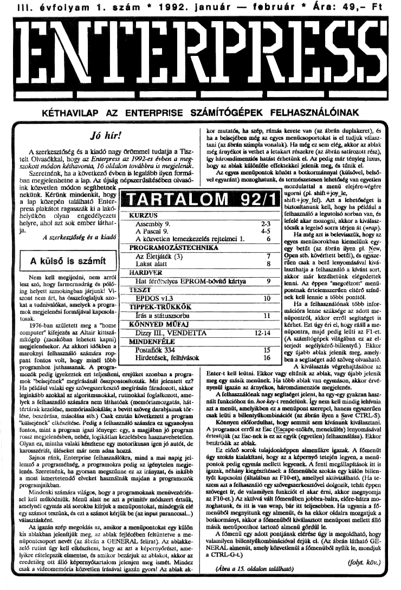

# Enterpress 1992/1 (1992.01-02)

[Оригінальний PDF](http://enterprise.iko.hu/magazines/Enterpress_1992-1.pdf) (угорською)

## Зміст

Jó hír!  
Assembly 9.  
A Pascal 9.  
A közvetlen lemezkezelés rejtelmei 1.  
Az Eletjáték (3)  
Lakat alatt  
Hat férőhelyes EPROM-bővítő kártya  
EPDOS v1.3  
Irás a státuszsorba  
Dizzy III.  
VENDETTA  
Postafiók 334  
Hirdetések, felhívások  

## Чернетка вмісту

"page-000.jpg" ------------------------------------------------------------ 
III. évfolyam 1. szám " 1992. Január — február ! Ára: 49,- Ft

ENTEKPKESS

92 tukonszttlNEN 72: e asmésszdadőtail sült tsz [ÜAEZZROSJŰN TVE SEEM REPESETT
KÉTHAVILAP AZ ENTERPRISE SZÁMÍTÓGÉPEK FELHASZNÁLÓINAK

Jó hír!

A szerkesztőség és a kiadó nagy örömmel tudatja a Tisz-
telt Orasókkat, hogy az Enterpress az 1992-es évben a meg.
szokott módon kéthavonta, 16 oldalon továbbra is megjelenik.

Szeretnénk, ha a következő évben is legalább ilyen formá-
ban megjelenhetne a lap. Az újság népszerűsítésében olvasó-

kor mutatós, ha szép, rámás kerete van (az ábrán duplakeret), és
ha a belsejében még az egyes menücsoportokat is el tudjuk válasz
tani (az ábrán szimpla vonalak). Ha még ez sem elég, akkor az ablak
még árnyékot ís vethet a letakart részekre (az ábrán tatírozott rész),
Úgy háromdimenziós hatást érhetünk el. Az pedig már tényleg lurus,
Hogy az ablak különféle effektekkel jelenik meg, és tűnik el.
Az egyes menüpontok között a botkormánnyal (külsővel, belső-
"vel egyaránt) mozoghatunk, és természetesen lehetőség van egyetlen
mozdulattal a menü elejérevégére

ink közvetlen módon segíthetnek
nekünk. Kérünk mindenkit, hogy
a lap közepén található Enter-
Press piakátot ragasszák ki a lakó-
helyükön olyan engedélyezett
helyre, ahol azt sok ember láthat -.

A szerkesztőség és a kiadó

A közvetlen lemezkezelés rejtelmei 1. 6
[/PROGRAMOZÁSTECHNIKA

ugorni (pl. shift 4-joy le,
shift-tjoy fel), Azt a lehetőséget is
biztosítanunk kell, hogy ha például a
felhasználó a legutolsó sorban van, és
lefelé akar mozogni, akkor a kiválasz-
tócsík a legelső sorra térjen át (wrap).

Ha még azt is belevisszük, hogy az
egyes menűsorokban kiemelünk egy-
jegy betűt (az ábrán ilyen pl. New,

45

Az Fletjíték 5)
Lakat alatt
HARDVER

A külső is számít

Nem kell megijedni, nem arról
Tesz szó, hogy farmernadrág és póló-
ing helyett szmokingban járjunk! Vi-
szont nem árt, ha összefoglaljuk azo-
Mat a tudnivalókat, amelyek a progra-
"mok megjelenési formájával kapcsola-
tosak.

1976-ban született meg a "home
computer" kifejezés az Altair kittszá-
mítógép, (zacskóban lehetett kapni)
megjelenésekor. Az akkori időkben a

TESZT
EPDOS vi 3

Postafiók 334
Hirdetések, felhívások

maroknyi felhasználó számára rop-,
Pant fontos volt, hogy minél több)

Hat férőnelyes EPROM -bővítő kártya

 TIPPEK-TRÜKKÖK
— rás a státuszsorba TT]
KÖNNYED MŰFAJ
[— Dizy I, VENDETTA Tt
[MINDENFÉLE

7 Open stb. kövérttett betűi), és egysze:
8.  rően csak a betű kivá:

taszthatja a felhasználó a kívánt sort,
akkor már kezdhetünk elégedettek
tenni. Az éppen "megcélzott" mend-
Pontnak értelemszerűen eltérő színd-
107 ek kell lennie a többi ponttól.

Ha a felhasználónak több ínfor-
mációra lenne szüksége az adott me.
nüponiról, akkor erről segítséget ís
kérhet. Bzt úgy éri el, hogy rááll a me.
nüponira, majd pedig ledti az Fl-et,
(A számítógépek világában ez az el-
§—[éerivát segélykérő-billentyű) Ekkor
1 egy újabb ablak jelenik meg, amely-
dá Peppers örventvepscásprdorsnt

TETT

Programhoz juthassanak A. progra-.

Mmozók pedig Igyekeztek ezt teljesíteni, erejüket azonban a progra.
mok "belsejének" megírásánál összpontosították. Mit jelentett ez?
Ha például valaki egy szövegszerkesztő megírásán fáradozott, akkor
leginkább azokkal az algoritmusokkal, rulinokkal foglalkozott, ame-
lyek a felhasználó számára nem láthatóak (memórinmozgatás, hát-
tértárak kezelése, memórínallokálás; a bevitt szöveg darabjainak tör.
lése, beszúrása, másolása stb.) Csak ezután következett a program
"külsejének" elkészítése. Pedig a felhasználó számára ez ugyanolyan.
fontos, mint a program igazi lényege: egy, a magjában jó program
rossz megjelenésben, nehéz, logikátlan kezelésben hasznavehetetlen.
Olyan ez, mintha valaki készítene egy motorikusan igen jó autól, de.
karosszériát, üléseket már nem adna hozzá.

Sajnos ránk, Enterprise felhasználókra, mind a mai napig jel-
lemző a programéhség, a programokra pedig az igénytelen megje-
lenés, Szeretnénk, ha gyorsan, megszűnne ez az irányzat, és inkább
a most ismertetendő elveket használnák. majdan a programozók
programjaikban,

Mindenki számára világos, hogy a programoknak menívezérlés-
el kell működniük, Menü alatt ne azt a primitív módszert értsük,
amelynél egymás alá sorokba kiírjuk a menüpontokat, mindegyik elé
egy számot tesznk, és ezt a számot kérjük be (az input paranccsal.)
választásként

Az igazán szép megoldás az, amikor a menüpontokat egy külön
kis ablakban jelenítjük meg, az ablak fejlésében feltüntetve a me.
nüpontcsoport nevét (az ábrán a GENERAL felirat). Az ablakke-
zelő rutint úgy kell elkészíteni, hogy az azt a képernyőrészt, ame.
yikre rátelepszik elmentse, és amikor bezárjuk az ablakot, akkor az.
eredetileg ott álló képernyólartalom jelenjen meg ismét. Mindez

sak a videomemória közvetlen írásával igazán gyors Az ablak al

A kiválasztás végrehajtásához az
Enter-t kell leütni. Ekkor vagy eltűnik az ablak, vagy újabb jelenik
meg egy másik menünek. Ha több ablak van egymáson, akkor érvé.
nyesül igazán az árnyékos, háromdimenziós megjelenés.

A felhasználónak nagy segítséget jelent, ha egy-egy gyakran hasz-
nált funkcióhoz ún. hor-kzy-t rendelünk. Így nem kell mindig lehívni
azt a menüt, amelyikben cz a menüpont szerepel, hanem egyszerűen
caak leti a billentyűkombinációt (sz ábrán ilyen a Save CTRL.§).

Könnyen előfordulhat, hogy semmit sem kívánunk kiválasztani,
A programot erről az Esc (Escape-szökés, menekülés) lenyomásával
értesítjük (az Esc-nek is ez az egyik (egyetlen) felhasználása), Ekkor
bezáródik az ablak.

Ez előző sorok tulajdonképpen almenükre igazak. A főmenüt
Úgy szokás kialakítani, hogy az a képernyő tetején legyen, a menü-
Pontok pedig egymás mellett legyenek. A fenti megállapítások ítt ís
Ígazak, néhány kiegészítéssel: a fömenűhöz szokás egy külön billen.
1yút kapcsolni (általában az FIO-et), amellyel aktivizálható, (Ha te.
Szem azt a felhasználó egy szövegszerkesztővel dolgozik, tehát éppen
Szöveget ír, de valamilyen funkciót el akar érni, akkor megnyomja
az FI0-et.) Az aktívvá vált főmendben jobbra-balra, előre-hátra mo-
Zoghatunk, és itt is van wrap, bár itt teljesebben. Ha ugyanis a fő-
menüből megnyitunk egy almenüt, és ha ekkor oldalra mozgatjuk a
botkormányt, akkor a főmenűlből kiválasztott menüpont mellett álló
másik menüponthoz tartozó almenü gördül le.

A főmenü egy adott pontjának elérése úgy is megoldható, hogy
valamilyen bilentyűkombinációval érjük el. (Az ábrán látható GE-
NERAL almenüt, amely közvetlenül a főmenüből nyílik le, mondjuk

a CTRL-G4)
köv
(Ábra a 15. oldalon található) AA

"page-001.jpg" ------------------------------------------------------------ 
2 Kurzus

INN NHETH [3]

1992. január — február

Assembly

9. rész

A nyolcadik részben elrejtett felhívás hatására valóságos levélő-
ön érkezett hozzám, így lelklekben megerősödve folytatom a sorozat

Igazából persze semmivel.
Sem lettem tájékozottabb agyon kevés konkrét kérdés
rkezett hozzám. Nem akarok a levelekre külön-külön válaszolal, de
Szeretnék néhány dolgot leszögezni: Meglehetősen nebéz (képtelen.
ég) az sssemblyról úgy sorozatot írni, hogy a teljesen kezdők és a
Profik számára egyaránt érdekes, tartalmas legyen. Igyekszem (igye-
kertem) az alapoktól elindulva Ismertetni az mscmabiy retelmet és

esek legyenek önállóan programokat, rutinokat írnl.
A sorozat nyolcnáik részében két program jeleni meg, Az első
program működése és tanulsága godolom mindenki számára vilá-
2 Az ott közölt második programhoz még hiányzik a magyarázat
A magyarázat után a grafikáról ealk néhány szó,
Így lesz gyorsabb

A program eleje hasonlít az elsőre. Az első érdekesség a
megelentésettő án, Eeben a megvidésben azt szerettem volna IL.
dusztrálni, hogy hogyan lehet helyet sprórolni: nem regiszterenként, ha-
nem regiszterpáronként adjuk meg a szükséges paramétereket, így né-
hány bájtnyi helyet nyerhetünk. Persze az EP nem ZXBI, van helyünk
bőven (7) a memóriában,

Programunk közvetlenül a videomemórába fog dolgozni, szüksé-

jünk van a megnyitott videolap kezdőcímére. Ez azt a Nick címet je.
lenti, amely a lap "bal-(első" pozíciója. Az EXOS 11-et Be3-mal
(GADDR) hívva, BC-ben visszaadja a videolap kezdőcímét, Szeret-
ém hangsúlyozni, hogy ez a cím mindig Nick-eímet jelenti A kapott
értékből nekünk kell eldöntenénk, hogy mi a Ím.

A szegmensszám meghatározásához egy ügyes trükköt használunk
tel. A Nick 64KB-os videomemóriát kezel, az első szegmens a 252-es,
az utolsó a 255-ös. Ha binárisan Abrázoljuk azt a Nick címtartományt,
"mely egy-egy szegmenahez tartozik. a felső két (b15 és BLA) bit visel:
kedésében a követi

ikezőket figyelhetjük meg (a b13-b0 biteket nem át
rázolva):

szegmens bi5 btá

252 o o

259 o 1

254 1 o

255 1 1

A bIS és a b14 tehát egyértelműen azonosítja az illető videoszeg-
menst, A két bitet kétszer balra mozgatva egy regis clőállítjuk
20,1.2 vagy 3 értéket, amihez már csak 252-t kell hozzásdni, és meg-
kapjuk a Ímot.

gy konkrét példa: Legyen az EXOS 11 útán BC-39413, Erról a
Nick címról kell lehát megtudnunk, hogy milyen szegmensre szik. Hac
tározzuk meg a high bájt értékét, Mivel 39413-245-.153"256, ezért a
high bájt 153-mal egyenlő.

AA 153 binárisan: 10011001. Számunkra csak a legfelső két bit ér-
dekes: 10b. Ha az alsóbb 6 bítet nultázzuk jük", azaz masz-
koljuk az eredményt 11000000b-sal), akkor az előbbi bináris értékből
csak ez marad: 10000000b, Most ezt az értéket kétszer balra rotáljuk,
Úgy az 00000010b (decimális 2) lesz. Ha most ehhez 252-t (a "bá
zisszegmens" értékét) adunk, akkor megkapjuk a címhez szeg-
mensszámot, ami 252. 25254 lesz. (Tényleg jól okoskodtunk, hiszen
439413 nagyobb, mint 32768 és kisebb, mint 49152, tehát a Nick 254-
€s szegmensén van.)

Hl-be töltjük (45-47) BC-t, ezt a szegmensszám meghatározása
követi. Elsőként (50) A-ba töltjük B-tartalmát, azaz a high bájtot. A.
kapott tartalmat kimaszkoljuk (52) a 11000000b értékkel, így csak
teleő két bit maradt meg, az alsó hat nulla lesz. Ezt követi a kétszeres
halra retálás CS3-Sú), A kapott eredményhez nem hezzázdjak 2 52.

biten elasevlak CS) lg A beket a sesgnemsáát ami be
törünk C7),

A kövelkező feladat, hogy a szegmenst a Z80-ra iapozzuk. Elő
kérdés, hogy melyikre? A program 2 CPU Pt és P2 lapján De mik

keres itt két szegmensnek megfekő tartomát ák el; hogy az
TÉK Nek etámék mondjuk 163832 ad visz. Éz a 152 tet
meat jelenti, de azon csak egy bájtot. Az általunk megnyitott videolap
további része már a következő 253-as szegmensen lesz, tehát a ruti,
megbízhatósága érdekében a következő szagmenat is belapozzuk majd.
Ezzet a megoldással nem kell ellenőriznünk. azt, hogy a kapott szeg.
menten ténylegesen hány bájt érhető el a vidoviap által meghatároz-
hoz képest, Felmerülhet újabb kérdésként, hogy mi van akkor, ha

2.255-öt kapjuk szegmensszámként? Semmi különös. P1-re lapozzuk a.

szel at
milyen Z80-as ik (Nick- jard
Tét széke ÉMETNI SES Ize;
TE e Tt
ESETET TES ETT
Nick címhez egy kellő ofszetet hozzáadunk, akkor az egy Z50 címet
STT ek
TETSZ EE e E]
ESNE Tet ke
Este LETE NESZAET elé e
BE KÓ He lez KETTÉ
SERT
Biz én se NT szk EMT ESET
Elme ásás e suzeal
ís, de vélet szerint így  olvashatóbb a lista.) gi
BLAST ált ét egee tol
ESSENEK
Ezeket a címtranszformációkat külön rész végzi (60-74). A-ban a
mezt e ENE öz I SEKSÉLETT
TESSEN LETÉT nélk
ESZES EK Ete
IEEE ÁSz lee át zá klete
FELÉ eg TELS ő
Eegen S rzizteeet
Keze E SEK ET
EE á aZ
MáLSZ E Keke a án MET T
vsz
SERELE ötre metáterozat sose
dee íaé lk metszet lááEE
OTET
lets

GES TT ÉT A
szel zt Ko ettá
ETET TÉZOETÉ e

keités életet él a rutinban: egyrészt a megjelenítendő karakter kódját
hordozza másrészt a yei 0 ciklust tartja, kezében. Először (87) az
akkumulátorba nullát röltűnk (XOR A? Hogy ís lehet ez? Tessék r4-
Jönni!) Ezután HL tartalmát (Z50-as lapkezdőcím) a veremre tesszük
(88), ez egyben a legkülső (csel 0) ciklus első utasítása.

D-be az Y-méretet (89), É-be az X-méretet (90) töltjük, ez utóbbi
s zközépsőn ciklus (eye 13 belépési pontja, Tulájdonképpen B darab
karaktert teszünk Ki D.ázet.

A belső ciklus (cyel. 2, 91) első utasítása letölti a karakter kódját
a HL által címzett címre: Ezután növeljük HL.t (92), így az már a
Következő pozíciót címzi, Csökkenteni kell a cikmusszámtálót (93). Ha
még nem érte el a nullát (94), akkor folytatódik a karakterek kirakása.

Ha a belső ciklus leftott, akkor a ciklus szármlátójának
értékét csökkenti (95). Nem nulla érték esetén visszamegy cyel. 1-hez,
feltölti E-t, majá kirak egy újabb sort. Természetesen közben FL tar:
talmának folyamatosan kell növekednie. Ha Gyei 1 ís lefutott, akkor
gy adott karakterrel feltöltöttük a teljes Előíról kell kez-
deni, így a kezdőcímet felvesszük a veremról HL-be (97), majd növel-
jük a azaz a külső ciklus számlálóját, Ha ez nem érte
el a nullát, akkor a külső ciklus újra lefut, az összes belső ciklusokkal
együtt, Ha az akkumulátor eléri a nullát, akkor vége a cikiusoknak, így
a megjelenítés végrehajtásának.

Már csak rendet kell raknunk magunk után (102-I05) visszaátít-
uk sz eredeti szegmenskácsztánt, majd pedig lezárjuk a vilegesatormát,

Ha elindult a program, akkor az elsőnél lényegesen nagyobb se-
bességgel jeleníti meg a teljes karakterkészletet.

Az első grafika
Az Listán látható. Jelenti első grafikus próbálkozásunkat.
Az előző példára hívatkozva szeretném telhi

lt hgazt Eanéver ázéveges tatmódban CTEKT 1,
egén jelentek meg a fárakterek, Ennek kezelése retdkívl egyszerű,
FE vimenétaeg B emtreimége megatánt eg tsak

sért zés KETSÉS kise

jek azért nevezhetjük,
Bizonyára mindenki megfi-
yelte már, hogy

(kivéve az 1S-DOS-1). Ennek pontosan a képernyőtípus sajátossága az

"page-002.jpg" ------------------------------------------------------------ 
1992. január — február Kurzus 3
kar ha szöveges képernyőnek szeretnénk használni, akkor nem tudjuk.
jpeg megneltani men úgy kelene imegprozumoznin mintha ér.
kus képernyők lenne. Ezért aztán a programozók vagy a handver-sző-
vegen targy Peleg erattkas képernyők vloszinak,
A titán olyan Táthatunk, amely megnyit egy nagyíel- ] ] 62 segpage mdd hide FHL-ben P2-es cím
bontású, kétszínű grafikus videolapot, amelyre felrajáol egy kifestett ] 68
kört, majá ezt a kört 200 ponttal balra scrollozza. Sok dolgot kell ezzel) [64 ld ex sízetZty sízet9-t
kapcsolatban elmondanom, ezért ennek értelmezése a következő rész- 65 add hí de
re marad, addig gondolkozzon mindenki a működésén (home work) 66
Nenány dolgot el kell árulnom, az Asmon hibájából: a programot csal 67
úgy eze; nm será programmá fordítjuk, és új alkal- Hi
mmazói magjai
dolyatjuk) [A tres
Hé]?
s 3 y -ben a szegn.volt
Hi 8 COB1h) a teti
! ora 0100 Rk 88 tiszte
Hi mn hhe a
Hi kej 09£ COR3hI a
; B éa Elle
c ss
H Felőlááell Hi
10 4 1d bv.sizet9
11 85 cyellt or a
12 86 (d ex sízetz
bi 87 eyel2 rl (ÁLT
16 88 dec hi
ú 90 Ír neseyet 2
k B em HEzette
nt dinz eye
19 E lllÉ Li vál
Fi 95 r-side id depxsízetz
25 14 agvtd Hú Set 0,éhL)
Fi ace 99 §bc hide
26 Ld ayvehan 109 ret
25 102 cend pop hi
§ 105 Pop be
Hi 104 dinz exel 0
8 108 vi
H) 187 at Cst ,a
§ 188 AE cösztb va
Hú Hi ELÉ LÖBSND a
h 115 loop Jr Loop
HA 14
at 115. vid
44 116
bj TIT seg
pri 118
45 fc 119
FA 120
F:j Hi
48 122
28 123 sealen
50 cp 255 126
52 da gerszték 6 "ret
53 seg256 ep 254
5 (a der
56 segzsz ep 288
s TT; szegesesz
58 4 d670
59 seg252 cp 252
FH 7 az, segpoge
1 d dort
ú Fizessen elő a A
Hobby Elektronika ss a Rádiótechnika
folyóiratokra! Így biztosan mindig hozzájut!
A cím: 1374 Budapest, Pf. 603. Tel.: 117 - 0262
( A szerkesztőségben regisztrált HE előfizetőknek ingyenes nyák-film melléklet.  )

"page-003.jpg" ------------------------------------------------------------ 
4. Kurzus

DYNHETSZET HETE

1992. Január — február

A Pascal

9. rész

A beépített függvények és eljárások
A függvények egy része a bemenő paraméterével azonos típusú
eredményt ad, sok függvény különböző típusú paramétereket is elfo-
824. Más függvények típusa eltér a bemenő paraméter típusától; sót,
€gyes függvények célja kimondottan a konverzió egyik típusból a má-
síkba.
Ez megnehezíti a tárgyalásukat, osztályozásukat, Megpróbáljuk a
Tehetetlent, a lehető leglogikusabb csoportosítást,
Jelölések
A függvények és (eljárások) paramétere általában konstans, változó
vagy kifejezés lehet. Egyes esetekben a paraméter csak változó lehet,
czt mindíg jelezzük. A paramétert helyettesítő kisbetű jelzi a paraméter
típusát:
1: egész (integer)
T: valós (roa)
6 : karaktor (char),
s: string
b : logikal (booloan)
1: file (vagy texg
X: a paraméter többféle típusú lehet.

Egész eredményt szolgáltató Megvények:

ABS( ii) : az i egész paraméter abszolút értéke

SORCii ) : az egész paraméter négyzete (nem négyzetgyőke!)

TRUNC( r ) : az r valós paraméter egész része, azaz a törtrész
elhagyásával keletkező egész szám

ROUNDY r ) : az r valós paraméter kerekítéséval keletkező egész
szám (0-tól 0.5-ig lefelé, onnantól felfelé kerekít)

PI.

ABS( 1 ) eredménye 1; ABS( -2 ) eredménye 2

SOR( 3 ) eredménye 9

TRUNC( 39 ) eredménye 3; TRUNC( -39 ) eredménye -3

ROUND( 39 ) eredménye 4; ROUND -3.9 ) eredménye 4.

E két függvény jelentőségét az adja, hogy míg minden egész szám-
nak megfeleltethető egy vele azonos matematikai értéket képviselő va-
Jós szám, addig ugyanez visszafelé már nem igaz: a valós számok csak
kis töredékének felel meg valamilyen egész szám, még akkor is, ha a
valós érték egyébként az ábrázolható egész számok tartományán belül
van. Ez azt jelenti, hogy egy egész kifejezést mindig értékül adhatunk
egy valós változónak (az ehhez szükséges típuskonverziót a fordító-
Program önmagától előállítja). Viszont a fordított esetben, tehát ha
egy valós kifejezést akarunk értékül adni egész változónak, abban az
esetben, ha egyáltalán az értékadás végrehajtható, minden esetben meg.
kell mondanunk, hogy milyen konverziót kívánunk végrehajtani: a ki-
Tejezés egész (vagy csonkított) értékére, vagy pedig kerekített értékére
van-e szükségünk, Tipikus példa lehet egy rajzoló program, ahol a gör-
be pontjainak koordinátáit nagy valószínűséggel valós értékekkel szá-
moljuk, a rajzoláshoz viszont egész képpont-koordinátákat kell meg-
adni. Ha itt csonkított értéket használunk, a görbe jobban torzul, mint-
ha kerekítést alkalmaznánk.

Egész típusú paraméterrel is használható a következő két függvény,
amelynek bemenő paramétere bármilyen sorszámozott (azaz egész,
résztartomány vagy felsorolási, vagy karakter) is lehet:

SUCC( x ) eredménye a sorozat következő eleme

PREDC( x ) eredménye a sorozat előző eleme

PI.

SUCCK( 3 ) eredménye 4; PREDK 3 ) eredménye 2

SUCC( A! ) eredménye "B"

€5, feltételezve a

TYPE

NAP a ( hétfő, kedd, szerda, csütörtök, péntek, szombat, vasár-

nap)

deklarációt,

SUCC( kedd ) eredménye szerda

PREDK kedd ) eredménye hétfő

viszont SUCCK vasárnap ) és PRED( hétfő ) eredménye megha-
tározattan.

Teiszőleges felsorolási típusú, illetve karakteres típusú érték típu-
son belüli sorszámát adja vissza az ORD függvény. Karakter típusú
paraméterrel így a BASIC ASC függvényével egyenérték, de sokkal

általánosabban használható.

ASCII kódkészletet feltételezve,

FORD( "A" ) értéke 65,

ORDC( "a" ) értéke 97,

És az előző deklaráció érvényességén belül.

ORDK hétfő ) értéke 0,

ORD( vasárnap ) értéke 6.

Kizárólag karakter típusú eredmény esetén az ORD függvény in-
verze a CHR r

"CHR( "65 " ) eredménye "A", és így

CHR( ORD( "A" ) ) eredménye "At,

Az ODD függvény eredménye logikai (BOOLBAN) típusá: ha
egész paramétere páratlan, a függvény értéke TRUE (igaz), páros
Szám vagy nulla esetén pedig FALSE (hamis).

A függvények egy külön csoportját alkotják a matematikai függvé-
nyek. Ezek és értéke is valós.

Már ismerjük az egész típusú ABS függvényt. Nos, az ABS( r )
tüggvény valós paraméter setén valós értéket szolgáltat. Ugyanez ér-
vényes az SOR függvényre is. A valós paraméter négyzetgyökét az.
SORTT r ) függvény adja.

A SIN( r ) függvény a valós paraméter szinuszát,

"a COS( r ) függvény a valós paraméter koszinuszát,

az ARCTÁN( r ) függvény a valós paraméter arkusz tangensét adja
meg, Ezek a leggyakrabban használt trigonometrikus függvények; a
többi értékét szükség esetén ezekből már kiszámíthatjuk.

Az EXP( r ) függvény az e alapú eeponenciális függvény Ce az
T-edik hatványon") megfelelője.

Az LN( r ) fűggvény ennek inverze, tehát az e alapú logaritmus
függvénye.

A bevitellel és kivitellel kapcsolatos eljárások és
függvények

A most következők, sajnos, nem vonatkoznak a HISOFT-PASCAL
implementációra, mivel az - a SPECTRUM-tól örökölve - nem tartal-
maz file-kezelést. A Turbo. Pascal viszont teljes mértékben megfelel a
leírásnak, sőt, további szolgáltatásokkal teszi még könnyebbé a file-ke-
7elést.

A bevítel és kivitel tárgyalásakor röviden áttekintettük a két alap-
"vető (és igen ritkán használt) bevíteli-kiviteli eljárást, a GETC £ ) és a
PUTCf) eljárást. Említettük az inkább használatos READ és WRITE
eljárást ín, Ezek már változó számú paramétert ís elfogadnak, így hasz-
nálatuk igen kényelmes. Általános alakjuk:

READ (, pl, p2 .. pn ) és

WRITE [, pi, P2 -- pa ).

A file-kezeléshez tartozik még néhány eljárás és függvény:

Az ASSIGN( f, s ) eljárás az ( file-boz az s atringben megadott
fle-nevet rendeli hozzá. A file ezután már megnyitható frásra:

REWRITE( ()

vagy - feltéve, hogy a file létezik - olvasásra:

RÉSET([).

Az olvasásra megnyitott filet nem kell lezárni, de az írásra meg-
nyitott file lezárását nem szabad elmulasztani, hiszen ekkor kerül ki
ténylegesen a háttértárra vagy perifériára a file utolsó darabja, illetve
kkor íródik felül a file katalógusbejegyzése a merevlemezen vagy a
oppyn. A lezárást - Turbo-Pascalban " a CLOSEK ! ) eljárás végzi.

Ölvasáskor a file végét jelzi a logikai (boolean) típusó EOF( £ )
üggvény, ez igaz (TRUE) értéket ad, ha a következő elem már nem
beolvasható, mert elértük a file végét. Ennek alapján egy file másolását.
a következő programvázlat mutatja:

TYPE

ALAPTIPUS : CHAR ( vagy tetszőleges más típus );
FI, F2 : FILE OF ALAPTIPUS;

VAR

PUFFER : ALAPTIPUS;

FNAMEL,

FNAMEZ : STRINO[ 40 ];

TNAMEI :— "FLDATJ FNAMEZ :a "F2.DATT ( vagy más mó-
don adunk nevet )
ASSIGN( FI, FNAMEI ); RESET( FI);
ásra)
ASSIGN( F2, FNAMEZ ); REWRITEK FZ ); (megnyitjuk írásra)
"WHILE NOT EOF( FI ) DO BEGIN
REAL FI, PUFFER ) WRITE F2, PUFFER );

( megnyitjuk olva-

"page-004.jpg" ------------------------------------------------------------ 
1992. január — februl

END ( WHILE );
CLOSEK F2 );

Bár a szöveges információ a FILE OF CHAR deklaráció segftsé-
ével ís kezelhető lenne, a Pascal bevezet egy teljesen új típust a szö-
veges file-ok feldolgozásához. Ez a típus a TEXT. Példáub

TYPE

T: TEXT

A TEXT típus nem azonos a FILE OF CHAR típussal; A különb-
ség az, hogy a TEXT típus, amellett, hogy természetesen karakterekből
II, nagyobb egységekre, rra osztható, Tudjuk, hogy fizika-
ílag a szövegsorok végét CR és LF karakterpáros jelz. A TEXT típus
használatával szonban ezt a CR-LF karakterpárost a programozó nem
látja, a nyelv más módon, sokkal kényelmesebben jelzi a sorok végét.

Egyrészt a TEXT típus esetén a READ és a WRITE eljárás mel-
lett használható a csak erre a típusra érvényes READLN és WRI-
TELN eljárás is, Ezek teljes alakja

READLN( (, pl, p2 -. Pn )

WRITELN( f, pl, pZ2 .. Pn)

A READLN eljárás beolvassa a paraméterlistájában megadott ele.
eket, majd az aktuális sor végét átugorva, új sor elejére ált (azaz
átugorja a következő CR-LF karukterpárost).

A WRITELN eljárás kiírja a paraméterlistájában szereplő eleme:
ket, majd új sorra ugrik (azaz a file-ba ír egy CR-LF karakterpárost).

A sorok kezelését könnyíti az BOLNC f ) függvény, ez igaz (TRUE)
értéket ad, ha az olvasott file-ban éppen sor végéhez érkeztünk.

A szövegfile tagolását segíti a PAGE f ) eljárás, amely új lapot
kezd a file-ban, azaz a további kiírás új lapra kerül. Ennek elsősorban
nyilván nyomtatásra szánt szöveg esetén van jelentősége. Fizikailag
ilyenkor a file-ba általában egy FT (form fccd) karakter kerül, ez a
nyomtatónál lapdobást vált ki.

A Pascal, a többi programozási nyelvhez hasonlóan, a perifériás
készülékeket - a billentyűzetet, a képernyót, a nyomtatót stb. - szintén
file-ként kezeli. A Turbo-Pascal például a következő készülékneveket
fogadja elt

CON: A rendszerkonzol, általában a képernyő és a billentyűzet.

KBD: A billentyűzet, csak bemeneti eszköz.

TRM: Terminál (képernyő), csak kimeneti eszköz.

CST: Valamilyen listázó eszköz, általában nyomtató,

AUX: Valamilyen külső eszköz, pl. Iyukszalagolvasó vagy -lyúlkasz-

USR: A felhasználó által definiált eszköz.

A CON: eszköz pufferelt és echózott be- és kivitelt valósít meg,
azaz a billentyűzeten beírt karakterek megjelennek a képernyőn, és
mindaddig nem kerülnek be a befogadásukra rendelt változóba vagy
változókba, amíg meg nem nyomjuk az ENTER billentyűt. z azt je-
Tenti, hogy addig javíthatjuk az esetleg hibásan bevitt szöveget.

A KBD: eszközről ténylegesen karakterról karakterre tudjuk az
információt bevinni, és s beírt karakterek nem jelennek meg a képer-
nyőn.

Ezeket a készülékneveket ugyanúgy használhatjuk, mint bármilyen

ASSIGN( F2,"KBD:" ); RESET( F2 );

Van azonban egy még kényelmesebb lehetőség a készülékek hasz-
nálatára. A Turbo-Pascal mindegyik készülékhez hozzárendel egy előre
definiált - TEXT típusú - változót. Ha ezeket használjuk, nincs szükség
Sem az ASSIGN, sem pedig a REWRITE vagy a RESET eljárás hasz-
nálatára, ezek a file-ok automatikusan menyítódnak a program indítá-
sakor. Ezek a file-azonosítók a következők:

CON, KBD, TRM, LST, AUX, USR

és értelemszerűen mindegyik a hasonló nevű készülékhez van hoz-
árendelve.

A szalványos Pascalban - és a Turbo-Pascalban ís - létezik még
két előre definiált file, az INPUT és az OUTPUT file. Mindekettő
Általában a rendszerkonzolhoz, tehát a billentyázet-képernyő együttes-
hez van hozzárendelve. Ez a két file jelenti a rendszer szabványos be-
menetét és kimenetét; ez annyira így van, hogy ezt a két file-t használva
a nevek maguk elhagyhatók, Ennek értelmében

READ(X) megfelelője READ( INPUT, X )

READLNCX ) megfelelője READLN( INPUT, X )

WRITE(X ) . megfelelője WRITE( OUTPUT, X )

WRITELN( X ) megfelelője WRITELN( OUTPUT, X )

Ez rendkívül leegyszerűsíti az alapszintű be- és kivitelt.

A TEXT típus használata esetén a Pascal egy óriási segítséget ad,
2 az mutomatikus konverzió. A READ, READLN, WRITE és WRI-
TELN eljárás ugyanis nemcsak karaktereket tud olvasni vagy írni, ha-
nem numerikus (egész és valós) értékeket, sőt, kiíráskor logikai (boo-
Ten) típust is használhatunk. A numerikus-karakter konverzió és el-
tentettje olyan természetes számunkra, hogy meg sem fordul a fejünk-

ben, hogy ez bizony valóban könverzlő: a 123 egész érték kiírásakor a.
file-ba a "IG" karaktersorozat kerül; a file-ban található "1.2 karak-
ternorozat beolvasásakor a READ (vagy READLN) eljárásban meg-
"adott valós változóba az 1,2 valós érték (pontosabban, egy ehhez igen
közeli érték) kerül.

A WRITE és a WRITELN eljárás további lehetőséget ad. ennek
a konverziónak a befolyásolásához, ez a formátumvezértés. A Pascal
Formátumvezértése rendkívül egyszerű, ugyanakkor hatékony. A kic
írandó kifejezést (változót, konstanst) kettősponttal elválasztva egy po-
7ilív egész eredményt adó másik kifejezés (változó, konstans) követi.
A második érték neve mezőszélesség, és nevéhez híven a kiírási mező
Szélességét adja meg, azaz azt, hogy a kiírás hány karakter szélességű
legyen. Ez a formátumvezérlés alkalmazható a numerikus egész,
Takter, a logikai és a string értékek kiírásához, valamint a valós érté.
kekhez is, ha megfelel a lebegőpontos (exponenciális, normálalakú)
megjelenítési forma.

Ha nem adunk meg formátumvezérlő információt, a Pascal minden
értéket annyi karakterrel Ír ki, amennyi ehhez minimálisan szükséges.
A valós értékeket ekkor lebegőpontos alakban írja ki, az értékes jegyek
Számát az adott gépi reprezentáció határozza meg, Az ilyen "szabadon
hagyott" kiírásnak az a hibája, hogy az egyes értékek egymásba folynak,
nem lehet azokat egymástól megkülönböztetni. Például a

WRITELN( 1, 72, 3, TRUE )

eljáráshívás eredménye

I23TRUE

Ami nem túl szerencsés. Javíthatunk az eredményen így.

WRITELN(I1,"77" 3.7 TRUE)

agy pedig így:

WRITELN( 1. "253." TRUE )

mindkét megoldás eredménye

123 TRUE

A formátumvezérlést alkalmazva azonban a különböző hosszáságú
eredmények is oszlopokba rendezhetők.

WRITELN(1:472:4,3:4, TRUE: 6);

WRITELN( 11 : 4, "22 : 4, 33 : 4, FALSE : 6 );

WRITELNC II : 4, "222 : 4, 338 : 4, TRUE: 6 );

hatására a három számjegy mindegyike egy-egy négykarakteres me.
26 jobb szélére igazítva jelenik meg;

a 3 3. TRUE
11 22 33 FALSE
a 222 483 TRUE

A valós értékek kiírása, mint már említettük, exponenciális formá.
ban történik, így

WRITELNK 3.14159265358 : 8 )

eredménye

314E400

Ha inkább fixpontos formában szeretnénk látni a valós értéket,
akkor alkalmazzuk a formátumvezérlés másik alakját, amelyik egy to-
vábbi értéket ad meg, a mezőszélességtől ugyancsak kettősponttal e:
választva. Ez az érték a kiírandó tört jegyek számát adja meg;

WRITELNK( 3.14159265358 : 8: 4)

eredménye

31415

Ha csak az egész jegyekre vagyunk kíváncsiak, egyszerűen 0-t
adunk meg.

Ha a bármelyik érték nem fér el a számára ily módon előírt helyen,
különböző Pascal implementációk eltérően viselkedhetnek. Míg a
nyelv eredeti leírása szerint ilyenkor az értékből csak annyi jelenik
meg, amennyi a számára előírt helyen elfér, nem törődve azzal, hogy
így csetleg téves értéket kapunk, a Turbo-Pascal ilyen esetben kitör a
kortátok közül, és önkényesen annyi pozíciót használ fel a kiírásra,
amennyi ehhez minimálisan szükséges; azaz, mintha nem ís adtunk vol.
na meg formátumspecifikációt,

folytatjuk.)

-UL-

—-—— Tisztelt Honfítársainki
Hazánk négy tájogységében
— műödtetünk helikoptert A re.

ALAPÍTVÁNY gjonális központok kialakításá-

dikopter beállítása szükséges, A

iberi életek mentése nem olcsó,

il egyre több életet tudunk meg

menteni, és ez mindent megér. Az Aerocaritas Mentőszol-
§ólat emberek akaratából az emberért munkálkodik.

Számlaszám: POSTABANK RT. 289-98941/026-00321

"page-005.jpg" ------------------------------------------------------------ 
1992. január — február

A közvetlen lemezkezelés rejtelmei

1.rész
Az LPT sorozat befejezése óta nem sok újdoságot olvashattak az íga-

án profi Mo azonban, ismét ítt van egy
olyan téma amelyben az ?RISE legnélyebb lelkivilágába próbál-
juk elvezetni a bátrabb

Azt általában minden lemezegységgel rendelkező tudja, hogy a

kontrolter-kártya agyát egy WD1710-es vagy újabb változatokban
WDITTEes Noppy diak koniroller cp alkolja, De ezen IC közvetlen
Programozását már kevesen ismerik, ezért most erról lesz szó.

JA WD1770 egy 28 Iábú DIP tokozású NMOS alapú integrált áram-
kör, amely az egy. és kétoldalas -k meghajtására egyaránt
sitalmas de csak szimpla és düpa rűrségő feletara képes Till nor
múl ereiben, muzimum 500 Ktájtos lemezeket képes kezelni, A
WDI772 sak annyiban különbözik a 1770-estől, hogy gyortabb az
írófolvasó fej léptetése. Ennyi bevezető után rá is térhetünk " lényegre,
vagyis a programozásra.

A kontrollerrel négy írhatófolvasható porton keresztül lehet kom-
munikálni, ezek sorban a következők:

Olvasás

Th —— Átapot rögiezter.
An — Irmek regisztet ér
42 — Szektor regiszter.
An — Adat regiszter

Trásnál:
10h — Parancs regiszter;
11h — Trmek rogisztar 4
12h — Szektor regiszter, 4
ah — Adat regiszter.

Ezeken kívül van at amely a kontroller-kártyáboz tar:
ozik, a TÉN port, eme Kesználetáról Késöbb tesz szá, ugyanis ez nem

a WD1770-a közvetlen portja. A kiadható parancsok a következők

fi

Emmmmmeceze
500vo11222
50002033338

A táblázatban használt betőjelzések jelentése:
hm Molor bekapcsolás jolző.
HO, Folpörgetési folyamat engedélyezve.

Az állapotregiszter bitjeinek jelentése:
57 — Motor bekapcsolt Allapotának jelzése. Ha a bit 1-en, a drive

Do SÓ frárédelem jelzése. A bit 1-es Álapotó ha írásvédett lemezre.

veljezálet sgt Br
No EEG ási MEA Ban
E ir

mutatja, 0 Normál adatjetzén, 1 —törölt adatjelzés;

BA macko nem Ülálhutó, 1-es értétel vesz fel ha a keresett
track-et, szektort vagy oldalt nem találja.

13 CRC ib Beáltott állapot, ha adathibát talált,

52 :— AdatvesztésíTrtek 0. Fejléptetési paragcsoknál jel, hogy a
aj a éli adren vasa (SI) vana HÖK Cate; lé MÖNÉET.
Ten a ndiveszés történt (nem lett kola az adat mire a követ.

"megérkezett vagy nem lett beírva az adatregiszterbe időben).

BI Adat kérér Olvasáskor jelzi (m1), hogy kiolvasható a bájt
az ndatrogiezterből, íráskor beálítva, ha belfható a következő bájt

10 Fogjalaég jelző, 128 értékű ha a parancs végretajtás alatt

A lemezműveletek használata a következő, a megfelelő parancs
kódját be kell írni a WD parancsregiszterébe a 10h porton keresztül.
Fzt csak akkor lehetjük meg, ha az állapotjelző bájt 0. bitje, vagyis a
foglaltság jelző törölt állapotú. A művelet befejezése után a státuszbájt
Kiolvasásával ellenőrizheijük, hogy a folyamat hibamentesen zajlott-e
Te vagy, hogy milyen hiba történt, Mosi pedig következzen az egyes
Parancsok részletes leírása.

I. Fejmozgató parancsok
Ezen utasítások mindegyikénél a parancsbájt alsó két bítje adja.
1meg,a fejtéptetés sebességét, vagyis hogy két léptető impulzus kindása
Az sgtazáts are ergo
al Parancs
szüksége, hatására az írófolvasó fej a 0-ás sávra áll be. A művelet be-
fijenétel a imeleretleter nullázódik. 1;
ionáló parancs kindása előtt a track regiszterbe az aktus
1rack számát kell beírni, az adatregiszterbe pedig a beállítandó sáv szá.
mát. Az utasítás befejeztével a fej a kívánt sávon fog állni és a track.
regiszter is ezt az értéket fogja tartalmazni,
A léptetés parancsai egy pozicióval léptethetjük a fejet abba az
amelyet utoljára használtunk. Az uval jelzett bittól függően a
a rmelurezisztant is beálitja.
A fej befelé léptetésével a nagyobb számú sávok felé, a kifelé lép.
xtetéssel a 0ás sáv felé ép a fej, Nt szintén az u bit állapotátál függ,
hogy a track-regisztert ís növellfezőkkenti vagy sem.

II. Szektorműveletek

Szektor írási és olvasási utasításoknál a parancskód kiadása előtt
be kell állítani a fejet a kívánt sávra, majd be kell írni a szektor-regjsz-
terhe a megfelelő szeklor számát. Áz E bit állapolátol függően a pa.
taps kiadása után vagy azonnal megkezdődik a végrehajtás vagy egy
307ms-os késleltetés után. Ha nem találja a megcélzott szektort, akkor
szektor nem található hibával befejeződik a végrehajtás. Ha az m bit
beállított állapotú, akkor az frásjolvasás nem csak egy szektorra vonat-
kozik, hanem egészen addíg tart amíg a sávon található legnagyobb
számú szektor B sorra kerül.

Szektor olvasásakor az egyes bájtokat az adatregiszterből lehet ki-
olvasni. Azt, hogy készen áll-e a bájt a kiolvasásra az állapotbájt 1-es
bijebő lehet meítapítani, Ha ez a Bit egyes akkor, kiötastató sz
adat, klolvasás után a bit törlődik, és az ís marad míg a következő bájt
Készen nem lesz. Ha egy adatbájt nem kerül kiolvasásra a következő
táj megérkezéséit akor sz álapottájt 2 bije bedlítottálagotává

li ami az adatvesztést jelzi, de a beolvasás ekkor sem szakad mer.

Szektor Írásakor a parancs kindása után az adatrogiszterbe kell sor.
ban befni az adatokat amit a lemezre akarunk (rni. Az állapotbájt 1-es
bitjének beáliított állapota jelzi, ha küldhetjük a következő adatot, Ha
nem írjuk be a bájtot az adat időben akkor bedlíított lesz
az adatvesztés jeizőbit és a lemezre 0-ás bájt kerül kiírásra,

A cím olvasási parancs a szektor olvasáshoz hasonlóan működik,
de ítt nem lehet megadni szektorszámot, hanem a legelső megtalált
Szektorszonosító blokkot lehet beolvasni. Egy ilyen blokk 6. bájt
hosszúságú, és a következő adatokat tartalmazza:

§ bál — Track száma. (0.79)

snak semmilyen más adatra nincs

2. bált — Lemezoldal száma. (0-1)
3. bált — Szektor száma. (0.255)
4. bált — Szektor mérete. (09)
5. bát — CAO 1
6. bált — CRC 2
A szektorméretek az alábbiak lehetnek:
00 — 128 bájtos szektor
91 — 256 báltos szektor
02 — 512 bájtos szektor
09 — 1024 bájtos szektor

IBM formátumú lemez mindig 512 bájtos szektorokat tartalmaz.
Ez a funkció a fejpozicionálás ellenőrzésére használható.

folytatjuk.)
-DEVIL-

"page-006.jpg" ------------------------------------------------------------ 
1992. Január — február

Programozástechnika 7

Az Életjáték (3)

(Folytatás az előző számból)

Már majdnem készen csak azt kell eldöntenünk, hogy mit
jelentsen a SOROKON-VÉGIG és az OSZLOPOKON VÉGIG. Mi-
"el a táblázat legszélén a SZOMSZÉDOK függvény nem működik (ki-
Jég a lóláb, akarom mondani, az index az indezhatárból), a LÉPÉS
célszerűen n második sortól és oszloptól az utolsó előtti sorig és osz-
Topig megy majd. Mielőtt elhamarkodnánk, definiálunk néhány kons-
tamat:

CONST,

SORSZÁM a 24;

OSZLOPSZÁM — 38;

Első próbálkozásként alkalmazkodunk a megjeleníthető mérethez,
nem elhanyagolva keserű tapasztalatunkat, hogy az utolsó két oszlopot
az EDITOR nem szereti", esetleg átviszi kedves sejtjeinket a követ
kező sorba. Később úgyis rájövünk, hogy ez az élettér komolyabb kon-
figuráció esetén kevés, akkor csak ezt a két konstanst kell majd mó-
dostani. Akkor viszont majd ügyelni kell arra, hogy mi látszik az 4b-
Fából

Erről eszembe jut, hogy jelenleg semi sem látszik. Kacérkodunk
"a gondolattal, hogy esetleg egy kettős ciklussal minden LÉPÉS után
végigsöprünk az aktuális táblán, és kirajzoljuk a képernyőre a
mát, Ez persze rettenetesen lassú, lenne. Azután eszünkbe jut, hogy
egy-egy lépés során a konfiguráció nem nagyon változhat, hiszen min.
der sejt csak a közvetlen környezetére gyakorol hatást. Ezért úgy dőn-
tűnk, hogy mindig csak a változást rajzoljuk, ehhez pedig (bár progra-
mozói énünk — helyesen — berzenkedik ellene) a rajzolást becsem-
Pésszük a FÜGGVÉNY függvénybe (ott ugyanis mindig tudjuk, van-e
változás), Emiatt a FÜGGVÉNY paraméterei kibővülnek a sor- és az.
szlopkoondinátával..

"Ha az ELŐKÉSZÍTÉS eljárás KEZDŐKONFIGURÁCIÓ részé-
be beleügyeskedüínk egy egyszerű kezdő ábrát, nem feledkezve meg
annak kirajzolásáról sem, akkor egy Pascal-szerű nyelvet használva
Szinte változtatás nélkül indíthatnánk a programot; ha beziklábasan
(bocsánat, BASIC-ben) dolgozunk, akkor viszont egy kevés kódolási
munkával az alábbi programhoz jutunk;

100 PROGRAN "LIFEGAME.BAS"

110 NUMERIC SORSZOSZÜSZ

120 LET SORSZ526:LET OSZLSZ-38

130 NUMERIC E(1 TO 26,1 TO 38)

160 NUKERIC FCI TO 26/1 TO 38)

150 NUMERIC SORI , SORZ, OSZL 1, OSZL2

160 LET SORTST:LÉT SORZSSORÉZ:LET OSZLT-1t
LET OSZLZSOSZLSZ

170 NUMERIC 0

180 LET az

190 DEF KEZD

200 NUKERIC I1,dd

210 FOR IT-1 TÓ SORSZ

220 FOR JJ! TO OSZLSZ

250 LET EGT dd
240 LET FCIT,d4)20
250 NEXT 44

260 NEXT IT

270 LET EC 3Je1:LET ECS,4)e:LET EC3,5)et

280 PRINT AT 3,3rneven;

290 END DEF

300 DEF SZOMSZ(S,0)

10 1F 00 THEK,

520 LET SZOMSZE(E(S-1,0-1)9E(S-1,0)6
ECS-1,OPIJSEC$,0-19,
ECS91,0-1)9ECSET,OJSECSE1,091))

330 ELSE

MD LET SZOMSZE(F(S-1,0-1)6F(S-
FCS-T,OYTJSECS 0-1 SEC ÓH)
FCSETJ0-TJSFCSS1,OJSFCS$1, 011)

550 END IF

360 END DEF

370 0EF FUGGVESZ PL)

380 1F PsO THEN

390 1F SZ53 THEN
400 LET FUGGVET

410 PRINT AT KőL:t

420 ELSE

430 LÉT FUGGY-O

440 ENDIF

450 ELSE

460 IF SZE2 OR $253 THEN
470 LET FUGGV-O

480 PRINT ÁT KöLEt

490

Ne indítsuk elt Borzalmasan lassú lesz. Az előkészítés mintegy fél
percig megy — ezt még kibírnánk — viszont egy-egy generáció gene.
rálása (sic) két és fél percig tart, ami tarthatatlan (sic), Az egyetlen
gyom megoldás ba a Jot azonmód . lefordítjuk a
"el (itt egy kicsit megszaladtak a Z betúk, elég
kesz belőlük három is). (Ez megmagyarázza a lokális változók suta meg.
választását: "a ZZZIP nem — fogad el azonos nevű
változókat. A ZZZIP által ránk erőszakolt -k nélkül egyéb-
ként még egyszerűbben és szebben meg lehetett volna csinálni a prog
ramon)
Így már elfogadható a sebesség, de még nem mondtuk ki az utolsó
Szól. Akinek kedve van, megpróbálhatja gyorsítani azt. Természetesen
em bitfaragásra gondolunk, hanem az algoritmus javítására.

Figy optimalizálást már elkövettünk" menet közben: nem hagytuk
magunkat rábeszélni a teljes képmező újrarajzolására. Enélkül a prog
Tam csak elméleti érdekességgel bírna, használni nem lehetne. Ezzel
érjük el egyébként a legnagyobb javulást a sebességben, és nemcsak
HASIC-ben, hanem más, gyorsabb progruanyeleken is.

Egy további lehetőség a SZOMSZÉDOK függvény optimalizálása:
a megoldás jelenleg nem vesz tudomást arról, hogy a kiszámolandó
Összeg egy része az előző cellánál kiszámolt összegben már , benne
van", Kérdés, hogy ezzel lehet-e időt megtakarítani,

Figy másik (nagyon hatásos) beavatkozás, ha nem ,faltót-
gyűnk, hiszen az ábra általában csak a sejttérnek egy Kis
el. Itt azt lehet kihasználni, hogy az ábra alsó és (első
jobb szélső eleme minden lépésben legfeljebb egy mezőnyível terjesz-
kedhet. Elegendő tehát egy minden lépésben Újra meghatározandó
koriátpár-pár között vizsgálni a táblázatot.

Természetesen csak akkor jutunk használható programhoz, ha
megoldjuk a kiinduló konfiguráció berajzolását. Nem árt figyelni, he
a sejthalmaz nem terjed-e túl a rendelkezésre álló területen, (Ilyenkor
továbbmenve hamia eredményt kapunk) Ha pedíg az optimalizálást
túlzásba vittük, nem árt a lépésenkénti végrehajtásra felkészülni, hogy
egyáltalán lássunk is valamit. (Bár, lehet, hogy ez még odébb van...)

Ha eluntuk az Életjátékot, a SZOMSZÉDOK és a FÜGGVÉNY
függvény átírásával egyéb sejtszímulációt ís előállíthatunk. Nagyon ér-
dekes pi. az az eset, amikor csak az élszomszédokat vesszük figyelembe,
és a szám paritását vizsgáljuk (páros számú szomszéd esetén lesz sejt
a cellában, páratlan számánál nem lesz). Ilyenkor a sejtalakzat néhány
lépésben megnégyszerezi önmagát. (, Kész az önreprodukáló sejtauto-
mata! — kiáltunk fel, de korai az öröm, a szakemberek szerint ez nem
azt),

,A mű kész, az alkotó pihen" — mondta egy fehér szakállú
ramozó, amikor egy kicsit más jellegű életjátéka végre úgy-ahogy clin-
dult (a program azóta sem hibátlan, pedig alkotója már minimum a
62 verziónál tart vele ). Csak azt akartuk megmutatni, hogy átgondolt,
Korszerű programiervezési módszerrel nem kell hat nap egy ekkora
Program létrehozásához. Körülbelül egy órai munkával (az eszközök:
Papír, ceruza, fej) és tízegynéhány percnyi begépeléssel azonnal mű-
ködő, toldozást foldozást nem igénylő program készíthető.

-UL-

ETET
80 ne bet
540 be tEB
ÉbD DERERÍG 1.4
€éD FOR ízt "TO sogsz-t
Le teny
Ell
ÉBO LETETTE JeRVEGYESZOKSZET IEC 3 ut)
Fe gt pojttáne S EHNTTTÉK
á0 uz

LÉT CI, IJeFUGGYESZONSZE[ 3 FL TU
ú80 TBRINTAT eöetrta szotsát L9SJELh 15?
Ép mti
ép Teo
01 100 NTI tersom
470. ET 9
308. utott
$88 atták
85. Hölátmeen
BE BELE
ha
TÁ én lér
Tb. Elet
JANiLgA

"page-007.jpg" ------------------------------------------------------------ 
8 Programozástechnika

1992. január — február

Lakat alatt

Ben iajeletek meg AZ NLISTJ segfnépével elkészített program szoktam vál.

tözásokat okoz a básle interpreter működésében.
15 Bál után tomáttamean elisdel

LOAD,
"NOT UNDERSTOOD progammódban Pediz Megzssetet testet
Célszerű a forrásprograt mi körg a ksötbietben szálvégemé
áld módosítátokat el lehessen végezni AZ NLISÍJ a fordításhoz megkujtót vagy
? magnót igényel. Az utóbbi
ÁnpFÍLE tapoi-forrásprogram neve
FILE tapa2 védottprogram neve
eveket kell megadal

(Hsoft)

100 PROGRAM HL IST3.PRGY
HET 3.PRG

TAFTJOS BE BELOZ SZOT OF,
EH ÁKK KK an tos
130 5068 JELL 8

SEzElRÉSE

TE Ezer elállás 1

TLPÁÓKPT MOULPILEZS:AS
10 ks; HAS ACCESS OUTPUT

d Hlamnr eza;
ÉG HLemteeetzotsseaznsotennyssén
ÍR Abe

.. Ha én egyszer elkezdek beszélni!

élen § cím, 5 SFRAK bővtén eezfvéntenl minden kIl€ eseté
szavalat,

ay
on elegmsabbű a, a
követően, elkészíl szalagra vagy lemezre a SPÍAK progámot, A késötbietben
vár ciak ezt kell betölteni, vel bővtásról van szó, E etáltát után Iát

tem történik semmi, HELP, és HELY SPEAK parancsokal meggyésódhattal
arról, haj 3 új bővítést kapott melet látat nem ís (og elfele
pzgértak dl et kötapcsolásit

leni. Az

tartás tám megállapítható, hogy 1.
194 memória,

taltatáshoz rendszer

Írni csökkent a sza.

iacsot kell kiadni. Bár ezt más rendszer
in használatot fogom elmagyarázni,
után következ.

kezd, Progammódból:
EXT 58 szövegr

ki
Tormában ís használhatjuk, abol az AS-bu előzőleg tetszőleges szöveget te.
hetúnkc A szöveg tartalmazhat vét nagybetáket eggaráat, valamint széneffele-
ket melyekkel a szavak közöt várakozást jelezzük, zek hosszátági tar
1 gatszáska tl mkte err Ba, egyátozik a elejét, k
Mindegyik jel dupla idejd mint az előző. Megváltozik a. szokni
sosrölne meletet akzf)9) tarat követ Az egyéb larakáerek f)
ívül maradnak. A magánhangzókat
uk Az Vet tartalmazó kettőn mással
elvagy elvfőtj-et Kenőzött T beta között hasznos lehet 5
Tehetőségünk van, a hangerő,
szünetek idej
íránbaat
150 - hangerő
454: hangmagasság
452 : hangszín
453. szünetek
Kivérletezhetőnk, hogy a számunkra legmegfelelőbb hangzást hozzuk ki a.
térből Akkor sem kell kétségbe exni, ha teljesen elrontjuk az érthetősépet, mert

SET 130.15 /a hangerőt halkabbra álfja

SET 15118 /a gép magasabb hangon, gyorsabban fog beszélni.

(is)

110 OPEN éz

340 DATA 134F
350 DATA 2620
60 DATA AFC?
370 DATA C4DS
380 DATA A706
300 DATA 4ES4
400 DATA 4545
410 ORTA 5649
420 ORTA 4556
430 DATA 4153
(40 ORTA Ú55A
450 ORTA 496C
460 ORTA AFCS
TO ORTA 5830
480 DATA F3CT
490 DATA DOC

1819
720 DATA 7100
750 ATA 3237
760 DATA EICS
750 DATA 0003
760 DATA O9F1
770 DATA 0000

780 DATA FICT
790 DATA OTFF
800 DATA FFFC
810 DATA E005
820 DATA COFF
830 DATA ARA

910 DATA 1850

100 PROGRAM ASPEAK-BAST
ISPEAK ACCESS OUTPUT

SAC 4F2T
4552 4849
454 4356
7ECD 93C1
1478. FEZT
EHET 2318
FEZC CDDD
E128 65C8B
EBE3 7AB3
96C2 0978
0707 E607
257 28E5
2805 3468
F105 2807
2929 295
1708 2325
2226 ZZE
6466 7074

160 LET ASELTRIMB(ASCS:))
170 LocP

106
190 CLOSE 41
200 DATA 0006 6204 0000 0000 0000 0000 0000

C03D CAAP C03D CO7B
£685 6FBC 9567 0528
TZAF 4FCS 5350 651

532E úBú5 4553 5A49 495.

4841 úCS5 5348 4120
242 5544 4150 4553
4C5 463 535A 41ót
454£ DOCB 7FCO CBIT
847 7987 CBFE 6138
7920 04c6 1A06 FFCS
DBED 5B6A CG1E 00FE
CIFE 2000 DDCI FELO
ACB 1BC9 FICD EACI
20FOC921 21C2 4F06
EGOF 4F23 7EEó BOBI
£528 3411 5FCG 6F26
1711 58C3 óFz6 0019
C6D3 ABD3 ACSA 6ACA
G7OF 30£6 2518 E3ZA
AFCD EACI 0D79 E6OF
1890 0062 060£ 0£10
5254 3842 484A 4E50
7TATC C2B4 B6C2 C2C2

AGRÖ AEBŐ C2C2 B6BC 3681

€29E
1819 91c5.
3131 3496
3822 3181
J1AB 1819
214E 923
1819 711C 923
3419 3128
T16D 3295
3E87 3131
19 3128 353A
9203. 1819
JA 5230
EGZ 8FOF
FB7C IFI
FEOS EF6O
0000. 0000
FEO3 COFF
EGOS ARCA
2000 0005
FFDO OFF
0042. ARAS
4555. AASA

3419 510 3684 92E3
687 353A 3230 52C0

3151 36A5 3131 368 368A

511C 5431 3234 3287

4815 31E0 3680 3431 3236

1 3263 3266
SES Séd 3étő 1819
EBA 9263 3534 3250
625 3131 3525 3295
3230 32C0 1319 3260

SEBE 3873 CFFŐ 78C3
0000 FFFB G07F FBOS
505 2130 FE1F F800
FFFF 0879 0002 FFEt
FOO3 7FO1 FASF C007
555A AAA SAAB SAM
RAK5 SSAM ARAS 55AK

840 DATA ASAS AMAS BZ66 6CDB FOB3 6CAD 3737
850 DATA 9887 FÓCO D3B6 60F7 FT3E 4DFB FE5D
860 DATA 46F6 9684 GFAA A955 AAA A569 5994
70 DATA 5595 556A A555 A96D 666A 92EC A555
880 DATA 55A2 BACD 0066 99CC 6731 BE66 3946
890 DATA 6659 Cé71 0967 19c8 0171 CC73 1999
900 DATA 6719 9AC6 5900 2ESA SEFE 3F18 1850 5FI8

A TANDEM Kereskedelmi és Szolgáltató Kft.-nél előnyös áron vásárolhat

"page-008.jpg" ------------------------------------------------------------ 
1992. Január — február

Hardver 9

igrádi utca 6. Telefe

lemezeket és egyéb kiegészítőket. Cím: 1132 Buda;

i
iz
§
4
ki
fi

Hat férőhelyes EPROM-bővítő kártya

Az előző számban illeszthető
közül ismertetem most a ibbet im szerint nűrhe-
1óen demonuzálhatom az abban a cikkben leírt elveket, másrészt
a téma kapcsolódik a hardver.rovat nyitó cikkéhez is (Mi lakik a cart-
Tidge-ben?).

Mint az közismert, a cartridge lehetőségei bővítóprogramok befo-
BYRON ér Kogárák geránjá seket

1. EPROM (Erasable Programmabl
lent oltAstó manértó) eljeekető ú, másé a
seldelíezésre álló círmtartomány is csupán 9 sar azaz négy szegmena.
Nem kell azért pánikba esnünk, a jobboldali csatlakozón keresztül
több, mint 3 megabájt várja, hogy teletöltsük, csupán a megfelelő hard-
vert kell megépítenűnk hozzá.

A RAM bővítésekre ís gondolva a 4 MB dímtartományt középen
elfeleztem, így a O8hex - TFhex szegmenstartomány jutott az EPROM.
knak, Ez csaknem 2 MB, A szomorú a dologban, hogy bekapcsoláskor
az EXOS a cartridge-on kívül csupán a 0-mm, hexa sorszámú
(lohex, 20hex, ..) szegmenseket vizsgálja, így az azokon kívül elhelyez.
kedő programokat nemm tudja eléenlnl, szok észeerétlenek matad.

kk. Ha egy program több szegmense terül el, a program felelőssége
megtalálni n függelékeit", így tesz például a HiSott Pascal. Ezek szerint
maradt hét helyünk (a 10h, 20h, 30h, 40h, SO, 60h és 70h sorszámú
Szegmensek) amelyeken az EXÖS méltóztatik a programok jelenlétét
észrevenni. Ebből a 20h szegmenst felejtsük is gyorsan el, mivel álta-
(ában itt található a leme kezelőprogramja, az EXDOS. (Hogy
miért csak általában, az a következő szám témája lehetne, de ahhoz
még sok előfizetőnek kellene lefolynia a Dunán.)

Maradt hat szegmens, ez már tényleg a miénk, azt csinálhatunk
velük, amit csak akarunk! Mondjuk, akarjunk oda EPROM.okat elhe-
yezni, méghozzá szinte akármilyen típust! Az ésszerűség határain belül
maradva megragadhatunk a 28-láb EPROM-oknál, ez memóriában a.
BK-64 K árban a 300 Fi - 700 Fi tartományt (di e, így minden
Szempontból megfelelőnek tűnik. Négy típusról van szó - 2764, 27128,
727256 és 21512, Így, mivel ezek lábklosztását bölcsen a lehetőségeken
belül egyformára tervezték, 2 db jumper elegendő lesz egy foglalatnál
az ott helyet foglaló EPROM fajtájának beállítására,

Egy foglalatnak legegyszerűbb az xb . xíh szegmenutartományi
jelölni, ága, hogy így ipazartunk de a veszendőbe menő.

Sekkel nemigen tudnánk úgysem mit kezdeni, A címkiválasztáshoz fel
kell tehát használnunk az AZI, A20, A19 és AL8 címvezetékeket, to.
vábbá a :MREG memóriakérés és a -RD olvasás vonalat is. Ez hat
"omat, és ugyancsak hat EPROM közül kell választanunk. A feladatot
legegyszerűbben egy alkalmasan beégetett PROMmal (FROM - Prog

rammable Rcad-Only Mc "m programozható csak olvasható memó-
riay oldhatjuk meg, A T45188-ad tps (119) éppen megfelel; az enge
(CE) együtt összesen hat bemenete és nyolc kimenete van.
Az utóbbiakból az mag törlesztését ak talái een zölste
ink, Így egy továbbit unk az adatmeghajtó
frmör üle Az ÁRT etenáttártétra a cínkíválasító
nyitott köllektoros kimeneteinek "felhózására", inaktív
as szintre hozására szükségeltetik.
Nézzük részletesebben, hogyan működik a címkiválasztást Ha a
r nem a memóriához fordul, a -MREO jel magas, így U3
tiltódik. Ha írunk a memóriába, a -RD jel magas marad, azaz a
PROM (113) A4-es lábára logikai 1 kerül. Éz a 10h-LFh közötti tar
tományt jelenti, aholis a PROM összes kimenete magas, tehát nem
választ ki egyetlen EPROM-ot sem. EPROM-ba írni amúgy sem lehet,
Viszont ha valaki megpróbálná, enélkül a védelem nélkül kárt tehetne
a kártya áramkörciben, hiszen a kétirányú buszmeghajtó kimenete ke
Tülne szembe az adott EPROM adatkimenetével, ami az álmoskönyvek
Szerint hosszú, fáradságos szervizelést Igér. Tulajdonképpen elég len.
ne az egyirányú meghajtó is, de így könnyebb volt a nyomtatott áram.
kört me Másrészt vannak még egyéb megfontolások is, pl.
CMos sziki RAM behelyezhatősége ,

Próbáljunk most egy Th fölötti, mondjuk a 9Bh szegmenst olvas
Ebből csak a legmagasabb négy cím, szaz a 9-es számít. a :RD jel pedi
alacsony, Így az 13-ra kerülő cím 09. Ht a PROM tartalma ismét csupa
1-es, azaz nem történik EPROM-kiválasztás. Olvassuk most a 48h
Szegmenstt Ekkor a fentiek alapján U3-m 04 kerül, aholis bináris
110110 található, Ebből a középső 0 kiválasztja az Ú7-es EPROM:
91, az utolsó 0 pedig engedélyezi az adatmeghajtó áramkört (LII).

Az EPROM -ok mellett található jumperek hivatottak az adott fog-
talatban lévő EPROM típusát kiválasztani, A 27512-es IC-hez mindkét

:k lefelé kell állia. A 27256-oshoz JP1x-nek fölfelé, JP2x-nek
efelé kell állnia (ez rajzon), A 27128-as és 2764-es típusok
beállítása egyforma: mindkét jumper fölfelé.

Végül, de utolsósorban a kártyán, ahogy azt az elmúlt számban
megtárgyaltuk, szerepel egy önálló tápfeszüliség-stabilizátor (1/2), meg
Persze 32 elmaradhatatlan nidegítő kondenzítorok (CII, CI-CS)

aaizzbéntő, szemnek feltűnhet, hogy az EPROM -ok elmvezetékei

Gal ágy ásás vannak kötve, amely jelentős terhelést okor. De incs
"iszen n kánya nem közvetlenül a géphez, hanem a Busz.
terjesztő egynéghez csatlakozik, amelyen a megfelelő megtujtóárm.
körök szerepelnek, Ugyanezért nem kelt a :RD, öt Sem félteni, ame.
lyet pedig nyolc bemenet terhel

lapotban ma-

Mészáros Gyula

TT

na;
ek

ún

ey

egy armnamazzsaraa

katt

"page-009.jpg" ------------------------------------------------------------ 
10 Teszt

NIERPRESSI

1992. január — február

EPDOS v1.3:
Meglátni és megszeretni...

s iSog átadta szerteszőségünlenek
zt NÉ ESNE eE
Az első benyomások

AAL EPDOS fzjeaitg két darabból Al, Az egyik sz operációs rend;
szer tartalmazó 270256 tpsá, EPROM, gondosan megdímkénre,
Comrieht jelzéssel ellápe A másik sz EPDÓS1 2 RENDSZER DEK
cimkét viselő lemez, amely feltételezésünkkel (és taját címkéjévet
lentétben nem az 15-DOS-nál megismert rendszerlemezhez hasonló va.
Jaminek bizonyult, hanem elsősorban HELP lemeznek, azaz az operá-
ciós rendszer használatát segítő HELP fájlokat tartalmazza,

Üzembehelyezés

A rendszert tartalmazó EPROM CMOS technológiájú, ez azt je-
tem, hogy elvileg ígen gondosan kell vele bánni. Ezt azt jelentené, hogy
szálltani, tárolni csak a lábait elektromosan összekötve szabad (elekl-
romosan vezető kialakítású szívacsba szárva; házilag megteszi az ezüst.
Papír ús), foglalatába behelyezni pedig különleges fogóval, amely mind.
hddig fémesen összeköti az összes lábat, amig azok n foglalatban a
helyükre nem kerülnek. Mivel ilyennel nem rendelkezünk, maradt a
"puszta kéz" technikája. Az EPROM eddig még túlélte...

A kikapcsolt ENTÉRÉRISE gépből Éívatt BASIC ROM-bóvítőt
szétszedjük, és mivel az csak gyárt, egy foglalátos, óvatosan, két órás-
csavarhúzót használva, kiemeljük a foglalatból az eredeti BASIC
ROM-ot, Az EFDOS ÉPROM kerül a helyére, óvatosan, hogy a lába
megne sérüljenek, és ami ugyanolyan fontos, az IC-tok kis kivá
a foglalat hasonló, kivágása irányába kell néznie (ellenkező esetben,
"volt egy nagyon drága, pár másodpercig világító zseblámpaizzónk). Az
összeszerelt bővítődoboz visszamegy a helyére, és már be is kapcsol-
hatjuk a gépet

Az indulás

Az első kellemes meglepetés a RAM eszt vilámgyorsan lezajük
- később majd megtudjuk, hogy rendelkezésre áll az EXOS "normár,
5zz lassú fászont teljes) RAM tesztje íz és még sok más opció, Bz.
után az EPDOS kirajzolja körvonalait a. Kissé zavaró, hogy
a rossz minőségű monitoron nem látszik a 42. ill. 84 karakteres kép
Két széle, esetleg a legalsó két-három sor. Legfelül a rendszer azonosító.
fzenete, lata solcsok parancs egy egyelőre - üres állapotsor, egy
tén üres hely, nyilván a katalóguznak, vagy ahogy - elég illogikusan
nálunk mondjál a könyvtárnak, újabb álápotsorok. Legalut egy is
erős hibaüzenet:
Not rondy - díivo A:
Beteszánk egy lemezt a meghajtóba, majd ENTER-t nyomunk.
leteszünk egy lemezt a meghajtóba, maj run)
Amint vártuk, a képernyő legnagyobb ablakában megjelenik a lemez
batalógusa, a szokásos adatok mellett a fájlok atiribátuznai ís láthatók.
Ely sor eltérő színnel jelenik mi ez az aktuális" fájl-bejegy -
zén amelyet eztetet tehetünk. Mint Césőbb kiderül, akárhány Clt ÉL
jelőthertünk, és ezekkel csoportos műveleteket végezhetőek. Kicsit za.
Var néha, hogy a korábbi hibaüzenetek megmaradnak, és nem tudjuk,
érvényesek-e még,
ló lárásra az egész úgy néz ki, mint egy ún. shell, azaz az operá-
ciós rendszerre épülő, de annak funkcióit, szolgáltatásait kíbővtő, a.
meglévőek kezelését kényelmesebbé tevő rezidens, tehát állandóan a
memóriában lévő program. Nos, ez derék; aki dolgozott már IBM XT
vagy AT gépen, az tudja, hogy aki a Norton Commandert vagy a FC.
Shelt megmete, sz többe nem képea szok nélkül ell. 4z FFDOSE

"hasonló DOS-shelnek véljük, amíg megy
pőzdenk arát kop valami többől van ds az EPBOS ben éz ÉT.
DOS parancsoknak alnő funkciók mind mind tovább vannak fejleszve,
zok fő hibál kijavíva,. Egyre izgalmasabbnak tűnik az ismerkedés,

Néhány dolog, persze nem teszt a perencsok közöt csak man.

közlekedhetűk, a sörok között "rövidíteni" igyek-
3 önkéneles, mantulatunkrm, azaz a bolkorztány fele mozgatátára
a lem ablakban, a irásban mozog a küzor. Szokatlan, Mi.
el a teszteléshez használt gépünkön a botkormány az egyik irányban
kissé "gyengélkedett, ez megnehezítette a rendszet kezelését. Egyéb-
ként is, a kurzor rettenetesen gyort; ez végül pont az ellenkező hatást
éred, lelasaítja a kezelést, hiszen a billentyűzet automatikus repetálását
nem lehet használni, rendszeresen "iálövünk" a célon, ide-oda ugrá-
1unk az elérhetetlen funkció körül, míg meg nem tanuljuk apró kis
Pőceintésekkel kezelni a botkormányt
Ismerkedés

Rengeteg parancs. nyilvánvaló, hogy itt egy jó kézikönyv nélkül
nem boldogúlunk. A "csomagban" hiába keressük. de hopp, itt a
ELP.lemez, vagy ahogy önmagát nevezi, a rendszerlemezt A lemez

mellékelt. bocsánat, mellé tett nyomtatott ismertetőn a program és a
Neírás készítőjének neve mellett (ne halgassuk el: a leírás . Attilát
emez árát megtaláljuk ügyanitt, ez zt jelent, hogy sz EPDOS ÉT-
lemez árát ie me amitt, ez azt ej sz EPDOS ÉT.
ROM árában ez nem szerepel gé
Tt mondjuk el, hogy ha a rendszert úgy indítjuk el, hogy a HELP
eret mán asta van egg gót ecselesérménybán lesz részt,
éa képemyőn lassan, soronként megjelenő.
E preporak Fz a kis csemege a lemezen lévő demó
része Ha nem éjszaka kezdtünk bele az EPDOS-szal való ismerkedés
be amikor ia rémült testvérek, stb, sírnak fel, és állhős szü.
Jók, feleségek, barátnők stb. támadnak nekünk (Te és a te hülye szó

fakozásod stb), akkor gépünk hangját egészen kellemesnek, ejtését
tzhetónék találják, és amágy hozzáoasva sz eredell, még ért

tető ís, Gratula.
feriee E ETEL desezt sznáű oktat foniosató elmdatot Kát et az

egyes (időnként igen résztetes, gondosan kííte:
Fizet kamertetésék teak két 10 csak tél lenmisztásénk Jan A; agrik be ;

Eb
EGYEN TTÁS TA
ZEKE Sz

úgy tármikor felapoztató kézikönyvet készíthessen magának, Hiábr

kijavítani...
Részletes ismertetés

az sajnos, nem esz: nem hogy ez a cikk de egy teljes ENTERP-
RESS lap kevés lenne hozzá, Csak egészen röviden tudunk át-
tésökon, megemlítve azt, ami tetszik... vagy éppen nem

Külön-külön paranccsal hívhatjuk meg a BASIC, a WP, az EX-
DOS, az I5-DOS, az ASMON (ASMEN), a MON (MONS) és a GEN
szolgáltatásait, ha ezek valamelyike RÖM-ban vagy RAM;rezidens
rendszerbővítőként elérhető. Ha nem, az EPDOS megpróbálja lemez-
ről betölteni a hívott renszert.

Az EXT, számtalan szolgáltatást nyújt, többek között
valódi monitort (az öreg CP/M-esek szíve megdobban... A FOR-
MAT parancs rengeteg lemezformátumot megenged, szabványosakat
és nem szabványosokat egyaránt. Ha lemezegységünk megengedi, az
előírt 40 vagy 0 sávon (elül még újabb sávokat hozhatunk létre a
lemezen. A FRESH parancs (mi inkább REFRESH-nek neveztük vol-
na el) felfrissíti a hosszú tárolásban esetleg meggyengült mágnesessé-

rancsok mind-mind ömegízmosodvat kö.
in. A megszokott TYPE parancs például
táj tartaimák, hanem egy Wr-szeri Hiveg,

vetjük vagy rögtön kijavíthatjuk, újraírhat.
Juk a szöveget. Ehhez jön a már említett EXT parancs HFONT szol-

itatása, amely betőlt egy nagyon szépen kidolgozott magyar karakter.
érztenen Külön öröm vál tapásztani, hogy az ékezetes Elk elérésére

porissan ugyanazt a megoldást találja Ki a szerző, mint amit e 1orok
§ja megszokott, így nem jelentett gondot azon melegében EPDOS
alatt megfeni ezt a kis cikket

a rgamakkor képtelenek voltunk a szerkesztés alat Al fd

néven egy közönséges másolatot késztent: a COPY minden:

ron egy másik lemezegységre akart másolni. Lehet, hogy csak mí va
gyunk ügyetlenek? lött; 4 tál;

Ahogy az érdekesebb dolgokhoz szorítóbb a
he: a DÖDPY a tejet rendeltézésre dlló meméjiát khamdjja, a mini
en zatente 1 lemczeserék számát az UNDEL vizadlíja a

"ha annak tartalma még elérhető. A fájlok. jea

Zn áretdlakatő, A meréstebbektek dmk-adkér ált iben,

Összefoglalva; Az EPDOS eszköz a gépét ismerő és még
jobban megírmerat vágyó ENTERÉRISE miajdonomak, amelynek
tokoldaláságát, ni nem lehet kellően méltatni, Beszerzé.
7ét bátran merjük ajánlani minden komoly felhasználónak: nem fogja
megbánni. A szolgáltatások jók, sokrétőek, és minden együtt van: nem
kell mindenféle lemezekkel zsonglórkődni, a meghajtó szabad a fel:
használó lemezének, A kicsit zsúfolt felhasználói felületet viszont nem
ártana átdolgozni: a megfelelően csoportosított funkciók áttekinthe
tők, jobban kezelhetők lennének legördülő menükön keresztül. .-UL-

(z EPDOS megrendelhető: Haluska László, 1086 Budapest, Ka.
rácsony Sándor u. 18. NU6L)

"page-010.jpg" ------------------------------------------------------------ 
1992. Január — február NNNHNENKSS Tippekárükkök 11

yen még a neppereknl sincs
Írás a státuszsorba SPRED release 1.5
A GODE Palmer dítástrat lehetőséget kapunk hogy a marin- ]  Felhasználóbarát Enterszeite korngettlüs apritő editor
geket közvetlenül a memóriába írjuk. Az alábbi progrimot lefuttatva, " Pulkáowm menürendszer
Zembetűnő sebességeítérést tapasztalhatunk a hagyományos és a CO. ezet snrorar]
DE rutint használó státuszírásnál. A módszer nádig lesz működőképes, z fötéttkas kövdts
amedáíg a Basic nem használja a második lapot, ÁLLOCATE haszná: Berzleger
fa esetén, ask a kód elkészítése után Aliteuk el a polatert, vagy ak. era ranger JARO
Kalmazzunk elmentést és vissználíítást, llsofb, MR Bépi kódbant
100 LET ASZHENTERPRESS A KEDVENC LAPON, Ára csak 299 Ft!
GUTA ÜT HEG, HA NÉM KAROMAT Befizetésedet rózsaszínű  postautalványon várjuk. Ha
119 PoxE 56.261 nem küldessz 5.257-os lemezt/kazettát, akkor még 40 Ft-ot
E ÉT ELAÉEZEGEBŰ adj az árhoz. A postaköltség a program árában benne van.
16 Fog et ToJZo Cím: ARSS, 1399 Budapest, Pf. 701/334.
10 TAO üg; SPRED r1.5 ... és leesik az állad,
190 LET ABABCZOTASET
LJEABCD Az
200 WEXT
220 1 2. modszer ALAPLAP
201 februári számának
240 fog et TO 1000 tartalmából:
— A hónap témája: Digitális Bábel
260 1 A SEBESSEG BEALLITASA doom gy
KÖ MZTENTETÁEEN, Zene
80 POKE 540, 190-POKE 541,190 MrTéra memóriába ét hova?
HÓ, LÉT ABTASÉÉJHASE 1) — A Dutatten mántbázokozetó , . CÉDRUS
320 MEXT CÉDRUS
Kiadó Kft.
989 7EsE BOSZÁS 1441 Budapest, Reguly Antal utca 8.

Fizessen elő
a Computerworld-Számítástechnikáral

Csak nyerhet!

Intormatikai iparunk vezető lapja a hetente megjelenő Computer-
world-Számítástechnika. Hírelt, Információit, elemző Írásait és tesztjeit
csaknem mindenki olvassa, aki - akár fejlesztőként, akár kereskedő-
ként - e területen tevékenykedik.

De mint a csúcstechnológia mértékadó hírlapja, nem csak a szó
szoros értelmében vett szakemberek számára ad fogódzót a számítás-
technika (számítógépek, számítógépekre Írt programok), a számítógé-
Pes hálózatok, a távközlés és egyéb Informatikai alkalmazások világá-
ban. Üzleti információi a vállakozóknak és beruházásokkal foglakozó
vezetőknek is adhatnak busásan kamatozó ötleteket. Műszaki kérdé-
sekkel foglalkozó cikkei a legfrissebb Információkkal szolgálnak a ha-
zánkban és a nagyvilágban megjelenő újdonságokról.

Gyorsan változó hazal piacunk trendjeiről árulkodnak a lapban hét-
ről hétre megfrissülő hirdetések. A beruházások tervezésekor segítséget
nyújtanak a megfelelő számítástechnikai eszközök kiválasztásában.
Egy közelmúltban készített közvélemény-kutatás eredményei szerint a
Computerworld-Számítástechnika olvasóinak háromnegyede vette fi-
gyelembe döntés-előkészítéskor a lapban közzétett hirdetéseket.

A Computerworld-Számítástechnika előfizetési díja a

fél évre: 1098 Ft SZABETELTTa
egy évre: 2196 Ft ISBHEME

Legyen az előfizetőnk! EMI)
A Computerworld-Számítástechnika kladója: AKÓZZSRÉBB

IDG Lapkladó Kft. 1072 Budapest, Rákóczi út 16. "9"
Telefon: 111-7917, 122-3293 Fax: 142-3965

"page-011.jpg" ------------------------------------------------------------ 
12 Könnyed műtaj

prets]

1992. Január — február

DIZZY III. - FANTASY WORLD

Egyszer volt, hol nem volt, még Tojásland-en is túl, volt egy-
Szer egy Dizzy nevű, tojásdad formájá mutáns lény. Valaha, mi-
kor még az ember nem pusztította a természet zöldellő kincseit,
€z a tojás hajótörést szenvedett. Szerencsére egy szigetre kiso-
dorta az óceán hullámai. A sziget neve: Kincses Sziget (Trea-
sure Island). Meggyötörten ébredt fel a szinte végtelenségig tar-
1ó rémálmábál, és elindult, hogy hazajusson Tojásland országá-
ba, Fantázia Világ városába. (Fantasy World). Nagy örömmel
tért haza, szája a füléig ért, de jókedve nem tartott sokáig, Meg-
tudta, hogy Daiyt, a feleségét elrabolták a gonosz, kegyetlen
király őrei, és Weird Varázsló felhőkastélyába zárták. Dizzy sem
tétlenkedett, elindult, hogy kiszabadítsa egyetlen szerelmét, vi-
szont óvatlansága őt ís börtönbe juttatta. A király őrei elfogták
még a cél előtt, és a kastély legsötétebb, legmélyebb börtönébe
vetették, De Dizzy elhatározta: nem adja fel. Akár az élete árán
ís megmenti Daigyt.

Betöltés után megismerkedhetünk a Dizzy családdal, akikkel
a játék folyamán még beszélgethetünk is. Ezek Dizzy, Daisy - a
felesége, Denzit - a bátyja, Dylan - az unokabátyja és Dozy - a
nővére. A játék folyamán Dizzy-t bármelyik joy-jal irányíthatjuk,
illetve a (0]-fel, [AI-le, [01-balra, [Pj-jobbra, TENTERJ-tőz
billentyűkkel. Tárgyakat úgy tudunk felvenni, hogy odaállunk a
tárgy elé, és megnyomjuk a tűzgombot. Ekkor egy ablakban a
nálunk lévő tárgyak jelennek meg (kezdetben ez kettőt jelent),
köztük azzal a tárggyal, amit éppen felvettünk. Ha a tárgyra
mégsem lenne szükségünk, még mindíg kiválaszthatjuk, és el-
dobhatjuk. Ha viszont kell, akkor az "EXFT AND DONT
DROP funkciót kiválasztva nyomjuk meg a tőzgombot, Hason-
löképpen tudunk tárgyat is letenni. De arra vigyázzunk,
ha már tele van mindkét kezünk, és felveszünk egy tárgyat, ak-
kor a legrégebben nálunk lévő esik ki Dizzy markából. Hát ak-
kor - kalandra fel ...!

Kezdetben még az életszínvonal alatt, a börtönben (The
Castle"s Dungeon) vagyunk, Jobbról egy őr állja az utunkat, bal-
ról pedig egy óriási tűz. Próbáljunk meg az ör mellett átmenni.
A íroll közli velünk, hogy mi itt addig nem megyünk át, amíg
Su al. Majd átmegyüni ha már nem lesz it, Hát akkor pró-
bálkozzunk a tűzzel. Ez sem jött be, Dizzyből sült tojás lett. Hát
akkor mi legyen? Nálunk van egy alma (FRESH GREEN APP.
LE), Adjuk oda neki (tegyük le elé), mire a trolf megköszöni,
5 ciárulja hogy a tözet vízzel udjuk eloltani, (Nekem? Nagyon
rendes vagy! Én kiengednélek, de ha a király kint talál tés
akkor nekem végemt De ki nidsz szabadulni, ha a tüzet eloltod
vízzel") Vegyük hát fel az asztalon lévő vizet (JUG COLD WA.
TER), valamint a megpenészedett kenyeret (STALE LOAF OF
BREAD). Menjünk a tűzhöz, oltsuk el a vízzel, majd a csem-
pészek rejtekhelyén (: vs Hideout) vegyük fel a nehéz
sziklát (HEAVY BOULDER), és ugorjunk fel jobbra. Tt egy
Patkány állja az utunkat, de ha letesszük elő a penészes kenye-
tet, akkor a nyakunk helyett a kenyeret kezdi el harapdálni,
majd kis idő után jóllakik, és elhúzza a csikot a helyére, Ugor-
junk ki az életszínvonal fölé. A kastély halljában vagyunk (Ént-
Trance Hall). Ugráljunk fel a képig, és nyomjuk meg a tőzgom-
bot. Felnézünk a képre, és látjuk ... hiszen ez bennünket ábrá-
zolt Úgy látszik a király trolljai követtek, és így tudták Daisy-t
is elrabolni, illetve minket lefényképezni. Ha már meguntuk a
művészi fotó elerszásét, akkor ugorjon jobban a píátóra, Mt
a harmadik korlátdarabkát (PIECE OF RAILING) kiemelve
megtaláljuk az első coint (07). (Hurrátt! Már csak 29 kellt-
EPY) A korlátdarabot tegyük vissza, és menjünk jobbra a keleti
szárnyba (East Wing), és balra felugorva vegyük fel a következő
érmét is (02). Balra ismét tűz állja az utunkat, de víz sajnos
nincs sem a kezünkben, sem a környéken, így kerülő úton kell
mennünk. Vissza a hallba, majd onnan menjünk a balra lévő
Platón. Lent egy coin vár ránk, de még ne menjünk le érte,
úgyis megyünk még arra. Minket inkább a mellettünk lévő kap-
csoló érdekeljen, amit állítsunk át ON állásba, mire a lent lévő
vasrács elkezd fel-le mozogni. Menjünk balra tovább a nyugati
szárnyba (West Wing), ahol vegyük fel a pénzdarabot (03), majd
tovább jobbra. A virágcserépről ugorva egy asztalra érkezünk
a bankett terembe (Banguet Hall). Itt is egy coin (04); nocsak,
Denzil is ítt hallgatja a legújabb Metallica számot, az Enter Sad:
man.

aggy eátáázt őt tatja írnod, hogy rez STVGgles
- Hé, maradj nyugton Diz! Láttam a király elmennil - vála-
szol Denzil, miközben a magnó Volume feliratú gombját lefelé

csavarja.
- Daisyet és engem elfogtak a gonosz király irolljai, engem
börtönbe vetettek, úr pedig a Vantstók Kastétba zárták" pe.
naszkodik Dizzy, mintha nem tudná, hogy Denzil segítségét hi-

ába is várja.
- Oh, mi mindannyian izgultunk, hogy hova a fenébe tűtetek.
sajká én Kán Milk róka Miért gt Hl évet vagok,
De itt van a köteled, amit a múlt héten kölcs - mondja,

Majd a további beszélgetést elkerülvén ismét csumára teszi a
Hangeról. A beszélgetés elég hosszó volt, hiszen most már egy
teljesen más zene szűrődik ki a fejhallgatóból, talán Bach d-molt.
toccata és fúga (BWV 565) című darabja.

Vegyük fel a kötelet (Piece Of Rope), és menjünk vissza a
hallba. Ínnen jobbra egy alligátor úszkál a vízben. Ugorjunk rá,
És tegyük le a kötelet. A kötéllel sikerült bekötöznünk az alli-
Bátor száját, Így ezentúl bármikor átugrálhatunk rajta. A túlpar-
ton vegyük fel a másik sziklát is (HEAVY BOULDER), majd
mindkettőt tegyük le a hallban. Menjünk vissza Denzilhez, és az.
ítt álló asztal széléről ugorjunk balra, Egy kiálló tégla tart meg
minket, úgyhogy ugorjunk még feljebb, A kastély ban
vagyunk (Castle Staircase). Jobbra egy ajtó van. Próbáljunk meg
bemenni, de az ajtó zárva, és az áll rajta "Kopogi és lépj bef.
Hát kopogni nem tudunk, de Dizzy szerint nem lenne az ajtó
probléma, ha lenne egy bokszkesztyűnk, Ugráljunk fel a lépcsőn
A coinért (05), és tovább fel a padláson (Atic) találunk egy cson-
tot (FRESH MEATY BONE) Vegyük fel, majd a lépcsöháztól
Jobbra lévő keleti toronyban (East Tower) lévő fényes arany-
kulccsal eggyütt (SHINY GOI Ik a hallba. A csont-
tal és egy sziklával a kezünkben menjünk balra. Itt van a már.
megcsodált érme (06), és a vasajtó is. Menjünk át alatta egészen
a következő pályáig, ahol egy Amorog nevezetű orrszarv áll
előttünk. Alattunk van a barlangja, úgyhogy menjünk le, és az
tt lévő sziklát cseréljük ki a csontra, majd ugorjunk vissza. AZ
orrszarvú beszalad a balrangjába, és úgy néz ki, elég sokáig el
fesz foglalva a csonttal. Menjünk tovább a következő pályán
vigyázva a madárra (Mikor a felhők fölé ér, akkor tudunk át-
menni gyorsan), és a ibot felvéve (07) egészen a törött
hídig (Broken Bridge). Dobáljuk bele a vízbe a két követ, majd
a haliból hozzuk el a harmadikat, és ezt is dobjuk bele. Ekkorra
a víz szntje már elég magas, hogy átugráljunk mija. Vegyük fel
a kulcsot (SHINY GO ), majd a következő pályán fel
kell ugranunk a tetőt tartó oszlopra. Ez úgy sikerül, ha hordó
alatti lépcsőfokról ugrunk balra a ládára, majd a másik ládára
átsétálunk, amelynek a jobb széléről már fel tudunk ugrani a
tartóoszlopra. Innen már csak balra kell ugranunk, és mienk a
felhőn lévő coin (08). Majd pottyanjunik vissza, és a legelső lá-
dáról ugorjunk balra, s leesünk a ládák közé. Innen le tudunk

esni ahol egy érme vár reánk (09). Néhány ugrással ki tudunk
jutni, de ezzel szenvedjen csak az olvasó!!! Majd jobbra haladva

a legszélső láda (nem a mólón lévő!) bal széléről ugorva mienk
a következő coin is (70), Menjünk végig a mólón, de vigyázzunk,
mert az egyik deszka hiányzik, (gy könnyen megzápulhatunk a
Sós vízben. Itt Don.

- Hé, Dozyt Kelj már felf - rúg bele Dizzy a napozószékbe,
melyben Dozy fekszik.

- Oh, mi bajod Dizzy? - kérdezi felriadva rémálmából még
ímos szemekkel.

- Daisyt elrabolták és a Varázslók felhőkastélyában tartják
fogva, és senki sem hajlandó segíteni nekem.

- Ahhh, sebaj Dizzy! Én segítek neked. Itt van egy kis altató,
Ez segíteni fog. - válaszol Dozy, és letesz Dizzy elé egy üveget.

- De én azt akarom, hogy TE segíts nekem! - kérleli Dizzy
tovább, de úgy néz ki, Dozy sem fog segíteni.

- Sajnálom Dizzy, én is szeretnék segíteni, de túl szép ez a nap
ahhoz, hogy egy lányi kiszabadítsunk. - mondta, ásított egyet,
majd elaludt.

Az altatóval (SLEEPING POTION) menjünk a krokodiltól
Jobbra, és a sárkányt kissé megközelítve tegyük le az altatót. A.
Sárkány tüze kialudt, s fejét lehajtva elaludt. Hozzuk el a másik

"page-012.jpg" ------------------------------------------------------------ 
1992. január — február

Könnyed műfaj 13

aranykulcsocskát is a haliból, és menjünk jobbra. A kút tetején
egy zsák van, amit felvéve most már egyszerre Öt tárgy lehet
nálunk. Majd álljunk a kút jobb széléré, és tépjük le a fa lomb-
ját. Alatta egy coint (77) találunk, majd a lombot tegyük is
"issza. Ugorjunk fel a platóra, és az utolsó kerítésdarab mögött
lévő érmét is vegyük fel (12). Menjünk jobbra a liftvezértő kuny-
hó fölött (The Lift Control Hut), és a plató végén essünk ie,
majd itt jöljünk visszafelé. A fal mellett ismét egy farács möj
van elrejtve egy coin (13), majd ezt felvéve ennek a plat

.  isessünk le a végén, vegyük fel a pénzdarabot (74), majd jobbra
menve vegyük fel a tehénkét (CÚTE PIGMY COIW). A trágyát
ís felvehet jük, de sajnos mindig kicsúszik szegény Dizzy kezéből.
(7edügműben jó lehet egy kis mel a kezünk-

n-ÉPY) Továbbhaladva megtalálhatjuk Dylan

foglalkozzunk vele. Először
ugorjunk balra. A tölt
vább a tútoldalira, és
Most már beszélgethet Dizzy Dylan-nak:

- Hé, mi történt? - kérdezi nem mintha érdekelné.

- Kérve kérlek, segíts nekem Dylan! Megpróbálom
teni Dai, de nem találom a fethókastélytt : mondja neki Dizzy,
de nem számíthat még arra sem, hogy válaszra méltassa.

- Ez igen egyszerű! Emlékezz csak Jack-re, ő hogy találta meg
a kastélyt. - utal a Jack and the Beanstalk mesére, majd teljesen
az ital hatása alá kerül.

Miután megemésztettük Dylan hülyeségeit, menjünk jobbra,
a vulkán tövében (Base Of The Vulcano) vegyük fel a kulcsot
(SHINY GOLD KEY), majd a működő vulkán tetején (Active
Volcano) a coint (169. Menjünk vissza balra egészen a liftve-
zérlő kunyhóig, és próbálgassuk bele a három kulcsot a lítve-
zérlőkbe. Amelyik sikerült, annak a színe megváltozik. (Ha nem
sikerült, akkor csak letesszük a kulcsot, de ne felejtsük el
visszavenni!) Majd jöjjünk visszafelé, ugorjunk fel a platóra,
mejd tovább jobbra A következőre, innen jobbra, majd balra fel
a piatókon. (A Denzifs Pad nevű helyre kell kilyukadnunk.) A
jobb oldalon a két fa között lévő kerítés mögött egy coín van
elrejtve, vegyük fel (17). Menjünk jobbra Daigy elhagyatott
kunyhójához (Daisy"s Empty Hut), és a jobb oldali ablak kerete
mögött van elrejtve a következő érme (18). Menjünk balra egé-
szen a úg, mójd menjünk fel vele, és a fenti plató bal széléről
ugorjunk Az öregekhez vezető liftnél (Lift To The EL
díersj vagyunk. Jobbra menjünk el a kopogtatóátt (ÖRS DO.
OR KNÖCKER), majd sétáljunk vissza a plató legszélére, és
innen ugorjunk balra, és itt vegyük fel a pénzdarabot (79). Itt
a plató bal széléről ugorjunk egyet a semmibe. Egy felhőre ér-
kezünk, melyen egy coin van (20). Menjünk vissza az öregekhez
vezető liftig, és a lifttel menjünk fel. A jobbra lévő érmét felvéve
(21) menjünk balra az öreg Dizzyhez.

: Jó napot kis Dizzy, kétségbeesettnek nézel ki. Talán tud ne-
ked segíteni a te jó öreg Dízzyd? - mondta az öreg mihelyt meg-
látta.

- Nem hallottad még, hogy Daisyt fogva tarják a felhőkastély.
ban? Meg akaram menteni : panaszólja Dízzy a történteket
nagy keservesen.

- Várj meg ütt! Máris veszem a - indult el a papa,
hogy tényleg felvegye a kalapot, De Dizzy utánaszólt:

7 Mitá Kösz hogy segítenél de azt hiszem jobb ha it maradsz.

s Aádát, ha te Így látod jónak -. de fogd ez a feszítvasat,
Emlékszem, mikor .. - adta oda a feszítővasat, és bele
fiatalkori emlékeinek mesélésébe, melyet a eme tárgy juttatott
eszébe. (Egyébként olyan szenilis, mint egy vénember. Pedig még
csak 126 évesI-EPY)

"Vegyük fel a feszítóvasat (STRONG CROWBAR) és a balra
található rozsdás csákányt (RUSTY OLD PICKAXE). Ezután
menjünk vissza a kúthoz (Oda, ahol a zsák volt, aminek segít-
ségével már ot tárgy lehet nálunk), és a feszítűvössal t 1,
"majd essünk is le. Egy különös, új világba csöppentünk (Strange
New World), minden a feje tetéjén ált Menjünk bona tente
Jomba (Inside The Church), szerezzük meg a coint (21) és a
negyedik kulcsot is. Majd balra a piactéren ( The Market Sguare)
gözdaptsuk tovább az érmegyűjteményünket (22), és várjunk
egy picit. Nocsak, itt van a Kincses Sziget vállalatá-
nak egyik eladójat Úgy látszik, hogy már a műszaki cikkek adás-
vétele nem sokat hozott a konyhára, most már zöldségesüzletbe
fogott. A tehénkéért cserébe ad is egy szem zöldbabot (SEMP-

GREEN BEAN). Menjünk vissza a liítvezérlőkhöz, és indít-
Suk be az utolsót is. Ezután a korl menjünk vissza
jobbra ahhoz az ajtóhoz, ahova ki volt írva: "Kopogi és lépj ber.

junk, és lépjünk be! Vegyük fel ítt az üres vödröt
(EMPÍY BUCKED), májd vissza Balra egészen a vlkán tövég
(Base, Of Vulcano), majó a töltsük meg a vödröt,
fanra hallgatva a trágyát megőntözve kinő az égig érő bab-
fa. Úgráljunk fel a fán a felhőkastélyig. (Aki ezt egyedül szeret-
né mes i, annak tudnia kell, hogy útközben összesen há-
rom coint kell felvenni!) Tehát; Ugorjunk a legalsó, jobbra lévő
levélre, majd balra, utána jobbra, menjünk ki a jobb szélére,
ugorjunk felfelé, majd jobbra kell ugrani a felhő másik szélére.
A jobb széléről (Complex Cloud Rate) ugorjunk a jobbra lévő
feihőre, majd az érméhez (29). Innen a jobbra lévőhöz, majd
felfelé, és a felhő bal széléről jobbra ugráljunk, majd a sok ug-
rálás után sétáljunk át a másik pályára (MORE ORRIBLE
CLOUDS), és ugráljunk fel a coinért (25). Essünk vissza az
alattunk lévő felhőre (ahonnan ide ugrottunk), és innen essünk
te. Egy felhőre érkezünk a vulkán mellett (Near The Volcano),
ahol a következő pénzdarab van (26). Majd essünk le, és ug-
ráljunk fel oda, ahol a 25. coint találtuk. Essünk le jobbra a
felhőre, ugorjunk jobbra, sétáljunk vissza egy picit, és ugorjunk
ismét jobbra. Vegyük fel a sárkánytojást (EAVY DRAGON
EGG), és menjünk jobbra. Itt egy coin, de az utunkat állja egy
fakírpad. Menjünk hát vissza, essünk le a felhőről. Menjünk
vissza a liítvezérlő kunyhóig, és a Uft alatt essünk le, vegyük fel
az érmét (27), és a lifttel menjünk le. A sárkánytojást tegyük
Te a másik mellé, mire a sárkány továbbneged, Menjünk jobbra,
vegyük fel a pénzdarabot (28), majd a csákánnyal bortsuk ki
Jobbra a falat, az omláson tól vegyük fel a szönyeget (OLD
THICK RUG), és jöjjünk vissza. Jé, ítt van a börtönőr! Azt
mondja, most bújkál, mert mi kiszöktünk, és a király el akarja
kapni. De ha ő most itt áll, akkor ki van a startpályánál? Men-
jünk hát vissza oda, Tovább most sem tudunk menni, de itt az
tolsó előtti coin (29). Vegyük fel, menjünk vissza a felhőkas-
télyig, a don terítsük le a szőnyeget, vegyük fel a legu-
tolsó érmét (JI), majd a kapcsolóval eresszük le Daigyt Sike.
rült! Megmentettük Daigyrt Nézzük végig kettejük bájolgását,
majd menjünk a Daigy kunyhójához (Daigy:s Empty Hut). Itt
vége, fuss el véle. Még elolvashatjuk a CODEMASTERS üze.

Wow! Megmentetted őt! Hát, ez szinte semmiség volt. És most
búcsúzzunk el a boldog pártól egy időre. Ki tudja, mi fog ezek
után történni? Reméljük tetszett ez a játék! Ez mind az OLIVER
fivéreknek köszönheted.

DIZZY üt
Grafika:
ZenolFX:

Játszhatóság:
Összhatás:

Tisztelt leendő Szerzőtársak!
Megszűntek a ,,szigorú" formai feltételek, írásaikat
bármilyen formában (papíron, .WB, .TXT fájlkénj
el tudjuk fogadni. A programokat továbbra is
lemezen/ kazettán küldjék bet
Címűnk: ENTERPRESS,
1399 Budapest, Pf. 701/334

Szerkesztőségünk
a lap szervezésével kapcsolatos teendők
ellátására megtérés agilis, budapesti,
telefonnal rendelkező Enterprise
tajongót keres.
A jelentkezők leveleit

postafiókunkba várjuk.

"page-013.jpg" ------------------------------------------------------------ 
14 — Könnyed műtaj

VENDETTA

A játék készítői, a SYSTEM 3 szoítverház már sok, igen
színvonalas játékkal örvendeztetett meg bennünket, mint pél-
dául a MYTH, illetve a LAST NINJA II. Ezekhez hasonlóan a
VENDETTA is igen érdekes és szórakoztató élvezetet nyújt
mindenkinek, aki veszi a fáradságot, a gépe mellé ül, és betölti
a programot. (Aki nem szereti a 3D-s megoldást, az inkább be
se töltse!) A játékot a 3D-s akciójátékok közé lehet sorolni, és
Sokban hasonlít az előbb említett LAST NINJA II-höz. Az alap-
történetről csak annyit, hogy főhösünk barátnőjét elrabolták, és
természetesen a játék célja az Ő visszaszerzése, illetve a rosszítúk.
halomra gyilkolása. (A cím jelentése egyébként "vérbosszúr.)

Betöltés után kiválaszthatjuk a megfelelő irányítást. A fel,
le, jobbra, balra, tőz gombokon kívül van még a (CI billentyű,
amellyel az aktuális fegyvert választhatjuk ki (Ez a játék kezde-
tekor az öklünk és egy kis zsebkés áll a rendelkezésünkre), va-
lamint az (ENTERJ-re! választhatjuk ki a használni kívánt tár
Gyat. Nyomjuk meg az [ENTERI-t és tartsuk folyamatosan
nyomva. Ekkor a játék megáll, és a tárgyak képei mozognak a
képernyő alján. Ha megvan az, amit ki szeretnénk választani,
akkor engedjük el az [ENTER] -t, és nyomjuk meg a tűzgom-
bot, ekkor ez a tárgy használatát fejti ki. Tárgyat pedig a tűz-
omb és a joy valamerre való húzásával vehetünk fel, (No nem
akkor, ha függőlegesen felfelé húzzuk a joy-t. Ez legfeljebb Inter-
nal joy-nál lehet hatásos, ha a célunk a bot levétele, vagy.

a hebéből-EPY) Hát akkor talán kezdhetjok is a játékot, nyom-
Juk meg a [0] billentyűt.

1., Az ellenséges tábor szélén állunk. A tárgyaink helyén
semmi sincs (NOTHING), a fegyverzetünk jelen pillanatban pe-
dig az öklünk. Szemben velünk egy ajtó van, de zárva. Hasz-
náljuk ki öklünk adta lehetőséget, és üssünk bele egy nagyot,
Az ajtó szétesett, szabad az út. Menjünk be. Egy szobában ta-
láljuk magunkat. A falon két géppityu lóg, hát szerezzük meg.
De csak az egyiket tudjuk. Sőt, töltény híján még lőni sem tu-
dunk vele. Sebaj, A géppisztolyos fal előtt nem sokkal a földön
valami furcsa heverészik. Vegyük fel, (A tárgyak felvétele nem
a játék erőssége, ezért ha nem sikerül elsőre, ne csodálkozzunk.
Úgy kell állni, hogy a tárgy már a hátunk mögött legyen, és
eltakarjuk.) Egy feszítővasat találtunk. Mit is kezdjünk vele. Mi-
vel a szobában néhány láda áll, próbáljuk meg őket felfeszíteni..
(Iásd tárgyhasznátatt!) Sikerült is, de sajnos semmit sem talál
tunk. (Ha felfeszítünk egy ládát, az kinyílik, és akkor a felvétellel
kutathatunk benne.) Menjünk ki, és jöjjünk el jobbra a ház
előtt. A fal jobb szélén is egy tárgyat látunk. Vegyük fel, ami
némi kis ügyességgel sikerül ís. Ez bizony egy fogó. Majd men-
jünk tovább jobbra, másszunk fel a létrán, és menjünk vissza
egészen a startpályáig, Itt egy szintén zárt ajtót látunk, de ezt
nem tudjuk beütni. Nem is kell, hiszen amúgy is át tudunk jutni
rajta, Egy újabb szobában találjuk magunkat. Az ágy mellett
egy nyakláncot, a bal alsó (nem a legalsó) ládában pedig a pus-
kához való töltény találunk. Menjünk tovább jobbra két pályát,
amíg egy számítógépet nem látunk. Itt egy térkép van a falon.
Tárgyfelvétellel letéphetjűk onnan, s mögötte egy másik térkép
van egy a falba vájt üregben. Vegyük fel, ez a főnök menekülési
útvonalát ábrázolja. Most menjünk a jóbb szélső fiókos asztal-
hoz, húzzuk ki a fiókot (szintén tárgyfelvétel), és vegyük ki be-
lőle a főnök számítógépkönyvét. (Melynek címe természetesen:
ENTERPRISE User Manualt-EPY) Olvassuk el (használjuk) a
könyvet, melyben az áll, hogy a lemezt a komputerbe kell tenni.
UNSERT DISK INTO COMPUTER) Na igen, de még nincsen
lemezünk. Ezért menjünk tovább jobbra. Itt a bal felső asztal-
fiókból vegyük ki a benne rejlő videokazettát, majd haladjunk
tovább. Itt bal oldali fiókban megtalálhatjuk a diszket, a jobb
oldaliban egy újabb videokazettát, a lentiek közül a jobb okda-
iban pedig egy kulcsra leltünk. A szoba közepén a kor egyik
vívmánya, egy videomagnó áll. Nézzünk bele a kazettákba. Az
egyiken némi sistergés után megláthatjuk a barátnőnk képét
(Na, nudod ki harcolna ezért a 1-EPY), a másikon
pedig némi sistergés után további sistergést látunk. Menjünk a
Jemezzel vissza a számítógéphez, és használjuk a lemezt. A gép

kéri a fegyverkártya kódját. Húha! Ezt honnan tudjuk meg?
Megvan! Az ENTERPRISE kézikönyvet fellapozva megtudhat-
juk, hogy a kód: ZIPI (WEAPON CARD CODE IS ZÍPI) Te.
gyük be a lemezt ismét, és írjuk be a kódot. A számítógép kiadja
a várva várt fegyverkártyát. Menjünk ki jobbra, másszunk le a
létrán, és menjünk jobbra a kocsihoz. Néhány tánciépéssel áll-
junk az ajtaja mellé, és használjuk a slusszkulcsot. Egyből be is
úlünk, majd ha a fegyverkártyát is használjuk, akkor el is tudunk
indulni. Ennyi szaladgálás után még főhősünk is elfárad, ezért
most autókázunk egy kicsít a tábor közepe felé. Először meg-
nézhetjük a menekülési útvonalat, majd egyből az úton találjuk
magunkat. Az ellenség természetesen ezt nem hagyja annyiban,
helikopterekről lövöldöz bennünket, illetve kamikaze-ként pró-
bál autókkal frontálisan nekünk jönni. Útközben kétfajta löve-
dékkel (levegőrakéták, puskagolyók) lövöldözhetjük az ellensé-
et (ilszszorűon a TŐEL LÓ VéleAKZTKtt ús atólbi
Pedig a kamikazc:k ellen.) A fegyverek között az TENTERJ-rel
válogathatunk. Ha sikerült elérnünk a célig, töltődik a követke-
ző szint.
2., A tábor kellős közepén vagyunk. Fent egy tank van, de
nincs csöve. Ismét egy ajtó előtt állunk. Ha már egyszer sikerült

gyük fel a töltényt, a páncéltörő rakétát, és
lényt". (Ez utóbbit ne vegyék fel azok, akik sérthetetlenséggel
sszzmie egézágeei fogyni az energiájuk!) Dolgunk
végeztével jöjjünk ki, és menjünk jobbra, egészen a tetőre ve-
zető létráig, Itt másszunk fel, és és menjünk Jöbbrn. A ládát fe.
Szítsük fel, és ürítsük ki a tartalmát. Egy kulcs van benne.
Másszunk vissza, és az ajtón át menjünk Vol másálátt váló
Szétzúzás után. Ítt egy női válltáskát, egy újabb térképet és egy
Papíriapot találunk. Majd jobbra továbbmenve a bal felső sa-
Tokban az ágy mellett egy női magassarkú cipellőt találunk.
Menjünk vissza az autónkhoz. Ho-hól A tanknak csöve nőtt!
(Biztosan meglocsolták!-EPY) Állítsuk a fegyvert a páncélőköl-
Te, a tárgyat pedig a páncéltörő töltényre. Töltsük meg az öklöt,
majd lőjük ki a tankot. Most már nyugodtan átmehetünk előtte
az autónkhoz. Álljunk mellé, és használjuk az első pályán már
basznált slusszkulcsot, Ezek után a változatosság kedvéért ismét
egy kis autózgatás következik, de itt már motoros ellenségek is
a ellenünk rohannak.

3., Most már a reptéren vagyunk, ahonnan a főnök a lánnyal
együtt próbál menekülni, Ezt mi nem hagyjuk! Menjünk be a
szemben lévő ajtón a hangárba. Itt a második szobában egy kis
munícióra lelünk, majd menjünk be az ajtón. A szekrényekben
található tárgyakat (sérthetetlenek a mellény kívételével!!!) ve-
gyük fel, majd menjünk vissza az autóhoz, és menjünk jobbra,
amíg el nem érjük a repülőgépet, melyen a barátnőnk van. AZ
utastérben rá is találunk a kis süsüre. Lőjük le a mellette ülő
férfit, majd a csípófogóval álljunk a lány háta mögé, és szaba-
dítsuk meg kötelékeitől. Vegyük fel a térképet is innen, majd
ismét autókázzunk tovább - csak először menjünk vissza a ko-
csihoz.

4., Ez a szint már nem követel logikát, csak egy Kalacsnyi-
kovot, no meg némi töltényt. Haladjunk csak egyencsen előre,
5 közben lőjük le azokat, akik ártani próbálnak szerény szemé.
lyünknek. Ha sikerült végigérni, akkor a program gratulál, és
Közli, hogy visszaszereztük a kis sárkányt. (Nem LITTLE PUFF.

-EPY)

"page-014.jpg" ------------------------------------------------------------ 
1992. Január — február

IHNNNHET THE?

Mindenféle 15

Postafiók 334

Igen részletes, több témakört felölelő levél írására serken-
tette Czeglődi Miklós dunaújvárosi olvasónkat az az örvendetes
esemény, hogy végre kézhez kapta az ENTERPRESS hiányzó
számait: "A Márrix-ékat küllön szeretném megdícsérni, utánvét he-
Básán melt, tiz meri pe mindössze egy
" utalványt mellékeltek... ( Persze, reggel postára adjuk a gu-
Lelkesítő és jó, hogy rögtön olyan dolgokra találtam,
amiken régen töröm a fejem, és csak részben tudiam megoldani
ílyen volt pl. a szalagos fájlok átírása lemezre.. Azután az As
sembly sorozatról: kitűnő, ehető, és most, hogy több rész együtt
van már, lehet előre-hátra lapozgatni, értelmezni. Őszintén h0-n
vallom, " együtt olvasom, ill, mindig összehasonlítom
lGKCré7e írt könyvvel, így azután - és ezt díesérenek szánom,
"a megismerés öröme a fáradtság ellenére "üzemben" tart. Hiába,
nem vagyok már gyerek. sajnos. Van egy - lehet, hogy neveletlen
- kérdésem is: hozzájutottam egy GM-6-os egérhez; tudom, hogy
a vele adott .COM fájl EP-n nem fog menni, ed úgy gondoltam,
hogy a soros csatlakozón, valamilyen manipulációval, csak be
Tehet idomítani valahogy. Tehát tisztelettel kérem a véleményüket
a dologról, mert azt kezdem sejteni, hogy ha az EP-hez készült
egér a JOY csatlakozóra ülik, akkor az nem egy igazi saros esz.

ös mág egy dölog nyomja a Éöiyülnetrér ere fhepperiői
kérdése, Elismerem hogy a tisztesség az egy úri dolog és akinek
pénze van, az. ehet úr (akár PC) csúrdá-
ban is. Na, de aki csóró? Én most pl. ezt a levelet egy ilyen úton
beszerzett Wordstar-on írom. Ugye? Honnan lenne nekem dBase
2m Mutiplanom ha eddig nem volt bennünkes inhoniakat

nagyon helyesen mondj olcsó szoftverpi-
ac? És ha nem lennének ezek a jaim, tudtam
volna ötvenhét éves fejjel olyan PC-felhasználóvá válni, aki teljes
természetességgel használ olyan dolgokat, mint az ORCADISÚT,

vagya OUATTRO? jö
a a finéllek jeválük a CEST

Én azt hiszem, hogy.
ex ús krőbálata aka nélkali fúró Szerin-
lan, HeAeén épet megvenni...

tem a hobbigépeseket inkább úgy kéne kezelni, mint egyes nagy
ie vveaetát El tg aktaáti elok atás Úe,
pen bocsájúják rendelkezésre : egyébként drága - termékeiket, az.
zal a nem tűkolt céllal, hogy a nebulók majdani munkahelyükön
ís ki fogják követelni annyira megszokják a kényelmes
szolgáltatásokat, amiket egy-egy ilyen profi program nyújt.

tén örülünk annak, hogy Önnek ilyen örömet szerzett

a lap, Örülünk. kiadónkat illető dícséretének is, természetesen
átadjuk. Nem kis részük van abban, hogy ez a lap egyáltalán
létezik... (Más "vállalkozó" cégek nem képesek erre.)

Igyekszünk a teljes Enterprisc-felhasználói tábor egészének
hasznos, érdekes, új, használható információval szolgálni. Ez
nem könnyű, ha arra gondol, hogy ez a kör a csak piff-puff-ra
éhes srácoktól a programozás és egyéb felhasználási területek
iránt is érdeklődő fiatalokon és idésebbeken át egészen a meg-
szállott, egy spritekezelőt, grafikus demót vagy Basic bővítést a
kisujjukból kirázni képes profikig terjed... Ami az egyiknek ter-
mészetes, az a másiknak unalmas vagy túl bonyolult, Ennek fé-
nyében köszönjük dícséré sorait.

Az egérhez adott .COM file, ami az egér meghajtóprogram-
ját (driverét) tartalmazza, természetesen csak azon a gépen (il-
Tetve operációs rendszeren) működik, amelyikhez készítették.
Jól sejti azt is, hogy az Enterprise egere nem soros eszköz, az
tulajdonképpen egy "cincogó? botkormány: amíg a mozgatjuk,
úgy viselkedik, mint egy joystick. Ez mindjárt elárulja korlátait
is: egy igazi egér nem csak a mozgás irányát, hanem annak se-
bességét is képes továbbadni a számítógép felé, mégpedig igen
széles tartományban. Ha az egér soros illesztésű, természetesen
lehet vele kezdeni valamit egy soros porton át. Azonban a dolog
nem ilyen egyszerű. Az Enterprise soros portja ugyanis nem
"igazi" soros port abban az értelemben, hogy nem autonóm md-
Ködésű: a soros funkciót teljes egészében programozott módon.
valósították meg, így a port használata igen sok odafigyelést igé-
nyel a processzortól. (A PC-kben a soros port kezelése külön
1/O processzor - 8250 - feladata.) Ez annál is inkább bosszantó,
hogy az egér kezelése egyébként is sok ravasz, húzást igényel,
az egér-kurzor a felhasználói programtól gyakorlatilag teljesen

függetlenül "ér, mozog a képernyén. A feladat természetesen
megoldható, de nem kimondottan kezdőknek ajánlott.
igazán jól, profi módon megcsinálni, különben csak nyűg van
ele, Nem kizárt, hogy létezik egy.két megoldás Ente

Értesüléseink szerint a Devilsoft csapata már megoldotta a
Problémát

A mepperek... Igen, a tisztesség úri dolog, és akinek pénze
van... Nos, szerkesztéségünk egyik tagja "civilben" egy "komoly"
Programtrmék értékesítésével foglalkozik. Cége a programot
Amerikában védelem nélkül árusítja, Nyugat-Európában már
kénytelenek egyfajta védelemmel ogtalan másolás el-

len. Ugyanezt a programot Kelet-Európában feltörik, és még
jó ha csak amógy, szívességből adják tovább, és nem árulják
az eredeti úr töredékéért. A programban eddig közel száz prog-
ramozó-évnyi munka fekszik, és egy csapat folyamatosan dol-
gozik a további tökéletesítésén, miközben a konkurrencia is dol-
gozik. Nem adhatják a programot olcsóbban, hiszen százmilliós
gyáron kölmégül veni vele évente,
lincs olcsó program, csak két esetben: ha nagyon-nagyon
Sokat adnak el belőle - ez leginkább csak az amerikai piacon
lehetséges -, vagy ba. a .. lopták. A tolvajnak nincs
Vele köítsége, vagy ha mégis, az csak töredéke annak, amit a
fejlesztő, a forgalmazó ráköltött.

E sorok egyik ismerőse is találkozott egyik Enterp-
fise-os programjával egy "programkereskedő árjegyzékében".
a program fejlesztésére elvesztegetett három hónáp alat valami
a program fejles Telvesztegete
mást csináltam volna, legalább 30-40 ezer (akkori) forint tiszta
Tisnalt Tat vákKat ; mesék rezlgpáttán At Gt, áll köret

műszaki fordító. "Ha én tíz árulom, b 3-4 ezer
indela tudja, hogy ez ké égy De hát áz forintén még te.
Mi jja, hogy ez képtei 2.
másolni semi ér mág agy kez lett volna felkeresni a
"kereskedőf", és megkérdezni, hogy kitől vásárolta meg a
terjesztési jogát. Meglepődött volna, ha tíz: vagy húszezer

kártérítést kértem volna."
ses hizéi Bogt B otosetitaán tenlőltki esztlrelétzű
gram jogosulatlan használatával még egy darabig együtt
kell élnünk Magyarországon. Hiába a törvény, ha az emberek
többségének valóban nincs húsz-harmincezer forintja egy-egy
programra. A megoldást Amerikából lehet ellesni; akkor szűnik
TEK SLM LÉK ajó GET Get KER ZAK AÁROSET
mot, hiszen ki akar vele Il bajlódni, ha a havi
jövedelme töredékéért bármikor, tádiol megkapja? Ez azonban
nem holnap lesz...

A bitorlás "minősített esetét" azonban, amikor valaki fillére-
kért kótyavetyéli más munkájának eredményét, amit, mondjuk
ki nyugodtan, egyszerűen ellopott, nos, ezt az ENTÉRPRÉSS
szerkesztésége eddig sem fogadta el, és a továbbiakban sem fog
ehhez segítséget adni. Mi nem leszünk bűnrészesek, még akkor
sem, ha több száz forintnyi (sic!) hírdetési bevételtől esünk el

emiatt.
A felelős szerkesztő

GENERAL

New

open

Load
Save
Save as
Directory

CTRL-S

Shell
Ouit

JEKESRESETGKBE EKE

A külső he számít" c. irásank ábrája

CTRL-O

"page-015.jpg" ------------------------------------------------------------ 
16  Mindentéle

ENNNNHEEHETHES

1992. január — február

MANGA TT NNNNA NARAAT [7 TORNARAA

Szerkesztősés imazási versenyt hírdet az
ábbi Két kategóriában: E. jtó

1.DEMO
Olyan programokat várunk, amelyek
ZT verzetinél Jobban kihasználják a Nick és a Dive le-
117 netőségeit,
ZETT sa Ererprest-t propagálják: szerepel az újság ne.
1 portacímtánd (1399 Budapest Pt. 70/3360, a ki.
[7 adó heve (Mátrix KFT), címe (8000 Székesi
Tonvéd utca B) és) telefonszáma (0622). 16.
SZO72BO),
- szellemes (magyar illetve angol nyelvá) monda-
TITI tokat úsztatnak.
Demo programot egyénileg és csoportosan is lehet
készíteni. A programnyelvet mindenki maga választ-
AMEN 1" meg, € olyan segítséget használ, amilyet csak
akar. A lényeg tehát a minél látványosabb program!
2., BASIC JÁTÉKPROGRAM
Ólyan Hac nevű játékprogamokat várunk,

PROGRAM (7-ba beférek,

Az ENTERPRESS előző számai korlátozott példányszámban még
megrendelhetők a kiadó címén (MÁTRIX Kft. 8000 Székesfehérvár,
Honvéd u. 8.) vagy. írolhátók a Műszaki Könyváruházban (Bp.
VI. ker Liszt F. tér 9.) és a Fókusz Könyváruházban (Bp. VII. ker.

Rákóczi út 14).
Tisztelt Olvasóiakt
Arra kérjük Önöket, hogy utórendeléseiket és megrendeléseiket ne a

Bozai Clkbor. 000 Székestrván Je A. u. Tőla (sm 1. Teletoni (23) 10.445

ENTERPRSSE sépenber EPROM Zgetőt vallot Sbugart 410-ar öszsetözöelemset vennák
Cim Bon Norba, 2890 Tutn, Bacsó Béla u. 691

AKCIÓ ége AT méselén ter APOLLOSON,

dragzáménnyet cak sálat ATOLLÓTASSEMBLER, AfoLLoS0

:R, HO. SOUNDDIÓITAL, APOL.

108 smesd.COBY. INY INV-I Aptamó izettal mindössze 280 Fő (6

rogzan : azota) MAGUK NEMÉBEN A LEGJOBBAKI 7 vo,

Az akció keretét E; -n az ajándék egy IBM, kompetbika számítógép. A
nevét a ja

a IIV3-as áözötj
APOLLO Studió, Báta István, 5350 Tiszafüred, ÉL 817.

PROGRAMOZÁSI VERSENY!

- minél gyorsabbak,

- alapötletük, történetük (lehetőleg) újszerű.

A programot egyének és csoportok is készíthetik.
Nem nevezési feltétel, de nem baj, ha a
Zzzip-pel fordítható. A játékprogram fajtája
lyen lehet: kalandjáték, logikai játék stb. Azok
Tamok számíthatnak sikerre, amelyek grafikát.
is használnak. A program kritikus részein gépi kódú
rutinokat (CODE sorok, ROM hívás) is szabad hasz-
nálni, ezt azonban nem szabad túlzásba vinni! A leg-.
Jobb programot közölni fogjuk.

"Beküldési határidő: 1992. március 1.

A Mátrix KFT, szerkesztőségünkkel együtt kate-
Bóriánként az alábbi díjakkal jutalmazza az első há-.
Tom helyezettet:

eeáseiő

A pojfemmokat postcíműnkre küldjék;
ENTÉRERESS 1399 Budapest,

NÁNRRRÓ TÁRAARRANARART 7 77 ARAÁNÁ

A Mikrovilág minden számában
két oldalnyi terjedelemben foglal-
kozik ENTERPRISE-os témákkal.

HIRDETÉSFELVÉTEL

Az apróhirdetések ára: 1 Ft karakterenként. A szöveget és a befi-
etési igazoló nyugtát (rózsaszínű postautalványon) az alábbi címre
8000 Székesfehérvár,

szem BB

MÁTRIX Kft.
ENTERPRESS

Megjagynés a ném aját fejlesztésű szoftverek mésolásával foglal:
kozó töletelők Miróetéset nemm All módunkban eltogaánk,

LEVELEZÉS

Japzzolaton lémákban leveleznes

apu Örlza ötta talótázn Banák Bé 4.tt.
vevé Arjen a 1 TOlE 80) 29409
Feszkó Krisztán, a 18. Ta:
19. Mártát Béla, 4400 Nyírngyháza, Új u. 24.
Tan teván, 7308 Megkzölélke, Szegll 1.

KLUB

Klub VSZM közösségi ház.
ker. Fehérvári út 120.

Budapesti Et
rdapcst,

5 ENTERPRESS Kéthavdao az

 Eráwprsa számáógápak felhasználóinak " Hl. éviolyam 1, szám " 1002. január-február "
adó; Juhász latván Ügyvezető " A kiadó címe: MÁTFIK KR, B000 Özéksstohárvár, Zay kget 10, Telelon(22) 18.520/200 Tette (22) 11-508 " " " Felolós szerkesztő: Ujakd
ásó " A szetkesztónág tagjal: Hajnal Csaba tőszerkosztó, Devtsoft, JOVI At Sándor, Bozai Gábor, Hakiska Lászó, Lolmsoft Miószáros Gyula " A szerkesztőség csak levélben
árható ell A cím: ENTERPRESS, 1369 Budapest, Pt. 701/304. " Tachmikal szerkesztő: Szappor Lásztó " " " Nyomja a Duna Pint Kt, Dunaújváros " Felelős vezető; Fatan.

(A közö programokat, kaposotáal eizokat, lektksckat mindorki szabadon felhasználhatja, d Hos azokat a kiadó iabol engedélye nálkúl másolni, teszten " A szerkesztőség
Máziatokat nem Báz mag, és nem kíhd vissza; Ivábbb külön levelezésre ninos módja." " " ENTERPRESB Ő 1801 MÁTADK KA

úndja a MÁTAOK It, Szákemtohárvár " Felelős

