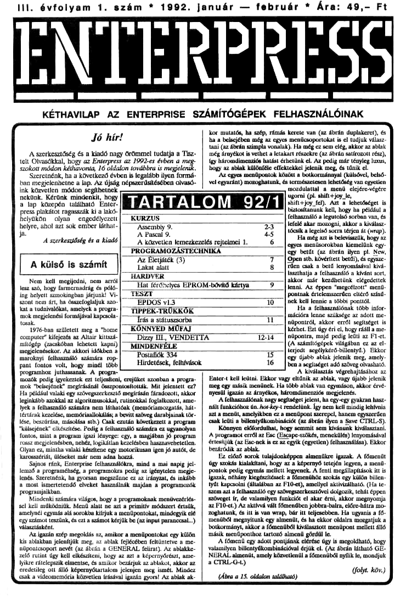

# Enterpress 1992/1 (1992.01-02)

[Оригінальний PDF](http://enterprise.iko.hu/magazines/Enterpress_1992-1.pdf) (угорською)

## Зміст

Jó hír!  
[Assembly 9. rész](https://ep128.hu/Ep_Konyv/Enterpress_Gepikod.htm#a9)  
[Pascal 9. rész](https://ep128.hu/Ep_Konyv/Enterpress_Pascal.htm#5)  
[A közvetlen lemezkezelés rejtelmei 1.](https://ep128.hu/Ep_Konyv/Enterpress_Cikkek.htm#4)  
[Az Eletjáték (3)](https://ep128.hu/Ep_Konyv/Enterpress_Cikkek.htm#life)  
Lakat alatt  
[Hat férőhelyes EPROM-bővítő kártya](https://ep128.hu/Ep_Hardware/Ep_EPROM.htm)  
EPDOS v1.3  
Irás a státuszsorba  
Dizzy III.  
VENDETTA  
Postafiók 334  
Hirdetések, felhívások  

[Чернетка вмісту](1992-01-02/epress-1992-01-02.txt)
