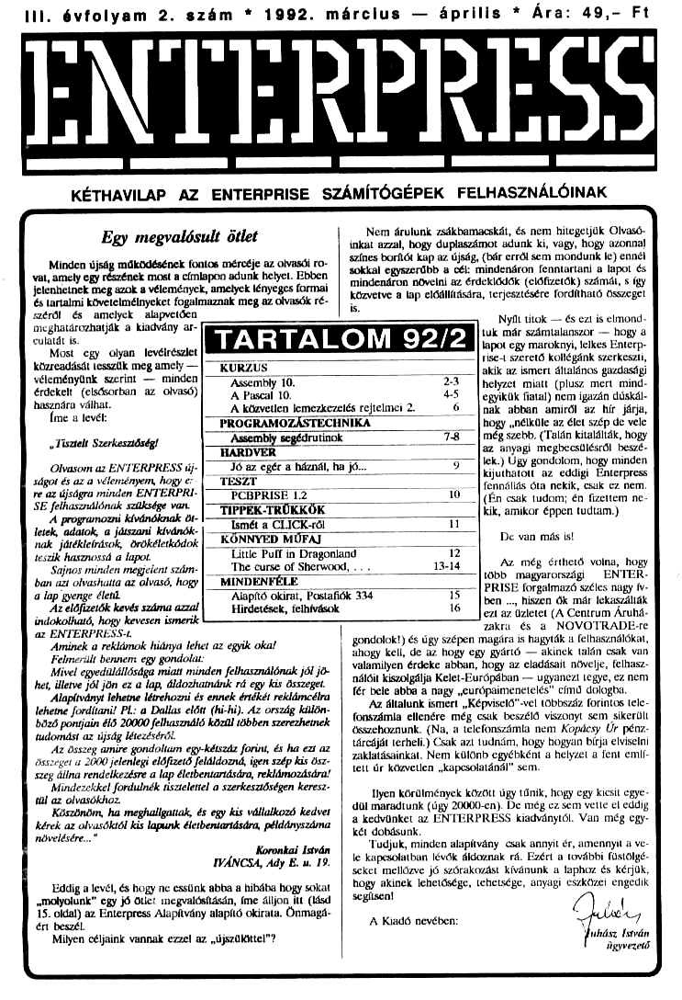

# Enterpress 1992/2 (1992.03-04)

[Оригінальний PDF](http://enterprise.iko.hu/magazines/Enterpress_1992-2.pdf) (угорською)

## Зміст

[Assembly 10. rész](https://ep128.hu/Ep_Konyv/Enterpress_Gepikod.htm#10a)  
[Pascal 10. rész](https://ep128.hu/Ep_Konyv/Enterpress_Pascal.htm#6)  
[A közvetlen lemezkezelés rejtelmei 2.](https://ep128.hu/Ep_Konyv/Enterpress_Cikkek.htm#4)  
[Assembly segédrutinok](https://ep128.hu/Ep_Konyv/Enterpress_Cikkek.htm#4c)  
[Jó az egér a háznál, ha jó...](https://ep128.hu/Ep_Hardware/Ep_Sorosk.htm) (Soros vonali illesztőkártya)

[Чернетка вмісту](1992-03-04/epress-1992-03-04.txt)
