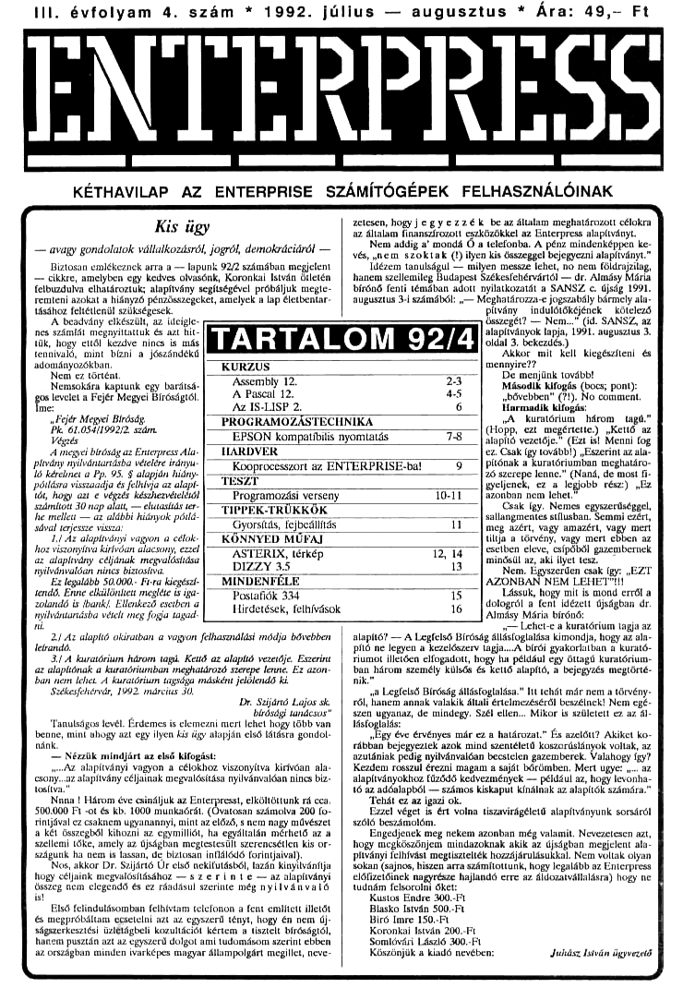

# Enterpress 1992/4 (1992.07-08)

[Оригінальний PDF](http://enterprise.iko.hu/magazines/Enterpress_1992-4.pdf) (угорською)

## Зміст

## Чернетка вмісту

"page-000.jpg" ------------------------------------------------------------ 
III. évfolyam 4. szám " 1992. július — augusztus " Ára: 49,- Ft

ENTEKPKESS

KÉTHAVILAP AZ ENTERPRISE SZÁMÍTÓGÉPEK FELHASZNÁLÓINAK

Kis ügy
— avagy gondolatok vállalkozásról, jogról, demokráciáról —

Biztosan emlékeznek arra a — lapunk 92/2 számában megjelent
— cikkre, amelyben egy kedves olvasónk, Koronka István ötletén
felbuzdulva elhatároztuk; alapítvány segítségével próbáljuk megte.
remteni azokat a hiányzó pénzösszegeket, amelyek a lap életbentar
tásához feltétlenül szükségesek.

etesen, hogyj egyezzék be az általam meghatározott célokra

az általam finanszírozott eszközökkel az Enterpress alapítványt.
Nem addíg a" mondá Ő a telefonba. A pénz mindenképpen ke.
vés, nem szoktak (?) ilyen kis összeggel bejegyezni alapítványt."
Tézem tanulságul — milyen messze ehet, no nem földrajzilag,
hanem szellemileg Budapest Székesfehérvártól — dr. Almásy Márta
bírónő fenti témában adott nyilatkozatát a SANSZ c. újság 1991.
gusztus 3-i számából: ,— Meghatározza-e jogszabály bármely ala;
pítvány , indulátókéjének . kötelező

A beadvány elkészült, az ideigle.
nes számlát megnyittattuk és azt hit-
Műk, hogy ettől kezdve nincs is más
tennivaló, mint bízni a jószándékú
adományozókban,

Nem ez történt

Nemsokára kaptunk egy baráts4-
fpieseieta Fejér Megyei Bíróságtól

Assembly 12.
A Pascal 12.
Az 1S-LISP 2.

s, Fejér Megyei Bíróság,

Pk. 61.054Í1992/2. szám.

Végzés

A megyei bíróság az Enterpress Ala.
Pivány nyilvántartásba vételére irány
1ó kérelmet a Pp. 95. § alapján hiány.
Pórlásra visszaadja és felhívja az alapi:
hát, hogy azt e végzér készhezvételétől
számbott 30 nap alatt, — elutasítás ter-
he mellett — az alábbi hiányok pótlá.
ával terjessze vissza:

1.7 Az alapítványi vagyon a célak;
hoz viszonyítva kirívóan alacsony, ezzel

12 alapítvány céljának megvalósítása
nyilvánvalóan nincs biztosítva.

Ez legalább 50.000. Ft-ra kiegészl-
tendő. Enne elkülönített megléte is iga:
zolamdó is ibank!, Ellenkező esetben a
nyilvántartásba vételt meg fogja tagad.

Programozási verseny
TIPPEK-TRÜKKÖK

— Postafiók 334
Hirdetések, felhívások

FROGRAMOZÁSTECHNIKA
[7 EPSON kompatíbilis nyomtatás TA

Kooprocesszort az ENTERPRISE-bat
T

sszege? — Nem. (id. SANSZ, az
apííványok lapja, 1991. augusztus 2.
oldal 3. bekezdés)

Akkor mit Kelt kiegészíteni és
mennyire?

De menjünk továbbt

"Második kifogás (bocs; pont):

bővebben" (1), No comment

[arrandik kifogás:

JA. kurntórium . három . tagú;
(Hopp, ezt, megértette) e Kettő, az
tapít vezetője E (Ezt lat Menni og
ez. Csak Igy további) Eszerint az ala
Pítónak a kuratóriumban meghatáro:
26 szerepe lenne." (Naná, de most
gyeljenek, ez a legjobb rész) Ez
zonban nem lehet

Csak így, Nemes egyszerűséggel,
sallángmentes stílusban, Semmi ezért;
meg azért, vagy amazért, vagy mert
ítja a törvény, vagy mert ebben az
csetben eleve, csípőből gazemberek
minősül az, aki lyet tesz,

Nem, Egyszerűen csak így; ,EZT
AZONBAN NEM LEHETT

Lássuk, hogy mit ís mond erről a
dologról a fent idézett újságban úr.
Almásy Mária bírónő;

2/ Az alapító okíratban a vagyon felhasználási módja bővebben
Metrandó,

3. A kuratórium három tagú, Kettő az alapító vezetője, Eszerint
az alapítónak a kuratóriumban meghatározó szerepe lenne, Ez azon.
ban nem lehet, A kuratórium tagsága másként jelölendő ki.

Székesfehérvár, 1902. március 30.

Dr. Szljánó Lajos sk,

c bírósági tanácsos"

inulságos levél, érdemes ís elemezni mert lehet hogy több van

benne, mint ahogy azt egy ilyen kis úgy alapján első látásra gondol:
nánk.

— Nézzük mindjárt az első kifogást:

,-AZ alapítványi vagyon a célokhoz viszonyítva kiríváan  ala-
csony, az alapítvány céljainak megvalósítása nyilvánvaldan nincs biz.
tosítva.

Nina ! Három éve csináljuk az Enterpresst, elköltöttunk rá cca,
500.000 Fi -ot és kb. 1000 munkaórát, (Ovatosan számolva 200 fo.
Tintjával ez csaknem ugyanannyi, mint az előző, s nem nagy művészet
a két összegből kihozni az egymilliót, ha egyáltalán mérhető az a
Szellemi tőke, amely az újságban megtestesült szerencsétlen kis or.
Szágunk ha nem is lassan, de biztosan in(lálódó forintjaival)

Nos, akkor Dr. Szijártó Úr első nekifutásból, lazán kinyilvánítja
hogy céljaink megvalósításához — sz er (a t e — az alapítványi
összeg nem elegendő és ez ráadásul szerinte még nyilvánvaló

ső felindulásomban felhívtam telefonon a fent említett illetőt
s megpróbáltam ecsetelni azt az egyszerű tényt, hogy én nem új;
ságszerkesztési üzlétágbeli kozultációt kértem a tisztelt bíróságtól,
hanem pusztán azt az egyszerű dolgot ami tudomásom szerint ebben
az országban minden ívarképes magyar állampolgárt megillet, neve.

— Lehet-e a kuratórium tagja az
alapító? — A Legfelső Bíróság állásfoglalása kimondja, hogy az ala-
Pító ne legyen a kezelőszerv lagja...A bírói gyakorlatban a kurató-
Tiumor illetően elfogadott, hogy ha például egy öttagú kuratórium
ban három személy külsős és kettő alapító, a bejegyzés megtörté.
mik"

a Legfelső Bíróság állástogtalása." Itt tehát már nem a törvény-
ról, Hanem annak valakik általi értelmezéséről beszélnek! Nem gé.
Szen ugyanaz, de mindegy, Szél ellen... Mikor ís született ez az ál.
Vástoglaláss

agy éve érvényes már ez a határozat." És azelött? Akiket ko.
rábban bejegyeztek azok mind szentéletű koszorúslányok voltak, az
Azutániak pedig nyilvánvalóan becstelen gazemberek. Valahogy így
Kezdem rosszul érezni magam a saját bőrömben. Mert ugyet az
alapítványokhoz fűződő kedvezmények — például az, hogy levonha.
16 az adóalapból — számos kiskaput kínálnak az alapítók számára."

Tehát ez az igazi ok.

Ezzel véget ís ért volna tiszmírágélető alapítványunk sorsáról
szóló beszámolóm.

Engedjenek meg nekem azonban még valamit, Nevezetesen azt,
hogy megköszönjem mindazoknak akik az újságban megjelent ala.
Pírványi felhívást megtisztelték hozzájárulásukkal. Nem voltak olyan
Tokan (sajnos, hiszen arra számítottunk, hogy legalább az Enterpress
előfizetőinek nagyrésze hajlandó erre az áldozatvállalásra) hogy ne
tudnám felsorolai öket:

Kustös Endre 300-Et

Blasko István 500-Ft

Biró Imre 150.-FL

Koronkai István 200.-Ft

Somlávási László 300.-Ft

Köszönjük a kiadó nevében: ukász István ügyvezető

"page-001.jpg" ------------------------------------------------------------ 
2 Kurzus

1992. július — augusztus

ASSEMBLY

12. rész

Tartozom még Tisztelt Olvasóimnak a FILEDUMP prog-
ram működésének magyarázatával, de merem remélni, hogy
Közülük már sokan megfejtették. Szó lesz a billentyűzetről is.

Még mielőtt belekezdenék: ismét érkezett hozzám néhány
levél, amelyben azt panaszolják a levélírók, hogy hiába gépelték
be pontosán, sorszámokkal együtt (1) a programlistát az editar-
ba, azt nem tudták lefordítani. Nos, ismét elmondom, hogy az
assembly listák elején álló sorszámokat nem kell, nem szabad,
tílas az edítorba begépelni. A sorszámok azt a célt szolgálják,
hogy egyszerűbb legyen a magyarázat.

Tehát a FILEDUMP

A fitedump program elején először címkéknek adunk érté-
ket: fehn (9) lesz az olvasásra megnyitott fájlcsatorna száma. Az
asmser (10) az ASMON legnagyobb képernyőcsatornájának
Száma, ide dolgozik a program. A cAr (11) az egy sorban meg-
jelentendő hexadecimális értékek és a hozzájuk tartozó (látha-
16) karakterek számát adja. Az x (12) értékkel a karakteres me-
zőre fogunk majd pozíciónálni egy ruvasz húzással

A programot azzal indítjuk, hogy (biztos ami bíztos alapon)
tezárjuk az fehy csatornát (15-16). Ezt azért célszerű megtenni,
mert, gondolom, olvasóim közül sokan kiváncsiságból ide-oda
beleírtak (nagyon helyes, ebből lesz a cserebogár!) a programba,
5 lesték, hogy mi történik. Ilyenkor - hiba esetén - a program
megállt, és Szerencsés esetben visszakaptuk az ASMON pa-
ramcssorát, a csatorna pedig nyitva maradt. Ha ezek után a T.
kíváncsiskodó újra elindította a programot, előfordulhatott,
hogy az EXOS (jogosan) visszautasította a csatorna újbóli meg-
nyitását, elejéről olvasását. Egy már nyitott csatorna megnyitása
nagyobb (és veszélyesebb) hiba, mint egy lezárt csatorna lezd-
rása.

A következő négy sorban (18-21) megnyitjuk a flesttomát
olvasásra, Bizonyára többen észrevették, hogy az EXÖS 1 utáni
megjegyzésbe "írás" írtam, ami természetesen rossz, Elnézést
kérek! Ha a nyitás során hiba volt (magyarul: az EXOS nem
tudta megnyitni a csatornát, az akkumulátor tartalma nem nul-
1a), akkor a RET NZ hajtódik végre, a program futása pedig
befejeződik. Itt most ismét elmondom: bá nagyobb és igényes
programot akarunk készíteni, akkor kell egy olyan modult írni,
amely szépen kiértékeli a hibákat, és szöveges magyarázatot
küld a felhasználónak. (Egy lusta barátom régebben egyik Prog-
ramjába sem épített hibakezelő és informáló modult, de még a
hibakódot sem írta ki a képernyőre. Egyszer szóvá tettem neki
ezt. Azóta minden programja rendelkezik ezzel a modullal,
amely hiba esetén lefut, és a következő sokatmondó sort ítja ki
hibás futáskor: "One or more error(s)." Erre nem tudtam mit
tépni.)

A ént címkével ellátott szón (149) fogjuk tárolni a fájl-ott-
szelet, induláskor ennek nulla értéket adunk (23-24). Ezt az
oliszetértéket írjuk majd ki a sorok elejére.

A fájlt blokkonként olvassuk be, ezt végzi a következő négy
sar (26-29). Itt van az rdlogp ciklus eleje ís, mert többször keil
majd blokkot olvasnunk, A beolvasott blokkot a buff területre
(136) tároljuk le. (Semmi jelentősége nincs annak, hogy én 256
bájinyi helyet foglalok le, a fájlból csak cár darab bájtot töltök
1e, Később arra ís rájön mindenki, hogy miért rakom el a báj-
tokat, miért nem dolgozom fel őket azonnal, (Ez is egy jogos
megoldás lenne, de én nem ezt választottam.) Az EXOS 6 után
illene egy kis hibadetektálást végezni.

"Tudjuk azt, hogy blokkolvasás után BC-ben a még olvasásra
váró bájtok száma van. A mi esetünkben ez négy akból érdekes:

1) A láj végét nem az EOF figyelésével, hanem BC tartal:
mának vizsgálatával vesszük észre.

2) Ha BC-ben a hívás után 0 van, akkor az azt jelenti, hogy
be tudta olvasni a cár számú bájtot, még nem ért a fájl végére.
Ez síma eset,

3) Ha BC-ben a hívás után 0-tól eltérő, de eAr-ret nem egye-
26 érték van, akkor biztosan a fájl végére értünk, de van még
néhány beolvasott bájt. (Ez akkor áll elő, ha a fájl mérete nem

egész számú többszöröse a chr-nek.)

4) Ha BC-ben cAr-el megegyező szám áll, akkor az azt je-
lenti, hogy egy árva bájtot sem tudott beolvasni az EXOS 6.
(A fújt mérete egész számú többszöröse chr-nek.)

A következő négy sor ezeket az eseteket dolgozza fel. Az
akkumulátorba töltjük a ckr értéket (31). Az EXOS 6 után
BC-ben, de mint tudjuk valójában csak az alacsonyabb értékű
C regiszterben lesz a még beolvasandó bájtok szára. Az akku-
mulátorbál kivonjuk C értékét (32). Ha C-ben cAr:rel egyenlő
Szám volt, akkor egyetlen bájtat sem tudott olvasni az EXOS,
biztosan a fájl végére értünk ( I. az 1. és a 4. esetet). A kivonás
eredménye ekkor 0 lesz, ki kell lépni a programból (33).

Ha a C tártalma cAr-től különböző volt, akkor a kívonás
után A-ban a ténylegesen beolvasott bájtok száma lesz (2. és
3. cset), és tudjuk, hogy még nem értünk a fájl végére. (Persze,
ha A-ban az érték cAr-rel nem egyező, akkor valójában már a
fájl végénél vagyunk, de még nem dolgozzuk fel.)

A ciklusokat DINZ-vel alakítjuk majd ki, B-be töltjük ezért
áz akkumulátor tartalmát (34). Ezután az értéket kélszeri fel-
használáshoz (hexivrész, karalkteresrész) rátesszük a veremre

).

Lássunk valamit!

Olyan helyzetben vagyunk, amelyben tudjuk a beolvasott
karakterek számát, a beolvasott karakterek a pufferben vannak,
És az ofiszetszámlálónk is rendben van. Nincs tehát más dol:
unk, ezeket kell megjelenítenünk, felhasználnunk.

A table memóriarészen helyeztem el a hexadecimális karak-
tereket (146), innen egyszerű indexeléssel fogom kiszedni a ka-
raktert,

Elsőként az offszetet kell kiírnom. Mindannyian tudjuk,
hogy a ent-nél letárolt offszetérték alacsony bájtja a cat-n, a
magas a ent4-1 helyen van.

Nekünk először a magas értéket kell kiírmunk, Ezt két lé-
pésben tesszük meg, mert egy § bites számot (high il. low rész)

étjegyű hexadecimális számmal tudunk leírni, tehát a két lépés
a két megjelennenő ASCII karaktert jelenti. Ugyanígy kell majd
az alacsony értéket kiírnunk. (Összesen 4, hexadecimális karak-
ert jelenílünk meg, ami egy 16 bites számot (offszetérték) ta-
kar)

ÁL az ofiszetérték magas bájtjára mutat kezdetben (409,
IX mutat a konverziós tábla elejére (41). A eyel7 ciklus rakj
ki a két B bítes hexadecimális számot (high, low), ezért ennek
kétszer kell majd lefutnia (42). A eyel7 elején a ciklusszámláló
értékét mentjük el (43).

Az éppen érdekes hexa karaktert úgy fogjuk elérni, hogy
egyszerűen a számmal magával fogunk a table-be indexelni. Eg.
mek értéke nyilván a 0-IS tartományba eshet, Ennek kiszámí-
tásánál hasznosítható nagyon jól a RLD utasítás,

Az akkumulátort megtisztítjuk, tartalmát töröljük (44),
mert az RID ezzel dolgozik.

Most érünk oda, ahol a high ill. a law rész két-két karakterét
tesszük ki, ennek ís kétszer (45) kell lefutnia (gyakorlatilag egy
8 bites számot teszünk ki).

Belépünk a cye/2-be, ahol elmentjük a ciklusszámlálót (46).
Jöhet az RLD! (Remélem mindenki emlékszik rá!) HL az off.
Szet magasabb értékére mutat, az akku tartalma nulla, Az RLD
után (47) A-ba kerül a high rész felső 4 bítje. A kapott (index)
értéket beleírjuk magába a programkódba (48)! HL. érték
nem akarjuk majd elrontani (nem IK), ezért elmentjük az ak-
kumulátortártalmat (49). Az LD B.(IX-0) utasítás 3 bájtos, a
harmadik bájton van az eltolás értéke (ez a gépi kód, ügyes
irükkökhöz ismerni kell a gépi kódot is), ide (50) írtuk be azt
az IX-hez adandó értéket. (Az a 0, ami a listában szerepel, nem
Érdekes, az eltolás a program futása közben változik.) Ennek
végrehajtása után B-ben lesz az az ASCII kód, ami az adott 4
bithez tartozik. Nincs más dolgunk, egyszerűen ki kell írnunk
(51.52),

Visszaáltítjuk az akku (mert illik, sát, már muszáj) és a cik-
tusszámláló tartalmát (53-54). Amikor a cyel2 ciklus másod
Szorra fut le (55), az A tartalma az adott rész következő (alsó),
4 bitjét tartalmazza, s ezt fogja kiítni,

"page-002.jpg" ------------------------------------------------------------ 
1992. július — augusztus

THHNHETE HE]

Kurzus 3

A záró RLD-t (56) nem lenne kötelező végrehajtani, de
azért érdemes, mert HI. és az A regiszter tartalma a háromszori
RLD miatt az eredetire áll vissza, (De ennek itt nincs jelentő-
sége.)

" Jökkentenünk kel a HL-t (57), így az az érvényes oftsze-
térték alacsony bájtjára mutat. Elő kell vennünk a ciklusszám-
áló értékét is (58), és jöhet a következő ciklus (59).

Flértük tehát, hogy megjelent a 16 bites offszetérték hexa-
decimális formában. Az oflszetértéket növelnünk kell a követ-
kező kiíráshoz. Értékéhez nyilvánvalóan a chr értéket kell adni
(62-65).

A következő részben egy kettőspontot teszünk ki határoló-
jelnek, közönséges karakterírással (68-70). (Nem szóltam róla,
mert gondolom mindenki számára világos, hogy a kurzort az
EXOS mozgatja, ezzel semmi gondunk : egyelőre.)

Következik a hexa számsor kirakása, Először levesszük a ve-
remről a beolvasott karakterek számát (73), az RLD miatt az
akkumulátor tartalmát nullázzuk (74), majd HL-lel megeímez-
Zük azt a puffert, amelyben a karakterek vannak (75).

A loopo ciklus (76) annyiszor fog lefutni, ahány karaktert
beolvastunk (egy blokkban) a pufferterületre. A szám megjele-
mítése hexa formában ugyanúgy történik, mint ahogy az előbb
láttuk (77-88). Az egyes számok közé szóközt teszünk (89.91).
Növeljük HL4, (gy az már a következő bájtra mutat a pufferben
(92), a rutin ezt fogja a következő menetben kiírni hexában.
zután felvesszük a ciklusszámlálót a stack-ról (93), és ha van
még megjelenítendő bájtérték, akkor visszaugrunk a ciklus ele-
jére (94),

Most jön egy érdekes húzás. A kurzort rá kell igazítanunk
arra az oszlopra, amelyben a tényleges karaklerek fognak sze-
repelni. Hogy miért kell külön rápozícionálni, miért nem elég
egyszerűen néhány szóközt kitenni a hexa részt követően? A
válasz egyszerű, Képzeljük el, hogy mi történne, ha így csele-
kednénk akkor, amikor már csak mondjuk 5 bájtunk lenne (a
fájl vége)! Megjelenítenénk az öt értéket hexában, aztán kíten-
nénk azi a néhány határoló szóközt, végül megjelenítenénk a
karaktereket. Az eredmény ronda lenne, mert a hexa részbe
esnének a karakterek,

Nos, a kurzorpozícionáló escape-szekvencia ismerl a követ-
kező trűkköt: ha valamelyik részébe (x il. y koordináta) 0-t te
Szünk, akkor a rendszer azon nem változtat, a kurzor abban a
Sorban ill, oszlopban, marad, ahol éppen áll; Nekünk arra van
Szükségünk, hogy a kurzor y pozíciója ne változzon, ezért ezt
nem bántjuk, az x pozíciót pedig 30-ra állítjuk be, (A pozício-
náló szekvenciánál a 32 jelenti a 0 bázisértéket, ehhez kell hoz-
zándni a kívánt értéket. Még azt szeretném megjegyezni, hogy
€z nem nagy trükk, sak más rendszer, bővítés és programnyelv
tudja így pozícionálni a kurzort, nem csak az EXOS.)

Ezt a pozízionálást végzi el a blokkíró rész, amely a pozfcl-
0náló szekvenciát küldi el az ASMON képernyőjére (97-100).

Jöhet a karakterek megjelenítése, A feladat egyszerűbb,
mint a hexaszámok kitétele, egy dologra azonban figyelnünk
kell. Mint tudjuk, az ASCII kódrendszerben u 32-es kód (szó-
köz) alatt nem nyomtatható karakterek vannak. Éppen ezért, a
karakterről el kell döntenünk, hogy megjeleníthető-e? Ha nem
az, akkor is ki kell tennünk valamit, a mi programunk "7-ot rak
ki.

Először le kell vennünk a stack-ról a beolvasott, megjelent.
tendő karakterek számát (103), majd HL.-lel megeímezzük a
Puffert (104).

A loop ciklus jeleníti meg a karaktersort, a ciklus elején -
ahogy már megszoktuk - elmentjük a ciklusszámlálót (105). Az
akkumulátorba töltjük a HL.lei megcímzett bájt értékét (106),
azután összehasonlítjuk az első megjeleníthető karakterrel, a
szóközzel (107). Ha az érték nagyobb vagy egyenlő, akkor egy-
szerűen átugrunk (108) a karakteríró részre, egyébként rácsor-
unk a következő utasításra, és A-ba töltjük a "7-ot (109). A

következő utasítások hatására megjelenik a karakter (10-12).

Növeljük HL azért, hogy az a következő megjelenítendő
karakterre mutasson a pufferben (113). Felvesszük a ciklusz-
számlálót (114), és ha van még karakter, akkor visszaugrunk a
ciklus elejére (115),

Elkészült egy teljes sor! Jöhet a következő, amit egy sorral
lejebb kell megjeleníteni, ezért csinálunk egy soremelést (118-
121). (Hatására a kurzor automatikusan a sor elejére ugrik.
Egyébként ítt van jó példának két nem nyomlatható karakter,
a CR (Carriage Rélurn - kocsi vissza, értéke 13) és az LF (Line
Fred - soremelés, értéke 10). Ha ezeket a karakteres részben
gondolkodás nélkül kítennénk, igencsak nagy zagyvaságot okoz-
nának.)

Miután készen vagyunk, visszaugrunk a blokkolvasó részre
(124). Ha aztán ott nincs több olvasható karakter, akkor a ve.
zérlés a total címkénél kezdődő utasításokkal folytatódik, ame.
lyek lezárják a fájlcsatornát (126-128).

Hát ennyi az egyik lehetséges, korántsem teljes megoldás.

Haladjunk az "anyaggal"!

Ismerjük a képernyő- és a fájlkezelést. De van még egy nagy
problémánk: nem tudunk kommunikálni a géppel. Erre szolgál
a billentyűzet, (Nocsak, nocsak! A szerk.)

A billentyűzet tipikusan beviteli eszköz (csak olvasásra lehet
megnyitni), az EXÓS-ban KEYBOARD: a periféria elnevezé-
Se. Mivel csak egy billentyűzet jár a géphez, így csak egy csa-
torna lehet a billentyűzethez rendelve, Az előző mondatból már
kiderült, hogy a billentyűzetet ís a "esatornaszemlélettel" alapján
kell használni: a megnyitás, olvasás, lezárás teljesen ugyanúgy
megy, mint pl. a fájloknál.

A billentyűzetről karaktereket és blokkokat is tudunk olvas-
ni. A blokkok itt a funkcióbillentyűkhöz rendelt szövegeket je-
lentik, ezt ís a KEYBOARD: kezeli. Nagyon hasznos az ún.
csatornaolvasási-állapot, funkció. Ennek segítségével progra-
munk futása közben megnézhetjük, hogy van-e olvasható ka
rakter a billentyűzet saját putferében, Hogy hol lehet ezt hasz:
nálni? Pl. írunk egy programot, amely - amíg nem nyom le egy
billentyűt a felhasználó - demózik.

Másik igen hasznos szolgáltatása ennek az eszköznek a
STOP billentyű figyelése, Egyik rendszerváltozó (STOP IRO)
igénybevételével gyönyörű szofivermegszakításokat lehet készí
teni, amellyel ügyes híbakezelést lehet végezni pl. fájlműveletek
közben. (Érre jó példa a SPRED program, amely ilyen szoft-
"vermegszakítások segítségével védi magát mindenféle hibáktól.)
A billentyűzetnél be lehet állítani a késleltetést és az ismétlés
sebességét.

Másik fontos tudnivaló az eszközről, hogy a belső és a két
Külső botkormányt is kezeli. Ezeket a speciális funkció (EXOS
11) hívásával pócögtethetjük. A funkció hívása előtt A-ba kell
tölteni a billentyűzet csatornaszámát, B-be 9-et (a JOY funk-
ció), végül C-be az illető botkormány azonosítóját: 0-beépített,
1-külsől, 2-külső2, A hívás után C-ben lesz az adott botkor:
mány állása, A bebillent bitek jelentése: bít0 - jobb, bit - bal
bít2 - le, bít3 - fel, bítá - tűzgomb, Természetesen ezek kombi-
nációját is kaphatjuk,

Mostanra ennyit. Megemlítem, hogy már a sorozat minden
olvasója belekezdhet önálló programocska kidolgozásába, hi-
Szen a fontosabb ismeretek (ulasílások, az ASMON, képernyő.
billentyűzet. és fájlkezelés, csatornaszemlélet stb.) kéznél van.
nak. Csak néhány ötlet: seroll rutinok, effektek szöveges és gra-
fikus képernyőkre; fájlmásoló, fájleditor stb. Mindenkinek pró-
bálkoznia, gyakorolnia, tapasztalnia kell, csak így tud haladni,

— HC —

Fizessen elő a

Hobby Elektronika cs a Rádiótechnika

folyóiratokra! Így biztosan mindig hozzájut!
A cím: 1374 Budapest, Pf. 603. Tel.: 117 - 0262
A szerkesztőségben regisztrált HE előfizetőknek ingyenes nyák-film melléklet.

"page-003.jpg" ------------------------------------------------------------ 
4 Kurzus

tERPRES:

1992. július — augusztus

A Pascal

12. rész

Az elmúlt néhány folytatásban sokat foglalkoztunk a Turbo-
Pascallal, kissé elhanyagolva azoknak az olvasóinknak a lelkívi-
lágát, akiknek be kell érniük a HiSOft Pascallal. Ez nem vala-
miféle szándékos diszkrimináció volt, egészen egyszerden a Tur-
bo-Pascal egy teljesebb, gazdagabb implementáció, több lehe-
töséget nyújt a felhasználónak, mint akaratlan vetélytársa, ame-
lyet eredetileg egy egyszerűbb környezetre fejlesztettek ki; így
többet lehet - és kell is - vele foglalkozni. A Turbo-Pascal lehe-
töségeinek nagy részét ismertettük; ami kimaradt, azt kisebb
részben most pótoljuk, a maradékot az avatott felhasználó
amúgy is csak egy részletesebb leírás birtokában tudja használni.
A fordító direktívák

Amivel még mindenképpen adósok vagyunk, az a fordító di-
vektívák, rövid összefoglalása, Miért is van ezekre szükség, és
egyáltalán, mik is ezek? Nos, egy programnyelv - legalábbis nap-
jainkban - úgy készül, hogy minél nagyobb mértékben független
legyen egy adott géplípus, modell, konfiguráció sajátosságaitól.
Azonban a lefordított programnak egy konkrét gépen (azaz tí-
puson, modellen, kontiguráción) kell futnia. Vannak más sajá-
Tosságai is a program futásának, az ember-gép kapcsolatnak
stb, amit nem lehet nyelvi szinten elintézni. Itt lépnek be a for-
dító direktívák. Ezek olyan utasítások, amelyek a fordítóprog-
rammak szólnak, és előírják számára a fordítás során előálíítan-
dó program valamilyen tulajdonságát. A direktívák tehát nem
programutasítások, nem keletkezik belőlük gépi kód. Nagy vo-
malakban: a forrásprogram, a programszöveg a fordítóprogram
által feldolgozott nyersanyag, a direktívák pedig egyfajta utasí-
tások, hogy hogyan is dolgozzon ezzel a nyersanyaggal...

A direktívák igen sajátos módon adhatók meg. A nyelv ere-
deti leírása csak egyetlen helyen engedélyezi tetszőleges informá-
ció megadását, mégpedig a megjegyzésekben. Ezért a Turbo-
Pascal (és más Pascal-implementációk ís) egy speciális megjegy-
zést vezet be a direktívák megadásához. Tudjuk, hogy a Pascal-
ban a megjegzés a kapcsos zárójelben álló tetszőleges szöveg,
amely akármilyen hosszú lehet (alternatív megoldás a (" és a
") jelkombináció alkalmazása, például olyan környezetben, ahol
a terminál vagy a nyomtató nem ismeri a kapcsos zárójelet). A
fordító direktíva olyan megjegyzés, amely dollárjellel kezdődik;
ezt követi a direktíva törzse. Ez minimális korlátozást jelent csak
a megjegyzések használatára.

A dírektíva törzsének fő eleme a dírektívát azonosító egy-
betűs kód, ezt követi a direktíva paramétere. A legtöbb direk-
1íva valamilyen jellemző be- vagy kikapcsolt állapotával kapcso-
latos, ezért a direktívák többségánek paramétere a - vagy - jel,
€zek jelentése értelemszerű. Más esetben egy fájlnév vagy egy
Érték lehet a paraméter. Ennek megfelelően a direktívák vala-
hogy így néznek ki a program szövegében:

1343),
CSIFLENAME.EXT")
tswep

Vigyázzunk, hogy a nyitó kapcsos (vagy összetett) zárójel és
a dollárjel, illetve ez utóbbi és a direktíva betőkódja között ne
álljon szóköz.

Minden dírektívának van egy alapértelmezés szerinti értéke.
Ha nem tüntetjük fel a dírektívát, akkor ez az alapérték lesz

direktívák lokálisak, azaz csak a bekapcsolásuk

és kikapcsolásuk közötti programszövegre érvényesek. Más di-

rekiívák globálisak, azaz az egész porgramszóvegre kifejtik ha-

tásukat; ezeket csak egyszer lehet megadni. Mindegyik direktí-

Vánál megadjuk az alapértelmezés szerinti értéket, és feltümtetjük
a direktíva lokális vagy globális. jellegét.
Az A direktíva: abszolút kód

Az A dírektíva a rekurzív hívások használatát szabályozza.
Ha a direktíva akíív, akkor a program abszolút kódot generál,
azaz rekurzív hívás nem használható. A direktíva passzív állac
Potában használhatunk rekurzív hívást. Az alapértelmezés sze-
Tinti érték az aktív állapot. Ha tehát rekurzív programot aka-
tunk írni, a program elején adjuk ki a

4547,
irektívát. Készüljünk fel arra, hogy ilyenkor a program kód-

Ja valamivel hosszabb lesz, a végrehajtás pedig lassabb. Eltérés
Tesz a verem használatában is, a rekurzív program sokkal jobban
igénybe veszi a vermet,

Akit érdekel ennek mechanizmusa, elmondhatjuk, ho
mindaddig, amíg a programban nincs rekurzív hívás, az eljárá-
Sok és függvények saját, belső változóit tulajdonképpen bárhová
teheti a fordítóprogram, akár statikusan is kijelölheti azok helyét.
ugyanúgy, ahogy a (főjprogram - globális - változóival teszi.
Ezek címzése viszonylag egyszerű és gyors. Ha azonban rekurzív
hívást akarunk végrehajtani, a lokális változókat csak a verem-
ben foglalhatjuk je. Csak így érhető el, hogy minden egyes hí-
Vásnál a változókból egy új készlet jöjjön létre, és a visszatérés-
kor ezek a változók megszűnjenek létezni. Ekkor azonban eze-
ket a változókat a proccsszor csak relatív eímzéssel érheti el, ez
egy kicsit tovább tart.

Ha már szóba került a tárkezelés rekurzió esetén, újra szól-
munk kell arról, hogy a hívások egymásba ágyazásának van egy
fizikai korlátja, mégpedig a verem számára rendelkezésre álló
memória. Ha ugyanis túl sok hívást ágyazunk egymásba, a ve-
rem számára kijelölt memória túlcsordul, és ez a program el-
szállását okozhátja. Ha ez a veszély fenyeget, használjuk a ve-
rem ellenőrzését előíró K fordító direktívát (lásd később),

A B dírektíva: logikai eszköz kijelölése

A B direktíva a standard bevitelhez és kivitelhez hozzáren-
delt eszközt választja ki. Alapértelmezés szerinti, azaz aktív ál-
lapotában a CON: logikai eszközt, passzív állapotában a TRM:
logikai eszközt választja ki. Talán még emlékszünk rá, mindket-
16 ugyanazt a fizikai eszközt, a képernyő-billentyűzet kombi
ciót jelenti. A különbség az, hogy a CON: logikai eszköz puffe-
relt bemenetet ad, azaz a beírt információt szerkeszthetjük, t0-
rölhetjük mindaddig, amíg az ENTER billentyűvel le nem zár-
tuk; a TRM: logikai eszköz viszont a leütött billentyű kódját
azonnal továbbítja a programnak. Ha tehát mi magunk akarjuk
a bevitelt irányítani a standard input-output fájlon, ki kell ad-
munk a

158-1
dírektívát (a direktíva globális).
A C direktíva: Ctr1-C és Ctrl-S használata
A C direktíva a Cirl-C és a Cirl- billentyűkombináció ha-
tását szabályozza. Mint tudjuk, a CP/M operációs rendszerben
- és így az ÍS-DOS-ban is - a Ötri-C billentyűkombinációval ál-
talában leállítható - megszkítható - a program, a Ctrt-§ kombi-
pációval pedig a túl györs vagy túl hosszt képeryükírás Alít.
ható meg és indítható le újra. A Turbo-Pascalra ez úgy érvé-
nyes, hogy a program megszakítása READ illetve RÉADLN
utasítás végrehajtása közben történhet meg. Ha a C direktíva
akiív (És ez az alapértelmezés szerinti és szerinti állapot), a leírt
két funkció működik; a direktíva passzív állapotában nem. Ha
azt akarjuk, hogy a programunkat ne lehessen ilyen módon le-
állítani, adjuk ki a - globális -
1SC4)
direktívát. Ezt azonban csak a hibátlan, belőtt programmal
tegyük meg, különben saját magunkkal is kitolhatunk.
Az I direktíva: hibakezelés, beszúrt fájlok

Az direktíva kétféle célra is használható. Egyik esetben a
beviteli-kiviteli hibakezelés vezérlésére használhatjuk. Ilyenkor
a direktíva kapcsoló jelleg, Alapértelmezés szerint, azaz bekap-
csolt állapotában a program maga ellenőrzi a bevitel-kiviel he.
yességét. Ilyenkor tehát hiba esetén a program futása félbesza-
Kad, és kapunk egy hibaüzenetet a hiba - számmal jelölt - kód.
jával.

Saját célra így ís megfelel a program, ha azonban másokat
ís szerencséltetni akarunk a művünk feletti gyönyör érzésében,
4z összes lehetséges, előre látható hibát a programban le kell
kezelnünk. Ezt teszi lehetővé az I direktíva kikapcsolt állapota,
amikor is hiba esetén a program futása folytatódik, mintha mi
sem történt volna. Valami azért történik: az JORESULT függ-
vény meghívásával mindig ellenőrizhetjük, hogy nem volt-e hiba.
az utoljára használt beviteli vagy kiviteli utasítás végrehajtása
során. idézzük fel: az IORESULT függvény értéke 0, ha a mű-
Velet hibátlan volt, és ettől eltérő értéket ad vissza, ha valami.
lyen hiba volt.

"page-004.jpg" ------------------------------------------------------------ 
1992. Július — augusztus

(HIVE HET IKES]

Kurzus 5

Mindezekből sz következik, hogy egy jól megírt programban
egy fájl-másolás kezdete valahogy így fog kinézni:
VAR,
FE, ( forrás-tájl p
CF ( céráj )
: FILE;
FEN, ( tájnovek )
CEN

STRING;

WRITEK "Kérem a forrás-tájl nevét: "
READLNI FEN );
ASSIGNI FF, FEN );
(54) RESETT FF ) (61-4) ( Itt vesszük kézbe a
sorsunkat )
IF IORESULT. 0 THEN BEGIN
WRITEK "Sajnos, nem tudom megnyitni a táji "
READLN;
WRITELN( "Vége..."
HALT;
END(IFJ;

A fájl-megnyitás idejére "átvesszük" a hibakezelést a Pascal
rendszertől saját kezünkbe, Ugyanezt kell tenni cél-fájl esetében
s, és legalább ez utóbbinak a lezárásakor. Ha következetesek
vagyunk, akkor a beolvasást és a kiírást is ugyanígy lekezeljük,
hiszen bármikor előfordulhat egy lemezhiba, vagy csak a szabad
hely fogy el a lemezen.

Arra ügyeljünk, hogy az IORESULT függvény értéke a hí-
vás után mindig nullára áll, azaz nem lehet a hibakódot így fel-
derítet

IF IORESULT 0 THEN BEGIN
WRITELN( "ete Hibal A hibakód: ", JÖRESULT : 4 );
END (IF);
ugyanis ekkor mindig nullát kapunk. A helyes megoldási
VAR
JORES : INTEGER;
4 Ideiglenes változó a hibakódnak )

SL) ( Ht van a kritikus művelet ) (81)
TORES :— IORESULT;
IF IORES 0 THEN BEGIN
WRITELN( "ee Hibat A hibakód: ", IORES : 4 );
ENDIF HK

Az I direktíva másik alkalmazása az ú.n. include fájl, azaz
beszúrt fájl megadása. Ha olyan hosszú a forrásszöveg, hogy a
Turbo-Pascal már nem tudja kezelni, szétszabdalhatjuk több
Önálló darabra, ekkor mindig csak egy fájl van a memóriában.
Egy másik lehetőség, hogy bizonyos feladatokhoz kész eljárás-
és függvénykonyvtárral rendelkezünk, és ezt érintetlenül akar-
juk a programunkhoz füzni. A programunkhoz változatlanul
hozzáfordítandó forrásszöveg az inleude-fájl,

A fordítóprogram ott fogja az include-fájlt beszerkeszteni a
programunkba, ahol az I direktíva áll, Legyen a könyvtár neve
LIBRARY.LIB, a program már elkészült és tesztelt másik ré-
szének pedig PROGI1.PAS; ekkor így füzhetjük össze a három
részt a fordítás idejére:

ját deklarációk )

151 LIBRARY.LIB)

Ú51 PROG1)

( in következik a most szerkesztett programszöveg

A. programrészek ilyen módon végzett beszúrását sigíti a
"Turbo-Pascalnak az a könnyítése az eredeti Pascal specifikáci-
hoz képest, hogy a konstans-, típus-, változó-, eljárás- és függ-
"vénydeklarációk tetszőleges sorrendben, keverve is állhatnak a
Programban. Ez azt jelenti, hogy a beszúrt fájlok minden kor-
Tátozás nélkül deklarálhatják saját adat- és programszerkezete-
iket.
AK direktíva: a verem ellenőrzése

AKK direktíva, mint korábban utaltunk rá, a verem ellenőr-
zését írja elő. Az alapértelmezés szerinti, aktív állapotban a
Program minden hívás előtt ellenőrzi, hogy van-e elég hely a
veremben a hívott eljárás vagy függvény lokális változói számá-
ra, Ha kevés a hely, a hibajelzést kapunk és a program leáll. A
dírektíva passzív állapotában nincs ellenőrzés. Ha tehát már be-
lőttük a programot, és vagy nem használunk rekurzív hívást,

vagy pedig biztosan tudjuk, hogy nem fogjuk túlterhelni a ver-
met, kikapcsolhatjuk az ellenőrzést a
181

direktíva megadásával;

sabb lesz,
AzR direktíva:
az érvényességi tartományok ellenőrzése

Az R direktíva az indexek érvényességi tartományának, va-
lamint a skalár- és résztartomány típus értelmezési tartományá-
mak ellenőrzését engedélyezi. Alapértelmezésben a direktíva
Passzív, azaz ilyenkor programhiba esetén "túlindexelhetünk" a
tömb határain. Ha csak olvassuk a tömböt, ez nem okoz túl
nagy problémát (leszámítva, persze, azt a kellemetlen élményt,
hogy a program hibás eredményt ad). Ha azonban írunk ís a
tömbbe, elronthatjuk létfontosságú változók értékét, sőt akár a
program kődrészébe vagy valamilyen rendszerterületre piszkít-
hatunk, ekkor a program nagy valószínűséggel elszáll, A rész-
tartomány vagy felsorolási típus esetén ez a súlyosabb hiba nem
fenyeget, de részben elveszítjük az ilyen változók használatát
indokló előnyöket, A program belővésének idejére tehát érde-
mes a direktívát bekapcsol

(SRA)

Ha már fut a program, és nem várható, hogy a felhasználó
a saját adataival esetleg újra kiakaszthatja (a bevitt adatok ér-
Vényességét, ha az kritikus, amúgy is mindig ellenőríznul kell),
akkor kikapcsolhatjuk a direktívál.

Az U direktíva: életveszély!

Az U direktíva rendeltetése az volna, hogy engedélyezze a
Program megszakítását bárhol (azaz nem csak READ és RE.
ADÍN utasítás végrehajtásakor; lásd a C dírektívát). Hasznos
Segítséget jelenthetne programbelővéskor egy véletlenül beépí-
tett végtelen - vagy csak nagyon hosszú - hurok esetén. Sajnos,
a dírektíva bekapcsolt állapotában az általunk használt Turbo
Pascal (3.01es verzió) Enterprise-on elszáll.

AV direktíva: a stringparaméterek
típusellenőrzése

A V direktíva a string változó-paraméter típusellenőrését
végzi. A direktíva alapértelmezés szerinti, aktív állapotában az
eljárásnak vagy függvénynek paraméterként átadott string és a
formális paraméter hosszának meg kell egyeznie. A direktíva
Passzív állapotában nincs ellenőrzés, ekkor eltérő hosszúságú
Paraméter s átadható. Mivel általában ez a kedvezőbb állapot,
tiltsuk meg a típusellenőrzést:

6V-
A W direktíva: a WITE utasítások mélysége

A W direktíva a WITH utasítások egymásba skatulyázásá-
nak maximális mélységét adja meg. Alapértelmezésben ez az
érték 2; a dírektívával a mélységet 1 és 9 között állíthatjuk be,

A. WITH utasítás ismertetését annak idején elmulasztottuk;
így azt most röviden pótoljuk. A rekord típusú változók hasz:
nálatakor, mint tudjuk, az egyes elemekre hivatkozáskor a re-
kord nevét is meg kell adni, Ez sokszor kényelmetlen, különö-
sen, ha többszörösen egymásba skatulyázott rekordokról van
szó, és feleslegesnek tűnik, ha például ugyanannak a rekordnak
Sok-sok elemét kell felsorolni. Hogy ez a dolog elkerülhető le-
gyen, az érintett utasításokat egy ú.n. WITH blokkba zárhatjuk,
És ekkor a blokkon belül a rekord nevét nem kell megadni, csak
az egyes elemekét, Az alábbi deklaráció esetén:

VAR
REKORD : RECORD OF
A, B, C : INTEGER;
END ( RECORD );
így néz ki egy értékadás a WITH utasítás nélkült
REKORDA :— REKORD.B 4 REKORD.
és így, ha használjuk a WITH utasítást:
WITH REKORD DO BEGIN
AizBtO;
END ( WITH);
Az X direktíva: a tömbök optimalizálása

Az X dírektíva alapértelmezés szerinti, aktív állapotában a
tömbkezelés futási idő szerinti optimalizálását váltja ki, míg
Passzív állapotában a fordítóprogram a memóriafoglalást ígyek-
szik a minimumra szorítani. —ÚL—

Program futása így valamivel gyor-

"page-005.jpg" ------------------------------------------------------------ 
6 Kurzus

1992. Július — augusztus

IS-LISP

2.rész

Függvények (1. táblázat)
Kapcsolat az EXOS-al

A LISP alapjában (így az 1S-LISP 13) magasszintű pogramo-
ev, Ez a tulajdonság azt jelenti, hogy más ilpusú gépeken
Tiso ISP értelmezők torrásgrogramjalt is képes (ki szárú

módosítás után) végrehajtani.

Így azonban az

PRISE

egyedi tulajdonságai (gralika, hang stb.) háttérbe szorulnak, hi-

Az IS-LISP a EXOS-al való kapcsolat révén jobban kihasz-
nálhatóvá teszi a gépközeli (gÉpfüggő) dolgok felhasználását a
Programozási munkában.

Az EXOS változók elérését az alábbi eljárások (subr típusú
függvények) végzik; (EXOS-READ c változó 7). amely sz
adott EXOS-változó értékét adja vissza; (EXOS-WRITE € v-
hozó 7 c érték 2), amely az adott EXOS-változó átírása
után, az új (megváltoztatott) értéket adja vissza; (EXOS-
TOGGLE változó 5), amely az adott (lényegében két álla-
Potot meghatározó) változó tartalmát billenti át.

szen más operációs rendszer nem biztos, hogy ugyanúgy kezel Légrádi Gábor
mindent, mint az EXOS.
5 szolgáltatott
Függvény ar tolrás típus
Amennyiben a kifejezés nem NIL, akkor a rajzolás az adott
BEAM € kifejezés 5) tomi [videocsatornán bekapcsolódik, egyébként kikapcsolt lesz szászé
(BORDER € szám 2) NIL JA keret színének átírása subr
S jHa a szám ogy érvényes csatorna száma, amelyik megnyk!
keócrászáttákazntátel vén tott file, úgy a fila lezárásra kerül sül
(DEL c csatoma 2] Csatoma Az adott EXOS csatorna lezórására
EoR ÚT vagy NI. ÍTosztoli az aktuális input csatorna állapotát auer
MÖKEEEEEZSTTEYA Ti síruktúrából a leágazásokat, így az eredménye sugr
TFELUSH — csatoma 2) my Kiörti az adott számú csatornát mar
kesszetsán PE JA grafikus csatorna beállítása az előző érték visszaküldésé- sug
vet
NK c szin 2] my Előtérszín állítása a kiválasztott palettáról ib
[OY c szám 2] Szám JA botkormány leolvasása subr
EEEGEGYI vagy lista JA visszaadott érték NIL, ha X nem eleme Y-nak, egyébként supr
MENET kdhesd NIL vagy lista [a kapott lista az X elemmel kezdődik kül
JA rendszer által adott üzenetek vezérlése. 1. szemétgyűjtés,
de ááleesi lé  aradménye ennyi byte-ot szabadított fel (OFF); 2- a szomát.
MÉBRGTTT TANOGEL E e] tagigi  gyűjtések száma (OFF); 4- hibaszám (ON); 8- hibakövetés[ "br
JONI; 64: a GUOTE függvény vezérlése (ON).
(OPEN — szám 7 c file név 2] Szám File megnyitás sur
(PANT) my Kitostés sur
(PALETTE c 002. 6 ET 2] my JA palettaszínek beálítása subr
(PAPER c szin 2) ML JA papír színének beállítása subr
(PEEK c cím 2) Énék JA cím tartalmát adja subr
(PUST c azonosító 5) Lista, [Az azonosító tulajdonságait tartalmazó listát adja vissza — 7 subr
PloT cx? cy5) my [Apszolút grafikus koordináta mogadás tur
FPLOTR cx 2 Sy] my Rilatív gratikus koordináta megadás subr
 EGYYOBEEEPS] ag jRolzalás vezértése. 0. egyszerű rajzolási 1- OR; 2. AND: B suor
FLOTSTVIE — szám 2] my JA rajzott vonal miyensége állítható be sor
(POKE c cím 2 érték 2) Ténék JA címre az értókot [rja tubr
(RANDOM c szám 2). (szám ja vélettenszámok előállítása subr
TETEZNSTTTTET Sorszám [/élatonszámgenerálás vozáás az adott sorszámtól kez [avar
Módosítja az adott sorszámú csatornát és visszaadja a mog-.
(ROS c csatorna 2) övátátás  [/tádoíez edett ten tube
da  Tárotóhely visszavételt kezdeményez, a kapott száméntéket
[6EGLAN st öttel megszorozva a szadad memória méretét juk isz:
(REDIRECT c régi 2 € új 2) NIL JA kimeneti műveletek átirányítása a csatornák között Ssubr
(SETATTAIBUTES c szám 2) my rotikus atribútum beálítási sur
(SETCOLOUR c szám 2 — paletaszín 2) ÍNIL JA palettaszín beállítása sub
(SET-TIME c időstting 2] my Jaz idő beállítása subr
(SETVIDEO c felbontás 2 € színek 2
jgesézgségtz tegy] Ni  Videomód definiálása sur
(ENOS c csatoma 2) Csatorna [Adott csatorna átírási EY
(SPRINT c kifejezés 5] ML [Formázott kiírás subr
(WAS c csatorna 2) fCsatoma — A kimeneti csatorma átlrányítása subr

"page-006.jpg" ------------------------------------------------------------ 
1992. július — augusztus

HEHE

Programozástechnika 7

EPSON kompatíbilis nyomtatás az
EP karakterkészletével

Köztudott hogy az Enterprise operációs rendszere 128-as
karakterkészletet használ. A gyakorlatban ezt 32.159 közötti
kódtartományban lehet használni. A 128-159 közötti karakte-
reket célszerű ékezetes betűkre és grafikus karakterekre cserél-
ni. Az ilyen szöveg nyomtatását kétféleképpen is meg lehet ol-
dani;

€ Grafikusan

6 A nyomtató karakterkészletének átdefiniátásával

Mivel a második megoldás sokkal rugalmasabb és gyorsabb,
cnnél maradunk. Az EP 9"8-as, a nyomtató 8".11-es karakter:
mérettel dolgozik. Ebből következik, hogy vagy az alsó vagy a
felső sort nem tudjuk értelmezni. A nyomtató 11 pontját úgy
kell használnunk, hogy egymás után két pont nem lehet beállí-
ott állapotú, A nyomtató szoftvere gondoskodik arról, hogy az
lyen hibás pont ne kerüljön nyomtatásra. Megadható ezen kí-
vál, hogy a printer a karakter nyomtatásánál az alsó vagy a felső
8 tűjét használja. A nyomtató a 11 pontból csak 9-et használ a
karakterek definiálására és a maradék 2 a betük közötti távol-
Ságot adja. Normál módban mind a 11 pont kiíródik, Van egy
másik írásmód ís ahol a karakterek méretével arányosan több-
kevesebb pont íródik ki. Azért, hogy a nyomtatott íráskép ha-
sonlítson az EP képernyőjén megjelenő szövegre, célszerű erre
a módra kapcsolni. Mivel az EP karakter 8 pont széles, az ará-
nyos karakterszélesség kezdő és végértékét 0-nak és 7-nek fog-
jük definiálni. Ide tartozik még hogy a sortávolságot 9 pont ma-
asra állítjuk.

Az alápértelmezésű nyomtató 32-134 közötti karaktereket
képes nyomtatni (kívétel a 127-es kódú delete). Lehetőség van
a karakierkészlet kiterjesztésére is, de a vezérkódokat így sem
lehet felhasználni karakternyomtatásra, E. problémát megold-
hatjuk, ha a vezérlőkódokat nyomtatható kódszámra cseréljük.

A nyomtató karakterének definiálása:

ESCA, CHRSTART,CHRENDAEP 0.7000

A két CHR.-rel megadható a készlet alsó és felső értéke,
Ennek ellenére egyenként küldjük ki a karaktereket, mivel a
Sorrendet a cserék miatt elrontottuk.

Az "a" egy fiag (jelző-) byte: az alsó 4 bitje7 (arányos írás
END), A következő 3 bitje0 (arányos írás START), A felső
bit határozza meg, hogy a printer felső vagy alsó 8 tője nyom-
tasson. Ha a karakter felső bájtja nulla, akkor ezt a bitet Löröl-
jük és a definíciót a karakter második bájtjától számoljuk. Ezzel
lehetőség nyilik a "lenyúló" karakterek alsó részének kinyomta-
tására.

Az EP karaktereit felépítő 0-7 bájtokat a karakterkészletből
olvassuk ki. (Az EP karakterképei a 255-ös szegmens B48Oh-
BSFFh tartományában vannak. Az első 128 bájt a karakterek
felső sorát, a következő 128 a másodikat sorát és így tovább
tárolja, A 9"128 bájt kiadja a 128 karakter 9 sorát.) A 0. bájt
a karakter bájtjainak 7. bitjeiből, az 1. a karakterbjtok 6. bit-
jelből stb. tevődik össze.

A három nulla bájttal 11 bájtosra egészítjük ki a nyomtató-
karaktert,

A program használata

A KPA elkészíthetjük ASMON-al az üssembly kód lefordf-
tásával (6-os fejrész), de gyorsabb megoldás a BASIC-betöltő

rogram begépelése és futtatása. Ezután már csak a KP-t kell

OAD-dal beolvasni. Mivel rendszerbővítésről van szó, a be-
töltés után a kikapcsolásíg az a RAM-ban marad, miközben
szabadon mozoghatunk a BASIC, WP stb. között,

A nyomtatás a KP parancs kiadásával az alapértelmezésű
csatornáról fog történni, amely általában (de nem kötelezően)
EDITOR-csatorna. A fájlok nyomtatásához a

KP fájlnév

Parancsot kell kiadni. A WP-ból nem az F3-mal, hanem az
(FSI KP TENTER] begépeléssel nyomtathatunk.

A KP a nyomtátás előtt a következő írásképet állítja ber
Sortávz9 pixelsor, arányos, dupla nyomtatás. Ha más írásképet
Szeretnénk elérni, akkor előbb állítsuk be, majd a KPD paran-
csot használjuk, amely nem fogja a nyomtatót elállítani. Persze
az aktuális karakterkészletet mindkét parancs a nyomtatóra kül-

di.
(tsof)

PROGRAM "kp.bet"

TO READ IF MISSING EXIT DO:AS
140 DO UNTIL szün

J50 PRINT WI:HEKS(AS(I2J);
160 LET ASELTRIMS(AS(B:))
470. Lo05

180 L00?

190 CLOSE 41

200 DATA 0006 3602 0000 0000 0000 0000 0000
210 DATA 7906 OZCA 31C1 30C0 BOZO 0609 cOZB
220 DATA CCD CICO 3805 1841 0E03 C9CD 15C1
250 DATA CYCD 01C1 4850 2020 2020 7665 7273
240 DATA 6EZ0 312E 3000 CROO C9CD 28C0 CDOT
250 DATA 2020 2020 2080 2031 3939 3220 4873
760 DATA 762£ 000R 4550 534F 6E20 6B6F 6070
270 DATA 6962 696C 6973 206E 796F 6074 6176
280 DATA 2061 7AZÓ 4550 2061 6874 7561 6C69
290 DATA 6861 7261 6874 6572 6865 737A 6C6S
0 DATA 7665 6C2E 2050 6172 616E 6373 6F6B
310 DATA 4850 2C4B 5046 ODOA DOC? B56F DOZ6
520 DATA BUCO 7E23 é6éf C921 17C1 4806 0013
530 DATA B7CB B928 07C6 04CD B4CO 18F2 CSDS
4O DATA EDAI 20TA EADB C0ES CDBC C0E3 2323
550 DATA COE3 FDET D901 C1IB 1A91 D9G7 3709
360 DATA 2523 2301 C118 C7E3 5450 AFá7 4FED
370 DATA 2FG7 792F 6F3E FFFT 08E3 CSFD E902
80 DATA A6CI 43C0 0345 5044 ASCI 430 0004
390 DATA TAFE 20C0 1318 FZCD CICO 3805 1861
400 DATA CYCD 27C1 DDZ1 0000 ESFD E128 3618
410 DATA 2600 DS7C F7OT D128 10FE F928 0808

620 DATA 0308 0E00 C924 20EA C901 0400 F710
430 ORTA 0163 0104
440 ORTA FP18 0503
450 DATA SF20 F2FS
460 ORTA C967 3E20
470 DATA €D21 C2FS
480 DATA FSCB FFÓF
490 DATA S7C1 E506
500 DATA 87C1 E1cB
510. DATA 3CFE ADO
520 DATA 24C2 0120
530 DATA CD21 c2CD
540 DATA FEAO DOGS

550 DATA 723 CDB7 C110 FICY 1826 0018 2501
560 DATA 3018 7031 1867

ENE

HESS

NEK KEZELT, AECIOKO
szkÍNtosSZ

nene:

SKERETLEN

ÁLL SZPAINT,
EN erston 1.08, 15,10,0

A ZHEEtASA
éj tTRS

fiz
8

raer: MRANCSSZÓ AZONOSÍTÓ

0000
009
ÁFA
696F
120
6r66
6176
6175
7320
7665
320
gep
7623
1415
CDBE
0923
8178
4850
058
0E02
7812
TF?
505
01F7
B63A
34F3
55
CDBT
2684
017E
3930
BO2T
0116
szet
21c9
0018

"page-007.jpg" ------------------------------------------------------------ 
8 Programozástechnika

1992. július — augusztus

fenn mart gggarran  fenrívánezszáetta várt
öles Eno rákos son
krárados uz tes onnét IGEDELYEZES
ÚR az, STREGUJOÓ ar,
ezett szall tl 5 7
Hálásan tam azott
Tk fonta anzmus
Hl  szsszen armnati 3
Tr :
BESTE jeggiuzeésér :
3; ara :
tóvá E
Ér?
tert j A k
A b
bij f
mirüri Hgt eti mag Blter E
j ATKKLÁHÉNT sc b; ;
mom [B k
Hő :
ER ;
ÉLET án mt eimnottt 3
get szenes §
érez HÉTBE :
vo Bá sze AAL EKIET
B eg öl k
8 ÉL bagy FAZNOHTENYKERTH gi :
ln ÉL Hg TERAKETEYAEBETK Hú jeget úrra á
Fi VÉSSZA 1 MEN, K
jó Háát ;
Hé k BEVAgeT j
me Szgtei áld
sét fr) [AZ EDITOR OL VÁSASJELZO je
B Térj tn [dése ő §
tomve KÉSZ mmm ÖS 0 IMBÉGáKTREB i
3 m055, mETEA gyi, a
ÍVEN MTE jö I Hitítror 3
EAK E
Flgemilllo ert tsáni :
tsai tást iúis MNNNN :
es
tarat;
eső ez azáltal] ER VtALNS
semen TÉRRATánoa tavai mi
tárat TRÉLATELGYBÁ;
EKET
jizánlsas
sra ERVE
na MESET mszrarte
frrri ERÉZBÉET mait maar must L

"page-008.jpg" ------------------------------------------------------------ 
grádi utca 6. Telefon: 112-8604

tőket. Cím: 1132 Budapest,

IBM kompatíbi

1992. július — augusztus

EN LEREN I

Hardver 9

Kooprocesszort az ENTERPRISE-ba!

Mint mindannyian tudjuk, az ENTERPRISE mindent elsőj
rően kitűnő számítógép, Van azonban néhány, magáról megfe.
ledkezett géptársunk (Mandelbrot-ábrákat szeretnek kirajzolni),
akik azt a kijelentést engedik meg maguknak, hogy az EP lassúl
Ami, ha magunkba nézünk, igaz.

A gondok enyhítésére (megoldásról aligha beszélhetünk,
mert nincs gyors gép, csak keveset tud a program) Ari Sándor
műhelyében született egy koprocesszor-kártya, amelynek a
buszkiterjesztő egységhez átigazított változatát ismertetem az
alábbiakban.

A kártya "szíve" az Advanced Micro Devices AM9511 arit-
metikai processzora (Intel megfelelője a 82314). Ez egy olyan
speciális áramkör, amely csak bizonyos számolási műveleteket
(pl. gyökvonás, szögfüggvények számítása) képes elvégezni, az0-
kat azonban sokkal gyorsabban, mint az általános célú mikro-
processzorok.

A szóbanforgó aritmetikai processzor (APU) háromféle: 16
bites fixpantos, 32. bites fixpontos, és 32 bites lebegőpontos
számmal dolgozhat, Az ábrágolható lebegőpontos számtarto-
mány a /-(2.7"109..9.29109) és persze a 0.

Áz adatregiszterek veremszervezésűek (stack), Egyetlen be-
járatuk van, amelyből az utoljára beírt adat olvasható ki először.
A verem mérete 16 bájt, nyolc 16 bites, vagy négy 32 bites szám
fér bele, amelyeken a FORTH nyelvhez hasonló módon végez-
hetünk műveleteket.

Az APU működési módja a következő:

- Beítjuk az adatokat az adatregiszterekbe,

- beírjuk az elvégezni kívánt művelet kódját (pl. sin(x)-re
02h) a parancsregiszterbe,

- megvárjuk, amíg az APU elkészül,

- kiolvassuk a művelet eredményét az adatregiszterekből.

(A királyi többes itt az általunk, vagy más által (bár az nem
olyan jó) írt programot jelenti, amelyet természetesen a főpro-
Cesszor, azaz a Z80 hajt végre.)

Lássuk a kártyát! Az APU (U1) adatbuszát U3 illeszti a
80 adatbuszához. U2 választja ki a megfelelő I/0 címeket. Itt
ús kis ráhagyással dolgoztam (az APU 4 címen látszik egyszerre),
de ezáltal az áramkör egyetlen IC-re redukálódott, S0h az adat-
Port címe, 51h pedig a parancsporté. U4 két része állítja elő a
kétféle órajelet az AM9S11DC (2 MH), vagy az AM9511-4DC

(4 MHz) számára, amelyek közül a JP1-gyel választhatjuk ki a
megfelelőt.

ÚSC a reset-jelet állítja elő az APU számára. USA és USB
köti össze az APU READY kimenetét a 730 -WAIT bemene-
tével. Ezzel a megoldással az APU "megáliítjat a Z80-at a szá-
mitások időtartamára, (gy nem kell a programból figyelni stá-
tuszbítek nézegetésével, hogy elkészült-é már pl. a gyökvonás,
Ha azonban még haladóbbak vagyunk, megtehetjük, hogy
huzamos működésre vesszük rá a két processzort, és amíg az
APU számol, a Z80 pl. képernyőt rajzol. Ehhez JP2-t bonta
nunk kell (valamint rengeteget és nagyon ügyesen programoz-
nunk!) Ilyenkor az ún, állapotszó - amelyet a parancsport ol-
vasásával kaphatunk meg - 7. bitje mutatja, ha az APU még
dolgozik. (A fiam bejön a szobámba, megnézi a 7. bitemet, és
máris látja, hogy dolgozom-e, avagy sem.)

A végére maradt a tápfeszültségeket előállító áramkör. Az
AMYSI1 élemedett kora azon is látszik, hogy szerencsétlen a
45 volt mellett még 412 voltot ís óhajt a működéséhez. Na,
ezt állítja elő a bal alsó sarokban látható T1-T4, D1-D4, U7
komplekum, U6 pedig a már megszokott 5 voltos szabiizátor,
némi hidegítő kondenzátorral ellátva.

Most már majdnem mindent tudunk, csak ez furdathatja a
isztelt olvasó oldalát, hogy vajh mennyivél lesz gyorsabb a gépe,
ha beszerez egy ilyen kártyát? Ari Sándor összeállított egy táb-
lázatot néhány egyoperandusos lebegőpontos műveletre. A szd-
mok 10000 művelet idejét jelentik másodpercben.

művelet APU BASIC APU/BASIC
SIN 24 592 24
COS 24 842 35
Ta 311704 54
SORT 7 1569 224()
ASIN 39 2600 66
ATAN 32 860 27
LOG 28 1390 49

EXP 28 930 39

Az állag 64-szeres sebességszorzó (az APU javára),

Végül, akit bővebben érdekel az APU programozása, az In.
tel Component Data Catalog 1982 című kiadványból tájékozód-
hat, a SZ31A címszó alatt.

Mészáros Gyula

EK a

H— an 9—3- Tá

ezt
fa

IB:

íTi

HT

BRT,

-Tkr

"page-009.jpg" ------------------------------------------------------------ 
10 Teszt

1992. Július — augusztus

Programozási
Jöttek, láttak, győztek  4-

verseny: AI

Rovatunkban ez alkalommal a pályázati felhívásunkra beér-
kezett programokat ismertetjük.

Játékprogram

RUDI

Koroknai István, Iváncsa

A játékban természetesen Rudi a főszereplő, Rudi fülig sze-
relmes egy gyönyürű (2 karakter széles és 2 karakter magas)
leányzóba, s hogy bizonyítsa szerelmét sok-sok szívet visz neki.

Minden pálya (összesen 15) 17.10 mezőből áll. A szívek
megszerzését nehezíti, hogy itt-ott vigyorgó halálfejek lesnek
ránk. Az igazi nehézséget azonban nem ez jelenti: Rudi ugyanis
nem léphet rá olyan mezőre, amelyen már járt, Így a játék köz-
ben gondolkodnunk is kell. Annyi könnyítést azért ad a prog-
ram, hogy az egyes sorokat (amelyben Rudi éppen álldogál)
Jobbra-balra mozgathatjuk. Persze Rudinak igyekeznie kell a
Szívek összeszedésével, mert meglehetősen kevés idő alatt kell
megszereznie a szíveket, és minden pályán oda kell rohannia
kedveséhez.

A programban használt figurák, karakterek szépen ki van-
nak dolgozva, a színek összeállítása is megfelelő. Igazi "home.
computer-esre" sikerültek a hangeffektek.

Persze azért van (lenne) mit javítani 1
indítjuk azt, hosszú másodpercekig csak Üres képernyőt látunk,
(gy az az érzésünk volt, hogy a program kiakadt. Nem került
Volna semmibe egy két megnyugtató üzenet kiírása. A másik
furcsaság, hogy ha egyszer már összeszedtük az összes szívet, a
program nem tesz ki többet, azaz a hátralévő pályákon csak
annyi a dolgunk, hogy szívünk hölgyéhez menjünk. Mi egy angol
gépen próbáltuk ki a programot, s annál ha letelt az idő, egy-
Szerűen véget ért a program futása, s azt csak újabb betöltés
után tudtuk elindítani. Miután pedig végigmentünk az összes
Pályán, összeszedtük az összes szívet, gratulációképpen össze-
Omlott az LPT. Hiányzik a pontszámok játék közbeni kijelzése
ís

ÚJ ROBINSON

Sási Péter, Sárospatak

A program egy szöveges kalandjáték: Hajótörést szenved-
tünk, a vihar egy szigetre vetett bennünket, s innen kell haza-
jutnunk mindeníéle tárgyak és egy kapzsi varázsló segítségével.

A program átdefiniálja a gép karakterkészletét olyanra, mint
amilyen a folyóírás (script), grafikát nem használ. Ezt akaratán
kívül nehezítésnek szánhatta a szerző, mert azt érte el vele, hogy
hosszas szemerőltető olvasás után csorgott a szemünkből a
Könny. Azt viszont köszönjük, hogy megkaptuk a játék megol-
dását, Így nem kellett hosszú hetekig a szigeten maradnunk.

A szerző fogalmazási stűusa nagyon tetszett, A program
használatát jelentősen megkönnyíti, hogy egy menüben mindig
megjelenik, hogy mit vehetünk fel, merre mehetünk stb. Nem
árt, ha a játékos tájékozott a földrajzban, mert a program Egri
Jánoshoz hasonlatosan kérdéseket tesz fel (pl. melyik a leg-
hosszabb folyó vagy alagút stb.).

MINER

Bodnár Tamás, Tatabánya

A játék címe sokat elárul, egy ún. pack-man típusú játékról
van szó. Egy bányában vagyunk, ahol oldalra és lefelé áshatunk,
illetve a képernyő két szélén elhelyezett létrákon fel-le mászkál.
hatunk. A programban ellenfelünk egy bányarém, aki helyes kis
folyósok ásása közepette felénk tart, hogy befalja a kis figurán-
kat. Ügyelnünk kell arra is, hogy a már kiásott járatokba bele-
eshetünk, ami nagy zuhanás esetén halálos is lehet.

A program a karakterek átdefiniálásával karakteres képer-
nyón fut, A játéktér megjelenésekor a program írója által ké-
Szített, leginkább egy skót népdalra hasonlító zenét hallhatunk.
Ha azonban elindítjuk a kis bányászunkat, a zene abbamarad,

gé
És csák ogyasera bangettettete sagtosk rovat ÉSE

A játék meglehetősen egyszerű, de szerzőjéről tudni kell,
hogy kezdő a programozásban, s ez az első nagyobb lélegzetű
Programja. Ha ezt nézzük, igen szép teljesítményt nyújtott.

MASTER MEMORY

Big-Eared Soft, Szentendre

Memóriánkat beállításunknak megfelelően próbáló prog-
ram. Egy 1010-es pályán rejt el a gép betűket. Két azonosat
kell találnunk a koordináták megadásával. Ha a két betű azonos
volt, jutalompontot kapunk. Ha nem volt egyforma a két betd,
akkor azokat ismételten elrejti a gép, s valamelyik következő
menetben - emlékezve rájuk - azonosíthatjuk, felnasználhatjuk
azokat.

Megadható a kártyák, a játékosok száma, s a számítógépet
is bevonhatjuk a játékba. Nagyon tetszik, hogy a játék állását
Kimenthetjűk, s azt később visszatölthetjük.

A program szépen megszerkesztett grafikus képernyőn fut,
és 1.5. Bach zenéjét sípolja - hamisan.

CYCLOPS

Ványi Péter, Nagyvisnyó

A Cyelops táblás, logikai játék. Célja, hogy a táblán látható
golyók közül (meghatározott levételi sorrend után) csak egyet
Ten maradjon. Az első golyót egyszerű eltüntetni, hiszen bárhova
léphetünk. Ezután azonban már csak úgy léphetünk valamelyik
írányba, hogy átugrunk egy másik golyót: Ekkor az átlépett g0-
lyó eltűnik, Ha ügyesek vagyunk, a végére egy golyó marud, és
Jön a következő szint. A golyókból háromfajta van: az állagos,
a bonus (több pontot ér a levétele) és a time (levételekor az
dő visszaáll az indulási értékre.)

Az egyszerű szabályokra épülő játék kivitelezése mind prog-
ramozástechnikailag, mind esztétikailag magas színvonalú: kivá
ló példa arra, hogy Basic-ben is lehet grafikus képernyón futó
Jó és (relatíve) gyors játékot írni.

CSERNOBIL.

Zalka Béla, Budapest

A programra nem igazán illik a "játék" szó, itt egy atomerő-
mű szimulátorról van szó (a reaktor 440 M Watt-os, ekkora Pak-
son a BBEP-440-es is). Aki valamennyire tisztában van egy
atomerőmű felépítésével, működésével, és a programra rászán-
Ja az időt, kellemesen szórakozhat a szimulátorral

Adott a reaktor, amelyet a kontrolirúd kibedugdosásával tu-
dunk szabályozni (ha leeresztjük, az lefékezi a reakciót, csökkt
a reaktor teljesítménye, kevescőb hó keletkezik), a hót a pri
merkör vezeti el a reaktorról a primerpumpa segítségével. Ezt
az elvezetett hőt hőcserélőn keresztül a szekunderkörbe juttat-
ffelbis és s szekunderpumnpa hajtja a kört, A szekunder kör mű-

heil a generátort. A programban a konirolinid kiemelését

a primer-, a szekunder és a vészhűtőpumpa teljesítményét kell
szabályoznunk (ez utóbbi közvetlenül a reaktort hűti vész ese-
tén). Ezután a szimulátor kijelzi, hogy ezek hatására másnapra
milyen változások (hőmérsékleti és teljesítményadatok) lenné.
nek az erőműben. Mindezeket természetesen egy blokkvázlaton
láthatjuk. A játék addig megy, míg el nem fogy a hasadóanya-
gunk, ekkor a gép értékeli a leljestményünket. A program meg-
nyerte tetszésünket, de van vele egy nagy bajunk: szimulátorhoz
(kimondatlan törvény) dokumentációi kell írni, ehhez pedig
nincs, (Egy túlzó példa: az IBM PC-n használható Fight Simu-
lator 4.0-hoz közel 500 oldalas leírás készült.) Ha egy átlagos
felhasználó kezébe kerül ez a jól sikerült szimulátor, akkor két
Percen belül megnyomja a RÉSET gombot (felrobbantja a re-
aktort), mert nem érti a működését.

MEMÓRIA

Zalka Béla, Budapest

A játék tartalma teljesen megegyezik a Master Memory-
éval, csak ennek minden vonatkozásban sokkal gyengébb a
vitelezése.

"page-010.jpg" ------------------------------------------------------------ 
1992. július — augusztus

ENTERPRE

Tippek-trükkök 11

GYORSÍTÁS

A programfutás sebességét gyorsíthatjuk a következő két lehető-
ja

1., A DAVE chip OBFH portján kikapcsoljuk a várakozást a me-
móriáhoszátéséai méeleteknél Adjuk ki sz,
OUT 19112
jrancsot. Hatására a futásidő kb. 8636-m csökken.
A megszakítást a kritikus helyeken kikapcsoljuk, majd helyreál-
injuk
POKE 56.201 (A futásidő kb. 8174-ta csökken)
POKE 56.245 (Holyroálitás)

A két eljárást együttesen alkalmazva kb. 7096-ára csökkentjük a
futási időt. Ézek a beállítások bármely nyelvből használhatóak,

Hsoft

FEJBEÁLLÍTÁS

Mi, Enterprise tulajdonosok a legritkább esetben találkozhatunk a
10AD ERROR. üzenettel, Ha mégis ilyen üzenetet kapnánk, megol;
dést jelenthet a magnó fejének beállítása, Íme, a beállítást támogató
program!

10 SET STATUS OFF

20 PAINT "ÁLUTSD BE A MAGNÓ FEJÉTT

30 PAINT "JÓ HELYZETBEN A JOBB FELSŐ SAROKBAN"

40 PAINT "EGY CSÍK JELENIK MEG"

50 POKE 47380,100

60 SPOKE 255.1502611

7TORUN Pirosoft

SZEDD MEG MAGAD!
Butuza Tamás, Kaba
A szöveges kalandjáték célja, hogy az összeszedett tárgyak
eladásával minél több pénzt gyüjtsüt Össze. A program rövi-
den leítja a helyszínt, majd egy-két szavas parancsokat adhatunk
Program 38 szót ért meg, megjelenése nagyon kezdetleges
(csak szövegeket küld, képeket nem rajzol),

(Megjegyzés; Játékot (címe: Zsuga-Bubus) küldött a Piro-
softis, de közettájuk CRCC hibás volt, Másik versenyzőnk, Mah-
ner Lajos szerint "Drog: Team" című szöveges kalandjátéka csak
német gépen fut a VLOAD miatt. Nekünk azonban német gé-
Pen sem indult el a program, mert nem tudott a gép megfelelő
Számú videolapot nyitni; Furcsa.)

Demók

ELITE-DEMO

G. 0. Crew, Budapest

A LPT-s demó négy részből áll, Az első egy igényes címlap
a Golden Orb Crew-ről, itt úsznak mindenféle közlemények,
üdvözletek. A második részben Mandelbrot-képeket láthatunk.
A harmadik részben az ENTERPRESS címlapját és a kiadó
címét mutatják meg a demó szerzői. A negyedik részben olvas-
hatjuk a szerzők címét stb. A demó készítői valószínűleg nagyon
kedvelik Jarre zenéjét, mert leginkább az Ő szerzeményeit hall-
hatjuk a demó alatt, a Dave hangzásával.

CLASSMATES-DEMO

Classmates Software Studio, Budapest

AA program készítől egy igen egyszerű demót küldtek, Indu-
láskor Tut:Anch-Amon fáraó maszkja tűnik fel, majd a szerkesz-
tőség és a kiadó címét olvashatjuk. Ezután három, szinuszosan
Süllyedő-emelkedő "rúd" között egy negyedik (piros-fehér-zöld
színü) mozgó rúdon mindenféle, a lapot dícsérő (zavarba ejtő.
mondatok olvashatók. Kár, hogy miután lefutott az összes fel-
árat, csak az üres rudak mozognak, de emellett nincs semmi
látványos.

Ilyen még a neppereknét sincs.
SPRED release 1.5
Felhasználóbarát Eütersprite kompatíbilis sprite edítor
méntelen funkció
" Pull-down menürendszer
- Esztétikus kivitel
" Exdos használat
- Beépített help
" Magyar nyelvű .WP leírás
Mindez gyorsan, gépi kódbant
Ára csak 299 Ft!
Befizetésedet rózsaszínű postautalványon várjuk. Ha
"em küldessz 5.257-os lemezt/kazettát, akkor még 40 Ft-ot
adj az árhoz. A postaköltség a program árában benne van.

Cím: ARSS, 1399 Budapest, Pf. 701/334.

SPRED r1.5 ... és leesik az állad.

Vége a Sinclair uralomnak!
Megalakult az Országos ENTERPRISE Klub.

Mindenki jelentkezzen, aki lépést akar tartani
gépe fejlődésével!
Kérje részletes tájékoztatónkat válaszborítékkalt
Tagtoborzó: Silye Gabriella
5358 Tiszaörvény, Rákóczi út 4.

NOVA-DEMO,
Nova de His, Mór
A már a demó kezdetén közli címünket a szerző, és nem
maradnak el gyenge zenci kíséret mellett az elmaradhatatlan
találos kérdések, üdvözletek stb. A következő, stroboszkópnak
is használható interlace képeken láthatjuk a szerzőt, majd egy
PC után különféle női testrészek tünnek fel természetes való-
Ságukban, jól kivehető közelségben. Az úsztatott mondatokkal
atban: szerencséje a szerzőnek, hogy nem helyesírási ver-
senyt hirdettünk, mert kizártuk volna.

ORK MEGADEMO
ORKsofiware, Ajka
A készítők bemutatkozásként egy pazarul elkészített intro-
képernyővel indítanak, a "szokásos; feliratokkal, mozgatásokkal.
A második rész látványos hullámzást mutat be egy pontmezőn,
különböző ábrákkal. Ezután egy elég jó grafikát láthatunk, ame.
lyen éppen egy vizisárkány fül be egy vitorláshajót, A harmadik
rész színbemutató: mindenféle alagzatok csillognak-villognak
(némelyikük repülés közben) a képernyőn. A következő rész
két képből áll, amelyek Amigán készültek. Az elsőn egy valami
van tőrrel a pracdijában, A másodikon is egy valami van, ez rÖ-
hog is.

"Az ötödik részt a szerző csak azért írta, hogy hoszabb legyen
a demó (ahhoz képest nagyon szép az az effekl, ahogy szétpor-
asztja a betűket!), A gralikus képen a szép "ORK soft" felirat
felett afféle vagyfolyást" olvashatunk. Jellemző a szerzőre, hog
ebben a részben jutottunk az eszébe, itt esik szó a lapról... Éj.
nye, ejnye!

AA következő rész elején ismét egy álló grafikát láthatunk
(egy fantasztikus táj felett repül ORK-ék zőrhajója.) Ezt köve-
tően csikozódó (adáskimaradás?) színorgia mellett egy kezdő
elektromos gitáros játékát élvezhetjük.

A "The Énd" partitúra ismét egy álló grafikával indít (ezen
a híres Kéknyakú Lila tart a kezében egy marsallbotot, és éppen
azt nézi, ahogy egy fóliázott francinágy gyászzenei kíséret mellett
felszáll a cupákos Zöld-Nyálka tóból), majd a készítők nevét
olvashatjuk.

(Megjegyzés: Basic demót küldött Butuza Tamás, de kazet-
tája CRC hibás volt.)

Eredményhirdetés az utolsó oldalon!

"page-011.jpg" ------------------------------------------------------------ 
12 Könnyed műtaj

1992. Július —

Asterix and the magic cauldron

Időszámításunk előtt 50-ben Julius Caesar a római légjők
élén megtámadta Galliát, A szervezetlenül és elszigetelten vé-
dekező gall törzsek ellenállását a technikai fölény és a túlerő
rövid időn belül felmorzsolta, az egyetlen nagyobb létszámú
haderőt felvonultató Vercingetorit vezér Alcsia-nál döntő vere-
séget szenvedett. (Kész történész ez az ipse! - EPY)

Egész Gallia a rómaiak fennhatósága alá került. Azaz csak
majdnem az egész: egy kis falu, Gallfalva váltig ellenáll a hódí-
tóknak. A falu főnökének, Hasarengazföek legvitézebb harc
Sa Asterix, az alacsony növésű, de annál furfangosabb észjárású
harcos. Asterix a terveihez szükséges fizikai erőt egy különös
létyóból, a Magicoturmix druida által főzött varázsítalból nyeri,
ami sajnos nem állandó hatású. Asterix elválaszthatatlan barátja
a darázsderekú Obelix, aki gyermekkorában belecsett a varázs-
ítalos kondérba, nála az emberfeletti erő állandósult állapot (a
játékban sajnos csak fiktív szereplő lesz)

Egyszer Magicoturmix drulda varázsítal helyett pálinkát fő-
zött, de úgy látszik, eme nemes nedű készítéséhez nem értett
annyira, mert a kotyvaléktól a varázsüst szétrobbant és darabjai
szerteszét repültek. Mivel "Vasedény" bolt nem található a Kö-
zelben, Asterix indul el, hogy összeszedje a varázsüst darabjat.

Hát ennyi lenne röviden, tömören a képregény és a program
története, amit Spectrumra először a Melbourne House adott
ki 1986-ban.

A program betöltése után megjelenik a demo-kép, amelyen
megszemlélhetjük az összerakandó varázsüstöt és a játék sze-
replőit (Asterix, Obelix, római katona, vaddisznó). A játék a
belső vagy a külső joy tűzgombjának megnyomására indul. Ha
játék közben megnyomjuk a (STOPJ billentyűt, a program ki-
írja: "GAME OVÉR?" és új játékot kezdhetünk, A játékban
egész szép képernyők vannak, melyeket a gép képrészenként
épí fel, Éz nem túl praktikus, mert amikor átmegyünk egyik
képernyőről a másikra, 4-5 másodpercet várni kell, míg a gép
édesdeden rajzolgat.

A képernyő bal felső részén látható élelmiszetkészletŐnk,
sült vaddisznó képében. Kezdetben 5 darab áll rendelkezésünk-
re, de az idő múlásával darabonként fogynak. Ha minden vad-
malacunk elfogyott - függetlenül az életek számától - a játék
véget ér, mert spontán módon éhenhalunk. Készletünket áz er-
dőben szaladgáló vaddisznók elejtésével gyarapíthatjuk, a kész-
let max. 9 darabból állhat. A képernyő jobb felső részén, a pon-
számtól balra levő Asterix-fej mellett látható életeink száma,
amely kezdetben szintén 5. Életet akkor veszthetünk, ha a
maiakkal vagy vaddisznókkal való küzdelemben energiánk el-
fogy. Ezt az energiát egyszer megnövelhetjük, ha az életektől
balra látható varázsítalos butykost kiürítjük (hosszú tűzgomb-
nyomás"),

A játék a gall faluból (GAULISH VILLAGE) indul. A játék
egyes helyszínein - pl, a falu föterén- találkozhatunk néhány cso-
maggal, amelyek némi elemózsiát illetve rőzsét tartalmaznak.
Ezek felvételéért 50 illetve 100 pontot szerezhetünk. Mikor ab-
ba a pozícióba érünk, amelyben a csomag van, a program a
képernyő közepén egy ablakot nyit, amelyben felvehetjük a cs0-
magot. Ez a későbbiekben is így fog történni: ha nemcsak ván-
doriás hanem valamilyen sselekmény (harci tárgy felvétele) zaj
lik, az a képernyő közepén egy ablakban látható,

Miután összeszedtük a faluban a csomagokat, induljunk el
keleti irányba, Az erdőbe (FOREST) jutunk, ahol feltölthetjük
€lelmiszerkészletünket, ugyanis néhány vadmalac kóricál erre.
A röfik elejtéséhez meg kell küzdenünk velük, ami a követke:
zőképpen történik; Ha az ablak oldalán megállunk, a malacka
hamarosan felénk vágtázik. Vad rohamát egy töckossal fogjuk
megtörni, mert ha elér minket, az ablak oldalán fehérrel jelzett
energiánk csökken. Asterix háromféle támadási formát ismer:
Itűzéle] —hasbarúgás, — [tőzsfel) —orrbaverés, . [tűz jobb-
raj leütés, A vadmalacok ellen legjobban a leütés használható.
A támadó malacka minden tockos után visszaugrál egy keveset,
elmereng az élet dolgain, de nem túl tanulékony állat, mert

mindaddig újra támad, amíg véglegesen le nem csapjuk (elfogy
az energiájaj. Ekkor azonban égnek vetett lábakkal elnyugszik,
a készlet számlálója pedig villogva jelzi, hogy eggyel több ma-
lacunk van. Vigyázzunk, csak a négylábon közlekedő malackák
fogyaszthatóak, a kétlábúakkal felesleges harcba keverednünk,
csak az energiánkat pocsékoljuk. Miután feltöltöttük élelmi-
Szerkészletünket, haladjunk tovább kelet felé, egészen Totorum
római táborig (CAMP TOTORUM), A kapuban egy római ka-
tona áll őrt, akit finoman arrébb kell hessegetnünk. A küzdelem
hasonlóképpen zajlik a vadmalacoknál megismertekhez, bár a
rómaiak folyamatosan támadnak, könnyen elveszíthetjük élete.
inket, Ha a rómait sikerül levernünk, érdemei elismerése mel-
lett eltávozik a Mennyekbe, mi pedig folytathatjuk utunkat t0-
vábbra is keleti irányba.

Továbbra is Totorum tábor területén vagyunk. Az első sátor
mellett forduljunk délre! A helyszínen találhatunk egy kulcsot,
amit fel kell vennünk. Ezután menjünk vissza egészen az erdő
azon részéig, ahol az első vadmalacokkal találkoztunk. Innen
északi irányba fordulunk és elmegyünk Compendinum táborig.
Miután - néhány római kivert fogaival övezve - bejutottunk a
táborba, menjünk keletre, ahol megtaláljuk az üst első darabját.
Miután felvettük, fogassuk el magunkat az őrrel. Ez a követke.
zőképpen történik: ha találkozunk vele és a program megnyi-
totta a képernyő-ablakot, ne csináljunk semmit. Áz őr a köze
lünkbe jön, mutogat egy darabig, majd az ablak tetején megje-
lenik a "SÜRRENDER" (megadta magát) felirat.

Asterixet Rómába hurcolják és az éjszaka már egy cellában
éri. A Totorumban felvett kulccsal kinyíthatjuk a cella ajtaját,
és kimehetünk a folyosóra. Miután agyoncsáptuk az őrt, men-
Jünk be a nyugati irányban levő helyszín első cellájába, Itt meg-
találhatjuk az üst második darabját. Ezután egy ideig nincs sem-
mi teendőnk, meg kell várnunk a hajnalt, Amikor a nap első
Sugarai beszőrődnek a cella ablakán, kimehetünk az ajtón (ha
a hajnal a másik cellában virrad ránk, nem tudjuk megszerezni
az üst második darabját, mert az arénából nem tudunk vissza-
Jönni a börtönbe).

Mielőtt a cellaajtón át kijutunk az arénába - ha eddíg mé
nem fogyasztottuk el -, érdemes meginni a varázsitalt. Az aré-
nában úgyanis egy kisebb római légiő akarja rajtunk bemutatni
az élveboncolás nevű történést, Jobbról folyamatosan egy-egy
római csörtet be, akit célszerű egy ütéssel agyoncsapunk, mert
Különben ő teszi ezt velünk. Külön kedvesség a programozók-
tól, hogy mozogni sem tudunk, egy helyben kell várnunk a tá-
adókat. Van nébány kevésbé militarista beállítottságú római
is, ezek a mellékajtón távoznak, A tortúra addig tart, amíg 10
rómait szét nem cincáltunk. Ezután felvehetjük az üst harmadik
darabját. Távozzunk a küzdőtérről, a kapun keresztül kijutha-
tunk Róma főutcájára. Itt először déli, majd nyugati irányba
kell mennünk, A két ház között levő fák között megtalálhatjuk
az üst negyedik darabját.

A. Diadalíven keresztül menjünk ki Rómából - itt ismét ti
lálkozhatunk Obelix barátunkkal -, majd Aguarium táboron ke-
resztül menjünk el az erdőbe, ahol a térképen jelzett helyen
megtalálhatjuk az üst ötödik, egyben utolsó darabját is. ÚLköz-
ben még el kell vezetnünk néhány római katonát az enyészet
útjára, de ez már nem lesz olyan nehéz. Miután felvettük az
út utolsó darabját, a gép kifejezi kézmeleg gratulációját, kiírja
az általunk elért pontszámot, majd visszaadja a demo-képet és
lehet újra próbálkozni.

Hát ennyi a megfejtés. Aranyos program, csak a zenét fel-
jtették ki belőle, Egyszer azért érdemes megfejteni! Lola

Játszhatóság:
Összhatás:

"page-012.jpg" ------------------------------------------------------------ 
1992. július — augusztus

Könnyed műfaj 13

DIZZY 3.5

Mióta a "Dizzy-sorozat" annak idején befejeződött nem ta-
lálkozhattunk a kis tojáskával az Enterpress hasábjain, A soro-
zat intenzíven most sem folytatódik (sokak bánatára-EPY) de
Dizzy-leírások időközönként fognak megjelenni (pl. Dizzy 1V.-
Magicland Dizzy; Speltbound Dízzy).

Miután az ÖLIVER-fivérek megírták a Dizzy harmadik és
negyedik részét, és mielőtt a negyedik részt a CODEMASTERS
Kiadta volna, gondoltak egyet, hogy miért ne nehezíték a játé-
kosok dolgát, megírták a Dizzy-sorozat "Karácsonyi Katasztró-
fa-különkiadását", a Dizzy három és felet. Ti. túl egyszerű lenne
az, ha Fantazy World-ból rögtön Magicland-be jutnánk.

A program története az, hogy miután kiszabadítottuk Daisy
és hazávíttük, az élet nyugalmasan zajlott tovább Tojáslandben.
Legalábbis egy ideig. Aztán Dizzynek üzleti ügyben külföldre
kellett utaznia. Amíg az üzleti tárgyalásokon ült és a szerződé-
seket írogatta alá, addig az elpusztított Zaks varázserejél ösz-
Szeszedve újból életre kelt, és elrabolta Tojásland összes lakóját.
Egyedül a kis Danny tudott megmenekülni egy furcsa "antigra-
vitációs csizma" segítségével.

Célunk az, hogy megtaláljuk a Magiclandbe vezető utat,
hogy a sorozat következő részében ki tudjuk a tojásembereket
szabadítani. (Ez a logika! Ha nem írjanem is jövök rát-EPY)
Ennyit a történetről, és most következzék a játékt

A szarthelyról menjünk jobbra, ugorjunk fél a platóra, onnan
ugorjunk tovább jobbra a lépcsőre. Menjünk fől, rejtő végig
Nocsak, nocsak, Itt lebeg Danny, és rajtá van a varázsesízmal
Beszélgessünk csak egy kicsit vele!

- Segítség.1 Én vagyok az, Danny! - kiáltja kétségbeesetten.

- ML csinálsz itt fent??? - tátja el száját csodálkozásában
Dizzy.

- Felvettem ezt a fura csizmát, és felrepített! -rebegi tovább
sápadtan.

- Danny, hol vannak a többiek? - gyanús Dizzynek ez a nagy
csönd.

- Zaks, a gonosz varázsló visszajött! Mindenkit elraboltés
€hitte őket a bűvös királyságbat

- Az ördögbe is! Valahogy el kel jutnom oda, hogy meg-
mentsem őkett

- Dizzyt Miért nem próbálsz engem valahogy lehúzni innen?
Segftsttt

Miután befejeztük a kedélyes társalgást, hagyjuk ott lebegni
barátunkat, és az utolsó előtti lépcsőfokról ugorjunk balra.
Dizzy és Daisy házának platóján landolunk. Menjünk a ház túl-
Só végébe és nézzük meg, mi van ott. Nocsak, egy indítókart
Micsoda felfedezésII! Vegyük fel, majd a plató széléről ugor-
junk balra, A starthely melletti sziklán kötünk ki. Vegyük fel az
Ot látható hosszú kötelet. Ezután menjünk jobbra! Itt egy nagy
"íz állja az utunkat. Sebaj, ússzunk át rajta. Hoppá! Hát ez nem
Jött össze. Dizzy nem tud úszni. (Pedig három és fél rész alatt
már megtanulhatott volna! - EPY) Akkor próbálkozzunk más-
hogy: ugorjuk át. Ezt úgy tegyük meg, hogy menjünk vissza oda,
ahol Danny lebeg, és a legfelső lépcsőfokról ugorjunk el jobbra,
Jé, ez a víz nagyobb, mint gondoltuk! Újra megfulladunk... Va-
Jahogy meg kellene szerezni Dannytól azt a varázscsízmát. Egy-
szerű: menjünk el a vízpartra sott van egy nagy fa. Álljunk meg
a jobb oldalán, és használjuk a hosszú kötelet, Ekkor Dizzy föl-
dobja azt Dannynek, és ő lemászik rajta, Ezután következik
még egy kis diskurzus:

- Köszönöm, Dizzy!

- Biztonságos?

- Persze. Te sokkal nehezebb vagy, mint ént

A társalgás után Danny leteszi mellénk a csizmát, Vegyük
fel. De jó, már tudunk vizen járni! Na, azért nem egészen, ezzel
csak nagyot lehet ugrani, Most már átugorhatjuk a vizet. Men-
Jünk vissza föl, és tegyük meg. Sikerült! Egy felhő vagy ködfolt
tetején landoltunk, amin elkezdünk süllyedni, majd a vízbe
csünk, és megfulladunk, Ezért ahogy megérkezünk a felhő te-
tejére, ne álljunk meg, hanem AZONNAL (() ugorjunk tovább
jobbra, Így elkerülhetjük az uszodát

Miután ezt sikeresen végrehajtottuk, ugorjunk fel a sziklára,
melyen a fáklya van úgy, hogy felugrunk a szikla legalsó fokára,
onnan pedig a legfelsőre, Vegyük fel az itt levő rövid kötelet,
És hagyjuk itt helyette az antigravitációs csizmát. Ugráljunk le,
majd menjünk fel a jobboldalt látható fülkébe, majd olt hasz-

hálálkodik Danny - Itt a csizmal

náljuk a hosszú kötelet, mely a röviddel összekötöződik indítő-
kötél, amit használjunk az ott levő ép hátsó kerekénél (Ez
a gép egy teleport-autó mely ásszállít minket Magiclandbe.-EPY)
Okos vagy, ÉPYkém,de maradj csöndbeni Tehát ekkor Dizzy
a kötelet rátekeri a fogaskerékre, majd használja az indítórudat,
mire a gép beindul. Ezután vissza kell menni a fülkébe és tele:
Portálódunk Zaks országába...

És itt a vége a játéknak, miután a gép kiírja szózatát a já.
tékosnak: Jól van, eljutottál Varázsországbal!" Most már csak
meg kelt mentened mindentét-. És valahogy haza kell jumi.! A

land folytatódik a Dizzy IV-ben (MAGICLAND DIZZY)I Bye.
byet

A program az átlagos Dizzy-színvonalat követi, csak az a baj,
hogy a zenét lespórolták róla, és effektből is kevés van. . Lal

DIZZY 3.5
Gratiki
ZenejFX:

Játszhatóság:

Összhatás;

(CHEAT-MIX

R-TYPE
(RI 1800 (ENTERJ BFFF fENTERJ R-TYPE [ENTERJ
"Last address: 79BE"

(A 2. filet kell betölteni)

(MI 31C8 (ENTERI 00 (ESC)

(MJ 2689 (ENTER X (ESC) ((séletek száma)

(8] 1800 (ENTERJ 798E (ENTERJ R-TYPE (ENTERJ

GUN-RUNNER
IRI 12E7 (ENTERJ BFFF [ENTER] GUNN.PRG TENTERJ
"Last addross: AFFFC

(A 3. filet kelt betölteni)

(MI 6E13 (ENTERI 00 [ESC

(MI 8668 (ENTER 00 (ESC

IMI 8676 (ENTER 00 [ESC]

IMI 7013 (ENTERI 00 (ESCI

18] 12E7 TENTER] AFFF (ENTERJ GUN.PRG (ENTER

AFTER THE WAR
IRJ 2000 ENTER] BFFF (ENTER) WAR.PAG (ENTERJ
"Last address: BEFE

(A 2. filet kell betőtteni)

(MI 7EFS (ENTERI 00 00 00 (ESC

(MJ 8C8C TENTERJ B7 (ESC)

(MI 8C69 (ENTER C9 (ESC)

(8] 2000 JENTERJ BFFE [ENTER] WAR.PRG (ENTERJ

SATAN 2
ÚRI 1600 (ENTERJ BFFF [ENTER] SATAN2.PRG [ENTERJ
"Last addross: BAFF"

(A 3. filet kell betölteni)

IMI 6Ao1 (ENTERI B6 (ESCI

IMI 6At4 (ENTERJ B6 (ESCI

(MI 6907 (ENTER) B6 (ESC)

Ú8] 1600 fENTERJ BAFF [ENTER] SATAN2.PAG [ENTERJ

ASTERIX AND THE MAGIC CAULDRON
IR] 1000 (ENTERJ BFFF (ENTERJ ASTERIXPRG (ENTERJ
"Last adoross: AFFF"

IMI 3F76 IENTERI 00 (ESC

IMI 3F36 [ENTERJ 00 [ESC]

8] 1000 fENTERJ AFFF (ENTERJ ASTERIX PRG (ENTERJ

Lukács Árpád

"page-013.jpg" ------------------------------------------------------------ 
ÍR.

14 Könnyed műtaj ENLERDI 1992. Július — augusztus

a íb ; a
ASÜCTFÜX
Aréna ága É FS Hi E FS
i ÜSDIÍKÉLD
7 Surrender
TT Börtön
d
4. E
eras Aggáriumi zt) Hi
! Ny
T T
D
ii.

4. Surrender

Compendiumi
tábor

Start ri

Gallfalva Erdő sz-i

Totoriumi tábor

"page-014.jpg" ------------------------------------------------------------ 
1992. július — augusztus

Mindenféle 15

Postafiók 334

Az idő csak telik - mintha egyre gyorsabban múlna -, és a
tevelezési rovat adóssága egyre nagyobb. A terjedelem korláto-
7olt, ugyanakkor egy-egy levél olyan problémát vet fel, amellyel
behatóbban kell foglalkozni, természetesen a sorára váró többi
levél rovására, Most próbálunk kicsit törleszteni az adósságból;
nagyon régi levelek is várnak válaszra.

Pankasz Gábor 13 éves budapesti olvasónk, akinek egyéb-
ként a Tippek-trükkök és a Könnyed műfaj a kedvenc rovata,
érdeklődik, hogy lehet-e a szekresztőségtől vagy a kiadótól prog.
ramot rendelni, A pozitív válaszban reménykedve azonnal meg)
s rendeli a Grange Hill nevű programot.

Kedves Gábor! Ha fellapozod az ENTERPRESS korábbi
számait, biztosan megtalálod sokszor hangoztatott állásroglatá-
Sunkat - akár a sokszor ars poctica hangú és stílusú szerkesztő-
Ségi cikkek egyikében, akár itt, a levelezési rovatban egyik-másik
válaszban - a programok adás-vételével kapcsolatban, A vála-
Szunk: nem, Volt ugyanakkor egy próbálkozásunk a Program-
küldő Szolgálat beindítására. Ez a szolgáltatás elvileg létezik, de
fizikailag nem. működik. Nem kaplunk olyan programokat,
amelyek igazából megfeleltek volna, Persze be kell vallanunk,
hogy kicsit túlbecsültük képességeinket, mert a szolgálat szer-
vezése közben eszméltünk csak rá, hogy milyen irgalmatian ne-
hé egy ilyet megszervezni egy ekkora apparátussal. Sokat segí
tett volna, ha az itt-ott elszórt fethívásainkra jelentkeztek volna
Olvasóink, hogy segítsenek ebben a munkában. A másik baj,
amit nem akarunk elhallgatni, hogy mi, szerkesztők, már túl
Sokat dolgoztunk a semmiért, a lap előállítása önmagában is
elég feladatot jelent, nem akartunk egy újabb terhet a vállunkra
veni

"Tudomásunk szerint van olyan szerző, aki rövid néhány hó-
nap leforgása alatt TO-egynéhány példányban adta el program-
Jál. Ez a szám csak első hallásra tűnik szerénynek, ismerve a
magyarországi pragramvásárlási kedvet, az ENTERPRISE gép
helyzetét, ez egész jó eredménynek tünik. Ugyanakkor nem tu-
unk segítséget adni egy olyan gyakorlatnak, amely ellentétes
meggyőződésünkkel, igazságérzetünkkel, és csak egészen mel-
lékesen, az érvényes jogszabályokkal is; ez pedig a mások által
készített - akár megvásárolt, akár pedig baráttól, ismerőstől ka-
Pott - program továbbadása pénzért. Ennek a meggyőződésünk-
nek nem csak hangot adunk, hanem az ezzel járó - igaz, csak
jelképesnek tekinthető - anyagi áldozatot is vállaljuk, neve:

Sen azzal, hogy nem közöljük azt a hirdetést, amelyik ilyen
Fáltatást" reklámozna. Ez az oka annak, hogy a kért programot
nem küldjük, nem küldhetjük el akkor sem, ha az esetleg vala-
melyik munkatársnál esetleg fellelhető volna, Reméljük, időköz-
ben a játékot sikerült megszerezned; ha nem, biztosan akad egy
ENTERPRISE-tulajdonos, aki e sorokat olvasva elküldi.

Farkas Gábor ózdi olvasónk írja: "Még csak nemrég vagyok
az ENTEPRESS olvasója, mivel a gépem is új még és az újságra
ís elég nehezen bukkantam rá. Ami nem tetszik: az Assembly és.
a Pascal leírása; aki magasabb szinten foglalkozik a géppel, az
amúgy is meg tudja szerezni ezeket. A többi dolog tetszik, külö-
mösen a játékleírások és az örökéletkódok. Nem lehetne valame-
lyik számban megírni, hogy hogyan is kell bevinni az örökéletkó-
dokat? Szerintem sokan vagyunk, akik nem tudjuk. Nem tudnák
elküldeni (persze, csak ha megvan) az ALIEN leírását? Etég
enge eredményt érek el ezzel a játékkal... A géppet aránylag meg
vagyak elégedve. Ugyanakkor elhűlve nézem a C-64 nilajdono-

sokat, akiknek egyetlen kazettán 40 játék is elfér; nekem legfeljebb
ga"

Kedves Gábor! Ma, úgy tűnik, csuk Gáboroknak tudunk vá-
olni, Nos, köszöntünk, kicsit megkésve, mint ENTERPRI-
tulajdonos és sortárs. Az, hogy az újságot késve kuláltitdl

meg, sajnos, nem meglepő számunkra, ezen már számtalanszor
keseregtünk-morgolódtunk. Az viszont, hogy mit hagynál ki a
lapból, pontosan megegyezik sok más olvasó véleményével, és
Pontosan ellentétes másokéval; sokan ugyanis elvesztegetett, el-
Pocsékolt helynek tartanak minden hasábmillimétert (uhogy ezt
újságszerkesztőknél mondani szokták), amit játékra vesztege-
dűnk. A többség, szerencsére, helyesli azt, hogy minden réteg-
nek, érdeklődési körnek próbálunk adni valamit, és ennek mind-
addig így kell lennie, amíg nem lesz külön újságjuk a csak-ját-
Szóknak és a sosem-játszóknak. Egyébként a programozási nyel-
vekbe való bevezetést azért tartjuk fontosnak, mert a hasonló
tárgyú könyvek általában a szakemberekhez szólnak, bizonyos
alapfogalmak ismeretét eleve feltételezik, így ezek az átlagos -
rendszerint fiatal - kezdő programozójelöltnek nehezen legyűr-
hetők, érthetetlenek, A sorozatokban igyekszünk a témákat az
átlagos felhasználó szemszögéből megközelíteni. Nem elhanya-
golható a sorozatoknak az az - olvasóink által sokszor felemle-
getett - hátránya, mégpedig, hogy lassúak, hosszú az idő az egyik.
folyatástól a másikig. Ez a hátrány, a sors fintoraként, most
előnyként jelentkezik, hiszen már a következő számban reagálni
tudunk a levelek alapján, ha valami érthetetlen volt, vagy esetleg
tévedtünk volna. Nincs az a tankönyv vagy felhasználói kézi-
Könyv, amelyik fejezetről-fejezetre alkalmazkodna, változna az
olvasók jelzései alapján. Arról nem is beszélve, hogy nem létezik
olyan könyv, amelyik kimondottan az ENTERPRISE jellegze-
tességeihez alkalmazkodva mutatná meg akármelyik programo-
zási nyelvet vagy egyéb eszközt, Azt is elárulhatjuk, hogy a szer-
zők csak azt írják le, amit ki is próbáltak. Igy az ENTERPRI-
SE-os változat esetleges hibáira, eltéréseire is fel tudják. hívni
az olvasók figyelmét, ű;

Az örökéletkódok betöltéséről írtunk korábban, de szívesen
megismételjük: Be kell tölteni a gépbe az ASMON vagy a SI.
MON assembler-monitort, majd szó (pontosabban: betű) sze-

azt kell tenni, ami a leírásban van. A szögletes zárójelben
betd vagy szó egy-egy billentyű feliratát jelenti, ezeket olyan
sorrendben kell megnyomni, ahogy ott szerepelnek, közben a
Program által kért értékeket - színtén a leírásból - be kell írni.
Ennek során a program be fogja tölteni, majd a végén el fogja
menteni a műtét tárgyát, az örök életre ítélt programot; ehhez
kezelni kell a magnót, vagy esetleg lemezt kell cserélni, értelem-
szerüen.

Végül el kelt mondanunk, hogy a C-64-es gép magnója egy.
di darab, direkt a géphez illesztve, így érik el a viszonylagos nagy
adatsírűséget. Lehet, hogy a kazetta kapacitása fontos annak,
akinek az egyetlen célja, hogy 2000-3000 játékja legyen; aki
szont használni akarja a programjait, annak az időtrabló keres-
élés elkerülése érdekében célszerűbb nagyon rövid, 5 perces
kazettákat beszereznie, és minden kazettára csak egy programot.
tenni.

Nos, akaratunk ellenére, ennyi válasz fért ebbe a számba. A
többiektől további türelmet kér

A felelős szerkesztő

Tudatjuk a Tisztelt Olvasókkal,
hogy az ENTERPRESS kiadása
1992. decemberének végén

megszűnik.
Utolsó, összevont (5. — 6.) számunk
decemberben jelenik meg.

"page-015.jpg" ------------------------------------------------------------ 
16 Mindenféle

1992. július — augusztus

NARRAZ77TTÖRRANNNNNARÓ 7 /70NRAAA

1. helyezett: CYCLOPS

2. helyezet: RUDI

Big:

PROGRAMOZÁSI VERSENY

EREDMÉNYHIRDETÉS

A Teszt rovatban közöltek alapján szerkesztőségünk és a kiadó az alábbi munkákat ítélte legjobbnak:
JÁTÉKPROGRAMOK

Ványi Péter, Nagyvisnyó

Koroknai István, Iváncsa
). helyezett: MASTER MEMORY
Eared Soft, Szentendre

DEMÓPROGRAMOK

1. helyezett: ORK MEGADEMO
ORKsofiware, Ajka

2. helyezett: . NOVA-DEMO
Nova dt His, Mór

3. helyezett: . ELITE-DEMO

G. 0. Crew, Budapest

A nyerteseknek gratulálunk! Az első helyezettek 3000 FI, a második helyezettek 2000 Ft, a harmaaik he. AY

AREBE 92 pevis 1000 Ft pénzjutalomban részesülnek, A nyertesekkel kindónk felveszi a kapcsolatot

KARARZ 1 ORRNAN

Az ENTERPRESS előző számai korlátozott példányszámban még
Mmegrendelhetők a kiadó címén (MÁTRIX Kft. 8000 Székesfehérvár,
Zichy liget 10.), vagy megvásárolhatók a Műszaki Könyváruházban
(Bp. VI ker. Liszt P; tér 9.) és a Fókusz Könyváruházban (Bp. VII.
ker, Rákóczi út 14.).
Tisztelt Olvasóink!

Arra kérjük Önöket, hogy utórendeléseiket és megrendeléseiket ne a
Szerkesztőség, hanem a kiadó (Mátrix Kft.) címére küldjék, mert így
Sokkal gyorsabban juthatnak hozzá kedvenc lapjukhoz. Köszönjük!

A szerkesztőség

próhirdetések

ENTERPRISE turbásítás 6 Mz-te, működő perifériákkal, 3.500.-Ft; 320 KB.

ma bővítés 3000-Ft Együtt 6000

Bozai Gábor, 8000 Székesfehén

Ír az idő, hogy megszerezű a b

és szöveges programok, kíváló grafikával, zenével

elbélyegzett vilaszborítékért részletes ismertetőt küldünk,

olt, 400 Ajka, Kilián Gy, u 29. szdszes zta NAN

ENTERPRISE majzolóprogram, 5 grafikai segédprogram, másolóprogram ér egy

játék minden költséggel csak 488. -Ft-ért, Ha Ön rózsaszínű utalványon a pénzt

elküldi, küldjük a kazettát.

SCORPION SOFT, 1899 Hudapent, PE 701

60 kB-os driver és EP-kontroller 10000.
5200 Veszprém, Március 15 4. 2/A. Al

Fladók ENTERPRISE-hoz joyattek illesztők (avtofire, infra jogvek Tr meg),

tánvétellel 970. Fudb

Ábel limre, 1116 Budapest, Fegyvernek u. 108.

józsef A. u. 63/A. Tel: (22) 10-665

L.L

A Mikrovilág minden számában
két oldalnyi terjedelemben foglal-
kozik ENTERPRISE-os témákkal.

HIRDETÉSFELVÉTEL

Az apróhirdetések ára: 1 Ft karakterenként, A szöveget és a befi
Zetést gazoló nyugtát (rózsaszín postautalványon) az alábbi címre
kérjük (eladni:

javára
MÁTRIX Kft. aga
ENTSÁTRESS frjataja]
8000 Székesfehérvár, Ú aaa
Zichy liget 10,

Megjegyzés: a nem saját fejlesztésű szoftverek másolásával foglal
kozó üzletelők hirdetéseit nem Áll módunkban elfogadni.

r
LEVELEZÉS

A géppel kapcsolatos témákban levelezne:
Bognár Balázs, 9443 Petőháza, Bartók Béla u. 11,

Czibere Lajos, 4027 Debrecen, Füredi út 1. IIV12.
Feczkó Krisztián, S200 Veszprém, Ányos u. 1/3. Tel: (80) 29-493
íg. Márföldi Béla, 4400 Nyíregyháza, Új u. 28.

Th István, 7305 Mecsekpölöske, Szegfű u. 1

I KLUB

Budapesti Enterprise klub VSZM közösségi ház
Budapest, XI. ker. Fehérvári út 120.

zálót, A közö

ENTERPRESS Káthevis az Érimpüsa számpítóaápak folhasználálnak IL. évtoyram 4. szám

A szemmesztéság kézralokat nam óíiz meg, és nem küld vimszn; továbbá klön ievelezévse nincs mód

221002 já augusztus "7 7 Kincja a MÁTAX Kt, Székerteháratr

brogra okat, kapcsoiáui rajzokat, lelásokat mindeni szabadon folhasználtatja, de ilon azokat.

sadó kásbalt jo

