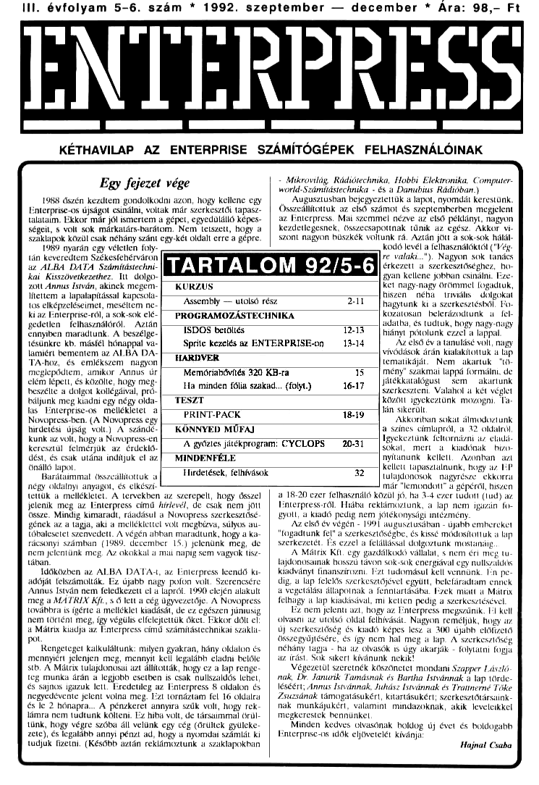

# Enterpress 1992/5-6 (1992.09-12)

[Оригінальний PDF](http://enterprise.iko.hu/magazines/Enterpress_1992-5-6.pdf) (угорською)

## Зміст

## Чернетка вмісту

"page-000.jpg" ------------------------------------------------------------ 
III. évfolyam 5-6. szám " 1992. szeptember — december t Ára: 98.- Ft

ENTEKPKL55

SEZÉKÉRÉÉEEKE—, TESSEK] ESZTET MESE ZTE SZESZT TnT EZZEE
KÉTHAVILAP AZ ENTERPRISE SZÁMÍTÓGÉPEK FELHASZNÁLÓINAK

j. ikroválág,, Rödéöteehrika;: Hobbl, Elektronika, Camputer-:
Egy fejezet vége tvortd:Számttástechnika : és a Danubius Rádióban)

d vás üézütletn. dögdblkölbr azót hágy köllétetlgj: ) . Allgusztatosni belEpjEELtŐK ő Iapol, formák Kéréltbnte
Enterprisc-os újságot csinálni, voltak már szerkesztői tapasz- )  Összeállítottuk az első számot és szeptemberben megjelent
talatam, Ekkor már jól ismertem a gépet, egyedülálló képes) az Enterpress. Mai szemmel nézve az első példányt, nagyon
ég ÖVÖN tok méretére bárálbi ége telétölk boy A.) kezdellejesnek, összessapolínak Jdnik az ét. Mikor ti
TÁ KEZO CST Bár Ant Ely ét ölddlt ötre a Kégéel ] Jiont nagyon bhsékék voltunk 24. AÁn JÓL sákége hált

1989 nyarán egy véletlen foly kodó levél a felhasználótól C Vég
tá kevezsélem Székestetérváros tr valák"), Nagyon ák tanáés
SZ ALBA DATA számtásoeni IL ZENIT IEJEET Ő Set ő szerkesztőséghez, ha
hal. Kisszövetkezethez. Itt. dolgo: fan kellene jobban cl ze
zott Annus István, akinek megem-[  KURZUS ket nagy-nagy örömmel fogadtuk,
tettem al fapnlapítással kapcsolt: á hiszen. nék -tevlelie . döleokai
tos elképzeléseimet, meséltem ne- [Assembly — utolsó rész hagytunk ki a szerkesztésből, Fo-
Miaz Enterpetss ról a sök-tök elé.) FROGRAMOZÁSTECHNIKA kozátosám, belerázoátamk ak fek
fedetten, felhasználóról Aztán £ senbe, és tudtuk, bogy magy-nugy
ennyiben maradtunk. A beszélge- ISDOS betöltés hiányt pótolunk ezzel a lappal.
tésünkre kh. másfél hónappal va: Sprite kezelés az ENTERPRISEEon Az cső év a tinutásé vol, magy
járt beméntem Sz ALBA DA eggye  vívádások árán kialakítottuk a Lt,
TA-hoz, ús emlékizem nigyos et temerikáját. Nem, akartuk "tet
megkepddtem, amikor Annt úr] — MEmdasÖTTAT BET KÖZG 157 mény szakmai lappá formálni, de
cé lépett, ét közölte, hogy megy szzszgo fárékkaralógust . sem, akartnk
beszélte a dolgot kollégáival, pró- ireleezmázáeiszzalzzmankasátk sat ka ) 16-17 (szerkeszteni. Valahol a két véglet
báljunit meg kinn egy négy oida-]" TESZT közén igyekeztünk mozogni, Ta
lás Bnlerrébs os mülékétet a k 57 im skerát
Novopress-ben. (A Novopress egy TERNETAOK 18 Akkoriban sokat álmodoztunk
hirdetési újság volt.) A szándé-] . KÖNNYED MŰFAJ a színes címlapról, a 32 oldalról,

kunk az volt, hogy a Novopress-en za jtékprográra; GYELÖPS ül Igyekeztünk feltornázni az eldd;
keresztül felmérjük az érdeklő. A győztes játékprogram: CYCLOPS 20-31 (sokat, mert a kiudónak bhizo-

dést, és csak utána indítjuk el az MINDENFÉLE nyítanunk. kellett, Azonban azt

Hirdetések, felhívások tulajdoncsok, tagyrésze ekkorra

önálló lapot,

Barátaimmal összeállítottuk a
négy oldalnyi anyagot, és elkés már "lemondott" a gépéről, hiszen
tettük a mellékletet. A tervekben az szerepelt, hogy összel ) 4 18-20 ezer felhasználó közül jó, ha 3-4 ezer tudott (1ud) az
jelenik meg az Enterpress című hírlevél, de csak nem jött) Enterpress-ról. Hiába reklámöztunk, a lap nem igazán fu-

Össze. Mindig kimaradt, ráadásul a Novopress szerkesztősé- (gyott, a kiadó pedig nem jótékonysági intézmény,
gének az a tagja, aki a melléklettel volt megbízva, súlyos au. Az első év végén - 1991 augusztusában - újabb emhereket
tóbalesetet szenvedett. A végén abban maradtunk, hogy a "fogadtunk fel" a szerkesztőségbe, és kissé módosítottuk a lap,
rácsonyi számban (1989. december 15.) jelenünk meg, de) szerkezetét. És ezzel a felállással dolgoztunk mostanáig,
nem jelentünk meg. Az okokkal a mai napig sem vagyak tisz- A Mátrix Kft. egy gazdálkodó vállalat, s nem éri meg tu.
tában. lajdonosainak bosszú távon sok-sok energiával egy nullszaldós
Időközben az ALBA DATA-, az Enterpress leendő ki: ) kiadványt finanszírozni. zt tudomásul kell vennünk. Tin pe-
adóját felszámolták. Ez újabb nagy pofon volt. Szerencsére) dig, a lap felelős szerkesztőjével együtt, belefáradtam ennek
Annus István nem feledkezett el a lapról. 1990 elején alakult. 4 vegetálási állapotnak a fenntartásába. Fzek miatt a Mátrix
meg a MÁTRIX KÍt., 5 ő lett a cég ügyvezetője. A Novopress ! felhagy a lap kiadásával, mi ketten pedig a szerkesztésével.
továbbra is ígérte a melléklet kiadását, de ez egészen júniusig EZ nem jelenti azt, hogy az Enterpress megszűnik. T! kelt
nem történt meg, így végülis elfelejtettük őket. Ekkor dőlt el olvasni az utolsó oktat felhívását. Nagyon reméljük, hogy az
a Mátrix kiadja az Fnterpress című számítástechnikai szakla- Új szerkesztőség és kiadó képes lesz a 300 újabb előfizető
pot. összegyüjtésére, és így nem hal meg a lap. A szerkesztőség
Rengeteget kalkuláltunk: milyen gyakran, hány oldalon és néhány tagja - ha az olvasók is úgy akarják - folytatni fogja
mennyiért jelenjen meg, mennyit kell legalább eladni belőle az írást. Sak sikert kívánunk nekik!
Stb. A Mátrix tulajdonosai azt állították, hogy ez a lap renge. Végezetül szeretnék köszönetet mondani Szapper László.
teg munka árán a legjobb esetben ís csak nullszaldós lehet, nak, Dr. Janurik Tamásnak és Bartha Istvánnak a lap törd
És sajnos igazuk lett. Eredetileg az Enterpress 8 oldalon és léséért; Annus Istvánnak, Juhász Istvánnak és Trattnemé Tőke
negyedévente jelent volna meg. Ezt tornáztam fel 16 oldalra Zsuzsának támogatásukért, kitartásukért; szerkesztőtársaink-
És le 2 hónapra... A pénzkeret annyira szűk volt, hogy rek- nak munkájukért, valamint mindazoknak, akik leveleikkel
lámra nem tudtunk költeni. Ez hiba volt, de társaimmal örül- megkerestek bennünket,
1únk, hogy végre szóba áll velünk egy cég (őrültek gyüleke. Minden kedves olvasónak boldog új évet és boldogabb
7ete), és legalább annyi pénzt ad, hogy a nyomdai számlát ki Enterprise-os idők eljövetelét kívánja
tudjuk fizetni. (Később aztán reklámoztunk a szaklapokban Hajnal Csaba

"page-001.jpg" ------------------------------------------------------------ 
2 Kurzus

LNI LRER I:

33 1992. szeptember — december

ASSEMBLY

Utolsó rész

Az általam szerkesztett Assembly sorozat utolsó darabja-
ként két "nagy ágyút" szeretnék elsútni, amelyeket már régóta
tartogatok.

Az első a GLTX. Egy kíváló barátom írta ezt a rendkívül
ügyes rendszerbővítést, amely jelentősen feljavítja a beépített
szövegszerkesztőt. A programlista tanulmányozása igen tanul-
Ságos, hiszen rutinjai sok mindenről - az EXOS rendszerbővítő
kialakításától kezdve a fájlkezelésen át, egészen a nyomtatáve-
zérlésig - szólnak.

A második POSTER MACHINI! címet viselő programmal
Lorigraph-fal készített LORES 2 típusú grafikákat lehet attri.
Dátum típusúvá alakítani és színezni. A program elsődleges céljá
- a sorozatra nézve - bemutatni egy gépi kódú rutínokkal tele-
tűzdelt Basic program felépítését. A Basic rész végzi a teljes
program vezérlését, a gépi kódú betétek pedig a sebességkriti-
kus részeket, szolgáltatásokat valósítják meg.

Befejezésképpen minden Olvasómnak sok sikert kívánok
programjaik készítéséhez. Remélem, kicsit segítettem. abban,
hogy mindegyikük elindulhasson ezen az úton.

(vége)

-HCs-

GLTX a WP feljavításához

A GLTX program célja: a beépített szövegszerkesztöprog-
ram bővítése, a szövegfeldolgozás megkönnyítése (elsősorban
magnós konfigurációnál). A program lehetővé teszi

CA teljes magyar ékezetes karakterkészlet használatát, úgy,
hogy az mind az angol, mind a német billenyűzetű gépeken
egyaránt használható legyen,

- Vezérlőkarakterek elhelyezését a szövegben, amit nem a
program értelmez, hanem közvetlenül a printer és így lehetővé
teszi egy EPSON-kompatibilis nyomtató valamennyi lehetősé-
ének kihasználását.

- Továbbá egy érdekes szolgáltatást ís nyújt a GLTX! Ez a
"TXRAM funkció, Ez tulajdonképpen nem más, mini egy háttér
EDITOR, amelybe elküldhetjük a szövegszerkesztőben lévő
Szöveget, majd bármikor - a kurzor poziciójától kezdődően -
visszatölthetjük. Lehetőség van a TXRAM tartalmának háttér-
tárolón történő tárolására és visszatöltésére is.

A GLTX-nek van egy saját helptáblája, amit bármikor meg-
tekinthetünk. Ezen a GLÍX parancsai vannak. A helptábla
megtekintése WP-ből;

ssük le az F8 billentyűt, majd gépeljük be: HELP GLTX.

A tábla ekkor megjelenik és az ENTER billentyű leütésével
térhetünk vissza a szövegbe. Ennek a helptáblának az az előnye,
hogy a HELP GLTX parancsra nem az aktuális szerkesztőcst-
tornára írja a help-et, hanem megjelenít egy táblát, és így nem
rontja el a WP-ben szerkesztett szövege.

A GLTX betöltése
Betöltés WP-ből: FI
Betöltés BASIC-ból : FI vagy LOAD
A program betöltése urán látszólag nem történik semmi;
mert a GLTX egy rendszerbővítés. A program jelenlétét elle-
nőrizhetjük, ha BASIC-ben kiadjuk a :HELP parancsot.

A magyar ékezetes karakterkészlet

A magyar ékezetes karakterkészletet a :GLH paranccsal ak-
tívizálhatjuk. A karakterkészlet alapállapotba állítása a :GLTX
paranccsal történik.

A magyar betűk definiálásán kívül a program 5 funkcióbil-
tentyűt ís definiál, Ezek a következők:

SHTETAFI Szövegrész törlése kurzor alatt behúzással

SHIT F2 Szövegrész törlése kurzor felett behúzással

SHIFT--F3 Szövegrész törlése áluról felfelé

SHIFT F4 Szövegrész törlése felüről lefelé

SHIFT FS Sorok bekezdésbe szerkesztése

Szövegek nyomtatása

a szövegszerkesztő tartalmának kinyomtatását a GLP pa-
ranccsal indíthatjuk. Ekkor a program megkérdezi az egység és
az állomány nevét, majd megkezdi a szöveg elküldését. Az egy-
Ség és filenév megadására azért van szükség, mert így nem csak
a nyomtatóra, hanem pl. kazettára vagy lemezre is vihetjük a
Szöveget vezérlőkarakterekkel együtt.

A GLP a következőket figyeli a szöveg nyomtatása közben;

Ha talál egy ASCII 155 kódú karaktert, akkor e karakter
helyett ASCII 27-et küld, Így egy escape szekvenciát küldhe-
tünk a printernek, amellyel bizonyos nyomtatási képek állítha-
tók be. Fzeket az adott EPSON kompatíbilis nyomtató kézi.
könyvéből nézhetjük ki

Úla a program talál egy ASCII 156) /ALTAt a német gépe-
keni karakter,

felfüggeszti a nyomtatást és vár mindaddig, míg le nem út-
jük az ENTER

billentyűt. Ez a PAUSE funkció. Ilyenkor a keret szine kék-
ról pirosra

változik, jelezvén, hogy billentyűleütére vár.

Ha a program kettő darab CTÍRS$(156) kódú karaktert talál,
akkor végrehajt

egy lápdobást. ( FF : Form Feed )

A nyomtatás az ESC billentyűvel ís megállítható.

(Ezeket a kódokat természetesen egyszerű billentyűlenyomár-
sal tesszük a WP-be. Német gépeken az ASCII 156-hoz például
az JALTJ(T billentyűket. A szerk.)

A TXRAM

ATXRAM tulajdonképpen egy háttér EDITOR. Ebbe el
menthetjük a szövegszerkesztő tartalmát, és bármikor vissza-
tölthetjük a kurzor pozíciójától kezdődően. A TXRAM-ban lé.
vő szöveget eltárolhatjuk háttértárolón, vagy

kinyomtathatjuk.

A TXRAM parancsai:

TXDEF - létrebozza a TXRAM-ot. (Ha a rendszer nem
tud elegendő micnnyiségű RAM-ot lefoglalni, hibaüzenetet kü-
Punk)

TXCLR - Törli a TXRAM-han lévő szöveget. (A TXRAM-
ot nem szünteti meg.)

TXSAVE - A szövegszerkesztőben lévő szöveget átmásolja
a TXRAM-ba.

TXLOAD - A TXRAM-ban lévő szöveget másolja át a szó-
vegszerkesztőbe.

SAVETX - A TXRAM-ban lévő szöveget menti háttértá-
rolóra editor formátumban.

Az egység és államánynevet kéri. Alapértelmezés: TAPE-1,

LOADTX - Háttértárról a TXRAM-ba tölt egy file-t. AS.
CII és editor formátumú állományok egyaránt betölthetők. Be-
kéri az egység és állománynevet.

TXPRN - A TXRAM-ban lévő szöveget küldi ki a meg-
adott perifériára ASCII formában. Alapértelmezés; PRINT.

Hogy mire jó a TXRAM? Például.

igy ismétlődő szövegrészt eltárolunk a TXRAM-ban, és
amikor csak kell előhívjuk. Így sok felesleges gépeléstől men.
tesülünk.

- Ha váltani akarunk 40 vagy 80 karakteres üzemmód kö-
zött a WP tartalma elvész, ezért ítt is használhatjuk a
TXRAM-ot, mert ez megőrzi tartalmát.

- Használható még editor formátumú állományok összefű-
zésére ís, Amikor a Wp betölt egy szöveget, töri a már meg.
lévőt. Így nem tudunk szövegeket összemásolni, De, ha a hoz-
záfüzendő szöveget a TXRAM-ba töltjük és ebből másoljuk át
a szövegszerkesztőbe, akkor megoldható ez a probléma is.

Ráadásul a GUTX bármilyen alkalmazói programból meg;
hívható!

"Tájékoztatásul közlöm, hogy a TXRAM a 254-es csatornán
van megnyitva és tartozik hozzá egy x-40 y-3 méretű 80 ka-
rükteres videolap 4 109-es csatornán.

- Göbölös László -
"page-002.jpg" ------------------------------------------------------------ 
1992. szeptember — december

Kurzus

3

GGLTX 611988 by Ladislas
gitx ld ac
dec a
dec a
jr 2, induló
dec a
help orb
jr 2,nagybo
call controd
(d aOtfh
push be
Push de
call hpscr
(d a, 1134
(d be, vege2-szovegg
1 de, szovegg
exos 8
ld a, 1134
(d b,1
id e/1d
Ld 45204
td eúd
exos Td ;display video
cíkl ld a,o7d
ut (ObSh) a
ún a, (Ob5h$
sub 1914
úr zyexcikl
jr cikk
excikl dd a,1134
exos 3

nagyho ld a,Offh
push be
Push de
1d be, veget-szovegg
Ld de szovegg
exos B
Pop de
Pop be
or a
ret
ánduló call contro0
ip nz,txsave
(d Cregist0) , sp
call fprg0
1d sp,(regist0)

contro0 push be

push de

Push hi

(d hi, szovegő
ellenő ine de

ánc hi

td a, (de)

cp. hO

jr nz,nemjod

djnz ellenő
nenjod pop hl

Pop de

pop be

ret
szovegő defb 4

defa "GLDE"
registő defu 0
fprg0 ld b0

1d c/29

exos 16

td ad

push af

1d bó

exos 11

ld e/0

(d sp, (regist0)

tasave

ándul

control

ellen

nenjo

szoveg

regist
tprg

txload

ándut2

controz

ellen

nemjoZ

szovegő

re

(d ae

dec a

dec a

jr z,ándul
dec a

call control
úr nz,txload
la Cregist) sp
call tprg

(d sp, Cregist)
ld ca

ret

Push be

Push de

Push hi

(d hi, szoveg
inc de

ne ht

(d a, (de)

ep Ch

Jr nz,nenjo
djnz ellen
pop ht

Pop de

Pop be

ret

defb 6

def "TXSAVE
defu 0

td bh

(d c20h

td d/OcOh
exos 10

(d a,Zd

cut (Ob5h) ,a
án a, (ObSh)
sub 127d

jr zvissza

1d a,255d
exos Sd

sub Oeáh

jr z,vissza
1d a,254d
exos 74

úr manci

1d sp, (regist)
ld c

ret

(d aze

dec a

dec a

úr z,índulz
dec a

ret nz

call controZ
jr nz,txelr

(d (regist2) , sp
call fprg2

(d sp, (regist2)
ld ca

ret

Push be
Push de
Push hl

(d hl, szoveg?
ánc de

áne hi

id a, (de)
cp Ch)

jr nz,nemjoz
díjnz ellenz
Pop hl

Pop de

Pop be

ret

defb 6

defm "TXLOAD"

"page-003.jpg" ------------------------------------------------------------ 
4 Kurzus

1992. szeptember — december

regist2 detv 0
fprg2 ld b,1h
ld c20h
(d d; OcOh
exos. 10h
Pisti ld a,3d
out. (Obőh) a
án a, COb5h$
sub 127d
jr z,visszaz
ld a,256d
exos d
sub 0eáh
jr zovisszaz
1d a,255d
exos 7d
jr pisti
visszaz ld sp,(regist2)
d cÓ
ret
txelr Ad ac
dec a
dec
jr zinduls
dec a
ret nz
indul call control
jr nz,tadef
1d (regist3), sp
call fprg3
id sp,(regist3)
id csa
ret

contros push bc
Push de
Push hi
(d hi, szovegő
ellens ime de
inc ht
ld a, (de)
ep Ch
4r nz,nenjos
dínz ellen;
nenjos pop ht
Pop de

pop be
ret

szovegő defb 5
defm "TXELRT
regist3 defv 0
fprg3 ld a,2Súd
(d b, 1ah
exos 7d
(d sp, (regist3)
ld €/0
ret
txdef dd
dec a
dec a
úr z,indulá
dec a
ret az
Ándulá call controk
3p nzgip
1d (registó) , sp
call tprgk
ld sp,(registó)
td ca
ret
controk push be
Push de
Push ht
(d hi, szovegé
ellené in de
ne ht
(d a, (de)
ep Ch
jr nz,nemjok
dínz ellené

nemjot pop hl
Pop de
Pop be
ret
szoveg defb S
defm "MADE"
registá defu 0
fprgá ld b,
ld c,224
1 d/2d
exos 16d  ;video mode
td b/1
(d c/24d
(d d/40d
exos T6d  ;video x
td b,1,
ld c/254
(d d/3d
exos 16d  ;video y
(d b.1
ld e,234
1d d/0
exos 16d ;video color
id a, 1094
id de,vid
exos 1
edítor Ad b,
ld c/314
1d d, 2504
exos 16d
ld b,1
ld e,294
Ld 47109
exos 16d
(d a,2544
(d de,edi
exos (d
(d sp, (registó)
td e.Ő
ret
édi detb 7
defm vedítor:"
úd defb 6
defm "video"
alp ld ac
dec a
dec a
jr zyinduls
dec a
ret nz
Andutő call contros
jp nz,gih
(d (regist5) , sp
catl fprg5
(d sp, (regist5)
td ca
ret
contros push be
push de
push hl
(d ht, szoveg
ellenő íne de
ánc hi
(d a, (de)
cp (hL
Jr nz,nemjos
djoz ellen
nemjos pop ht
Pop de

Pop bc
ret

szoveg defb 3
def "GLP"
registő def 0
1prg5 ip prnopen
kezdel Id b,1
Ld e/Otbh
Ld d; 24h
exos 10
(d b,1h
ld c/20h
"page-004.jpg" ------------------------------------------------------------ 
1992. szeptember — decembi Kurzus 5
Ta azocon ret
xos 10 szovegő defb 3
Olvas ld a,3d defn "GUN"
ut. (0b5h) va registő defu 0
4n a, (OBShÓ fprg td b0
sub 1274 1d c/304
úr bef xos 1éd ;ask edítor key
1d azott ld ad
eros 5 Ld b8d
sub 0eéh ld cd
úr z,bet ld de, fkeyt
1d ab exos 114
sub 4554 td bo
Jr 2,cape (d c,304
ld ab exos 169 ;ask edítor key
sub Ó9eh id ad
jr zallj 1d by8d
1d a,160d 1d 94
1d de, fkey2
vi xos í1d
cape ld a,1604 14 b.0
Ld b,otbh Ld c/304
txos 164
s ld ad
allj d azoFFh 1d b84
exos S Ld c/104
(d a.b ld de fkey3
u Ő9eh exos Ítd
je zneutap id bo
ait d bon 1d c,304
1d czotbh xos 1éd ;ask edítor key
Ld d4o49h (d ad
sxos 101 td b8d
uait2 [d a,ozd 1d ezta
out. (ObSh) a (d de fkeyő
án a, (Ob5hő exos ítd
sub 4914 1.60
úr zvolvas ld c/309
úr wait2 €xos 164 ask edítor key
olvasd ld b,0T ld ad
Ld ezőtbh ld bd
1d d4ozáh ld et2g
xos 101 (d dev fkeyő
úr olvas exos Í1d
bef jpprnels 1d bő
Vissza td b,1 tá e/29
1d e/őtbh exos Tézvideő csat. lekerdez
td 440 id ad
sxos 101 push af
14 sp, Cregist5) ld bé
ta ező pop af
ret 1d be, 20712
meulap (d a,1604 1d de.kezdet
1d b, 124 mxosú —— ;blokk irasa
exos 74 (d e
JP olvas Ld sp, (regit)
gin "
defb 24, 1604, 1619
dec s defb 2d, 164d, 1654
úr 2, induló defb 2d,176d, 161d
dec a jefb 2. 1804, 161d
ret nz defb 4d, 1ótd; 1684, 1804, 1854.
ándul§ call contro8 fb" 1bh,K! ,1á5,12,26, 60, 102, 126, 102, 102,0,0
ip nz,savetx defb 1bh,K,151,12/24,126,96, 12096, 126,0,
14 (registőb ,sp defb bh, "K!,133,12,24/60,24,26.24,60,0,
cat. fprgői defb  1bh,tK",16, 12/2460, 102,102, 102, 102, 60,0
(d sp.(regist8) defb  1bh,!K",148,56,56,60,102,102, 102, 102,60,0
kor a defb  1bh, IK! ,154/12,26, 102, 10, 102, 106, 102 ,6,0
defb  1Eh, IK! , 149,27,56,0, 102, 162, 102, 162,60,0
defb  1bh, IK! ,129,12,24/60,6,62, 102, 62,0,0
contro8 push be defb  1bh, IK! ,147,12, 2660, 102, 126, 96, 60/0,0
Push de defb  1bh, IK! ,152,12,26,5626, 24.26, 60,070
Push hi defb  1bh,K",154,12,26,60,102, 102, 102,60,0,0
(d hi, szövegő defb Toh, K!,135,27, 5460, 102, 102, 102, 60070
ellenő ine de defb  1bh,K",156,12,24, 108, 108, 108, 102, 60, 60
áne ht defb  Ibh,!K",138,27,54,0,102, 102, 102, 60,0,0
(d a,tde) defb  1bh,"K,155,16,24,28,30,31,30,26,24,16
ep (hU) defb bh, !K!,156,60,126, 285, 255255 255 , 955, 126,60
jr nznenjob defb bh, !K",139,102,0,60, 102, 102, 162,66,0,6
djnz ellenő defb bh, !K",140,102,0, 102, 102, 102, 102,60,0,0
nenjoő Pop hi defb  1bh,!K",137,102,60,102, 102, 102, 10,60,0,0
Pop de defb  1bh,!K" , 143, 102,66, 102, 102, 102, 102,60,0,0.

Pop be
"page-005.jpg" ------------------------------------------------------------ 
6 Kurzus 1992. szeptember — december
szevegg defb 4 magno defb 4
defa "ELTK version 1.10 -(e) Ladislas defm 9TAPE:"
defb 15.10 puffer defm "
veg; Savetx Ld aye
defb 1bh, "c! ,73,219,88,88,0,0,0,0 dec a
rátten Gy Ladiólas (691988 resáásd
defb 135,10 Ír z,indulg
defm "LM Hungary Mode and nev FKEVS" kat
defb 13.10 tet né
defn " /GLIX  elear fent" ándul9  calt contro9
defn 15.10 Íp nz, tosdtx
6Lp printer program :" 18 (regist93, sp
defo 13.10 call tere?
defn " ALTE C 2 ESCape tő printer 16 ás teegistől
defb 13.10 kor a
defn " LTE ÁE PAUSE  printingt 14-izé
defő 13.10 ret
defn " LTE ME FF Form Feed! cérítró9 push-be
defb 13.10 ush de
defn " ENTER 7 Contínue prántáng! inertásrj
defb 18.10 Ta hi,szovegy
defa " Est 2 áreak  printingt átiégi e ét
defb 1510 pen
em" TADEF make the TXRAN 1d a, (de)
defb 13.10 cp (AL)
efa" TKCLR clear the TXRAN Jr azynenjo9
defb 13.10 djnz ellen
efm " TKSAVE save text Íntő TXRANT venjőb 409.
defb 13510 Pop de
ef" TÁLOKD load text from TXRAN jzosztsszó
defb 13.10 Ter
efa" SAVETK save the TXRANT szoveg? defb 6
defb 13,10 efa "SAVETK"
efm "  LOADTX load the TXRAN vegeg ;
efa 13.10 Tegist9 defv 0
efa" TEPN print the TXRAN ferjgáerenét eve
defb 15.10, ment Ld a,106d
defu "FÓ-FI2 delete lines. FI3 arranget Tá deze ten
defb 13.10 exos gd
detb 13.10 1d a,z54d
detn " Press ENTER!" Eb
vegez; 1d c,1064
defn "ladíalas softuaret xos 114,
; 14. a, 1069
fárstz defb 274, 165133 esos 34
defb 27,44,151,166 14 spelregistő)
defb 2744, 153,175 ta czó
defb 27/4,146/168 ká
defb 27/64/168,167 londtx Ld ac
defb 27/44,156,169 b
defb 2744, 149170 dec a
defn 27/44,129,160 jr 2, induta
defb 2744, 147,156 dec a
defb 27, 44, 152161 ret az
defb 2744, 156, 162 ándulg call controg
defb 27/44,156,163 Pp neytaprn
defn 27/44,158,165 (a (regista),sp
defb 27/44,135/166 catl tprga,
def 2744,137.151 ta sp, (regista)
defb 2744, 143,152 kor a
defo 27.44, 159,147 ld eza
defn 27.44, 160148 het
last; controg Push be
prnopen d de,nyontat push de
tá c,ő bush hi
€xos 194 14 hiszovega
call input elleng  inc de
(d a,1604 áne ht
14 deyfilen 14 artde)
exos ég cp 0)
14 a,1604 ár nz,nenjog
(d be, last2-tirsta djnz elteng
(d de. tirst2 műjog éé5 At
os 6 Pop de
jp kezdet pop be
prncls td de. nagno ret
szovega defb 6
defn "LOKDTK"
vege;
fegista defv 0
forga call input
nyomtat tolt Ad a,106d

defm "PRINTER:"

"page-006.jpg" ------------------------------------------------------------ 
1992. szeptember — december Kurzus 7
jat Tri
stat la ayitég utiz; a
ig eöa ta titeg
teren ljóla ver
a ap. trégratak 1d e/26d
Írségátá 14 d4404
ret exos Tód jvidesx
Tó az 14 szátú
Meder tjtsásátá
d d. 40d 1 devid
la ar34 Ve gye
Ma 18
FA szlraltánbk
8xos set edítor key kepriáte
föl Téá jet mátor key fentü
e KNLNEK
La újít jölszdé vé
SÉTA gaton tára MEM agy
(d c,3td ns
441 Sátátessg
TÉRT dg jeáttor ater heajav Eg
jedi fan dt
15 ; izibe
18-8.114 szovegy defb 5
14 ds (defm $TXPANY
tsegnaegrűl Hg)
tett sr atttató
zta 97 olvas
tl gét ATS
iatenboyttá HEÖLN
ta mitínéme 4
kH réa
Hasa tő

"page-007.jpg" ------------------------------------------------------------ 
B Kurzus 1992. szeptember — december

A POSTER MACHINE programlistája

100 PROGRAM "POSTER"

110 ALLOCATE 1100

120 SET INTERRUPT STOP OFF
130 WHEN EXCEPTION USE LETSGO
140 — CLEAR FONT

150 — SET FKEY 1 "LORI37

160 — SET FKEY 2 "TAPE
170 — SET FKEY 3 "DISK;
180 — CLEAR SCREEN

190 SET 270

200 — TEXT 40

210 SET 26,1

220 SET 61

230 — SET $102:PALETTE O,CYAN, 0, YELLOW

240 — CODE RTN-HEX$("0,0,0,0,0,0,0,0,0,0,0,0,0,0,0,07)

250 — CODE BOXlHEX$("ÉS,ES,DD,E1,DD,46,4,16,0,DD,5E,1,21,0,0,19,10,FD,DD,5E,
0,19,DD,SEVE,DD,56.F,19,DD,15.7,DD.74/6-)

260 — CODE sHÉXS("DD,el,DD,6E,7,DD,66,8,11,0,CO,DD,46,3,DD,4E,2,E5,7E,12,DD,
7R,B,77,23,13,D,20,F5,E1,D5,16,0,DD,5E,,19,D1,10,E6,C9")

270 CODE PAPSHEXS("JE,1,D3,B5,DB,B5,FE,BF,28,D,FE,DF,28,14,FE,F7,28,2F,FE,

280 18,9,DD,7E,5,3C,E6,F,DD,77,05,CB,

290

300

no

320

330

340

FE,d,28,3F,FE,
350 — CODE -HÉXS("FE,
360 — CODE

370 CODE
380 — CODE
390 CODE
400 CODE

410 — CODE JI
420 — CODE BLEHEXS ("CD") EWORDS(
430 — CODE Bi

440 — CODE -HEXS("DD,7E,0,DD, 86, 2,DD,46,4,0,BB,C8,DD,34,2,C9")

450 — CODE -HEXS("DD,7E,2, FE, 1,C8,DD,35,2/C9")

460 — CODE -HEXS( "DD, 7E, 1,DD, 86, 3,DD,46,D,B8,C8,DD,34,3,C9")

470 CODE -HEX$("DD,7E,3,FE,1,C8,DD,35.3.C9")

480 — CODE BOX2-HEXS("E5,DD,el,11,0,C0,DD, 6E,7,DD,66,8,DD, 46, 3,DD,4E,2,ES,
TA,77,23,13,D,20,F9,EL,D5,16,0,DD,5E,4,19,D1,10,EA,C97)

490 CODE BOXSZHEXS("ES,DD,01,11,0,C0,DD,6E,7,DD,66,8,DD,46,3,DD,4E,2,ES,
ÍR DS, CB, BF, CB, B7, CB AP CB,A7, DD, 5E, 5, CB, 3, CB, 3,CB, 3,CB, 3,83,DÍ,77,23,
13,D,20,E3,EL1,DS, 16,0,DD,5E,4,19,D1,10,D4,C9")

500 CODE BOXK4-HEXS("E5,DD,El,11,0,CO,DD, 6E,7,DD,66,8,DD,46,3.DD4E2,E5,
TA.D5, CB, 9F,CB,97, CB, őF, CB,87,DD, 5E,6,83,D1,77,23,13,D,2Ó,eb,EL,D5,
16,0,DD,5E,4,19,DÍ,10,dc,C9$")

510 — CODE IOZHEXS("7E,D3,B5,DB,BS,23,C9")

520 — CODE SEO-SHEX$("18,43,0,0,0,0,0,0,0,0,0,07)

530 CODE TABZHEX$("3,FD,2,FD,3,BE,2,BF,3.DF,2,DF,3,FT,2,PT,3,EF,2,EF,3,
FB,2,FB,3,FE,2,PE,5,FE,9,FE.O/0,0,07)

540 CODE COLORSZHEXS( "FŐ, 21") GWORDS ( SEO12) GHEXS ( "21" ) 6HORDS (TAB) SHEXS (76
§.CD")EWORDS (IO) §HEXS ( "BE, 28, 26, 23, CD" ) 6WORDS ( IO) 6HEXS ( "BE, 28, 24, FD,
23,23,10,EE")

550 CODE ZHEXS("3E,5,D3,BS,DB,BS,FE,FB,CO,6,0,E,1C,F7,10,7A,C6,8,57,6,1,
E,1C,F7,10,C9,FD,34,0,18,3,FD,35,0,3E,65,1,A,

0,11")EWORDS ( SE0) 6HEX$("F7,8,C9")

560 — CÖDE LEFT-HEXS("21,0,0,6,0,37,3£,16/0,€1
f1.C9,3£,cS.1.0,0,9.ebrcéred,áz,el18,£07)

570 CODE RIGÜSHEXS("21,0,0,6/0,37,3£,16,0,cb,1E,23,15,7a,20,£9,38,3,10,
f1,c9,3f,c5,1,0,0,ED,42,cb,FE,9,c1,18,£07)

s80 CODE SOLEHEXS("3E,0,D3,B5,DB,B5, FE,DF, CA" ) 6HORDS (LEFT) GHEXS ( "
FT, CAP) ENORDS (RIGÁJÉHEXS ( 09),

590 CODE PRISHEX$("3A,9,2,FS,DD,ES5, 3E, 1B,32,9,2,26,0,DD, 6E,5,37,/E,20,D7,
39,0,DD,E1,26,0/,DD, 6E, 6, 37,E,20,D7,39,0,F1,32.9,2,C9")

600 — CODE VARSZHEZSL( "CD" ) WORDS ( BILL) GHEXS$ ( "CD" ) 6YORDS ( PAP) 6
HEXS ( "CD" ) GWORDS ( PRI )

610 CODE -HEXS ("CD") WORDS ( COLORS ) SHEXS ( "cd" ) 6NORDS$ (SCL)

620 — CODE sHEX$("C9")

É30 CODE ATEDSHEXS("F3,DD,ES,3E,FE,D3,B1,DB,B3,F5.3E,FB.D3.B3,
PB, 21") GMORDS (RTN ) £HEXS ( "CD" ) EMORDS ( VARS ) SHEXS ( "0, 21" ) 6WORDS (RTN) 6
HEKS ( "CD" LENÖRDS (BOX. I EHEXS 3E,69,F7,5,78,0,21" ) §WORDS$(RTN)

640 CODE sHEX$("FE,AB,28,E5,FE,A4,28,D,FE,AO,28,E,FED,28.P,CD")E
HORDS ( BOX2 ) GHEXS ( "18, DA , CD" ) GWORDS ( BOX3 ) £HEXS ( "18, cf , CD") 6

6,2b,15,7a,20,f9,38,3,10,

"page-008.jpg" ------------------------------------------------------------ 
1992. szeptember — december Kurzus

WORDS (BOXA ) EHEXS (718, Ca, 217) WORDS (RTN) EHEXS ( "CD" ) EHORDS (BOX2)
HEXS(SF3,F1,D3,B3, 3E,F9,D3,B1,DD,EL,FB,C9")
650 CODE RSTCHEXS( "11 )EWORDS(RST:6) ÉHES ("F7, 1A,C9,5")E"BASIC"
660 — POKE 49144/REM(RST,256):POKE 49145, INT(RST/256)
670 — LET AZPEEK(49140)t256"PEEK(49141):6
680 — FPOKE A,O:POKE At1,31:POKE At2,0:POKE At2,0
690 — CALL USR(KURSIV,0)
700 — NUMERIC $D(1 TO 13)
710 LET DE, BC, X,Y, KC, FLG-.
720 — CLEAR 4102
130 — REM CALL SCRIN("POSTER.SCR")
740 REM CALL ATRIN("POSTER.ATR!)
150 — REM DISPLAY FI1OL:AT 4 FROM 1 TO SD(4)
760 — PRINT $102,AT 2,16:"THATSS IT!"
770 PRINT $102,AT 16, 12:"ENTERPRISE UTILITY"
780 PRINT $102,AT 18, 15:"VERSION 1.007
190 PRINT A102,AT 23,8:"- PRESS ENTER BAR TO CONTINUE -"
800 INPUT $105:AS
810 — REM CLOSE 101
820 — REM CLOSE $27
830 — LET DE, BC,X,Y,KC,FLG-O:LET XS
840 — CLEAR 4102
850 SET $102:PALETTE O,CYAN,O, YELLOW
860 SET 26,1
870 DISPLAY $102:AT 1 FROM 1 TO 24
880 PRINT AT 2371
890 PRINT £102,AT
900 PRINT £102,AT
910 PRINT $102,AT
920 — PRINT £102,AT
930 PRINT $102,AT
940 PRINT $102,AT

:LET XS;

:LET YS-9:LET FNSZt"

:LET YS-9:LET FN$Z""

KG POSTER MACHINE MENU 522"
1 - LORD SCREEN"
"2 - LORD ATTRIBUTES"
SAVE SCREEN"
SAVE ATTRIBUTES"
GO TO EDITOR"

950 — PRINT $102,AT HELP PAGE"
960 — PRINT $102,AT SAVE DEFINITIVE"
970 — PRINT $102;,AT INITIAL"
980 — GET $105:H$
990 — SELECT CASE VAL(H$)
1000 CASE
1010 CALL FILENAME
1020 CALL SCRIN(FN$)

1030 GOTO 840
1040 CASE 2

1050 CALL FILENAME
1060 CALL ATRIN(FN$)
1070 GOTO 840
1080 CASE 3
1090 CALL FILENAME
1100 LET HEAD-1
1110 CALL SCROUT(FN$)
1120 GOTO 840
1130 CASE 4
1140 CALL FILENAME
1150 CALL ATROUT(FN$)
1160 GOTO 840
1170 CASE 5
1180 IF FLGzl THEN CALL ATRED
1190 GOTO 840

1200 CASE 6

1210 CALL HELP

1220 GOTO 840

1230
1240
1250 IF FLG-O THEN 840
1260 CALL FILENAME

1270 LET XNSZFNSG".BIT"

1280 CALL SCROUT(XN$)

1290 LET YNSZFNS6".ATR"

1300 CALL ATROUT(YN$)

1310 GOTO 840

1320 CASE 8

1330 IF FLGz1 THEN

1340 CLOSE 427

1350 CLOSE $101

1360 END IF

1370 GOTO 830

1380 — CASE ELSE

1390 1

1400 — END SELECT

1410 — GOTO 980

1420 — DEF HELP

1430 CLEAR 4102

1440 PRINT CHR$(246);
"page-009.jpg" ------------------------------------------------------------ 
40 Kurzus 1992. szeptember — december

1450 PRINT $£102,AT "c£€ POSTER MACHINE HELP PAGE 555"
1460 PRINT $102,AT

1470 PRINT AI02,AT

1480 PRINT A102,AT CURSOR SIZE"

1490 PRINT F102,AT SET PAPER

1500 PRINT AI102,AT SET INK"

1510 PRINT $102,AT SET COLOURSI

1520 PRINT F102,AT - SET BIAS"

1530 PRINT F102,AT — DONN PAPER ATTRS"
1540 PRINT f102,AT - DOWN INK ATTRS"
1550 PRINT $102,AT - DONN PAPEREINK ATTRS"
1560 PRINT §102,AT - LEFT/RIGHT SCROLL"
1570 PRINT $102,AT 7 OUIT EDITOR"

1580 PRINT $102,AT

1590 PRINT $102,AT 20,3 PRINT ILORI3!"

1600 —— PRINT $I02,AT 21,3 PRINT STAPE: 7

1610 PRINT $102,AT 22,3:". PRINT !DISK:""

1620 PRINT CHR$(246);

1630 PRINT $102,AT 24,11:"- PRESS KEY TO RETURN -"

1640 INPUT $I05:AS

1650 — END DEF
1660 — DEF FILENAME

1670 SET 36,1
1680 SET 37/1

1690 SET 35,255

1700 PRINT AT 23,1:CHR$(161

1710 PRINT AT 24,1:CHR$(161);

1720 INPUT $0,AT 23,1, PROMPT " sFilename? ":FN$
1730 PRINT AT 23,2:CHR$(161);"20K2";

1740

1750

1760

1770 SET 26,0

1780 — END DEF
1790 — DEF ATRIN(ATS)

1800 IF FLGS1 THEN GOTO 2890
1810 POKE BITLD415,6

1820 ——— POKE BITLDr3,REM(KC, 256)

1830 —— POKE BITLDr1Ó,INT(KC/256)
1840 POKE BITIDr12,REM(DE,256)
1850 POKE BITLDt13, INT(DE/256)
1860 OPEN $17:ATS§ ÁCCESS INPUT
1870 —— CALL USR(BITLD,O)

1880 — END DEF
1890 — DEF SCROUT(ROUS)

1900 LET JKSZT"
1910 IF FLGS21 THEN GOTO 2890

1920 POKE BITLD$15,8

1930 POKE BITLD19,REM(KC,256)

1940 POKE BITLDt1Ó,INT(KC/256)

1950 POKE BITLDr12,REM(BC, 256)

1960 POKE BITLDt13, INT(BC/256)

1970 OPEN $17:ROUS ACCESS OUTPUT
1980 IF HEAD-O THEN 2080

1990 FOR I51 TO 4

2000 LET JKSZJKSGCHRS$(SD(I))

2010 NEXT I

2020 FOR I-2 TO 9

2030 LET JKSZIKSGCHRS (PEEK(SEOtI))
2040 NEXT I

2050 ASK 28 JK

2060 LET JKSZJKSGCHRS(JK)

2070 PRINT $17:JKS;

2080 CALL USR(BITLD,0)

2090 LET HEAD-O
2100 — END DEF
2110 — DEF ATROUT(A0$)

2120 IF FLGC21 THEN GOTO 2890
2130 POKE BITLDt15,8

2140 POKE BITLD19, REM(KC, 256)
2150 POKE BITLDt10,INT(KC/256)
2160 POKE BITLDr12,REM(DE, 256)
2170 POKE BITLDt13,INT(DE/256)
2180 OPEN $17:AO$ ACCESS OUTPUT
2190 CALL USR(BITLD,0)

2200 — END DEF
2210 — DEF ATRED

2220 DISPLAY 427:AT 27 FROM 1 TO1
2230 DISPLAY $101:AT 1 FROM 1 TO SD(4)
2240 SET $102:PALETTE 0,0,0,0

2250 CALL USR(ATED,0)

2260 — END DEF
2270 — DEF SCRIN(SCRS)
"page-010.jpg" ------------------------------------------------------------ 
1992. szeptember — december

Kurzus

11

2280 SELECT CASE FLG

2290 CASE 0

2300 LET FLG-1

2310 CASE ELSE

2320 GOTO 2930

2330 END SELECT

2340 OPEN $17:SCR$ ACCESS INPUT

2350 FOR A-1 TO 13

2360 GET $17:AS

2370 LET SD(A)-ORD(A$)

2380 NEXT

2390 IF SD(1)625 OR SD(2)c50 THEN

2400 CLOSE $17

2410 LET FLG-0

2420 GOTO 2910

2430 END IF

2440 SET VIDEO MODE 15

2450 SET VIDEO COLOR 0

2460 SET VIDEO X SD(3)

2470 SET VIDEO Y SD(8

2480 OPEN $101:"VIDEO:"

2490 FOR A-5 TO 12

2500 SET COLOR A-5,SD(A)

2510 POKE SBOtA-3,SD(A)

2520 NEXT

2530 SET BIAS SD(13)

2540 65536ÜSR(BITMAP, 0) )-16384

2550 65536-USR(ATRMAP, 0) )-16384

2560 D(3)sSD(4) 49

2570 POKE BITLD19,REM(KC,256):POKE BITLD$10,INT(KC/256):POKE BITLD415,6

2580 POKE BITLD$12,REM(BC, 256):POKE BITLDt13,INT(BC/256)

2590 POKE RTNt7, REM (DE, 256) :POKE RTN48, INT(DE/256)

2600 FOKE RTNt9,REM(HC, 256) :POKE RTNEIÓ,INT(BE/256)

2610 POKE RTN44,SD(3):POKE RTN$5,1:POKE RTNt6,

2620 POKE RTN42,XS:POKE RTN-3,YS:BOKE RTNt11,33

2630 POKE RTN$0,0:POKE RTNt1,Ó:POKE RTN412,SD(4):POKE RTNt13,5D(4)t9

2640 POKE RTNl4,REM(DE,256):POKE RTN115,INT(DE/256)

2650 CALL USR(BITLD,Ó)

2660 POKE LEFTt1,REM(DE-1,256):POKE LEFTt2,INT( (DE-1)/256
POKE LEFTt4,SD(4)"9:POKE LEFTt8,SD(3):POKE LEFTt24,SD(3)

2670 POKE RIGH$1,REM(BC,256):POKE RIGHt2,INT(BC/256):
POKE RIGHt4,5D(4)19:POKE RIGHÍ8,SD(3):POKE RIGHt24,SD(3)

2680 SET VIDEO X 8

2690 SET VIDEO Y 1

2700 SET VIDEO MODE 0

2710 SET VIDEO COLOR 0

2720 OPEN $27:"VIDEO:"

2730 SET $27:PALETTE 0,255,0,0

2740 SET £27:SCROLL OFF

2750 END DEF

2760 END WHEN

2770 LERRORSI

2780 SOUND PITCH 60, DURATION 5
2790 SELECT CASE ERR
2800 CASE 1

2810 — PRINT $102,AT 24,
2820 CASE 2
2830 — PRINT £102,AT 24,2:"trt Select

2840 CASE ELSE
2850 — PRINT $102,AT 24,2:
2860 END SELECT

2870 WAIT 3

2880 EXIT DEF

2890 LET ERR-2

2900 GOTO 2770

2910 LET ERR-1

2920 GOTO 2770

2930 LET ERR-3

2940 GOTO 2770

2950 HANDLER LETSGO

ex Select

2960 — SOUND PITCH 60,DURATION 5
2970 — PRINT AT 24,1:"t9t USER ERROR!
2980 WAIT 3

2990 — CALL USR(RST,0)

3000 END HANDLER

"ax Invalid LORI3 header.

"SCREEN LOAD" function."

MINITIAL" function."

Poster restart."
"page-011.jpg" ------------------------------------------------------------ 
12 Programozástechnika

1992. szeptember — december

ISDOS betöltés

Az ISD. LOAD program az ISDOS automatikus betöltődé-
Sének kicsit kifinomultabb változatát valósítja meg. Az ISDOS
szokványos és általam kigondolt betöltési folyamata az ábrán
látható. Az átalakítást mindössze az EXDOSINI fájlban kell
elvégezni, ahol az ISDOS helyére LOAD ISD. LOAD írandó.
A program ekkor már működni fog, bár még nem látható a
hatása, csak ha megírjuk a megfelelő batch fájlokat. Ezután a
megadott billentyűk egyikének nyomvatartása a megfelelő batch
fájlba irányítja a program futását.

A könnyebb érthetőség kedvéért nézzünk meg egy példát!
A directory-ban a következő fájlok szerepelnek:

18-DOS.SYS
EXDOSINI
AUTOEXEC. BAT
180. LOAD
LTSHBAT

Indításkor, ha nyomva tartottuk a bal Shift billentyűt, az
LTSH.BAT, egyébként az AUTOEXEC.BAT fut le,

A lehetséges billentyű-fájl kombinációk a vázlatról vagy az
assembly lista végéről leolvashatók.

A programot ASMON-ba kell beírni, majd ISD. LOAD né-
ven 5-ös (NAP) fejléccel fordítani. Aki nem vállalkozik erre, az
Próbálja meg a Basic nyelvű betöltővel, amely a lapban meg-
Szokott betöltőkhöz hasonlóan működik.

Az ISDOSSYS, EXDOSINI, ISD. LOAD valamint a meg-
írt batch fájlokat célszerű /h (hidden) Öpcióval ellátni, így nem
jelennek meg a directory listán.

Hámori György

100 PROGRAN "T5D-1OAD-BAS"
110 ALLOCATE 3507

120 01.00.
00,00,00,00, 00, 00, 00,00,00, 31, FF,3F,
FB,3E,01,03, 85, 0B, 85, CB, 7F, CA, 41 01,
3E,01,03,B5, DB, B5 , CA, 6F ,CA,51,01,3E,

00/0385, DB, ABS, CB.7F)

430 CODE -HEXS("CA,61,01,3E,08,03, 85, DB, 85,
CB, 6F, CA, 71,01,3£,07,03, 85, 08, 85, B ,
7F, CABOT, 11, CA,OT,C3,8E,01,11BB,
01,3£,0A,F7,01,C2,38,01,11,F501,€3,
BELOL, 11, C1,0193

140 CODE zHÉXS("3E,OK, FT,OT,C23BOTT, FF,
01,C3,8E,01,11,9E,01, 5E,0k, FZ,Ó1 , 2,
58,01,11,00,01,C3,BE,OT,11,A7/01,3E,
04,F7/01,C2,38,01,11,DC,O1,C3,BEOT,
11,80,01,3£,0A0)

150 CODE -HEXS("FF,O1, 2, 38,01,11,EB,O1,05,
3E,OA, F7,03,01, FT, 14,11,08,02, FT ,1A,
€3,98,01,08,6C, 54.53, 68, 2E,42,61,54,
085254, 53.48, 2E,62,41,56,07,41/4E,
54,2E,42,61.560

160 CODE -HEXS("OB, 43, 54, 52,4C,2E,42.61, 54
08, 4C,6F ,43,48B, 2E,42,41,54,05,69, 13,
64..6F,73,08,69,73, 66 ,6F , 73.20,2F 4,
56,55,48,08,69,73,64,6F,73,20,2F,52,
56,53,48,0A, 6909

170 CODE -HEXSÉ"7S,64,6F,73,20,2F 61 4C,56,
08,69,73,64,6F , 73, 20, 2F ,43,56,52,6€ ,
08, 69,73,64,6F,T3,20,2F 6C, 4 ,43,68,
02,57,50,00,04,00,00,00,00,00,00,00,
00,00,00,00, 00"

180 CODE -MEXS("O0, 00")

190 CODE VEGE-HEXSÉTO")

200 OPEN H10:"DISK:150. LOAD" ACCESS OUTPUT

210 LET 5-0

220 FOR 1-ELEJE TO VEGE-1

230 PRINT W10:CHRS(PEEKCID);

240 LET SESEPEEKCD

250 NEXT I

260 CLOSE 410

270 IF S026865 THEN

280 PRINT """" ISD LOAD: Hiba az adatokban!!!"

290 ELSE MLOCK DB 11, "isdos /LOCK"
500 PRINT "ISD LOAD rendben!" HÖWP DB 2,évP"
10 EHO IF szatír

7 TSDOS szelektiv betolto
; Hamori Gyorgy 1992.04.05.
BILL NACRO OutByte, InPos
1d a,outbyte
cut(181) a
ún a, (181)
bít inPos,a
EOK

RG 100h
td sp, 3ftfh
BILL
ip zCTRL
BILL 11
úp Z.LÓCK
Bi 07
áp ZLTSH
BILL 8.5
jp Z.RTSH
BULL TT
jPZALT

HOT F (d de,M NOT
áp HIV

CTRL Ad de,F CTR
1d a/40
exos 1
Pp NZKOT F
(d de.M CTRL
dp HIV

LOCK ld de,F LOCK
(d a, 10
exos1
Pp NZHOT F
(d de/k LÖCK
p HIV

LTSH ld de,FOLTSK
td ai
exos 1
p Nz HOT F
(d de,M.LTSK
ip HIV

RTSH Ad de,FORTSH
1d a, 10
exos 1
Íp NZNOT
(d de.MRTSH
úp HIV

ALT Adde,F)

ip NZNOT F
(d det ALT

HIV push de
(d a,10
exos 3
pop de
exos 26
1d de.t WP
exos 26

ce jpcc

FÜLTSH 08 8,LTSH.BATS
FORTSK DB 8 VATSH.BAT
FALT DB O7,"ALT-BAT"
FZETRL DB 8,"CTRL.BATS
FILOCK DB 8,"LOCK.BATS
MÜNOT DB 5,"isdos"
HÜLTSH DB TÚ,"isdos /LTSH
MORTSH DB 11, "isdos /RTSH"
MOALT DB 10, "isdos /ALT"
MUCTAL DB 11, "isdos /ETRLI

"page-012.jpg" ------------------------------------------------------------ 
1992. szeptember — december

Programozástechnika 13

Az ISDOS
szokványos betöltésének vázlata:

ExDos ——— [ ispos

15Dos) (— AUTOEXEC BAT)

A módosított betöltés vázlata:

EXDOSINI [—[/ 150. LOAD
(LOAD 180. LOADJ
CTRAL
1sDos
1—s CTRLBAT)
Lock
1sDos
2 LOCKBATJ
LTSH
1sDos
(— LTSHBAT)
RTSH
18DOS
1— RTSHBAT)
AT [7
ispos
(— ALTBAT)

(— AUTOEXEC BAT)

Megj. Ha a megadott BATCH táji nem létezik, az
ISDOS paraméter nélkül kerül betöltésre. Há ez sem
sikerül, a WP töltődik be.

] sze csak akkor ha nem alkalmazunk hátteret. Sajnos az E

Sprite kezelés ENTERPRISE-on

A sprite-ok, másnéven szellemek vagy manók, a számítógépes
Játékok legfőbb alkotóelemei, ezért azokban a gépekben, amelye.
ket főleg játékra terveztek egy külön hardver gondoskodik a moz-
atásukról. Sajnos az ENTERPRISE nem büszkélkedhet ilyen
képességekkel, tehát kénytelenek vagyunk programból megvalósí
tani ugyanezt, Megpróbálom néhány BASIC és ASSEMBLY rutin
segítségévet bemutatni a sprite-kezelés módszereit

Az első és egyben legprimitívebb eljárás (amelyet általában
a kezdő BASIC-programozók alkalmaznak előszeretettel), hogy
kírajzoljuk a hátteret majd erre kírakjuk a manókat az aktuális
Poztciójukba. Tzután elvégezzük a többi szükséges műveletet
(billentyűzetfigyetés, ellenőrzések, számítások stb.), majd lető.
röljük a képernyőt és kezdjük előlről az egészet, Ez a módszer
nagyon lassú, ezért az egész kép villog, méghozzá nem is kis
mértékben. De mivel az ENTERPRISE-nak olyan remek vide-
óchip-je van, mini a NICK, ezéri még ezt a legősibb eljárást ís
megoldhatjuk villogásmentesen, mégpedig egy háttérképernyő
segítségével. A lényeg, hogy két, méreteiben azonos videólápot
nyitunk meg, amelyek közül mindig csak az egyiket kapcsoljuk
be, és a azon dolgozunk, amelyik nem látszik (ezt hívjuk hát-
térképernyőnek). Miután mindent kiraktunk rá, egy DISPLAY
utasítással átkapcsolunk erre a videólapra, Ha mindent jól csi-
nálunk a képernyőn semmi nem fog villogni, azonban a prog.
ramunk nagyon lassú és ezért élvezhetetlen lesz, ezért ezt a
módszert csak olyanoknak ajánlom, akik most ismerkednek a
programozással,

A. második lehetőség, hogy a sprite-ok szélein egy vagy több
Pixel szélességű üres sávot hagyunk. Ha ezt úgy tesszük ki a
képernyőre, hogy az előző fázis helyétől csak annyi képpanttal
tér el az új pozició ahány egység szélességű üres sáv van a szé-
ein, akkor ez teljesen letörli az előző fázis egyébként kilógó
részét. Mint látható ennél a módszernél nincs külön kirakás és
törlés, hanem mindkettő egyszerre hajtódik végre. Fizért ez uz
eljárás kellően gyors ahhoz, hogy akár BASIC-ben is alkalmaz.
hassuk. Legnagyobb hátránya, hogy nem lehet a szellem mögött
háttér mert mozgása közben azt ís letörölné, a másik hibája,
hogy csak kis egységenként lehet mozgatni (maximum annyi
Ponntal amilyen széles az üres sáv a szélén). zen hiányosságai
ellenére BASIC-hen a legjobb megoldás a sprite-kezelésre, per.

TERPRISE BASIC-ben ezt a sprite kezelési módszert nem
vagy csak nagyon körülményesen lehet megvalósítani, ugyanis
ha grafikus lapra írunk a PRINT utasítással akkor az nem írja
felül azt, ami kint van a képernyőn, hanem hozzámásotódik.
"zért a manó szélein hagyott keret nem fogja letörölni az előző
Tázist

A következő megoldás, amikor a manót úgy rakjuk ki, hogy
össze XOR-oljuk a képernyőn lévő háttérrel. Mivel ennek a Jo-
ikai műveletnek az a tulajdonsága, hogy ha egy értéket kétszer
össze XOR-olunk egy másikkal, akkor visszakapjuk az eredetit,
ezért a sprite letörlése nagyon egyszerű, csak újra ki kell rak-
nunk. A leírtakból már látszik, hogy ismét két fázisból áll a mű-
"elet, tehát lassabb lesz, mint az előző, de ítt nyugodtan mo-
zoghat a manó egy háttér előtt is, nem fogja azt letörölni, Ter-
mészetesen a XOR művelet miatt színes képernyőn a végered-
mény nem mindig a legszebb, Magasszintű programnyelvekben
€z a legelterjedtebben alkalmazott módszer. Egy BASIC nyelvű

"page-013.jpg" ------------------------------------------------------------ 
14 Programozástechnika 1992. szeptember — december

példaprogram az 7. fórtán látható, ami alapján remélem min- -
ai 19 PROGRAM "SPRITE.BAS"
denki számára világos lesz az eljárás Bndfesízeszálíjet ráták
A legjobb és gépi kódú programokban általánosan használt 120 SET KEY ELICK OFF
eljárás az ún. maszkolt sprite kezelés. It az egyes fázisok két 150 SET LINE HoDE 3
részből állnak, az egyik maga a megrajzolt alak, a másik pedig 160 LÉT SPRINT ÉRA

150 PRINT W1O1,AT SPRY, SPRX:ES

ennek a maszkja, A maszkot úgy készíjük el, hogy az alakzat 160 LET
körvonalán kívül eső pontok bitjeit kigyújtjuk a többit pedig 170 LET

kinullázzuk. A módszer lényege a következő: a képernyő azon T80.LET pölk szet bá ant ad Hál
részéről - ahová a sprite-ot ki akarjuk tenni - elmentjük az ada- 190 LET SPRY-SPRY-C(JS BAND 4-4 AND

tokat egy átmeneti ún. puffer-tárba, majd a képernyő megfelelő SPRYCIOJ(CJS BAND 8)-8B AND SPRY21)
bájtját le AND-eljük a maszk megfelelő bájtjával és ehhez hoz- e vátreéres erő evett ágááágeláai
74 OR-oljuk a sprite ugyanazon bájtját, az eredményt pedig ZO PRINT FNOTLAT LSPEF,LIPEKLES
Visszáteszük a képernyőre. A következő kirukás előtt pedig a 230 GOTO 160

Pufferből visszamásoljuk a képernyő eredeti tartalmát, A jobb

érthetőség érdekében a 2. listán látható egy példa a módszer 1. tinta

megvalósítására, A TOROL cimkéjű rutin végzi az előző fázis
törlését, a KIRAK cimkéjű pedig a kírakást. Pz ütóbbinak a
ell átadni azt a képernyőcímet, ahová akarjuk trsghkók
TEZÁZÁÁÁÁÁ BE 4 KÉDETSSEERERE BR FAZONT SPRX EGU 2 ;SPRITE VIZSZ.MERETE BYTEBAN
tenni (bal felső bájtjának a címe), természetesen hívása előtt he eszet atéztbgy
kelt lapozni a megfelelő videószegmenst. Ezekkel a rutinokkal LINESIZE Fa! 50 2yIOFOLAP VI2SZ-HERETE
karó mekgatátt tudjuk enőgkán ús SFANTEDAT, d 4000 7SPRITE HEHORTACIME
eekcémy ápr mongájáódt tadíuk eléget ds táláta köten HASKDAT EG 4020 MASZK HERORTACIHE
alakíthatja öket. TObb sprite. használata esetén figyelni kel!

rmm, hogy a törlését először az utoljára kitakottat kell törölni, Tööl 10 Mil, LAGTSFA) 7AZ ELMENTETT
majd az előzőt és utoljára azt, amelyiket először raktunk ki és. 18 Ho teággeűtáázztezényetsetááai
sak az öszes szellem letörlése után kezdhetjük larakni őket mor HLÁNT
Újtzttámem lágy enálják s álkormememete dékegymmálea Travel
manók, mert összezavarodik a képernyő. Ha viszont így csinál- Ex bELL
jut, akkör-éojkálg mein fészek kit -a ápritesok 4 köptem ezért Kös;
vilogai fognak. Ezt kiköszöbölhetjük úgy, hagy a sprite kezelést 4 vbHe
a videó megszakításban végezzúk. Azonban ha nagyon sok ma- 4 HL LINESIZE
tót akarunk használni akkor csak a háttétképerüjő használatá Hdt
élén ezeltánjre, mell mádigeső JE NZLEHÖKK
Remélem mindenki megtalálta a neki legjobban tetsző sprite RET
kezelém, és sok jó, vilogásmentes járékkal fog gaztlagodnl sz KIRAK LD (LASTSPRDÁL
ENTERPRISE-tábor. LD HL, SPRITEDAT 7HL-BE SPR CIM
Devil ExXX

LD HLAMASKDAT ;HL"-BE HASZK CIM
LD BC FUFFER ;BC!-BE A PUFFER CIM

Ilyen még a neppereknél sincs.

ax
SPRED release 1.5 16 A,SPRY
Felhasználóbarát. Entersprite kampatíbitis sprite edítor SPRONZ  PUSM BC
Töméntelen funkció PUSH DE
Pulladoun menürendszer 10 8, SPAX
Esztétíkus kivitel SPRON LD A,(DE) 7A-BA A KEP MEGF. BAJT
Fixdos használat Ex
Brcépített help, LD (BC),A ELTAROLASA A PUFFERBE
Magyar nyelvű .NYP leírás MID CHLÓ ;LE AND-ELESE A MASZKKAL
Mindez gyorsan, gépi kódban! IRC BC
Ára csak 299 Ft! sstágjei
Befizetésedet. rózsaszínű . postautalványon várjuk, Ha 08 ÖLJ ih áÉST KÖTE KELEK
nem küldessz 5.25"-os lemezt/kazettát, akkor még 40 Ft-ot (8 CÖRBLA GVISSZAIRAS A VIOEOK,
adj az árhoz. A postaköltség a program árában benne van. Tác HE.
Cím: ARSS, 1399 Budapest, Pf. 701/334. ac oE ER
s 142 és Má az állát, DJNZ SPRON ;CIKLUS ISMETLI
TERÉZ FIL AGARAK POP BC ;X MÉRETETOL FUGGOEN
— —— 7 Ex 0E/HL

í B HLALINESIZE  ;A KÖV. SOR
s ADD HL,BC ;CINENEK KISZANITASA

Vége a Sinclnir uralomnak! EGON

Pop BE

DJNZ SPRONZ ;CIKL.ISKETL-A SPR

Megalakult az Országos ENTERPRISE Klub.
RET  ;Y MÉRETÉTŐL FUGGOEN

Mindenki jelentkezzen, aki lépést akar tartani LASTSPR DEFW 0 GUTOLJARA KIRAKOTT FAZ
gépe fejlődésével! PUFFER  DEFS SPRXTSPRY ;PUFFER
Kérje részletes tájékoztatónkat válaszborítékkal
Tagtoborzó: Silye Gabriella
5358 Tiszaörvény, Rákóczi út 4. ] 2 lista

"page-014.jpg" ------------------------------------------------------------ 
EN

1992. szeptember — december

Hardver 15

Memóriabővítés 320 KB-ra

ENTERPRISE-unk 128 kilabájtos RAM (olvasható és ír-
ható) memáriája nem mondható kevésnek a hisanló kátegüri
ájú házi számítógépekhez viszonyítva. A ZBO-as "szabvány" 04
kilabájtot használ, hiszen gépünk "agya" ennyi memóriát tud
közvetlenül elérni. Az ENTERPRISE megalkotóit illeti a dícsi
fel azért, hogy összesen négy megabájt lett a gépünk által ci.
mezhető tartomány. /hleg tehát nincs akadálya a bővítésnek.

Bizony előadódhatnak olyan helyzetek hogy asz alap-memú-
fia kevésnek bizonyul. Ha több EXOS-rendszerbővítőt töltünk
be. egyenként lefoglalják a máguk tizenhat kilobájtjál, és ezt
egészen a gép kikapcsalásárg, vagy hidegindításig teszik. Nem is
beszélve az olyan ötletekről, amikor RAMDISK-nek. azaz lát
Szólagos lemezegységnek akarjuk használni a memóriát egy ré.
szél, Ennek nagy előnye hagy egy piszok gyors "oppy-meghaj;
tóhoz" jutunk programok és adatok átmeneti tárolására, hátrá.
nya hogy "zabálja" a memóriát.

A következőkben az ENTERPRISE: belső memóriájának
320 kilobájtra bővítését ismertetjük. A működés végigkövetése.
hez nem úri ha kéznél van at gép kapcsolási rajza, Az átalakítás
lényege hogy az eredetileg 2764 kilohájtas RAM-exöpört közül
a egyiket 256K-ra cseréljük. Így jön ki a 644256—320KI Az
uluppanelan lévő 64 kilobájtot nem bántjuk, hanem csak s be-
épített hővítópanelba forrasztott nyolc darab 4164 típusú 64K"1
híres chipet cseréljük ki szintén. nyülc darab 41256 típusúra
Iízek 256K" 1 bücsek, tehát négyszer akkora kapacitásúnk. Kap
csolásuk az 1. ábrán látható.

A dinamikus RAM-ökra jellemző mulüiptexelt címzés (egy
lábon időhen eltolva, azaz egymás után kettő címet kap az IC)
következtében u 4I64-es 2"8— 16 címbitet igényel. Az egyes láb
nincs bekötve, A 41256-nál 279— 18 címbit aktív, A tábbi kíve:
7etés megegyezik. Az elséi probléma a megnövekedett címtar-
tománynak megfelelő címkiválasztás biztosítását

Fzzt a feladatot oldja meg az 1. ábra bal aldatán lévő kup-
csolás, A TÁLSIS1-es mulüiplexerre kell vezetni az AI6, AIT,
AI címeket Kimenete a szintén címszelektálast végző ÚT
2. lábára megy át bővítőpánekon.

Átalakítások; U112 (L.S00) 2. lábáról lekölni ALó-ot, mert
da föld kerül. (110 1. lábáról lekötni AT7-et, mert odit 4SV
kerül; 2. lábról pedig lekötni AT8-at, mert adi az említett mul
üiplexer 5. kiba kerül, Az SW-vel jelölt kapcsoló bekapcsolt ál;
laporában a hagyományos 128 kilohájt áll rendelkezésre, kikap-
csolva pedig 320K, mégpedig folyamatosan elfoglalva az VCM
FM szegmenseket.

További dralakítások: A. heépített RAM-ok L-es lábait
összekötjük egymással, valamint az U109 (74IFI57) eímmuliíp.
exet 12. láhával, Iz utóbhít viszont Jekötjük a RAM-ak 9. lá-
báró (AT)

Az IC eserévet felmerülő másik gond a; RAM.fnssítés meg;
oldása, Ismert a tény, hogy a sor-oszlop szervezésű dinamikus
RAM-nál legalább 2 millisceundumanként minden sar meg
kell címezn, azaz frissíteni kell, mert különben elveszhet a tár.
tálom. A ZBO processzor a K-s DRAM-akig észrevétlenül
megoldja ezt a feladatot héthites frissítóregiszterével. a 41256-
nak viszont eggyel több inssító-mire van szükséget zért egy
irükkhöz kelt flyamadnunk, A frissítésenként eggyel növekvő
tartalmú inssítőregsztert kell megtoldani egy bittel, A 2. ábra
kapcsolása azt eredményezi, hogy a legnagyabb helyértéket kép-
viselő AG frissítóbit alacsonyra váltáskor (persze csak aiktáv
RÉST jelnél) átníllen a johholdati Mp.ap AT-vet jelölt kíme.
mele, Fissítési ciklus alatt ez a jet kerül az LSI51 multiplexer
jövoltálbol a RAM-ok 9-es (AT) kihára, égyébként az A LGYAI7.
ex kaják multpiexee. Hogy mikor melyiket, az a MUX jeltál
fugg, amely időben a -RAS és a CAS közötti van. A bővádpa.
nelon lévő, LOS (vagy 109) mulupiexer 1. lábáról vehető ke
A MUX jel

A beépítendő három TTL. 1C a hóvítápanelon lévákre épít
hető rá, A RAM okat viszont a régiek eltávolítása (kicsindlesése)
után foglalatba agánlatos úlleln. Még épen et fognuk térni a
gép burkolatát alatt, Az átalakítást csak kellően felkészült és ha;
tor UP-rajongóknuk ajánlom. hiszen mélyen bele kell nyúlnunk
kedvelt gépünk "telki vikigibar. ehhez pedig jól kell ismerni az
spácicosi

Megjegyzem hogy találkoztam már olyan memóriahávítés;
el; amelyik nem foglalkozott a ulóhh ismertetett Irissítés meg
öllásával, és csodák-csodájára működött ist Ám felelősségem
eljes turában kijelentem, hogy cz csak a véletlen (és a néha
kífürkészhetetten elektronika) műve volt, Ugyanaz a kapcsolás
mmúsik, gépen - kellő idejű hemelegedés után
szálkást" rodakáltt

Vénnyi lett volna a bővítés elvének leírást, ami nem annyini
gyakorlati útmutató, hanem inkább gondolatébresztő akart len
Ai a hardver lerén jártas "márkutársak" számára, hogy még juh.
han megümerjék gépüket

rendszeres "el.

Bozai Gáhor

ih eHET

"page-015.jpg" ------------------------------------------------------------ 
16 Hardver IHINYHEH 1992. szeptember — december
li TETT ZENIT
Ha minden fólia szakad... DER úatTES
DF INIT
(folytatás) DéFa egve
Miután a billentyűzetállesztő hardver oldalát sikerült is REN Ld AJTEMMBLE) Csatorna megnyit sa

mertetni (eléggé kimerítően), rátérhetünk a dolog lelkének tár-
gyalására, a vezérlőprogramra.

A program két fő részből áll: egy alacsonyszintű (a hardvert
közvetlenül kezelő, ha valaki nem erre gondolt volna) és egy
magasszintű (az EXOS felé kapcsolatot tartó) modult foglal
magába. Ezek a listában is elkülönülnek egymástól. Tehát, ha
valaki saját EXOS eszközt kíván definiálni, a kezelő rutinokat
Külön is felhasználhatja (vagy írhat helyette jobbat).

A forrás a HISOFT GEN ASSEMBLER szintáktikájának
felel meg, de kis módosítással az ASMON (SIMON, turbó AS-
MON etc.) ís le tudja fordítani. Az eltéréseket a kellő helyen
megemlítem, A sor elején található szavak címkék, ezek elé nem
szabad szóközt tenni. A szimbólumok után nem tettem ki a
kettőspontot, mivel a GEN ezt nem szereti, az ASMON-nak
meg mindegy. A megjegyzések (pontosvessző után) csak a meg-
értést hivatottak segíteni, tehát elhagyhatók. Terjedelmi gondok
miatt a teljes lista helyett csak a fontosabb részleteket válasz-
tottam ki.

Ha valakiben máradt még vállatkozókedv mindezek után,
akkor vágjunk bele!

Gyányi Sándor
TAT KEMONTAT dölgozÁK ezt a manTÁT Tagyi TTTT
dos atno at

AST JOK

beFa an

non

BREMKCODE EOU 128 ;A legmagasabb bít maszkja (felengeds)

DATAPORT  EGU 60K ;Adatkdd portcáme
STATPORT EG 61 ;7KÁd rkezett regiszter portckme
RESPORT  EGU 62 -atap Llapotba helyezs portckme
GA fenti portcknek Lekr sa az elz rszben tal thatA,

SHIFT EM] GASSMITT jelz maszkja
ETEL EGY 2 FA ETRLT jelz maszkja
ÁLT EG 4 jáz "ALT Jetz maszkja

RG OCOONN A buát kezdckne

ietpsi pont
Aa eredeti "KEYBONRO:" pertrta tát
190 AE OGA regtazterben az akcikika
e 8 [Ha €-b, akkor intefáliz 1 s
1904 jegybent visszatrs
ET Ni
fi szegnenssz na
fú) periterateárában
ll RESET  gBílkentyzet alap Uapotba

16. DEDOTYE ;i

(o 8C/d  jöesperfrialekrk, BCSRAN arete
tos 21 jeszkz hel ncot 5

pop AC

mer isszatrs

G Eszkz lelek t b zat
A nezk nagyar zat t ld. EXOS kztknyv

bÖNEKT  DEFK 0

boNEKS GERE 0

DoTYPE  0EFB 0

ODIRa  DEFB 32

aFuGs — DEFE0

orá8 DÉRY TABLE-BODON  jBelpst pontok az 1. tapon
J0SEG DEFBO

DoNIT  DEFB

Doá8E  DÉFB 8

DER "KEYBOARD"

sflelpst pontok,
(Magyar zatuk az EXOS knyvben
TABLE BET IT

tEFv OPEN

béFY CREATE

béFu CLOSE

bEFu cL0sE

DEFV AEROC

béFv RERDB

EFw WRITEC

0EFY VLTEN,

a eszi haszn. La?
A, AE9m
Gtgen, hibazenet

CaekornJa  gAutteret teise
KörTEJ 4
TEMALELA haszn lat jelzse

a DE
£xos 27

zatornaput fer ignyis

CRENTE FU OREN csatorna itrenöz sa

tősE4P IT úrsatorna lez s8

MEÁDE (9 AÁBYTEK  jarákter olvas

GR A
JA NZAEADI Van karakter elíts alatt

EXDYZ Ún AJÍREADI van karakter a pufferben?
6Rk

JR LJREKOYZ ja nincs, v rekoz 5
10 (TEL :ha van, akkor elklds be Lt sa
(o mu(CHÁNt)
12 COMBJA
kk A GPUPFER BEST
100 (REXDYIA
10 AJEYTET
EKOT DEC A
La CBYTELA
d MLM
186
19 COMBJA

GA karakter "87-ben

MEKOB AD 4B

READ PS BC

JR NZ.REXDOT
TGE LD AD

08 öFCK
1 LA
ka (ORE
19)
Gur KÖRT A
10 4E
SET 6
aes 78

ANTEC LD ALDETN karater Ar sa
neT röbazenet

VRLTEBFGW GRETEC

UnrTES Egu varTEt gstrang Ar sa

mEKDS OD €t st tuz olvas sa
a AZLBYTED

"page-016.jpg" ------------------------------------------------------------ 
Hardver

17

tspec

ker

mert.

m

a
be
ok
RT

3
sun

ÁLTORHESHI
orok
a

LOASH A
A, tonGkon

Meetz

4, (NAME)

A ÍREROTI
Hi

TEA
elek
KEY,
LEMRD,AL

KÖAFFZKI A
ALANT

pet. tunncik hav sa

rnkerlbtentyk progránoz sa

GJOYSTIEK leolvasni sa

Nine megnyitott csatorna

jWines karakter

GKeYiHa

soFTIaRE 1

gFunkerkovttentyt

400 MAL
400 MAL
19 8zn
409 MBE
őn HLAC ,Funketábiilenty programozott szvege
felere

ca a

ap 2.SOFTIA

GMa mulkatryag, SOPTVARE 17

Íklnben strtag etkiöse

10 TOMA AL
her

400. A-10K
ÁD KÖBFEZHDA  ffunkesábillenty :T jelzse
Jon A
RT
nz
stop billent
gen. STOPIRO virag lata
1. úsrop it jelzse
19 CÖBPEZND A
er
AT p A Egy karanter jelzse
0 (REKOYIJA  ZCÉHART ar be ULátva!
kér

GAtt egy köz ge s kvetkezk, a hi nyzá rutnokat
mindent közéletre bázon

Az ÉXOS knyuben megtal Lhaták az egye
irartozk feladatot, paranterek.

funkesákhoz

GA hardvert kezel rutínok

llentyaád beolvas sa

SÉRT TIN  ACSTATPONT) adat olvas sa a st ruszportrál
RO 19B 0 ;"Anat rkezett" jel maszkot sa
er 2 Évvsszatrs, ha nints aga

Um KULONTAPORÍD 7 jAdat beolvassa

mer

llennyzet alaphelyzetbe

Út sa

MESET DE úmegszakkt 4 tut sa az sázkta matt
19. 10 (Maximum 10 práb ikoz at mgedlyez

EST EN ALCHESRORTI 7-4 Árajelvezetk 0-ba néz sa
Úb BE,7000 Íkb. 5088 rákoz 2

mesz DEC B
1004a
A NLNES

AN ALÉRESBORT) GAZ Árajelvezetk fetengeőse

a BE,Z00 jVssme v rakoz s
Es; Et 36
20468
JA NZREST
tán. stán őt tuszbyte beatsas sa
mess tt E ( €jra práb lraztk
a MLREST
Vösz003 AR falisentyzethiba, ogtelen elus
ur CSIHA jmiszben a keret villog
SG CP OKAM — 3CK Bkganbos bíllentyzetet
4 2OOKE  jHelyes más esetn visszatrs
tp Sék ak fötgonbos billentyzetrt
A NZIRESS [Ha nen ez rkezett, Éjra práb La
ae

"page-017.jpg" ------------------------------------------------------------ 
18 Teszt

ENTERPRESSI

1992. szeptember — december

PRINT-PACK: Nyomás!

PRINT-PACK néven új nyomtatóillesztő programcsomag ke:
rült szerkesztőségünkhöz. A HSOPT nevével fémjelzett lemezen
19 fájt található. Köztük van négy EXOS rendszerhővítő. Ezek u
HÉRINT, a DDUMP, a KP és a VLAD, Sorra vesszütk mindet,
hogy képet kaphassunk a sokor ígérő és sokakat énntő probló
Mmakór e lehetséges megoldásáról

A lemez egy rejtett EXDOSANI fájltal indít, hetölti a
HEPRINT-et, a DDUMP-ot mágd, 4 PRINTSCR nevű demó
képet, amit he ís mutatunk olvasáinknak. Tzután automatku.
san a beépített szövegszerkesztőhe. kerülünk. Hogy miért, az

billentyű sorát

jan keretező karaktereket is kapunk. A HPRINT
help szövege. elárulja, hogy EPSON  kompatíhilis ékezetes
nyomtatóhávítés van birtokunkban, mely lehetővé leszi az éke
zeétes nyomtatást, A HPRINT.INI fájl tartalmazza a szövegbe
illeszthető vezérlőkódoknak megfelelő szekvenciákat, amelyek
vezérlik a nyomtatónkat, A HPRINTINI-t szövegszerkesztövel
tetszés szerint módosíthatjuk, ha. nyomtatónk más. kódökkat
működne.

Nézzük a tövábbi EXOS parancsokat, melyek a PRINT
hetőltése után élnek! A HEONT a képernyő és a billentyűzet

5)

BE 3
E: zat 66)

sajnos rejtély marad előttánk. De scbag, mert vígan ugrándoz.
utunk a BASIC, a WD és at többi rendszerhővítés között, Tik.
kör már megjeleníthetők ál képernyőn a magyur ékezetes kir
Tákterek, A JOJ billentyű sorában a nagybetűsek. az JAJ sorában
Pedig a kisbetűsek csalogáthatók elő az [ALT] segítségével Az
igazsághoz hozzátartozik, hogy logikusabb tillentyűzetkietsztást
ís el tudnánk képzelni, de ne elégedetlenkedjünk hiszen a [7]

2.OCSGKTDA TA
DÁNÚS úr

Vin írt kH DATA
papapttjténbegtáutjéváabő

s
ta
ti
a
Pp
a
sú
A
1
1

ÖSIHI19LBOIT
HN0. TC NÖ

ékezetesi

ésére való, A FONT vékony vor
rúzsol a képernyőre, a FONTI pedig az eredetihez hasonló be.
tűkésztetet, persze "ékesehbet", Hagy éppen melyik van kiv;
Tasztva, azt a kurzor alakjából tudhatjuk, mert villogó ET vagy
F2 jelenik meg a képernyőn. Az FL és az ES parancs képernyős
tántok betöltését és kimentését végzi. A lemezen található IP.
FONT BAS BASIC program lehetővé teszi az Összes kürükter

"page-018.jpg" ------------------------------------------------------------ 
1992. szeptember — december

ENLLRERESSI

Teszt 19

újratervezését - ha győzzük türelemmel. Tzeket aztán a
HPRINT-tel kezelhetjük, A HP. cfájlnévs. parancs fájlból
nyomtat, vagy fájlnév nélkül a képernyő tartalma kerül a prin.
terre. HPS való egy sztring kinyomtatására, HPC-vel pedig a
teljes kürákterkészletet ellenőrizhetjük kinyomtatva, A. PFL
fájlnév paranccsal fájlban tárolt printer-karakterkészletet le-
het kiküldeni. Megtervezését segíti a PRNFONT. BAS program.

A DDUNP rendszerbővítő szöveges és grafikus video-lapok
kinyomtatására készült. Nyolc féle szürkeárnyalat jelenhet meg
a kinyomtatott képen, ezeket különböző sűrűségű raszterrel
€mulálja a mátrixprinter. Tizennyolc különféle parancs segíti a

DDUMP DEMO (c)

megfelelő. méretű; palettájú; margójú; fejlécű; keretű stb.
nyomtatást,

Az opciókat összefoglalja a DDUMP.STP fájl, amít kedvünk
Szerint. szerkeszthetünk. Megoklható a video-csatorna fájlba
küldése, majd később onnét a kínyomtatás, Praktikus hogy at
CTRL-P kombinációval is indíthatjuk a printelést, ennek akkor
van jelentősége, ha egyébként nem tudnánk parancsot begépel.
ni. A fekete alapon fehér betűket tartalmazó szövegeslap-má.
solat a DDUMP segítségével készült. Az EXOS bővítéseit tar.
talmazza német ENTERPRISE-on. A felső négy rend.
szerbővítés származik a HSOFT-től

Az ENTERPRISE aktuális karakterkészletével ígér nyom-
tatást a KP betöltése, ismét EPSON kompatíbilis nyomtatót fel-
tételezve. WP-ből F8 után KP-vel, egyébként KP cfájlnévs pa-
ranccsal indíthatjuk a műveletet. Fz is hasznos szolgáltatásnak
látszik, ha "eléggé kompatíbilis" a printerünk. De erről majd
bővebben is szó esik később.

Negyedik opció a VLOAD, ami a video-csatorna betöltését,
társa a VSAVE pedig kimentését végzi. Ez funkcióját (és nevét)
tekintve megegyezik a német ENTERPRISE gépek beépített
Parancsaival, ezért csak az "angolosok" számára újdonság

A lemezen van még egy BORITEK.BAS program, segítsé-
ével szabványos boríték címzését okdhatjuk meg gyorsan és lát.
Ványosan.

Nagy vonalakban ennyit tud a HSOFT új programcsomagja ,
ami nem kevés, de lássuk mivel marad mégis adós!

Háromféle nyomtatóval is kipróbáltuk:

1. VIDEOTON 21550-nel

2.STAR LC 24-10-zel, ami persze 24 tűs így kissé túlmé-
retezett. ENTERPRISE-viszonylatban, mindamellett IEPSON
kompatibilisnek mondja magát,

3. EPSON LX.400-zal, Tény hogy a kis EPSON volt a le
gügyesebb, kitűnően felrajzolta az itt látható demó-ábrákat, (A
holgy portréja a lemez DDUMP.DEM nevű, véletlenül sem
BAS kiterjesztésű de mégis BASIC nyetvű programjától szár-
mázik, miután magáévá tette a KEP.SCR fájlt.)

Szóval ügyeskedett az LX-400, de az ékezetes karakterkép
nyomtatása, azaz a karakterkészlet betöltés sehogy sem sikerült
legyen az HPRINT vagy KP, mindegy. Jó lett volna hal a szerző
körülírja, hogy mennyire is legyen az a nyomtató "EPSON kom

1992 Hsoft-

Patdilis"! Nagyon vagy még jobban?
A különhöző nyomtatási kódökát (atáhúzás, dőlt
telmezte a printer
A HPRINTDEM nevű szövegfájl kiírása félresikerült az
ékezetes karakterek biánya miatt. A legelső karukterkép-betőltő
Parancsot nem tudta végrehajtani a nyomtató. illenhen a 24
1űs STAR is szépen kinyamtatta a DDUMP segítségével a vi

b.) jöt ér

(. deolapok másolatát,

Hiányoljuk még, hogy a német hillentyűzetű ENTTKPRISI
tulajdonosatra nem gondolt a program írója, it aztán még ne
hezebb az ékezetes karüklerek megtalálása, pedig könnye lett
volna a betúk logikus elhelyezése.

Kár, hogy az átlagosan néhány kilobájt méretü rendszer
hávító programok egyenként lefoglalnak egy-egy tizenhat kilo.
bájt mérerű memória-lpot. Így hamar elfugy a kevéske memó.
ránk! Áthelyezhető rendszerhővítőként €7-es típus) sokkal ki
Sebb helyen elférnének. (Intó a memóriáról a BASIC -képernyő,
másolaton látható.)

A használati utasítás, azaz ász összes .INF fájt lehetne egyér
elműbb és lenyegre törő. Jó lett volna a teljesen tájékozatlan
felhasználóknak és a programozásban jártasaknak külön-külön
) fejezeteket szentelni.

Összefoglalás: Aki meg akarja vásárolni a PRINT-PACK-
ot, jól járjon utána hogy a printerével együtt tud-e dolgozni a
Program. Ha igen, nem bánja meg a dolgot, és a PRINT-PACK.
Segítségével gyümölcsöztetheti az ENTERPRISE: és nyomtató-
Ja házasságát.

Bozai Gábor

"page-019.jpg" ------------------------------------------------------------ 
20 — Könnyed műtaj

A győztes játékprogram: CYCLOPS

Induláskor néhány másodperc várakozás után megjelennek Az clső golyói elegendő kiválasztani, magától eltűnik. Ez-
az opciók, melyekből kiválaszthatjuk az irányítást, Ha nem csi- ) után már csak úgy léphetünk fel, le, jobbra vagy balra, hogy
Málunk semmit, akkor kis idő múlva láthatjuk az első 10 játékos). átugrunk egy másikat, Ekkor az a golyó amelyiket átléptünk

1992. szeptember — december

nevét és pontszámát. eltőnik. Ha jót csináljuk, akkor a végén csak egy marad, és meg-
Indítás az F1-el történik. jelenik a következő szint. Öt színt van,
A játék célja, hogy a táblán látható golyók kÖzül (megha: Három különböző típusú golyó van, ezek a levételkor fejtik
tározott rendben tÖrténő levételek után) csak egyetlen egy ma- ki hatásukat
radjon, 1. Sima
AA golyók kiválasztása úgy történik, hogy a mozgatható négy ] 2 BONUS - több pontot kapunk érte

zettel rádlunk a kívánt golyóra, majd megnyomjuk a tűzgombot, 3. TIME - az idő visszaáll a kiindulási értékre
Ha később meggondoljuk magunkat, és mégsem ezzel akarunk Ha már nem tudunk többet lépni, vagy elfogy az idő, akkor
lépni, ukkor a Lőzgombot újra megnyomva törölhetjük szándé- (elveszítjük egyik életünket, amihől kezdetben 3 van,

künkat.) I Ványi Péter

FONTOSI A c€£ ... 552 reszeket nem kell begepelni

1 PROGRAM "CYCLOPS

2 1 Program by Peter Vanyi

3 1 (C) REAL PEARL 1992.

4 1 49 CYCLOPS tt

5 SET 0,4

6 TEXT :CALL CHARACTERS:CLOSE 4102

7 SET KEY CLICK OFF

8 SET BORDER 224

9 SET SPEAKER ON

10 SET INTERRUPT STOP OFF

11 SET STATUS OFF:SET 6,1

12 SET TAPE SOUND ON

13 ENVELŐPE NUMBER 1270,63,63,170,-63,-63,20;RELEASE;70,-63,-63,200
14 ENVELOPE NUMBER 11;0,63,63,1;0,-63,-63,50

15 ENVELOPE NUMBER 470,63,63,1;10,63,63,10

16 ENVELOPE NUMBER 170,40,40,17-50,40,40,3;50,40,40,3
17 ENVELOPE NUMBER 270,63,63,1;10,-63,-63,40

18 ENVELOPE NUMBER 3;0,63,63,170,-20,-20,2070,-43,-32,40
19 LET JO-O:LET Kzl:LET JY-0

20 NUMERIC KEY(1 TO 5,1 TO 2)

21 FOR Iz1 TO 5

22 READ A/B

23 LET KEY(I,2)-A

24 — LET KEY(I,1)-B

25 NEXT I

26 DATA 2,79,1,80,8,81,4,65,16,32,

27 NUMERIC P(1 TO 2),PS(1 TO 4/1 TO 2),TI

28 FOR I-1 TÓ 4

29 FOR TO 2
30 LET PS(I,J
31 NEXT J

32 NEXT I

33 NUMERIC TABLE(-1 TO 9,-1 TO 9), SCORE, HSCORE, BALLS , LEVEL, CODET(1 TO 7,
0 TO 7), X,Y,LIVE,CUR,CDT(1 TÓ 7,0 TO 7), NX.NY

34 STRING NAMES(i TO 10,1 TO 2)"6,LETTERS(1 TO 30)"1

35 FOR 1-1 TO 30

36 — READ AS

37 LET LETTERS(I

38 NEXT I

39 DATA A,B,S,DVE,F,G,H,I,J,K/L,M.N,O,P,ORS,TUVMÁYZJÖLT 9 TLT

22c a data sorban a Z utan szumma karakter, az utolso elotti karakter ALT-W 555

40 FOR Iz1 TO 10

41 READ A$,BS

42 LET NAMES(I,1

43 LET NAMES(I,2

44 NEXT I

45 DATA STEVE, 10000 , BRUCE , 9000 , DAVE , 8000 , NICKO, 7000 , JANICK , 6000,
MASTER, 5000 , ICÁRUS , 4000 , EDDIE , 3000 , BATMAN , 2000 , 126, 1000

46
47
48
49
50 LET CODET(I,J.
51 NEXT J

52 NEXT I

53 RESTORE 60

54 FOR TO 7

55 — FOR J:0 TO 7

"page-020.jpg" ------------------------------------------------------------ 
1992. szeptembe

— december

Könnyed műtaj

21

56
57
58
59
60
61
62
63
64
65
66
67
68
69
70
n
12
13
74
75
76
77
78
79
80
81
82
83
84
85
86
87
88
89
90
91
92
93
94
95
96
97
98
99
100
101
102
103
104
105
106
107
108
109
110
111
112
113
114
115
116
117
118
119
120
121
122
123
124
125
126
127
128
129
130
131
132
133
134
135
136
137

READ A
LET CDT(I,J)5A

NEXT I
NEXT
DATA £00,0,0,284,364,448,0,0,
DATA 520,0,200,284,364,448,528,0
DATA 440,116,200,284, 364, 448, 528 , 608
DATA 360,116,200,284,364,448, 528, 608
DATA 280,116,200,284,364,448, 528 ,608
DATA 0.200, 284, 364, 448,528,0
DATA 120,0,0,284,364,448,0,0
DATA 560,0,0,324,404,488,0,0
DATA 480,0,240,324,404, 488, 568,0
DATA 400,156,240,324,404, 468, 568, 648
DATA 320,156,240,324,404,488, 568, 648
DATA 240,156,240,324,404, 488, 568, 648
DATA 160,0,240,324,404, 488, 568,0
DATA 80,0,0,324,404,488,0,
BEF EKJÍRÉF CUR;REP TI,REP JY)
LET CUR-0
SET INK
Do
PLOT 2044TI,60;2044TI,36,
LET TISTI-4
LET JY-JOY(JO)
LOOP UNTIL JYS20 OR TIC-0
LET CUR-JY
END DEF
DEF EXK(REF CUR,REF TI)
LET CÚR-
SET INK O0:SET 6/1
Do
PLOT 2044TI,60;2044TI,36,
LET TI-TI-3
LET IS-INKEYS
LOOP UNTIL ISC2"" OR TIc-0D
IF TICZO THEN EXIT DEF
FOR 1-1 TO 5

:SET 6,1

IF ORD(I$)-KEY(I,1) THEN LET CUR-KEY(I,2

NEXT OI
END DEF
DEF LETT PICTURE

SET 2271:SET 23,1:SET 24,35:SET 25,2:OPEN $12:"VIDEO:
SET $12:PALETTE 62,254,14,36
PLOT $12:0,4;0,68;1116,68;71112,6474,6474,8,
SET VI2:INK 2:PLOT $12:0,071116,071116,6471112,6071112,474.4.
SET $12:INK 3:PLOT f12:0,48,
FOR 1-1 TO 30
PRINT A12:TAB(IS2);LETTERS(I)7
NEXT OI
SET $12:LINE MODE 3
END DEF
DEF CHAR PICTURE
SET 2271:SET 23,1:SET 24,8B:SET 25,2:OPEN $11:"VIDEO:"
SET AI1:PALETTE 62,254,14,36
PLOT $11:0,470,687248,687244,6454,6474,B,
SET 411:INK 2
PLOT $11:0,07252,0;7252,687248,64;248,474,4,
END DEF
DEF GAOV PICTURE
SET 2271:SET 23,2:SET 24,18:SET 25,2:OPEN $10:"VIDEO:"
SET $I1Ó:PALETTE 224,255,2
PLOT $10:0,68 "GAME OVER":SET $10:INK 2
PLOT $10:4,64,:PRINT $10:"GAME OVER"
END DEF

DEF MODIFY PICTURE

SET 22, ATSET 23,1:SET 24,25:SET 25,7:OPEN $8:"VIDEO:"

SET $8:PALETTE 62,254,14,36

PLOT $8:190,228,:PRINT $ő:"MODIFY KEYS"
PLOT $8:0,2487792,2487788,24474,24474,B;O,450,248,
SET AB:INK 2

PLOT $8:0,0;796,0;796,248;792,244;792,474,4

PLOT $8:B, 180;788,180,788,172;8,172,788,64;

SET A8:INK 3

PLOT
PLOT $8:160,48, PRINT $8:"CHOOSER"
END DEF
DEF SELECT(REF KEY,REF K,REF JO)
CALL START SOUND
DISPLAY AZTAT 1 FROM 1 TO 17
SET $2:PALETTE 146,0,23,74
SET FKEY 1 CHRS(49)

164,
8,156,:PRINT f8:"LEPT RIGHT UP DOWN"
"page-021.jpg" ------------------------------------------------------------ 
22 — Könnyed műfaj

138 SET FKEY 2 CHRS(
139 — SET FKEY 3 CHR$(
(
(

1992. szeptember — december

140 — SET FKEY 4 CHRS
141 SET FKEY 5 CHRS
142 SET $2:INK 2
143 — PLOT £2:72,320,:PRINT $2:"F2 KEYBOARD":LET K-1
144 — SET 42:INK 1:PLOT $2:72,256,

145 PRINT $2:"F3 INTERNAL

146 — PLOT $2:72,192,:PRINT 42 EXTERNAL 1
147 — PLOT $2:72,128,:PRINT 42 MODIFY KEYS

148 DO

149 WHEN EXCEPTION USE OUTSC

150 SET TIMER 7

151 Do

152 LET IZVAL(INKEYS)

153 LOOP UNTIL OR 1-2 OR OR 1-5
154 END WHEN

155 SET TIMER 0

156 SOUND PITCH 47,DURATION 7,LEFT 100,RIGHT 100
157 SELECT CASE I

158 CASE 2

159 SET £2:INK 2:PLOT $2:72,320,

160 PRINT $2:"F2 KEYBOARD"

161 SET $2:INK 1:PLOT $2:72,256,

162 PRINT $2:"F3 INTERNAL"

163 PLOT 42:72,192,:PRINT £2:"F4 EXTERNAL 17
164 PLOT 42:72,128,:PRINT $£2:"F5 MODIFY KEYS"
165 LET K-I1

166 CASE 3

167 SET $2:INK 2:PLOT $2:72,256,

168 PRINT $2:"F3 INTERNAL"

169 SET $2:INK 1:PLOT $2:72,320,

170 PRINT $2:"F2 KEYBOARD"

171 PLOT $42:72,192,:PRINT §2 EXTERNAL 1"
172 PLOT $2:72,128,:PRINT 42 MODIFY KEYS"
173 LET JO-O:LÉT K-O

174 CASE 4

175 SET $2:INK 2:PLOT $2:72,192,

176 PRINT $2:"F4 EXTERNAL 1"

177 SET $2:INK 1:PLOT $2:72,320,

178 PRINT $2:"F2 KEYBOARD"

179 PLOT $2:72,256,:PRINT $2:"F3 INTERNAL"
180 PLOT $2:72,128,:PRINT 42 MODIFY KEYS"
181 LET JO-1:LÉT K-D

182 CASE 5

183 SET $2:INK 2:PLOT 42:72,128,

184 PRINT $2:"F5 MODIFY KEYS"

185 SET $2:INK 1:PLOT $2:72,320,

186 PRINT $2:"F2 KEYBOARD"

187 PLOT $2:72,256,:PRINT $2 INTERNAL"
188 PLOT $2:72,192,:PRINT 42 EXTERNAL 1"
189 CALL MODIFY KEYS(KEY)

190 CASE ELSE 7

191 EXIT DO

192 END SELECT

193 L00P

194 END DEF

195 DEF INFORMATION PICTURE
196 — SET 22,1:SET 72,1:SET 24,35:SET 25,6:OPEN $101:"VIDRO:
197 — SET PALETTE 62, 36,254,14

198 — PLOT 64,172,:PRINT $101:"LIVES"

199 — PLOT 64,136,:PRINT 4101
200 — PLOT 64,100,:PRINT $101
201 — PLOT 64,64,:PRINT $101:"TIME"
202 — PLOT 496,136,:PRINT $101:"SCORE"
203 — PLOT 400,100,:PRINT $101:"HI-SCORE"
204 SET INK 3

205 — PLOT 688,136,:PRINT $10.
206 — PLOT 688,100,:PRINT $10.
207 — PLOT 256,172:PRINT £101
208 — PLOT 256,136:PRINT £101
209 — SET INK 2:PLOT 32,28;0,0;0,212;1116,21271084,188;32,188;32,28,12, 36, PAINT
210 — PLOT 892,48;976,1767992,152;991,144;924,48;892, 48, 916, 64, PAINT

211 — PLOT 936,48;1000,140;1012,120;960,48;936, 48, 960, 64 , BALINT

212 — PLOT 972,48;1016,112;1028,92;996,48;972,48, 996, 64, PAINT

213 — PLOT 1008,4871032,84;1056,48;1008,48, 1032, 64, PRINT

214 — SET INK 3:PLOT 4,071116,0;71116,212;1084, 184;1084,24;32,2474,0,36, 12, PAINT
215 END DEF

216 DEF MENU PICTURE

217 SET 2271

218 SET 23/1

219 — SET 24,19

"page-022.jpg" ------------------------------------------------------------ 
1992. szeptember — december

Könnyed műfaj

23

220
221
222
223
224
225
226
227
228
229
230
231
232
233
234
235
236
237
238
239
240
241
242
243
244
245
246
247
248
249
250
251
252
253
254
255
256
257
258
259
260
261
262
263
264
265
266
267
268
269
270
271
272
273
278
275
276
277
278
279
280
281
282
283
284
285
286
287
288
289
290
291
292
293
294
295
296
297
298
299
300
301

SET 2571
OPEN $2:"VIDEO:"
SET $2:PALETTE 62,36,254,14
PLOT $2:180,560,:PRINT 42: "CYCLOPS"
PLOT $2:92,508,:PRINT 42:"SELECT OPTION"
PLOT £2:72,384,:PRINT 42:"F1l BEGIN GAME"
KEYBORRD"
INTERNAL"
EXTERNAL 17
4 MODIFY KEYS"
$2:32,4447568,444,568,436732,436,
NK 2
BLOT $2:0.6087604,608;572,584728, 584726, 32:0,0;0,600, 12, 64, PAINT
SET £2:INK
BLOT A214,07604,0/604, 6047573, 580572, 32; 28,32;4,0,40,12,PAINT
END DEF
DEF SCORE PICTURE
SET 22,I
SET 23,1
SET 2416
SET 25,12
FOR TO 7
OPEN $I:"VIDEO:"
SET $I:PALETTE 224,1,253, YELLOW
NEXT I
1PUZZLE ONE
PLOT 437264,428;0,0;124,0;320,3367264,428, 264, 368, PAINT
PLOT F3:324,324;136,07252,0;316,232;324, 324, 398,232, BALINT
PLOT $3:380,2247264,0;372,07436, 128; 380, 224, 372, 128, PRINT
PLOT $3:440,120;384,07508,07440,120,456, 20, PAINT
1PUZZLE TWO
PLOT $4768,120;128,0;70,0;68,120, 68, 76, PRINT
PLOT $4:72,1287136,0;244,0;128,324;72,128,128, 164, PAINT
PLOT $4:132,2327256,0;372,0;184,3247132,232,184,216, PALNT
PLOT $4:188,336;384,0;508,07244,428; 188, 336, 244, 364 , PAINT
1PUZZLE THREE
PLOT $57264,428;72,64;7396,0;264,428,264, 376, PAINT
SET 45:INK Ő
PLOT $5:288,3567144,48,216,36;7312,252,353,148;296,20,
!PUZZLE FOUR
PLOT 467244,4287436,64;112,07244,428,244, 388, PATNT
SET $6:INK Ő
PLOT $6:220,353;368,44,292,36;192,256,156,148;212,20,
1PUZZLE FIVE
PLOT 777228,428;264,428;264,0;228,0;228,428,244, 8, PAINT
CALL PRNTSC
DEF PRNTSC
SET 0,4
FOR 1-3 TO 7
SET $I:LINE MODE 3
FOR J-3 TO 12
SET $I:INK 2
PRINT $I,AT J,2:NAMES(J-2,1)
PRINT $I,AT J,12,USING "4KÉRöt":VAL(NAME$(J-2,2))
NEXT J
NEXT I
SET 0,20
END DEF
FOR I-3 TO 7
SET $I:INK 3
PRINT /I,AT 1,
NEXT OI
END DEF
DEF TURNER
RANDOMIZE :LET I-GREEN
SET $3:COLOR 1,I
DISPLAY $3:AT 6 FROM 1 TO 12
CALL WAIT
SET 45:COLOR 1,I
DISPLAY $5:AT 6 FROM 1 TO 12
CALL WAIT
LET IERND(256)
SET $7:COLOR 1,I
DISPLAY $7:AT é FROM 1 TO 12
CALL WAIT
SET $6:COLOR 1,I
DISPLAY $6:AT 6 FROM 1 TO 12
CALL WAIT
SET $4:COLOR 1,I
DISPLAY $4:AT 6 FROM 1 TO 12
CALL WAIT
SET $5:COLOR 1,I

BEST PLAYERS"

"page-023.jpg" ------------------------------------------------------------ 
24

Könnyed műfaj

1992. szeptember — december

302
303
304
305
306
307
308
309
310
311
312
313
314
315
316
317
318
319
320
321
322
323

324

325
326

327

328
329
330
331
332
333
334
335
336
337
338
339
340
341

342

343
344
345
346
347
348
349
350
351
352
353
354
355
356
357
358
359
360
361
362
363
364
365
366
367
368
369
370
371
372
313
374

DISPLAY

FS:AT 6 FROM 1 TO 12

CALL WAIT
SET $7:COLOR 1,I

DISPLAY

DISPLAY

$T:AT 6 FROM 1 TO 12

OLOR 1,I
$6:AT 6 FROM 1 TO 12

CALL WAIT
DEF WAIT

FOR J7

TO 40

NEXT J

END DEF
END DEF
DEF TABLE

PICTURE

SET 22,T
SET 23,1
SET 24,25
SET 25,18

SET 81

PLOT él:

PLOT 41:

"VIDEO:
ALETTE 224,31,65,96

IDEO MODE 3
276,608;536,608;536,528;616,528;616, 448696 ,4487696,192;
616,192;616,112;536,112;536,32;
276,327276,1127192,112;192,1927108,192;108,448;192,448;
192,528;276,5287276,608,

NK 2

84, 600; 528, 600; 528, 520; 608 , 5207 608 , 4407 688, 440; 688 , 200;
608,200;608, 120;

PLOT 1:528,1207528,407284,40;284,120;200,120;200,200;116,2007

116,440;200,440;200,520;284,5207284,600,

SET $1:INK 1

PLOT él:

SET 41

PLOT Al:

PLOT £.

PLOT 41:

PLOT 4

280, 592, PAINT
48,636;560, 636, 560, 632; 248, 632,
48,636776,472,80,4727248, 632,
6,472;76,168,80,168;80,472,
0,168;246,8,248,4;76,168,

NK 3

252,8;7560,8,560,47252,4,

60,4;724, 168, 720, 168; 560, 8,
720,168;720,472,724,4727724,168,
24,472;564,632,564,628;720,472,

SET $1:INK 2

PLOT 1

PLOT 1:
PLOT $1:

END DEF
CALL MENU

16, 620, PAINT
200,2007200,440,284,520;284, 120, 364, 40; 364 , 600, 448, 600;
448,40,528,120;528, 520, 608, 440; 608 , 200 ,
528,1207284,120,200,200;7608,200,688,280;116,280,116, 3607
688, 360, 608, 4407 200, 440,284, 520; 528,520,

PICTURE

CALL TABLE PICTURE
CALL INFORMATION PICTURE
CALL SCORE PICTURE
CALL MODIFY PICTURE

CALL GAOV

PTCTURE

CALL LETT PICTURE
CALL CHAR7 PICTURE
CALL GLORY PICTURE

SET 0,20
Do

CALL SELECT(KEY,K,JO)

SET $2:PALETTE 224,224,224,224
CALL TIMEUP(TI, 650)
DISPLAY $1:AT Í FROM 1 TO 18
SET $1:PALETTE 224,31,65,96
DISPLAY 101:AT 20 FROM Í TO 6
SET PALETTE 62,36,254,14
LET
SET
SET
SET
SET INK 3:PLOT 688,
CALL SC(SCORE,0)
CALL FULL (BALLS,
LET X.Y, NX,NY-:
Do
Do
IF THEN CALL EXK(CUR,TI)
IF THEN CALL EXJ(CUR,TI,JY)
LO0P UNTIL CURC?O OR TIc;
ÍF TIS-O THEN
CALL TIME OVER
WRIT 5

LET LIVEZ3
PLOT 256,172,:PRINT f101:"ÜÜÜ" cé€ 3$ALT-N 522
PLOT 256,172,:PRINT $101,USING "84":LIVE
00, :PRINT 101: "ÜÜÜÜÜS ces 5"ALT-N 352
00, :PRINT $101,USING "tt4$6":VAL(NAMES(1,2))

TABLE, LEVEL)
CALL PNT(X,Y):LET P(1),P(2)-(

:LET FRS-0

"page-024.jpg" ------------------------------------------------------------ 
ENTERPRES:;

1992. szeptember — december Könnyed műtaj 25

378 CALL DEATHILIVE,FRS,P)

379 LET CUR-O

380 END IF

381 SELECT CASE CUR

382 0 CASEL

383 CALL STEP R(NX,NY)

384 CALL PNT(X,Y):CALL PNT(NX,NY)

385 CASE 2

386 CALL STEP L(NX,NY)

387 CALL PNT(X,$):CALL PNT(NX,NY)

388 CASE 4

389 CALL STEP D(NX.NY)

390 CALL PNT(X,Y):CALL PNT(NX,NY)

391 CASE 8

392 CALL STEP U(NX,NY)

393 CALL PNT(X,X):CALL PNT(NX,NY)

394 CASE 16

395 IF TABLE(NX,NY)C30 THEN CALL CHOOSE (TABLE, FRS,P,PS,NX,NY)

396 IF TABLE(NX,NY)-O THEN CALL MOVE(P,PS,TABLE)

397 CASE ELSE

398 ——— END SELECT

399 TLET

400 — LOOP UNTIL LEVEL-.

401 CALL GAMOV

402 IF SCOREJ-VAL(NAMES[(10,2)) THEN CALL BEST(NAME$)

403 — IF SCOREGVAL(NAMES(10,2)) THEN WAIT 2

404 — SET PALETTE 224,224,224,224

405 LO0P

406 DEF CHARACTERS

407 SET CHARACTER 145,60,126,207,207,223,255,255,126,60

408 — SET CHARACTER 151,0,102,255,255,255,126,60,24,0

409 — SET CHARACTER 65,0,62,114,114,114,126,114,114/0.
SET CHARACTER 66,0,124,114,114,124,114,114,124,0:
SET CHARACTER 67,0,30,58,112,112,112, 56, 30,0

410 — SET CHARACTER 68,0,56,116,114,114,114,114,124,0:
SET CHARACTER 69,0,62,114,112,124,112,114,62,
SET CHARACTER 70,0,62,112,112,124,112,112,48

411 SET CHARACTER 71,0,62,114,112,112,118,114,62,0:
SET CHARACTER 72,0,114,114,114,126,114,114,114,0:
SET CHARACTER 73,0,124,56,56,56,56,56,124,0

412 SET CHARACTER 74,0,14,18,14,78,78
SET CHARACTER 75,0,114,114,12
SET CHARACTER 76,0/48,112,112,

413 SET CHARACTER 77,0,116, 106, 106,106,98,98,98,Ó:
SET CHARACTER 78,0,114,114,122,118,114,114,114,0:
SET CHARACTER 79,0,60,114,114,114,114,114,60,0

414 SET CHARACTER 80,0,60,114,114,114,124,112,112,
SET CHARACTER 82,0,60,114,114,114,124,116, 118,
SET CHARACTER 81,0,60,114,114,114,114,118,62,3

415 — SET CHARACTER 83,0,60,114,120,28,78,78,60,
SET CHARACTER 84,0,254,56,56,56,56,56, 560:
SET CHARACTER 85,0,114,114,114,114,114,118,62,0

416 — SET CHARACTER 86,0,114,114,114,114,114,116,56,
SET CHARACTER 87,0,113,113,117,117,117,127,123,0.
SET CHARACTER 28,28,60,114,0

417 SET CHARACTER 8.28
SET CHARACTER 90,0,126,14,30,60,120,112,126,0:
SET CHARACTER 33,0,24,24,24,24,94,0,24,0

418 — SET CHARACTER 63,0,60,103,14,28,24,0,24,0r
SET CHARACTER 070

419 SET CHARACTER ,Á14,114,60,0:
SET CHARACTER 8, 26,28,28,0:
SET CHARACTER 50,0,60,110,14,28,56, 56, 62,0

420 — SET CHARACTER 51,0,60,78,14,62,14,18,60,0
SET CHARACTER 52,0,48,112,116,116,126,4/4:
SET CHARACTER 53,0,62,112,112,124,14,14.124

421 SET CHARACTER 54,0,30,48,96,134,114,98,126,
SET CHARACTER 55,0,126,14,28,56,56, 56, 560
SET CHARACTER 56,0,60,36,60,114,114,114,60,0

422 SET CHARACTER 57,0,62,50,50,30,6,12,56,0

423 END DEF

424 DEF MODIFY KEYS(REF KEY)

425 DO 98

426 SET $8:PALETTE 62,254,14,36

427 FOR I-1TOS5

428 LET KEY(I,1)-0

429 NEXT I

430 DISPLAY $8:AT 19 FROM 1 TO7

431 SET $8:INK 2

432 PLOT $8:68,156,:PRINT 48:"LEFT"

433 DEF ASKKEY(REF KEY,A)

434

Do
"page-025.jpg" ------------------------------------------------------------ 
26 — Könnyed műfaj NIERPRE:

1992. szeptember — december

235 DG

436 LET I5-INKEYS

437 LO0P UNTIL ISC2""

438 LET IZORD(UCÁSÉS(IS))

439 AND IZKEY(1,1) THEN LET 1-0

440 11)

441 11) THEN LET I-0

442 1 OR 1-KEY(4,1)
THEN LET I-0

443 IF Az5 AND I-32 THEN EXIT DO

444 L00P UNTIL Iz48 AND I£-57 OR I2-65 AND I£-90

445 SOUND PITCH 58,DURATION 7,LEFT 100,RIGHT 100

446 LET KEY(A,1)-I

447 LET ASKKEY-I

448 END DEF

449 —— PLOT $8:116,108,:PRINT $8:CHRS(ASKKEY(KEY,1))

450 SET $8:INK 3:PLOT $8:6B,156,

451 PRINT $B:"LEFT"

452 PLOT $8B:68,156,:SET $8:INK 2

453 PRINT $8: RIGHT"

454 ——— PLOT 48:324,108,:PRINT F8:CHRS(ASKKEY(KEY,2))

455 SET f8:INK 3:PLÓT $8:68,156,

456 PRINT $8: RIGHT"

457 —— PLOT 48:68,156,:SET $B:INK 2

458 já up"

459 04,108,:PRINT $8:CHRS(ASKKEY (KEY, 3))

460 6,

461 úp"

462 PLOT $48:6B,156,:SET $ő:INK 2

463 PRINT 8 Down"

464 —— PLOT f8:664,108,:PRINT $8:CHRS(ASKKEY(KEY,4))

465 SET 48:INK 3:PLOT F8B:68,156,

466 PRINT $8:7 DoNN"

467 PLOT $8:160,48,:SET /B:INK 2

468 CÍOOSER"

469 PLOT £8B:452,48,:PRINT £8:CHR$(ASKKEYI(KEY,5))

410 SET $8B:INK 3:PLOT $8:160,48,

471 PRINT $8:"CHOOSER"

472 SET $B:INK 2:PLOT 48:216,228,:PRINT 48:

473 DO

474 LET IS-INKEYS

475 SET 48:INK 2:PLOT 48:216,228,:PRINT 48

476 SET $8:INK O:PLOT AB:216,228,:PRINT 48:

477 LO0P UNTIL IS-"Y" OR I8-7N! OR 18-"y" OR IS:

478 SET fA:PALETTE 224,224,224,224

419 SET $8:INK O:PLOT $8:216,228,:PRINT $B:" OK Y/N"

480 —— PLOT /8:116,108,:PRINT $6:CHRS(KEY(1,1))

481 PLOT $8B:324,108,:PRINT $8:CHR$(KEY(2,1))

482 PLOT $B:504,108,:PRINT $8:CHRS(KEY(3,1))

483 PLOT 8:664,108,:PRINT /8:CHRS(KEY(4/1))

484 PLOT A8:452,48,:PRINT $8:CHRS(KEY(5,1))

485 — LOOP UNTIL IS: OR IS:

486 — SET £2:INK 2:PLOT $2:72,320,

487 — PRINT $2:"F2 KEYBOARD"

488 LETK;

489 — SET $2:INK 1

490 — PLOT $2:72,128,:PRINT $2:

491 END DEF

492 DEF TORF(A,B)

493 IF TABLE(A,B)-O THEN LET TORF-O:EXIT DEF

494 — IF TABLE(At1,B)c20 AND TABLE(At1,B)652 AND TABLE(At2,B)-O THEN
LET TORF-L:EXIT DEF

495 — IF TABLE(A,B-1)cs0 AND TABLE(A,B-1)cs2z AND TABLE(A,B-2)-0 THEN
LET TORF-1:EXIT DEF

496 — IF TABLE(A-1,B)Cs0 AND TABLE(A-1,B)62 AND TABLE(A-2,BJ-I
LET TORF-1:EXIT DEF

497 IF TABLE(A,Btl)cs0 AND TABLE(A,Btl)cs2 AND TABLE(A,Bt2)5O THEN
LET TORF-1:EXIT DEF

498 LET TORF-O

499 END DEF

500 DEF FULL(REF BALLS,REF TABLE,L)

501 — CLEAR SOUND

502 SET 0,4

503 — SELECT CASE L

504 CASE 1

FS MODIFY KEYS"

THEN

505 RESTORE 537
506 LET BALLS-9
507 CASE 2

508 RESTORE 549
509 LET BALLS-14

510 CASE 3
511 RESTORE 561
"page-026.jpg" ------------------------------------------------------------ 
27

§
ő
g
3
£
H
Fa

s a 8
fára
gs Nt 46
Ál5. dá vzd das ua ie Ag
Ely Et 21 208 40 fedúm
§]lz nő 92. Egtúó SzEHA
FIEGEMEPEGT KEL BEBETE
ENLELTEE MEPERE Pete
ERKEBEEEEREETEEGEGETti
I Ká ta is) EREbi £ SZHHOS 6
méntágötágkáat 8 ÖREtog
EIEKBESÉET at BuoHa
FIELEEELEREBE ÉRBET
Élő 8 Hb EA
§ sa
58
TlggzessessüSSESÉSSESESBTES
je ÁRA ASASA
ki

"page-027.jpg" ------------------------------------------------------------ 
Könnyed műfaj

1992. szeptember — december

593
594
595
596
597
598
599
600
601
602
603
604
605
606
607
608

609
610
611
612
613
614
615
616
617
618
619
620
621
622
623
624
625
626
627
628
629
630
631
632
633
634
635
636
637
638
639
640
641

642
643
644
645
646
647
648
649
650
651
652
653
654
655
656
657
658
659

660
661
662

663
664
665
666
667
668

DATA 2,2

PLOT $1:CODET(A, B) , CODET(A, 0) , ELLIPSE 3!
o

PLOT $1:CODET(A, B) , CODET(A, 0) , ELLIPSE 3
END DEF
DEF PNT(A,B)

SET $1:INK 1

SET £1:LINE MODE 3

5,35,PAINT
5, 35, PAINT

PLOT $1:CDT(A,B) ,CDT(A,0);CDT(A,B) 83, CDT(A, 0) ;CDT(A,B)-81,CDT(A,0)-B3;

CDT(A, B) ,CDT(A,04-B3;CDT(A, B) ,CDT(A, 0) ,
END DEF
DEF STEP R(REF NX,REF NY)

LET NXEX

LET NY-Y61

IF Y-7 THEN LET NYENY-1

IF TABLE(NX,NY)-2 THEN LET NY-NY-1
END DEF
DEF STEP L(REF NX,REF NY)

LET NXZX

LET NY-Y-1

IF Y-1 THEN LET NY-NYt1

IF TABLE(NX,NY)-2 THEN LET NY-NY$1
END DEF
DEF STEP U(REF NX,REF NY)

LET NXEX-1

LET NY-Y

IF X-1 THEN LET NX-NX61

IF TABLE(NX,NY)-2 THEN LET NX-NX$1
END DEF
DEF STEP D(REF NX,REF NY)

LET NYZY

LET NX-X61

IF X-7 THEN LET NX-NX-1

IF TABLE(NX,NY)-2 THEN LET NX-NX-1
END DEF
1
DEF BOR(A,B)

SET $1:LINE MODE 3

SET $1:INK 1

PLOT $1:CODET(A, B), CODET(A, 0) , ELLIPSE 35,35,

END DEF

DEF CHOOSE(REF TABLE,REF FRS,REF P,REF PS,A,B)

IF FRS-O THEN LET TABLE(A,B)-.
LET FRS-

IF A-P(1) AND BzP(2) THEN LET P(1),

IF P(1)c20 THEN EXIT DEF

(2)

POR 1-1 TO 4
FOR Jz1 TO 2
LET PS(I,J)-O
NEXT J

NEXT OI
IF TORF(A,BIzO THEN
SOUND PÍTCH 15,DURATION 3
EXIT DEF
END IF
CALL CHOOSE SOUND
CALL BOR(A,B)

LET P(1)-A:LET P(2)-B
CALL EXA(PS,A,B)
END DEF

DEF EXA(REF PS,F,G)

IF TABLE(Ft1,G)C20 AND TABLE(Ft1,G)c22
LET PS(1,1)5F$2:LET PS(1,2)-G

IF TABLE(F,G-1)c30 AND TABLE(F,G-1)c22
LET PS(2,1)-F:LET PS(2,2)-6-2

IF TABLE(F-1,G)c30 AND TABLE(F-1,G)c22
LET PS(3,1)-F-2:LET PS(3,2)-(

IF TABLE(F,G$1)c30 AND TABLE(F,Gt1)c32
LET PS(4,1)-F:LET PS(4,2)-G42

END DEF
END DEF
DEF MOVE(REF P,REF PS,REF TABLE)
IF P(1)-0 THEN EXIT DEF
LET 0-0:LET 5-1
TO4

:CALL BOR(A,B):CALL ANTBALL(A,B):
:CALL COÚB(BALLS) :CALL SC(SCORE,50):EXIT DEF

TCALL BOR(A,B):EXIT DEF

AND TABLE(F42,G)-O THEN
AND TABLE(F,G6-2)-0 THEN
AND TABLE(F-2,6)-O THEN
AND TABLE(F,G-2)-i

THEN
"page-028.jpg" ------------------------------------------------------------ 
1992. szeptember — december JHLVEHEG HE Könnyed műtaj

29

669
670
671
672
673
674
675
676
677
678
679
680
681
682
683

684
685
686
687
688
689
690
691

692
693
694
695
696
697
698
699
700

701
702
703
104
705
706
707

708
709

710
711

712
713
714
715
716
717
718
719
720
721
722

723
724
725
726
727
128
129
730
731
732
733
734
735
736
737
738
739
740
741
742
743
744
745

TF NX-PS(I,1) AND NY-PS(I,2) THEN LET 0-I:EXIT FOR
NEXT I
IF 0-0 THEN
SOUND PITCH 15,DURATION 3
EXIT DEF
END IF
CALL CHOOSE SOUND
SELECT CASE
CASE 1
ÍF TABLE(P(1)t1,P(2))-3 THEN CALL SC(SCORE, 100)
ÍP TABLE(P(IJtIP(2))-4 THEN CALL TIMEUP(TÍ,650):CALL SC(SCORE,50)
CALL ANTBALL(P(1),P(2)):CALL ANTBALL(P(1)t1,P(2))
ÍF TABLE(P(1),P(2))-1 THEN CALL BALL(NX NY,1)
TF OTABLE(P(1),P(2))-4 OR TABLE(P(1) ,P(2))73 THEN CALL BALL(NX.NY,2)
Kér TABLELNK NY) -TABLE(P(1) P(2) JELÉT TABLE(P(1),P(2) ),TABLE(P(1)t1,
P(2) ző
CALL SC(SCORE, 50)
CASE 2
TF TABLE(P(1),P(2)-1)-3 THEN CALL SC(SCORE,100)
TF TABLE(P(1),P(2)-1)-4 THEN CALL TIMEUP(TÍ,650):CALL SC(SCORE,50)
CALL ANTBALL(P(1),P(2)):CALL ANTBALL(P(1),P(2)-1)
ÍF TABLE(P(1),P(2))E1 THEN CALL BALL(NX,NY,1)
ÍF TABLELP(I),P(2))-4 OR TABLE(P(1),P(2))-4 THEN CALL BALL(NX,NY,2)
LET TABLÉ(NX,NYJ-TABLE(P(1),P(2)):LÉT TABLE(P(1),P(2)),TABLE(P(1),
P(2)-1
CALL SC(SCORÉ, 50)
caSE 3
IF TABLE(P(1)-1 THEN CALL SC(SCORE, 100)
IF TABLE(P(1]-1 THEN CALL TIMEUP(TÍ,650):CALL SC(SCORE,50)
CALL ANTBALL(P( )D:CALL ANTBALL(P(1)-1,P(2))
IF TABLE(P(1),B THEN CALL BALL(NX.NY,1)
ÍR TABLE(P(I),P(2))-4 OR TABLE(P(1),P(2))-3 THEN CALL BALL(NX,NY,2)
CALL SC(SCORE, 50)
TET TABLE(NX,NYJETABLE(P(1),P(2)):LET TABLE(P(1),P(2)),TABLE(P(1)-1,
P(2))-Ó
CASE 4
IF TABLE(P(1).P THEN CALL SC(SCORE, 100)
IF TABLE(P(1);P THEN CALL TIMEUP(TI,650):CALL SC(SCORE,50)
CALL ANTBALL(P( 1):CALL ANTBALL(P(1),P(2)41)
IF TABLE(P(1),B THEN CALL BALL(NX NY,1)
IF TABLE(P(1),P OR TABLE(P(1),P(2))-4 THEN CALL BALL(NX,NY,2)
LET TABLE(NX,NY E(P(1),P(2)):LET TABLE(P(1),P(2)),TABLE(P(1),
P(2)$1j-0
CALL SC(SCORE, 50)
END SELECT
CALL COUB(BALLS)
LET P(1),B(2)-0
FOR 1-1 TO 4
FOR J-1 TO 2
LET PS(I,J)-O
NEXT J
NEXT I
IF LEVEL-S AND BALLS-37 THEN EXIT DEF
IF LEVEL-6 THEN EXIT DEF
LET 5-0
TF TABLE(I,J)622 AND TABLE(I,J)650 AND TORF(I,J) THEN LE:
EXIT FOR
NEXT J
IF 5-1 THEN EXIT FOR
NEXT I
IF S-O THEN CALL DEATH(LIVE,FRS,P)
END DEF
DEF BALL(A,B,C)
SET Él:LINE MODE 0
SELECT CASE C
CASE 1
SET A1:INK 3
PLOT $1:CODET(A,B) CODET(A,0),ELLIPSE 31,31,PAINT
SET $1:INK 1
PLOT $l:CODET(A,B)t14, CODET(A,0)$10,ELLIPSE 3,4,PAINT
CASE ELSE
SET $l:INK 2
PLOT $l:CODET(A, B) , CODET(A,0),ELLIPSE 31,31,PAINT
SET $1:INK 1
PLOT $1:CODET(A,B)t14,CODET(A,0)t10,ELLIPSE 3,4,PAINT
END SELECT
END DEF
DEF TIMEUP(REF TIJA)
SET INK
PLOT 204,607204rA,60;204t1A, 367204, 36;204,60,20441A-4 , 40, PAINT
"page-029.jpg" ------------------------------------------------------------ 
30 — Könnyed műfaj

746 LETT!
747 END DEF
748 DEF COUB(REF BALLS)
749 — LET BALLSZBALLS-1
750 s
751 — SET INK 3:PLOT 256,100,:PRINT $101,USING
752 IF BALLS-1 THEN CALL LÉVELUP(LEVEL;FRS,P)
753 END DEF

754 DEF SC(REF SCORE,A)

755 LET SCORE-SCOREtA

756 — SET INK O:PLOT 688,136,:PRINT £101:"ÜÜÜÜÜ
757 SET INK 3:PLOT 688,136,:PRINT 4101,USING
758 END DEF

759 HANDLER OUTSC

760 — LET B-0

761 — SET TIMER 7

762 — SET $2:PALETTE 224,224,224,224

763 WHEN EXCEPTION USE BACK

1992. szeptember — december

c6€ 5$ALT-N 555
ABB": SCORE

164 Do
765 CALL TURNER
766 LO0P UNTIL OR INKEYSc;

767 END WHEN

768 — SET TIMER 7

769 — DISPLAY $2:AT 1 FROM 1 TO 17

770 CALL START SOUND

771 — SET 42:PALETTE 62,36,254,14

772 RETRY

773 END HANDLER

774 DEF DEATH(REF LIVE,REF FRS,REF P)

7715 LET LIVEZLIVE-1

776 IF LIVE-O THEN EXIT DEF

377 SET INK O:PLOT 256,172,:PRINT $I101:"DÜÜÜ" ec£ 4"ALT-N 522

378 — SET INK 3:PLOT 256,172,:PRINT $101,USING "$4":LIVE

779 — CALL CLTBL:CALL FULL (BALLS, TABLE, LEVEL) :CALL TIMEUP(TI,650):LET FRS:
LET P(1),P(2)-0

780 END DEE
781 DEF CLTBL
782 FOR I-1 TO 7

783 FOR TO 7
784 IF TABLE(I,J)c22 AND TABLE(I,J)c20 THEN CALL ANTBALL(I,J)
785 NEXT J

7B6 — NEXT I

787 END DEF

788 DEF LEVELUP(REF LEVEL,REF FRS,REF P)

789 — LET LEVELELEVELtI

790 — CALL SC(SCORE, 500)

791 IF LEVEL-6 THÉN EXIT DEF 8

192 — SET INK O:PLOT 256,136,:PRINT $101:"ÜÜÜ" ccc 3"ALT-N 322

793 — SET INK 3:PLOT 256,136,:PRINT $101,USING "44":LEVEL

494 — CALL CLTBL:CALL FULL(BALLS, TABLE,LEVEL):LET FRS-O:CALL TIMEUP(TI,650):
LET P(1),P(2)

795 END DEF

796 DEF CHOOSE SOUND

797 — CLEAR SOUND

798 — SOUND PITCH 83,DURATION 15, ENVELOPE 1, SOURCE 2

799 END DEF

800 DEF START SOUND

801 — SOUND PITCH B4,DURATION 40,ENVELOPE 2,SYNC 1,STYLE 128
BO2 — SOUND PITCH 88,DURATION 40,ENVELOPE 2/,SYNC 1,SOURCE 2,STYLE 128
803 END DEF

804 DEF TIME OVER

805 — CLEAR SOUND

806 FOR TO3
807 SOUND PITCH 25,ENVELOPE 3,SYNC 1,DURATION 60
808 SOUND PITCH 17,ENVELOPE 3,SYNC 1,5OURCE 1,DURATION 60

BO9  NEXT OI

810 END DEF

811 DEF GAMOV

812 CALL CLTBL:CALL PNT(X,Y)

813 — CLEAR SOUND

814 — SET $1:PALETTE 224,224,224,224
815 — SET PALETTE 224,224,224,224
816 — IF LEVEL-6 THEN

817 CALL START SOUND

818 DISPLAY $IJ:AT 2 FROM 1 TO 6
819 SET $13:PALETTE 2,255,0,65

820 Do

821 LOOP UNTIL INKEYSC2""

822 SET V13:PALETTE 224,224,224,224

823 END IF
824 — DISPLAY $10:AT 10 FROM 1 TO 2
825 — CALL TOTOTU
"page-030.jpg" ------------------------------------------------------------ 
1992. szeptember — december

826 WAIT 4
827 END DEF
28 HANDLER BACK

831 END HANDLER
§32 BEF RENLREF HAMES)

837 1E CSAL NAHESET DTEP TEST ZATHEN
ÜVEGET EN EEÓ
IAMESRJ 2] MÉG ZJeMB

a
545 DER besz net NAMES)
46 sc

TRS (CORE)
NINE LLETTÉRS , NAMES, CUR)

SRE LETTERS, RE NAKES HET CUT
MNSZ EESET AILSZÁK 11LET

LETLETTERS(30)-

RINT ZIZTAB(SÍLETTERB(S-2)

862

863 LET CUR-JOY (JO)

864 LOOP UNTIL CUR-1 OR CURSZ OR CUR-16
865

866

86. AB(S) LETTERS (5-2)
868 2 THEN LET 5-1

869 LET S-S61

870 AB(S) / LETTERS (8-2)
871

872 A2:TAB(S) LETTERS (5-2)
873 E Sz THEN LÉT

874

875 tti EL2VIRB(S) HTETTERS[5- 2)
876 CASE EI

877 5005 PITCH 5B,DURATION 7,LEPT 100,RIGHT 100
878 MEN LÉT U-1

879 LET MNSZHNSELETTERS (5-2

880 2.48, :PRINT $11:HNS
88. 4

682

883

SELECI
884 1009! UNTIL a LEN is) -6, OR U-1
TT g12:PRLETTE 224,224.224,224

RINT AIL:"ÜÜÜÜÜÜS exe 6"ALT-N 552

ND
892 SOUND DURATION 2,SOURCE 3
BF

SN
895 — CLEAR gUEI

496 SOUND SOURCE 3, DURATION 3.SYNC 1

897 — SOUND PITCH 79/DURATION 100,ENVELOPE 11,8YNC 1,5OURCE 1

858 END DEF

899 DEF TOTOTU

900 FOR I-1 TO 4

901 READ R

902 SOUND PITCH R,DURATION 10,ENVELOPE 12.SYNC 1

303 650ND PITCH R67,DURATTOK ÁO SOURCE 1, 8YNC 1,ENVELOPE 12
T

905 — DATA 26,26,26,24

906 END DEF

907 DEF GLORY PICTURI

EZ ET 22,I:SET 23,218ET 24,40:5ET 25,610PEN $131"VIDEO:"

909 SET 913:PALETTT 2.255.9 éREEN

310 ELOr A13:0,0z0,2187121972

911 BET Zi3:INk É:PLOT $136,07Í279,071219,210,
912 SET Z13:INK
$13 pLor 131180, 190. PRINT F131"CONGRATULATION"

514
815 .
816
giz  Ftor FLJT18S,195, PRINT 413: "CONGRATULATION"
$i8  BLOT PA3311S/95

TLA:"YOU SAVED THEM..."

9 nin
END DEF
"page-031.jpg" ------------------------------------------------------------ 
IHLVHHNHEK

1992. szeptember — december

MEGRENDELŐLAP
Megrendelem az ENTERPRESS című lapot
Déldányban az aláhbi címret

Megrendelő. nes

Címe:

(város, község)"

Miőtizetést díj egy érc 294 Fi. féléve I47 FL.
Az előfizetési díjat a rétsemre küldendő átutalási pas
tautalványon egyenlítem ki.

aláírás
A taefmektőlBOT borítékban  bérmentesítve az
alábbi címre kérjük feiadai:

Hírlapotőtizotési ós Lapollátási iroda
Budapest
1005

TISZTELT ELŐFIZETŐK!
AZ ENTERPRESS
NEM SZŰNIK MEG!

Kedvenc újságotokat 1993. január 1-től az AMEKO Kft.
adja ki. Az ENTERFRESS terjedelme 12 oldal lesz és két-
havonta jelenik meg, A lap utcai terjesztése megszű

Ft lesz. (Sajnos a postai költségek nagyon magasak!) Előfi-
7etés egy évre: 276 Fi, fél évre: 138 Ft. A lap csak akkor
tud vindolai", ha minimum 900 előfizetője van! A jelenlegi
előfizetők száma közel 600 (!), Bízunk abban, hogy akik cd-
díg előfizetői voltak az újságnak, azok a jövőben is megren.
delik majd az ENTERPRESS-1. Akik eddig a post;
elték meg a lapot ők is csak az új Kiadó címén rendelhetik

FNÍdSTSGYÁZL izeretőálle ke töltse közegében
tek a lapot, próbáljatok új előfizetőkei dászni" Telen.
leg az új szerkesztőség szea energiáját e tevékenység
emészti fel. A Szerkesztáség továbbra is a régi postacímen
érhető el. (ENTERPRESS, 1399 Budapest, PC. TOTA24) A
megrendelő lapon rendelhetítek meg áz ENTERPRESS
1993. évi számi

Köszönettel az új szerkesztőség nevében:
Matusa István

ENTERPRESS előző számai korlátozott példányszámban még
poásal rendelhetők a vol. ósdó aizén (MÁTRIK KÉL MÁG szátaletát
tg ety Meet 109 a isárolhatók a Műszaki Könyváruházban
tj?
Tisztelt Olvasóinkt
sera kértük Ő tórendeléseiket ne a szerkesztéség, hanem
a volt kizdő (Mátrix KIL 9 ziméje külájék, ment Így sokk gyorsabtan

Juthatnak hozzá kedvenc

A szerkesztőség

próhirdetések

EP turbásítás GMIHz-re, belső memóriabővítés 320K-rat
Külöé-kölön 2900 EL. együtt pedie cak 5400 Mt

ábor 8000 Székesfehérvár,
Tómet A. u. 62/A I. Tel: 22810-665.

Findó ENTERPRIST számítágép, tartozékok. 3.5
(r saját kérés KEJ dés BUSA kereszt, lemez.
kártya, Noppy-táj beg hgéai s IBM klötviátúra
fiozerehek 2 úb nád joga álsz; rengeteg szakirodalom.

Cim: Both Attin, 2500 ) Tata ölje 1;
Gál István It

A Mikrovilág minden számában
két oldalnyi terjedelemben foglal-
kozik ENTERPRISE-os témákkal.

fo Kellemes
6 Kraztönje ünnepekel

új ével

dlyeii

Béla u. 1

si8

4. 1 Tet TA a
lártókdi Béla; ké ivisekázn, Új a
esekjőltáte Szegld a 1.

KLUB

Budapesti Enterprise klub VSZM közösségi ház
Budapest, XI. ker, Fehérvári út 120.

24 5 ENTERPRESS Köttawlap az Entarytsó szómtógápok felhasználónak
Székesfehérvár " Felelős kadó, Auhász itván ügyvezető " A kiadó
Felelős szerkosztó; Ujaki László " A szetkesztóségn

1 évtolram 5.6. szám

Tagiai, Hajnal Csaba főszerkosztó, Devitoít, JOVL An Sándor, Boz Gábor H
: sz

Felelős vzató, Farkas istván,

pcsolási rajzokat
teesztoni " A szertasztóság kézíratokot nam órz meg, és nemm

küld visszn, Iévébbd, külön tevelezésze minen módja."

