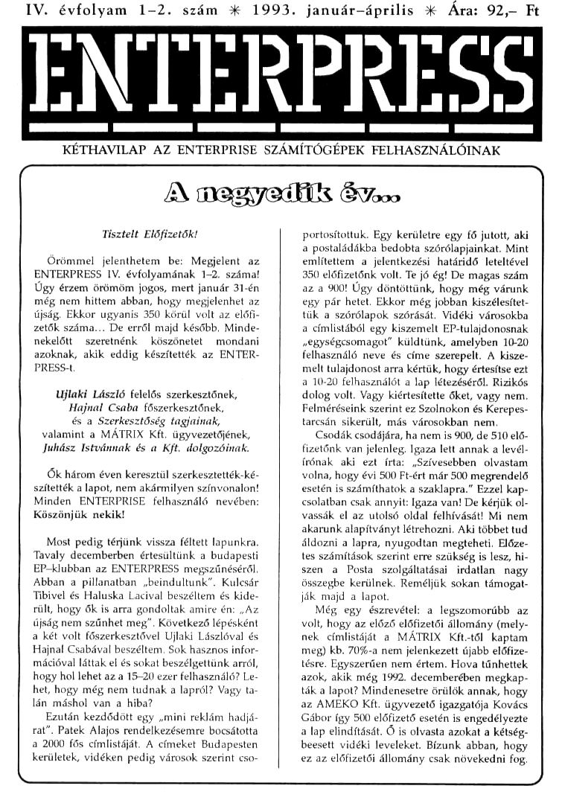

# Enterpress 1993/1-2 (1993.01-04)

[Оригінальний PDF](http://enterprise.iko.hu/magazines/Enterpress_1993-1-2.pdf) (угорською)

## Зміст

## Чернетка вмісту

"page-000.jpg" ------------------------------------------------------------ 
IV. évfolyam 1-2. szám :k 1993. január-—április X Ára: 92 Ft

ENTERPRESS

költtszzástezttátüststnmttseezmmááátalátkezee
KÉTHAVILAP AZ ENTERPRISE SZÁMÍTÓGÉPEK FELHASZNÁLÓINAK

Tisztelt Előfizetők!

Örömmel jelenthetem be: Megjelent az
ENTERPRESS IV. évfolyamának 1-2. száma!
Úgy érzem örömöm jogos, mert január 31-én
még nem hittem abban, hogy megjelenhet az
újság. Ekkor ugyanis 350 körül volt az előfi-
zetők száma... De erről majd később. Minde-
nekelőtt szeretnénk — köszönetet mondani
azoknak, akik eddig készítették az ENTER-
PRESS-t.

Ujlaki László felelős szerkesztőnek,
Hajnal Csaba főszerkesztőnek,
és a Szerkesztőség tagjainak,
valamint a MÁTRIX Kft. ügyvezetőjének,
Juhász Istvánnak és a Kft. dolgozóinak.

Ők három éven keresztül szerkesztették-ké-
Szítették a lapot, nem akármilyen színvonalon!
inden ENTERPRISE felhasználó nevében:
Köszönjük nekil

Most pedig térjünk vissza féltett lapunkra.
Tavaly decemberben értesültünk a budapesti
EP-klubban az ENTERPRESS megszűnéséről.
Abban a pillanatban. ,beindultunk". Kulcsár
Tibivel és Haluska Lacival beszéltem és kide-
rült, hogy ők is arra gondoltak amire én: , Az
újság nem szűnhet meg" . Következő lépésként
a két volt főszerkesztővel Ujlaki Lászlóval és
Hajnal Csabával beszéltem, Sok hasznos infor-
mációval láttak el és sokat beszélgettünk arról,
hogy hol lehet az a 15-20 ezer felhasználó? Le-
het, hogy még nem tudnak a lapról? Vagy ta-
lán máshol van a hiba?

Ezután kezdődött egy ,mini reklám hadjá.
rat", Patek Alajos rendelkezésemre bocsátotta
a 2000 fős címlistáját. A címeket Budapesten
kerületek, vidéken pedig városok szerint cso-

A megyek 6voo

portosítottuk. Egy kerületre egy fő jutott, aki
a postaládákba bedobta szórólapjainkat. Mint
említettem a jelentkezési határidő leteltével
350 előfizetőnk volt. Te jó ég! De magas szám
az a 900! Úgy döntöttünk, hogy még várunk
egy pár hetet. Ekkor még jobban kiszélesítet-
tük a szórólapok szórását. Vidéki városokba
a címlistából egy kiszemelt EP-tulajdonosnak
segységcsomagot" küldtünk, amelyben 10-20
felhasználó neve és címe szerepelt. A kisze-
melt tulajdonost arra kértük, hogy értesítse ezt
a 10.20 felhasználót a lap létezéséről. Rizikós
dolog volt. Vagy kiértesítette őket, vagy nem.
Felméréseink szerint ez Szolnokon és Kerepes-
tarcsán sikerült, más városokban nem.

Csodák csodájára, ha nem is 900, de 510 elő-
fizetőnk van jelenleg, Igaza lett annak a levél-
írónak aki ezt írta: ,Szívesebben olvastam
volna, hogy évi 500 Ft-ért már 500 megrendelő
esetén is számíthatok a szaklapra." Ezzel kap-
csolatban csak annyit: Igaza van! De kérjük ol-
vassák el az utolsó oldal felhívását! Mi nem
akarunk alapítványt létrehozni. Aki többet tud
áldozni a lapra, nyugodtan megteheti. Előze-
tes számítások szerint erre szükség is lesz, hi
szen a Posta szolgáltatásai irdatlan nagy
összegbe kerülnek. Reméljük sokan támogat-
ják majd a lapot,

Még egy észrevétel: a legszomorúbb az
volt, hogy az előző előfizetői állomány (mely-
nek címlistáját a MÁTRIX Kft.-től kaptam
meg) kb. 7096-a nem jelenkezett újabb előfize-
tésre. Egyszerűen nem értem. Hova tűnhettek
azok, akik még 1992. decemberében megkap-
ták a lapot? Mindenesetre örülök annak, hogy
az AMEKO Kft. ügyvezető igazgatója Kovács
Gábor így 500 előfizető esetén is engedélyezte
a lap elindítását. Ő is olvasta azokat a kétség-
beesett vidéki leveleket. Bízunk abban, hogy
ez az előfizetői állomány csak növekedni fog.

"page-001.jpg" ------------------------------------------------------------ 
2 EN H HA HEHE]

1993. január-április

Most pedig álljon itt azoknak a neve, akik
nélkül nem jelenhetett volna meg kedvenc új-
ságunk és nem lett volna még ennyi előfize-
tője sem:

Patek Alajos

Kovács Gábor ügyv. ig.
Erdélyi Attiláné
Erdélyi Attila

Mivel 5-nél több előfizetőt szereztek, ezért
1993-ban ingyenes előfizetést kaptak az újságra:

Baran Jánosné (Kerepestarcsa)
Berkó Zoltán (Szolnok)
Németh József (XIII. ker)
Csorba Tamás (VII. ker)
Bencze Gábor (XIV. ker)

Tóth Sándor (X. ker)

Moller Péter (XIX. ker)
Richter Tamás (Veresegyház)

Ezt az akciónkat továbbra is fenntartjuk!

Reméljük mindenki örömmel lapozza fel az
újságot. Igyekeztünk úgy kialakítani a lapot,
hogy mindenki kedvére legyünk. Továbbra is
lesznek játékleírások, örökéletkódok, tippek és
trükkök, teszt, levelezési rovat. A szokásosnál
kicsit több lesz a gépi kód, kevesebb a BASIC,
bár a gépi kódnál inkább csak kommentekkel
ellátott rutinokat adunk közre, vagy hasznos
programok listáit közöljük majd. De igény ese-
tén természetesen másról is írunk. Ez majd ki-
derül a 17. oldalon lévő kérdőívből, Mindig
lesz egy rovat az újdonságoknak és lesz TOP-
LISTA is, amely nemcsak a játék programokra
vonatkozik, Igyekszünk segíteni a vidéki fel-
használóknak abban, hogy tudomást szerezze-
nek a rengeteg újdonságról ami eddig
megjelent, de az ENTERPRESS-ben eddig csak
keveset olvashattak ezekről.

Az AMEKO Kft. abban a meggyőződésben
indítja útjára az ENTERPRESS IV. évfolyamát,
hogy az ENTERPRISE tulajdonosok kedvelt és
nagy hasznú lapja lesz.

Megköszönve segítségüket és türelmüket:

, Szerezz 5 előfizetőt és ingyen kapod az új- FÉNNEG
ságot!" Természetesen olyanokat, akiknek van kezen ber
ENTERPRISE gépük! etétőé désíkölztő J
k

Aggodalmaim az Enterprise-ért

Több mint egy éve, hogy a Centrum áruházak sok Enterprise felhasználó örömére foglalkoztak a géphez tartozó hardverek
ülletve szoftverek forgalmazásával, De sajnos egy fejezet lezárult és ezt tudomásul kell vennünk. A gép mindennemű segítség
nélkül tengődik az ismeretlenség mély homályában. A gép árusítása megszűnt és gondolataink szerint még sok százezer forint
értékű áru romlik a különböző lerakatokban, hacsak azóta nem kerültek bontás alá. Tavaly nyár elején a Centrum áruházak
nagy mennyiségű programkazettát és hardver kiegészítőt dobtak piacra. Gondoltuk, hogy az elavult játékok és kiegészítők helyett
a régen beígért nagyágyúkat vetik majd be. Nem így történt. Az akcióról pedig az ÉP-s tábor kb. 196-a tudolt. Az Enterprise
VTGe még jóideig hítegelte a felhasználókat: addig nem dobja e termékeket a piacra, amíg bentlévőségei el nem fogynak.
Tehát nem fogytak el! — sejtésem sincs miért, Nap, mint nap én is olt szorongtam a sok Enterprisc-os sorstársammal együtt
és bővíteni próbáltam neméppen hiánytalan gépemet. Tudomásunk szerint még mindig működik az Enterprise VTGe magyarországi
képviselete. Nincs gond, az itthoni űr kitöltésére jött létre ez a képviselet — állítják azok, akik még mindig hisznek a képviselet
Szorgos működésében. Ebből a működésből finoman szólva semmi haszna nincs a hazai felhasználóknak! Sőt! Jogi kérdések
miatt nem ís fejleszthetik tovább gépüket! Például mit legyen az, akinek lemezvezérlő kártyára van szüksége? Semmit! Maradjon
a magnójánált

Eddig a legnagyobb sikert Hajnal Csabáék könyvelhették el. Ők megtisztelve érezhették magukat, amikor sikerült beszélniük
egy még csak tervezett gépről Kopácsi úrral. De ez is régen volt.

A jelenlegi szoftver ellátottságot nem valamelyik külső szoftver cégnek köszönhetjük. Ezek egytől-egyig a lelkes EP-prog-
tamozók gyártmányai, átíratai. Ezúton mondunk köszönetet Gyányi Sándornak, Devil-nek, Koch Tibornak, Héder Józsefnek,
a BAM csapatának és az összes meg nem említett felhasználónak, akik segítették a felhasználókat, Nagyot alkottak sorstársi
a gép hardver fejlesztésében is, Csak néhány név: Mészáros Gyula, SMD-Team, Microtcam, stb,

Persze e rövid cikkben nem lehet kitérni. mindenre, amire a Kedves Olvasó rákérdezhet. Például: hova tűnt a Novatrade?
Vagy miért nem foglalkoznak többen a géppel? Akit érdekel, kutasson utána, mondjuk az Enterprise VTGe-nél, de kérjük ha
sikerrel járt, azonnal tájékoztasson minket

Néhány év alatt, ameddig volt Enterprise forgalmazás, addig felnőtt egy új nemzedék, akik kinőtték a ,majd a képviselet"
tematikát és maguk láttak hozzá a gép fejlesztéséhez. Pár név közülök: Haluska László, Zozosoftá:Apuci, Vicsotka Gyula, EDC,
Richter fivérek, stb.

Az Enterprise VTGe már nem foglalkozik a géppel — úgy tűnik. Ezért akinek problémája van, bizalommal fordulhat a lap

szerkesztőségéhez, Mi segítünk. Ne feledjük a budapesti Fnterprise-klub jelszavát: , AZ ENTERPRISE ÖRÖK ÉS ELPUSZ-
TÍTHATATLANI"

Piotr
"page-002.jpg" ------------------------------------------------------------ 
1993. január-április

SZORZÁS, OSZTÁS

A szorzás és osztás gyakran használt művelet. Sajnos a Z80 csak az
összeadás: kivonást támogatja, ezért a szorzást összeadásokra, az osz-
tást padig kívonásokra vzatjűk vissza, A 774-ot leíthatjuk 747747 alak;
ban a végeredmény ugyanaz. Ez a módszer nem célszerű a nagyobb
Számok osetébon, pl. 3000025000 kiszámolása hosszú időbe tellene.
Kettes számrandszerben a követkoző algortmus használatos, Jobbra
shiholják a szorzót (vagyis kottóvol osztjuk) A kicsorduló legkissebb bittel
mogszorozzuk a szorzandót és ezt hozzándjuk az oradmányszámlálóhoz.
Két eset lehotsógos, 0 vagy 1. A nullával való szorzás nula, eggyel
Pedig a szorzandó értékével azonos eredmányt ad. Ebből kövotkezik,
ogy ha a bit értéke 1. az eredmónyszámlálóhoz hozzándjuk a szor
7andót, A szorzandót eztán balra shiftoljük. (vagyis 2-vel megszorozzuk)

szorzó értéka nullára csökkon, Osz-

[
ADD HLHL

AzATZ RAL
ADD AA AzAfa
DE-DE"2 SALA
SLA E

AD

A szorzó értékét törzet
lehetséges

HLZHLETB  (HLHLZtZ62t2]
ADD HLHL 72
ADD HLHL 6
ADD HUHL 8

yozőkro bontva, más értékek esetében is
közvetlen szorzás, elvégzése.

ADO HUHL 16
PLAZATO  (ALATZTZZHATO]

ADOAA 52

LDBA A kétszeres érték elmentése
ADDAA 74

ADDAA 5

ADD AB iskétszeres érték

AA MULOIVASM lista nutnjak

— szorzási szorzat

MŰLBGDE.  HLHL-BEDE
MULBGDET:  HLHL-BGDE:HL
MULBCDEZ. HLHL-BCYDESHLHL
MULAE,

MULADE.
MULADEL:

hányados. maradók.

DIVHLDE:  BC-INT(HLHLYDE)  HLHL-MOD(HLHL.DE)

DIVHLA: DEZINT(HUAT HL: MODIHLAAT
INTILJB) LMODILB)

"MULDIVASM SZORZÁS, OSZTÁS (INT:MOD) (C) 1991 HSOFT.

MULBCDE: LD HLO HLHL-BODE
MOLBCDEt: EXX

LD HLO aHLt
MULBCDEZ LD DEO

LD 818 Clklusszámláló
MULBCDETO: EXX

SAL B

RA c

JA NCMULBCDEZO

ADD HLDE

DX
ADC HLDE
5x

MULBCDE20: SLA E /DEDE-DEDE"2.
AL D

MULAE:
MULADE:
MULADET
MULEDET0:

MULADEZ0:

DIVHLDE:

DIVHLDET0:

DIVHLDEZO:

DIVHLA:

Dwv.8:
DivLB1

DwvuB10:

Divua20:

SBC HLDE

DJNZ DIVHLDE10
B

GPL
LD BA
LD AC
GPL
LD CA
RET

10 EL
LD LH

LD BA
CALL DIVLB
LD DA

LD HL

LD LE
roX-t-3i
CALL DIVLBI
LD EA
RET

10 HO
1D Go

LD AT

SAL B

ARC

S8C HL.BO
JA NC.ÖIVLB20
ADO HLBC
RUA

JR NGOIVLB10
cPL

BET

HL-ATE
JHLZATDE
JHLZATDESHL

 BC-INT(HLHLYDE),
HLHL: MOD(HLHLIDEJ

HLHLDEDE?

Ugrás ha kívonható
-HLHL! értők visszaálítás

GY begörgetése AC-ba
-DEDEGDEDET2.

BC-FFEFH-AC
TAC BITEK komplemontálásaj

DE-INT(HLJAI HLAMOD(HLAJ

INTÍLJB) LeMODILB)
"page-003.jpg" ------------------------------------------------------------ 
1993. január-április

Relokálható fájlok készítése
az ASMON-nal

Miután a HISOFT termékek kezelését nagyon kényelmetlennek
találom, ezért nem nyugodtam bele abba, hogy az ASMON nem
tud relokálható fájlokat fordítani, És némi próbálgatás után kide-
rült: mindenféle híresztelés ellenére tud korrekt relakálható fájlokat
készítenit Csak a direktívák megfelelő használatát kell ismerni

SETRTP n — futási lap beállítása n-re, Ez akkor kell, ha a
program valamely része a végrehajtáskor nem azon a lapon fog
futni ahol a program, Például egy EXOS bővítő átlapozza magát
az 1. lapm és ott folytatja működését, ekkor az egyes lapon futó
Szakasz elé kell egy .SETRTP 1 a helyes relokáció érdekében.

RESRTP — futási lap visszaállítása, Mikor az előző bővítő
Visszalapozza magát.

INIOFS - a 2-es típusú fájlok inicializálási eltolás beállítására
szolgálna, de: TUDJA VALAKI, hogy milyen operandus kellene
neki???

ASEG - a következő utasításban szereplő 16 bites érték ab-
szolút szónak kezelendő,

CSEG — a következő utasításban szereplő 16 bítes érték át-
helyezhető szónak kezelendő.

A következő utasítások" listája:

JPCALL: ha címkére akkor .CSEG, ha konkrét címre akkor
AASEG kell elé

DW, DEFW: .ASEG kell elé

16 bites értékadások: ha konstans, akkor .ASEG, ha cimke ak.
kor .CSEG,

Címre hivatkozó értékadások: mint a 16 bites értékadások,

Az EOU-val definiált címkét vegyük konstansnak. Kivéve
ha az a program valamely címét takarja, például

Példa a program átírására;

Eredeti: Relokálható:
LD A25S LD A.255
LD BC10 -ASEG
LD DE,TEXT LD BC10
CALL KIIR .CSEG
JP 1006 LD DEJTEXT
.CSEG
CALL KIIR
-ASEG
JP 100H

Ha egy 6-os fejlécoel fordított rendszerbővítőt betöltünk, az le-
foglal a gép memóriájából 16 Kilobájtot. A relokálható fájl csak
annyi helyet foglal, öméndjíre üköége van. És. még valsaak: ú
felokálható fájlokat nehezebb visszafejteni.

A példaprogramot (1. lista) az ASMON edítorába kell begépelni
és 7-es fejléczel kell fordítani A programot elemezve talán
könnyebb lesz megérteni az elmondottakat, A sok díroktíva hasz-
nálat enyhén. macerásnak tűnhet, de részemről mamdok az AS-
MON-nál, . Mindenesetre nem árt, ha  beidomítunk . néhány
funkcióbiltentyűt és elmentjük a ZÖZOTOOLS 1.6 FKS párancsá-
val
ZOZOSOFTKAPUCI

CIMI — EGU §
isz LD CA 1020 : a parancs elvégezve
1D AC RET visszatérés
BEGA AZONOSKA LD ADB) cA-ba az első byte
CSEG huz Közöveg, hossza)
3 z.Knenn akkor parancs ep iha nem 2
org] essésádrálvágyóóó JRÖNZNEMEV  jákkor visszatérés
RETNZ INC DE következő
LD ADB ime
cp
PUSH DE JR NZNE
XOR A ha az első szó hossza INe-DR
CP B mem 0 konkrét HELP LD A(DEJ
JR NZKONKHELP erv
seg ftaláttós RETZ ja igen akkor vissza
ÍD DREVHELPI  ÍHELE NEMÉV POP DE felesleges visszatérési cím
csa iklírása Pop DE
1D BCKEVIHELE) POP BC
1D A.25s RET visszatérés
aosszotőet E beje a 8
szg átó Hi EVIIELP2 DB SEXOS V"1A3SETOZÖK KIR" LÁSSA venion
POP BC vissza. 124310
RET irérés DB ölrtaz ZOZOSOFTRAPUCI", 1310
j EVZHELP  EOLT $-EVHELPZ

seg ASRG
CALL AZONOSKA EVIHELP DW 19

TEMEENSE .CSEG EVHELPI — DB"EV version 1.2713.10

iv

er sgádáegás KINUUK PUSIL BE
TD BGEVZHELP szöveg PUSIL DE
1D Ass ki CSEG jaz EVA
EXOS 8 ilrása CALL AZONOSKA hívták?
POP DE ÁSEG
86. 1D Bco 3.0 (változó olvasása)
XOR A JAAÓ : nincs hiba 7€20 (B. változó)
"page-004.jpg" ------------------------------------------------------------ 
1993. január-április

IROGAT

KIIROGAT

KIRZ

TOMINT99
MINUSZI00

cseG
LD AB

PUSH AF
PUSH BC

EXOS 16

JR NZNINCS
CSEG

CALL KIIROGAT

JR NZ.NEMEMEL
XOR A

PUSH AFP

PUSH BC

CSEG

LD DESOREMEL
AASEG

1D Bcz

LD AZ5

EXOS 8

POP BC

POP AF

mc c

JR NZROGAT

CsEG
LD DESSOREMEL
ASEG

LD Bc2

LD Azss

EXOS 8

POP DE

POP BC

XOR A

LD CA

RET

POP HL
Pop BC

1D AC
PUSH BC
PUSH HL
PUSH DE
CSEG
CALL KIIR2
LD Bo:

LD Az5S
EXOS 7
POP DE

LD AD
CSEG
CALL KIIR2
1D BE
ÚD Ass
ExoS 7
RET

CP 100
ÍR NC.TOMINT99
PUSHAF

1D A25S

1D By

EXOS 7

POP AF

CP 10

JR NCTOMINT9
PUSH AF

LD ASS

LD Bs

EXOS 7

POP AF

IR KEVMINTI0
1D BO

c B

SUB 100

TAO (az egy sorban lévő
"változók. számlálója)

jváltozó olvasása
hiba a nincs ilyen változó
iváltozó, száma

sés értéke kiírása

ca sorban eggyel többi van
úha már 4 van a sorban
akkor soremelés

jemelés

következő változó
aha Ca akkor vége
Ga ciklusnak

temelés
ai
sírása

Al : nincs hiba
(20 : parancs elvégezve
isszatérés.

(A-ba a változó szám

sváltozó számának kiírása
jel
ikiítása

§A-ba a változó értéke

tennek a kiírása
7 kiíeása

ia
53 számjegyű

ja. kiírandó szám
jakkor egy "
kiírása

nem 2.

sszázasok
gértékének

JR NCMINUSZIO0 — sszámolása

ADD Á100

DEC B

PUSH AP

1D AB

ADD AZ"

1D BA

LD A25S

EXOS 7

POP AF
TOMINT9 LD BO
MINUSZIO INC B

SUB 10

JR NCMINUSZI0

ADD A10

DEC B

PUSH AF

1D AB

ADD AJOt

1D BA

LD Ass

ExOS 7

POP AF
KEVMINTIO LD BO jegyesek
MINUSZI INC B jértékének...

SUB 1

JR NCMINUSZI

ADD AL

DEC B

PUSHAF

RET gvissza
SOREMEL DB 13.10

ÖRÖKNAPTÁR

100 PROGRAM "naptanbas"

110 TEXT 40

120 PRINT AT 4 $"ÖRÖKNAPTÁR ÉVSZÁMKORLÁT NÉLKÜL"

130 PRINT AT 6.13-C) 1992 HSOFT"

131 PRINT AT 8.135

140 INPUT PROMPT "ÉV.HÓ: "EVHO

150 LET NAP-EVNAP(EV-1)

160 FOR X-1 TO HO-I

170 LET NAP-NAP HONAPOK)

180 NEXT

200 FOR X-12 TO 18

210 READ A$

220 PRINT AT XGAS

230 NEXT

40 LET Y-MOD(NAPTJLET X-0

250 FOR Ne1 TO HONAR(HO)

260. PRINT AT I26Y.I64XUSING 44.N;

270 LET YeYő1

280 IF Y27 THEN LET Y-LET X-X43

290 NEXT

300 PRINT AT 22.15.

310 DATA HÉTFŐ KEDD SZERDA CSÜTÖRTÖK.

320 DATA PÉNTEK SZOMBAT,VASÁRNAP

330 DEF EVNAREV)SEV"365.INT(EV-4)-INT(EV/100)-INT(EVA400)

340 DEF HONAP(HÓ)

350 IF HOZ THEN

360 LET HONAP:28-(NOT MODKEVA)) (NOT
MODKEV.100))-(NOT. MODKEV.400))

310 ELSE

380 IF HOT THEN LET HO-HO-I

390 LET HONAP-305MOD(HO2)

400 END IF

410 END DEF

iso
"page-005.jpg" ------------------------------------------------------------ 
6 Teszt 1993. január-április

( Ez fenomenális! J)

Bevezetésként ismerkedjünk meg a szerzőkkel és a program nevének ismertetésével, mivel sok
találgatásra adhat okot. F.E. - Fast Editor, NOM - a monitor szó rövidítésének visszafelé történő
írása, és végül az ASS - assembler szó rövidítés. Kicsit bonyolult a név, mi is sokat gondolkodtunk
rajta. A szerzők: Richter István (TIMELORD), és Richter Tamás (MOONLIGHT). Ennyi bevezető
után nézzük mit is tud a FENOMASS,

Hatos fejlécű abszolút rendszerbővítő, igaz már elkészült a ROM-ba égetett változat is. Kinézetre
nagyon hasonlít az eddig elterjedt Asmon-, Simon monitor-assembler programokhoz. Gyorsaság-
ban és kezelhetőségben azonban felülmúlja azokat és bizonyos funkciókban az eddig tapasztalt
hibákat sem követi el. Szinte minden funkció ki lett bővítve valami plusz szolgáltatással. Ami
nagyon jellemző: kiválóan támogatja a memória használatát, főleg a bővítettét, A program a
0-ás lapon fut, így tehát a felső 3 lap szabadon használható.

Most pedig röviden ismertetjük a három fő programrészt:

EDITOR:

A képkezelés a többi szövegszerkesztőkhöz képest sokkal gyorsabb és ismer pár plusz szolgáltatást
is. Van ki-be kapcsolható automatikus tabulátor pozícióba állás, insert üzemmód, valamint kö-
vetkező tabulátor pozícióig törlés, beszúrás, stb. Folyamatosan jelzi az épp szerkesztés alatt lévő
forráslista hosszát sorokban és bájtokban. Egyszerre több (max. 48 Kb-os) forráskód szerkeszthető.
A funkciók: FIND, TAB, FILE, BLOCK.

Find:
Lehet vele stringet cimkeként, vagy csak simán keresni, helyettesíteni és az esetleges fordítási
hibákat is megkeresi, valamint megadott sorra mehetünk.

Tab:
Szokásos funkciók: törlés, beállítás és alapba állítás.

Fil
Betölthetőek Asmon, Simon, WP, Asmen-turbo illetve Intelligent Save formátumú fájlok. Ha In-
telligent mentésű fájlt tölt, akkor a következő mentést is így fogja elvégezni. Itt még bővebb
információt kaphatunk a szövegről, valamint törölhetjük azt.

Block:

Sajnos ez a funkció még nem működik. Ez sajnos elég nagy hiányosság, mivel ha blokkot akarunk
törölni, másolni, kénytelenek vagyunk visszatérni más szerkesztőkhöz, ez pedig elég nehézkes
és időigényes dolog.

Monitor:

AH billentyűvel megjelennek a főbb menüpontok, a Shift-H lenyomására pedig újabb paran-
csokat nézhetünk meg. Az összes Asmon monitor funkció megtalálható, valahogy kibővítve, pél-
dául van külön szöveg-Dump, a monitorba az ALT karakterek is közvetlen írhatók, Új funkciók:
DEFB-Block, illetve kód visszafejtés rendesen eimkézve forráskódnak. Szegmenst lehet foglalni
perifériának, és a felhasználónak. Ez főleg a forráskód megvédésére szolgál. Beállítható egy fel-
használói LPT NICK kezdőcíme, és bármikor megnézhető. Ez főleg TRACE-üzemmódnál hasznos.
A TRACE üzemmód is ismer pár plusz szolgáltatást: bármikor megnézhetők, beállíthatók a re-
giszterek, egy CALL utasítást végre is hajthatunk vagy bele is léphetünk, vagy ha ciklust fut-
tatunk beállíthatjuk a Break Point-ot és gyors TRACE-ra kapcsolunk, akkor visszatér a ciklus
végén és nem kell perceket várni a ciklus futtatására.

Assembler:
A fordító is megérdemli a gyors
nem csak sebességben! A fordít

izőt, mivel az eddig ismert fordítókat messze felülmúlja és
opciókat a forrásszövegben állíthatjuk be (Var, Load, Org,

"page-006.jpg" ------------------------------------------------------------ 
1993. január-április

Phase) Így fordítás közben is változtathatjuk a fordítás módját (fordíthatunk memóriába illetve
háttértárolóra, különböző fejlécekkel).

Ismer ezenkívül még IF blokkokat valamint For-Next ciklusokat. Lehetőség van még a szim-
ból-tábla helyének megadására, vagy a szöveg mögött, vagy külön helyen a memóriában akár
be nem lapozott szegmensre is, A fordító ezenkívül még máshol a memóriában lévő forrásszöveget
is hozzáfordít az aktuális fordítási kódhoz, ezenkívül INCLUDE-olhatunk is, illetve adatállományt
MERGE paranccsal illeszthetünk a kódba. Ezenkívül még feltölthetjük a kódot DEFF-el illetve
DEFC-vel. Sajnos makrókat nem kezel, illetve megadott értékekkel, szavakkal, a For-Next cik-
lusok használatával félig meddig kiküszöbölhető, de ez még nem tökéletes megoldás. A program
relatív adatállományt sem tud létrehozni.

A program az FD video-szegmenst és még két szabad RAM-szegmenst foglal le magának, amit
nem ajánlatos felülírni.

Mint eddig kiderült a FENOMASS elég jól kihasználja a memóriát és mindent elég gyorsan
és kezelhetően végez. Mivel ezt a szerzők maguknak, saját ízlés és kezelhetőség kedvéért írtak,
igaz nem hibátlanul, de ha valaki megtanulja kezelni és kicsit igazodik a programhoz, rögtön
rájön, hogy ez szinte a legjobb Assembler-Monitor-Editor program a hibái ellenére is.

A szerzők még egy bővebb dukumentum fájlt is írtak a programhoz amely nagyon részletesen
leírja, hogy mit és hogyan érhetünk el a programban. Hát ennyit a FENOMASS-ról. A program
megrendelhető a budapesti EP-klubban, és a szerkesztőség címén: ENTERPRESS, 1399 Budapest,
Pf. 701/334., valamint az alábbi címen: Haluska László, 1086 Budapest, Karácsony S. u. 18. 3/41.

A szerzők:
Richter István dt Richter Tamás

1. Tista
100 PROGRAM "DISPLAY.BAS"
105 LET X-11

110 DO

120 LET A-JOY(0)

130 IF A-1 THEN LET
140 IF Xs16 THEN LET X-16
150 IF A-2 THEN LET X:
160 IF Xc4 THEN LET
170 CALL DISP

180 LOOP

190 DEF DISP

200 SPOKE 255,26172,404X
210 SPOKE 255.26171.X
220 DISPLAY TEXT

230 END DEF

Két program

Az első program az alap 102-es videolapot moz-
gatja a belső joystick segítségével a képernyőn.
Arra épül, hogy a video részére megnyitott csa-
tornák pointerei előtt lévő 33, 32. bájton le van
téve a bal illetve a jobb margó értéke. Ezeket át-
írva bármelyik videolapot mozgatni lehet. Gondot
csak a pointerek megtalálása jelenthet. Ezeket a
PLUTO bővítő CHANS utasítása megadja, vagy
a Felföldi-Lukács: , Gépi kódú programozás" című
könyvének 81-83. oldalán található rutinnal lehet
kiolvasni. Érdekesség, ha nagyobb lapot jelölünk
ki mint az eredeti előfordul, hogy amit az egyik

lapra írunk, a másikon is megjelenik, Gondolom
az adatmezők átfedése miatt.

A második program az ART STUDIO rajzolóprog-
rammal EP-formátumban kimentett FONT.DAT
fájlt tölti vissza BASIC-be,

2. Tista

100 ALLOCATE 20

110 OPEN 4.

120 CODE XSC11,80,B4.O1,80.04.3E,01F7.06,C9")
130 CALL USR(MO)

A programok angol-német gépen, kazettás rend-
szerben készültek.

(A közölt programokat Kovács Istvánnak köszönhetjük).
NZZTTEETZTETKIZETETTEZTEEII

TISZTELT ELŐFIZETŐINK!

Az ENTERPRESS következő, 3. száma
Június elején jelenik meg.

A szerkesztőség.

"page-007.jpg" ------------------------------------------------------------ 
1993. január-április

Bemutatkozik a
ZOZOTOOLS 1.6 rendszerbővítő

Hol is kezdjem eme program ismertetését? Talán ott, hogy
ha valaki sikeresen elhelyezte a programot tartalmazó EP-
ROM-ot a cartridge-ben vagy EXDOS kártyán vagy a ROM
kártyán, akkor a HELP listában fel kell tűnnie a ZozoTools
Ver. x.x sornak, Az x.x helyen természetesen a megfelelő
verziószám áll, mi a továbbiakban az 1.6-os verzióval fog-
lalkozunk, bár Zozosoft szerint nemsokára elkészül a 2.0-ás
verzió is. Idáig még nem sokat tudtunk meg, ezért további
információszerzés érdekében adjuk ki a HELP ZT utasítást
(grafomániások: HELP ZOZOTOOLS). Ekkor megtudjuk,
hogy ki és mikor követte el a programot, a bővítések listáját,
s még néhány hasznos információt, amikről később lesz szó.
Az 1.46-os verzió a következő bővítéseket tartalmazza;

RL version 3.2
EV version 1.2

FL version 1.7
FAFO version 2.1
DL version 1.2
CLOCK version 1.6
VS version 18

VL version 1.8

A lista után szereplő jótanácsot, (A funkciókról kérj rész-
letes HELP-et.) nem árt megfogadni, és ha lehet TEXT
80-ban kövessük el mindezt. Ha már végig olvastuk a sok
HELP-et, akkor térjünk vissza eme cikkhez, aminek az a
célja, hogy:

— aki rendelkezik már a programmal, annak bővebben el-
magyarázzuk, hogy az egyes funkciók mire, és miért jók,
— aki meg még nem, annak pedig felkeltsük az érdeklődését.

ROM-LIKVIDÁTOR version 3.2

Ez a funkció a ROM lista ,piszkálásár" való. Köztudott do-
log, hogy sok program allergiás egyes bővítókre, és ezért
vagy valami más okból kifolyólag gyakran előfordul, hogy
meg szeretnénk szabadulni valamelyik bővítótől. Ezt eddig
megtehettük:

— NENUS-szal, de ennek kezelése nem túl egyszerű,

— EPDOS szal, ez már egyszerűbb, de nem szabadítja fel a bővítő
által lefoglalt területet, és ezért a kényeskedő program továbbra
sem hajlandó elindulni. Az RL, ha paraméter nélkül adjuk ki,
közli velünk a RAM és a ROM EXOS bővítők listáját, például:

AA RAM-bővtők stája:

424 ——  — —— A bövlő szegmens száma

MBP version 4.1 A bővítő által kört HELP. szóveg

A jelenlegi RON-sta:

Ez ít egy érvénytelen —— Ez egy olyan bővítő, amit az EXOS

ROM helyet túl nagy FAAM igénye miatt érvényteleníett
ak (az EPDOS. ROMHELP-je llyentől letagy)
PGD version 2.6

PGC version 2.8

04

FAMHerület FFHABTOHHÓI 6. bát ——— A bővítő által lofoglalt RAM-terület
Zozotnos 1.6 helye és mérete JA méretet eddig
204 égy program sem úta Ki.
RAM-teritet: FFH-A3OCH-i6l 2004 bájt
EXDOS version 13

15008 version 1.0

134

RAMHorúlet: FFHAZGDH-6l 255. bájt
ASMEN version 1.5

SET version 1.§

104

EPDOS version 1.5

064

FENAS version 14

054

HEA version 1.0

044

FRAMterúlat: FFH.DEAH-I 1203 bájt
VOUMP Kép kinyomtatása

VSAVE Kép kimentése

VLOAD Kép betöltése

HUN Magyar úzmmód

UUK Angol üzemmód

084

BASIC version 2.1

Cam

RIAMHerület: FEHSDEZHZBI 2. bájt
WP version 2.6 (SUPERWPJ

oak

WP version 2.1

Ha kigyönyörködtük magunkat, akkor próbáljunk irtani egy
kicsit, például távolítsuk el a cartridge-ben lévő programo-
kat: RL 04H.OSHOGH,OTH. Lehetőségünk van teljesen új
ROMlista definiálására is, például csak a BASIC-et és az
EXDOS-t szeretnénk megtartani az előző ROM-listából: RL
NEW.20H,O3H. Itt kapott helyet egy másik ,ártó" utasítás
is: 128. Ez a memória bővítés kikapcsolására szolgál, szin-
tén a hülye játék átiratok miatt. Ezeket az utasításokat akár
EXDOSINI-be ís tehetjük, például ha külön lemezre gyűjt-
jük az ilyen programokat. Íme egy példa:

128
RL NEW.20H
LOAD START

Az EV parancs kiírja az összes létező EXOS változót és
értékeiket, így felfedezhetjük, ha egy program új változókat
hoz létre (például a PAINTBOX MOUSE.XR nevű darabja,
lásd a 15. oldalon),

Az FL a funkcióbillentyűk énékeinek megtekintésére, és
felhasználóbarát átdefiniálásukra szolgál. Például a BASIC
funkcióbillentyűk:

1.-165"START" 16113
2.-1657LIST"161.13

"page-008.jpg" ------------------------------------------------------------ 
1993. január-április

5, "AUTO",161,13

S" TOGGLE REMI",161,13
5.-165,TEXT"161,13
"GRAPHICS",161,13

S "TOGGLE KEY CLICK",161.13
8.165,"INFO",161,13

9.165, CONTINUE "16113
10.-165LLIST",161,13
11.165"RENUMBER",161,13
12.-165/TOGGLE REM2",161.13
13.165 "DISPLAY TEXT",161,13
14.165" DISPLAY. GRAPHICS" ,161,13
152165," TOGGLE SPEAKER!"161,13
16.165 "TYPE", 16113

Mint látható a szövegeken kívül még egy rakás vezérlő ka-
rakter is előfordul, ezeknek a kódját fejből kéne tudni ha
más program segítségével akarjuk átdetiniálni a funkcióbil-
lentyűket, de nem így az FL-nél, mindent írjunk be úgy,
mint ha egyébként írnánk:

TABINS,DEL, joystick, stb. Ha fáradságos munkával át-
definiáltuk a funkcióbillentyűket, akkor munkánk eredmé-
nyét el is menthetjük, Az FL-t bárhol használhatjuk, ahol
ki lehet adni EXOS parancsot, és a program EXOS billen-
tyűzet csatornát használ:

BASIC, WP, ASMON, ISDOS, PAINTBOX, MUSIC BOX,
AGSYS, LISP, HP, GEN, MON, stb, Ha a program nem
engedi EXOS parancs kiadását, de lehetőség van más prog-
ram betöltésére, akkor nincs gond, mert a kimentett fájl
EXOS modul, ezért automatikus a kezelése, így előre defi-
niálhatunk funkcióbillentyűket. (Egy megjegyzés: a WP Zo-
zosoft által átírt verziója automatikusan betölti a WP.FK fájlt)

A következő hasznos funckió a FAFO, egy gyors formázó,
amelynek több előnye is van:

olyan gyors, mint más gyorsformázók, der

— olyan sokoldalú formázási lehetőségeket kínál, mint az
EPDOS, sőt még annál is többet!

- EXOS bővítő lévén, bármely EXOS parancs kiadására ké-
Pes programnál eszünkbe juthat, hogy csak formázatlan le-
mezünk van üresen... A FAFO parancs kiadás után a státusz
Sorban jelenik meg egy menű, ahol beállíthatjuk a meghaj-
tót, a sávok számát 40-tól egészen 90-ig (!)), a szektorok
Számát 8-tól 11-ig, és azt, hogy egy logikai blokk (cluster)
hány szektort tartalmazzon, bár ez általában 2 (EXDOS, EP-
DOS, stb) érdemes 1-re állítani, mert minden megkezdett
blokk teljesen lefoglalódik, és nem mindegy, hogy ily mó-
don mennyi terület megy veszendőbe (akár 30 kilobájt is
lehett!!). Ezért jó, hogy az EPDOS blokkokban is kiírja a
méretet! (Éppen ezért a bájtokban számolt méret nem egye-
7ik meg a ténylegesen lefoglalt terület méretével. Ez PC-n
nem szokás, csak bájtokban, próbálja megcsinálni valaki
NORTON COMMANDER -rel, amit a Zozosoft EPDOS-sal
elkövetett: 45 lemezen mindössze 4.5 kilobájt szabad hely
maradt!) Az egyes blokk méret másik előnye az, hogy a
RAMDISK blokk mérete is 1, ezért könnyebb a méretek
összehasonlítása. 11 szektoros formázásnál kétféle változat
is van, tekintettel, hogy ilyenkor az adatok nagy zsúfoltsága

miatt nem minden meghajtóra jó ugyanaz a formátum! Más
gond is lehet a meghajtókkal: egyes (általában a ,katto-
ósak) meghajtóknak picit lassabb a reakcióidejük, pláne
ha nem megfelelő fejléptetési sebességet alkalmazunk (az
eredeti EXDOS kártyán lévő WD 1770-es csak lassabb se-
bességet tud mint amit az újabb meghajtók szeretnek), ezért
az EXDOS, EPDOS csak 40 sávosnak kezeli formázáskor
(360 Kb, pedig a boltban 720-asnak mondták...), a FAFO
€rre is figyel, A plusz sávok természetesen le lesznek el-
lenőrizve, hogy tényleg elbítja-e a meghajtó. (Erről más gé-
Peken (PC, ATARI, AMIGA, stb.) elfelejtkeznek) Ha
formázás közben ijedten vesszük észre, hogy nem azt a le-
mezt formázzuk amelyiket kellett volna, akkor mivel a for-
mázás belülről halad kifelé, a STOP (ESC) billentyű gyors
használatával még megmenthető a fájlok egy része.

A következő funkció a DI, ez egy gyors DTF betöltő, elő-
nye a gyorsaság mellett az, hogy mindig kéznél van, és
nem foglal a lemezen helyet, (A DTF programokról pár ol-
dallal arrébb lehet többet megtudni.)

A CLOCK magyarul órát jelent, gondolom nem nehéz ki-
találni, hogy mit csinál ez a program(ocska)... ...na nem
Státusz-sor óra, az nem valami jó, villog, és eltakarhat ér-
tékes információkat (editor puffer méret), ez a státusz-sor
felett (!) foglal helyet, A CLOCK az órakártya kezelést is
ellátja, persze csak akkor, ha van órakártyánk.

A hátralévő két funkció (VS, VI.) a BRD (HUN vagy EP
PLUS) által megvalósított VSAVE, VLOAD , utódja", csak
tömörített formában, és némi plusz szolgáltatással kiegé-
szítv
— paletta elmentése,

— töltéskor a megjelenítés vezérlése,

— EXOS-mudulként való kezelés.

Természetesen felismeri a VLOAD formátumú képeket is,
csak kb. háromszoros sebességgel tölti be őket. Mivel a ké-
peket EXOS modulként kezeli, ezért meg lehet azt is csi
nálni, hogy egy BASIC programot a betöltő képpel egy
fájlban tároljunk, vagy egy fázis képekből álló animációnál
megspóroljuk a csatorna megnyitásokat, szín beállításokat
és a betöltéseket, ezek helyett egyetlen EXT "VL ... ís ele
gendő.

A ZT egyéb szolgáltatásai:
— mindkét meghajtón keresi az EXDOSINI-t,

— a bejelentkező képnél billentyűvel dönthetjük el, hogy me-
lyik program induljon. (B: BASIC, W: WP, A: ASMON, stb.)

kk

A Zozotools 1.6 megrendelhető:
A budapesti EP-klubban, és a szerkesztőség címén:
ENTERPRESS, 1399 Budapest, Pf. 701/334.,
valamint az alábbi címei
Haluska László, 1086 Budapest,
Karácsony S. u. 18. 3/41.

"page-009.jpg" ------------------------------------------------------------ 
10

1993. január-—április

RAM-szegmensek az EXOS alatt

igy megbízható program, nem használhat hasműtéssel kitalált RAM
szegmenst, Erre több példa is rámutat. Más konfiguráció alatt is le-
hessen futtatni. Az operációs rendszer ís használhatja a RAM-szeg-
menst,  (RAMDISK,  BŐVÍTÉS, CSATORNA, ESZKÖZ, stb.)
Hiányozhat vagy hibás is lehet a kitalált szegmensszám. Egy szegmenst
az operációs rendszertől lehet igényelni, ill. felszabadítani.

EXOS 24 szegmens igénylés
Vissza; Acstátusz C-kiutalt szegmensszám
DESEXOS határ (4000H)

Ha nincs már szabad szegmens, akkor a rendszer által használt alsó
Szegmenst utalja ki megosztott szegmensként. Az ilyen RAM-ot nem
célszerű használni, mert leblokkolja az operációs rendszert, Hiába sza.
badul fel időközhen egy teljes szegmens, még egy csatoma nyitást
ís nincs szabad memória" hibával fog elutasítani . Ezért az ilyen RAM-
ot azonnal fel kell szabadítani.

LD Cszegmensszám

EXOS 25 szegmens felszabadítás

Vissza Azstátusz

Az ilyen jellegű hívással, (USER) felhasználói szegmenskezelés tör-
dénik. Ennek lényege, hogy a foglaltságuk megszűnik amini egy
felhasználói programot töltünk be, vagy egy rendszerbőn

a vezértést, ill. 40H, 60H jelzőkkel végrehajtott EXOS RESET ha-
tására, A perifériák által végrehajtott szegmens foglalás-felszabadítást
az EXOS külön kezeli, és az előző akciók hatására sem szúnik meg
a foglaltságuk. A renszerbővítéseket szintén periférlaszegmensre tölti
be az EXOS. Ha ilyen szegmensre van szükségünk, akkor a következő
trükkel oldhatjuk meg.

LD AzsS :RENDSZERSZEGMENS
OUT (OBZHJA 12. LAPRA
LD HLOBF7OH  :KERNELJELZŐ

0(HL) ERIFÉRIA. FUTÁS
ExOS 24 SZEGMENS KÉRÉS
RES 0(HLI FELHASZNÁLÓI FUTÁS

Sok esetben nem elegendő az EXOS által elérhető szegmenskezetés.
Fi, adott szogmensszám vagy videoszegmens igénylése, Ilyenkor az
EXOS szal kompatibilisen, magunknak kell a kiutalást kézbevenni. A
bekapcsolást követően végrehajtott TESZT alatt történik a RAM-szeg-
mensck könyvtárba vétele. A kezdőcim (255-ós szegmens) 0ABDOH,
íde kerül a GFFH szegmensbejegyzés. Innen lefelé (osökkenő címekkel
és szegmensszámokkal) következnek a RAM-tesztet kiálló, működő
szegmensek, A végére a legalsó szegmensszám kerül, melynek meg-
kölönböztetett szerepe van, fiz lesz a nullsszegmens, [Értéke kiolvas.
ható a OBEFCH címről) Mivel e szegmenst nem lehet kiutalni, az
értékét nullára módosítja az EXOS, A címét letárolja OBFOCH-n. (A
RAM-ök alatt lesz a RÖM-ök könyvtára.) A 255-ös szegmens állandó
tendszerszegmens lesz, melynek száma jelen csetben 1. A későbbi csa-
torma nyílások hatására számuk megnőhet, Az EXOS nyilvántartást ve-
zet a RAM-ok kiutalását

BEVA EXOS határszegmens címe.
BFC RAM-szegmensek végcítne.

BEVE A megosztott szegmensek száma,

BEJF A szabd szegmensek száma.

BFAO A felhasználó által foglalt szegmensek száma.
BFAL A perifériák által foglalt szegmensek száma.
BFAZ A rendszer által használt szegmensek száma.
BFA3 A működő szegmensek száma.

BFA4 A nem működő szegmensek száma,

Az EXOS OBPJA-a tárolja a határszegmens címét, Bz a legalsó, rend-
Szer által használt szegmens. A RAM-szegmens lista az alábbi sor-
rendben épül fel,

(BFcj- 0
FELHASZNÁLÓ N-(BFAO)
PERIFÉRIA N-(BFA1)
SZABAD N-(BEIF)

(BF9AJ- RENDSZER N-(BFA2)

ABDO-e 255

Nézzük meg példának, az FDH felhasználói szegmens lefoglalását

SEIZE: LD HL(OBFOAH) . JHATÁRSZEGMENS
DEC HL
LD AKOBFOEM) FREE
OR A
JRÖZERROR NINCS SZABAD
10 Bo
1D ca
1D ADEDH
CPDR :KERESÉS
JR NZERROR NINCS
1D Du
1DEL
INC DE
LD AKOBFALH) (PERIFÉRIA
ADD AC
LD CA
JR ZSEIZEIO
LDDI ,FELCSÚSZTATÁS
SEIZEIO: NC HL
LD (HLJOFDH (USER SZEGMENS
LD HLOBFJEH
DEC GIL) SFREE SZEGMENS-1
INC HL
INC IL) AUSER SZEGMÉNSé1
XOR A jok
RET
ERROR: LD A.Z45 :A SZEGMENS FOGLALT
ORA
RET iso)

ÚJDONSÁGOK - ÚJD.

A tömörített programokról

Egy-két éve megjelentek a tömörített játék programok!
Aki szeret játszani, annak előbb-utóbb gondot jelenthet a
programok, tárolása. A sok játék programhoz sok adathor-
dozó is kell. Ezen próbált segíteni a DTF tömörítő. Sikerrel!

A fájlok .DTF kiterjesztéssel szerepelnek. Betöltésük a
DTE-betöltővel tovább tart, mint a hagyományos játékok be-
töltése. Megjegyezzük, hogy a Zozotools 1.6 rendszerbővítő
DL parancsa sokkal gyorsabban tölti a DTF-fájlokat, mint
az eredeti DTF-betöltő.

Az EPDOS 1.5 rendszerbővítő is sikereket ért el a PACK
nevű tömörítőjével. Ehhez készült egy külső rendszerbővítő,
amely csak az EPDOS-al használható. Ennek neve PP 1.1,
amely jelentősen megkönnyíti a tömörítést. A tömörítendő
fájlokat kijelöljük az EPDOS 1-es módjában, majd az EXT-
menüben kiadjuk a PP parancsot. A céleszközön a tömörített
fájl .PCK kiterjesztéssel jelenik meg. Betölleni az EPDOS
Start-menüjével lehet, Az EPDOS Start-menüje egyébként be
tudja tölteni a DTE, PCK-fájlokat, valamint elindítja a BASIC
programokat, a VSAVE-vel elmentett képeket és termé-
Szetesen a gépi kódú programokat is.

Nézzünk egy példát: milyen hatékonyan tömörítenek a
tömörítők? Kiszemelt programunk a SPÁCE CRUSADE,

Eredeti méret: 115 464 byte (Töltési idő: 15 sec)
DTF-el tömörítve: 61 127 byte (Töltési
PACK-al tömörítve 68 750 byte (Tölt

Győzött a DTE, de megjegyezzük, hogy a kész DTF-fájl
hoz még egy betőltőt is kell funk. A PACK-kal viszont saját
magunk tömöríthetjük programjainkat. A DTF-tömörítőről
csak annyit: használata rendkívül körülményes, felhasználói
felülete egyáltalán nincs. A kész DTF-programokról pedig
zadlkanazik ha észünkbe fut, hogy anál a játékrál kevések
bizonyul a 3 élet... . nem tudunk semmit lenni! A PACK-nál
viszont ez nagyon könnyen megoldható, A következő szám-
ban egy DTF-kicsomagoló programot fogunk közölni.

"page-010.jpg" ------------------------------------------------------------ 
1993. január-április

1

A BINÁRIS SZÁMOKRÓL

A digitális számítógépek és a digitális technikával készült a
katrészek olyan áramkörökből állnak, amelyek lényegében két-
állapotúak (binárisak). Mivel minden alkatrész gyorsabban tudja
felismerni az adandó funkciót, ha csak két esetleges úllapotot
kell ismerniük. Kevesebb a zavarás és a hibalehetőség. Például
ezért találhatóak számítógépekben kizárólagosan csak digitális
alkatrészek. Tehát a számítógép által használt jelek. binári

így a változói is binárisan értékelhetőek.

SZÁMÍTÁSOK BINÁRIS SZÁMOKKAL

ÖSSZEADÁS

A kettes számrendszer egyik előnye, hogy a műveletek végzése
Sokkal egyszerőbb mint például a lízes számrendszerben. Ah:
hoz, hogy a tízes alapú számokat összeadjuk, kifejezetten szük-
seges az iskolában megtanult, összeadás" táblázat. De mivel
a számok sorrendje a kettes számrendszer esetében nem kö-
zömbös, ezért így több száz állapot lehetséges már igen kis
tagszámú számsornál is. az összeadáskor.

A kettes számrendszerben könnyű a dolgunk, mert csak a kö:
vetkező négy állapot lehetséges:

00400 7 00
01.400 - 01
00 401 - 01
01401 - 10

Mindezt példával ís szemléltetem, hogy érthető legyen, tíz
számrendszerben is elvégzem a művelei

11101 29
401100 912
111001 41

Az öszeadást itt is a legi
És úgy haladunk jobbra.

Az iskolában valahogy Így tanultunk. számolni:

Kilenc, meg kettő az tizenegy, leírjuk az egyet, marad egy, kettő
meg egy az három meg egy az négy. Leírom a négyet, és a
végeredmény negyvenegy.

Ez most is igaz. De itt most a jelenlegi példánkban így szól:
Egy meg nulla az egy, leírjuk az egyet, átvitel nincs. Nulla
meg nulla az nulla, leírjuk a nullát. És így tovább az előbbi
táblázat szerint.

Most már tudunk bináris számokat összegezni, amint figyeltük
nem kellett hozzá csak néhány perc. Persze nem árt ezi még
egy kicsit gyakorolni, és tízes számrendszerben ellenőrizni szá-
mitásaink. pontosságát:

bb helyiértékű számjeggyel kezdjük,

KIVONÁS

A kivonás a kettes számrendszerben lényegesen nehezebb mint
az összeadás, de nem is érdemes vele foglalkozni, mert a szá-
miítógépek teljesen másképp végzik, de azért megemlítem:
A kivonás ez esetben is úgy történik, mint a tízes számrend-
szerben. Jobbról a legalacsonyabb helyiértékű részről indulunk
bal felé. A kivonást számjegyenként kell elvégeznünk. Ha a
kivonandó magasabb, akkor a magasabb helyiértektől veszünk
kölcsön.

11011001 27
-OT101111 -111
ÖTTOTOT0 106

SZORZÁS

Most is hasonlóan végezzük a műveletet, mint a tízes alapnál.
Minden lépésben egy számjeggyel szorzunk végig minden ér-
téket. A részszorzatot is eltolhatjuk egy vagy több hellyel, Hogy
látható legyen ez milyen egyszerű, megmutatom a szorzótáblát:

A B AxB
00 00 00
00 01 00
01 00 00
01 01 01
Például:
101101
1101
0000
1101
1101
10001111

) Szorzatok 2 hatványaival:
Most már minden baj nélkül tudunk szorozni 2 hatványaival.
Egyszerű, hiszen kettővel csak úgy kell szorozni, hogy a vég-
eredmény után 0-át írunk,

11 x 10

110 3x2

Az osztást azért nem írom le, mert a számítógép teljesen más-
képp használja az osztást mint mi. A bonyolultság szempont-
jából ez teljesen egyedülálló.

Piotr

folyóiratokral Így

Fizessen elő a

RÁDIÓTECHNIRA és a

w Címünk: 1374 Budapest, Pf. 603.

A szerkesztőségben regisztrált HE előfizetőknek díjmentes nyák-fiim melléklet.

5

elektronika  /

biztosan hozzájut!

"page-011.jpg" ------------------------------------------------------------ 
2

1993. január-április

MUSIC BOX PLAYEP

Aki szereti a zenét az bizonyára ismeri és használja a
MUSIC BOX zeneszerkesztő programot, amelyet Gyányi
Sándor írt 1991-ben. E kiváló program nagyon jó tulajdon-
Ságokkal rendelkezik. Könnyen szerkeszthetűnk vele jobbnál
Jobb zenéket. A programról már olvashattunk az újság ha-
Sábjain. Most egy olyan segédprogram készült a MUSIC
BOX-hoz, amellyel a megírt zenéket saját programjainkban
is használhatjuk. De ha esetleg a felhasználó Basic progra-
mozás közben akar zenét hallgatni ezt is megteheti, Ez a
Program egy rendszerbővítő, amelyet Zozosoft írt 1993-ban.
A lényege, hogy a MUSIC BOX-ban írt zenét a COMPILE
menüpontban 4000h-ra lefordítjuk. Következő lépésként be-
töltjük az MBP rendszerbővítót, majd kiadjuk az :MBP fájl-
név parancsot. (A fájlnévnek azt adjuk meg, amit a MUSIC
BOX-ban adtunk a fordításnál. A fájlnevet idézőjelek nélkül
kell beírni!) Ezután a :PLAY paranccsal elindul a zene. Eza-
latt bármit csinálhatunk: rajzolhatunk, programozhatunk stb.

Parancsok: :MBP fájlnév — zene betöltése
LAY — zene bekapcsolása,
MUTE — zene kikapcsolása,
HOLD - zene felfüggesztése,
:MERA -— zene kitörlése.

Most pedig sokak kérésére közöljük a szuper rend-
szerbővítő listáját, A listát az ASMON editorába kell begé-
pelni és ezt követően 7-es fejléccel kell fordítani, (Csak azért,
hogy gyakoroljuk a relokálható fájlok készítését és a bővítő
ne foglaljon le egy szegmenst!) Jó zenélést kívánunk!

— mi —

SETRTP 3
LD AC
CP 8
CSEG
IP Z.KUSS
DEC A
RETZ
DEC A
JR ZPARANCS
DEC A
JR ZHELP
RET

HELP LD AB
OR A
JR ZSFIKE
CSEG
LD HLMBP

LD CO
PUSH DE
PUSH BC
CSEG
LD DEHI
ASEG
LD BCSI
HELPK LE A255
EXOS 8
POP BC

SFIKE

PARANCS

MUTAL

ok

SHATUP

CALL AZONOS
CSEG

JP ZLOAD
CSEG

LD HLPLAY

7ÉSEG

LD HLHOLD

CSEG

CALL AZONOS

CSEG

JP Z.MOON

CSEG

LD HLMERA

CSEG

CALL AZONOS

CSEG

JP Z.DEL

CSEG

LD HLMUTE

CSEG

CALL AZONOS

RET NZ

DI

CSEG

LD A(SZEG)

OR A

JR ZOK

OUT (OBIH)A

ASEG

CALL 4006

XOR A

CSEG

LD (FIRST) A

LD AJ

CSEG

LD (PLJA

CSEG

IP POFABE

EL

XOR A

LD CA

RET

DI

CSEG

LD AXSZEG)

OR A

IR ZOK

OUT (OBLH) A
SEG

CALL ELLENOR

"page-012.jpg" ------------------------------------------------------------ 
1993. január-április

LD BA

LD AXELL)
CP B
IR NZ.NEMJOO

LD (FOGJA

OR A

JR ZOK
NEMJOO ASEG

CALL 4006

XOR A

.CSEG

LD (FIRST) A

LD A

CSEG

LD LYA

-CSEG

JP POFABE
Kuss LD AA

CSEG

LD (FOG) A

CSEG

CALL SHATUP

CSEG

LD A(FOG)

ORA

JR ZOKFOG

LD (SZEGJA
OKFOG LD A138
CSEG
LD DENAME
EXOS 1
LD A138
EXOS 4
CP 15
JR ZÖKEENYEM
IN AK(OB3H)
CSEG
LD (TAB. SEGA
CSEG

LD (TYPE-1).BC
CSEG
LD (TYPE-3) BC
XOR A
CSEG
LD (TYPE:2)A
EXOS 21
ÖKEENYEM LD C8
RET
LOAD LD A(DE)
LD (PLJA
CP 3
JR ZOK
CP 4
JR ZOK
INC DEM
DEC A
INC DE B
DEC A
INC DE GP
DEC A
INC DE

MARVAN

HIBA

PLAI

NEMFIRST

MOON

POFABE

CIMKE

CALL MUTAL
CSEG

LD A(SZEG)
OR A

JR NZMARVAN
EXOS 24

JR NZHIBA
LD AC

OUT (OBIH)A
CSEG

LD (SZEG) A
LD A78

ASEG

LD DE,4000H
LD BD

LD CE

EXOS 6

LD A78

EXOS 3

CSEG

CALL ELLENOR

LD A(SZEG)
OR A

CSEG

3P ZOK

OUT (OBIH)A
CSEG

LD A(FIRST)
ORA

JR NZNEMFIRST

CSEG

LD A(SZEG)
OR A

IP ZOK
CSEG

LD (PLLA
DI
"page-013.jpg" ------------------------------------------------------------ 
14

1993. január-április

DEL

CIKL

NEMJO

si

TYPE

TAB SEG

PERIF

1Nc c
DINZ CIMKE
EI

CSEG
LD (SZEG) A
IN AXOBILH)
LD CA
EXOS 25
CSEG

IP OK

DB 3-MBP"
DB 47PLAY"
DB 47MUTE7
DB 47HOLD"
DB 49" MERA"
DB o

DB1

DB o

DB 0

PUSH DE
PUSH BC
INC DE

LD A(HL)
CP B

JR NZNEMJO
LD AXDE)
INC DE

INC HL

CP (HL)

JR NZNEMJÓ
DINZ CIKL

DB "MBP

FOU H2

DB eMusic Box Player 1.143.10

DB "Irta: ZOZOSOFTSAPUCI

1993."13.10.13.10

DB VA Music Box-szal megirt, "1365
4000H-ra forditott "

DB "zen",136,"ket lehet az
SOHz-es megszakit" 149,"

DB "lejv,149,"tszani "13.10

DB "Parancsok:",13.10

DB "MBP f"149,jln",136,
ber 147 136.sér

DBOPLAY 7 zene
bekapcsol" 149.7sa" 13.10

DBSMUTE 7 zene
kikapcsol" 149.sa" 13.10

DB HOLD 7 zene

10,148."egeszt"13675e713.10

DB SMEI ne

kit" 145 A3.10.18.10

EOU HI

DB 000

DB 0320

.CSEG

DW TABL-8000H

DB 00

DB SZSOUND"

DB TYPE

CSEG

version 14"43.10

OS
,149."ban

ELLENOR

ASDEC

ELL
FOG
FOGLAL

MIENK.

MEGVAN

MINDV

NAME

DW MEGSZ NUL NULNLLNL2HIB HIB,
HIBHIB HIB,HIBHIBANIPUF

XOR A

LD DA

LD BA

EXOS 27

RET

XOR A

OR A
RET NZ
CSEG

LD A(SZEG)
OR A

RETZ

OUT (OBLH)A
ASE

CALL 4003H
RET

ASEG

LD HL4000H
LD BS0H
XOR A

ADD A(HL)
DINZ ASDFC
RET

DB o

DB 0

CSEG

LD A(SZEG)
LD CA
EXOS 25

LD CO

PUSH BC
EXOS 24

JR NZVISSZA
PUSH BC
CSEG

LD AXSZEG)
CPC

IR ZMEGVAN
IR NC.MIENK
LD AL

AR NZNINCS
POP BC

XOR A

CPC

RETZ

EX AFAF
POP BC

LD AC

OR A

JR Z.MINDV
EXOS 25

JR VISSZA
EX ABAF"

"page-014.jpg" ------------------------------------------------------------ 
1993. január-április

ENTERPRESS 15

Mire jó a
Paintbox-nyíl?

A Paintbox rajzolóprogramban az egyes objek-
tumok között egy nyíllal mozoghatunk, amit mind-
két joystick-kal valamint az egérrel vezérelhetünk,
A rajzolóprogram MOUSE.XR nevű fájlját azonban
saját programjainkhoz is használhatjuk. Be kell töl-
tenünk a MOUSE.XR fájlt, majd a :.PB parancs lán-
colja be a MOUSE eszközt, A példaprogram azért
All két részből, hogy újraindításnál ne láncolja be
újra a MOUSE-t. A koordináták lekérdezése már
egyszerű feladat. Most ismertetjük azokat a vál-
tozókat amelyeket a program hoz létre:

180 — melyik videolapot használjuk.
181 — a státusz sorban hol legyen a
koordináták kiírása,
182 - 1 - kiírja a koordinátákat.
0 - nem ki a koordinátákat,
183 — bitminta a nyílhoz.
184 és 185 — vízszintes koordináta

186 és 187 - függőleges koordináta,
S AKÓ a jzadmb nna tergomva
188 — RT Edzjemb kevdk IINKÜK
189 - melyik joystick" legyen aktív.
— mi

10 PROGRAM "EGER.BAS"

100 WHEN EXCEPTION USE HIBA
200 EXT "LOAD MOUSE.XR"
300 EXT "PB"

400 SET 1821

450 RUN "EGER2"

500 END WHEN

600 HANDLER HIBA

700 IF EXTYPE5O THEN 400
800 END HANDLER

10 PROGRAM "EGER2"

100 GRAPHICS

110 SET PALETTE 200,0.29.2:

120 PLOT 300.300;500,300;500,346;300,346:300,300

122 SET INK 2

123 PLOT 336338,

125 PRINT 41012"MENU

130 OPEN WIOS"MOUSE:"

150 ASK 184 A

160 ASK 186 B

170 LET J-JOY(0)

175 IF Az152 AND Bo186 AND Ac246 AND B-202
THEN 180

176 GOTO 150

180 IF J-16 THEN

210 PRINT "Sikerült!"

213 ELSE IF Jes16 THEN

220  GOTO 150

230 END IF

sHol a hiba?"

Az ENTERPRESS [/2. számában a 16. oldalon megjelent
hiba magyarázata (emlékeztetőül: Hol a hiba? Titokzatos hí-
ba bújkál valahol az EXDOS — 15-DOS csatlakozásnál. Né-
ha, ha RAM-diszket használva akarjuk az IS-DOS-t
elindítani, az EXDOS File not Found hibaüzenettel utasítja
cl a próbálkozást, Ezután, ha megszüntetjük a RAM-diszket,
és újra megpróbáljuk, a rendszer No RAM disk üzenetet ad,
akkor is ha gondosan az A meghajtóra váltottunk előtte.)

A hiba elhárításához ismerni kell a 72-es EXOS változó
jelentését (az IS-DOS leírásban rosszul szerepel!)

BOOT DRV: ,újraindítási meghajtó", alapállapota 0, ha
behívjuk az IS-DOS-t, akkor ide eltárolódik az aktuális meg-
hajtó (71-es változó), a továbbiakban a 72-es változó által
meghatározott meghajtón keresi az IS-DOS az AUTOE-
XECBAT fájlt, a .HLP fájlokat, innen tölti vissza magát ha
valamely program (vírus?) megrongálja az IS-DOS terüle-
teit, és az EXDOS is az IS-DOS következő meghívásakor
erről a meghajtóról tölti be az I5-DOS.SYS fájlt (kivéve
ha ROM-ban van az IS-DOS). Mivel az EXDOS csak akkor
tárolja el az aktuális meghatjót ebbe a változóba, ha 0 van
benne, így érthető, hogy miért kereste az IS-DOS-t a má-
Sodik próbálkozásnál még mindig a RAM-diszkben. A hiba
elhárítása tehát nagyon egyszerű: VAR 72.0 (A leírtakból
kiderül, hogy a hiba nemcsak az I5-DOS.SYS fájllal, hanem
az AUTOEXEC.BAT-tal, és .HLP fájlokkal is előfordulhat)
Egy megjegyzés: az IS-DOS.SYS fájl 5-ös fejlécű modul,
így a LOAD paranccsal is betölthető, csak ekkor nem ad-
hatók át paraméterek.

ZOZOSOFT

dBase installálás

Az 15-DOS alatt futó dBase 2.3-mal semmi gond nincs, de a
2.4-esben (2.4 angol; 2.41, 2.42 német vagy magyar verziók)
zavaró az, hogy hiányzik a bizonyos dolgok kiemelésére szol-
áló inverz csík. Ezen az installáló programmal segíthetünk:
Áz installálás menete (a leírás hasonló az örökélet kódok be-
viteléhez):

dBase 2.4
INSTALL 2.7 (angol)

dBase 2.4I, 242
INSTALL 3.5 (német)

Az installálás kezdete:
NYIT ILYEEYI 1DI 0 YI 01 (DI

Az átírandó pontok:
-4

IN] 27 (ENTJ 105 (ENTI 6 (ENTJ (ENTJ [YI]
: $8

(NI 27 IENTI. 105 TENTJ 0 (ENTJ (ENTJ [YI
2

INI 27 IENTJ 105 (ENTJ 6 (ENTJ 27 (ENTJ 89 (ENTJ
55 IENT] 32 ENTI fENTI (91
émet verzióban (YI-[JJt

Kilépés az installálásból:
10) (ENTJ TENTT (AJ [Y1

To) (NI 67

(Megjegyzés: installálás előtt vegyük le.

"page-015.jpg" ------------------------------------------------------------ 
16

Hardver teszt

ENHNHHZHET]

1993. január-április

A TURBO KÁRTYÁRÓL

Még tavaly az SMD Team egy turbo kártyát ké-
szített az ENTERPRISE-hoz. A kulturált kinézetű és
szerelésű kártya lehetővé teszi, hogy gépünk 6
MHz sebességű legyen. Beszerelése egyszerű, kivé-
ve azt a pontot, amikor két helyen át kell vágnunk
a nyákot. A kártyáról 11 db vezeték jön le, ebből
ötöt a megadott helyekre kell forrasztani, 3 a kap-
csolóhoz megy, a másik három pedig a LED-ekhez.
A kapcsolóval 4 és 6 MHz között tudunk kapcsolni.
Az aktuális állapotról a zöld és piros LED-ek tá-
jékoztatnak. A kártyához adott útmutatás szerint a
gépben ki kellene cserélni a Z80 A-t Z80 B-re, de
ez a tapasztalat szerint teljesen felesleges, az álta-
lam átalakított 7 gép tökéletesen működik Z80 A-
val is. A géppel csak egyetlen probléma lehet, a
video memória sebessége (Ezt onnan lehet tudni,
hogy egy kis bemelegedés után elszáll, RESET-nél
ERROR-t ír ki FE-FC között, vagy el se indul a
teszt, csak a keret villog), ekkor az R 12-es ellenállás
kisebb értékűre való cseréje (az eredeti 220 Ohm)
megoldja a problémát. A memória bővítős EXDOS
kártyákkal lehet még probléma. Ezt az IC-k gyor-
sabbakra való cseréje oldja meg, de már találkoztam
olyan kártyával is, amelyik csak a CMOS EPROM-

okat szereti. Végezetül egy normális" órajel mérő
program (nem lehet becsapni a 191-es port állítga-
tásával).

10 PROGRAM "OJ.BAS"
100 ALLOCATE 88
110 CODE 0J-HEX$CF3.ED4B,38,00,CS,.DD,ES")

120 CODE -HEX$(FD,ES,DD,21,01,B9,FD,21")
130 CODE -HEX$("O1,BA,01,37,C9,ED,43,387)
140 CODE EXS(00,21,01,00,3E,30,D3,B4")
150 CODE -HEXS("FB,76,FD,CB.00.FE,DD,CB")
160 CODE -HEX$("00,FE,3E,30,D3,B4,FB,76")
170 CODE EX$("3E,30,D3,B4,FB,AF,23,307)
180 CODE -HEX$(FD FD,CB.00,BE,DD,CB,00")
190 CODE :XS("BE,FD,EL,DD,ELC1,ED,43")
200 CODE -HEXS$("38,00,3E,08,32,01,B9,FB,C9")

210 PRINT AT 1,1:"Órajel
"S TRUNCATE(USR(01,0)/512,2);"Mt

GOTO 210

ak

(A turbo kártyáról további információt valamint
megrendelést a szerkesztőség címén kérhet:
ENTERPRESS, 1399 Budapest, Pf. 701/334)

SZERVEZÉSI, SZÁMÍTÁSTECHNIKAI ÉS KERESKEDELMI Kft.

Alaplapok, RAM-ok, modulol

k, Floppy-k, winchesterek, kontrollerek,

házak, monitorok, hálózati tartozékok, billentyűzetek, mouse-ok,

kábelek, nyomtatók valamint komplett gépösszeállítások 1 év garanciával!
Appli-COMP Szervezési, Számítástechnikai és Kereskedelmi Kft.

Üzlet: Budapest, X. kerület, Állomás

u. 27. (Kőbánya városközpont)

— Megrendelhető: - ROMBAY NYÁK — 1/32K 200 Ft) LISP 16384 16K
164K 250 Ft) CYRUS CHESS II 16384 16K
2732K 350 Ft] EPDOS 16 A-F 32768 32K (4400 Ft szerzől dí)
doboz 150 Ft] FENAS 12:TEST (4-5. s) 26885 3a2K (200 Ft szerzői díj)
FENAS 12 26020 32K (r200 Ft szerzői díj)
— EPROM égetés 16K 50 Ft DTEST 11650 16K
32K 100 Ft (eprommal 500 FI) ZOZOTOOLS 1.6 32768 32K (200 Ft szerzői dí)
64K 200 Ft (eprommal 700 Ft) VENUS 1.83 28674 32K (4400 Ft szerzői dí)
méret (VENUS 1.88/EPD 28674 32K (4400 Ft szerzői dí)
BASIC 2.1 16384 16K MULTIROM 27525 32K — GEN version 1.1
BRD-UK 16384 16K MON version 1.1
HUN-UK 16384 16K MONS version 1.0
EXDOS 1.0 16384 16K SPECTRUM 32768 32K — BASIC version 2.1
EXDOS 1.3 (VAR 73.93) 32768 32K DTEST version 2.3
EXDOS 1.3 HUN 32768 32K SCOPY Spectrum
EXDOS 1.3815DOS 1.0 HUN 32768 32K Parallel copy
ASMON 1.5 32768 32K Bo 32768 32K — BASIC varsion 2.1
ASMON 1.5ETEST (4-5. seg) 32768 32K DTEST version 23
ASMEN 1.5 32768 32K CUICK Ioader 1.3
ASMEN 1.5:TEST (4-5. seg) 32768 32K TCOPY version 1.1
ASMON 1.5/B 32768 32K EN ERRS version 1.1
(ASMEN gyorsított bejelentkezéssel) EPROMÉGETŐ 16384 16K — PACKSUNPACK 1.0
SPLOADERI:TEST (4-5. seg) 92768 32K EPROM version 1.0
SPECTRUM (4. seg) 16384 16K
FORTH 16384 16K Haluska László, 1086 Budapest, Karácsony S. u. 18. 3/41.

"page-016.jpg" ------------------------------------------------------------ 
1993. január-április IEENTERPRESSI 17

MEGKÉRDEZZÜK...

Aki régi olvasója az újságnak, bizonyára emlékszik rá, hogy a legelső számban már megjelent egy
hasonló kérdőív. Ennek az a feladata, hogy a szerkesztőség tudomást szerezzen arról, hogy a felhasználók
milyen konfigurációval rendelkeznek, milyen programnyelvet használnak, mennyit foglalkoznak a géppel
stb. Természetesen a szerkesztőknek nagy segítséget nyújt, ha minél több kérdőívet küldenek vissza a szer
kesztőség címére a Kedves Olvasók! A következő számoknál már figyelembe tudjuk venni, hogy milyen
szempontok alapján szerkesszük a lapot, milyen leírások, programlisták kerüljenek a lapba.

Kérjük a Kedves Olvasót, hogy a kérdőívet lelkiismeretesen töltse ki és küldje vissza a szer-
kesztőség címére (ENTERPRESS, 1399 Budapest, Pf, 701/334.). Ezzel nagymértékben elősegíti

a szerkesztők további munkáját. Köszönji

1. Mire használja a gépet?

I Játék

(Játék és programozás
CI Programozás

DJ Üzleti

D Egyéb . .

2. Milyen kiegészítésekkel rendelkezik?

Kazcttás magnetofon
Floppy meghajtó 4 vezérlő
Memória bővítés . . . . Kb
Turbo. kártya

Busz-kártya

ROM bővítő kártya
Órakártya

A/D D/A átalakító

Színes. monitor
Monochrom monitor
Nyomtató

Külső billentyűzet

Egér

Speak Easy

SPECTRUM emulátor
Külső joystick

Eprom égető

Egyéb .

injmimimimimimininimimimimimi mi mimini

3. Milyen nyelvet ismer?

BASIC
ASSEMBLY
PASCAL
FORTH

[mim imimi

4. Rendelkezik-e a felsorolt alap-szoftverek
valamelyikével?

EPDOS

15-DOSs

VIGADOS

VENUS

MUSIC BOX

ASMON

PGDATA

PAINTBOX

imimimimimimimimi

5. Mennyit használja a gépet?

(I Napi 1-2 órát
CI Napi 3-4 órát
ÚJ Többet

6. Ismer-e egynél több Enterprise tulajdonost?

DJ Igen
0 Nem

7. Miről olvasna szívesen sorozatot?

"page-017.jpg" ------------------------------------------------------------ 
18 HEHH HAHJHHEH] 1993. január-április
ÖRÖKÉLET KÓDOK
Beach Head 1942

-RI 0801 (ENTER] BFFF [ENTER] BEACH [ENTER]
(a második fájlt kell betölteni!)

"LAST ADDRESS: BFGA"

-IM) 3834 (ENTER] xx (ESC) xx-életek száma

-IM] 3840 ENTER] xx (ESC]

AM] 4D9B [ENTER] xx (ESCI

-S] 0801 (ENTER) BF6A [ENTER] BEACH [ENTER]

War.

IR] 0801 (ENTER] BFFF (ENTER) WAR.PRG (ENTERJ
"LAST ADDRESS: ADOO"

AM) 42FB [ENTER] 00 (ESCI

-IS1 0801 (ENTER] ADO0 [ENTER] WAR.PRG (ENTER]

-R] 10FO [ENTER] 2000 fENTERJ 1942 [ENTER]
SLAST ADDRESS: 17E8"

AM) 10F2 [ENTER] F1 (ESCI

AM] 1298 [ENTER] E9 07 [ESC]

MI 17E9 (ENTER] 3E 00 32 F8 CC C3 2F CC (ESC)
SI 10FO [ENTER] 17FO [ENTER] 1942 (ENTER]J

re Pipeline

-R] 10FO [ENTER] BFFF [ENTER] SPLINE2 (ENTER]
"LAST ADDRESS: BFFF"

-M] 293F (ENTERJ xx (ESC) xxzéletek száma

S] 10FO [ENTER] 8FFF [ENTER] SPLINE2 (ENTER]

Ezt a rovatot a Kedves Olvasó szerkeszti, mégpedig úgy, hogy a következő csoportokban
elküldi az általa gondolt legjobbat (Cím: ENTERPRESS, 1399 Budapest, Pf. 701/334.)

Legjobb játék program:

Legjobb felhasználói program:

Legjobb demo program;

Legjobb programozó:

Legjobb programát
Legjobb SZOftver Stúdiót. lee
Legjobb zenéjű játék:

Legjobb grafikájú játék:

Legötletesebb játék program:

Vegötletesebb felhasználói program;

"page-018.jpg" ------------------------------------------------------------ 
1993. január-április

19

Dizzy - Prince of Yolkfolk §6a-

Egyszer volt, hol nem volt, volt egyszer egy tojás-
emberke — kit már oly sokan ismernek — Dizzy. Egy szép
királyságban élt, Yolkfolkban. Egyszer a király lánya va-
lamiért megsértődött, apjától ellopta a királyi zászlót és
félrevonult vele duzzogni. A király Dizzyt bízta meg lá-
nya felvidításával és a zászló visszaszerzésével,

Kezdéskor hősünk megint nyakig ül a bajban, egy

svoduban csapdába került. Csak az ott található három
tárgy segítségével tudjuk kimenteni. Vigyük a köteg le-
velet (A PILE OF LEAVES) és a gyufásdobozt (A BO-
OK OF MATCHES) az ajtóhoz, ami meggyullad.
Ezután nincs más dolgunk, mint leönteni egy kancsó
vízzel (A JUG OF WATER) és kisétálni. Balra egy em-
berrel találkozunk, aki elpai

olja, hogy egy gonosz
troll elfoglalta a várat és elűzte a királyt. Búcsúzóul
még kapunk tőle egy varázsszőnyeget (A MAGIC
(CARPET) és már mehetünk is. Balra indulva megnéz-
hetjük a fentnevezett illetőt, ám ezen kívül — egyelőre
— mást nem is tehetünk vele. Miután kigyönyörködtük
magunkat, keressük meg a
hogy távolítsuk el a tüskét a lábából. Megfelelő szer-

oroszlánt, aki megkér,

szám híján el kell halasztanunk az elsősegélynyújtást.

Eggyel jobbra a felhőkön megtaláljuk a hídlkészítő
felszerelést (AN ACME BRIDGE KIT). A trollnál szer-
zett csákánnyal (A HEAVY PIACKAXE) bontsuk ki
a balra lent található barlang nyílását, hogy hozzáfér-
Jünk az aranyröghöz (A GOLD NUGGET), Ezt vigyük
Át a folyón és fizessük ki vele a révészt. Ugorjunk fel

a pallókra, majd még eggyel feljebb és a jobb szélső
(egyedülálló) pallón használjuk a hídkészítő felszere-
lést. Így továbbjuthatunk a legfelső ágtól jobbra levő
kastélyba, ahol egy sövény állja utunkat. Azért az arany
hárfát (A GOLDEN HARP) ne hagyjuk itt, hanem az
Ágaktól balra található Mennyországban strázsáló Szent
Pétemek adjuk oda. Hálából egy Szent Sajtot (A HOLY
(CHEESE) Kapunk. Az oroszlán mellől hozzuk ide a kis.
ketrecet (A SMALL CAGE) és tegyük le a fa tövében
ücsörgő szőrmók mellé, Ha a sajtot is nekiadjuk, belesétál
a csapdába és már vihetjük is a troll ijeszigetésére.
Ha sikerrel jártunk, a gonosz fejvesztve menekül és
mi bemehetünk a várba. Innen a csónakmotorral (AN

OUTBOARD MOTOR) menjünk el a révészhez és
cseréljük el vele egy kaszára (A SCYTHE). Ezzel irt-
Suk ki a sövényt. Szedjük össze a rézkürtöt (A BRASS
BUGLE) és a csipeszt (SOME TWEEZERS). Ez utób-
bival operáljuk ki az oroszlán lábából a tövist (A
SHARP THORN) és ezzel az új szerzeménnyel ke-
ressük meg a jobboldali kastélyban található csavar-
kulcsot (A GREASY SPANNER), ami mellett egy
gonosz Dizzy kóvályog. Tegyük le a padlóra a tüskét
és vezessük bele a másik Dizzyt. Most már felvehetjük
a csavarkulcsot, A balra levő várnál használjuk az el-
romlott felvonóhídnál (fent).
—A kürtöt adjuk a varázsszőnyeges embernek, aki
megajándékoz egy vidámító könyvvel (A JOOLY JO-
KE-BOOK), Ha sikerült leengedni a hidat, menjünk
cl a síró királylányhoz és tegyük le hozzá a könyvet.
Ha felvidítottuk, nekünk adja a királyi zászlót (REGAL
FLAG), Vigyük a zászlórúdhoz, mire megjelenik az
emberünk, Míg beszélünk vele, megérkezik a király
is, és örömében Yolkfolk hercegévé nevez ki minket.
Ám a történet itt még nem ért véget! A várban ta-
lálható rozsdás, öreg kulcs (A RUSTY OLDKEY) se-
szobájába, aki 20
cseresznyét követel rajtunk, hogy tortát süssön Grand

gítségével menjünk be Dai

Dizzynek. Ha mindet összeszedtük, egy kosárban ta-
láljuk magunkat barátnőnkkel, és egy óriási madár el-
repít az öreg házához.

Ha nem sikerült mindet megtalálnunk, újra végig
kell járnunk a királyságot, bekukkantva minden kő, fa-
korlát és fűcsomó mögé.

Lola
Yolkfolk-Dizzy

Grafika: 8
ZenelFX: 6
Játszhatóság: 7
Az átirat minősége: 8

Összhatás: 7

"page-019.jpg" ------------------------------------------------------------ 
20

1993. január-április

CAULDRON

Egy hang nélküli, de brilliáns" banya,
8 életed lesz, mégis kevés vala.

Seprűn lovagló boszorkányok hada,
Kulcsokat keresve száguldanak haza.

61 tájon sziklás hegyi vár-rom,

Számtalan rémálom, kulcsom hol találom?
Akasztófa virág, sátán-gyík mámor.

E csodás elixír receptére várom!

Csontváz, virág, s denevér

Számos szörny itt mind megfér,
Varázsdoboz vár Rád ott

Az üstbe mind beledobd!

Kénes-bűzös kotyvalék, bénító rút folyadék,
Sütőtökök ellen biz" garantált óvadék.

Idá,

A furcsa turbo-jet-es , Babayaga" útja.

A megoldás kulcsa: így lesz szal

S végezetül ne feledd, ha játékod megnyered,
mindezt gratis. teheted!

Ez volt a bevezető verse annak a programnak, ame-
lyet az Entersoft adott ki 1986-ban és Budapesten a
Gratis soft forgalmazott, A vers a Gratis sofi-féle ka-
zettákhoz volt mellékelve,

A program maga nem más, mint egy mászkálós-
gyűjtögetős-ügyességi játék. Programunk főhőse a
versben említett brilliáns gondolkodású, egyedülálló 10-
gikával felruházott szuperbanya. Mindezek ellenére ki-
csit szórakozott egy néni lehetett, mert a 960-as diesel
combi Volvo varázsseprűjét egyszer kint felejtette a há-
za udvarán, Na, ezzel végzetes hibát követett el, mert
egy Helloween-tök kapva az alkalmon rögtön el is lop-
ta. Szegény boszi, amikor ezt észrevette, rádöbbent va-
lamire: ezentúl járhat gyalog. Mivel ő egy hercegi
családból származó luxusnyanya volt, nem volt fnyére
a gyalog mászkálás, elhatározta, hogy ezt nem hagyja
amnyiban és visszaszerzi seprűjét. Igenám, de a sütő-
töknek nagyobb varázshatalma van, mint neki, főleg,
hogy már nála van a seprű. Csak úgy egyszerűen nem
mehet oda, mert a tök rögtön elpusztítja őt. Szeren-
cséjére a nagymamája régi szakácskönyvében levesek
címszó alatt talált egy receptet, ami egy méreg leírása.

Ezzel el lehet pusztítani a tököt, Gondolatát rögtön tett
követte és elindult, hogy összeszedje a főzethez való
dolgokat. Garázsában pont ráakadt lánykori nyitható
tetejű sport Velorex-seprűjére, így hát nem kell végig
gyalog járnia.

És itt kapcsolódunk be a játékba mi. Célunk tehát
a cuccok összeszedése, a létyó megfőzése, a tök el-
Pusztítása és a seprű megszerzése. A játékot egyaránt
lehet belső- és külső joy-jal játszani, tűzgomb. meg-
nyomására indul, A játékban lehet gyalogolni és re-
Pülni. Fels;

állni szabad téren lehet, ez egy teljesen
Sima területet jelent, ahol nincs semmi tereptárgy. Az
erdőben ezek a helyek útkereszteződéshez hasonlíta-
nak, máshol meg egyértelmű. A leszállást is ezeken
a helyeken lehet végrehajtani, Ha máshol szállunk le
vagy fel, ez az elhalálozás fizikai törvényét vonja maga
után. 8 élet helyett egyébként 9 életünk van. Energiánk
a képernyő jobb felső részében van jelölve magic
att. Ha ez 0

egy életet elvesztünk. Re-
Pülés közben lőni is lehet úgy, hogy a joy-t a lelővendő
teremtmény felé húzzuk tűzgombnyomás közben. Va
rázs- (egyébként védő-) energiánkat olyan helyeken
tölthetjük fel, ahol egy pontból kiinduló szanaszét ter-
jedő pontok halmazát látunk fehér színben pompázni.
A feltöltés eléréséhez hozzá kell érnünk ezekhez. Min-
den egyes nyersanyagért plusz életet kapunk. Ennyi a

magyarázatból és most jöjjön a játék.

Ha a házból kimentünk, induljunk el gyalog egy
kulcsot keresni, majd ha találtunk, szálljunk fel a leg-
közelebbi tisztáson és repüljünk balra. Repüljünk át az
erdő felett, majd ha a helyszín átváltozott zöldellő he-
gyekké és találunk a hegyek között egy ajtót, az előtte
levő tisztáson leszállván, menjünk be rajta.

A kulcs erre eltűnik tőlünk. Bent ugráljunk el a vil-
logó békához, vegyük fel, majd ugráljunk jobbra. A
képernyő utolsó padkájának bal széléről ugorjunk
jobbra, de vigyázzunk, mert le lehet esni! Tovább jobb-
ra, majd a következő villogó valamit, ami egy csont-
vázvirág, felvenni, majd tovább jobbra, amíg el nem
érünk az alagút végéig, ahol egy villogó gyík van. Ezt
is vegyük fel, majd balra ugrálva menjünk ki a bar-
"page-020.jpg" ------------------------------------------------------------ 
1993. január-április

21

langból. Kint a tisztáson szálljunk fel, majd repüljünk
el kulcsot keresni, a kulcs előtt legközelebb levő tisz-
táson természetesen szálljunk le (kivéve, ha a kulcs a
tengeren van, mert azt csak lebegve közelíthetjük meg).
Ha van kulcs, repüljünk tovább balra. Repüljünk át a
tengeren, majd az utána következő vulkanikus hegy-
ségen, de az ottani barlangba ne menjünk be; repüljünk
tovább balra, át a második tengeren, majd az utána kö-
vetkező második vulkanikus hegység barlangjának aj-
taján menjünk be. Ott ugráljunk el jobbra az alagút
végéig, majd ott essünk le. Ekkor meghalunk. Ilyenkor
aki ügyes volt, még 7 élettel rendelkezik, Ezután ug-
ráljunk el jobbra, majd az alagút végénél megint essünk
1e (halál). Az itt levő ládát vegyük fel. Ez megjelenik
a nálunk levő jobb felső pergamenen, A láda egy kü-
lönleges varázsport tartalmaz, mely kell a főzethez, Ez-
után menjünk fel a barlang bejáratához. Ez a
következőképpen történik: a láda padkája alatti pad-
káról egy ugrás jobbra, itt a bal felső 2. padkán lan-
dolunk, leesni az alatta levő padkára, egy ugrás balra
a következő alsó padkára, ennek a jobb széléről egy
ugrás balra, az alsó padka bal szélén landolunk; hú-
zódjunk jobban rá, innen továbbugrálni balra, majd fel.

Ha feltornáztuk magunkat, akkor vegyük fel a bejá-
ramál villogó lávát, majd hagyjuk el a tetthelyet. Utána
folytassuk utunkat a küleskereséssel, majd a további
balra repüléssel, egészen addig, míg el nem jutunk a

temető fölé. Az itt levő barlangba menjünk be és most
kösse föl mindenki azt a bizonyos alsóneműt, mert ez
a rész lesz a legnehezebb. Bent menjünk jobbra, amíg
lehet, majd a végén essünk le. Itt balra kéne lejutni
úgy, hogy ugrunk egyet jobbra, majd amelyik padkán
kikötünk, annak a jobb széléről egy jól irányzott ugrás
balra. Ezután továbbugrálni balra, majd az alagút végén
€ssünk le. Lent a pálya alsó részén balra menni, majd
a végén levő korsót felvéve (ebbe tesszük majd a kész
löttyöt) menjünk fel a már ismert útvonalon a bejárat
előtti képernyőre, ahol két villogó lábszárcsont van.
Ezeket felvéve angolosan távozzunk. Na nézzük: béka,
csontvázvirág, gyík, láva, dencvér, csont, varázsdoboz,
a házunk
felé. Útközben célszerű még egy utunkba kerülő kul-

korsó. Ha ez mind megvan, repüljünk balr

Csot fölvenni, mert egyre még szükségünk lesz. A há-

zunk előtti képernyő tisztásán szálljunk le, majd sé-
táljunk be a házba. Itt hősnőnk megkutyulja a levest,
majd kimegyünk onnan. Ekkor száljunk el jobbra, majd
az erdő végén levő barlangba menjünk be. Itt ugráljunk
el jobbra a barlang végéig, ahol megpillantjuk seprűn-
ket és azt a bizonyos sütőtököt. Most már nyugodtan
felvehetjük a seprűt, mert a tök már nem tud elpusz-
títani. Ha felvettük, a gép kézmeleg gratulációját küldi
nekünk és ezzel megnyertük a játékot.

Hát ennyi lenne a program megfejtése és aki így
sem boldogult a kevés élet miatt, az örökéletesítse a
programot az 1./2. Enterpress alapján. Elárulom még
azt is, hogy az örökélettel mindegy, hogy hol repke-
dünk és nem fontos végig megfejteni a játékot, csak
elég az utolsó barlangba bemenni, a seprűt felvenni és
kész. A játék grafikája egyébként nekem nagyon tetszik
(jobb, mint egy átlagos grafika) és a játszhatóság is
Jó. Lehet próbálkozni.

Lola

CAULDRON

Grafika: 9
Zenc/FX: 4
Játszhatóság: 8

Az átirat minősége: 8

Összhatás: 7

CHEAT-ek

ROBOCOP 2
Definiáljuk a billentyűket "MSYULE" szövegre, majd a já-
ték közben ha lenyomjuk a "T-G"-/" billentyűket, pályát
vált.

MIDNIGHT RESISTANCE
Training mode esetén "W"-vel fegyvert válthatunk.

NAVY SEALS

Training mode esetén a "STOP" fegyvert, "ENTER" pályát
vált.

NAVY SEALS 2
Training mode eselén az "ENTER"-rel megnézhetjük a be-
fejezést.
"page-021.jpg" ------------------------------------------------------------ 
22

JENHHHRATHHEET

1993. január-április

Stop the express

Az Italia Expresst banditák kerítették hatalmukba.
A rendőrség minket bíz meg avval, hogy küzdjünk meg
a vonatot elrabló bandítákkal és állítsuk meg a robogó
vonatot. Helikopterről ereszkedünk rá a vonat tetejére,
de a banditák észre- és ebből kifolyólag (és lefolyólag)
üldözőbe vesznek minket. Húsz kocsin kell előretör-
nünk a mozgó vonaton a mozdonyig. A kocsik közötti
rést ugrással kell áthidalnunk.

A banditák — úgy tűnik — nem tagjai az Antialko-
holista Szövetségnek, mert időről-időre néhány kiürült
sörösüveget próbálnak hozzánkvágni. Ezen kis attro-
citás ellen lehasalással védekezhetünk, de ezzel időt
vesztünk és az üldözők közelebb kerülnek hozzánk. Ha
netán utolérnének, kellemetlen közjáték zajlik le: sú-

lyos ütlegekkel vernek le minket a vonat tetejéről és

kezdhetjük az egészet elölről, a 20. kocsi végéről.
Észrevehetjük, hogy a levegőben meghatározhatat-

lan fajú madarak röpködnek és ezeket felugorva meg-

foghatjuk. Ha az orvosság megvan, már csak a beteget

kell hozzá megtalálni, Ez a mi esetünkben azt jelenti,
hogy a tűzgomb megnyomásával a madarat elengedve
letessékelhetjük a banditákat a vonatról.

A magy ugrabugrálás közepette néha egy kedves fel-
írat jelenik meg a képernyő tetején: ,CAUTION!". Ez
arra figyelmeztet, hogy egy lámpaoszlop közeleg, cél-
szerű lenne az ugrálással felhagyni, nehogy babaarcun-
kat beverjük az oszlopba. Ez a felirat természetesen
akkor szokott megjelenni, amikor két bandita áll mő-
Söttünk, nincs nálunk madár és át kéne ugrani a másik
kocsi tetejére. Az egyetlen okos dolog, amit ilyenkor
tehetünk, kézenfekvő: Imádkozunk,

Ha sikerült eme megpróbáltatások ellenére eljutni
a 10. kocsiig, a vonat belsejében folytathatjuk az clő-

tenyomulást. Itt nincsenek madarak, viszont vannak fo-
gódzógyűrűk. Ezekre felugorva megmenekülhetünk a
bandítáktól. A vagonokban néhány kísértet is kóricál,
ők is ártalmasak egészségünkre. A banditák — jó szo-
kásukhoz híven — most is üldöznek minket, de most
már szemből is. Ha a szellem miatt nem tudunk fel-
ugrani a gyűrűkre, a banditák előtt ugorva egyet, fej-
berúghatjuk őket.

Ha eljutottunk az 1. kocsiba, akkor már csak a vo-
nat indítókulcsát kell megszereznünk. Ez ott van a va-
közepén, felugorva  szerezhetjük meg, de
ügyködésünket egy ide-oda repkedő , skuló" is akadá-
lyozza. A kulcs megszerzése után el kell mennünk a
kocsi elejébe, ott bejutnunk a mozdonyba és megál-
Iítani a vonatot, Küldetésünk itt véget ért.

Ha időközben a dolgok kényszerítő ereje folytán
véget ért volna a játék, érdemes megnézni, hogy hol
hibáztunk. A program demo-ként visszajátssza mind-
három életünk elvesztését.

gon

Hát ennyi lett volna röviden a játék, melyet a Hud-
son Software 1983-ban adott ki Commodore-ra és a
miskolci Bamsoft-Studio írt át ENTERPRISE-ra 1988-
ban. Nem valami nagy cucc maga a játék, de borús,
csős hétvégeken jó időtöltés.

Lola

Stop the express

Grafika: 5
Zene/FX: 0
Játszhatóság: 3

Az átirat minősége: 6

Összhatás: 3

CHEAT-ek

TOTAL RECALL

Training mode

etén az "ENTER" pályát vált.

PANG
Training mode: lassabb a játék. (csak a ZOZOSOFT által
slemezesített" verzióban)

OVICK DRAW MC GRAW
"ESC" a menüben: örök energia

CHEVY CHASE
"ESC" a játék alatt: szintléptetés

"page-022.jpg" ------------------------------------------------------------ 
Tr

1993. január-április

JENVNHEAZ HEHE] 23

POSTAFIÓK

701/334.

Mazug József Miskolcról a következőket

írja

s Máskor a laphoz egy külön MEGRENDELŐ
LAP.ot mellékeljenek, Úgy gondolom, hogy ez-
zel más lapolvasó társam is egyetért. Szeretnék
a lapban több programot látni. Ez véleményem
szerint azért is jó volna, mert átnézése, begé-
Pelése közben lehetne belőle tanulni. Jó volna
több olyan program is (segédprogramok) amivel
a gép kihasználhatósága nőne. Mivel a NOVOT-
RADE és a CENTRUM jóvoltából semmi tar-
tozék, bővítő, program árusítás nincs, meg
kellene szervezni az ezzel kapcsolatos teendőket
is. Természetesen az alkatrész ellátás és a ja-
vítás is problémás."

Legközelebb, ígérjük külön megrendelő lap
lesz. Erre sajnos a nagy rohanásban nem tud-
tunk figyelni. A mostani számban már úgy he-
lyeztük el a kérdőívet, hogy egyetlen
Programlistának se essék bántódása. A progra-
mokkal kapcsolatban: csak fel kell lapoznia ezt
a számot! Úgy érezzük, minden igényt kielégi-
tünk a listákkal. Hardver és szoftver kérdések-
kel, igényekkel nyugodtan fordulhat bárki a
szerkesztőséghez! Az alkatrészek és a javítás
már bonyolultabb! Főleg az okoz gondot, hogy
a fólia-tasztatúra elfogyott. Ez az EP egyik legy-
gyengébb pontja! Megpróbálunk olyan cégekkel
beszélni, akik fólia-tasztatúrákat gyártanak...

kk

Hebenstreit Andornak üzenjük Kaposvárra:

Valóban a ,Külső is számít" című cikk csak
azt írta le, hogy milyen követelményeknek kell
eleget tennie egy szuper felhasználói program-
nak ezen a téren. Mivel egy ilyen program ter-
jedelme igen nagy, ezért a közlése nehézségekbe
ütközik, arról nem is beszélve, hogy egy ilyen
felhasználói felület kialakítása nagyon időigé-
nyes (lásd: Microsoft Windows, a Microsoft em-
berei már több éve dolgoznak ezen a programon.
Jelenleg a 3.1-es verziót használjuk de még ez
sem tökéletes!) De ne keseredjen el, a következő
számtól egy sorozatot indítunk, amelyben példá-
kat láthatunk a ,szép külsőre", Az EXOSWORM
DIGITAL CORPORATION rendelkezésünkre bo-
csátotta az EDC Windows nevű programját,
amelynek az a célja, hogy segítse a gépi kóddal

mélyebben foglalkozó felhasználókat. Ez a prog-
ram ablak-technikát valósít meg, karakteres il-
letve grafikus képernyőn. A kommentezést most
készítik, reméljük a következő szám megjele-
néséig elkészül. Mivel a program elég nai
ezért csak több részletben tudjuk majd közöl.
A többi kérdésére levélben válaszolunk.

kk

Csonka Istvánnak üzenjük Budapestre:

A közeljövőben tervezzük az Aztec C és a
dBase leírást, reméljük ezek a leírások mások-
nak is segítenek majd. A STAR LC-10 nyomtató
(már mástól is hallottam) kiválóan használható
az EP-hez.

kxk

Szmilkó Józsefnek üzenjük szintén Buda-
pestre: ki

A MIKROVILÁG valóban nem foglalkozik
EP-s témákkal. Mostantól nem foglalja a helyet
a hátsó borítón levő hirdetés! - A PRINT-PACK
Programot a következő címen rendelheti meg:
Haluska László, 1086 Bp., Karácsony S. u. 18.
III/41.

XXX

Szalontai Andreának üzenjük Budapestre:

Észrevételei a győztes CYCLOPS játékprog-
rammal kapcsolatban teljesen jogosak. Mivel az
egész anyagot a nagy terjedelme miatt nem
tudjuk közölni, ezért döntöttünk úgy, hogy a kö
vetkező számban részleteket fogunk közölni
írásából. Az anyagot pedig eljuttatjuk a játék-
Program írójának.

kk

Azoknak üzenjük akik az ENTERPRESS
előző számait kérték tőlünk:
A megrendelt előző számokat az előző kiadó,
a MÁTRIX Kft. fogja önöknek megküldeni után-
véttel. Mi az előző számokra érkezett megrende-
léseket továbbítjuk a MÁTRIX Kft. részére.
Matusa István
felelős szerkesztő
"page-023.jpg" ------------------------------------------------------------ 
24

1993. január-április

FIGYELEM!

Akik a szerkesztőség részére kazettán vagy
floppy-lemezen küldik el programjukat vagy
leírá üldjenek olyan válaszborítékot, ú B
mmalíben zlközk tudjuk küldeni Téddátos újságot, Hnak a. következötikelt tere
dozót. ) Az AMEKO Kft-től levélben kér egy csekkei

Köszönjük. lyet ezután elküldöni ,a
a fizetheti bármely post

ilyen még a neppereknél sincs.
SPRED release 1.5

Felhasználóbarát Entersprite kompatíbilis sprite editor 4 e 2 g é

— Töméntelen funkció
— Pull-down menüirendszer

T Esmétikus kivitel Papír-irodatechnika

— EXDOS használat 8

— Beépített help 4 leporellók

— Magyar nyelvű WP leírás 4 etikettcimkék
Mindez gyorsan, gépi kódban! 4 fax papírok

4 másoló; ár
Ára csak 299. Ft ásolópapírok

4 névjegyek
Befizerésedet rózsaszínű postautalványon várjuk. Ha nem ú; jú
küldesz 5.257-os lemeztjkazettát, akkor még 40 Feot adj 4 céges levélpapír
az árhoz. A postaköltség a program árában benne van. 4 borítékok
Cím: ARSS, 1399 Budapest, Pf. 701/334. 4 grafikai tervezés

SPRED r1.5... és leesik az állad. ]

1118 Budapest,
Számadó u. 6.

APRÓHIRDETÉSEK L Telefon / Fax: 185-1659 1

Enterprise számítógéphez 3.5"-os lemezegység kulturált

dobozban, tápegységgel eladó 11 000 Ft-ért. HIRDETÉSFELVÉTEL
Érdeklődni: Faragó Gyula, Telefon: 136-7400 Az ápvókirdétések tás 2 Ft karakterenként, A szünet és a beftasáést
1gszeló nyagját (rózsaszínű poztentatványon) az előtti elre kérjék

feladni:

Enterprise számítógép 3.5"-os 720 KB-os és 5.25"-os 360
KB-os lemeyegységgel, magnóval, beszédszintetizátorral, 10 eszmeje tea
lemeznyi programmal, programkazettákkal és sok eredeti do- TEÁT izének Tétel

kumentációval (pl. IS-Lisp, Hisoft Devpac) 25.000 Fi-ért el (vue mitanetts Tözollű ul óót he ele
adó. Ha a lap megjelenésétől számított 1 hónapon belül sect ssaleges bm ellgzmip zerábvoszgertásotrzáezeől
megvásárolóá a fenil kozfigurációl, egy hőtlkormmányt kapsz. .K 223 tzlabtők hirntésety bem Al itdonktan elfogták
ajándékba! Érdeklődj munkaidőben a következő telefonszá-
mon: (1) 134-4136.

AMEKO Kft.

MP 80-as és Olivetti PR-15-ös nyomtatókhoz Icírást ke-
Tesünk! Németh József, 1131 Budapest, Szent László u.
139. III/25.

Jon Budapesti ENTERPRISE klub
b) VSZM közösségi ház
27 Budapest, XI. kerület, Fehérvári út 120.

ak X Minden héten kedden 17 órától 20 óráig 3£3k

ENTERPRESS - kéthavilap az ENTERPRISE számítógépek felhasználóinak, :k IV. évfolyam 1-2. szám. 3k Kiadja az AMEKO Kft,
Budapest. Felelős kiadó Kovács Gábor ügyvezető, 3 A kiadó címe: AMEKO Kft. 1094 Budapest, Tűzoltó utca 96. 3 Alapító főszerkesztők;
Ujlaki László és Hajnal Csaba, 3 Felelős szerkesztó: Matusa István. 1 A szerkesztöség tagjai: Kulcsár Tibor; Haluska László, Mészáros
Gyula, Zozosoft 8. Apuci, Piotr, Lolasott. 3t A szerkesztőség csak levélben érhető ell A cím: ENTERPRESS, 1399 Budapest, Pt.
701/334. 3k Technikai szerkesztő: Vincze Györgyné. 3: Készült az AMEKO Kít. nyomdájában, Felelős vezető: Kovács Gábor. 4
Előfizethető az AMEKO Kft. címén. 3F A lapot csak előfizetés útján lehet megrendelni! 4 Előfizetési díj fél évre 138 Ft, egy évre
276 Ft. 3k A közölt programokat, kapcsolási rajzokat, leírásokai mindenki szabadon felhasználhatja, do tilos azokat a kiadó írásbeli
engedélye nélkül másolni, terjeszteni 3 ENTEAPRESS 6 1993 AMEKO Ktt.

