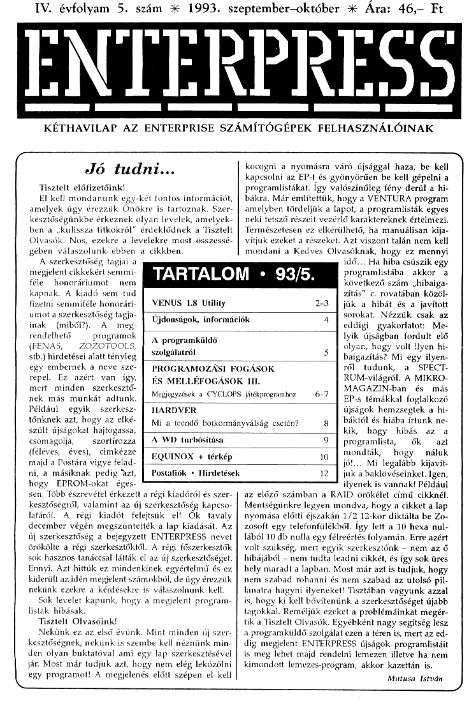

# Enterpress 1993/5 (1993.09-10)

[Оригінальний PDF](http://enterprise.iko.hu/magazines/Enterpress_1993-5.pdf) (угорською)

## Зміст

## Чернетка вмісту

"page-000.jpg" ------------------------------------------------------------ 
IV. évfolyam 5. szám :K 1993. szeptember—-október XX Ára: 46 Ft

ENTEKEKESS

sszzm—ym—————e—— ur]
KÉTHAVILAP AZ ENTERPRISE SZÁMÍTÓGÉPEK FELHASZNÁLÓINAK

Jó tudni...

Tisztelt előfizetőink!

EI kell mondanunk egy-két fontos információt,
amelyek úgy érezzük Önökre is tartoznak, Szer-
kesztőségünkbe érkeznek olyan levelek, amelyek-
ben a ,kulissza titkokról" érdeklődnek a Tisztelt
Olvasók. Nos, ezekre a levelekre most összessé.
gében válaszolunk. ebben a cikkben.

A szerkesztőség tagjai a
megjelent cikkekért semmi-
féle honoráriumot . nem

kapnak. A kiadó sem tud

TARTALOM :" 93

kocogni a nyomásra váró újsággal haza, be kell
kapcsolni az EP-t és gyönyörűen be kell gépelni a
programlistákat. Így valószínűleg fény derül a hi-
bákra. Már említettük, hogy a VENTURA program
amelyben tördeljük a lapot, a programlisták egyes
neki tetsző részeit vezérlő karaktereknek értelmezi.
Természetesen ez elkerülhető, ha manuálisan kija-
vítjuk ezeket a részeket. Azt viszont talán nem kell
mondani a Kedves Olvasóknak, hogy ez mennyi
idő... Ha hiba csúszik egy
programlistába . akkor a
következő szám ,hibaiga-
ítás" c. rovatában közöl-

fizetni semmiféle honorári- [/ VENUS 1.8 Utility 2-3 [jük a hibát és a javított
s eg gd/W/ 7] sorokat. Nézzük csak az
lons m 4
inak (miből). A meg. [/0Jdonságok, Információk eddigi gyakorlatot: Me-
rendelhető programok (A programkűl —Ílyik újságban fordult elő
(FENAS, — ZOZOTOOLS, leki e jöjj s [dosh n hi-
stb.) hirdetései alatt tényleg [/ Szolgálatról baigazítás? Mi egy ilyen-
egy embernek a neve sze- Í PROGRAMOZ, ról tudunk, a SPÉCT-
repel. Ez azért van Így] Ég MELLÉFOGÁSOK III. RUM-világról. A MIKRO-
mert minden szerkesztő- MAGAZIN-ban és más
Megjegyzések a CYCLOPS játékprogramhoz 6-7

nek más munkát adtunk.
Például egyik  szerkesz-
tőnknek azt, hogy az elké-
szült újságokat hajtogassa,

HARDVI

-s témákkal foglalkozó
ágok hemzsegtek a hi-
8] Páktól és hiába írtunk ne-

csomagolja, szortírozza
(féléves, éves),  cimkézze
majd a Postára vigye felad-
ni, a másiknak pedig "zt,

kik, hogy hibás az a
9 ( programlista, — ők azt
10 Í mondták, hogy náluk

jót... Mi legalább kijavít
12 ( juk a baklövéseinket. Igen,

hogy EPROM-okat éges-
sen, Több észrevétel érkezett a régi kiadóról és szer-
kesztőségről, valamint az új szerkesztőség kapcso-
latáról. A régi kiadót felejtsük el! Ők tavaly
december végén megszüntették a lap kiadását. Az
új szerkesztőség a bejegyzett ENTERPRESS nevet
örökölte a régi szerkesztőktől. A régi főszerkesztők
sok hasznos tanáccsal látták el az új szerkesztőséget.
Ennyi. Azt hittűk ez mindenkinek egyértelmű és ez
kiderült az idén megjelent számokból, de úgy érezzük
nekünk ezekre a kérdésekre is válaszolnunk kell.

Sok levelet kapunk, hogy a megjelent program.
listák. hibásak.

Tisztelt Olvasóink!

Nekünk ez az első évünk. Mint minden új szer-
kesztőségnek, nekünk is szembe kell néznünk mi
den olyan buktatóval ami egy lap szerkesztésével
jár. Most már tudjuk azt, hogy nem elég leközölni
egy programot! A megjelenés előtt szépen el kell

ilyenek is vannak! Például
az előző számban a RAID örőkélet című cikknél.
Mentségünkre legyen mondva, hogy a cikket a lap
nyomása előtti éjszakán 1/2 12-kor diktálta be Z0-
zosoft egy telefonfülékből, Így lett a 10 hexa nul-
lából 10 db nulla egy félreértés folyamán, Erre azért
volt szükség, mert egyik szerkesztőnk — nem az ő
hibájából - nem tudta leadni cikkét, és így sok üres
hely maradt a lapban. Most már azt is tudjuk, hogy
nem szabad rohanni és nem szabad az utolsó pil-
lanatra hagyni ilyeneket! Tisztában vagyunk azzal
is, hogy ki kell bővítenünk a szerkesztőséget újabb
tagokkal. Reméljük ezeket a problémáinkat megér-
tik a Tisztelt Olvasók. Egyébként nagy segítség lesz
a programküldő szolgálat ezen a téren is, mert az ed-
díg megjelent ENTERPRESS újságok programlistáit
is meg lehet majd rendelni lemezen illetve ha nem
kimondott lemezes-program, akkor kazettán is.

Matusa István

"page-001.jpg" ------------------------------------------------------------ 
1993. szeptember-október

Leszállunk a , VENUS"-ra

A VENUS egy olyan utility-csomag, melynek szolgálta:
tásai minden rendszerprogram alatt igénybe vehetők. Segi
ségével még a legtöbb fuló program (nem játék) is annak
legkisebb zavarása nélklül megszakítható, majd a kívánt szol-
Fállatások elvégzése után folytatható.

Az előző verzióhoz képest jelentős változás, hogy az 1.8-as
hidegindítás, a gép elszállása", de a legtöbb játék után is
megőrzi a RAMDISK tartalmát, (Szerk. ez sajnos nem teljesen
igaz. A második részben visszatérünk erre!) Az e funkcióhoz kap-
csolódó parancsok és tudnivalók a leírás végén találhatók.

Azok a parancsok, melyek egynél több sort írnak ki a kép-
ernyőre, alapértelmezésben egy gyors videokezelőt használ:
nak, mely a teljes képernyőfelületet felhasználja, A parancs
befejeztével az eredeti képernyőtartalom visszaáll. Ez a funk-
ció letiltható. Ezen parancsok legtöbbjénél a kiírás az. AJt le.
nyomásával lassítható, az Rshift-tel pedig megállítható,

A VENUS minden paramétert hexadecimálisan kér és ad
vissza, kivéve a CV parancsot.

A parancsok részletes ismertetése:

WC — Paraméter nélkül kiírja, különben állítja a wait stá-
tuszt, 2-es értéknél nincs, 1-esnél csak M! (feteh) esetén —
VENUS nélkül ez a gép alapállapota -, 0-nál mindig van egy
wait, Az RshiftérCtri 2-t, az RshiftáeLshift 1-et állít be. Be
kapcsoláskor a gép 2-vel indul.

VENUS -— 27 soros és 80 karakteres képernyőt nyit, ma-
ximális méretű editorral, melyből csak rendszerparancsok ad-
hatók ki. Ez az egyetlen olyan parancs, mellyel kilépünk az
aktuális rendszerprogramból.

W — Hatására a VENUS az aktuális rendszerprogram de-
fault csatornáját. használja ki- és bemenetül. Csak rend-
Szerparancsok adhatók ki, kettőspont nem szükséges. Kilépés
ESC-pel.

Ww — A képernyő alján megnyit egy 80 karakteres, mi-
nimum 3 soros szöveges lapot, ahonnan bármilyen rend-
Sszerparancs kiadható. Első megnyitáskor meghatározható a
lap függőleges mérete a parancsszó ulán írt számmal, Hasz-
nálata akkor célszerű, ha nem akarjuk megbolygatni a default
képernyőt vagy nem áll rendelkezésre 80 karakteres szöveg-
tap. Kezdetben a laphoz tartozó editor puffermérete 8, mely
az F4-es változóval módosítható, a lepméret pedig I2h sor;
Ha a WW ablakát programmegszakításból kívánjuk használ:
ni, akkor az a korrekt eljárás, hogy a kívánt méretű ablakot
még a program indítása előtt megnyitjuk. Az egyszer beállított
ablak- és pufferméretet a VENUS megőrzi és csak akkor csök-
kenti, ha nincs elég video memória. Kilépés ESC-pel.

REDIT - Kiadása után a WW paranccsal megnyitott vi
deolap mozgatható (joystick le-föl) és mérete változtatható
(Cteláejoystick le-föl). Ha az F4-es változóban új pufferméretet
adtunk meg, az csak a REDIT kiadása után lép érvénybe.
Kilépés ESC-pel. Ha a WW ablakába programmegszakítás út-
ján léptünk be, a REDIT használata nem célszerű, mert az
EXOS csatorna-puffermozgatást végezhet, melyet az adott
Program esetleg nem kezel le.

Pcs - Paraméterek nélkül kiírja, egyébként pedig beállítja
a virtuális memória szegmenseit, Mind a 4 szegmenst meg
kell adni.

REGS - Paraméterek nélkül kiírja, egyébként beállítja a
virtuális AF, BC, DE és HL regisztereket, Beállíthatók külön

regiszterek, regiszterpárok ill. az összes regiszter egyszerre
is. A CALL és az EXOS utasítások induló ill, visszatérő pa-
ramétereiként szolgálnak.

CALL - A virtuális memória megadott címére adja a ve-
zérlést, tiltott megszakítások mellett, a REGS paranccsal meg-
adott induló regiszterértékekkel, A VENUS a B2-re mindig
az FE szegmenst lapozza be, függetlenül a virtuális B2 tény-
leges értékétől, melyet belépéskor a H" regiszter tartalmaz.
Az összes ZO regiszter és a lapkiosztás szabadon elrontható.
A visszatérés egyszerű RET utasítással lehetséges, annak fi-
gyelembevételével, hogy belépéskor a verem a B2-n lévő FF
szegmensben van.

EXOS - A REGS paranccsal megadott induló regiszterér-
tékekkel rendszerhívást indít a virtuális memóriában, A vir-
tuális  B0-n a nullás lapnak, a B2n pedig a
rendszerszegmensnek kell lennie.

RST — Melegindítást eredményez, kiküszöböli azt a ve.
szélyt, hogy egy kontakthibás resetgombbal véletlenül hideg-
indítást okozhatunk.

SDMP - Szegmens dump, megadott címtől, megadott off-
szettel.
Opciók: a - az Alt-tal elérhető karaktereket is kinyomtatja,
x — az ASCII dumpat törölt 7-es bittel írja ki.
f — kikapcsolt gyors videokezelő
P— a dumpot nyomtatóra ís kiküldi,

setén is arra ír.

MDP - virtuális memória dump, különben mint az SDMP:

FDMP - File dump, különben mint az SDMP. A kezdőcím
út a file elejétől számított relatív cím.

FCOMP - Két file összehasonlítása, az eltérő paragrafusok
Kiiratásával. Különböző hosszúságú file-ok is összehasonlíthatók,
eltérő kezdőpontoklól is. Ez utóbbi esetben az első file kezdő-
Pontját a filenév előtt, a másodikét a filenév után kell megadni,
Közös kezdőpontot a második filenév ulán kell megadni.
Opciók: d — teljes duál file dumpot ad,
valamint az SDMP-nél érvényes opciók.

MFIND - Stringet keres a virtuális memóriában, megadott
kezdőponttól. A karaktersorozatot pontosvessző után vegye-
sen számokkal és betűkkel is meg lehet adni, utóbbiakat idé-
zőjelben. Az idézőjelben szóköz nem lehet, Opciók mint az
SDMP-nél, kivéve a p opciót.

FFIND — Stringet keres filelokjban vagy directoryban.
Használhatók az általános helyettesítő karakterek. A VENUS
kkor a directoryban lévő vagy a file-maszkhoz illeszkedő
Összes file-ban keresi a stringet,

Opciók: h — a rijtett fileokban is keres;

valamint az MFIND-nál érvényes opciók.

SLOAD — File-t tölt be egy szegmensbe. A filenév előtt
megadható a szegmens, a betöltés kezdő- és végcíme és a
betöltendő byte-ok száma. A filenév után megadható mindez
a file-ra vonatkozóan, lehát a file egy relatív címtől kezdve
is beolvasható, Ellentmondó paraméterek esetén a VENUS
a legkevesebb byle-ot olvassa be. A betöltés nem lép túl a
szegmenshatáron.
Öpció: v — az Fé-s változóban lévő szegmensbe tölt.

SSAVE - Szegmens memóriatartalmát írja ki file-ba, A fi
tenév előtt megadható a szegmens, a kiírás kezdő- és vég-
Ponlja és a kiírandó byte-ok száma. Ez utóbbira az
SLOAD-nál írtak érvényesek.
"page-002.jpg" ------------------------------------------------------------ 
1993. szeptember—október

MLOAD - File-t tölt be a virtuális memóriába, A para-
méterek úgy adandók meg, mint az SLOAD-nál, de szeg-
mensszám nélkül;

MSAVE - A virtuális memória tartalmát írja ki file-be. A
paraméterek úgy adandók meg, mint az SSAVE-nél, de szeg-
mens nélkül.

SFILL — Szegmens kitöltése adott értékkel. Megadható a
szegmens, a kitöltés kezdő- és végcíme és a kitöltendő terület
nagysága. A byte-ot pontosvessző után számmal vagy betűvel
lehet megadni. Ellentmondó paraméterek esetén az SLOAD-
nál leírtak érvényesek.

MFILL - A virtuális memória kitöltése adott értékkel,
egyébként mint az SFILL.

SMOD - Szegmens módosítása. Csak BO karakteres
képernyőn működik, ezért ha a default nem ilyen, hasz-
náljuk a WW képernyőjét, Megadható a szegmens és a
kezdőcím, Az AIIKF8 az ASCII és a HEX üzemmód kö-
zölt vált. Az Altájoystiek le-föl a teljes képernyőt gő
geti, de ez a software text üzemmód miatt nem nagyon
gyors.

MMOD - Virtuális memória módosítása, egyébként mint
az SMOD.

SGET - Lefoglal egy szegmenst és számát az F6-os vál:
tozóba írja, Az így lefoglalt szegmens EXOS-hívással vagy
rendszer-resettel nem szabadítható fel, tehát bármilyen prog-
ram indítása után is foglalt marad. Maximum 15 szegmens
foglalható le ily módon.

SLIST - Az SGET-tel lefoglalt szegmensek listáját adja
meg.

SFREE - Az SGET-tel lefoglalt szegmensek csak ezzel a
paranccsal szabadíthatók fel.

Opció: v — Az F6-os változóban lévő szegmenst szabadítja
fel.

MERGE - Az első két file-t összefűzi és a harmadikként
megadott néven kiírja.

Opció: a - Szövegfile-ok összefűzésekor hasznos opció, az
első file-t csak az elsőként előforduló CirZ (1Ah) karakterig
olvassa, melyet nem ír ki a célfile-ba.

PORT - Paraméter nélül olvassa, egyébként írja az adott
portot

VR - Paraméter nélkül olvassa, egyébként írja az adott
EXOS-változót. A VENUS saját változóiról a HELP VR pa-
ranccsal kapható részletes információ.

SCAN - Információt ad a billentyűzet mátrix közvetlen
olvasásához. Minden billentyű lenyomásakor egy kétjegyű
Számot ír ki, melynek első jegye a B5-re kiírandó értéket je-
lenti, második jegye pedig annak a bitnek a számát, mely
a B5 olvasásakor 0-ra vált, ha az adott billentyűt lenyomták.

CV - Számkonverzió. A megadott számot hexadecimális-
ként próbálja értelmezni, az eltérő számrendszert a szám után
írt hd vagy b betűkkel kell jelezni. Kétértelmű esetekben
(b és d) az utójelölésnek van prioritása. A 12d pl. decimális
12. hexa számként 12dh formában kell beími.

BITMAP - A virtuális memória bittérképét adja. Megad-
ható a videolap vízszintes és függőleges mérete, a video mo-
de(m-t vagy 5), a video colour (c-0, 1, 2 vagy 3) és a kijelzett
tartomány kezdete. A joystickkel göngethető a lap. minden
irányban, az Altásjoystick le-föl pedig az egész lapot görgeti
A Cirlézjoystickkel a vidcolap vízszintes és függőleges mérete

változtatható. Kilépés az AltáRshift egyidejű megnyomásá-
val. A státuszsorban látható számok jelentése:
1, 2 - a kijelzett tartomány eleje és vége,
3.— első jegy: video mode, második jegy: video colour,
4, 5 — vízszintes és függőleges lapméret,
6, 7 - a videolap kezdeti és végcíme NICK-címzés szerint,
8-1 - a virtuális memória szegmensei.

CHANS - A szokásos módon információt ad a csatorna-
leíró láneról.

DEVS - Ugyanez az eszközleíró láncról,

INFO — Információt ad a rendszer memória-állapotáról.

CHAN -— Az F2-es változóban elhelyezi a megadott esz-
közhöz tartozó első nyitott csatorna számát. Ha ilyen nincs,
a visszaadott érték FF.

DEV - Kiadása előtt az F3-as változóba be kell írni egy
csatornaszámot, A VENUS az F2-es változóban elhelyezi azon
eszköz nevének első karakterét, mely számára a csatorna
nyitva van. Nem létező csatornaszám esetén a visszaadott ér-
ték FF.

VTYPE — Szövegfile- kiír a képernyőre, A filenév után
megadható a kiírás kezdete vagy oldalszáma, Oldalszám csak
akkor adható meg, ha a file tartalmaz lapdobás (0Ch) karak-
tereket, Opciók: Ép — mint az SDMP-nél.

CLKON - Bekapcsolja a státuszsorban lévő órát. Az EP
indulásakor az alapérték a bekapcsolt állapot.

CLKOFF - Kikapcsolja az órát.

ALARM - Paraméter nélkül kiírja a riaszás idejét, egyéb-
ként beállítja azt. Az órát és a percet együtt kell megadni.
A riasztás úgy törölhető, hogy pl. 25:00-t írunk be, ezt az ér-
téket ugyanis az óra soha nem éri el,

BEEP, WAIT — Batch file-ok futtatásakor használható egy-
szerű parancsok. Az EXOS a kötegelt file-ok végrehajtását ak-
kor is folytatja, ha valahol hiba lépett fel (pl. akkor is
meghívja a linkert, ha az assembler hibát jelez). E parancsok
révén megőrződik a képernyőtartalom és hiba esetén meg-
szakítható a végrehajtás.

ERROR - Paraméter nélkül teljes hibakód- és magyará-
zallistát ad, egyébként kiírja az adott kódhoz tartozó hiba-
üzenetet.

ASCII — Karakterkészlet kiírása.
CLFONT - Karakterkészlet reset.

HFONT - Teljes magyar karakterkészlet. Minden magyar
ékezetes karakter kis- és nagybetűs alakban az alapbillentyű-
zetről (tehát Alt vagy Cirl nélkül) elérhető.

GFONT - Német karakterkészlet. A VENUS kívánságra
más karakterkészlettel is kapható.

VNSRAM - A VENUS sok parancs végrehajtásakor átme-
netileg egy szegmenst kér a rendszertől, melyet végrehajtás
után felszabadít. Az IS-DOS viszont egy .COM file indítá-
sakor minden szabad szegmenst lefoglal a DOS számára, így
sokszor előfordul, hogy a program megszakításakor (lásd a
bevezetőt ill, a CAPTURE leírását) nincs szabad szegmens.
E paranccsal egy szegmenst állandóan a VENUS-hoz lehet
rendelni, így biztosítva a programmegszakítás alatti teljes
működőképességet. Az EP bekapcsolásakor egy szegmens le
van foglalva.

(Folytatjuk)
Koch Tibor
"page-003.jpg" ------------------------------------------------------------ 
1993. szeptember-október

Függőleges rasztercsíkok
BASIC-ben

100 PROGRAM "raszt27
110 POKE 56.201-OUT 19112

120 TEXT

125 PRINT AT 10/17Egy kis turelmet."

130 SET VIDEO X 42:5ET VIDEO Y 10

140 SET VIDEO MODE 1:SET VIDEO COLOR 2
150 OPEN t1/video:

160 OPEN 427video:
170 OPEN 437video:
180 OPEN Wárvideoi
190 OPEN 45-video"

200 OPEN sérvideo"

210 FOR 1-1 TO 6

220 CALL RASZTER(-1)

230 NEXT

240 DO

250 FOR I-1 TO 6

260 DISPLAY 4Í:AT 1 FROM 4 TO 10
261 DISPLAY 47-LAT 8 FROM 1 TO 3
262 DISPLAY 4I:AT II FROM 4 TO 10
NEXT

IF JOY(0)-16 THEN EXIT DO

290 LOOP

300 POKE 56245

310 DISPLAY TEXT

320 DEF RASZTER(CSATSZ)

Shooting Out
melyet EDC írt idén nyáron. A program hama.
Tosan a programküldő szolgálat listáján is. sze-
repel majd.

ímmel játékprogram jelent meg,

9646
HSOFT is új játékprogramot írt, címe: Passzi-
ánsz. Nagy előnye ennek a programnak, hogy

egérrel is vezérelhető. (Megtalálható a program-
küldő szolgálat ,egeres lemezén", valamint a 12.
lemezen).

946
A Spectrum Emulátorok átalakítását továbbra
is vállaljuk. A program ingyenes, az átalakítás
díja: 200 Ft (ez az ár tartalmazza az átalakítás-
hoz szükséges kellékeket [EPROM-foglalat és
DIP-kapcsoló, valamint pár vezeték) árát. Jelent-
kezni lehet a szerkesztőség címén.

949

Pap János továbbra is várja azok jelentkezését,
akik külső billentyűzetet szeretnének gépükhöz.
Az átalakítást 500 Ft-ért 4 anyagköltség vállalja.

50. NUMERIC IL Íme: 1222 Budapest, Heszlercei u. 1.
350. LET A-D "Telefonszáma: 227-1046
360. SET HCSATPALETTE 0.64,8.72,1.65.255
370 FOR II-0 TO 167 Éj 984.
380 SET ACSATINK SZIN AD-konyerter, valamint VIDEO-kártya  ké-
sss 1 SA sxváááláász ás] ült Az AD-konvertert az SMD-TEAM készíti,
410 LET SZIN-SZINe1 míg a VIDEO-kártyát Erős Béla tervezte (ebből
420 IF SZIN55 THEN LET SZIN-0 már egy működő kísérleti példány létezik). A VI-
430 NEXT. DEO-kártya 512 Kbyte RAM-bővítést is tar-
40 BET SGSÁTBERM OPE talmaz, — amit memória — bővítésnek is
An - KERÉT eláll használhatunk. Következő számunkban részlete-
470 PRINT ACSAT" ZOZOSOFT AND APUCI " sebben írunk a kártyákról és közelítőleg a kár-
480 END DEF tyák árait ís közöljük.
EEEETEZTTEETTETTETI Im ETEIZEKZI
RND-rutin Hibás a magyar híd (BUS BRIDGE)

Ezt a rutint ajánljuk azoknak a program átíróknak, akik
Jes játékprogramokból kihagyták a nagyon fontos
RND-rutinokat. Használata: egyszer megi a RAN-

DOM-ot, utána már csak az RND-t kell hívni.
PANDOM: LD AR

LD HLLANOTARS1)

JA ANDIO
0: 1D A(RNOTAR-2)

1D HLANDTAR)

RND10: 1D 8.8: vagy 16 vagy 24
8 — ha csak az
akkumulátort használjuk,
16-i

124- HA
FND20: 10 G.A
ARCA
PRAGA
RACA
XOR E
FIA
FIA
LD AC
ADC HLHL
ADC AA
DUNZ ANO2O
LD (ANDTAR2A
LO (ANDTARL HL
RET,

FNOTARI DB AND"

Jelenségek: Az EXDOS elköltözik a 160-as szegmens-
re, emiatt néhány program nem működik. A WD port-
jai is 60H-tól kezdődnek 20H helyett,

A hibát úgy deríthetjük fel, ha kiadjuk a

IVAR 64 parancsot.

Ha ezután a gép 160-at ír ki, akkor hibás a hídunk,
ha 32-t, akkor minden rendben.

A hiba elhárítása: össze kell kötni az A36-ot a B36-
tal a hídon, ezt ugyanis elfeljtette összekötni a sokat
emlegetett magyar cég. az

Az ENTERPRESS 1993. évi 1-2. számában megjelent
,Mire jó a Paintbox-nyíl?" című cikkhez egy kiegé-
szítés.
A kérdőjellel megjelölt 188-as EXOS változó jelentése:
Ha le van nyomva a 189-es változóval megjelölt joy
tűzgombja, vagyis

0— ha nincs a tűzgomb lenyomva,
1 — lenyomott tűzgomb.

Az ötletet Vaczkó Károlynak köszönhetjük.
"page-004.jpg" ------------------------------------------------------------ 
A küldő 8
Ea Slater e

Sok ENTERPRISE felhasználó óhajának teszünk eleget a programküldő szolgálat beindításával. Reméljük sikerül
majd minden igényt kielégítenünk. 12 játék-lemezzel, 4 Spectrum-Emulátoros lemezzel, 3 felhasználói-lemezzel, 2 de-
mo-lemezzel, egy vegeres lemezzel, amely folyamatosan bővül (a Mészáros Gyula által tervezett kártyához ajánljuk
ezeket a programokat), 8 zene-lemezzel és egy ENTERPRESS lemezzel, amelyen az eddig megjelent programlisták
találhatók (ez is folyamatosan bővül), valamint kazettával indul szolgáltatásunk. (Vannak olyan programok, amelyek
csak lemezről használhatók, ezek természetesen nem szerepelnek a kazetta-listán!) Egyébként a lemez-, illetve kazetta
lista megegyezik! Nemcsak ezekből a listákból lehet majd rendelni, hanem külön a felhasználó által kért programokat
ís tudunk küldeni — ez persze kicsit hosszabb ideig tart, mert össze kell válogatni a kért programokat. A 5,257-os
lemezek illetve kazetták ára egységesen 150 Ft 4 postaköltség, a 35"-os lemezek ára 180 Ft 4 postaköltség. Termé-
szetesen utánvéttel küldjük a programhordozókat (biztonságos csomagolásban!)

Azoknak a lemezeknek illetve kazettáknak, melyeken eredeti ENTERPRISE-program van, magasabb az áruk. A
program íróját illeti meg a 150 Ft-on feletti összeg. Ezeket a lemezeket illetve kazettákat külön megjelöltük. Úgy
érezzük, hogy az eredeti ENTERPRISE programok íróit feltétlenül megilleti ez az összeg (persze ezt ők is így gondolják
— jogosan!

Néhány jótanács a listákho:
(TRN) - örökéletes játék
(TRN is) - eredeti és örökéletes betöltővel is rendelkező játék
(EXT) - rendszerbőv
(DOC) - dokumentáció is tartozik a porgramhoz (WP-be tölthető DOC-fájl)
(1281) — csak 128 K-s módban fut

A lemezeken a fájlok kiterjesztési

COM - gépi kódú futtatható program
BAS - BASIC nyelvű futtatható program
EXT - rendszerbővítő program

IRN - örökéletes játék

DOC - dokumentációs fájl (WP-ben)

ramküldő szolgálattal kapcsolatban, sem a géppél kapcs
sekben! A programküldő szolgálattal, valamint a Kopp
kérdéseket; Aa szerkesztőség címére várjuk:

ENTERPRESS szérkesztőség
1399 BUDAPEST
Pt. 701334.

Köszönettel: a lap szerkesztői .

Fizessen elő a

j RÁDIÓTECHNIKA és a elektronika

folyóiratokra! Így biztosan hozzájut!
Címünk: 1374 Budapest, Pf. 603.
A szerkesztőségben regisztrált HE előfizetőknek díjmentes nyák-filim melléklet.

"page-005.jpg" ------------------------------------------------------------ 
1993. július-augusztus

Programozási

fogások és

egz melléfogások

A MOVE eljárás még egy súlyos melléfogást tartal-
maz: a négyszer ismételt lépésvégrehajtó részt. Ezek
között az egyetlen különbség az, hogy a lépés irányától
függően a Pl és P2 értékekhez egyet, mínusz egyet,
vagy semmit, azaz nullát adunk hozzá. Ha az összes
érintett sorban TABLE(P1: A,P2.B)-t írunk, akkor ebből
az utasítás-sorozatból egy is elég. A-nak és B-nek a 0
értékétől függően adhatunk értéket:

SELECT CASE 0
CASE 1 (jobbra lépünk)

CASE -2 (lefelé lépünk)
A. 1

CASE -1 (balra lépünk)
A-—1B-0

CASE 2 (felfelé lépünk)
A-0:B-I

END SELECT

Lassan a program — és a játék — végére érünk. Ha
nagyon jó formában voltunk és sok pontot kaptuni
akkor a BEST eljárás beírja a pontszámunkat a di.
ségtábla utolsó helyére. A REN eljárás feladata, hogy
ezt a pontszámot a tábla többi eleme közé berendezze.
Mivel ezt az eljárást csak a BEST hívja meg, azzal nyu-
godtan egybe is írható. A rendezés egy dupla ciklussal
történik, ami ebben az esetben fölösleges, hiszen a tábla
többi eleme már rendezett, csak annak az egynek, a
legalsónak kell a helyét megtalálni. Elég erre egyetlen
ciklus, a tábla aljától a tetejéig lefuttatva. Ha feltéte.
lezzük, hogy a pontszámokat a PONT tömbben tárol-
juk és nem szövegként, akko

FOR 1-10 TO 2

IF PONT(I)2PONT(I-1) THEN

( pont(i) és pont(i-1), valamint name$(i)
és name$(i-1) cseréje )

NEXT I

Főlösleges az M$ közbenső változó nullázása is a
834. sorban. A csere közben úgyis kap értéket. Azt sem
egészen értem, hogy a nyilvánvalóan programvédelmet
szolgáló. megszakítás-változót miért kell a rendezés
előtt és után átállítani? (SET 0,4 — SET 0.20),

A NAINS függvény olvassa be a nevünket, hogy fel-
kerülhessen a dicsőségtáblára, Itt is láthatunk példát a

3RAMHOZ II

feltételek helytelen kezelésére, csak ellenkező módszer-
rel, mint az előbb: Ha az S változó határértéken áll, ak-
kor gyorsan levonunk, vagy hozzáadunk egyet, hogy
aztán a következő sorban visszaállíthassuk az eredeti
értékre (8368. és 873. sorok). Természetesen pl.

IF
S-Sr1
helyett
IF 5-32 THEN S-S-1

22 THEN $-31

a korrekt megoldás. A beolvasás szóköz beadására
befejeződik, nincs megoldva viszont a rosszul beadott
karakter törlése. Ennek megoldását már nem részlete-
zem. Csak annyit még, hogy ha a betűk után álló kü-
lönleges — karaktereknek — olyanokat . választunk,
amelyeknek ASCII kódja egymás után következik, ak-
kor (egy ASCII kódra alapozott eljárásban) ezen karak-
terek kezelésére egyetlen plusz feltétel elég. Így nem
Szükséges a betűket tömbben tárolni. Stílszerűen a leg-
utolsó eljárás a dicsőség-képernyő kiírása. Ha vala-
mennyi rejtvényt megoldottuk, a program kiírja, sajnos
angolul: CONGRATULATION, aminek a végére nem
ártana még egy S betű, ugyanis a fránya angolok ezt
csak többesszámban használják. Egyébként hadd említ-
sem meg, hogy számomra nagyon furcsa volt az is,
hogy a szerző magyar létére a programban kizárólag
angol változó- és eljárásneveket használ. Ha a progra-
mot én írom, a PRNTSC helyett talán KÉPKI, a COUB
helyett SZÁMOL, a CLTBL helyett TÁBLATÖRLÉS,
vagy annak valamilyen rövidítése állt volna. (Feltéte-
lezni sem merem, hogy a program nem egészen öni
lóan készült.) Végül pedig a dicsőségképernyő
tudtunkra adja, hogy YOU SAVED THEM. .., azaz: mej
mentetted őket. Utolsó kérdésem: kiket és mitől? Talán
YOU SOLVED THEM! akart lenni a kiírás? Ez ugyanis
azt jelenti, hogy , megoldottad őket!", ami sokkal értel-
mesebben hanzik, különösen, ha hozzátesszük: YOU
SOLVED THEM ALL, azaz: valamennyit megoldottad!

Egyvalamit kifelejtettem a saját helyén az elemzésből,
talán azért, mert a program a hiba ellenére helyesen mű-
ködik. Nézzük meg a MODIFY KEYS eljárás 438-442.
soraiban található feltételrendszert. Ott kezdjük, hogy
1 nagybetűsítése fölösleges, mivel a gépet már a prog-
ram elején CAPS LOCK üzemmódba állítottuk. A kö-
vetkező sorok azt a célt szolgálják, hogy a játékos,
amikor a vezérlőbillentyűket definiálja, ne adhassa meg

"page-006.jpg" ------------------------------------------------------------ 
1993. szeptember-október

EHENHRHEE]

ugyanazt a billentyűt két különböző irány jelzésére. Te-
kintsünk el attól, hogy erre is lehetett volna ciklust írni
és figyeljük meg pl. a negyedik billentyű leütésére írt
feltételt:

IF Az3 AND I-KEY(I1) OR
EY(I3) THEN LET 1-0

1-KEY(I2) OR

A hiba ott van, hogy a logikai műveletek prioritása
értelmében az AND műveletet a gép előbb hajtja végre,
mint az OR-t, ezért az OR-ral vizsgált feltételeket min-
den sorban zárójelbe kellett volna tenni! Ebben a formá-
ban a gép nemcsak a negye. ntyű leütése után
vizsgálja meg, hogy ! egyenlő-e a KEY megfelelő oszlo-
Pának első, második és harmadik elemével, hanem min-
dig, akkor is, ha az A nem 3. A helyes megoldás:

IF A-3 AND(-KEY(I1)
1-KEY(I,3)) THEN LET 1-0

OR 1-KEY(I2) OR

A programrész csak azért működhet helyesen, mert
a KEY tömb ezen oszlopát már korábban lenullázza,

így a fölöslegesen megvizsgált elemekkel I soha nem
lehet egyenlő. A műveleti sorrendre azonban ettől füg-
getlenül ügyelni kell egy programban. Próbálja ki pl.
az olvasó az alábbi utasítást:

IF 35 AND (251 OR 955) THEN PRINT "IGAZ"

Ebben a formában a kifejezés HAMIS, ha a záróje-
leket elhagyjuk, IGAZ értéket ad eredményül.

Szalontai Andrea
(Vége)

A szerkesztő megjegyzése:

Most érdemes mégegyszer elolvasni a cikk első ré-
szének első bekezdését. Reméljük a program írója nem
vette sértésnek ezt a cikksorozatot. Szerintem azért kel-
lett közölnünk Szalontai Andrea cikkét, mert nemcsak
a hibákra világított rá, de sokat segített azoknak akik
a BASIC programozásában is profi szintet szeretnének
elérni.

EPROM-
égetés

Értesítjük a Kedves Megrendelőinket, hogy a ROM-
BAY-NYÁK-ok és dobozok elfogytak.
Helyette a kártyák átalakítását vállaljuk:

1.32 K-s, vagy IxI6K-s foglalatot 1x64 K-s foglalatra,
2xl6 K-s foglalatot 2x32 K-s foglalatra.

Az EPROM-égetések díja:

32 K-s EPROM esetén 600 Ft,
(Hozott EPROM esetén 100 Ft),

64 K-s EPROM esetén 700 Ft,
(Hozott EPROM esetén 200 Ft).

Az EPROM-ba égethető programok listáját az előző
ENTERPRESS újságban találhatják meg.

Megrendelhető az alábbi címen:

Haluska László, 1086 Budapest,
Karácsony Sándor u. 18. III. 41

(1993. Hsoft)

DTF kontra ENTERPRESS

Úgy látszik a DTF tömörítő szerzőire hatott az 1.
számban megjelent cikkünk, bírálatunk a programról,
ugyanis elkészítették a tömörítő-program egy újabb
változatát. Még nem volt szerkesztőségünknek ideje
tesztelni a programot, mivel lapzárta előtt nem sokkal
kaptuk meg. A következő számok egyikében írunk
majd a DTF-tömörítő újabb változatáról.

4...

Új helyen a budapesti
ENTERPRISE Klub!

Mivel a VSZM Közösségi Házban a klub igen ked-
vezőtlen körülmények közé került, ezért új helyre köl-
tözik, A cím: VIII. kerület, Illés u. 36. (Megközelíthető
a 3-as METRÓ-val, a Klinikák állomásnál kell leszállni.)
Az első időpont; 1993. november 7. (vasárnap) délután
3 órától 5 óráig,

Itt kerül megrendezésre 1993. december 19-én az
,ENTERPRISE karácsony" is, amelyre szeretettel
meghívunk minden ENTERPRISE géptulajdonost!

Legjobb játék progi

Legjobb demo prog

Legjobb progi

Legjobb. program

Legjobb szoftver stúdió:

obb felhasználói program:

ON A szerkesztők
SWAP EGUINOX
ASMON EPDOS 17
SMALL DEMO SMALL DEMO
HSOFT HSOFT

BAM MOONLIGHT
HSOFT HSOFT
"page-007.jpg" ------------------------------------------------------------ 
8 Hardver

1993. szeptember-október

Mi a teendő botkormányválság esetén?

Kedvenc számítógépünknek van saját, különbejáratú,
Dunára néző botkormánya. Hohohohó! - mondhatnánk (és
részben igazunk lenne) - Akkor itt van a Kánaán, lehet
hátradőlni.

A bajok akkor kezdődnek, amikor a felhasználó nekiáll
(Njelhasználni masináját. Többek egybehangzó és megfon-
tolt véleménye szerint, a botkormány meg a szóköz gomb
(lásd: fire, tűz, Feuer, fájer) baromi hamar tönkremennek
átlagosnak nevezhető igénybevétel (ütés, rúgás ezeken be-
lül egyenes és körkörös, egy-, avagy kétkezes, ill. -lábas,

ás — ebből szintén van egykezes és kétkezes, sőt két-
-, húzás, nyomás, meg egyéb sporttevékeny-
ség) hatására. Általában ekkor szokott bekövetkezni, ho;
a (Delhasználó elrohan a legközelebbi botkormányárus
helyre és botkormányt vásárol, rendszerint nem is egyet.
A meglepetés otthon éri: a jó öreg ENTERPRISE-on ,ter-
mészeteser" nincs olyan csatlakozó, ahová a friss, még gő-
zölgő zsákmányt bedughatná. Mi a teendő? - kérdezi
ilyenkor (fjelhasználónk Lenin et. után, szabadon.

Régebben sokan tértek be a Centrum Áruházak vala-
melyikének műszaki osztályára ún. joystick-átalakítót vá-
sárolni. Ez a lehetőség ahhoz képest, hogy műszakilag
nem egészen korrekt, rettentő drága (összemérhető magá-
nak a joysticknek az árával), azonkívül mára már meg is
szűnt, hála a fent említett cég átgondolt üzletpolitikájának.
Műszakilag hasonló (a négy irány és a tűzgomb működik,
a csingilingik /autofire, stb./ nem) megoldást nyújt a
Szerző (azaz én), aki egyetlen barbár mozdulattal levágja
a joystick eredeti kilenc pólusú csatlakozóját, és a helyébe
több kifinomult mozdulattal felforraszt egy, az EP-be dug-
ható csatlakozót. Teszi mindezt ingyen azoknak, akik más
egyebet is rendelnek őnála. Akik még nem rendeltek sem-
mit, és kedvük szottyan némi barkácsoláshoz, saját kezű-
leg is megoldhatják az átalakítást az 1. ábra alapján. A
szükséges. panelélcsatlakozó-darabokat ingyen és bér-
mentve a Szerzőnél (ez is én vagyok) lehet megszerezni.

Ha valaki ragaszkodik az autofire (azaz automata tü-
zelés, szemben mondjuk, a széntűzeléssel) opcióhoz, vagy
netalán infra botkormányt óhajt befelé szerezni, úgy ismét
két út áll előtte, amelyből az egyik göröngyös, a másik
meg sima, és hozzám vezet. (Majd minden út hozzám ve-
zet, főleg a Zsíroshegyi út). A göröngyös út az ENTER-
PRESS egy régi számában megjelent átalakítás, amelyhez
mélyen az elektronikába kell nyúlni. A simához a zsebbe
kell mélyen nyúlni, viszont azonnali és biztos eredményt
ad mindkét botkormányra: ez az univerzális joystick il-
lesztő 1600 Ft-ért, Hasonlít egy bizonyos fajta samponhoz:
csak bedugom, és már megy is...

Most már majdnem mindenre tudunk megoldás
gondolnunk kell azokra is, akik (eléggé el nem ft

módon) főleg olyan programokat szeretnek használni,
amelyek kizárólag a belső joysticket ismerik. Namármost
ismét két út kínálkozik. Az egyik szoftveres, amelynek
két alesete van. Az első szerint át kell írni a szóbanforgó
programot, hogy méltóztassék a külső botkormányt hasz-
nálni, a második szerint az EXOS-t kell félrevezetni, hogy
a belső joystick helyett valamelyik külsőt kezelje. Ez utób-
bi komoly hátránya, hogy a játékok túlnyomó többségénél
nem alkalmazható.

A hardveres útnak is van két alesete, Az első megoldás,
hogy a megromlott fóliát profi nyomógombos billentyű-
zetre cseréljük, és sorsunkban megnyugodván annak kur-
zormozgató billentyűt (nyilait) használjuk joystick
gyanánt, ami nem is olyan rossz dolog, egy idő után hoz-
zá lehet szokni. A másik megoldás szerint a megromlott
fóliát profi nyomógombos billentyűzetre cseréljük, és a
belső joysticket egy külön csatlakozón kivezetve valódi
botkormánnyal pótoljuk, Ezt Frigyes keresztnevű,
és/vagy vállalkozó szellemű (fjelhasználók saját kezűleg
ís megtehetik a 2. ábra alapján. Ha valaki visszarettenne
a feladattól, szívesen állok rendelkezésére,

Végül, de utolsásorban vissza kell térnem az ez évi 3.
számban ZozoHard által jegyzett cikk egy dehonesztáló
megjegyzésére, miszerint a ,Mi lakik a cartridge-ban?" cí-
mű korábbi műremekem nem ad gyakorlati útmutatót a
cartridge meg az ENTERPRISE miszlikbe aprításához, ki-
bővítési célzattal. A leghatározottabban ki kell jelentenem,
hogy minden ezzel kapcsolatos szó, amit ZozoHard (aki
mellesleg közeli rokona ZozoSoftnak) a fentiekkel kapcso-
latban leírt, az utolsó betűig bezárólag mind igaz. Szo-
morú tapasztalatok vezettek arra a meglátásra, hogy
géptársaink jelentős részét (most minden nyájas olvasóm
gondoljon valaki másra) fölöttébb veszélyes részletesen
kiokítani arra, hogy mit hol kell elvágni, kifúrni, lereszel-
ni, valamint összeforrasztani, mert még nekifognak, vas
egy még jobb kifejezést használva, belevágnak. Ez rend-
szerint szerencsétlen EP-nek az életébe kerül. Most azon-
ban, engedve a tömegek nyomásának, két helyen is arra
biztatom a (felhasználókat, hogy nyúljanak bele jobb
sorsra érdemes gépükbe, oldjanak és kössenek, meg ilyes-
mi. Persze csak azok, akik kedvet és tehetséget éreznek
hozzá! Senki ne vádoljon azzal, hogy az üzletmenetem
felfuttatása végett adom az ötleteimet, ám ha mégis szük-
ség lenne rá, jutányos áron vállalom meghibásodott EN-
TERPRISE-ok javítását...

Mészáros Gyula
1029 Budapest, Zsíroshegyi út 110.

Fej őv tata fel
le — kék alra — zöl
0 hez kék, balra — zöld
ez SZEETAEMTKEKEEHLE EE ETTB fel— Tehét jorésákágpzjaes
jobb — barna közös — fekete
kaztn föbb ta szenet:
A Ouickshotí" botkormányok
A CONTROL 1 és 2 csatlakozók § aalészss
rélzsák kére színjel szerinti bekötése.
7 le — XZ balra — X4
2. den fel - X5 tűzt — lásd lentebbt
tm ezzzzzm gél jobbra — X7 közös — YI0

Az ENTERPRISE billentyűzet-
csattakozájnak. számozása,

"A külső botkormány bekötése
A tözgombot a botkormányan belül le kell
Választani a közös vezetékről és külön dróttal
Y9 és X3 közé kell kötni.
"page-008.jpg" ------------------------------------------------------------ 
1993. szeptember-október JENTERPRESS] Hardver 9

tik. ak sáv [/ 9 szektor [/ 10 szektor [/ 13 szektor

A WD turbósítása
40 ]/ 360 Kbájt 400 Kbájt (520 Kbájt
c B: ü 42] 378 Kbáji ] 420 Kbáji ] 546 Kbájt
ertoesdatrsó ki (agltese budtaáli 80] 720 Kbájt ) 800 Kbájt ) 1040 Kbájt
irectory of BV 82 738 Kbájt 820 Kbájt 1066 Kbájt
s 84 ]/ 756 Kbájt ) 840 Kbájt ) 1092 Kbájt
PROBA 1185792 93-09-26 1 § j
nöi gélt tes 90] 810 Kbájt 900 Kbájt (1170 Kbájt

Ha ezt a dírectory-t valaki meglátja (ENTERPRISE-on),
akkor biztos, hogy valami csalásra gyanakszik, pedig itt csa-
lásról szó sincs! Akkor meg hogyan lehet ekkora fájl egy
EP-lemezen? Aki foglalkozott az ENTERPRISE-ok turbó-
sításával, az nagyon jól tudja, hogy ilyenkor kell egy plusz
átvágás És egy átkötés annak érdekében, hogy a lemezve-
zérlő IC mindig 8 MHz-es órajelet kapjon, de miután ki-
derítettem, hogy a 4 MHz-es 7-80 A nagyon jól működik
7.12 MHz-en ís, úgy döntöttem, hogy ki kellene próbálni,
mi történik akkor, ha a WD1772 ís többet kap mint 8 MHz.
Kiderült, hogy a WD leírásában szigorúan (4/— 0196) meg-
adott 8 MHz, a lemezek kompatibilítása miatt fontos, nem
az IC teljesítő képessége által megszabott határ miatt. Maga
az IC kb. 15 MHz-ig működőképes maradt. Hogy ez miért
jó, kérdezhetik jó páran, nos azért, mert az adatátviteli se-
besség az órajellel egyenes arányban van, tehát ha 12 MHz-
et kap a WD, akkor nem 6250 bájtot, hanem annak
másfélszeresét, 9375 bájtot lehet egy sávra felírni. Termé.
Szetcsen az ilyen irányú törekvéseinknek határt szab a meg-
hajtók és a lemezek t sége. Némi próbálkozás után
10 MHz-nél döntöttem, mivel ezt az összes általam tesztelt
meghajtó és egyszerű NONAME lemezek is elbírtak. Ter-
mészetesen ez nem ilyen egyszerű, mivel nem árt, ha át-
kapcsolható az órajel, hogy a normál lemezeket is kezelni
tudjuk, erre az alább vázolt áramkör szolgál (lermészetesen
csak akkor, ha ráépítjúk az EXDOS kártyára), amely elő-
állítja a 10 MHz-es órajelet és elvégzi a 20H (32) port ki
zelését, amelynek a 7. bitjével lehet kiválasztani az órajelet
(0-8 MHz, 1 — 10 Mhz), Természetesen a hardverhez meg-
felelő szoftver is kell: TURBO EXDOS v. 1.3 amely meg-
egyezik az EXDOS 13 4 ISDOS 10 (működő gyoi
videokezelővel!) HUN (vagy HFONT-os) verzióval, csak ki
lett egészítve a kapcsolgatáshoz szükséges rutinokkal: auto-
matikusan felismeri a lemezek formátumát, és a felhasználó
számára észrevétlenül végzi az átkapcsolást, nyugodtan lehet
például különböző formátumú lemezek között másolást vé-
gezni. A TURBO lemezek formátumáról még nem esett szó:
ezzel a megoldással 13 szektort lehet egy sávra felími, íme
egy táblázat, amely a gyakoribb értékekből, a helynövekedés
szemlélteti (2 oldalt feltétek

ALI szektor azért nincs a táblázatban, mivel nem lehet
általánosan biztonságosnak nevezni, mivel ha két meghajtó
fordulatszáma elétrő, akkor könnyen előfordulhat, hogy ha
írni próbálunk a másik lemezre, akkor SECTOR NOT FO-
UND hibajelzés kíséretében pár szektor örökre eltűnik a le-
mezről (ezért csak olyan helyen használjunk 11 szektoros
lemezt, ahol már leteszteltük a meghajtót ebből a szempont-
ból), a 13 szektoros lemeznél a szektorok között kb. ugya
annyi bájt van, mint a 10 szektoros lemeznél, így jóval
biztonságosabb, mint a 11 szektoros.

Jelenleg csak a ZOZOTOOLS 1.8 FAFO-ja képes 13
szektoros lemezt ni (az EXDOS-ba nem lehetett be-
tezsúfolni),

Még egy dolgot kel! megemlíteni: az órajel növekedésével
a fejléptetés is gyorsul, amit nem minden meghajtó szeret,
ezért mielőtt valaki megrendeli az új EXDOS-I, nem árt ha
megállapítja a helyes fejléptetési sebességet a meghajtóira
(a TURBO EXDOS-ban meghajtónként és üzemmódonként
(S/10 MH) lehet beállítani a sebességet (EPROM-ba égetés
előít), és mindig ezt a táblázatot használja, fütyülve arra,
hogy egyes programok (pl. EPDOS, VENUS, SPRED, MA-
GIC PEN, stb.) az íróik ízlésének megfelelően, össz
állítgatták a 73-as változót (STEP RATE)). Nét
az értékek megállapításához:

73-an változó [/, WD1770 (csak a gyári wpimrz
EXDOS kártyán van ilyen)

o 6 ms 6 ms

. 12 ms 12 ms

2 20 ms 2 ms

3 30 ms 3 ms

A WDIT70-nél nincs gond, általában turbósítás után is bírják.
a leggyorsabb 0-ás sebességet a meghajtók, A WD1772-nél ál-
talában a 3-as sebességet használják (EPDOS, VENUS, stb.),
pedig jó náhány meghajtó a gyorsabb 2-est is elbírja, amelyik
nem, annál turbóban csak a (-ás fog menni,

A mérést legegyszerűbben így végezhetjük: egy majd-
nem teljesen teli lemezen futtassuk le a következő prog-
ramot:

10 FOR 1-0 TO 3
20 TIME "00-00-00"

HT ataekőátő 39 EXT "MD ASDFGH"

40 EXT "MOVE 1." ASDEGH"
50 EXT "MOVE ASDEGHé""
60 EXT "RD ASDFGH"

70 GOTO 80 ! "Lásd a megjegyzést
80 PRINT LTIME$

90 NEXT
"Akinek javított BASIC-je van, annak nem
kell ez a sort
A helyes sebességhez fog a legkisebb
idő tartozni.

ZOZOHARD
"page-009.jpg" ------------------------------------------------------------ 
10

ENYUHAAREE]

1993. szeptember-október

A nagysikerű Wally-sorozat tagjaival szem-
ben méltatlanul mellőzött játék a MIKRO-GEN
1986 elején megjelent EOUINOX című prog-
ramja. A mellőzöttség érthetetlen, hiszen az
EGUINOX is magán viseli a Mikro-Gen jelleg-
zetességeket: egy labirintus rendszerben szét-
szórt tárgyakat össze kell gyűjteni és bizonyos
logika alapján felhasználni. Talán csak az szól-
hat a játék ellen, hogy sokkal nehezebb, mint
a Wallysak.

Az EOUINOX a végtelen űr egyik távoli
bolygóján játszódik. A $URY-ANI naprendszer
7. bolygóján már felfedezése óta bányatelep
üzemel, folyamatosan folyik a radioaktív anya-
gokat tartalmazó kőzet kitermelése. A kőzetből
nyert sugárzó anyagot a későbbi energiahordo-
zóként történő felhasználás céljából speciál
tartályokban helyezik el, Egy napon hatalmas
meteorit csapódik be a bolygóba és megrongálja a felszín
alatt húzódó kiterjedt bányarendszert. A detonáció követ-
keztében szétszóródnak a tartályok. A lakosság — a tar:
tályokból felszabaduló  energiától való félelmében -
elmenekül a bolygóról és csak egy szuper-robotot (a já
tékost) hagynak ítt, hogy a bányászok által itthagyott szer-
számok és tárgyak felhasználásával hordja össze a
szétszóródott tartályokat az eredeti helyükre, mielőtt azok
még csinos gombafelhővé nem változtatják bolygót;

A bányakomplexum nyolc, egymástól jól elkülöníthető
egységből (szintből) áll. Minden szinten 16 szobát és szin-
tenként egy-egy sugárzó anyagot tartalmazó tartályt ta-
lálhatunk, amelyet el kell helyeznünk a vákuumcsőbe, ami
továbbítja azt rendeltetési helyére, a sugárvédett, ólom-
falakkal lezárt szoba polcaira. A szintek közötti átjárást
teleportáló kártyák biztosítják.

A  meteorbecsapódásból kifolyólag . elnéptelenedett
bolygót csak ronda mutáns élőlények lakják, amelyek elő-
szeretettel tartózkodnak a bányában. Ezek állandóan tá.
madnak bennünket, ha túl sokszor vagy túl sokáig
érintkezünk velük, egy idő után elvész egy életünk. Ro-
botunk a mutánsok ellen egy lézerágyúval van felszerelve,
amivel megsemmisíthetjük a túl közel merészkedő utakat.
Más lehetőség is kínálkozik az élővilág eme kevésbé jeles
kélpviselőinek likvidálására: a szintek egyes szobáiban
bombákat találhatunk, amelyeket felvéve majd aktivizlál-
va elhalálozásra kényszerítjük az aktuális szoba élőlénye-
it, A mutánsoktól mentes közlekedést a — térképen az
adott szobák között nyíllal jelölt irányban - egy speciális
mágneses lift biztosítja, de sajnos ez csak kevés helyen
találhat

A játék bejelentkezés után zenélget nekünk egy keveset,
majd a főmenü opcióihoz tartozó számbillentyi
gével beállíthatjuk az irányító billentyűket (1), rövid —
egyben angol nyelvű — használati utasítást kérhetünk (2),
joystick-ot választhatunk (4) vagy elindíthatjuk a játékot

(3). Ha nem az említett billentyűk valamelyikét nyomjuk
meg, rövid időn belül elíndul a demo, amely bariutatja
a játék fontos tárgyait (vákuumcső, teleportáló terminál
Stb) és megvizsgálhatunk néhány szobát is.

A játék képernyőjének bal felső sarkában látható azon
tángyak képe, ami nálunk van. Tángyakat azzal a billen-
tyűvel tudunk felvenni illetve használni, amelyet a billen-
tyűzet definiálásánál a ,USE" kérdésre választottunk. A
felvett tángyakat nem tudjuk letenni-csak felhasználáskor,
Vagy akkor tűnnek el, ha másik tárgyat veszünk fel he-
lyette (csere).

A tárgy képe mellett látható robotok a még meglévő
életeink számát jelzik (kezdetben 2 db. és amivel pillanat-
nyilag játszunk). A robotok mellett láthatjuk az eddigi te-
vékenységünkkel elért pontszámunkat. A jobb felső
sarokban két mérőműszer található: a tolóerő és a lézer-
töltet kijelzői. Ezeket mindig kísérjük figyelemmel, mert
a töltet kifogyása (nem tudunk lőni), de főleg a tolóerő
hiánya (nem tudunk felemelkedni) esetén könnyű prédá-
jává válunk a mutánsoknak (vagyis bekövetkezik a gyors
halál nevű történés). A tolóerőt és a töltetet a szobákban
szétszórt tartályok használatával maximálisra. .tuningol-
hatjuk".

(Részlet a Spectrum Világ 7. részéből)

EOUINOX

Grafika: 9
Zene/FX: 4
Játszhatóság: 8
Az átirat minősége: 10

Összhatás: 8

ennem

Appli-COMP Szervezési, Számítástechnikai

SZERVEZÉSI, SZÁMÍTÁSTECHNIKAI ÉS KERESKEDELMI Kft.

Alaplapok, RAM-ok, modulok, Floppy-k, winchesterek, kontrollerek,
házak, monitorok, hálózati tartozékok, billentyűzetek, mouse-ok,
kábelek, nyomtatók valamint komplett gépösszeállítások 1 év garanciával!

in s Kereskedelmi Kft.
Üzlet: Budapest, X. kerület, Állomás u. 27. (Kőbánya városközpont)

IDENANK KERETEN ETÁLAKEDAT AETR

jen

"page-010.jpg" ------------------------------------------------------------ 
1993. szeptember-október

11

HIBA- )
IGAZÍTÁS 8

Auth Csaba olvasónk hívta fel figyelmünket, hogy az
1993. évi 1/2. számban található Music Box Player
Program listájában még egy hiba van, a PERIF cimke-
névnél (a 14. oldalon).

Helyesen:

PERIF DB $-TYPE

A 93/4. számban a 3. oldalon lévő CSIPKE c. BASIC
programban a 260-280. sorok hibásan jelentek meg.
Helyesen;
260 CALL PL(F-LX GYIO)
270 CALL PL(F-LX.CGY-O)
280 CALL PL(F-IX.CY1€)

Szintén a 93/4. számban a RAID örökélet c. cikkben
(utolsó két sor):

— (MJ 7E4F TENTER] 00. 00. 00. 00 00 00 00 00 00 00 (ESC)
— [8] 1000 (ENTERJ BE67 (ENTERJ RAID.TRN [ENTER]

Természetesen a szövegek (ASCII) beírása előtt min-
denhol [ALT3F8]-at kell leütni, úgy ahogy ezt a 4. sor-
ban jeleztük, - [M] 2909 (ENTER] [ALTSF8] stb...

Ahol HEXA értékeket írunk ott nem kell előtte
TALTSFS] 11!

A 93/4-es számban a DTF-kicsomagoló c, program-
listában a 4. oldal középső hasábjában az

LESAS INC c

alatti INI utasítást nem cimkenévként kell beírni,
azaz egy tabulátort kell elé beütni (ott kezdődjön, ahol

a felette lévő INC C utasítás).

Végezetül ismét a 93/4-es számban a TI. oldalon két hiba:
A Dizzy 5. leírásban, a II. oldal első szava: papír-
sárkánnyal...

(Egyébként pírsárkány — Ilős sárkány).

A másik hiba az ,ÖRÖKÉLET KÓDOK"-nál a
BRICK program örökélet kódjánál a LAST ADD-
RESS..." alatti sor.

Helyesen:

IM] 10F2 (ENTER] AZ [ESC]

A hibákért olvasóink szíves elnézését kérjük!

ÖRÖKÉLET KÓDOK

"TERRA-CRESTA (sértheteltenség):

IR] 10FO (ENTER] BFFF [ENTER] TERRA-CR.COM
TENTERI

"LAST ADDRESS: 14C2"

(MI 10F2 [ENTER] D3 [ESC]

(MI 1252 [ENTER] C3, 04 (ÉSCI

"(MJ 14C3 (ENTERI FS, 3E, C9, 32, 4E, 95, FI, C3, 00,
40 (ESCI

(S) 10FO [ENTER] 14D2 [ENTER]
JENTER]

TERRA-CR.TRN

Aki csak örökéletet akar, a jelzett sor (m) helyett a követ-
kezőt írja be:

IMI 14C3 [ENTER] ES, 21, AS, 93, 36, 3E, 23, 36, B7,
23, 36, B7, El, C3, 00, 40 (ESCI

FAST FOOD (SPV 24, száma alapján):
IRI 10FO [ENTER] BFFF (ENTER] FASTFOOD.COM
TENTER]I

"LAST ADDRESS: 16FI"

IM] 10F2 [ENTER] 05, 06 (ESCI

IM] 126C TENTERI F2, 06 [ESC]

ÍM] 16F2 [ENTER] FS, 3E, 1F, 32, DO, 67, 3E, 01, 32,
Da, 67, AF, 32, E4, BA, FI, C3, 00, 61 (ESCI

1704 [ENTER] FASTFOOD.TRN

IS] 10FO [ENTER]
TENTER]

(játék közben "ESC": örök labda — SPV)
IRI 10FO [ENTER] BFFF (ENTER] TIME. SC [ENTER]
"LAST ADDRESS: 2EO1"
IMI] 10F2 [ENTER] 28 (ESCI
IM] 1248 [ENTER] 02, 1E (ESC

ÍM] 2E02 (ENTER] F3, F5, CS, 3E, 03, D3, BS, DB, BS,
3C, 28, FT, 3D, 06, 01, CB, 77, 28, OA, 04, CB, 6F, 28,
05. 04, CB, 5F, 20, 04, 78, 32, 48, 69, C1, FI, C3, Ba,
68

IS. 10F0
(ENTER]
Töltés után az 1-4 gombokkal választhatjuk ki a kezdőpá-
1yát.

IENTER] 2E27 [ENTER] TIME SC-TRN

ROBOZONE
Amikor a robot lépked, és szól a zene, le kell nyomni az
"ESC"-et; következő pálya.

5T-3
a játék alatt: CHEAT MENU

DIZZY DOWN THE RAPIDS
Betöltés után "ESC": örök energia

SIHOOT "EM UP
"ESC" a játék alatt: örökélet ki/be.

NIGHT HUNTER
A játék közben le kell nyomni az (ENTERJ-t, és be kell
gélpelni: PLEASE [SPACEJ ALI [SPACE] I [SPACE]
WANT ISPACEJ TO [SPACEJ CHEAT [ENTER]: 99
élet,

PAPERBOY 2
"ESC" a jéték alatt: örökélet kibe

"page-011.jpg" ------------------------------------------------------------ 
12

1993. szeptember-október

POSTAFIÓK

AZ AUGUSZTUS 1-I ÁFA EMELÉS KAPCSÁN

Előző számunkban tévesen jelent meg egy fontos információ.
Természetesen akiknek 1993. január 1-től kezdődik a megrende-
Tésük (akár 1. évre vagy fél évre), azoknak nem emelkedett a la
ára (ezt közöltük is az utóbbi szám címlapján), viszont akik 1993.
augusztus 1. után fizettek elő, azoknak 300 Ft-ot kellett, vagy
kell befizetni 1993-ra. A pontatlanságért elnézésüket kérjük!

1994-ES ELŐFIZETÉSEK

Örömmel tudatjuk Tisztelt Olvasóinkkal, hogy 1994-ben 16 ol-
dalon fog megjelenni az ENTERPRESS! Az árát azonban jelentős
meg kell emelnünk, mert a Posta ismét igen drasztikus áremelésre
készül — még ebben az évben.

Egy évre 500 Ft lesz az előfizetés, fél évre pedig 250 Ft. Ebben
az újságban található egy mellékelt csekk is, amelynek a hátulja
egyben megrendelő-szelvény is.

KÉRJÜK. A TISZTELT OLVASÓKAT, HOGY PONTOSAN
TÖLTSÉK KI A CSEKK HÁTOLDALÁN LÉVŐ MEGRENDE-
LŐ-SZELVÉNYTT A megrendelést csak a csekk bankba való meg-
érkezése után tudjuk teljesíteni, ezért is tettük az 5. számba a
csekket. Így remélhetőleg még ebben az évben megérkezik hozzánk.

Matusa István
felelős. szerkesztő

A csekk egyben
MEGRENDELŐ.
SZELVÉNY is!

HELIX

computer

ENTERPRISE SZÁMÍTÓGÉPEK
JAVÍTÁSA.

Fólia billentyűzet-csere
beszereléssel: 2120- Ft

1183 Budapest,
Telefon:

Kárpát u. 7/a.
149.7909

Nyitva: hétfőtől-csütörtökig, 9-170
Pénteken: 9-5

A géppel kapcsolatos témákban levelezne:
Kókai György, 2116 Zsámbok, László u. 80.
T BOYS ENTERPRISE KLUB
2803 Tatabánya, Pf. 3026
KK "jei
Vidéki ENTERPRISE klubok

jelentkezését várjuk a szerkesztőség címén.

ú FIGYELEM!
Akik a szerkesztőség részére kazettán vagy floppy-le-
mezen küldik el programjukat leírásukat, vagy kérdé
seikre választ szeteinének kapni, küldjenek olyan
méretű válaszborítékot, amelyben vissza tudjuk kül-
deni az adathordozót, vagy válaszolni tudunk a kér
déselere

G Köszönjük )J

, jogy zeatkábelek eladók 357 és 525t-os loppykhoz SO Pét
ím: Budavölgyi László, II81 Bp., Havanna u. 45. X. 39.
Átalakító A57 - 5257 adat és tápcsatlakozá.

Úgyan

Enterprise számítógéphez 357-os vagy 5.257-os lemezegység
ízéléses dobozban, tápegységgel eladó 11 000 Ft-ért. - Érdeklődni:
Faragó Gyula, Telefon: 136-7400

Vennék SPECTRUM-emulátort, lehetőleg alcsón. Ajánlato-
kat a következő címre kérek;
Csoma Gábor, 4087 Hajdúdorog, Ady E. u. 23-25.

Enterprise-kompatibilissá tett (Mészáros Gy.) RPR-210 tép.
nyomtató 8000 Ft-ért teljes dakumentációval eladó,
Érdeklődni 17 és 20 óra között lehet a 06-B8B-329.908-as te

tefőnon.

HIRDETÉSFELVÉTEL 9

Az apróhirdetések ára: 2 Ft karakterenként. A szöveget és a befizetést
ágazoló nyugtát (rózsaszínű poslautalványon) az alábbi eímre kérjük

feladtni
AMEKO Kft.
ENTERPRESS
1094 Budapest, Tűzoltó utca 96.

Megjegyzés: a nem saját fejl
üzletkötők hirdetéseit nem

tést szafiverek másolásával foglalkozó
módunkban elfogadni.

Budapesti ENTERPRISE klub
udapest, VIII, kerület, Illés u. 36.

26 9k 3k Minden héten vasárnap 15 árától 17 óráig ak 2 ak

ENTERPRESS — kéthavlap ez ENTERPRISE számítógépek felhasználóinak. 3 IV. évfolyam 5. szóm. 1k Kiodja az AMEKO Kft
Budapest, Falelós kiadó: Kovács Gábor ügyvezető, il A kiadó címe: AMEKO Kft. 1094 Budapost, Tűzoltó ulca 96. 3 Alapító főszerkesztők
Ujlaki László és Hajnal Csaba, 3 Felelős szerkesztő: Malusa István. 4 A szerkesztőség tagjai: Szalontai Andrea, Kulcsár Tibor,
Haluska László, Mészáros Gyula, Zozosott 8. Apud, EDG, Lalasott; 1 A szerkesztóség csak levélben érható olt A cím: ENTERPRESS,
1399 Budapest, Pf. 701/334. 4 Technikai szerkesztő: Vincze Györgyné,

Kovács Gábor. ik Előfizethető az AMEKO Kft.

k A lapot csak előfizetés útján lehet megrendelni! 1 Eléfizetési díj 1994.
tvben; fél évre 250 Ft, egy évre 500 Ft, 3 A közölt programokat, kapcsolási rajzokat, leírásokat mindenki szabadon felhasználhatja,
de los azokat a kiadó Írásbeli engedélye nélkül másolni, terjeszteni.  ENTERPRESS 0 1993 AMEKO Kft.

"4; Készült az AMEKO Kft. nyomdájában, Felelős vezető;

