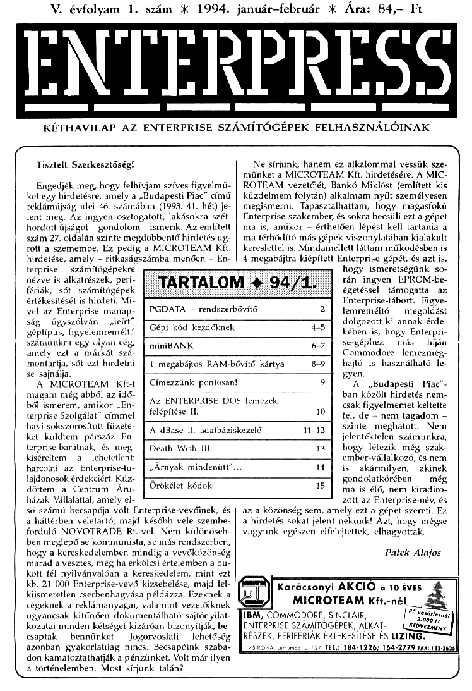

# Enterpress 1994/1 (1994.01-02)

[Оригінальний PDF](http://enterprise.iko.hu/magazines/Enterpress_1994-1.pdf) (угорською)

## Зміст

[Gépi kódú programozás kezdőknek I. rész](https://ep128.hu/Ep_Konyv/Enterpress_Gepikod.htm#b1)  
[1 Mb-os RAM bővítő kártya - Gép-Eszet](https://ep128.hu/Ep_Hardware/Ep_1MB_memoria.htm)  
[Címezzünk pontosan!](https://ep128.hu/Ep_Konyv/Enterpress_Cikkek.htm#5b)  
[Az Enterprise DOS lemezek felépítése II.](https://ep128.hu/Ep_Konyv/Enterpress_Cikkek.htm#3a)  
[A dBASE II adatbáziskezelő rendszer ismertetése](https://ep128.hu/Ep_Konyv/Enterpress_Cikkek.htm#dbase)  

----

[Чернетка вмісту](1994-01-02/epress-1994-01-02.txt)
