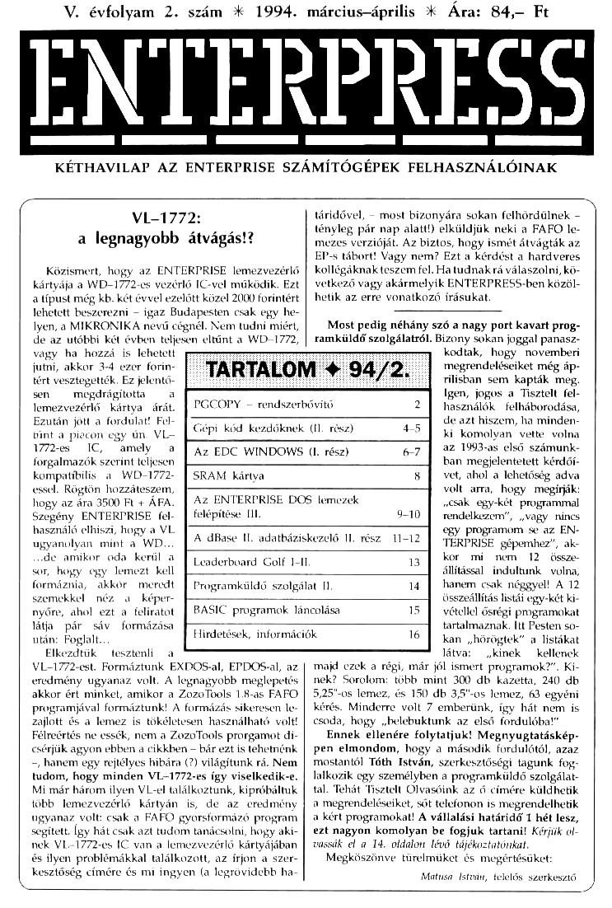

# Enterpress 1994/2 (1994.03-04)

[Оригінальний PDF](http://enterprise.iko.hu/magazines/Enterpress_1994-2.pdf) (угорською)

## Зміст

## Чернетка вмісту

"page-000.jpg" ------------------------------------------------------------ 
V. évfolyam 2. szám k 1994. március-április k Ára: 84— Ft

ENILREKESS

KÉTHAVILAP AZ ENTERPRISE SZÁMÍTÓGÉPEK FELHASZNÁLÓINAK

VL-1772:
a legnagyobb átvágás!?

Közismert, hogy az ENTERPRISE lemezvezérlő
kártyája a WD-1772-es vezérlő IC-vel működik. Ezt
a típust még kb. két évvel ezelőtt közel 2000 forintért
lehetett beszerezni — igaz Budapesten csak egy he-
lyen, a MIKRONIKA nevű cégnél. Nem tudni miért,
de az utóbbi két évben teljesen eltűnt a WD-1772,

táridővel, — most bizonyára sokan felhőrdülnek —
tényleg pár nap alatt!) elküldjük neki a FAFO le-
mezes verzióját. Az biztos, hogy ismét átvágták az
EP-s tábort! Vagy nem? Ezt a kérdést a hardveres
kollégáknak teszem fel. Ha tudnak rá válaszolni, kö-
vetkező vagy akármelyik ENTERPRESS-ben közöl-
hetik az erre vonatkozó írásukat.

Most pedig néhány szó a nagy port kavart prog-
ramküldő szolgálatról, Bizony sokan joggal panasz-

vagy ha hozzá is lehetett
jutni, akkor 3-4 ezer forin-
tért vesztegették, Ez jelentő-

kodtak, hogy novemberi
megrendeléseiket még áp-
rilisban sem kapták meg,

sen megdrágította a
lemezvezérlő kártya árát.
Ezután jött a fordulat! Fel-
tűnt a piacon egy ún, VL-

PGCOPY

rendszerbővítő g

Gépi kód kezdőknek (II. rész)

Igen, jogos a Tisztelt fel-
használók . felháborodása,
de azt hiszem, ha minden-
ki komolyan vette. volna

1772-es IC, amely a

Az EDC WINDOWS (I. rész)

az 1993-as első számunk-
ban megjelentetett kérdi

forgalmazók szerint teljesen
kompatíbilis a. WD-1772-
essel. Rögtön hozzáteszem,
hogy az ára 3500 Ft 4 ÁFA.
Szegény ENTERPRISE fel-
használó elhiszi, hogy a VI

SRAM kártya

felépítése [IL

Az ENTERPRISE DOS lemezek

8 [7 vet, ahol a lehetőség advi
volt arra, hogy megírják:
csak egy-két programmal
rendelkezem, , vagy. nincs
egy programom se az EN-

ugyanolyan mint a WD... [A dBase II. adatbáziskezelő II. rész TÉRPRISE gépemhez", ak-
de amikor oda kerül a 3 kor mi nem 12 össze-
Leaderboard Golf I-IT 13
sor, hogy egy lemezt kell zelszzészétássá ztás állítással. indultunk . volna,
formázni, ekkör meredt TF onigamkaáó szlgiktű 14] hanem csak néggyel! A 12
szemekkel néz a képer- f— összeállítás listái egy-két ki
nyőre, ahol ezt a feliratot ] BASIC programok láncolása vétellel ősrégi programokat
látja pár sáv. formázás e ig] frtalmaznak. Itt Pesten s0-

után: Foglalt.

kan ,hörögtek" a listákat

Elkezdtük — tesztenli a
VL-1772-est. Formáztunk EXDOS-al, EPDOS-al, az
eredmény ugyanaz volt. A legnagyobb meglepetés
akkor ért minket, amikor a ZozoTols 18-as FAFO
programjával formáztunk! A formázás sikeresen le:
zajlott és a lemez is tökéletesen használható volt!
Félreértés ne essék, nem a ZozoTools prorgamot di-
csérjük agyon ebben a cikkben - bár ezt is tehetnénk
-, hanem egy rejtélyes hibára (?) világítunk rá. Nem
tudom, hogy minden VL-1772-es így viselkedik-e.
Mi már három ilyen VL-el találkoztunk, kipróbáltuk
több. lemezvezérlő kártyán is, de az eredmény
ugyanaz volt: csak a FAFO gyorsformázó program
segített. Így hát csak azt tudom tanácsolni, hogy aki-
nek VI.-1772-es IC van a lemezvezérlő kártyájában
és ilyen problémákkal találkozott, az írjon a szer-
kesztőség címére és mi ingyen (a legrövidebb ha.

látva: kinek — kellen.
majd ezek a régi, már jól ismert programok?" . Ki-
nek? Sorolom: több mint 300 db kazetta, 240 db
-os lemez, és 150 db 357-os lemez, 63 egyéni
rés. Minderre volt 7 emberünk, így hát nem is
csoda, hogy ,belebuktunk az első fordulóba!" jj
Ennek ellenére folytatjuk! Megnyugtatáskép-
Pen elmondom, hogy a második fordulától, azaz
mostantól Tóth István, szerkesztőségi tagunk fog-
lalkozik egy személyben a programküldő szolgálat-
tal. Tehát Tisztelt Olvasóink az ő címére küldhetik
a megrendeléseiket, sőt telefonon is megrendelhetik
a kért programokat! A vállalási határidő 1 hét lesz,
ezt nagyon komolyan be fogjuk tartani! Kérjük ol
vassák el a 14. oldalon lévő tájékoztatónkat.
Megköszönve tűrelműket és megértésüket

Matusa István, felelős szerkesztő
"page-001.jpg" ------------------------------------------------------------ 
1994. márci

pri

PGCOPY - már van jobb!

Még emlékszem, mikor kb. 1-2 éve a budapesti EN-
TERPRISE klubban szinte mindenki a PGCOPY prog-
rammal . másolt,  Sorozatunkat a PGCOPY  má-
solóprogram ismertetésével folytatjuk.

A PGCOPY-t betölthetjük lemezről, de EPROM-ba
égethető formában is létezik, Miután behívtuk a prog-
ramot lefoglal egy hatalmas RAMDISK-et (a megkér-
dezésünk nélkül). A státusz sorban az aktuális
meghajtó betűjelét, utána pedig a kijelölt fájlok számát
láthatjuk. Itt látható a RAMDISK mérete és a PCCOT
2.6 felirat. A státuszsor alatt egy ablakban a felhasz.
nálót segítő parancsbillentyűk jelentése található. Sor-
rendben: ERASE — fájl kijelölés-törlés (az összes fájlt
kijelöli illetve a kijelölést megszünteti) Egyébként
egyenként a SPACE vagy ENTER billentyű lenyomá-
sával jelölhetünk ki fájlokat. Következő funkció a ZIP.
(Valószínű tömörítést hajt végre). Nekünk nem sikerült
rájönnünk a használatára. Mint később kiderült, ha:
nálatához a VENUS rendszerbővítőre is szükség van...
Kiadhatunk EXOS parancsokat a kettőspont lenyomása
után. REN (R betű) — fájl átnevezése. Szöveges fájlokat
kétféle formában is megnézhetünk a T illetve a 2-es
billentyűk. lenyomása után. Az F8-as billentyűvel a
RAMDISK-et  törölhetjük, (A státusz sorban semmi
nem változik, miután töröltük a RAMDISK-et!) DEL —
a D billentyű lenyomása a fájl vagy a kijelölt fájlok tör-
tt eredményezi. ATTR - (A billentyű), a fájl attri-
bútumát állíthatjuk (Hidden, Read Only) A
SHIFT:-ESC kombinációval léphetünk ki a programból.
H-val kérhetünk HELP-et (ha lenne!). A perjellel T-ki
vagy T-be között válthatunk (mi lehet ez?)

A munkaablak alatt látható: FI - DIR (directoryt kér-
hetünk), C - Copy (másolás, ez történhet magnóra is),
F3 - CD (belépés egy könyvtárba), ESC — ki: minden
elindított parancsból az ESC-el léphetünk ki. Lehet ál-
lítani a billentyűismétlést is 1-9-ig, A jübb alsó sarok-
ban a lemezen lévő fájlok számát, a kijelölt fájlok bájt
számát illetve a lemezen még szabodon levő üres hely
méretét láthatjuk.

Összességében: a PGCOPY tudásban elmarad a
PG-család többi tagjától! Sok hiányosság található a
programban és nem igazán felhasználóbarát — gon
dolok itt a parancs billentyűk programozására. Mi-
után kilépünk a PGCOPY-ból a RAMDISK-et nem
törli és ez zavaró. (Talán mindjárt az elején ha nem
nyitna olyan baromi nagy RAMDISK-et, az elvisel-
hetőbb lenne).

Ha valaki szeretné megrendelni a PGCOPY-t, a kö-
vetkező címen teheti:

Haluska László, 1086 Budapest,
Karácsony Sándor u. 18. 3/41.

Ára: 200 Ft 4 az adathordozó, vagy EPROM ára.
Matusa István

Új EPROM-ba égethető programok

EPCKMB.ROM —

A következő programokat tartalmazza:

EPROM version 1.1
EPROMt-égető program

Felhasználás: A Mészáros Gyula féle égető hardver ke-
zelése. Fájlok odítálása, vágása, egyesítése stb.
Jellemzők: 64K puffer, 2716-27512 epromok fogadása,
5-7 féle égető algoritmus. Lemezes rendszereknél kur-
zorral történő fájl kiválasztás. Parancsbevitelhez minimá-
lis billentyű használat,

PCK version 1.0
Csatorna tömörítő

Felhasználás: Fájlok tömörítésére, A kezelést legegysze-
rűbben BASIC programmal lehet megoldani, A kicsoma-
golás nem automatikus,

UPCK version 1.0
Csatorna kicsomagoló

Felhasználás: A PACK-kal csomagolt fájlok helyreállítá-
sára.

FPACK version 1.0
Egy blokkos fájltömrítő

A FENAS MERGE parancsával egy programhoz memó-
riaterületeket csatolhatunk tömörített alakban.

(A HELP-ben megtalálható a kicsomagolás algoritmusa),
Felhasználás: ASSEMBLY programozásnál igen hasznos.
Lemezes rendszernél auto-listázással történik a fájlvá-
lasztás. Az elkészült tömörített fájl ".PDT nevet kap.

PCK version 1.1
RAMbővítéses-lemezes rendszerhez
BATCH/H Játékprogram csomagoló
PCK INPTájl OUTÖSvény

Játékprg — Betöltőg Hidden fájlok
Az elkészített fájl önindulós

A Szív tv műsora az ország számos helyi
és körzeti kábelhálózatán látható,
több mint egymillió lakásban.

szórakoztatás, filmek, információ
ríportok, tréningek

A Szív tv postacíme: 1656 Budapest, Pf. 6.
Telefon: 256-6136 (fax is), 257-1270

AS

"page-002.jpg" ------------------------------------------------------------ 
1994. március-áprili

TAN örökéletes indítás
A-E - Hova történjen a kicsomagolás
Felhasználás: A több fájlból álló programokat egyetlen,
önindulós, tömörített programra csomagolja. A futtatás
ramdiszkből történik. A tömörítés hatékonysága játékoknál
kb. 40-80 százalék.

PP version 1.0

EPDOS 1.7-szelekt a PCK-hoz

Felhasználás; Lemezes rendszer, EPDOS 1.7 és RAM-
BŐVÍTÉS esetén a PCK parancs kényelmes kiadására.

DPP version 1.0

EPDOS 1.7-szelekt a ".PCK fájlok kicsomagolásához
Felhasználás: EPDOS 1.7 esetén a ".PCK fájlok kényel-
mes kicsomagolására,

FILE version 1.0

PUFFER: a 0. lapon lévő 256 bájt

ÖSVÉNY: megh:űtvonalnévszűrő

OPCIÓ: H - hidden S - system

A 208-209-es csatornákat használja

A-E - meghajtó tzkönyvtár választás

A FILE-nevet a pufferbe teszi

Felhasználás: Lemezes rendszer esetén bármely prog-
ram (így BASIC is) alkalmazhatja autolistázásos fájlnév
kiválasztásra.

KEYCH version 1.0
KEYBOARD csatorna kereső

Visszatérésnél D - csatornaszám

Felhasználás. Gépi kódú bővitők alkalmazhatják a fi
használó őáltal már megnyitott KEYBOARD csatorna szi
mának lekérésére.

MB version 1.1
MiniBANK adatbázis kezelő

Folhasználás: A miniBANK EPROM-os változata. Leme.
zes rendszernél autolistázásos fájl-kiválasztás.

PBOX.ROM - 32 K.
A PAINTBOX egérrel is kezelhető EPROM-os változata.

MONITOR.ROM - 64 K. Szerzői díj: 200 Ft.
Tartalma:

GEN version 1.1

MON version 1.1

MONS version 1.0

DTEST version 2.3

FENAS version 1.2

PASZIANS.ROM — 64 K. Szerzői díj: 200 Ft.
Tartalma:

PA (PASZIANS)

KA (KASZINO)

64K-s EPROM megrendelés esetén (korlátozott
mennyiségben) doboz 4 64 K nyák is rendelhető.

Megrendelhető az alábbi címen

HALUSKA LÁSZLÓ, 1086 Budapest,

Karácsony Sándor u. 18. 9/41

6 1994. HSOFT

HIP kódok

VBDHP2IXMI 3 ECBO 4 YMCI 5 TOKB
6 WNLPTFXOO 8 NHAG 9 KCRE 10 VUWS
MCNPE 12 13 OCKS 14 BTDY 15 COZO
165KKK IT 18 HMIL 19 MRHR. 20 KGFP
21 UGRW 22 23 HUVE 24 UNIZ 25 POGV
26 YVYI 28 VIDD 29 GGOL 30 BOZP
31 RYMS 33 BOSN 34 NOFI 35 VDTM
36 NXIS 38 BIFA 39 ICXY 40 YWEH
41 GKWD 43 UJDP 44 TXHL. 45 OVPZ
46 HDOJ 47 LXPP 48 JYSF 49 PPXI 50 OBDH
SVIGGI 52 PPHT 53 CGNX 54 ZMGC 55 SJES

56FCJE 57 UBXU 58 YBLT 59 BLDM 60 ZYVI
61 RMOW 62 TIGW 63 GOHX 64 UPO 65 UPUN

66ZIKZ 67 GGIA 68 RTDI 69 NLLY 70 GCCG
TULAIM 72 EKET 73 OCCK 74 MKNH 75 MIDV
76 NMRH TT FHIC 78 GRMO 79 JINU 80 EVUG
BLSCWF 82 ELLIO 83 OVJP 84 UVEO 85 LEBX

86 FLHHO 87 YJYS 88 WZYV gl

ÚJDONSÁGOK s INFORMÁCIÓK

Javában készül az EPDOS 2.0-ás verziója, Ha
HSOFT befejezi a programot, természetesen rész-
letesen közöljük lapunkban az EPDOS 2.0-át.
Annyit elárulhatunk, hogy az ENTERPRISE történel-
mében ez a szoftver hatalmas fordulópont lesz!

4..

EXDOS kártyák turbósítását, SPECTRUM emuláto-
Tok átalakítását vállaljuk. Jelentkezni lehet a szer-
kesztőség címén. Részletesebb információk előző
lapszámainkban találhatók.

Felajánljuk megvételre —
a következő
MACINTOSH konfigurációt:

APPLE. MACINTOSH LC számítógép,
4 MB ORAM, 40 MB Winchester,
APPLE. 177 RGB monitor,
Personal Laser Writer NT (APPLE) nyomtató,
MICROTEK SCANMAKER (00 ZS
színes. szkenner

] — Érdeklődni;

/MH Kereskedelmi Kft.
HANK) Kecskemét,
Deák Ferenc tér 3.
Fejes Ferenc

A Telefon: 76/482-232 e Telefax:

76/328-214

"page-003.jpg" ------------------------------------------------------------ 
1994. március-április

( Gépi kódú programozás kezdőknek — II. rész )

Sorozatunk második részében — mint ahogy előző
számunkban igértűk - először megtanuljuk, hogyan le-
het a hosszbájtot egyszerűbben meghatározni. Az előző
számban lévő példaprogramban így határoztuk meg a
hosszbájtot:

LD AA
LD BDXHOSSZ)
LD DE,ESCI
EXOS 8

HOSSZ
ESCI

DW 15
DB 27/o"
".255.0,255,180.0.0./0.0

A hosszbájtot egyszerűbben meghatározhatjuk a kö-
vetkezőkéj

LD AJ
LD BC HOSSZ
LD DE,ESCI
EXOS 8

ESCI

HOSSZ EOU §-ESCI

Mint láthatjuk a HOSSZ címkenévnél történt a vál-
tozás. Az EOU $-ESCI utasítás megnézi, hogy az ESCI
címke hány karakterből áll és automatikusan megha-
tározza a hosszbájtot, megkönnyítve munkánkat. Azért
tanultuk meg az előző variációt is, hogy könnyebben
megértsük a hosszbájt meghatározását. (Vö: Ha vala-
kinek az IBM DOS parancsait akarjuk megtanítani, ne
a NORTON Commander-t tanítsuk meg neki először,
mert soha nem tanulja meg a lemezkezelést!)

Most pedig folytassuk. Előző programunkban a ki-
írás után egy HALT-ciklussal várakoztattuk a progra-
mot, azért, hogy lássuk: mit írunk ki a képernyőre;
Most egy praktikusabb módszert alkalmazunk, Meg-
tanuljuk a billentyűzet figyelését, azaz a képernyőn va-
16 megjelenítés után a program egy billentyű leütésére
vár. Hogy ne legyen unalmas sorozatunk, most nem
írni fogunk a képernyőre hanem rajzolni, mondjuk egy
kört. Utána várakoztatjuk a programot addig, míg egy
billentyűt nem ütünk le, Először szokás szerint lássuk
BASIC nyelven a programot:

100 SET VIDEO MODE 1

110 SET VIDEO COLOR 0

120 SET VIDEO X 30

130 SET VIDEO Y 20

140 OPEN Wivideo:"

150 SET tI:PALETTE 203.0,020-

0000

160 DISPLAY WTAT 1 FROM 1 TO 20
170 PLOT 41:600.300,

180 PLOT HT:ELLIPSE 120120

190 DO

200 LOOP UNTIL INKEY$c2""

Ugyanezt a programot láthatjuk listánkon gépi kód-
ban. Lépjünk be az ASMON programba és az E bil-
lentyűvel lépjünk be az EDITOR-ba. A lista begépelése
után az F8-as billentyűvel lépjünk ki. A Z billentyű le-
űtése után végezzük el a szokásos beállításokat;

Assembly Listing ON

Memory assembly NO
Object file name: TAN2.COM
EXOS module header YES
EXOS module type: 5

állítása után nyomjuk meg az A betűt.

dik gépi kódú programunk, amit termé-
ahogy múltkor is leírtuk - bárhonnan be:

szetesen
tölthetünk.

Az új utasítások magyarázata:

LD DEBILL
LD AZ
EXOS 1
LD AZ
EXOS 5

Először a BILL cimkenévre hivatkozunk (BILL. DB
97 KEYBOARD") A KEYBOARD 9 karakterből áll, tehát
a DB után hosszbájtnak 9-et kell írnunk. Ezután meg-
nyitjuk billentyűzetcsatornának a 3-as csatornát (LD
A3 és EXOS 1), majd az EXOS 5 funkcióhívás követ-
kezik, amely a billentyűzetcsatornáról (3-as csatorna)
egy karakter leütésére vár. Az EXOS 5 funkcióhívás je-
lentése: karakterolvasás.

DB 27/A"
Grafikus sugár pozicionálás,
DW 600300

ltt lesz a kör középpontja.

DB 27/7E"
Kör rajzolása, majd megadjuk a kör méretét a

DW 120120
utasítással,

Természetesen programunkban már a hosszbájtot a
cikk elején ismertetett módon használjuk. (HOSSZ
EOU $-ESC1).
(Folytatjuk)
Matusa István
"page-004.jpg" ------------------------------------------------------------ 
1994. március-április

ORG 100H ; Fordítási cím
SET MACRO GYALTOZOMERTEK
LD BA ; Írás

LD CAVALTOZO
LD D.AZERTEK

EXOS 16 ; EXOS változó olvasása, írása vagy átbillentése
ENDM ; Makró vége (END Macro)
LD SP3FFFH ; STACK isa (veremmutató)
SET 221 ; 1-es videómód
SET 230 ; 2 színű üzemmód
SET 2430 ; 30 oszlop széles
-SET 2520 420 sor magas
; Csatorna megnyitása
LD A ; A-ba a csatomaszám
LD DEVID ; DE a név előtti hosszbájtra mutat
EXOS 2 ; Csatorna megnyitása írásra
; Videolap. megjelenítése
LD B Alfunkció kódja 1-videolap kijelzése

A-ba a csatornaszám
Az első kijelzendő sor az 1-es

20 sort kell megjeleníteni

Az első sorban kezdődik a megjelenítés

A-ba a csatornaszám

LD BCHOSS ; BC-be a blokk hossza (A HOSSZ címen lévő érték)
LD DEESCI ; DE-be a blokk kezdőcíme
EXOS 8 ; Blokk kiírása
; Várakozás billentyű leütésre
LD DEBILL ; DE a név előtti hosszbájtra mutat
LD AZ ; A-ba a csatornaszám
EXOS1 ; Csatorna megnyitása
LD AZ ; A-ba a csatornaszám
EXOS 5 ; Karakterolvasás

JP VISSZATERES
VISSZATERES LD A,

Ugrik a befejezésre
A-ba a csatornaszám

EXOS 3 ; Csatorna lezárása

LD DEBASIC  ; Visszatér a BASIC-be

EXOS 26 ; Bővítések vizsgálata
VID VIDEO" — ; A megnyitáshoz szükséges név
BILL EYBOARD!" — ; A megnyitáshoz szükséges név
BASIC BASIC! ; BASICcimke
ESCI 203/0.,0.203.0.00.0 Paletta színeinek beál

DB 27, ; Rajzolósugár pozicionálása

DW 600,300 ; A kör középpontja

DB 27/E ; Kör rajzol

DW 120120 ; A kör méretének megadása
HOSSZ EOU §-ESCI ; Hosszbájt meghatározása

END ; Program vége

Fizessen elő a

(— KÁDIÓTEENIKA e BALL onika

! folyóiratokral Így biztosan hozzájuti ]
Címünk: 1374 Budapest, Pf. 603.
A szerkesztőségben regisztrált HE előfizetőknek díjmentes nyák-film melléklet.

"page-005.jpg" ------------------------------------------------------------ 
1994. március-április

( Az EDC WINDOWS

BEVEZETŐ

Az ENTERPRISE felhasználók egyik régi vágya egy olyan gra-
fikus felhasználói felület, amelynek használatával kényelmesen,
esztétikus környezetben képesek dolgozni, ahogy az sok más ti-
Pusú számítógépen látható.

Próbálkozás több is volt, közöttük nem egy profi munka is
akad, de ezek mind leragadtak egyedi programok kiszolgálásá-
mál. A végső meguldást egy szoftver teremtette meg, ami bár-
milyen alkalmazás számára képes ilyen felületet biztosítani,
Idegen szóval menedzselni", Ez az EDC Windows.

Az EDCW teljes egészében grafikus környezetben fut. A fel:
használó a rendszert egy a képernyőn szabadon mozgatható nyi.
lacska. (továbbiakban: pointer) használatával irányíthatja, A
képernyőn megjelenő ablakokban láthatóak végrehajtható műve-
letek, az eredmények — azaz a felhasználó csak a legritkább ese-
tekben kényszerül a billentyűzethez nyúlni — az sélető a
képernyőn folyamatosan zajlik.

A felhasználók alapvetően lusták. Nem akarnak zavaros pa-
rancsokat, bonyolult paraméterezést megtanulni — az ő számukra
az EDCW kiváló lehet.

Az EDC Windows terjedését csak egyvalami gátolja: Mind.
ezidáig kevés alkalmazás készült hozzá. Jelen cikksorozatnak is
az a célja, hogy minél több felhasználót ismertessen meg az ,új
módival" s mások is megprópálkozzanak egy-egy EDCW alkal
mazás fejlesztésével ebben a kényelmes, komfortos környezetben.

Nos, vágjunk belet

Az EDCW 4.7 rendszerlemeze a következő programokat tar-
talmazza:

EDCWEXT - Az EDC Windows rendszerbővítő modulja
- WTOOLEXT - Segédprogram, az új KEYBOARD: eszközt
és néhány parancsot tartalmaz.

EDCW ALATT FUTÓ ALKALMAZÁSOK

— WBASEWIN — Adatbáziskezelő
- TAPEMAST.WIN - Abszurd magnó-lemez másoló
SECRET.WIN — Kalandjáték, Garantált izgalmak.
—- TESTWIN - Lemezmeghajtó-sebességteszt
— DIGITRAX.WIN - MOD - DTM zenemodul fordító
- ZXSCR.WIN - ZX Specturm tipusú képernyők fektolgazását
megkönnyítő program.

EGYEBEK

— Az összes forrásszöveg
- ROM változatok

— HELP file-ok.

— Ajándék játékprogram: SHOOTING RANGE

KONFIGURÁCIÓ

Az EDCW kényelmes használatához szükséges lemezmeghaj.
tó(E nélkül is működik, de több funkció nem érhető el és néhány
Program működése bizonytalan) valamint ajánlott a memória-
bővítés is, mert a grafikus felület bizony , falja" a memárát. Ez
persze nem jelenti azt, hagy ne lehetne igazán jól atkalmazni egy

alapkiépítésű gépen (s.

AZ EDCW INICIALIZÁLÁSA

Miután az EDCW rendszerbővítő modulja. betöltódött, a
HELP parancs kiadásával győződhetünk meg róla, hogy valóban
a memóriában van-e a rezidens kód, A rendszer elindításához
az :EDCW parancs begépelése szükséges, amely után több pa-
ramétert ís megadhatunk;

/M— A bejelentkező képernyő elhagyása
/E — Indítás után azonnal a Setup menü jelenik meg
7X - Az Extensions menü jelenik meg

7F— A File manager jelenik meg

7Y.— A System menü jelenik meg.

78 — Memória SETUP figyelmen kívül hagyása

A megadott paraméterektől függően bejelentkezik az EDCW,
és néhány információt jelenít. meg, a rendszerről

Az EXOS és az EXDOS verzlőszámát

- A RAM nagyságát (saját teszt alapján)

— Ha van, a memória SETUP dátumát

— Felismeri az hardverórát (le is olvassa) és az egérkártyát,
de ez utóbbit még nem kezeli (Reméljük hamarosan ezt is kezelni
fogjat — a szerk)

— Ha valamelyik porton ismeretlen eszközt talál, a port(ak)
számát.

A képernyő legfelső sorában fogla) helyet az EDCW státusz
sora, ahol állandóan látható a szabad memória nagysága (Kbyte-
ban és a teljes RAM százalékában í5) valamint a billentyűzet ál-
lapotjelzelői is.

A jobb alsó sarokban a rendszeróra kapott helyet, tőle balra
jelennek meg a hibaüzenetek. A pointert bármelyik botkormány-
nyal és az O, PC. A billentyűkkel irányíthatjuk. Az aktuális
opció mindig inverzben jelenik meg. Ha ki akarjuk választani
(aktivizálni) a SPACE, ENTER billentyűkön kívül használhatjuk
a tűz gombot is

A BILLENTYŰZET FUNKCIÓI
Az EDCW-nek saját, közvetlen billentyűzet kezelő alprogram.
ja van, mely rendelkezik néhány plusz funkcióval is:

FI - 0, T.O, A, SPACE irányítás kikapcsolására szolgál. Ha
kikapcsolt állapot van, a státusz sorban megjelenik a , Kevbvand
Jocked" felirat.

F2-F5 — Az aktuális menüt lehet velük új pozícióba mozgatni;
Amig az EDCW-ből ki nem lépünk, a menük az új helyükön
fognak megjelenni, (Ila a SETÚP-ot lementjük, később Ís)

Fő — Angol/ Német billentyűzet között kapcsol át, azonban
ezt kijelzés nem támogatja, így csak egy billentyű lenyomásával
állapítható meg az aktuális mód.

CAPSLOCK. - SHIFT üzemmód. A LOCK lenyomásával
megszüntethető.
ESC — Visszalépés. (Pl. az előző menübe)

Ha az opció szövegében aláhúzott karakter szerepel, akkor
az apció azzal a billentyűvel is elérhető.

Miután így tisztáztuk az alapokat, következzék egy részletes
leírás az EDCW beépített programjairól.

A SETUP
Amikor az :EDCW Parancs begépelésével elindítjuk az
EDCW-t, az aktuális meghajtó gyökérkönyvtárában me;

"page-006.jpg" ------------------------------------------------------------ 
1994. március-április

NTERPR 7

SETUP file-t, az EDCW.STP-t és megpróbálja betölteni. Ebben a
file-ban vannak azoknak a paramétereknek az értékei, amelyek
az EDCW megjelenését, külsejét szabályozzák (színek, menük
Poziciól, változók stb.). Ha ez a file htányzik, alapértelmezésű
jellemzőkkel fog futni a program.

A legtöbb változó a SETUP menüben állítható be:

Cursor sensivíty HIGH/MED/LOW - A pointer érzékenysége

Inverse screen — Invertálja a képernyőt, azaz megcseréli a pa-
Pír és tintaszíneket

Inverse menus — A menük inverzek lesznek a képerny
képest

Move screen — Kép mozgatása jobbrabalra

höz

Dec/lnc ink number - A tintaszín növelése; csökkentése
Bold font — Megvastagítja a karaktereket

Recall old font — Visszamásolja az EXOS karakterkészletőt
Actual, menu iny.

Az aktuális menü inverz lesz a többihez

Clear screen — Minden új menü kirakásánál képernyőtörlés ki/be

Save SETUP — Kimenti az új EDCW.STP-t, így az EDCW leg-
közelebbi elindításakor is ugyanazokkal a paraméterekkel jelent-
kezik be.

Make MEMORY SETUP - Nem lemezen, hanem a memóri-
ában hozza létre a EDCWSSTP-t, így gyorsabb a betöltés. A Setup
EPROM-ba is égethető.

Ha van MEMORY SETUP, az EDCW meg sem kísérli lemezről
betölteni, hacsak meg nem adjuk a ,/S" paramétert,

A FILE MANAGER

Ez a legösszetettebb beépített alkalmazás. Elindításakor egy

nagy ablak jelenik meg, ahol egyszerre 20 file-t Játhatunk, a mó-

Tetükkel és attribútumaikkal. Egy műveletet úgy hajthatunk vég-

re, hogy először a parancsra .kattintunk", majd pedig arra a

file-ra, amire vonatkozik. Az ablak alsó három sorában foglalnak
helyet a parancsok

Up/Down — göngetés felte

CHDIR - Könyvtárváltás

Disklnfo — Megjeleníti a lemez méretét, a szabad hely nagy-
ságát, a formázó program nevét és a lemez azonosítóját

Dir — Újra beolvassa a lemezt

Delete — File törlése

Vol — Lemez átnevezése

Drive - Egy almenüből kiválaszthatjuk a meghajtót

Copy - Másolás. Először be kell írni a cél útvonalat, majd
a másolandó file-okra kattintani. (Ha ENTER-t nyomunk, az utol-
56 útvonalat használja)

Move — File mozgatás. Keze

MakeDir - Könyvtár létrehozása

Rename — Átnevezés. Először az átnevezendő file-t kelt kl-
választani, majd beírni az új nevet

Select — Alapállapotban nincs fukciója, Ha valamelyik EDCW
bővítés file betöltését igényli, ezzel választható ki a betöltendő
file.

Cmnd — Parancsértelmező, A képernyő
deolap, ahol az üzenetek megjelenhetnek.

Micro - Macm Editor. Öt előre definiált parancs közül vá
laszthatunk, az EDIT opcióval átírhatjuk valamelyiket

(Használata nagyon. hosszú parancsszerkezeteknél

RamDisk — Ramdiszk menü

mint a COPY

ján. nyílik egy vi-

előnyös)

RamDisk size: xxx — Ramdiszk mérete

Open RamDisk — Ramdiszk megnyitása

Delete RamDisk — Ramdiszk törlése

Options — Almenü, a következő opciókkal;

Verity — Ellenőrzés ki/be

Hidden files — Rejtett file-ok listázása ki/be

Dir Mask — A megjelenő file-ok maszkja (PL s.)

Load — File betöltése. A File Manager a következő file típu-
Sokat kezeli:

EXOS fejlécűiek (5, 6, 7 stb.)

EDCW rendszerbővítő modulok

DTF file-ok (A ZOZOTOOLS DL-re hivatkozik)

BAT, INI flle-ok (EXDOS parancsértelmezőt használja)

TXT, DOC, HLF, .ASM, .PAS, BAK, .TPU, .ASC tokenizá-
latlan szövegfile-ok tartalmát megjeleníti,

AZ EXTENSION MANAGER
Hasonlóan a File managerhez, egy nagy ablak jelenik meg
max. tíz a memóriában lévő EDCW bővítő nevével. A következő
Parancsokat használhatjuk:

Scroll up/down — Görgetés fel/le
Extension info — Rövid Információ egy bővítőről
Delete extension — Bővítő törlése

Activate - Bővítő aktivizálása

Az EDCW rendszerbővítői WIN kíterjesztésűek, 64-es modul-
fejléccel, Ha egy ilyen alkalmazást betöltöttünk, az mindaddig
a memóriában marad, amíg hidegindítást nem hajtunk végre,
vagy ki nem töröljük (az Extensions menű , Delete extension"
opciójával, esetleg ha van, a ZOZOSOFT féle EXOS 2.3-mal),

A rendszerbővítőket a File Manager , Load" opciójával kell be.
tölteni (használhatjuk az EXDOS ,LOAD" parancsát vagy az EP-
DOS-t is, persze csak akkor, ha az EDCW már a memóriában
van — ilyenkor azonban gyakran megeshet, hogy lefagy a gép).

Ezekről az alkalmazásokról lesz még szó bőven, mivel itt kap:
csolódhatunk be az EDCW , vérkeringésébe",

EGYÉB ALPROGRAMOK
System meni:
Restart — Újraindítja az EDCW-t
Cold reset - Hideg reset
Return - Öskorbál maradt opció, az EDCW 4.7-ben Jeginkább
etágyást eredményez. (Eredetileg az EDCW-t t00h-n hívó prog
ramba tért vissza)

View státus — Hasonló az AsMon ugyanilyen apciójához

Néhány hasznos tanácsi

Ha kevésnek bizonyulna a szabad memória, a rendszerlemez
SOURCES könyvtárában található EDCWLEXT modult töltsük be,
mert az nem tartalmazza WTOOL-t, így 16K felszabadul.

Ha gépelésnél problémák akadnak, kapcsoljuk ki az Fl-gyel
a billentyűzet irányítást, mert az gyakran. , bekavar"
A SECRETI WIN és a SECRET2. VIN file-oknak egyszerre kell
a memóriában lenniük, csak így indítható el ez a fergeteges ka-
landjáték
Folytatjuk)
6 1994. EDC

Legjobb szoftver stúdió:

Legjobb játék program:
Legjobb felhasználói program:
Legjobb demo program:
Legjobb programozó:

Legjobb programátíró:

A szerkesztők listája
SWAP
ZOZOTOOLS 18
SMALL DEMO
HSOFT

ZOZOSOFT

HSOFT
"page-007.jpg" ------------------------------------------------------------ 
1994. március-április

KŐKOBAK

Ennek a címnek kevesebb az értelme, mint a legutábbinak,
de mégsem rugaszkodtam el teljesen a rögvalóságtól: ahogy
ígértem, az EPROM/SRAM-bővitő kártyáról fogok írni. Az EP-
ROM pedig arról ismert széles e világon, hogy marha nehezen
tanul (külön EPROM-égető készülék kell a beprogramozásához) ,
Igaz, amit egyszer megtanult, azt elég nehéz kivarni a fejéből
Sokáig kell snapoztatni" (azaz ultraibolya fénnyel bevilágítani az
ablakán), amíg megtő az agya, mindent elfelejt, írhatnám: buta
lesz, mint a tök, és akkor lehet kezdeni a tanítását előlről. De
nem ezért szeretjük, hanem mert a számítógép kikapcsolása után
is megmarad benne a nagy fáradsággal beleírt program, így az
a gép következő bekapcsolásakor újra kéznél van. Ilyen Csak
Olvasható Memóriába (angalul: Fiad Only Memory, azaz ROM)
célszerű elhelyezni a gép operációs rendszerét, hiszen annak
bekapcsoláskor azonnal üzembe kell lépnie: a legeslegelső uta-
Sítást valahonnan olvasnia kell a processzornak, De más prog-
ramok is elhelyezhetők AOM-ban, különösen a jó öreg
ENTERPRISE kínál könnyű lehetőséget kedvenc sakkprogra-
munk, lamezkezelőnk, szövegszerkesztőnk és egyéb gépnyúzó
programjaink állandó készenlétben tartására és villámgyors elő-
rártására, mindenféle lemezről, vagy pláne kazettáról (fúj!) tör-
ténő betöltögetés nélkül;

Hogy lesz a ROM-ból EPROM? Az E az, hogy Erasable, azaz
Törölhető, a P az, hogy Programmable, azaz Programozható. tehát
többször is fölhasználható, bár kissá macerás módon (lásd fent).
Hogy megszabaduljunk az ősi magyar nyelvet elöntő angolszász
mételytől, hívhatjuk a tárgyalt áramkört TPCSOM-nak is, de nem
árt, ha ezt először otthon, tükör előtt, majd szűk családi körben
gyakoroljuk, csak ezután lépünk Ki vele a nyilvánosság elé.

A kártya nevében szerepel még a SRAM betűszó Is, amelyet
két részletben fogok magyarázni, A RAM elnevezés bizonyára
ismert, a számítógépek szabadon irható-olvasható memóriáját ja-
löl, Az ENTERPRISE-ban ebből 128 KBÁájt található, mégpedig
Dinamikus RAM-ok, azaz DRAM-ok formájában. A dinamikus"
jelző azt jelenti, hogy a memórlaáramkör állandó frissítést igényel,
ami ha elmarad, az adatok elvasznek. Miért használják mégis
az ilyen mernóriákat? Mert olcsók, és kis helyen elférnek: egy bit
tárolóáramköre egyetlen tárvazértésű tranzisztorból (MOS-FET) ál
Egy közönséges húszlábú keskeny IC-tokban elfér egy 4 Mbitos.
memória, ami tastvárek között is négynillió tranzisztort jelent, (Kö-
rülbelül ennyi van a tenyérnyi Pentium mikropracasszotban.) Az
ENTERPRISE-ban az említett frissítósról maga a 27-80, a RAM.
bővítő kártyán egy pár IC-ből álló segédáramkör gondoskodik.

Na. most térhetünk rá az S betűre, amely a .Sztatkus" szó
rövidítése. Éppen ellentéte a dínarmikusnak, úgy ís fogalmazhat
nők, hogy normálisan működik: belrom az adatot, és bonne van,
bármikor kiolvashatom, persze amíg a gép ba van kapcsolva.
Hátrányai: (relatíve) nagy, drága, és kikapcsoláskor felejt. Az első
kettőn sajnos nem nagyon lehet változtatni. Egy 32 KB-os SRAM
(62256) 28-lábú szóles tokban lakik, ára boltban kb. 1200 FL.
nálam (használtan 600 Ft. A felejtősen sogt viszont egy meg,
felelően alkalmazott elom, vagy akkumulátor, ugyanis ezek a
SRAM.ok 3 V tápteszültségen olyan keveset fogyasztanak, hogy
akár évekig is vidáman megőrzik az adatokat (persze ehhez jó
minőségű akku kell;. A SAM egy-egy nytórányba kapcsolt dá:
dán keresztül kapja a táptoszúltséget mind a géptől, mind az
akkutól. Ha a gép be van kapcsolva, az ő tápfeszültsége mar
gasabb, azért a diódán keresztül ő táplálja a SRAM-ot, Az akku
iódája zárva van. Ha kikapcsoljuk a gépet, a tárfoszültsége le.
esik nullára, ilyenkor lép be az akku. A diódák arra kellenek,
hogy olválasszák egymástól az akkut és a gép tápteszültségét.
Egy ellenállás és egy harmadik dióda segítségéve! megoldható
az is, hogy a gép bekapcsolt állapotában töltse az akkut (kü
lönben használhatnánk. elemet 5),

Ezek után a fentiekből levezethető: az EPROM/SFIAM-bővitő
olyan kártya, amelybe EPROM-ot, ill. SRAM-ot tehetünk be, ás

akkumulátorral is föl van szerelve a SRAM tartalmának meg-
őrzása végett, A memórlákat vegyesen alkalmazhatjuk, összesen
hat darabot egyszerra, Az EPROM-ak lehetnek 8K-tól 64K-g
Jumperelhetően bármekkorák, a SAM célszerűen 32K-s lehét,
Választhatunk 8 K-s SRAM-ot Is, csak akkor nagyon kell vigyáz-
nunk, mart az adott szegmensen belül kétszer, az alsó és a
felső felében fog látszani egyszerre ugyanaz a memória, A 32
K-snál ez a probléma nem láp fel, hiszen az teljesen kitölt két
szegmenst; ítt csupán két másik gond lép fel. Az egyik, hogy
hiába védjük akkuval a SRAM tartalmát, a gép bekapcsolásakor
a memóriateszt szempillantás alatt kinullázza a drága jó előre
feltötött mernóriánkat, A másik, hogy a kártyán minden IC egy
64 K-s címtartományban látszik, tehát a 32 K-s SRIAM kétszer,
ugyanúgy, ahogy a B K-sról fentebb írtam. Hát akkor mire jó
ez az egész? - kérdezhetné az esetleg már nem is olyan nyájas
olvasó.

A válaszhoz Új bekazdást nyitottam, mert logikailag különálló
egység következik Ugyanis a hardvar mit sem ér megfalaló
szoftver nélkül, sőt, lehet, hogy sok szottvarmágus, wizard, és
egyéb varázsló számára újdonságot mondok, de ez fordítva is
igaz. Ezért felvettem a kapcsolatot két tűrhető szottvarcéggel,
úgymint ZozoSoftal és HSotttal (Nem rossz ajánlólavól, mi?
Mármint az ő számukra, hogy nekem dolgozhattak...) Nem pont
az én kártyám miatt, de a ZozoSott-téla EXOS 2.3 nem teszteli
azokat a szegmenseket, amelyekben rezidens randszerbővíőt
talál, valamint kiszűri a kétszer szereplő szegmenseket Is. Tahát
megtehetjük, hogy közönséges RAM-nak használjuk a SRAM-ot,
de ha beletöltünk egy EPROM-ba való programot. akkor az
EXOS 2.3 ezt felismeri és nem írja felül. További előnye a prog.
ramnak, hogy minden szegmenst végignéz rezidens rend-
szerbővítő után kutatva. így egy EPROM ban. vagy SRAM-ban
több programot Is tárolhatunk, (Az eredeti EXOS 2.1 csak a nul.
tára végződő hexadecimális című szagmanseket nézte át.)

HSoft a várva-várt (természetesen egérrel kezelhető) EPDOS
2.0-ban használja majd ki a 32 K nem felejtő RAM által adott
lahetőséget. Nem akarok elébe vágni a témának, ha publikus
lesz, HSoft megírja. hogy mi minden beállítást, kezdeti értéket,
és egyebet tárol majd az EPDOS 2.0 ezen a területen, isme.
reteim szerint lehetővé táve, hogy ott folytassuk a munkánkat,
ahol előző alkalommal kikapcsoláskor abbahagytuk. HSott me-
mória-tesztelője is ismeri az EXOS 2.3-nál felsorolt trükköket,
így teljesen kihasználhatjuk vele is az EPROM/SHAM-kártya elő-
nyet.

A kártya cimdekódolásra az előző cikkben tárgyalt GALIGVB
áramkört használja, Alapvetően kétféle címzés létezik: a gyári
EXOS 2.1. II. az újabb memória-tesztelő programok számára,
Az előbbi a 10h-1dh, 30h-33h, 40h-43h, 50h-53h, 60h-63h,
70h-7ah; az utóbbi a 60h-77h címtartományt foglalja el. (Ter:
mészetesen már születtek egyéni változatok, minden szab.
ványosítási kísérlet dacára.) Látható, hogy a második megoldás
sokkal kompaktabb, sőt, némi változtatással lehetővé teszi az
esetleges RAM-bővítő kártya megzavarása nélkül újabb EP.
ROM/SRAM-bővitők behelyezését. A kártya spártaian egyszerű,
hasonlóan az előző EPROM-bővitő kártyához: van rajta hat fog.
Talat a típusbeállító jumperekkel, egy 74.8245-ös adatbusz-meg.
hajtó, némi dióda, ellenállás, egy 7805-ös stabilizátor és a
GÁLIGV8. Opcionálisan Iítíum-akkumulátor is rendelhető hozzá
(700 Ft). A végére jön a csúf önraklám: ha valamely kedves
olvasónak fölfelé keltette az érdeklődését a kártya iránt eme kis
ismertető, az alábbi címhez fordulhat további információkért
ésívagy megrendeléssel (szépen kérem, ha valaki kérdéseket
tesz től, és még választ s vár rájuk, mellékeljen agy felbélyegzett
válaszhorítákot,.. Köszib);

Mészáros Gyula
1029. Bp., Zsíroshegyi út 110.
"page-008.jpg" ------------------------------------------------------------ 
1994. március-április

AZ ENTERPRISE DOS lemezek felépítése III.

FISH hívások: a használt rövidítések:

STR eszköztösvénytfájlnév kiterjesztés
UV útvonal ösvény)
MEGH meghajtó száma (I - A, 2 -

3 - C, stb, 0 — aktuális)
FMEGH fizikai meghajtó száma
KFCB kereső fájl kontrol blokk.
MFCB meghatározott fájl kontrol blokk
TRC  transzfercím (felhasználói puffercím)
SIZE bájtok száma (fájl vagy blokk méret)
SZEK — logikai szektorszám (kezdő szektorszám)
SZEKN szektorok száma (mozgatandó szektorok)

A hívás általános tudnivalói:

— IY a FISH változókra mutat. (EXDOS", OFDH-vel le-
het lekérni.)

— 0. lap — nullás szegmens.
—1. lap — tetszőleges,
— 2. lap — FISH RAM területet tartalmazó szegmens,

általában a rendszerszegmens

- 3. lap - EXDOS ROM szegmens, (TY-5E)-ről olvas-
ható.

- Verem a 0. vagy 2. lapon. (EXDOS 1.0 és E: esetén
a 2. lapon)

— Transzferci

használat előtt be kell állítani-a felhasz:

nálói szegmensregisztereket. (1Y-5D) - PO - (IY-5A)
7 P3

— A FISH hívás CALL OCO1OH utasítással adható ki.
A

funkció (1-30)
sszatéréskor NZ esetén A-ban található a hiba
kó

01, Útvonal és KFCB készítés fájlnévből

DE - KFCB C - STR következő karaktere

HL - STR DE - STR folytatása

HL - UV (az STR-ben kialakítva)

IX - KFCB (meghajtó és fájlnév kitöltve)

BO. bit — 1 ha a meghajtónéven kívül más
kielemzett karakterek is vannak

ha volt specifikált útvonal

. ha van specifikált meghajtónév

ha az utolsó elem file-név

ha az utolsó elem kiterjesztés

ha az utolsó elem többértelmű (7 vagy "")

6. ha az utolsó elem speciális (/ vagy ".

7. ha az utolsó elem "./, csak ha 6. bít is 1

02. Aktuális katalógus megadás

HL - UV HL - UV

03. Aktuális katalógus lekérés

B - MEGH HL - ÚV (a FISH területen)

04. Első bejegyzés keresése

BC - MFCB BC - MFCB

DE - KFCB DEX - KFCB

HL - UV HL - UV (már a FISH területen)

05. Következő bejegyzés keresés

BC - MFCB BC - MFCB (kitöltve)

DE -

KFCB DE, IX - KFCB
UV (FISH területen)

ji létrehozás
MFCB
KFCB

UV

BC - MFCB
DE, IX - KFCB
HL — UV (FISH területen)

07. Katalógus létrehozás
BC - MFCB

BC - MFCB

DE, IX - KFCB

HL - UV (FISH területen)
08. Fájl vagy katalógus törlés

MFCB IX — MFCB

Fájl vagy katalógus átnevezés
MECB (új névvel)
MFCB IX - MFCB
KFCB
10. Fájl vagy katalógus áthelyezés
BC - UV (új útvonal)
DE - MFCB IX - MFCB
HL - KFCB
11. Attribútum és idő változtatás
E - MFCB (módosított attribútum /idő/dátum)

HL - KFCB IX - MFCB
12. Fájl megnyitás

DE - MFCB DE, IX - MFCB
HL - KFCB

13. Fájl lezárás

DE - MFCB DE, IX - MFCB
HL - KFCB

14. Pufferek törlése
(Meghajtó adatterület lekérdezésre is használható)

B - MEGH B-0

(Ha B - 255, akkor minden puffert töröl)

€— 0 csak puffertörlés

HL - MEGH PTR (HL) - MEGH. puffer szegm.
(HL1) — cím az 1. lapon

€ —- 255 putfferek törlése és érvénytelenítése

DE - MEGH terület az 1. lapon

HL - DE49

15. Szekvenciális olvasás

BC - SIZE BC — sikeresen beolvasott
bájtok száma

DE - MFCB DE - MFCB

IX - TRC IX - TRC a következő
bájtra. mutat

16. Szekvenc

BC - SIZE sikeresen kiírt bájtok száma
DE - MFCB MFCB
IX- TRC TRC a következő bájtra

mutat
17. Szekvenciális írás 0 feltöltéssel

BC - SIZE BC - sikeresen kiírt bájtok száma
DE - MFCB E — MFCB
IX - TRC IX - TRC a követke;

mutat

"page-009.jpg" ------------------------------------------------------------ 
10

1994. március-április

18. Szektorok olvasása (logikai szektor)

DE - SZEK DE - következő SZEK
H - SZEKN H — beolvasott SZEKN
L- MEGH L - MEGH

IX - TRC IX - TRC a következő

bájtra. mutat
19. Szektorok írása (logikai szektor)

SZEK DE - következő
SZEKN H - kiírt SZEKN
MEGH L - MEGH
TRC IX - TRC a következő bájtra mutat

20. Rendelkezésre álló meghajtók lekérdezése
DEHL - 26 bites szám amelyik bit 1 az a meghaj-
tó létezik

L 0. bit — A
L1. bit - B

L 5. bit - E

stb.

21. Allokációs információ

B - MEGH B — szektor /cluster
DE - cluster/lemez

HL — szabad cluster

IX — meghajtó adatterületá8

22. Fizikai meghajtó lekérdezés (az 1.0-ás verzió
nem kezeli)

B - MEGH B - MEGH
C - FMEGH

23. Fenntartva

24. Fenntartva

25. Mapdisk megadás

B - MEGH BC-0

C - FMEGH

26. Assign megadás

B - MEGH BC-0

C - FMEGH

27. Fenntartva
28. Ramdiszk létrehozás-törlés
B - Szegmensek száma (0 — törlés)

29. Formázás
B — forma (F8-FF)

C - MEGH HL - MEGH adatterület
DE - pufferterület (6500. bájt)

30. Fenntartva

KFCB: (használatba vétel előtt a területet nullázni)

00 FF (keresési FCB)
01-05. 0

06 Keresési attribútum (csak VOL-ra)
07 Meghajtó (0 - aktuális)

08-OF Fájlnév 5 (lehet ? is)

10-12 Kiterjesztés /

134C 7?

1DJIE Logikai szektorszám

1F A katalógushoz tartozó szektorok
száma: (DEC ciklusszámláló 1 — utolsó)

20 A szektorhoz tartozó fájlleírók száma:
(DEC ciklusszámláló 16 — 1. fájl),

21-2B 7?

2C-2F Lemez azonosító (ID szám)

MEFCB: (megtalálva)

00 FE (meghatározott FCB)
01-05 0

06 Keresési attribútum

07 Meghajtó

08-OF Fájlnév (08-27 a beolvasott fájlk

10-12 Kiterjesztés
13 Fájl attribútum

14-1D

1E-IF Idő

20-21 Dátum

22-23 Kezdő cluster

24-27 Fájlméret

28-2B  Fájlmutató

2C-2F Lemez azonosító (ID szám)

MEFCB: (megnyitva)

00 FE
01-05 0

06 Keresési attribútum

07 Meghajtó

08-12 Fájlnévakiterjesztés

18 Attribútum

14-16 0

17-IA Fájl meglévő mérete (SIZE)

1BAC Dátum

1D-IE Idő

IF?

20 7 (habit 6 — 1 akkor írás történt)
21-22 Kezdő cluster

23-24 Aktuális eluster

25-27 Cluster számláló (0 - első)
26-2B  Fájlmutató
2 Lemez azonosító

MEGHAJTÓ ADATTERÜLET: (60H méretű)

00 702
01-02 Meghajtó RAM címe az 2. lapon (FISH NY)
03 Meghajtókezelő szegmensszáma

04-05 Meghajtókezelő címe a 3. lapon

06 2 (0 létező meghajtó?)

07 Fizikai meghajtószám

08 Logikai meghajtószám

09 1-2 esetén csere ellenőrzés (68H3DEC 1/50 sec
időszámláló)

0404 s zekészők  Azánó

OB 04 egy elvaturttn Lab .

o váma

ab 079997 Sudorok

Ed FAT füldörset máma

10 ROOTDIR szektorok száma

11 FAT szektorok száma

12-13 0. cíuster logikai szektorszáma

14-15 2. cluster logikai szektorszáma

16-17 A legnagyobb lehetséges cluster 41

80

19-1C Lemez azonosító (ID)

1D Formázás típusszám

(Folytatjuk)
€ 1993, HSOFTKZOZOSOFT
"page-010.jpg" ------------------------------------------------------------ 
1994. március-április

11

A dBASE II ADATBÁZISKEZELŐ RENDSZER
ISMERTETÉSE (II. rész)

II. A RENDSZER PROGRAMOZÁSA

Programok. készítésére a MODIFY COMMAND pa-
rancs szolgál. Ez után meg lehet adni a program nevét;
ha nem adjuk meg, rákérdez. Amennyiben van már ilyen
nevű program a lemezen, akkor azt betölti. Ha nincs, ki-
írja, hogy NEW FILE, és csak ezután jelentkezik be a be-
épített szövegszerkesztő.

(Megjegyzés: A program szövege normál szöveges ál-
lományként tárolódik, tehát nem kódolva, mint a BASIC
Programok.)

Minden utasítást külön sorba kell írni. Az első sor ne
kezdődjön szóközzel! A többinél már nem számít, tehát
a szöveget tetszés szerint tabulálhatjuk.

A beírás végén a programot a CTRL-W kombinációval
tároljuk el, amivel ki ís lépünk a szerkesztőből. Ezután
a programot a DO SPROGRAMNÉV; paranccsal futtat
hatjuk,

Legjobb, ha az utasításokat néhány példaprogramon
keresztül ismerjük meg. Az első program megnyit egy cí-
meket tartalmazó adatbázist, az első rekordra áll, beírat
egy család- és egy keresztnevet a kezelővel, majd tárolja
ezeket a rekordban.

use CIMEK index CSALAD
go top

Store CS NEV to. CS
store K NEV to k

22 say "Csaladnévő
€ 32 say "Keresztnév:"
read

replace CS NEV with es
replace K. NEV with k
disp all

get CS
get K

A programban a változónevek nagybetűvel, az utas-
tások kisbetűvel vannak írva.

Az első sorban megnyitjuk a CIMEK nevű adatbázist,
ami a CSALAD indexállománnyal van indexelve. A "go
top" utasítás az első rekordra áll. Ezután kezdőértéket
adunk két változónak; a CS-ben a beolvasott családne-
Vet, a K-ban a keresztnevet tároljuk majd, (Ha kezdő-
értéket nem adunk, a változó nem létezik, és futás
közbeni hibaüzenetet kapunk.) A szöveges változókat
nem kell a név után írt "$" jellel megkülönböztetni, ér-
tékadáskor dől el, hogy a változó milyen típusú lesz.

Vegyük észre, hogy a változák kezdőértékeként tá-
rolt neveket abból a rekordból olvassuk ki, amelyen
állunk. (Feltételezzük, hogy a CS NEV a családnév
mező, a K NEV pedig a keresztnév mező neve a re-
kordban.)

Arra mindenki rá fog jönni, hogy a következő utasí-
tások mire valók, A "say" egy szöveget ír ki a képernyőre
a megadott koordinátáktól kezdve. A "€" jel után egy szó-
közt kell hagyni! A "get" pedig, természetesen, a változók
beolvasására való, azaz a BASÍC INPUT utasításának felel
meg. Önmagában azonban még nem olvas be semmit,
csak elkészíti a képernyómaszkot, amelyben annyi helyet
hagy, amennyi a változó kezdőértékének hossza volt. A
tényleges beolvasást a következő sorban a "read" utasí-
tással kezdjük meg, Ilyenkor a rendszer lehetővé teszi,
hogy a kezelő a képernyőmaszkba beírja az adatokat, az

egyes mezők között akármilyen sorrendben lépkedve. A
bevitel végét az utolsó mezőben lenyomott ENTER jelenti.

Most látjuk értelmét annak, hogy az előbb a változókba
a rekord mezőinek tartalmát tároltuk. Ugyanis a "get" uta-
sítás a beolvasott változók eredeti tartalmát kiírja a kép-
ernyómaszkba, így mindig látjuk, hogy mit módosítuni
Amikor lenyomjuk az ENTER-t, a rendszer mindig azt
a szöveget tárolja el, ami éppen a képernyőn látható,

E tulajdonsága miatt a "get" beolvasás nélkül, csak a
mezők tartalmának megjelenítésére is jó. Ilyenkor a kiírás
után nem a "read", hanem a "clear gets" utasítást kell ki-
adni.

Az utolsó lépésben a mezők tartalmát kicseréljük (rep-
lacc) a beolvasott változókra. (Az újonnan beírt nevet a
rendszer az index szerint be ís rendezi.) Ezután ellenőr-
zésképpen kiíratjuk az összes rekordot (disp all) a kép-
ernyőre, majd lezárjuk az adatbázist,

Természetesen egy valódi programban bizonyos szem-
Pontok szerint kell kikeresni a módosítandó rekordot, és
a mező tartalmának átírása előtt a kezelőnek biztonsági
kérdést illik feltenni.

Nézzünk most egy "menükészítő példaprogramot,
amelynek segítségével a kezelő választhat a program szol-
gáltatásai közül. Tegyük fel, hogy a menüpontokat már
kiírtuk a képernyőre (say).

accept "Válasszonf" to W
do case

case

case w-3
do RESZ 3
otherwise
€ 102 say "Ilyen pont nincs!
endcase

Nem nehéz felismerni a BASIC-ből már ismert CASE
ágak megfelelőit, A RESZ 1, RESZ 2 és RESZ 3 alprog-
ramok nevei, amelyeket külön írtunk meg és a lemezen
tároltunk, Az "otherwise" (angolul "egyébként") termé.
szeteson az ELSE ágnak felel meg, Az első sor "accept
utasítása kiírja a megadott szöveget a képernyőre, majd
egy billentyű lenyomását várja, és azt tárolja a W válto-
zóban.

A következő program az összes rekord tartalmát
egyenként kiírja a képernyőre, és vár, amíg a kezelő el-
olvassa azokat és lenyom egy billentyi

do while .not, cof
di
accopt "Ha elolvasta, nyomjon meg egy billentyűt!" tó W
skip

endda

Ciklusszervezést látunk, ami már szintén ismerős. Az
első sor azt jelenti, hogy a ciklust addíg kell ismételni,
amíg még nem értük el (not) a file végét (eof — end ol
file). A relációs operátorokat (not, and és or) valóban két
"page-011.jpg" ------------------------------------------------------------ 
12

1994. március-április

pont közé kell tenni, nem sajtóhiba. Kiírjuk az aktuális
rekordot (disp), majd billentyűlenyomásra várunk, végül
a következő rekordra lépünk (skip). Egyébként várako-
ásra a rendszer a "wait" parancsot is ismeri, ami WA-
ITING... üzenetet ír a képernyőre, de ezután más szöveg
nem adható meg,

Végül ismerkedjünk meg a feltételes utasítással is. Íras-
suk ki az összes rekord tartalmát, kivéve azokat, ahol a
családnév mező tartalma "Kovács. Az alábbi program
(amelyet a HELP szövegből alakítottam át) ezt egy kissé
csavarosan oldja meg, de működik.

do while not, eof
if CS NEV-"Kovács"
skip
loop
endif
disy
skip
enddo

Vagyis: ha a családnév Kovács, akkor kihagyjuk ezt a
rekordot (skip), és visszaadjuk a vezérlést a "do. while"
utasításra (ezért ilyen ravasz a példa, hogy a "loop" hasz-
málatát ís be lehessen mutatni vele). Ellenkező esetben az
"ír" utasítás utánra kerül a vezérlés, ahol is kiiratjuk a re-
kord tartalmát és csak utána lépünk a következőre.

Kissé egyszerűbben ugyanezt

do while not. eof
if CS NEV"Kovács"
disp
endif
skip
enddo

Természetesen az "if" utasításnak "else" ága is lehet,
Hogy még mindig ennél a példánál maradjunk:

do while not. eof
if CS NEV-"Kovács"
remark Kihagyva.
else
disp
endif
enddo

Könnyű kitalálni, hogy a "remark" utasítás az utána kö.
vetkező szöveget kiírja a képernyőre, Itt jó ezt használni,
mert nem kell neki koordinátát adni, mint a "say"-nek.
A szöveget nem kell idézőjelbe tenni.

Még egy kis példa, kommentár nélkül:

remark Nyomd meg!
wait
remark Na végre!

A "say" és a "get" utasítás után egyaránt használhatunk
kiírási mintát. Erre a két utasítás esetében két különböző
kulcsszó szolgál, amelyeknek más-más mintát adhatunk
meg;

koordinataks say cváltozó- vagy mezőnévs
using "kép

a ekoordinataks say cváltozó- vagy mezőnéva
Bet cváltozó- vagy mezőnév; picture "kép

€ dkoordinataks get cváltozó- vagy mezőnéva
Picture "kéj

"Using" után megadható paraméterek:

x a mező/változó tartalma, vagy ha azon a
helyen nincs semmi, akkor szóköz.
(Az X-et nagybetűvel kell írni)
a mező/változó tartalma, vagy ha azon
a helyen nincs semmi, akkor ezek
a jelek jelennek meg.
Bármely egyéb jellel a mezó/ változó tartalmát a kép-
ernyőn felülírja.

véss

"Picture" után megadható paraméterek:

csak számot, vagy szóközt fogad el.
csak betűt fogad el.

mindenféle karaktert elfogad.

csak számot fogad el.

nagybetűsíti a beírt karaktert
(szókezdéskor hasznos)

Bármely egyéb jel a kiírásban elválasztójelként jelenik
meg, és ezeket a beolvasáskor a kurzor átlépi, Pl. tele-
fonszámba tehetünk kötőjeleket, vagy a körzetszámnak
zárójeleket: picture "A(tt) -ttit -tt -ittes

A programban használt memóriaváltozók értékeit bár-
mikor lemezre menthetjük (save to cfilenévo), majd
visszaolvashatjuk. (restore from cfilenév5). A "release!
utasítás pedig a változókat törli és az általuk használt me-
móriaterületet felszabadítja.

Ha nyomtatni szeretnénk, adjuk ki a "set format ta
print" utasítást, Ezután minden "say" a nyomtatóra fog
írni, egészen addíg, amíg "set format to sereen" utasítással
vissza nem állunk a képernyőre.

A memóriában egyszerre két adatbázis is lehet, Iyen-
kor a két adatbázis adatterülete között a "select primary"
(elsődleges) és "select secondary" (másodlagos) utasítá-
Sokkal lehet oda-vissza lépkedni. Változóterület csak egy
vam, tehát a két adatbázishoz nem rendelhetünk azonos

nevű memóriaváltozókat.

III. A BEÉPÍTETT FÜGGVÉNYEK

chrtszám) azt a karaktert adja, amelynek ASCII
kódja a megadott szám,

inttszám) a megadott tizedesszám egész része.

lentstring) a karakterlánc hossza.

trimístring) a karakterláncról a végén levő

szóközöket levágja.
a karakterlánc számértéke.

a karakterláncot nagybetűsíti.

igaz, ha a lemezen a megadott file
létezik, hamis, ha nem.

typelmezőnév) a megadott mező típusa (karakteres,
szám vagy logikai, azaz C, N vagy Ld.
datel) a rendszerdátumot adja meg.
striszámértékű a megadott számot vagy a kifejezés
kifejezés, értékét karakterlánc formára alakítja,
mezőszéles ahol a mezőszélesség a kívánt
tizedesek karakterlánc összes szélességét,
Száma) a tizedesek száma pedíg ezen belül
a tizedesjegy-helyek számát adja meg,
tank elvileg a zárójelben lévő karakter

(vagy karakterlánc első karaktere) ASCII-kódját kéne
hogy adja, de nem tudtam rájönni, miért csak
SYNTAX ERROR-t válaszol makacsul.

Természetesen ahol a felsorolásban a zárójelben "string
szerepel, ez lehet szöveges változó, vagy szöveg típusú
mező neve is.

(Folytatjuk)

Szalontai Andrea
"page-012.jpg" ------------------------------------------------------------ 
1994. március-április

13

LEADERBOARD GOLF 1-II.

fEZEZEZETEEETEETTTITEN

TOURNAMENT

ol égy.

TS garn

7

LEADERBOARD-I

Az eredeti sporthoz jó
figyelem, és sok pénz
100000000000. sportja,

Szerencsére pompás gépünk segítségével mi is ré
szesei lehetünk ennek a szűkkörű rétegnek! A szá-
mitőgépes változat — kifejezetten — fejleszti az
ülőképességetl Nem az ideges emberek feszültség
levezető játékatil Az első olyan játék, amiben minél
kevesebb pontunk van, annál jobbak vagyunk. Ha
már átlagban 0-ára teljesítjük a pályákat, akkor már
indulhatunk a megyei bajnokságon, a nyeretlen két-
évesek. reményfutamán,

Mi a játék célja??? A lehető legegyszerűbb. Adott
pályán, adott számú ütéssel kell a labdánkat a pálya
végén levő lukba beterelni. Ezt megtenni már nem
is olyan egyszerűl Segítségünkre van mindehhez, kül-
ső, belső joystick és néhány billentyű. A joystick-ot
jobbra, balra mozgatva, az ütésünk irányát állíthatjuk
be (célkereszt). Le, fel tásával az ütőink között
válogathatunk. 13 ütőnk van. W jelzésű 1, 3, 5,
I jelzésű pedig 1-9-ig. Van még egy PW jelölésű is
amit a luk közelében használunk. Nagyobb számozású
ütővel kisebbet tudunk ürnil (angol logika),

A játék erdős területen kialakított pályákon zajlik,
néhol tócsákkal, folvókkal, vagy mocsarakkal tarkítva.
A pályák számát a játék elején mi választhatjuk ki
Ne legyünk túl mohók az elején Ne ijedjünk meg,
a barna színű víz nem környezetszennyezés eredménye,
hanem csak a Spectrum-képernyő felépítésének. kö-
szönhető. Még mindíg sokkal jobb mint mindíg kék
színű fákat bámulnitt! (Lásd BAMSOFT átiratok!)

A W jelű ütőkkel a pálya jó talajáról üthetünk jó
nagyokat, az 1 jelűekkel a lazább talajról is jól fel
tudjuk emelni a labdát, pl, átemelhetjük a fák felett.
Az ütés erősségét a tűzgomb nyomvatartásával ha-
tározhatjuk meg, ebben segít a képernyő alsó, jobb
oldalán levő skála. A bal alsó sarokba a játékosok
neve (1-4) és az ütések száma van kiírva, A képernyő
bal felső részén a pálya száma, a jobb oldalon pedig,
hogy hány üűtésből kell teljesítenünk! "Törekedjünk
negatív számot elérni! A távolban leszúrt karó jelzi

állóképesség, kitartás, nagy

szükséges. Vagyis a felső

a keresett luk hollétét, ha idáig már eljutottunk, már
csak be kell guritani a lukba a labdát! Ügyesebbek
és jó formában levők akár 5-6 inch-ről is mellé tudják
gurítani. Miért??? Mielőtt még dührohamot kapnánk,
elárulom, Mert nem vízszintes a talajt Hogy merre
és milyen mértékben lejt azt elárulja a képernyő jobb
alsó oldalán levő kis bot árnyékat Ezt mind az irány-
zásnál, mind az erősség megválasztásánál figyelembe
kell vennill! Ha pl.: tőlünk elfele mutat akkor kisebbet
kell ütni. A luk valódi helye csak a kirajzolás pil-
Tanatában látszikltt

Még néhány billentyű:

V— Oui
T - térkép
P — az ütőerőt csökkenti (felezi?)

Még egy összefüggés, a bűvös szám kb. 21. Pl: 137
vardra vagyunk a luktól akkor a 8 I jelű ütővel üssünk,
vagy pl: 170 yard esetén 4 I-vel próbálkozhatunk. A
jíték elején kell megválasztani az erősségi fokozatot;

KID
AMATEI
PROFESSIONAL

Nekem a KID fokozat is megfelel mert akkor nagy.
jából oda megy a labda, ahová szeretném! (HA-HA.
HA), (ez a ZOZO volt).
AMATEUR: fúj a szél, és a labda kedves ívben
ra megy amerre akar,
PROFI: ugyanaz, csak
kijelezve

A zenét FI-F2-vel kapcsolgathatjuk. Még egy jó-
tanácsi LEHETŐLEG PÁRNÁZOTT SZÉKEN, és
nyugalmas. környezetben. játsszuk.

luknál a pálya lejtése sincs

LEADERBOARD-II.

Csak az eltéréseket írom, Ez a játék a vízisportokat
kedvelők igényeit is kielégíti. Kék víz, kellemes háttér,
jó zene, mi kell még? Csak annyi, hogy ne a vízbe
üssük a labdánkat, mert mehetünk utána, Aki nem
tud. úszni, az. automatikusan kap másikat. A pályák
ugyanis szigetekből tevődnek össze. Nincs térkép, vi-
szont a játék elején nézőpontot(?) választhatunk. P, és
V sincs, de egy RESET-tel a játék elejére léphetünk.

Kellemes kikapcsolódást kíván: APUCI

LEADERBOARD-I, LEADERBOAÁRD-II.
Grafika: 4 Gratka: 9
I Zene: 10 Zene: 10

Játszhatóság: 7
Az átrat minősége: §
l Összhatás: 7

Játszhatóság: 9
Az átrat minősége: 10
Összhatási 9

"page-013.jpg" ------------------------------------------------------------ 
14 1994. március-április

Programküldő szolgálat II.

13. lemez I lemez 15. lemez 16. lemez
Jet Set Willy 1.5 Karnov Dizzy 1 ] Ping-Pong (1281)
Jet Set Willy 2.5 Pang Dizzy 2. Time Scanner 77
Monte Carlo casino 42) 7 Gaumtlet III. /15 Dizzy 3. j Ramparts
Bounty Bob. Spy v Spy 3. Dizzy 35 7] Savage 1.
Ouazatro b Ismet Dizzy 4.7 j Savage 2.
Mordon Ouest 7 Dizzy 5.77 Savage 3.
Hundra 96 Yolkfolk Dizzy 7 Boulder Dash 1. 6
Human Torch Rapids fr Boulder Dash 2.
Death Ride 70 [4 ————— ] Cybernoid 1. (CTRN) [ek Boulder Dash 3.
Xevious 4 17. lemez Cybernoid 2. (TRN) [7 Mickey Mouse 4
Time Gate 1 Bwáp? e) Operation Wolf 5 Madmix 67
Rampage a Myth SEEK Dwarís Land (9)
Fire (csak lemezen!) ( Sim City
[o [j2 Tán. Az összeállítás ára: 350 Ft
Felhasználói — 4. Paperboy I. Felhasználói — 5.
EDC WINDOWS 4.9 () ERRE B FENAS 1.2 (assembler
szett Spindizzy S 1.2 (assembler,
Csak lemezen Slighély 3 editor) 4 HELP €) ! DEMO-3.
Tltgamai ! Raw Recruit Hisoft Pascal ORK DEMO I.
Éltes 15-FORTH Doc-Show (1281)
fejlesztés alatt!) 15-LISP főssááka
Upgrade lehetőség! Az összeállítás ára: [4 sok-sok rendszerbővítő TNT-DEMO
; 350 Ft. és 53 DEMO (Nasa-Guy)
Az összeállítás ára: 350 Ft. Az összeállítás ára: 350 s] d

Tisztelt Felhasználók! Az első oldalon már olvashattak a programkúldő szolgálatról, Nos alaposan megváltozott minden
a programküldő szolgálatnál. Nagy örömünkre jelentkezett a szerkesztőségnél a budapesti ENTERPRISE klub tagja Tóth
István, aki egyszemélyben elvállalta a programküldő szolgálat bonyolítását. Újdonság, hogy telefonon is fel lehet adni meg-
rendeléseket, Így még gyorsabban lehet hozzájutni a kért programokhoz. A határidőt nagyon szigorúan betartjuk, ez ma-
ximum egy hét lesz! Árra kérjük a Tisztelt Felhasználókat, hogy az egyéni kéréseknél csak a listákon szereplő programokból
rendeljenek. Lemezes megrendelésnél kérjük feltüntetni a formátumot: 5.25" 720 K, 3.5" 720 K vagy 5.257 360 K. Kazettás
megrendelésnél az összeállítás számát kérjük felírni, pl.: , Megrendelem a 13. és 14, kazettát." Sajnos rá kellett hogy jöjjünk;
a kazetta másolás nagyon időigényes, így 50 Ft-al megemeltük az árát. (Egy lemez másolása pár perc, egy kazettáé pedig
jóval több és eddig mindkettő 150 Ft volt, A kazetták ára így iszonyú alacsony volt!) Az egyéni kéréseknél is kénytelenek
Voltunk -50 Ft-al emelni a kazetták árait,

A lemezek ára: 5.25" 720 K - 150 Ft/db,
3.5" 720 K — 180 Ft/db,

A kazetták ára: 200 Ft/db, (EGYÉNI KÉRÉSEK ESETÉN: 250 Ft/db).

Ha valakinek 360 K-s meghajtója van annak egy összeállítást két lemezen tudunk elküldeni, így egy összeállítás
ára 300 Ft (két lemezen).

Amelyik lemezen erédeti ENTERPRISE program található azt csillaggal C) jelöltűk - ezek szerzői díjas programok. Ezeknek
az összeállításoknak az árát a programok alatt tüntettük fol. A programokat utánvéttel küldjük. A megrendeléseket leve:
Sezőlapon, vagy telefonon várjuk. Egyéni kéréseket is ki tudunk elégíteni, de csak a listákon szereplő programokból lehet
válogatni. Egyéni kérések esetén kérjük a programok nevét ulvashatóan felírni, mellette pedig azt, hogy melyik lemezen
szerepel. (Így megkönnyítik munkánkat) Az ÉDC Jemeznél az ,UPGRADE lehetőség" azt jelenti, hogy aki ezt a lemezt
megveszi, és az újabb verziószámú EDC-re ís igényt tart majd, annak legközelebb csak a lemez árát és a postaköltséget
kell majd kifizetni, A programok kiterjesztéseiről. COM — eredeti program (nem örökéletes), .TRN — örőkéletes, ALT (al-
ternatív) — eredeti vagy érökéletes formában ís betölthető, A következő számban újabb listákat adunk majd közrel
A 13. összeállításon a. FIRE program csak lemezen működik, ezért ha valaki ezt kazettán rendeli meg válasszon helyette
más programot a listákról.

A megrendeléseket levelezőlapon az alábbi címre várjuk:

Tóth István, 1173 Budapest, Újlak u. 9. IX/90.

Telefonon is megrendelhetők a kért programok az alábbi telefonszámon:

Tóth István, 257-1990.
"page-014.jpg" ------------------------------------------------------------ 
1994. március-április

15

BASIC PROGRAMOK LÁNCOLÁSA

Az Enterprise memóriájában több programot is tárolhatunk egyi:
dőben, Az egyes programokat 0 és 127 közé eső sorszámmal kü-
lönböztetjük meg egymástól. A nullás számú program számára
legfeljebb 42K, minden további számára legfeljebb 32K helyet biz.
tosít a BASIC rendszer. Az EDIT csorszámo. vagy EDITenévs
Paranccsal határozzuk meg, hogy éppen melyik programot akarjuk
szerkeszteni, Ennek számát a gép a képernyő felső részén ki is

írja. Az éppen szetkesztett programot a sima SAVE és LOAD pa-
Tancsokkal tudjuk elmenteni és betölteni, illetve a NEW-val törölni.

(Ha valaki nem tudná: ha a program elején a PROGRAM "név" uta.
sítást használjuk, akkor a SAVE után nem kell kiími a nevet, mert
tudja) Ha az összes programot csoportosan akarjuk kezelni: a SAVE
ALL parancs az összes programot az első neve alatt tárolja, a LOAD.
Parancs az így tárolt programokat egyben visszatólti, a NEW ALL pa-
Tancs pedig. az összes, memóriában lévő programot törli.
Lehetőség van rá, hogy az egyes programok egymást indítsák,
Így láncot tudunk létrehozni. Az utasítás formája:
CHAIN csorszáms (paraméterek)
vagy.
CHAIN enévo (paraméterek)
Paramétereket csak akkor kell adni, ha a másik programnak ada.
tokat akarunk átadni.
A láncolásra a legegyszerűbb példa:

0. PROGRAM:
10 CHAIN 1

1. PROGRAM:
10 PRINT "Hello!

Ha a 0. programot elindítjuk, azonnal meghívja az egyes számi
amely végrehajtja a PRINT utasítást, Amikor a futás befejeződik,
az egyes program területén maradunk (lásd a számot a képernyő
tetején).

Az alábbi példában a paraméterátadást figyeljük meg:
0. PROGRAM:

10 PROGRAM "nulla" (abo)
20 PRINT "Nulladik. progi"
30 PRINT ahe

40 CHAIN 1. (12.39)

1. PROGRAM:

10 PROGRAM "egy"
20 PRINT "Egyes progi
30 PRINT ahe

40 CHAIN 0

Mivel a két program kölcsönösen indítja egymást, végtelen cik-
lust kapunk, és a képemyán, amíg a STOP billentyűvel le nem
állítjuk, az alábbi feliratok fognak futni;

Nulladik. progi

a00
Egyes progi

Magyarázat: az egyes programot 4-1, b-2 és cz3 paraméterekkel
hívtuk meg, az ő számára tehát a, h és c értéke ennyi. A nulladik
Programot paraméterek nélkül hívtuk meg, ezért az 6 számára az
a, b és c változók értéke nulla. Ha most az egyes program 40.
Sorába paramétereket is írunk,

40 CHAIN 0 (4.56)

akkor ezt kapjuk:

Nulladik. progi
000

Egyes progi
123
Nulladik. progi
456
Egyes progi
123
Nulladik. progi
456

Egyes progi
123

és így tovább, Az első indításkor a nulladik program paramé.
tereinek még nincs értéke, amikor azonban az egyes program hívja
meg, már van.

A CHAIN hatására a meghívott program mindig az elejétől ín-
dult Ezért sajnos ,szubrutinként" nem használhatunk egy másik
programot, mert annak végrehajtása után, ha visszaadjuk a vezérlést
a főprogramnak, az újra előlről fog indulni, és nem a CHAIN uta-
Sítás utáni sartól. Ha azonban a nulladik program pl. csak egy menüt
ír.ki, akkor már lehetőségünk van a tárban lévő programok közül
aszerint meghívni egyiket vagy másikat, hogy a kezelő melyik me-
üpontot választotta.

Ha a hívott programot nem az elejétől szeretnénk indítani, meg-
tehetjük, hogy paraméterként adjuk át annak a sornak a számát,
Vagy eljárásnak a nevét, ahonnan a meghívott programot futtatni
kell. Például:

0. PROGRAM:
10 CHAIN 16pufT)

1. PROGRAM:

10 PROGRAM "egyes"(A$)
20 SELECT CASE AS
30 CASE "piffő

40 call piff
50 CASE "paff
60 call paff
70 CASE "puff
80 call putf
90 END SELECT

Nevet azért jobb paraméterként átadni, mint sorszámot, mert ha
az egyes program szerkezetén változtatunk, és a sorszámok meg-
változnak, arról a nullásnak nem kell tudnia. Megjegyzendő, hogy
az egyes program indulásakor a változók mindenképpen törlődnek
(ahogy egy normál RUN, vagy START után is), egy esetleges előző
futásból tehát semmi nem őrződik meg.

Szalontai Andrea

ri SZERVEZÉSI,
— SZÁMÍTÁSTECHNIKAI
EZT a d Í és KERESKEDELMI Kft.

Alaplapok, RAM-ok, modulok, floppy-k,
Winchesterek, kontrollerek, házak, monitorok,
hálózati tartozékok, billentyűzetek, mouse-ok,
kábelek, nyomtatók valamint komplett
gépösszeállítások 1 év garanciával.

Appli-COMP Kft.
. Üzlet
X. ker. Állomás u. 27. (Kőbánya városközpont)

"page-015.jpg" ------------------------------------------------------------ 
16

1994. március-áprili

A. funkcióbillentyűk használata dBASE-ben

A dBASE parancsai meglehetősen hosszúak, még ak-

kor is ha rövidítjük őket.

Az EPDOS felhasználók egy parancs
definiálhatják . a
használt parancsokra:

FKEY 1/USE

FKEY 2/ DISPLAY "

FKEY 3/ DISPLAY STATUST,13
FKEY 4/DISPLAY MEMORY",13
FKEY 5, MODIFY COMMAND "
FKEY 6/SELECT PRIMARY"13
FKEY 7/LIST FILES LIKE 1413
FKEY 9"APPEND" 13

FKEY 10/DISPLAY FILES"13

fájlban könnyen
funkcióbillentyűket a gyakrabban

FKEY IU/DISPLAY STRUCTURE"S13
FKEY 12,
FKEY 13/7INDEX ON "

SEKEY 14/SELECT SECONDARY "13
FKEY 1570UIT"

DBASE

EPDOS

A fenti listát a WT-ben gépeljük be, és a PRINT pa-
ranccsal (F3) mentsük ki BAT kiterjesztésű fájlként (Pl.
DB.BAT).

Az F8-as funkcióbillentyűt ne használjuk, mert a
ABASE nem szereti.

Végezetül egy megjegyzés a dBASE ismertető első
részéhez: A 241 (német), és a 2.41/H (magyar) ver-
zióban működik a DISPLAY MEMORY.

Kiss László

HEGTX

computer

ENTERPRISE SZÁMÍTÓGÉPEK
JAVÍTÁSA.

Fólia billentyűzet-csere
beszereléssel: 2120— Ft

A géppel kapcsolatos témákban levelezne;
Kókai György, 2116 Zsámbok, László u. 80.

T BOYS ENTERPRISE KLUB
2503 Tatabánya, PL. 3026

PÉCSI ENTERPRISE KLUB
Tagfowrzái: Kurta László,
7636. Pécs, Fagyöngy u. ID. sz. a
akk
Vidéki ENTERPRISE klubok
jelentkezését várjuk a szerkesztőség címén.

1994. január 1-től válaszboríték kötelező! ON

1133 Budapest, Kárpát u. 7/a.
Telefon: 149-7909

Nyitva: hétfőtől-csütörtökig, 9-17)
Pénteken: 9-15

Akik a szerkesztőség részére kazettán vagy floppy-le-
mezen küldik el programjukat leírásukat, vagy kérdé-
Seikre választ szeretnének kapni, küldjenek olyan
méretű válaszborítékot, amelyben vissza tudjuk kül-
deni az adathordozót, vagy válaszolni tudunk a kér-
désekre.

Köszönjük!

"APRÓHIRDETÉSEK — a]

Enterprise számítógéphez 3.57-os vagy 5257-as le-
mez-egység ízléses dobozban, tápegységgel eladó 11 000
Ft-ért. Ugyanitt flappy-vezérlő kártya 512 Kb bővítési

lehetőséggel: 512 KÖD RAM-mal 12 000 Ft, 0 Kb
RAM-mal 10 500 Ft. Érdeklődni: Faragó Gyula, Telefon:
136-7400

4...

Eladó ENTERPRISE 128, beépített PC billentyűzet, szí-
nes monitor, 720 K floppy, egér, joystick, programok,
szakirodalom. Esetleg külön

Szalontai Andrea, Tel: 178-5342

HIRDETÉSFELVÉTEL

Az apnítűrdetések úrat 2 Ft karakterenként. A szöveget és a hefizetést
fgazoló nyugtát (rózsaszínd postattalványon) az alábin címre kérjük
felndni;
AMEKO Kft.
ENTERPRESS
1094. Budapest, Tűzoltó utca 96.
em saját fejlesztése szoltverek másolásával faglalkozó
it nem áll módonkban elfogadni,
Budapesti ENTERPRISE klub

Budapest, VIII. kerület, Puskin u. 4.

x 4 x Minden héten kedden 17 órától 20 óráig 4

ENTERPRESS — kéthavilap az ENTERPRISE számítógépek felhasználóinak 4: V. évtolyam 2 szám

17 Kiadja az AMEKO

Kít.. Budapest. Felelős kiadó: Kovács Gábor ügyvezető. 3 A kiadó címe: AMEKO Kft 1094 Budapest, Tűzoltó utca 96. 4 Alapító
föszerkesztők; Ujlaki László és Hajnal Csaba. 4 Felelős szerkesztő: Matusa István. :k A szerkesztőség tagjai. Szalantai Andrea,
Kulcsár Tibor, Haluska László, Mészáros Gyula, Zozosatt $ Apuci, EDC, Tóth István, 4! A szerkesztőség csak levélban érhető
ell A cím: ENTERPRESS, 1399 Budapest, Pt. 701/334. 4: Olvasószerkesztő: Tóth Sándor , Technikai szerkesztő: Vincze
Győrgyné. 4 Készült az AMEKO Kft nyomdájában, Felelős vezető. Kovács Gábar 4: Előfizathető az AMEKO Kít címén.
A lapot csak előfizetés útján lehet megrendelni! 4: Előtzetési díj 1994. évben fél évre 250 Ft, egy évre 500 Ft 4: A közölt
programokat, kapcsolási rajzokat, leírásokat mindenki szabadon felhasználhatja, de ilos azokat a kiadó irásbeli engedélye nélkül
másolni, terjeszteni 4 ENTERPRESS € 1994. AMEKO Kt.

