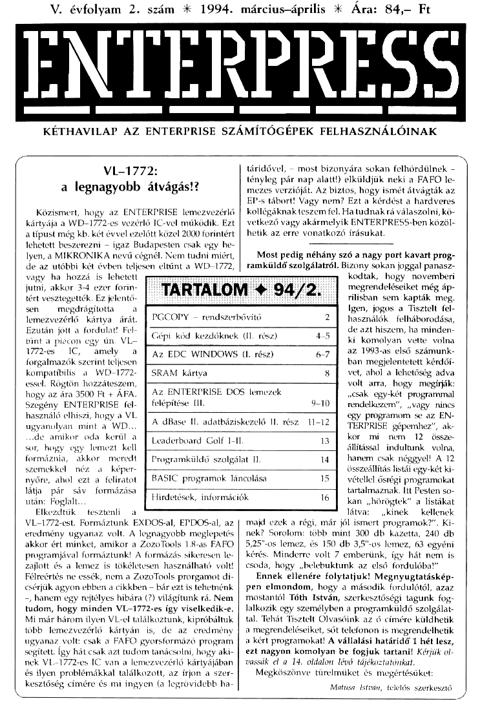

# Enterpress 1994/2 (1994.03-04)

[Оригінальний PDF](http://enterprise.iko.hu/magazines/Enterpress_1994-2.pdf) (угорською)

## Зміст

[Gépi kódú programozás kezdőknek II. rész](https://ep128.hu/Ep_Konyv/Enterpress_Gepikod.htm#b2)  
[EPROM/SRAM-bővítő kártya - Kőkobak](https://ep128.hu/Ep_Hardware/Ep_EPROM_SRAM.htm)  
[Az Enterprise DOS lemezek felépítése III.](https://ep128.hu/Ep_Konyv/Enterpress_Cikkek.htm#3a)  
[A dBASE II. adatbáziskezelő rendszer ismertetése II. rész.](https://ep128.hu/Ep_Konyv/Enterpress_Cikkek.htm#dbase)  
[BASIC programok láncolása](https://ep128.hu/Ep_Konyv/Enterpress_Cikkek.htm#5a)  

----

[Чернетка вмісту](1994-03-04/epress-1994-03-04.txt)
