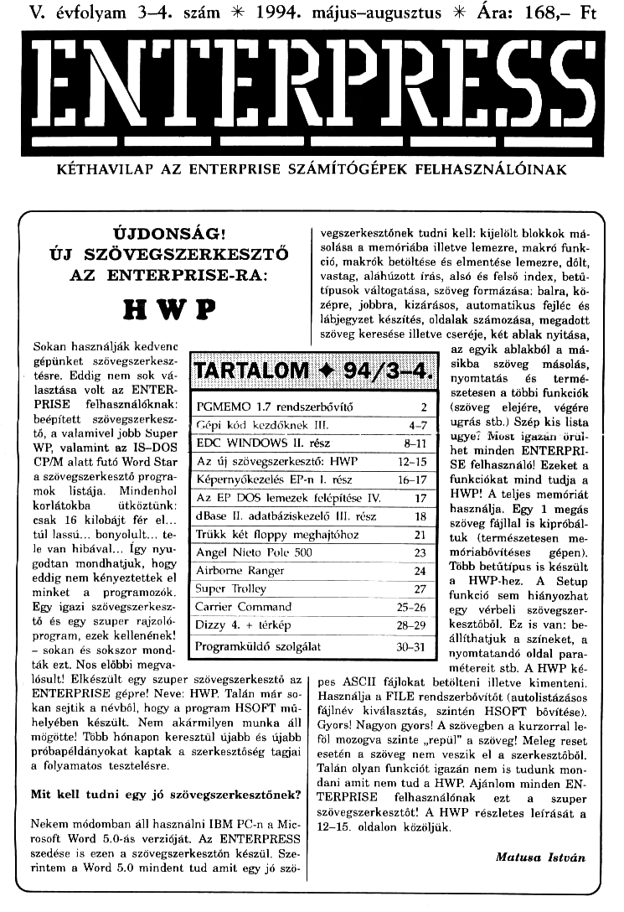

# Enterpress 1994/3-4 (1994.05-08)

[Оригінальний PDF](http://enterprise.iko.hu/magazines/Enterpress_1994-3-4.pdf) (угорською)

## Зміст

## Чернетка вмісту

"page-000.jpg" ------------------------------------------------------------ 
V. évfolyam 3-4. szám XX 1994. május-augusztus k Ár:

ENTEKEÉRESS

L ssss—— mm ————— mm e———— ke ———— kr]
KÉTHAVILAP AZ ENTERPRISE SZÁMÍTÓGÉPEK FELHASZNÁLÓINAK

168- Ft

ÚJDONSÁG!
ÚJ SZÖVEGSZERKESZTŐ
AZ ENTERPRISE-RA:

HWP

Sokan használják kedvenc

vegszerkesztőnek tudni kell: kijelölt blokkok má-
solása a memóriába illetve lemezre, makró funk-
ció, makrók betöltése és elmentése lemezre, dőlt,
vastag, aláhúzott írás, alsó és felső index, betű-
típusok váltogatása, szöveg formázása: balra, kö-
zépre, jobbra, kizárásos, automatikus fejléc és
lábjegyzet készítés, oldalak számozása, megadott
szöveg keresése illetve cseréje, két ablak nyitása,
az egyik ablakból a má-

gépünket  szövegszerkesz-
— tésre. Eddig nem sok vá-

sikba szöveg másolás,
nyomtatás — és termé.

lasztása volt az ENTER-
PRISE felhasználóknak:

PGMEMO 1.7 rendszerbővítő 2

szetesen a többi funkciók
(szöveg elejére, végére

beépített . szövegszerkesz-
tó, a valamivel jobb Super
WP, valamint az 18-DOS

Gépi kód kezdő
EDC WINDOWS II.

ugrás stb.) Szép kis lista
ugye? Most igazán örül-
het minden ENTERPRI-

CPIM alatt futó Word Star
a szövegszerkesztő progra-
mok listája. Mindenhol
korlátokba ütköztünk:
csak 16 kilobájt fér el.
túl lassú... bonyolult... te- [7
le van hibával... Így nyu-
godtan mondhatjuk, hogy
eddig nem kényeztettek el
minket a programozók,
Egy igazi szövegszerkesz-
tő és egy szuper rajzoló.
program, ezek kellenének!
— sokan és sokszor mond-

dBase II. adatbázi

Angel Nicto Pole
Airborne Ranger

Carrier Command
Dizzy 4. 4 térkép

ezelő III, rész 18
Moppy meghajtóhoz 2

Programküldő szolgálat 30-31

SE felhasználó! Ezeket a
funkciókat mind tudja a
HWP! A teljes memóriát
—T használja. Egy 1 megás
— ( szöveg fájllal is kipróbál-
tuk (természetesen me-
23 ] móriabövítéses — gépen).
24 ] Több betűtípus is készült
27]? HWP-hez. A Setup

funkció sem hiányozhat
25-26 ( egy vérbeli szövegszer-
28-29 Ű kesztőből. Ez is van: be-
állíthatjuk a színeket, a
nyomtatandó oldal para-

ták ezt. Nos előbbi megva-
lósult! Elkészült egy szuper szövegszerkesztő az
ENTERPRISE gépre! Neve: HWP. Talán már so-
kan sejtik a névből, hogy a program HSOFT mű-
helyében készült. Nem akármilyen munka áll
mögötte! Több hónapon keresztül újabb és újabb
próbapéldányokat kaptak a szerkesztőség tagjai
a folyamatos tesztelésre.

Mit kell tudni egy jó szövegszerkesztönek?

Nekem módomban áll használni IBM PC-n a Mic-
rosoft Word 5.0-ás verzióját. Az ENTERPRESS
szedése is ezen a szövegszerkesztőn készül. Sze-
Tintem a Word 5.0 mindent tud amit egy j.

ks

métereit stb. A HWP ké-
pes ASCII fájlokat betölteni illetve kimenteni.
Használja a FILE rendszerbővítőt (autolistázásos
fájlnév kiválasztás, szintén HSOFT bövítése).
Gyors! Nagyon gyors! A szövegben a kurzorral le-
föl mozogva szinte ,repül" a szöveg! Meleg reset
esetén a szöveg nem veszik el a szerkesztőből.
Talán olyan funkciót igazán nem is tudunk mon-
dani amit nem tud a HWP. Ajánlom minden EN.
TERPRISE felhasználónak ezt a — szuper
szövegszerkesztőt! A HWP részletes leírását a
12-15. oldalon közöljük,

Matusa István

"page-001.jpg" ------------------------------------------------------------ 
2 RERESS

1994. május-augusztus

PDCMEMO 1.7

Elérkeztünk sorozatunk utolsó részéhez amely-
ben a PGMEMO programot ismertetjük. Több
visszajelzést kaptam a Tisztelt Olvasóktól, hogy a
PGDATA és PGCOPY programok leírásai nem íga-
zán tükrözték, hogy mit is tudnak ezek a progra-
mok, Mint kiderült, szerkesztőségünk régebbi
verziószámú PGDATA és PGCOPY programmal
rendelkezett és nem is volt tudomása az újabb ver-
ziószámú programokról így nem csoda, hogy sok
funkció nem működött. Ezért elnézést! Remélem a
mostani PGMEMO leírással nem lesznek problémák.
Előre közlöm: a leírás a PGMEMO 1.7 verziójáról ké-
szült. A leíráshoz felhasználtam a program HELP-
szövegét. Íme:

A PGMEMO sokféle adattömb létrehozására, az
adatok rendezésére, módosítására, keresésére,
nyomtatására stb. használható. Minden adattömb
adatblokkokból áll, amiket két vagy három sor al-
kothat a beállítástól (Formátum) függően: ha a har-
madik input sorba nem írunk semmit akkor kettő,
különben három. A negyedik sorban lehet kijelölni,
hogy az adatblokkok harmadik sora milyen elren-
dezésű legyen: ahová " — "-et írunk ott nem lesz,
minden más karakter helyén lesz adat.

Az adattömb feltöltése (Beírás) után az kiment-
hető (Save), újra betölthető (Load) vagy utána tölt-
hető (Merge) egy másik adattömb. Az adattömbnek
betölthető csak a formátuma (Formátum) is.

Az adatok között lehet keresni (Keresés): először
ki kell jelölni, hogy az adatblokkok melyik sorában
keresünk, majd a keresendő szöveget kell beírni. Mi-
után megtalálta, megjeleníti a sorokat. A keres.
folytatható a már leszűkített adattömbben, vagy is-
mét az egész (Teljes adattömb) adattömbben.

Az adatblokkok rendezhetők (Rendezés) a kijelölt
sorok szerint ABC sorrendbe.

A printelés értékei beállíthatók (Opciók) a prin-
ternek megfelelően, és a program így kimenthető
(Save): következő betöltésnél már a beállított érté-
kekkel működik. A kinyomtatni kívánt sorok beál-
líthatók (Formátum), ha " — "-et írunk, akkor nem
printeli, minden más karakternél kiírja a sort. Az el-
ső két sornál a második karakter beírásával beállít-
ható, hogy kitöltse-e a sorokat pontokkal, vagy ne.
A sorok 40 karakter hosszúak, melyek a printeren
egymás mellé kerülnek, tehát ha printer 80 karaktert
tud nyomtatni, akkor csak két sort érdemes kijelölni.
3 sornál 120 karaktert ír. A megjelenítésnél látható
sortól kezdve az utolsóig lehet printelni (Kprint),

A printerre ki lehet küldeni vezérlő kódokat (Be-
állítás), melyek beállíthatók (Vezérlő kódok) a kódok
3 számjegyű decimális értékeinek beírásával, me-
lyek között " "-et kell hagyni. Ha a sor elején " "
van, akkor nem veszi figyelembe a sorban levő kó-
dokat. A kódok elé be lehet írni a jelentésüket, me-
lyek csak tájékoztatóak.

Eddig a HELP-szöveg, most még egy-két meg-
jegyzés:

A program a teljes memóriát használja (ez egész
69. A HELP szöveg nem tesz említést arról, hogy
az adattömb műveleteknél szerepel a PGDATA
funkció is. Valószínű a PGDATA fájljait lehetne be-
tölteni, de ez nem működik tökéletesen! Betölti a
PGDATA fájlt de csak az utolsó mezőt mutatja meg.
Ha valaki tudja, használni, írjon! Pedig ez egy egész
jó funkció lenne...

Összességében a PGMEMO egy jó adatkezelő
Program, felhasználóbarát és a PG-családtól már
megszokott menüformával rendelkezik.

A program megrendelhető a következő címen:

Haluska László, 1086 Budapest,
Karácsony Sándor u. 18. 3/41

Ára: 200 Ft szerzői díj 4 az adathordozó, vagy
EPROM ára.
Matusa István

Elnézésüket kérjük az ENTERPRESS késői megje-
lenéséért.

Nem titkoljuk, a HWP szövegszerkesztőről írt cikket
mindenféleképpen szerettük volna megjelentetni a
lapban. Ez sikerült, és mint bizonyára észrevették,
ezért (a csúszás miatt) a mostani ENTERPRESS 32
oldalon, dupla számmal jelent meg.

Köszönettel:
a szerkesztőség

mes]
Na agtszoág
aládaltávánoan

A Szív tv műsora az ország számos helyi
és körzeti kábelhálózatán látható,

több mint egymillió lakásban.
szórakoztatás, filmek, információ
riportok, tréningek

A Szív tv postacíme: 1656 Budapest, Pf. 6.
Telefon: 256-6136 (fax is), 257-1270

SS —————r————— I

"page-002.jpg" ------------------------------------------------------------ 
1994. május-augusztus

TE

100
no

560
570
580
590
600
610
620
630
640

650
660
670
680
690
700
"o
720
730

HOLD

PROGRAM "Hold.bas"
1 Akinek nincs meg az EPDOS, az hagyja ki az
EXT-el kezdődő sorokat!
SET 04
EXT "elkoffő
EXT "hfont
EXT "status
RANDOMIZE
CLOSE 1102
OPTION ANGLE DEGREES
SET 22,1:SET 23,.1:SET 24.27:SET 252
FOR X-I TO 36
OPEN 4X video."
ET X:PALETTE 0,RED,/CYAN,YELLOW
NEXT
CALL STARS
LET CH-t
FOR I-1 TO 180 STEP 10
LET R-(COS(D"129:15
PLOT WCH:440--(SIN(1)"350).30,ELLIPSE. R/R,PAINT
LET CH-CHe1
NEXT
LET CH-CHr1
FOR 1-190 TO 350 STEP 10
LET RACOSGY12)415
PLOT 4CH:4404(SIN()"300) 30,ELLIPSE R,R.PAINT
LET CH-CH:1
NEXT
EXT "status "Kitartás, már nincs sok hátral"
SET 24.27:SET 258
OPEN 440"vidooz
OPEN 41: video:
TO 41

lagydi békén a gépet egy ideigí"

LET SZIN-RND(3)$1LET X-RND(B60)-ULET
Y-RNDC2B7)-1
SET 4EINK SZIN
PLOT $I.XY
NEXT
NEXT
DISPLAY $40:AT 1 FROM 1 TO 8

DISPLAY $41:AT 11 FROM 1 TO 8
SET 020
EXT "status "HOLD"
FOR 1-1 TO 36
DISPLAY $I:AT 9 FROM 1 TO 2
FOR R-I TO 40
NEXT
NEXT
GOTO 520
DEF STARS
FOR V-I TO 36
SET HVANK 2
PLOT WV:440,30,ELLIPSE 30,30,PAINT
NEXT
FOR J-1 TO 30
LET SZIN-RND(3)LLET 2-RND(B60) ELET
Y-RNDGD1
FOR V-I TO 36
SET KV-INK SZIN
PLOT 4VIZY
NEXT
NEXT
FOR V-1 TO 36
SET £VINK 1
NEXT
END DEF

"ÍRTA: KISS LÁSZLÓ"

Kiss László

ISMÉT ÚJ JÁTÉKOKKAL JELENTKEZETT AZ ORKSOFT
csapatat Nyugodtan elmondhatjuk, hogy ők az egyet-
lenek a hazai piacon akik eredeti ENTERPRISE játékokkal
látják el a felhasználókat és nem a Spectrum programok
átírásával foglalkoznak, Nagyon örülnénk, ha több ilyen
lelkes csapat létezéséről szereznénk tudomást. Egyelőre
ORK-ék vannak a csúcson! Már előző számunk prog-
ramküldő szolgálatában is szerepelt egy játékprogram-
juk, a mostaniban pedig (dupla szám lévén) ORK-ék
összes játékprogramjával találkozhatunk a Programküldő
istáján.

1...

A Pécsi ENTERPRISE Klub tagjai is új programmal ruk-
koltak ki. Egy zenelejátszót készítettek, amely 8 bites
hangszerminták lejátszására alkalmas, (Pl. Rockdigi, S0-
und Tracker, bármely IBM PC ill. Amiga hangszer). Képes
lejátszani a .WAV formátumot (az IBM PC Windows alatt
futó hangjai), valamint az IBM PC Sound Blaster hang-
kártyájával bedigitalizált zenéket is képes lejátszani -
igen jó minőségben. Ha a program elnyeri végleges for-
máját, természetesen írunk róla és a programküldő szol-
gálat listájára is rákerül majd.

Szintén a Pécsi tábor készítette azt a DEMO programot,
melynek neve: FRACTALS DEMO.

SOROS KÁRTYA
NEMCSAK EGÉRHEZ...

Mint ismeretes a Mészáros Gyula féle RS-232 so-
ros kártya elsösorban az egér vezérléséhez ké-
szült. Ha figyelmesen elolvasták a soros kártya
leírását az ENTERPRESS-ben (92/2), akkor kide-
rült, hogy ez a kártya nemcsak az egér vezérlés-
hez jó, hanem kiválóan használható soros vonalon
történő kommunikációra is. A kártyán található
jumperekkel állíthatjuk be az átvitel sebességét
(BAUD-ban). Mint tudjuk, a gépünk hátoldalán
található soros-vonal elég gyenge (a soros port prog-
rammal alakítja át a beérkező soros információt
párhuzamossá, és eközben a processzor mással nem
is törödik, ami igen nagy hiba... — M. Gy)

Az egérvezérléshez HSOFT írta meg kitünően a
szoftvert és egyre több általa készített program
egérrel is vezérelhető. A soros átvitelhez most Zo-
zosoft írja majd a programot, és esetleg (ha jól
viselkedünk) ez a program a modem ítelefonvo-
nalon történő számítógépes adatátvitel) kezelését
is megoldja majd. Ha ez elkészül majd, IBM-es
kollégáink" bizonyára kocsányon lógó szemekkel
nézik majd az EP-s tábor modemen való kommu-
nikálását.

- mi -
"page-003.jpg" ------------------------------------------------------------ 
1994. május-augusztus

( Gépi TETT. rész
A veremkezelés 3FFE: 10
3FFF: 00

Miután már profi módon tudunk írni és rajzolni a kép-
ernyőre ideje, hogy megtanuljunk egy nagyon fontos
funkciót a veremkezelést. A verem funkciója egyértel-
mű: tárolunk benne valamit. Számítógépes körökben
általában adatokat szoktak benne tárolni. A veremke-
zelésnél két új utasítást tanulunk meg: a PUSH elhe-
lyezi a veremben adatainkat, a POP pedig visszahívja
onnan. Hogy jobban haladjunk, ezért megtanulunk
még egy utasítást, melynek neve ADD. Ennek a jelen-
tése: két regiszter tartalmát összeadja.

Most pedig nézzük részletesen, hogy mit is csinál min-
taprogramunk, amelyet most kivételesen az ASMON
égiszei alatt futtatunk.

ORG 1000h - mivel most csak az ASMON-nal dol-
gozunk, ezért 1000h-ra fordítjuk programunkat.

LD SPBFFFh. ; veremmutató beállítása a 3FFFh címre

A veremmutató mindig az SP feletti szabad helyre
mutat, tehát példánkban a 3FFF címre.
Folyamatábráinkon a veremmutató állását mindig a
nyíl C mutatja majd.

3FFE
— 3FFF

LD HLJ0 ; HL regiszterbe 10-et töltünk
LD BC220 ; BC regiszterbe 20-at töltünk
LD DE30 ; DE regiszterbe 30-at töltünk

A PUSH HL utasítás elhelyezi a verembe a HL értékét,
azaz a 10-et. A PUSH HL utasítás után a verem és
a veremmutató:

3FF9:

3FFA:

3FFB:

3FFC;

— 3FFD:

3FFE: 10

3FFF: 00

4000:

A PUSH BC utasítás után a verem és a veremmutató:

3FE9:
3FFA:

c 3FFB:
3FFC: 20
3FFD: 00
3FFE: 10
3FFF: 00
4000-

Ezután HL-be nullát helyezünk (LD HL,0), majd meg-
hívjuk az IZE címkét. A processzor elmenti a vissza-
térési címet, ez 14.
— 3FF9:
3FFA: 14

3FFC: 20
3FFD: 00

4000-

Az INC SP utasítás eggyel növeli a veremmutatót.
Az első INC SP utasítás után a veremmutató:

3FF9:

— 3FFA: 14
3FFB: 00
3FFC: 20
3FED: 00
3FFE: 10
3FFF: 00
4000-

A második INC SP utasítás után:

BFP9:
3FFA: 14

— 3FFB: 00
3FFC: 20
3FFD: 00
3FFE: 10
3FFE: 00
4000-

Ezután a POP BC utasítással visszahívjuk a 20-as értéket.
7 3FFD li

Lásd a programsorok melletti komment sorokati!t
Ugyanez a POP HL utasítással, itt a 10-es értéket hívjuk
vissza. Szintén lásd a komment sort!

— 3FFE

Ezután az ADD HL.DE utasítás következik: HL értéke
10, ehhez adjuk DE értékét ami 30. Tehát: HL-HL:DE
(10-10-30 — 40).

Ugyanígy az ADD HL BC utasítás. HL értéke most 40.
Ehhez adjuk BC értékét ami 20. Tehát: HL-HL:BC
(40-40420. — 60).

Most pedig letesszük a verembe HL értékét a PUSH
HL utasítással. A PUSH HL utasítás után a verem és
a veremmutató.
3FP9:
3FFA: 14
3FFB: 00
3FFC: 20
— 3FFD: 00
3FFE: 60
3FFF: 00
4000

Ezután vissza kell állítanunk a veremmutatót.
A DEC SP utasítás csökkenti a veremmutatót: SI

DEC SP — 3FFC
DEC SP G. 3FFB
DEC SP — 3FFA
DEC SP — 3FF9
"page-004.jpg" ------------------------------------------------------------ 
1994. május-augusztus

Ezt négyszer kell végrehajtanunk, hogy a veremmutató
a helyére kerüljön. Ezután a RET kiveszi a visszatérési

címet (14) — ezt azonban még látjuk 3FFA-n.

3FP9:
3FFA: 14

Programunkat most a memóriába fordítjuk. Szokásos
beállításaink a Z billentyű lemonyása után:
Assembly listing ON, List conditions NO, Force Pass
2 NO, Memory Assembly YES, Memory ofíset 0, Object
file name: (ide ne írjunk semmit).

Az opciók beállítása után nyomjuk meg az A betűt.

3FFB: 00 Könnyen megnézhetjük programunk eredményét, ha
— 3FFC: 20 az M leütése után begépeljük: 3FF9, de lépésenként is
3FFD: 00 nyomon követhetjük, ha a T betű leütése után beírjuk:
3FFE: 60 1000. (Az alsó sorban SP- . . . . után láthatjuk, hogy
3FFE: 00 hol áll a veremmutató.
4000- (Folytatás a következő oldalon)
ORG 1000H ; FORDITASI CIM BEALLITASA
LD SP,3FFFH —— ; VEREMMUTATO BEALLITASA 3FFFH CIMRE
LD HL,10 ; HL-BE 10
LD BC,20 ; BC-BE 20
LD DE,30 ; DE-BE 30 )
PUSH ÁL ; LETESSZUK HL ERTEKET (10) A VEREMBE
; H ERTEKE AZ (SP-1) CIMRE -3 3FFFH
; L ERTEKE AZ (SP-2) CIMRE -5 3FFEH
PUSH BC ; LETESSZUK BC ERTEKET (20) A VEREMBE
j B ERTEKE AZ (SP-3) CIMRE -2 3FFDH
j C ERTEKE AZ (SP-4) CIMRE -5 3FFCH
j A VEREMMUTATÓ MOST 3FF9H-RA MUTAT!!!
LD HL,0 ; HL-BE 0 (HL-0)
CALL ÍZE ; IZE CIMKE MEGHIVASA
IZE INC SP ; SP-SPtl (SP-3FFAH)
INC SP i SP-SPt1 (SP-3FFBH)
POP BC ; BC REGISZTER VISSZATOLTESE A VEREMBOL
; C-BE AZ (SP) CIM TARTALMAT TOLTI
; B-BE AZ (SP$1) CIM TARTALMAT TOLTI
POP HL ; HL REGISZTER VISSZATOLTESE A VEREMBOL
; L-BE AZ (SP4$2) CIM TARTALMAT TOLTI
; H-BA AZ (SP43) CIM TARTALMAT TOLTI
ADD HL,DE ; HLEHL4ADE azaz 10-10430 (HL-40)
ADD HL, BC ; HLEHL4BC azaz 40-40420 (HL-60)
PUSH HL ; LETESSZUK HL ERTEKET (60) A VEREMBE
; H ERTEKE AZ (SP-1) CIMRE -2 3FFFH
L ERTEKE AZ (SP-2) CIMRE -5 3FFEH
DEC SP SP-SP-1 -5 3FFCH
DEC SP ; -5 3FFBH
DEC SP i $P-SP-1 -5 3EFAH
DEC SP ; SP-SP-1 -2 3FF9H
RET ; VISSZATERES A CALL UTAN -5 SP-3FFCH
Fizessen elő a
és a 17)
3 RÁDIÓTECHNIKA elektronika

folyóiratokral Így
Címünk: 1374 Budapest, Pt. 603.
4 szerkesztőségben regisztrált HE előfizetőknek díjmentes nyák-filrm melléklet.

osan hozzájuti

"page-005.jpg" ------------------------------------------------------------ 
6

1994. május-augusztus

A veremkezelés elég nyers téma (ráadásul szerintem elég nehéz megérteni). Ezért most gépi kód kezdőknek
c. sorozatunkat folytassuk egy érdekes rutinnal. Programunk a szokásos módon indul: fordítási cím (ORG 1004)
És a makró beállítása. Ezután definiálunk egy videolapot, melyre kiírunk három sornyi szöveget (ENTERPRESS
3-szor) és a , Billentyű leütésére folytatom." szöveget az alsó sorba. Megnyitunk egy billentyűzet csatornát, majd
meghívjuk a VILLOG cimkét. A , VILLOG" rutin elkezdi a paletta színeivel (1255) villogtatni az alsó sorba
írt szöveget. A rutin jól használható olyan szöveges képernyőknél, ahol szeretnénk elolvastatni mondjuk egy
teljes képernyős szöveget a felhasználóval, ha elolvasta leüt egy billentyűt és folytatódhat a program futása.
(Programunkban a billentyű leütése után kilépünk BASIC-be). Részletesebben a , VILLOG" rutin:

LD B. - B-ben a palettaszám (I-től indulunk). Belapozzuk a rendszerszegmenst a második lapra (LD A,255
- OUT (OBZH),A). Erre azért van szükség mert az LPT itt található. Ezután B értékét A-ba töltjük (1), majd
átadjuk ezt az értéket OBABH címre (az LPT-ben ezen a címen található ennek a sornak — ide írtuk a villogtatni
kívánt szöveget - a tintaszín állítása). BC értékét eltesszük a verembe (PUSH BC). Olvasunk egy csatorna ké-
szenlétet a billentyűzet csatornáról (LD A,105 - EXOS 9). EXOS 9-nél a kimenő adat C regiszterben található,
ez tartalmazza a készenlétjelző bájtot. Olyan csatorna esetén praktikus használni, amely olvasásnál várakozna
a készenlétig (pl. KEYBOARD). Így várakozás nélkül is információt kérhetünk arról, van-e olvasható karakter
a perifériakezelő pufferben. Visszahívjuk BC-t a veremből. OR A és RET Z vizsgálja: ha van leütött billentyű
akkor visszatér. Következő lépésként várakozunk (HALT-ok), hogy lássuk a villogó sort, majd növeljük B értékét
eggyel (INC B). Ha leütöttünk egy billentyűt akkor visszatérünk meghívni a BILLENTYU cimkét, amely figyeli,
hogy van-e leütött billentyű. Ha van visszatér BASIC-be. Ha nincs leütött billentyű, akkor a ciklus folytatódik
WP VISSZA).

Programunkat a begépelés után lefordíthatjuk. Szokásos beállításaink a Z billentyű lemonyása után:
Assembly listing ON, List conditions NO, Force Pass 2 NO, Memory Assembly NO, Öbject file name: TAN3.COM,
EXOS module header YES, EXOS module type: 5.

Az opciók beállítása után nyomjuk meg az A betűt. Ezzel harmadik gépi kódú programunkat készítettük el,
amit természetesen bárhonnan behívhatunk. Következő részünkben egy egyszerű menükezelést mutatunk be.

Matusa István

ORG 1004 ; FORDITASI CIM BEALLITASA
.SET MACRO GVALTOZO,ÉERTEK ; MAKRO DEFINICIO
LD B,1 i IRAS

LD C, ÉVALTOZO
LD D, BERTEK
EXOS 16

ENDM

LD SP,3FFFH VEREMMUTATO BEALLITASA

.SET 22,0 ; 0-AS VIDEOMOD
.SET 23,0 ; 2 SZINU UZEMMOD
:SET 24,40 ; 40 OSZLOP SZELES
.SET 25,24 ; 24 SOR MAGAS
LD A, 50 ; A-BA CSATORNASZAM
LD DE,NEV ; DE A NEV ELOTTI HOSSZBAJTRA MUTAT
EXOS 2 ; CSATORNA MEGNYITASA
LD B,1 i VIDEOLAP KIJELZESE
LD A,50 ; A-BA CSATORNASZAM
LD C,1 ; ELSO KIJELZENDO SOR AZ 1-ES
EB. Di24 i 24 SORT KELL MEGJELENITENI
LD E,1 ; AZ ELSO SORBAN KEZDODIK
; A MEGJELENITES
EXOS 11 ; SPECIALIS FUNCKIO

LD A, 50 ; A-BA CSATORNASZAM
LD BC, HELPESCHOSSZ ; ESCAPE SZEKVENCIAK
LD DE, HELPESC

EXOS 8 i BLOKK KIIRASA
LD A, 50
LD BC, HELPHOSSZ ; SZOVEGEK KIIRASA

LD DE, HELPSZOVEG

EXOS 8 BLOKK KIIRASA
"page-006.jpg" ------------------------------------------------------------ 
1994. május-augusztus

GVARAKOZAS BILLENTYU LEUTESRE
LD DE, KEY
LD A,105
EXOS 1
CALL VILLOG
CALL BILLENTYU
LD DE,BASIC

KEY-CIMKE HIVASA

A-BA CSATORNASZAM
CSATORNA MEGNYITÁSA
VILLOG CIMKE HIVASA
BILLENTYU CIMKE HIVASA
KILEPES BASIC-BE

EXOS 26 BOVITESEK VIZSGALATA
HELPESC DB.27,föt
,0,215,0,0,0,0,0,0
DB 27,"I",O
HELPESCHOSSZ EOU $-HELPESC
HELPSZOVEG DB "ENTERPRESS!",10,13
DB " ENTERPRESSY,10,13
DB "  ENTERPRESSY",10,13
DB 27 ,38H,20OH — ; KURZORPOZICIO BEALLITASA
DB" Bíllentyu leutesere folytatom."
HELPHOSSZ EOU $-HELPSZOVEG
VILLOG LD B,1 i B-BEL
LD A,255 i; RENDSZERSZEGMENS
OUT (OBZH) A ; BELAPOZASA
VISSZA LD A,B ; B ERTEKE A-BA (1)
LD (OBA89H),A ; LPT-CIM (24. SOR;
PUSH BC ; BC A VEREMBE
LD A,105 ; A-BA CSATORNASZAM
EXOS 9 j; CSATORNAKESZENLET OLV.
LD A,C ; C ERTEKE A-BA (C-BEN A
; KESZENLETJELZO BAJT
POP BC ; BC VISSZA A VEREMBOL
OR A ; BILLENTYULEUTES VIZSG
RET Z ; HA VAN, VISSZATERES
HALT ; KESLELTETES
HALT
HALT
HALT
HALT
HALT
HALT
HALT
HALT
HALT
HALT
HALT
INC B ; B-Bt1
JP VISSZA j UGRAS A VISSZA CIMKERE
RET
NEV DB 6, "VIDEO: !"
KEY DB 9, "KEYBOARI
BASIC DB 5, "BASIC"
BILLENTYU LD A,105 ; BILLENTYUZET CSATORNA
EXOS 5 j; KARAKTEROLVASAS
RET ; VISSZATERES

END
"page-007.jpg" ------------------------------------------------------------ 
1994. május-augusztus

ÚJDONSÁGOK AZ EDCW 5.2-BEN

Az időközben megjelent EDCW 5.2 több módosítást is tar-
talmaz, ezek azonban túlnyomórészt kényelmi jellegűek, a
megjelent lényegen nem változtatnak. Egyetlen kivétel akad
csupán, mely jelentősen eltér az EDCW 4.9-ben megszokot-
tól. Ez a billentyűzet kezelése, melyet már nem a saját al-
program végez, hanem az aktuális KEYBOARD: kezelő. Az
EDCW automatikusan bekapcsolja a WTOOL ilyen keze-
lőjét, ha az rezidens. De mi is az a WTOOL?

A WTOOL

A WTOOL egy az EDCW-hez tartozó, de attól független
működésű rendszerbővítő.

Tartalmaz egy új KEYBOARD: eszközt, ami ugyan csak an-
gol billentyűzethez használható, de jópár kényelmi újítást
tartalmaz, Ezek közül is a legfontosabb az, hogy változtat-
ható méretű puffert hoz létre, azaz nem csak egy lenyomott
billentyűre emlékszik hanem akár 255-re is.

Mire jó ez? Nos, előfordulhat, hogy a gép valami hosszabb
folyamat végrehajtásán dolgozik (Pl. fordít). Ilyenkor nem
tudja a billentyűzetről érkező karaktereket fogadni, csak a
legutolsót tárolni a későbbi feldolgozáshoz. Ezt bővíti ki a
WTOOL azzal, hogy legfeljebb 255 karaktert egy pufferben
megőriz mindaddig, amíg a gép ismét ráér" fogadni. Ezt
több szempontból is előnyös, nem csak hosszú műveleteknél,
hanem lassú programoknál is, mert folyamatos gépelést tesz
lehetővé.

Ezen kívül az CONTROLI porton lévő eszközt (pl. joystick)
átirányítja a belső joy-ra is, valamint ha két billentytűt nyo-
munk le egyszerre, akkor két különböző karakter is jelenik
meg.

Természetesen ezeket a szolgáltatásokat csak azokban a
programokban használhatjuk ki, amelyek a standard KEY-
BOARD: eszközt használják (a játékprogramok egy-két ki.
vétellel nem ilyenek), de jó szolgálatot tehet akár
BASIC-ben, ASMON-ban, és mindenütt EXOS és EDCW
alatt,

A WOOL betöltődése után a kezelő azonnal működni kezd,
ha van megnyitott billentyűzet csatorna, ellenkező esetben
a bekapcsolást a "KEYBOARD" paranccsal kell elvégezni.
Ezt a parancsot máskor is szükséges alkalmazni, mert egyes
EXOS reset hívások az új eszközt kiiktathatják.

A WTOOL EGYÉB PARANCSAI
MACRO makronév: parancssor

Létrehoz egy új EXOS parancsot, amelyhez tetszőleges szö-
veget rendelhetünk hozzá. Pl. a "MACRO WIDE:DIR /W
/H" kiadása után már él a "WIDE" parancs, amely , széles"
dírectory-t ad. minden fájlról. Hivatkozhatunk külső batch
fájlra ís, pl. a "MACRO CMD:EXDOS CMD.BAT" egy
olyan makrót definiál, amely végrehajtatja a lemezen lévő
CMDBAT-ot a ":CMD" EXOS parancs kiadása esetén.
A MSAVE és MLOAD ezeknek a makrónak az elmentésére
És betöltésére. szolgálnak.

EXTS

Megjeleníti az EDCW rendszerbővítőit, szegmensszámmal
együtt (Hasonló az egyszerű :HELP-hez).

CLOAD, CSAVE filenév

Az aktuláis karakterkészletet lehet velük kimenetni vagy be-
tölteni.

BOLD, ITALIC

Vastagítja, vagy megdönti az aktuális ka
FAST, SLOW

Alapkiépítésű gépen 3.5 és 4 Mhz között kapcsolnak.

A WTOOL belső parancsainak .HLP (segítség) fájlait a
HELP alkönyvtárban találjuk, ezek íródnak ki "HELP -pa-
rancs-" kiadásakor. Ez a felhasználó által definiált makrókra
is érvényes, mert kezelésük egy az egyben megegyezik a
beépített pararancsok kezelésével (Azaz ":HELP WTOOL"
kiadásakor ugyanúgy megjelennek a makrók issmint pl. a
CLOAD vagy a FAST, valamint a saját parancshoz saját
HELP-et is készíthetünk).

akterkészletet.

E kis kitérő után folytassuk az EDCW-vel való ismerkedést,
egy kicsít magasabb szinten.

MEMÓRIAFELOSZTÁS
Az EDCW minimálisan 4 szegmenst foglal le működéséhez:

— EDCW rendszerbővítő modul szegmense

— FC videoszegmens, képfelépítéshez (76 bájt széles,
210 pont magas, HIRES 2)

— pufferszegmens

— mindenkori nulláslap, az EDCW aktív kódjához

A 0-ás és a 3-as lapot nem szabad megváltoztatni vagy fe-
lülírni, mert az a rendszer összeomlását okozhatja.
PROGRAMOK EDCW ALATT

A WIN kiterjesztésű EDCW alkalmazásokról már esett szó
a bevezetőben. Most részletesebben is megismerkedünk ve-
lk, miként működnek.

A felhasználói program két esetben folytathat kommuniká-
ciót az EDCW-vel, egyrészt az inicializálási folyamat során,
másrészt különböző események bekövetkezésekor, Esemény-
nek minősül a kattintás, egy opció választása a billentyű-
zetről, stb. A főprogramnak meg kell adnia, hogy az egyes
tseményekre mi legyen a reakció, a válasz.

FELHASZNÁLÓI PROGRAMOK INICIALIZÁLÁSI
FOLYAMATA

Az EDCW ezt az EXOS-hoz hasonlóan végzi, akciókódok se-
gístégével. Amikor elkezdünk betölteni egy .WIN fájlt, először
a fejléc kerül megvizsgálásra, mert ennek 5. bájtja speciális
funkcióval bír, ez határozza meg a futási lapot. Ennek értéke
mindig 1 (4000h-7FFFh). Amennyiben ez az érték nem meg-
felelő "Invalid running page" hibaüzenetet kapunk, egyébként
a EDCW perifériaszegmenst foglal az új alkalmazásnak, és be-
tölti azt max. 16368 bájt hosszban. A lefoglalt szegmens első
16 bájtjába rendszerinformációk kerülnek:

0-13: "EDCW EXTENSION" — azonosító
láz futási lap

15. szegmensszám
"page-008.jpg" ------------------------------------------------------------ 
1994. május-augusztus

Így a kód belépési pontja a 16. bájton lesz, az 1. lapon
(A010h). Az EDCW itt hívja meg a programot, A-ban az
akciókóddal, melynek értéke lehet:

Az0

Bővítő nevének lekérése. HL-nek a név előtti hosszbájtra
kell. mutatnia, melynek hossza max. 22 karakter lehet.

HELP ablak. HL-nek az ablakba kerülő szövegre kell mu-
tatnia, 4x18 karakter méretben.

Futás. IY az EDCW belső változóinak táblájára mutat. Ha
kilépéskor A-D, a bővítő nem kíván aktuális alkalmazás len-
ni, egyébként igen.

A:

Betöltődés. után. azonnal megkapja a rendszerbővítő, de
ilyenkor nem szabad EDCW hívásokat kezdeményezni, és
minden más műveletet is körültekintően kell végezni. mert
€z a rendszer egyik labilis pontja.

A futás megkezdése után néhány fontos paramétert át kell
venni az EDCW-től, és meg lehet kezdeni az ablakok nyi-
tását. Egyszerre csak egy ablak lehet aktív. A definiálása
következőképpen történik;

— Könyvtárazni kell az ablakot (számmal kell ellátni)
— A hivatkozás a továbbiakban ezzel a számmal történhet,
hasonlóan a 1/0. csatomákhoz,

Miután már definiálva vannak az ablakok, egyiküket aktu-
álissá kell tenni, és egy egyszerű RET-tel vissza kell adni
a vezérlést az EDCW-nek. Ha valami történik, a vezérlést
a megfelelő eseménynutin kapja meg.

AZ EDCW ELÉRÉSE
Az EDCW funkcióhívásait az RST 8-on keresztül lel

érni, az EXOS-hoz hasonló módon: a funkció számát az RST
8 utasítás utáni bájton kell elhelyezni. Ehhez a következő
makrót érdemes definiálni:
EDCW: — MACRO FCODE
RST 8
DB FCODE
ENDM

Így már használhatjuk az EDCW n parancsot, ahol n a funk-
ciókód.

AZ EDCW FUNKCIÓHÍVÁSAI

A nem publikált funkcióhívások élnek ugyan, de használatuk
valamilyen szempontból nem célszerű kompatibilitási vagy
koordinációs problémák miatt. (Ilyen pl. az EDCW 0, amely
az egész képernyőt letörlide bizonytalanná teszi az inverz

opciók kezelését.)

EDCW 1
Szöveg kiírása az aktuális ablakba.

Azkezdő sor (pixelsor, a továbbiakban mindenütb)
szoszlop (karakterekben, a továbbiakban mindenütt)
HL-szövegre mutat

EDCW 2
EDCW változó állít

Az
Ha
Ha
Ha

áltozó száma

átbillentés (CPL)

beállítás, az új értéknek C-ben kell lennie
olvasás, kimeneti Azaktuláis érték

Beépített változók.
0 — Árnyék

— Aktuális ablak inverz

— Képernyő törlés minden ablak kirakásánál
Rejtett fájlok a File Managerben
Lemezellenőrzés

7 Attributes menü változói

EDCW 3
EDCW újraindítása

EDCW 4
Hibaüzenet kezelése, kiírása az alsó sorba.

Azhibakód

EDCW 5

Belső menü választása, a beépítettekből, Azúj menű száma
EDCW 6

DOS közvetlen hívása.

EDCW 7

Grafika töltése adathordozóról ablakba.
Azbal fölső sarok sora

B-oszlop

Hekép vízszintes mérete, bájtban

Lekép függőleges mérete, pixelsorokban

C-már megnyitott csatorna száma, ahonnan olvasni kell

EDCW 8

Felhasználói ablak könyvtárazása, hogy később rá hivatkozni

lehessen.

Azablak száma (Ha már definiált, "Window exists" üzenetet

kapunk)

ablak adattáblázatára mutat (WPT - Window Parameler
able)

Legjobb játék program:

Legjobb programozó:
Legjobb programátír

Vegjobb szoftver stúdió:

Legjobb felhasználói program: HWP 1.0

Legjobb demo program:

A szerkesztők listája — Az Olvasók listáji

LOGIBALL PASZIÁNSZ
FENAS 1.2
VISIONS (EDC) SMALL DEMO
HSOFT HSOFT
ZOZOSOFT ZOZOSOFT
ORK SOFT ORK SOFT
"page-009.jpg" ------------------------------------------------------------ 
10

1994. május-augusztus

EDCW 9

Felhasználói ablak törlése a nyilvántartásból.

Azablak száma (Ha nem létezik, "Window does not exist"
üzenetet kapunk)

EDCW 10

Ablak aktuálissá tétele.

Azablak száma

EDCW 1

Szöveg bevitel kérelmezése a billentyűzetről,

HL-szövegpuffer (Ha az ablak szövegében mutat valahova,
a képernyőn is látható lesz az eredmény)
Azhány karaktert kell olvasni

EDCW 12
A legutoljára beolvasott szöveg hosszát adja meg.

Azolvasott karakterek

EDCW 13
Grafika megjelenítése. az aktuális ablakban.

Ecvízszintes méret.bájtban
Dzfüggőleges méret, bájtban
HL-képadatokra. mutat

EDCW 14

File manager meghívása. A visszatérés nem a verem tar-
talmától függ. hanem a bemeneti regiszterek értékeitől.

DE-"Select" opció használata során aktivizálódó rutin címe.
Ilyenkor a DE egy fájlnévre mutat, amit a felhsználó vá-
lasztott.

HL-A "Cancel" rutinjára mutat

EDCW 15

Egy belső program, az "EXOFF" meghívása. Kereszínt, sza-
bad memóra kijelzést, stb. frissít

EDCW 16

Annak a nutinnak a beállítása, amely akkor indul el, ha a
felhsználó kattint, de a pointer nem opción van,

Ha Az0 a rutinra hivatkozás törlése, egyébként HL-új ese.
ménykezelőre. mutat.

EDCW 17
Decimális konverzi

rutinja.

0-65535, konvertálandó. szám
DE-S bájtos puffer a számjegyeknek

A WPT

Az ablak definíciós táblázat felépítése nem éppen egyszerű,
de gyors, látványos kezelést tesz lehetővé. A továbbiakban
n-Az ablakban lévő opciók száma (1-42).

1. mező: Opció-információs egység, csak 16 bites szavakból
áll. Az első szó az opciók pozíciótáblázatára mutat, ezt kö-

vetik a végrehajtó-rutinok címei és az inverzre váltandó kép-
területek bal felső sarkának Z80-as címei. (n darab szó mind-
két esetben)

2. mező: Ablak-információs egység, két bájtból és két szóból
Áll. Az első bájt az ablak vízszintes mérete bájtokban, a má-
Ssodik a függőleges mérete pixelsorokban. Az első szó az
ablak bal felső sarkának Z80-as címe, a második az ablakban
lévő szövegé.

3.mező:; Az ablak szövege, 0-val lezárva, Használható ve-
zérlőkódoök:

15 — Az aktuális pozíció tárolása. A következő soremelés
ehhez képest fog történni.

13 — Soremelés

14 — Az előző karakter aláhúzása

0 — szöveg vége

A pozíciók 280-as címét a következőképpen számíthatjuk.
ki:

780-ADDR —- 0C000H476 x sorroszlop

Az opció-információs egység

Csak bájtokbáól áll. Az első maga az n, ezt n darab négybájtos
blokk követi, melyek egy-egy opciót határoznak meg:

0. bájt: Az opció függőleges pozíci
1. bájt: Vízszintes pozíció, bájtban.

2. és 3. bájt: Az opció szélessége. (Azonos bájtok, az egyik
az érzékelési, a másik az invertálási szélességet adja meg.)

, pixelsorokban.

Végül a sort a HKT (Hot Key Table — az opciók billentyűi)
zárja, minden opcióhoz egy karaktert rendelve.

Az EDCW belső változóinak táblája

Ide mutat az TY iniciatizáláskor
1Y-3: EDCW pufferszegmens

IY-2: EDCW szegmens

IY-I: Verziószám BCD-ben

IY40 — TY-r1: Belső karakterkészlet címe
1Y42 — IY-43: A pointer képpontadataira mutat
1Y44 — IY-45: A pointer maszk adataira mutat
1Y46 — IY47: Belső ablakok táblázatára mutat
IY48 — IY49: Változó tábla címe

IY810 — IY411: FCBI

IYel4 — IY415: FCB3
IY416 — TY417: Extensions menübe visszatérő rutin címe
IY-18 — FY-r19:.Opciók függőleges méretét tartalmazó cím

1Y420 - IY321: A kép videocíme (0000h)

1Y422 - IY323: A kép függőleges mérete

1Y424 - IY-425: A kép vízszintes mérete

IY426 - IY427: WKEY, billentyűzetállapot-változó címe
1Y428 — IY-29: Pointer Z80-as címét tartalmazó cím
1Y530 — IY-31: radatokra mutat (hh:mm-re)

TY432 — TY433: Aktuális drive betűjére. mutat

1Y434 — 1Y35: EDCW belső főciklus

1Y436 - 1437: Felhasználói változók táblázatára mutat
"page-010.jpg" ------------------------------------------------------------ 
1994. május-augusztus

ák

Példaként álljon itt az FDD TEST egyik menüje, tanul.
mányozás céljából:

MAINMENU: . DW MAIN-OPTIONS TEST VIEW.HELBEXIT
DW 53812.54496,55180,55864
DB 1237
DW 53735.53812
DB 15/T 147
DB 14/nfo"

MAIN-OPTIONS: DB 4.60.23.14,14.69.23.14.14.78.23,1414
DB 87.23.14.14"wi".27

(Folytatjuk) 6 1994. EDC

Budapesti
KLUB-hírek

Előző számunk egyikében azt írtuk, hogy a Budapesti
ENTERPRISE Klub kb. júliusig üzemel a Puskin ut-
cában, mert az épületet egy áruház vette meg. Nos,
jó hírekkel szolgálhatunk! Az érintett felek (szeren-
csére) valószínűleg nem tudtak megegyezni, így a Bu-
dapesti EP-klub mégis itt a Puskin utcában fog
tovább üzemelni, Szeretettel várunk mindenkit a
keddi klubnapokon! Részletes információ lapunk
utolsó oldalán található.

DRILLER

TETTITTTTETZTIZTTZTETT

P - nézőpont fel
L - nézőpont le

R - emelkedés

F — süllyedés

A - forgásszög növelés

Z - forgásszög csökkentés

5 - lépésméret növelés

X - lépésméret csökkentés

D - fúrótorony le

C - fúrótorony fel

1 — SAVE, LOAD, kiépés menü
SPACE — kurzor váltás

Szektorok koordinátája:
Alabaster — 4498/4096
Armethyst — 6400/6050
Aguamarine - 5120/2897
Basalt - 0932/2240

Beryl - 7104/3512
Diamond — 4096/3472
Emerald - 3746/4097
Graphite - 1680/6336
Lapis Lazuli — 4096/3746
Malachite — 5954/5026
olite — 0512/1698
Obsidian - 6656/6308
Ochre — 1808/6720

Opal — 7394/7744
Ouartz - 2768/1792
Ruby — 3746/2550

Topaz - 3077/1310
Trachyte  - 4496/6913

ELLENŐRZÖTT INPUT RUTIN

Ha valaki igényes BASIC programot akar írni, az egyik legnagyobb
problémája az adatok bekérése. Mert mit csinál a .gonosz" (fek
használó, ha egy INPUT paranccsal adatot vár tóle a program? El.
mászkál a képernyón a kurzorral, szám helyett sztringet ír be.

A listán látható rutin az adatok ,bolondbiztos" bevitelét valósítja
meg.

A mitint a következőképpen kell meghívni:

CALL (változótípus maximális szöveghossz, pozíció, változás)

Ha változótípusnak (-át adunk, bármilyen karaktert beírhatunk,
egyébként csak számot fogad el a rutin (és a pontot). A rutin meg-
hívása után még a VAL fügvénnyel konvertálni kell a változót, ha
Numerikus értéket akarunk használni,

A szöveghosszban a maximálisan beírható karakterszámot adhatjuk
meg (de maximum 35 lehet). A változót ne felejtsük el a rutin meg.
hívása előtt létrehozni!

A rutin HONT karakterkészletre van tervezvel

9000 ! TEXT 40-ben hívjad!
9001. ! CALL inpltípus szöveghossz, pozíció változó)
9002 1 Tipus: Ossztring, egyébként szám

9003 ! szám esetén, meghívás után VAL kell!
9004 DEF INP(TIPHOSSZ.XX.REF VALT)

9005 LET VALTS$:

9006 IF XXS20 THEN LET XX-20

9009 ! Keret karakterei (HFONT) — ALTSV
sm 1 ALTem

5011 1 ALT:e

9012 TO HOSSZA

9013 TIS"! ALTSZ

9014 LET ST25-ST2$4-" 7 ! Ide szóköz kellt
9015 LET ST3$4-ST3$4" ! ALTv

9016. NEXT

9017. LET STIS-STIS£é " ! ALTóx

9018 LET ST25-ST2$42" " ! ALT]

9019 LET ST35-ST3$£" " ! ALTób

9020. LET MAX-(40-HOSSZ)/24HOSSZ-LET MIN-(41-HOSSZ) /2
9021 PRINT AT XXYUSTIS

9022 PRINT AT XX-I.YVST25

9023 PRINT AT XX.ZYYST3S

9024 SET 102NK 3

9025 LET YY-YYSELET XX-XX-1

9026 PRINT AT XXGYY ";

9027 LET KEY$-INKEYS

9028 IF KEY$-7 THEN 9027

9029 IF KEY$-CHRS(I3) THEN EXIT DEF

9080. IF KEYS-CHRS(I64) THEN

9081 IF YY5-MIN THEN LET YY-YY-1

9082 PRINT AT XXYYŐT? "

9086. IF KEYSZCHRS(47) AND KEYSECHRS(5B)
THEN 9044
9087 IF KEYS-CHRS(46) THEN 904
9088 IF TIPc3O THEN 9027.
9089 IF KEYSZCHRS(64) AND KEYS-CHRS(91)
THEN 9044
900 IF KEYSZCHRS(Y6) AND KEYSZCHRS(123)
THEN 9044
9041 IF KEYS-CHRS(32) THEN 9044
9042. IF KEYSZCHRS(128) AND KEYS-CHRS(I54) THEN 9044
9043. GOTO 9027
904 IF YYSI5MAX THEN 9027
9045. LET YY-YY-I
9046 PRINT AT XXYY-UKEVS7
9047 LET VALTS-VALTSÉKEYS
9048. GOTO 9027
9049 END. DEF
Kiss László
"page-011.jpg" ------------------------------------------------------------ 
12

1994. május-augusztus

HWP version 1.0 0 1994. Hsoft

CHE

JERETTZZTZŰ

késressztés . rottózó S BZRTEVOTórtÉS

Miben nyújt többet ez a szövegszerkesztő a régebbi WP,

SUPERW, stb-nél.

- A képernyőn is azt látjuk, amit nyomtatunk.
Kivéve az oldalszámot és a fej ill. láblécet.

- Új szerkesztő funkciók:

— Szöveg keresése, ill. cseréje.
— Blokkos kezelésű:
— Karakterkészlet csere.
— Sorköz módosítás.
- Aláhúzás ki-bekapcsolási lehetőség.
— Törlés.
— Másolás,
— Billentyűmakró lehetőség.

- Két szöveges fájl egyidejű nyitottsága, közöttük a
blokkok átvihetősége.

— Melegresetnél nem törlődik a szöveg.

— Át lett lépve a szövegméret 16K bűvös határa.

— Alapgépen 32K a forrásszöveg mérethatára. (1 csatorna
esetén)

- A RAM-bővítéssel rendelkező géptulajdonosok megnö-
velt mérethatárokkal használhatják a szerkesztőt. Elv-
ben elképzelhető akár IMb-os szöveg is!

- Alappépen a memória Niányát munkafájlokkal pótolja
(pl. blokk kijelölésnél, nyomtatásnál stb.)

— Egyidőben 12 (már meglévő vagy sajátkezűleg) szer-
kesztett karakterkészlet:

— Egyetlen sorban is különböző formájú karakterformák:

- Vékony, vastag, diőlt, kicsi, írott, német, görög, círilI, gót,
stb.

— Ékezetes betűk, tetszőleges jelek, több karakteres kom-
binált jelek.

— Tartalmazza a karakterkészlet szerkesztő gépikódú
programot is. (HWP-KDEF)

— Grafikus nyomtatókezelés, DRAFT vagy NLO nyom-
tatatási sebességgel.

— Mivel a használt karakterkészletek tartalmazzák a VI-
DEO, DRAFT és NLO definíciókat, így a nyomtatónak
sak a § piseles grafikus nyomtatást kell ismernie.

- Fejléc-lábléc lehetőség, oldalszám kiírás, virtuális lap-
kezelés stb.

- Szerkesztés alatti i.

- ASCII hozzátöltési ill kimentési

Néhány szó a HWP-lemezről. A program már 0.4-es ver-

zióban ki lett adva olyan megfontolásból, hogy a hibák

felderítésére és a kritikákra több ember jusson. A program

a végső 1.0-ás verziószámot, majd a hibák javítása után

kapja. Ehhez minden megrendelő díjmentesen hozzájut-

hat, az alábbi módokon:

1. Személyesen felkeres,

2. A javított változatot COPY-val átmásolja a saját HWP-

lemezére,

őszakos szövegmentési lehetőség.
Tehetőség,

3. Postán elküldi a HWP lemezét, persze gondoskodik a
visszaküldés költségéről.

A lemez egyfajta másolásvédelemmel rendelkezik, tehát
a HWP.COM program indítását az eredeti lemezről kell
megoldani, (Az óvatosabbak a lemezt írásvédelemmel is
elláthatják (eragasztás). Betöltés után már másolt HWP-
lemezeken is lehet dolgozni.

A HWP lemezt nem szabad az EPDOS FRESH menü-
jével frissíteni. Lemez-elszállás esetén a fentebbi 1. vagy
3. megoldásból választhat.

esztő kezelésével kapcsolatos

ASCII karaktertípusok:
- normál karakterek. A chr$(33)-chr$(159) közé
cső ASCII kódok.

A szöveghez szorosan kap-
csolódó üres karakter, Szerepe
van a szavak felismerésében
és a sor formázásában, de a
imuk nem változtatható.

is ponttal van ábrázolva.
Kurzorral, INS beszúrással
vagy formázással létrehozott
üres karakter terület. A szer-
kesztő funkciók a számukat
rugalmasan bővíthetik vagy
csökkenthetik.

szóközök.

— puha szóközök.

Bekezdések sorvégjelzése:

- CR Kemény kocsivissza. A bekezdés
utolsó sorát jelzi. A sor végén lát-
ható nyíl utal a meglétére:

— puha CR puha kocsivissza. A bekezdés újrafo

mázásában van szerepe, Olyankor
keletkezik, amikor a jobb margón
túlcsorduló szót a sor alá beszúrt új
sorba viszi át a rendszer

A DEL-ERA sorkapcsoló funkciók
Szintén kialakíthatnak puha CR:

A jelzése:

A sorpozíciók helyei;
balsorszél - balmargó — balszövegszél — jubbszövegszél -
jobbmargó — jobbsorszél.

A tabulációs pozíciók helyei:

balsorszól - balmargó - tabulációspontok — jobbmargó —
jobbsorszi

tuszsorának információi

A szerkesztő st

Név A megnyitott szöveg neve.

bik Blokk kijelölési funkció jelzése.

mac. Macro felvétel bekapcsolásának jelzése.

INS A beszúrómód jelzése.

6 Az automatikus balra és jobbra feszítés jelzése.

kk Az aktuális karakterkészlet száma.

köz Az aktuális sorköz értéke.

seg A szöveg átal elfoglalt 16K ramszegmensek

lap. A szerkesztett sor a nyomtatásnál, ezen
számú lapra fog kerülni,

sor A szerkesztett sor száma az aktuális lapon.

kar A pillanatnyi vízszintes kurzorpozíció.

Kurzor mozgató funkciók;

BAL Ugrás a baloldali betűhelyre.

Shift-BAL Ugrás a baloldali sorpozícióra.

Ctrl-BAL Ugrás az előző szó utolsó betűjére.
"page-012.jpg" ------------------------------------------------------------ 
1994. május-augusztus

13

Alt-BAL
JOBB
Shift-JOBB
Ctrl-JOBB
Alt-JOBB
FEL
Shift-FEL
Ctrl-FEL
Alt-FEL
LE
Shift-LE
Ctrl-LE

AIt-LE

Ugrás a baloldali, sorszélre.
Ugrás a jobboldali betűhelyre.

Ugrás a jobboldali sorpozícióra.

Ugrás a következő szó kezdőbetűjére.
Ugrás a jobboldali sorszélre.

Ugrás a felette lévő sorra.

Ugrás a felső sorra, ill. a képernyő
lapozása felfelé,

Ugrás az előző nyomtatási lap kezdősorára.
Ugrás a szöveg első sorára.

Ugrás az alatta lévő sorra.

Ugrás az alsó sorra ill, a képernyő
lapozása lefelé.

Ugrás a következő nyomtatási lap
kezdősorára.

Ugrás a szöveg utolsó sorára.

Szerkesztő funkciók:

ESC

ENTER

ERA

Shift-ERA.

Ctlr-ERA.
AIt-ERA

DEL

Shift-DEL

Cirl-DEL
Alt-DEL

INS

Shift-INS

Kilépés a szerkesztőből.
Ugyanezt okozza a memória elfogyása
gy. ha, ASCII fájl olvasásnál END

OF FILE hiba lép fel.

Sorbeszúrás.

A kurzor sorát lezárja kemény CR-rel,
Alatta beszúr egy üres sort, szintén
kemény CR-rel ellátva. A kurzort a
balmargóra pozicionálja.

A kurzor előtti karakter törlése.

A kurzor alatti szöveg sorát balra húzza.
Ha a kurzor az első pozíción van,
akkor a sor elférő részét csatolja az
előző sor végéhez, valamint törli a
kemény CR-t.

Törli a kurzor előtti szövegsort.

A kurzor és a megmaradó szövegsor a
Sor kezdő pozíciójába kerül.

Törli szót a kurzor előtt.

Puha szóközökre cseréli a sor szóközeit,
majd lefelé lépteti a kurzort. Sok
memóriát lehet megspórolni, ha egy
táblázatos szövegben (ilyenkor kikap-
soljuk a sorkiegyenlítést) a szóközök
helyett puha szóközöket alkalmazunk.
Az ílyen jellegű szöveget ASCILtöltéssel
beolvasva ALT-ERA-val lehet javítani.
A kurzor alatti karakter törlése.

A kurzor utáni szöveg sorát balra húzza.
Ha a kurzor után már nincs ASC
karakter, akkor az alatta lévő sorból
felhívja az elférő szövegrészt, valamint
törli a kemény CR-t.

Törli a kurzortól kezdődő jobbra eső
szövegsort,

Törli a szót a kurzortól.

A kurzor sorának törlése.

Felhúzza a kurzort követő sort a törölt
sor helyére. Ha ez volt az utolsó sor,
akkor fellépteti egyel a kurzort.
Puhaszóköz beszúrás a kurzor alatti
szövegbe.

A kurzor alatti szöveg sorát jobbra tolja.
Ha a jobb margón túlcsordul a sor.
akkor a szót leviszi az alatta beszúrt sorba
és végrehajtja a szöveg formázását a be-
állított BAL-JOBB feszítéssel. Ugyanezt
a hatást az is kiváltja, ha normál vagy
beszúró módban a jobb margó mög;
kerül a sor vége. A kurzor a formázást
követően is logikailag a helyén marad,
A kurzortól kezdődő szövegsor levitele
az alatta beszúrt sorba.

A levitt sor megőrzi a CR és sortáv
információit. A kurzor sorát kemény
CR-rel látja el.

Ctrl-INS
Alt-ANS

Ctrl-A
Ctrl-B
Ctrl-C
Ctel-D
Ctrt-E
Ctrl-F

TAB
Ctrl-G

Ctrl-H
Ctrl-T

Ctrl-V

Szövegbe helyezi a macro-ként definiált

blokkot.

Ki vagy bekapcsolja a beszúró módot.

f pillanatnyi állapot megállapítható a

kuzor alakjából ill. a státuszsor INS

feliratából,

Az aláhúzásmód ki-bekapcsolása

A karakter aláhúzása.

A karakter aláhúzásának törlése.

A sor puha CR-kemény CR adatának

átváltása.

Az aktuális sort megcseréli a felette

lévő sorral.

Az aktuális sort megcseréli az alatta

lévő sorral.

Urgás a jobboldali tabulációs pontra

Ugrás, a baloldali tabulációs, pontra

Az EPDOS 2.0-val megadható a

SHIFT-TAB-ra a 07-es kód, mellyel
anezt a hatást érhetjük el.

P.lista a szerkesztő billentyűkról.
Ki-bekapcsolja a pillanatnyi soron a lap-
végtiltást. Bekapcsolt esetben a sorköz-
jelző 3 pontból áll -

Olyan soroknál célszerű alkalmazni,
mélyeket egyetlen lapon szeretnénk

nyomtatni,
Ki-bekapcsolja a, pillanatnyi soron a
lapvégkérést. Bekapcsolt esetben a sor-
közjelző 1 karakter szélesvonalból áll:
Olyankor célszerű használni, amikor a
további szöveget már újabb lapra sze-
retnénk nyomtatni.

FEunkcióbillentyűk:

Fi

— 0 CHRt

BAL

Fs

CHRG

RA

BALFESZ

— CHAS

TAB

Shift-FS

Shift-F6

Shift-F7

CSERE
TABDEL

ESC

c

M

F2
CHRZ
CHR10,
BAL-JOBB
CENTRUM

Fs
CkRO
CHAN
JOBBRA
JOBBFESZ

Fa
CHRa
CHR12
BALMARG
JOBBMARG

Fe
CHAG
KERESÉS

FT Fa

CHAT cHRe

BLOKK ALTER

MGRESET SORKÖZ BLOKKWA

1.SZÓ 7 2.SZÓ — MAGAO

A karakterkészlet kiválasztása:

Egyszer lenyomva egyetlen karaktert

írhatunk a másik készletből, Kétszer

lenyomva átállítjuk az aktuális karak-

terkészletet.

Kicseróli a megtalált sztringet és meg-

keresi a következőt.

Nem hajtja végre a cserét, ha a kurzor-
ozíción nem a keresett sztring található,
egkeresi a következő sztring előfordu-

lást, A keresés a kurzorpozíciótól indul,

mely nem változik ha nem talál újabb

előfordulást, A keresés nem veszi

gyelembe a szóközt, a puha szóközt és

az eltérő karakterkészlet információkat.

Elindítja a blokk kijelölés funkciót.

A következő kurzor mozgató funkciók

használhatók:

— bal - jobb — fel — le — Shift-bal -

— Shift-jobb — Shift-fel — Shift-le —

— ALT-fel — ALT-le.

Az inverzben látható terület határozza

meg a blokkot. A kilépésre az alábbi

lehetőségek vannak:

Kilépés a blokk kijelölés funkció-

ból.

Másolás (sokszorosítás)

A kijelölt blokk (az elmentés után)

megmarad.

Törlés (mozgatás)

"page-013.jpg" ------------------------------------------------------------ 
14

1994. május-augusztus

Cirl-F7

Ctrl-FS

Alt-FI

Alt-F2
Alt-F3

Alt-F4

Alt-ES

A kijelölt blokk (az elmentés után)
le lesz törölve.
Minkét funkcióval létrehozott blokk,
a CTR-FB8 lenyomásával, (a kurzor
Pozíciójától kezdve) a szövegünkbe
helyezhető.

Ctrl-B Aláhúzás.

Ctrl-C Aláhúzás törlése.

0-9 vagy 94-jel és 0-5 Sorköz át
10-15)
Újradefiniálható a blokk sorainak
köztes távolsága.
(Egyesek: 0-9) (Tizesek: 94, 0-5)

F1-FI2 Karakterkészlet módosítás
Kicseréli a blokk karaktereit az új
készlet karaktereire.

áltása

Átugrik a szerkesztés a másik csator-
nára. Csak akkor lehetséges, ha a
másik csatorna is meg van már nyitva.
Kurzortól kezdve, balra feszítve, újra-
formázza a bekezdést.
Kurzortól kezdve, balra és jobbra
feszítve újraformázza a bekezdést.
Kurzortól kezdve, jobbra feszítve, újra-
formázza a bekezdést.
A kurzorpozícióra helyezi a baloldali
margót.
A kurzor nem lehet a jobb margó mögött.
Ki-bekapcsolja a kurzorpozíción lévő
tabulátor pontot.
Visszaállítja a vonalzósort alapértelme-
zésűre, Az alapértelmezésű adatokat a
default menüben adhatjuk meg és a
SETUP MENTÉS-sel lehet elmenteni.
Az alapértelmezésű sorköz megadása.
A sorbeszúrások használják. Kezdőérté-
két szintén a default menüből veszi.
Az érték 0-15 között lehet. A 0-9 bil-
lentyű nyomásával egyszámjegyes, a
42 utáni 0-5 hatására 10-15 közötti érté.
ket lehet megadni. Nulla esetén a sorok
egymáshoz érnek, A sortávolság való
jában a karakter magasságával, vagyis
10 pixelsorral nagyobb.
A Kijelölt blokk behelyezése a szövegbe.
A blokk több helyen is felhasználható
és a másik csatornán szerkesztett
szövegbe is átvihető,
Ki-bekapcsolja az autoformázás
balrafeszítését.
Szólevitel esetén van csak jelentősége.
Bekapcsolt esetben a sor baloldala (ha
cz lehetséges) a baloldali margóhoz
kerül. Mindkét oldalú feszítés kikap-
csolása esetén a szöveg változatlan
formában marad.
Középre helyezi a sort,
Ki-bekapcsolja az autoformázás jobbra-
feszítését. Szólevitel esetén a sor bal-
oldala (ha lehetséges) a jobboldali mar-
óhoz kerül. Mindkét írányú bekapcso
lás esetén széthúzza a sort. A tördelés
töréspontjait a szóköz-karakter határ
adja. A szavak tagolását ezért ne kur-
zorral, hanem szóközzel végezzük.
A képernyőn a szóközt megkülönböz-
tetésül egy kis ponttal jelöljük,
A kurzorpozícióra helyezi a jobboldali
margót.
A kurzor nem lehet a balmargó előtt,
valamint a 79-80-as vízszintes pozíción.
Törli a beállított tabulátor pozíciókat.

Akkor célszerű kiadni amikor új po:
ciókat szeretnénk létrehozni

Alt-H6 A keresendő sztring megadása.
Alt-F7 A csere sztring megadása.
Alt-F8

Elindítja vagy megállítja a macro-
felvételt.
Az ESC-n kívül valamennyi billentyű
használata megengedett. Az elindítás
törli az előző macro-t. Setup. mentéssel
a macro megőrizhető. (A macro
CTRL-INS-el hívható le)

ÉS 2. CSATORNA;

MEGNYITÁS: A MENTÉS menüvel lemezre
mentett dokumentumfájl betöltése,

LÉTREHOZÁS: — Az új dokumentumíáji nevének
megadása.

MENTÉS: JA AGkamllunt famazpe: msntákos

LEZÁRÁS; (A csatorna törlése és felszabadítása.

SZERKESZTÉS: Belépés a dokumentum szerkesz-
tó ablakba.

NYOMTATÁS: A dokumentum (SETUP által meg-
határozott) oldalainak kinyomtatása.

TÖRLÉS: A dokumentum sorainak törlése.

ASCII-TÖLTÉS:  Szövegbeszúrás a dokumentumba
a kurzor által kiválasztott területre
A szerkesztő úgy viselkedik
mintha a fájl bájtjait billentyűzetről
pépelnénk be. Az ékezetes betűk
fonvertálását ís lehet használni

ASCIIMENTÉS: A dokumentum kimentése, más

peoerzoreggéppusra is feldolgoz
ató formában. Eltérő szabvány
esetén, az ékezetes betűket módo-
sítani kell a másik programnak-,
fjéptíbsnak. megfelelően. Ilyenkor
be kell kapcsolni az ASCII-konver-
tálás kapcsolót.

FEILÉC ÉS LÁBLÉC:

MIKOR KELL NYOMTATNI:
- Nem kell nyomtatni.
— Csak az 1-Ó oldal valamelyikén.
— Minden páratlan oldalon.
- Minden páros oldalon.
— Minden oldalon.

SZERKESZTÉS: — - A léc megírása.

TÖLTÉS: - Fájlra kimentett léc betöltése.
MENTÉS — A léc kimentése fájlra,
TÖRLÉS: A megszerkesztett léc sorainak

törlése.

SETUP:

DEFAULT:  — Biztonsági mentési időköz percekben.

— Billentyű hang.

— Billentyű várakozás.

—- Billentyű ismétlés.

- A kijelölt blokkot eltároló eszköz.
(lemez vagy memória) A RAM-bővítés
nélküli gépeknél tanácsosabb a LEMEZ
beállítás használata. Ekkor a blokk még
kikapcsolás után is elérhető!

— A nyomtató karakterkészlet
tárolása. (lemez vagy memória)
A MEMÓRIA beállítást csak a
RAM-bővítéses gépnél lehet has;
nálni, Ezzel a többszöri nyomta-
tásnál megspórolható az ismételt
lemezhez fordulási idő. (printer
karakterkészlet dekódolás) LEMEZ-re
állítva a program nem igényel 3
Újabb szabad, szegmens. A nyom

"page-014.jpg" ------------------------------------------------------------ 
1994. május-augusztus

15

tatás végeztével, a lemezről ismé-
telten beolvassa a program egy
részét és a videó karakterkészletet.
E területet a nyomtatás miatt felül
kellett írnia.

— Belső ékezetes rendszert definiáló
fájlnév megadása.

— Külső ékezetes rendszert defi-
niáló fájlnév megadása.

A fájl a következő adatokat tartal-
mazza. (2718, bájt)
AGÉGKÓGÖSŐGÚGÜLŰG Ékezetes
betűket helyettesítő kódok.
ÁGÉGÍTÓGÖSŐGÚŰÚÜGŰŰ Ékezetes
betűket tartalmazó kódok,

PI. az ANGOL.DTA felső sorában
csak ékezet nélküli helyettesítő
magánhangzókat találunk. AZ alsó
sorban minden karakterhely le lett
mullázva, mivel egyetlen ékezetes
infomációt sem tartalmaz. A német
készletnél már az ÁáGÖSÜü
betűket meg lehet adni.

— Ékezetes betűk konverziójának
engedélyezése az ASCII töltés-
mentés menükben,

— Létrehozási kezdőadatok az első
csatorna beállítása alapján.

OLDALHOSSZ:  - Függőleges lapméret pixelsorban
megadva.
- Alsó margó pixelsorban megadva.
SZÍN: — Keretszín, papírszín, tintaszín,
- Felső és alsó menüablak színe:
apír0, tinta0, papírl, tintat
TÖLTÉS: PEdtap kimentés,
MENTÉS: — Setup betöltés,
KARAKTEI — A 12 karakterkészlet fájlnevének
megadása.
NYOMTATÓ: - Bal margó.

— Első lap oldalszáma,
Általános esetben az értéke 1
Hosszabb dokumentum szerkesztés
esetén több dokumentumíájlt cél-
szerű alkalmazni. Ilyenkor meg
kell adni az előző dokumentum
utolsó lapjánál eggyel nagyobb
számot.

Első nyomtatott oldal száma.
Az első lap oldalszámával növelt
értéket kell megadni.

— Utolsó nyomtatott oldal száma.
Az első lap oldalszámával növelt
értéket kel, megadni,

— Nyomtatási szünet laponként.
Bekápcsolt esetben:

— Kikapcsolja a printer papírvés
trzékelőjét ee
- A következő lap nyomtatását
csak billentyűnyomás után fogja
elkezdeni.

Ezúton szeretnék köszönetet mondani:

EGO-nak (Tóth István) a program tesztelésében és a ka-
rakterkészletek szerkesztésében nyújtott segítségéért, öt-
leteiért és a kritikákért!

Az ENTERPRESS főszerkesztőjének (Matusa István) a
program tesztelésében, újabb funkciók létrehozásában és
a program ismertetésében nyújtott segítségéért.

HWP-KDEECOM 6 1994 (Hsoftj

E program segítségével a HWP alatt használható karak-
terkészleteket lehet módosítani, illetve újabb felhasználói
készletet létrehozni.

A teendők:

— Elindítani a HWP-KDEFCOM programot.

— Megadni a betöltendő (szerkesztendő) karakterkészlet
nevét. STOP vagy ESC nyomással kihagyhatjuk e funk-
ciót. FILE bővítés alatt kényelmesebben lehet kiválasz-
tani a fájlnevet.

- Szerkesztés a képernyő alján látható kiemelt billentyűk.
kel történhet.

- NLO? dupla felbontású printerkarakter, Bármely pontot
ki-be lehet kapcsolni.

- DRAFT: gyors, vázlatnyomtató karaktertípus, A pontok
vízszintesen nem érhetnek össze. Az utolsó függőleges
Sort lehetőleg ne használjuk.

- VIDEO: Nem kompatíbilis a printerkarakterekkel, de
megpróbálja az arányait a, képernyőre visszaadni Ne
felejtsünk alsó és oldalsó betűközt hagyni!

Tanácsok az általános karakterek arányaira:

- Felső 2 sort hagyjuk a magas betűk ékezeteirel
5 vagy 7 sor legyen az alacsony ill. magas betű!

— Az alsó 1 sort használjuk a lenyúló karakterek részére!

— Az jobboldali 2 oszlopot betűköz céllal hagyjuk üresen,
illetve helyezzük középre a karaktert!

— Kimentés: felkínálja az utolsónak használt fájlnevet, En-
terrel elküldhetjük, vagy STOP-ESC esetén visszalép-
hetünk a szerkesztőbe. Törli a ".BAK fájlt. Az előző
azonos nevű fájlt átnevezi ".BAK-ra, rejtett és írásvé-
detté alakítja, majd kimenti a jelenlegi készletet, mely
szintén írásvédett lesz.

Egyéb lehetőségek:

- A Ctrl-bal-jobb hatására az aktuális készlet sorát (NLO-
DRAFT-VIDEO) el lehet csúsztatni úgy, hogy a többi
helyben marad.

- Az N kinyomtatja a szerkesztett készletet, az ALT-N
kinyomtatja4 a teljes állományt. A neveket az
ALL-FONT.DEF fájlból fogja kiolvasni.

- Rendszerparancsot is kiadhatunk a kettőspont hatására.

- HELP-et kérhetünk a főmenüben a H betűvel.

A lemez 800 K-s (DS/DD) formátumú. A 400 K-s (DSNDD)
igényt külön kérem jelezni. (Ekkor néhány szöveges fájl
már nem fér fel a lemezre, de ezek nem tartoznak hozzá
a programhoz.) A program szerzői díja 500,- Ft. Ebben
nincs benne a lemez ára, másolása és postázása. Tehát
ezt azt összeget a Programküldő Szolgálattól rendelt
Standard játéklemez árához kell hozzáadni!
Beszerezhető:

Hsoft-tól 5.25"-os lemezen.

Haluska László, 1086 Bp., Karácsony S. u. 18. II. 41.
A Programküldő Szolgálattól 5.25" és 3,5"-os lemezen
Tóth István, 1173 Bp., Újlak u. 9. IX. 90. s Tel.:257-1990
Ha valaki nem szeretné egyből megvenni a HWP-t, az a
DEMO-változatot rendelje meg, amely bemutatja a HWP.
működését (a DEMO-5-ös lemezen található).

A cikk a HWP szövegszerkesztővel készült.
"page-015.jpg" ------------------------------------------------------------ 
16

1994. május-augusztus

Képernyőkezelés az Enterprise-on I. rész

Tljára indítunk egy új sorozatot, ami az ENTERPRISE-on prog-
ramozóknak nyújt segítséget a képernyő kezelésben. Bizonyára s0-
kan olvasták már az ENTERPRESS előző számaiban hasonló céllal
És témával indított sorozatot. Erről azonban úgy gondoltuk, hogy
hamar belemélyedtek a témába, és ez inkább a haladóbb felhasz-
nálóknak nyújtott segítséget. Mi ezzel a sorozattal a kezdőknek
szeretnénk segítséget nyújtani és fokozatosan — esetleg — haladóbbá
képezni őket. Reméljük e sorozat befejezése után sok jó grafikai
trükkel rendelkező programmal gazdagodnak majd az EP-sek. Most
Pedig egy kis elméleti betekintés következik:

A katódsugárcsőves (Catode Ray Tube-CRT) kijelzők a számító-
gépek leggyakrabban alkalmazott vizuális megjelenítő berendeze-
sei. Az EP is ilyen CRT kijelzőt használ a megjelenítéshez (TV,
monitor). Képernyő kezelésről lévén szó, érdemes megismerni a
kezelni kívánt képernyő működését. A hazánkban kapható moni;
torok vagy TV-k képernyői a CCIR szabványnak megfelelően épül.
mek fel, melynek lényege a következő: A képemyő 625
sorszámozott vízszintes sorból áll, Belülről egy (színes TV-nél há.
Tom) elektronsugár pásztázza végig a képernyő luminofor bevonatú
felületét. Ahol ezt elektronsugár éri ott foszforeszkáló pont jelenik
meg. A képernyón mindig csak egy pont világít, csak az emberi
Szem tehetetlenségéből és a luminofor anyag .atánvilágításí" ide.
jéből adódóan a sok" pontot egy képnek látjuk. Az elektronsugár
először minden páratlan, majd minden páros soron fut végig, ezzel
két (páros és páratlan) 312.5 soros félképre bontja a képernyőt.
A sugár az aktív periódusban - balról jobbra futáskor — képernyőt
rajzol, inaktív állapotban pedig visszatér a képernyő bal szélére
(ezt vízszintes visszafutásnak nevezik), s innen kezdi a félkép kö-
vetkező sorát. Ha végzett egy félképpel visszatér a bal felső sarokba
(ez a függőleges visszafutás), s innen kezdi a másik, félkép első
Sorát. Azt a jelet amely visszafurásra késztet a sugarat szinkron-
jelnek nevezzük. Ezek alapjan kétféle szinkronjelet különböztetünk
meg, a vízszintes-horizontális és a függőleges-vertikális szinkron.
jelet, A vízszintes szinkronizálást a számítógép elvégzi helyettünk,
a függőleges szinkronizálás a mi feladatunk lesz, Nézzük meg ezek
után ezt az ENTERPRISE-ra átvetítve: Az ENTERPRISE képal:
kotását a Nick chip végzi (nevét készítőjéről Nick Troop-ról kapta),
Ez az IC 64 kB videa memóriát kezel (a OFCH-OFFH szegmen.
seket), melyet függetlenül a Z8O lapozástól címezhet. Továbbá le.
hetőség van 3 grafikus és 3 karakteres üzemmód, 256 szín és
váltottsoros képmegjelenítés használatára, A Nick chip 4 csak írható
IO porton keresztül érhető el, ezek a következők;

§0h (1284) FIXBIAS
b0...b4 — 16 színű üzemmódban a paletta 8-15
bítjei. (Sajnos ez némi korlátozás).

fnének b3...b7

45...b6 — Külső sprite bemenet prioritásának. vezérlése.
47 — Beépített hangszóró vezérlése. (0 — Bekapcsolva).

Sh (1294) BORDER
b0...b7 — A keret szín. beállítása.

$2h (1304) LPL

0.47 — A sorparaméter tábla (LPT - lásd később) kezdőcímének
alsó (A4... ALL) bitjei. Az LPT a Nick chip címtartománya szerint
a videomemóriának csak 16-tal osztható címen kezdődhet.

§3h 0314) LEH
b0...b3 - Az előbbi cím felső 4 bitje (A12.
12 bites cím),

b4..-b5 — Nem használt

56 Alapesetben 1. Ha 0, akkor tiltott a sorparaméter számláló
érajele

87 Alapesetben 1. Ha 0. akkor erőszakosan" újra töltődik a sor-
paraméter bázismutató,

A15 — összesen együtt

A Nick chip a vidoojel előállítása közben folyamatosan olvas a
videomemóriából (vagy az aktuális pixel(-ek) színét, vagy az LPT-
1). Ha a Z80 cs a Nick egyszerre akarja olvasni a videomemóriát,
akkor egy bonyolult procedára után a Nick leállítja a Z80-at (a
képernyő fontosabb). Ez megnehezítheti a videomemóriából futó
programok sorsát, ugyanis lassabbak, és nehezebben időzíthetőek
lesznek. Ha a Z80 nem videomemóriába eső memória részt olvas,
akkor a Dave függetlenné" teszi őket egymástól. Most térjünk át
a már kétszer is emlegetett sorparaméter táblára, Angol rövidítése
LPT (Line Parameter Table). Ez a táblázat" határozza meg a kép.
emyő felépítését. Az LPT 16 byte-os blokkokból áll (a nevük LPB),
amik a kép egy blokkját (meghatározott számú sorát) definiálják.
Ezeket a blokkokat röviden MODSOR-nak nevezzük, tehát minden
LPB egy MODSOR-t definiál.

Egy ilyen 16 byte-os LPB felépítése a következő:

0. byte: SC — A MODSOR sorainak száma kettes komplemens
alakban (256-sorok száma)

1. byte: MB — A MODSOR videomódjat határozza meg, felépítése
a következő:

BO: RELOAD - Ha beállított állapotú, akkor a MODSOR végén
a B2h, 83h portokon beállított érték kerül a sorparaméter szám-
lálóba (ez tartalmazza az aktuális LPT byte Nick címét).
Nem egyenértekű az elektronsugár jobb-felső sarokba futásávalt
b1...b3: Videomád, Ettől függ, hogyan kerülnek kiolvasásra a vi-
dea. byte-ok;

000 VSYNC mód szinkronizáló mód
001 PIXEL mód

010 ATTRIBUTE mód

011 CH256 mód (Ismertetésüket lásd későbbi)
100 CHI28 mód

101 CH64 mód

110 Nem használt (fejlesztésre tartották. fenn)
11! LPIXEL mód

(A videomódok részletes kifejtését lásd később!)

bá: Beállítva teljes a függőleges felbontás, ha 0 akkor ismétli az
előző sort. Általában a karakteres módokban 0, grafikus módokban

pedig 1

5...b6: Színmód, Vezérli, hogy a videomemória byte-jai hogyan
alakuljanak pixellé

00 - 2 színű üzemmód
01 - 4 színű üzemmód

10-16 színű üzemmód
11 — 256 színű üzemmód

H7: VINT — Ha 1-es, akkor vége a MODSOR kirajzolásának, ekkor
Video megszakítás generálódik a DAVE chipben. Más helyeken
mást írtak, de így van, (Figyelem! Két megszakításkérő MODSOR
közé kell egy nem kérő" is, különben a másodikra nem figyel
oda!)

2. hyte LM (Left margin)
b0..-bS: Bal margó (részletesen lásd, később)
b6: ALTINDI - kétszínű karakteres üzemmódban
ÖT: ALTINDO - a kiegészítő színeket vezérli

3. byte RM (Right margin)

40...bő: Jobb. margó

b6: LS BALT — hasonlóan az előzohozó byte-hoz kiegészítő
b7: MS BALT — színeket vezérel, ítt csak kétszínű üzemmódban

"page-016.jpg" ------------------------------------------------------------ 
1994. május-augusztus

17

4-5. byte: Elsődleges VIDEO adatcím. Mindig a kijelzendő adatok
Nick címét tartalmazza. A cím alacsony byte-ja az első.

6-7. byte: Másodlagos Video adatcím, Különlegesebb (pl. karak-
teres, attribútum) módok esetén tartalmazza a segédinformációk
Nick címét,

8-IS.hyte: A paletta első 8 színe, 256 színű üzemmódban nincs
használva.

A képernyő előállítása a következő módon történik: A Nick chip
a bázismutatóból és a saját számlálójának segítségével előállít egy
címet, ahonnan olvassa az LPT aktuális részét, Ennek és a VIDEO
memóriának megfelelően előállítja a képet. Ha valamelyik LPB
mód byte-jában megszakításkérés van, akkor a képeryő megfelelő
részén megszakítás generálódik. Ennek kesőbb fontos szerepe lesz,
ha mi megszakításból akarjuk majd a képernyőt írni. Ha az LPB
szinkronizáló sorokhoz ér, akkor a legutolsó szinkronizáló LPB
ín az elektron sugarat a jobb felső sarokba futtatja. A Nick egé-
szen addig folytatja az LPT olvasását, amíg valamelyik LPB RE-
LOAD bitje beállított nem lesz. Ekkor az LPT elejére áll, és ismétli
a képet, Most lássuk a video módok ismertetését:

NSYNC mód: szinkronizálási mód.
Talán a legfontosabb, és ezzel szokott lenni a legtöbb gond. Ahhoz,
hogy a kép ne remegjen és fusson az LPB-k által meghatározott
sorok számának pontosan 312.5-nek kell lennie. Akármilyen nem
szinkronizáló sort egy egész somak vesz, a szinkronizáló soroknál
Pedig a margók szabályozzák hogy hol kezdődik és hol végződik
a sor, Ennek segítségével csinálhatunk fél sorokat és kiegészíthetjük
a definiált sorok számát 312.5 sorra. Ehhez persze még szükséges
a margók szerepét ismerni, ami a következő A Nick minden víz.
szintes sort 57 szakaszra bont fel, és minden szakaszban 2 hyie-ot
képes beolvasni. Az első § szakaszban az aktuális LPB tyte-jaít
olvassa (8"ZE16 byte), az utolsó 3 pedig a dinamikus viden RAM
frissítésére szolgál. A képemyó kirakására így időben 57-11, azaz
46 szakasz marad. Minden LPB-ben beállítjuk a bal és a jobb mar.
Sőt, a margókon kívüli terület keret (B h port) színű lesz. A margók
közti aktív területre a video RAM.ból. és a beállított paraméterek
szerint rakja ki a pixeleket. Valamikor egy szakaszban csak egy
byte-ot olvas (pls: PIXEL mód) szakaszonként. Ha a bal margót
nagyobb értékre állítjuk, mint a jobbot, akkor az egész LPA által
definiált rész keretszínű lesz. VSYNC módban viszont a függőleges
szinkron ki és bekapcsolását vezéreljűk vele. És most lássunk egy
példát egy sima gralikus képernyő definiálására: (Az x bármilyen
Videomódot jelent a VSYNC módon kívül). (Az értekek hexade.
címális értékek!)

db 0x.933.010.000,

db OM,10.0.20.0.0.00.
db 0c6.xL.3(.00.0.00.

A legelső LPB 256 sort definiál (2-es komplemens!) az x által
meghatározott videomódban, A bal margót a bal szélre, a jobb mar.
ót pedig ettől jobbra állítja be. A video memória, ahonnan az ada-
tak olvasva lesznek Nick I000h címen helyezkednek el. A paletta
színei pedig az első 8 színre vannak állítva, Tulajdonképpen ez
az LPB a látható területet definiálja, A többi a kép szinkronizálását,
át végzi. A második LPB tulajdonkeppen x video:
módban semmit nem csinál, mivel a bal margó nagyobb mint a
jobb. Ezért a 26 sor keret színű lesz. A 3. és 4. LPB a szinkronizáló
LPB-k. A 3. 4. teljes sort szinkronizál, közben egy VIDEO meg-
szakítás is generálódik az LPB lefutása után. Az 4. LPB is szink.
Tonizál, a margók egy fél sornak megfelelően vannak beállítva,
Ennek a somak a végén az elektron sugár visszatér a bal sarokba,
ahol ismét 26 üres sor definiálódik (lásd 2. LPB), csák ennél be.
állított a RELOAD bit (x.1) ennek köszönhetően a kép generálása
újból kezdődik.
(Folytatjuk)

Kurta László d: Szabó Gábor

AZ ENTERPRISE DOS
lemezek felépítése IV.

A FISH ÉS EXOS VÁLTOZÓK
ÖSSZEFÜGGÉSE:

64 (1Y-5E) EXDOS-ROM szegmensszám
65 -5D PO

Pl A TRANSZFERCÍM
SZÁMOLÁSHOZ

P2

P3

ECHO-flag

VERIFY-flag

AKTUÁLIS MEGHAJTÓ
ISDOS-BOOT-DRV.
STEP-RATE
DISK-CHANGE-FILE-flag
ERROR-INP-csat
ERROR-OUT-csat
(CLI-INP-csat
(CLI-OUT-csat
DDATE-TIME-forma
ERROR-DISABLE-flag
DISK-ERROR-code
ISDOS-ERROR-code
ISDOS-CLI-védelmi-flag
RNDO

RNDI A VOL-ID-hez
RND2

RND3

CLI-END-flag
DISK-CHANGE-flag
FAST-VIDEO-flag
DIR-END-flag
FENTARTOTT TERÜLET
ERROR-seg
ERROR-ptrL.
ERROR-ptrH

A FISH hibakezelés átvétele: (IY-3A-38)

A rutin a 0. vagy az 1. lapon lehet. A szegmens-
szám nem nulla értéke esetén, minden FISH hibá-
nál megkapjuk a vezérlést.

B - HIBAKÓD A-0 - a hibakezelés visszaadása

a FISH-nek
C - MEGH -1 - ABORT
72 - RETRY
-3 - IGNORE
74255 - ABORT

Vége
61993 HsoftásZozoSoft
"page-017.jpg" ------------------------------------------------------------ 
18

1994. május-augusztus

A dBASE II ADATBÁZISKEZELŐ RENDSZER
ISMERTETÉSE (III. rész)

IV. JELENTÉS (REPORT) GENERÁLÁSA

A rendszer a "report" parancsra megpróbál egy kezdet-
legesen formázott jelentést készíteni a rekordjainkról.
Az utasítás kiadása után az alábbi kérdéseket teszi fel:

Enter options, m-left margin, 1-lines/page, w-page
width.

Erre be kell írnunk, hogy hol legyen a bal margó, hány
sor legyen egy oldalon, és milyen széles legyen egy ol-
dal. Példát , 1-15, wz50.

Page heading reguired? Y/N
Kérünk-e fejlécet az oldalra? Ha igen, a következő ké-
rése, hogy gépeljük be:

Enter page heading.

Double space report? Y/N
Dupla sortávolsággal írja-e a jelentést?

Are totals reguired? Y/N

Akarunk-e összegezni? Ha igen, akkor további kérdé-
sek következnek, amelyek során megadhatjuk, hogy
mely mezők tartalmát akarjuk összeadni,

Col, width, contents

001

Itt írjuk be, hogy melyik oszlopban mi legyen, és mi-
lyen szélességben. Pl:

001. 20, CS NEV

002 10, K. NEV

008. CENTER:

Minden oszlop megadása után
fejlécre is (Enter heading).

érdez a föléje írandó

Ha mindez megvan, a formátumot egy file-ba tárolja,
FMT kiterjesztéssel. A nevét nekünk kell megadnunk,
és ezt a formátumot ezek után máskor is használhatjuk,
Ha minden kész, a jelentés megjelenik a képernyőn, Ez
persze csak hevenyészett tájékozódásra jó, szebb jelen-
téseket programból lehet készíteni.

V. ADATBÁZIS SZERKEZETÉNEK MÓDOSÍTÁSA

Ha már adatok vannak az adatbázisunkban és akkor
derül ki, hogy a szerkezetén módosítani kell (mezőket
törölni, hozzáadni vagy a hosszukat változtatni), az
alábbi eljárást kövessük (programból nem lehet, egy-
más után kell kiadni a parancsokat):

se CIMEK megnyitjuk az adatbázist

copy structure to IDEIG . ideiglenes állományba másoljuk a
szerkezetét

use lezárjuk az adatbázist "

use IDEIG
modify structune

megnyitjuk az ideiglenes állományt
módosítjuk a szerkezetet

append from CIMEK az adatokat átmásoljuk az ideig;
lenes állományba

töröljük a lemezről a CIMEK.DBF

állományt

use lezárjuk az ideiglenes állományt

rename IDEIG to CÍMEK . átnevezzük a létrehozott új állo-
mányt a régi névre

delete file CIMEK

" (Megjegyzés: Ha az adatokkal tele állomány szerke-
zetét módosítjuk, az adatok elvesznek. Ezt az el
teljes egészében a HELP szövegből vettem. A csillaggal
jelölt sort én tettem hozzá, mert az elsőként megnyitott
adatbázist az új megnyitása előtt szerintem le is kéne
zárni)

Mielőtt ezt kipróbáljuk, készíthetünk biztonsági máso-
latot az adatainkról a "copy to cállománynévo" pa-
ranccsal. — Visszaolvasás az — "append írom
állománynév:" paranccsal lehetséges.

Vége
Szalontai Andrea

ELITE

Úrhajó irányítása:
1 — kiszállás a bázisról, elülső nézőpont
2 — vásárlás, hátulsó nézőpont
3 — eladás, oldalsó nézőpont
4 — felszerelés vásárlása, oldalsó nézőpont
, — lassítás
gyorsítás, pause feloldása
H — hiperugrás
4 — bolygó fel ugrás
G-H — ugrás másik galaxisba (ha van Galacbc hypor space)
C — dokkoló számítógép. beiki

Fegyverzet
T — rakóta előkészítése

F — előkószítatt rakta indítása

V — előkészített rakéta kikapcsolása
E — rakéta elhárítás

W — energiabomba

V— álcázóberendezés kibe

Intormációk:
0 — kistárkóp

P — nagytérkép: A - bolygó keresése
B — célkoroszt visszaállítása

D - a legközelebbi bolygó

ENTER — rakodótér

K — vásárolható áruk jegyzéke

L — minősítés, jogi állapot

Program kezelése:
Bal SHIFT — pause
Bal SHIFT! — kilépés az aktuális játókból
a — hang ki

S — hang be

D - jobb, bal irány felcserélése

F — hiperűrharc kibe

Kiss László
"page-018.jpg" ------------------------------------------------------------ 
1994. május-augusztus

19

PÁLYÁZATI

Nagy örömünkre elkészült ENTERPRISE-ra egy szuper
szövegszerkesztő és úgy gondoljuk, hogy itt most nem

szabad megállni! Egy szuper rajzoló és képkezelő prog-
ram is kellene! Szerkesztőségünk pályázatot ír ki EN-
TERPRISE gépen futó rajzolóprogram készítésére.

Ha ez a rajzolóprogram az általunk felsorolt funkciókat
tartalmazza (és használni is tudja!), a szerző részére

5000, Ft honoráriumot
fizetünk.

Ezután természetesen a Programküldő Szolgálat listá-
jára felkerülve szerzői díjas programként vállaljuk a
program forgalmazását.

A rajzolóprogramban többek között az alábbi funkci-
óknak kell szerepelnie:

IKONVEZÉRELT és MENÜVEZÉRELT legyen!

NYÍL (kijelölés, méret megváltoztatása)

KÖRVONAL szerkesztés

NAGYÍTÓ (nagyítás, kicsinyítés)

CERUZA (vonalak, görbék rajzolása)

NÉGYZET (téglalap, négyzet rajzolása)

KÖR (ellipszis, kör rajzolása)

SZÖVEG (szöveg írása a képernyőre)
— TOLL (körvonal és vonaltulajdonságok)

- KANNA (színezés, kitöltés)

MENÜK:
File mentl
- Új

File betöltése
— Mentés
— Mentés új néven
- Import (képkonverzió: PCX, GIF, AGSYS, SPECT- /
RUM, VSAVE vagy VS, ART-STUDIO, PAINTBOX MA-
GIC PEN) Ji
- Export (konvertálás AGSYS, VSAVE vagy VS, SPECT- /

RUM, PAINTBOX, MAGIC PEN formátumra)

— Oldal beállítások

— Nyomtatás

— Nyomtatás beállítása j
- Kilépés j

FELHÍVÁS

Edít. ment
— Undo (visszaállít, legalább 3 lépésig?)
- Redo (visszahoz)

Delete (törlés)

Duplicate (kétszerez)

Cut (vág, vágólapra helyez)

— Paste (vágólapról visszahoz)

— Select all (minden objektum kijelölése)

Effects. ment
— Nyújtás, tükrözés

— Forgatás, döntés, eltolás

Előre hoz

Hátra tesz

Kerekítés (pl. négyszög sarakaió)

Igazítás (objektumok egymáshoz igazítása)
Árnyékolás, kontúrvonalak

Inverzbe ál

Display. menti
— Vonalzósor (em-ben)

— Rács, segédvonal húzása

— Színpaletta megjelenítése

— Hasábvonalak megjelenítése

HELP menü;
— Könnyen elérhető HELP funkció.

Ezenkívül tartalmazzon legalább 10 féle betűkészletet
és szimbólumkönyvtárat.

A vonalvég típusok állíthatók legyenek (nyíl, lekereki-
tett).

Állítható legyen a vonalvastagság, és a vonal színe.

Kitöltés (Fil) színek és raszterértékek 96-ban állítva, va-
lamint legyen feltöltőminta (szerkeszthető!).

A nyíllal kijelölt objektumok a képernyőn jól láthatóan
legyenek jelölve.

Ezek igazán csak alapfunkciók egy rajzolóprograi
ban, ha még több lehetőség van, az csak a rajzoló-
Program tudását növeli. A betűkészletek és
szimbólumkönyvtárak tervezését át tudjuk vállalni
de ezt a program írójának kell a programba illeszteni.
Nekünk az etalon az IBM PC-n futó COREL DRAW
4.0-ás programja. Mi ebből puskáztunk egy két funk-
ciót, amit úgy érzünk EP-n is meg lehet valósítai
Ha Devilsoft nem hagyta volna félbe MAGIC PEN
című rajzolóprogramját lehet, hogy ezt a felhívást
nem is kellene közölnünk!

További információkat a szerkesztőség címén lehet kér-
ni.
a szerkesztőség.
"page-019.jpg" ------------------------------------------------------------ 
20

ENTERERE

1994. május-augusztus

Új másoló: ZCOPY

Új másolóprogramot készít Zozosoft. Az új program
a teljes memoriát kihasználja, és a FAT-ot és a főkönyv-
tárat csak egyszer olvassa be. Így rengeteg felesleges
fejmozgást takarít meg, ezért jóval gyorsabb, mint az
EXDOS COPY parancsa, de még teljes lemez másolá-
Sakor is gyorsabb, mint az EPDOS DCOPY-ja!!! És mi-
vel fájlosan másol, nem kötelező az egész lemezt
átmásolni. Természetesen eltérő formátumú lemezek
között is képes másolni, sőt ha betelt a céllemez, foly-
tathatjuk másik lemezre a másolást.

Alkönyvtárakat is képes másolni, de nemcsak egy
mélységben mint az EPDOS..

Végül egy átlagos lemez (840 Kb-os, 72 fájllal teli) át-
másolási ideje (bekapcsolt VERIFY mellett):

— COPY parancs: H:25

- EPDOS DCOPY : 3:42 (Formázott céllemeznél.)

- ZCOPY : 303,

— mi —

Kiegészítések a FISH
cikkhez

Az ENTERPRISE DOS lemezek felépítése című cikk-
sorozatunk előző, 3. részében a 10. oldalon lévő ME.
HAJTÓ ADATTERÜLET-hez egy két kiegé
amelyre fény derült:

0B 0-1: egy clusterben lévő szektorok száma
0€-OD: BOOT szektorok száma.

0E-OF: FAT példányok száma.
Zozosoft

mare 1)

CHEAT $ CHEAT

ROBOCOP 1 — A menüben ESC-7
TURBO OUTRUN - Játék közben ESC

METRO CROSS -— A menüben jobb SHIFT--M

UCM - Töltés közben FI

SAVAGE 1.23 — Töltés közben ESC

TURBO BOAT - HOLD (PAUSE) után T pályát vált

Kódra induló játékok:
ACIDGAME 2. -517

ACIDGAME 3. — 124

REX 2. - 8780889209919807

TITANIC 2. - SUSIE

ARMY MOVES -— 27351 (a második szint betöltése)

Kiss László

A Programküldő Szolgálatról

Tapasztalataimat ezúton szeretném megosztani a kedves ol-
vasóval. Bár még nem készült mérleg a második fordulóról,
azonban néhány dolog már e sorok leadásakor is láható, A
beígért egy hetes határidőt tudtam tartani, minden megren-
delő 3-5 napon belül megkapta a kért összeállításokat.
Összesen két helyről kaptam hiba-visszajelzést — mindkettő
kazettás -, ezeket újra felvéve, postafordultával küldtem
vissza. Ez, azt hiszem jónak mondható!
Ahogy várható is volt, a megrendelések 60-659t-a telefo-
non érkezett, Sikeresnek mondható ez a lépés. Azonban
voltak nem is kevesen, akik kihasználva a telefont
összekevertek a Különleges Tudakozó Enterprise szakmai
osztályával. Nos én nagyon szívesen segítek minden már-
katársamnak - persze csak a saját szakmai ismereteimen
de ne felejtkezzenek meg arról, hogy így értékes
időt vesznek el a Programküldő Szolgálattól. Kérem, hogy
mielőtt felhívnak, gondolják végig, hogy mit is akarnak
kérdezni, és röviden megbeszéljük azt. Most hogy így
agyon dícsértem magam, még egy jó tulajdonságomra sze-
retném felhívni a figyelmet: szembe tudok nézni a kritikával
Szívesen veszem a visszajelzéseket, vagy az ötleteket ís.

Néhány gondolat a szerzői díjas programokról. Ezek olyan
önállóan és itthon készített programok, amelyeket szerzőik
az Enterprise-ra írtak. Sokkal jobban kihasználják a gépünk
nyújtotta lehetőségeket, mint a már fülünkön sokszor kifolyó
Spectrum átíratok. Ők azok akik a készülő programjaikkal
tulajdonképpen életben tartják az EP-t, Ezért a szerkesztőség
egyhangúan úgy gondolja, hogy a szerzői díjak — melyek
alíg több mint egy fagylalt árai — járnak a részükre, Itt sze-
retném felhívni a figyelmét azoknak az EP-seknek, AKIK
ILYEN ÖNÁLLÓ SZERZEMÉNNYEL RENDELKEZNEK, és
azt lyen alacsony honorárium fejében a nagyközönség ré.
szére is hozzáférhetővé tennék, ÍRJANAK. Akár az én dí-
memen, akár a szerkesztőség címén is jelentkezhetnek.
Tudomásom van róla, hogy ilyen programok vannak, hi-
szen ismerőseimnél több ilyennel találkoztam én is.
Itt szeretnék külön köszönetet mondani az ORKsoft-
nak kiemelkedő munkáikért, és hogy azt felajánlották
a nagyérdeműnek, És most néhány szó a mostani, har-
madik fordulóról. Az összeállításokat úgy igyekeztem
válogatni, hogy mindenki kedvét lelje benne, Elsősor-
ban a játékokat keresik ezért ebből van a legtöbb. A fel-
használói kinálatot behatárolja, hogy nem túl jól
vagyunk ellátva ezzel mi EP-sek. Érdekes, de nem túl
kelendőek a Demok, pedig ezek némelyike bizony fe-
szegeti a gépünk nyujtotta lehetőségek határait, Úgy kó-
szítettem el az összeállításokat, hogy magnósok is
használhatják szinte mindegyik programot.
Egy kis segítség, indítókódok:

"Thunderbirds 2. (Recovery);

Satan 2. (01020304);

Sol Negro 2. (24145209.

Tisztelt Megrendelők! Kérem, hogy a pontos nevet és cí-
met olvashatóan (ha lehet nyomtatott betűkkel) írják a
megrendelésükre, mert néhány levelezőlapot meg kellett
mutassak grafológus. isnerősömnek. Ha munkámmal

csak kismértékben is

mrortákok

hozzájárulok . ahhoz,
hogy kedvenc gépünk

Papa - odatectmika ésa hozzávaló progra-
övapos ll eíetmkk ] mok jobban terjedje-

1918 Budapest, B másolópapírok ej e

nee e eoórenik ] nek, hiszem, hogy sok

örömbe lehet még ré-

Tel fax 185-tő50, Mi cégjelos papírok e
szünk általa.

201-8452. 8 grata tervezés

EGO
"page-020.jpg" ------------------------------------------------------------ 
21

1994. május-augusztus

Szeretnék egy érdekes, ám roppant egyszerű tapasztalatomat megosztani Önökkel. Most, hogy sikerült 2 floppy dri-
ve-ot csatlakoztatni az EP-hez, feltűnt, hogy a 2 drive motorja mindig egyszerre pörög. Ebbe majdnem belenyugodtam,
amikor eszembe jutott egy jó megoldás. Az elvi kapcsolási rajz a következő:

ka

MOTORON [/ A drive
BC 212 csatlakozója
SE SET

kártya MOTORON — WV —
sen ES h—— , — MGTÖRÖN
sen vo
§ Boziz Hit
csatlakozója
SELT

A vezérlőkártya és a drive-ok csatalkozói közötti vezetékeket nem kell megváltoztatni (mármint a többit), A tranzisztort
és az ellenállást közvetlenül a csatlakozó lábaira kell ráforrasztani. Az ellenállás értékét és a tranzisztor típusát sza-
badon lehet változtatni, Remélem ez a megoldás minden EP felhasználónál beválik majd.

Pados Norbert
sees ene tSSSeteetsts

Köztudott, hogy sokan használják ENTERPRISE gépükhöz a kiváló STAR nyomtatókat. (A STAR nagyon híres
mátrix nyomtatóiról, de lézer printereik nem túl népszerűek, egy normális Postscript kártyát nem voltak képesek
készíteni hozzá! — a szerk. megj.) A gond csak akkor kezdődik, ha csatlakoztatni szeretnénk az EP-hez a
STAR nyomtatót. Nos, az alábbi kapcsolási rajz talán segít. STAR LC-100 colour Printer csatlakozását mutatja
be az EP-hez,

A kapcsolási rajzot Németh Attila Budapesti olvasónknak köszönhetjük. Kérdésére: hogyan lehet előcsalogatni
a 128-255 közötti karaktereket a nyomtatóra, sajnos nem tudunk választ adni, Ez az EPSON nyomtatóknál
már sikerült, de más nyomtatókon különböző trükköket kell alkalmazni. Például a STAR-t EPSON módba
állítani a DIP-kapcsolók segítségével. Én egy OLIVETTI printerrel szenvedek már lassan két éve... ( — a szerk.)
A kapcsolási rajzot köszönjük!

ENTERPRISE NYOMTATÓ CSATLAKOZÁS
]
! 0 W
I[ 17
1 kht f pp ee eeveerne I

a. 2021 22232425 2627 2829 30 31 32 33 34 35 36
L

CENTRONICS
"page-021.jpg" ------------------------------------------------------------ 
22

1994. május-augusztus

THUNDERBIRDS II.
(SUB CRASH)

A játék két főszereplőjének, Alannak és Gor-
donnak a feladata vizteleníteni egy atomtenge-
ralattjárót és leállítani a reaktort. A két
szereplő között az INS billentyűvel lehet válasz-
tani.

Először válasszuk ki az irányítást, majd a
0-val indíthatjuk a játékot. Ekkor be kelll irni
egy kulcsszót: RECOVERY. Válasszuk ki a fel-
szerelést! A következőket vigyük magunkkal: az
oxigénpalackot (kettő van belőle, de elég egyi-
küknek adni), a RADIATION PILL-t (tetején álló
trapéz formája van), mely nélkül az energia
gyorsan fogy. Igaz. itt csak egy van, de nem
baj, a hajón a BRIDGE felirattól jobbra két szo-
bával megtaláljuk a másikat is. Először vegyük
fel ezeket: 1, 2 billentyűvel válasszuk, ki majd
a tűzgombbal használjuk. Vegyük még fel a
CREDIT CARD-ot és a CAN OF "SHARK OFF"
(Cápairtó palack)-ot. P-vel kérhetjük le tárgya-
ink nevét.

Ha elindult a játék, a cápaírtóval és az oxi-
génpalackkal induljunk el a BRIDGE felirattól
balra. Az első lejárón (egy oszlop miatt nehezen
vehető észre) menjünk le. Itt kiúszhatunk a ha-
Jóból.- Jobbra -indulva--találkozhatunk egy" cá-
Ppával. Írtsuk ki, vagy ő öl meg minketltt Itt
találunk egy YELLOW PASS CARD-ot. Menjünk
vissza balra, a hajóra. A szobákat vízteleníteni
kell a szobák közepén látható kapcsolóval. Az
ajtók nem nyithatók ki, ha egyik oldalukon van
víz, a másikon pedig nincs. Ha a tengeralatt-
járó felemelkedik, keressük meg a BLUE PASS
CARD-ot. Ezzel és a YELLOW PASS CARD-dal
menjünk a computerekhez (BRIDGE felirattól
5x jobbra, le, 2x Jobbra). Akinél a YELLOW
van, a jobb, akinél a BLUE van, a bal gép elé
álljon, majd használjuk a két kártyát. (A RED
PASS CARD-ot CSAK AKKOR használjuk, ha

íváncsiak vagyunk a hatására.

Végül menjünk vissza a START helyre. A
CREDIT CARD-dal menjünk jobbra. Ekkor a
gép elárulja a következő rész indítási kódját:
ALOYSIUS.

Hajdu Ferenc
mzagáSREKEETNEKEETENESZBERKNETTANETSEKMEK HK ESESENEEKENZERETÉSTZETGTKERÉE
SZIGET $ SZIGET $ SZIGET

Kéthavonta megjelnő újság

Érdekes írások, interjúk,
versek, rejtvények, 8 oldalon.

Előfizethető az AMEKO Kft. címén:
1094 Budapest, Tűzoltó u. 96.
Előfizetési díjak: 1 évre 120. fél évre 60 Ft.

LORDS OF MIDNIGHT

Mozgás:
1 - észak 5- dél

2 - északkelet 6 - délnyugat

3 - kelet 7 - nyugat

4 - délkelet 8 - északnyugat

0 - lépés előre

R - információ a karakterről

T - parancsok (kilépés: 0)

U - éjszaka (lépéskőr vége)

F3 - térkép: Joy le/fel üzemmód választás
FI - kilépés térkép üzemmódból

E - visszatérés az almenükből

Szereplők választása:
M - szereplők listája, karakter kiválasztása
C - Luxor

N - Rorhtron the Wise

V - Morkin
B - Corleth
D - játékállás töltése .G - olvasás indítása
J - kilépés
TOMAHAWK

0 — rotor állásszög fel
M - térkép ki/be

A — rotor állásszög le

N - radar üzemmód váltó

W — motor fordulatszám fel

Bal SHIFT — forgás balra (50 MpH alatt)
5 — motor fordulatszám le

Z - forgás jobra 60 Mph alatt)

P — fegyver váltás

H - PÁUSE (kioldás: J)

C - radar üzemmódok

TOTAL ECLIPSE 1-2

A - forgás mértéke
R - pihenés (nyomva kell tartani
S — lépésméret

H — gugolás le/fel

U — megfordulás

STOP - SAVE, LOAD, kilépés menü

P - fej fel
SPACE — célkereszt váltás (mozgás/lövés)
L- fej le

Játékállást csak arra a lemezre lehet menteni,
amiről betöltöttük a játékot!

László
"page-022.jpg" ------------------------------------------------------------ 
1994. május-augusztus

23

ANGEL NIETO POLE 500

Aki még nem látta ezt a motorverseny-programot, az bi-
zonyára csodálkozik a leírás terjedelmén, Ez a terjedelmes
leírás azért indokolt, mivel a program bonyolult menü.
rendszerrel rendelkezik, aminek kiismerését nem könnyíti
meg a spanyol nyelv használata. (Aki tud spanyolul, annál
ez a probléma tárgytalan.)

A program lehetőséget nyújt egy világbajnokság lejátszá-
sára egy és két játékos részére.

A menüben a sorok között a 6 (le), 7 (fel) gombokkal tu-
dunk mozogni, egy funkciót kiválasztani az ENTER meg-
nyomásával tudunk.

A főmenű a következő pontokat tartalmazza:

ENTRENAMIENTOS
CARRERA

CONFIGURAR
ESTADISTICAS

Elsőként nézzük a CONFIGURAR menüpontot:
JUGADOR 1. JOYSTICK/TECLADO
JUGADOR 2. JOYSTICK TECLADO -— a két

játékos irányítását állíthatjuk be:
JOYSTICK: EXT 1 joystick, két játékos esetén EXT 1, EXT
2 joystick.
TECLADO : billenytyűzet
COLOR DE TINTA - a tinta színét tudjuk beállítani
COLOR DE FONDO CARRETERA - a papír színét tudjuk
beállítani. E két menüpontnál a következő változatok le-
hetségesek:
NEGRO, AZUL, ROJO, MARGENTA, VERDE CYAN,
AMARILLO, BLANCO
Mivel se spanyol szótáram, se színes monitorom, a szí-
nekről nem tudok nyilatkozni.
DEFINE JUEGO - a változatosság kedvéért újabb menüt
kapunk:
REDEFINE TECLAS 1 JUG
REDEFINE TECLAS 2 JUG
beállítása:
CAMBIO — váltás, DERECHA - jobbra
IZOUIERDA - balra, FRENA - fékezés
ACELERA - gyorsítás
UN/DOS JUGADOR 1/2 játékos
NUMERO DE VUELTAS — 2-20 körös verseny, Az ENTER
megnyomása után a8-5 billentyűvel állíthatjuk be a kí-
vánt értéket.
Egy programhiba miatt a következő két pályán maximum
10 kört állítsunk be: MISANO (ITALIA), RIJEKA (YUGOS-
LAVIAJI Az INTERLAGOS-i (BRASIL) nagydíjon pedig
elégedjünk meg 8 körrel!
MODO MUNDIAL/MITIN - világbajnokságot (MUNDI-
AL), vagy csak egy versenyt (MITIN) akarunk játszani.
CIRCUITO ACTUAL - a következő versenypálya. Csak
MITIN módban lehet állítani. Sajnos csak négy pálya kö-
zül választhatunk, pedig a programban sokkal több sze-
repel. (összesen 16)
SALIDA - kilépés a menüből
DEFINE MOTO - ismét egy újabb menünek örvendezhe-
tünk:
TIPO DE CAMBIO JUG 1 - automata, és manuális váltót
választhatunk.

-— a két játókos billentyűinek

RELACCION DE CAMBIO JUG 1 (LARGO/CORTO)
LARGO módban nagyobb a motor végsebessége, de las-
Sabban gyorsulunk fel. A CORTO módot lassú, kanyargós
Pályán érdemes választani.

TIPO DE NEUMATICOS (SLICKS/ MIXTOS/ PELU-
DOS): a gumi típusa.

Minden pályán másmilyen gumival érdemes menni. Ezt
az edzésen kell kikisérletezni. A SLICKS gumi egy kicsit
gyorsabb mint a többi.

Ezután ugyanezek a menüpontok következnek a 2. játó-
kosra vonatkoztatva.

SALIDA - kilépés a menüből

CARGAR MUNDIAL - játékállás betöltése

GRABAR MUNDIAL - játékállás kimentése: egy lemezre
csak egy játékállást lehet menteni!

SALIDA - kilépés a menüből

ESTADISTICAS menüpont
Az ENTER megnyomására sorrendben a következő infor-
mációkat kapjuk:

TIEMPOS DE ENTRENAMIENTOS: edzésidők
RESULTADOS DE LA CARRERA: . versenyeredmény
CLASIFICACION DEL MUNDIAL: a világbajnokság ál-
lása

ENTRENAMIENTOS - edzés: ha kigyakoroltuk magunkat
a.G megnyomásával juthatunk, vissza a főmenübe, Nem
kötelező verseny előtt edzeni!

CARRERA - verseny:

összesen 10 versenyző vesz részt a versenyen. Ha neki-
megyünk az egyik versenyzőnek, lelassulunk. Ugyanez
történik ha kisodródunk, feltéve, ha nem megyünk neki
egy tereptárgynak, ekkor ugyanis bukunk. A versenyen
annyiszor eshetünk ahányszor kedvünk tartja (2), idő-
veszteséggel folytathatjuk a versenyt, A játéktér tetején a
következő információkat kapjuk:

MARCHA: az aktuális sebességi fokozatot mutatja,
POS: helyezésünk a versenyben

Középen egy fordulatszámlálót láthatunk.

TIEM: A versenyidőt mutatja.

VEL: A sebességünket méri.

A pontozás a következőképpen történik:

HELYEZETT PONT HELYEZETT PONT
1 - 20 4 z 18
2 0 - 17 5 -01
3 - 15 6. - 10

A jéték grafikája közepes (monokróm), a hanghatás ka-
tasztrófális (ennél még a semmi is jobb lett volna!). Ezek
ellenére jó szórakozást nyújthat a program, mivel elég ne-
héz megnyerni a világbajnokságot, és sok pályán kell vé.
Bigmenni. A programban megtalálható a Hungaroring is!
Külön említést érdemel, hogy két játékos üzemmódban
egyszerre versenyez a két játékos! (Igaz egy kicsit lassú
lesz a 4MHz-es gépeken.)

Kiss László
"page-023.jpg" ------------------------------------------------------------ 
24

1994. május-augusztus

AIRBORNE RANGER

Ez egy igen színvonalas akciójáték, aki szereti a
COMMANDO, és a hozzá hasonló programokat az
biztos megkedveli. A játékban egy kommandóst irá-
nyítunk, akinek célja, hogy miközben végigrombol
egy szigetet egy bizonyos küldetést is teljesítsen. Be-
töltés után az első feladatunk az irányítást kiválasz-
tani. Javasolt a külső botkormi
Választásunkat a SPACE megnyomásával kell meg-
erősítenünk. Figyelmesen állítsuk be az irányítást,
mert később már nem lehet megváltoztatni! Ezután
12 küldetés közül választhatjuk ki a nekünk tetszőt.
A küldetések a következők:

1 Fegyverraktárak megsemmisítése

(Az egyiknek az ajtaját gránáttal be lehet robbantani
és ha bemegyünk lőszereket vehetünk fel)

2 Titkos kód kulcsának ellopása
(Egy, a szabadban lévő asztalról)
3 Ellenséges repülő megsemmisítési
(Nem szabad egy bunkert se kilőni, mert észrevesz-
nek, és elmenekülnek a repülögépek)

4 Ellenséges tiszt foglyulejtése

(Ez a gyakorlatban a lelővését jelenti)

5 Olajvezeték elvágása

(Ez nálam hibás. Játszani lehet vele, de nem tudjuk
teljesíteni)

6 Radarállomások megsemmisítése

7 Ellenséges rakéták megsemmisítése

8 Foglyok kiszabadítása

(Nem sikerült rájönnöm, hogy mit kell itt csinálni)
9 Kisérleti repülőgép. lefényképez.
(Be kell menni a hangárba, Utána akár fel is rob-
banthatjuk)

10 Túszok kiszabadítása

(Gránáttal ki kell robbantani az ajtót, és megvárni
a helikoptert)

11 Szabotázsakció

12 Szabotázsakció késleltetése

Ahol nincs megjegyzés, ott a cél a ,sima rombolás".
Az akció teljesítése után a térképen megjelölt helyen
(jele: X) felvesz minket egy helikopter.

Miután kiválasztottuk a küldetést a nehézségi szin-

tet kell beállítani, majd az angol nyelvű instrukciók

megtekintése után kezdődik a játék, Először a szi-

getet felülnézetből látjuk és egy repülögépről három

utánpótláscsomagot dobhatunk le, majd mi is

ugorhatunk (persze ejtőernyővel...). A repülöt jobra-

balra tudjuk irányítani, túzgombbal kidobjuk a

csomagot. (Célszerű nem a vízbe dobni) A cél-

pont(ok) természetesen a sziget ellenkező oldalán

van(nak), aminek eléréséhez egy védelmi rendszeren

kell utat törnünk. Ehez a következő eszközöket ve-

hetjük igénybe.

— időzített bomba: a célpontok ellen

— gránát: aknamező, fal, drótkerítés, némelyik
célpont ellen

— kés: rendkívüli hasznosságát most nem elemzem.

— kézi rakétavető: bunkerek és a célpontok ellen

— gépfegyver: csak a katonák ellen

A fegyverekből csak meghatározott készletek állnak

rendelkezésünkre, de a muníciót az utánpótláscso-

magokból pótolhatjuk, Ha nem tudjuk felvenni a cso.

agot, azért van, mert túl vagyunk pakolva.

élszerű a lövészárkokban kúszva közlekedni, mert

így a bunkerekből nem tudnak ránk lőni. Alaposan

gondoljuk meg, hogy mire lövünk rakétával, mert

kevés van belőle.

A képernyő két szélén található kijelzők a következő

információkat mutatják:

FATIGUE: mennyire fáradtunk ki a futásban

WOUNDS: sebesüléseink száma (a negyedik halálos)

FIRSTAID: a rendelkezésünkre álló elsősegélykészlet.

Használatával csökkenthetjük a sérüléseink számát.

TIME: A feladat végrehajtásához rendelkezésre álló idő.

T. BOMBS: A rendelkezésünkre álló időzített bom-

bák

GREANDES: Gránátok

KNIVES: Kés

ROCKETS: Rakéták

CARBINES: Töltény a lőfegyverhez

Az aktuális fegyver elszineződik.

Végül következzenek a kezelőgombol

ENTER - a futás sebessége

Jobb SHIFT - térkép ki/be: ezen minden tereptárgy

látszik (még mi magunk is)

SPACE -— lehasalhatunk/felállhatunk (ezért nem le-

het a belső botkormányról játszani a játékot, mivel

ez egyben a tűzgomb is)

B — elsősegély

C — időzített bomba előkészít

1 — gránát előkészítése

2 — kés előkészítése

3 — rakétavető előkészítése

4 — gépfegyver előkészítése

M — a helikopter hívása

A botkormány használatára talán mindenki rájön

magától is.

Kiss László
"page-024.jpg" ------------------------------------------------------------ 
1994. május-augusztus

25

Carrier command

A Carrier command egy nagyon összetett stratégiai
játék, remekül kihasználja a játékos valamennyi ké-
pességeit.

A játékban egyszerre vezethetsz egy cirkálót, három
vadászbombázót és három légpárnás járművet. Ha
ez sem kelti fel érdeklődésedet akkor nem segíthe-
tek!

A program betöltése után a címlapon megjelenik ma-
ga a CIRKÁLÓ, alatta három beállítási lehetőséggel.
Az "O" lenyomásával értelemszeúen be lehet állítani
a szükséges opciókat, mint minden más játéknál,
majd választhatsz, hogy hol akarsz bekapcsolódni a
játékba. Az "A" lenyomásával akció közben indulsz,
mikoris az egység éppen megközelít egy ellenséges
szigetet, melyet el kell foglalnod. Az "S" betű lenyo-
másával stratégiai játékkal kezdesz, fel kell építened
az egész rendszert, az az minden szigetet el kell fog-
Jalnod. A kiválasztás után a hajó parancsnoki fül-
kéjébe kerülsz. A képernyő bal oldalán 5, jobb
oldalán pedig 7 ikont látsz. A kurzor és a tűzgomb
segítségével választhatsz a különféle opciók között.
Fentről haladva az ikonok jelentése a következő:
Bal: 1. Kilépés a játékból.

2. Ez a parancsnoki fülke. Itt vagyunk most. Ebből
a helyzetből vezethető a cirkáló.

3. Harcálláspont. Innen irányíthatod a hajó tűzere-
jét.

4. A WALRUS-ok (partraszálló légpárnás járművek)
irányítása.

5. A MANTA-k (vadászbombázók) irányítása.
PAUSE: értelemszerű

Az alsó sorban a PAUSE melett helyezkedik el a
radarképernyó, töle jobbra a felderített terület na-
gyítására ill. kicsinyítésére van lehetőség, majd a po-
7íciós táblát láthatjuk. A "DEPTH" a vízmélységet,
a "FUEL" a rendelkezésre álló "üzemanyag
mennyiségét, a "SPED" pedig az aktuális jármű se-
bességét jelzi.

Jobb: 1. Az ablak, amin kinézel

2. Térkép. Kurzor mozgátásával itt állíthatod be az
automatikus irányítást, ami majd a kijelölésed alap-
ján célba vezeti a hajót. A kiválasztott ellenséges szi-
get mellé viszed a kurzort, majd a tűzgombbal
megjelölöd azt a helyet, ahová a hajót eljuttatni sze-
retnéd és a kurzorral lőj rá "PROG" feliratú ikonra.
Ha a sebesség is be van állítva, ezután a hajó elindul
a kitűzött cél felé. Vigyázz! Az automatika nem tud
akadályt kikerülni! A térképet nagyíthatod, vagy
csinyitheted, az óraikon meggyorsítja az időt, a fe-
lette lévő pedig megkeresi a hajódat. A "STRATEGI"
feliratú gomb a pillanatnyi tartózkodási helyedet, a
"RESOURCE" pedig a szigetek státusát, mutatja
meg. Ennél az opciónál lehet a Raktár szigetet át-
helyezni. Kurzorral kijelölöd a kívánt szigetet, majd
kétszer rálósz a "PROG" feliratra. Ezt a manővert
a harc során célszerű többször ismételni, mert kü-
lönben az utánpótlási vonalak nagyon hosszúak lesz-
nek.

3. A hajó státusa, kárjelentés. Itt lehet lekérdezni
a különböző eszközök harckészségét, és meg lehet
határozni a javítás sorrendjét és sürgősségét.

4. Raktárkészlet. E menüpontnál lehet megrendelni
a kiegészítést. 5 ikon látható: Balról-jobbra: Meglévő
készlet a hajón. Meglévő készlet a raktárszigeten.
Előállítás fontossági sorrendje. Előállítás mennyisé-
ge. Vételezés. Vételezni azonban csak akkor lehet,
ha a raktárszigeted melett vagy közvetlenül.

5. Üzenetek : "Enemy taken ......" Az ellenség éppen
elfoglalja a ..... szigetedet,

Az üzenetre hangjelzés figyelmeztet,

6. Itt veheted kézbe a vezérlést.

7. Automatikus vezérlés (van a térkép-en beállítva!)
Kézi vezérlésnél a "2" és "x" gombokkal lehet a se-
bességet szabályozni, a BAL SHIFT lenyomása el-
tünteti a kurzor nyilat és aktiválja a joy-t, az újbóli
lenyomás visszaadja a kurzor nyilat. Ez a fegyver-
zetre és a járművekre is érvényes.

Az ellenséges sziget megközelítése után célszerű elő-
ször megsemmisíteni a támadó repülőket vagy hajót.
A tüzelőállásba belépve választhatsz a lézerágyú
vagy pedig a célkövető rakéták közül. Már csak egy
a feladat: TŰZ!

Vigyázz! A lézer hamar felhevül, a 10 rakéta pedig
hamar elfogy.

A vadászgépek és a légpárnások vezérlése, irányi-
tása durván megegyezik.

Az ellenséges bázis megsemmisítése (legkönnyebb
egy bombát ledobni a közepére) után a térképen
a bázis színe megváltozik. A következő feladat a
saját bazisunk felépítése, Az egyik légpárnást fel-
töltjük üzemanyaggal, fegyvert választunk, majd
beteszünk egy ... ISLAND CONSTRUCTOR-t,
amit kiviszünk az immár semleges szigetre, majd
aktivizáljuk.

A kiválasztott légpárnás automatikusan elhagyja a
hajót, nekünk csak a parancsot kell kiadnunk.

A PAUSE felirat melett 3 számozott gomb van, Ezzel
választhatjuk ki, hogy melyik járművet akarjuk,
majd rálövünk a hajóábrára, (a felsőre, amelyikből
a nyíl kifelé mutat!). A lift a járművet leviszi a ki-
bocsájtó kapuhoz,

Ekkor rá kell lépni a jobb 4. ikonra, ahonnan pa-
rancsot lehet adni a jármű kibocsájtására és a tér-
kép funkcióban beállított feladat végrehajtására,
(Hajóábrából kifelé mutató nyíl ikonja) de magunk
is vezethetünk, ha van kedvünk.

A repülők bármely irányból visszatérnek (jobb 4.
gomb lenyomása után megnyomni az alsó, a hajóba
befelé mutató ikont). A "Vehice returning" felirat
közli, hogy a parancsot vették. A légpárnás automa-
tikus visszatérése azonban csak akkor történik meg,
ha az a cirkáló tatja mögött tartózkodik.

Az elpusztult járműveket lehet a raktárból pótolni
a 3. sorszámú ikon alatt lévő csavarkulcsos gombra
való rálövéssel.

"page-025.jpg" ------------------------------------------------------------ 
26

1994. május-augusztus

Vigyázat! Az ellenségnek is van cirkálója! Sajnos
csak egy.

Ez időnként megjelenik. Ha több ellenséges hajó len.
ne, élvezetesebb lenne a játék. Lehet, hogy ezen ii
tud valaki segiteni?

A feladat: Valamennyi sziget elfoglalása, saját bázisunk
felépítése a szigeteken, az ellenség megsemmisítése,
Ez a leírás korántsem teljes. Célja mindössze annyi,
hogy megkönnyítsem a kezdést, a kezelés logikáját
kiismerve, már mindenki könnyedén átveheti az irá-
nyítást. Még egy kis segítség: ha a gyártási felté.
teleknél. akármit HIGH-re állítunk, a szigetek
semmit sem fognak gyártani.

Sok sikert!

Köszönet Haluska Lacinak! Ez a leírás már
az általa kifejlesztett új szövegszerkesztő
rendszeren, a HWP-n készült.

Gratulálok!

Dauda Sándor

CHEAT-ek:

THREE WEEKS IN PARADISE

Amikor Wally ,szédeleg" az A184D billentyűket egy-
szerre le kell nyomni: örökélet.

DEFLEKTOR

Egyszerre lenyomva a CrHrErA:T billentyűket
végtelen idővel és sérthetelenséggel rendelkezünk.

STSEORANATNESTSSEETEKNÁSEMENSE ETET ERTETETET TESSEN

NAUTILUS

5 — balra
8 — jobra
4 - kanyarodás kimerevítése

0 - gyorsítás
6, 7 — ha rakétát lövünk ki, azt irányítjuk

W — süllyedés
S — emelkedés

p balra (1 fok)

tóp jobra (1 fok)
SHIFT--1 — periszkóp balra (5 fok)
SHIFT:2 - periszkóp jobra (5 fok)
P — képnagyítás ( max 8")

0 - képnagyítás vissza

R - finomfelbontású radar ki/be
V - levegő kompresszor ki/be

B - motor váltása

Jobb SHIFT — 30"-os időgyorsítás ki/be
Bal SHIFT:SPACE — játék feladása
H - pause

ÖRÖKÉLET KÓDOK

RINGWARS (2. file)
ÍRI 1800 (ENTERI BFFF JENTERI RING.PRG (ENTERI
Last address: BFFF

IMI 59F6 IENTER] 00 IESCI (Üzemanyag)
IMI 5A6B (ENTER 00 (ESCI (Energia)
IMI 6CAF [ENTER] 00 IESCI — (Lézer)

IMI] 9826 IENTER] AZ (ESCI (Bomba)

15] 1B00 JENTERI BFFF ENTER] RING.PRG (ENTERI

MICKEY MOUSE (Örökélet és energia)

ÍR] 10FO JENTERI BFFF ENTER] MICKEY (ENTER]
Last address: 1A4F

IMI 10F2 (ENTERI 58 IESCI

IMI 1694 (ENTER] CD 50 0A IESCI

IMI 1450 IENTERI AF 32 A8 8E 32 A9 9F C9 (ESCI
ISI 10FO (ENTERI 1457 IENTER] MICKEY [ENTER]

JACK THE NIPPER 2. (3. file) - (Örökélet)

ÍR] 2100 TENTERI BFFF IENTERI JACK2.PRG IENTER]
Last address: BFFF

IMI 68F3 ENTER] 00 (ESCI

151 2100 (ENTERI BFFF IENTERI JACK2.PRG IENTERI

R-TYPE (2. file) - (Sérthetetlenség)

ÍRI 1800 [ENTER] BFFF (ENTER] R-TYPE (ENTERI
Last address: 79BE

IMI 31BA IENTERI C9 [ESCI

IST TB0O0 (ENTERI 79BE IENTERI R-TYPE IENTERI

BATMAN (Örökéle

ÍR] 1000 (ENTERI BFFF JENTER] BATMAN [ENTER]
Last address: BCFF

IMI 28B5 (ENTERI 00 (ESCI

151 1000 (ENTER] BCFF (ENTERI BATMAN lENTERI

LIBERATOR (2. file) — (Örökélet)

ÍR] 0900 IENTERI BFFF (ENTERI LIBERAT.PRG
JENTERI

Last address: BEOT

IMI 9134 IENTERI 00 (ESCI

151 0900 (ENTERI BEOT IENTERI LIBERAT.PRG
TENTERI

SENDA (2. file) - (Örökélet)

IR 1000 JENTERI BFFF (ENTER] SENDAPR (ENTER]
Last address: BBAD

IMI 96B8 IENTER] 00 IESCI

IST 1000 IENTERI B4AD (ENTERI SENDAPR JENTERI

CHEAT-ek:

SABOTEUR 2.

Betöltés közben ESC. Játék közben nem fogy az energia
és az idő.

BUGGY BOY

Betöltés közben valamelyik funkcióbillentyű. Örök idő.

THUNDER BLADE
ESC:7 lenyomása után örökélet.

Csavajda István
"page-026.jpg" ------------------------------------------------------------ 
1994. május-augusztus

27

TUL"

Icouwszenti (Áá)

Ez egy rendkívül idióta játék, de egy darabig el lehet
vele szórakozni. A játék főhőse (akit a játékos irányít)
egy forgalmas bevásárlóközpont alkalmazottja, akinek
minden áruházi teendőt el kell látnia. Miután sikeresen
kiirtottuk a memóriabóvítést, betölthetjük a játékot. Az
általam ismert verziónak BASIC betöltője van! Betöltés
után az első dolgunk az irányítás kiválasztása, A játék
külső és belső botkormánnyal is.játszható. A játék in.
dítása után egy információs táblát láthatunk, ami a kö-
vetkezőket tartalmazza;

POSITION — talán a minősítésünket jelzi?
BONUS — valamiféle BONUS?
SCORE - nem azt mutatja amit az ember vár.
NEXT TASK - a következő feladatunk. Ezek lehetnek:
STOCK UP ... - vigyük ki ... árut a raktárból a helyére
TAKE CHANGE TO HILL x — vigyünk pénzt az x
pénztárba
SOMEONE HAS KNOCKED OVER A STACK OF CANS
YOU MUST RESTACK THEM - valaki feldöntötte a kon-
zervdobozokat, vissza kell raknunk a helyére
A CUSTOMER HAS LOST HER BABY YOU MUST
FIND THE BABY AND RETURN WITHIT - elveszett
egy kisbaba, meg kell találnunk
CÁTC A STRAY DOG THAT HAS GOT INTO THE
SUPER MARKET - egy kutya bejutott az áruházba, el
kell kapnunk
MOP UP ALL THE RUDDLES LEFT FROM THE DOG
az előbb említett kutya pisijét (lehet több is!) kell fel-
mosnunk
AREA AND PUT THEM IN TROLLEY BAY
szórt kocsikat kell összeraknunk
TIME TO COMPLETE: x MINS
séhez rendelkezésre álló idő.
PRESENT TIME — a pontos idő
TOTAL SCORE — a pontszámunk

a szét-

A feladat teljesíté-

Ha árut kell kívinnünk, a következő feladatunk a do-
bozokra felragasztani az árcédulákat. Javasolt a tűz-

EY

gomb folyamatos nyomvatartása. (Elég fáradt napja le-
hetett a programozónak, amikor ezt a részt kitalálta).
Miután ez sikerült, kezdhetjük a játékot. A játéktér alatt
a következő kijelzők vannak:

CARRYNG: éppen mi van a kezünkben

FOOD TYPE: milyen áru van abban a szobában, ami-
ben vagyunk

DAY: az aktuális napot mutatja

TIME: a pontos idő

SCORE: a pontszámunk

WEEK: azt mutatja, hányadik hetet játsszuk

A játék indulása után megjelenik főhősünk, maga
előtt tolva egy bevásárlókocsit. A tűzgombbal felve-
hetünk, letehetünk tárgyakat (beleértve a kocsit is).
Körülöttünk hamarosan megjelenik a vásárlóközön-
ség. Vigyázzunk, hogy ne sokszor menjünk neki sem-
minek, mert különben kirúgnak minket (GAME
OVER). Ha a feladat áru kihordása, menjünk az üres
pulthoz, engedjük el a kocsit, álljunk az oldalához,
vegyük fel az árut, menjünk a pulthoz, és tegyük le
az árut. A feladatot akkor teljesítettük, amikor
visszatértünk a kiindulóhelyre, (a térképen jele: CÉL)
A nap utolsó feladata a szétszórt kocsik összerakása.

Most következzen a játékban szereplő tárgyak,
És hogy hol található;

BEANS (zöldbab) — Ba.Ga
BREAD (kenyér) - B1AT
BUTTER (vaj — Ft
CABBAGE (káposzta) — DS
CARROTS (sárgarápaj - C2

1 47 MILK (taj) - Cr
2

a

4 CEREAL tgabonatlós) - E2D1.02
a

g

18 ONIONS (hagyma) — Cs
18 PEAS [borsó — Ca

20 PET FOOD (állatoledelj — B6
21 PIES (pástétom) - AL AZ

22 POTATOES (krumolj) — CS
29 RICE (zs) — D4

24 SAUCES (mániás) — FtFZET
25 SALT (56) - ES

26 SOUP (loves) — BBC

27 STEAKS (hús) - AZB2

28 STEW (párolt hús) — B2

19 FLOUR (liszt) — D8 29 SUGAR (zukor) - E3.E4F3
14 FRUIT (gyüméles) - As.85 90 WINES (bor) — F.F4.FS

15 GATEAUX (7) - Az 91 VOGHUAT faz..) - 01

"8 LETTUCE [fojassalátaj — 05

CHEESE (sajy — ET
CHICKEN (esrkej — Fa
CHIPS (az. ) - E3.E4

10 CREAM (króm) — A5

11 EGGS fiejás) — ESF6

12 FISH (han — AgB8

A térképen található egyéb jelölések:

S — innen indulunk
PI, P2, P3, P4 - a négy pénztár

KOCSIK - az egyik feladatban említett bevásárlókocsik
DOBOZ - az egyik feladatban említett konzervdobozok

Kiss László

(A játék térképe a következő oldalon található)
"page-027.jpg" ------------------------------------------------------------ 
28

1994. május-augusztus

SUPER TROLLEY TÉRKÉP

A 8 DE Fr
2 ma 6 ? 3
1 Z
21 26 30: 24 24
2 29 28 ; i Így
€ ]
mi 27
19
1 12
s ij a hs
15] 26 31 £1i
18
4 joosozi 1 419 j25 1
1.34 29
2016 n
pi" aj A
10] hl 2246 95 a

köcsik [cél

elm íp2 83 Pr

FIGHTER BOMBER

W — kerékfék ki/be
B — szárnyfók ki/be

G - futómű ki/be

ENTER -— fegyverváltó

S — célkeresés

N — célpontváltó

F - FLARES szórása

€ - CHAFT szórása

Z lassú kanyarodása balra
z — lassú kanyarodás jobra

Ball SHIFTs1 - minimális tolóerő / motor ki

Ball SHIFT42-9 — tolóerő fokozat

Ball SHIFT40 - maximális tolóerő / utánégető ki/be

Jobb SHIFT.1 - pilótafülke

4 — nézeti kép az irányítótoronyból

5 — hátulnézet

6 — kitekintés balra

7 — kitekintés jobra

8 — felülnézet

9 — hátulnézet

0 — külső kamera: E - nézőpont fel,
D — nézőpont le
U — forgás balra
1 - forgás jobra
J — nagyítás le
K - nagyítás fel

STOP - kilépés a küldetésből.

DIZZY 4

A térkép alapján könnyen végig lehet játszani ezt
a csodálatos grafikával készült játékot.

Induljunk el a START pályáról (C-17) balra és ve-
gyük fel a kulcsot. A C-13-as pályán nyissuk ki vele
a kaput, majd a lépcsőkön felugrálva jobbra D-13,
D-14, D-15, itt vegyük fel a botot (Big stick), E-16-on
fekete macskát (Black cat), C-17-en Daggert és menjünk
a C-16-ra, Dilant szabadítsuk meg a indáktól, cserébe
ad egy levelet, de ezt egyelőre hagyjuk itt és menjünk
tovább egészen a C-7-ig, Itt vágjuk el a kecske kötelét,
verjünk rá a bottal, mire nekirohan a trollnak és elker-
geti. Menjünk vissza C-8-ra, vegyük fel a mérgezett al-
mát (Poisoned Apple), E-10-en PP-t felvesszük és
elmegyünk a Boszihoz, Odaadjuk neki a macskát, majd
az almát és visszaindulunk a trónterembe, ahol az út-
közben felvett DORA FROG:.
a The handle-t felvesszük, a kú
a vödröt, felvesszük, jobbra Dilan-nál a levelet (LEAP)
felvesszük és ismét irány a jó öreg Boszi. A levelet oda-
adjuk neki, azt bedobja az üstbe, mi pedig tovább bal-
lagunk. jobbra. C-20-on Drinkme Potion-t felvenni
€-21-en a vödröt megtölteni. Ezekután visszaugrálunk
a Káponába (D-11), felvesszük a GOLD CROSS-t,
C-5-ön a jégbefagyasztott Denzilt nyakon locsoljuk egy
vödör jó forró vízzel amitől kiolvad hideg fogságából.
Cserébe kapunk tőle egy walkman készüléket. Ezt
egyelőre itt hagyjuk és sétáljunk tovább balra. A-3-on
a lépcső alatti fáklyát felvesszük és lemegyünk A-4-re,
Itt kiszabadítjuk DAISY-t a DRINKME POTION-nal,
ezután felvesszük a walkman-t D-8-on kicseréljük egy
varázsfuvolára (SOME MAGIC PIPES), Ugorjunk be a
kútba a patkány elé (csak ne nagyon érintkezzünk vele
mert főtt tojás lesz belőlünk), innen jobbra a gyémánt-
hoz menjünk és fuvolázzunk egy kicsit. A patkány egy
darabig csak tűri a macskazenét, majd megindul felénk
és a mélybe veti magát. Így szabaddá válik az út balra,
B-13-on felvesszük a ragasztót (SOMETHING
STICKY), és B-12-n a lámpát (ANCIENT LAMP), ez
utóbbit C-8-on DOZY koporsójára tesszük, a fáklyát
pedig elvisszük a Boszihoz. Odaadjuk neki, ő meg-
gyújtja a tűzet az üst alatt. Az odahordott dolgokból
gyomirtószert kotyvasztott (WEEDKILLER POTION)
amivel kiirtjuk a gazt DYLAN körül. D-14-en a
CLOTH DUSTER-t, F-12-n a villámhárítót (LIGHT-
NING ROD) felvesszük. C-8-on DOZY koporsójára ál-
lunk, majd kéltszer egymás után megdörgöljük a
lámpát a ronggyal (CLOTH DUSTER), a C-9-en talál-
ható a kőbe zárt kardot kivesszük és elmegyünk balra
a jégterembe. D-2-be belépve használjuk a kardot, majd
tovább balra szabadítsuk ki GRAND DIZZY-t.

Miután. mindenkit  kiszabadítottunk, a csúnya
ZAKS fogságából, menjünk el jobbra, B-23-ra és az
ördög odaadja a vasvilláját, amivel visszamegyünk
balra, F-4-re. Itt a sok gonoszságot elkövetett ZAKS-
ot leszúrjuk vele. Miután elhalálozott leesik ujjáról
a varázsgyűrű (ZAKS RING). Ezzel már csak haza
kell találnunk.

OCSOVSZKI DÁVID
és NÉMETH ATTILA
"page-028.jpg" ------------------------------------------------------------ 
o
a

1994. május-augusztus

mim!

elgi

"page-029.jpg" ------------------------------------------------------------ 
30

1994. májuszaugusztus

Programküldő szolgálat III.

Cosmic Kanga
Double Dragon 1.
Eat ít up
Golyó"

Fantasia Diamond
Death Diver

Eric the Viking
Four Soccer Simulator 2.
Four Soccer Simulatot 3.
Four Soccer Simulator 4.

4 200-Ft szerzői díj [75

JÁTÉK 19.

Thunderbirds 1.
Tunderbirds 2.
AAbyss 2,
Desert Rats
Buffalo Bill Wild. West Show
Diamonds
Gregory Loses his Clock
Star Eggs of Death
Benny Húll
Beach Buggy
Batman 2.
After Burner (1280

JÁTÉK 20.

Cuckie Egg
Danger Mouse —
Bride of Frankenstein
Enigma Force
Bulldozer
Dizzy 8. Panic
Barbarian 3. (1280
Survivors
Starbike
Satan 1.7
Super Scramble Simulator
Monty Pythorvs Flying Circus
Dizzy Lord "

4 200-Ft szerzői. díj

JÁTÉK 21
Thunderbírás 3.
Thunderbírds 4.

Advenccd Tactical Fighter

Adventure of Bulbo -—

Bllasteroids
Thrve Weeks ín Paradise
Pulsold
Zythum e
Cobra
Tomcat z
Angel Nieto
Toyota World. Rally

JÁTÉK 22.
Sheer Panic —
Brick
Transformers
Kung-Fu Master (1281)
Robocop 1.
Puffy s Saga
Bx Kidz
Charlie Chaplin
African. Trail, Simulator
Metro Cros
Marsport
New York Warriors A

JÁTÉK 23.
Kaszinő 4 doc "
Star Map from Sol
Alternatív. World Games

Agent Orange a
After the. War
Get Dexter(1280
Nicholson. Basketball
Rabocop 2.

4 100-Ft szerzői díj

JÁTÉK 24.

Lemmings
Airbrush.
Coakle
Arcadia

Túrbo-Rudi

Space Raiders
Western
Top Gun

JÁTÉK 26.

Game Over 1.
Hard. Drivin
Satan 2.
Basket 2.
Dragon Spirit
Batman 3.
30 Starfighter

Side Arms

Kikstart 2.

Garfield 2.
OI 4z Líssa 3.

JÁTÉK 27.

Tower of Evil

JÁTÉK 25.

Mutant Test t
Death Wish 3.
Alchemist
Joe Blade
Soldier of Fortune
Chevy Chase
Kemshu —
Antics
Baseball
azer Whool.
Atrog
Ghostbusters 2.

4 200-Ft szerzőt ag]

JÁTÉK 28.

JÁTÉK 30.

Rock Rider
Pacmania
Cheguered, Flag
Green. Beret
View tó a Kill
Fighting Warrior
La Sguola

Sword Slayer 7
Trantor
Sceptre of Bagdad
Project Future

Titanic 1

JÁTÉK 29.

Grand Prix Simulator 2
saffllp
Double Dragon 2.
Action Force 2.
Night Gunner
Classic Muncher u
Trollok Vára "
Rugby Simulator
Nuclear Countdovm
§ki Star 2000
Westbank

4.200-Ft szerzői díj

Crass (1289) Black Hawk
AD Lunattack Billy ihe Kid
Lighteyeles Bump Set Spike —
Where Time Stood Still Fallen Angel
R-Type Knight Rider
Zolyx Capitan Blood
Tokyo Gang Action Force I.
Auf Wiedersehen. Monty Grand Prix Simulator 1.
Battle Valley Batman the Movie
Indiana Jones Chase HO. 1.
JÁTÉK 31
TNT §/ JÁTÉK 32.
Operation Thunderbolt
Moon Alert Mutan Zone 2.
Sidewalk Arnhem
Navy Moves 1. Sgash
Dervish Night Breed. —
Pyjamarama Alex
Titanic 2. Jammin
OL éz Lissa 2. Wells Fargo az
Starfox Rogue Trooper
Renegade 3. Hongkong Phocey —

Summer Games

4 300-Ft szerzői díj

Blazing Thunder —
Pulse Warrior
Merlin

JÁTÉK 33.

The Light Corridor
Samion
Mutan Zane 1
Sunt Car Racer
Sidewinder 2. —
Firetly
Morace áz Spiders
ÁAstro. Blaster
UCM
Big Trouble ín Uttle China
Ironman Offroad mez
Untouchables

"page-030.jpg" ------------------------------------------------------------ 
31

1994. május-augusztus

JÁTÉK 34. JÁTÉK 35. JÁTÉK 36.
Pacman City" Newton Return of the Jedi JÁTÉK 37.
Fist Plus — Hydrofóol Martlanolds
ing Bounce Livingston Cannibals Slaptight
Ringyears Digi-pók Shadow Neverending Story tg
Hellfire Hot hot Adventures
Avenger Hionic Commandos Carrier Command Mega Phoenix
Menalya Future Knight Mega Chess Rex e
Underwurtde sichess; Moon Cresta Subterrancan Síryker —
Hunch Back Corsarios 2.€ Tetris Nemesis
Seymour at the Movies Pinbalt Simulator Unicum Crom Road
Spherical Magicball Sweevos Whirlcd Shade 30
Mask 2. Everyonés a Wally Hard Commander
4 200-Ft szerzői díj Hungry Horace — Bosconian,
Grange Hl
JÁTÉK 38. JÁTÉK 39. JÁTÉK 40. Spectrum JÁTÉK 5.
Fruit Machine 2. Hubert Actton Reflex Sai Combat
Universal Hero Turbo Boat Milk Race, Frank N Stein
Power Daift Phantomas 2. Bib the Cop Guardian
Midnight Resistance Punk-Star Down to Earth Pogo z
Tank Rebel Into the Eagltő Nest Jack and the Beanstalk Mutant Monty
Kong 2 Hamefist Bedlam Gonzakezzz
Nomad Mirror, Wörtd Mr. Wimpy Monte Carlo Casino
Human Killing Krightmare Spy. Hunter Zyhex
Xenophobe Várt Fruddy Hardest 3. AA Astra
RX-220 mllngaln és Sky Warriors
aforcátot Doom — Tumbiy
A Jack and the Beanstalk
LL Thunderbirds
Spectrum DEMO 4. medre Max ha
JÁTÉK 6. Saga 12 DEMO 6 Walran.
arat fil Blue Max ÖRK DEMO 2. tmpossible Mission
Vágátiábátt: Err Pictüst átok Ágtemaga Dum
Fight of Fantasy las ny 46.
Football Hi
Ún Nat as Mutant Test Com Demo Felhasználói 7.
Esssg eretet moi / HWP10"
Ciddema 5 ÁTÓ CHisoít új szövegszerkesztője
international Karate. j szövegszerkesztője,
af Miedeméhen Vele Swap Demo FELHASZNÁLÓI 6. (részletesebb leírása az újság.
Tatorcepteur Cobalt MYGSjsááság ő ban másutt megtalálható)
Road Tad LOTTÓ 4 500-Ft szerzői díj
Finders Keepers USER 1
Dallas TT DEMO 5. (szótár, nyelvtanuló, rendszerbővítő,
Android One e rajzoló és egyéb segédprogramok)
Garage — Duwarfs Land Demo jj TEEVZZENOZZSS ZENE 9.
Plummet 0 —]] Poycrical Destruction Demo sámli B
Antics HWP Demo (csak lemezen) tállss iiapázálés élö a sás tenssáászzjtl
Star Runner — ] Ú D. Vöittakar Musical Demo 1.  [ egoro kelesetét, kezeítét megyen 1904c5ak lemezen
Super Robin Hood TS Ánimator delésnél a "Minifank"-ot küldjük, Zeni-módul lejátszó
Pyjamarama Elíte Demo mely szintén 200.-Fiszerzői díjas)
Night Gunner 4 50-Ft szerzői díj

A lemezek ára: 5.25" 720 K - 150 Fi/db,
3.5" 720 K — 180 FUdb.
A kazetták ára: 200 FUdb.
Egyéni kérések (válogatások) esetén lemeznél és kazettánál is 450 Ft.
Ha valakinek 360 K-s meghajtója van, annak egy összeállítást két lemezen küldünk, ennek ára: 300 Ft.

A megrendeléseket levelezőlapon vagy telefonon várjuk, Kérjük a levelezőlapra a kért programokat és a megrendelő
címét (11) olvashatóan ráírni. A programokat utánvéttel küldjük. Csak a listán szereplő programokból lehet válogatni.
Egyéni kérések esetén kérjük a programok neve mellett feltüntetni, hogy melyik összeállításban szerepel (így meg-
könnyítik munkánkat).

A megrendeléseket levelezőlapon az alábbi címre várjuk:
Tóth István, 1173 Budapest, Újlak u. 9. IX/90.

Telefonon is megrendelhetők a kért programok az alábbi telefonszzámon:
Tóth István, 257-1990. Minden delő ajándék pro;

"page-031.jpg" ------------------------------------------------------------ 
32 1994. május-augusztus

És most végre következik helyesen!
RAID OVER MOSCOW

FIGYELEM: . -SPACE
AR] 1000 (ENT] BFFF (ENTI RAID (ENTJ

ii 5. őletáli új EPROM LAST ADDRESS: BE6G7
Előző számunkban a 2. oldalon az új EPROM-ba (II 1048 (ENTI TA 4F (ESCI

égethető programoknál, az EPROM verslon 1.1 lat (IMI 2909 (ENTI ALT. öl CRACKEDGETERNAL.
nem PCK version 1.0, hanem PACK version 1.0) LIFE IN MOSCOW BY. ZOZOSOFT. AND, APUCI (Esc

(csatorna tömörítő) a program helyes neve. MI 4€70 IENTI (ALT F8] ZOZOSOFT TESCI

AMI 4C7E IENTJ (ALT:F8] AN D. (ESCI

Szintén ebben a cikkben, csak a 3. oldalon a) -IM) 4C8C (ENTI (ALTsF8] - APUCI (ESCI
FILE version 1.0 programnál kimaradt egy -MI 4C9A IENTI (ALT--F8I 1991. 08. (ESCI

AMI 4CA8 (ENTI (ALT4F8] — 30. IESCI
-IMI 7E4F TENTI 00 00 00 00-00 00 00 00 00 00 (ESCI

vé st -IS] 1000 (ENTI BE67 IENT] RAID.TRN (ENTI
:FILE. word$(pufferlösvényfopció TÁST KEGDKC BOG?

lényeges sor:

A géppdi kapcsolatos témákban levelezne:
SZERVEZÉSI, Kókai György, 2116 Zsámbok, László u, 80.

SZÁMÍTÁSTECHNIKAI T BOYS ENTERPRISE KLUB

és KERESKEDELMI Kft, E zsdébeszznű sz séeákszesl
PÉCSI ENTERPRISE KLUB
Tagroborzó: Kurta László,

Alaplapok, RAM-ok, modulok, floppy-k, 7636 Pécs, Fagyöngy u. 10. fsz. 3
Winchesterek, köntrollerek, házak, monitorok, ..t

hálózati tartozékok, billentyűzetek, mouse-ok, Vidéki ENTERPRISE. klubok
kábelek, nyomtatók valamint komplett (jelentkezését várjuk a szerkesztőség címén.

gépösszeállítások 1 év garanciával.

— Appli-COMP Kft. — 1994. január 1-től válaszboríték kötelezőt

TI Üzlet: Akik a szerkesztőség részére kazettán vagy floppy-leme-
X. ker. Állomás u. 27. (Kőbánya városközpont) zen küldik el programjukat leírásukat, vagy kérdéseikre
Telefon: 261-5173 Választ szeretnének kapni, küldjenek olyan méretű válasz-

borítékot, amelyben vissza tudjuk küldeni az adathordo-
zót, vagy válaszolni tudunk a kérdésekre.

Kszötjákt
kaszál"

JETÉSEK

HIRDETÉSFELVÉTEL

Enterprise számítógéphez 3.57-os vagy 5.257-os lemez amáhírdetések ára 2. Ft karakterenként, A szöveget és a he
egység ízléses dobozban, tápegységgel eladó 11 000 Ft-ért, [Az ddtántáó araklerenként, A szöveget és a be
payistáó are] fizetést igazoló nyugtát (rózsaszínű postautalványon) az alábbi cím

Ugyanitt Moppy-vezérlő kártya 512 Kb bővítési lehetőség: . ] szén taslón

1512 Kb. RAM-mal 12.000 Fi, 0 Kb. RAM-mal 10 500 Ft
zgelevésett dd AMEKO Kft.
rdeklődni: Faragó Gyula, Telefon: 136-7400 AMTEKOS E
4. 1094 Budapest, Töznító utca 96.

im B Megjegyzés: a nem saját fejlesztésű szoftverek másolásával fo
Elcserélném gyári EXDOS-kártyámat 1 Mészáros féle [ lalkozó üzletkötők hirdetéseit nem áll módunkban elfogadni

buszbóvítómet egy 512 Kb-os bővítésű EXDOS-kártyára. Eset.

leg eladnám. Érdeklődni telefonon: 257-1990.

hd ák b Budapesti ENTERPRISE klub
Keresem a SINCLAIR SPECTRUM JÁTÉK ÉS PROGRAM UD " Budapest, VIII. kerület, Puskin u, 4.

című könyv 1. és 4. számát. Kiss László, Telefon: 201-2514

ek X Minden héten kedden 17 órától 20 órúg kt

ENTERPRESS — kéthavilap az ENTERPRISE számítógépek felhasználóinak, 4 V. áviolyam 3-4. szám, 3k Kiadja az AMEKÖ
Kft, Budapest. Felelős kiadó: Kovács Gábor ügyvezető. :k A kiadó címe: AMEKO Kit. 1094 Budapest, Tűzoltó utca 96. 4 Alapító
főszerkesztők; Ujlaki László és Hajnal Csaba. :k Felelős szerkesztő: Matusa István, :k A szerkesztőség tagjai: Szalontai Andrea,
Kulcsár Tibor, Haluska László, Mészáros Gyula, Zozosott § Apuci, EDC. Tóth István, Kiss László A szerkesztőség csak
levélben érhető el! A cím: ENTERPRESS, 1399 Budapest, Pf. 701/334. 4 Technikai szerkesztő: Vincze Györgyné, 4 Készült
AMEKO Kft. nyomdájában, Felelős vezető: Kovács Gábor. ik Előfizethető az AMEKO Kít. címén. 3k A lapot csak előfizetés
ján lehet megrendelni k Előfizetósi díj 1994. évben: fél évre 250 Ft egy évre 500 Ft. 4 A közölt programokat, kapcsolási
rajzokat. teírásokat mindenki szabadon felhasználhatja, de tilos azokat a kiadó írásbeli engedélye nélkül másolni, terjeszteni. 3k

ENTERPRESS C 1994, AMEKO Kt.

