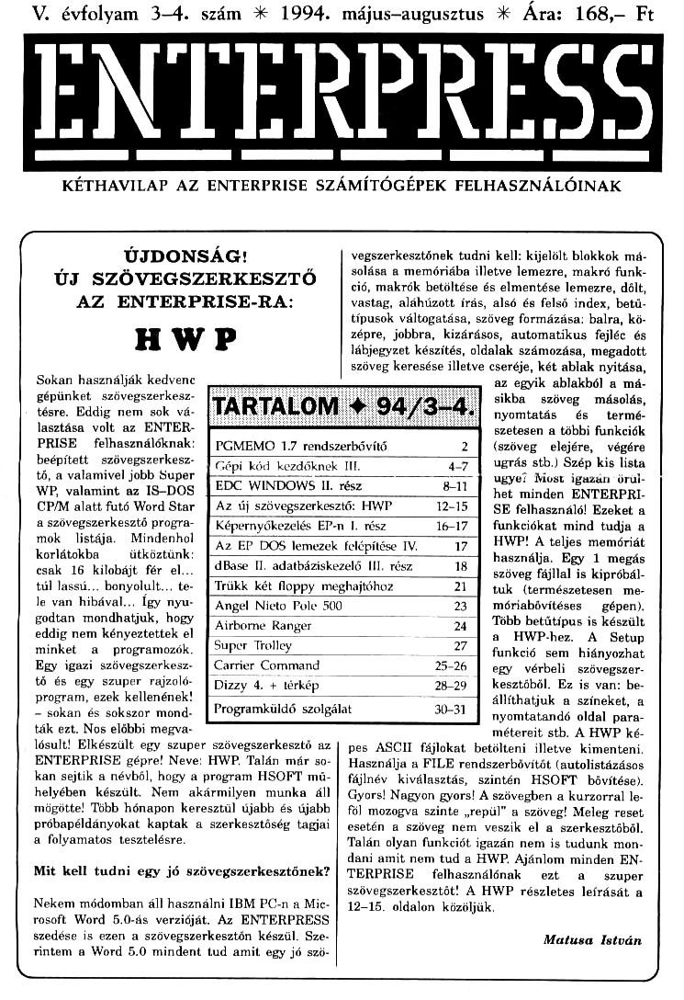

# Enterpress 1994/3-4 (1994.05-08)

[Оригінальний PDF](http://enterprise.iko.hu/magazines/Enterpress_1994-3-4.pdf) (угорською)

## Зміст

[Gépi kódú programozás kezdőknek III. rész](https://ep128.hu/Ep_Konyv/Enterpress_Gepikod.htm#b3)  
[Az Enterprise DOS lemezek felépítése IV.](https://ep128.hu/Ep_Konyv/Enterpress_Cikkek.htm#3a)  
[A dBASE II. adatbáziskezelő rendszer ismertetése III. rész.](https://ep128.hu/Ep_Konyv/Enterpress_Cikkek.htm#dbase)  

----

[Чернетка вмісту](1994-05-08/epress-1994-05-08.txt)
