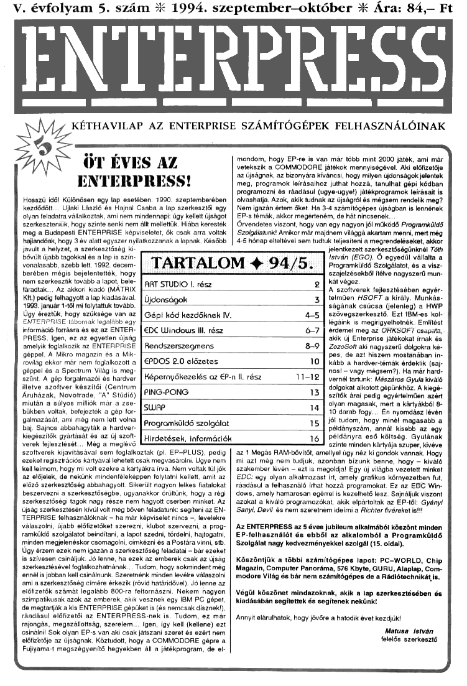

# Enterpress 1994/5 (1994.09-10)

[Оригінальний PDF](http://enterprise.iko.hu/magazines/Enterpress_1994-5.pdf) (угорською)

## Зміст

[Gépi kódú programozás kezdőknek IV. rész](https://ep128.hu/Ep_Konyv/Enterpress_Gepikod.htm#b4)  
[AZ ENTERPRISE rendszer-szegmens rögzített területének címei és azok funkciója](https://ep128.hu/Ep_Konyv/Enterpress_Cikkek.htm#5c)  

----

[Чернетка вмісту](1994-09-10/epress-1994-09-10.txt)
