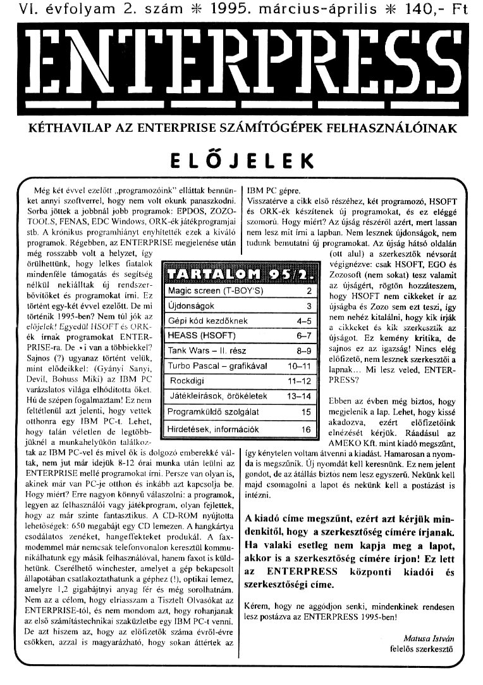

# Enterpress 1995/2 (1995.03-04)

[Оригінальний PDF](http://enterprise.iko.hu/magazines/Enterpress_1995-2.pdf) (угорською)

## Зміст

## Чернетка вмісту

"page-000.jpg" ------------------------------------------------------------ 
VI. évfolyam 2. szám k 1995. március-április 3 140,- Ft

ENTERKPKESS

KÉTHAVILAP AZ ENTERPRISE SZÁMÍTÓGÉPEK FELHASZNÁLÓINAK

ELŐJ

ELEK

( még két évvel ezelőtt ,programozóink" elláttak benniin-
ket annyi szoftverrel, hogy nem volt okunk panaszkodni.
Sorba jöttek a jobbnál jobb programok: EPDOS, ZOZO-
TOOLS, FENAS, EDC Windows, ORK-ék játékprogram

stb. A krónikus programhiányt enyhítették ezek a kíváló
programok, Régebben, az ENTERPRISE megjelenése után
még rosszabb volt a hel

IBM PC gépre. AN
Visszatérve a cikk első részéhez, két programozó, HSOFT
és ORK-ék készítenek új programokat, és ez eléggé
szomorú, Hogy miért? Az újság részéről azért, mert lassan
nem lesz mit írni a lapban. Nem lesznek újdonságok, nem
tudunk bemutatni új programokat, Az újság hátsó oldalán

(ott alul) a szerkesztők névsorát

örülhetünk, hogy lelkes végignézve: csak HSOFT, EGO és
mindenféle támogatás és s ARTA 0 Zozosoft (nem sokat) tesz valamit
nélkül . nekiálltak új . rendszer- az újságért, rögtön hozzáteszem,
bövítöket és programokat írni. Ez [Magic screen (T-BOY 5) 2 hogy HSOFT nem cikkeket ír az
történt egy-két évvel ezelőtt. De mi . [/ Újdonságok 3 [[ újságba és Zozo sem ezt teszi, így
történik 1995-ben? Nem túl jók az " GEN 4-5 I rem nehéz kitalálni, hogy kik írják
előjelek! Egyedül HSOFT és ORK- . [cép Kód kezdőkne S Ű a cikkeket és kik szerkesztik az
ék írnak programokat ENTER- [jHEASS (HSOFT) 6-7 ságot. Ez kemény kritika, de
PRISE-ra, De si van a többiekkel? [Tank Wars — II rész 8-9 ]Í ssinos ez az igazság! Nincs elég
Sajnos (?) ugyanaz történt velük, előfizető, nem lesznek szerkesztői a
mint elődeikkel: (Gyányi Sanyi, [/T4rbo Pascal — grafikával —— 10-11 lapnak... Mi lesz veled, ENTER-
Devil, Bohuss Miki) az IBM PC Í Rockdigi 11-12 [[ PRESS?
varázslatos világa elhódította öket. [———
Hú de szépen fogalmaztam! Ez nem . [/ Játékleírások, örökéletek 13-14 [Ebben az évben még biztos, hogy
feltétlenül azt jelenti, hogy vettek  [ Programküldő szolgálat 15 ]Í. megjelenik a lap. Lehet, hogy kissé
otthonra egy IBM PC-t. Lehet, akadozva, — ezért — előfizetőink
hogy talán véletlen de legtöbb- [/ Hirdetések, információk 16 [/ elnézését kérjük. Ráadásul az
—

jüknél a munkahelyükön találkoz:
tak az IBM PC-vel és mivel ők is dolgozó emberekké vál-
tak, nem jut már idejük 8-12 órai munka után leülni az
ENTERPRISE mellé programokat írni, Persze van olyan is,
akinek már van PC-je otthon és inkább azt kapcsolja be.
Hogy miért? Erre nagyon könnyű válaszolni: a programok,
legyen az felhasználói vagy játékprogram, olyan fejlettek,
hogy az már szinte fantasztikus, A CD-ROM nyújtotta
lehetőségek: 650 megabájt egy CD lemezen. A hangkártya
csodálatos zenéket, hangeffekteket produkál. A fax-
"modemmel már nemcsak telefonvonalon keresztül kommu-
nikálhatunk egy másik felhasználóval, hanem faxot is küld-
hetünk. Cserélhető winchester, amelyet a gép bekapcsolt
állapotában csatlakoztathatunk a géphez (1), optikai lemez,
amelyre 12 gigabájtnyi anyag fér és még sorolhatnám,
Nem az a célom, hogy elriasszam a Tisztelt Olvasókat az
ENTERPRISE-tól, és nem mondom azt, hogy rohanjanak
az első számítástechnikai szaküzletbe egy IBM PC-t venni.
De azt hiszem az, hogy az előfizetők száma évről-évre
csökken, azzal is magyarázható, hogy sokan áttértek az

AMEKO Kft. mint kiadó megszűnt,
így kénytelen voltam átvenni a kiadást. Hamarosan a nyom-
da is megszűnik. Új nyomdát kell keresnünk. Ez nem jelent
"gondot, de az átállás biztós nem lesz egyszerű. Nekünk kell
majd csomagolni a lapot és nekünk kell a postázást is
intézni.

A kiadó címe megszűnt, ezért azt kérjük min-
denkitől, hogy a szerkesztőség címére írjanak.
Ha valaki esetleg nem kapja meg a lapot,
akkor is a szerkesztőség címére írjon! Ez lett
az ENTERPRESS központi kiadói és
szerkesztőségi címe.

Kérem, hogy ne aggódjon senki, mindenkinek rendesen
lesz postázva az ENTERPRESS 1995-ben!

Matusa István
felelős szerkesztő

/

"page-001.jpg" ------------------------------------------------------------ 
2

1995. március-április

100 PROGRAM "scro0n00.bes".

feokázyetámműszámzeet

120 REM " Látványos effektekí"

430 REM " Charmcter-deíre, ."

erfeerfizáseersásszztsől

150 SET 281

180 TEXT CLEAR FONT

170 POKE 58.201-OUT 191.12:ET 4102:COLOR 1.0

180 SET CHARAGTER ORDC 1").2585

190 SET GHARACTER ORD("27).256.265

1200 SET CHARACTER ORDK-31).255.255.255.

210 SET CHARACTER ORDI-4).255.255.255.255

1220 SET CHARACTER ORDK"§).256.255.255,
255255

130 SET CHARACTER ORDI"6").255,265.256.266.,

256256

240 SET CHARACTER OROK "7").256,255.255.255,
1255.255.255

150 SET CHÁRACTER ORDT"8").256,256.255.255,
1255.255.256.255

1280 SET CHARACTER ORD("9").286,255.285.255,
1255.256.255.255.255.

310 NEXT

320. PRINT VIOZAT 19(-ORDTOJJTZ AS:

530. PRINT S102AT(-ORDCOTJ"2 AS;

40 NEXT

350 FOR It TO 24

360. DISPLAY OZAT ! FROM 24 TO 24

370 NEXT

380 SET $102COLOR 1.REEN-POKE 58.246.

390 FOR ie! TO 18

400. DISPLAY $OZ-AT 28-I FROM 1 TOT

410 NEXT

420FOR It TO 9

430. DISPLAY OZAT 10. FROM 1 TŐ 16

440 NEXT

450 FOR ist TO 18

460. DISPLAY 8102-AT 1 FROM TO 18

470 NEXT

480 FOR ist TO 19

490. DISPLAY 9102-AT 26-I FROM 1 TOT

500 NEXT

S10FORI1TOB

520. DISPLAY 9102-AT 9-1 FROM 1 TO 20

530 NEXT

540 FOR Is TO 20

550. DISPLAY 802-AT 1 FROM TO 20

560 NEXT

570 CLEAR TEXTDISPLAY TEXT:CLEAR FONT

580 SET CHARACTER 32.255.

90 SET CHARACTER 32.255.256

600 SET CHARACTER 32.255.255.255

610 SET CHARACTER 32.255.255.255.255.

620 SET CHARACTER 32.255.256.255.255.255.

630 SET CHARACTER 32.255.256.255.255.255.255.

40 SET CHARACTER 32.256.256.255.255,
255.255.255

1650 SET CHARACTER 32.255.255.265.265.255,
255.255.255

1680. SET CHARACTER 32.255.255.265.255.256,256,
256.255.255

870 SET CHARACTER 32.0,255.255,255,256.255,
256.255.255

680 SET CHARACTER 32.0,0,255.256.256.255,
1255.255.255

1650 SET CHARACTER 32.0.0.0.255.255.255,

256.255.255
720 SET CHARACTER 32.0.0.0.0.0.0,255.255.255.
730 SET CHARACTER 32.040.0.00.0.0.255.255
740 SET CHARACTER 32.

750 SET CHARACTER 32.0
760 SET CHARACTER 32.255.
770 SET CHARACTER 32.0.255

780 SET CHARACTER 32.255.0.255

700 SET CHARACTER 32.0.255.0.256

00 SET CHARACTER 32.255.0.255.0.255

810 SET CHARACTER 32.0.255.0.255.0,255
820 SET CHARACTER 32.255.0.255,0,255,0.255.

MAGIC SCREEN

830 FOR e! TO 10

40. SET CHARAGTER 32.0.255.0.255.0.266.0.255.

50. SET CHARACTER 32.255.0,255.0.255,
10.255.0.258

860 NEXT

70 SET CHARACTER 32.

880 SET CHARAGTER 32.

890 SET CHARACTER 32.

5900 SET CHARACTER 32.

910 SET CHARACTER 32.

§20 SET CHARACTER 32.0.0.040;

530 SET CHARACTER 32.0.0.0.

40 SET CHARACTER 32.

950 FOR Is! TO 10

960. SET CHARACTER 32.0.0.0.0.00012864

970. SET CHARACTER 32.0.0.0.0.0.0,128.84,32

980. SET CHARACTER 32.0.0.0.0.0,128.84.52/16

950 SET CHARACTER 32.0.0.0.0,128.84.32.18.8.

1000 SET CHARACTER 32.0.0.0.12884.32.16.844

1010. SET CHARACTER 32.0.0128.64.32.16.8.4.2

1020. SET CHARACTER 32.0,128.84.32.16.842.1

1030. SET CHARAGTER 32.128.84.32.18.8.4.21

1040. SET CHARACTER 32.84.32.18.54.21

1050. SET CHARACTER 32.32.16.84.21

1060. SET CHARACTER 32.16.84.2.1

1070. SET CHARACTER 328421

1080. SET CHARACTER 32.4.21

1090 SET CHARACTER 32121

1100. SET CHARAGTER 32.1

4110 SET CHARACTER 320

1120 NEXT

1130 FOR Iz1 TO 10

1140 SET CHARACTER 32.255.0.0,0.255.0.0.0.256

1150. SET CHARAGTER 32.255.255.0.0.255,
1255.0.0255

-SET CHARAGTER 32.286.256.256.0.256.

255.255.0.255

SET CHARACTER 32.256.255,256.255.256,

1255.256.256.255

SET CHARACTER 32.0.255.255.256,

0.255.255.256.255.

SET CHARACTER 32.0,0.255.255.0,

0.255.255.255

1200. SET CHARACTER 32.0,0,0.255.0,0.0.255.256.

1210 SET CHARACTER 32.0.0.0.0.0.0.

1220 NEXT

ÍZ30FORI1TO 4

1240. SET CHARACTER 32128

1250. SET CHARACTER 3284

1260 SET CHARAGTER 32.32

1270. SET CHARACTER 32.16

1280. SET CHARACTER 328

1290. SET GHARACTER 324

1300. SET CHARACTER 322

1310. SET CHARACTER 321

1320. SET CHARACTER 32.01

1330. SET CHARACTER 32.0.0.1

1340. SET CHARACTER 32.0.0.0,1

1350. SET CHARAGTER 32.0.0.0.04

1360. SET CHARACTER 32.0.0.0.0041

1370. SET CHARACTER 32.0.0.0.0.0.0.1

1380 00.

1390

1400

1410

1420

1430

1440

1450

1480

1470

1480

1490

1500

1510

1520

1530

1160
1170
180
1180

SET CHARACTER 32.0.128
1540 NEXT

1550 SET CHARACTER 32.128
1560 SET CHARACTER 32.192
1570 SET CHARACTER 32.224

1580 SET CHARACTER 32.240
1590 SET CHARACTER 22.248
1800 SET CHARACTER 32.252
1810 SET CHARACTER 32.254
1820 SET CHARACTER 32.255
1830 SET CHARAGTER 32.255.1
1840 SET CHARAGTER 32.255.1.1
a

144259

1780 SET CHARACTER 32.256.1,
1411.256

1790 SET CHARACTER 32.256.1.1.1.1,
1.11292255

1800 SET CHARACTER 32.256.1.1.1.1.1.
1,129.255.

1810 SET CHARACTER 32.255.1,
1129.129.255

14.

1820 SET CHARACTER 32.256.1,1.1.1.129,
129.120.255

1830 SET CHARACTER 32.256.1,1,1.129.129,
120.129.255

1840 SET CHARAGTER 32.256,1,1,129,120,
129.129.120.255

1860 SET CHARAGTER 32.255.1,129.129129,
129.129.129.255

1880 SET CHARACTER 32.255,129,120.120,
129.129.129. 120255.

"1670 SET CHARACTER 32.258,193.120.120,

—— 129.129.129.128.255

TÖs0 SET CHARAGTER 32.255.225,126.129,
129.129129,120.255

1890 SET CHARACTER 32.256 241,128.120,
129,129.129.129.255

1900 SET CHARAGTER 32.255.249.126.129,
129.129.129.129.255

1910 SET CHARACTER 32.255.253,129.12
129.120.129,129.255

1920 SET CHARACTER 32.255.252.128.129.
129.129.129.129.255

1930 SET CHARAGTER 32,255,255,129.129.
129,129.129.129.256

1640 SET CHARACTER 32.256.255,131,129,
129,129.129.129.255

1950 SET CHARACTER 32.256.255.131.1a,
129.129.129.129.255

1960 SET CHARACTER 32.255,255,131.131,
131129.120.129.255

1970 SET CHARACTER 32.265,256,131.131.,
131.134.128,129.255

1980 SET CHARAGTER 32.258,256,131,131,
131,131.131.120.255

1990 SET CHARACTER 32.255,255,131,131,
131,131,131,131.255.

12000 SET CHARACTER 32,265,256,131,131,
181151131.135.255

2010 SET CHARAGTER 32,255,256,131.131.
131,131.131,143.256

72020 SET CHARACTER 32,255.256.131,131,
181,151,131,169256

12030 SET CHARACTER 32.255.256.131,191,
131.131.131.191.255

2040 SET CHARACTER 32,255.255.131.191,
131/191131.255.255

12050 SET CHARACTER 32.255.256.131,131,
131.131.195.255.255

12060 SET CHARACTER 32.255,256.191,191,
131/195.195.255.255

2070 SET CHARACTER 32.255.265.131,131.,
195.195.195.255.255

12080 SET CHARACTER 32.255.255.131,195,
195,195.195.255.255

12090 SET CHARACTER 32.255.255,195,195,
195,195.195.255.255.

"page-002.jpg" ------------------------------------------------------------ 
1995. március-április

3

100 SET CHARACTER 32.255.255.227,195,198,195,195.255.255.
2110 SET CHARAGTER 32.255.255.243.195.195.195,195.256,255.
12120 SET CHARAGTER 32.255.255.251,195,198,195,195,255.255
2130 SET CHARACTER 32.255.255.255. 191

2140 SET CHARACTER 32.255.255.255,199,
2150 SET CHARACTER 32.255.255.255,199,
2160 SET CHARACTER 32.255.255.255,199,199,199,195.255.255
2170 SET CHARAGTER 32.255.256.255,199,199,199,199,255.255
2180 SET CHARAGTER 32.255.256.255,199,199,199.207.,255.255
2190 SET CHARACTER 32.255.256.256,199,199,199.223,255.255
12200 SET CHARACTER 32.255.255.255,199,199,199.255.255.255.
2210 SET CHARACTER 32.255.255.256,199,198.231.255.255.255.
12220 SET CHARACTER 32.255.255.256,199.231.231.255.255.255.
12230 SET CHARAGTER 32.255.255,256.231231.231.255.255.255.
12240 SET CHARACTER 32.255.255.255.247.231.231.255.255.255.
12250 SET CHARACTER 32.255.255.255.255.231231255.255.255.
2260 SET CHARACTER 32.255.255.256.255.239.231.255.255.255
2270 SET CHARACTER 32.255.255.255.255.238.239.255.255.255.
12280 SET CHARACTER 32.255.255.255,255.239.255.255.255.255.
12290 SET CHARACTER 32.255,255.255,255,255.255.256.256.255.
2300 RUN.

TOP.LISTA JÁTÉK

Szeretnénk, ha a Tisztelt olvasók egy játékban ven-
nének részt az Enterpress-el. A TOP-LISTA
szavazólapjai vesznek részt majd ebben a játékban.
Az év végi sorsoláson azok a TOP-LISTA
szavazólapok vesznek majd részt, amelyek az 1995.
március 20. és 1995. december 10-e között
érkeznek be szerkesztőségünk címére.

Idén decemberben

10 értékes nyereményt

sorsolunk ki. Mindenki csak 1 szavazócédulával
vehet részt a sorsoláson! A nyeremények listáját
szeptember-októberi számunkban közöljük.

Jó szórakozást és sok szerencsét kívánunk!

a szerkesztőség.

A  programküldő — előző
listájától lemaradt a Rex 2.
című — játék — kódja;
8985809184889508

Többen érdeklődtek a
kazettás ——— felhasználók
köréből a RockDigi iránt.
EGO elővette a csavarhúzót
és a kalapácsot majd
belemélyedt a programozás
rejtelmeibe. Másnapra
megszületett a Nagy mű.
Tehát mostantól a RockDigi
kazettán is megrendelhető.

A szerzői jogi problémák elkerülése végett azt kérjük
azoktól akik a HWP frissítését kérik, hogy ezt ott
tegyék, ahol egyébként eredetileg azt megrendelték.
Vagyis aki Hsoft-nál vette az hozzá, aki a
Programküldőtől az most is a oda forduljon ez ügyben.

Hsoft elkészítette az EPDOS 2.1-et, amelyben
kijavításra került néhány problémás része az előző ver-
Ziónak. Hála a felhasználók visszajelzéseinek.

Bár előző számunkban úgy jelent meg a hír mintha már
készen lenne a Minibank 2.0, sajnos ez így nem igaz.
Tehát akkor pontosítva: Hsoft erőltetett menetben dol-
gozik a Minibank 2.0-ás verzióján amely már most nagy
érdeklődést váltott ki a felhasználók köréből.
Természetesen ahogy elkészül azonnal megjelenik a
Programküldő listáján.

Elkészült egy klasszikus játéknak a Tetris-nek egy
na-gyon jól kidolgozott és kiválóan játszható formája is.
Ez a játék nem konverzió, hanem eredeti Enterprise-ra
írt program, mely remekül kihasználja gépünk adottsá-
gait A szerzőt majdnem elfelejtettem: Hsoft.

IBM PC-k javítása, bővítése,
tartozékok, illesztőkártyák,
perifériák
nagy választékban.

EPROM, MIKROCONTROLLER

Az egészség
csatornája
a kábeltévéken

A Szív tv műsora az ország számos helyi
és körzeti kábelhálózatán látható,
több mint egymillió lakásban.

Szózakoztatáa, félmek, inganmáció,

A Szív tv postacíme: 1656 Budapest, Pf. 6.
Telefon: 256-6136 (fax is), 257-1270

"page-003.jpg" ------------------------------------------------------------ 
1995. március-április

A nagyobb, valamilyen rendszert alkotó programok
rendszerbővítőként kapcsolódnak az ENTERPRISE
operációs rendszeréhez. Ilyen a gépbe csatlakozta-
tott BASIC, valamint minden EPROM-ba égetett prog-
ram, de ilyen a kazettáról vagy lemezről betöltött
PASCAL vagy ASMON program is.

A rendszerbővítők két csoportba sorolhatók:

Az EXOS rendszerbővítőként kezeli az inicializálás
során a ROM-könyvtárba felvett szegmenseket: az
EXOS ROM szöveggel kezdődő ROM-okat és az 1
szegmenst. A ROM-szegmensek táblázatába mi is
beláncolhatunk egy általunk használt szegmenst és
saját bővitőnket is.

A másik típust a RAM-ban lévő rendszerbővítők
alkotják, amelyeket egy bővítőláncban tart nyilván az
EXOS. Ide a külső adathordozókról beolvasott rend-
szerbővítők kerülnek.

AROM-bővítőket és az abszolút rendszerbővítőket a
3. lapon a COOAH belépési cimen hívja az EXOS-

Az ENTERPRISE egyik nagyon jó tulajdonsága a
rendszerbővítő. Különösen az EPROM-ba égetett
programokra gondolok, Sok programot tehetünk így
rezidenssé, és nem kell ezeket mindig újra és újra
betölteni. Ez természetesen azoknak nagy előny
akiknek még nincs floppy-meghajtójuk, de akinek van,
annak is kényelmi szempont. Ha az ezzel kapcsolatos
hardver választékot nézzük, akkor nagyon hasznos
Mészáros Gyula 6 EPROM-helyes (egészen helyes)
kártyája. Ennek a legújabb változata az SRAM kártya
(ez is 6 férőhelyes). Ide akár statikus RAM-ot, vagy
EPROM-ot is elhelyezhetünk. Ebbe a kártyába akár 6
db 27 512-es EPROM-ot (64 kb) is tehetünk,
Pillanatnyilag nincs ENTERPRISE-ra annyi rendszer-
bővítő, hogy ezt maximálisan kihasználhatnánk. A bal

oldali cartridge-be összesen 64 Kb (2x32) programot
tehetünk (ebből 16 Kb a BASIC. Ezt úgy is megold-
hatjuk, hogy beszerzünk egy 3 foglalatos kártyát és
egy kapcsoló segítségével két 32 K-s EPROM között
kapcsolgatunk (természetesen a számítógép kikap-
csolt állapotában).

Rendszerbővítönk elég egyszerű, nem akartuk túlbo-
nyolítani, Bővítőnket a 3. lapon a COOAH címen kezd-
jük, A C az úgynevezett akciókód. Ez a vezérlés
különböző értékeinél különböző programpontokra
kerül,

A CIM címkénél található a HELP. szövegünk. Ha
kiadjuk majd a :HELP parancsot, akkor megjelenik a
képernyőn az "EPS version 1.0" szöveg a többi rend-
szerbővítővel együtt.

Mögötte található az TELSŐ RENDSZERBŐVÍTÖNK"
szöveg, amelyet úgy írathatunk ki, hogy kiadjuk a
HELP EPS parancsot, részletes információt kérve a
rendszerbővítönkről.

A programban van egy vizsgáló rutin-is-(VIZSGAL
cimke). Ennek a funkciója: ha a :EPS parancs lett
kiadva, akkor végrehajtja az SZ2 címkenevet, ahol a
szövegünk van. Kiírja a képernyőre egysoros
üzenetünket: "IDE KERÜL A PROGRAM". Ha más
parancs érkezett, pl. egy hibás, akkor hibaüzenetet
küld.

Természetesen ezt a részt behelyettesíthetjük saját
programjainkkal is. Programunkat, mivel ez egy rend-
szerbővítő, most másképp kell lefordítanunk az
ASMONNAL, Mivel még nem rendelkezek a HEASS
legújabb végleges verziójával, így maradjunk az
ASMON-nál. Visszajelzéseket kaptam arról, hogy
csak egy-két ember vásárolta meg a HEASS-t a
Programküldő Szolgálattól. Mit gondolhat HSOFT
most? Természetesen azt, hogy irt egy szuper
ASSEMELER-EDÍTOR programot (saját magának).

Fizessen elő a

JÁDIÓTECKNIKA ea DgfÜ0é

folyóiratokra! Így biztosan hozzájut!
Címünk: 1374 Budapest, Pf. 603.

A szerkesztőségben regisztrált HE előfizetőknek díjmentes nyák-film melléklet.

"page-004.jpg" ------------------------------------------------------------ 
1995. március-április

Talán ez bizonyítja a legjobban, hogy nincs érdek-
lődés az ENTERPRISE iránt!

Ez akár a vezércikkben is szerepelhetett volna, de ott
már nem volt elég hely.

A program fordításához szükséges beállítások:
Miután begépeltük a programiistát, lépjünk ki F8-al az
ASMON edítorából. Nyomjuk meg a Z billentyűt és
állítsuk be a fordításhoz szükséges paramétereket:

Assembly Listing: ON
List Conditions NO

Force Pass 2 NO

Memory Assembly NO
Object file name: EPS.EXT
EXOS module header YES
EXOS module type: 6

Az opciók beállítása után nyomjuk meg az A billen-
tyűt. Elkészítettük első rendszerbővítőnket, amelyet
betölt-hetünk akár BASIC-ből is a LDAD "EPS.EXT"
paranccsal. Miután betöltöttük, gyöződjünk meg arról,
hogy sikerült-e beláncolnia az EXOS-nak, adjuk ki a
:HELP parancsot. Ha a lista elején megjelenik az
"EPS version 1.0" üzenet, akkor sikerült minden.
Utána adjuk ki a :HELP EPS parancsot, amellyel
bővebb információhoz juthatunk a rendszerbővítőről.
Ha a :EPS parancsot adjuk ki, akkor végrehajtódik
egy kis program, amely jelen esetben letörli a
képernyőt és utána kiír egy sort. Ez, mint említettem,
lehet a saját programunk is. Ha saját programot
szeretnénk ennek helyére, akkor az LD A.255 sornál
kezdhetjük programunkat. Ne felejtsük el a program
végére írni a XOR A és az LD C A sorokat és persze
utána a RET-et. Jó kísérletezést kívánok, remélem
mindenki örül majd első rendszerbővítőjének, és
bízom benne, hogy saját rendszerbővítőkkel
gazdagítják majd programjaikat.

Matusa István

ORG OCOOAH . ; belépési cím
LDAC ;
cP3 §

(EPS)
JR NZ.CIMt
LDAB
ORA
LDALOWH1
JR Z,CIM
CALL VIZSGAL
RETNZ
LD ALLOW H2
LDC0
CIM EXX
LDCA
LDB,0
LD A 255
LD DE,SZ3
EXOS 8
XORA
EXX
RET
sza DB"EPS version 1.0"10,13
Hi EGU §$-sz3
DB "ELSO
RENDSZERBOVI-
TONK",10,13,13,10
H2 EGU §-SZ3
CIM1 CP2
RET NZ
CALL VIZSGAL
RET NZ
LD A 255
LD DEEPS
EXOS 8

; csatorna megnyitás
; szöveg kezdőcíme
; blokk írása (HELP)

; a programunk
; kezdete (ami
; most egy sor
kiírása)
XORA A
LDCA ; akciókód vissza
RET
sz2 DB 3/EPS"
VIZSGAL — PUSH DE
PUSH BC
LDAB
INC B
LD HL,SZ2
CP (HL)
JR NZ.NEMSTIM
INC DE
INC HL
LDA(DE)
DJNZ FOLYT
POP BC
POP DE
RET
DB 26
DB 20/IDE KERULA
PROGRANT,

; regiszterek
; a verembe

FOLYT

NEMSTIM

EPS

END
"page-005.jpg" ------------------------------------------------------------ 
MERL55

1995. március-április

AD BC(3200) AND 12

Előző számunkban közöltünk a HEASS-ról egy rövid
áttekintést, valamint az EDITOR rész leírását. Ebben a
számban az ASSEMBLE-ról adunk tájékoztatási
kiemelve olyan tulajdonságait amelyek az eddig forg:
lomban lévő assemblerekre nem jellemzőek.

ASSEMBLE

SZIMBÓLUMOK:

Szimbólumokkal a belépések helyét illetve EOU-val
megadott értékeket tároljuk. A sor kezdőpozícióján kell
megadni. Az első karakter csak betű lehet, vagyis
CHRS(63)-nál nagyobb. A további karakterek vegyesen
tartalmazhatnak számokat és betüket. A fordító minden
Szóműveletnél nagybetűsítést végez az angol karak-
terekkel. A szimbólumok végére nem kötelező kettöspon-
tot tenni, viszont ez segíthet egy címke keresésében.
(FIND) A szimbólumok hossza nincs korlátozva, ter-
mészetesen 1 soron belül, de célszerű 16 karakternél
kevesebbet használni. A szimbólum-tábla alapmérete 1
szegmens. Ennél nagyobb méretet a WORKSEGMENS
Paranccsal definiálhatunk. A fordítás kezdetekor a PASS
értéke nulla. Amikor a forrásban nincs PASS parancs
akkor két menetes fordítás után a fordító befejezi a
munkát. Lehetőség van arra is, hogy újabb fordítást kér-
jünk az aktuális PASS-t követően. A program a szím-
bólumtábla inicializálásakor ill. a WORKSEGMENS
Parancs végrehajtásakor deklarál egy PASS. VAR nevű 16
bites változót, melynek átadja a pillanatnyi PASS értéket,
A kezdőértéke tehát nulla. A PASS paranccsal
kezdeményezett újabb fordítás esetén már az újabb értéket
kapja meg. A PASS funkció olyan sorozat fordításra
készült, amikor különböző object névvel, több féle prog-
ramváltozatot szeretnénk egy lépésben lefordítani.

MNEMONIKOK:
A parancsszavak nagy része a Z80 utasításait tartalmazza.
A töbt Pszeudó mnemonik, a fordítót vezérlik.
Vannak parancsok melyek a kompatibilitás miatt több
alakban is szerepelnek és azonos értelműek. MACRO
definiálásra csak az ettől eltérő szavakat célszerű használ-
ni. A parancsszavak szintaktikájára érvényesek a szim-
bőlumoknál leírtak. Kivéve, hogy egyes parancsokat a
kompatibilitás érdekében vezető ponttal és pont nélkül is
megadhatunk. A parancsokat a sorkezdéstől legkevesebb
egy karakterrel beljebb kell kezdeni. A parancsot az
operandustól szóköz választja el.

OPERANDUSOK:
Több operandus használata esetén vesszövel kell tagolni.
Az operandusok lehetnek regiszterek, kifejezések,
Sztringfüzérek. A kettöspont után a sor további részén
megjegyzéseket írhatunk.

LDAC
PUSH BC
AND 12.

LD BC(3200)

k 591"

(63200)

Aj

REGISZTEREK:

8 BITES REGISZTEREK: A, B, C, D, E, F. HI, L.R, XH,
XL, YH, YL
16 BITES REGISZTEREK: AF, BC, DE, HL, IX, IY, SP
SZTRINGFŰZÉREK:
Az idézőjelbe zárt karakter sorozat. Használható a 128
feletti ASC-kód, így az ékezetes betű is lefordítható.
KIFEJEZÉSEK:
A kifejezések operandusokból és operátorokból állhatnak.
A műveletet a fordító a matematika szabályai szerint bal-
ról jobbra, a prioritás és zárójelek figyelembevételével
végzi.
A FORDÍTÓ PSZEUDO ÉS KÜLÖNLEGES
PARANCSAI:
WORKSEGMENS kif - Megadja a szimbólumtábla szeg-
menseinek számát, Az alapérték 1, melyet maximum 3-ra
lehet növelni. Törli az eddig deklarált szimbólumukat, de
újra felveszi a PASS. VAR nevű változót, hozzárendelve
nullát, illetve a PASS-szal megadott újabb értéket.
PASS kif — Hatására a program a fordítás végeztével újabb
fordítást végez.
kifejezés értéke a fordítás újraindulásánál a PASS. VAR
nevű szimbólumba íródik, s így IF-ek segítségével
vezérelni lehet a fordítót, A többi változót ugyanis törli az
assemble ismételt indítása.
ORG kif — Beállítja az utasításszámláló értékét, valamint
nullázza a PHASE ofsettároló pillanatnyilag olvasható
értékét. A két 16 bites regiszter összege adja az aktuális
címszámláló eredményt.($) Adott forrásban, amikor nincs
Szükség a címszámláló folytonosságának
megőrzésére, megengedett a több helyen kiadott ORG
Parancs.
OBJECT név — Megadja az object-fájl nevét. Ide íródik a
lefordított kód
HEADER kif — Megadja a modul típusát. A fordító az
object-fájlra ilyenkor elsőnek egy 16 bájtos fejrészt küld,
mely a modulszámot és a modulméretet tartalmazza. A
számtól függetlenül csak abszolút formát kezel. Az áthe-
lyezhető fájl GEN-re konvertálva, a GEN-nel fordítható.
VAR kifnév - A FENAS modul és object-név parancsa. A
modulszám felső 2 bítjét törli, mivel a FENAS-ban más
információt hordoz. (javasolt helyette a HEADER és
OBJECT)
EOU kif - Értéket ad a szimbólumnak. Ismételt szim-
bólumnév esetén hibajelzést küld. Használható helyette az
is.
LEN cimkesstr — Új értéket ad egy létező szit
Az értéket a sztring hossza szolgáltatja.
DM idézőjelbe tett sztringfüzéreket definiál. Vesszövel
elválasztva több is megadható.
DW - 16 bites kifejezés. Vesszövel több is megadható.
DB- 8 bites kifejezés vagy sztringfüzér, Vesszövel több is.

"page-006.jpg" ------------------------------------------------------------ 
1995. március-április

7

megadható.
DBR - A DB végrehajtása úgy, hogy a 7. bitet minden
bájtnál törli. Alkalmazható pl. a videólapok direkt
írásánál.

DBS- ADB végrehajtása úgy, hogy a 7. bitet minden bájt-
nál beállítja. Alkalmazható pl. a videólapok direkt
írásánál.

DBL- ADB végrehajtása úgy, hogy a kiszámolt hosszbáj-
tot a sztring elé helyezi. Alkalmazható pl. fájlneveknél,
EXOS-parancsoknál.

DC - A DB és DW végrehajtása úgy, hogy a 8 bitnél na-
gyobb kifejezések 16 biten tárolódnak. Sztring tárolására
nem alkalmas.

Ds - A kifejezés által megadott terület nullázva lesz.

DF - Az első kifejezés megadja azt a ciklusszámot, hogy a
DB rutin hányszor értékelje a sor további részét.

DP2 - Pixel terület megadása 2 színű videómódra. A sor-
ban csak 0-át vagy 1-est használhatunk. A bájtok számát a
megadott bitek adják. A befejezetlen bájt további része
mullával lesz feltöltve, Alkalmas kissebb ikonok
készítésére a grafikus videólapokon. 1 bájtba 8 pixel
tehető.

DP4 - Pixel terület megadása 4 színű videómódra. A sor-
ban csak 0-3 számokat használhatunk. A bájtok számát a
megadott pixelek adják. A befejezetlen bájt további része
nullával lesz feltöltve. Alkalmas kissebb ikonok
készítésére a grafikus videólapokon. 1 bájtba 4 pixel

tehető.
DPI6 - Pixel terület megadása 16 színű videómódra. A
Sorban csak 0-F hexa számokat használhatunk. A bájtok
Számát a megadott pixelek adják. A befejezetlen bájt
további része nullával lesz feltöltve. Alkalmas kissebb
ikonok készítésére a grafikus videólapokon.

1 bájtba 2 pixel tehető.

MERGE név — Beilleszti az objectbe a megadott nevű
adatfájlt. Az első menet alatt nem olvassa be, csak a
fájlméretet kéri le. Ehhez kötelezően DISK-egységre van
Szükség. A másolás az object készítésnél is alkalmazott,
16 kilobájtos csomagokban történik.

PRINTXI — Első menetben végrehajtja a PRINTX paran-
csot.

PRINTXZ — Második menetben végrehajtja a PRINTX
Parancsot.

PRINTX — Kiírja a sorban lévő szöveget. W esetén hexa-
decimálisan, 96 pedig decimálisan kiírja a kifejezést,
Vesszöt alkalmazva egy sorban több adatot is kiírathatunk.
COMMENT kar - Megkeresi a szövegben azt a sort
amelynek első karaktere azonos a megadottal és a
következő soron folytatja a fordítást, Használatát kerüljük
a MACRO blokkon belül, ill. itt ne használjunk az ENDM
Szót azért, hogy az ENDM keresését nehogy elrontsuk a
macro definició átugrásánál.

BLOKKVERMET IGÉNYLŐ PARANCSOK:

A fordító az INCLUDE, FOR-NEXT, IF-ENDIF, MACRO-
ENDM, PHASE-DEPHASE blokkok hívásához közös ver-
met használ. A hívások lehetséges mélységét tehát a már
megnyitott blokkok csökkentik. A 1.0-ás verziónál kb. 525
bájtos verem található. A blokkok memória igénye eltérő.
Az IF-2 bájt, PHASE-3, INCLUDE-4,
MACRO-13 valamint a hívó sor dekódolt
amikor egy macro paraméterekkel hív egy

Amikor megtelik a verem, a fordítás hibaüzenettel leáll. A
blokkok használatára jellemző, hogy először azt a blokkot
kell lezárni amelyiket utoljára nyitottunk meg. Ellenkező
esetben a fordítás hibaüzenettel leáll.

PHASE kif — A megadott értékből kivonja a futásszám-
lálót (ORG), és ezzel a különbséggel helyettesíti az előző-
leg blokkverembe mentett ofsettároló pillanatnyi értékét.
DEPHASE -— Visszaadja veremből az ofsettárolónak a
PHASE utasítás előtt használt értéket.

FOR kif - A kifejezéssel megadott ciklusszámban végre-
hajtja a FOR és NEXT sor által közrefogott blokkot.
NEXT - AFOR ciklus lezáró parancsa.

Az IF parancs blokkverembe menti a fordításkapcsoló pil-
lanatnyi értékét, majd a kiértékelés alapján új értékkel
tölti fel. A FALSE fordítás letiltja a mélyebben megnyitott
1F-eket az eredményüktől függetlenül.

IF kif — Tovább fordit ha igaz vagy nem nulla a kifejezés
IFT kif — Tovább fordít ha igaz vagy nem nulla a kife-
jezés.

IFF kif - Tovább fordít ha hamis vagy nulla a kifejezés.
IFI — Tovább fordít az első fordítási menetben.

IFI — Tovább fordít a második fordítási menetben.

ELSE - Átváltja a fordításkapcsolót a pillanatnyi mélysé-
gen. Nem kötelező a használata, valamint többször is ki
ható.

ENDIF - Lezárja a pillanatnyi mélységű megnyitott IF-
blokkot. A veremből előkerül a fordításkapcsoló IF előtti
értéke.

INCLUDE - Hozzáfordítja az objecthez a megadott nevű
HEASS-forrásszöveget.

A fájlt a fordító az első menet alatt a memóriába olvassa
És ott tárolja a fordítás mindkét menete alatt. Egy alka.
lommal történik a beolvasás akkor is, ha ugyanazon nevű
fájlt többször is includoljuk. Szöveg végét követően vagy
END parancsra az INCLUDE-t kiadó sor alatt folytatja a
fordítást. A pillanatnyilag a memóriában tárolt include
fájlok nevének és szegmensének tárolására külön 699.báj-
tos puffer áll rendelkezésre. A fordítás végeztével az
inchude-szegmensek felszabadításra kerülnek.

END - A szövegmutatót áthelyezi az aktuális forrás
végére. INCLUDE esetén visszatér az előző meghívó for-
ráshoz. Az END használata nem kötelező. A visszatérés
cimét a blokk-veremből olvassa ki. Amikor eltérő blokk-
tipust talál, tes Lezáratlan blokk. hibaüzenettel leállítja a
fordítást,

MACRO - MACRO definiálás. A MACRO-blokk ekkor
figyelmen kívül marad, de a neve és címe el lesz tárolva.
A definiálás előtt nem lehet a MACRO-t meghívni, A
MACRO parancs sorában járulékos paraméternevek is
lehetnek. Amikor a fordító a blokk sorában ilyen nevű
öperandust talál, kicseréli a hívó sorból származó
paraméterre. Ezek a szavak tehát a prioritásban elsödlege.
sek lesznek, A macro definícióban lehet másik macro-t
hívni, de nem lehet definiálni.

ENDM - A MACRO blokk lezárása. A blokk ekkor még
nincs lefordítva, viszont eltárolta a MACRO-nevet. Erre
késöbb mint új parancsszóra lehet hivatkozni. A MACRO-
ból meghívható másik MACRO is.

-EGO—
"page-007.jpg" ------------------------------------------------------------ 
1995. március-április

1580 CLEAR TEXT
1590 LET LEP-2
1600 CLEAR 1
1610 CLEAR 42
1620 GOTO 500
1630 DEF TEREP

1640
1650
1660
1670
1680
1690
1700
1710
1720
1730
1740
1750
1760
1770
1780
1790
1800
1810
1820
1830
1840
1850
1860
1870
1880
1890
1900
1910
1920
1930
1940
1950
1960
1970
1980
1990
2000
2010
2020
2030
2040
2050

SET 04
LET PX-0-LET HV50:LET PY-RND(400)4
PLOT 41:PX.PY;
PLOT $2:PX,PY;
LET HV-RND(2)
IF HV50 THEN
FOR FR-1 TO RND(5)1
LET PYzPY-RND(30)
IF PY.s4 THEN LET PY-4
LET PXzPX:RND(40)110
IF PX21279 THEN LET PX-1279
PLOT tH:PX,PY;
PLOT 42:PX,PY;
NEXT
END IF
IF HVz1 THEN
FOR FR51 TO RND(5)-1
LET PYzPY:RND(30)
IF PY2500 THEN LET PY-500
LET PX-PX:RND(40)-10
IF PX21279 THEN LET PX-1279
PLOT $1:PX.PY;
PLOT $2:PX.PY;
IF PX:1279 THEN EXIT FOR
NEXT
END IF
IF PXsS1279 THEN GOTO 1680
SET t1:BEAM OFF
SET 42:BEAM OFF
PLOT $1:0,0,PAINT
PLOT $2:0,0,PAINT
SET tt1:INK 2
SET 42:INK 2
LET MX(1)-RND(500)-30
FOR MH-1 TO 719 STEP 4
LOOK $1,AT MX(1).MH:JJ
IF JJz0 THEN EXIT FOR
NEXT
LET MY(1)-MH
PLOT $1:MX(1).,MY(1),ELLIPSE 16,2.PAINT
PLOT $2:MX(1),MY(1) ELLIPSE 16,2.PAINT
LET MX(2j-RND(1000-MX(1))HMX(1)-200

2060
2070
2080
2090
2100
2110
2120
2130
2140
2150

FOR FY-1 TO719 STEP 4
LOOK 11 ,AT MX(2),FY-JJ
IF JJ0 THEN EXIT FOR
NEXT
LET MY(2j-FY
SET tt1:INK 3
SET 82:INK 3
PLOT í1:MX(2),MY(2),ELLIPSE 16,2.PAINT
PLOT 1t2:MX(2),MY(2).ELLIPSE 16.2.PAINT
SET 0.20

2160 END DEF
2170 DEF BUM(ROB)

2180

2190
2200
2210
2220
2230
2240
2250
2260
2270
2280
2290
2300
2310
2320

SOUND SOURCE 3 ENVELOPE 1,
DURATION ROB
PLOT 41:XY
PLOT 42:XY
FOR Es1 TO ROB STEP 4
PLOT $1:ELLIPSE EE
PLOT $2:ELLIPSE EE
NEXT
SET 81:INK 0
SET $2:INK 0
FOR E-ROB TO 1 STEP-4
PLOT $1:ELLIPSE EE
PLOT $2:ELLIPSE EE
NEXT ,
SET $1INK 2
SET $2.INK 3

2330 END DEF
2340 DEF MENU

2350
2360
2370
2380

2390
2400
2410

2420

2430

TEXT 40

LET JO-0

SET $102:PALETTE O,CYAN,0 RED
PRINT 4102,AT 15,1
ALT:A, 37 db ALTáz, ALT4X

PRINT 4t102,AT 16,1 JOY le/ fel,A/Aa —
Lövésszög állítása 67 ! ALTsm, ALT-)
PRINT 4102,AT 17,1."6 JOY jobbra/balra,

"1 Ide

o/P 9" ( ALT:m, 16 space, ALT]
PRINT 4102AT 18, — Lövés
kezdősebessége 0" ! ALT:m, 14 space,

2 space, ALT:]

PRINT 1102,AT 19176 TAB - Új pálya
kérése 0"! ALTám, 15 space,
ALT]

PRINT 1102,AT 20,1:"6 ESC - Vissza a
menühöz ALT:m, 14 space,

"page-008.jpg" ------------------------------------------------------------ 
1995. március-április

ALT]
2440 PRINT OZAT 21 170000seseseresesse
kerrezsssssréssssses ő" !ALT-4G, 37 db ALTHV,
ALT4b
2450 SET 1t102:INK 3
2460 PRINT $102,AT 5.576s0svésést TANK
WARS "esssesseő" [ALT 44, 8-8 db ALTsz,
ALT:X
2470 PRINT $102AT 6,5-76 1 JOYO
60" [ ALT-ám, 10 ill. 12 space, ALT]
2480 PRINT :4102AT 7,5:"e 2 JOY 1
9"! ALTsm, 10 ill. 12 space, ALT-)
2490 PRINT $102,AT 8.576 3 JOY2
0"! ALT-m, 10 ill. 12 space, ALT]
2500 PRINT $102,AT 9.584 —— Játék indítása
60"! ALTAmM, 6 ill. 7 space, ALT]
2510 PRINT HIO2AT 105705 — Kilépés
6"! ALT:m, 8 ill. 12 space, ALT]
2520 PRINT $102,AT 11.57700essesessesss
krreszsesssssss" [ALT 46, 29 db ALTv,
ALT4b
2530 PRINT 4t102AT 23,2:"" A program csak
EPDOS mellett fut!
2540 SET H102:INK 4
2550 PRINT íf102,AT 62572"
2560 SET 020
2570 END DEF
2580 DEF EXIT
2590 PRINT AT 2317
2600 SET 04
2610 PRINT AT 4,16:"KILÉPÉS"
2620 PRINT AT 5,15-7eveseséss" (9 db ALTáZ
2630 SET $102:INK 3
2640 PRINT $102,AT 8,12: 4400000.
2650 PRINT 102,AT 91276 1 BASIC
2660 PRINT $102,AT 10,1 2wpP
2670 PRINT át102,AT 11,12"6 3EPDOS e"
2680 PRINT 102,AT 12,12."6 g Vissza 0"
2690 PRINT $102AT 13,127e
1 Ugyanazok a karakterek mint az előző
menünélti!
2700 SET 020
2710 LET KEY$-INKEY$
2720 IFKEY$-"1" THEN EXT "BASIC"
2730 " THEN EXT "WP"
2740 THEN EXT "TV
2750 THEN 2770
2760 GOTO 2710 j

2770

CALL MENU

2780 END DEF
2790 DEF ERTEK

2800
2810
2820
2830

2840
2850

2860
2870

CLEAR TEXT
IF P(1)5P(2) THEN LET GYO-1

IF P(1)-P(2) THEN LET GYO-2

PRINT $102,AT 21,30"1. Játékos 2.
játékos"

PRINT $102,AT 22,37.P(1)" - "P(2)

IF P(1)-P(2) THEN PRINT $102,AT 23,337A
küzdelem döntetlen":GOTO 2870

PRINT $102,AT 23,32:"A győztes a(z)

""GYO;" játékos"

IF JOY(JO)-0 THEN 2870

2880 LETLEP-2
2890 LETP(I
2900 END DEF
2910 DEF TOLT
2920 LET SZOVEG$(1)-"Ez igen gyér
próbálkozás volt."
2930 LET SZOVEG$(2)-"Azt hiszem, túl bonyolult
neked ez a progra
2940 LET SZOVEGS(
vedd fel a szemüveged!"
2950 LET SZOVEG$(4)-— Sürgős orvosi ellátásra
szorulsz! Fordulj a szemészethez!"
2960 LET SZOVEGS$(5)- Javasolhatnám talán e
program helyett a SPACE INVADERS-t?"
2970 LET SZOVEG$(6)—Ezt még sokat kell

gyakorolnod"

2980 LET SZOVEG$(7)-TTe átálltál az
ellenséghez?"

2990 LET SZOVEG$(8)- "Talán a PAC MAN
egypályás, örökéletes verziója jobban

LET P(2)-0:LET FRD-1

menne..."

3000 LET SZOVEG$(9)-"Inkább feküdj le
pihenni"

3010 LET SZOVEG$(10)-—Azt hiszem sürgős

pihenésre van szügséged!"

3020 LET SZOVEGS(11)-"Nyomd már meg a
RESET gombot!"

3030 LET SZÖVEGS$(12]-"Ha te lősz körülötted
csak a célpont van biztonságban..."

3040 LET SZOVEGS(13)-"Ez felejthető produkció
volt..."

3050 LET SZOVEGS$(14)-"Ha te lősz az ellenség
röhögőgörcsöt kap."

3060 LET SZOVEGS$(15)-"HA-HA-HA...

3070 LET SZOVEG$(16)-"Na ne... Ezt komolyan
gondoltad?"

3080 LET SZOVEGS(17; VAS
3090 LET SZOVEGS$(18)-—"Ez egy célzott lövés
akart lenni?"

3100 LET SZOVEG$(19)-"Remélem ennél jobbra
is futja tőled!"

3110 LET SZOVEG$(20)-"Ennyire azért nem kell
vigyázni a célpont épségére!"

3120 LET SZOVEG$(21)-"Valami belement a
szemedbe?"

3130 LET SZOVEG$(22)-"Fel kéne már írni egy
erősebb szemüveget."

3140 LET SZOVEG$(23]-"Ez elszomorító."

3150 LET SZOVEG$(24)-"Pancser.

3160 LET SZOVEG$(25)-"Amatőr.

3170 LET SZOVEGS$(26)-"Armi azt illeti nem volt
egy galyaszaggató lövés..."

3180 END DEF

"page-009.jpg" ------------------------------------------------------------ 
1995. március-április

PROGRAM PROBA;

TYPE
STRING255-STRING[255];
VAR
BUFFER:ARRAY[1..432] OF BYTE;
VIDEO:STRINGI6];
COMM STR : STRING255;
X,Y.XI.V1.X2,V2,I,J.OFFSET:INTEGER;
PROCEDURE GRAF. OFF(CHANNEL:BYTE);
BEGIN
INLINE($3A/CHANNELI$F7/$03/$DB/$B2/$08/$AF
1$3DI$D3/$B2/$2A/

$F4/$BF/$11/$10/$00/$19/$EB/$21/BUFFER/$01/$B0
1$01/$ED/$BO0/$08/$D3/$B2);
ENDXOFF)

PROCEDURE
GRAF ON(CHANNEL:BYTE-MODE,COLORX SIZE,
Y SIZEINTEGER),
BEGIN
VIDEO: VIDEO" ;

INLINE($DB/$B2/$08/$AF/$3D/$D3/$B2/S2A/$F4/$BF
1$11/$10/$00/$19/$1 1/BUFFER/$01/$B0/$01/$ED
1$0/$08/$D3/$B2/$3A/

MODE/$57/$06/$01/$0E/$16/$F7/$10/$3A/COLOR
ISSTI

$06/$01/$0E/$17/$F7/$10/$3A/X. SIZE/$57/$06/$01
180E/

$18/$F7/$10/$3A/Y. SIZE/$57/$06/$01/$0E/$19/$F7
18107

$ZA/CHANNELJ$F5/8F7/$03/$F 1/$11/VIDEO/$F7
1801);
ENDXON)

PROCEDURE

DISPLAY(CHANNEL: BYTE; SAT,SFROM,
STOINTEGER);

BEGIN

INLINE($21/CHANNEL/$7E/$21/SAT/$5E/$21/SFRO
M/$4E/$21/STO/$56/$06/$0 1/$F7/$0B);

END;

PROCEDURE
PRINT(CHANNEL:BYTE;SZOVEG:STRING255);
BEGIN

INLINE($3A/CHANNEL/$21/SZOVEG/$4E/$06/$00/$2
3/$EB/$F7/$08);
END;

PROCEDURE PLOT(CHANNEL:BYTE;
X,Y.INTEGER);
BEGIN

PRINT
(CHANNEL 427" ACHR(LO(X)) FCHR(HI(X))--CHR
(LOGYI)HCHR(HICYI));
END;

PROCEDURE
BEAM(CHANNEL:BYTE;ON. OFF:INTEGER);
BEGIN
PRINT(CHANNEL 427CHR(ORD( 5)-
(ON OFF"32)));
END;

PROCEDURE
DRAW(CHANNEL:BYTE.X1,Y1,X2,Y2:INTEGER);
BEGIN

BEAM(CHANNEL,0);

PLOT(CHANNELXI.Y1);

BEAM(CHANNEL 1);

PLOT(CHANNEL,X2,Y2);
END;

PROCEDURE
BOX(CHANNEL:BYTE.X1.Y1,X2,Y2:INTEGER);
BEGIN
BEAM(CHANNEL 0);
PLOT(CHANNELX1,Y1);
BEAM(CHANNEL 1);
PLOT(CHANNEL,X2.Y1);
PLOT(CHANNEL,X2,Y2);
PLOT(CHANNEL,X1,V2);
PLOT(CHANNEL,XI.Y1);
END;

PROCEDURE ELLIPSE(CHANNEL:BYTEX,Y:
INTEGER);
BEGIN

PRINT(CHANNEL 427--E"CHR(LOCX))(CHR(HICX))
ACHRILOGYI) HCHR(HIY]));
END;

PROCEDURE
SET INK(CHANNEL:BYTE;COLOR:INTEGER);
BEGIN
PRINT(CHANNEL 4427 V:CHR(COLOR));
END;
PROCEDURE FILL(CHANNEL: BYTE);
BEGIN
PRINT(CHANNEL $27--F);
END;

BEGIN

"page-010.jpg" ------------------------------------------------------------ 
1995. március-április

PORTI$BFI:-$00;
CLRSCR;
WRITELNCMINDEN OK! );
GRAF. ON(1,1,2,42,27);
DISPLAY(1,1,1.27);
FOR I: 1 TO 130 DO
BEGIN
J::RANDOM(256);
SET. INK(1 4);
BOX(1.RANDOM(1344) RANDOM(1344),
RANDOM(1344) RANDOM(1344));
END;
WHILE NOT KEYPRESSED DO;
PRINT 4426);
FOR I:-0 TO 130 DO
BEGIN
J:ZRANDOM(256);
SET INK(1,J);
PLOT(T.RANDOM(1344) RANDOM(972));
ELLIPSE(1,RANDOM(840),RANDOM(640)) ;
FILL(19;
END;
WHILE NOT KEYPRESSED DO;
print(1, 126);
FOR I:-0 TO 130 DO
BEGIN
X:-RANDOM(1344);
Y:-RANDOM(972);
X1:-RANDOM(1344);
Y1:-RANDOM(972);
X2:-RANDOM(1344);
Y2:zrandom(972);
beam(1,0);
Plot(1.XY);
beam(1,1);
plot(1.XI.Y1);
Plot(1,X2,v2);
Plot(1 xy):
END;
WHILE NOT KEYPRESSED DO;
GOTOXY(20,21)CLREOL;
WRITELN(COk);
WHILE NOT KEYPRESSED DO;
GRAF. OFF(1);
END.

Horváth Zoltán

Tisztelt Olvasóink!

Szeretnénk folytatni a Pascal sorozatot kisebb
programokkal (hasonló módon, mint a gépi
kód kezdőknek sorozatnál).

Ehhez szeretnénk Tisztelt Olvasóink segít-
ségét kérni.

Ha szerkesztőségünk címére ötletes Pascal
Programok érkeznek, természetesen közöljük
ezeket az ENTERPRESS hasábjain.

Mielőtt belekezdenék DEVIL-
soft zeneszerkesztőjének leirá-
sába, néhány szó bevezető
gyanánt.

Ez a leírás nem a DEVILsoft di-
csérésére készült, habár lehetne az is,hiszen egy szu-
per zeneszerkesztő a ROCKDIGI. Sajnos leírást nem
készített a szerző, így most ez egy amatőr zenész"
leírása és korántsem teljes.

A Programküldő Szolgálattól megrendelt programc-
somag (ZENE 10-17.) nyolc darab 5 1/4 colos
lemezt tölt meg. Az első lemezen található a ROCK-
DIGI.COM és a ROCKDIGI.DEM file. Az előbbi
maga a zeneszerkesztő az utóbbi pedig egy demo-t
tartalmaz. A demo zenei része nagyon jó, de a
szöveg ékezet nélküli és állandóan egy bizonyos
leírásra utal amit viszont nem találni, mert nincs. Aki
kivárja a végét az egy menüből választhat zenét amik
a RDIGI 7. lemezén vannak, de a lemezcsere
ellenére sem működik ez a rész és csak a NINCS
ILYEN FILE feliratban gyönyörködhetünk.

A ROCKDIGI.COM egy menürendszer segítségével
használható. ami megkönnyíti a munkánkat, de
angol nyelvtudást vagy szótárt igényel. A főmenü a
következő pontokat tartalmazza:

F1—FILE FUNCTION: egy újabb menüt kapunk,
amivel dalokat tölthetünk be, vagy menthetünk k
(lásd. később),

F2—SET VARIABLES : itt is egy menüt kapunk,
amellyel többek között a zene hosszát tudjuk variálni
(ásd. lejjebb),

F3—1st EDIT MODE: a szerkesztés egyik fő része itt
történik. A képemyő oszlopokra van felosztva és az
oszlopokba írva tudunk több dallamot egyszerre
megszólaltatni,

— POS a dallamok sorrendje. A gép a 0-tól kezdi el
lejátszani a beírt motívumokat és az utolsó után elől
ről folytatja,

— DN a csatornákon megszólaló dallamtok) hossza.
Egy adott pozícióban (POS) található dallamok csak
egy adott hosszal szólnak.

— CHANNEL csatorna: egyszerre max. négy
csatorna szólhat. Alapértelmezésben 0000, amit az
F4-ben írt dallamunk kezdőcimére kell átírni. Törlés
az FI lenyomásával érhető el, mely megerősítésre
vár.

"page-011.jpg" ------------------------------------------------------------ 
12

1995. március-április

F4 — Znd EDIT MODE a második szerkesztő mód,
itt írhatjuk magát a zenét. Vízszintesen egymás után
írjuk be a hangokat, de ügyelve a hanghosszra.
Alapértelmezése ..0-00. Az első nulla elé a hang-
magasságot kell írni (C-D-E-F-G-A-H). Fél hang
esetén a " gombot, egész hangnál a SPACE bill.-t kell
leütni. A nulla helyére az oktáv számát kell írni, ami
1-től 4-ig lehet. Az egyes a legmélyebb, a négyes a
legmagasabb oktáv. Legutoljára a hangszerminta
(SAMPLE) sorszámát kell beírni. A hang hossza az
utána kihagyott üres helyekkel állítható be. Nézzünk egy
egyszerű példát:

0008 C 2-01 A"1-01 C 2-02 ..0-00

azaz a 0008-as címen kezdődik a dal, egy C és egy

Ász tizenhatod szól az első hangszermintával,
Utánuk egy C szól 2 oktávon
a második hangmintával, de
ez már egy nyolcad. Akkor,
ha nincs  tizenhatod a
zenénkben — és — időt is
szeretnénk megtakarítani, a
felállás maradhat ez csak a
zene sebességét kell megvál
toztatnunk (lásd. F2.).
F5—MAKE SAMPLE egy új
hangszerminta készítése, a
belső joystick fel-le és jobbra-
balra mozgatásával. Az F4-be
beírt hangokat is figyelembe
veszi. A középső billentyűsort
(A-L) használva a  hang-
mintánk sebességét változ-

tathatjuk.

F6—HEAR MUSIC a zene meghallgatása. Előtte az
F2 beállítása.

F7—COMPLLE az F5-ben szerkesztett hangmintánk
elmentése a név megadása után. Ez a file ezek után
bármikor betölthető a LOAD SAMPLE pontba.

FILE FUNCTIONS

F1— LOAD EDITOR a főmenü F3 és F4 pontjának
adatait lehet betölteni, persze csak akkor, ha már
volt elmentve. Ez a menüpont aktiválódik akkor is,
ha a főmenüben túl erősen nyomjuk le az F1-et,
Ezután még hangszermintákat is be kell tölteni
(LOAD SAMPLE), mert azt nem tölt be.

F2 — LOAD SAMPLE a hangszerminták betöltése.
Összesen 48 Kbyte áll rendelkezésünkre. A betöltött
hangmintát a SPACE nyomvatartásával tudjuk
meghallgatni.

F3 — SAVE EDITOR a főmenü F3 és F4 pontjának
adatainak elmentése, általunk megadott néven.

F4 — SAVE ALL a zene elmentése hangszer-

mintákkal együtt. Csak olyan lemezre lehet ame-
lyiken már rajta vannak a kívánt hangminták. Az
elmentett file a RUN betöltővel már önmagában is
hallgatható. Filenév.ALL.

F5 — LOAD ALL az F4-gyel elmentett ".ALL file
betöltése.

F6 — DEL LAST az utolsó hangminta törlése a
memóriából. Igen érzékeny gomb finoman kezeljük.
F7 — SHELL EXDOS-ba való kilépést teszi
Aehetővér

F2 — SET VARIABLE

F1 — START POSITION itt állíthatjuk be azt, hogy
a gép hányadik dallamtól kezdje el lejátszani majd a
zenét. A kívánt szám a főmenü F3-as pontjának POS
adatából tudható meg. Alapértelmezésben 0000 és
módosítani csak akkor kell, ha a dalt nem az elejétől
akarjuk hallgatni.

F2 — STOP POSITION az utolsó dallam POS
sorszámára, vagy a kívánt zenerész végére kell beál-
lítani. A zene idáig lesz majd lejátszva, utána a
START POSITION tól folytatja a gép.

F3 — CHANNEL 1 az első csatorna nyitása-zárása.
Minden csatomán az a dallam fog szólni, amit az F3
(EDIT MODEJ-nál az adott csatornába írtunk,

F4 — CHANNEL 2 mint előbb, csak a második
hangcsatornán.

F5 — CHANNEL 3 mint az F3, csak a harmadik
csatornán.

F6 — CHANNEL 4 mint az F3, csak a negyedik
csatornán.

F7 — SPEED a zene sebességének beállítása
ízlésünk szerint. Alapértelmezés 0256. Minél kisebb
ez a szám, annál gyorsabb lesz a zene. Pl., ha van
tizenhatod a dalban úgy kb. 0099 a sebessége.
Nyolcadnál 0198.

Ebben a menüben az F1, F2 és az F7 folyamatos
nyomvatartásával növelhető a szám értéke, de
SHIFT-tel együtt csökkenthetjük. ————
Az egyes menüpontokból az ESC megnyomásával
léphetünk ki,

A zeneszerkesztő hexadecimális szá-
mokkal dolgozik.

A demóban beharangozott több száz hang-
szerminta összesen 584 darab. Ennyire
tudtam rájönni, remélem sikerült egy-két
hasznos információval szolgálnom a
kedves olvasóknak.

A ROCKDIGI zene-szerkesztő
megrendelhető TÓTH ISTVÁN-
TÓL az ENTERPRESS PROG-
RAMKÜLDŐ SZOLGÁLAT
címén.

A leírás a HWP. szöveg-
szerkesztővel készült.

- SKACI LTD. -

"page-012.jpg" ------------------------------------------------------------ 
1995. március-április

13

BATTLE TANK
COMMAND  SIMULATOR

Küldetés:

0. - ,SZÉLLÖKÉS" HADMŰVELET: Az ellenség 2 darab
üzemanyagtartályának elpusztítása. A célpont észak-
keletre van.

1. - RAKÉTAKILÖVŐ ÁLLÁSOK: Nyugati radarrend-
szert semlegesíteni, utána az északra található raké-
taindítókat lelőni.

2. - RABOK MENTÉSE: Az ellenség északi bázisára
behatolni, a rab megmentése (elütni), majd visszatérni.
3. - VASÚT MEGFIGYELÉSE: Az ellátóvonat eltérítése
egy holtvágányra, majd a keleti állomás felrobbantása,
4. - ÉJSZAKAI MOZGÁSOK: Sötétedés után az ellen-
ség légierejét megtámadni. Elpusztítani a repülőket és
az irányítótornyot. Használd az infravörös kamerát.

5. - KÖTELEZŐ KÍSÉRET: Az északi ellátó konvoj
védelme, Elkisérni az ellenséges területen át a saját
barakkokig.

6. - MŰHOLD KERESÉS: Behatolni az ellenséges von-
alak mögé és onnan egy lezuhant katonai műholdat
kihozni (rátolatni).

7. - FOLYAMI RAJTAÜTÉS: A déli folyami után-
pótlásvonalat megsemmisíteni és a DNY-i erőművet fel-
robbantani.

8. - REJTEKHELY: Elpusztítani áz ellenség központi
katonai bázisát, majd egészben visszatérni.

9. - NAGY VÉG: A nagy végcél előtt le kell rombolni a
barakkokat, ahol az ellenség légi és földi támadó csa-
patai tartózkodnak.

Funkci

gombok:
M - navigátor részleg
C - parancsnoki fülke
B - távcső be/ki
N - infrakamera belki
D - műszaki részleg
R - elöl/hátulnézet
H - helikopter hívása
S - motor állj! Vész stop
1-4 - fegyver váltás
K-J - autofire be/ki
E - küldetés feladása

A leírás HWP szövegszerkesztővel készült.
- SKACI LTD. -

CHEAT $ CHEAT $ CHEAT $ CHEAT $ CHEAT

IBALL2
Ha játék közben lenyomva tartjuk a következő
billentyűket, az életek száma 9 lesz.
1 játék folyamán ezt akárhányszor megtehetjük.
Angol gépen: 4" 2?
Német gépen: ö a : -
Jendrics Norbert

"Trollok vára

(ORKsof)

Törd ágy / vedd deszka / törd ajtó / D / K / V fal / nyisd ajtó
/N fej /K / D / vedd pergamen / keveredjünk vissza a
homályos barlangba / K / fel / K / vedd kard / vedd kötél /
töltsd sisak / NY fel / vedd fáklya / fel / fel / fel / mássz
kötél / D / NY / add dwrag / V csont / K / V bokor / É/K /
K 7 ÉT áss / K / mássz odú / D / NY / nyisd láda / K / É / fel
ENYÉNYÉNYTÉTNYÍNYÍNY/D/ÉJNYI NY JÉ
É/D/D/NY / add szobor / NY / vége.

TNTDAKHZEDE MEN KEBONADÉH ELÉRNÉK ÖNTEKBEENE

Az IMAGE WORKS játéka a jövőbe visz minket, 2373-ban
az ember már meghódította a naprendszert, söt harcban áll a
Plutó bolygó títokzatos lényeivel, Mi a Földkörüli Meteorid
Eltakarító Vállalat alkalmazásában vagyunk. Feladatunk a
Földet veszélyesen megközelítő. meteoritokat olyan apró
darabokra széllöni, amik már nem veszélyeztetik a Föld biz-
tonságát,

A betöltés után ki kell választani a nekünk megfelelő vezér-
lést, amit a későbbiekben már nem áll módunkban megváltoz-
talni. A SPACE megnyomása után a gép az első nehézségi
szintre tesz minket. A képernyő tetején láthatjuk a jelenleg.
Pontszámunkat, a pajzsunk erősségét és az energiánk meny-
nyiségét, Az irányítás kezdetben furcsa, de hamar
Mmegszokható. Fel- gáz; jobbra- jobbra; balra- balra; le-
méretváltoztatás. Ez utóbbi három féle lehet, A legnagyobb
erős pajzzsal van felszerelve, de lassú. A középső általános
felszereltségű, A legkisebb gyenge pajzssal, de nagy gyor-
Ssasággal rendelkezik. Egyes aszteroida szétlövése után egy
lüktető csillag marad hátra, amit felszedve növelhetjük az
energiánkat, A támadó ellenség lelövése után is marad egy-
egy számunkra hasznos dolog, ami vagy pajzsunkat erősíti,
vagy tüzerőnket javítja esetleg energiarendszerünket teszi sta-
bilabbá. Sajnos eme segítségek véges idejüek így pótlásuk
elengedhetetlen, Miután a szektort teljesen megtisztítottuk a
gép kiírja még hány szektor vár ránk az adott szinten, vagy
hogy készüljünk életünk nagy élményére, mert megérkezett az
ellenség egyik fővezére. Ezt a valamit csak úgy pusztíthatjuk
el, ha a testén található gumókat szétlőjük. Az ítt előadott
műsorunk inkább fog hasonlítani egy Mippergolyóhoz,
mintsem egy magányos hős tettéhez. Esetleges győzelmünk
után siessünk összeszedni a bonusz tárgyakat, mert a gép már
visz is a következő nehézségi szintre, ahol a feladatunk nem
változik csak az életben maradási esélyünk.

Összességében egy szórakoztató lövöldözös játék amivel
hosszú ideig el lehet játszani.

Ez a leírás HWP. szövegszerkesztővel készült.

- GOALKEEPER -

"page-013.jpg" ------------------------------------------------------------ 
99
1995. március-április

14
ÖRÖKÉLET KÓDO TpnELI KOCKA
Wes TÉRBE
120 SET 28 TET
WONDERBOY TI PANTAT ToG LOS ANMÁTON SEAL TMP
(R) 10FO (ENTER) BFFF (ENTER) JÉN ERT AT 188FRESS SPAGE TO STO
WONDERBOY.COM (ENTER) E. FsisstátáázáláslátlálláSáN
Last Address: 1263 1998ET vDEB GOLOR !
(M) 10F2 (ENTER) 6A (ESC) IGOR TOL,
(MW) 110D (ENTER) 83 02 (ESO) Ez nézéN méVDEO?
ierzettet ura  JEESES
WONDERBOY TRN (ENTER) ? KAZAG PÁNT jatt sé sezőji
TO SET PUNK ZPLOT 91175 10.PAINT-SET 91:
HARD CÖKSZAÍGET SEK manzezomimasett
(örökélet és végtelen gránát) mogzozáéséganTó 300ANTSET ra
förökéetés végtelen gr rem ke esze dlenágsákásetnágotláátl
TnÖGot COM tENTÉGJ 510 PLOT 43.178.140.175.0-0,120.0.260.350200.300.t
Last address: 2E20 so TAKES TÁNTSÉTA SY
TETENÉNZ a Zkjésőj 350 FLŐT Ká-t76.380.90.2807200.140;
08 1072/E 9.1201750280-140, fszt őel
u té ENTER) 20 JE Eső 40 PL KESO TANTÓS3SOPANT350OPANTSET $61NK 3PLOT
3291C63287CAC3IDC2 [3009
take SET YALETTE Z6ö921
19gAseN
(8) 10FO (ENTER) 2E29 (ENTER) 8 BISRLAVSSÁT 17 FROM 1 TC
HARDCOMITRN (ENTER) 400 Sera Ci
400. SET S4PALETTE 255.00GRI
410. DISPLAY HBAT 1 ERŐM TOT,
MESÉT 45 DIGNLAV KAT TT FROMT TO 11
fa ÁBFO (ENTER) BFFF (ENTER) MADMIX COM 140. DOK HTAT [RON ToT
ÉNTETD rgy 88. BigntaY TAT MT EROMT TO Tt
lress:
(M) 10F2 (ENTER) 8C (ESC) TE ESTÉN VES Tto
fi vás enten) o Eső rrientzágááágy átoll
) 21 3E 03 22 69 9D 21 00 ESAT RO Í TO
AD CSE2tB(ESÉ) 00226B (40. DISPLAY á3AT 17 FROM 1 TO 11
ik Ab HA (ENTER) 2E9B (ENTER) MADMIX.TRN 80. SerágpeyemE ELJENORED
570. DISPLAY AT ! FROM I 10 11
580. DISPLAY 4AT 17 FROM 1 TO 11
500. GALLY
CAVELON (8. file) 810. DISPLAY ETT 1 FROM ITT
(R) 3800 (ENTER) BFFF (ENTER) CAVELON.PRG 85 SALO erre iagegrAo a
jztssszó] 840. SETSZPALETTE MAGENTAO RED Ő
IÉTEtsemét EE ZÜ
a 7892 (ENTER) 00 (ESC) (örökélet) 680 SET TEMONAGA
) 3800 (ENTER) A1C7 (ENTER) CAVEI VESZASTESETÁLAT
LONPRG  ] 829 BISPLAPáSAT 1 FROM TÓT
ÖZESLl 480. DISPLAY HAT 17 FROM 171
710. CALLW ,
720. SET BAPALETTE
39 BIEELAY EHAT LEROM TOT
CURSE OF SHERWOOD C fie) TE ee áüzüs ászt
(R) 1DC0 (ENTER) BFFF (E! EE BAL Ae
inte ) BFFF (ENTER) CURSE.PRG T80. BIePLAV ATÁT 17 FROM TO 11
EE eeBEEF 00. SÉT 92-PALETTE 256.0.210.0
my BC65 (ENTER) 00 (ESC) (örökélet) Fa Bieetár SZAT íFova tom
agy
(M) BGFF (ENTER) xx (ESC) 00 — él
7 életek
elő 190 (ENTER) BFFF (ENTER) CURSE PRG
910 For
Csavajda István [980 ti s
$40 END,
T-BOYS, 1094.

"page-014.jpg" ------------------------------------------------------------ 
Játék 73.
Sex.Grime
Vadaszat
Escape from Krakatoa
Alkatraz Harry
Bounder
Slippery Sid
Swat
Tower
Vizard
Black-Jack
Bridge
Jumping Jack
Cross
Labirint
Malom
Rockman
Sexpoket
Skool Daze
Planeta 1
Moonbuggy
Csak lemezen!

Játék 76.
Giants Revenge

Eighter-Bomber
Obliterator
Ihrust

Kentucky Racing
Lode-Rnner-1287

Felhasználói 12.
18-DOS 1.

(ISDOS rendszerfájlok, Text File
Service, Prolog, Cobol, Mbasic,
Dbasehun)

Csak lemezen.

Játék 74.
Motor-Bike
7 Botcha)
önts Iocent
Hulk
-Rent-a-KilHRita—
Sir Fred.
Prohibitiorr
Torpedo-
Space Orb:
AirwoW-27
Rockman
World Cup
Sito Pons
zzz
" Dun Daraeh

Játék 77.
( Motor M:

Felhasználói 13.
18-DOS 2.
(Pascalt, Pascal2, Turbo Pascal,
Supercalc, Wordstar, PCTools)
Csak lemezen!

Játék 75.
Empire-Strikes"BAEK
Sigma Seven!
Mad Nurse
— Dynatron.
(Maria Strip Pokei

Thrust-2-
Inside out
P47-Freedom Fighter.

Turtles2——

Kend WVarrTor Felhasználói 14.
— PickprPilET Magicpen rajzoló 4 képek
Tanium "4 200 Ft szerzői díj
Rolling Thunder (128)
The Duct Felhasználói 15-16.
Jackson City Interlace 1-2.
Inhumanos Zozosoft által készített
Tü képkonvertálások PC-ről,
Leonard "5150 Ft szerzői díj / db
Death Stalker
Tagages Felhasználói 17.
SZEBB WAV Sample lejátszó
Hangszer- és zene lejátszó
Játék 78. (Rockdigi, IBM PC, Amiga).
TotalEdlipse-2: 74 200 Ft szerzői díj
Barbi
Butragueno-Footbati Demo 7.
Rick Dangerous-2. fejedet
Megademo
Hercules
? Samanta Fox Show
—Ftanky- Szirty Demo
Space-Grusade Naaa 7.
sölövyonty tő Sep Nasa 8.
— Fari
Felhasználói 10. cu
ROM-lemez Di
(Dtest, Xfont, Forth, Lisp, Pascal, East
Asmon, Tcopy, Cyrus, Zozotools, szöge
Pasziansz stb.)
Csak lemezen és csak EPDOS ERVEL e eü neiBi
felhasználoknak Káféik:
2 1400 Ft szerzői díj TFF 2.
CD2

Felhasználói 11
Spectrum-program átíró
(mindenféle az átírást segítő és
megkönnyítő programok és azok
forrás-fájljai
Csak lemezen

"page-015.jpg" ------------------------------------------------------------ 
1995. március-április

16

Enterprise számítógéphez lemezvezérlő kártya
512 Kb RAM-bővítéssel eladó 13 000— Ft-ért. 0 Kb
RAM-mal a kártya ára 11 500 Ft. Érdeklődni lehet:
Faragó Gyulánál a 274-2090-es telefonszámon,

— borítékok
- leporellók

lt SZÁMÍTÁS Te (0 - fax papírok
SZÁMÍTÁSTECHNIKAI — -irodaszerek
és KERESKEDELMI Kft. - etikettcímkék

Alaplapok, RAM-ok, modulok, floppy-k, rllatóauéttktáá Abib
"winchesterek, kontrollerek, házak, monitorok, Tegykártyák
kábelek, nyomtatók valamint komplett 7 cégjeles papírok
gépösszeállítások 1 év garanciával. - grafikai tervezés

1118 Budapest, S:

dó u. 6.
Telefon/fax: 185-

1659

Üzlet:
X. ker., Állomás u. 27. (Kőbánya városközpont)
u közzsétésáskákéléi b. Előző ENTERPRESS újságok!
1990. évfolyam — 100 Ft (2 szám)
1991. évfolyam — 300 Ft
Budapesti ENTERPRISE klub 1992. évfolyam — 300 Ft
1993. évfolyam — 500 Ft
Budapest, VIII. kerület, Puskin u, 4. 1994. évfolyam — 500 Ft
ú , Megrendelhető a SZERKESZTŐSÉG címén.
TNANETTÉ MÁG elelllbk VET SMINB, ENTERPRESS, 1399 Budapest, Pf. 701/334.
B 4 Aki a szerkesztőség cimére kazettán vagy 8
floppy lemezen küldi el programját, vagy kérdé-
seire levélben szeretne választ kapni, küldjön
ennek megfelelő válaszborítékot!

a Köszönjük! ta

ENTERPRESS - kóthavilap az ENTERPRISE számltógépek felhasználóinak. s VI. évfolyar im, Kiadó: Matusa István. s A kiadó
címe: 1399 Budapost, Pf. 701/334. " Alapító főszerkesztők: Ujlaki László és Hajnal Cs: elelős szerkesztő: Matusa istván. e A
szerkesztőség tagjai: Kulcsár Tibor, Haluska László, Mészáros Gyula, Zozosoft 8 Apuci, EDC, Tóth István, Kiss László. " A szerkesztőség
csak levélben érhető el! A cím: ENTERPRESS, 1399 Budapost, Pf. 701/334. " Olvasószerkesztő. Tóth István. s Szedés-tördelés:
Matusa istván. s Nyomás: AMEKO Kft. nyomda. Felelős vezető: Kovács Gáborné. " Előfizethető a szerkesztőség címén. " A lapot csak
előfizetés útján lehet megrendeinil " Előfizetési díj: 1995. évre: fél évre 420 Ft, egy évre 840 Ft. s A közölt programokat, kapcsolási raj-
zokat, lelrásokat mindenki szabadon felhasználhatja, de tilos azokat a kiadó irásbeli engedélye nélkül másolni, terjeszteni. " A közölt prog-
famlistákban előforduló hibákért a kiadó és a szerkesztőség nem vállal felelősséget!

5" ENTERPRESS 0 1995, Matusa § EGO. :

