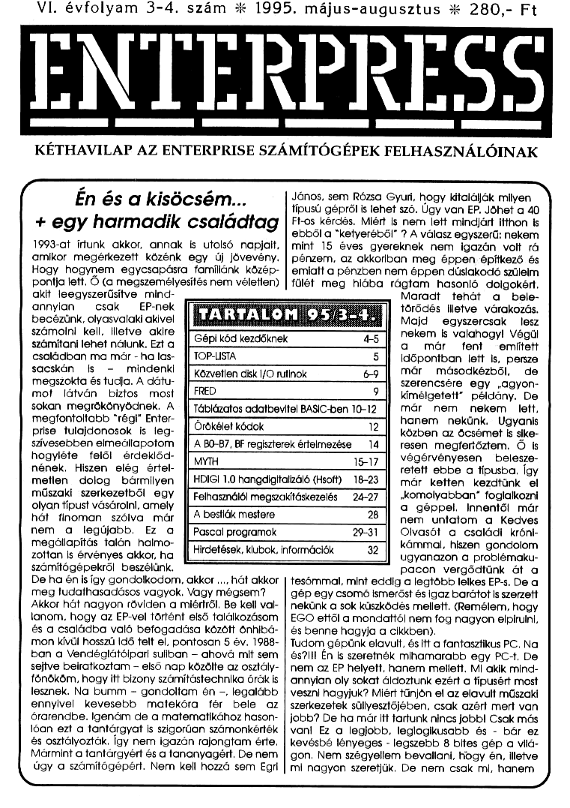

# Enterpress 1995/3-4 (1995.05-08)

[Оригінальний PDF](http://enterprise.iko.hu/magazines/Enterpress_1995-3-4.pdf) (угорською)

## Зміст

## Чернетка вмісту

"page-000.jpg" ------------------------------------------------------------ 
VI. évfolyam 3-4. szám :k 1995. május-augusztus :3k 280,- Ft

ENLTERPRESS

KÉTHAVILAP AZ ENTERPRISE SZÁMÍTÓGÉPEK FELHASZNÁLÓINAK

( Énésakisöcsém...
t egy harmadik családtag

1993-at írtunk akkor, annak is utolsó apjait,
amikor megérkezett közénk egy új jövevény,
Hogy hogynem egycsapásra famílánk közép-
pontja lett, Ő (a megszemélyesítés nem véletlen)
akit leegyszerűsítve. mind-

János, sem Rózsa Gyuri, hogy kitalálják milyen ő,
típusú gépről is lehet szó. Úgy van EP, Jöhet a 40
Ft-os kérdés, Miért is nem lett mindjárt. itthon is
ebből a "ketyeréből" ? A válasz egyszerű: nekem
mint 15 éves gyereknek nem igazán volt rá
pénzem, az akkorban meg éppenrépítkező és
emiatt a pénzben nem éppen dúslakodó szülelm
fülét meg hiába rágtam hasonló , dolgokért;
Maradt tehát a bele-

annyian — csak — EP-nek
becézünk, olyasvalaki akivel

TARTALOM 95/

törődés Illetve várakozás.
Majd — egyszercsak lesz

számolni kell, illetve akire
számítani lehet nálunk, Ezt a

Gépi kód kezdőknek

nekem is valahogy! Végül

családban ma már - ha las- . [/ TOP-USTA

sacskán is - Mindenki
megszokta és tudja. A dátu-

Közvetlen disk [/O rutlnok

mot látván biztos most [FRED

£5 a már  tent —-emített
5 [/ időpontban lett Is, persze.
6-9 II már másodkézből, de
9] szerencsére egy vagyon-

kímélgetett" példány. De

sokan megrökönyödnek. A

Táblázatos adatbevitel BASIC-ben 10-12

már nem nekem lett,

megfontoltabb "régi" Entér-

prise" tulajdonosok Is leg- (/ Örökélet kódok

hanem nekünk. Ugyanis

12 (közben az öcsémet is sike-

szívesebben elmeállapotom

A B0-B7, BF regiszterek értelmezése 14

resen megfertőztem, Ő is

érdeklőd-

zottan is érvényes akkor, ha

hogyléte felől fir 15-17 I] végérvényesen  belesze-
mének. Hiszen elég értel- retett ebbe a fípusba, Így
metlen dolog bármilyen [/ HDIGI 1.0 hangdigítalizáló (Hsoft) 18-23 [/ már ketten kezdtünk el
műszaki "szerkezetből egy ff Felhasználói megszakításkezelés 24-27 ÍJ -komolyabban" foglalkozni
olyan típust vásárolni, amely a géppel, Innentől már
hát finoman szólva már [I A bestiák mestere 28 nem untatom a Kedves
nem a legújabb. Ez a [/ Pascal programok 29-31 [ Olvasót a családi króni-
megállapítás falán .halmo- ff praetések Kübok.ntommádók 321]. kámmal, hiszen gondolom

ugyanazon a problémaku-

számítógépekről beszélünk,
De ha én is így gondolkodom, akkor ..., hát akkor
meg tudathasadásos vagyok, Vagy mégsem?

Akkor hát nagyon röviden a miértről, Be kell vak
lanom, hogy az EP-vel történt első találkozásom
és a családba való befogadása között önhibő-
mon kívül hosszú Idő telt el, pontosan 5 év. 1988-
ban a Vendéglátóipari suliban — ahová mit sem
sejtve beiratkoztam - első nap közölte az osztály-
fönököm, hogy Itt bizony számítástechnika órák is
lesznek. Na bumm - gondoltam én -, legalább
ennyivel kevesebb matekóra fér bele az
órarendbe. Igenám de a matematikához hason-
lóan ezt a tantárgyat is szigorúan számonkérték
és osztályozták, Így nem igazán rajongtam érte,
Mármint a tantárgyért és a tananyagért. De nem
igy a számítógépért. Nem kell hozzá sem Egri

pacon vergődtünk át a
tesómmal, mint eddig a legtöbb lelkes EP-s. De a
gép egy csomó ismerőst és igaz barátot Is szerzétt
nekünk a sok küszködés mellett. (Rernélem, hogy
EGO ettől a mondattól nem fog nagyon elpirulni,
és benne hagyja a cikkben).

Tudom gépünk elavult, és Itt a fantasztikus PC, Na
és?lII Én is szeretnék mihamarabb egy PC-t, De
nem az EP helyett, hanem mellett, MI akik mind-
annyian oly sokat áldoztunk ezért a típusért most
veszni hagyjuk? Miért tűnjön el az elavult műszaki
szerkezetek süllyesztőjében, csak azért mert van
jobb? De ha már itt tartunk nincs jobbl Csak más
vani Éz a legjobb, léglögikusabb és - bár ez
kevésbé lényeges - legszebb 8 bites gép a vilá-
gon. Nem szégyellem bevallani, hogy én, illetve
mi nagyon szeretjük, De nem csak mi, hanem

"page-001.jpg" ------------------------------------------------------------ 
1995. május-augusztus

2

Ön s kedves olvasó, hiszen ezért rendelte meg az újságot. Vagy a PC-k varázsában ezt már elfelejtette?
Akinek még mindig megvan ez a gépe, az - ha magának sem meri bevallani - szereti ezt a fípust
valamiért. Ez pedig még csak véletlenül sem jelenti azt, hogy nem lehetne mellette az asztalon egy Amiga
vagy éppen PC.
Hol vagy Zozo, hol vagy EDC és hol vannak a többiek? Eifelejtettétek, hogy milyen gép van az asztalo-
tokon, és milyen tudás a fejetekben? Ébredj fel végre EP-s társadalom Ez az út nem vezet sehova, csak a
kedvenc gépünk örök és végérvényes pusztulásához, E tekintetben az utolsó óra utolsó percének utolsó
másodpercét éljük, Fogjunk össze végre és mentsük meg az Enterprise-t! Egyszer már megtettük amikor
teljesen magunkra hagytak bennünket gépünk forgalombahozól. Vagy már ezt is elfelejtettük? Mi válto-
zott azóta? Hol a kezdeti lelkesedés? Nem hiszem, hogy az országban csak mi vagyunk az öcsémmel
olyan ízlésicamosak, hogy lassan már hét éve ugyanazzal a rajongással szeretjük ezt a masinát. De ha
nem így van, akkor hova lettek a többiek? Miért kell már évek óta attól félnünk, hogy lesz-e még jövőre
újságunk? Miért kell kizárólag Hsoft-nak ellátnia ötletekkel, szoftverekkel az egész EP-s tábort? Nem
mintha nem szívesen csinálná. Miért kell mindenkinek EGO-hoz fordulnia tanácsért, információért segít-
ségért? Nem mintha nem szívesen csinálná. És miért kell nékem megírni a vezércikket az újságba, amikor
nálam ezerszer Jobban megírnák mások? Nem mintha nem szívesen csinálnám.
Ha valaki vesz egy CD-lejátszót aznap kihajítja a kazettás deckjét? Nem tisztelt olvasók! A hifi állványon
mindkettőnek különleges helye van. Az igazi hifisnél mindkettő megtalálható. Ne tagadjuk meg hát öreg
barátunkat. Mentsük meg az újsággal együtt még sok hosszú évrel Ha lesznek (a mostanitól többen) akik
előfizetik az újságot, ha lesznek akik szoftvereket és hardvereket készítenek, akkor nem hazudtunk mikor
azt mondtuk: az ENTERPRISE örök és elpusztíthatatlani Nálunk már örökös családtag mindkét EP (1993 óta
öcsémnek külön gépe van). És Önöknél?

Pertik László

Mikor kezembe került a vezércikk, egyből
elolvastam és az utolsó bekezdéseken elgon-
dolkodtam. Egyből tollat ragadtam és éreztem,
hogy eme a vezércikkre nekem reagálnom kell!
Úgy érzem, ha a szerkesztőség tagjai is úgy
akarják, (írnak a lapba!) akkor jövőre is megje-
lenhet az ENTERPRESS! Én ennyit tudok tenni

TOP-LISTA JÁTÉK

Szeretnénk, ha a Tisztelt olvasók egy játékban ven-
nének részt az Enterpress-el. A TOP-LISTA

szavazólapjai vesznek részt majd ebben a játékban.
Az év végi sorsoláson azok a TOP-LISTA
szavazólapok vesznek majd részt, amelyek az 1995.
március 20. és 1995. december 10-e között
érkeznek be szerkesztőségünk címére.

Idén decemberben

10 értékes nyereményt

sorsolunk ki. Mindenki csak 1 szavazócédulával
vehet részt a sorsoláson! A nyeremények listáját
szeptember-októberi számunkban közöljük,

Jó szórakozást és sok szerencsét kívánunk!

a szerkesztőség.

ÚJSÁGUNK érdekében, függetlenül attól, hogy
mennyi előfizetője lesz a lapnak. Sajnos elke-
serítő az, hogy a papír árát idén nyáron ismét
1009-kal felemelték, szeptembertől pedig az
energiaárakat is emelik. Jövőre kb. 1000 Ft körül
lesz egy éves előfizetés. Ha Tisztelt Előfizetőink
képesek ennyit áldozni a lapra, akkor hát:
JÖVŐRE IS MEGJELENHET AZ ENTERPRESS! Rögtön
hozzáteszem mégegyszer: HA LESZ MIT ÍRNI a
lapba! Nem úgy mint most: hónapokat kellett
várni, hogy összejöjjenek az anyagok!

Mostani számunkban két játékleírás van és ez
igen kevés, de hát...

Tisztelt Szerkesztők és Előfizetők! Önöknek mi a
véleményük a vezércikkben és az általam írt
sorokról? Ugye megmenthető az ENTERPRESS?I!

Matusa István

ENTERPRESS KIADÓ ÉS SZERKESZTŐSÉG:
1399 BUDAPEST, PF. 701/334.

"page-002.jpg" ------------------------------------------------------------ 
1995. május-augusztus

3

Talán az ENTERPRISE
történetének. egyik leg-
nagyobb hardver fejlesz-
tése készült elt

A HSOFT és KOKÓ duó
elkészített egy hangdigi-
talízáló ——— szerkentyűt.
KOKÓ készítette el a
hardvert, ami — tulaj-
donképpen egy táppal
hajtott kis dobozban van.
A doboz — különös
ismertetőjele, hogy kívül
polméterek és egy beé-
Pitett mikrofon is elhelyezkedik rajta.

HSOFT egy kiváló szoftvert írt ehhez a hardverhez, de
nemcsak a hangdigitalizáló kiszolgálását látja el a
szoftver, hanem más zenéket (Rockdigi stb., valamint az
1.1-es verzióban már IBM PC formátumú ".MOD fájlok)
is le tud játszani, sőt mi több a zenéket át is lehet
szerkeszteni,

A szoftver nevét majdnem elfelejtettem! HDIGI. Teljes
leírását (mely egy picit nagyra sikeredett) a 18. oldalon
találhatjuk meg. Reméljük lesz rá igény az EP-s fel-
használók . között, hiszen . nem kis. munkájába . került.
Kokóéknak ez a szupér digi masina!

Szintén HSOFT műhelyében elkészül lassan egy játék,
melynek neve: /TETRIS. Na. igen, mondja most a T;
olvasó, már megint égy tetris! Igen ám, de ez nem akár-
milyen! Itt nemcsak kockákat kell egymásba) illétve
egymás mellé illeszteni, hanem a kockákon számok
találhatók. Ha három szám egymás mellé kerül (vízszin-

tesen, függőlegesen vagy átlósan) csak akkor tűnnek el
a kockák. Ezt az agyatúrt tetrist a közeljövőben már meg
lehet rendelni HSOFT-tól.

Ígéretet kaptunk arra, hogy a MINIBANK legújabb ver-
ziója is elkészül. Elnézését kérjük (HSOFT nevében)
azoknak akik már szerették volna használni az új MINI-
BANK-ot, de HSOFT kénytelen volt félretenni és mással
foglalkozni. (nyaralás, HDIGI stb.). Reméljük, hogy
következő számunkban már írhatunk az új MINIBANK-
ról is.

Révász Gyuri rajzolóprogramja elkészült. Már csak egy
HELP-et kell hozzá írni és a program teljesen kész!
Következő számunkban (mostmár remélem, hogy
TÉNYLEGI) közöljük a leírását.

Felhívjuk mindenkinek a figyelmét, hogy ha rendelkezik
olyan játékleírással, esetleg játék térképpel ami közöl
hető az újságban, ne habozzon, küldje el nekünk a
szerkesztőség címére. Nem szeretném, ha ugyanaz a
helyzet állna elő mint most: nincs mit ími a lapba, Ha
továbbra is szeretnénk olvasni az ENTERPRESS-t,
akkor azt hiszem a legalapvetőbb, hogy legyen mit
leközölnünk. (Remélem e sorokat egy-két szerkesztösé-
gi tag is olvassa és írul-pírultitt tetni)

Régebbi ENTERPRESS újságok KEDVEZMÉNYES
ÁRON megrendelhetők a szerkesztőség címén (lásd a
32. oldalon a hirdetést!) mivel a nyomda (ami megszűnt)
rendelkezésünkre bocsátott kb. 1 tonna ENTER-
PRESS-t..

IBM PC-k javítása, bővítése,
tartozékok, illesztőkártyák,
perifériák
nagy választékban.

EPROM, MIKROCONTROLLER
égetők.

Faragó Gyula, telefon: 274-2090

Az egészség
csatornája
a kábeltévéken

A Szív tv műsora az ország számos helyi
és körzeti kábelhálózatán látható,
több mint egymillió lakásban.

Szónakoztatáa, filmek, infonmáció,
népontok, Bnéningek.

A Szív tv postacíme: 1656 Budapest, Pf. ó.
Telefon: 256-6136 (fax Is), 257-1270

"page-003.jpg" ------------------------------------------------------------ 
1995. május-augusztus

Mostani számunkban az LPT; kezelése és egy
szöveg scrollozása a téma. Ezt a két témát egy
mintaprogramban mutatjuk be. Az LPT kezeléséről
már indult az ENTERPRESS-ben egy sorozat,
csak éppen nem fejeződött be. (Hol vagytok pécsi
EP-sek?)

Programunkban az első teendő, hogy belapozzuk a

0-ás VIDEO szegmenst. 25 karakteres sort
készítünk (LD A,25). Az ezt követő ciklusban kap
helyet a szöveg melyet scrollozunk, valamint a
szinkronizáció (SYNC). Az OUT (B2HJ,A és OUT
(83H),A utasításokkal tudatjuk a NICK chippel az
elkészített LPT-nket. - Ezután következik egy
utasítás az El. Ennek jelentése: megszakítások
engedélyezése. (Lásd Haluska Laci kezdőknek
szóló cikkét lapunkban a megszakításkezelésrőll)

Ezután elhelyezzük a szöveget, és meghatározzuk
a VIDEO címet (LD IX,.4000, LD HL,1000). Az
SCIK1 és SCIK2 címkenevek alatt a serollózás ru-
tinjait találjuk. A program legvégén végtelenítjük a
ciklust (JR SCIK1).

A programban további új utasítás az IX regiszter.
Lássuk ennek a magyarázatát:

Az IX és IV 16 bites indexregiszterek elsősorban a
memória (pontosabban egy 256 bájtnyi memóriain-
tervallum) címzésére szolgál. Az indexregiszterek
alsó és felső B bitje — az L, ill H regiszterekre
vonatkozó adatmozgató, logikai és aritmetikai
utasítások kiterjesztéseként — külön is használható.
Az IX és IY regiszterek — HL kiterjesztésként — 16
bites akkumulátorként is használhatók.

Példa:
LD AXIX42): A-t az IX42 memóriacímtől tölti fel.

Fordított irányú adatmozgatás esetén:
LD (IX2),A: A regiszter tartalma a célregiszterbe
kerül.

Néhány szó az LPT-ről:
Az LPT (más néven sorparaméter tábla) a 2. lapon
lévő FFH rendszerszegmensen a B900H címen
kezdődik. A LPT 16 bájtos blokkokban tárolja egy-
egy sor (1-255 pixelsor magas ablak) megje-
lenítéséhez szükséges (mód, tárolási cím, szín
stb.) információkat.

Programunkat a szokásos módon fordítjuk az
ASMON programmal, ezt nem írom le, mert szerin-
tem már mindenki kívülről fújja.

Levelek érkeztek Haluska Lacihoz, amelyekben az
áll, hogy sorozatom a kezdőknek igen jó, de kicsit
lassan haladunk; Ez igaz, de elmondom, hogy
nekem ez volt a célom e sorozattal! Szerintem az
az olvasó is tud már gépi kódban egyszerű prog-
ramokat készíteni aki nem mert ránézni egy gépi
kódú programra. De a nagyon fontos megsza-
kításkezelés (ami már komolyabb téma) sem
maradhat ki, így Hsoft cikkét is megjelentettük e
számban. Köszönet érte a szerzőnek! Külön öröm,
hogy Ferenci Jóska is küldött egy egyszerű kis pro-
gramot, a billentyűzet kiolvasási mátrix táblázattal
(ami még soha nem jelent meg az ENTERPRESS-
ben). Ezt egészíti ki Hsoft kis programja (szintén
egy táblázattal, ami másabb mint az előző) amely a
joystick olvasását mutatja be.

Matusa István

Fizessen elő a

MÁDTÓTECHNIKA es a DADVÓ  nika

folyóiratokral Így biztosan hozzájuti
Címünk: 1374 Budapest, Pf. 603.

A szerkesztőségben regisztrált HE előfizetőknek díjmentes nyák-fiim melléklet.

"page-004.jpg" ------------------------------------------------------------ 
1995. május-augusztus

ORG 100H
LD SP,100H
LD AOFCH
OUT (OBH) A
LD A.25

LD DE,4000H
LD HLLI

LD BC16
LDIR

DECA

JR NZ.CIKLUS
LD HL.SYNC
LD BC,SH
LDIR

LDAO

OUT (82H),A
OUT (83H) A
OR 404

OUT (83H) A
OR OCOH
OUT (83H) A
EI

i
i CIKLUS

LD HL.SZOVEG

LD DE,5000H

LD BC,SZH

LDIR

LD IX,4000H

LD HL,1000H

pe LD (IX44).L

LD (IX45).H

LDA4
SCIK1 PUSH AF

LD (IX42),A

ADD A,SZH

LD (IX43).A

HALT

HALT

HALT

POP AF

INC A

CP 56-SZH

JR NZ.SCIK1
SCIK2 PUSH AF

LD (IX.2),A

ADD A,.SZH

LD (IX43).A

HALT

HALT

HALT

POP AF

DECA

CP4

JR NZ,SCIK2

JR SCIK1
SZÖVEG — DB"ENTERPRESS"
SZH EGU §-SZOVEG
Lt DB OF7H.8.3FH,0,0,0,

OE9H,1,0,73,36,130,0,0,0,0

SYNC DB OF2H,.92H,3FH,0,0,0,0,
0.000,
DB OFDH,10H 31
0,0.0,0,0,0,0,0,0,0,0
DB OFCH,10H,6,3FH,0,0,0.0,
0,0.0,0,0,000
DB OFFH,10H,3FH.20H,0,0,0,
0,0,0,0,0,0,0,0,0
DB OFCH,12H,6,3FH,0,0,0,0,
0,0.0,0,0,0,0,0
DB ODEH,13H,3FH,0,0,0,0,
0,0,0,0,0,0,0,0,0
SH EGU $-SYNC
END

Zozosott

TOP-LISTA

Legjobb program: PASZIÁNSZ (Hsoft)
Legjobb felh, program: HWP 1.0 (HSOFT)
Legjobb DEMO program: ORK Megademo 3,
Legjobb programozó: HSOFT

Legjobb programátíró; ZOZOSOFT

Legjobb szoftver stúdió: HSOFT

Köszönjük a sok-sok szavazólapot!
Továbbra is várjuk Olvasóink
szavazatait!

Cínünk:
ENTERPRESS, 1399 Budapest, Pf, 701/3384,

"page-005.jpg" ------------------------------------------------------------ 
1995. május-augusztus

KÖZVETLEN DISK [/O RUTINOK o ZOZOSOrT

: APROGRAM FENASSAL VAGY HEASSAL FORDÍTHATÓ,

: HAASMON-NAL AKARJUK FORDÍTANI,

; AKKOR AZT A NÉHÁNY YH, YL-T TARTALMAZÓ
UTASÍTÁST ÍRJUK ÁT. -

; A PROGRAMOT 4 MHz-EN NE FUTASSUK VIDEOMEMŐ-
: RIÁBAN, MERT ANNAK LASSÚSÁGA

; MIATT NAGYOBB MENNYISÉGŰ ADAT ÁTVITELEKOR

; ADATVESZTÉS TÖRTÉNIK.

; AZ ADATTERÜLET LEHET A VIDEOMEMÓRIÁBAN IS, ÉS
; MINDEGY, HOGY 4 VAGY

: 6. (7.12) MHZ-ES A GÉP

com EGU 10H
TRACK EGU 11H
SECT EGU 124
DATA EGU 134
DRIVE EGU 18H
DRISID DBO :AKTUÁLIS MEGHAJTÓ ÉS OLDAL
RETRY DB 8. :OLVASÁSKOR VAGY ÍRÁSKOR
HIBA ESETÉN HÁNYSZOR
ASMÉTELJEN
580
SR DBO  :STEPPING RATE
MOTOR DBO BIT 3: MOTOR ON FLAG
MON EGU 10008
VERIFY DBO BIT 2: VERIFY FLAG
VON EGU 1008
DELAY DBO BIT 2: DELAY FLAG
DON EGU 1008
MUL DBO  :BIT 4: MULTIPLE SECTOR FLAG
MUON EGU 100008
UPD DB UON :BIT 4: UPDATE FLAG
VON EGU 100008
DATAM DBO BIT 0: DATAADDRESS MARK
DELETED EGU 1
PRE DB 0 :BIT 1: WRITE PRECOMPENSATION
PON EGU 108
STATUS BITS
MOTON EGU7 :MOTOR ON
WPROT EGU6 WRITE PROTECT
RTSU EGU 5. RECORD TYPE/SPIN-UP
RNF EGU 4. :RECORD NOT FOUND
CRC EGU3 :CRC ERROR
LDTRO EGU 2 :LOST DATA/BYTE, OR TRACK 0
DRAa EGU 1 DATA REGUEST INDEX 9
BUSY EGU0
DRIVEA DBOO0 TT TÁROLÓDIK A MEGHAJ-
:TÓKHOZ TARTOZÓ
DRIVEB DBOOO — :REGISZTER ÁLLAPOT
DRIVEC DB 0.0.0
DRIVED DB000
:EXDOS STEP RATE ÉS AKTUÁLIS MEGHAJTÓ
:LEKÉRDEZÉSE
ASKSRATE LD BC.73

EXOS 16

or
LDAD
AND 3

LD (SR)A
LDBC71
Exos 16
or

LDAD
ADD A7AT-1
LD BO
PUSH HL
JR CSEL

:MEGHAJTÓ KIVÁLASZTÁS

(A-D

:Bz0. VAGY 1. OLDAL

SDRIVE

cc1

CSEL

SD1

cc2

SZAMOL

szt

PUSH HL
PUSH BC
PUSHAF
CALL SZAMOL
LD BC.310H
INC c

INI

JR NZ.CC1

SUB "AA
RLCC

DECA

JR NZ.SD1
SLAB

SLAB

SLAB

Sas 4
DAC

ORB

OUT (DRIVE) A
LD (DRISID) A
CALL SZAMOL
LD BC.310H
INC o

OUTI

JR NZ.CC2
POPAF
POPBC

POP HL

RET .-

LD AXDRISID)
RES4A

PUSH DE

LD DE.3

LD HL.DRIVEA-3
ADD HL.DE
RRA

JR NC.SZ1
POPDE

RET

"page-006.jpg" ------------------------------------------------------------ 
1995. május-augusztús

10. OLDAL VÁLASZTÁSA.
"NINCS BEMENŐ ADAT
SIDEO PUSHAF

LD AXDRISID)
RES4A

OUT (DRIVE) A
LD (DRISID) A
POPAF

RET

:1. OLDAL VÁLASZTÁSA
(NINCS BEMENŐ ADAT
SIDE1 PUSHAF
LD AXDRISID)

SET4A

OUT (DRIVE)A
LD (DRISID)A
POP AF

RET

:MÁSIK OLDAL VÁLASZTÁSA

"NINCS BEMENŐ ADAT
TSIDE PUSHAF
LD A(DRISID)
XOR 000100008.
OUT (DRIVE) A
LD (DRISIDDA
POPAF
RET

:MEGHAJTÓ ALAPÁLLAPOTBA HOZÁSA:

:MOTOR BEKAPCSOLÁSA ÉS 0. SÁVRA POZÍCIONÁLÁS
FIRST LD AMMON
LD (MOTOR) A
CALLRESTORE
PUSHAF
XORA
LD (MOTOR) A
POP AF
RET
COMMAND... PUSH BC
PUSH HL
LD HL.65535
1Dco
OUT (COM) A
PUSH AF VÁRAKOZÁS
POP AF
PUSHAF
POPAF
PUSH AF
POPAF
PUSHAF
POPAF
PUSHAF
POPAF

ci DECL

(COM)
0 BIT BUSYA

JR Z.C2

BITRNFA

JRZC1

LD CA TRACK NOT FOUND

JRC1
c2 LDAC
c4 POP HL

POP BC

RET
c3 DECH

JR NZ.C1

LDAZ

JR C4
STEP1 LD IX.SR
LDAIXSO)
OR (IXr1)
OR (IXr2)
RET
TIEND POPIX
ORA
RET

1: TRACK NOT FOUND (HAA VERIFY BE VAN
KAPCSOLVA)
2: DRIVE NOT READY

:RESTORE: SEEK TRACK 0, 0. SÁVRA ÁLLÁS
NINCS BEMENŐ ADAT

RESTORE PUSHIX
CALLSTEP1
CALL COMMAND
JR TIEND

SEEK TRACK, POZÍCIONÁLÁS
-JAESÁV SZÁM
SEEK PUSHIX
OUT (DATA) A
CALL STEP
OR 000100008
CALL COMMAND
ÍR TIEND

:STEP, LÉPTETÉS A LEGUTÓBBI IRÁNYBA
:NINCS BEMENŐ ADAT

STEP PUSH IX
CALL STEP1
OR 001000008
st OR (IX5)
CALL COMMAND
JRTIEND

:STEP IN, BEFELÉ LÉPTETÉS
NINCS BEMENŐ ADAT

STEPIN PUSHIX

"page-007.jpg" ------------------------------------------------------------ 
1995. május-augusztus

CALLSTEP1
OR 010000008
JRS1

:STEP OUT, KIFELÉ LÉPTETÉS
NINCS BEMENŐ ADAT

STEPOUT PUSHIX
CALLSTEP1
OR 011000008

JRS1

"TYPE 283 COMMANDS
ANPUT:

AzHIBA KÓD
0:NO ERROR

1:SECTOR NOT FOUND
2:DRIVE NOT READY

3:LOST DATA OR CRC ERROR
:  4:WRITE PROTECT DISK

: ZERO FLAG: Z-NO ERROR

; NZZERROR

READ PUSH BC
LD BXIX-2)
PUSH HL
PUSHAF
PUSH BC
PUSH DE
PUSHIY
LD (IX-1).0
LD YL.32
LD C.DATA
OUT (COM) A
PUSH AF
POPAF
PUSHAF
POPAF
PUSHAF
POP AF
PUSHAF
POPAF
PUSHAF
POPAF
PUSHAF
POPAF
LD DE.0
R10 INAACOM)
BIT DRGA
JR ZR40
INI
LD DE.20CH
JR RO
R40 BIT RNFA
JR NZ.RAA
DEC DE
LDAD
ORE
JR NZR10
LD DE20CH
JRRO

R4A LD (IX-1).1
JRR2

RO LDYHE

R1 INAACOM)
AND D
JRZRá1
INI
JR RO

R41 IN AXCOM)
BIT DROA

R42 RRA

IN A(COM)
BIT DROA
JRZRA4
INI
JR RO
Ra4 ANDE
JRZR45
LD (X-1).8
R45 INA(COM)
BIT DRG A
JRZR43
IMI
IR RO
Rá3 INC YH
JR NZR1
INA(COM)
AND D
JRZRAT
INI
JRRO
R47 DECYL
JRNZRO
R5 LD (X-1).2
R2 LDANIX-1)
POPIY
POPDE
POP BC
cP3
JR NZ.NO3
DEC B
JRZ.NO3
LDAMRS)
OUT (SECT) A
POPAF
POP HL
JP READ11
No3 POP BC
POP BC
POP BC
RET

RS 080

READ1 LD IX.8R
OUT (SECT) A
LD (RS)A
LDAIXr1)
OR (Xr3)
RET

READ SECTOR, SZEKTOR
JOLVASÁSA

jAzSZEKTOR SZÁM
SHLEPUFFER

RSECT PUSH IX
CALLREAD1
OR (IXr4)
OR 100000008
REND CALLREAD

cP2

JRZWAIT1
ORA
RET

WAIT1 PUSHAF
XORA
CALLINT
POPAF
ORA
RET

:READ ADDRESS, SZEKTOR
JAZONOSÍTÓ OLVASÁSA

ILEPUFFER

RADD PUSH IX
CALLREAD1
OR 110000008
JR REND

READ TRACK, SÁV OLVASÁSA
ILEPUFFER

RTRACK PUSHIX
CALLREAD1
OR 111000008

JR REND

WRITE PUSH BC
LD B.(IX-2)
PUSH HL
PUSH AF
PUSH BC
PUSH DE
OUT (COM) A
LD C.DATA
PUSHAF
POP AF
PUSHAF
POPAF
PUSH AF
POPAF
PUSH AF
POPAF
PUSH AF
POPAF
PUSHAF
POPAF
LDDE0
Woo IN A(COM)
BIT DROA
JRZWO1
OUTI
LDE0

WRITETT

"page-008.jpg" ------------------------------------------------------------ 
1995. május-augusztus

9

JR WO :WRITE SECTOR, SZEKTOR ÍRÁSA
wot BIT WPROTA -AZSZEKTOR SZÁM
JR NZ.W002 . HLEPUFFER
INA (COM) 4
BITDROA WSECT PUSH IX
JRZ.WO3 CALLWRITE1
ouTi OR (IXs4)
2, IR Éw capa
JR Wo úR ő WEND CALLWRITE
Wog BITRNFA wa INA(COM) POPIX
JR NZ.W003 BITORAA ORA
INA(COM) JRZW5 tsz
BIT DRG A msg CP2
JRZW08 Wo JR ZWAIT2
oUTI 578 reabápó ORA
1DE0 JR NZW1 RET
JRWO DEC8 WAIT2 PUSH AF
Wo4 DECDE 9R ZWI XORA
LDAD Rés CALLINT
ORE ték (bAG POPAF
JR NZ.W00 POPDE ORA
1DE2 POP BC RÉT
JR W2 dés "WRITE TRACK, SÁV ÍRÁSA
W003 LDE4 JR NZVAVOS AHLEPUFFER
JR W2 T
W002 LDE4 ; agyrtttbáti WTRACK PUSHIX
JR W2 ÚDAIRS) CALL WRITE
wo 1080 GUT(SECTJA OR 111100008
1008 SES rpgtégj JR WEND
wi INA(COM) pnyr
BIT DRG A
JRZWwt1 fenA fedfásasacsábó ITYPE4
ouTi PoPBC (FORCE INTERRUPT, PARANCS
JR WO JÖBBE EGSZAKÍTÁSA
wit RRCA szt T 0,12.3 A: I0.11.42.13
JR NCW2
IN A(COM) INT OR 11018
BIT DROA lez ÖANKKET e CALLCOMMAND
JR ZW3 OR (x7) RET
ouTi Érd
JR Wo Zozosoft
wa BIT LDTROA

FRED

Archeológusként bolyongunk egy egyiptomi
sírkamrában, célunk az, hogy kijussunk belőle
lehetőleg minél több régészeti lelettel. Minden kül-
színre érés után nehezebb labirintussal kerülünk
szembe. A pályán gyalog, ugrásokkal, illetve a
kötélhágcsókon fel- és lefelé mászásokkal tudunk
közlekedni, Utunk során különféle veszélyekkel,
ellenségekkel találkozunk, a játék nehezedtével
egyre többel. Ezek: szellem, patkány, skorpió,
denevér, csontváz, illetve a mennyezetről csöpögő
víz. Többségüket — ügyes helyezkedéssel,
lépésekkel — kikerülhetjük, vagy lelőhetjük, a
szellemeket rálövéssel irányuk megváltoztatására
bírhatjuk.

Összesen 15 életünk van, elveszett életeink
számát kétféleképpen pótolhatjuk. A labirintusból
minden kijutás után két életet; illetve ha menet
özben életvizes flaskára bukkanunk - annak
ürtartalmától függően — két vagy öt életet kapunk
Vissza. Töltényt találva lövedékeink számát kezde-
ti értékére — hátra - állíthatjuk vissza.
Térkép begyűjtése esetén legyünk óvatosak,
korántsem biztos, hogy ennek a labírintusnak a
rajzát mutatja.
A képernyő jobb oldalán láthatjuk az aktuális
állapotot: a lövedék, a játék és a labirintusszint
számát, térképet és a még meglévő életeinket.
Vezérlés: joystick; billentyű: A, W — bal-jobb,
E,R- le, fel, T: lövés.

(Sinclair Spectrum Játék és program I. rész,
65. 0.)

"page-009.jpg" ------------------------------------------------------------ 
10

1995. május-augusztus

TÁBLÁZATOS ADATBEVITEL
BASIC-BEN

A mellékel program táblázatos adatbevitelt valósít meg BASIC
nyelven, de struktúrált stílusban. A beolvasó eljárás (a kiíró blokkal
együtt) önállóan is használható. Paraméterel: a beolvasás
Koordinátái a képernyőn, a beolvasott sztring maximális
megengedett hossza és kezdeti értéke, Az eljárás lehetővé teszi a
kurzor mozgatását, beszúrást a kurzor pozíciójában, és törlést
mindkét irányba, miközben nem engedi meg a felhasználónak,
hogy vezérlőkarakterekkel kilépjen a sorból, vagy a megengedett
nél hosszabb sztringet vigyen be, amivel elrontaná a képemyőt.
Nem megengedett billentyű leütésekor hangjelzést ad. Az eljárás.
egyszerűen a karakterláncok szétvágásával és újra összera-
gasztásával dolgozik, Mivel egy karakterhelyre nem lehet egy-
szerre klími egy betűt és a kurzort is, a szövegen belül mozgó kur-
zor a szöveget kettévágja. Kurzorkaraktemek választhatunk más
Jelet is, pl. egy aláhúzást, ami nem annyira zavaró. Akárhol
nyomjuk le az ENTER-t, az eljárás a teljes sztringet beolvassa,
miután először kiszedi belőle a kurzorkaraktert, A kiíró eljárás
mindig felülírja a szöveget, ezért a gépet ne felejtsük beszúrás
üzemmódban, mert elrontja a képet! A T$ változó célja a szöveg
törlése az újralrás előtt, ennek hossza szükség szerint változ-
tatható.

A főprogram ennek az eljárásnak a segítségével kót szöveg- és
egy számtáblázat adatit olvassa be, Mivel a táblázatok hosszúak,
egy képernyőoldalra nem férnek ki, ezért lapozni kell öket, A prog-
ram fő változói:

SZOVEG1$ (10 kar), SZOVEG2$ (6 kar), SZAM (4 karja
beolvasandó táblázatok, zárójelben a megengedett hosszúság. A
Program jelenlegi formájában a táblázatok csak egyforma
hosszúak lehetnek, ez a három 40 elemből áll

OSZLOP(1 TO 3): a képemyő melyik oszlopába keli kiírni a három
táblázat elemet

HOSSZ! to 3): a három táblázat elemeinek megengedett hossza.
KURZOR(! TO 3):-a képernyőn egy kurzorként szolgáló nyiltal
jelölhetjük ki, hogy melyik elemet akarjuk beími, Mivel az ele-
meknek úgyis eggyel több helyet kell kihagyni, mint a
megengedett hossz, mert a kurzomak is el kell férnie, ezért a nyíl
is az erre fenntartott plusz helyen, a szövegek jobb oldalán mozog.
Ezzel biztosítjuk, hogy ennek már ne kelljen további helyet kihagy-
ni. A program kiszámítja és ebbe a tömbbe tárolja ol a nyíl karak-
ter kírásához az oszlopszámokat,

XKYKXKUJYKUJ: a nyílkurzor régi és új koordinátál, ahol YK és
VKÜJ nem magát az Y koordinátát, hanem a KURZOR tömb ezt
tároló elemét jelenti.

SORSZAM: a táblázat sorainak száma egy oldalon.

KEZD: hányadik sortól kezdve írjuk ki a táblázat elemelt.
OFFSET: a lapozáshoz kell. Ennyiszer a sorok számát kell hoz-
zándni a kurzor helyzetéhez, hogy megkapjuk, valójában hányadik
elemnól tartunk. Az első oldalon OFFSET:0, ezért ha a 3. elem-
sorban vagyunk, akkor a táblázat 3. eleménól Is tartunk. A
következő oldalon OFFSET-1, tehát a 3. elemsorban már a
341"15718. elemet érjük el. Ehhez persze figyelembe kell venni a
kezdösort is. Figyeljük meg az OFFSET és a KEZD változókat tar-
talmazó sorokat és számoljunk utánat

A képernyőt a KEPERNYÓ eljárás rajzolja fel, (Jó, tényleg?) A
106. sorban az elemek sorszámának kiírása természetesen
elhagyható, ha nincs elég helyünk. A főcimben úgyis benne van.
Figyeljük meg a 105. sorban található feltételt, amely arra szolgál,
hogy az utolsó oktalon, amely nincs teljesen tele, magakadályoz-
za, hogy kimenjünk a táblázatból (UBOUND változól). Hasonló
feltétel szerepel a kurzorvezértő eljárásban ts, a lefelé láptetésnél
(158. sor).

Amikor megválasztjuk, hogy a táblázatokból hány sort teszünk egy
oldalra, hagyjunk helyet az alábbiaknak: felül a főcím, plusz egy
sorkihagyás; itt ugyan nem szerepel, de ha az egyes oszlopoknak
saját fejlécet akarunk kiími, akkor az plusz egy sor és egy

kihagyás; valamint alul két státuszsor és fölötte egy sorkihagyás.
Marad tehát a táblázatra maximum 17 sorunk.

A programnak van egy érdekessége. Mivel a képernyő kiírása
lassú, a felhasználónak lehetőséget kell adni arra, hogy még
mielőtt egy lap teljesen klíródik, továbbmenjen a kövekezőre. A
képernyőkiíró eljárás minden elemsor után megvizsgálja, hogy a
kiírást megkísérelték-e megszakítani, . Ha volt billentyülenyomás,
megnézi, hogy mi volt az? A kiírást megszakítani ugyanis csak a
lefelé és felfelé lapozó billentyűkkel engedi, és azokkal is csak
akkor, ha ez nem okozna hibát (lásd a feltóteleket a 113-114.
sorokban). Ha ezt nem vizsgálnánk Itt meg, a főprogram kerülne
végtelen hangjelzést adó hibaciklusba, mivel az újbóli lapozást a
főprogrammal végeztetjük ell (Lásd 133-137. sorok, ha a
képoryőkiíró ciklus a HIBA változóval azt üzente, hogy már van
parancsbillentyű lenyomva, akkor a főprogram nem áll neki újra
billentyűre várni, hanem azt vizsgálja meg, ami már benne van az
x$ változóban, és mivel az egy lapozó parancs, az OFFSET beál-
Itása után újra meghívja a képernyőklíró eljárást.) Figyeljük meg
azt is, hogy a biztonság kedvéért először csak a FOR ciklusból
ugrunk ki, ós csak utána a DEF blokkból. (Az ember 5058 tudhat-
Ja, mitől vadul meg a gépe, nem árt óvatosnak leni. Így legalább
a kurzot-koordinátáknak is mindig van értelmes értéke.)

A főprogram a 187-200. sorokban határozza meg, hogy a
beolvasó eljárásnak melyik táblázat hányadik elemét kell átadnia.
tt is figyelemre méltó a KEZD, OFFSET és SORSZÁM változók
használata, valamint az, hogy a beolvasandó elemet reforencia-
Paraméterként adjuk át (lásd a REF kulcsszót a beolvasó eljárás
fejlécében). Ez azt jelenti, hogy az eljárás megváltoztathatja az
elem tartalmát.

"A program végén a teljesség kedvért bemutatom, hogyan lehet a
kész táblázat adatait lemezre, vagy magnóra menteni. A214. sor-
ban az adatok törlése csak arra való, hogy meggyőződhessünk
róla: a program valóban a lemezről olvasta vissza az adatokat ós
nem a memóriában maradtakat írja ki újra.

A program természetesen szabadon átsorszámozható, saját prog-
ramjalnkba bellleszthető (MERGE), és módosítható is. A főprog-
ram inicializáló részében deklarált változóknak giobálisaknak kel
tenniük!

4 PROGRAM "beolvaso.bas"
2
317" string beolvasása "e
4 DEF BEOLVASOKY.H REF A$)

5 STRING X$.KURS

6. NUMERIC K

7. LET KURSZCHRS(159)
8 LET KELEN(ASJt1

9 LETASZASAKURS

10. CALL KIIROGYIHJAS)

11 DO
12. DO

13 LETXS5INKEYS
14. LOOPUNTILXSOT
15. SELECT CASE ORDO$)

46. CASE 13
47 dev entert
48. LETASZAS(T:K-1)JBAS(KHI:LEN(A$))

19. CALLKIIROGYHAS)

20 EXITDO

21 CASE 32TO 159

22.199" karakter ee

23 IFLEN(A$)cHr! THEN
24 LETASZÁS(1:K-1J8X$8A$(KLEN(AS))LET KEKET

"page-010.jpg" ------------------------------------------------------------ 
1995, május-augusztus

11

25 CALLKIIROGYHAS)

26 ELSE
27 SOUND
28 ENDIF

29 CASE 164

30 17" visszatortos tt

31 IFKS1THEN

32 LETASZAS(1:K-2J8AS(KLEN(A$JJ:LET KeK-1
33 CALLKIIROGYHAS)

34 ELSE
35 SOUND
36 ENDIF

37 CASE 160

38 17" torles kurzortol "ee
39 IF KOLEN(A$) THEN
40 LETASZAS(T:KJSAS(Kt2:LEN(A$))
41 CALLKIIROGYHAS)

42 ELSE
43 SOUND

44 — ENDIF

45 CASE 184

46 1" kurzor balra "e

47 IFI THEN
48 LETASZAS$(1:K-2JEKURSSAS

(-1:K-1)JBAS(KH-1-LEN(AS)J:LET KEK-1
49 CALLKIIROGYHAS)

50 ELSE

51 SOUND

52. ENDIF

53. CASE 188

5419" kurzor jobbra "er
55 IF KELEN(A$) THEN
56 LETASZAS(T:K-AJBAS(KH:KE1Já

KURSBAS(K2:LEN(ASJJLET KeKrt
57 CALLKIIROGYHAS)

58. ELSE

59. SOUND

60 ENDIF

61 CASE ELSE

62. 17" ervenytelen billentyu "ee
63. SOUND

64. END SELECT

65 LO0P

66 END DEF

671

68 1 "es string Kirasa adott helyre "s

69 DEF KIIROGY.HAS)

70 STRINGTS

71 LETTS-T 2

72 PRINTAT X,Y-ASGTS$(1:Hrt-LEN(A$))

73END DEF

141———— ——

751" foprogram, inicializalas ses

76 STRING SZOVEG18$(1 TO 40)"10,SZOVEG2S(1 TO 40)"8

77 NUMERIC SZAM(! TO 40).

78 NUMERIC OSZLOP(! TO 3) KURZOR(! TO 3) HOSSZ
(To9

79 NUMERIC XK.YK.XKUJYKUJ

0 LET X$-7LET HIBA-O

81 LET OSZLOP(1)-7:LET OSZLOP(2]-20:LET OSZLOP(3)-30

82 LET HOSSZ(1)-10:LET HOSSZ(2)56:LET HOSSZ(3j-4

83 LET KURZOR(1J:OSZLOP( 1) HOSSZ(1):LET
KURZOR(ZJ-OSZLOP (2) HOSSZ(2):
LET KURZOR(3J-OSZLOP(3) "HOSSZ(3)

84 LET OFFSET-0:LET SORSZÁM: 15:LET KEZD-3

8517" demo ertekek ""

88 FOR Het TO 40

87 LET SZOVEGÍ$()-STRS(JEZWE

88 LET SZOVEGZS(NESTRS()E" 00"

89 LET SZAM([jets100

90 NEXT

91 CALL KEPERNYO.

92

93 1" kepernyo kiirasa "ee

94 DEF KEPERNYO

95 LET HIBA:O

96 CLEAR SCREEN

97. PRINT "TABLAZAT ":OFFSET"!
SASOFFSET"SORSZAM?

98 LET KESORSZAMFOFFSET"SORSZAM

99. IF KSUBOUND(SZAM) THEN

100. PRINT UBOUND(SZAM)". so"

101 ELSE

102. PRINT K7. sor

103. END IF

104 FOR lzt TO SORSZAM

105. IF IROFFSET"SORSZAM czUBOUND(SZAM) THEN

106 PRINT AT HKEZD-1,1:ikOFFSET"SORSZAM

107 CALLKIIR(2 OSZLOP(1),10.SZOVEGI$0r

ÖFFSET-SORSZAM))

108 CALLKIIR(Ir2 OSZLOP(2).6.SZOVEG2S
(FOFFSET"SORSZAM))

109 CALLKIIR($2.OSZLOP(3)4.STRS
(SZAM(IOFFSET"SORSZAM))

110. ENDIF

111 LET XSEINKEVS
112. IF X$07 THEN
113 IF XSZCHRS(181) AND OFFSETSINT(UBOUND
(SZAMJ/SORSZAM) THEN LET HIBA1:EXIT FOR
114 ÍF XSZCHRS(177) AND OFFSET20 THEN
LET HIBAS 1:EXIT FOR
115. ENDIF
116. NEXTI
117. LET XK-3:LET YKe(LET XKUJ-XKILET YKUJEYK
118. IF HIBAs1 THEN EXIT DEF
119. CALL KURZORKIR

HIFT 3CHR$(139);
CHR$(155)." lapozas; ESC veget;

TETSZÉS te Ket EGET
126 1 ere kurzor kilrasa str.

125 DEF KURZORKIIR

126. PRINT AT XK.KURZOR(YKJZ "

127. PRINT AT XKUJ.KURZORÍYKUJ):CHRS(156);
128. LET XKSXKUJLLET YKEYKUJ

129 END DEF
120———————

131 1 es foprogram, vezer ciklus "er

132 Do

133. IF HIBA-O THEN

134 DO

135 LETXSZINKEYS

136. LOOP UNTIL X$o7

187. ENDIF

138. SELECT CASE ORD(XS)

139. CASE 27

140 TEST

141 EXITDO

142. CASE 184
143199" kurzor balra te
144 IFYIKO1 THEN

145. LETYKUJEYK-11
1486 ELSE

147 SOUND

148. ENDIF

149. CASE 188

150. 19 kurzor jóbbra te
151. IF YKS3 THEN

152. LETYKUJSYKr-CALL KURZORKIIR

153. ELSE

154 SOUND

155. ENDIF

156. CASE 180

457. 17 kurzor lefele mer

158. IF XKCSORSZAM:KEZD-1 AND XK-KEZDH14

LL KURZORKIIR

"page-011.jpg" ------------------------------------------------------------ 
1995. május-augusztus

OFFSET"SORSZAMSUBOUND(SZAM) THEN
LET XKUJ-XKe1:CALL KURZORKIIR
ELSE
SOUND
END IF
CASE 176
179 kurzor felfele "er
IF XKOKEZD THEN
LET XKUJ:XK-1:CALL KURZORKIIR
ELSE
SOUND
END IF.
CASE 181
1" lapozas lefele "er
IF OFFSETAINTIUBOUNDISZAMYSORSZAM) THEN
LET OFFSETzOFFSET1:CALL KEPERNYO
ELSE
SOUND
END IF
CASE 177
17"" lapozás felfele "ee
IF OFFSET50 THEN
LET OFFSETzOFFSET-1:CALL KEPERNYO
ELSE
SOUND
ENDIF
CASE 32.13
19" SPÁCE vagy ENTER
PRINT AT XK.KURZORÍYKJ? "
SELECT CASE YK
CASE 1
LETAS-SZOVEG1$(XK-KEZD:1OFFSET"SORSZAM)
CALL BEOLVAS(XK OSZLOP(YK) HOSSZ(1) AS)
LET SZOVEG1$(XK-KEZD" 1 FÖFFSET"SORSZAM)5A$
CASE 2
LETA$-SZOVEGZ$(XK-KEZD:1OFFSET"SORSZAM)
CALL BEOLVAS(XK,OSZLOP(YK) HOSSZ(2) AS)
LET SZOVEG2$(XK-KEZDH11ÖFFSET"SORSZAMJSA$
CASE 3
LET ASZSTRS(SZAM(XK-KEZD Et
OFFSET"SORSZAM))
CALL BEOLVAS(XK.OSZLOP(YK) HOSSZ(3) A$)
LET SZAMIXK-KEZD 1OFFSET"SORSZAMJ-VAL(AS)
END SELECT
CALL KURZORKIIR
CASE ELSE
17" ervenytelen billentyu "es
SOUND

adatok dat" ACCESS OUTPUT

210 FOR Is1 TO 40

211. PRINT 41:SZOVEG1$(0)

212 PRINT $1:SZOVEG2$(0)

213. PRINT 41:SZAM(D)

214 LET SZOVEG1$(Ij-7:LET SZOVEG2$(J-T:
LET SZAM(I-0

215 NEXTI

216 CLOSE 41

217 CALL KEPERNYO

218—————————

219 1 re visszaolvasas "er

220 OPEN 41 "adatok da" ACCESS INPUT

221 FOR Is1 TO 40

222. INPUT W1:SZOVEGI$(1) SZOVEGZ8(1) SZAM()

223 NEXTI

224 CLOSE 1

225 CALL KEPERNYO

Szalontai Andrea

ÖRÖKÉLET KÓDOK

RENEGADE (3. file)

(R) 1800 (ENTER) RENEGADE.PRG (ENTER)

Last address: BF81

(M) 4672 (ENTER) C9 (ESC) (sérthetetlenség)

(M) 5DCF (ENTER) 00 (ESC) (végtelen idő)

(S) 1800 (ENTER) BF81 (ENTER) RENEGADE.PRG
(ENTER)

ZYNAPS (2. file)

(R) 2148 (ENTER) BFFF (ENTER)
ZYNAPS.PRG (ENTER)

Last address: BFFF.

(M) 5850 (ENTER) C9 (ESC) (sérthetetlenség)
(S) 2148 (ENTER) BFFF (ENTER) ZYNAPS.PRG
(ENTER)

ROBIN OF THE WOOD (2. file)

(R) 1FO0 (ENTER) BFFF (ENTER)

ROBIN.PRG (ENTER)

Last address: BFFO

(M) 7E29 (ENTER) C9 (ESC) (sérthetetlenség)
(M) 644F (ENTER) 88 8B 88 8A 8B BA 8A 8A 8A
BA 8A 8A 8A 8A 8A (ESC)

(S) 1FO0 (ENTER) BFFO (ENTER) ROBIN.PRG
(ENTER)

OUACK-SHOT (3. file)

(R) 1B00 (ENTER) BFFF (ENTER) OUACK.PRG
(ENTER)

Last address: BFFE

(M) 2686 (ENTER) 00 00 00 (ESC) (örökélet) . vagy
(M) 22C0 (ENTER) 00 00 00 (ESC) (sérthetetlénség)
(S) 1800 (ENTER) BFFE (ENTER) OUACK.PRG
(ENTER)

Csavajda István

"page-012.jpg" ------------------------------------------------------------ 
1995. május-augusztus

13

BILLENTYŰZET KIOLVRSÁSI MÁTRIX TÁBLÁZAT

(Assembler programozáshoz használható)

Használati utasítás képlete:

LDAn azt a sort írjuk ,n" helyére amely sorban van a kiválasztott billentyű. (0-9)

OUT (OBSH),A . kiküldjük a B5 portra a kiválasztott sort

IN A(OBSH) beolvassuk a kiválasztott sor értékeit.

AND N N" helyére azt a HEXADECIMÁLIS számot írjuk amely oszlopban a kiválasztott billentyű van.
IRZN Ha a kiválasztott billentyűt nyomtuk meg akkor a ,Z" jelző billentyű 1-re billen és a feltétel teljesül.

"pe RICNETKETHETST ANT] Példa: Például kiválasztot-
—— tuk az ,INS
EC EKN KEN KH IKKE IKKE KÜ E . kuzin
em [A s F bp a fux] a 1 LD A.OBH
mivhelrhel fr ha [7 2 OUT (OBSH) A
IN A,(OBSH)
ESC. a 3 5 4 6 1 Tr 3 AND 8OH
Pi P2 FT PS Pó Ps Ps pi 4 kep ő
KNER for..ball ő a. 3 9) mmal e s Ti ;
ii TENTNTEL JEE F erenci József
ALT ( ENTER ÍJOY.bali STOP ÍJOX.felfJOT, job JOX.1le f HOLD hő
IRS (SPACE Í SB. jobf Lá ül DEL. job A e
menj af r hr el oljmi: L:
BILLENTYŰZET ÉS JOYSTICK OLVASÁS
Billentyűzet olvasás: Joystick olvasás:
LDAX LDAX
OUT (OBSH),A OUT (OB5H) A
IN A (OB5H) IN A, (OBGH)
BIT XA BIT 0A
JP Z LENYOMVA JP Z LENYOMVA
Mo 09 CB5ZX B IN A, (B5) (BIT XA (B6) (BIT 042
j AE 5 4 2 [3
1! FI 2 X h7 B N
I A S F G H
hi y E T vi 7]
2 3 5 7.
1 F2 F7 F5 F3. 4
b5 ERA [a [1 9 8.
6 Él 1 L K fi
7 fHss ÍJ ENTER [/ BAL [/ HOLD OBB 01
8 1NS— IiSzóKÖZ 13 SHIFT] .
) ezér TEA .

"page-013.jpg" ------------------------------------------------------------ 
1995. május-augusztus

BO-B7, BF REGISZTEREK
ÉRTELMEZÉSE:

OUT (BO) A IN A(BO)

0. lapregiszter írás 0. lapregiszter olvasás

OUT (BLA IN AB)

1. lapregiszter írás 1. lapregiszter olvasás

OUT (BA IN A (BD)

2. lapregiszter írás 2. lapregiszter olvasás

OUT (B3) A IN A(B3)

3. lapregiszter írás 3. lapregiszter olvasás

OUT (B4),A IN A(B4)

bit 7-NET megsz. tár. törlés bit 7zNET megsz. tár. állapot
6-NET megszakítás eng. 6-NET osztó állapot
S5-VIDEO megsz. tár. törlés SZVIDEO megsz. tár. állapot
Az VIDEO megszakítás eng. AZVIDEO osztó állapot
31 Hz megsz. tár. törlés 3-1 Hz megsz. tár. állapota
2-1 Hz megszakítás eng. 2-1 Hz osztó állapot
17Prg. megsz. tár. törlés 12Prg. megsz. tár. állapota
0-Prg. megszakítás eng. 0-Hanggenerátor osztó állapota

OUT (BSA IN A(B5)

bit 7zREM 2 bit 0-7zBillentyű mátrix input
6-REM 1

SzMagnóhang csatolás
AzPrinter STROBE output (impulzus)
0-3-Billentyű, joystick sora

OUT (B6) A IN A,(B6)
bit 0-7-Printer DATA output bit 7-Tape DATA input
6-Tape LEVEL input

5-NET STATUS input

OUT (B7)A
bit LzENET STATUS output
0-NET DATA output

OUT (BF) A
bit 2-3 0—memória műveleteknél várakozás, kivéve a VIDEO RAM-ot
1-M1-nél várakozás, kivéve a VIDEO RAM-ot
2-3-nincs várakozás (gyors perifériákhoz)
1- ——— Órajel: 0-8 Mhz 1512 Mhz (DAVE osztó számára)
0- Beépített RAM: 0-64 K; 1516 K (WRAM kimenethez a VIDEO RAM kapuzáshoz)

0 1995. HSOFT

"page-014.jpg" ------------------------------------------------------------ 
1995. május-augusztus

ís

,.M.YSEPI "

A Játék betöltése és indítása után az első pálya
közepén vagyunk. Jobbra találunk egy edényt.
Közelítsük meg majd rúgjunk bele kétszer, mire
az edény szétesik és egy szív kerül elő belőle.
(Tárgyat úgy tudunk felvenni, hogy a tűzgomb
megnyomása után a joystickot magunk felé húz-
zuk.)

Vegyük fel a szívet és menjünk tovább jobbra,
Minden edényt és ládát nyissunk ki és a benne
rejlő tárgyakat vegyük magunkhoz. Ha már van
lőszerünk, akkor tudunk löni. Ehhez az ENTER-t
meg kell nyomni, majd a joy-al ráállunk a löszer
szimbólumra Ismét ENTER és máris lehet
lövöldözni. Irány a pálya jobb széle, Löjük szét a
faliszörnyet, majd a nagy buborékot, ez utóbbit
felvéve — visszaindulunk balra.  Ütközben
találkozunk előtűnő csontvázakkal, ezekbe
lőjünk bele egyet miáltal szétesnek és csak a
fényképüket hagyják maguk után. Gyűjtsünk be
ezekből 10 darabot vegyük fel a bal oldalon
található második nagy buborékot és menjünk
egy emelettel lejjebb. Itt felvesszük a harmadik
nagy buborékot majd ismét egy emelettel lej-
jebb sétálunk balra egészen a tűz széléig. Itt
bedobáljuk a koponyákat, mire előjön a
szörnyeteg. Mielőtt teljesen előmászna lőjük
szétvA liftre ugorva vegyük fel a háromágú vil-
lát majd a negyedik nagy buborékot és vágtas-
sunk el jobbra a sárkányhoz. Új fegyverünkkel
nyírjuk ki, vegyük fel a kulcsot s irány a rá-
csoskapu. Menjünk be. Miután szétlőttük a fali-
szörnyeket essünk le és vegyük fel az ötödik
nagy buborékot is. Ezekután jobbra kiballagunk
az ajtón pottyanunk egyet és elmegyünk a pálya
közepéig ahol megtaláljuk a nagy négyszög-
letes pályanyitó szerkezetet. Ezzel vissza bak-
tatunk a starthelyre. Álljunk középre, használjuk
a szerkentyűt és a gép a tűzgomb hatására
betölti a második pályát. Itt is felveszünk min-
den elrejtett tárgyat, nagy buborékot, amelyből
minden pályán 5 db van. Rúgjuk szét a nagy
szobrot, alatta van egy talizmán. Menjünk jobb-
ra, ugorjunk a kapu bal széléig és it a tűzgomb
megnyomása után joy balra, bent vagyunk a

boszinál. Vágjuk le a fejét, használjuk a talizmánt
mire a fej jégkockává fagy. Menjünk ki, jobbra
egészen a háromfejű sárkányig. Itt a boszi jég-
befagyasztott fejével lövöldözzünk mindaddig
amíg mind a három fej porba hull. Megkaptuk az
ötödik nagy buborékot amellyel visszaindulunk
a starthelyre. Útközben természetesen fel-
"vesszük a harmadik pálya nyitásához szükséges
szerszámot és hipp-hopp Itt vagyunk a Vikingek
hajóján. A vikingektől szerzünk lőszert amellyel
szétlőjük a hajó jobb végén található nagy
buborékot s miután felvettük az erdő közepén
találjuk magunkat. Az ősemberektől kérjünk
szépen késeket, ha így nem megy akkor
keményebb eszközökhöz kell folyamodni. Balra
megtaláljuk a villámot az erdő közepén pedig a
Papiruszt. Ezzel menjünk a halottig, oltsuk el
vele a tüzet, a hulla felszáll a mennyekbe maga
alatt hagyva a kulcsot. Jobbra elmegyünk a
tűzokádó sárkányig itt a késekkel kinyírjuk majd
tovább jobbra a vár bejáratáig. Kulccsal kinyitjuk
a kaput bent megöljük a varázslót és vissza a
starthelyre. A negyedik pálya a tengerparton
kezdődik. Menjünk jobbra. A sziklafalba kétszer
lőjünk bele és tovább jobbra. Essünk le a négyes
kapurendszerig Itt menjünk egészen balra az
első ajtóig. Menjünk be, vegyünk fel mindent,
még a nagy buborékot is, majd a többi ajtót Is
látogassuk végig. Van négy nagy buborékunk
meg néhány új használati tárgyunk, Minden
szobában van egy-egy szaloncukor, ezeket a
ravatalnál. kell elfogyasztani. A szemet a
kapunál, a keresztet a belső terem végén villog-
tatni (életet ad). A másik itt felvett tárgyat a
fáraó. megsemmisítésére használjuk. Ha. min-
denkit lelőttünk, mindent felvettünk és a
megfelelő helyen alkalmaztunk, akkor eljutunk
az ötödik pályára. Itt nincs más dolgunk mint
szétdurrantani a nagy fejet.

SOK SIKERT és JÓ SZÓRAKOZÁST
kíván

Ocsovszki Dávid és Németh Attila

"page-015.jpg" ------------------------------------------------------------ 
kazár atták Ú mak

"page-016.jpg" ------------------------------------------------------------ 
Eset A ELOT

ma
SSNSASAÁÉTOTTT 9" EEELEETEI

1

"page-017.jpg" ------------------------------------------------------------ 
1995. május-augusztus

HDIGI 1.0

O Hsoft. 1995.

A lap megjelenésére feltehetően már elkészül, az e
sorok írásakor még fejlesztés alatt álló HDIGI 1.1
verzió. A megrendeléseket kizárólag Hsoft címére
lehet küldeni. Haluska László, 1086 Bp. Karácsony
Sándor utca 18. 3/41. A postázási ill, utánvét díja az
árat természetesen emeli. A lemezek 5.25/800K for
májúak. Kazettás rendszer vagy 3.57-os meghajtó
esetén a megrendelő által küldött kazettára történhet
az adatok felvitele, mely az árat kazettánként még 50
Ft-tal emeli. Aki további információkat és még
választ is szeretne kapni, levelében mellékeljen fel-
bélyegzett és megcímzett válaszborítékot!

A szerzői díj: HDIG1/01-rendszerlemez:leírás ára:

1000 Ft
A dobozolt komplett hardver ára tápegységgel:
2500 Ft
További zene ill. hangminta lemezek (jelenleg

HDIGI/02-06) 150 Flemez áron kapható:

ENTERPRISE hangdigitalizáló
és zeneszerkesztő program

HARDVER: (C) 1995 KOKÓ
SZOFTVER: (C) 1995 Hsoft

HARDVER:

Igen egyszerű elven működik. A printer 8 bites
kimenetét ellenállásos leosztássál analóg feszültség-
gé konvertálja, melyet egy komparátor összehasonlít
a bevezetett hangfeszültséggel. Az eredményt visz-
szaküldi a printerstátusz bitre. A kártya tehát a prin-
terkimenetre csatlakozik. A mintavétel soros rend-
szerű, 2 és 8 bit között szabadon választható.
Sebessége 4 MHz órajel mellett kb. 13 mikroszekun-
dum/bit. 8 bites mintákat így kb. 10 KHz frekvenciá-
val lehet rögzíteni. A gyorsabb mintavétel elérésére
célszerű 7 MHz-re turbósított gépet használni. A
maximális kivezérlés 4- 7 bites vagyis 4127-től
-128-ig terjed.

A kártyán található kapcsoló felvétel-állásban az
erősítő bemenetét a külső jack-aljzatra kapcsolja.
Amikor nem csatlakoztatunk ide átjászó jack-dugót,
akkor a beépített mikrofonról történhet a minta
vétele. A potméterrel beállítható az erősítés mértéke
úgy, hogy a lehető legnagyobb kivezérlés mellet még
ne történjen túlvezérlés. A másik potméterrel a
középfeszültség értékét lehet nullázni.

A kapcsoló lejátszó állásban az erősítő bemenetét a 8

bites D/A

átalakítóra, a
kimenetet pedig a beépített hangszóróra kapcsolja. A

hangerőt a  potméterrel lehet szabályozni.
Használatával az EP-nél (276 bit) jobb minőségű
hangot kaphatunk, igaz hogy csak monóban.

SZOFTVER:
Általános tudnivalók:

A program betöltése után 8 főmenü közül lehet
választani. Ezeket direkt módon elérhetjük az F1-F8
gombokkal. A főmenük között bal-jobb iránnyal
választhatunk. A Sőmenü aktuális almenüjét az
inverz kurzorsor jelzi, melyet meghívhatunk a
szóköz vagy enter billentyűvel. Az olyan almenüt,
mely előtt F1-F8 jelzés található, a kurzorsor pozí-
cionálása nélkül is meg lehet hívni,

A programban több fájlkezelő almenűtis található.
Ilyen helyeken a fájlok betöltését kényelmesebben
oldhatjuk meg a FILE bővítéssel mely megtalálható
a rendszerlemezen betölthető változatban, vagy az
EPCK ill. EPCKMB (Hsoft) ROM-bővítésekben.
Hiányában input rutinnal adhatjuk meg a nevet.
Ekkor vezető kettősponttal rendszerparancsot is ki
lehet adni. Pl. :DIR [enter]

A program indítása után a zeneszerkesztőbe
kerülünk. A lényege, hogy különböző hangszer-
minták betöltésével több hangszert, egy időben ma-
ximum négyet, tudjunk megszólaltatni. A betölthető
hangszerek száma maximum 255, persze korlátot
jelenthet még a számítógépünk kevés szabad
memóriája is. Egy-egy hangminta hossza maximum
64 kilobájt. A hangmintákat a program által készített
".HDG hangmodul-fájlok adhatják. Az időál-
landójukra nincs megkötés, kivéve hogy azonosak
legyenek. A program ezt nem ellenőrzi, és csak az
utolsó értékét jegyzi fel. A dallamokat a motívum-
szerkesztőben lehet megalkotni. A motívum egy
időben csak egy hangszert szólaltat meg a 4 oktávon
belül megadott magasságban. (CO-C4) Az egész
hangokat nagybetűvel, a félhangokat pedig kisbetű-
vel lehet beírni. A betűt követő 0-4 szám az oktávot
jelöli. A CI a minta eredeti hangmagasságát adja. A
C4 szünetet ill. az előző hang lecsengésének megál-
lítását okozza. Amikor nem adunk meg újabb
hangszert és a minta hossza megengedi, akkor az
előző mintát tovább játssza a program. A motívum-
ban, a hangszerlistában megtalálható bármely
hangszer megadható. A motívumok maximális száma

"page-018.jpg" ------------------------------------------------------------ 
1995. május-augusztus

19

255. A zeneszerkesztő 4 csatornás. Mindegyikre
megadható, persze nem kötelezően egy-egy
motívum, A csatornasor ütemszáma adja meg, hogy
motívumból hány ütemet kell lejátszani. Amikor a
motívum mérete ennél kisebb, akkor elölről kezdi,
így az ismétlődő részek, pl. a dobolás rövidebben is
megadható.

A zeneszerkesztő képernyőn az alábbiak láthatóak.
Felül a program neve és verziószáma, alatta a meg-
nyitott  hangszerminta neve, mellette a 8
főmenüpont. Alatta 80 karakteres státuszsor talál-
ható, amelynek második felében a zenemű címe,
írója vagy megjegyzés olvasható. Az alatta lévő
globális munkaterületen a kurzor szabadon mozgat-
ható. A kiadott parancsok helyorientáltak, tehát a
kurzor pillanatnyi helye meghatározza hogy éppen
milyen módosítást végzünk. Az itt látható 5 ablakban
Szerkeszthetjük a zene egyes paramétereit. Nevük
sorrendben: Lejátszás, zeneszerkesztő, motívum-
lista, motívumszerkesztő, hangszerlista. Az ablákon
belüli sorok görgetéséhez a kurzorral az ablak jobb-
felső vagy jobb-alsó ikonjára lépünk, és lenyomjuk a
szóköz vagy enter billentyűt. Az ESC lenyomásával
lokalizálhatjuk a kurzort az aktuális ablakban.
Ilyenkor az ablak határain ütközik a kurzor, normál-
SHIFT-ALT fel-le kiadással görgethetőek a sorok, és
bal-jobb irányban csak a tabulátor poziciókra lehet
ugrani. SHIFT bal-jobb a kezdő-végző pozícióra, az
enter pedig újabb sorra ugrik. ESC-pel ki-bekapcsol-
ható a lokalizálás funkciója, mely a státuszsorban is
fel lett tüntetve. Egyes helyeken szóközzel meghall-
gatható, a kurzor pozícióban levő zenei építőelem.
Az elemek beírását karakter lenyomással lehet
kezdeményezni. nkor az aktuális helyén
szerkeszthetjük az adatot. Több karakteres szó
szerkesztése esetén ENTER-rel kell a szót elküldeni.
Amikor az utolsó karakterhelyet is kitöltjük, a prog-
ram már nem igényli az ENTER-t. Visszatörölni
ERASE billentyűvel lehet.

LEJÁTSZÁS ABLAK

Szóközzel meghallgatható a teljes zenemű. Egyes

soraiban olvasható paraméterek módosítását, karak-

ter lenyomással lehet kezdeményezni.

KEZDETE: A lejátszás ettől a fázistól indul.

VÉGE: A lejátszás eddig a fázisig tart.

ÜTEMI lejátszás negyedütemének ideje század-

másodpercben.

IDEJE: A zenemű lejátszásának ideje tájékoztató jel-

leggel.

ZENESZERKESZTŐ ABLAK

A zencfázisok szerkesztését lehet itt elvégezni. Elöl
a fázis sorszáma és a hossza, 1-99 negyedütem
közötti érték. Utána található a négy motívumcsator-
na. A csatornákat egymástól függetlenül ki-be lehet
kapcsolni, az ablak alján elhelyezkedő kapcsolók
segítségével. A fázist szóközzel lehet meghallgatni.
ERASE törli az aktuális motívumhely beírását. INS
beszúr, DEL töröl egy fázist. Motívum megadás
egyaránt történhet a motivum sorszámának vagy a

nevének beírásával. A zenci fázisok száma 255. A
Program a fázisban megadott motívumot, a motívum-
lista sorszáma alapján rögzíti. A zenéhez az F3-
menüben max. 34 karakteres megjegyzést fűzhetünk.
A kimentett zenefájl modulszáma 9IH, kiterjesztése
§.HDE. A modul minden adatot eltárol. Önmagában
futtatható mentés is végezhető, ilyenkor a program, a
modul előtt egy ".COM indítófájlt készít. A zene
egyidőben kezeli az EP belső bal-jobb hang-
csatornáját 246 bittel, és a printerporton keresztül
táplált külső hardvert 8 bittel. Az alacsony
helyértéken lévő bitek, kivül 2, belül 3, a jobbra
shiftelés miatt elvesznek. Amikor egy fázisban egy
motívumot több helyen is megadunk, akkor a
motívum hangereje megnő. Külső lejátszásnál
hangszermintán tárolt 8 bítből, egy motívum/fázis
esetén 6 bit marad, kettő esetén 7 bit, négy esetén
mind a 8 megmarad. A belső hangcsatornán másképp
történik. Egy motívum/fázis esetén 5 bit, 1-2 vagy
3-A csatornán megadott 2 motívum/fázis esetén 6 bit
marad.

MOTÍVUMLISTA ABLAK

A motívum létrehozását ill. átnevezését, karakter
lenyomással lehet kezdeményezni. Utána a hosszát
adhatjuk meg negyedütemben. Lejátszásnál, amikor
encfázis hossza ennél nagyobb, a végére érés után
elölről ismétlődik a motívum. Memóriát lehet ily-
módon. megtakarítani . az ismétlődő dallamoknál.
ERASE törli a motívumot a listából. Szóközzel
meghallgatható, ENTER-rel pedig szerkesztőbe
küldhető az aktuális motívum. A motívumblokkok
elhelyezkedése virtuális, a program egy 16K-s
területen tárolja ill. mozgatja őket. Ennek köszön-
hetően szabadon csökkenthető-bővíthető vagy akár
törölhető is egy-egy motívum.

MOTÍVUMSZERKESZTŐ ABLAK

A motívum tulajdonképpen negyedütemekben
Megadott "hangszerszólamok sorozata, melyek
számát a motívumilistában lehet megadni. Egy
hangszerszólam megadja a hangszerminta nevét,
hangmagasságát, és oktávjának számát. A nevet a
hangszer sorszámával ís megadhatjuk. A magasságot
a CCDAEFfGgAaH betűkkel, az egészhangokat nagy,
a félhangokat pedig kisbetűkkel jelöljük. Az oktáv
száma nullától háromig terjed. A C4 egy hangtalan
negyedütem, segítségével felfüggeszthető egy hosz-
szabb lecsengésű hangszer hangzása. Kitöltetlen
ütem esetén, a program továbbjátsza az előzőleg
megszólaltatott hangot. ERASE lenyomással töröl-
hető, INS-sel beszúrható, DEL-lel eltüntethető egy
negyedütem. Szóközzel meghallgatható a motívum.

HANGSZERLISTA ABLAK

A zenében használható hangokat a hangszerlistában
tároljuk.  Enterrel betölthetünk az FI menüben
készített, ".HDG hangmintát, mely felülírja az eset-
leg előtte már ott lévőt. Az időállandóját és méretét
a neve után olvashatjuk. A hangminta fájl mérete
nem haladhatja meg a 64K-t. A hangminták együttes

"page-019.jpg" ------------------------------------------------------------ 
20

1995. május-augusztus

"méretének a memória szab határt. Számuk 255-ig
bővíthető. Karakter bevitellel indítható a hangszer
nevének módosítása. A hangszermintát ki is lehet
menteni, így a hangminta editorban (FI menüpont)
megtekinthető ill. rajta módosítás is végezhető. A
hangmintákat szóközzel hallgathatjuk meg C1 ma-
gasságon.

F1-menü: MINTAVÉTEL

- MINTA BETÖLTÉS

A lemezen található ".HDG hangminta fájl
betöltésére szolgál. A betöltés beállítja a szegmensek
számát, a mintabitek számát, a minta időállandóját, a
Start-end és lecsengés helyét.

- MINTA LÉTREHOZÁS

Olyan esetben használjuk, amikor új mintát
készítünk ill. szeretnénk átnevezni a meglévőt. A
betöltés vagy megnyitás hiányában, nem történik
Pufferfoglalás, tehát az alábbi menüpontokat sem
lehet meghívni.

- MINTA KIMENTÉS

A tárban lévő minta kimentése az alapértelmezésű
egységre. A mentés 90H modultípussal történik "és
eltárolja a minta hosszát, a mintabitek számát, a
minta időállandóját és a lecsengés helyét.

- MINTA LEZÁRÁS

Felszabadítja a lefoglalt mintapuffert és törli a
mintanevet.

- MINTAPUFFER SZEGMENSEINEK SZÁMA

tt adható meg ill módosítható a minta számára
lefoglalt 16 Kbájtos RAM-szegmensek száma.

- 280 ÓRAJEL BEOLVASÁS

A program indításnál -automatikusan végrehajtódó
menüpont. A felhasználó olyan esetben kezde:
ményezheti az ismételt órajel meghatározást, amikor
futás közben átállította a turbót. Az aktuális órajel-
nek fontos szerepe van a felvétel időállandójának,
valamint a lejátszási sebesség kiszámításában.

- MINTAVÉTEL BITJEINEK SZÁMA

Itt állítható be a mintavétel alatti bitek száma. A
bitek számának növelésével javítható a hang
minősége, viszont a soros beolvasás következtében
romlik a mintavételi frekvencia. Ezért célszerű turbó
gépen elvégezni a minták vételét. Az alacsonyabb
bitszám esetén zajosabb a vett minta, míg több bittel
inkább a magasabb hangok szoktak torzulni ill
elveszni. A hallható frekvenciába eső mintavétel ill.
lejátszás másik hátránya, hogy a magas hangokat
mintavételi frekvenciájú járulékos zajjal szennyezi.
Előnye viszont a kisebb memóriaigény. A menükur-
zor sora információt ad az aktuális mintavételi
frekvenciáról.

—- FELVÉTELI SZINT BEÁLLÍTÁSA

A felvétel előtt célszerű a kártya potméterével a
minta szintjét beállítani. A középérték nullázásával
egyenlő helyet adunk a hang pozitív és negatív fél-
hullámainak. Asszimetrikus minta esetén, (hangszer-
mintáknál gyakori) a kitöltési tényező javításához
előnyösebb a SZKÓP-on látható jel pozitív és
negatív. csúcsmaximumát középre helyezni. Az
erősítés mértékét a túlvezérlést elkerülve a lehető

legnagyobbra célszerű állítani.

- MINTAVÉTEL

A tényleges mintavétel elvégzése, A megnyitott
mintapufferbe történő mintavételezés felülírja az
előbbi adatokat, valamint újraszámolja a minta
időállandóját. A felvétel a foglalt szegmensek teljes
területére történik, de a STOP-pal már előtte is
megszakítható.

- KÜLSŐ LEJÁTSZÁS

A printerporton keresztül a hardveren történik 8 bit-
tel a visszajátszás.

- MONÓ LEJÁTSZÁS

A normál módú lejátszás. Az EP minkét hang-
csatornájára ugyanazt a jelet kapcsolja. Az EP hard-
vere miatt csak a felső 6 bitet adja vissza.

- SZTEREÓ LEJÁTSZÁS

Annyiban tér el az előző lejátszástól, hogy az egyik
csatornát időben késleltetve kezeli, mely sztereó jel-
leget ad a hangnak fejhallgatón ill. erősítőn hallgat-
Va. Mindhárom lejátszás megszakítható a STOP bil-
lentyűvel. A lejátszás csak egész szegmenseket
kezel, ezért nem veszi figyelembe a SZKÓP-pal
kitörölt területet.

— OSZCILLOSZKÓP
A felvett ill, betöltött hangmintán vágást és fizikai
módosításokat is végezhetünk. A képernyőablakban
a hangminta egy része látható. A kurzor fel-le
irányával mozgatható a mintaablak. Shifttel lapozás,
controllal 1000H lapozás, alttal pedig a minta ele-
jére-végére ugorhatunk. Bal-jobb iránnyal a kurzor
alatti mintaadatot lehet módosítani; A lejátszásra
kijelölt blokkot CAPS-sal lehet meghallgatni
Amikor a nyomvatartás alatt véget ér a blokk, a le-
csengés által megadott címtől folytatódik a lejátszás.
A lecsengést a blokkendre állítva elkerülhető az
ismétlés. — A — lejátszás — hangmagasságát a
KLAVIATÚRA menüpont aktuális beállítása adja.
F1-gyel a blokkkezdésre, F2-vel a blokk végére, F3-
mal a lecsengés kezdetére ugorhatunk. Az F4-gyel
belépünk az oszcilloszkóp parancsmenüjébe,
BLOKK KEZDETE - Fő Blokk kezdetezkurzor
BLOKK VÉGE - F6 Blokk végezkurzor
LECSENGÉS KEZDETE - F7 Lecsengés
kezdete-kurzor
BLOKK INICIALIZÁLÁSA - F8 Az előző három
adat alapértelmezése
BLOKK MODULÁCIÓ £ — A blokkot rámodulálja a

"page-020.jpg" ------------------------------------------------------------ 
1995. május-augusztus

21

kurzortól kezdődő területre. Ezzel a módszerrel
megoldható pl. a minta visszhangosítása.

TÖRLÉS A BLOKK ELŐTT - ERA

TÖRLÉS A BLOKK MÖGÖTT - DEL. Blokkon
kívüli területek törlése. Amikor egy szegmens
megüresedik, a program fel fogja szabadítani. A
szegmensek számának újbóli megadása szintén
hatással van a minta hosszára.

BLOKK MOZGATÁS - INS. A blokk áthelyezése a
kurzor által jelölt helyre.

BLOKK MAXIMÁLIS AMPLITÚDÓ - A hangminta
amplitúdóját megszorozza azzal az értékkel, mellyel
az amplitúdó megközelíti a maximális feszültséget.
A mintavétel és a szűrés után célszerű használni.
BLOKK -rn — A blokk amplitúdóját lehet megnövel-
ni az adott értékkel. A pozitív maximumon határolást
végez.

BLOKK -n - A blokk amplitúdóját lehet csökkénteni
az adott értékkel. A negatív maximumon határolást
végez.

BLOKK n46 — A blokk amplitudójának növelésére és
csökkentésére egyaránt felhasználható. A 5094 a jel
felét, 20096 a dupláját eredményezi.
ALULÁTERESZTŐ SZŰRÉS - A megadott határ-
frekvencián elsőfokú (RC) aluláteresztő szűrést
végez a blokkon. Alkalmas pl. zajszűrésre vagy az
időállandó csökkentése utáni négyszög jelalak
Színuszosítására. A határfrekvenciát 20-20000 (szi-
gorúbban 100-5000) Hz között célszerű megadni.
FELÜLÁTERESZTŐ SZŰRÉS - A megadott határ-
frekvencián elsőfokú (RC) felüláteresztő szűrést
végez a blokkon. Alkalmas lehet a minta egyen ill
brummfeszültségének leválasztására. A  határ-
frekvenciát 20-20000 (szigorúbban 100-5000) Hz
között célszerű megadni. Egynéhány esetben (Pl.
négyszög hullámforma esetén) a keletkező ampli-
tudóbájt meghaladhatja a. minimum-maximum
értéket, és ilyenkor a határolás miatt hullámforma
torzulás jelentkezhet.

- KLAVIATÚRA

A képernyőn 4 oktávos klaviatúra jelenik meg. A bil-
lentyűzet Z-/ sorával az egész, felette a félhangokat
játszhatjuk le. A hang a nyomvatartás alatt a szkóp
almenü által jelölt blokkot és lecsengést játssza le.
Oktávot a fel-le billentyűkkel válthatunk, A bal-jobb
És a szóközzel szintén elérhető egy-egy hang.

KONVERTÁLÁS

- MINTÁK BETÖLTÉSE ÉS MENTÉSE:

Az almenüvel olyan hangmintákat is betölthetünk
melyek nem HDIGI-vel készültek. A beolvasás
átkonvertálja a mintát a kezelő által használt 8 bites
abszolút formára. A korrekció végeztével a mintát,
eredeti vagy más formában, lemezre lehet menteni. A
kezelhető típusok:

00-IF - 5 bites ABSZOLÚT Az amplitúdó nulláját
a 10H érték adja. Két (ROCKDIGI) minta összege 6
bites lesz tehát közvetlenül kiadható az ENTER-
PRISE bal vagy jobb D/A portjára. A ROCKDIGI
tehát négy ilyen mintát tud egyidőben megszólaltat-
ni. A ROCKDIGI a minták méreténél csak a 100H
egész számú többszöröseit alkalmazza.

FO-OF - 5 bites /ELŐJELES A ROCKDIGI hang-
mintáit e típusból konvertálta át DEVIL úr úgy, hogy
az amplitúdóbájtokat 10H értékkel megnövelte.
00-FF — 8 bites /ABSZOLÚT A HDIGI hangminta
kezelésének alapformája.

(HDIGD

80-7F - 8 bites /ELŐJELES AMIGA-n és PC-n elő-
forduló típus.

- MINTA IDŐÁLLANDÓ KONVERTÁLÁS

A felvett ill. betöltött hangminták alapja, hogy a sor-
ban következő amplitúdóbájtok között konstans
időnek kell eltelni. A konstans értéke függ a digita-
Tizálást végző szoftver órájától, ezért a minták időál-
landói eltérnek. A gyakorlatban 5-44,1 KHz közötti
tartományt használják. Az almenű segítségével a
minták változó időállandóját fix értékre konvertál-
hatjuk. Az értékeket a CD által használt 44.1, a fele
22.05, a negyede 11.025 és a ROCKDIGI, MBP 8
KHz frekvenciájára alkalmaztam. A konvertálás
megváltoztatja a minta méretét, de az intelligens
lejátszónak köszönhetően, a hangmagasság meg-
marad. A mintafrekvencia csökkentése információ-
csökkenést okoz, míg növelés esetén ténylegesen
nem kapunk információ többletet, de felüláteresztő
szűrés után már finomabb bontású lehet a megnövelt
méretű hangi

- MINTA IDŐÁLLANDÓ KORREKCIÓ

A hangminta  időállandójának — átírásával "(a
nanoszekundum  tízszeresében van megadva)
elvégezhető egy utólagos hangolás és szükség esetén
a magasságot is át lehet konvertálni egy másikra.
Ehhez az alábbi információk ismerete szükséges.
Egy oktávnyi emelést az időállandó felezésével, egy
oktávnyi csökkentést pedig a duplázásával kapunk.
Egy oktáv 12 félhangnyi távolságra van felosztva,
mely logaritmikus skálán egyenlő szakaszokat ad.
Bármely két félhang hangköze 12. gyök alatt 2. A
frekvenciaképlet a következő. f2-f1"27(n/12) ahol
fizalapfrekvencia, fZzmódosított frekvencia, n-fél-
magasság eltérés száma (Itt használható minusz és
Plusz érték is. Pl. 24 esetén két oktávnyi emelést,
nulla értékkel változatlan eredményt, mínusz 24-gyel
2 oktávnyi csökkentést kapunk.) A képletet az időál-
landóra átrendezve: t2zt1/27(n/12) ahol az tizalap
időállandó, t2—módosult időállandó.

"page-021.jpg" ------------------------------------------------------------ 
22

1995. május-augusztus

F3-menü: ZENESZERKESZTÉS

- BETÖLTÉS

Betölti az előzőleg kimentett ".HDE fájt, mely
magába foglal szerkesztő összes adatát, beleértve
a hangszermintákat és a zenei motivumokat. Az
előzőleg szerkesztett zenét felülírja.

- ZENEMONOGRAM MEGADÁSA

A zeneműhöz max. 34 karakteres megjegyzés írható,
mely a státuszsorban olvasható.

- KURZOR LOKALIZÁLÁSA A ZENEEDITOR
ABLAKBAN

Átugratja a kurzort a zeneszerkesztő ablak bal-felső
pozíciójára valamint határolja a kurzor mozgását az
ablakon belül. A lokalizálás után kényelmesebben
görgethetjük a szerkesztő sorait.

- A KURZOR LOKALIZÁLÁSÁNAK FELOLDÁSA
Visszatérés teljes képernyős kurzorra.

- KIMENTÉS

A szerkesztő jelenlegi beállításának és adatainak
megörzésére t.HDE 91H modult készít. A betöltési
nevet felkínálja melyet enterrel jóvá hagyhatunk,
vagy megadjuk helyette az új nevet.

- FUTTATHATÓ KIMENTÉS

HDIGI-től független, önmagában is futtatható (5-ös
fejrészű) ".COM programot, valamint ".HDE 91H
modult készít. A programot elindítva az órajel függ-
vényében újraszámolja a lejátszás sebességét, tehát a
hangmagasság normál vagy turbó gépen is változat-
lan mat hi
- ZENE LEJÁTSZÁS

A beállítások alapján lejátsszi
- FÁZIS LEJÁTSZÁS
Lejátssza a kurzor által kijelölt fázist.

- CSATORNA KI-BEKAPCSOLÁS

Ki-bekapcsolja az editor 4 csatornájából azt az
egyet, melynek kapcsolóját a kurzorral választottunk
ki.

- KÖVETKEZŐ MOTÍVUM

A TAB billentyű átugratja a kurzort a zenceditor
következő motívumára ill. csatornájára.

- ELŐZŐ MOTÍVUM

A CTRL-G (EPDOS 2.X alatt SH-TAB) lenyomás
átugratja a kurzort a zeneeditor előző motívumára
ill. csatornájára.

- KÖVETKEZŐ FÁZISSOR

Az ENTER hatására a kurzor átugrik a következő sor
első pozíciójáb: li
- FÁZIS HOSSZÁNAK MEGADÁSA

A megfelelő kurzorpozícióban számbillentyű le-
nyomásával lehet kezdeményezni.

- MOTÍVUM NEVÉNEK MEGADÁSA

A megfelelő kurzorpozícióban betűbillentyű le-
nyomásával lehet kezdeményezni. Ji

—- MOTÍVUM SORSZÁMÁNAK MEGADÁSA

A megfelelő kurzorpozícióban számbillentyű le-
nyomásával lehet kezdeményezni.

- MOTÍVUM BEJEGYZÉS TÖRLÉSE

Törli a kurzorpozícióban bejegyzett motívumot.

- A SZERKESZTŐ TÖRLÉSE-LEZÁRÁSA

Törli a szerkesztőt és felszabadítja a hangszerminták
és motívumok részére lefoglalt memóriaterületet.

teljes zeneművet.

F4-menü: MOTÍVUMLISTA

- MOTÍVUM LEJÁTSZÁSA

Lejátsza a kurzorral megjelölt motívumot.

- MOTÍVUM TÖRLÉSE

Törli a kurzorral kiválasztott motívumot a listából.
Felszabadítja a motívum szerkesztési területét
valamint töredékmentesíti a többi motívumot.

- KURZOR LOKALIZÁLÁSA A MOTÍVUMLISTA
ABLAKBAN

Átugratja a kurzort a motívumlista ablak bal-felső
pozíciójára valamint határolja a kurzor mozgását az
ablakon belül. A lokalizálás után kényelmesebben
görgethetjük a szerkesztő sorai
- A KURZOR LOKALIZÁLÁSÁNAK FELOLDÁSA
Visszatérés teljes képernyős kurzorra.

- MOTÍVUM NEVÉNEK MÓDOSÍTÁSA

A megfelelő kurzorpozícióban betűbillentyű le-
nyomásával lehet kezdeményezni.

- MOTÍVUM MÉRETÉNEK MÓDOSÍTÁSA.

A megfelelő kurzorpozícióban számbillentyű le-
nyomásával lehet kezdeményezni.

F5-menü: MOTÍVUMSZERKESZTŐ

- MOTÍVUM LEJÁTSZÁSA. .

Lejátsza a kurzorral megjelölt motívumot.

- NEGYEDÜTEM BEJEGYZÉS TÖRLÉSE

Törli a kurzorral kiválasztott negyedütem bejegy-
Zését. ilyenkor tovább hallatszik az előző
hangszólam.

- NEGYEGÜTEM BESZÚRÁSA

Beszúr a kurzorral kiválasztott helyre egy üres
negyedütemet, előre csúsztatva a kurzortól kezdődő
negyedeket, ezért az utolsó negyed tartalma elvész.
- NEGYEDÜTEM TÖRLÉSE

A kurzort követő negyedütemtől kezdődően balra
csúsztatja a negyedeket. A becsorduló utolsó negyed
üres lesz. 7

- KURZOR LOKALIZÁLÁSA A MOTÍVUM-EDI-
TOR ABLAKBAN

Átugratja a kurzort a motívumszerkesztő ablak bal-
felső pozíciójára valamint határolja a kurzor
mozgását az ablakon belül. A lokalizálás után
kényelmesebben görgethetjük a szerkesztő sorait.

- A KURZOR LOKALIZÁLÁSÁNAK FELOL-
DÁSA

Visszatérés teljes képernyős kurzorra.

- KÖVETKEZŐ NEGYEDÜTEM

A tab billentyű átugratja a kurzort a következő
negyedütemre.

- ELŐZŐ NEGYEDÜTEM

A etrl-G (EPDOS 2.X alatt SHtab) lenyomás átugrat-
ja a kurzort az előző negyedütemre.

- KÖVETKEZŐ ÜTEMSOR

Az enter hatására a kurzor átugrik a következő sor
első pozíciójába.

- HANGSZER NEVÉNEK MEGADÁSA

A megfelelő kurzorpozícióban betűbillentyű le-
nyomásával lehet kezdeményezni. v

- HANGSZER SORSZÁMÁNAK MEGADÁSA

A megfelelő kurzorpozícióban számbillentyű le-
nyomásával lehet kezdeményezni.

"page-022.jpg" ------------------------------------------------------------ 
1995. május-augusztus

23

- HANGMAGASSÁG MEGADÁSA

A hangmagasság CcDdEFfGgAaH betűk közül
választva adható meg.

- OKTÁV MEGADÁSA

Az oktáv 0-3 számok közül választva adható meg.
Megengedett még a C4.

F6-menü: HANGSZERLISTA

- HANGMINTA BETÖLTÉS-FELÜLÍRÁS

Betölt egy hangmintát a kurzor által kiválasztott sor-
ba, előtte törölve az esetlegesen ott található másikat.
- HANGMINTA LEJÁTSZÁS

Lejátssza a kurzor által kiválasztott hangmintát 8/4-
ed hosszúságban C1 hangmagasságban.

- HANGMINTA KIMENTÉS

Kimenti a kurzorral megjelölt hangmintát az FI-
menüben kezelhető 90H modulként, §.HDG néven.
- HANGMINTA TÖRLÉS

Törli a kurzorral kiválasztott hangmintát a listából.
Felszabadítja a hangminta által lefoglalt memóriát
valamint töredékmentesíti a többi hangmintát.

- HANGMINTA ÁTNEVEZÉS

A megfelelő kurzorpozícióban betűbillentyű le-
nyomásával lehet kezdeményezni.

— KURZOR LOKALIZÁLÁSA A MOTÍVUM-
EDITOR ABLAKBAN

Átugratja a kurzort a motívumszerkesztő ablak bal-
felső pozíciójára valamint határolja a kurzor
mozgását az ablakon belül. A lokalizálás után
kényelmesebben görgethetjük a szerkesztő sorait.

- A KURZOR LOKALIZÁLÁSÁNAK FELOLDÁSA
Visszatérés teljes képernyős kurzorra.

F7-menü: ALAPBEÁLLÍTÁS

- SETUP BETÖLTÉS

Betölti a HDIGI.STP fájt. EPDOS 2.X jelenléte
esetén az SRAM: eszközt használja.

- SETUP KIMENTÉS

Kimenti a beállításokat tartalmazó HDIGISTP fájlt.
EPDOS 2.X jelenléte esetén az SRAM: eszközt
használja.

- BILLENTYŰ VÁRAKOZÁS

Megadható a billentyű ismétlésig eltelt idő, 1/50
másodpercben.

- BILLENTYŰ ISMÉTLÉS

Megadható a folyamatosan nyomvatartott billentyű
ismétlésének sebessége 1/50 másodpercben.

- BILLENTYŰ HANG

Megadható a billentyű hangjelzésének ki-bekapcsolt
állapota. (Nullazbe) ty

- NAGYBETŰSÍTETT KERESÉS

A pillanatnyi verzióban nem használt.

- REJTETT LISTÁZÁS

A pillanatnyi verzióban nem használt.

- AUTOMENTÉS PERCEKBEN

A pillanatnyi verzióban nem használt.

- KERETSZÍN

Megadható a keretszín kódszáma. EPDOS 2.X esetén
a COL parancsot használja.

- STÁTUSZ PAPÍRSZÍN

Megadható a felső három sor papírszínének kódszá-
ma. EPDOS 2.X esetén a COL parancsot használja.

- STÁTUSZ TINTASZÍN

Megadható a felső három sor tintaszínének kódszá-
ma. EPDOS 2.X esetén a COL parancsot használja.
- PAPÍR SZÍN

Megadható a papírszín kódszáma, EPDOS 2.X esetén
a COL parancsot használja.

— TINTA SZÍN

Megadható a tintaszín kódszáma. EPDOS 2.X esetén
a COL parancsot használja.

- NYOMTATÁSI MÓD

A pillanatnyi verzióban nem használt.

- LAPHOSSZ

A pillanatnyi verzióban nem használt.

- FÜGGŐLEGES MARGÓ

A pillanatnyi verzióban nem használt.

- LAPONKÉNTI SZÜNET

A pillanatnyi verzióban nem használt.

- PRINTERFONT

A pillanatnyi verzióban nem használt.

F8-menü: RENDSZERPARANCSOK

- PARANCSSZERKESZTŐ ABLAK HÍVÁSA

A képernyő közepére helyezett ablakban rendszer-
parancsokat lehet kiadni. A programból való kilépés
egyik lehetséges módja.

- PROGRAMOZHATÓ PARANCS KIADÁSA

Az ezután kiadott programozható parancsot átadja az
operációs rendszernek.

- PROGRAMOZHATÓ PARANCS SZERKESZTÉSE

A programozható parancsok szerkesztési módjának
bekapcsolása.

- PROGRAMOZHATÓ PARANCSOK

A felhasználó által előzetesen megadott parancsokat
SETUP-mentéssel lehet eltárolni. A hívásukat F8.F4-
F8 billentyű kombinációval célszerű végrehajtani.
Példa a parancsok programozására: DIR, BASIC, I,
WP, HELP, LRAM, STAT stb.

TERVEK AZ 1.1-ES VERZIÓHOZ
KAPCSOLÓDÓ VÁLTOZTATÁSOKRA

— Felvétel időállandójának gyorsítása, Már meg-oldott
a 11.2 KHz/8 bitnél, 4 MHz-es géppel.

- Zenelejátszás időállandójának gyorsítása.
megoldott a 12.570 KHz-es lejátszó 4 MHz-i
- Zene lejátszása a kezdő fázistól a befejezői
van ilyen beállítás, a lecsengési kezdő fázistól a lec-
sengési befejezőig STOP-ig ismételje,

— A zenelejátszó is használja a hangminták lecsengési
lehetőségét.

— Tömörített adatmentés.

— Tömörített motívum tárolás és lejátszás,

— Motívum negyedütemekben használható speciális
zenelejátszó vezérlések,

- Felhasználóbarát globál mintaszkóp. Az első is megmarad!
— Szerkesztőnyíl beüzemelése.

- Egérkezelés kiterjesztése az ablakokra.

- A hardver felvétel-lejátszás kapcsolójának kiváltása,
szoftver úton vezérelt relével. fk

- A hardver D/A átalakító pontosságának javítási
- IBM MOD fájlok lejátszása.

Már

(Hsoft)

"page-023.jpg" ------------------------------------------------------------ 
1995. május-augusztus

Több levelet kaptam már olyan kéréssel, hogy az
ENTERPRESS-ben publikáljak cikkeket az ENTER-
PRISE programozással kapcsolatban. Az egyik le-
vélíró a megszakításkezelést hiányolta. Az újság
várhatóan rövid életkilátására tekintettel, nem sorozat-
ban hanem egyetlen assembly programban egyesítet-

tem a főbb lehetőségeket. Mindenesetre, aki
komolyabban szeretne assemblyben ENTERPRISE-t
programozni, annak javaslom az EXOS 2.1 változat
MŰSZAKI LEÍRÁS valamint a DONÁT JÁNOS 280
SOFTWARE TÁBLÁZATOK könyvek beszerzését.

A rendkívüli események kezelését megszakításból cél
szerű végezni, ugyanis a főprogramból figyelve jelen-
tős késés és teljesítmény csökkenés keletkezik, Az
ENTERPRISE hardware-megszakítását a DAVE-chip
kezeli. A DAVE két belső és két külső maszkolható
megszakítást tud lekezelni. (DI-EI utasítással ki és
bekapcsolható) A külső megszakítások a NICK általi
videómegszakítás valamint a NET általi hálózati
megszakítás. A DAVE belső. megszakításai a prog-
ramozható " idejű valamint az ENTERPRISE
órakezelésére használt 1 Hz. A 4 megszakításre-
giszter egymástól függetlenül engedélyezhető ill.
tiltható. A kezelését a bővítők igényének megfelelően
az EXOS operációs rendszer végzi, valamint meghívja
a perifériák és a felhasználó megszakításkezelő rutin-
jait.

Hogyan zajlik le egy ENTERPRISE megszakítás? A 0.
EXOS változó valamely bitjével jelzett megszakításfor-
rást az EXOS törölte és engedélyezte az újbóli
megszakítást az előző megszakítás végén. A megsza-
kításforrás pozitív vagy negatív felfutási éle bekapcsol-
ja a megszakításregisztert, s ettől kezdve a DAVE
folyamatos jelzést küld a Z80 felé. Amikor EI-vel
engedélyezett a megszakítás, a Z80 DI-vel letlítja a
processzor további megszakítás lehetőségét és RST
38H rutinhívást végez. (Ezért nem szabad kilapozni a
nullás lapot engedélyezett megszakításnáll!) A 0038H
EXOS megszakításrutin a következőket végzi. Elmenti
a 280 regisztereket és az aktuális szegmenslapokat.
Beolvassa a DAVE megszakításregiszterét, melynek
alapján eldönthető a megszakítás forrása. Igény
esetén meghívja a felhasználói megszakításkezelő
rutint, D-regiszterben jelezve a forrást. Végiglapozza a
perifériákat és a megszakítás igényük alapján meg is
hívja a megszakításrutinjukat, Törli és újra engedélyezi
a kiszolgált DAVE megszakításregisztert, hatására
megszűnik a DAVE jelzése a 280 felé. Helyreállítja a
szegmenseket és a 280 regisztereket. El-vel engedé-
lyezi a megszakítást, majd RET-tel visszatér a főprog-
ramhoz.

Címek és portok:

FF:BFED Felhasználói megszakítási rutin címe.
(0-nincs)

FF:BFC5 0. EXOS változó /megszakításforrás en-
gedély

bit 6-1 külső (NET)
bit 4-1 külső (NICK videó)
bit 2-1 DAVE 1 Hz
bit 0-1 DAVE programozható
port B4 DAVE megszakítás regiszter olvasás
bit 7-1 NET megszakítás
bit 6 NET bemeneti állapot
bit 5-1 VIDEÓ megszakítás
bit 4 VIDEÓ bemeneti állapot
bit 3-1 1 Hz megszakítás
bit 2 1 Hz bemeneti állapot
bit 1-1 Programozható megszakítás
bit 0 DAVE osztó bemeneti állapot
port B4 DAVE megszakítás regiszter írás
bit 7-1 NET megszakításregiszter törlés
bit 6-1 NET megszakítás engedélyezés
bit 5-1 VIDEÓ megszakításregiszter törlés
bit 4-1 VIDEÓ megszakítás engedélyezés.
bit 3-1 1 Hz megszakításregiszter törlés
bit 2-1 1 Hz megszakítás engedélyezés
bit 1-1 Programozható megszakításregiszter törlés
bit 0-1 programozható megszakítás engedélyezés
port AZ DAVE regiszter írás
bit 7 definiálatlan
bit 6-5 programozható megszakítási frekvencia
700 1 KHz
20150 Hz
10 0. hanggenerátor f-250000/(n-1)
1 1. hanggenerátor f-250000/(n1)
bit 4-1 jobb hangkimenetet a D/A-ra kapcsolja
bit 3-1 bal hangkimenetet a D/A-ra kapcsolja
bit 2 2. hanggenerátor szinkronizálás (0-fu-tás,
1zvárakozás)
bit 1 1. hanggenerátor szinkronizálás
bit 0 0. hanggenerátor szinkronizálás
port AD DAVE regiszter írás /fz125000/(n1)
bit 7-0 0. hanggenerátor 12 bites számláló alsó 8 bitje
port A1 DAVE regiszter írás
bit 7-1 gyűrűmodulátor engedélyezés a 2. hangge-
nerátorral
bit 6-1 felüláteresztő szűrő enged. az 1. hangge-
nerátorral
bit 5-4-00 tiszta hang
01 4 bites polinom torzítás
10 5 bites polinom torzítás
117 bites polinom torzítás
bit 3-0 0. hanggenerátor 12 bites számláló felső 4 bitje
port AZ DAVE regiszter írás /fz125000/(n.1)
bit 7-0 1. hanggénerátor 12 bites számláló alsó 8 bitje
port A3 DAVE regiszter írás
bit 7-1 gyűrűmodulátor engedélyezés a 3. hangge-
nerátorral
bit 6-1 felüláteresztő szűrő enged. az 2. hangge-
nerátorral
bit 5-4-00 tiszta hang
01 4 bites polinom torzítás -

"page-024.jpg" ------------------------------------------------------------ 
1995. május-augusztus

25

10 5 bites polinom torzítás
117 bites polinom torzítás
bit 3-0 1. hanggenerátor 12 bites számláló felső 4 bitje

A forráslista magyarázata:

A lefordított felhasználói program a négyből három
megszakításforrást is használ. Felsorolva: videó, 1 Hz,
programozható megszakítás. Az első kettő nem okoz
nehézséget, mivel az EXOS perifériák már használják.
Problámát okoz viszont a programozható megsza-
kítás, ha nem az 1 KHz-et szeretnénk alkalmazni. A
DAVE AO-AF portokat videéómegszakításból a SOUND
periféria, HOLD állapot alatt a KEYBOARD periféria is
átírja. Ezért a SOUND perifériát letitjuk egy azonos
nevű, de feladatot nem végző felhasználói periféria
felvételével. A KEYBOARD-HOLD miatt videómegsza-
kításból frissítjük a DAVE általunk használt 3 re-
giszterét. Az új megszakításforrást bevezetjük a 0.
EXOS változóba, majd megadjuk a saját megszakítás-
rutinunk. címét. A csatornák megnyitása némi ma-
gyarázatot kíván. Az ÖPEN rutin után felsorolom a
szükséges EXOS változók új értékét, a végét nullával
jelzem. Utánuk megadom a csatomák számát és
nevét, a végét 255-tel adom meg. (rövidebb mint a
macro.) A PRINT rutin hasonló módon a hívó helyről
olvassa be a paramétereket. Hossz, csatomaszám,
sztring. Utána kirakjuk a képernyőre a videólapot.
Megadjuk a szoftvermegszakítás kezelőnk címét, Ezt
a megszakítást többnyire a perifériák generálják, de a
felhasználói program is indíthatjá az 1. EXOS változó
írásával. (FF:BFF2) A STOP hatására tehát a KILEP
rutin EXOS RESET-et hajt végre, (SOUND perifériánk
törlése) kijavítja a karakterkészlet módosított szóközét,
majd kilép BASIC-be. A főprogramot tovább követve,
információt írunk a képernyőre majd olvassuk a billen-
tyűzetcsatoma állapotát. Itt addig fogunk várakozni
amíg érvényes karaktert nem kapunk.

Töröljük a képernyőt és meghívjuk az input rutint. A
kapott szöveget átadjuk az EXOS  paranc-
sértékelőjének, majd kezdjük elölről az egészet. (A
magnós alaprendszer csak két parancsszót ismer WP,
BASIC, valamint a HELP, HELP BASIC, HELP WP
információ kérést.) Ezalatt a megszakításkezelőnk a
következőket végzi. Szelektálja a D-ben átadott forrást
és meghívja a megfelelő megszakításkezelő alrutint.
Másod-percenként felcseréli a videólapunk papír és
tintaszínét. 50 Hz-el frissíti a programozható megsza-
kításunk alapértékeit, kezdőértéket ad a keretszínnek,
majd véletlenszerűen módosítja a karakterkészlet
szóköz definicióját 9 bájton. A programozható
megszakításunkat 352 Hz-re adtuk meg, ilyenkor
történik a keretszín növelése. Itt korlátot jelent az
EXOS megszakítás kiszolgáló sebessége, ezért ma-
gasabb frekvenciákat csak az EXOS kihagyásával
lehet alkalmazni. (pl. EPDOS 2.1 háttérnyomtatása 1
KHz-el)

(Hsot)

; ENTERTPRESS Gépi kód kezdőknek /95. Hsoft
; FELHASZNÁLÓI MEGSZAKÍTÁS PROGRAMOZÁSA:
; HEASS 1.0 alatt készült forrás

HANGINTER: 5352 1352 Hz DAVE MEGSZAKÍTÁS

SPROGRAMOZÁS

HANGERTEK:  71425000/HANGINTER"10
OBJECT INTER.CÖM
HEADER 5
ORG 100H
LD SP.4000H
LD DESOUNDS3.— :SOUND PERIFÉRIA
TÖRLÉSE
10 8c0
EXxOS 21
CALL OPEN : CSATORNÁK
MEGNYITÁSA
255.10,1,11,10
-EXOS VÁLTOZÓK ÉRTÉKEI
DB 22.0.23.0,24,40,25.24,26,0.27.0.
DB 28.0.29,1,30.2.31.8.202,128,0
DB1 SSATORNÁK NEVEI
DBL VIDEO"
DB2
DBL "KEYBOARD"
DBO
DBL"EDITOR"
DB 255
LD A.255. FELH. MEGSZ. CÍM MEGADÁSA.
OUT (OBZH) A
LD A.000101018. :SOHZH1HZtHANG
LD (OBFCSH),A (OS MEGSZAKÍTÁS
JENGEDÉLYEZÉS
LD ADOTTT1118B :5OHZH1HztHANG
OUT (OBAHJA DAVE MEGSZAKÍTÁS
JENGEDÉLYEZÉS
LD HLANTER
LD (OBFEDH).HL.
CALLPRINT  :PALETTESZÍNEK
; MEGADÁSA
DBL 1.277C".0,7.0,255.0.0.0.0
LDA1 "VIDEO DISPLAY
LD BC,101H
LD DE,258"2451
ExoS 11
LD HLKILEP. :SZOFTVER MEG-
SZAKÍTÁS KEZELŐ
LD (BDH).HL
CIKLUS: CALL PRINT
DBL0.26
CALL SZÖVEG
CALL SZÖVEG
CALL SZÖVEG
CIKLUSTO:  LDAZ "BILLENTYŰ FIGYELÉS
Exos9
DECC
JR Z.CIKLUS10
CALL PRINT

DBL 0.26

"page-025.jpg" ------------------------------------------------------------ 
26

1995. május-augusztus

CIKLUS2O:

SZOVEG:

SZOVEGEND:

KILEP:

KILEP10:

BASIC:

CALLINPUT — :SZÖVEGSZERKESZTÉS

LD DE.BUFFER :EXOS PARANCS
"KIADÁSA

EXOS 26

LD B,50

HALT

DJNZ CIKLUS2O

JR CIKLUS

CALL PRINT

DB SZOVEGEND-1,0,13,13

DB "Példa a felhasználói megszakításra",13
DB" 352 Hz /keretszín",13

DB" 50 Hz iszóköz13

DB" 1 Hz Anvert,13.13

RET

LDC2OH — :STOPSKILÉPÉS
A PROGRAMBÓL

EXOSO —— :SOUND PERIFÉRIA
:TÖRLÉSE

LD A.255

OUT (OBZH) A.

LD HLOBABOH4""  GSZÓKÖZ HELYRE-

SÁLLÍTÁS

LD DE, 128

1089

LD (HLJ.O

ADD HL,DE

DJNZ KILEP10

LD DEBASIC  :KILÉPÉS BASIC-BE

EXOS 26

DBL "BASIC"

SOUND PERIFÉRIÁT LETILTÓ, EGYÉB FELADAT NÉLKÜLI

JESZKÖZ
SOUND:

SOUNDTAB:

RETURN:

DW 0,0/0.SOUNDTAB 0
DBL "SOUND"

FOR 14

DW RETURN

NEXT

LD A231

RET

EXOS VÁLTOZÓK BEÁLLÍTÁSA ÉS A CSATORNÁK

:MEGNYITÁSA.
OPEN:
OPEN10:

OPEN20:

EX (SP).HL
LD CX(HL)
INC HL
cc

DECC

JR Z.OPEN20
LD BA

LD DHL)
INC HL
EXOS 16
JR OPEN10
LD A(HL)
INC HL

CP 255

:EXOS VÁLTOZÓK ÍRÁSA

SSATORNÁK MEGNYITÁSA

OPEN30:

JR Z.OPEN30
LD EXHL)
LDD0

EX DEHL
ADD HLDE
INC HL
EXOS 1

JR OPEN20
EX (SP) HL
RET

:A HÍVÁST KÖVETŐ SZTRING KIÍRATÁSA

PRINT:

EX (8P).HL. HHLAVISSZATÉRÉSI CÍM
LDBO

:MEGSZAKÍTÁSKEZELŐ RUTIN

INTER:

KERETINC:

INVERT:

INVERT10:

SZOKOZ:

LD CXHL) . :BC5SZTRING HOSSZÚSÁG
INC HL
LD DEHL. . DESSZTRING KEZDŐCÍME
ADD HLBC
EX (8P).HL. ;MÓDOSÍTOTT VISSZA-
:TÉRÉSI CÍM
LD AXDE)  JASCSATORNASZÁM
INC DE
DEC BC
EXOS8 BLOKK ÍRÁS
RET
BIT 5.D.
JR NZ.SZÓKOZ
SVIDEOMEGSZAKÍTÁS ( 50 Hz)
BIT 3.D
JR NZINVERT
DAVE MEGSZAKÍTÁS (1 Hz)
BIT 1.0

JR NZ.KERETINC
[DAVE MEGSZAKÍTÁS (352 Hz)
RET

LD HLLOBFEOH :KERETSZÍN MÓDOSÍTÁS
INC (HL)

LD A(HL)

OUT (O81H)A

RET

LD HLOB9O8H . :VIDEOLAPSZÍN CSERE
LD B.25

LD DE,16

LD CXHL)

INC HL

LD A(HL)

LD (HLJ.C

DEC HL

LD (HJA

ADD HL.DE

DJNZ INVERT10

RET

LD ALLOW HANGERTEK . : FREKVENCIA
"MEGADÁSA
OUT (0AZH) A

"page-026.jpg" ------------------------------------------------------------ 
1995. május-augusztus

27

LD AHIGH HANGERTEK AND 11118
OUT (0A3H) A
LD A.011000008 . 51-ES HANG-
:GENERÁTOR INDÍTÁS
OUT (OA7H) A
LD HLOBFEOH :KERETSZÍN

MÓDOSÍTÁS

SZOKOZIO: — LDAO
SUB (HL)

SZOKOZZO: PO
LD (SZOKOZ20" 1) A
ADC A(HL)
LD (HLJA
LD (SZOKOZTO1) A
LD HLOBABOH

LD DE,128
LDB9
LDAR

SZOKOZ3O: — LD CXHL)

RLCA

LD (HLJA

LDAC

ADD HLDE

DJNZ SZOKOZ30

RET

A FELHASZNÁLÓ PARANCSSZÖVEGÉT BEOLVASSA A

:BUFFER-BE
INPUT: LD BC,120H JEDITOR OLVASÁS
NELZŐ
LD D.000100008
EXOS 16
XORA :HOSSZÚSÁG:0
LD (BUFFER) A
INPUT10: XORA KARAKTER OLVASÁS
EXOS 5
LDAB
CP 27 ESC
RETZ
CP 13 JENTERESŐRVÉG
RETZ
LD HLABUFFER
INC (HL) HOSSZÚSÁG NÖVELÉS
LD EXHL) IKARAKTERHELY
SSZÁMOLÁS
LDD0
ADD HL.DE
LD (HLJ.B KARAKTER LETÁROLÁS
JR INPUT10
BUFFER: ANPUT RUTIN
:MUNKATERÜLETE

Kiegészítés a megszakítás kezelés
című cikkhez:

Madarász László microP-hobbi (1987 ELEKTRONIKA)
194 old.:

A 280-nak két megszakítás kérő bemenete van. A nem
maszkolható megszakítás NMI, prioritásban erősebb a
maszkolható megszakításnál INT. Létezik még

CPU. RESET bemenet is. A 280 a megsza-
kításkezeléshez két tárolót is használ, IFFz1 engedé:
lyezi a maszkolható megszakítást, míg IFF2 csak adi
mentésre alkalmazott.

MŰVELET IFF1 IFF2
CPU RESET o o
DI o o
EI 1 f
ELFOGADOTT NMI.—— 0 x
RETN IFF2 x
ELFOGADOTT INT 0 o
RETI x x

Az elfogadott NMI (CALL) a 66H címet hívja meg.
Előtte a Z80 IFF1 megszakítás engedélyező regiszterét
nullázza, vagyis tiltja a maszkolható megszakítást. Az
elmentett IFF2 tesztelhető is. Értéke megjelenik az LD
AI vagy LD AR utasítások F-státuszában a paritás-
Jelző biten. (PIV) Az NMI visszatérésére a RET helyett
RETN utasítás használható, mely helyreállítja az IFF 1-.
et. Az NMI-megszakítást az ENTERPRISE gépben
nem használják.

Az INT megszakítás 3 féle lehet, melyek beállítására
az IM1, IM2, IM3 utasítás szolgál. A RESET a nullás
módot állítja be. Az elfogadás törli az IFF1-IFF2-t.

MODE 0: Az adatsínről olvassa be a végrehajtandó
utasítást (többnyire RST) vagy az esetleges hosszabb
hívást (pl. CALL bájt bájt)

MODE 1: Automatikusan végrehajtja az RST 38H
utasítást.

MODE 2: Az adatsínről beolvassa a megszakításvektor
alacsony bájtját (páros érték). A magas bájtot az I-re-
giszter adja, melynek értékét az előzetesen kiadott LD
TA utasítás állította be. Erről a címről beolvasott 16
bites érték adja a megszakításkezelő tényleges címét,
melyet CALL utasítással fog meghívni. A visszatérés
RETI utasítással történik. A kiegészítő áramkörök
ennek kódját közvetlenül az adatsínen felismerik és
oldják a prioritási láncot.

Az ENTERPRISE az IM1-et használja. Az IM2 nem
alkalmas erre a gépre, mivel hiányoznak a kiszolgáló
áramkörök. A beolvasott megszakításvektor többnyire
FF, így 1500 esetén a 00FF címről kapná a megsza-
kításkezelő címet. Lásd VIGADOS program indítása,
programvédelem célból, ZOZOSOFT állítása szerint
nem mindig FF a beolvasott érték.

(HSOFT)

"page-027.jpg" ------------------------------------------------------------ 
28

1995. május-augusztus

Ah BESTIÁK MESTERE

A START pályán egy gödörben vagyunk.
Próbáljunk meg ásni (ÁS). Találunk egy. csontot
(VEDD CSONT). A szöveg szerint kimászni nem
tudunk, így cselhez kell folyamodnunk. Nézzük
meg a tárgyaink listáját (F2-es gomb). Mint látható
van még egy sípunk is a csonton kívül. Próbáljunk
meg belefújni a sípba (FÚJD SÍP). Némi szárny-
suhogás hallatszik s máris kikerülünk a gödörből.
Menjünk keletre (K). itttörjünk le egy ágad, (TÖRD
ÁG, VEDD ÁG) majd itány észak (É). Itt áll egy ház,
de az ajtaja nem nyílik. Menjünk nyugatra három-
szor (NY, NY, NY). Találunk egy sziklát. Feszítsük
meg az ággal (FESZÍT SZIKLA ÁG), Itt két tárgyat
s találunk, egy kulcsot és egy pergament. A perga-
ment elolvasva megtudhatjuk, mi a játék célja. A
kulccsal viszont menjünk vissza a házhoz, (K, K, K)
majd nyissuk ki az ajtaját (NYISD AJTÓ KULCS).
Miután kinyilt menjünk be (K). Találunk egy ládát de
sehogysem nyilik ki. Rúgjunk bele egyet, miután
kinyilt, tartalmát vegyük magunkhoz (VEDD
PÉNZ). Innen menjünk négyszer nyugatnak majd
kétszer délnek (NY, NY, NY, NY, D, D). Itt áll egy őr
és nem enged addig tovább míg pénzt nem kap.
Adjuk tehát oda a pénzünket az őrnek (ASS ŐR
PÉNZ). Innen továbbmegyünk kétszer délnek (D,
D). Egy kőházba értünk. Berendezése elég
szegényes mindössze egy ágy és egy polc.
Vizsgáljuk meg az ágyat. (VIZS ÁGY). Megtudjuk,
hogy a takaró alatt van egy kard. Vegyük
magunkhoz ezt is (VEDD KARD), Innen észak
majd kelet (É, K). Itt másszunk be a ház ablakán
(MÁSSZ ABLAK), majd keletre (K), itt vegyük fel a
rézkulcsot. A zárt ajtóval ne is kísérletezzünk mert
úgysem nyílik ki. Menjünk ki innen (NY, D) és innen
tovább háromszor délnek (D, D, D) majd keletre
(K). Itt egy borospince áll az ajtaja ennek sem nyi-
lik ki, rúgjunk bele egyet (RÚGD AJTÓ) miután
bedőlt, menjünk be (K). Itt vizsgáljunk meg egy
hordót (VIZS HORDÓ), majd nézzünk körül (F1),
és csodák csodájára kénpor hever a lábunk előtt.
Vegyük fel (VEDD KÉNPOR). Menjünk a pincéből
háromszor nyugatra (NY, NY, NY). Az alacsonyodó
folyosón délre (D). Kérjünk segítséget (F6). Egy
üzenettel óvatosságra intenek. Nyissuk ki az itt lévő
vasajtót a  rézkulcsunkkal (NYISD AJTÓ
RÉZKULCS), és menjünk be (NY). Találunk egy
páncélt (VEDD PÁNCÉL) és egy zsákot (VEDD
ZSÁK). Menjünk vissza keletre (K), és vizsgáljuk
meg a földben lévő üreget (VIZS ÜREG). Egy
csomó kígyó van benne. Ezekből szedjünk össze
néhányat a zsákunkba (ÖSSZESZED ZSÁK
KÍGYÓ), majd kövessük a következő útirányt: (É,

K, É, É, K). Itt egy fal állja el utunkat. Próbáljunk
meg megnyomni egy téglát a falban (NYOM
TÉGLA). Szabad az út (K, É, K, K). Egy sötét
szobába értünk, ahol egy függönnyel ellátott polc
van a falban. Nyissuk ki a függönyt (NYISD
FÜGGÖNY). Találunk egy tűzszerszámot ami
automatikusan hozzánk kerül. Menjünk vissza nyu-
gatra, majd fel és keletre (NY, FEL, K). Tovább nem
tudunk menni. Ugorjunk ki az ablakon a közeli fára
(UGORJ FA), és kérjünk segítséget (F6).
Megtudjuk, hogy minket már várnak a fa alatt..
Mivel minket már várnak, próbáljuk meg kiüríteni a
kígyókkal teli zsákunkat (KIÜRÍT ZSÁK), s miután a
kígyók megtették hatásukat menjünk le majd délre
(LE, D). Itt áll egy varázsló aki nem enged tovább
minket. Tréfáljuk meg egy kicsit: (GYÚJT KÉNPOR
TŰZSZERSZÁM). Miután elrohant, továbbme-
hetünk: (D, NY) a király kápolnájáig. Valahol itt
lehet király is. Először is vegyük fel a páncélunkat
(VISEL PÁNCÉL). Majd várjunk egy kicsit (VÁRJ).
S miközben vái lőbújik a király. Öljük meg a
kardunkkal ÖLŐ TÁIRÁLYI, Kiderül, hogy a király 77
meghalt de a játéknak még nincs vége. Menjünk —
tehát tovább (K, É, É, FEL, NY, NY, LE, NY, D, NY, 75
NY, É, NY, É). Itt megtudjuk, hogy a király had-
serege várakozik a király jóvoltából. Nem tanácsos
tovább menni. Forduljunk meg és menjünk vissza a
denevérek barlangjáig. (D, K, D, D, D, NY, D) Itt
újra fújjunk bele a nálunk lévő sípba. (FÚJD SÍP). A
síp sassá változik, ami a vállunkra ül. Mi pedig
beléphetünk a denevérek barlangjába (D).
Köszönjünk nekik (KÖSZÖN). Ezért kapunk tőlük
egy gyűrűt. Vegyük fel (VISEL GYŰRŰ). Így baj
nélkül elhagyhatjuk a barlangot. Innen menjünk
vissza a folyóhoz ahol a katonák várnak minket (É,
K, É, É, É, NY, É). Itt viseljük újra gyűrünket (VISEL
GYŰRŰ). Ettől a denevéremberek megjelennek és
végeznek a katonákkal. Mi pedig továbbmehetünk
(É, É, K, K, K, K). A házban ül egy öregember aki
ad nekünk egy talizmánt ami — mint elmondja —
óriási hatalmat jelent. Menjünk visszafelé (NY, NY,
NY, NY, D). Itt áll egy párduc. Adjuk oda neki a játék
elején kiásott csontunkat (AD PÁRDUC CSONT).
Ő elvonul, mi meg menjünk tovább (D, D, K).
Megtudjük, hogy a városba visszatértek az
emberek Viseljük a kapott talizmánt (VISEL
TALIZMÁN). Így az emberek felismernek, és sok
szöveg keretében a kalandnak vége. A SPACE
gomb megnyomására a játék újra indul.

479

O74gy 414

Bognár Adrián

"page-028.jpg" ------------------------------------------------------------ 
1995. május-augusztus

29

TURBO PASCAI

program teglalap;
var ajb,t: real;
begin
writeln("A teglalap teruletenek szamitasa!);
writeln;
write( "a olda.
write("b olda.
tizab;
writeln("A teglalap terulete: ",t:6:1);
end.

"); readin(a);
"); readin(b);

program potyogo;

var s,o,a,xsinteger;
mondat :string( (80)) ;

begin

elrser;

write( Kerem a mondatot :"

readin(mondat ) ;

elrser;

write (Mondat);

for o:z1 to length (mondat)
do begin
for s:zl to 24
do begin
gotoxy (05); write (! 9);
gotoxy (o,s5r1); write (mondat((o)));
delay (10);
end;
end;
for o:-length(mondat) downto 1
do begin
for a:z24 downto 1
do begin

gotoxy(o,s);write( ! ");
gotoxy(o,s-1) swrite(mondat((0)));
delay(10) ;

end;

for x:-0 to length(mondat)-1
do begin
a:zlength(mondat)-x;
for o:za to 78-x
do begin
gotoxy(o,s):write(" ");
gotoxy(o-1,5) ;write(mondat((a)));
delay(1);
end;
end;
gotoxy(3,1);
readin;
end.

program vizsga2;

L PROGRAMOK

");readin(sz);

Egy szam osztoinak vizsgalata.

B
si
a
8 Az sg
B. Bsz
B: B ret
891 dák]
38 S 8
8 8 § 8
ág. $ 8
ve HB s ztkáki ri
51 6 áldlnés - úz
a me uzsá "1
42 rezNü 26 7
€ ZEZÖS BE -
TErte 88 E
B. 28 z
CVAON hét; a €
: LEEFEET 86?
N.SSZÉgB-zLuÜB
ES ezé éreteit: £-eet b!
SB EEEES8 ul :6-i
S805:88355 4 E
88 5
program irolvas;
var i,j:integer;
x :real;
begin
WRITEC "AZ. OSZTANDO: "
READLN(I) ;
J:-6;

1/9;
WRITELN( "AZ OSZTO: 6");
WRITELN( "AZ. ERESMÉNY

END.

PROGRAM HIBAL;
VAR I,J,K :INTEGER;
BFGTN
WRITECYI: 9);
READLN(I
WRITEC "I
READLN( J
K:zROUND( [/9) ;
WRITELN( "k;
END.

"page-029.jpg" ------------------------------------------------------------ 
30 1995. május-augusztus

program bool ;
var a,b,c,d : boolean;

s : string((B));
r1,r2,r3,rá : booleai
begin

writeln("  Boolean muveletek —— TRUE(igaz) v. FALSE(hamis)");
writeln;
write(! A - 9; readin(s);
if szítrue! then a:-true else
write(! B "); readin(s);
if sz"true! then b:-true else
write(! C - "); readin(s);
if sz"true! then c:ztrue else
write(! D 7 "); readin(s);
true" then d:-true else

a and b or c;
a or b and c or d;
(a or not b) and (c or b);
r4:-(a or b) and (c or b);
writeln(! A and Bor C - ",r1);
writeln(" A or B and C or D -! r2);
writeln(" (A or not B) and (C or B) - !,r3);
writeln(" (A or B) and (C or D) - ! ra);
end.

program szamok;
const — egyes : array((1..9)) of string((10))
7 ("egy! "ketto! , "harom! , "negy" , "ot" , "hat" , "het" , "nyolc" ,
"kilenc" );
tizes array((1..9)) of string((10))
7 (tiz! , husz! , "harminc! , "negyven!" , "otven" , "hatvan" , "hetven" ,
"nyolcvan!" , "kilencven" ) ;
var szam marad tized : integer;
begin
repeat
repeat
write(" Irj be egy szamot 0 es 100 kozt (0-vege)
readln(szam) ;
until (szam-100) and (szam;-0);
tized:-szam div 10;
marad:-szam mod 10;
if marad" 0 then begin
case tized of

0 : writeln(szam,! - ! egyes( (marad) ));
3 1 : writelnCszam," - ! tizes((tized)) , "en" ,egyes( (marad)
j 2 : writeln(szam," - ! ,tizes((tized)) , "on" vegyes ( (marad)

1;

else writeln(szam,"
end;
end
else begin
if tized-0 then writeln("0 - nulla.")
else writeln(szam, " ,tizes((tized)));

" ,tizes(( tized) ) ,egyes( (marad) ) ) ;

end;
until szamz0;
end.

"page-030.jpg" ------------------------------------------------------------ 
1995. május-augusztus

31

program vizsgal3;
var sz,t,k,h:integer;
begin
Clrscr;
writeln( "Kiirom a szamokat 1-tol 100-ig!");
writeln(! "9;
writeln(! !);
repeat
write( "Kerem a kiirando szamot: ")ireadin(s;
until sz(:100;
if sz:100 then begin

write( "SZAZ" );

sz

end;

Tunc(sz/10);
2-(t10);

weite( "kilencven! );
write( "Nyolcvan" );
weite( "Hetven!
urito( "Hatvan? );
write( "Otven" );
write( "Negyven ! ) ;

if t-3 then write( "Harminc" ) ;
if (sz220) and (sz(30) then write( Huszon");
if sz-20 then write( "Husz" );
if (sz210) and (szC20) then write( Tizen");

0 then write( Tiz");
write( kilenc!)
write( nyolc");
urite( "het! );
write( "hat! );
write( tot");
write( negy");
weite( "harom
write( "kettő! );
write( tegy");
until keypressed;

program vizsga9;
var p:integer;

begin
cÍrscr;
writeln( !
weiteln(t 9);
uriteln(! 9);

7);

Csi
te
BE
5.3
bei
ada
sa
Sw.8
böző
BoSM
EsSgo
assa

OSZTALYZAT

write( "Kerem a pontszamot: ");readin(p);

if (p.-0) and (p-z10) then
if (p.10) and (pcz20) then
if (p.20) and (p--30) then
if (p:40) arr3 (p--50) then
if (p50) and (p--60) then

repeat until keypressed;
end.

";readin(sz);

FAKTORIALIS SZAMITASN;

ÉÉSÉES
kaT
§o§

ö

a

zi ÜT

g8 2
En És
305 4át
8 2188
£ S£8
3. gá8
ES: VT
a. 388

eti
SET Bi
SZ85 gya
B. 828
tEkéz 75
tggzd iát

BERÉBső
BEZÉBS7 BB
EGEGESÉGÉE
EEEEESÉ Ét

JAVASÚAT);

writeln( "Elegtelen azaz 1-es");
writeln( "Elegseges azaz 2-es");
writeln( "kozepes azaz 3-as!);
writeln( "Jo azaz 4-es!)
writeln( "Jeles azaz 5-os");
"page-031.jpg" ------------------------------------------------------------ 
1995. május-augusztus

Budapesti

Budapest, VIII. kerület, Puskin u, 4.

ak 4 Minden héten kedden 17-20 óráig, 3. 4

ENTERPRISE klub

ENTERPRISE KLUB
KISKUNFÉLEGYHÁZÁN

1995. május 20-tól minden szombaton
9-12 óráig, a Móra Ferenc Művelődési
Központban.

A klubtagság ingyenes!

ENTERPRESS újságok kedvező áron!

1990. évfolyam— 50 Ft (2 szám)
1991. évfolyam — 200 Ft j

1992. évfolyam — 200 Ft

1993. évfolyam — 100 Ft

1994. évfolyam — 100 Ft
Megrendelhető a SZERKESZTŐSÉG címén.
ENTERPRESS, 1399 Budapest, Pf. 701/334.

DETÉ

AKCIÓ - AKCIÓ - AKCIÓ — AKCIÓ - AKCIÓ

Enterprise számítógéphez lemezvezér-
lő kártya 512 Kb RAM-bővítéssel 13 000—
Ft. 0 Kb RAM-mal a kártya ára 11 500,— Ft.

4 AJÁNDÉK: 1 db 32 K-s EPROM a kártyához
(tartalmát a Tisztelt Vevő dönti el) és 1 doboz
floppy-lemez! Érdeklődni lehet: Faragó
Gyulánál a 274-2090-es telefonszámon.

ELADÓ: Enterprise számítógép kazettás mag-
nóval, kb. 400-500 játékkal, újságokkal,
könyvekkel, joystick-kal.

Érdeklődni: Kertész Attila, Telefon: 227-3317

COMPUTER

SZÁMÍTÁSTECHNIKAI
CIKKEK KERESKEDÉSE
IBM PC konfigurációk,
tartozékok, bővítőkártyák
széles választéka.

Budapcsten ingyenes
házhozszállítás!

Telefon: 257-1990

felelősséget!

levélben érhető ell A cím: ENTERPRESS, 1389 Budapest, Pf. 701/334. s Olvasószerkesztő: Tóth István. s Szedés-tördelés: Matusa
istván. s Előfizethető a szerkesztöség címén. " A lapot csak előfizetés útján lehet megrendelni!  Előfizetési díj: 1995. évre: fél évre.
420 Ft, egy évre 840 Ft. s A közölt programokat, kapcsolási rajzokat, lelrásokat mindenki szabadon felhasználhatja, de tilos azokat a kiadó.
írásbeli engedélye nélkül másolni, terjeszteni. s A közölt prog-ramiistákban előforduló hibákért a kiadó és a szerkesztöség nem vállal

§ ENTERPRESS 0 1995, Matusa 8 EGO, -

