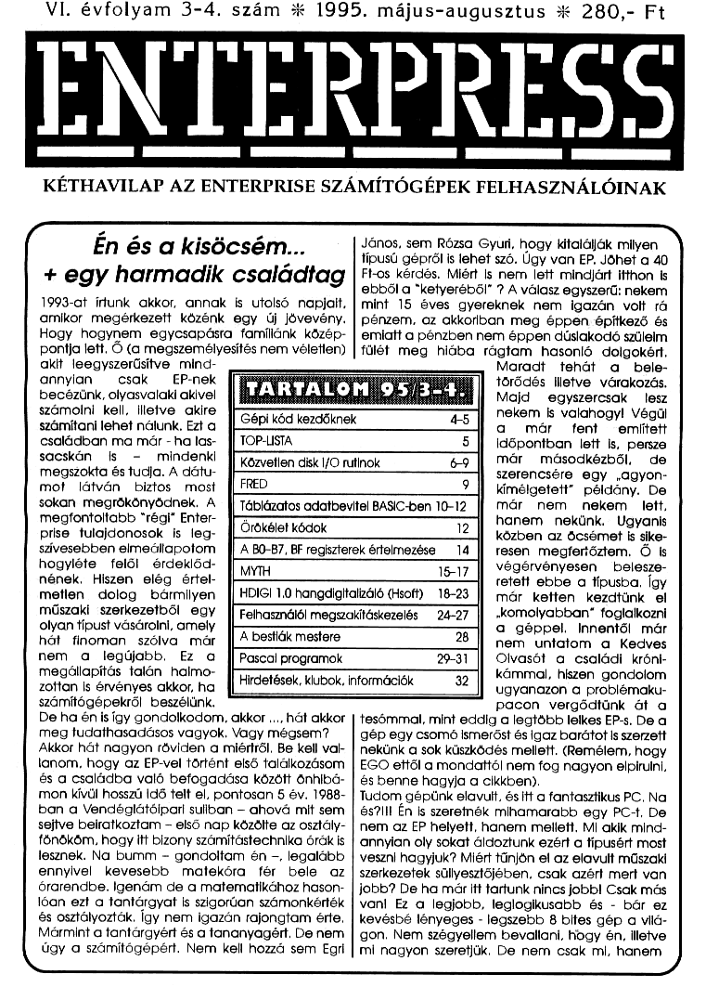

# Enterpress 1995/3-4 (1995.05-08)

[Оригінальний PDF](http://enterprise.iko.hu/magazines/Enterpress_1995-3-4.pdf) (угорською)

## Зміст

[Gépi kódú programozás kezdőknek VII. rész](https://ep128.hu/Ep_Konyv/Enterpress_Gepikod.htm#b7)  
[Táblázatos Adatbevitel BASIC-ben](https://ep128.hu/Ep_Konyv/Enterpress_Cikkek.htm#6c)  
[Billentyűzet és joystick olvasás](https://ep128.hu/Ep_Konyv/Enterpress_Cikkek.htm#6b)  
[B0-B7, BF regiszterek értelmezése](https://ep128.hu/Ep_Konyv/Enterpress_Cikkek.htm#6a)  
[Felhasználói megszakításkezelés](https://ep128.hu/Ep_Konyv/Enterpress_Cikkek.htm#7)  

----

[Чернетка вмісту](1995-05-08/epress-1995-05-08.txt)
