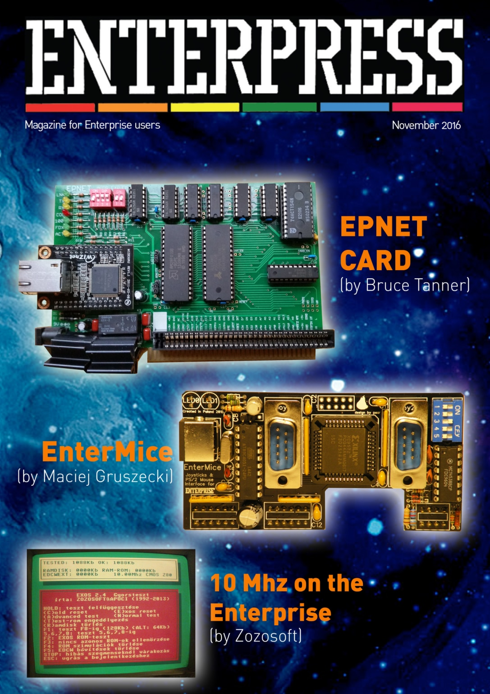

# Enterpress 2016/1 (2016.11)

[Онлайн версія](http://magazin.enterpress.news.hu/2016/1_EN/) / [Оригінальний PDF](http://enterprise.iko.hu/magazines/Enterpress_2016_UK.pdf) (англійською)  
[Онлайн версія](http://magazin.enterpress.news.hu/2016/1/) / [Оригінальний PDF](http://enterprise.iko.hu/magazines/Enterpress_2016_november.pdf) (угорською)

## Зміст

Infinite zest  
EPNET  
EnterMice  
Enterprise DevCompo #1 winners  
How I became Enterprise programmer? - Povázsay Zoltán (Povi)  
10 Mhz on the Enterprise  
How I became Enterprise programmer? - Persa Noel (geco)  
Ep128emu – Enterprise emulator  
Me, the Enterprise and my adventures with writing emulators  
Using EPIMGCONV  
