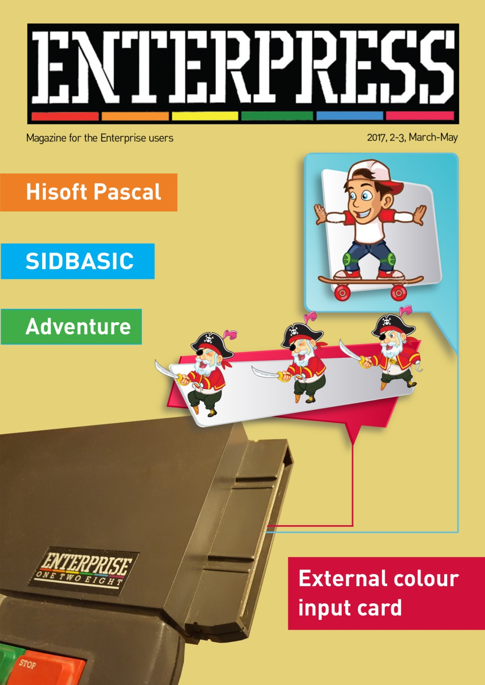

# Enterpress 2017/2-3 (2017.03-06)

[Онлайн версія](http://magazin.enterpress.news.hu/2017/2-3_EN/) / [Оригінальний PDF](http://enterprise.iko.hu/magazines/Enterpress_2017_per_2-3_UK.pdf) (англійською)  
[Онлайн версія](http://magazin.enterpress.news.hu/2017/2-3/) / [Оригінальний PDF](http://enterprise.iko.hu/magazines/Enterpress_2017_per_2-3.pdf) (угорською)

## Зміст

Time - an enemy or a good friend? (колонка редактора)  
External colour input card  
Enterprise accessories  
Management of the Enterprise memory pages  
EXOS Compatible Memory Management - part II.  
[HiSoft Pascal](2017-03-06/enterpress_2017-n2-3-hisoft-pascal_en.md)  
Games of the past  
Boot „sectorology”  
FILE  
SIDBASIC  
ADVENTURE  
GraCha - or the graphic character editor for the EP  
A missed bomb is a good opportunity  
