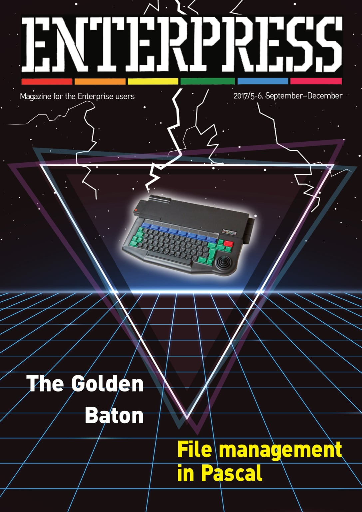

# Enterpress 2017/5-6 (2017.09-12)

[Онлайн версія](http://magazin.enterpress.news.hu/2017/5-6_EN/) / [Оригінальний PDF](http://enterprise.iko.hu/magazines/Enterpress_2017_per_5-6_UK.pdf) (англійською)  
[Онлайн версія](http://magazin.enterpress.news.hu/2017/5-6/) / [Оригінальний PDF](http://enterprise.iko.hu/magazines/Enterpress_2017_per_5-6.pdf) (угорською)

## Зміст

Enterprise MIDIDISP  
Z80 reset  
EXOS compatible memory management - part IV.  
[File management in Pascal](2017-09-12/enterpress_2017-n5-6-file-mngmnt_en.md)  
[Implementing string management functions](2017-09-12/enterpress_2017-n5-6-strings_en.md)  
System segment memory map (for non-EXOS compatible programming)  
The Golden Baton  
