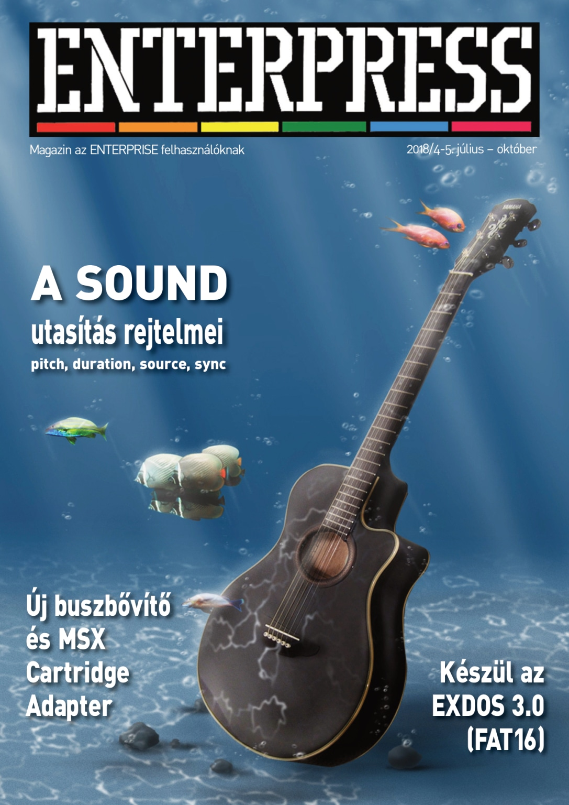

# Enterpress 2018/4-5 (2018.07-10)

[Онлайн версія](http://magazin.enterpress.news.hu/2018/4-5/) / [Оригінальний PDF](http://enterprise.iko.hu/magazines/Enterpress_2018_per_45.pdf) (угорською)

## Зміст

Az Enterprise elbűvölt képességeivel és könnyű bővíthetőségével - Interjú Maciej Gruszeckivel  
Halló! Itt az emulátor?  
A SOUND utasítás rejtelmei I.  
Új buszbővítő és M-Slot (MSX cartridge adapter)  
Microsoft Basic  
SE-ONE kártya  
Készül az EXDOS 3.0  
Arrow of Death. Part 1  
dBase II. 2.43 (IS-DOS) – II. rész  
