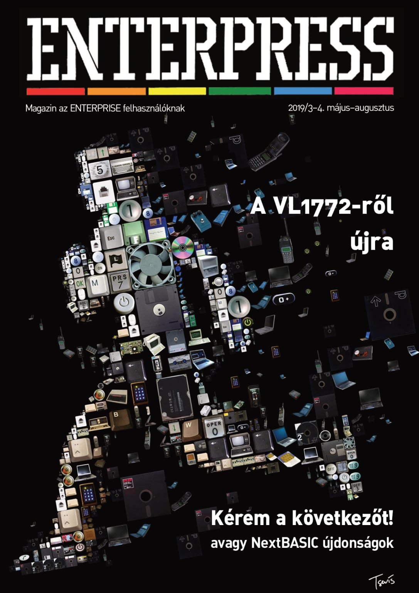

# Enterpress 2019/3-4 (2019.05-08)

[Онлайн версія](https://magazin.enterpress.news.hu/2019/3-4/) / [Оригінальний PDF](http://enterprise.iko.hu/magazines/Enterpress_2019_per_34.pdf) (угорською)

## Зміст

A SOUND utasítás rejtelmei IV.  
Hogyan állítsuk elő az Enterprise szürke színét? - vol. 2.  
A VL1772-ről újra  
ARCKÉPCSARNOK: Matthew Smith  
NEXTBUILD - Integrált fejlesztőrendszer az új ZX Spectrum NEXT személyi számítógéphez  
Kérem a következőt! avagy NextBASIC újdonságok  
Entersnake  
A grafikus-karakteres (gra-cha) üzemmódokról, 1. rész  
Feasibility Experiment  
dBase II. 2.43 (IS-DOS) – IV. rész  

