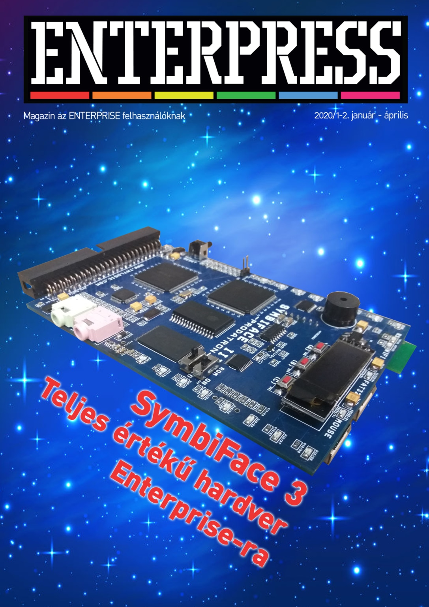

# Enterpress 2020/1-2 (2020.01-04)

[Онлайн версія](https://magazin.enterpress.news.hu/2020/1-2/) / [Оригінальний PDF](http://enterprise.iko.hu/magazines/Enterpress_2020_per_1-2.pdf) (угорською)

## Зміст

Egy nehéz időszak közepén  
SymbiFace 3. Teljes értékű hardver Enterprise-ra  
Hangkeltés a régi számítógépek basicjében  
Az Enterprise 128 megvalósítása FPGA-n keresztül  
Egérkezelés a Lemmings-ben II.  
Játékújdonságok  
IS-FORTH - 2. rész  
dBase II. 2.43 (IS-DOS) – V. rész  
