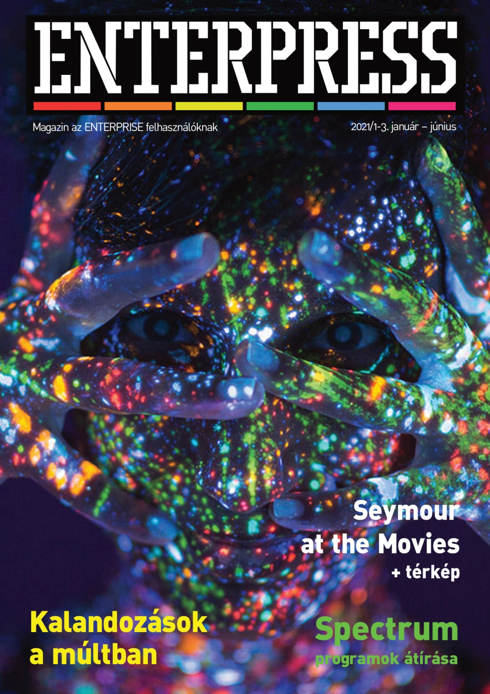

# Enterpress 2021/1-3 (2021.01-06)

[Онлайн версія](https://magazin.enterpress.news.hu/2021/1-3/) / [Оригінальний PDF](http://enterprise.iko.hu/magazines/Enterpress_2021_per_01-03.pdf) (угорською)

## Зміст

Az EP-s közösség hiánya  
Spectrum programok átírása  
Játékfejlesztésem története II.  
Hírek az RSF3 kártya fejlesztéséről  
Kalandozások a múltban  
Mondd csak! A SAY Enterprise program  
TVC - Enterprise konverzió  
RGB-YUV átalakító  
BRICKY PRISE előrendelés  
Élvezetesebb lehet a játék nagyobb társaságban  
Seymour at the Movies  
IS-FORTH - 4. rész  
dBase II. 2.43 (IS-DOS) – VII. rész  
IPlay  
