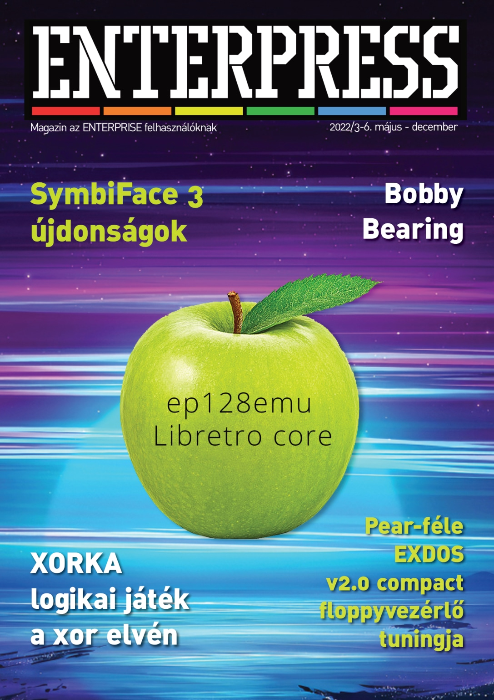

# Enterpress 2022/3-6 (2022.05-12)

 

[Онлайн версія](https://magazin.enterpress.news.hu/2022/3-6/) / [Оригінальний PDF](http://enterprise.iko.hu/magazines/Enterpress_2022_per_03-06.pdf) (угорською)

## Зміст

Erős utolsó negyedév  
Zzzzip. A BASIC compiler - 2. rész  
Hang és zene átírása az Enterprise és a TVC basic-je között  
ep128emu Libretro core  
Xorka - logikai játék a xor elvén - Enterprise változat elkészítése  
Enterprise az FPGA rendszeren  
SymbiFace 3 újdonságok  
Enteprise 128-hoz készült Pear-féle EXDOS v2.0 compact floppyvezérlő tuningja  
Bobby Bearing  
The Sword of Ianna  
IS-FORTH - 7. rész  
