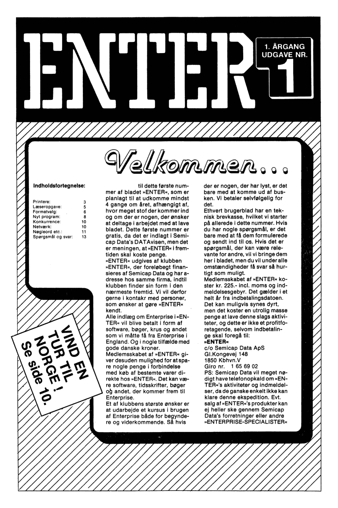
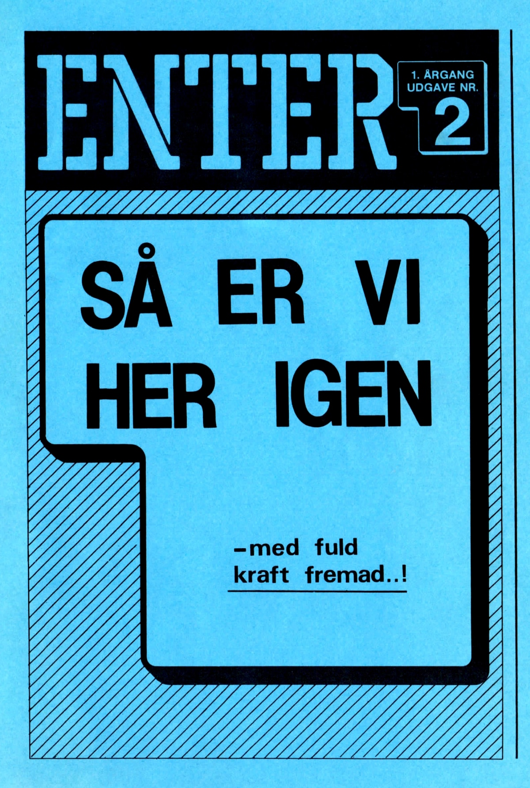
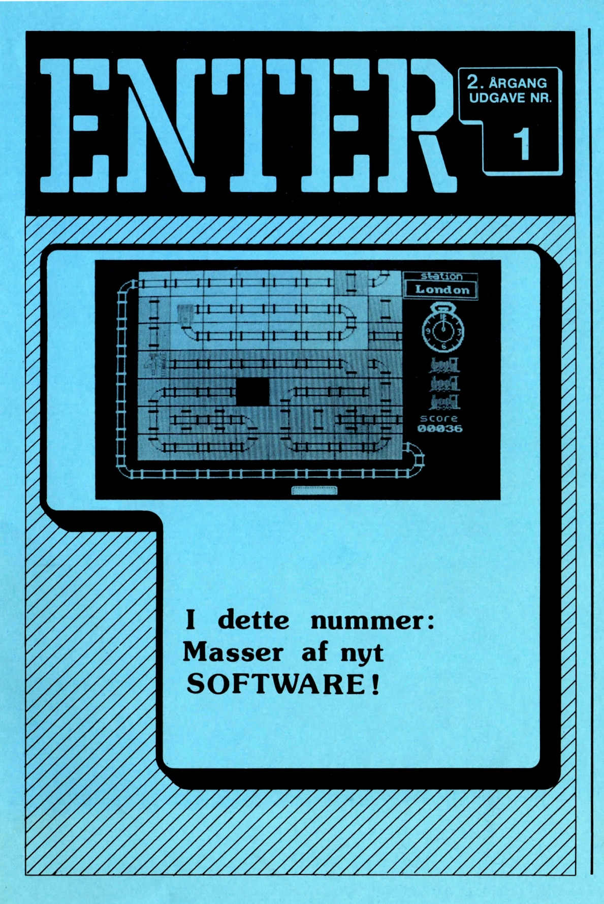

# ENTER

Спочатку журнал видавався компанією [Semicap ApS](../../companies/semicap-aps.md), яка була імпортером комп'ютерів Enterprise у Данії, але у вересні 1985 року редакцію передали двом хлопцям — Ларсу Лі (Lars Lie) та Еріку Даму Ольсену (Erik Dam Olsen). Планувалося випускати по 4 номери на рік накладом 200 примірників кожен. Однак у квітні 1987 року вони розіслали підписникам листи про те, що нові номери більше не виходитимуть.

## 1985

  
<a href="enter-da/enter-v1n1.html">
    
    
ENTER Vol.1 #1
</a>
  

  
<a href="enter-da/enter-v1n2.html">
    
    
ENTER Vol.1 #2
</a>
  

## 1986

  
<a href="enter-da/enter-v2n1.html">
    
    
ENTER Vol.2 #1
</a>
  

