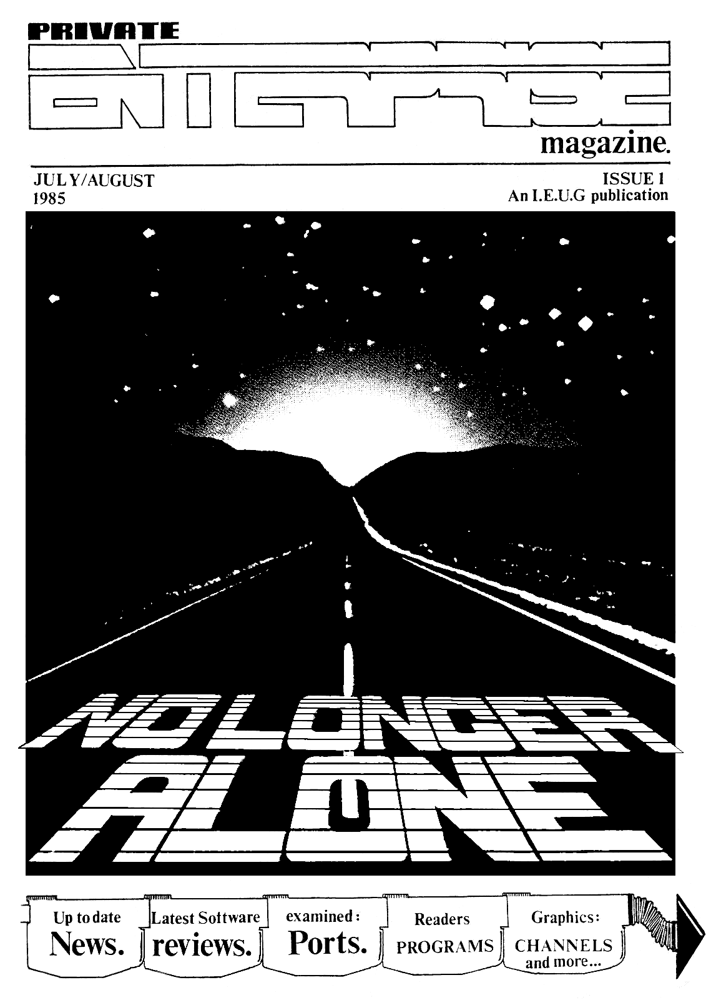

# Private Enterprise Issue 1 (1985.07-08)

[Оригінальний PDF](http://enterprise.iko.hu/magazines/Private_Enterprise_Issue1.pdf)

## Зміст

Editorial  
News Desk  
Private Corespondence  
A Long Hard Look  
Software Update  
Graphics  
Outside Connections  
Home Produce  
User Group Activities  

## Чернетка вмісту

Editorial

| Welcome to the very first issue of

PRIVATE ENTERPRISE MAGAZINE, the user
Magazine that brings Enterprise
owners out of the dark ages.

Having got this far you cannot fail
to have noticed the aessage plastered
across our front cover "No longer
alone". A bit corny, we do admit, but
it does sum up what The Independent
Enterprise User Group is al] about-
meeting other users, hearing about
the latest news, and realising you
are one of gany users who feel left
out. Uniting is the only answer.

any of you will know how our first

A Jissue has been delayed by the letter

we sent out on the 13th of last
@onth. The reason was that we
greatly under-estiaated the amount of
work that is needed to produce a
quality user sagazine,and decided not
to take any short cuts in order to
get the magazine out on the date we
had originally set. Having said
that, we do believe that it can be
iaproved both in Design and content.
(ideas on a postcard please!) If any
of you feel up to writing for us we
would be very grateful, on any
subject from articles and prograes,
to running and controlling a power
station.

Having already apoloqised for the
delay, may we apologise for
informing early members that there
would be an exclusive interview with

Pwarketing Director, Mike Shirley. ,

hen in fact there isn’t. This was
gainty due to extra work load put
upon him prior to the launch of the
128. However, we do hope to have it

/ in our second issue which will be

available before the middle
ofSepteaber (if everything goes to
plan)

We would now like to turn to the
subject on everyone's lips, that of
software (or the lack of it). We feel
we aust infora you that although
things look pretty bleak at the
moaent, Enterprise are investing
heavily to get out of the ‘catch 22!
situation, by commissioning many
software houses to produce a variety
of Business, games, educational and
utility software for the sachines:

We look forward to hearing and

meeting you in the not too distant
future.

PRIVATE

a a
P= NUL EES sutaue

magazine. 1985

CONTENTS...

ISSUE 1

NEWS DESK) witn newe of the 128k

Enterprige launch in London. New diatri

bution deale,plue a glimpse of software 4
to be released in the coming months.

PRIVATE CORRESPONDENCE >

Readers
letters, tips, problems and views. 7
ALONG HARD LOOK) the ‘sieek' EP-80
Plus. A good choice for Enterprise ? 9
We examine its capabilities.
SOFTWARE UPDATE) Full reviews of

all software currently available, good 11
and bad.

GRAPHICS»

are they, and how can we use them ?

OUTSIDE CONNECTIONS) with such a

bewildering array of compatible peri-
pherals on the market, we examine how

_ they can be interfaced to your machine. 17

HOME PRODUCE) a very useful machine

code screen save routine and two
interesting graphic demo's.

USER GROUP ACTIVITIES» can you

become a regional organiser ? Can you

attend our first meeting on the 14th of 23
July in London ?

20

C—O

An Independent Enterprise User Group Publication. Created and produced
by Mark Lissak and Tia Box. With contributions from Neil Blaber, Gary
Thomson, Dave Race» With thanks to all who helped in the production of
this magazines Private Enterprise Magazine is a copyright of the
Independent Enterprise User Group: No aaterial may be reproduced in
whole or in part without written consent from the copyright holders.

GRAPHICS CHANNELS, What 15 a

"page-003.pbm" ------------------------------------------------------------ 
yl
a

4

¢!

y
VY,
US 4
My

Enterprise flies design
centre kite.

The 20 th of May not only saw the
launch of the Enterprise 128, but saw
the day it was announced that the
machine had been selected for the
Design Centre, an accolade only given
to three other computers, the 718!
the SPECTRUM and the BBC. It is on
display at the Haymarket in the West
End of London, shewing it's
aetaeorphosis, from first grey wooden
flaking aodel and drawings te todays
finished 128k aachine.

=News Desk

The 64's Big Brother launched in London.
(attended by Tim Box.)

The 20th of May was a big day fer
Enterprise for it was the day they
Jaunched the 128k eachine» The venue
fer this histeric day was the
conference rooms at the design centre
(well at least I theught it was a
qreat day mind yee after al) that
chanpagne I was drinking ia not sure
I was thinking at all).

Upon arriving I was greeted by a very
lovely lady from the Geed Relations
Censuner LTD and offered sone af the
afere said chaapagne» Then with glass
in hand I wandered around the
conference reoms watching the arrival
of the 128k sachines and aingling
with the press. A little later we
were suamoned to a room where Nike
Shirley gave a short speech out
linning the basis of marketing
strategyfor the 128 and 64k sachines,
which included advertising, software,
retail support and peripherals. (sore
on these itees later in the news
section)» Then we were shown a couple
of videos. The first of which will be
distributed to all the outlets
selling the Enterprise. It points out
8 ispertant features of the machine
that sake it stand out froa the rest
of the competition» The second video
was of the TV advert featuring the
voice of Max Headroom and alot of
OBSOLETE looking computers-A short
speech later I was sixing with the
press again and that actley lot cf
Enterprise staff. No I should’nt call
thea that-they're a great bunch:

really» Some names you should
resember are Steve Greves, head of
technical support and Keith Elliott
of head of software and our auch
quoted friend Mike Shirly, Marketing
Director. Any way, less of this chit
chat and back to the serious business
of the launch. speaking to a few of
the press brought favourable comments
about the sachine although they were

a little wary about the growth of
the sachine being stunted by the lack
of software at the the aoment- I aust
say I agreed with thea until speaking
with Keith Elliott about the response
from his ad. in Popular Computing
Weekly, the one that said can you
convert this froa this to this
showing super pipeline 2 a commcdore
64 «and =the good old Enterpri
6d- Very enthusiastically he told a
about large nuabers of calls from
both prograners and software houses

alike, interested in doing
conversions. He also told me of
programmers raving about = the

possibility of producing some really
exciteng games on the aachine- This
kind of response from programers | ay
self have had although Ive not spoken
te alot of pepole they are generally.
very pleased with the aachines
Capabilities even if there are a few
bugs in the operating systea.

Filled with confidence I took a look
at the newly launched 128's. Visually
there is net much difference beween
the 64 and the 128k machines ence
that the joystick is now black ant-
the new sticker proclaiming its vast
128k emory: The biggest surprise
about the new machine is the speed
increase. Due to the aenory
allocation on the 64, the video
processor takes control of the
busline so it can read the video
aeaory: This in turn stops the 780
and so slows down the sachine, but on
the 128, the video processor does'nt
want your page of memory and lets the
180 zip along at 4 megahertz until
you want to write to the page used
by the video processor, only then
will the 780 get interrupted so the
end result is an on average 30%
faster machine» Next 1 typed ver$ and
up came 2.1 EXOS. This new version
has had most of the bugs that were

"page-004.pbm" ------------------------------------------------------------ 
in the 2-0 version removed. The next
thing you will notice is the amount
of memory free to the user 113k!
Thats better than any other sachine
even the QL.

Time was running out but I did get
tao = see asdf =CDemonstration
programmes» One was of the Demo
going aut with the new machines. It
Showed the view you would get froa a
shuttle flying in the user port and
over various components zooming in on
the magor chips, demonstrating the
capabilities of each in turn. Some of
e pictures drawn are very good
d the really amazing thing about
this program is that it was written
in basic. Also on display was the
Sprite Editor By Britten software. |
can't say how it performed because
there were no instructions lying
about but it looked extremely good.
Cyrus chess was there, It is claimed
to be able to beat all other chess
programs about including Colossus and
Cp super chess 3. But the most
Iapressive demonstration of the
machine was the prerelease version of
Star Strike. I have seen this
version running on the 64 and its on
par with the spectrum version, but on
the 128 with it's speed increase, it
trounces any other game of this type
Ath its fast smooth graphics: Now ay
ae had run out and 1 had to leave
but I went with the feeling of great
excitement and confidence that

Enterprise had launched a winner.

——o—————>—S>====— Sa

Enterprise signs big new
distribution deal.

A major step in distribution has been
aade for Enterprise, by the signing
up of Terry Blood Distribution LTD.
This adds to their deals with Zappe
and Spectrum groups shops who in turn
have 1200 dealer outlets. Joe Woods
T.BeD's sales and marketing director
enthusiastically said of the new
| contract “We have be looking at
Enterprise for some months and |

—_—_—_———_—_——

News Desk

believe now is just the right tine
for us to come to teras with thea.
The new 128 will provide momentua for
a major drive towards the Christaas
selling season °

I think Enterprise has a great
future. The machines are incredibly
Teliable and the support package that
they have put together in teres of
advertising and PR is exceptional. It
is a pleasure to be dealing with a
company that is offering realistic
@argins at a good price."
—X—<—<—<———_—_—asT
—_—_—_—_—_—_—_—_—_—_—_—_—_—_—_—_—_—_—_—_—_——

Aiming for Lowest return
rates in the business

Enterprise is the name, reliability is
OUT alMeceesese Thats the aessage
from Entreprise at the soment. Now
how many of you out there have bought
a computer only to get it home and
find that it didn’t work, a fair
number =o] should) = imagine» Now
Enterprise is aiming for that to be a
thing of the past with their range of
products. They started of with the
aia to keep the return rate down to
5% and claia to have kept to that
target. Now there after 34! Mike
‘Shirley of Enterprise Computers
stated "retailers want the sae
quality that the get from the
consumer electronics manufacturers:
It's disgraceful that the home
computer industry has be able to get
away with return rates of 30% and
gore". Word has it that a £50,
000 machine has been developed to
test every computer before it leaves
the factory a lot of money you aight
think, well just imagine the cost of
repairing 30% of the machines that
are ade, it looks like Enterprise
have got their heads screwed on
straight with this issue.

=—=—_—_——SSSSSEE
———————————————————_—__—=_—_—_—_—_

previous ads. seeing their own brand
‘twin disk units, These were to sell
‘for around the £600 mark but Cuamana
iate selling the same size disks for

Peripherals not ignored

Enterprise has recently launched a
range of peripherals for both the 64
and the 128k machines: They ares (1) A
colour monitor, capable of showing
all the Enterprises 256 colours. Code
named ECH1, it supports a din socket
at the rear with which you can
connect up the machine to a stereo
aaplifiere Also built in is a sono
aaplifier and speaker with volume
control, brightness and illuminated
on/of switch on the front panel,
priced at £349.95.(2) A dot matrix
printer code named EP80+ capable of
printing up to 100 cps with fonts
ranging from normal to italic withthe
capability of down loading user
defined characters. Print types
available are are emphasized,
enlarged, condensed subscript
superscripted and ss underlining:
Friction and adjustable sprocket feed
come as standard with the aachine
‘Price is £239.95. Included with both
the monitor and the printer are the
appropriate leads to connect thea to
your machine.(3) A joystick adapter.
The Enterprise has two joystick ports
but you will have noticed that they
are not Atari compatible so Enterprise
Thad) to make an adapter to connect
the two together; they are on sale
for £9.95 each.

In the
contreller.

pipe line is a disk
You might remember in

around £500 so the decision has been
sade to sanufacture just a disk

controller. This eans you can use
any 5 1/4 or 3 1/2  Shugart

compatible drives (the type used on
the beebs). They will be on display
about the PCW show tine along with
the base unit.

"page-005.pbm" ------------------------------------------------------------ 
A soft glimmer of hope

Settware is a sensitive subject at
the moment, but a ray ef light is

shining at the end of the rainbow. The

light I'a referring to is the news of
gany new titles soon to be released
by Enterseft the software ara of
Enterprise:

A spokesaan for the company said °
Since the launch of the Enterprise
128 and the start of the TV
advertising campaign, Enterprise is
being taken very seriously as a
contender in the computer market
places" He also went on to mention
these titles and companies currently
working on the machine:

OCEAN; Daley Thoapsons Decathlon
Match Day

Frankie Goes To Hollywood

Raid
Beach Head
Daebusters

US GOLD;

TASKSET ; Super Pipeline I]

MASTERTRONIC: Finders Keepers

BUBBLE BUS; Wizards Lair

ELITE; Frank Bruno’s Bexing

Airwolf

REAL TINE: Starstrike

DREAM
SOFTWARE; Machine Code For
Beginners
1-5; Forth
Lisp
Cyrus Chess I]
Basic To Basic
BITTERNE
SOFTWARE; Sprite Editor
HI-SOFT; Dev Pack
Pascal

News Desk

beth Hi-soft and Realtine claia to

have preduced their best versions of
Devpac and Starstrike respectively,

and in case you're wondering what's
happened to 'A view to a Kill’ Dowark
are working very hard to aake this
version stand out above Spectrus and
Commodore versions, though they say it
may take a little longer, it should
be worth waiting for.

Alse games such as, Jacks House of
cards, Hypersports and software
houses like Softek and Alligator were
discussed» These companies will soon
be joined by other big software
houses from here and abroad. The
total nueber of programs available by

Septeaber is expected to exceed
ninety.

——————_—_—_—_—_—_—_—_—
I

Two new titles emerge

Enterprise last week (June 28th)
announced details of two new games
titles to be launched very shortly:
The first of these is supposedly
immediately available and sounds a
little reminiscent of the Spectres
game,'Skool daze’. Called ‘Beatcha’
Its a ‘fun packed’ game where a pupil
at a familiar sounding 'Qange Hill’
comprehensive school atteaps to avoid
the teachers by negotiating a aaze of
classrooms to collect keys in order
to escape from the sain door (My god!
a psychopathic door, help!) He starts
with 26 lives and gains an extra life
for each key found.

The second gase (briefly aentioned
earlier) will be available around
aid July and is a M/Miner type gase
called Jacks House of Cards» In this
game Jack's ain is to win the love of
the Queen of Hearts, but he can only
do this by collecting all the eissing
aces scattered round the House of
Cards. The many hazards to negotiate
include electric force fields,
crumbling platforas, crushers and
monsters. There are 16 screens to

battle through and points are scored
fer each card collected. Both Beatcha
and Jacks House of Cards will be
coapatible with the 64 and 128
machines» (we hope Enterprise can

keep to these dates and restore a
little confidence amongst owners)

STOP PRESS

The very latest news on hardware
upgrades and extensions have been

aade available to us today, only one

day before this issue goes to print.
The first will be a great relief to
all those who bought a 64k mite)

when it was priced £249.95ine (that@(
includes us!) and that is that the
ram upgrade will be available in
about a aonths tise, and will be
available at cost or very close to
cost price. The best news ef all is
that the price will not only include
a tam upgrade, but a rom upgrade to
the 2:1 Exos» Well done Enterprise»

The second is very good news te all
those eagerly awaiting Enterprises
Disk Controller (if you remeaber
their own brand was dropped, as it
was thought that there was already a
nuaber of low cost drives that could
do the job.) The system will
include a flexible operating system
called ENTER/DOS. This will operate X.
the same user friendly saner as ¢
tape systea we are used to.

CA/M (TH Digital Research) prograas
can also be run under this operating
system, giving access to a vast range
of available software. The operating
system is also file compatible with
NS/DOS (TM WNicroseft). allowing
transfer of data between the.
Enterprise popular 16-bit machines:
The controller is expected to appear
soon after its unveiling at PCW.

And there's more, yes» The long
awaited base unit will arrive in the
last quarter of this year, capable of
handling six extensions such as the
new ram cards which will be available
a little before this.
"page-006.pbm" ------------------------------------------------------------ 
USER GROUPS. A pirates
haven?

Do user groups fly the skell &
crossbones ? Are WE going down the
sage avenue? Are you a ‘Jolly Reger'?
This week along with many inquiries
about upgrades, 1 received the
following letters It set ae thinking
on whether user groups were a benefit
or a liability to the industry, what
do you think? (more about this
‘ delicate issue next tise)

Being our first issue , as you can

. imagine we haven't had alot of
feedback. Perhaps you could state

ey your opinion on illegal copying, or
absolutely anything else on your
aind and provided it isn’t too
obscene, we'll print it. J can't
stress how isportant communication
between us is» Without this page
theres no action or reaction, no
change, na fun. Get-down and write to

us now: Whats your major quare ?,
Software?, Enterprise computers?, Us?

Private Pirate.

As I am very keen on software, I feel
that the club would be an excellent
way cf swapping it. If all the
geabers could pool the software to
you, then when a game is wanted, a
meaber could send you the necessary
ey postage etc and get his game, er, a
small extra fee could be paid to
contribute toward buying a new one.
| If twenty people paid fifty pence
' each, the ten pounds could easily buy
: a new game» Home made software could
also be swapped, but it would be a

bit unfair to charge a fee for it.
Good luck with the club; you

could be onto a good thing here:

ED. No comment, Let's have yours
please.

Interlace Waste.

Have you worked out how to get 672 X
312 resolution yet ? I've worked out
that you could go up te 672 X 450
with interlace, but I don't know

where the extra 62 pixels come from.
Iblegal advertising perhaps?

Jonathan Binnie,
Edinburgh.

ED. The only way te get the maxious
resolution is by defining your own
video pages (see graphics channels)»
But, Alas there is not enough seaory
in the humble 64k machine to cope
with it. This is a different story on
the 128k.

An‘ upgrade, what cost?

I've had ay Enterprise since just
before Christmas, and I fully agree
with you that its not getting the
support it deserves: The software
situation is particularly bad, and 1
for one would like to see the
promised advanced user quide!

But the biggest disappointaent
tae this week with the
‘announcement’ that the Enterprise
128k will be £250, and the 64k
dropped te £180. Ithink some pressure
should be brought to bear on
Enterprise to give their ‘faithful
followers! at least a cheap upgrade
to the 128k standard.

Steve Loft,
Statts

ED. As the vast majority of our
seabers are in such a situation, I
think some sort of statement is
called for. As for software, things
do seem to be picking up, (see 3rd
news page)

gossip, outrage, itS your page.

Problems Assorted.

IT have a few probleas which I would
be very grateful if you could help ae
with. Firstly, 1 am puzzled by the
number on the right hand side of the
status line. Could you tell ae what
this is fore

Secondly, how do you use the
PRINT USING and IMAGE commands, and
what do they do ?

Thirdly, is there any way you can
check to see what character is at a
certain character position without
using the look function ?

Fourthly, how do you use the SET
SCROLL up/down command ? What does it
mean by n-32 and a-32 ? Every tiae i
try to use it, I either get an
INVALID ESCAPE SEQUENCE report or
INVALID ROW TO SCROLL report. Could

you fill ae in on this command.
And finally, How do you use

interlace in your own prograes in
order ta get the high vertical screen
resolution: ,

Howard Ingleby,
West Yorkshire.

ED. right you awkward person, here we
go!

(1) The number you sentioned seeas
to have puzzled alot ef people. To
put it siaply, it represents the
nuaber of characters you can type
before you lose a line off the top of
the editer page, which you probably
won't be able to see as it may be off
the top of the screen. If however the
top line is on screen, the computer
will scrub the bettom line so as net

to affect your screen.
(2) PRINT USING and IMAGE are used te
"page-007.pbm" ------------------------------------------------------------ 
format text and numbers. You give the
Coaputer either a line nuaber
containing an IMAGE string, or
siaply, give the string after the
USING statement; the computer will
then try to format the data to be
printed te aatch the inage strings-

eg. 100 IMAGE-£f fff -ff

110 DO

120 - READ N

130 PRINT USING 1003N

140 LOOP

150 DATA 100,2000,-34.5,99999.99
909

160 END

would outputs-
100.00
2,000.00
-34.50
99,999.99
9-90

These commands are explained sore
completely in the manual pages 164
and 175.

(3) There is no way that I know of,
of checking what characters are on
the screen from within a progran,
unfortunately the LOOK comaand only
works on graphics screens, where it
returns the value of specific pixels.
(4) Firstly, this command will only
work on text screens. Secondly, the
Command scrolls the specified block
of screen up or down by one line.

easy» You siaply substitute the line
nuabers that you want to scroll, plus
32, for n and a; lowest Nuaber first.

eg To scroll lines 10 to 20 up one
line usel-

SET SCROLL UP 42,52

Of course the block to be scrolled
need not be on screen when the
comaand is used.

(5) The easiest way I know of using
the interlace driver froa within a
program is te put these 3 programs on

Once this is understood, the rest is

Private Correspondence

tape. Firstly the prograat- 100 RUN °
*. Secondly the interlace driver, and
finally your own progras» What will
happen when the tape is ren is, the
first prograa will load and run the
interlace driver, this will set up
the machine for interlace aode bet
will not affect the program already
in memory, and will infact re-rea
that prograa, thereby loading and
running yeur program. Remeaber that
the interlace screen uses the sane
platting co-ordinates as the neraal
screen, $0 you can develop any
‘qraphics on the easier to read non-
interlaced screen» Phew!

What really bugs me
IS-BASIC!

Below is a list of minor bugs that I
have found so far in IS-BASICs this
is alaost certainly net exhaustive. J
feel I should point out that I an net
knocking the computer's basic on the
grounds that it is bug ridden, I have
yet to see a bug free language, but
it is a little disheartening to see
Siaple faults on a aachine that has
taken so long te appear.

Having said that, IS-BASIC is

probably the ost complete fore of
basic to appear yet.

Bug line upt-

(i) RETRY
statement.
the aanual)
(2) Use of PRINT or LET with INFSINE
fora with «an errer trapped er
trapping statement causes corruption

of basic data, the computer behaves
as expected in all other situations
(3) The standard text display does
not handle 40 characters across for
the purpose of PRINT AT, eg. PRINT AT
3,39 causes the print te occur at
what would be expected te be 4,2;
this is caused by the videe editor,
and does not occur on user defined
text screens.

(4) There is an errer in the COS

is not allowed in an if
(this is not mentioned in

function so that COS(PI/2) is given

as 1€-11.
(5) # is ignored in immediate aode if

at the beginning of a line, not se
auch a bug as a peculiarity.

(6) There seeas to be some probles in
using goto. Don't laugh !, it has
it's uses; From within error trapped
or trapping routines, if GOTO is used
te leave one of these routines, it

has a habit of crashing.
(7) In case anyene hasn't noticed the

remote sockets are reversed. I don't
know if this has been solved on the | .
new machines (whe said you only gev,.
software bugs ?)

(8) There is a bug with the TIMER,
causing inaccuracies in tising with
this function, up te a 258 deviation.
(9) The leek coasand only works on
graphics screens, although i¢ can be
used in iemediate aode to return the
ascii value of the character at the
current cursor position. Suggestions
On a postcard tovceees

(10) ALLOCATE -n clears the current
program. there is also a far sore
serious bug within the allecate
function which stops it from working
at all after the first tiae it is
talled.

(18) Despite being able te create a
screen 255 lines deep, you can onl
scroll the tep 223 lines.
(12) If a screen too large fer the

memory to cope with is created, then

instead of producing an = errer

wessage, it crashes.

(13) VAL (STROCA(N,M))(XtY)) doesn't

werk.

Dave Race,
Oxford.

ED. If we get anyaore we'll have to
tun a new page!! perhaps we will?

This page is open te you NOW and for
the next twe months, please aake use

of it. We publish all letters ef any

iapertance, we are net linited by
space.

"page-008.pbm" ------------------------------------------------------------ 
=A long h

The first peripheral on most people's
shopping list is very likely te be a
printer and,to be honest, no
Enterprise owner should be without
one. How else could yeu show off your
literary master piece or debug that
long program you've been working on
all week. There are a very large
huaber of printers on the aarket
cesting anything from below two
hundred to over two theusand pounds,
all of which are compatible owing to
the Enterprise centronics pert. The
printer I's loeking at today is the
EPSO+,  Enterprise’s own brand
printer. The name EP80+ aight sound
similar te Mannesmanntallys offering,
the ‘“MT@Q+", this is because they
are one and the sases The only
difference is the colour of the case,
the EP80+ having the saee colour
scheae as the Enterprise.

Included in its sturdy carriage box
is a ribbon cartridge, operating
sanual, paper guide wire rack and the
cable to connect the Enterprise te
the printers centronics port. First
iapressions of the aachine are that
it is good leoker and has a fairly
robust feel te it, so it sheuld stand

up toa fair bashing without falling
apart.

Once all the parts are assembled, the
shipping screws removed, and the

way,

power lead plugged inte the aains,
the paper can be inserted. A large

tinted plastic cover sits on top of
the paper feed and this: piece
is hinged at the rear, hooking into
slots on the «ain casing. Once the
cover has been lifted out of the
the paper feed sprockets can be
seen. Fhese are adjustable and will
take anything from 4 1/2 to 10 inch
paper either plain or sprocket fers

type» Inserting the paper is a easy
process, and the only tiae it gave
trouble was if the paper was tern at
the edges. The front panel holds
three ode buttens and four warning

lights. The buttons are Fora Feed,
Line Feed and online. The first, as
you would imagine, is for auto
feeding paper through,a sheet length
at at tine» The line feed button

feeds paper through ene line at a
tine and the online butten stops the

flow of information from the computer
te the printer, seo halting printing.
The lights are abbreviated and are
warkeds PWR to indicate power on, OL
te show that the printer is on line,
sRD indicating that it is ready te
accept data, and PO that it is about
to run out of paper ( when this
happens a buzzer sounds and the
printer goes off line).

Printing from basic presented ne
trouble as the Enterprise supports

LPRINT and various other commands, te
send data te the printer. Controlling
print is also very easy with the
centre! codes almost identical to |
that of the EPSON'S. LPRINT chr$(27)3

usually forms. the basis for aost

centre! cedes so that the printer

knows to expect centro) data rather

than text etc. Then with a

combination of different characters,

line spacings, tab spacings and

character sets etc can be called and-
controlled.

Basic type fonts are noraal, Pica,
Elite, Italic, preportienal,
superscript and subscript. To these
you can in mest cases double strike,
eaphasize, condense and enlarge-You
can even combine twe or three
together. Alternate character sets
are U.S.A, FRENCH, DANISH,
SWEDISH, ITALIAN, SPANISH, JAPANESe
and graphical.

The printer can be made to default te
these by setting the dip switches.
These are hidden inside the aachine,
requiring several screws and the
Casing to be removed te gain access
te thea, se it's net a job you weuld

want te do often. Other default
settings obtainable by the dip
switches are line = spacing,

coluanlength, fora length, zere slash
and perforation skipping» A feature

"page-009.pbm" ------------------------------------------------------------ 
of the eachine, not that often seen
on other machines, is the Capability
to down load user definable
characters. Bit image graphics are
another option of this aachine, though

this is quite common now on aest
printers.

The quality of the print is not up to
NLQ but never the less it was ef a
high enough quality te be presentable
for letters etc. Figel is an exaaple
of the various print aodes and

A long hard look

quality available. When in fall
flight it is fairly noisy theughnot
deafening, a 60 db sound reducing kit
is available. This was not available
to me,but it should quieten the the
machine down a fair bit. Alse
available is a 4K buffer, useful when
printing long documents, freeing the
aachine to to the user long before
the printer has finished printing.

Conclusion:

At £239 the machine represents good
value for money. The nearest
coapetitors in this price range being
the Brother £009 at £199 the Fastext
80 at £228, and the CPA-80 at £228.
Though a little mere expensive, it is
faster and sis) certainly alot
better looking than its competitors,
its sleek looks matching those of the
Enterprises Also remenber that
included in this package is the
printer lead noraally priced at
around £14.

FIG.1

PICA mode. ABCDEFGHI JKLMNOPQSRTUVWXYZ-9123456789+=~* ! £exy
ELITE mode. ABCDEFGHI JKLMNOP@SRTUVWXYZ-9123456789+=* ! foun

Condensed mode. ABCDEFGH! JKLHNOPUSRTUVUXYZ-B123456769+="* ! fete

Emphasized mode. ABCDEFGHI JKLMNOPQSRTUVWXYZ-98123456789+=~* If

Double strike mode. ABCDEFGHI JKLMNOPQSRTUVWXYZ-2123456769+=*

1£O%&
ELITE/double strike. ABCDEFGHI JKLMNOPQ@SRTUVWXYZ-9123456789+=~* ! fens
Condensed/double strike mode. ADCBEFGHIIKLMNOPRORTUVWXY2-0122456700+="*! sony

Euphasized/double strike. ABCDEFGHI JKLMNOPG@SRTUVWXYZ-91 23456
7B +a~* | FORE

GHITJKLGNONG
Sam" 1 BY

FGHIIJIKLMNO
'£ BRR

onde segieniarged mode. ABC DEFGHI JKLMNOPASRTUVWXYZ-9
1234356769+=~* ' F£Sae

Sr Soar sec anoeoses asd mode. ABCD
EFGHIITIKLMNOPOaQSRT VWXYZ ~-B12VF3sBaSssS
Y~B9+=~~" § £8

BO DERGH TE see Meese ase.Meis: a
BCDEFGHISJIKLMNOPGSRTOVWx<YZ2-Biz2es
4356789 +=a£~~ ! £mB%Ka.

ELITE/double gtr/eniliarged mode. ABCD
EF SHS SKLMNOPGSRTUVWXY 2=9123456789+—a~

trféenil ar asa mac a
MNOPGSRTOVWxY2z2-sg
£2%8<

N 3
QU
BON
\ma
O70
OE
+10
[He
(us
oA

10

"page-010.pbm" ------------------------------------------------------------ 
=Software
=Update

eas
SN

WUT

TL

SOFTWARE UPDATE is an integral part of Private Enterprise, dedicated to the
review of software currently available to the user. Although software

availability for the Enterprise aachines is becoming a very stale joke aaong
its critics, we have managed to un-earth several of these elusive titles and

got our review team to give them a good going over (in some cases a trampling)
Their reactions follow.

KEY TO RATINGS;
ARCADE and ANIMATED ADVENTURES

GAME CONTENT

- Variety of actions
‘ | screens
PLAYABILITY - Ease of use,

oa ii
GRAPHICS - duality ane ue " It ll Bring out the various factions, together with their
; graphics related te Idi Amin in you. strengths.
aachine
SOUND - Use of stereo and NAME t DICTATOR This is) a fair version of a
tune / noise | Producer ¢ Entersoft traditional computer game which is
originality. Category + Strategy not particularly complex but is fun

(Starter Software)

VALUE FOR MONEY - Overall impression Price [5.95

when compared with
prices

to play. It is written entirely in
IS-Basic and is one of Entersoft's
Starter Software series - this aeans

you are allowed to break into the
part of the unscrupulous President of program and look at and modify the

the banana republic of Ritiaba. Your code, which is supposed to help the

ais is to stay in power for as long | novice understand the rudiaents of
as possible - this means ‘keeping the | programming and some of the
various factions (peasants, army, | constructs of [S-Basic. However, the
landowners and Secret Police) happy | prograa is badly written and
while holding the guerillas in check | completely undocuaented, thas
and diverting funds to your Swiss | defeating the Starter Software object
bank account. Failure to do this will | by aking the programaing mechanisas

result initially in assassination | almost ispossible te coaprehend !
atteapts by an unhappy group, or

ultiaately in revolution if the group | COMMENTS :

joins with the guerillas or with | GT. Siaple but fun gase lacking

another unhappy group. lasting interest. Pity you can’t side
with the guerilla forces !

In this strategy gage you play the

ADVENTURES

GAME CONTENT

~ Design of plot /
background. Puzzle
ingenuity.

PRESENTATION

~ Atmosphere graphics
(if any), text /
screen layout.

INTERACTION

- Parser quality,
editing facilities

VALUE FOR MONEY - Overall iapression

when compared with
prices

Play takes place month by month - you

have to deal with requests froe | NB. There doesn’t seea to be an
individual groups after considering "| option to torture or iaprison the
the consequences of your actions. | composer of the National Anthea !
Other decisions are made via a menu ( | It's horrible ' Unfortunately there
most decisions can be sade enly once | aren't enough different things that
per game) such as increasing your | can happen to give this gaae auch
popularity, raising cash etc. At} lasting appeal.

various tiaes during the aenth you

can request a Secret Police report

showing your popularity with the

PERCENTAGES

0-25 - Yuk, Bleah !
26- 50 - Bad to Mediocre
Si- 75 - Average te Good
73-100 - Excellent to completely
Brilliant

i
"page-011.pbm" ------------------------------------------------------------ 
Gane Content 50% On the cassette inlay the control
Playability 65% keys ate given as 0,P,0,A and Enter -
Graphics 50% ignore this ! The on-board joystick
Sound 55% controls cursor aovement with the
Value For Money 40% space bar being used to execute
instructions - rather an oversight on
———————————} 09), part !
—ooCoCoCo
roe) COMMENTS :
Is that the pink ?! GT. The gane is fine to play when

but on a noraal
difficult to

using a sonitor,
television it is

t STEVE DAVIS SNOOKER
CDS Sofware

Nase
Producer

Category $ Arcade distinguish the cue ball from the

Price + £8.95 pink and the green ball from the
yellow - the brown ball is alse

This is a very realistic snooker | father dubious.

Simulation for two players (including

NB. My initial iapression after the
setup of the table (which on the
first game after loading is painfully
slow) was that the pockets seemed
exceptionally large when compared to
the size of the balls - however this
didn't seem to improve ay scores at
all ! I was very iapressed with the
ball moveaent and ricochets - very
Pealistic. Pricewise this is still
very expensive even if it is the best
snooker simulation available.

long or short game options together
with a single player practice option)
+ A point to aake at this stage is
that the version we tried was
INCOMPATIBLE WITH THE 128K ENTERPRISE
although it worked perfectly well on
the dK machines [t 18 unclear
whether the problem lies with the
program or with the Enterprise, so if
you are a 128K-owning snooker fan and
CAN run Steve Davis Snooker please
write and let us know before we
launch a nationwide campaign in order

to resolve this problea. Game Content 70%
Playability 70%
OK then - let’s get back to the game. | Graphics 608
For those who have seen the Spectrum | Sound 40%
or Aastrad versions of this game, the | Value For Money 55%
versions are almost identical. for
those yet to chalk up their digital Sams
cues, this is the best snooker | ———————————————J
simulation currently in existence for
& microcomputer. features include a
tetake-last-shot option (even in the Beaten,
two player game |) and forcing a FIVE IN AROW

fouling player to play on. Taking a
shot involves positioning a cursor in
order to determine the direction of
the shot, altering the power of the
shot (this is indicated by a bar

Nane : FIVE IN A ROW
Producer ¢ Entersoft

Category ! Strategy
(Starter Software)

running along the bottom of the | Price : £5.95
screen), and spinning the cue ball (
which is done by positioning a cursor | This is another game which is

INCOMPATIBLE WITH THE 126K ENTERPRISE
' The game involves placing sarkers
on a 15 x 15 grid in order to get

on a representation of the cue ball
in order to show the point of contact
of the cue).

12

Software Update

five aarkers in a vertical,
horizontal or diagonal line. Play can
either be between two players or
against the computer at one of six

levels (we couldn't tell the
difference

between = levels - they're all
iepossible to beat ')» There are

facilities for taking back moves (
useful for cheating purposes when
you're playing the computer) and to
swap sides with the computer (also
useful if you're taking a hammering).

The cassette inlay claias this to be
another of the Starter Software
series - this is by far the worst of

the series so far for learning
purposes = as it is totally
undocumented and comprises many
Machine code routines which are
totally incomprehensible to the
beginner.

COMMENTS 3

GT. 1] was comprehensively thrashed on
all levels (even after cheating !')

NB. Unbelievably expensive for what
amounts to a very siaple gaae (
although quite playable and well
iaplemented) which is totally useless
for programming tutorial purposes.

38%
70%

Gane Content
Playability

Graphics 30%
Sound none
Value For Money 20%

eee
—————————————_—

Still going strong

Name t Colossal Adventure
Producer ! Level 9

Category 3 Adventure
Price = t £9.95

This is the classic grandaddy of

"page-012.pbm" ------------------------------------------------------------ 
—_—_—_—_—_——_—_=_=_3

all text adventure gases. Originally
‘written for a mainframe it has been

reproduced
Level 9 Computing, with the addition

of an extra 70 locations as an "end

You have been given a aap
containing the location of Colossal
Cavern which is rumoured to contain
untold wealth. You start the gane
Standing outside a brick building and
your initial task is to discover how
to enter the caverns. Ultimately you

ust find all the treasures and
Weturn them to the building.

In comparison to some more recent
adventures, Colossal appears fairly
unsophisticated with input restricted
to «simple sentences and limited
editor functions. However, this is
pore than compensated by the
marvellous atmosphere generated by
the brilliant location descriptions

and the ingenious puzzles contained
within the caves which have to be
solved in order to get all the

treasures. Unfortunately we cannot
comment on the end game as neither of
us has managed to get that far!

| COMMENTS:

 Y9GT. Next on ay shopping list will
be Snowball from Level 9 ( when they
get round to releasing it). These are

ay two favourite adventures, siaply
great fun.

NB» Old but brilliant. J eagerly
await the rest of Level 9's catalogue
which they are busily converting for
the Enterprise.

Presentation 90%
Interaction 60%
Game Content 80%
Value For Money 80%

—————=£:=
I

for the Enterprise by

Diamonds
are forever

Name 1 Fantasia Diamond
Producer & Hewson Consultants
Category 3 Adventure

Price t £7.95

In this text + graphics adventure
game, your quest is to retrieve a
stolen family heirloom, the fabulous
Fantasia Diamond and also to rescue
Boris the asterspy whe, on a
previous @ission to find the diasond,
was captured and thrown into the
dungeons. An added dimension is the
existence of other independent
characters who bop around at randoe
pretending they're going somewhere
really important. The game takes
place in REAL TIME - every 15 seconds
the independent characters will
perform an action regardless of
whether you have or not.

The screen is split into two
windows. The bottoe four lines of the
screen comprise the comeand input
window, with the remainder showing
either a graphic picture of the
location or location description and
computer generated messages. The
first innovative use of an Enterprise
feature is the command input window:
This allows the use of thefull editor
features, including the facility to
scroll back in order to edit and re-
execute previous commands. Also the
function keys have been set to the
most frequently used commands to cut
down unneccessary typing. When a
picture disappears, the underlying
text has not been deleted, but merely
scrolls up - hence recent messages
can still be read.

The parser
understands
little as
their

(command interpreter )
abbreviations of as
three letters as long as
1s no ambiguity ( this doesn't

do much for readability but is a boon
lazy typist!)

for the

Software Update

COMMENTS

NB» Amazing! A game which shows
that the programmer has investigated
the machine's capabilities before
converting the code from the
Spectrua.

GT. The graphics window is too
large for the amount of detail in it.
Apart from this ainor quibble this is
the best use of the Enterprise that |
have seen to date.

Presentation 70%
Interaction 83%
Game Content 65%
Value For Money 75%

————_—_£_*__E::=
3

Meanwhile, chaos at
London airport

Naae t Heathrow A.T.C.
Producer ! Hewson Consultants
Category { Siaulation

Price =} £705
This is a highly complex and
detailed siaulation of the workings

of Heathrow Air Traffic Control. You
are the controller and it is your job
to land as aany aircraft’ as possible
in an allotted 30 minute period.
There 18 a comprehensive instruction |
pamphlet included with the program,
although pressing CONTROL and H will
bring up the first of a series of
online help screens which give an
overview of the instructions together
with command descriptions. There are
eight levels at which Heathrow ATC
can be played, ranging from pretty
damn =s difficult to absolutely
impossible! Each level brings an
additional features to add to the
airborne chaos you are already
creating.

The = screen

shows a radar type

Picture of the Heathrow Airport and

at the top of the
cosaunication

surrounding areas

screen i$ a radio

"page-013.pbm" ------------------------------------------------------------ 
Software Update

windew via which yeu issue commands
to the aircraft and get feedback froe
thea. Also displayed is in an
inforaation windew giving details on
the aircraft present on the radar
display.

Commands are issued by single key
entry together with numeric values in
some cases» Once yeu learn enough te
be able to play without constantly
looking at the instruction paaphlet
you will find thea quite easy to use.

COMMENTS

GT. The Instruction paaphlet filled
we with dread and foreboding, but
after I found the “help” facility I
actually sade some progress. So far I
have managed te crash 4 aircraft (
what do you sean -thats not the the
point of the exercise 7). This game
take a LONG tine to get into.
Recommended for those with 5 or 6
hours to kill.

NB. What I want to know is who this
bloke called Roger and why is he so
popular? I was never cut out to be an
Air Traffic Controller anyway and
these airline captains are giving ae
an inferiority complex by asking for
some other guy all the time so
think I'll hand in ay notice and
become a brush salesman instead! A
Comforting thought, however, is that
you can organise multiple air crashes
and other such atrocities - this adds
excitement to what is otherwise a
Tather boring game.

Gane Content . 75%
Playability 435%
Graphics 50%
Sound 35%

Value For Money 55%

oo
I

‘Attack of the medium
sized blobs

——

Name 1 GAMES PACK 1
Supplier t Entersoft

(Starter Software)

Price £5.95
Games = Pack «=s 8S comprises = twe
pregraaaing atrocities of

uniaaginable preportions - Eddie the
Exterminater and Windsurfer - and is
said by Entersoft to be "a aixture of
novel gaaes for old and young te test
your wits and your reflexes”. On the
front of the cassette inlay is the
word ARCADE. This is somewhat
misleading - Arcade
action, excitement and zapping, all
of which are totally absent froa
either of these prograas:

Eddie the Exterminator involves
soving Eddie (a little blob) through
10 rooms in search of the Great
Diasond of Esah, aveiding the
guardian robots (sediua-sized blobs)

or destroying thea by luring thee
onto mines (big blobs) which are

scattered liberally about in each
room: In Windsurfer you aust quide
your an through a = rather
overpopulated sea, avoiding inanimate
patrol boats, ferocious rocks, dead
submarines and speed(??)boats in
order to reach an island (there are
10 altogether) and blow it up.

Both gases are written in [S-Basic
and sare incredibly slow and
unresponsive - pressing the STOP key
(the best feature of either gase)
halts the pregrae and invites you to
examine and aodify the code -
unfortunately there is no
documentation to let you know what is
happening and the appalling structure
of the prograss rules out siaple
investigation - maybe this is the
test of wits Entersoft aentioned !

COMMENTS 8

GT. This was written by a REAL
KLINGON !

( can anyone beat 13300 on Eddie the

implies fast -

Exterainator? )

NB. If this was five pounds cheaper,
and was publicised as being the twe
worst games ever written it would be
a good laugh (I love the way bits of
tobot seen to disappear when they're
clase together). Unfortunately it is
deadly serious and at £5.95 don’t
bether.

Game Content 15%
Playability 10%
Graphics 15%
Sound 3
Value For Money 10%

COMMENT

Should Entersoft's  "NON-STARTER
SOFTWARE® carry a governeent health
warning ?

Entersofts starter software series is
an example of an excellent idea,

| bodged seo badly that it should never

have seen the light of day- Producing
well written & decumented 1S-BASIC
prograas which make good use use of
Enterprise features in order to
deaonstrate programming constructs to
the novice in a way which a ari 2
would never atain is a stroke o

genius. However, the first three

teleases in the starter series are so
unbelievably appalling that if a
novice were te seriously examine the
code it would do actual hare by
ieplying that the terrible sisuse of
constructs is the correct way to
prograa !

Comments are alaost totaliy absent
from any of the programs, and
variable names in thea bear no clue
as to their use. As fer construct
misuse, there are jumps froe the
middle of loops, unnecessary
IF.».THEN tests on consecutive lines
and sixed use of GOTO's, GOSUB's and
DEF stateaents.

"page-014.pbm" ------------------------------------------------------------ 
=Graphi@s

One of the best features of the
Enterprise when compared with its
competitors is its. graphics, bat
te make = the most of thea yeu have
to know how te contro) the VIDEO
PAGES. If you leok in the sanual all
the inforaation is there, but it is
spread ail ever the place to such
an extent that hunting through to
find it all takes. forever! and even
(Gen it is not explained clearty ¢
typical anual style ). Well, te save
you the trouble of searching through
I have dene it fer you, and with a
few pictures and some text I hope to
be able to explain it all in clear
English.

GRAPHICS CHANNELS

The reason for having graphics
channels is because the graphics chip
( WICK ) is so very flexible. On
most other ‘obsolete’ skeletal
computers, graphics pages are decided
for you, and there isn’t a sausage
you can do about it,a case of like

it or lump it. This approach to the

machines graphics has two
Pratvantages 1. Your screen
resolution

is decided for you, ie if
you want te display a high res
 sereenjit’s all high res, no in
betweens (that is if you are lucky

enough =6to) «have «more than one
screen res)» 2. The semory.For
example, if you want to display a
screen of high res and some text, you
have to use a whole screen for it,
and that takes up a lot of aesory.
How ever,with the Enterprise, you can
decide what res, what colour, what
Size, where you wagk it. and, most

iaportantly you can aixaodes. Say
for example you have the top. half in
high res and have the bottom ina
memory saving text mode it soon
becomes very clear just how auch
memory you can save. Fantastic you

i_—T— i — x —¥@)

S @ © 8 Sa Gauls

GS ga gaa we Bei ae a

J eed Gee Geel De Ged

@ a ~] a Baa ©
@ gs fl tal jane

RESOLUTION MODES

MODE 0O
MODE 1
MODE 2

MODE 15 = ‘Attribute’

COLOUR MODES

MODE O = 2 Colours
MODE 1 = 4 Colours
MODE 2 = 16 Colours
MODE 3 = 256 Colours

think! ‘but how do I de it??, well,
read ORescccasccescaness

Start by ieagining that a graphics
channel is a sheet of paper, you can
decide what kind of res it is, how
any colours you want on it, how big
it is and what part of it you want to
see. With this in mind, we shall ieok
at the way you would define and
display a page.

100 SET VIDEO NODE 1
110 SET VIDEO COLOUR 2
120 SET VIDEO X 20

130 SET VIDEO Y 10

140 OPEN f£L0:"VIDEO:*
150 DISPLAY £10: AT | FROM 4 TO 20
Line 100 tells the computer that you
want wake a page of high res
qtaphics. The 1 denotes the type of
graphics mode.

Line 110 tells it that you want to
display 16 colours. Here again the
number 2 @eans the code for the
nuaber of colours. See fig 1 for full
list of modes and colour codes.

Line 120 says you want it to be 20
Characters squares across. It can be
anything from 2 to 42 squares wide:
Line 130 is the same as 120 but it is
the nuaber of character squares tall.
From 1 to as auch as 255 squares

40 Column text page
High resolution graphics page
80 Column text page

MODE 5 = Low resolution graphics page

graphice screen

high.
Line 140 says ‘I want ay page
called channel 10 and it is a VIDEO
page-(as epposed te a channel for a
tape recorder)'.The werd OPEN aeans
give me space in aeaery for ay video
page. When you close a channel you
give memory space back to the
coaputer.
Line 150 the first part of this
line tells it to display on the
screen my page called channel 10. The
second part (and this is the
interesting bit) says I want it to
be displayed from screen character
position 1 downwards and J want you
to show ay page from the first
character to the twentieth» You could
of course show the page from the
third to the fourteenth, it is
entirely up to you (see fig 2). But
if you run it and fill it with colour
you will see that the page 1s
positioned in the aiddle of the
screen, width way» There is I's
afraid no way of goving this about
side ways or only displaying some of
the width ef your page,(from basic
any way) This is a saall disadvantage
I'e sure yeu would agree when you
compare what you yee can do ona
Spectua or Coasodore (or should |
say you can't do it on thea). Just
because you can't seve it side ways

"page-015.pbm" ------------------------------------------------------------ 
dees net ean yeu cant move your
viewing hole up and down: Let ae tell
yeu that it can, and with this
function you can get, some really

spectacalar effects, as you will note
if you try the pregran at the bettes

af this article.

KoaciA ——>
|

SCREEN |

'

eSCREEN, START OF

HEIGHT

Now te elaberate en these points. As
yeu have seen in fig 1 there are 5

different pades te cheese free but
note that if yeu cheese a graphics

page, every increase in the colour ‘€-VIDEO X —»

aveber =o reduces) =the = herizental 2 COLOUR Leres = 320 pixels wide
resolution by half,so you have te | FIG.4 4 COLOUR Lores = 160 pixels wide
coapromise ever the resolution te the | cry ecHans BEAN OFF/ON 16 COLOUR Leres = 80 pixels wide ¢
colours When you display a page yeu | ger eCHAN: BIAS COLOUR-CODE 256 COLOUR Lores = 40 pixels wide

will note that the space next te the
border is changed te the border

SET £CHAN! BORDER COLOUR-CODE ; ;
SET £CHAN! CHARACTER N,A,B,C,D,E,F,0, 2 COLOUR Hires = 640 pixels wide

colour (see fig 3) sWhen opening a | 1 4 COLOUR Hires = 320 pixels wide
channel it can be numbered any thing | SET FCHAN: CURSOR COLOUR NUMBER 16 COLOUR Hires = 160 pixels wide
froa © to 254 but it is best not te | SET FCHAN: INK COLOUR NUMBER 236 COLOUR Hires = 80 pixels wide
open it to a channel that is SET {CHAN LINE MODE

already open, (ie- £104 as it | SET £CHAN? LINE STYLE £1018 «Graphics = page == «40,20

SET (CHAN! PALETTE A,B,C,D,E,f,6,H,1 | characters wide by high and is in

aready used for tape reading and
SET £CHANS PAPER! COLOUR COLOUR | celower aede t.

writing) If yeu choose a channel.

below 100 it will be closed when you | NUMBER £101t Text Page page = 24,40

ran the progras or any other task | SET £CHAN! SCROLL ON/OF characters wide by high and is ir

that clears all variables, but if | SET {CHAN! SCROLL UP/DOWN colour made 0.

you cheese a channel above 100 it | PLOT £CHAN: X,Y

will stay epen until yeu close it | PLOT £CHAN: ELLIPSE X,Y If you open a graphics page and call

yourself, er, reset the computer. PLOT £CHAN! ANGLE expr it £101: all commands can be used
PLOT fCHANS LEFT /RIGHT expr with out stating the channel Ne. as

When = writing, drawing, etc. to a | PLOT CHAN PAINT it defaults to that channel.

graphics page, you can can use all | PRINT {CHAN, AT

the graphics commands that you | LOOK (CHAN? AT X,YI¥ When setting up a page, set the

have become familiar with when using | CLEAR {CHANE . colear ne to 12 or 5 colour and watch

the default graphics screens. The sent

interesting effects.

only difference is that you have to

state what channel you are writing | Channel demonstration pregran

to +» fig 4 is a list of all the | 100 TEXT
graphics commands and. syntax for use | 110 PRINT “Please WAIT a aenment" 230 «= FOR Fel07 T0(107-24) STEP-1
with predefined graphics channels. | 120 SET STATUS OFF 240 DISPLAY £L0L3AT 1 FROM F TO
Another advantage of making up your | 130 SET VIDEO RODE 5 107
own video page(s) is that you can | 140 SET VIDEO COLOUR 0 230 = (NEXT
draw on it without it been seen until | 150 SET VIDEO X 40 260 «FOR F=l06 TO 25 STEP-1
it is finished, then in an instant, | 160 SET VIDEO Y 107 270 DISPLAY f1042AT 1 FRON(F-
display it in all its glory» The last | 170 OPEN f101:°VIDEO:" 24) 10 F
fig. is a list of a few interesting | 180 SET £101°PALETTE BLACK WHITE 280 = NEXT
things that can be discovered if you | 190 PLOT £1018(1279/2),(53#36), 290 FOR Fa2 TO 25
read the seall print in the aanual. 200 PLOT, ELOURELLIPAE(1270/2) (S58 300 DISPLAY f1OLtAT F FROM 1 TO
- “aly -
210 PLOT £101!PAINT * | 340 NEXT
220 DO 320 LOOP

16

hee
"page-016.pbm" ------------------------------------------------------------ 
INECTIONS —

a regular feature of private enterprise. this issue-

As. you will know doubt have noticed
there are a number of interesting
looking sockets running the along the
rear of the Enterprise and although
they look rather odd they are in fact
fairly standard and are siaple to
make use of. Unfortunately the manual
gees into little depth on these
matters, I hope now to clear up sone
of the aysteries of peripherals, and
examine how we can make use of thea.

Taking the monitor socket first and
working across the machine to the
control ports .The aonitor socket has
infact facilities for three items :-

1A colour aonitor
2 A monochrome aonitor
3A stereo amplifier

The colour aonitor you use should

support an analogue input and is
known as an &-G.B monitor. This is
not the ost common systee but it is

a better one than the TTL type (the
more popular model). Using this, you
would only be able to show 8 colours.
This is because there are only two
states that the red, blue and green
Signals can be, either on or off,
waking them aore like binary signals.
The maxiaue perautations from three
bits being 8 RGB signals can be
anything from 0 to 4 volts so
increasing the number of alternatives
almost infinitely, hence the ability
to display the Enterprises 256

colours.

The monochrome monitor is not such a
headache in that it only produces two
signals. This produces an ideal
display for 80 coluan word
processing.

The stereo amplifier is of course a
simple means of taking the sound out
to your hi-fi etc turning those
little ‘plinks and blips’ into ear
shattering stereophonic 4 channel 8
octave sso. 'PLINKS and BLIPS.

Now that we have discussed what we
can connect, how do we do it? The
first thing you will) notice about the
sockets is that they are an extension
of the main circuit board. This was,
say Enterprise, because it was
inexpensive and reliable (why don't

they just say what they mean-'CHEAP!!
)-To connect this to your peripheral
you'll need an edge connector socket
and from this to your sonitor plug, a
suitable piece of cable, (aulti core
screened is recommended.) With all
the pieces of equipment at hand

including a soldering iron and
crossed fingers, we can begin. Look
at the pc board within the aonitor
port, You'll see thin strips of setal
on the top and underneath. As you
look into the socket (with ports
facing you) the top row is called the
B side and the bottom the A side,
with numbering starting from the lett
to right (eg top left is Bel and
bottom left is Al) This form of
nuabering applies to all ports.

For connections on your particular

sonitor, see the sanual supplied with
it.-

17
"page-017.pbm" ------------------------------------------------------------ 
(if you have'nt thrown it away
with the guarantee!)

Use screened cable.

A.l is connected to the GREEN SIGNAL
line

A.2 to Ov on the monitor either the
Colour or monochrome usually the out
side braided wire

Ac3 the MONOCHROME COMPOSITE line (
usually the center one of the two).
A.d is ‘the HSYNC if you have one on
your monitor.

A.S is the VSYNC if you have one.

A-6 there is no metal strip here but
the space it is still counted,

A.7 is the left half of the AUDIO
SIGNAL.

Bel there is no strip but again still
counted.

Be2 Ov use it as the common for the
audio lines

B.3 the BLUE SIGNAL line.

Bid the RED SIGNAL line.

B.S this is the syne line to your
COLOUR MONITOR if you don’t have the

separate HSYNC or VSYNC lines.

B.6 MODE SWITCH (Peritel) dont worry
about this it has nothing to do with
us.

Be? this is the other half of the
AUDIO SIGNAL (the right side.)

Now that you have papefully soldered
all the pieces together in the right
place, checking all connections and
Making sure there are no shorts, you
are now left with the problem of
remeabering to put it in the right
way up-To over come this problem
Enterprise has made little blips on

the socket wall, two on each side and

one on the top, so that if you put
the plug in up side down the lack of
slot in the plug would prevent it
from going in properly, but as we
dont have proper plugs we have to
Come up with other ways of preventing
this, i'm sure you'll come up with
some idea of your own, but in case

you don't try this» Cut a piece of
card or circuit board to

thick hard

18

the width of the port and about 60
wa long, plug in your edge connector,
turn your computer up side down,
place the card etc on top of the edge
connector in the slot, and strap the
cable onto the board with insulating
tape, pull the plug out, and glue the
edge connector to the board then wrap
the rest of the cable and plug to the
board see fig 1 «Now try and plug it
in up side down, good isn't it. This
method of connecting can be used with
all the sockets.

Next along is the serial/ network
port, just the thing to connect up
wodems plotters etc to + Here again
there are pin outs for aore than one
ites, RS432 and the network.

Once again aake sure that you get the
right plug for the peripheral that
you are going to connect to this port
and check that you have the right
pin outs. (6 core screened cable is
advised.)

Connections to the serial port.

1 REFERENCE.

+2 Not connected but counted.

3 RTS.

«4 (TS.

B.1 GROUND.This should be connected
to the braiding on the out side of
the cable.

Bo2 Not connected but counted.

B+3 DATA out.
Bed DATA ins

Signal levels
0 = Ov
1 = 12v

ref line
0 = -5yv
{ = +7y

A point te watch is that the
reference line is an offset ground’,
this may not be possible with certain
equipment configurations.

Connections for the network
Use 3 core screened cable. @.
A-3 and Avd are connected together to
form the ‘CONTROL BUS’.

Bel you connect to the braiding on
the out side of the cable.

B.3 and B-4 are connected together to
fora the "DATA BUS’.

You will note that you can only
connect two machines together if you
aake up a plug to plug cable, but
with a bit of imagination and two
stereo jack sockets and plugs you
could connect more than two machines
together loo’ at fig 2.

Along side the
printer pert,
connectine uf

serial port is the
you guessed it, for
standard centronics-

"page-018.pbm" ------------------------------------------------------------ 
em Mate

printers.

Use 12 way flexible ribbon cable

At the computer end use a 7 way edge
connector, and at the printer end use
a standard printer plug.

To make it really easy just connect
up as stated.

Ael Ov connect to pin 16
A.2 / STROBE connect to pin 1
Ae3 DATA 3 connect to pin 5
A.4 not used but counted

(@pi-5 DATA 2 connect to pin 4

A.6 DATA 1 connect to pin 3
Ae? DATA 0 connect to pin 2

{ Ov connect to pin 33

2 /READY connect to pin it

3 DATA 4 connect to pin 6

4 not used but still counted
B.5 DATA 5 connect to pin 7

B.
B.
B.
B.

| Be6 DATA 6 connect to pin 8

B.7 DATA 7 connect to pin 9

The last two sockets on the back are
the control ports. To these you can

connect joysticks, mice, tracker
balls extra keys and 1 dare say alot
of other things not yet dreamt of.To

a

understand how to connect the extra
peripherals to the port you have to
know how the pins are read by the
computer.

Look at fig 3, it is a matrix of
wires! If two wires make contact at a
cross over (ie when a key is pressed)
the computer will know about it, It
does this by sending a signal down a

X wire then checking each Y wire in
turn. If it gets a signal back from
that Y wire it knows that it was at
this intersection, thus deducing
which key was pressed. With this out
of the way I can now tell you the
wiring connections of the two ports:

Contro!] }

As! KEY BOARD J an X signal line.
A.2 KEY BOARD L an X signal line.
A.3 not used but still counted.
Aud KEY BOARD 4 a Y line.

A.S KEY BOARD 2 a Y line.

A.6 KEY BOARD O a Y line.

Boi OV

Be2 KEY BOARD K an X signal line.
B.3 not used but still counted.
Bad +5V

CONNECTOR

CONNECTIONS
NOT AS SHOWN)

B.S KEY BOARD 3 a Y line.
B.6 KEY BOARD 1 a Y lines

Control 2 is the same as control |
but for the following connections.

Aud KEY BOARD 9 a Y line.
A.5 KEY BOARD 7 a Y line.
Aeé KEY BOARD 5 a Y line.
B.S KEY BOARD 8 a Y line.
B.6 KEY BOARD 6 a Y line

To connect up a joystick use these
pin outs: Alternatively you could
make a joy stick adaptor, just
connect an edge connector to a female
9 pin D plug (Atari type) and strap
it to a piece of board as explained
earlier.

Ael COMMON connected to the common
wire in the joystick.

Aed RIGHT connected to the right
switch:

AeS DOWN connected to the down
switch.
Ae6 FIRE connected to the fire
button.
B.S LEFT connected to the left
switch.

B.6 UP connected to the up switch.

For those of you who don’t know the
joystick end connections they are as
folows. When you buy the right
joystick compatable socket the pins
are numbered from 1 to % $0 the
numbering here corresponds to that.

Comaen is pin 8.
Right is pin 4.
Down is pin 2.
Fire is pin 6.
Left is pin 3.
Up is pin 1.

That concludes this article on the
ports but always reaeaber -CHECK YOUR

WIRING. If you have any probleas
understanding this guide or have had
problems interfacing, please dent
hesitate to contact us.

We regret that we cannot accept liability for any damage caused by following this article

19
"page-019.pbm" ------------------------------------------------------------ 
= Home Produce

"De it fer fame net fortune.” This is another ‘user contribution page’
The success ef it, as dees aost of the sagazine, depends en the user. What
we would like te see on this page are short concise prograas of not aore SN ae aa = > r
than twe Ad pages werth that make best use of the aachines advanced ty 7 es
specification. Please supply your masterpiece on tape. (and listing, but . sdb |
nly if yeu have access te a printer) We will of course return all tapes

as soon as we have finished with thea.

100 SET STATUS OFF The first two programs in this issue are two graphics demo's

110 DIM P(2,20) ,¥(2,20) from Chris Moore of Devon. The first is based on aathesatical

120 LET CHOICE=1 foraula producing two 3D isometric plots on two different

130 LET C10 graphic pages. It then allows you to toggle between thee when

iso pa Vor Caue ! they are both complete. We aust warn you it takes aany

160 SET BORDER RED stardates to run.

170 OPEN £Ct "videos" , y

180 SET £C2PALETTE RED, YELLOW, BLACK

190 SET fCIINK 1

200 DISPLAY £C:AT 1 FROM 1 TO 24

205 PLOT £C:50,40

207 PRINT £C:"NOW GO AND MAKE A CUP OF TEA.°

210 LET XXs1

220 LET TaXXx

230 FOR X#1 10 2

240 «FOR Y=1 TO 20

280 ON CHOICE GOSUB 410,420

260 LET P(X, Y)=INT((XX/24¥/2)#60)

270 LET V(X, ¥)=INT( (Z+XX/2-¥/2)#40#400)

280 = NEXT

290 LET XX=Xx+i

300 NEXT

310 LET X=t

320 FOR Y=1 TO 19

330 i £CEP(XY) W(X) sPCK#L VY) V(X44,¥) gPCK#E VOL) UCK4L VEL) sPCK, VL) W(X, VtE) sPCK,Y) V(X, Y)
340 NEX

350 LET T=T+1

360 LET XXsT

370. IF XX=19 THEN 430

380 GOTO 230

390 LET CHOICE=2

600 GOTO 210

410 LET A=XX-10:LET B=Y-10SLET Z=COS(SQR(A#A+BEB) )#2:RETURN
420 LET ARXX-108LET Be¥-10:LET Z23EXP(6-(SQR(ASA+BEB)))/3StRETURN
430 SET £CSINK 2

440 PLOT £021, 1, PAINT

20

450 LET C=11

460 SET BORDER BLACK

470 WAIT 5

480 IF XX=19 AND CHOICE=2 THEN 510

490 LET CHOICE=2
500 GOTO 140
St0 TEXT

520 PRINT "Move jeystick up to display first picture" -
530 PRINT "Move joystick down to display second picture.®

540 LET C=10

550 WAIT 10
360 DO

570 IF JOY(0)=8 THEN LET C=10
580 «IF JOY(0)s4 THEN LET C=tt
390 DISPLAY £C:AT 1 FROM $ TO 24
600 LOOP

er
"page-020.pbm" ------------------------------------------------------------ 
Home Produce 3

The secend of Chris Moore's graphics demo's is an animation program on the

lines ef Elite, (well net quite) only with a triangle. What it does is sets up

two graphics channels, then in a loop calls the triangle calculating routine,

draws a triangle onte the page (decided by the variable chan ) displays the

page and toggles the page No- Then goes reund in the loop again, this tine

drawing on a freshly cleaned pages The net (chan) statement is binary logic,
| and the end result is that the chan Ne. swops between -1 and 0. (You do of
| course have to change this nwaber to a integer above 0 se thats why all
references te chan have +2 with it:

190 1 SET UP SCREENS AND A FEW VARIABLES

120 LET CHAN=0
| 130 RANDONIZE
140 CLEAR SCREEN
| 150 FOR SCR=i TO 2
| 160 SET VIDEO MODE 1
170 SET VIDEO COLOR 0
190 SET VIDEO x 40
190 SET VIDEO Y 20
200 OPEN £SCRi*videot®
210 SET FSCRIPALETTE BLACK, WHITE

220 NEXT
230 LET A®RND(SO)SLET B=RND(SO)ILET C=RND(5O)SLET DeRND(50)sLET E=RND(SO)ILET FeRND(5O)ILET X1,Yi=O8LET X2,¥3=200

LET ¥2,X32100

240 |
250 | HAIN ROUTINE

260 !

270 00

280 CALL CALC

290 CALL DRAW

300 CALL DISPLAY

310 LOOP

320 |!

330 |!

340 ' CLEARING OLD AND DRAWING NEW TRIANGLE ROUTINE
350 DEF DRAW

360 CLEAR £CHAN+2

370 PLOT {CHAN#20K1,Y1;X2,¥2sX3,¥3541,, Vi

380 END DEF

390 | 2.
400 ! TRIANGLE CALCULATING ROUTINE 2,38
410 ! aa
420 DEF CALC 8

430) LET X2@X14ASLET Yi=VI+BeLET X2=X2eCULET V2eV2eDILET XISXIELLET YI=VIeF
440) «IF X101279 OR Xi¢O THEN LET A=-ASLET X1=X14A
450 IF X2)1279 OR X2¢0 THEN LET Ce-CELET X2=X24¢
460. IF X3>1279 OR X3CO THEN LET E=-ESLET X3=X3+E
470 IF ¥1)719 OR Y1¢0 THEN LET Be-BtLeT YizVieB
480 IF Y2>719 OR Y2¢0 THEN LET D=-DsLET Y¥2=¥2¢D
490 IF ¥3>719 OR Y3CO THEN LET Fe-FsLeT Y3=V3+F
500 END DEF

510 !

a ‘ DISPLAY AND SWAP CHANNELSROUTINE

340 DEF DISPLAY

530 = DISPLAY £CHAN+22AT i FROM 1 TO 20

560 LET CHAN=NOT(CHAN)

370 END DEF

"page-021.pbm" ------------------------------------------------------------ 
Home Produce

The last of the programs in this issue of Home Produce is
courtesy of IS and Dave Race and fills an important gap
in IS-BASIC, a screen save command. The program works as
follows; Lines 100-290 are to get round the allocate bug
(those of you with 2.1 Exos, leave it out) and works by
peeking memory to see if the allocate command has been

100 LET UNIQUES="SCREENS*
110 LET DESIRED SPACE=400

120 LET SIZE=DESIRED_SPACE+LEN(UNIQUES)

130 TF VERNUM=2 THEN

140 LET T=PEEK(544)+256#PEEK(545)-SIZE

150 FOR X=1 TO LENCUNIQUES)

160 IF PEEK(X+T-1)< ORD(UNIQUES(X!X)) THEN
170 ALLOCATE SIZE

180 POKE 542, PEEK (544)

190 POKE 543, PEEK(545)

200 CODE ="SCREENS*

210 RUN

220 END IF

230 NEXT

240) LET X=X4T

250 = POKE 540,X BAND 255

260 = POKE 5d1,X/256

270 ELSE

280 ALLOCATE DESIRED SPACE

290 END IF

300 !

310 !THE MACHINE CODE ROUTINE

320 !

330 CODE VSAVE=HEX$("ES,21,CB,D,A
340 CODE =HEX$("71,23,72,23,73,23
350 CODE =HEX$("28,6,3D,28,2,2
360 CODE =HEX$("D1,D5,7B,6,3,F
370 CODE =HEX$("C1,3,28,7C,B5
380 CODE VLOADSHEX$("E5,11,BB
390 CODE =HEX$("23,D1,D5,7B,6
400 CODE =HEX$(°23,D1,D5,7B,6
410 CODE =HEX$("C5,D5,7A,F7,5

wn oF
aN. 306
oon wo oe 28 Moemed
-— WAH Mm
om

iJ

B,
B,
yy,

This program below can be added to the first routine, and
demonstrates the M/C , by drawing ellipses, then saving
the screen onto tape and reloading it back onto a clean
graphics page» To use the screen save routine, follow
these steps! (1) Open a channel to tape thus, OPEN fchan-
Noi*TAPE:file name* ACCESS OUTPUT. (2) CALL USR (VSAVE,
256#chan-notvideo_page-no)» (3) CLOSE fchan-no

430 ! DEMONSTATION OF SCREEN SAVE IN USE
440 !

450 TEXT

460 GRAPHICS HIRES 4

470 PLOT 660,360,

480 FOR N=12 TO 1 STEP-1

490 SET INK MOD(N,3)+1

300 = PLOT ELLIPSE SO#N,252N,
310 PLOT PAINT

520 NEXT

330 |

340 ! SAVE SCREEN

550 !

560 PRINT AT 1,2:*PRESS SAVE ON YOUR TAPE THEN ENTER®s

22

2
3,7
,DB,B2,F5,C5, 78,7
1B5,20,E1,F1,D3,B

called before, If so, dees not call it again. Lines 330-
410 is the machine code routine. It looks up the start
and end address of the screen from pointers in the Nick
chip, transfers the contents to the specified channel,
which duaps the code to tape» (When loading in from tape
it works in reverse).

")
8,A,FE,4*)

747, 7A,05,F7,7,DF 01")

mw nh

3 7")
rik 8,CB,B0")
2,09,

~~ TT Cal

To load in from tape (1) set up a screen the same as it
was saved from. (2) OPEN Echan-not"TAPE:file name". (3)
CALL USR(VLOAD, 256#chan-notvideo_page-no). (4) CLOSE f
chan-no

370 DO

580 LOOP UNTIL INKEYS=CHR$(13)

590 OPEN f106:"tapetscreen® ACCESS OUTPUT
600 CALL USR(VSAVE , 256#106+101)

610 CLOSE £106

620 !

630 'LOAD SCREEN

640 !

650 CLEAR £101

660 GRAPHICS HIRES 4

670 PRINT AT 1,22"REWIND TAPE PRESS P
680 OFEN £106: 4tapetscreen* AND PRESS PLAY

690 CALL USR(VLOAD, 2568106+101)
700 CLOSE £106
710 END
"page-022.pbm" ------------------------------------------------------------ 
Private Enterprise not only provides an informative and lively
magazine, but also supports a national user group network, The
Independent Enterprise User Group.

The main aim of the group will be to organige regional meetings
and activities stretching the length and pbreadth of the
country, allowing fellow members to meet, have fun and do
whatever else they want to get up to! As yet, although there
are a fair number of you out there, you are spread in pockets
throughout the country. The only area in which meetings have
become viable at the moment is in London (though I'm sure
you'll remedy that)

This column will appear every issue with details of future user
group activities and meetings. Those of you who wish to be put
forward as regional organisers, please write to me at the usual
address. Please include your address and phone number (if

‘applicable) giving details of when and where meetings are to be

held. (We recommend that these meetings should be every month
or sco, as many may have to travel some distance to attend,

perhaps on the last weekend of every month. .

As mentioned earlier, there will be a London meeting on 14th
July 1985 from 2pm to 6pm at the user group headquarters, 40,
Mansfield road, London, NW3, 2HT. The best way to get here is
either by bus route 24 , 46, C11. Or by Underground, northern
line BELSIZE PARK (about 8 mins walk) see map below for
directions. We hope all Londoners will do their utmost to
attend. Members from outside London are also invited. Hope to
meet some of you soon, and don't forget to write.

User Group Activitic ==

. 23
"page-023.pbm" ------------------------------------------------------------ 
BY ARRANGEMENT

