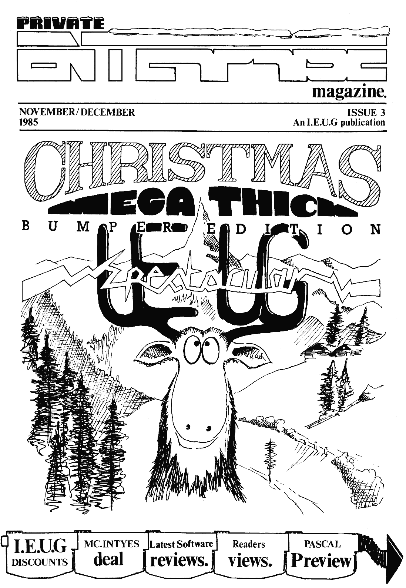

# Private Enterprise Issue 3 (1985.11-12)

[Оригінальний PDF](http://enterprise.iko.hu/magazines/Private_Enterprise_Issue3.pdf)

## Зміст

Editorial  
News Desk  
A Long Hard Look  
Programming  
Preview  
Software Update  
Graphics  
Advanced Programming  
Home Produce  
User Group Activities  
Offers  

## Чернетка вмісту

"page-000.pbm" ------------------------------------------------------------ 
PRIVATE

Cc \ See ES
| magazine.

NOVEMBER/DECEMBER ISSUE 3
1985 AnI.E.U.G publication

nd

"page-001.pbm" ------------------------------------------------------------ 
= — Offers

Well, here's what everyone's been waiting for (ineluding
ourselves '). Basically, there's a saving of at least a pound on
any software title currently available, rising to a massive £5.00
saving if you buy a ROM cartridge. Also, the most ridiculous dise
drive prices ever seen ‘due to Cumana'ts superb offer. Merry
Christmas one and all! Ho ho ho ! NB. At present these offers
only apply to IEUG members resident in the UK.

SOFTWARE
(All prices include postage & packing)

LISP, FORTH (ROM cartridges) 22. .£25.00 (save £5.00)
DEVPAC (cassette) »...-£17.50 (save £2.50)
Cyrus Chess II .+-- £11.50 (save £1.50)
Colossal Adventure, Raid, Nodes of Yesod, ....£8.50 (save £1.50) ~ }

Beach Head, Machine Code For Beginners, iy
Tiny Touch 'N Go

Heathrow ATC, Steve Davis' Snooker ..2.£8.00 (save £1.00)

Beatcha, Jack's House of Cards, Airwolf, .22.87.00 (save £1.00)
King of the Castle, Fantasia Diamond,

Word Hang, Animal Vegetable Mineral,

Happy Numbers, Happy Letters, The Abyss,

Adventure Playground, Castle of Dreams,

3D Starstrike, Devils Lair, Sorcery,

Mordons Quest, Spanish Gold, Chains,

Wizards Lair

Dictator, Games Pack 1, Five in a Row, ...- £5.50 (save 50p)
The Market

IEUG's Greatest Hits Volume 1 ....£2.00 (a bargain !)
(eontaining Private Enterprise progs, AVAILABLE
graphics demos, Eddies Revenge and JANUARY
Mastermind... full review next issue)

ro

HARDWARE

CUMANA single 3.5" floppy dise drive ..--£105 (save £5.00)
(complete with power supply,
mains eable and interface cable.
Storage capacity 1 Megabyte
unformatted).

CUMANA twin 3.5" floppy disc drive »»--£180 (save £20.00)
(complete with power supply,

mains cableand interface cable.

Storage capacity 2 Megabytes

unformatted).

PLEASE MAKES CHEQUES PAYABLE TO THE 1.£.U.G.

"page-002.pbm" ------------------------------------------------------------ 
Editorial

Yahoo ! It's finally here ! The
long-awaited Issue 3 of Private
Enterprise magazine is now in your
hands ! "Delayed again '" I hear you
crys Unfortunately catastrophes do
occur - in this case Gary and I were
struck down with the dreaded Lurgy
while trying to escape from the aliens
who had captured us while we were
waiting for the disc controller and
the correct prices for the software
deal. The fact that there are only
five of us who end up doing pretty
auch = everything (including writing
articles in the wake of the apathy
seemingly present in this area !)
ans that if anyone goes AWOL then
he deadlines go up the spout !

Anyway, enough of the apologies and
accusations.... its Christmas !' We
have been busy (well, Dave and Timhave
been busy) sorting out some brilliant
offers for youes. the cheapest disc
drives available legally (1 think ')
and lots of silly software prices !

Also, the background arrangements here
have undergone a facelift. IEUG
President Mark ("don’t talk to ae
about lifes..") Lissak has passed on
most of the work to us humble sinions:
The incredible Dave (Spider) Race now
handles the news pages while delving
‘or deals on the sides ‘Auntie’ Tie
Box (the housewives’ favourite) is our
rrespondece an and controls the

megazap the aliens, oops J's dead
again) Blaber corrects the spelling
mistakes (well.. Literary Editor to be
pompous) inbetween reviewing the
latest software, a tasks he shares
with Gary (wake ae up in tine for
Issue 4) Thomson who is also Technical
Editor extraordinaire.

Finally, we're all just recovering
from the first IEUG national meeting |
A big thumbs up to all who attended
(all fifty-odd of you) - I don't need
to say a good time was had by all. See
you in 1986 (hopefully) !

Neil Blaber

oney supply. Meanwhile Neil (freaky

PRIVATE

a
= T0 Non/ De

magazine. 1985

CONTENTS...

NEWS DESK) can Mc.Intyes new Christmas 4

bundle give sales @ needed boost ?

PRIVATE CORRESPONDENCE» An avalanche 6

of your views from here and abroad.

ALONG HARD LOOK) expos- tne definitive 11

Christmas stocking filler.

PROGRAMMING) Escape sequences and 12

control codes PART ITI

PREVIEW) Gary Thomsom gets a sneak
Preview of the Hi-soft Pascal compiler 14

SOFTWARE UPDATE) iunatic reviews

including the smash hit ‘Sorcery.

GRAPHICS) cet rouna the problem of

screen co-ordinates calculation.

ADVANCED PROGRAMMING) the 1ine

Parameter table by Peter Walton

tated program to be publighed

HOME PRODUCE) the first sound orien- 24

USER GROUP ACTIVITIES> Have regional 28

area user groups finnally arrived ?

'
OFFERS > discounts across the board on 2

hardware and software

SSS eee

THE INDEPENDENT ENTERPRISE USER GROUP

60 HOLDENHURST AVE, FINCHLEY
LONDON N12 OHX
ENGLAND

Se

An Independent Enterprise User Group publication. Artwork and layout MARK
LISSAK, Correspondence TIN BOX, News Editor DAVE RACE, Literary Editor NEIL
BLABER, Technical Editor GARY THOMPSON. Private Enterprise Magazine is a
copyright of the Independent Enterprise User Groups No article may be

reproduced in whole or in part without written consent from
holders

ISSUE 3

the copyright

"page-003.pbm" ------------------------------------------------------------ 
=News Desk

A Mc Intyre Xmas
In a pre-Christnas advertising| their sachine. The external RAM
campaign, Enterprise, in conjunction | expansions have unfortunatly been

with McIntyre Marketing Ltd. have
announced two @ail order package deals
on Enterprise products«

delayed until after Christmas... Oh
| well, no 4 megabyte machines yet.

Bargain drives

Cumana have started manufacturing 3.5"
disc drives in distinctive ‘Enterprise
grey’ at the very low price of £199.95
and £109.95 for the dual and single
drives respectively. These drives are
double sided, double density units
with a built in power supply and offer
real value for money (even cheaper if
you choose to take advantage of our
disc drive offer ~ see the Deals page
for details !).

It is possible that Enterprise may be
releasing a disc drive with built in

EXD0S disc interface for the German
market. However it is still in
prototype fore and it is uncertain

whether a commercial version will
eventully be made available.

—_—_—_—_—_—_—_—_—_—_—_——

The
Enterprise

The

first package will include an
128, a data recorder,

joystick interface, joystick and five

software titles all for £199.95. The

normal retail price would be £338.55.

second package includes a 128
coaputer, Fidelity TW/aonitor,
joystick interface and five software
titles. Normal retail price would be f
529.90. Through the McIntyre/
Enterprise deal these products can be

purchased for
£299.95.

The software titles are Steve Davis
Snooker, Nodes of Yesod, Machine Code
for Beginners, Star Strike 3D and
Beach Head. The advertising is being
restricted to the national press and
the packages are only available by
mail order direct from McIntyre
Marketing Ltd.

A spokesman for Enterprise could not
give exact details on how long the
deal would last but doubted whether it
would be continued after Christeas:

———————
——————

No more hard times

A fair bit of news on the hardware
front this month. Firstly, the disc
interface you've all been waiting for
should be available as you read this (
the official release date is November

ist), priced £99.95. See the review
later in this issue which should
remove any doubts as to how brilliant

EXDOS actually is-

Internal RAM expansions for 64K owners
are available now, at cost price to

those who paid the original £250 for

Subject to negotiations with the
powers that be, we should soon be able
to offer IEUG members a joystick with
built-in interface to connect directly

with the Enterprise (providing it
passes the [EUG quality contro}
process !). This will be sanufactured

by Aztec and will be based on the
Vulcan Gunshot joystick, with auto
fire options More news next issue.

Finally, the mouse and Speakeasy
(conspicuously absent at the PCW show)
should also be with us in the very
near future. The mouse will be
‘released with some software of the
icon-driven type, although don't
expect anything to rival the Macintosh
just yet. The Speakeasy will have 2
text decoders - English and German,
with more on the way including French
and Danish: These will allow the unit
ta pronounce noreal text, this being
ans inmprovesent§ «upon the standard
Allophone systea.

ee
—_—_—_—_—_—_—_—_—_—_——_—_—_—_—

At last

There is a lot of povenent on the
software front at the moment, as can
be seen from the reviews Later on

Software companies are at last aaking
some use of the advanced features of
the Enterprise, notably the sound
chip, "Dave". The following titles are

scheduled for release by the end of
Noveaber i-

Lands of Havoc (Microdeal)
Super Pipeline 11  (Taskset)
Frank Bruno's Boxing (Elite)
DEVPAC (Hisoft)
Airwolf (Elite)
"page-004.pbm" ------------------------------------------------------------ 
py

=News 1 *—*$_—_—SSSSSS

The Abyss (AcT. Products)
CadCas Warrior (Taskset)
King of the Castle (AsI. Products)

IS-Forth (Intelligent
Software)

Race Ace (Acls Products)

Pascal (Hisoft)

Wriggler (Devonshire
House)

Wizard's Lair (Bubble Bus)

The Artist (Loriciels)

Falcon Patrol I (Virgin)

Database (Geaini
Narketing)

Subaarine (Semicap)

Basic Compiler (Aztec)

Achine Code for
Beginners (Dreaw Software)

Things are at last looking healthier
in the software field - with thirty
titles (including some essential
utilities) on =the way before
Christmas, we should be able to look
forward to many enjoyable evenings of
keyboard bashing in front of a nice
blazing fire !

Coo
eee
Domarks Dodo

Domark have finally given up trying to
produce ‘View to a Kill’ on the
nterprisee This title was announced

y months ago as being available on

a number of machines, including the
Enterprise. However, after many delays
and excuses the title has now been
dropped» It seems that there were a
number of problems in getting a good
scroll] routine to work on the

Enterprise (perhaps they should have
had a word with @!).

Good news to all owners who sent off a
cheque for the non-existent prograa.
Not only will Domark be refunding
their money, but they will also be
offering compensation to everyone:
although its not clear at the moment
what fora this compensation will take.

Incidently, Domark will be bringing | We would like to welcome all European
out a new title, “Friday the | readers of the magazine, and look
Thirteenth", for the Christaas market, | forward to any contributions you would
so if you have a good scroll routine ( | like to make.

or any programming skill at all, by | —————————_____L___L
the sound of it - €D) gid) ——————

with thea ! .
—— Effective ?
T wonder how aany readers have noticed

oo
Enterprise's ‘subliminal’ advertising

campaign that is being run in Popular
Computing Weekly ?

Enter-poll

53% of computer owning parents have
never used their computer, and less
than one in ten believe they know more
about coaputers than their children.

Those that haven't should turn to the
contents page of a recent issue,
presuming they have one, and look down
at there bottom of the page» There,

before your eyes, will appear a quote
about the Enterprise that was

previously impressing itself upon your
subconscious - fiendish, eh ?

This was one of the findings in a MORI
poll commissioned by Enterprise
recently. The report also stated that
of the 329 children and 201 parents
questioned, 54% use a computer at
school and less than half found those
lessons ‘fun’. 25% use illegal copying
as their most favoured fora of
obtaining programs: Over 50% of the
children and adults just play gages
and less than one in five get involved
in programming» Computers also seem to
have developed into a ‘boys toy’.

This campaign has been going on since
the end of September and will continue

until Christaas. We would like to see
any figures regarding its iapact on
the buying public !

————
OS

Obituary

As many readers will now know, Argus
Specialist Publications have ceased
publication of most of their computer
orientated magazines - in fact they
now have only four paper computer mags
left. Amongst those that went was Home

The conclusion of the report was that | SoMputing Weekly, a magazine that has
a computer ‘Generation Gap’ existed | 9!ven us, and Enterprise, quite a bit
and that this should be taken as both | °f Support - it was HCW, in fact, who

a warning and a challenge to the|aV@ Private Enterprise our first

industry. public airing as a feature spot in
their news pages.

One in three parents have had to
return a faulty machine to the
retailers It was also found that a
third of the parents would spend £250
on a new computer, Sinclair owners
being more likely to upgrade than
Comacdore owners.

The Euro connection

We really are "no longer alone" - two
new User Groups have started up in
Norway and Holland - the Dutch group
had their first meeting a few weeks
ago,

a
"page-005.pbm" ------------------------------------------------------------ 
FLOOD!

Well, let it not be said that TEUG
meabers can't take a hint - since last
issue's request for mail, we have been
inundated - keep it up!

Before we look at this issue's crop of
letters, I must tell you what has been
going on down here at IEG
Headquarters. We have been playing
organisational susical chairs! While
some of us have sat down in our old
seats, others have taken over the
responsibility of new jobs. One of
mine is the Letters page, a task J
gust say I'm enjoying:

A few things are going to change -
none of thea I hope for the worse. To

start with, we have a new address for |

correspondence ¢

Tia Box,

60, Holdenhurst Ave,
Finchley,

LONDON Ni2 OHX,
ENGLAND.

This does not mean any letter that
goes to 40 Mansfield Road will be
ignored, just that it may take
slightly longer to be dealt with. This
brings me to my second point -
replies» While every effort will be
made to answer your letters, I cannot
guarantee that they will all be done
personally: 1¢ may be that your letter
will not be answered until it has been
printed. This change of tack will not,

I hope, dampen the enthusiasa I's
getting from you in your
correspondence.

If you have any suggestions towards
improving this feature don't hesitate
to drop we a lines Remember it's your
page, use it!

Dealer problems
1 was very impressed with your first
magazine (why didn’t you write the

programming guide?)

The activities page was of special
interest to me as I would like to meet
some other Enterprise users. I would

like to

a

know

addresses could be published in, or

disributed with the magazine so that
meabers in the same area could contact
each other and arrange a get-together.

I have not yet found a shop in greater

Manchester which stocks or is prepared

to stock the Enterprise and have only
seen two magazines, apart from yours,

‘publish anything other than reviews.
| Shouldn't

we, as users, sell our
programs $0 sagazines so that people
will know there are some of us about.

If all IEUG members, and friends go
into all the computer shops they come
across and
software for the Enterprise, the shops

may realise that a market does exist

and start to stock the goods. Products
will displayed, so if this happens
before Xmas.

Which printer did you you use for the
majority of the text in the sagazine?
Also has any one cracked the probles

of reading a text screen from within a

program? Is it possible to list [106:
"filename", see page 177 under ‘SAVE’,
to duap an ASCII file to tape, as it
will not work for ae.

Phil Cohen.
Manchester

TB. If you look on the User Group
Activities page there should be sore

details about setting up local area
qroups. You are not the only one to
have problems with obtaining software,

hopefully our software Discounts will
alleviate the suffering and provide a
source for future purchases:
printer used in this wag is a Canon

gossip, outrage, its your page.

if members’ names and | PW-1080A with NLQ.
file to Tape just. OPEN fchan “tape!

ask for hardware and

Second,
architecture is incredibly versatile
it can also be a ainefield for the
unwary or just the plain ignorant (

the

The

To dump an ASCII

filename” access output. LIST fchan:
line-no-start TO line-no-end. CLOSE f
chan»

First, congratulations. The initia

issue of Private Enterprise was quite
inpressive - well written (mostly),
decently wide ranging and a good aix,
although the article on channels good
as far as it went,
renough: Lot of spelling sistakes too,
no excuse for that even if among other
things

spelling
were good too.

didn't go far

the Enterprise WP lacks a
checker» Software reviews

channels. Even though channel

like ae)» I am trying to write a

database for ay Enterprise and have
run
when when I tried to set up a no

into a brick walk. It happen

standard Editor window to use with
LINE INPUT command. Under no
circumstances can the computer be

persuaded to print the data in the new

window as) it) is) typed ins The
tircuastances include redefining
channels © and 102, using one of the

free channels and swearing! If £102 or
£0 are used the computer hangs up» If

a new channel is used the input is
printed on £102 no matter where it is
told to go to» I suspect that the
system variables need to be redefined,
but guess what the technical manual
tells you about them, and guess when
the technical manual will = be
available. If you can answer this lot,
"page-006.pbm" ------------------------------------------------------------ 
not only are you super men it might
even make me write another superbly
grovelling letter which will be even
longer.

I know the IEUG is

been thinking about what 1

P.S The WP can’t use all the memory of
the 128 (and perhaps the 64) and it
doesn't tell you when it runs out it
just erases the document starting at

the beginnings Nice one IS. there is still no article about "sound

"in issue 3.

David Good spite of ay limited knowledges Anyway,
Derby when I can afford to buy the Lisp
cartridge I'll send you a few Lisp
TB. Thanks for the praise - ost programs:
appreciated. So, someone else noticed

e odd mistake or twenty - hopefully |A few questions concerning the disk
there should be less from now one | controller EXDOS ! is CPM-80 included
Solving the line input problem took | in the price? Will it read CPM disks
we a few minutes to solve, but at last | for other machines such as Amstrad or
I found the answer. Apple? In what size disk format will
(1) Close £1023 and f0. software be released?

(2) Open a text video page the size

you want it (no smaller than 5 across

and 3 down) and nuaber it £102.

(3) open £0! “EDITOR:*.

(4) Display £102! From now on this is | TB.
used for input etc.

Eric Lew.
London»

Included in the price of EXDOS is
I8-D0S, a CPM emulator (Enterprise
will supply you with a disc containing
this upon returning a card supplied
with EXDOS). I have seen it read
Aastrad discs, although it required a
utility prograa to do sa. As for Apple
I've been waiting for Issue Two for | discs, so long as you have the right
pver a month now. I almost gave up| size disc drive. I cannot see any

bpe, thinking it probably got lost in| reason why it would not be possible
the post... until it arrived a few] read them. In answer to your last
days ago, finally! Just seeing the | question, the Enterprise standard for
large white envelope made ay heart| disc-based software releases is 3.5",

All to much
for Eric

jump, opening it revealed another | 40 track, single sided, although with
suprise of Issue 2 is all glossy! | EXD0S any 3.5" drive will be able to
Smart isn’t it? Who knows, the cover | read this.

wight be in full colour next tine!

View from the fjords
Hy favourite article in Issue One was
Outside Connections - it permitted ae | I
to build ay own printer and stereo | of
cables, as well as a joystick| members of the “Official” Enterprise
interfaces The programming feature in| club in Norway.

read about you in the latest issue

issue two is quite revealing - I
havent investigated all the "controls" | Until a short time ago, Twas
and “escapes” yet. I decided to write | S@tiously thinking of starting an

independant user club here in Norway.

this letter first.

crying cut for
contributions from meabers. So, I've

could
contribute. Programs? Mine are usually

long and not spectacular. Prograaming
tips? I've always wondered “where do
they get these tips?® Articles? |
hardly know more about the Enterprise
than the average user. However if

I wight write one in

‘The Enterpriser'- a magazine for

=Private Correspondence —===——————

But I found out that it would demand
too much time and effort working
alone, so I gave up. Therefore , I's
very glad to see that somebody has got
enough guts to start it.

Here in Norway we the
disadventage of having greedy
businessmen as the sole inporters of
Enterprise equipment and software. It
is terrifying to see how much we have
te pay: I will give you some Examples:
{compare them with your prices!)

hve great

Enterprise 64 £348
Enterprise 128 {417
Enterprise mouse £80
Enterprise Speakeasy £56
Enterprise memory
expansion approx. £100
Enterprise Printer £348
UK NORWAY
Enterprise software £7.50 ff 14
£10 £ 17
eg Lisp £ 43

Even if we have a two-year warranty,
20% VAT plus freight from England te
Norway , there is no excuse for having
such high prices. I have been looking
for a company in England which can
supply me and other Enterprise users
here in Norway with hardware at cheap
prices.

E.1Rossebo
Norway:

TB. I’e sure the rest of our readers
like myself will agree that £417 for a
128 is just a touch expencive (to say
the least). But as they are the sole
iaporters there doesn't seem to be
auch that can be done. If we come up
with a supplier in this country we
will let you know.

Who shot J. Jim?

Thanks for the user group and the 2nd
issue of an excellent aagazine. It's
"page-007.pbm" ------------------------------------------------------------ 
=Private Correspondence

good to know there's life out there,
but is there life over here? I'e
having great difficulty in finding a
dealer stocking any of the limited
software - this includes the list of
stockists supplied by Enterprise none
of whom even appear to stock the
hardware either. So don't forget us
over here when the cut price
peripherals and
reality» I hope the same mistake isn't
made again in distributing, as with
the computer. I had to buy ay
Enterprise 64 through Dublin at
inflated prices including 23% VAT.

la not a computing genius in fact I
gust admit a lot of it is over ay head
but I would appreciate an article on

the sound chip Dave and how to get the:

most out of it in programming:

Now for a few gripes at Enterprise,
where is all the advertised software
such as Stud Poker, Jungle Jia,
Supersonics and the Basic to Basic
converters, also where is that basic
overlay that was promised with the
demo tape?

Also I have become one of the unlucky
54 who had to return a faulty aachine.
The fault was with the rom catridge

which was on Eprom and caused the
machine to crash I was alse

disappointed when it was returned with
the old 2.0 version instead of the new
2:1 version.

Me Gallagher
Co Derry

TB: You too seem to be at the aercy of
the distributor. Why not get a
relative in England to send you the
items you require ~ it must be cheaper
than paying those prices. You bring up
some good points about the software.
Come on Enterprise, let's have some
answers, we know you read this
magazine. We won't forget you in our
software deals, remember you are ‘no
longer alone’ (Al] puns intended).

software become a

PS. The Basic overlay is in fact the
INTERLACE program:

Transforming

After your plea for letters Im writing

this to ‘ye all’. Firstly, I don't
profess to being a proficient
programmers I would rate myself as

Slightly passable so that's why I
didn't enclose anything.

Now , with that finished on with the
shows I upgraded from the Spectrua and
naturally discovered a few
differences. On the Spectrua I had a
simple accounts program running so |
made an attempt on a conversion. This
proved. to be easy, until I ran it! On
the ZX I loaded the info into arrays
then broke in to make a few
corrections. To run the prograa |
pressed goto so as not to erase the
datas However on the Enterprise I
can't do that and it really annoys ae-

Another thing that annoys ae is the
power transformer. I am onto ay second

power tranformer costing me £24. Why??
The wire keeps breaking out where it
leaves the transformer. Already I have
had to wrap insulating tape round it.
Has this happend to anyone else?

Leslie Aust.
Dublin.

TB» You're not the only one who's had
trouble with the transformer. | ayself
found the same trouble but noticed it
early and insulated it with glue gua

plastic (fantastic stuff - 1 swear by
it).

Pirates bashed

First of all YES there are people out
there (here). How many I'm not sure as

ay member nuaber appears to be 11%
only £19 of us or it could be 779.

Second PIRATES..+.1
five

have an A??71 (

letter words not allowed). Some

: people

——————<_[_[_—[_====zx=x=zxa
OOOO

of the software for this machine has

been partcularly expensive i.e thirt
to fourty pounds in some case. Mule

28.95, ZORK set £38 each. JUNBO JET
PILOT thirty pounds etc. Still, I did
not write to complain to you about the
expensive software for other aachines.
Anyway prices are coming down. The
point is that you can't go out and buy
much software like this because mast
of us can't afford it. But when you do
and the quality is poor then you start
to think about other eans of
obtaining it. I don’t mind paying 10
to 20 pounds but that's ae. What about
in the low income bracket (

kids) seven or eight pounds might be %
lot to thea.

My conclusion is copying is relative.
Relative to cost/quality. Relative to
cost/own finances» Relative to medias
By this I sean disk or tape.

This brings me to ay next point disk
drives and EXDOS. If Enterprise do
release software on disk what foraat
will it take? Will it be compatable? I
tan't see Enterprise or anybody else
stocking a hoard of different formats.

Bob Tiffen,
Brentwood, Essex.

TB. I hate to tell you this, your
number isn't either of those two, it’

219. We made a mistake in the nuabers.
Enterprise will only be stocking two
disk types 3.1/2 40 track and 5 1/4 40
track» The reason for this is EXOS can
read a 40 track disk even if its in an
80 track drives You bring up some very
valid points about piracy, some of
which I have to agree with, but see
what our next letter has to say about
it.

...and slammed

Thank you for your prompt response to
ay application for membership of the

TE UG

ar

"page-008.pbm" ------------------------------------------------------------ 
I especially appreciate the
Magazine upon which I feel I aust
congratulate you. It seems to be a
fine start - but, please, do not let
it ever become a mere collection of
listings of more and yet more computer
games, as some commercially available
Magazines dedicated to lesser
computers ares There are other things
in life!

user

I am one of those apparently rare
people who actually use a computer for
computing» As a professional
Mathematician, I have used mostly APL
on aminicoaputer for statistical work,
Wd «although admiring the conciseness

and flexibility of that language have
become increasingly aware of its great
limitation - an almost coaplete
absence of ‘structure’.  Progrars
written by oneself appear to be so
much incomprehensible gibberish after
avery short while: understanding them
becomes a work of art and amending

thea welinigh impossible.

Becoming disenchanted with languages
which lack structure features , I have
waited for nearly two years for the
Enterprise ne Elan? J even managed to
wait long enough for the 128K sodel.
It is, obviously, a recent purchase
and, as yet I have no dedicated
peripherals. I lock forward to your

eviewing these, as you have done for
the EP80+ printer. With ay background
in mind, you will not be surprised at
the following comments:-

1) Your correspondant who is so
kinkily ‘keen on software’ seems to

Anyone who wants the fruits of such

labours for nothing should not be
dignified by the romantic name of

pirate’. Let us call a thief a thief.

2) Is it not just a little odd that
your very first listing in your very
first issue should contain a DIM, an
ON GOSUB and three assorted
unconditional GOTO0s? Or was this a
partial translation from one of the
more primitive languages, e.g.
Wicrosoft BASIC? (The author himself
seems to have experienced some sort of
conversion; his second program is

mercifully free from such antiques).

3) The Enterprise manual is reasonably

good, as manuals go» But can
Enterprise be persuaded to fill in the

glaring omissions with a supplement?
In particular, where are tables giving
the character set, the alternative

characters and descriptions, however
brief, of the 256 available colours?

John Saith,
Burton upon Trent.

NB. Many thanks for the praise -
hopefully the quality of the magazine
Will continue to isprove. I think you
have nothing to fear as far as content
is concerned - “Home Produce” seems
wore in danger of becoming a
collection of graphics demonstrations
than anything else at present ' As far
as structured programming is

concerned, I think you may find the
Pascal preview in this issue of
interest (a series of articles

concerned with structured programming

tipify the present age of craving] techniques applicable to any lanquage

something for nothing» Probably he has
not written, is not willing to write,
or is incapable of writing, acceptable
programas of his own. It is facinating
but hard work ~- time-consuming,
frustrating and infuriating hard work
( I write from experience of seeking
the eigenvalues of a matrix rather
than the treasures in a cavern but I's
sure the principle is the same).

should be appearing soon). As for the
other points you raise, I will take
thea in order :-
1) We at the IEUG fully agree with
your attitude on software theft. Any
misuse of the User Group in this area
will not be tolerated,

2) «The in Issue 1's "Home

listings

=Private Correspondac—[—[—[—=[=—=——S

Produce" section are written by
ordinary members of IEUG. Many people
have not yet come to grips with the
power of JS-Basic, a situation which
Will be remedied in tie. Instead of
condeaning the use of certain outdated
structures, we should be educating
people in the use of the better
alternatives:

3) The Enterprise Advanced User ranual
will be available “early in 1986".
However, we hope many items missing
from the basic user guide will be
Covered in this magazine - in response
to your request for a character set
table, this will be included in Issue

4) As for the colours, it is a little
difficult te describe 256 colours
uniquely ("sort of light bluey-greeny
greyer."), but maybe someone would
like to attempt a cut-down version.

aS anty-n5-
\s
Gur first offering of Hints and Tips

comes from Andrew Richards of Telford,
if you have any drop us a line and
tell the world about thea» (Well it
may not actually go all around the
world but we do distribute to England,
Ireland, Scotland, Wales, Norway,
Holland, Arabia etc etc).

To get round the ALLOCATE bug do the
following. First OUT 177,254. This
sets up addresses 16384 to 32767 as in
segment 254. This should be repeated
after an error. Then type POKE 540,0
and POKE 541,64, this sets the code
pointer to address 16384 and gets rid
of the need for ALLOCATE and keeps the
variables safe.

LOOK £105:A waits for a key to be
"page-009.pbm" ------------------------------------------------------------ 
pressed and puts the ASCII value in A.

PRINT f£2552"x". Prints X on the top
left of the status line.

for INPUT address, 1 byte for the type
of command (83 is normal) and 1 byte
for name length and then the name
itself. Use this to find out about the
in-built commands. The run address is
called when the command is executed,
the input address checks if what comes
afterward is correct. A disassembler
is vital to understand this and to
change the table.

To conclude

PRINT AT will not work on the last
coluan of an EDITOR channe) because of |

word wrap and the @argin. Use PRINT £
102, AT X,Y instead.

SET can also take a number in the fore |
SET X,Y » X is the option number and Y
is the value» There are 38 options:
You will have to test to find the one
you want! 1 is STOP. SET 1,1 simulates
pressing the STOP key. 6 is SHIFT and
3 is ALT. All these syste variables
are stored in segment (memory page) |
255 at address 16329 onwards. So SPOKE
255,16329+6,1 will turn CAPS lock on,

Enterprise

Devices are stored in segment 255 at
about address 11000. Before the device
comes a byte containing 0, if device
is on an address and segment of a
table of addresses. The tables first
two bytes contain the address to call
on an interrupt and then a list of
cal! addresses for each of the calls
up to 8, shown on page 201 of the
aanual.

Control of segments is through OUT N,
XY. Nis a number between 176 and 179,
donating the 16K area to put the
seqaent in+ 176 is for addresses 0 to an
16383 etc. X is the segaent number. 0 Ww A,0 y UD B,"A Bl 48, DB?

is EXOS, 1 is BASIC functions, 4 is| Mil! print an AY on channel zero (
BASIC comeands, 252 to 255 are RAN. IN| A#chine code).

(N) returns the segment number in that LD A, 105, RST 48 , DBS

areas will wait for a key pressed and return
it in B.

in the end !

In your article you recomend HEX.

WORDS is easier. All of this information should be

experimented with so you Can
understand it fully ( it would take a
long time to explain in detail). I
hope it is of use to yous

PRINT £101! chr$(27)"E" WORDS (50)
WORDS (50)

will draw a circle 50 units wide.
Negative numbers may also be used for
relative drawing. Escape sequences

also work on different devices except
different escape sequences:

PS Who says Enterprise has BMW's
inage?

Andrew Richards,
age 14 1/2.

LOOK and GET can be used on text Telford:

channels (somebody said you can't).

They return the ASCII value (for LOOK)

or character (GET) under the cursor. TR» = Thanks = for = your useful

contribution - I'm sure many people
will find the contents of your letter
to be of great value You touch upon
some subjects many people are
interested in but lack the technical
expertise to explore fully ~ how about
writing us a full-blown article ?

Address 562 points to the Command
Table» 3 bytes after this comes the

number of commands and the A list, 3
bytes per commands The first two bytes
are the address of the command info,
and after that comes the segment (

10

this
Correspondence’,
elaborate on what Phil Cohen said
purselves heard:
Enterprise have got themselves into a
Catch 22 situation - people don’t want
to buy a machine they have never heard
of, and if no aachines are sold the
unknown.
Enterprise can only get out of this
situation through heavy advertising,
but while they get on with that, we
can make our own contribution. Write
to the press informing thea of the
virtues of the machine ~- you coul

even start up a

about getting

will remain

=Private Correspondence==a=———

table» 2 bytes for RUN address and 2 ——————

Issues
would like to

‘Mines Better than
Yours’ slagging match if necessary (
you know we would win ')+ In fact,
stop at nothing to get the nase of
Enterprise known - it can only help us

P.S While you're at it, educate the
people that the next best thing te
Enterprise is the JEUG and Private
Enterprise (plug plug).

Tim Box

"page-010.pbm" ------------------------------------------------------------ 
Before we
{ reader

start,
~ this is not a full review of
the EXDOS disc controller, but just a
preview to whet your appetites. We

apologies to the | typing ‘EXDOS or EXT "EXDOS". This
puts up a special (purple) window at
the top of the screen, within which
you can use EXDOS commands without the
preceding colons To leave the

environment, the ESCAPE key returns

received a copy of the controller to
test and were hoping to write a full

hands-on = review, but unfortunately | you to whatever you were doing
Murphy's Law prevailed and the previously at the point where you
miserable thing didn’t work (it was | called EXDOS (be it editing or the
the first one we'd ever seen a fault middle of a BASIC prograa).
on!) The advantages of this

flexibility cannot
The interface slots into the

Enterprise in two parts - a spall
adaptor unit (bodge) and the actual
controllers The bodge unit exists
pcause the controller is designed to
PFiug into a sotherboard-type socket | de
rather than on the User port on the | overstressed -
Enterprise. We felt this this| the ability to teaporarily
arrangement made the controller suspend a program or edit ty play
difficult to attach, and may prove a} around with your files is
problem if you tend to move your indispensable.
Machine around a lot.
The operating system is largely based
upon MS-DOS commands and file format.
Discs can be formatted as 40 or 80,
Single or double sided. This allows an
80 track drive to yse a disc formatted
ona 40 track drive, etce Files on
dise are held in directories (groups).

Once connected and powered up, on
typing HELP you discover you have an
extra device (!EXDOS). Typing HELP
EXDOS gives you a list of all the
available  EXDOS commands. These
commands can be accessed either by

preceding the command with a colon or | These directories can exist in a
by using the EXT command. | hierarchical structure ~- this means
Alternatively you can use the EXDOS | that directories can also contain

environment - this is other directories

accessed by

(sub-directories).

The user can look at the contents of
directories by use of the DIR command.
Filenames are given as a nine
character (maxiaua) name together with
an optional three character extension
(see the “Hone Produce section for
guidelines on filenane extensions)»
Also present for each file is its size
in bytes, and at the bettoa of the
display the number of bytes left
unused on the disc.

Directories can be created using a
single command (MKDIR); to actually
access the directory the command "CD
name" is used» The name given to CD
can be the directory nage or a “route*
: A route consists of a sequence of
directory names in the form diri\dir2\
dir3escetc. where "dirt" contains *
dir2" and “dir2" contains "dir3". A
single command (RMDIR) will also
delete a directory, but will return an
error if that directory is not empty.

A special feature not commonly seen as
a built-in feature is the facility to
produce a RAMDISK. This is stored in
memory rather than on disc but is
otherwise treated exactly the same way
as a normal disce This allows MUCH
faster access to files copied onto it.
The size of the RAMDISK is determined

| by the user in units of 16K. RAMDISKs

remain in memory until a total systea
(hard) reset.

We have barely touched upon the
features and possible uses of the disc
systea in this article - suffice to
say that we were incredibly impressed.
It is the most versatile disc syster
available for any micro in the sub-f
600 range. We will be delving into the
system properly, including some of the
advanced features (such as batch files
and low-level control), in the full
review to be published in Issue 4 (no
fear of dud review naterial here...

we're buying some !).

Neil Blaber
Gary Thomson

Il
"page-011.pbm" ------------------------------------------------------------ 
=Programming

We have now seen how to affect the
screen using control codes and escape
sequences: I will finish off this
article with some hints on their
usage,and also a few exaaples.

As you have probably noticed both HEX$
and CHRS produce strings. Now, these
strings could quite easily be placed
in string variables just as any normal
string could. However, printing a
string containing a control code or
escape sequence will cause that
command to be executed. For example,
in the section on cursor movement an
escape sequence was given to produce a
backspace on a graphics screen. There
is no reason why this sequence should
not be placed ina string variable,
say BS$, so that whenever a backspace
is desired, all that needs to be
printed is something like:

PRINT [101 2888;

This is somewhat shorter than typing
out the entire escape sequence every
time a backspace is required:

Following on from this, a string
containing a control code could be
merged with another string to prduce
complex results by just printing one
string variable. The following prograa
serves as an example of this idea. It
uses several escape sequences te
produce a single,  aulticoloured
character on screen:

90 RANDOMIZE

100 SET CHARACTER 128,60,66, 129,129,
129, 129,66,60,0

110 SET CHARACTER 129,0,0,0,0,66,60,
0,0,0

120 SET CHARACTER 130,0,0,36,36,0,0,
0,0,0

130 GRAPHICS

140 LET BS$=HEX$("1B,52,€0,FF 0,0")

150 LET 10$=HEX$("1B,49,0")

160 LET I1$=HEX$("1B,49, 1")

170 LET 12$HEX$("1B,49,2")

180 LET 13$=HEX$("1B,49,3")

190 LET SMILEY$=13$&CHR$ (128) 8BSS6

12

text & graphics handling

PART

numericvariables with these control

1288CHR$(129) &BS$8T1 SECHRS (130)
200 SET COLOUR 1,CYAN
210 FOR N=1 TO 50
220 PRINT £104,AT RND(18)+2,RND(
38)+2: SMILEYS
230 NEXT
240 END

The program sets up BS$ to provide a
backspace on a graphics screen, and
10$ to 13$ to produce ink changes-10$
is not actually used. The program then

concatenates these codes with the
characters set up in lines 100-120 ta

produce the string:SMILEY$- From then
on printing SMILEYS to a graphics page
Will produce a multicoloured face N.B.

For some reason the Enterprise won't
allow BS$ to be printed at the last

horizontal pixel position, hence the

need for the unusual printing
positions:
It is also possible to merge

codes» For instance, we might want to
alter the ink colours which are used
to print each part of the face in the
above example. As it stands, the
circle forming the head will always 6
printed in INK 3. If we change lin
250 to!

250 LET I3$=HEX$("1B,49" &CHR$(RND
(3)4#1)

the circle will be printed in any one
af the 3 ink colours, depending on the
result of the RND function» Notice
that the value we are concatenating
with the eain escape sequence has to
be placed in a CHRS statement.

The following example demonstrates the
merging of user input. values with
escape sequences. It also provides us
with a LOOK command which will work
with text screens:

"page-012.pbm" ------------------------------------------------------------ 
"page-013.pbm" ------------------------------------------------------------ 
A question many people ask is “What
is the «natural progression = in
programming languages after BASIC?".
Less informed individuals may propose
machine code, pointing to
increase in speed» One of the main
problems with machine code is ease of
use» It takes a great deal of code to
do even the most siaple of tasks:
Pascal, however, gives a large speed
increase with powerful, high level
structures which are easy to uses
Machine code addicts are not left out
though» Machine code can easily be
directly embedded in Hisoft Pascal
using the special INLINE function:

Hisoft Pascal is a ‘compiled’
languages that is, the program is
first converted to machine code before
it can be run» This gives a great
increase over ‘interperative!
languages like IS-BASIC, where each
line of code is converted into machine
code as it is found while the program
is running:

The compilation time (tise taken to
convert Pascal into machine code) is
very short, just a few seconds for

even a large programs. In noraal
compilation mode each line of the

program is shown together with the

memory address of the compiled version
of the lines This slows the compiler

down but can be turned on or off using
a software switch within a comment.
Other switches allow you to turn off
various built in checking functions
such as array boundary checking» This
speeds up the program even sore but
makes debugging very difficult and I

would recommend using this only after
a program has been fully tested (some

14

its vast | Hisoft

hope!).

As a siaple comparison of speeds, |
wrote simple programs in IS-BASIC and
Pascal. Each of them adds
together two values, 'b’ and ‘c', the
result is then placed in ‘a’. This is
done a total of 32,000 times in a FOR
loop.

IS-BASIC

100 PROGRAM siaple

110 Be123
122 C=12345

130 FOR I=1 10 32000
140 LET a=B+C
150 NEXT

Hisoft Pascal
PROGRAM siaple;

VAR

iyayb,c $ INTEGER;
BEGIN

$=123;

c3=12345;

FOR it=1 TO 32000

0

at=bec

END.
Run time for IS-BASIC: 5 minutes 19
seconds.
Rin tine
seconds:
This was not a totally fair comparison
as IS-BASIC handles all numeric values
as REAL. Therefore J sade a,b and c
REALS and ran it again.
Run time for Hisoft Pascal using REAL
values 10-1 seconds.
Slower, I admit but 10 seconds verses
aver 5 minutes! [S-BASIC still takes a

pasting:

for Hisoft Pascal 2-23

Pascal is not difficult to learn,
especially if you have been making use
of the advanced IS-BASIC features (
wot, no GOTO'S?). One of its
attractive features is the control you
have over variables» Pascal gives you
a rich set of variable types, not just
numeric and string variable types, you
may also define you own variable
types

Hisott Pascal contains a specia.
function, EXOS, which gives the
programmer access to the operating
system. Pre-declared variables RA,RB,

the 780 registers to pass paramete
to EXOS. To make full advantage of

this you need the Technical Manual (
Hopefully there will be one

commercially available soon - €D),
although Hisoft Pascal does come with
an example progras (TURTLE.PAS) which

contains routines for accessing some
of the Enterprise's advanced graphic

features» This is by no means a
comprehensive library of routines, but
IEUG will be printing a whole bunch of
useful Pascal Procedures next issue
which should give you access to just

about everything that you may need.
Once written, the Pascal program can

be compiled and saved to tape. In this
fore the program can be run from tape

without loading in the Pascal
compiler:
As 1 write, I have been given the

latest version of Pascal, hopefully
the compiler will be commercially
available before Christaas. Hisoft
Pascal will be available on tape and
disc, but hopes for a ROM cartridge
look slime A full review of Hisoft
Pascal will be. given when we can get
hold of the commercial version with
ganual.

P.S. Look out for some programs on the
IEUG Christmas Bargain Mega
Compilation Bonanza Tape written using
Pascal:

Gary Thomson

RC,RD,RE,RDE and RBC give access te

q

)

+
"page-014.pbm" ------------------------------------------------------------ 
=Software

=Update

KEY TO RATINGS;
ARCADE and ANIMATED ADVENTURES

GAME CONTENT
/ screens

PLAYABILITY - Ease

- Variety of actions

of use,

- addictive quality

GRAPHICS

- Quality and use of

graphics related to

aachine
SOUND

tune /

originality.

~ Use of stereo and

noise

VALUE FOR MONEY - Overall iapression
when compared with

prices

Puzzle

ADVENTURES

GAME CONTENT = Design of plot /
; background.
i ingenuity.

; PRESENTATION
(it

INTERACTION

prices

PERCENTAGES

0-25 - Yuk, Bleah !
26- 50 ~- Bad to Mediocre
Si- 75 - Average to Good

- Ataosphere, graphics
any), text /
screen layout.

~ Parser quality,
' editing facilities

VALUE FOR MONEY - Overall iapression
when compared with

73-100 - Excellent to completely

Brilliant

NV
Raid over...
= )

Name t RAID
Producer : US Gold

Category ¢ Arcade
Price = t £9095

In this strategy/arcade game you must
destroy enemy missile silos to prevent
missiles fro landing in the good ole
US. of A (yeeeee haaaa# ! Rustle thea
thaar steeers boy!). This is achieved
by flying your space fighters from the
orbiting space station to the aissile
Silos» After the silos’! sites have
been destroyed you can then attack the
enemy defence centre: Although “the
Eneay" is never mentioned by nane,
they are quite obviously the Russians
(the defence centre being a blobby
version of the Krealin):

Raid is a Spectrum duap (copied over
from a «Spectrum including blocky
attribute graphics on a reduced
screen}, though there is "stereo
sound’, well, stereo blips, whooshes
and bangs actually. The game is split
into 5 parts - in the first part you
must fly your fighter out of the
hanger (exciting stuff, huh? I think
not). At first this is a hit of a
Challenge, but after a very short tiae
it becomes annoying and tedious.

The second part invelves flying the
fighter over hostile territory: The
instructions say that the controls for
this scene are similar to the controls
of a REAL JET! Wow! My advice is NEVER

let US Gold fly a jet.
The third part is an incredibly bad
Invader/Galaxians type idea: You move
left, right, up or down and can fire
Slow moving bullets. Meanwhile the
excitement mounts as a lone defending
plane enters stage left and
ponderously advances on your fighter
loosing off shots/bombs/bits of string
or whatever. You aust hit a coloured
block in an amazingly detailed (J
think not - €D) white tower, which
would be quite exciting if it wasn't
for the fact that you are told when
you are on target - it might as well
shoot the gun for you as well !

The fourth part is a sort of target
shooting game with a few differences.
One, the targets shoot back! Two, the
targets come back to life after a
short timee You control a little aan
who can move left or right and change
the elevation of his gun/anti-tank
weapon/ping pong pistol. The controls
for this are too sensitive and we had
great difficulty getting the same
elevation twice in a row.

The fifth part involves throwing disc
grenades/paper plates at a robot by
bouncing them off a wall and catching
them if they miss (overtones of
Blockade here). We never actually saw
this scene ~- something we will be
eternally grateful for !

COMMENT:

GT. Almost as much fun as a cold bath!

15
"page-015.pbm" ------------------------------------------------------------ 
=Software Update

NB. This must be an anti-war game - “4
it’s so boring anyone harbouring | Gi
hostile intentions towards the] aes
Russians would be _ianediately] S&S
converted to pacifism (or sent to bast
sleep for an indefinite period !)- SS
Game Content 69% ~
Playability 55% SS
Graphics 45% SS
Sound 354 wy

Value For Money 40%

incredible ataosphere - to say nothing
of the ingenuity of the puzzles |

Level 9's offbeat humour/logic is
present in large quantities, thus

making Lords of Tine challenging and
hugely enjoyable» Nost of the probleas
can be solved fairly easily, but some
remain which require a lot amore
thought - the player aust leave no
avenue unexplored nor manure heap
unturned. Death never seems to be too
far away in this particular adventure,
so saving the game regularly is highly

advisable.
Name + SNOWBALL
Nane + LORDS OF TIME COMMENTS: Producer = Level 9
Producer ! Level 9 Computing .
Category : Adventure Category ¢ Adventure
' NB. I believe this to be THE BEST all | Price + £9.95 .
Price = t £9095 ie
pound adventure I have ever played.
Those transdimensional villains, the Once started, I could not leave ay

Evil Tiselords, have taken it into keyboard until I had solved the last | In this science fiction adventure, you

their heads to mess about with Earth's
history in order to make the future
very unpleasant indeed» You are made
aware of their dastardly scheme via a
wierd dream you have in which history

seems to have gone bonkers: Your
mission is to travel through nine time

zones collecting a special item from
pach which together will destroy the

despicably naughty (1 would not buy a
used car from these aen) Timelords.

This must rank as one of the best
adventures ever written, as it

contains both a superb storyline and

16

problem. If you are an adventure fan,

play the part of Kim Kiaberley, a

then BUY IT !!! secret agent of dubious sex» Vour

aission is to  safegaurd the
ST. This is a game of outstanding interstellar transport, Snowball 9. To
quality. The parser is excellent, the | achieve this you have been secretly
descriptions are clear and easily | placed on board in a special freezer
visualised, and the manipulation of coffin and will be awakened should
objects is extremely easy» One for the | anything go wrong. You begin the
Christmas stocking (if you can wait adventure waking inside your freezer

that long !) coffin (I have often wondered what

happend to the light in the fridge
Presentation 90% when I closed the door.--now I know),
Interaction 80% something appears to be wrong, you
Gane Content 85% aust discover what it is and put it

Value For Money 95% right before catastrophy strikes:
"page-016.pbm" ------------------------------------------------------------ 
=Software Update 3

The instructions/poster gives details
of Kin's background as well as setting
the scene for the adventure, including
a Geopolitical summary for the year
2195. Very quickly you are confronted
by the dreaded Nightingales, robot
security guards who are not at ail
happy with passengers wandering about.

Unlike most other adventures, points
are not gained for collecting items
and placing them in a special
location. Rather, points are scored by
performing actions that help towards
finding what is wrong and ultimately
aving Snowball 9. You lose points for
getting caught by the Nightingales (
not a pleasant experience!) and
getting killed in a variety of ways.

The atmosphere built by the game is
very much like that of a first rate
sci-fi novel. Tense in some parts,
calculating in others and sprinkled
with humour. The parser is good (
though beware of typing an X at the
start of a word!) but some of the
descriptions can bea little hard to
visualise in context.

COMMENT

GT. A classic adventure and the best
sci-fi adventure I've played (though
2i95 technology does seem to involve
an encrmous amount of button pushing!)
+ A definite favourite of mine.

NB. A very atmospheric adventure,
containing loads of very logical
problems which require a scientific
approach (no “zap dragon with magic
toothbrush” stuff here '). Sci-fi fans
will love it.

Presentation 854
Interaction 80%
Gane Content 85%

Value For Money 985%

———oo—=——=—=T—e=o
————————————_—_—__

Nae t ADVENTURE QUEST

Producer = Level 9 Computing

Category § Adventure

Price = t £9695

This is the second in Level 9's
"Middle Earth" trilogy of adventures,

and the sequel to "Colossal Adventure*®
» It is set in the tings long after
Colossal, absolutely nothing having
happened in the intervening period:
However, just before terminal boredom
threatens to set in, the Demon Lord
Agaliarept livens things up a bit by
stomping on the harvest and filling
the place with orcs who spend their
time headbutting the yokels. Your
quest is to find the four Stones of
the Elements which will enable you to
enter Agaliarept's tower, and then use
have to find) to give hie the kicking
he deserves,

We found this to be an extremely tough

adventure - after some initial
exploration of the valley (the
starting area) you are plunged into
the fatdest maze we have ever seen in
an adventure - The Desert. Apart from
containing loads of identical-looking
locations, it also features a tiae
limit (you will die of thirst if you
get lost) and a marauding Sandwore
which follows you around and will kill
you if you let it get too close. You

‘can lose loads of lives just trying to

discover the routes through the maze
to the other locations in the game, so
using the saved game facility is an
absolute must (even with the desert
well behind you, the game remains
wickedly difficult ') Hardened
adventurers will find this a rewarding
challenge - this is definitely not one
for the novice.

COMMENTS :

NB. I found the storyline and
atmosphere generated to be first rate,
but the logical grouping of associated
locations usually present in Level 9
offerings seems to be lacking here,
making the exploration of the game a
very heavy task.

GT. Just a Leeeeetie
one! Definitely = for
masochists everywhere.

bit hard this
adventure

Presentation 80%
Interaction 60%
Gane Content 70%

Value For Money 70%

—————————————X—XV— =>=>_[_[____T*—SSS

Caverns of carnage

DEVIL'S LAIR
Lericiels
Arcade
£7.95

Nae :
Producer !
Category :
Price :

Qne stormy night, on the way home from
the chip shop, you take a wrong
turning and suddenly find yourself
trapped in the systerious and not at
all nice Devil's Lair - a labyrinth of

sixteen connected caverns full (
literally !) of traps, each cavern
containing a key and a chest - every
chest has to opened in order to reveal
the final exit. You also have to keep
a close eye on your energy level - it
decreases rapidly, and you have to
constantly find and consuae food and
drink (present in the form of Big Macs
and glasses of wine and only in

17
"page-017.pbm" ------------------------------------------------------------ 
=Software Update

extremely small quantities) to keep it
from reaching zero (which spells
death, sucker). You also die by
colliding with the aultitude of traps,
which include flamethrowers, electric
plates, landmines and iron spikes.

This is another platform game, in the
sawe vein as “Jack's House of Cards” (
see Issue 2) although visually it is
far superior. The man is refreshingly
easy to control, leaping niably from
platform to platform and then into the
middle of a disintegrator beam (which
is appallingly easy to do). There are
a variety of ways in which you can
die, each of which is depicted in
beautiful pastel graphics (its the
only way to goes). Control is by
joystick for left and right, with the
space bar to jump.

To say this game is difficult would be
an understatement of epic proportions
- it is MEAN. Playing the game
ourselves, we have only seen two of

the possible sixteen screens - and
neither of us is bad at platform games
' However, once mastered, the elegance
of the game unfolds. There are a large
nuaber of slides, the departure from
which requires perfect timing if you

ENTERPRIOE

PR G

DEVIL'S LAIR
by loriciels

don't want to end up on the end of a
spike! There is also a lift, but we've
only seen that in the demo and so
cannot comment on ease of use-res

COMMENTS:

NB. This must rate as the ost
difficult platform game in the whole
universe - after about three hours
constant play I'd still only seen THO
of the screens ! Not a game you will
lose interest in for a VERY LONG TIME.

GT. I challenge anyone to disprove ay

Claia that it is impossible te
complete (that is, open the chest r@®
more than about 3 screens of this
game.

Game Content 80%

Playability 65%

Graphics 73%

Sound 40%

Value For Money 60%

oooOoooo"leFo—OoOoO——O—“—OO83lOoOuuananaooooqoonnnununuss.:8, lt

Unrivalled

Name + SORCERY
Producer * Virgin
Category Arcade
Price 2 £7.95

This is Ancient Britain, cloaked in
the swirling mists of the Middle Ages.
The evil Necromancer has imprisoned
all but one of the nine goodly
sorcerors in order to further his evil
schemes and will soon kill them, thus
making hia undisputed Overlord and
forcing the land to submit. to his
terrible rule» You play the part of
the Last Free Sorceror, and you aust
release all your colleagues in the
fleeting minutes you have left before
the nasty Necromancer zaps ‘em into
oblivion:

The serceror flies from screen to

screen (there are 40 altogether) by
use of the joystick - there is four-

18

way movement, and if the joystick is
released the sorceror will float
slowly down to earth. Objects are
picked up (or used if already held) by
means of the space bar» The screens
are the most beautifully illustrated
we've yet seen on the Enterprise, with
the impression of solid . three
dimensional figures portrayed by
clever use of shading and colour. Game

play is fast, furious and irresistably”

addictive as you strive to discover
what various objects’ functions are,
where the sorcerors are imprisoned and
how to release them:

In addition to the time limit, you
have to contend with quite a hefty
smattering of nasties (two inhabit
each screen) who are all out to drain
your energy» Energy is displayed as a
percentage - if this reaches zero then
you snuff it ! You can also die by

water -

coming into contact with any running

evidently swimming wasn't

ENTERPRISE |

ROG RA MS

weeny ss
"page-018.pbm" ------------------------------------------------------------ 
considered an  iaportant wizardly
discipline in those days ' There are a
number of cabldrons scattered about...
but you'll have to play the game to
find out what they do !

All in all, “Sorcery” is a superbly
iaplemented and hugely enjoyable game
~ at the time we first saw it (the PCW
Show), it totally knocked the spots

=Software Update

off any other piece of Enterprise
software available.

COMMENTS

NB. Forgive the pun, but this game is
MAGIC ! It’s superb fun to play (even
if 1 do keep falling in the water ')
and is) a must for your games
collection. Buy it !

GT. A
filled with fast action and puzzles.

colourful and amusing gane-

Definitely one of the best games
available for the Enterprise.

Game Content 804

Playability 804%

Graphics 85%

Sound 55%

Value For Money 80%

SSS nF

Perilous potholing

Name ? THE ABYSS
meroducer § Al Products
Whategory ! Arcade

Price i

£7.95

After the inevitable nuclear war (
cynic |! - Eds) the surface of the
Earth was made uninhabitable. However,
humanity still flourished deep below

the surface due to an artificial
environment they had created

controlled by the RULER supercomputer
(RULER is the Result of Ultiaate
Learning and Educational Refinement).
I wonder if the people who reached
this stage of ultimate learning were
the same people who bombed the Earth ?
Still, after a while RULER threw a
Major wobbler and wiped cut most of
the population, turning — the

dersurface world (now called "The
byss") into a massive series of traps
in order to kill the survivors.

However, the last remaining bastion of |
humanity has made one final effort to |

survive - a sphere has been built
which is capable of travelling through
the dark vaults carrying one passenger
- yous Your sission
destroy RULER...
long way to go.

however there is a

The overriding ais of this game is
survival. There are over 1,000
chambers which together form "The
Abyss", each filled with homicidal
robots (need I add that they're all
programaed to kill you) and traps to
negotiate. Some chambers are

is to find and —

impassable until certain actions are
performed - you must discover what is
required, always avoiding the killer
robots, photon thrusters and other
assorted nastiness. Your sphere can
operate in two modes - armed and
defenceless (defenceless ode is
better for negotiating the traps). You
can alternate between these modes by
use of "Swop" units which’ can be found
scattered around in various chambers.
Your "psyche", or energy level starts
at the grand total of 888, but is soon
reduced by colliding with the robots:
It can be increased either by entering
new rooms or by activating a "Psyche*
unit - beware of over-energising
thoughse.

ENTERPRISE

| ee ae Oe ee Se; ee

Control of the sphere is by internal
joystick with the space bar to fire (
when in armed mode)» When in a room
containing an object, a "Swop" unit or
a "Psyche" unit, pressing the "I" key
will do the relevant thing - pick up
the object, increase your psyche (
energy) or swop modes. If you pick up
a bomb, it can be dropped by pressing
the "U" key (but make sure you're not
too close to the ground !).

The first feature of this game which
immediately impressed us was the
excellent music which plays throughout
the game ~ yet another example of good
use of the sound facilities available
on the Enterprises The graphics are
fast and smooth, and although a bit

gaudy are well up te the standard set
by the top aicro arcade games. We
didn't get very far, but most chambers
seemed fairly easy to negotiate with

the marked exception of chambers
containing photon thrusters. These are

devilishly difficult, requiring
precise timing (and a large degree of

luck, considering how aany of these

chambers there must be between the
Start and the RULER computer). If you

are an arcade fan, "The Abyss" is
definitely a game to look out for.

COMMENTS
NB. I was too busy bopping to the
music to be able to get very far ! It

seems a bit rough that you die
completely upon hitting a photon
thruster beam. Overall very good

19
"page-019.pbm" ------------------------------------------------------------ 
=Software Update

GT. Killing the

little alien robots
to be rather pointless as
another will immedeately take its
place! Otherwise it could be a great
zapping game, as it is, it relies on
fast reflexes and accurate positioning
of your craft to get past the photon
thrusters and other obstacles that bar
your way. I found it fun and very

appears

addictive, especially the ausic, even
if it did drive some other members of
the houshold mad (sorry Tim !).

Game Content 60%
Playability 65%
Graphics 70%
Sound 75%
Value For Money 70%

———————————————————>X—>q&—EKz_z*_aw_ Xx{xX@_ZZ=)

Bundle of bodges

Name ? ADVENTURE PACK
Producer : Microdeal
Category : Adventure 777?
Price + £6.95

This package contains not one but

THREE text adventure games -
Williamsburg, Ultimate and Castle
Dracula. Superb value for £6.95 you

might thinks». unfortunately not !
These programs are the pits, aan !
Written in jolly old IS-BASIC and
converted from the original Dragon 32
classics (ho ho !) they seem to have
acquired some classic bugs and
spelling mistakes along the way:

In Williamsburg, someone has hidden
the fabled Golden Horseshoe somewhere
in the colonial city. Your job is not
only to find the treasure but also to
find out which words the parser will
actually recognise |! Also, adventurers
with any morals will find it
iapossible to complete this adventure
as you are required to blow away
defenceless inhabitants with a cannon
in order to win, to say nothing of
stealing almost anything you can find
that will aove '!! The puzzles in this

game are §0 obvious it’s untrue, the
problee really being expressing the
action you wish to perform in a sanner

the program will understand. In its
defence, the program was written with
10 year olds in mind but the puzzles
insult even their intelligence while
the useless parser would make it nigh
iapossible for thea to do much at all.

20

Neil Blaber
Gary Thomson

Castle Dracula is very similar in
Presentation to Williamsburg and

suffers the sage dreaded parser palsy»

You are cast as Baron Von Helsing, who
wakes up to find that his wife has

done a runner and shacked up with old
Draccies This is another adventure in
which you have to buap off either the
local clergy or the shopkeeper in
order to win = not really an example
for ten year olds, is it ?

Ultisate differs slightly in that
there aren't really any puzzles to
solve (good adventure, eh kids 77).
You start off in a-arket with 250
strength points and [300 - you can
then buy various pieces of equipment,
some of which will help you to bash up
the nasties (such as the terrible."
Budit® <= spelling mistake quoted froa
the game ') or allow you to enter
otherwise inaccessible rooms. The
Nasties knock strength points off you
unless you use the correct iten
against thes - however once you get
into a combat you are prompted for
‘Which itea ?' and are unable to do an
inventory to find out which items you
have ! I think I've said enough »+.

COMMENTS
NB» Blehhhhh

''! These are the worst | It

Enterprise ‘Starter Goftware’ release
! "Eddie goes
sr chammss-Could be worth money to some
crackpotes.

Presentation 10%
Interaction 3h
Gane Content 154%
Value For Money 25%

COMMENT

As we hoped, the quality of software
has improved drastically (with a few
exceptions) in recent months. Evep
more good news is that there will b
fo amore Spectrua duaps financed by
Entersoft. Programs in future will
have to be atleast Commodore and
Austrad quality before being financed.
We see this as a good move as the
comparisons with the Spectrue can only
do this computer harm. It is not ‘a
good Speccy emulator’, it is a machine
in its own right, having auch more to
offer than any of its rivals.
Enterprise specific software is still
very thin on the ground (transparent
in fact), but this should change as
software houses learn more about the
machine.

Recently we have had difficulty in

obtaining production copies q
Enterprise products for revié
purposes. Although we can see the

problems associated with loaning large
huabers of products to various outlets
(press, distributors etc»), we feel
somewhat annoyed that the User Group
seems to have been grouped alongside
these and is thus getting the ‘cold
shoulder’ from Enterprise. After all,
we do represent their customers !

seems that the policy of giving us

excuses for adventure games I've ever | the two-week loan of new products to

seen:

adventure.

GT. If J

could have sworn this was

Take ay advice, spend an extraj review no
three quid and get a decent (Level 9) | rendering it

longer exists, thus
impossible for us to

perform this function (it will take

longer than a two hour session in the
hadn't seen otherwise, I | Enterprise offices to properly review

an the Speakeasy, Enterprise !).

Adventuring’

ae

"page-020.pbm" ------------------------------------------------------------ 
q

Of the Enterprise's many outstanding
features, graphics are bound to be at
the top of most peoples’ lists. Screen

coordinates, however, can pose some
probleas.
The Enterprise can support screen

resolutions varying from 672 by 245
down to 2 by 9 (from Basic that is):
The way screen coordinates are defined
in I8-Basic is dependent on the size
of the screen being used and not upon
the number of pixels across and down
This means it is very simple to change
the colour resolution of a picture

ithout having te change any of the
Screen coordinates» This can make it
difficult to identify which
coordinates are associated with
different pixels (for example, several

screen coordinates may refer to the
same pixel).

All character spaces contain 9 real
vertical pixels (except in interlace
mode when you have 18). Screen Y
coordinates are 36 (9x4) high which
gives a ratio of one vertical pixel to
four screen Y coordinates:

The horizontal characters spaces vary
in pixel content depending on the
resolution and colour mode, but if you
remember that each increase in colour
palves the pixel resolution (2 to 4, 4
0 16 and £6 to 256), you can work out
the pixels per screen for any colour
resolution combination. In high
resolution 2 colour mode there are 16
pixels and in low reselution two
colour mode there are 8 pixels across.
In order to simplify this, here are
some formulas to work out the pixel
and coordinate resolution, using the
screen size in character spaces
together with resolution and
colour mode.

the

HIGH RESOLUTION PIXELS WIDE

CX = CHARACTERS WIDE
CY = CHARACTERS HIGH

2 COLOUR MODE = CX#16
4 COLOUR MODE = CXx#8
16 COLOUR MODE = CX#d
256 COLOUR MODE = Cx#2
( Low resolution have half this nuaber
of pixels)

COORDINATES RESOLUTION WIDE

COORDINATES WIDE =
resolutions & modes)

CX#32 «(for all

PIXELS HIGH

PIXELS HIGH = CY#9 NON INTERLACE
PIXELS HIGH = CY#18 INTERLACE

CORDINATE RESOLUTION HIGH

PIXELS HIGH = CY#36

Below is a program which will
calculate the nuaber of pixels and
coordinates for any size video page.

100 PROGRAM EXAMPLE
105 CLEAR TEXT

107 PRINT

108 PRINT "Type in the details of
the screen that you want (use
values from the machine options)

109 PRINT

410 INPUT PROMPT "Characters wide: "
CHAR _X

120 INPUT PROMPT "Characters High: *
CHAR _Y

130 INPUT PROMPT "Video Modes "IVID_
MODE

140 INPUT PROMPT “Video Colours ":
VID_COL

145 PRINT

170 SELECT VID_COL

180 CASE 0

190 LET PIXEL _X=CHAR_X#16

200 CASE 1

210 LET PIXEL_X=CHAR_X#8

220 CASE 2

230 LET PIXEL_X=CHAR_X#d

240 CASE 3
LET PIXEL _X=CHAR X#2

250

270 END SELECT

290 SELECT VID_MODE

300 CASE 0,2

310 PRINT "These are text aodes!"

320 CASE 1

340 CASE 5

350 LET PIXEL_X=PIXEL_X DIV 2

360 CASE 15

370s LET PIXEL_X=CHAR_X#8

380 END SELECT

400 LET PIXEL_Y=CHAR_Y#9

“420 LET COORD _X=CHAR_X#32

430 LET COORD_Y=CHAR_Y#36

450 PRINT "Horizontal pixels (X):":
PIXEL X

460 PRINT "Vertical pixels (Y)i";
PIXEL_Y

470 PRINT

480 PRINT “Screen coordinates?"

490 PRINT " X: 0 -":COORD_X-1

500 PRINT " Yi 0 -"sCOORD_Y~1

HORIZONTAL COORDINATE STEPS
High Resolution?

2 COLOUR
4 COLOUR
{6 COLOUR
256 COLOUR

o W gg 4
ah

-_

6

Low Resolution:

2 COLOUR
4 COLOUR

16 COLOUR
256 COLOUR

~~

et egg
A ee OO
No

VERTICAL COORDINATE STEPS

All resolution & colour modes = 4
All resolution & colour modes
CINTERLACE) = 2

NOTE. The numbering system starts from
0 - therefore although the maxiaua
number of coordinate positions is

1280, the highest coordinate is only
1279.

The ATTRIBUTE screen uses the sane
formula as the high resolution 4-
colour mode.

TIM BOX

21
"page-021.pbm" ------------------------------------------------------------ 
One
pain

of the Enterprise computer's
selling points must be its
superior graphics capabilities,
especially in comparison with other 8
bit icrocomputers. It manages to
achieve

this area by using a custom designed
graphics chip "NICK. It is the aim of

this article to introduce the reader
to this chip, and show ways of
Manipulating the display which are

siaply not possible using standard 1S
BASIC commands.

The actual display that is generated
by NICK depends upon two areas of
memory: The first area is where a
table of values that determine such

things as margins,colours etc. is
located.» This table is known as the
‘Line Parameter Table’. The second

area of memory is where the screen
data is stored - characters, coloured
pixels etc, the ‘Information Area’.

The Line Parameter Table, or LPT,
consists of groups of 16 bytes that
have the following significance.

BYTEO: The number here represents
how many pixel lines (scaniines) are
to be affected by the following 15
bytes« The actual number of scanlines
is given ina two's complement fora,

22

=Advanced Programming

considerable flexibility in

——————————=_—_—___—_—_—__—_—

The Line Parameter Table

but bit 7 of the byte being a
magnitude bit,nat a sign bit!

E.g» 247 here would represent 9 pixel
lines (the usual setting).

BYTEL!
defines
scanlinese

BYTE2: Left margin byte. The
bottom 6 bits define the left hand
sargin for the lines. Usually these
bits are set to produce 1.

BYTES: Right margin. As BYTE2 but
for the right hand margin (usually set
to Si).

BYTEG, BYTES! Define where in video
memory the data for the scanlines is,
ise» the information area for the
lines,

BYTEG,BYTE7: Used to point to the
character font for the text aodes, ora
peinter to pixel inforaation when
using the attribute mode.

BYTES to BYTEIS: Define palette
colours 0 to 7 for the scanlines.

For the purposes of this article J
shall not make any use of BYTEL to
BYTES, or BYTEG and BYTE7.

This is
the video

the aodebyte and
aode of the

The LPT has at default 34 groups
of these 16 bytes, only 28 aay be used
for display purposes» The other 6
groups describe blank lines that
define the border and end of the video
frames It should be noted here that
the total number of scanlines is
always 312, a number greater or less
than this will cause the display to
become unsteady (an exception to this
is when interlace is being used).

To sanipulate the display,we
need to know where the LPT is stored
in memory: To find this out we need to
have a basic understanding of the
internal architecture of the
Enterprise. The 2-80 microprocessor at

the heart of the computer can only
address 64K bytes, so how can the
Enterprise address 4M bytes? The

answer to this is that the coaputer
uses 256 blocks, or segments, of 16K,
with the 7-80 using any 4 segaents at
a time (internal memory decoding being

achieved by another custom chip
DAVE).
The NICK chip can only use

segments 252 to 255, so called video
memory-(this is why the Enterprise 64
is slower than the Enterprise 128,
accesses to these segeents are slower
due to the interaction of NICK with
the 2-80).Thus all graphics data, i- Am
the LPT and information area aust
reside in these segments.

Each segeent has 16K of aemory,
thus attual memory can be descibed by
a segment number (0 to 255), and a
seqment memory address (0 to 16K). A
rather special segment is number 255,
the so called system segment. In this

16K block reside several ‘systes
variables’. At address 255,16372 and
255,16373 is one such variable called

LP_POINTER.» This contains the address
of the start of the LPT in segment
255+ Thus by using

100 LET LPT _ADDREREH (SPEEK(255, 16372)+
256#SPEEK (255, 16373) , £6384)

LPT ADDR will equal the address o
the first byte of the LPT. We now have
enough information to = start
experimenting with the display:

LISTING 1 is a dewonstration of how

to move screen memory about. Run the
program and press ‘enter’ when the
question mark appears: You will see
line 5 on the screen replaced with
line 1!! The program uses a text
screen, but the same would apply if we
had used a graphics screen:

LISTINGI®

100 PRINT AT 1,15:"HELLO THERE"
110 PRINT AT 5,15¢"1°M LINE S°
"page-022.pbm" ------------------------------------------------------------ 
'
t

value of BYTEO,

will

120 LET LPT_ADDR=REM(SPEEK(255, 16372)
+256#SPEEK (255, 16373) , 16384)

130 INPUT AS

140 LET D1=SPEEK(255,LPT_ ADDR+16+4)

150 LET D2=SPEEK(255, LPT ADDR#+16#5)

160 SPOKE 255,LPT_ADDR+5¥16+4,D!

170 SPOKE 255,LPT ADDR+5#16+5,D2

Now try LISTING 2. Here a graphics
screen is used to demonstrate how we
tan change the colour of the inks on
separate lines» So although we are
using a4 colour aode, it is possible
to have 60 colours on screen at once.
Although at the moment the inks can be
different only between character
lines, we shall see how we can

overcome this in the next listing.

00 GRAPHICS HIRES 4

110 FOR T=1 TO 120

120. SET INK RND(3)+1

130 PLOT RND(1279) ,RND(719);

140 NEXT T
150 LET —_LPT_ADDR=REM(SPEEK(255,

16372)+256#SPEEK( 255, 16373) , 16384}
160 DO

170 FOR T=1 TO 20
180 SPOKE 255, LPT_ADDR#T#16+9,

RND(235)

190 SPOKE 255, LPT_ADDR+T#16+10,
RND(255)

200 SPOKE 255, LPT_ADDR+T#16+11,
RND(255)

210 NEXT T

220 LOOP

We know that BYTEO refers to the
nurber of scanlines to be affected by
BYTE! to BYTES. Thus if we alter the
but ensure that the
tal number of scanlines is 312, we
be able to introduce colour
differences between pixel lines, not
only character lines as before.

Using this method I have
@anaged to produce {1 background
colours on a4 colour display (ives
foreground colours aay still be used)
to create the effect of a sunset. A
very important part of the progras
occurs between lines 250 and 320. This
part of the program ensures that BYTEd
and BYTES of each group of 16 bytes in
the LPT are pointing to the correct
area of video memory» This is achieved
as followsi-

Take the first group of 16

=Advanced Programming

bytes in the LPT that refer to the
graphics screen, ice. LPT_ADDR+i6 (
LPT_ADDR refers to the status line).
Then BYTE4,BYTES point to the first
byte in video eeaory of the graphics
screen, call this ADDR (graphics
information is usually held in a
continuos block of memory). Each
scanline on a default hires graphics
screen corresponds to 80 bytes of
data. Thus to display the informatiion
described by the 16 byte area in the
LPT requires 80#number of scanlines (
BYTEO)» Hence for the next group of 16
bytes in the LPT, BYTEd, BYTES aust
point to ADDR+80tnumber of scanlines
of previous group» This process aust

be repeated for all groups of 16 bytes

that describe the graphics screens
LISTINGS:

100 GRAPHICS HIRES 4

110 SET COLOUR 1,RED

120 RANDOMIZE

130s LET ~—s LPT_ADDR=REM(SPEEK(255,
16372) +256#SPEEK (255, 16373) , 16384)

140 !
$50 ! #88 Change number of scanlines

to be affected by a ###
160! at particular background
colour ##t
170 !

180 FOR NUM=1 TO 10
190 READ NUM_LINES

200 «= SPOKE 255, LPT_ADDR+NUN#16, 256-
NUM=LINES

210 NEXT NUM

220 !

230 «| ### Ensure that BYTEd,BYTES
point te correct semory area ###

240 !

250 RESTORE 480

260 FOR NUM=2 TO 20

270 ~~ LET ADDR=SPEEK(255, LPT_ADDR+(
NUM-1)#1644)+2564SPEEK(255,LPT_

ADDR+ (NUN-1) #1645)

3} 280 READ NUM_LINES

290 LET NEW_ADDR=ADDR#NUN_LINES#80

500 SPOKE 255,LPT_ADDR#NUN#IG+4,
REM (NEW ADDR, 256)

310 SPOKE 255, LPT=ADDRENUNELG+S,
INT(NEW_ADDR/256)

320 NEXT NUM

330 !

340 | «### Run through colours to
show sunset effect ###

350 !

360 CALL MOUNTAINS
370 FOR J=1 107
380 FOR NUM=1 TO 10

390 READ COLOUR
400 SPOKE 255, LPT_ADDR+NUM#16+8,
COLOUR

410 NEXT NUM

420 «WAIT 1

430 NEXT J

440 END

450 !

460 =| #88 Number of scanlines
affected by particular colour ###

470 !

480 DATA 22,17,13,11,9,6,5,3,2,1,9,

959595959 ,95949
490 !
300 ! ### Colours to be used as
background colours ##%

510 !

520 DATA 72,1,65,9,73,201 89,217, 75,

330 var 8,72,1,65,9,73,201 89,217,

340 DATA 64,8,72,1,65,9, 73,201 ,89,

217

550 DATA 0,64,8,72,1,65,9, 73,20! ,89
7241 ,65,9, 73,208

8

7
360 DATA 0,0,64,8

570 DATA 0,0,0,64,8,72,1,65,9,73
580 DATA 0,0,0,0,64,8,72,1,65,9
590 !

600 | ### Draw some ‘aountains’,

shows that standard plot works
etE

(610 ! ### Note,do not use any !!

colour changes unless via a ##t
620 ! ##* similar routine as lines
720 to 740 #88
630 !
640 DEF MOUNTAINS
650 SET INK 2
660 FOR T=0 TO 1279 STEP 30
670 PLOT T,RND(400)+260;
680 NEXT T
690 = PLOT 1279, RND(400) +260
700 = PLOT 500,200,
710 PLOT PAINT
720 FOR NUM=! TO 20
730 SPOKE 255, LPT_ADDR+NUM#16+

10,0
740 NEXT NUM

750 END DEF

We have seen that various effects
may be created by manipulating the
LPT, and even more effects are hinted
at. For example, instead of using the
plot command, you could poke data
directly to the screens Horizontal
pixel scrolls may be induced (adjust
the values of all BYTE4,BYTES pairs)
sic. Experiaent with the display, and
write in to PRIVATE ENTERPRISE with
your discoveries.

Peter Walton

23
"page-023.pbm" ------------------------------------------------------------ 
=Home Produce

The following program allows experimentation with envelopes with the miniaua
of fuss. The operator first sets the volume pattern of the envelope using the

joystick to draw with (the cursor moves in increments of ten units if the

space bar is held down at the same time). When a phase is completed press the
"N* key - if the volume part of the envelope is finished press "F*.

The progras will then move on to allow the pitch change to be set for each
phase of the envelope; again when the pitch for any phase is correct press “

N" to move on to the next phase. The program will
automatically move on when the pitch for the last phase [5] is the left volume change from -63 to 63.
has been defined.

[6] is the right volume change.
The user will then be given the option of playing the
envelope he has just drawn, designing a new envelope or (7] is the phase duration 1 to 255.

redefining the old one.
Obviously [4] to [7] aust be repeated as many times az

If the user chooses to play the envelope, the initial there are phases to the envelope» Another escape sequence
pitch and duration of the sound will have to be given , as| Which @ay be of interest allows a sound to be produced,
well as the value of the units which define pitch changes. | and takes the fora:
There is also an option to print out the phases of the

envelope as they would appear in an envelope command: esc § E1} £2} (3) £4] (5) £6] (7) (8)

NOTE: The units of duration are "ticks", where 50 ticks = | Where [1] is the envelope number to be used. 255
1 second. Pitch definition is in semitones, with 37 represents the built-in envelope, producing
being equivalent to middle C. constant pitch and voluse:

The only lines which may cause some confusion are 670 to [2] is the initial pitch, 0-65535, in 1/512

700 which actually set up the envelope by sending an semitones.

escape sequence to the sound driver» This method is ;

necessary due to line length limits within [S-Basic. The [3] is the overall left volume, 0-255.

sequence takes the form: ; .
4} is the overall right voluae.

E (1) £2] (33 [4] [5] (6) [7
ese € U1) (2) 05) [4d (8) (6) 071 {5] is the sound style, 0-255.

Where [1] is the envelope nusber 0-254 ;
(6] is the sound source, 0-3.

{2] is the total number of phases in the envelope

1-21 {7] is the duration, 0-65535, given in 1/50
seconds:
{3] is the number of phases before the first release ; . ; ~
phases This should be set to 254 if there are (8] is a flags byte.The first 2 bits show the SYNC
to be no release phases. value and the last bit is set to allow the sound
, to override any other sounds in the sound queue:
[4] is the pitch change. A signed 16-bit number All other bits should be reset to 0.

between -32768 and 32767, this represents units
of {/512 semitones:

ioe PROGRAM “ENVELOPE GENERATOR"

120 | ENVELOPE GENERATOR
130! — (c) D.M.RACE
150 !

160 SET SOUND BUFFER 23

24
"page-024.pbm" ------------------------------------------------------------ 
170 SET KEY CLICK OFF
180 STRING DUMMYS

190 NUMERIC! P(1 TO 21),V(1 TO 21),D(1 TO 21),GRAPH(1 TO 3,0 TO 21)

200 LET GRAPH(3,0)=96:LET GRAPH(1,0)=105

210 !
220 !

230 !

MAIN BODY OF PROGRAM

240 DO

250
260
270
280
290

CALL DRAW
LET XX,X=96SLET YY,YS1OSSLET NN=21
CALL DEFINE(0)
DO
CLEAR TEXT

300 PRINT AT 1,4:"(P)lay envelope*

310 PRINT AT 2,1:"(C)hange envelope"

320 PRINT AT 3,1:"(D)efine new envelope"
330 LOOK £105: DUMKY

340 LET DUMMYS=UCASE$(CHRS(DUMMY))

B50 SELECT CASE DUMMY$

360 CASE “Ps

370 CALL PLAY
380 CASE "C*
390 CALL DEFINE(-1)

400 CASE "D"

420 CASE ELSE

430 END SELECT

440 LOOP UNTIL DUMMYS="D"

450 LOOP

460 !

470 ! PLAYS ENVELOPE

480 !

490 DEF PLAY

900 «CLEAR TEXT

510 INPUT PROMPT “Initial Pitch: "PIT

520 INPUT PROMPT “Duration (Ticks): "sDUR

530 INPUT PROMPT "Pitch Change Units: ":P_CH

340) LET V(1)=(GRAPH(1,1)-105)/4

550 LET P(1)=(GRAPH(2,1)-411)#32

560 LET D(1)=(GRAPH(3,1)-96)#(DUR/ (GRAPH(3,NN)-96))
370 FOR N=2 TO NN

580 LET V(N)=(GRAPH(1,N)-GRAPH(1,N-1))/4

590 LET P(N)=(GRAPH(2,N)-GRAPH(2,N-1))#32#P_CH
600 LET D(N)=(GRAPH(3,N)-GRAPH(3,N-1))#(DUR/(GRAPH(3,NN)-96))
610 NEXT

620 FOR N=t TO NN

630 LET D(N)=CEIL(D(N))

640 NEXT

650 CLEAR SOUND

660 CLEAR ENVELOPE

663!

664 =! THE FOLLOWING LINES DEFINE

665 | AN ENVELOPE BY PRINTING TO

666 ! THE SOUND CHANNEL.

667!

670 PRINT P1O3SHEX$("1B,45, 1" )&CHRS(NN) &CHRS( 255) ;
680 FOR N=1 TO NN

690 PRINT £103:WORDS(P(N)) WORDS(V(N))(1) WORDS(V(N))(1) WORDS(D(N));
700 NEXT

710 SOUND DURATION DUR, ENVELOPE 1,PITCH PIT

25

"page-025.pbm" ------------------------------------------------------------ 
=Home Produce

720
730
740
750
760

CLEAR TEXT

PRINT AT 1,1°"D0 YOU WANT A LISTING? °

LOOK £105! DUMMY
LET DUMMYS=UCASE$(CHR$ (DUMMY) )
IF DUMMYS="¥" THEN CALL LIST_ENV

770 END DEF

7380 !
790!
800 !
B10 !
820 !

DEFINES ENVELOPE
CHANGE=0 FOR NEW ENVELOPE
=-{ TQ REDIFINE OLD ONE

830 DEF DEFINE (CHANGE)

840
850
860
870

CLEAR TEXT

SET INK 3+CHANGE

LET X_POS=96:LET Y_POS=105
PRINT AT i,1:"Total Duration="

880 PRINT AT 2,1!"Phase Duration="
890 PRINT AT 3,1:" Voluae="
900 FOR N=! TO NN

910 IF CHANGE THEN

920 LET X,XX=GRAPH(3,N):LET Y,YY=GRAPH(1,N)
930 PLOT X_POS,Y_POSsXX,VY
940 END IF

950 CALL PLOT_VOL

960 IF X_POS=1264 OR UCASES(DUMMY$)="F" THEN LET NNENILET N22i
970 NEXT

980 CLEAR TEXT

990 LET X_POS=96:LET Y_POS,Y,YY,GRAPH(2,0}=411
1000 SET INK 2-CHANGE

1010 PRINT AT 1,4:"Pitch Change Overall="
1020 PRINT AT 2,12*Pitch Change This Phase=*
1030 FOR Nei TO NN

1040 LET. X, XX=GRAPH(3,N)

1050 TF CHANGE THEN LET Y,YY=GRAPH(2,N)
1060 CALL PLOT_PIT

1078 NEXT

1074!

1075 | REDRAWS ENVELOPE IF OLD ONE

1076 =! HAS BEEN REDEFINED.

1078!

1980 IF CHANGE THEN
1090 CALL DRAW

1100 SET LINE MODE 0
1140 FOR C=1 10 2

1120 SET INK 4-C

1130 FOR CC#1 10 NN

1140 PLOT GRAPH(3,CC-1) ,GRAPH(C,CC-1);GRAPH(3,CC) , GRAPH(C,CC)
1150 SET LINE MODE 3

1160 NEXT

1170 NEXT

1180 END IF

1190 END DEF

1200 !

1210 ' PLOTS VOLUME PART OF ENVELOPE
1220 !

1230 DEF PLOT_VOL

1240 LET DUNNY$=""

1250 DO UNTIL XX>X_POS AND DUMMYS="F"
1260 TF JOY(0) BAND 16 THEN

26

"page-026.pbm" ------------------------------------------------------------ 
1270
1280
1290
{300
1310
1320
1330
1340
1350
1360
1370
1380
1390
1400
1410
1420
1430
1435

440
1450
1460
1470
1480
1490
1500

LET M10
ELSE

LET Met
END IF

LET XX=XX+N#4#(((JOY(0) BAND “3)=2)-((JOY(0) BAND 3)=1))
LET YY=¥¥+M#d#(((JOY(O) BAND 12)=4)-((JOY(0) BAND 12)=8))

IF XX<X_POS THEN LET XX=X_Pos
IF XX>1264 THEN LET X¥=1264
IF YY¢105 THEN LET Y¥=105
IF YY)357 THEN LET Y¥=357
PLOT X_POS,Y_POS:X,Y

PLOT X_POS,Y_POS#XX, YY
PRINT AT 1,162 (XX-96)/4
PRINT AT 2,162(XX-%_POS)/4
PRINT AT 3,16!(YY-105)/4
LET X=XX:LET Yevy

LET DUMNYS=INKEYS

TF DUMNYS<>"" THEN LET DUMMYS=UCASE$ (DUMMY$)

LOOP UNTIL XX>X_POS AND DUNMYS="N*

PING

SET LINE MODE 0

PLOT ¥_POS,Y_POSsXX, YY

SET LINE MODE 3

LET X_POSSXXSLET Y_PoS=Vy

LET GRAPH(1,N)=V_POSSLET GRAPH(3,N)=X_POS

1510 END DEF

1520 !
1530 !

1340 !

PLOTS PITCH PART OF ENVELOPE

1350 DEF PLOT_PIT

1560
1570
1580
1590
1600
1610
1620
1630
1640
‘1650
1660

1670
1680

1690
1700

1710
1720
1730
1740
1750
1760
1770
1780

PLOT X_POS,Y_POS:x,Y
DO UNTIL UCASES(INKEY$)=*N"
IF JO¥(0) BAND 16 THEN
LET M=5
ELSE
LET Met
END IF
IF JOY(0) BAND 4 THEN LET YY=VY-deM
IF JOY(0) BAND 8 THEN LET YV=vvedeH
IF YYD715 THEN LET YY=715
IF Y¥<107 THEN LET Y¥=107
PLOT X_POS,Y_POS:X,Y
PLOT XPOS, ¥_POSsXX, YY
LET X=KXSLET VevY
PRINT AT 1,222(Y¥-411)/16s" *
PRINT AT 2,253(YY-¥_POS)/163"
LOOP
PING
SET LINE MODE 0
PLOT X_POS,Y_POSsXX, YY
SET LINE MODE 3
LET X_POSSHXSLET Y_POS=VY
LET GRAPH(2,N)=¥_POS

1790 END DEF

1800 !
1810 !
1820 !

PLOTS GRAPH BACKGROUND

1830 DEF DRAW

1840

GRAPHICS HIRES 4

1850
1860
1870
1880
1890
1900
1910
1920
1930

SET LINE MODE 3
SET PALETTE 0,WHITE, CYAN, GREEN
PLOT 96,18;96, 715,16, 10531264, 105
FOR N=105 TO 716 STEP 16
PLOT 88,Ns96,N
NEXT
SET LINE STYLE 5
PLOT 88,41131279, 411
SET LINE STYLE 9
1940 PLOT $8,35751279, 357
1950 SET LINE STYLE 4
1960 END DEF
1970 |
1980 ! LISTS ENVELOPE DESCRIPTION
1990 |
2000 DEF LIST_ENV
2010 CLEAR TEXT
2020 PRINT AT 1,18*PITCH", "LEFT", "RIGHT", “DURATION®
2030 FOR N=! TO NN
2040 = PRINT AT 2,12" 7
2050 PRINT AT 2,1:ROUND(P(N)/512,2) ,V(N) ,¥(N) ,D(N)
2060 PRINT AT 3,12"PRESS ANY KEY TO CONTINUE®
2070 = LOOK f10S5:DUMHY
2080 PRINT AT 3,11"
2090 NEXT

2100 END DEF DAVE

RACE

Here at IEUG headquarters (Viva el Presidente!) we are
trying to set some kind of file naming standard. It is a

little bit difficult determining what a file attually is
when it is called “dubrie_1". The standard we are adopting
is that of a filename extension after the filename

consisting of a full stop, followed by an extension code.
The codes are as follows:

filename»BAS - BASIC

filename-PAS - Pascal source code
filename-LSP ~- Lisp environment .
filename-FTH - Forth source code
filename.WP  \ Word Processor Files
filename-DOC / (Saved using SAVE function)
filename.ASM ~ Assembler source
filename.TXT - ASCII file

(eg. WP files saved using PRINT option)
\ Executable code
filenaae / (eq game/applications program)

filename REL \ Exos relocatable aodule
filename.¥ /

filename.EXE

27
"page-027.pbm" ------------------------------------------------------------ 
=User Group Activities

Local area user groups

User group activities have in the past been restricted to
hypothesising about what we would like to do. Well, we have now

decided its time to stop talking and start the proverbial ball
rolling.

With the release of the dise interface we will soon be in a
position to be able to enter all the members address ete. onto a
database program. With this progam we can determine
concentrations of members in certain areas, something impossible
with our old card index system. The ability to sort membere into

areas means we ean finally start to organise local area user
groups.

A local area user group is a collection of members who have
taken advantage of being in close proximity to each other to
organise more frequent and convenient meetings than we could
possibly achieve from our+base in Central London. This is why we

are ealling upon you, the members. We're looking for local area
organigers.

If you want to become a lecal area organiser, write to us with
your name and address and we will send you guidelines on the

ereation and maintenance of 4a local area group (groups can be as
formal or informal as you wish). On returning an enclosed form

on which you have completed some more in-depth details your name
and address will be printed in the magazine. Members in your

area can then contact you and hopefully start a local area
group.

The IEUG is not gust concerned with local area-groups - if you
have any suggestions for activities or services we should run,
write to us and tell us about them. We will do our utmost to
provide the best possible support for all IEUG members.

All User Group correspondence to:

Tim Box

60, Holdenhurst Ave,
Finchley,

LONDON N12 OHX,
ENGLAND.

