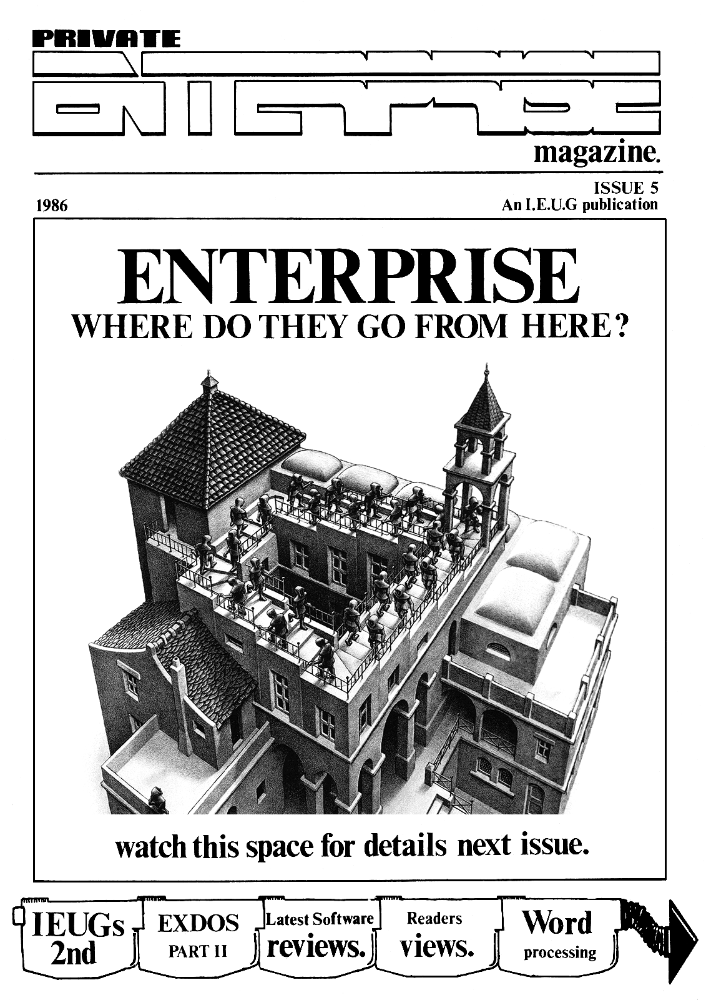

# Private Enterprise Issue 5 (1986 ≈весна)

[Оригінальний PDF](http://enterprise.iko.hu/magazines/Private_Enterprise_Issue5.pdf)

## Зміст

Editorial  
News Desk  
Private Correspondence  
A Long Hard Look  
Software Update  
Utilities  
User Group Activities  
Home Produce  

## Чернетка вмісту

"page-001.pbm" ------------------------------------------------------------ 
PRIVATE A 0) On| 1S...

Cs A compilation cl5 tape (both

NNT published within the pages of

P R O e R A M iS Private Enterprise plus alot
you've never seen, mainly
because of their size.

Programs of note include

ENVELOPE GENERATOR allows you to
explore both graphically and
through sound output, possible
envelopes for your own use. The
program also gives you the
envelope data to be used within
your programs:

SCREEN DUMP Dumps graphics onto

most brands of printers at an
alarming rate (255 shades of
grey available)

DIGITIZED PICTURES (NEW) Two of
Tim Boxes pioneering digitized
images well known to IEUG
meeting attenders. Recently
aquired by Enterprise Computers
for demonstration purposes.

CODE QUEST (NEW) An excellent
and well theught out version of
the classic game with a host of
extra features and with good
use of colour.

HIDDEN SURFACE Probably the
most impressive graphic
demonstration of page animation

. TRANSFORMATION (NEW) Difficult
rNtiebaeeve)l= LO), | to explain in words. put simply
. this program allows you to draw
two = different «images and

WA e) animates one inte the other.

COMING LATER THIS YEAR- IEUG'S Greatest Hits Vol.2

Cheques P/O made payable to: IEUG. All orders to:
ITEUG, 12 Whitegates, 100 station Road, New Barnet, HERTS ENS 1QB.

"page-002.pbm" ------------------------------------------------------------ 
mB Kivicy we

Velcone to issue 5 of ‘Private
Enterprise’. There are, no doubt, a few
questions you would like to ask us,
‘well I'l] try to anticipate them and
provide some kind of answers,

The first will no doubt be “why is
this issue so iate’. To answer this
look to the let.ers page.

The second wight be “what is the
weaning of the front cover’. The
answer, of course is a very cryptic
one, Enterprise, a5 you will no doubt
realise, ate in the classic ‘Catch 22°
situation} no software, no sales, #0
sales, no software. Hence the never-
ending struggle. The question now is,
where are they going-up or dows. We now
believe we have the answer. Ve were
‘going to reveal all in this edition but
have since been instructed by
Enterprise not to disclose it. You
will however find out next issue
(if have not already heard).

The last question J can see you
asking is ‘Why jis this edition so
suall®, The answer lies in printing
costs and a lack of saterial to print.
By that I wean printing costs are so
high that we have to justify the
inclusion of all the pages by high
quality material. This as you probably
will have realised,we are short of.

Continuing along the theme of last
issues editorial I bring up the subject
of PR or the Jack of it. Enterprise
sean to have chosen to ignore the
recommendations on cheap advertising
that I wade in issue 4, I now say
this to thes, It ay be true that
nobody wants to review conversions but
I know of one sagazine that prints
what has been released even if it
doesn’t review it and that’s better
than nothing. How the heck. do you
intend to let prospective custowers
knox that there is a software base (if
a bit spall) if you can’t even be
bothered to tel! the press?

Finally we bring you good news. Issue

4 is pur anniversary edition. ‘Private |.

Enterprise’ will be one year old. So to
celebrate this monumental feat issue 6
will be given a face-lift with a ‘new
look’ sagazine.

CONTENTS...

NEWS DESK? Ineluding a report from

IEUG's @nd Great London meeting attended
by Keith Elliot of Entersoft.

PRIVATE CORRESPONDENCE) a4 iively

punch of problems and difficult questions
with equally lively and difficult replies. 6

ALONG HARD LOOK) part 11

indepth review on Enterprises latest and 8

of an

most sophisticated peripheral yet.

SOFTWARE UPDATE) more of the latest

games releases including Lands of Havoe
and Race Ace.

UTILITIES? pave Race takes a look at

some of the sometimes ignored features
of the Enterprise Word processor

USER GROUP ACTIVITIES) Regionat

Organisers come forward to represent
their areas, is your name there?

HOME PRODUCE) a snort put useful

routine for creating menus within your
own programs.

14

14
15

INDEPENDENT USER GROUP

12 Whitegates,
100 Station Road,
New Barnet,
HERTS,

EN5 1QB,
ENGLAND.

THE ENTERPRISE

An Independent Enterprise User Group Publication. President, Artwork &
Layout MARK LISSAK, UG. Correspondence Editor TIM BOX, News Editor DAVE
RACE, Software reviews NEIL BLABER. Private Enterprise Magazine is a
copyright of the Independent Enterprise User Group. No article may de

reproduced in whole or in part without written consent from the copyright
holders.

"page-003.pbm" ------------------------------------------------------------ 
Bye bye Aztec

It has been anounced that Aztec
software have gone into liquidation.
Aztec produced the software for the
Speakeasy speech synthesiser, and were
finishing off the graphics package for
the long awaited Enterprise aouse-

Enterprise say that the aouse will not
be affected: Aztec were not actually
making the mouse and another software
package will be adapted to work with
the mouse. We lock forward to seeing
this in the near future.

As we revealed last issue, Aztec’s
Basic compiler had already been
dropped by Entersoft due to it’s lack
of speed» Entersoft are now going to
use the ZIP integer Basic compiler
written by Peter Hiner:

=4JfneaaoazNmjQnQ}|}|Sl

alice Biss ¢

IEUG’S 2nd

April the {9th saw London's first
major computer show of the year - the
Independent Enterprise User Group
meeting in Finchley, centre of the
known universe. Well it would have
been, if a few more people had turned
up: Where were you all ?, I mean what
are we going to do with 2000 plastic
cups, 24 gallons of milk, 1500 teabags
and a few choccy biscuits - answers on
a postcard to...

Seriously though, the 2nd meeting went
well and everyone seemed to enjoy it,
if anyone who was there didn't enjoy
it write in and tell us why.

The occasion saw the first public
appearance af Tim in his new quise of
head of Boxsoft U.K. selling software
at the aeeting. It seems that people
still can't obtain software around the
country as Tis sold out of just about
every title he brought along.

Most af the usual crowd showed up,
including a lot of people we saw last
time (we must be doing something right
'). Jim's digitiser refused to come
along this time, there are those of us
that think that it was up to something
with Gary, who was also conspicuous by
his absence. Neil eventually arrived
with the tea and coffee about two
hours late - he swears blind he took a
wrong turning out of the tube, but we
know different! I ayself am qoing for
a short stay in the local funny fare
to try to figure out why I got up at
6.00 (in the morning) just to get to
Finchley to help set everything up»

Guest speaker this time was Keith
Elliot, head of Entersoft, although
Steve Groves did come along on the off
chance.

Keith
the

started off by explaining why
Enterprise is where it is today,

or rather why it isn’t where it should
be. He went on to talk about increased
publicity in the future, emphasising
possible deals with several major high
street retailers involving a package
deal comprising a 128, monitor , disk
drive & interface and software package [|
designed to compete directly with the
Amstrad PCW256 - this is what we've
all heen waiting for. He also

confirmed that the present machines

will he fully supported in the event
that any new micros are released,

specifically present machines will be
fully expandable to meet the
specification of any new machines:
Finally he revealed that Entersoft
will he stopping conversion of
software titles from other machines,
instead emphasis will be placed on
getting third party software companies
to produce titles for the two
machines.

Other items of interest were alive, if
wot kicking, appearance of the mouse;
two Enterprises talking to each other
via the network; one Enterprise was
performing fractal calculations, very,
very slowly; just to prove that the
Enterprise is in a similar class to
the Amiga there were numerous
bouncing, hopping, spinning, bleeping
and deflating ball programs - if I see
another one in the next few months
someone's geing to pay ! Finally,
Peter Hiner was there with a nearly
complete version of ZIP which he
subjected "Bomber" to, producing a
staggering speed increase ~ now where’
s that copy of “Eddie” ?

It not yet certain when the next
meeting will be, but we will probably
have one before the P.C.W. show. If
any of you have any suggestions for
the next show please let us know, Mark
has already suggested topless software
consultants-poor lad (I's game! — NB.)

"page-004.pbm" ------------------------------------------------------------ 
=News Desk

A Cauldron of software
in the Pipeline

Not a lot on software, as we mention
in the User Group article. Entersoft
are going to reduce the number of
conversions that theyll be doing for
the machine, concentrating on getting
third porty companies to produce
software. Apparently just about every
software house in the country has an
Enterprise, and all are saying
favourable things about it; which
leads us to ask why we haven’? seen
more titles for it.

There will still be some conversions
appearing from Entersoft which are
already in the pipelines One which
impressed us greatly was Cauldron,
which was shown at the user group
meeting» This. program first appeared
on the Commodore 64, although everyone
at the show agreed that the conversion
was better than the original. The game
is a cross between a shoot-em-up and a
platform game, in which you play a
witch who is trying to get a golden
broomstick from the evil pumkin - real
life situations in computer games! It
should be available within a couple of
weeks for the Enterprise 128 only:

Asmon and Macro-D are both near
completion (we'll probably tell you
the same next issue as well) and there
Ce
configured for the Enterprise - we saw
working versions of Supercale 2 and
Superwriter at the meeting:

Finally everyone who wants more speed
from their Basic programs should look
aut for the ZIP integer coapiler, this
too should be ready ina couple of
weeks»

—_—_—_—_—_——

Drives you mad

Cumana now seea to have most of their
problems sorted aut» Deliveries seen
to be back to normal, on double drives

at least, ise> a few days» There still
seems to be a delay with single drives
however and these are still taking up
to a fortnight to come through. All
the same, this a far cry from earlier
in the year when we actually had to go
elsewhere at one stage due to the long
delays in deliveries:

It seems, though, that in their haste
to get deliveries back on schedule
something went wrong in their Quality
Assurance department. Some of the
first double units we received with
NeE.C. drives in them had the
connection lead. the wrong way round
inside, stopping the second drive from
working. This problem has now been
sorted out at Cumana, and we look
forward to supplying any more of you
with dise drives (on time ') in the
future.

——_—_—_—_——
————_—_—_—_—_—_=—_I

Technical help

Great news for anybody out there who
wants to delve more deeply into the
Enterprise. After a long wait, the
Enterprise Technical Manual is at last
available. This invaluable tome
contains information on Exos, the
various device drivers - e.g» sound/
video/keyboard - and programming the
DAVE and NICK chips directlye The
manual costs £6.70 and can be obtained
directly from Enterprise.

—_—_—_—_—_—___
=s=#env’”-"*"-"-."-w.7Nr’™K’eCrNNC

Tims soft Box

As everyone will know we are always
complaining about lack of support for
the Enterprise, and it's lack of
publicity. Well, Tim Box aust have got
rather more fed up than aost of us
because he's actually gone and done
something about it - he’s set up his
own software dealership» The name of
of the new company is BOXSOFT, and
anyone wanting information can contact

news,

the housewives’ favourite at !-

12 White gates,
100 Station Rd,
New Barnet,
HERTS,

ENS 1@B-

(Where've I seen that address before?)

BOXSOFT will be selling software at

under list prices which has to be good
and will be selling all
currently available titles. We wish
Tim every success, so start sending
him the orders before we send the boys
round !

—56s;~”_0072".”".0"0-”’----"-"_— EO
TCC oo

Ist 4ths

We've been getting a few complaints
froa people whe ordered Forth from
Enterprise on cartridge and received
instead a tape plus refund. Enterprise
point out that the tapes were sent out
to save people having to wait for the
delayed cartridge version, and that
anyone wishing to upgrade can obtain a
cartridge by sending back their tape
with a cheque for £5 plus pap to
Enterprise

er
———<—<—<_$_—[_—[_—_—$_—=_=_—_=__——_—_—_=_="=

Two Escape.

Two well known personalities have left
Enterprise in the last few months.
Both Charles Nacadam and Mike Shirley
have moved on to pastures nearly as
green as the Enterprise's keyboard. We
wish them both luck in their new jobs,
and trust that Enterprise will survive
without their services:

«Oon..ajaoouoN“NF|j™aO2..2HC OI
(C¥-FPpn-!..F FHC

"page-005.pbm" ------------------------------------------------------------ 
New U.G address

Welcome once again to Private
correspondences As with the last twe
issues I shall start with an apology:
It is directed to all the members who
wrote in with a queary or question and
did not receive a reply. Answering
your letters is a problem that is
going to get worse. The amount of time
that I can spend answering letters has
decreased and will, I'm afraid,
decrease even mores I am, therefore,
only in a position to answer important
letters ie ones from people offering
help! This leaves a major gap in
correspondence: What do you do if you
need help? There are two options!

1) Write and your letter will he
answered in the magazine or personally
if you live too far away to phone» (ie
abroad)

2) Phone me and I will answer any
querries there and then:

The first option is useful if you want
to voice an opinion that you want
every-body to hear or if you are
sending in hints and tips programs and
articles etc. The latter will receive
a personal response:

The second option is ideal if you want
a quick answer or you have a lot of
questions. There is also the advantage
that you will receive a fuller answer
than would normally be given ina
letter.

The next thing to note is a new
address: I know this is the third one,
but I can assure you it won't change
again for a long times

The new address is for all user group
correspondence is i-

Tim Box IEuG,
12 Whitegates,
{00 station Road,
New Barnet,
Herts,

ENS 198.
ENGLAND

[7]

gossip, outrage, its your page.

And the telephone No. is 01-440-d110

Please only phone between 7pm and 9pm
week days.

Now down to your letterss As you will

have noticed, this issue is a small
one» This is due partly to printing

costs and partly to a lack of
articles. Thus the size of the mag has
restricted the space for letters etc.
So as you will see I've not included
many but as usual they reflect the
general views of members.

I

Dear Sirs, ED, PE or TEUG,

Thank you for
a very good magazine, I think it is
very well presented and the content is
excellent. I was particularly
impressed by the advanced programming
and the line paramiter table articles
and find them extremely useful.

I also find Super Progaramer very good
but the lack of sound and graphics is
a bit annoying. (come on Enterprise,
hurry up with the Advanced user
guide»)

I've got alot of things I would like
to ask so a list seems appropriate.

1) Why are the Function key labels on
the manuals different to those on
thecomputer? Ive had mine since ‘8d!
and IT haven't got MUTE, HELP, ECHO or
STATUS.

2) On the Network, which wires do we
use? | know about the Data bus and the
Control Bus but which wires do we use
as the ground? [s it the Ov, as you
would expect, or is it the REF line?

3) Why doesn't anybody tell us about
the Expansion Port and what each wire
does? If you have taken yours to
pieces yet (1 could'nt resist it) you
will probably have noticed, like ae,
that several of the wires are
connected together. This seems a bit
of a waste, but Im sure Enterprise can
explain.

4) Another thing! Qn the right-hand
side of the PCH, near the Expansion
port, there is a row of holes,
resembling the holes on the BBC B+ for
memory expansion» If this is what they
are intended for, why can’t we do the
job ourselves (Ive got a '6d', at the
moment)-I'm sure we could manage.

5) Why does "RUN line_number comma”
produce a crash. I know its very
pretty but an error would be aore
informative!

6) Will Enterprise (or anybody else
for that matter) ever print a list of
mistakes and corrections for the
manual? Its extremely annoying some-
times, but I think another book (ie
the ADVANCED USER GUIDE) would solve
this problem.

Keep up the superb work.
Simon Gidney:

TB. Well as you've listed your
questions I shall answer them like-
wise.

1) It seems Enterprise designed the
boxes and the manual cover a long time
hefore they released the machine and
in the intervening time they decided
to improve the Basic so necessitating

"page-006.pbm" ------------------------------------------------------------ 
=Private Correspondence

changing the function key strip: It's
a pity they couldn't do the same for
the contents of the manual.

2) On networking, it is, as you
expected that the ground is the Ov
line.

3) I will, I promise print the pin
outs of the Expansion port next issue.
The tracks that are joined together
are, in fact, Ov lines.

4) The row of holes next to the
expansion port is where the extra 6dk
goes but it requires an extra board
and is not a DIY job.

5) You obviously have the old 2-0 2.3

does not, thankfully, have the saae
faults:

6) Enterprise do in fact include an
errata with the manual now, but I
think what is really needed is the
‘Advanced User Guide’. I should think
it will be out soon along with "Jungle
Jim’, ‘Stud Poker’, and the rest of
the products Enterprise promised one
and a half years ago!

a

Dear Tia

I know you've had problens
aeeting publication dates, but this is
going a bit beyond a joke chaps! ]
sent off a cheque to you on the 14th
January for £11.95 to cover the cost
of this years subscription to ‘Private
Enterprise’ plus IEUG'S Greatest Hits
Volume 1+ You paid-the cheque in at
the beginning of February according to
ay bank, you eventually sent ne the
afore mentioned cassette of programs (
and very good they are to) along with
tantalising references to issue 4 of
Private Enterprise - but you haven't
sent me a copy yet!

league with Mc Intyre
Marketing. It took me over a month
toeventually obtain a special offer
Enteprise 128 with aonitor from thea!

Are you in

Fortunately their offerings and yours
appear to be worth the wait- Of course
if you leave it a bit longer you could
always send me Jan/Feb with Mar/Apr
and save on postage, but Id rather not
wait any longer:
A Sheldon:
Bracknell
Berkshire.

TB. This was just one of many letters
we received about the time the last
issue should have been published» And
I suppose you deserve an answer Well
the best way to explain is to give a
little insight as to how we put the
mag together:

{) For 1/2 months we work on articles
and reviews for the mag in between
normal 9-5 jobs college work,
decorating and general user group
stuff like software & disk orders, and
letters etc or whatever else we have
to do normaly:

2) Then for 4 week all hell breaks
loose as we try to get all the work
finished.

3) Mark then works solidly for an
‘entire week solid putting the work
down on papers

4) Once this is done we trot down to
the printers and haggle over printing
costs and delivery dates. This is
where all your subs go (; for example,
issue 3 cost £1.33 per copy to print.)

5) While it’s being printed we put pen
to paper again write out all the
addresses on the envelopes,  (
occasionally stoping to day-dream
about some one writing a database
program for the Enterprise or having
enough money to buy a CPM program that
would do it all at a touch of a
button! !)

5) Finally we spend a day putting mags
into envelopes and licking over three

hundred stamps!

————————<=£=£z£=£_==£= ==
———————————

All this is theoretically what
happens, but in practise we never
finish the first stage on times All
this we do for nothing but self-
satisfaction and the thanks we get
fron you members, had we not received
your thanks 1, pesonally would have
given it up along time ago-

Enough of the self-pity. We are sorry
for the delay in getting the mags out
and we must say we are now receiving
alot of help from a few members that
will, in the future, mean that we will
soon get the issues up-to-date. Look
put issue 6 here we come!

Finally we come to the subject of Nc
Intyre Marketing: You are not the only
one to have had trouble from them We
can just be thankful there should not
be any further dealings with them.

I

Dear Sir,

Help: I have had a 128 since
the Mc INTYRE offer and have not yet
CL ee 9 "Drawing
Boxes". Hy blockage seems to be with
the " * and the saall print.

Do you know of any book or magazine
that would be of any use to an idiot
like me? I dont want to use the 128
for games only or to practice the

RESET button.
H Kershaw
Keighley. Yorks:

T.B This is another common plea we
get» Although we have talked alat
amongst ourselves about adding a Basic
Programing section, we have not yet
found anyone to do the task» So, if
you know Basic and are willing to do
some teaching we would love to hear
from yous But, in the mean tine, we
will infora members about any
Literature which will help-

I
——_—F=_=_=—=z=z_—a~—aEK—>—<=_=$=[=="“—_—

"page-007.pbm" ------------------------------------------------------------ 
SAM NIMIFIKIM ILD

If at anv stage you want to reorganize
your disc EXDOS makes this easy too:
Obviously it is possible to delete
and rename files and directories,
although there is the safety feature
that you can’t delete a directory
unless all the files in it have been
deleted. It is also possible to
move not only files but entire
sub-directories around on disc, or
you can copy files from one directory
to another without affecting the
origional file:

As you can see, the structured
approach to data storage offered by
EXDOS allows the user to produce
discs which are easy to read and
access. To make matters even simpler
gach disc can be given a volume name,
using the VOL command.

The actual process of saving and
loading files and programs from disc
couldn't be simpler: Simply forget
that EXDOS is attached and use LOAD,
SAVE, RUN etc as normal - EXDOS will
do all the hard work for yous Only
one command works differently with
EXDOS and that is START, with a tape
based system this command will
either run the program that is in
memory, or if there is no program

loaded it will search for and run
the first prograe on tape» With a
disc based system the first function
of START remains the same, however
if there is no program in memory it
will search the current disc for a
file named “START” and run it, if
there isn't a file with this name
Exdos will come back with a “File not
found" error. The best way to make use
of this feature is to get into the
habit of using “START” as the name of
the first program you want running in
any particular directory, the loader
for a machine code program for
instances It is still possible to
load programs from tape by prefixing
the program name with TAPE:, and
channels can be opened to dise in
the same manner as opening a channel
to tape, except the channel can be
used for input and output at the
same time» The only complaint here is
that EXDOS only supports sequential
access files, this aeans that data has
to be read in in the order it was
written» It is possible to set up
random access files using EXOS, but we
haven't had tise yet to investigate
this feature fully:

As I’ve already gentioned, filenames
can be up to 8 characters long, with a

————

3 letter extension which is normally
used = to differentiate between
different types of files» These
characters can be upper or lower case,
but as EXDOS changes all filenames to
upper case there is no real difference
between the two cases» Some characters
have special functions in file names,
for instance a backslash is used te
indicate that the previous name in the
list was a directory. It is also
possible to use “wildcards”, these are
represented by the asterisk and
question mark symbols and tell EXDOS
to accept any character, the star
also means accept any number of
characters. This feature allows a
rapid search -to be made of a disc for
items of interest, for example t-

DIR FILE?

would give a list of files whose name
was 5 characters long and started
"FILE" where as 5-

DIR FILES

would give a list of all filenames
starting with "FILE" no satter how
long the name was»

If you only have one disc drive, like
me at the moment, you can still behave
as if you have a double drive. This is
because if only one drive is attached
EXDOS treats it as if it is two
seperate drives» Thus you can aake
backups, copy files from one disc to
another or use a program which needs
data to be read in from another drive-
EXDOS works out which drive you are
using, to begin with this will be
drive A, and prompts you to change
discs whenever you change drives. A
very useful feature indeed.

It is even possible to use EXDOS
without any discs attached at all,
this is because it offers the facility
to use a RAM disk, a feature available
on most business machines »«.for a few
hundred pounds. A RAM disk operates in

"page-008.pbm" ------------------------------------------------------------ 
=A long hard look

exactly the same way as. any other
disc, and can be used at the sase time
as other discs» When set up it is
allotted RAM in 16k blocks, in theory
up to nearly 4 megabytes (a feature
NOT offered by most business
computers)» As this RAM is no longer
available to the user it makes th
feature a little useless on the 64
but on the 128 this is no problea- The
main advantage of the RAM disk is
speed» That's not to say EXDOS is slow
with normal discs, disc transfer rate
with EXDOS is the fastest I have seen
on any home computer, a 40k program
like Nodes of Yesod loads in just
under 4 seconds. It's just that a RAM
disk is very, very quick, as an
example the digitised pictures we
Ty er Ce
aver 20K ~ can be loaded from RAM disk
in somewhat less than a third of a
second, that's impressive. This speed
increase makes the RAM disk especially
useful if a program needs to use large
data files, the file can be loaded
into the RAM disk and accessed very
quickly indeed.

EXDOS can also use batch files, that
is programs made up from E€XDOS
commands. These files are produced on
the word processor and printed to
disce They can be run from EXDOS by
siaply typing in their filename. As |
said, batch files can contain any
EXDOS command and can be thought of as
seall programs running under EXDOS,
thus for instance you could write a
batch file to backup a disc. The most
useful feature of batch files is that

if you name one “EXDOS-INI", it will
be pun automatically on power up (
providing that the disc was in the
drive '). This could, for example, be
used to set up the time and date and
show the current directory of the
discs The one problem with batch files
on the Enterprise is that you can't
pun Basic programs from them. This is
a shane as it stops one from booting a
program staight from disc, as it
stands it
Basic to run any Basic program: It is
possible to load EXOS modules from a
batch file and we have discovered you
can lead and run Pascal programs
directly from a batch file - perhaps
another good reason to start working
in Pascal.

So that’s €XDOS, very impressive and
undeniably good value. But it isn’t

finished there ! As I said at the
beginning of this review when you buy
EXDOS you are asked to send off a

still necessary to go inte |.

warranty card te obtain IS-DOS. This a
second complete opperating system,
able to use all of the commands
available to EXDOS. Using IS-DOS it is
possible to make files read only, or
TE CC ee
listed in a directory; you can reroute
you disk drives, useful if you have a
faulty drive; you can even run

transient commands, these are short
programs which are loaded from disc to

perfora quite complicated tasks such
as undeleting inadvertently deleted
files - this makes I8-DOS infinitely
expandable. That's not all, the most
impressive point about IS-DOS is that
it allows the Enterprise te run any
CP/M 80 softwares There is a wealth of
CP/M) software available on the aarket
including a large amount of free
public domain software. There isn’t
room here to do justice to IS-DOS so
watch out for a full review ina
couple of issues:

CONCLUSION! to be honest there is only
one thing left to say about EXDOS :

BUY IT !!

=’{..2-.-..2.--0-2-.2-—22—=—=—2=—-2—=2-—0N"0005—591
—oneorrN--N—-c83H$o44--”-”HHé—'I

"page-009.pbm" ------------------------------------------------------------ 
=Software

=) Biel

KEY TO RATINGS;
ARCADE and ANIMATED ADVENTURES

GAME CONTENT - Variety of actions

* ] screens

~ Ease of use,
addictive quality

- Quality and use of
graphics related to
aachine

- Use of stereo and
tune i noise
originality:

VALUE FOR MONEY - Overall impression

when compared with

prices

PLAYABILITY

GRAPHICS

SOUND

ADVENTURES

GAME CONTENT  - Design of plot /
background. Puzzle
ingenuity:

PRESENTATION  - Atmosphere,graphics
(if any), text /

screen layout.

INTERACTION - Parser quality,

editing facilities

VALUE FOR MONEY - Overall iapression
when compared with
prices

PERCENTAGES

0-25 - Yuk, Bleah !

2b- 50 - Bad to Mediocre

5i- 75 - Average to Good

75-100 - Excellent to completely
Brilliant

The machine stops

MORDONS QUEST
Abersott
Adventure
{7.95

Nage
Producer
Category
Price

In the beginning, Chaos ruled and all
which existed had little purpose» In
the struggle against this nightaare,
the Ancient Ones created the separate
realities which brought order to an
unstable void. The Ancient Ones are
not immortal, however, and in order to
safeguard their work they created a
sopcerous @achine which would be
powered by their life essence: As
their tine drew near, each Lord in
turn sacrificed the last of his power
to the machine until only Bostafer
remained» When his time approched, he
was seized by the desire for
imnortality and, rather than make the
ultimate sacrifice, broke the machine
inte its component parts in an attempt
to gain the power of the other dead
Lords» His power is still growing and
the realities are fading and becoming
confused. Your quest is to find the
parts of the machine and remake it,
thus restoring the order to the
universes

In many ways this game is similar to
Level 9's "Lords of Time” in that you
travel between different scenarios
spanning a large part of Earth history
in order to complete your quest» The
location descriptions are long,
detailed and well written - Mordon's
speech (essentially the above

paragraph) lasts two full pages '
However, Mordon's Quest does have some |
quite disappointing aspects- I found
the parser to be very particular about
certain things and is not nearly so
accomodating as the latter Level 9
offerings: If a location is to be
redescribed, “WHERE” is used rather
than the usual "LOOK", a deviation
from standard adventure language which
will irritate experienced adventurers:
Also, in order to solve certain
problems, precise wording is required
in order to have any effect ~ very
confusing if you've solved the problem
but the parser won't let you do what
you want to ! The “EXAMINE” command in
most cases is useless and there is no
error checking - both “EXAMINE
BLANKET" and "EXAMINE CBVJBI" both
return "YOU SEE NOTHING SPECIAL"+ Also
highly infuriating is the regularity
with which the phrase "YOU CAN'T" is
returned by the program - this is used
for both impossible actions and
unrecognised verbs, thus causing more
confusion.

However, if you can cope with the
less-than-perfect parser, Mordons
Quest is an enjoyable game containing
an interesting series of cleverly
interwoven puzzles spread over more
than 150 locations:

COMMENTS

NB. Initially, 1 found the
inadequecies of the parser spoiled ay
enjoyment of the game to an extent

"page-010.pbm" ------------------------------------------------------------ 
=Software Update

where I was prepared to just duap it.
However, I persevered, and found the
later stages of the game to be much
better. Whether this was due to my
getting used to the limitations of the
parser p whether the vocabulary
relating to later parts of the game is
more complete I'm still net sures
Overall, worth buying if you're an
adventure freak:
Presentation 80%
Interaction 504

Game Content 754%
Value For Money 65%

i$50o-2-2--2-2-0-20-0ez-Nz2-—-—2—00
CF OH

Base Race.

RACE ACE
A.l. Products

Simulation
{7.95

Name :
Producer ¢
Category §
Price :

Ever fancied yourself as a Formula One
racing driver burning rubber and
spraying people with champagne ? No ?
Oh well.+. Race Ace is a motor racing
simulation/game offering a choice of
10 different actual Formula One race
tracks, manual or automatic gearbox,
differing weather conditions (set by
the program), and a practice lap to
determine your position on the
starting grid» Controls are as follows
~ Accelerate: joystick forward, Brake!
joystick back, Left & Right? L@ R,
Gearstick! joystick forward & back
while space bar pressed» The practice
lap is done solo, while you have the
added hazard of other cars that crash
into you - at the most inopportune
moments - in the race proper. It is a
fairly standard racing game, with no
pit stops necessary or even back
markers to lap once you've taken the

lead.

The one major criticism which can be
levelled at this game is immediately
obvious as soon as it starts. The
choice of controls for the car is an

awful one - when accelerating and
braking, you tend to veer to the left
and right as the joystick wobbles (
this is worse if the internal joystick
is used rather than an external one)-
The opposite is also the case, with
unintentional speed changes when
cornering. This tends to spoil the
play to an extent, especially if the
manual gearbox option is selected.

COMMENTS

NB. As racing games go, this is very
run-of-the-mill, While not forcing the
player to master dozens of keys (like
"Chequered Flag* on the Spectrum), it
goes completely the other way, making
the game just as unplayable» The
graphics are nothing special, which is
sad considering the potential the
machine has display-wise in a game
like this.

604
30%

Game Content
Playability
Graphics 60%
Sound 554
Value For Money 55%

: WIZARDS LAIR
: Bubble Bus
: Arcade

1 £7.95

Name
Producer

Tis a legend told jong age
About dark caves far down below
Where deep within a wizard dwells

Bespaking doom and casting spells
If this Lair thou dost uncover

Four Lion pieces thou must discover
Only then will you escape

Past the lion which guards the gate
So heed this warning and beware
Never enter the Wizards Lair !

Wizards Lair is an arcade adventure
with 256 locations on seven levels
interconnected by trapdoors and lifts.
The hero, a certain Pot Hole Pete, is
trapped in the said sorcerous abode
and must find all the pieces of the
fabled Golden Lion in order to escape:
For readers familiar with the now
senile Spectrum classic Atic Atac, the
game is very Similar. The screen shows.
an overhead perspective view of the
current location with all four walls
visible. Passage between the rooms i5
via interconnecting doors which open
and shut randomly.: It goes without
saying that these rooms are inhabited
by numerous fearsome beasties all keen
on having Pete pancakes for tea !
However, Pete is able to combat them
by throwing axes (of which he has a
limited supply):

Objects te be found along the way
include food (which replenishes lost
energy), Spare axes, gold, gems, keys

(which open certain doors), spell
scrolls and, of course, bits of the

Golden Lion. The scrolls are used as
they are picked up, but only work if
pete is carrying enough gold. The
spell contained on the scrolls allows
you to convert your gold into other
commodities such as keys, weapons,
energy or magic rings.

There is actually quite a lot te this
game - the monsters are not stupid,
and actually act in different ways
according to species» They can alse
enter rooms through the doors, which
can be quite surprising if you're
trying to exit throught the same door
' The graphics are of a good (
Spectrum) standard, colourful quite
fast and flicker-free. Finally, the
music which greets your demise is so

10

"page-011.pbm" ------------------------------------------------------------ 
SIN NIAC Ie © Niele

depressing you Can actually feel
quilty about letting your man die !

COMMENT

NB. This is the sort of game which
will keep you absorbed for hours just
exploring, let alone trying to solve
it ' Even though this game has been
around for ages on the Spectrum and
Amstrad, I feel it is a welcome
addition to the Enterprise repetoire-
A quality game, well worth investing
ins

734
75%

Gaae Content
Playability
Graphics 65%
Sound Rey
Value For Money 75%

cl OO
I

Havoc in Havoc
Nane ANDS OF HAVOC

rcade
£9.95

Category
rice

Has
Producer : Microdeal

The land of Haven was a wonderful
place - 10 uneaployment, no racial
tension and absolutely no instances of
politicians lying to Parliament. A
aeaty magician called the High Vanish
looked after the people and ensured
that they had all they needed» That
was, until the Dark Lords strode into
towns They outgunned the High Vanish
and subjected the people to

1 unspeakable naughty deeds. However,
they were unable to totally destroy
all goodness and in this tine of
transition the land became known a5
Havoc: You play the part of Sador, the
prophesied and decidedly reptilian
saviour of the Lands Your first task
is to discover the Book of Change,
hidden in the alchemist's storeroca.
This will offer the first of many
clues which should ultimately lead to
the downfall of the Dark Lords.

This is a massive (2000 screens) maze

V2

game! However, it is played at such a
breakneck pace that sometimes it is
difficult to remember where you're
supposed to be going as you zap
through screens in fractions of a
second ! Despite the rather
pretentious background blurb, this is
quite a fun game to play - there is
always a particular object or set of
objects you must find in order to
progress to the next stage of your
quest, and to make things
moredifficult the place is liberally
populated with monsters. The initial
part of the game is a maze divided
into nine sectors, which are arranged
pandomly each time the game is run+ An
ites needs to be retrieved from all
but two of these sectors to enable you
to progress to the next part of the
game» Microdeal have provided an aid
to the first part in the form of nine
"postcards" depicting the sectors,
which can be arranged in the correct
order when the game starts+ However,
the cards don't tell you where in each
sector the required object is !

Control is by internal joystick, with
the space bar to fire (yes, you can
actually kill the nasties in this game
'), There is also a merry little tune
which plays all the way through and
gets incredibly annoying when you've
lost your third life.

COMMENTS
NB. Just considering the game

elements, this should be an incredibly
boring game. However, the sheer speed

with which the little man zooms around
makes the game very enjoyable. The
price is nasty though - its not up to
the standard of other recent £9.95
games such as Nodes (although it sells
for twenty quid for the QL and Atari
ST ttl). After only just recovering
fron Microdeal’s last offering (see
Issue 3 "Adventure Pack"), 1 was
refreshingly surprised to find a
quality program within the "let's-
nake-this-game-look-good-by-putting-
it-in-a-big-box" packaging:

|

60%
TH

Game Content
Playability
Graphics 55%
Sound. 35%
Value For Money 55%

——_—_—_—_—_—_—_—_—
——_—_—_—_—_—_

Neil Blaber

I

NEXT ISSUE...

We'll be catching up with the small
backlog of oldies including Airwolf,
(which mysteriously dissapeared from
someones library a few weeks age)
Wriggler from Romantic Robot, (Nass
excitement- ha ha'-ML) Orient Express
and The Commodore hit Cauldron, an
excellent conversion» ML

Neil as asked me to appologise for the
delay he caused this issue which was

partly due to degree exams, partly to
an exploding. monitor, partly to the
lack of help from his ex-reviewer

Gary, but mostly due to sheer bone
idleness.

i
i

7,3

"page-012.pbm" ------------------------------------------------------------ 
=| Bal tiacss

As everyone knows the Enterprise comes
complete with a built-in word
processor contained in ROM. This is
obviously a very useful feature in
that people are more likely to use the
word processor for letter writing if
‘| immediately available than they would
if it had to be loaded from tape each
time.

However, this very convenience leads
to restrictions on the abilities of
the processor. Because it had to be
fitted into the same ROM as EXOS, its
size had to be kept down - read only
memories only come so big! Therefore
many features that one would expect
from a tape or disc based program have
had to be left out - there is no
search/replace function, block move is
restricted to single lines or full
paragraphs, there is no procedure for
inserting printer cantrol codes into
text, and, most infuriating, loading
text clears the screen thereby
stopping the merging of letter heads
and the such like.

That was until now. Whilst I cannot
offer search/replace functions or
localised block moves (you'll have to
get something like the dreaded
Wordstar running under I5-DOS -for
those features), I can show you how to
insert contre! codes into your text
and how to merge text files.

To work in reverse order, merging text

files is a very simple operation---
once you know how. The trick is to
save the text as an ASCII file,
something which does not occur when
using the standard SAVE command. To
save a file in this format we must
print to the tape/disc channel, press
function key 3 and when the prompt
appears requesting a device or channel
type in a valid filename eq.
LETTER. TXT . The file will then be
printed to the storage device, in

effect saving it as an ASCII file.

Now that you have your text saved in
this format you can load it as you

would any other file using the load
function; however instead of clearing

the screen and then loading, the text
will now start loading from the

current cursor position overwriting
any text that is already there until
it has finished loading.

The clever bit though, is that if you
put the editor into insert mode before
merging the text ~- by pressing CTRL
and INS at the same time - the text
will insert itself at the current
cursor positions This means that you
do not have to leave suitable gaps in
your letters for the insertion of
names and addresses and suchlike.

There are only two real disadvantages
with this method of text merging, and
both are caused by the fact that text
files have a hard carriage return at
the end of every line. Thus if you
load several lines of text in this way
each will be regarded as a seperate
paragraph, making justifying and
reforming said text a little
difficult. Even if you only merge a
couple of words, a name for example,
there will be a hard carriage return
at the end, forcing the rest of the
text on that line down one line» This

is easy to get round, however; simply
press the ERASE key after merging.

So, to summarise it~ First print the
text you will want to merge to
whichever storage system you are
using: When you want to merge this
text put the cursor at the desired
point, and go into insert mode. Load
the text normally using function key
one. Finally press the erase key to
remove the carriage return from the
end of the merged text.

to the insertion of

codes within word
processor files. This teo is very
simple and relies on the fact that
many printers repeat their control
table after 7F hexadecimal (127
decimal). That is to say that if they
are sent any ASCII code greater than
this number, they will subtract 128
from it to arrive at the character
they should print. Thus if the word
processor sends the ASCII code 155 to
the printer, this will be regarded as
being the ASCII code 27 - the escape
code.

Next, we
printer control

come

These post-127 codes are obtained by
using the ALT key together with

"page-013.pbm" ------------------------------------------------------------ 
CHR$(10)
CHRS (11)
CHRS(12)
CHRS(13)
CHRS(14)
CHR$(15)
CHR$(17)
CHR§(18)
CHR§(19)
CHR$(20)
CHR$(27)

various other keys as shown below. For
instance to send an escape code to the
printer we need to insert the ASCII
code 155 in the text - this is done by
inserting a space in the finished text
and pressing ALT [ +

The best and easiest method 1 have
found so far is to set out all of the
text as normal, and then put in the
appropriate control codes using insert
node. This means you will be able to
ensure that the text layout is
correct: Remember, though, that
enlarged or condensed modes will
result in a different number of
characters per line than normal and

compensate accordingly:

CALT) indicates that the alter key
should be pressed at the same time as
the following symbol-

The above codes are Epson standard, as
found on my venerable MX-80 (someone
persuade the Ed to give me a nice new
laser printer) and will be found on
aost modern printers» Full details of
the various control codes will be
found in your manual, as well as a
list of characters which will give
extra effects if placed after ESC,
eng. ESC E normally turns on the

CHRS (0)
CHRS(7)
CHRS(8)
CHRS(9)

eaphasized printing mode and can be
obtained by inserting <ALTOLE in your
text,at the point just before you want
“it to take effect.

To finish with, I've a tip for all
those users out the whe like me don't
own a monitor. To use 80 column mode
with a normal TeV. set without causing
to much eyestrain, clear the page by
using F5, then set the paragraph
colour to blue on white by pressing <
ALT) F7 twice and then press SHIFT
whilst pulling the joystick down. Now
turn the colour control on your set
right down, you should now have a
perfectly readable screen.

Try experinenting with this, text
merging and control codes and you'll
soon be finishing off all those
articles you've been waiting to send
Me

Dave Race

SO RO —$—<—<—<—_————

At last
i wommete)
information, etc. Please, if you live
organisers make an effort to make eontact,
even enjoy it.

Nr. J. Rice,

13 The Muntings,
Stevenage,
HERTS,

862 9DW.

Mr. Ae Wade,

39 Darren view,
Crickhowell,
POWYS

WALES NPS 1DF-

Alwocdly,
LEEDS,
L517 7RH.

Nr. PsRe Money,

121 Bexley High St,
Bexley,

KENT,

DAS 1X.

Nr D. Anderson,
7, Treynham Close,
Stowheath,
WOLVERHAMPTON:

Wi 206.

2 Hatherall
Maidstone,
KENT,

ME1d SHE.

gome of you are taking up our offer,
is send us your name and address and any details of meetings
near any of the following
you never Know you might

fir. He Ingleby,
37 The Mount,

Mrs §. Antcliff,

remember all you have

Mrs M. Wallace,
61 Peartree
Pearton,

Swindon,
WILTS

Mr. Te Box
12, White gates,
100 station Road,

New Barnet,
HERTS ENS 1@8.

Rd,

"page-014.pbm" ------------------------------------------------------------ 
=Home Produce

UNIVERSAL MENU ROUTINE

This routine will produce a single coloum menu of string options and will
return the selected item's array value in the variable of your choices It
uses the internal joystick to move up and down the menu list and return

selects the high-lighted choice-

The routine also demonstrates the passing of arrays to| value then the formula is
DEF blocks, using the REF command.
. . let variable = variablet+l+((variable=top)#(top-bottom)+1)
Another useful little tip i- If you want a variable to
loop back to its lowest value after reaching its highest See lines 340 and 360 of the next bitess:.

10 "UNIVERSAL MENU HANDLER - D-Silkstone Feb 86 ERRATA

100 STRING AS(1 TO 10) ,

{10 FOR T=1 TO 10 a 64 K owners seem to been having a
120 READ A$(1) rough time with our "home produce*
130 NEXT programs and the hits tape. We seem
140 LET CHOICE=-i ' INITIALISE VARIABLE to have made a few boo boo's. We
150 CALL MENUCA$,LBOUND (AS) ,UBOUND(AS) , CHOICE) . there for have to infora you of a
160 CLEAR TEXT few altarations to three programs
170 PRINT "YOU CHOSE ITEM “;CHOICE;" “s8c40108 from the Hits tape two of which were
180 END printed in home produce.

190 !
200 DEF MENUCREF CHOISES,BOTTOM,TOP,REF OPTION) To start with.
210 CLEAR TEXT ;
220 = FOR J=BOTTON TO TOP i From issue 3 “Envegen«bas®
230 PRINT AT I-BOTTON+2,1:CHOISES(I) =, Swap all WORDS (V(N))(1) WITH WORDS
2400 NEXT I ane (V(N)) (151)
250 «© LET OPTIONSBOTTOM:! INITIALISE OPTION= START oF MENU
260 PRINT AT OPTION-BOTTOM+2, L:CHRS$(2d6)32!SWAP INK/PAPER PAIR From issue 4 “Hidden surfaces® .

~SEMICOLON PREVENTS INK/PAPER SWAP AFFECTING NEXT LINE DOWN Swap line No 2170 with

270~=—«o0 2170 «IF EXTYPE = 9246 OR EXTYPE =
280 =O . 9247 THEN

990 Waa cada Cot and line No 2190 with

300 LOOP WHILE NENUS="* 2190 GOTO 310

310 PRINT AT OPTIGN- BOTTON+2 , 1 CHRS( 246);

320 SELECT CASE MENUS Finally from the hits tape side 2 “

330 CASE CHR$(180) PIC_SCROLL.BAS*
340 LET OPTION=OPTION+1+( (OPTION=TOP)#(TOP-BOTTON+! )) Swap line No 4560 with

350 CASE CHRS(176) 4560 IF EXTYPE= 9246 OR EXTYPE 9247
360 LET OPTION=OPTION-1~((OPTION=BOTTOM) #(TOP~BOTTOM+1 )) THEN

370 CASE ELSE and line No 4620

380 END SELECT 4620 ELSE
390 PRINT AT OPTION-BOTTOM#2,1:CHRS(246);

400 LOOP UNTIL NENUS= CHRE(13) Please note Hits tapes now being

410 END DEF sold have been corrected.
420 DATA ONE \TWO, THREE, FOUR FIVE, SIX, SEVEN, EIGHT, NINE, TEN

REMEMBER, The I.E.U.G need you and your programs.

"page-015.pbm" ------------------------------------------------------------ 
UK’S BIGGEST RETAILER OF ENTERPRISE
SOFTWARE

Sn eee EN nnn nA pUEnENENENESRInERNRRRNNEIREENNRSNNNNENEL
SOFTWARE & HARDWARE PRICE LIST

Games RRP BOXSOFT Adventures

JACK'S HOUSE OF CARDS £7.95 Fy A) MORDONS QUEST

DEVILS LAIR £7.95 £7.00 FANTASIA DIAMOND

WRIGGLER £7.95 £7.00 COLOSSAL ADVENTURE

STAR STRIKE £7.95 £7.00 DUNGEON ADVENTURE

BEACH HEAD £7.95 £7.00 LORDS OF TIME

RAID £9.95 £8.50 RETURN TO EDEN

NODES OF YESOD £9.95 £8.50 SNOWBALL

LANDS OF HAVOC £9.95 £8.50 EMERALD ISLE

WIZARDS LAIR £7.95 £7.00

SORCERY £7.95 £7.00 Educational programs |

ALRWOLF £7.95 £7.00 | :

KING OF THE CASTLE £7.95 £7.00 TINY TOUCH AND GO

THE ABYSS £7.95 £7.00 WORD HANG

ORIENT EXPRESS £7.95 £7.00 HAPPY LETTERS

BEATCHA £7.95 £7.00 HAPPY NUMBERS

FIVE IN A ROW £5.95 £5.50 ANIMAL VEGETABLE MINERAL

GAMES PACK ONE £5.95 £5.50 CASTLE OF DREAMS

GAMES PACK TWO £5.95 £5.50 ADVENTURE PLAY GROUND
SPANISH GOLD

Simulation FRENCH IS FUN
GERMAN IS FUN

RACE ACE . CHAINS

STEVE DAVIS SNOOKER

HEATHROW ATC HARDWARE

DICTATOR

THE MARKET PRINTER (CENTRONICS)
PERITEL

Programming sids CABLE/SOUND MONITOR
CONTROL CABLE

LISP (ROM) SERIAL/NET CABLE

FORTH (ROM)

FORTH (TAPE) JOYSTICK INTERFACE

BASIC TO BASIC (SPECTRUM) EXDOS (DISK INTERFACE)

MACHINE CODE FOR BEGINNERS

DEVPAC

PASCAL (ROM)

DELIVERY COMING Soo
Boxsoft Programs pregent...
SCREEN UTILITIES

SCRDUMP AND SCR_SLC
Two sereen utilities that offer you advanced features.

Popular titles are kept in stock so
ensuring a quick turn round. If an
order is made for a title not in
steck delivery may take a little
longer. Every effort will be made

SCRDUMP (Screen dump to printer)
to return goods within a week.

Relocatable system extention.

Compatable with most printers. :

Dumps any size graphic sereen from 2 by 1 to 42 vy 28.
Colour based shading. (up to 255 different shades)
Works in all colour modes etc. in 256 mode
Option to invert the print out.

Option to use own video/printer channele or defaults.
Built in :HELP facility.

COMING

HRRARHREE

PROGRAMMERS) we want your programs.

We are currently looking for
Enterprise programe to be published
under the Boxsoft label. They may
be of any type or style from game
to utility and in any language from
M/C to compiled Basic. If you have
a program you think is good enough
to sell send it to me, Tim Box at
Boxsoft and have it evaluated.
Every offer will be promptiy
anewered. And remember our low
overheads mean you'll get excellent
rates.

SCR_SLC (Sereen save/load and copying)

Relocatable syatem extention.

Fast and flexable.

Save/load screens and colour infomation.
Works with all colour modes etc.

Automaticly opens channels when necessary.
Option to display ecreens sfter, loading.

Copy acreen from one channel to another.
Option to use own channels ie NET: or SERIAL:
Buiit in :HELP facility.

Price £5.95

ONLY AVALIABLE FROM BOXSOFT (From June 20th)
COMINGS SOON COMING SOON COMING

COMING SOON
RERRNHEERHE
QOD NOOS PONTINOD

PLEASE MAKE CHEQUES P/O PAYABLE TO: BOXSOFT.
ORDERS TO - BOXSOFT 12 WHITEGATES, 100 STATION RD, NEW BARNET, HERTS EN5 iQ8.

BOXSOFT Reserves the right to change detaile without notice.

