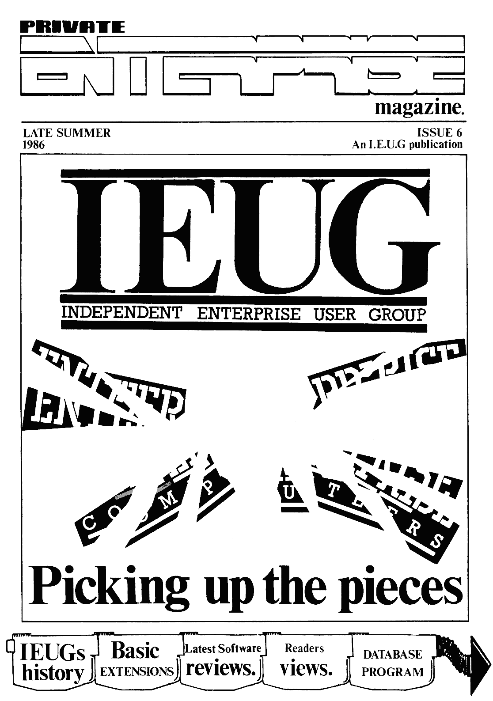

# Private Enterprise Issue 6 (1986 ≈друга половина літа)

[Оригінальний PDF](http://enterprise.iko.hu/magazines/Private_Enterprise_Issue6.pdf)

## Зміст

Editorial  
News Desk  
Private Correspondence  
Programming  
Software Update  
Advanced Programming  
Home Produce  

## Чернетка вмісту

"page-000.pbm" ------------------------------------------------------------ 
PRIVATE

SS

magazine.

LATE SUMMER ISSUE 6
1986 AnI.E.U.G publication

INDEPENDENT ENTERPRISE USER GROUP

"page-001.pbm" ------------------------------------------------------------ 
hh

SpAce

Available to the trade

CONTACT THE I.E.U.G
FOR DETAILS AND RATES

"page-002.pbm" ------------------------------------------------------------ 
Yesesse it's finally here | After the Ee vAli
longest-ever delay, Issue 6 has

finally arrived) Also, it's our

Anniversary, although I'd prefer to CONTENTS... ISSUE 6
have celebrated it in happier

circumstances>

Anyway, enough of the revelry - down
te business: You should all have read NEWS 1B) hs) @ Dave Race looks back on a

ay letter by now, and be aware that) year of Private Enterprise when most
Enterprise Computers Ltd» no longer] things almost certainly were not what 4

7 User Gr i ;
Exists, and that the User Group 1s they at first seemed.
endeavouring to provide you with

better support than Enterprise did+ PRIVATE CORRESPONDENCE) Private

The first step towards this goal Wa5| Hnterprise tries to get to gripe with

taken at the very successful PCW Show | yoeng problems resulting from 6

(many thanks to all who showed up and | wpotenp .
prises receivership.
talked te us), where we caught the P

attention of the computing press, and) PROGRAMMING) cet neavily into detach-

also provoked some very positive | aple hoods, Pacial diseases and long
reactions from a number of software| tangled greecy hair when you break the
hOUses« basic boundries into machine code. 8

However, nothing will be achieved | SOFTWARE UPDATE> Two new Utilities

overnight, and you must be prepared to a :
gies y prep emerge from Tim Boxes Boxsoft Programs,

bear with us while things are sorted | | Ludi

ane pal ' Foe ty agcica +r +

out» The first move must be one of uding the new Zzezip Basic Integer
Compiler.

intraspection, for we cannot continue

in the chaotic manner in which the .
. “| ADVANCED PROGRAMMING) create your

User Group has been run up to now - a
restructuring is necessary. Towards | OW? basic extensions (Strictly for the py
this end, there will be a meeting in] Machine code mind)

the near future (date and venue to be
confirmed in Issue 7), in which, in HOME 3d <0) B) OL Ol Oe May the force be with
addition to seeing all the new| your Pingerg when you start typing in
software, you will be able to take | tris mega 16
part in the democratic process of
reorganising the running of the User
Group. Until this moment, there has| THE INDEPENDENT ENTERPRISE USER GROUP
heen no opportunity fer anyone to find .
out tow the User Group is run, or
contribute any advice, other than by
writing letters to Mark or Tim. New
will be your chance, if you wish it,
to challenge our positions of ultimate
power (and ulbimate commitment ') and
stand for election against us for a
User Group post. A full list of ifems |.
for discussion will accom I Enternrise User Group Publication. Artwork & Layout MARK
(approx four weebs awa a th 1 - DUNCAN TAYLOR. News Editor & Software
minutes of the meeting will ft r 3 3 Edi NETL BLABER. Secretary TIM BOX. Private
published in Issue &. tnterprise Magaz $a ig of The Independent Enterprise User
i i Gin whole or in part without written

Database program.

12 Whitegates,

100 Station Road, r)
New Barnet, i [uo] Gryo

HERTS,
EN5 1QB,
ENGLAND.

Walters

"page-003.pbm" ------------------------------------------------------------ 
oo
—eeee———e—e——e— — —

all

aust
Enterprise went into Receivership some
little time ago; this was on the cards

As you know by now,

for some time, but was still a shock
when it actually happened. It’s one of
those things that always happens to
other people - not someone you know
personally.

This
course,
magazine

sad turn of events will, of
mean some changes to the
and User Group, as mentioned
by Neil in his letter (which you
should all have read by now !),
although everything will keep going of
course. Qne of the items likely to be
in very short supply in the future is
news - | used to make most of it up as
it was ! Indeed, as of this moment,

the anly real news around is the

‘So, I

a

f= J0isntts s

demise of Enterprise and rumours of
the 320, an Amstrad basher which will
probably never now see the light of
day:

thought I*d spend this issue
looking back through the last five
issues of the magazine at some of the

successes and some of the failures of
the last year and a bit.

1

The 128 was launched and proved to be

mby far the more successful of the two

models, offering a larger memory than
any other home micro at that time and
being considerably quicker that the
64. Enterprise signed a distribution
deal with Terry Blood, billed by us as
a “major step" - the contract seemed
to last all of 10 minutes !

A vast number of hardware peripherals
had already been produced for the
machines, i.e. a medium resolution
monitor (soon to be phased out), a
goad quality dot matrix printer and a
joystick interface, ah heady days !
Also, “in the pipeline", were a disk
interface, later to become known as
EXDOS (a truly excellent piece of kit)
, and the much fabled Base Unit, which
deqraded into what became known as °
that horrible piece of plastic that
sits between me Enterprise and me

Exdos", in polite circles.

Software was coming in thick and fast
- titles mentioned included
Dambusters, Matchday, Seventh Seal,
Super Pipeline IT and Frank Bruno's
Boxing, all of which have given us a

of entertainment over the
years To be fair, of the 23 titles
mentioned in issue 1, 14 did appear
including such greats as BEATCHA and
JACKS HOUSE OF CARDS. Finally, it was
announced that the Enterprise 128 “had
been selected for the Design Centre,
an accolade only given to three other
micros - the 2X81, the SPECTRUM and

the BBC". Notice any connection
between the four ?

2

Lots happening this issue !

great deal

Production of the two machines moved
up to GRI Ltd in Scotlands Mr Twine of
GRI described the Enterprise as “an
excellent saleable product and (with)
a soundest possible financial
backing” (ho hum).

Enterprise set up business in Germany
{and are still going ! - Eds), but
lost their distribution link with
Zappo. Zappo were apparently a little
peeved at Enterprise signing up with
Terry Blood - they shouldn*t have
worried.

We were all getting over the
excitement of running the Enterprise
stand at the PCW show (1 kid you not}.
In fact we managed to spend half of
the news section extolling the virtues
of just about everything we saw there:
even the mouse and Speakeasy got a
mention ~- well, one out of two ain't
bad |! Surprisingly, just about every
piece of software mentioned this issue
got out !

"page-004.pbm" ------------------------------------------------------------ 
=News Desk

The issue with the cover Jeff Minter
would have loved, and the record for

the most misspellings of Gary's name ~
proof readers, who'd ‘ave ‘em ?

The all-powerful McIntyre deal was
disclosed. This comprised of a couple
of good value systems, one with the 64
and one with the 128, to be sold mail
order and backed up by a massive (the
likes of which have never been seen
before) advertising campaign. This
seemed to consist of a series of *
subliminal” adverts in Popular
Computing Weekly (which included a
wonderful misquote of Neil}, and a
couple of adverts in the national
press around Boxing Day. I‘ve never
been sure which had the greater impact

Exdos units were available, as were
internal RAM expansions. No external
RAM packs "until after Christmas".

We started on the long slippery slope
to providing you with a dedicated
joystick (which Aztec never quite got
round {0 letting us see), and the
mouse and Speakeasy were once again
very nearly with us !

19 software titles mentioned this
time, many of which had been mentioned
in issue 1, 8 of which never made it.
I‘m not counting "View to a Kill” in
with that lot |

Guess what ? The mouse was nearly with
us ~ ooh, the excitement ' See issue
as cover for a more realistic
representation of the facts. I was
happily singing the praises of Macro~D
and Asmon this issue, which just goes
to show you what an idiot I am, as
neither has seen the light of day.

Wimpy choose an Enterprise for their

stand at the Ideal Home Exhibition,
obviously not wishing to offend any of
the major home computer manufacturers.

it was revealed that 1S-D0S
pushed by I-S. as “an
industry standard S8-bit opperating
system" and would be producing
packages for it. 1.5. were unavailable
for comment on this (I wonder why ?).

S

Oh that front cover, if only we knew !

Finally
was to he

30% of this issue's news was taken up
by a description of our second great
meeting, which was admittedly a great
success. That just goes te show you

how much was happening towards the
ends

Aztec
reveal

bit the dust, shame ! I can now
that one of the reasons that

PRIVATE

they couldn*t get the mouse out was
that they had a warehouse fire and all
their stock was burnt, including the
preprods, and the moulds, and the
plans ~- in fact, everything seemed to
he in there - strange...

The Technical Manual was launched (
hands up everyone who got one) while I

was still rabbiting on about Asmon and
Macro-D.

Finally, if you want a giggle, read
the last paragraph in the news section
again in the light of recent
happenings.

So there we
life ofe. It

have it, a year in the

just goes to show you
that no-one can get it right all the
time, in fact in the face of such
adversity I was lucky to get any of it
right at all !

DAVE
RACE

= Jlenroi= = Available

ae Gk OC a; A

Ss

"page-005.pbm" ------------------------------------------------------------ 
Hello and welcome to another Private
Correspondence, but this time with a
difference; changes have taken place:
To be more precise, I have taken on
the letters page from Tim. Before you
all do nasty things like sending us
your Enterprise versions of the °
Commodore Rap", I must tell you that
the address WILL be the same as before
(for the time being». heh heh - Ed).
If you have any queries which you
would prefer to phone up about, then
contact Tim at the number given in
Issue 5. Oh yes, before I go any
further I must tell you that my name

is Duncan Taylor. Now to the serious
bit, your letters:

Dear [EUG

Now that Enterprise Computers have
gone into Receivership what will
happen to all the hardware and
software that was about to be released
like £qqs of Death, Sprite Handler,
Tip Compiler and the mouse?

Will you still be continuing the
Private Enterprise? How do you use the
Attributes commands properly in Basic?
How can [ move a character about the
screen without disturbing the
background? I recently bought a Forth
cartridge and 1 am having problems
using it, please could you do an
article on Forth? Will you be doing
any articles on machine cade?

T have just bought a Brother HRS

printer and tried your screen duap
program on the Greatest Hits Vol t
Tape and I keep getting a variable
error at the beginning of the program,
is this another bug or is if my
printer? Can you tell me if there are
any Enterprise users in the Humberside
area? Is it possible to buy memory
upgrades for the 64 in electronic
shops ?

Nigel Schrimshaw,
South Humberside.

DT: Although Enterprise Computers have
gone into Receivership, we will still
be supporting the Enterprise as fully
as we can» Neil's letter should have

gossip, outrage, its your page.

will be
mag for

explained this
available soon,
details.

fully.
watch

Zip
this

I'm afraid that to do justice to
expaining the Attribute command would

neccesitate writing an article about
it - anyone out there interested?

about the screen
disturbing the background
would have to be done using machine
code and would be too long to include
in Private Correspondence:

Moving characters

without

We will do
Machine code
send them

articles on Forth and

if anyone would like to
in to us» We can only do a
limited amount ourselves, and nobody
at IEUG HO has any experise with
Forth, so I can’t guarantee anything:

Your printer should work perfectly
well with the screen dump program, as
it is Epson compatible. Check to see
that you are doing everything
correctly, and if you are still
experiencing problems contact Tim at
the IEUG address, as he supplied the
offending program !

We can't publish peoples names and
addresses or forward them on, unless
they specifically ask us te do so. If
you would like to become a Local Area
Organiser, tell us and we can then
tell people in your area to get in
touch with you.

The memory upgrade te {28k involves
quite a number of components on a
circuit board, se to construct one
yourself is unfortunately not as
simple as putting in a few chips. Keep
a look out in further issues for any

‘Kernel

news about upgrading:

Dear 1.£.U.6

I propose to make all Enterprise users
not in the IEUG aware of it by writing
to magazines informing them of the
TEUG, if that's all right with you

guys
Down to problems now:

a) How does one convert tape to disk
when the initial part of the tape
contains the load instructions for the
next part? I have DEVPAC. How do I go
about getting the next bit to load
from disk? I already have ali the
separate parts of a program, but need
to get them together.

b) How does one get a modular tape
(e.g wriggler,sorcery) to load when
the EXDGS is connected? 1 have to
disconnect EXDOS to play them.

t) How does one alter the program on
Lands of Havoc to get it to function
with the external joystick ?

ad) I can’t understand some of the
notation in the Technical Manual. How
should IRQ ENABLE STATE, FLAG SOFT_IRG
etc be used? Should they be part of a
Basic program or are they just
notations for machine code ?

e) How does one get to EXOS to put in
EX0S variables? How do I input X05
functions in hasic machine
code?

read

(I'm sorry IT can't

signature)

your

"page-006.pbm" ------------------------------------------------------------ 
SrA  —$ <<

Purton,
Swindon:

DT: a) To get EXDOS to transfer
things from tape to disk directly
either use!

iCOPY TAPE: program_name
ont

10 OPEN INPUT f1:"TAPE:"
20 OPEN OUTPUT £2:"DISK: file”
30 «COPY fi 70 £2

latter will only copy one file at
a time (refer to the EXDOS manual).
To link up separate modules of the
same program you need to find the name
of each of the modules and replace
every occurrence of "TAPE!" in a
module with the name of the next
module in the sequences To do this you
need to use a machine code (or

Pascal». Ed+) program:

The

i) The problem with some tape
software is that the code is written
in memory which EXD0S uses (
unfortunately, Wriggler and Sorcery
are in this category); there is mo way
of getting round this other than
completely relocating the program. If
you feel in a particularly masochistic
mood, and write a program to do this,
you will make a lot of people

hysterically happy (hint hint}.

c) One of the marks of a qood program
is that it allows users flexibility in
its use - unfortunately not all
programs are written with this in
minds Lands of Havoc doesn't allow the
use of an external joystick, so unless
you are willing to reprogram some of
it then I am afraid there is nothing
siaple that can be done. Another
example of the above is the number of
programs which don't allow the
external speaker to be switched off.

d) You are not the first to be
aystified at the notation used in
either manuals, a little explanation

is necessary:

FLAG_SOFT_IRQ and the like are just
labels, they refer to specific areas
in memory whose state either changes
the operation of the machine, or which
give an indication of what is going
on» For example, FLAG_SOFT_IRQ refers
to address BFF2 (in Hex) in seqment
255 of the memory. This byte is set,
either by the programmer or the
computer during operation, to cause
an interrupt» The Technical Manual
explains it further-

2) To use EX0S properly you need to
write a Pascal or machine code prograa
to do whatever if is you want to do
with EX0S. A machine code program can
then be accessed from a Basit program,
if you want to, using the USR command.
See the article on Exos Variables in
this very issue for more details !

Thanks for the offer of "spreading the
word". Everything to advertise the
qroup to non-IEUG Enterprise users is
welcome.

O—_!”*”vn....-2=-———

Dear [.E.U.6

I have bought EXDOS, but the Reciever
tells me that I cannot now have a free
18-DOS disk. Is there any way I can
obtain 1S~-D0S?

With EXDOS connected most tapes will
not load fully even with the command
LOAD “tapet*. Some tapes just stop
leading and others will only continue
loading if 1 press START immediately
after the monitor indicates the
loading has finished.

twin disk
lost ait
of what

I bought a Cumana 3.0”
drive, and = having
instructions. 1 am unsure
disks 1 can use with it.

J.DeWeir,
Croydon,
Surrey:

1) a
problems
nothing
although

been a number of

hold of 19-DO5;
has been sorted out yet,
news from the Receiver
indicates that Enterprise's assets
will be sold soon, $0 hopefully this
issue should be resolved in the very
near futures

have
getting

The question about EXDOS and the
loading of tapes is a question a
number of people have written in
about» This prablem exists because
when EXDOS is connected, the default
input device automatically changes to
DISK! This is not a problem if you are
only dealing with a single file, but
most programs consist of a number of
files, usually a loader progran
followed by the main programe The
trouble is that a number of these
loader programs do not specify TAPE!
when looking for the file to be
loaded, and of course it will be
searched for on disks

With your Cumana drive, any 3.5" disk
will do, although if it's only a
single-sided drive don't waste money
by buying double-sided disks |

ol

"page-007.pbm" ------------------------------------------------------------ 
=Programming

There are often times when it is
necessary to run machine code routines
from a main BASIC program, or store
large amounts of data without using
arrays» To do this you must find a
place in the computer's memory where
1 will not be overwritten by other
things. Whilst it is fairly easy to
protect it from the needs of the EXOS
operating system, protecting it from
the BASIC is rather more difficult as
it is not properly documented:

Wow:

The "official" Enterprise way of
setting aside memory is to use the
ALLOCATE command, as mentioned in the
chapter of the BASIC manual entitled "
Using Machine Code". You allocate a
certain amount of memory for use by
your routine, and insert the machine

code into the program using CODE We aaeyaal Basic

statements, typing it in as bytes of

hex» This is fairly well explained in LOAD: 190 NEXT I

the manual. As a method of using 200 CLOSE £106

machine code it is not bad; you are {| 100 PROGRAM "MLOAD®

allowed to use “labels” in the hex, | 110 LET MCLEN = (length of code>

and can CALL these labels by name. 120 ALLOCATE MCLEN MSAVE: LD A,i06D

However, when you compare it with the | 130 CODE MC = *9* LD DE, destination
likes of "“DEVPAC" and "ASMON" (I am| 140 OPEN f106!"name" ACCESS OUTPUT LD BC,length of code
lucky enough to have a copy of ASMON, | 150 FOR I = MC TO MC + MCLEN - 1 EXOS 08D = :Read block
it’s brilliant !), the hex method) 160 GET £106:A8 RET

seems a little primitive, and also| 170 POKE 1,ORD (A$)

wastes memory with thousands of CODE} $80 NEXT I
lines. 190 CLOSE £106 The BASIC routines are pretty self

explanatory, but the machine code
The problem is that there is no way of routines assume that channel £106 has
to include an assembled file from) MLOAD: LD A,106D previously been opened to tape or
either assembler into an allocated LD DE, location of code disk. This channel should be closed
block, as the BASIC lacks a facility LD BC, length of code afterwards. The machine code was
to LOAD or SAVE blocks of machine EXOS 06D Write block written using ASMON.
code- It is possible to use ae
relocatable modules via the operating As long as the code you load in is
system, but they can be a bit of a assembled to run at the start address
mouthful and are not really necessaryé | saye: of the allocated space (usually 4809),

you will be able to call and use it.
I have written short routines to SAVE] {00 PROGRAN "MSAVE? You can also use it to load data inte
and LOAD machine code, and these are| 110 LET MCLEN = <Jength of code} the allocated space» This method will
printed below. There are two versions | 120 ALLOCATE MCLEN sometimes do far small routines, but
of each, BASIC and machine code, | 130 CODE MC = wes. ! Your M/C there are unfortunately a few snags.
although you will of course need a] 140 CODE MC = ..e. ' progras
machine code loading routine to load | 150 CODE MC =... ' Chex) . The allocated space seems to be part
the machine code loading routine (!) {60 OPEN £106:"name” ACCESS INPUT of the variables area, and is cleared
unless you convert it into hex and use| 170 FOR 1 = MC TO MC + MCLEN - 1 by a RUN command. It is not possible
CODE. . 180 PRINT £106:CHR$(PEEK(T)); to extend the allocation over more

"page-008.pbm" ------------------------------------------------------------ 
=Programming

than one segment, so in practice you
are limited to about 12K of space Or
a 128K machine this is pathetic !
Finally, EXOS 2.0 in the 64K machines
has a bug in the ALLOCATE command,

requiring patching with the program

featured in previous issues.

We can thank Intelligent (7) Software
for these little features,
unfortunately they make the ALLOCATE
space quite hard to use

LD A, (FREESES)
LD C,A

EXOS 25

EX0S 24

RST 18

LD A,C

LD (FREESEG) ,A
LD H,0

LD L,¢

RET

FREESEG DEFB 0

If you want to use a mega-long piece
of code, or huge library of data, then
there is an alternative - you can set
up your own 16K segment or segments
for use by your BASIC program.
Unfortunately, the set-up code must be

put in using the infamous ALLOCATE
statement, but that's life !

Here's the set-up code. It is very

Simple because it relies on EX0S calls
to do all the work.

' Load A with number of previously
' allocated segment

' "Free Segment” EXOS call

' "Allocate Segment” £X05 call

' See if an error has occurred

1 C now contains the segment number
of the allocated seqment

! Address where user's segment

' number is held. Must not be
' corrupted by any other data.

The program above will allocate you ¢
{GK segment, and return its segment
fumber to your BASIC program in
redister HL (see the BASIC manual).
ee TT
allocated like this, up to the number
free to use, but there is one
important point te remember when using
the routine. You must make sure that
the segment is freed by EX0S, using
the free segment call before the
segment is allocated, atherwise you
will be given a new segment. If this
is not done each time, you will soon
find the routine happily gobbling up
the system's free-memory each time you
Tun your program:

Before you can use a segment, it must
be paged inte the 290 address map page
2, using OUT 178, freeseq. This ought
to ke done each time the seqment is
used, as the BASIC may sometimes want
to use the page. You can then PEEK and
POKE to your statement from BASIC - it
will be situated from 32768 to 4915!
in the address map, but remember to be
careful»

‘You can LOAD

or SAVE part or all of
your segment(s) using the LOAD and
SAVE routines above. If you want to
know more about the operating system,
allocating memory etc. then the
Enterprise Technical Manual is a must

to buy:
A.S. Burnham

(Editor's
longer

note - The manual is no
available, but all useful
technical information contained in it
will appear in -this magazine in, the
near future).

"page-009.pbm" ------------------------------------------------------------ 
=Software

1 BIE Ke

KEY TO RATINGS;
ARCADE and ANIMATED ADVENTURES

GAME CONTENT - Variety of actions

' 7 screens

-~ Ease of use,
addictive quality

- Quality and use of
graphics related to
aachine

~ Use of steree and
tune {noise
originality.

VALUE FOR MONEY - Overall impression

when compared with

prices

PLAYABILITY

GRAPHICS

SOUND

ADVENTURES

GAME CONTENT  ~ Design of plot /
background. Puzzle
ingenuity:

PRESENTATION - Atmosphere, graphics
(if any), text /
screen layout.

INTERACTION ~ Parser quality,

editing facilities

VALUE FOR MONEY - Overall impression
when compared with
price.

PERCENTAGES

0-25 - Yuk, Bleah !
26- 50 ~ Bad to Mediocre
51-75 - Average to Good
75-100 ~ Excellent to
Brilliant

completely

-year,

: Screen Utilities
Boxsoft

Utility

£5.95

Name

Producer !
Category |
Price H

If you went to the P.C.W. Show last

you probably freaked out over
User Group's artistic talent (

Mark '), by which I mean those
great pictures of deckchairs and
horses and things» Well I've a
confession to make, we didn’t draw
them - Tim digitised them. BUT you're
probably still pretty amazed at the
speed they were loaded from disc;
after all the listing in Issue 1 wasn’
t that fast, and how did we do those

4

nifty printer dumps ?

the
read,

Well, the
available
(surprise,

software used by us is now
to you, courtesy of Boxsoft
surprise ') Screen
Utilities consists of two programs
SCR_SLC, (standing for SCReen Save,
Load Copy), and SCRDUNP, (standing
for... wait for ites. SCReen DUMP,
and called SCRCOPY on the cassette
label for some inexplicable reason).

Both = programs
extensions, 50

load as) systen
that they sit in the

computer gut of the way and are called

using the EXT command, which is much
more convenient than having to include
the routines at the beqinning of every
qraphics program that you write. They
can also be used in immediate mode in
the same way that you would use HELP,
for example.

SCR_SLC is
quick» Not

very powerful
only does it

and very
save the

BUS C

P-R-O-
aig ps

SCREEN UTILITIES

palette colours along with the picture
data, but it will open a video channel
of the right type to load the picture

and automatically display it if
asked. SCRDUMP dumps sideways on, 50
that you don’t lose the edge of your
masterpiece, and the output can be
inverted so that it appears the same
as the image on the TV. screens It
can also be set up for just about any
printer - except daisywheels !

Both preqrams have many more features
which I don't have space to go into
here, most of which were listed in the
Boxsoft advert last Issue. All in ali
if you're the sort of person who does
any graphic work these ubilities are a
useful addtion to your software tools,
and J can certainly recommend them at
£5.95 for the pair (where's that
tenner Tim ?)-

"page-010.pbm" ------------------------------------------------------------ 
=Software Update

Name t
Producer
Cateqory }
Price H

Lzzip
Boxsoft
Utility
{17.95

Anyone who does any programming on the
Enterprise will know how slow IS-Basic
is ~ a snail with an abacus is
probably quicker! Well, help is now at
hand in the form of Lzzip, a Basic
compiler available from Boxsoft, (
plug,plug) and written by Peter Hiner.

This is the second compiler we have
seen on the Enterprise, the first,
from Aztec (remember them ?) never got
past the developement stage and only
offered a two to five times speed
increase» This one gives up to a FIFTY
times speed increase on some things
and gives, on average, a twelvefold
speed increase:

Qne of the reasons why Zzzip is 50
quick is that if is an integer
compilers This means that any programs
which use floating point arithmetic
are unlikely to work properly after
being compiled without a certain
amount of fudging. Normally, this
would also mean that trigonometric
functions (SIN, COS etc»)wouldn't
work, as they return values between -1
and 1; the same applies to LQG.
However Zzzip has the unusual feature
of scaling the results returned by
these functions by a factor of 1000,
go allowing them to be used in
compiled programs with a little work.
All of this is explained in detail in
the user manual:

ASH NS

The
Ss

0

In fact, Lzzip seems to handle nearly
all Basic functions and commands,
although some need to be used with
care, and there won't be many programs

Actually
itself.

using Zzzip is simplicity
Just load Zzzip and tell it
the name of the program you want to
compiles Zzzip will then ask you what
to call the compiled program and gets
on with the job of compiling your
Basic program. I1t then makes a number
of passes through the program and
points out any parts that can’t be
compiled $0 you can go back to the
Basic program and alter them» You will
almost certainly find that there is
something in your program that will
need changing, although it will
usually only be something minor, and

es

the manual gives plenty of advice on
more difficult cases. Gnce the program
has been altered to lzzip’s
satisfaction the compiled program will
be saved in two parts - the main
program and a loader. All you need to
do to run the compiled version of your
Basic masterpiece is load and run the
loader program and sit back and be
amazed by the speed increases:

In conclusion, I would say that Zzzip
is a good buy, and the hassle of going
through a Basic program checking for
things it can’t handle is more than
compensated for by the speed increases
obtained, presuming of course that you
program in Basic.

Dave Race

"page-011.pbm" ------------------------------------------------------------ 
=Advanced Programming

This article is intended for the
machine-code programmer. If you do not
understand machine-code, do not expect
to understand much of this!

If you wish to write programs using an
assembler, they should be assembled as
user-relocatable modules. Use ENT $ to
mark the code that intialises and
defines all your extensions.

Intelligent Software designed BASIC in
such a way that a programmer can add
to the language very easily, without
having to re-write the whale thing. It
is possible to add both commands and
functions that can have their own
syntax and yet use the normal
facilities of BASIC to interperate.

First, I will explain how to add your
own functions This is possible in
BASIC using the DEF command, but this
method will mean that your function
will not disappear when you alter a
BASIC pregram or run it. Your function
Will behave very similarly to an in-
built one.

To add a function you should use a
CALL to a BASIC subroutine, which will
do all the complicated work for you.
Here is how to use it

LD ORL, function data
RST 16
DEFB 128,0

The
the

'RST 16! bit is special call like
‘RST 48! of EXOS. It looks ahead
to the ‘'DEFB' and all the numbers
after it. Each number represents a
specific call. The list of numbers
should end with a '0'.

Refore calling, HL should point to a
block of information about the
function, in the following fora!

fn_data DEFW 0
DEFB 13
DEFB name_length
DEFM "name®

a

Basic Extensions

DEFW execute address
DEFER execute segment

Yname_length’ is the number of
characters in the name of the function

‘name is the’ name of the function in
upper-case letters.

Yexecute address’ is the address to be

called te carry out the work of the
function

Yaxecute seqment! is
number that the code is ins Just keep
it as zero if your code is in page-
zero, which if probably will be.

the segment

The function will have ta get
arguments and return them using more
RST 16! calls. Here ois an

explaination of the east important
Ones.

To return a value, first put it in the
HL register and then ¢

RST 16
DEFB 2,0

The built-in
solely of :

WHITE function consists

WHITE =oLD | HL,258
RST 16
DEFB 2,0
RET

yHLewhite code

yReturn this value
yReturn

To skip
bracket, use t

over an opening -

DAYS
eG
DEFB 34,9

To skip aver the closing -
bracket, use !

LD AY?
RST 16
DEFB Sd,

To skip over the comma, use i

LDA, 12
RST 16
DEFB 34,0

These
functions
forget to

for
not
If the

three are essential
with arquments. Do
include then.

"page-012.pbm" ------------------------------------------------------------ 
=Advanced Programming

relevant symble is missing, then a
‘Not understood' error will be caused.

To fetch an argument, use $

RST 16
DEFB 35,11,0

This
HL.

returns the argument*s value in

Here is an example function that

doubles a number.

DEFINE ENT $
LD HL FN_DATA
RST 16
DEFB 128,0
RET

FN_DATA DEFW 0
DEFB 12
DEFB 6
DEFN "DOUBLE"
DEFW DOUBLE
DEFR 0

DOUBLE LD A,B
RST 16
DEFB 34,0

\ Skip
dopening
/ bracket

RST 16 \ Fetch
DEFB 35,11,0 / parameter
ADD HL,HL > double it

RST 16
DEFB 2,0

\ Return
/ it

LD A,9
RST 16
DEFB 34,0

\ Skip
>closing
/ bracket

RET > Return

Because 'RST 16! accepts a list of
calls after it, it is possible to
replace the first five lines of DOUBLE
with :

(DAYS
RST {6
DEFB 34,35,11,6

It is
be?

easy to think that it ought to

LD AS
RST 16
DEFB 34,0,35,11,0

There are two zeros in the original,
50 why shouldnt there be two zeros
when the program is shortened version?

The answer is that the zero is the
marker of the end of the list of calls
and $0 should not appear until the
end.

Now for string functions.

String functions are defined in
exactly the same way a5 numeric ones,
except that the ‘'DEFB 12° must be
replaced with 'DEFB 13", to signify it
as a strinf function» It must also, of
course, have a $ Sign on the end of
its name» This should be included in
the name and length byte.

To evaluate a string expression as an
argument, use ?

RST 16
DEFB 36,0

This will put a string on the ‘BASIC
parameter stack’. This is used for
parameters, blocks calculations etc:
and 35 very important.

To find
use

the address of this string,
LD HL, (352)
INC HL

HL will now point to its length byte.
After that comes the actual string.

When
should

the function
have been

ends, this string

deleted from the
stack, meaning that the value at
address S52 must point to the next
byte above the end of the string.

=_—eFEHFHEHEHECE_E_ElECC lll

Now for how to return a string result.

LD HL, (352)
DEC HL

Then put the last character in the
string at address HL» Decrement HL and
put the second-from last character in
the byte at HL and so on until the end
(or beginning!) of the string:

The length byte should come next and
the byte below should hold the length
bytet+2. Then store the address of this
last byte at address 552.

So, to return the character B,
use t

LD HL, (552)
DEC HL

LD (HL),B
DEC HL

LD (HL), !
DEC HL

LD (HL),3
LD (552), HL

Now for a complete function.

FN_DATA DEFW 0
DEFB 13
DEFB 4
DEFM "KEYS"
DEFW KEY
DEFB 0

WT Maririatis
> from keyboard
channel

LD A,105
RST 48
DEFB § /
RST 24 > See to any errars
LD HL, (382) \ Return

DEC HL \ character

LD (HL), B \ as

DEC HL \ result

LD CHL), 1 /froa

DEC HL ‘function

tb CHL) ,3 /

LD (352),HL /

RET

Which returns a key press by reading

"page-013.pbm" ------------------------------------------------------------ 
= Advanced Programming

from the keyboard channel.
Commands are more complicated.

Here is the code for a command that
writes a string to the status line.

This bit defines the command
DEFINE LD HL, (562)
DEFLOOP LD =A, CHL)
INC HL
OR = (HL)
DEC HL
JR 72, EXTEND
LD oA, (HL)
INC HL
LD oH, (HL)
LD OLA
JR = DEFLOOP

EXTEND LD  DE,CONTAB
LD (HL),E
INC HL
LD (HL),D
RET

This is the first table. It can have
information on as many commands as you
like. Here it is only one, though-

CONTAB DEFW 6
DEFB 1 3 number of commands
The following two lines must be
repeated for every command:

DEFW STATUS# spcinter to
ydata about
ythe command

DEFB 4 3 ignored

This is the data for each command:
STATUS$ DEFW STATUS yexecution address
DEFW CHECK
DEFB 83 ;command type
ysee below
DEFB 6 yname length
DEFM "STATUS" sname in upper
case

This bit is required, but is pointless
to explains just include it with every
extention program for commands:

CHECK RST 16

DEFB 32,9

SCF
CHCKL «JRC, CHCK2

RST 16

DEFB 33,0
CHCK2 LD  A,(316)

CP 16

RET 2

CP 2

RET ¢

cP 8

JR 1, CHCK!

JR = CHECK

This
work:

is the code that does the actual

STATUS RST 16 \fetch string
DEFB 36,0 /parameter
LD HL, (952)
INC HL
LD OA, CHL) \ Check
cP O32 \ its
JR o2,TBG* > length
OR A / and cause in
JR =1,TBG / error if too big
LD oC,A \ Put length
LD BO / in BC
IN A,(178)
PUSH AF
LD A, 255 \ Find address
QUT (178),A > of status
LD ODE, (OBFF&h)/ line
INC DE
INC DE \ Move over
INC DE > key lock
INC DE / section
INC DE
INC DE
LDIR > write inte memory
LD (552) HL > Reset 352
POP AF _ \ Restore
OUT (178),A 9 / segments
RET

TBG Ld
RST

,1106 \ Cause string
/ too big error

As you may have noticed, functions and
commands get their arguments in
exactly the same way. Se commands
fetch numbers using the same call as
functions.

The 'DEFB 83! bit of the command's

data section is the type byte. It is
the normal type byte, meaning that the
function can be used in programs,
immediate mode, multi-statement lines
and that if should be tokeniseds All
commands should be tokeniseds The only
exceptions are ', DATA and REM where
the information afterwards will not be
evaluated and should be kept as text.

The type byte is made up as follows ¢
bit meaning if set

allowed in immediate mode
allowed in program

end of block

start of block

allowed in multi-statement
line

alters program

tokenise

not used - keep as zero

Bits 2 and 3 are used by LIST for
indentation purposes» If they are both
set, then indentation like CASE or
ELSE is given:

Call number 3d you have seen before.
lt compares the character that BASIC™s
internal pointers are pointing to with
the value in the A register If they
differ, then an error is caused. Here
are all the values A can have !

0 End of line
{ | -comment marker

"page-014.pbm" ------------------------------------------------------------ 
= Advanced Programming

It is also possible to find out what
character is at that position with ‘LD
A,(516)'. A will have the appropriate
value from the table above. To skip
over any character or word, use call
number 32.

Jo find out what the pointers are
pointing after this symble, use ‘LD A,
(5id)'. A will have a value from the
following table :

0 symble

32 ordinary word or numeric variable
64 string variable

96 command

128 string enclosed in quotes

160 line number after GOTO ete:

{92 ordinary number

To find out the length of a word, use
1LD AY(S15)'. The address of the text
of this word can be found out with ‘LD
HL, (S39)'.

of the

Here is a summary most

important calls :

O End of List
1 Cause errorsCan also use RST 22
2 Put integer HL on BASIC
parameter stack
ti Get HL off parameter stack
32 Skip over any word
3S Skip over expression
34 Skip over word as long as it is
prefixed with the symble A
35 Fetch numeric parameter
36 Fetch string parameter
128 Add function HL
160 Skip closing bracket
186 List HL to DE
Here is a summary of the more
important addresses in page zero.

16 RST 16 call address
32 cause error call
Sid word type
315 word Length
316 delimiting syable

518 command exit condition
if zero when the command exits

with RET, then the program will juap
to the address stored at Sid.

521 present channel number

522 program number

532 pointer to symble in prograa

534 pointer to beginning of Line

if address 518 is two, then

this is used as the destination
address for jumps

538 start of program memory

540 code pointer

552 BASIC parameter stack

562 pointer to command table

372 error code

574 CONTINUE address

576 address of present HANDLER
progran

384 length of input

$85-838 input

839 pointer to pressent word

Here is the format of a program line !

length byte (0 for end of program)

d-byte line number (1-9999)

{-byte indentation value (used by
LIST} etc.

96 (type byte for command)

command number (0-255)

After that comes the command's

parameters. First comes a byte giving

the type» The top three bits are put

in S14 and are used to find out what

the rest of the data means:

symble ¢ 31420)
Bottom five bits (in 519)
symble*s number (see above).

is the

word (32)

Bottom five bits are word's length.
Word comes after in upper case. (839)
points to this word

string (64)
As ordinary word

command (96)
Number afterwards
tumbers

gives command

quotes (128)
Next byte
that are
quotes:

gives length» Bytes after
the letters between the

line number (160)
Two bytes afterwards
number.

give line

number (192)

If bottom five bits equal 2, then the
number is an integer, given as a line
numbers (Otherwise, the number is
floating-point in the following form !

five bytes BCD mantissa

ane byte exponent

“bit 7 is the sign bit

~64 is an exponent of zero, below
that are negative exponents, and above
that, the exponent is positive.

The last byte of the line is zero If
the first command on the line has its
tokenisation flag reset, then the
above rules do not apply. The whole
line is just text ending with a zero:
It will, though, have the length byte,
line number and command number stored
as above.

If you are confused by this, or would

like to know more, you can contact me-
My address is

Glebe House
Coalport Road
Madeley
Telford
TF7SDS

"page-015.pbm" ------------------------------------------------------------ 
=Home Produce

Once the database is running, a menu is presented to the user giving three

options ¢
1. CREATE A FILE

This {as the
asked how many fields
following example is
clearer:

will
considered,

Fred Bloggs

13, Nowhere Street
Villestown
Yorkshire

AB (23

Namet

Number + Road:
Town:

County!

Post Code:

wo ono

Each separate piece of information is called a field, se
in this example the Name is the first and the Town the
third. Altogether, these five fields form one record: For
example, it could be thought of as one card in a card
index» Once a number of records have been entered, these
make up a file (think of a draw full of index cards)» The
more fields that are used, the smaller the number of
records which can be stored before the memory is used up.
After the titles have been entered (up to a maximum of 20
characters) the main database routine is started.

2. LOAD A FILE FROM TAPE

This allows data to be loaded into the database from tape
after being saved previously. Just enter the filename
when asked (or just type ENTER to load the first file
found on the tape). The data will then be loaded into the
database and all the functions used on it as normals

3. EXIT PROGRAM
As the title suggests, use-this to exit the program

Once in the main database routine, three separate windows
are created; the top one displaying instructions and
prompts, the second displays all the commands available
to the user and the third (and largest) showing all the
entered information. Another function of the top window
is to show the current record number, with the total
number of records in the file and the total available (
depends on the number of fields used ~ maximum 1400 with
1 field). The main database routine has a number of
commands which do need some quite detailed explanation:
COMMAND "A"

Adds new records to the file. This command is used when
starting a new file or when extra records are to be

i

t

t

' . .

1 = { pec beginning
!

i

i

{

are

hame suggests) allows the user to create a file. He will be
he required (up to a maximum of 10). If the
the term "field" and others may become

added» Only 20 characters may be used on each field. If
more are used, they are automatically added to the
of the next field. If the erase key is pressed
the whole field is deleted, not just one character. To
stop adding records, press ESC.

COMMAND "D"

Delete record currently shown on the screen» You will be
asked te confirm this command to prevent accidental
erasure. If there are a lot of records, if may take some
time to rearrange them.

COMMAND "a Sark

Order or Sort. The sart in this program is a “shell sort"
, Which is very quick when compared with others such as
the “bubble sort". Even though it is a powerful sort, it
will take a long time with lots of records to arrange, $0
be prepared for a long wait. After choosing which field
the sort will use, you will be asked how many characters
are to be considered. | have found that 2 characters are
the most reliable for the data I stare in the program,
but this can vary and depends on the contents of the
fields. If, for example, there are no spaces in the first
4 characters of the field being used then 4 would give a
more accurate sort. The reasoning for this is that spaces
also included in the routine and can give unexpected
results: Finally, numbers are not sorted numerically, but
according to their ASCII codes, so 113 would come before
23! Experimentation is really the best solution with
this function:

a

foot

COMMAND "S*
4

Search through the file.» You are asked which field the
search is to use» If you want it to be over all the
fields then type “A. The search string is required next;
enter the words and letters which the computer is looking
for. Be careful in the use of upper and lower case
letters, as they are not the same. All records containing
the search string will be displayed (up to a maximum of
50), one ata time - just press any key to go on to the
next, or ESC (when prompted) to escape:

"page-016.pbm" ------------------------------------------------------------ 
=Home Produce

COMMAND "L"

List all records from first to last» Press ESC to stop.
the listing.

VA
COMMAND "F" al
Move forward by one record.
eke

Move backwards by one record:

COMMAND "5"

COMMAND "Cc"

Copy a page to the printer, or alternatively list the
whole file onto paper (in a compacted form)« Follow the

prompts when given.

r { [-
COMMAND “gf 00 whl

100 PROGRAM "DATABASE.Bas*
110 REM
120 REM #EEEEHEHREEEEE AREER SEREEEES
130 REM 4% ¥et
140 REM #4e eEE
{50 REM 444 £44
160 REM REREREERHEREHELERELEREL ERE
170 REM
180 SET FREY 1 "*
190 SET FKEY 2 "*
200 SET FKEY 3 *"
210 SET FKEY 4 **
220 SET FKEY 5 *"
230 SET FKEY 6 **
240 SET FKEY 7 "*
250 SET FKEY 8 °*
260 SET INTERRUPT STOP OFF
270 SET KEY CLICK ON
280 SET SPEAKER ON
290 LET FIELDS NUM_REC,CUR_REC=0
300 LET CUR FLB=1
310 LET ADD, NUM=0
320 00
TEXT

330
340 PRINT AT 1,14: "Database”
350 PRINT AT 2,142"-------- ,
360 PRINT AT 4 rok Richard Hudson 1986"
370 PRINT AT 10,1: "Select from the following..."
380 PRINT :PRINT "{}Create a new file."
390 PRINT PRINT "2}Load a file from tape."
400 PRINT SPRINT “J}Exit program. *
410 LOOK £10538
420 PRINT SPRINT CHRS(B);" "3
430}
440!
450 LOOP UNTIL Bed? OR B=50 OR B=S1
460 WAIT {
470 IF B=d9 THEN
480 CALL ASK
490!
a 7 set up data base arrays
1 i
S20 LET MAXMEM=INT(1d00/ FIELDS)

main program

Exit from the main database into the initial menu.

COMMAND "U"

Update records. The function operates on the record
currently displayed. Each field in turn can be altered,
but if any alterations are to be made the ERASE KEY MUST
BE PRESSED - otherwise the new version will be added to
the old, even though at first it will appear to
overwrites To leave a field unaltered, just press ENTER.

COMMAND "kK" ~ . 5

anne

Save a file to tape. Data can be saved under a given name
(letters and underline characters only) of limited
length. It is saved in two parts, the first saving the
data needed to create the arrays, ie. the number of
records/fields and the field titles. The second part
actually saves the input data in the file» The two parts
are required so that arrays can he formed during loading.

330
340
su
360
370

STRING INFOS(1 TO MAXMEM,1 TO FIELDS)#20

NUMERIC Y(FIELDS)

STRING TITLESC FIELDS) #18

DIM SER(50)

CALL SET_UP2

580) CALL SET UPI

590 CALL DBASE

eo ELSE IF Be50 THEN

£30 OPEN £106: "tapestits meee “neu
i*tapet! “TXT @ec e935 input?

640s INPUT FLOGIFIELDS x re

650 INPUT f106:NUM_REC

660 INPUT F106:CUR_FLD

670 CLOSE £106

680 LET MAXMEM=INT(1400/FIELDS)

690 STRING INFOS(1 TO(MAXMEM),1 TO FIELDS}#20

700 STRING TITLES( FIELDS) #18

710 DIM SER(50}

720 OPEN £106" taper "ars

730) FOR F=1 TO FIELDS

740 INPUT PLQGITITLES(F)

750 = NEXT F

760 FOR R=1 TQ NUM REC

770 FOR F=i 70 FIELDS

780 INPUT £100 INFOS(R,F)

750 NEXT F

800 NEXT R

S10 CLOSE £106

820 LET CUR _REC=NUM_REC

830 © CALL SET UPI

840 CALL DBASE

850 ELSE IF B=51 THEN

840 CLEAR FKEYS

870 = SET INTERRUPT STOP ON

880 END

890 END IF

900 GOTO 320

910 REM

920 REM EEEREEREEEREREAEERES

930 REM 44% Functions #4#%

G40 REM ¥EREEEHEREREEARERAES

990 REM

"page-017.pbm" ------------------------------------------------------------ 
=Home Produce

9760 DEF ASK
CLEAR SCREEN
PRINT AT 1,1d:"Database”
990 PRINT AT 21d: Vawnnanan
1000 INPUT AT 5,1,1F MISSING 1000,PROMPT "How many
fields(Max 10) 2*sFTELDS
1010 PRINT i PRINT "Thankyou
1020 END DEF
1030 DEF SET_UPL
1040! open [1,£2
1050 se] VIDEO oe 0! d0-coloumn ‘text
{060 SET VIDEO xX 40
1076 BET VIDEO Y 2
1086 OPEN fis"videos"
1090 SET FLSPALETTE 9, YELLOW
{100 SET VIDEG Y 3
{110 SET VIDEO MODE 2
{120 OPEN E2s"videos™
1130 SET f2:PALETTE 0,GREEN
{140 SET VIDEG mre 0! d0 coloumn text
1150 SET VIDEO ¥ 2
1160 OPEN servi deo:
1170 SET SiPALETTE 3 32, YELLOW, 0
1180 DISPLAY furAT 6 FROM 1 TO 21
1190 DISPLAY fLtAaT 4 FROM 1 TO 2
1200 DISPLAY f2:AT 3 3 FROM 1 TO 3
1210 PRINT £2:"Gesearchi","L=listi","C=copy page to

printer:"," forwards!" ,"Pebackwards: "
PRINT f2r"Gzorder(sort):","Usupdate record:”,
“Azadd new recards:","D=delete records", S=save

file to tapet”,"E= Exit to main menut";
{230 PING
1240 END DEF

a

Please Wait a moment...

1220

QO REM FEEEEEREEERKEREKEEREEHEES

REM ### Data base routine ###
Ree JERR EE
290 REM
1300 DEF DBASE
1310 CALL DISP_FLDS
1320066
1336 CLEAR fi
1346 PRINT £L,AT Z,10:"Enter command?":
1350 IF NUM REC) G THEN
1360 CALL DISP REC(CUR REC)
{370 PRINT f4,AT 1, 1i"Record:”s CUR RECs" gf's
NUM REC, "Maye" MAXMEM:
END IF
LOOK fLOSsKE
TF KEYC31 OR ‘eyoiss THEN 1390
SELECT CASE KEY
CASE 83,115 -—e eine
CALL SEARCH? LET KEY=6
CASE 76,108
1456 CALL LIST: LET KEY=0
{460 CASE 73,10
1470 CALL Wwros LET KEY=0
1486 CASE 67,99
1499 CALL COPY:LET KEY=0
1500 CASE 70,102
{510 CALL FORWARDILET KEY=0
{520 CASE 66,98 ——
1530 CALL BACKUARD SLET KEV=0
{540 CASE 79,111
1556 CALL SORTILET KEY=0
1560 CASE 85,117
{570 CALL IIPDATESLET KEY=Q
1880 CASE 65,97
1296 CALL ADD RECGRDS'LET KEY=Q:LET ADD=ADD+!
1600 CASE 68,100

{320
1390
id00
1419
1420
1430
{dd

18

1610
1620
1636
1640
1650
1660

1670
1680
1690
1700
1710
1720
WAT
1740
{750

CALL DELETE_REC#LET KEY=0
CASE 75,107 “wz
CALL SAVESLET KEY=0
CASE 69,10!
CLEAR £1
PRINT £1:"Do you really want to exit 2¢Y/N)

all the variables will be destroyed me
LOOK fLOSIKEV2
IF KEY2=89 GR KEY2=121 THEN EXIT DO
CLEAR fl
CASE ELSE
GOTO £390 ! look for key again
END SELECT
LOOP
CLEAR fi
RUN

1760 END DEF
1770 REM £24 RdEEERESEEE SEE EEE

1780 DEF. ADD -RECORDS

1796
1300
1810
{820
1830
1840
1350
1860
1870
1880
1890

1900
1910
1920
1936
1940
1950
£360
1970
1980
1790
2000
2010
2020

LET CUR REC=NUM_REC

CLEAR ff

CLEAR £3

CALL DISP_FLDS

IF NUM _REC=MAXMNEM THEN
CLEAR ft
PRINT Pis"File full..."
WAIT 9
GOTO 2200

END If

TF NUM_REC3S0 THEN LET CUR _RECSCUR RECHIILET NUM

REC=NUM_REC#4

STRING BUFFERS
LET BUFFERS=""
PRINT fi,AT 2
Dt
FOR F=1 TO FIELDS
LET X=(F#2)}-1
FOR Le2i Td 40

PRINT SAT Xouee"
LOOK £105 Tian
IF KE , THEN EXIT FOR
IF KEY1=27 THEN 2206
IF KEYi=46
t

PRINT f3,AT X,21:"
LET L=?
LET BUFFERS=""
GOT 1980
END IF
PRINT £3,AT X,LECHRS (KEY)
LET BUFFERS=BUFFERSECHRS (KEY!)
NEXT 1
LET INFOS(CUR REC, F)=BUFFERS
LET BUFFERS="*
NEXT F
LET NUM REC=NUM REC
LET CUR REC=CUR RECH!
CLEAR £3
CALL DISP_FLDS
Looe
LET MM ‘Recenn _REC-LELET

2,it"Type Ese to stop entering’;

CUR _REC=CUR _REC-1

EfekI Sh
CLEAR £1 -
PRINT fi,A Sr"Pracse Esc to ston isting”

: ; Tit use HOLD if required’;
rk

| NUM REC=1

CALL DISP_REC(CUR_REC)

"page-018.pbm" ------------------------------------------------------------ 
=Home Produce

2300 IF Z=1 THEN 2350

2310 FOR DELAY=1 TO 56

2320 IF INKEY$=CHR$(27) THEN 2350

2330 NEXT DELAY

2340) NEXT CUR_REC

2350 CLEAR £1

2360 END DEF

2370 DEF DISP_REC(REF CUR REC)

2380 «FOR Fi=i TO FIELDS

2390 PRINT £3,AT(F1¥#2)-1,21:" "1 20 spaces
2400 PRINT F3,ATCFL€2)-1, 21S INFOS(CUR_REC,F1)
2410 IF INKEY$=CHRS(27) THEN
2420 LET 1=!

2430 GOTO 2460

0) END IF

2450 = NEXT Fi

2460 END DEF _
2470 DEF FORWARD— Ae
2480) OTF CUR REC=NUM REC THEN 2500
2490 LET CUR_REC=CUR_REC+
2500 END DEF

2510 DEF BACKWARD<- °F=N sous
2520 IF CUR REC=1 THEN 2540
2530 LET CUR_REC=CUR_REC-!

2540 END DEF

2550 DEF SAVE

2560 LET FILE$=""

2570 CLEAR £1

2580 PRINT f1,AT 1,1: "Input file name (max 12 chars.)"
9590 FOR Fei TO 12

2600 LOOK £10514

2616 IF A=t3 THEN EXIT FOR

2620 IF ACéS GR Ad122 THEN 2600

2630 LET FILES=FILESSCHRS (A)

2640 PRINT fL,AT 2,15 FILES;

2650 NEXT F

2660 CLEAR fl

2670 PRINT fi,AT 1,12"Is "sFELES;" okay 2°

2680 9 PRINT fiat Z,ti"type Y or Nets

2690 = LOOK £105:8

2700 TF B89 OR BelZi THEN 2720

2710 GOTO 2060

2720 CLEAR £1

2730 LET FILES=FILEG&* TXT"

2d0—-PRINT Le Start-recomder then press airy bey
2B0-—SEE-REH

2760 «= LOOK £1058

2770 «© GREN F106: "Tapes"€FILE$ ACCESS GUTPUT

2780 = PRINT fiOGIFLELDS

2790 PRINT f1OGINUM REC

2800 © PRINT FLOGICUR_FLD

2610 CLOSE £106

2890 «OPEN fide: "tape: "FILES ACCESS GUTPLT

2830 FOR Fef TO FIELDS

2840 PRINT FLOGITITLES(F)

2850 NEXT F

2860 FOR Rei TO NUM REC

2370 FOR F=i 70 FYELDS

2380 PRINT FLOAT INFOS(R,F3

2890 NEXT F

2900) NEXT R

2910 CLOSE £106

7920 END DEF

2930 DEF SET_UPZ

2940 PRINT AT 10,1:"Innut the titles for each field:
2950 FOR FLD=1 TO FIELDS

2960 PRINT AT 1Q+FLD, LiF LD;

2970 INPUT AT LO+FLD 4: T1$

2530 TF LEN(TI$)2=19 THEN 2940

2990 LET TITLES(FLDJ=TI$

3Q00 NEXT FLD

3010
3020
2030
3040
3050
3060
3070

3030

INPUT AT 21,1,PROMPT "Are These Correct ?(y\n) "iR$
IF UCASES(RS(i1))="Y" THEN 3080
TF UCASES(R$(i1))="N" THEN
CLEAR SCREEN
GOTH 2940
ELSE
GOTO 2010
END IF

2090 END DEF
3100 DEF DISP FLDS

3tid
3120
3130
3146

FOR F=f TQ FIELDS
PRINT £3,AT(FH2)-1, LE TITLESCE);
PRINT £3,AT(FR2)-1,20278"

NEXT F

3150 END DEF
3160 DEF SEARCH — Fi?

3170
3180
3190

3209
3210
3220
3230
3240

45
3250

3260
3270
3230
3290
3300
S310

LET NUM=0
CLEAR 1
PRINT FL,AT 1,1:"Enter field to be used(0=10 &
Az=all)"
LOOK £105:
IF $>=49 AND S<=57? THEN
LET C=VAL(CHRS(S5)) ! for No. entered
IF C=0 THEN LET C=L10:PING
ELSE IF S=97 OR S=65 THEN
LET C=-i ' to show blanket search
ELSE
GOTO 3189
END IF
IF COFIELDS THEN 3180
CLEAR fi
PRINT £i,AT U.di"Enter search stringe++(max
19 chars.}"

LET SEARCHS$=""
FOR Fei TO 19
LOOK FLOSiL
IF L=164 THEN
LET SEARCH$=""
LET Fel
GOTO 3300
ELSE IF L=13 THEN
GOTG 3470
ELSE IF SEARCHS=CHR$(27) THEN
GOTO 3920 | exit routine
END IF
LET SEARCHS=SEARCHS&CHRS(L}
PRINT f1,AT 2,FICHRS(L);
NEXT F
CLEAR £1
PRINT f15"Is "sSEARCH$;" okay ? (y/n)"
LOOK B1O5s1
If LeiZi OR L=89 THEN 3526
GOTS 3300
CLEAR ft
PRINT f1,AT 1,19: "Searching"
IF Ce-f THEN
FOR S=1 TG NUM REC
FOR Si=i TO FIELDS
TF POSCINFQS(5,51) SEARCHS$)20 THEN
LET SER(NUM)=S
LET NUM=NUM+{

GOTO 3630

LET SERCNUM)=§
LET NUM=NUN+I

"page-019.pbm" ------------------------------------------------------------ 
=Home Produce

3690
3700
3710
372

RVAt
3740

3750
3760
3770
3780
3740
3900
3810
3820
ERIE
3840
3850
3860

3870
3880
3890
3900
34910

END IF
NEXT §
END IF
IF NUM=O THEN
CLEAR fi
PRINT f1,AT 1,1:"No record found containing
string."
WAIT 3
GOTO 2920
ELSE
CLEAR fi
PRINT f1,AT 1,i:"There are“;NUM;" records found."
PRINT fL,AT Z,it"Type any key to list them";
LOCK C1058
FOR F20 TO NUM-1
LET CUR_REC=SER(F)
CALL DISP_RECCCUR_REC)
CLEAR £1
PRINT f1,AT 1,1: "Press any key to continue-Esc
to exit."
PRINT fir"Record™sSER(F)3" of *sNUM_REC;
LOGK £10G:A
IF A=27 THEN EXIT FOR
NEXT F
END IF

3920 END DEF
3930 DEF UPDATE

3940

3950

3960
3970
3980
3990
4000
410
4020
4030
4040
40350
4060
4070
4080
4090
4100
4110
4120
4130
4140
4150

CLEAR £1 .
PRINT FL,AT 1,1:"Press ENTER to leave field

unaltered”
PRINT fir"Press Esc to evittErase to change field";
FOR Fei To FIELDS
LET BUFFERS=INFOS(CUR_REC,F)
LET X=(F#2)-1
FOR L=2i TO a0
PRINT 3,AT xyuee"
LOOK FlOStA
If AeZ7 THEN 4160
IF A=i3 THEN EXIT FOR
IF A=t6d THEN
LET L=21
LET BUFFERS=""
PRINT £3,AT X,2bt"
GOTG doid
END IF
LET BUFFERS=BUFFERS&CHRS (A)
PRINT £3,AT X,LICHRS(A)
NEXT L
LET INFOS(CUR_REC,F)=BUFFERS
NEXT F

4160 END DEF
4170 DEF SORT

6240
4250
4260
6270)
4230

240
6300
a3i¢
4320
4330
4340
4350
4360
4370

8320
4390
4400
sai6

STRING T$({ TO FIELDS)#2!
CLEAR £1
PRINT FLAT 1,4:"Enter field to be useds"
PRINT fit") to % and O=10";
LOOK f105:S
IF Sp=d8 AND 5¢=57 THEN
LET SF=VAL(CHRE$(5))
If SF=0 THEN LET SF=10
ELSE
GOTO 4250
END IF
IF SFSFIELDS THEN 4200
CLEAR fi
PRINT FL,AT L,1:"How many characters to be
considered 2”
PRINT f1,AT 2,15"t to 9 (2 is the most reliableji";

dtd

4420
4430
4440
4450
4460
4470
4450
4496

4200
4510
432

4530
4hdg
4350
4560
4370
4530
4590
4600
4610
4620

4630
d6d0
4650
4660
4670
4630
4650
4700
4710
4720
4730
A7d0
4750
4760
PERG)

4840
4850
4860
4870
4880
4890
4900
4910
4920
4930
49d0

4950
4960
4970
4980
4990
5000
5010
5020
5030
5040
5050

IF LE=@ THEN LET LE=10
ELSE
GOTO 4346
END IF
ae
NUMRECSO THEN PRINT £1,AT 1,17:*SORTING"
IF NUNTREC3=50 THEN EEAAT 1s ETESORTING
PRINT £1,AT 1,1:"You'd better have a cuppa while
these"
PRINT fli"records are being sorted ("3
END IF
LET N=NUM REC
LET L=(2°INT(LOG(N)/ 693) )-1
LET LEINT(L/2Z)
IF Lid THEN 4740
FOR J=1 TOL
FOR K=J+L TO N STEP L
LET [=k
FOR R=1 TO FIELDS
LET T$(R)=INFOS(1,R)
NEXT R
IF UCASESCINFOSCI-L SF) (12LE) )C=UCASES (TS (SF)
(13LE)) THEN 4680
FOR Rei TO FIELDS
LET INFOS(T RI=INFOS(I-L,R)
NEXT R
LET [=I-L
IF I3L THEN 4620
FOR R=1 TO FIELDS
LET INFO$(1 ,R)=TS(R)
NEXT R ae
4770

NEXT K 7

NEXT J 4780 NEXT F

GOTO 4540 4790 END IF
4800 END DEF

LET CUR REC=1
IF NUM RECHIO THEN 4810 DEF DELETE_REC
4820 CLEAR £17

PING

FOR Fei TO 3
PRINT £1,AT 1,1:"Are you sure you want to delete
this file ? (Y/N) ";

LOOK fLOS:REPLY
IF UCASES(CHRS(REPLY))¢3"Y" THEN 5060
PRINT fii" ok":
TF CUR _REC=NUM REC THEN
FOR Fei TO FIELDS
LET INFOS(CUR_REC,Fj="*

NEXT F

LET CUR REC=CUIR REC-1
ELSE

CLEAR €1

PRINT fi,AT 1,1:"Please wait while files are moved

down one place’;

' Move other files down one place

FOR M=CUR_REC TO NUM_REC-1

FOR Fl TO FIELDS
LET INFOS(M, FSINFOS(M+1.F)
NEXT F
NEXT M
FOR Fel TO FIELDS ! scrub last record
LET INFOSCNUM REC Pps"

NEXT F
END IF
LET NUM_RECENUM REC-1

3060 END DEF
2070 DEF COPY

50a
5090

5100
S110

5120

2ion

CLEAR ft

PRINT FL,AT i.d"Type 1 to copy page or 2 toe list
all data Esc to exits";

LOOK fLO5:REPLY

IF REPLY=27 THEN 5220

If REPLY=49 THEN COPY FROM £3! be

PS" TAR(20) cINFOSCR 3

"page-020.pbm" ------------------------------------------------------------ 
