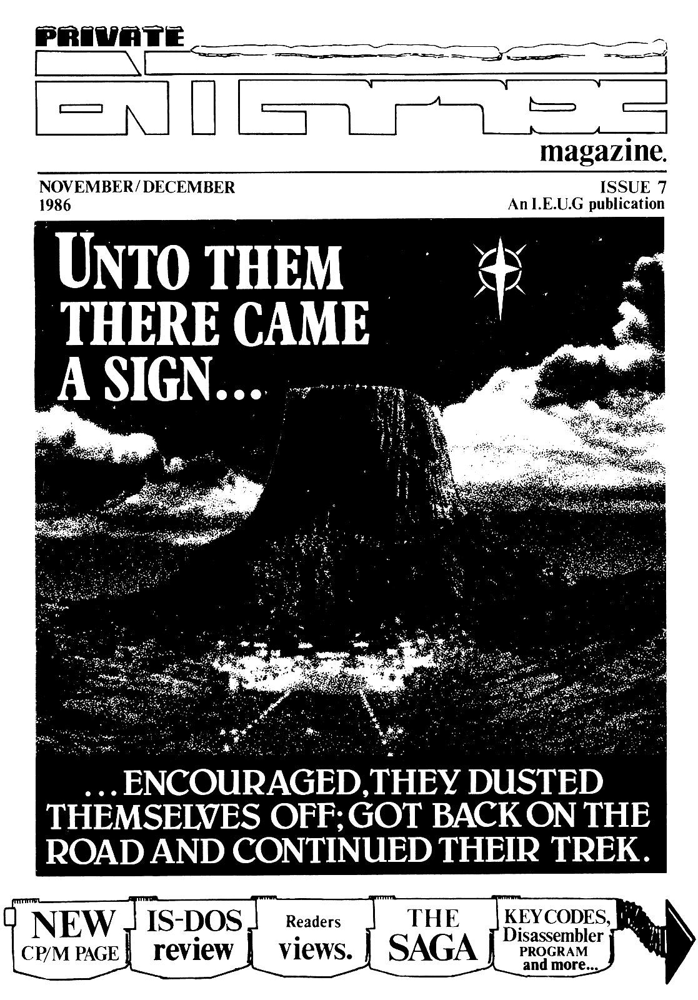

# Private Enterprise Issue 7 (1986.11-12)

[Оригінальний PDF](http://enterprise.iko.hu/magazines/Private_Enterprise_Issue7.pdf)

## Зміст

Editorial  
News Desk  
Forum  
Private Correspondence  
The Saga  
A Long Hard Look  
Software Register  
Software Archive  
Key Codes  
Programming  
The CP/M Page
Home Produce  
Enterprise Expansion Port  

## Чернетка вмісту

"page-000.pbm" ------------------------------------------------------------ 
NOVEMBER/ DECEMBER ISSUE 7
1986 | AnL.E.U.G publication

UNIOTHEM = +
‘THERE CAME

... ENCOURAGED, THEY DUSTED
THEMSELVES OFF; GOT BACK ON THE
ROAD AND CONTINUED THEIR TREK.

IS-DOS Readers KEY CODES,
7 Disassembler }

CP/M PAGE} review | views. } PROGRAM

_ and more...

"page-001.pbm" ------------------------------------------------------------ 
Announcing a major new
step in Enterprise Expansion

Rememember the original Enterprise Soon you will be able to free your

specification -— "Expandable up to 4 Enterprise from the limitations of

Megabytes", and the superb original Ls ee

plans for it’s hardware. quality built-in ports; with a
totally new expansion system, designed
to grow with your computing needs,

A motherboard system is the backbone
of a professional computer.and ours
will take the Enterprise firaly into
the realms of buisiness computers, and
hardware and software development
systems costing many times more.

A new range of plug-in cards is being
developed. including memory cardss
professional serial and parallel
interfaces: relay control cards etc.;
and axciting new developments Like an
EFROM programmer: sound sampler. video
digitiser; second processor, and
sprite board are in the pipeline for
neat year,

The basis of the system will be the
“aint motherboard", very similar to
the Enterprise - EXDOS connecting box:
and sitting where the fabled “base
unit" would have sat,

Qme card can plug into this mini
motherboard, and «will provide a low-
‘cost introduction to the system.
Larger motherboards will also plug
into this mini motherboard: and will
allow the connection of 4, & or more
cards.

The system is compatible with all
hardware expansions including EXDOS.

JOIN US!

We are oa couple of electronic
engineering students who are keen to
see the Enterprise flourish as a top
quality machine in the home and in
business,

If you have experience in-amateur or
professional electronics design and

: . . construction: then we need YOOR help
Send an SAE for technical details to: to get this system going.

Andy Purnham, Hall Contact us if you have ideas for cards
Ash Road , to fit on the system: ar if you have
Lou bbosoudgh : designed and built similar circuits.
LEICS., gn» ; We will pay generous royalties.

LE11 30UQ

_ g The motherboards should be in small-
5 oF) scale production by the end of the
years with lots af cards following on

aquip - shortly,
<= Some estimated prices:
Electronics Mini Motherboard......

©

Dat

slot motherboard....
port parallel card..
K Memory Expansion.

4
Expanding the Enterprise 35

"page-002.pbm" ------------------------------------------------------------ 
Editorial

Christeas once again and to sark the
occasion this is the biggest "Private
Enterprise’ mag yet produced, hopefully
containing something for = everyone
(unlike the rather technicalissue 6),
However,in most of your minds this is
not going to suffice for the "sayhen of
1986". Our initial plan was to produce
a bega issue of some 68-odd pages, but
after studying the feasibility of
producing a magazine of this size
quickly (in like of our previous track
i ee
Therefore as an alternative, we shall be
extending the period of sembership
until after the publication of issue?.

Since ay editorial in issue 6 there
have been some upheavals here at IEUG
He. The first of these is the
relocation of IEUG H@ from London to
Crowborough in East Sussex. I have
taken over the mantel of secretary fron
Tim, leaving him free to pursue sore
technical projects with BoxSoft. This of
course weans ANOTHER change of address,
see the news page for full details.
Another uphaval saw the arrival of
Eanonn O'Leary, who has taken on the
artwork and layout for this issue as
Mark was unable to spare tine due to
art collage comsittuents.

"This is all very well’ I hear sone
of you saying "but I've not seen any
new software for sonths!" All I can say
to this is please bare with us. In ay
letter which proceded issue 6, I said
that all software copy-rights reverted

to the original authors, In fact I was].

nistaken, and all copy-rights were
suspended with the assets of Enterprise
until recently they were bought by
Broadlight LTD. We have now to negtiate
with Broadlight for the right to re-
release these titles, so hopefully
something will be appearing very Soon.
Finally, a plea to everyone who
doubts our sincerity and doubts our
ability to carry out our promises, ture
up at the A.G.M and then sake your
complaint. we need as much feed-back
back as possible, so if you're
dissatified with us, come along and say

i Neil Blaber

PRIVATE

CT Cd)
[=n] L [Sr Snow dec
CONTENTS...

LOA O 8) One) 4
and all the

ie tee Palit

1986

ISSUE 7

The Verron Indescretions,

latest news.

FORUM vast behind, prepare to repell |

all bootleggers!

PRIVATE CORRESPONDENCE) your

problems,

THE SAGA

treatment.

questions and views.

Confused? You wont be.

The lowdownon the computer
soap'story to rival Dynasty.

A LONG HARD LOOK»
IS-DOS gets the rigorous IEUG

SOFTWARE REGISTER

A much needed lifeline to get us
over the present software shortage.

SOFTWARE ARCHIVE

As. an alternative to the update
section this issue we bring you

the backlog of Enter Soft offerings.

KEY CODES

Make better use of the keyboard

by calling up alternative comands
at a stroke.

PROGRAMMING

This issue- Systems Variables.

The CP/M Page

Something new for EXDOS users.

HOME PRODUCE

Disassembler program.

Enterprise Expansion Port

Expansion port pin out details.

1

22

24
14

27

An Independent Enterprise User Group Publication» President, Artwork &
Layout MARK LISSAK, U-G. Correspondence Editor TIM BOX, News Editor DAVE

RACE,

Software reviews

Maria Vard ©

Private Enterprise Magazine is a

copyright of the Independent Enterprise User Group. No article may de|

ipeproduced in
ihaldens,

whole or in part without writhen consent from the cop

"page-003.pbm" ------------------------------------------------------------ 
SSSSSSESSESS
BIN SSNS

Make Contact

Qne of the main reasons people join a
user group is because they want to
meet other users» This in TEUG members
case has not always been possible
because members are spread so far
around the country and because we only
officialy organise members in London:
We have therefore decided to try and
remady the situation by offering a new
services THE ENTERPRISE CONTACT.

If you are.into M/C programing,
‘Electronics, Amator radio or any other
hobby or just want to contact other
members, the task is simple, just
write to us here at the IEUG staiting
your name, address and hobby (if
applicable) we then will in the
following issues of PE print all this
q information. This will we hope aid
| comunication between members.

= News Desk

ENTERPRISE SOLD

The assets of Enterprise have been
bought by Broadlight Ltd. of London
vi. Their intentions at present are
vague but it is kaown that they will
not be relaunching the Enterprise in
this country, or reissuing any of the
previously available software
themselves.

Cf}|}|}]}]Nll
——_—_—_—_—__

Dot Matrix Discount

A limited number of Enterprise dot
matrix printers as reviewed in Pees
No-{ are available at £159 brand new
and fully quaranteed, {£80 below
original list prise. This however does

CHANGE OF IEUG ADDRESS

Just when you thought it was safe to
send all your letters to New Barnet,
the IEUG central contact address has
thanged again - hopefully for the last
time. From now onwards, please send all
correspondence to :-

1EUG,
P.O, BOX 13,

Crowborough,
EAST SUSSEX. TNé 1@X.

The new IEUG Hotline is in operation
between 7.08pm - 18. 8ipm Mondays to
Saturdays and fron 2.08pe - 19.8@pne
Sundays. There will be an answering
machine service available at al] other
times if you need to leave nessages or
have important enquiries. The nuaber is

not include the cost of printer cable |g 6-3898:: +

(which can be purchased seperatly from
BOXSOFT at £12.80). The place to go is
the Sonic Feto Centre 245-256
Tottenham Court Road London Wi
Telephone 01-580 5826.

== —kzKK——— 1

CP/M PUBLIC DOMAIN SOFTWARE NOW
AVAILABLE

TEUG members who own disk drives can

how take advantage of the Public
Domain CP/M Libraries, which comprise
about 638 disks (not all programs will
run on the Enterprise though), More
details on this on the CP/M Page later
in this issue,

——
THE TEUG CURSE CLAINS ANOTHER VICTIN

Atter running items on the IEUG in its
pages in Issues 2 and 4, the weekly
computer paper “Bang '", launched at
this years PCW Show, has collapsed

after only nine issues. It follows in
the footsteps of Home Computing

Weekly, which expired after it ran a
feature on the JEUG and placed an
advertisement in Issue 2 of Private

Enterprise. We only hope the same fate -

does not befall Personal Computer
Vorld, which will be running a feature
in the New Year,

But if you would like to speak with
Tim, his number is still (81-448-4118),

ee]
THE TEUG ANNUAL GENERAL MEETING 1986

The EUG Annual General Meeting
referred to in Issue 6 will take place
at St. Mary's Hall, Hendon Lane,
Finchley Central on Saturday the 13th
December froa 1.99 - 5.68. Bus routes
are 143, 13, 268 and 26; Tube Northern
Line to Finchley Central. An agenda
containing sotions for discussion and
a map should accompany this copy of
Private Enterprise.

e=leleeeeeeeeeeee
Errata

A few erorrs Slipped into the last sag,
firstly the price of 22Zip was printed
aS £17.95 when it should have been £
12,95 and the missing line from the
same article read’... and there won't be
Bany programs around that can't be
speeded up by it,

Ve also failed to print the author
of that brilliant article BASIC
EXTENTIONS {the source of the new
BOXSOFT program 1S BASIC EXTENTIONS by
the same author) who is Andrew
Richards.

"page-004.pbm" ------------------------------------------------------------ 
‘THE CASEOF

MLR INGHAM

In our previous issue, we mentioned
Verran (Micro Maintenance) Ltd. (ex-
Enterprise Service Centre) as a source
of repair facilities for Enterprise
|machines» Since then, it has come to
light that the service they provide is
nothing short of abominable, as the
following diary of disaster
illustrates.

9 August

Faulty 128 dispatched together with
cheque for £39.95 (this amount
requested prior to any investigation)+

26 August

Wrote to
delay.

Verran, enquiring after

27 August
Cheque cashed by Verran
28 August

Reply from Verran "Did not receive
machine until 19th August” Machine due
for dispatch S - 7 days"

9 Sept
wio "did not

29th August",
letter stated

Telephoned Verran,
receive machine until
even though reply to
19th August.

10 Sept

Wrote ta Verran - no reply whatsoever

17 Sept

Wrote to Verran again - no reply ta
this or previous letter.

News Desk

Wrote to IEUG for help:

",eethere must be some funny dealings
going ons». I am utterly disgusted
with the treatment I am receiving.-»
If there is anything you can do at
your end, I would be grateful.’

18 Sept

IEUG phoned Verran: "Our admin
computer went down, hence the mix-up
with dates. Machine is under repair”

28 Sept

Wrote to IfUG again to inform of
situation. "I think\ one's instinct
tells one when an excuse is genuine or
not and the one Verran gave to you
does them more discredit - better they
had just said sorry for the
delays«.They deserve to end up on
their bottoms. I don't want others ta
experience the ordeal I have had with
Verran; if there is a possible chance
of avoiding this, then my effort will
not have been in vaine"

6 Oct

Wrote to Express Newspapers for help,
as machine was obtained via McIntyre
ads in Sunday Express.

Wrote again to [EUG !

"There is something very funny about
this business» I cannot understand
Verran’s attitude and it leaves me
completely baffled.*

VERRAN (micro
maintenance) LTD.

16 Oct

Visited Express Newpapers, who then
contacted Verran. “We are unable to
get the part required for repair, and
are therefore sending a new machine by
return’.

20 Oct

New machine arrives without any
apology or explanatory note.

Verran cashed Mre Ingham’s cheque on
the 27th August, and repeatedly told
him his computer was under repair,
even though they did not have the
means to carry out the works Only
after pressure from Express Newspapers
did they offer Mr. Ingham anything
except stony silence or half-baked
excuses. In light of this episode,
Verran have stopped supporting the
Enterprise. and alternative repair
facilities have been found at $

T.Esle Computers,
The Albany Works,
Queens Road,
Thames Ditton,
SURREY. KT7 ORE.

They have full circuit diagrams, have
access to parts and one member of the
User Group has already had his machine
successfully repaired by them

Neil Blaber

"page-005.pbm" ------------------------------------------------------------ 
Aslyou ay be aware, we are currently
negotiating with software houses to
allow us to produce conversions for
the Enterprise of their best software.
It was with some shock and
disapointaent, then, that we found
some software houses were less than
eager. It didn’t seem to be the deal
we proposed, rather it was the worry
of piracy.

:|, What has piracy got do do with us?

As a group, we at JEUG aust take
responsibility for all that occurs
within our group at all levels. Piracy
of available software is potentially
disasterous for the computer industry
as a whole, but more importantly it
could bring the final death blow to
the Enterprise.

Software Availability

FORUM — Piracy

Let me explain. Piracy is ANY kind of
copying that deprives the producers of
income (eg. copying a friend's tape),
Software houses that sell very few

copies of high quality software are
very unlikely to want to produce sore,
They will also be very unwilling to

give IEUB the source code to their to

programs if they feel it is a waste of
time. If piracy becomes a feature of
the IEUG then it will surely die. Yes,
a pirate may get a copy of every
available software title, but he/she

will ensure that there will NEVER be
any sore!

One other thing is important. There
are a nusber of members interested in

producing software for commercial
gain. The User Group is a relatively
Spall market compared to the world of

Other machines. Their profit margins

are very spall and one lost sale could
make =the difference in making it
worthwhile. Please support in-house
software and software from independent
producers such as Boxsoft, they can't
keep going without soney.

As for the piracy Situation now - well

we have found no trace of any. Our
eetings have been sonitored, and
apart from two 9 or 18 year old kids (
who were lectured severely - OUCH!),
there was no attempt to get copies
from other members. The spread-out
nature of our users seeas to have made
it difficult for would-be pirates
outside meetings. But just remember,
it is up to all of us to keep our own
houses in order.

There aren't many places that software
tan be bought at the moment. We hope
to remedy this soon, but in the
meantime here are the places that
Enterprise-specific software (as
opposed to CP/M) can be bought:

Adventure Guest

Satelite etelpileteteteel:

(The story continues... - ISSUE 3)

Dungeon Adventure

i a le ed

BOXSOFT : See ad in this mag for titles. Boxsott
also sell hardware,

(Huge, difficult k excellent! - ISSUE 4)

OTHER ADVENTURES
LEVEL 9: If you're interested in adventures, then

these are the people! Lords Of Time

Rae Rate tater tytgt:

SILICON DREAM SERIES (Science Fiction) (Possibly their best adventure - ISSUE 3)

Snowball

Bette trtetets

(best sci-fi adventure ever! - ISSUE 3)

Emerald Isle

Me hetet ale tgtetptetgty

(Modern & exciting - ISSUE 4)

Return to Eden

Se teletetelrtletetet

(Worthwile followup to Snowball - ISSUE 4)

All the above titles are available from Level 9.

JEUG : Greatest Hits Vol 1 (Vol 2 coming soon),

MIDDLE EARTH SERIES (Fantasy)

Fetal tetetetetetetetete tate ipieteletatetetetty tel tetetene

“Colossal Cave

Beeler tele tetptetiptete te

(The BRANDADDY of adventures - ISSUE 1)

PS, Apologies to those who ordered Vol
{ but had to wait. This was due to us
underestimating the demand. Sorry, we
will get it wight for Vol 2.

"page-006.pbm" ------------------------------------------------------------ 
I have just discovered how to make the
Enterprise go faster - believe it or
not! All you do is type OUT 191,12 to,
speed it up, and OUT 191,4 to return
to normal. I found the OUT at the very
end oof the f€nterprise Technical.
Manual.

What it does is
registers in

alters one of the
the Dave chip to remove
the “wait states® from memory
accesses, and consequently speeds the
operation of the 280 system by between
Sand 25%, depending on what it is
doing at a particular tine» Having
said this, 1 am not exactly sure how
or why it works, any help would be
appreciated.

Unfortunatly it only seems to work on
{28K machines, possibly because they
have faster RAM chips in them, which
can return stored data faster, and it
is just possible it might not do the
machine any good, so use it with care.

[am quite into amateur electronics,
my latest project has been the design
and construction of an EPROM
programmer, plugging into, and
controlled by my Enterprise. (EPROMs
are Erasable Programmable Read Only
Memories, similar to the ROMs in the
Enterprise, only you can program then
yourself using an EPROM programmer)
Unfortunately the design is too
complicated to publish in "Private
Enterprise", however anyone fairly
well-versed in the art of construction
could tackle it - please write to me
if you are interested, or if you have
built any add-ons for the Enterprise
yourself | would be keen to hear from
yous
I am offering an
service to JEUG members, with very
cheap rates, and EPROMs supplied if

necessary - write to me for details.

EPROM programming

Another thing you might be interested
to know is that EXDOS, when used with
a 5.25 inch disk drive, can read and
write MS-DOS files compatable with the
IBM PC and clones, I have successfully
read disks from one on the other. You

gossip, outrage, its your page.

can only read IBM text files, and not

use its programs though, but it can
still be useful.

Finally - HELP!! Does anyone know the
purpose of the Left and Right Hand
Sound In pins on the expansion port. I
have sent sound signals in but there
seems no point to it. Secondly, how do
you use the external colour inputs on
the expansion port ? I have heard thea
mentioned in the same breath as *

sprites", now wouldn't it be nice
face

Don't forget the
service,

EPROM programming

Andy Burnhan,

Elvyn Richards Hall,
Ashby Road,
Loughborough,

LEICS. LEfi Sug.

OT: Thanks for the information and
good luck with the Eprom programming
service. Sorry, but we can't help you
with your questions - if anyone
reading this can, then write to us and
we'll publish !

———lel———e—e———e—e—ee
ole

Could you please tell me what has
happened to your magazine you promised
when you sent out your last SHEET of
papers My son is wanting to purchase
some more software for his computer
but I] have little faith left in your
company after you not fulfilling your
promises in your last newsheet- I have
tried to trace your telephone no» but
aa informed the no» was disconnected
in October.

T am writing to you now at Boxsoft to
see if you have any further
information as to the future of
Enterprise Computers, or shall we just
throw it in the bin and buy a more
reputable and reliable computer from
another firm.

Mrs. Darwell,
Orrell,
Wigan

DT: I get the feeling you have got the
TEUG confused with Enterprise
Computers themselves, although we
accept the blame for the late magazine
(sorry). We are trying as hard as
humanly possible to get some software
out aeSeaepe but were held up by
delays in the sale of the Enterprise
assets and by Neil moving down to
Crowborough, which rendered him out of
circulation for about three weeks.
Enterprise-specific software is
available from Boxsoft (see
advertisement), and the Level 9
adventures are available from them
directly at :

Level 9 Computing,
7, Kings Road,
Reading,

BERKS. RG! JAR.

——X_[_Z_
a —x=z=-x43:

"page-007.pbm" ------------------------------------------------------------ 
Private Correspondence

I've had an Enterprise 64 for quite a
long time and I have been very
iapressed with it. J have found the
lower -case very useful, especially
when I am writing letters with the
bvuilt in Wrod Procescor. I like the
Sinclair style case on the Enterprise
but mine appears tp have been left
somewhere rather warm as all the front
has melted into a funny blobby shape
and some of the keys have been
replaced in different colours. The
gear lever is in a very handy position
but as yet I haven’t been able to find
reverse. I can only get my programs to
go in one direction. I may but a copy
of Forth as this is supposed to make
it run backwards. The disc interface
sounds useful as well, I have had
problems with tapes, in particular !
cannot get the Enterprise ta load Dire
Straits, even though the manual does
say that it has stereo sound. I would
like to know about the network. Do I
need a license to transmit on the
network and if so where do I buy it
from ? 1 presume that the Post Office
sell them Like normal T.V. licenses:
How many people are using the network
? 1 can't seem to pick anyone up but
my aerial may be adjusted badly. The
manual has references to ‘files’, is
this because the holes at the back are
not big enough ? The Enterprise does
seem to get rather hot at the back:
Surely if Intelligent Software
realised this problem when they wrote
the manual it could have been changed
on the machine ' Can you help me with
anything as I am getting a bit
confused.

Mr Arnold Gibbon
Lower Endover
LEICS.

P.S.
video
interlacing mode
interrupting the
ting modulation
external colour

My friend has tried to make the
line table work in colour burst
while concurrently

{7-bit polinomial
strobe from the
drain latch» Do you

think Nick or Dave will know how to do

this, and do you know their addresses
?

DT: Ne.

oe )
=sou#enNF}epjR_eNjNNjNljl_ OI

Dear IEUG.

IT have had an Enterprise
Computer for almost a year now and
have reached the stage where I can
tinker around fairly well with 1S
BASIC but would like to speed things
up. ‘ZZZIP* seems to fit the bill but
after reading your review in ’Private
Enterprise’ issue 6. I have a few
questions, Firstly could you tell se
if the “loader program’ reffered to
has to be used every time I wish to
speed up ay IS BASIC programs and
secondly as I have enough probleas
getting rid of bugs as it is let alone
getting then out of a sophisticated
‘compiled’ program is ZZZip a little
too advanced for we at present?

Yours

D BRENT,
ELTHAM
KENT,

Since this is to do with a Boxsoft
program well let him answer.

I'l] go through your queries in the
sane order as you brought thes up.
First the loader program is in fact a
short basic program that loads in the
pain H/C it also doubles as a program
duplicator saving you having to
compile the program every time you
want to wake a copy of it. A point I'd
like to add is you don't need the
compiler to be loaded in every tine
you want to run your compiled program,
it runs completly independantly. AS

for the bugs you might enconter! There.

not really bugs, there just commands

that are not covered by 22Zip and
there only commands that make unusial
use of non integer based saths etc. Of
all the Basic programs I’ve tested
over 76% have worked first tine with
ho modification.

TIN 30X

‘Sa

Duncan Taylor

"page-008.pbm" ------------------------------------------------------------ 
Ve have received a number of letters
from meybers expressing confusion over
what happened, when and why in the
chequered history of Enterprise
Computers Ltd. Although everyone knows
a little of what went on, gleaned fron
the pages of Private Enterprise and
other publications, what is missing is
a total overview. Jo this end, here
follows the story of Enterprise
Computers from conception to the
present day as percieved by Eamonn
O'leary; we hope it fills the missing
pieces in everyones’ jigsaw.

Following the phenomenally successful
launch of the Sinclair ZX Spectrus,
Locumals, a giant Hong Kong trading
company, decided to cash in on the rich
pickings of the booming home computer
Barket by producing, through a second
party, a totally new home computer. In
September 1962 the United Commercial
Bank approached Intelligent Software to
develop such a machine for a "aystery
backer’. 1.8. took up the challenge,
and by the following month Project
D.P.C. was underway, This development
stage was shrouded in secrecy - 0.P.C,
standing for Danp-Proof Course as a red
herring for any would-be snooper.

Whilst 1.8. was formulating the
innards, Geoff Hollington and Nick
Oakley were appointed to create the
butward appearance of the machine, and
by February 1983 had produced a
strikingly different shape.
Untortunately, a lot of the design
tean's forward thinking was compromised
when, later on, 1.8. decided to use a
Separate graphic design consultant who
disuissed their two-tone grey format in
favour of a primary colour coded
scheme. Not only did this short-sighted
decision fly in the face of the growing
trend towards more professional-looking
computers, but was to lead on to an
unfortunate set of circusstances when
it reached the shops later on.

Although the exterior was suffering
from too many cooks, the internals were

set up at

The Enterprise

SAGA

The Story So Far

bubbling away happily. Nick Toop was
busy designing a revolutionary "spft’
Uncommitted Logic Array (U.L.A.) chip.
This square, custom-built 72-pin chip
was to allow the most flexible and
colourful display of any 8-bit hone
computer ever made. In unison with the
development of the ‘Nick’ video chip,
Dave Voodfield was creating a similar
square U.L.A. chip, ‘Dave’, giving full
stereo sound and the ability to address
up to four megabytes of RAM or ROK,

For reasons of cost it was decided to
use oa opubber mat in place of an
individually sprung keyboard, edge
connector ports as opposed to sockets
and the Zilog Z88A central processor
rather than the faster 7083, Cost was
also the reason for the exclusion of an
extra ROM chip from the circuit board
which could have allowed the computer a
built-in assembler and oa more
professional word processor.

The marketing wing of the operation was
the London office of
Domicrest, an Anglo-Indian trading
company, which was also involved in the
venture by this stage. The first task
was. to decide upon a name for the
Company who were to produce this world
beating machine and no doubt with an
eye to its Far East origins, the name
‘Sasurai' owas arrived at, However,
Hitachi started producing a series of
computers with that name, so it was
back to the drawing board. For a while

it was known as ‘Oscar’ but no-one
really liked that, and so Elan’ was
the name the pre-launch publicity
sachine centred around. This proved to
be the biggest mistake of all, fora
software company of the sane name took
thes to court. Whilst all this was
going on during 1984, the newly-formed
company decided to hedge its bet by
naming «the computer itsel# the
Enterprise. Elan Software won the legal
rangle and after a desperate atteapt to
not loose all the benifits of the
previous publicity by calling the
Company "FLAN’ (which looked and
sounded like Elan) they decided to
finally admit  deteat dropping this
silly name and calling themselves
Enterprise Computers,

Entersoft, the software marketing are
of Enterprise Computers, was set up
soon afterwards to ensure (in theory) a
free flow of programs from independent
software houses and to promote the
development of high quality prograns
designed to fully exploit the enoraous
potential of the wachine.

Before the companys infra-structure had
been decided upon, a decision was sade
to press launch the wmachine in
September 1983 in an attempt to drus up
publicity and dissuade possible
customers from buying other machines.
The computer was launched despite the
fact that the I8-Basic language, which
had been under development for two

"page-009.pbm" ------------------------------------------------------------ 
—QQQQQmaeeeeeeeoooaannnnnnnnDnDE=eEeeQQQQQQQQ@aalll_
ence nenermnannennnennennnae one tte oeeannane nanan ee SSS

years, had yet to be finalised and that
the production of the specialised chips
and manufacture by Crystalate Holdings
had not been sorted out.

The Enterprise was to go on sale during
April 1984 - the press and public were
30 impressed with the specification and
value for money that the-then Elan
Computers announced that by early 1984
pre-production orders for over 88,888
Bachines worth 29 sillion pounds had
been made. Entersoft planned to have
around a dozen programs ready for sale
at the sase time, and everyone waited
with baited breath, which by July 1984
became a sigh and by December 1984 a
yawa - it was late.

Pre~launch publicity is a dangerous
business; one aust take all things into
account before committing oneself to a
datey so the «so mnedia. owas) rightfully
sceptical of Enterprise Computers’ far
too optimistic target date and were now
busy telling the public ‘I told you
so’. Untold damage had been done to the
tompany’s image, such of the previous
interest had evaporated along with the
pre-production orders, by the tine the
Enterprise finally arrived in any
numbers, nine moaths later in January
1985,

The world that the Enterprise
launched into was far more hostile than
it would have been back in April 1984;
the public was far more conservative,
critical, cynical and price conscious;
the golden years of home computer sales
were over, The rival competition was
keener also =o ands although =the
Enterprise still stood head and
shoulders above the pest, it would
have to prove itself,

Now was the time for the marketing are

to show its true colours -
unfortunately these colours were green
and yellow. Green because they hadn't
put the wasted time to good use (
instead of three times the amount of
software originally intended at launch

date (12), they produced a pathetic
third of that figure (4) and instead of
an eye-catching wachine code point-of-
sale display they had only the awful
{S-Basic introductory cassette), and
yellow because they chickened out of 2
passive 2.5 sillion pound advertising
campaign through Low Howard-Spink which
was planned to start with an initial
phase costing £58,088 in late February.

Probably it was decided during the
delay to low-key launch the 64K model
and bring forward the 128K sodel
lauach. This machine would be sore
instantly competitive in the sarket
place than the 64K, and the advertising
was to be delayed to coincide with its
jatroduction.

Those faithtul few who waited from the
original launch announcement to the 64K
machine’s arrival were met by an
unnecessary 25% price increase (when
the competition were lowering theirs)
that only helped damn its name even
Bore in the wedia, who by now were

going off the management of the company
rather fast.

The folly of the price rise came hone
to roost when it was admitted that
prices had to come down. This coincided
with the bungled changeover from high
volume manufacture at Welwyn to low
volume production at GRI of Perth,
Scotland, The result of these two
factors was that the trade saw prices
drop in the shops whilst the
nanufacturing had, as far as they knew,
cone to a halt. Everyone presumed
Enterprise Computers were going under,
all because they charged an unrealistic
price to start with and didn’t intore
the press of the change in production
base early enough.

Another nail in the Enterprise coffin
was the fact that the general public
could not tell the Enterprise 64 from
the Amstrad CPC464, which had arrived
{on tine) three months earlier, The
reason for this takes us back to the

colour scheme chosen by Enterprise - i:
it was a coincidence that both machine:
looked similar, it was a most welcom
one for Amstrad who benefitted fro
most of Enterprise's pre-launc!
publicity. If, however, it was b
design that the CPC464 was coloured ti
ainic the Enterprise, shown to thi
press six months earlier, then Ala
Sugar must be given due credit for |
marketing sasterstroke, Not only di
Austrad gain, but the Enterprise whe:
it arrived seewed from the outsid:
nothing sore than a spartan initatio:
of the Austrad,

By the tise the 128K aodel was read:
for introduction, Enterprise wer:
committed to their colour scheme, fa
too many 64K machines had been produce:
by Welwyn Electronics in anticipatio:
of the original demand, and Eaterpris
were frantically modifying 64K sachine:
for sale as 128K’s outwardly changin
only the name panel and the joystic
ee ee

The media advertising, when it arrives
was a shadow of that first envisaged
during May only £258,088 was spent c
press ads promoting the expansic
system that didn’t exist and the 7.4
commercials promoting the stereo sour
when there was no software available 1
adequetely demonstrate it. This sa
comedy of errors put the trade righ
off the Enterprise,

By this time the money was running out
the disasterous launch, legal battle
and production delays had all take
their toll. Despite the fact tha
Enterprise was operating at this stag
in 13 different countries includin
Eire, France, Germany, Scandinavia
South Africa and Australia, it wa
England that accounted for the bulk o
all home computer sales outside th
U.S. and unless there was softwar
there was little to entice people ¢

"page-010.pbm" ------------------------------------------------------------ 
buy the computer,

Promise after promise of software never
uatched the reality - "Forty prograss
by January 1985","A hundred programs by
January 1986"... Unable to persuade
software houses to produce dedicated
Enterprise programs without the
incentive of huge commissions,
Enterprise concentrated upon the EXD0S
unit) which = would) = allow = CP/M

compatibility and thus software
availability.

By the tine EXD0S arrived (February
1986) Enterprise was in distribution
difficulties and had to generate sales
through wail order and small ads, Ina
last-ditch attempt to get out of the
doldrums Enterprise approached Dixons
with a new machine, the PV368, designed
to compete directly with the Austrad
8256 in the crucial pre-Christeas sales
period. For reasons best known to
Dixons, the deal dissolved and the

decision to liquidate Enterprise
Computers Ltd. was taken by the United
Commercial Bank on June 18 1986 leaving
debts of approximately £8,489,889 and

were put in the hands of Grant Thornton
peceivers,

So were does all this leave us? ¥ell
in a better position than you might at
first think, The Enterprise represents
today’s state of the art &-bit
nicrocomputer, The medias love affair

ao

with {6-bit technology is not what it
once waS and even 32-bit systeas are
only noted for there running speeds
and limited sultitasking capabilities
rather = than’ s anys earthshattering
innovations, As it is the software
that dictates how well a given
computer will perfora a task and

lé-bit programs have yet to present
enough advantages over the tried and

trusted S8-bit standard, many experts
agree that it is not really worthwhile
for enthusiasts, as opposed to

buisness and. specialist users take a
gamble with first generation lé-bit
offerings is doubly so for those

Starting out. Who are not adequatly
catered for at all outside the 8-bit
computer world, MS DOS software cost
astronomical amounts when comared with
CP/M which, especially under 19-205,
offers a large well developed and
affordable software base. In short,
many have home to the conclusion that
& good S-bit micro is still far
better, and cheaper, than an
underdeveloped 16 bit one,

Only the Enterprise is in a position
to take full advantage of the 8-bit
renassiance now taking place.
Competitors like Commodore, Atari and
Sinclar focused there attention on the
é-bit market too early only to regret
they had forsaken there roots, Sadly

every Christmas they repackage
outmoded 8-bit systems add a few

SERA

gimicks, and pray that a large
existing software base will entice the

unwary to finance the developaent of
there still to be sucesstul 16-bit

hopes. The exeptions Acorn and Amstrad
have either overpriced non CP/M
dedicated systems or down-to-a-price,
non standard disk dedicated systens,

The slogan ‘With obolesence built out’
nay today Seem somewhat ironic, yet it
is only now that the Enterprise is
coming) «into §=6 its) «sown. = Already
professional programers (many IEUS
members) are designing. dedicated
pakages to utilise the computers finer
points and the present dearth of gases
software will, with the development of
the Spectrum Emulation Unit, no longer
be a problens,

Ve have all hade a rough ride over the
last two years, especially those new
to computers who have been treated
worse than most, but as I write there
are developments going on behind the
scenes. It would, in the light of the

Dixons news leak, be unwise to say

more = execept that, depite the
calamities of the past, action is
being taken to ensure the future will
see the Enterprise reach it's full
potential. I don’t know about you, but
having come this far, I am staing on
board for the ride and am greatly

looking forward to the next few
nonths.

"page-011.pbm" ------------------------------------------------------------ 
= A long hard look

—eeeeeaoaoaoaoaoaaeaeaaaeaaaannnaooaooaoaaeee——E__E_&{&{X x$éeer€eEeees
—E===Seaaeaeeeeeeemm

IS-DOS

Enclosed with the Enterprise disk
interface, EXDOS, was a registration
card to be sent back to Enterprise.
When Enterprise received this card
they would send back a disk with
1§-10S on it. The reason for not

enclosing this disk with EXDOS was
that different users were bound to

have different disk drives,

3.25 inch, 3.5 inch etc. All the above
is of course ia the past tense as

Enterprise no longer exist, although
1S-B0S is still available when
purchasing EXDOS units.

As mentioned earlier, IS-D0S is
supplied on disk and has to be loaded
into the computer to be used, unlike
EXDOS which sits there on RON and can
be called without destroying a progras
or word processor article. This is
really a very minor inconvenience when
you look at the advantages of the
system,

The biggest plus is that IS-DOS allows
you to run NOST CP/K programs on the
humble Enterprise. Consult the CP/M
Page elsewhere in this issue to see
the amount of software this sakes
available. Suffice to say that it will
allow you to run such classics as
WVordstar and dBASE II, providing you
can get the programs in the right
format.  [8-D0S screen handling
pertores in the same way a5 a VT-32,
one of the industry standards for
terminals, and so makes installing
a ees

easy.

1$-80S uses all of the commands
provided by EXDOS, and has several of
its own, These include a command,
ATTR, to make files ‘read only' so
that you can't delete or overwrite
then accidently, and to hide files so
that they do not show up on directory
listings. Directories can. also be
hidden by use of the ATDIR comand,
Other commands are provided to allow
you set up your. drives any way you
Hike, so that you could for instance
have all accesses to drive B: 90 to
the RANdisk (drive E:) instead, or
pretend that you've got three drives
with drive B: acting as drives B: and
C:. This feature can be particularly
useful if one of your drives goes
faulty on you, Incidently, if you only
have one drive 1S-00S automatically
uses the above commands to set up
drive Ai as drives A: and Bi,

There is also a full on-line help
facility, HELP, which allows you to
access details on any EXDOS or IS-D0S
you are confused about, and allows you
to create entries of your own. To sake
use Of HELP, there aust be a directory
called HELP on the disk you are
currently using (there is such a
directory on the IS-D0S system disk
supplied with EXDOS) which contains a
number oof text files with the
extension .HLP. When you type "HELP
FORMAT", for example, IS-D0S looks for
a file called FORMAT.HLP in the HELP
directory and prints it on the screen.
These files can be created on the word
processor, 50 the amount of HELP you

have available can be as large as you
like.

When using IS-BOS you have a choice of
a 48 or 88 column screen. You can also
Choose whether you will be using a
serial or parallel printer, and which
devices will be used for auxiliary
input/output directly from 18-205,
This,along with such features as
allowing you to show the path name of
the directory you are in (\BASIC for
example) instead of the standard A)
prompt, and being able to set up the
disk buffers to whatever size you want

all help to make the working
enviroment that much nicer and easier

To save you from having to set
everything up just the way you like it
every tine you go into 18-208, there
is a facility that allows you-to set
up a batch file that will pun
automatically every time IS-D0S is
booted up (loaded from disk). Simply
write your batch file on the word
processor and print it to a file
called AUTOEXEC.BAT, which works in
the same way that the file EXDOS.INI
works from EXDOS,

Batch files in 18-DOS aay also have
parameters (variables) passed to then.
This is done by using $n in the batch

"page-012.pbm" ------------------------------------------------------------ 
= A long hard look

file, where n is a number between |
and 9. As an example, if one had a
batch file called ‘SWAP’ :-

COPY 31 DUMAY. DUM
COPY 42 41

COPY DUNMY.DUM 42
DEL DUNNY. DUN

Then the command SWAP FILE! FILE2
would swap the contents of FILE! and
FILE2, Variable 1 in the batch file
is replaced by FILE! and $2 by FILE2.
14 %@ is used then the name of the
batch file itself is inserted,

Also on the IS-DOS disk are a number
of files ending in .COM} these are
transient commands that, when called
fron 18-008, ss pertorm=—- various
complicated tasks. They are used in
the same manner as the built-in EXDOS
and 1$-D0S commands, except that the
relevant .COM file has to be on a disk
you are currently using. There are
S transient commands provided with
1S-BOS : BACKUP, CHKDSK, DISKCOPY,
UNDEL and XDIR.

BACKUP allows a backup of a disk, or
part of a disk, to be made. As well as
copying the files over it will put
then’ on contiguous tracks on the
destination disk, which can speed

things up greatly if the disk you are
copying is one you use often as a work
disk. BACKUP has an option which marks
files as having been backed up} this
mark is removed when a file is written
to. This means that if you backup the
disk again with the correct option it
will only copy files that have been
altered since the last backup. Amongst
other features you can also decide
whether the destination files are
given the current tine and date or
those of the original file.

DISKCOPY does much the same thing
except it makes an exact copy of the
disc, errors and all,

CHKISK allows you to check your disks
for errors and hopefully recover any
lost space on a disk.

UNDEL is a very useful command that
allows you to recover a file if you
accidently delete it, provided you
haven't written anything else to the
tisk in the meantine,

Finally, XDIR gives you a complete
disk directory including the contents
of every sub-directory. This coupled
with the fact that IS-DOS provides a
command that sakes the printer echo
everything on screen allows you to get

hard copies of all the files ona
disk.

As you can see after this brief look,

| 18-008 is even sore versatile thas the

excellent EXDOS, and provides even
more power to the best 8-bit around.

DAVE
RACE

iC My,

"page-013.pbm" ------------------------------------------------------------ 
Right, if you thought the mag up to
here had been positive, prepare to
have your socks blown off. While you
lot thought I was off having a quiet
snooze somewhere instead of preparing
the mag, I have been rather busy
sorting out the goodies below. Far
those of you with disk systems, first
a bit of bad news followed by lots of
good - for those without disk systems,
write to Boxsoft for details on EXDOS
units, and write to me at the new IEUG
address for inclusion in my mailshot
when I finalise details on the NEW

DISK DRIVE OFFER.

IS—DOS Bug

A bug has
which will

been discuvered in 1S-DOS

prevent certain CP/M
programs from running properly+ This
bug affects any program which reads
the disk directly for the purposes of
determining free space, and has the
effect of indicating that the disk is
full. However, this is not a
irrepairable bug and we should be able
to distribute a patched version of IS-
DOS sometime in early 1997.

CP/M PublicDomain

Software NowAvailable

All CP/M Public Domain software
available from P.D. SIG is now
available to IEUG members from me at
the following rates :

for 1-9
for 10+

{2.50 per volume
£1.75 per volume

Media can also be supplied §
£1.75 per 5.25" (DS) disk

£3.00 per 3.5" (95) disk
£4.00 per 3.5" (DS) disk

Postage and packing costs !

The CP/M Page

‘By Neil Blaber

There are approximately 600 volumes (1
volume = approx. 200K) in the P.D.
Library which include compilers,
assemblers, games (ne graphics), word
processors and editors, business
applications and general utilities.

A printed synopsis cataloque is
available free if you send a stamped-
addressed envelope to [EUG Public
Domain Software at the new address.

The complete detailed catalogue is
avallable on disk together with a
number of handy utilities (which I
guarantee will run on the Enterprise)
for £5.00 (it actually comprises 3
P.D. SIG volumes). Ordering software
fron this catalogue will be a “hit-
and-miss" affair, as a proportion of
this software will not run on the
Enterprise (for example comms
packages), and other software may need
installing before it will = run
correctly (CP/M hackers take note -
tweaking these programs is highly
addictive !'}. I am in the process of
building oan "IEUG" library of
installed software guaranteed to run,
and should be able to make the first
volumes available soon. Please make
cheques payable to Neil Blaber and
send them to the address below :

TEUG PUBLIC DOMAIN SOFTWARE,
P.0, BOX 13,

Crowborough,
£.SUSSEX. TN& 1QX

Disc Format Service
Out Now

Also, I am now able to offer a disk
format translation service between
almost any machine capable of running
CP/M and the Enterprise. Before
rushing out to buy tons of commercial
CP/M software to be translated across
to the Enterprise, please :

(1) Check the copyright restrictions,

50p for 1-3 disks, then 7p per disk] as this service is provided only on

after that.

[the basis that I, or the User Group

es)

tan accept no responsibility for
breaches of copyright occurring.

Read the [8-DOS manual and
remember the limitations of I9-DOS
before forking out soney on expensive
commercial software that might not
tune I can only translate the disk
format, I can't magically transfora
any old program to run on the
Enterprise if it does things that [$-
DOS can't cope with.

Translation charge is £5.00 per source
disk including first class
postage - media can also be supplied
at the above rates. If you want the
program installing and testing
addition to the
are negotiable
difficulty
anyones
they want

depending on
of the job.» By the way, if

translated, I can do those
aso well !' As per Public
cheques payable to Neil Blaber and
send to EUG DISK FORMAT TRANSLATION
at the new address.

commercial CP/M software
definitely run on the
Enterprise goes, I will be building a
directory of these as things progress
~ so let's have some
Programs I have seen running include

As far as
which will

WordStar (including MailMerge), dBASE

2, SuperCalc, SuperWriter, Hisoft's
Pascal-80 and Devpac-80, Borland's
Turbo Pascal, Microsoft Basic and the

Infocom adventures.

New Disc Drive Offer

T an currently in negotiation with
Cumana to revamp the old IEUG Disk
Drive Offer in such a way that the
hassles people experienced last
Christmas aren't repeated. Prices are
not ready at time of writing, so if
you want to be among the first to know
when the thing is sorted out, send me
a stamped addressed envelope (9 x 4*)
to be included ay mailshot. Send your
enquiries to TEUG DISK DRIVE OFFER at

the new address.

return [2

aa |
inde
translation, prices |.
the

got any CP/M stuff on 8" disk].

Domain, |

S

wa

feedback |}

7

a

"page-014.pbm" ------------------------------------------------------------ 
The P.D. Software Library CP/M Installation Pack.

ee ee eee er ee ee eee ee Pee eee SSE Sel

Winscombe House,Beacon Rd., Crowborough Sussex, TN6 1UL tel 08926 63298

Since we began providing a disk format translation service and supplying the various public domain software libraries,
there has been one common question which gets asked time and again. 'How do | install ' for my ! 1, Usually the
program is Wordstar, Supercalc, Dbase 11, Cardbox or some other well known CP/M program and the computer could be anything
from an ACORN Z80 BBC to a ZORBA. It may be a situation where you are just changing computers and need to install your
software for the new machine. Or maybe you have just got a new machine and want to install some of the Public Domain word-
processor, database or whatever programs on it. Whatever your situation, installing programs can be a problem even for
experienced users. Help is difficult to get as the usual 'trade protectionism! thing makes it very hard to get information from
dealers & software houses. We have produced a small book and a disk of software with the ‘tricks of the trade’ on this subject,
which should enable you to tackle virtually any installation job. No prior programming experienced is assumed, familiarity with the
normal CP/M commands is desirable. The main prerequisite is common sense and willingness to have~a— go.

It covers routine installation plus such things as:—

What to do if your machine is not on the install menu.

How to get a program running even if you have no install program.
Handling Overlay type installations.

The complexities of inverse video.

What the screen control codes do.

The oddities with Torch.

Keyboards & printers

How to Patch a program & Setting Bits.

Addresses to Patch for Dbase II, Supercalc

A Very extensive list of Patch areas for Wordstar 2.26, 3.0, 3.3

There is also a list of many of the terminal types showing the screen codes they require and a very useful HE X - DECIMAL —
BINARY conversion table. Because the CP/M documentation supplied with some machines is so poor, we have included quite a
large section on CP/M itself and cover some of the rarely mentioned things such as the Bios & Bdos vectors & functions, plus a full
definition of all the usual commands.

SOFTWARE TOOLS DISK

This is supplied free of charge with the book. It contains all the software tools you are ever likely to need, even for the
most difficult installation. It is most unlikely that you will have to dis-assemble your program in order to install it, but the tools
are there if you need to.
The programs include:~

A modification for Wordstar to allow any printer code to be sent from a
document so that the full printer facilities can be used.

Binary file compare utility

A Program to modify CP/M 2.2 programs for CP/M plus (if needed)
DU87 the best Disk Editor for CP/M & CP/M plus

Improved CP/M 8080 assembler (ASM.COM) & Load (LOAD.COM)
Editor for any kind of file Text or Program.

Improved version of DDT the 8080 de—bugger Plus a Z80 De~bugger
Program to re-define your keys.

Z80 Assembler with Hex output also Reverse Assembler

Z80 Assembler with RELocatable code output with matching Linker

Price~ INSTALL PACK is £9.00 Plus P+P 34p. This does not include the Media for the software, you supply that. Send us a
formatted disk from your machine and we will copy the software onto your disk. On the formatted disk put a text file of 30k or
more and PIP.COM. This is so that we can check we have the right format set for your machine. If you can not send us a formatted
disk we can supply media, 5" at Fal .75 and 8" at £2.00, but there is a chance of us getting the wrong format this way. If you have
small capacity disks send enough to hold about 250k.(price for members is £6.50 +P&P)

"page-015.pbm" ------------------------------------------------------------ 
One of the built in features of IS BASIC is the
ability to be intinatly extendable allowing
the user to add compleatly new commands as
desired. IS BASIC EXTENTIONS represents
the first commercial package to make
use of this capability. Offering over

188 new commands and 29 new functions,

This facinating program gives you amongst

its many options} software sprites,

pull down menu's and an asseabler.

1S BASIC EXTENTIONS represents

exceptional value for money and

will greatly enhance the poner of

your prograns,

PRICE £7.95 |
The Enterprise's "DAVE? microchip.
the best stereo sound facilities of a

! fo . Computer, /
IS BASIC INTEGER COMPILER Making full use of EXOS'S control
4S extremely powerful chip, 'SOEV’ has bee
‘ to allow you to utilise its waxinus
more readily within your own programs, |
Boasting among it’s many feature:
envelope displays, full style and syni
save/load and auto program generation,
"SOEV' is sold in four different ver:
a 128k applications program to a 44k |
system extention. All in all, "SOEV'
for all programmers,

"Open up’ your’ «Enterprise computer by
dramatically speeding its powerful and flexible
I$ BASIC lanquage.

Simply load Z2Zip before the program you want
compiled and this comprehensive compiler will
cover 90% of all functions and commands including
normaly non intiger functions such as SIN and COS
resulting in speed increases of up to 5000%,

Once compiled IS BASIC programs can be saved and
loaded like like any other yet will run faster

instantly. ‘IS BASIC EXTENSIONS For 64h and 1264 Ey
PRICE £12.95 a, P|

UNDER DEVELOPMENT

Sinclair Emulation Unit Intelligent
The unit has a separate speaker to Joystick Inter face

Batch the sound output more faithfully.

The most advanced peripheral yet to be
invented for the Enterprise computer

(with the exception of Exdos), Simply
plug it into the expansion port and
suddenly the Enterprise believes its a
Sinclar Spectrum, allowing virtually all
Spectrum software and hardware to be
used! In one fail swoop your computer
gains access to the largest software/
peripheral base of any computer in the
U.K. today. It’s not to be confused with
the Basic to Basic translator which only
works in a limited way on Spectrun Basic.
This unit actually emulates the total
computing capabilities of the Spectrus
Computer without any modifications by you
what-so-ever, allowing almost 100%
software compatability,

Tt also has it’s own cassette ports and
edgeconnector for peripherals. The only
difference users way notice is a slight
speed increases but who’s complaining,

Santas going to be a little late this
Christmas because the BoxSoft elves are
rigorously testing and improving so as to
ensure user-satisfaction early next year,
You can, however be assured that at our
prices it will be a gift. Hand up all the
wallys who gave up on the Enterprise and
splashed out on a Sinclair... feeling
sick?

Dissatistied with Enterprises own joystick
interface? So were we, that's why weve
designed this sophisticated alternative,
an ‘intelligent’ connector that enables
you to make use of all the potential your
joystick has to offer from two fire
buttons to auto repeat.

256k Internal
RAM Card

Increase the Enterprises RAN from 64K 1
128K to 328K with our custom-designed. Ri
card, \_ 7

"page-016.pbm" ------------------------------------------------------------ 
This dedicated transfer software
permits full use of EX0S channel based
achitecture giving = Bany advanced
features such as 256 shading, invert
option and autosatic channel opening.
With its speed and flexibility SCREEN

e oge,@
Disc Utilities
Direct disk access and sector editing have
long = been desired by serious users. Now
scrambled directorys Can be saved from

oblivion and lost files reclaimed. This
together with other utilities will enable you

to salvage you corrupted disks.

Vordprocessing enhancenent is just one
of the major benefits offered by this
device driver. From within a document
you can now fully exploit your

UTILITIES

offers a very accessible

video transfer system.
PRICE £5.95

At long last a mouse utility is nearing
sompletion and compared with the "Aztec
two-step’ it is well worth the wait. A
very high quality mouse {as used by the
Apiga computer) and souse interface comes
with 'Paintbox’ an allaode, all size att
package offering a piriad of features
including freehand, line, circle,
ellipse, spray, COPY, save/load and

scrduap,

This memory expansion takes the place of
the 64K expansion board inside your
nachine allowing over 300K of user memory
to both 64K and 128K Enterprise computers
without encroaching upon the expansion
port or your desk space. Fitting can be
carried out by a competent user oF, if you
wish by sending you computer to us.

The use of the mouse doesn’t stop at
‘Paintbox’ though. The extremely powerful
and ingenious software supplied with this
peripheral enables you to ake full use
af multi-mode mouse driven pointers,
within your OWN programs.

As BoxSofts aim is of continual
progras inprovement,'Paintbox’ is an
upgradable software package. As new and
pore enhanced versions become available,
they can be purchased
reasonable (Upgrade) price. \

This total concept is being designe
especially for the Enterprise.

For 126K Enterprise owners only

Sis hk + Kos,

at a very &

printers capabilites and make use of a
12K RAM buffer that will free the
computer whilst still producing hard

Vhat is there to say that has’nt
been said in issues 3,4,5 and 7 of
Private Enterprise except to quote
Dave Race’s conclusion "BUY IT!!"

PRICE £80.00 including 1S-DOS

Please note stocks are getting low 50 hurry!

Printer Cable
Wri mon

per “er ere

|

"page-017.pbm" ------------------------------------------------------------ 
=SOFTWARE ARCHIVE

I'm Going Underground

Name WRIGGLER

Producer : Romantic Robot
Category : Arcade
Price =: £7.95

The Annual Maggot marathon is underway
yet again, and you (a rather cute

worn) have been conned into entering.
The course consists of four large
mazes containing loads of jimmies just
waiting to mash you, and objects which

will need to be used in order for you
to complete various sections of the
game.

The first problem you will come across
fs one of sustaining your energy. This
drops at a fairly rapid rate
especially when = you accidently
bua into a nasty !) but
can be replenished by consuming
various foodstuffs found lying about
(milk shakes, cups of tea, bowls of
cherries, you know - normal maggot
diet), Food need not necessarily be
eaten immediately - it can be carried,
as can other objects which will be
discovered as the maze is explored.
These objects are very useful,
exasples being tins of ant replellant
taha ! the maggot strikes back !),
keys and a parachute (!). However,

only one object (or piece of food) may

be carried at atime - unfortunate
if you're surrounded by ants and

you've just swapped your ant spray for
a allkshake!

The four main areas are "The Garden’
(a complex maze), ‘The Scrubland’
(a maze where you can relax and
replenish your energy), “The
Underground’ (another huge maze but
with moving bits and a drop to Hell if
you mess it up), and finally "The
Mansion’ (guess what ? another maze,
but this time with a lift and lots of
keys and doors}.

The game is never the same twice ~ it
is set up differently every time it is
tun. The control keys can be user
defined, or internal or external
joystick can be used.

All in all, a very large (256 screens)
maze game with arcade and adventure
lish) elements which runs a little
sluggishly, due to the position of
various nasties being tracked even
when =ooff screen to maintain
consistency. If you enjoy maze games,
this ona will take you rather a long
time to complete, and is well animated
{the large spider is wonderful ')}, The
colour scheme is, well, a bit biased
towards brown, but then again 1
suppose gardens and scrubland are
fairly brown !

Not really enough action to keep
ny interest. Dodging ants and other
nasties is okay for a little while,
but there’s a lot of espty space in
between things happening. The music on
Side 2 of the tape is quite good
- pity it wasn't played during the
game. I'm not really a maze game butt,
and the addition of objects to the

| plot didn’t really add enough to pull

it out of the "bog standard maze game’
category. A bit expensive if you're
not a maze game fan.

Game Content 55%
Playability Kh}
Graphics 69%
Sound 2
Value For Honey 53%

On The Right Track

Naue : Orient Express
Producer :

Category : Strategy/Arcade-
Price = £7.95

This is a great little game and one
that is very addictive. You play the
boss of a track laying gang whose job
it is to repair the track that
saboteurs have blown up, before the
Orient Express reaches it and meets an
untimely end, thus putting a stop to
its' attempt to break the Trans-
European record. It may sound simple
but think again.

The game is based on a sliding square
puzzle and = you move the
Squares around via the joystick to
place the track in a secure position
enabling the train to reach a station.

You can halt the train for up to 68
seconds by pressing the space bar {or
if using an external joystick by the

fire button.) This is not a long time
and you really have to move it!
However, you cannot do this sore than
once in one journey, unless you don't
use the full time allotted, in which
case, you restart the train by
pressing the same options, as before.
If you pass over a square containing
coal or water you will pick up bonus
points.

The more squares you use or the longer
the track, obviously the sore points
you will acquire. Each run has a
difterent layout and a tip for all of
you would be Casey Jones’ is to get
the train running ona loop, 50 you

can build the track around it!! (
Cheat)

The other great asset to the gage is

the sound, which incorporates a
catchy, well-defined tune, with the

real puffing sound of a steam train.

"page-018.pbm" ------------------------------------------------------------ 
=SOFTWARE ARCHIVE

You can almost smell the smoke! (No
hold) oon, it’s just my Enterprise
overheating.) This can be turned off,
but, I don’t think you'l] want to.

The graphics are bright and support
the game well, the train is excellent
to watch in motion and may I say,
explodes quite brilliantly, when the
track is broken.

Orient Express can be played with up
to 4 players and can guarantee hours
of fun. So for all of you whose life
is on the rails and fee] your station
has passed you by (groan), go out aad
buy Orient Express, you won't be
sorry, just extremely busy.

Game content 79%

Playability © 854%
Graphics 66%

Sound 85%
Value for money 78%

You've Had It, Mate!

CYRUS CHESS II

Intelligent Software
Strategy

£12.95

Nane :
Producer
Category

Price

For all of you chess playing
enthusiasts out there, this game is a
must. The numerous facilities for the

playing of Cyrus Chess are highly
versatile and will suit an absolute
beginner or indeed, a grand master,
Either way your game will be
educational and satisfying.

There are 9 levels of play, each
answering your moves a bit slower than
the previous one, but, unlike sone
a 1)
wait for up to 16 or 12 hours for a
reply, the longest time to wait with
Cyrus is only 3 minutes 38 seconds!

The full screen playing area
incorporates bold, well-detined
graphics, waking the pieces easily
recognisable. The sound can be turned
on or off,

You can play a user-to-user game, a5
well as pit your wits against Cyrus.

During play you can ask for
suggestions by pressing the 'H’ key,

giving you a hint for your next move.
But beware, on the lower levels this
can be a bad mistake as Cyrus tends to
save its’ own neck, rather than spare
yours!

An automatic game can be played but
you have to be quick to note the
moves. If you make a mistake and wish
to retract a move, this can be done
also {cheating though it is) giving
you another chance.

There is one great facility in Cyrus,
that 1 found amusing, If on the
higher levels you don’t want to wait
for Cyrus to reply, by pressing the
"STOP? okey, you force Cyrus into

waking his best move, so far computed,
{this is rather like hitting your
opponent around the head, when he
takes too long!}. Obviously, this can

Bean a bad move for Cyrus, so giving
you an advantage,

You can..change sides during olay. and

invert the board so you “are still
playing in the same direction. Nifty.
eh! Cyrus will also replay a whole

gaue, 50 you can dwell on your
victory, a little longer,

There are three further levels of
play;

1) Adaptable - where Cyrus will play
at the same rate as its’ opponent,

2) Infinite - where Cyrus will carry
on computing its’ sove until you press
*STOP’,

3) Problem - Cyrus will try to force
Chechmate in 5 moves or less.

The game can be transferred as it is
played to a number of extensions, such

as.. orinters.disk. tape etc.. thus
making excellent “use ‘ of the EXOS
system.

You can leave the program temporarily,
in order to use the Vord Processor,
return to BASIC, or use some other

extension you say have loaded and then
return to play.

All in all, Cyrus Chess II is a

very good strategy game and because of
its’ facilities and adaptability, well
worth your pennies. It’s your move!

Game content 754%
Playability 6a
Graphics 68%
Sound N/A
Value for money 68%

"page-019.pbm" ------------------------------------------------------------ 
=SOFTWARE ARCHIVE

You can almost smell the smoke! (No
hold on, it’s just sy Enterprise
overheating.) This can be turned off,
but, I don’t think you'll want to.

The graphics are bright and support
the game well, the train is excellent

to watch in motion and may I say,
explodes quite brilliantly, when the

track is broken.

Orient Express can be played with up
to 4 players and can guarantee hours
of fun, $o for all of you whose life
is on the rails and feel your station
has passed you by (groan), 90 out and
buy Orient Express, you won't be
sorry, just extremely busy.

Game content 78%

Playability 85%
Graphics 68%

Sound a4
Value for money 78%

You’ve Had It, Mate!

CYRUS CHESS II
Intelligent Software
Strategy

£12.95

Name H
Producer :
fategory :

Price

For all of you chess playing
enthusiasts out there, this game is a
ust. The nuperous facilities for the

playing of Cyrus Chess are highly
versatile and will suit an absolute
beginner or indeed, a grand master.
Either way your game will be
educational and satistying.

There are 9 levels of play, each
answering your moves a bit slower than
the previous one, but, unlike sone
other chess programs where you can
wait for up to 16 or 12 hours for a
reply, the longest tine to wait with
Cyrus is only 3 minutes 38 seconds!

The full screen playing area
incorporates bold, —wel J -detined
graphics, making the pieces easily
recognisable, The sound can be turned
on or off.

You can play a user-to-user game, a5
well as pit your wits against Cyrus.

During play you can ask for
suggestions by pressing the AH? key,

giving you a hint for your next move.
But beware, on the lower levels this
can be a bad mistake as Cyrus tends to
save its’ own neck, rather than spare
yours!

An automatic game can be played but
you have to be quick to note the
poves. If you make a mistake and wish
to retract a move, this can be done
also {cheating though it is) giving
you another chance.

There is one great facility in Cyrus,
that I found amusing. If on the
higher levels you don't want to wait
for Cyrus to reply, by pressing the
‘STOP’ key, you force Cyrus into

waking his best move, so far computed,
(this is rather like hitting your
opponent around the head, when he
takes too long!), Obviously, this can

wean a bad move for Cyrus, so giving
you an advantage.

You can..change sides during play.aad

invert tne board so you “are still
playing in the same direction. Nifty
eh! Cyrus will also replay a whole

gage, 50 you can dwell on your
victory, a little longer.

There are three further levels of
plays

1) Adaptable - where Cyrus will play
at the same rate as its’ opponent.

2) Infinite - where Cyrus will carry
on computing its’ aove until you press
"STOP’.

3) Problea - Cyrus will try to force
Checheate in 5 moves or less.

The game can be transferred as it is
played to a number of extensions, such

as.. printers.disk, tape etc.. thus
paking excellent ‘use’ of the EX0S
system.

You can leave the program temporarily,
in order to use the Word Processor,
return to BASIC, of use some other

extension you may have loaded and then
return to play.

All in all, Cyrus Chess IJ is a
very good strategy game and because of
its' facilities and adaptability, well
worth your pennies. It’s your move!

Game content 75%
Playability 6m
Graphics 683
Sound NIA
Value for woney 68%

"page-020.pbm" ------------------------------------------------------------ 
CODES

These are the ASCII codes returned by the keyboard keys in
normal, and with SHIFT, CONTROL and ALT keys depressed. The Codes
are given in HEX and Decimal in brackets.

Normal i Noraal Shift Control

zal
os

81 (129)

82 (130)

83 (131)

84 (132)

85 (133)

86 (134)

87 (135)

38 (136)

89 (137)

BA (138)

ORES)

8 (140)

8D (141)

BE (142)

I EOLES)

90 (1d)

91 (145)

92 (146)

93. (147)

94 (148)

95 (149)

96 (150)

( 87) \ 97 (151)

3 ( 88) 98 (152)
39 ( 89) ( 99 (153)
SA ( 90) 9A (154)

hr Po
tt Gt On Od Ce
Kab oe
ca

co A
an me
tA PO oe © oO

RO po Bo po

tnt

a OFT Em BO eT

wn oon on
e

tat

‘
Oo —3 oO CA & OA

tA Of ot OA Ow Ge Ct

Pe RI ho
oo
io)
oo

io
tat
~O
awed

2D ( 45) 2D ( 45)
1E ( 30) 9£ (158)
00 ( 0) 30 (128)
1B (27) 9B (155)
3B ( 59) 3B ( 59)
3A (38) SA (58)
1D ¢ 29) 9D (157)
1C (28) 90 (156)
2C ( 44)
2E ( 46)
2F ( 47)
20 ( 32)

A
R
¢
D
3
F
6
H
I
J
4
L
y
N
0
p
Q
R

“ aa
moo pe SD ap Co +4 OF

"page-021.pbm" ------------------------------------------------------------ 
EXOS variables involved with the keyboard driver:
6 - Keyboard Lock Status
( OD ¢ 13) No Lock
1B ( 27) } {B ( 27) CAPS Lock
oy ¢ 9) 7( 9 09 ¢ 9) SHIFT Lock
AL (161) ; AZ (163) ALT Lock
AS (465) (166 AT (167) 7 - Key Click
AY (169) AB (171) Default ON (0)
0 (3) ( 3) Ls 03 ( 3) 10 - Key Repeat Rate
Default 3
JOY uP BO (176) (177) j 83 (179) 11 - Key Repeat Delay
JOY DOWN Bd (180) 5 (18h) ( B7 (183) Default 30
JOY LEFT = BB (184) : ) BB (187) To set a variable from basic uset
JOY RIGHT BC (188) (189) (190) BF (194) SET variable, value

_ or TOGGLE variable
F8 (248) Where 'variable is the EXxos

FF (249) variable number and 'value'

FR (250) is the new value.
FB (251)

FUNCTION 1
FUNCTION 2
FUNCTION 3
FUNCTION 4
FUNCTION 5
FUNCTION &
FUNCTION 7
FUNCTION 2

ho bo ho
yy ee a
Od bp ee

Bo Fo Po ho

bho

Me et et et

a om em
aw oF OT

Gary Thomson

80 (ALT @)
Si (ALT A)

82 (ALT B)
83 (ALT C)
84 (ALT D)
85 (ALT E)
86 (ALT F)
87 (ALT G)
88 (ALT H)
89 (ALT I)
BA (ALT J)
8B (ALT K)
8C (ALT L)
8D (ALT M)
8E (ALT N)
8F (ALT Q)
90 (ALT P)
91 (ALT @)
92 (ALT R)
93 (ALT S)
94 (ALT T)
95 (ALT Ud
96 (ALT
97 {ALT
98 (ALT
99 (ALT
9A (ALT
9B (ALT
9C (ALT
ea
SE (ALT
9F (ALT

& DS
- Oo

BHAA HBAHHAA
OPvuoOnN edb oOhW

AD
onMm

ChUurdi an gr Ul UL Uo OD
WON BO BONF OTM

on
bs >

ai
ie)

@
A
B
Cc
it)
E
F
G
H
I
d
4
L
M
N
a
p
]
R
S$
T
U
v
Wi
a
Y
Zz
c
~‘
ji

Fo liwe nN EX ECC HU RTOS SK eee Tee ee
Mrc ree OO ROH EO M SSS FP OHO DMO DPOoawse

wyvnAae = ION Oe We |S

oni o
TM to

"page-022.pbm" ------------------------------------------------------------ 
=Programming

If anyone turns to page {87 in the
Enterprise anual, they will see
halfway down the page in big, bold
letters the word VARIABLE. Next to
this they will be told that “specified
operating systea variables* say be
set, toggled or asked. All very
interesting you may say, and probably
quite useful |

Then you come to the dreaded
disclaimer- "For further details see
the Enterprise Technical Manual", only
one problem there
have
now that Enterprise
receivership:

have gone into

Never fear, your intrepid team has
gone boldly where no man has gone
before and proudly presenti-

SYSTEM VARIABLES

System variables are just what they
sound like, variables that the
computer uses to set various machine
options. Most perform the same tasks
asthe functions provided in the
machine options section of the Basic
manual, and so are only of real use to
the machine code programmer by using
J EXOS function 16. This brings us to
another taboo area, that of €XQS
function calls.

The programming manual is a little
short on explanations when it comes to
EX05, indeed there are only three
pages devoted to it. Within this mine
of information there is a list of
functions which can be called by the
user to perform various tasks, such as
reading a character from a channel, or
setting the internal clocks However
there is very little information on
what each function does, and even less
on how to use them. We will be dealing
with EXO0S functions in a later issue,
but for now I will give enough
information that systea variables aay
be used froma machine code.

the call to Exos

Before making

- very few people
seen this tome, or are likely to

1 Te
) will
j variable.

system variables

registers B,C and 0 nust be set as
follows:

0 to read (as per Basic ASK)

1 to write (as per SET)
2 to toggle (quess what, as
per TOGGLE !)

Exos variable number that you
want to do something to.

value to be written to variable,
only valid if Bt

Once you've set these variables you
have to call function 16; see page 201
in the Basic manual for a full list of
functions. This dene by using a RST
30h followed by 16, so in assembler we
might have something like?

LD B,3
LD C,7
RST 48
DEFB 16

This would toggle the key click. The
function will set registers A and 0.
deal with them in reverse order, D

hold the new value of. the
A contains what is known as

the status code, this will be zero if

everything went well but will be non-
zero if something went wrong; in this
case for instance you may be trying te
effect a variable that doesn't exist.
Now comes. a clever bit, if you do a
RST 18h after the function call Exos
will check the value of A and return
an error message if A is not zero -
whe said machine code programs crashed
irrecoverably ?

Qn with the variables.

Q This variable allows control of
which interupts are enabled. One
must think in binary when Setting
ee ee |
function» Interrupts effected are:

bit 0
bit 2
bit 4
bit 6

Sound interrupt
{Hz interrupt
Video interrupt
External interrupt

Each bit must be set to 1 to enable
the interrupt.

The {Hz interrupt is used by the
internal clock and timer, it is
normally enabled. If disabled then the

"page-023.pbm" ------------------------------------------------------------ 
=Programming

timer and real time clock won't work.

The video
SOth oof a
flyback).
enabled.

interrupt occurs every 1/

second, (at the video
Again this is normally
This interrupt is used to

read the keyboard, thus it is
important to re-enable it at the end

of any prograa where it has been
dissabled.

The external interrupt is, 1 believe,
used by the network; however I haven't
been able to test this and would
welcome any more enlightened comments.

T have been unable to find any use for
enabling the sound interrupt, it slow
programs down so it must be doing
something» Again I'd welcome any
comments on it's use.

Only bits 0,2,4 and 6 have any effect,
(bits 1,3,5 and 7 should be set to 0).

Example! To enable the video interrupt
whilst disabling everything else:-

SET 0,BIN(00010000) or SET 0,16

This variable can anly be SET, the ask
option cannot be used.

j This variable is set by the
machine to cause a software interrupt.
It can be set by the user to cause a
software interrupt, Similar to
pressing the stop key.

2 Returns the code of the last
software interrupt and works in the
same way as ASK INTERRUPT CODE. The
code returned will depend on what
caused the interrupt. Known values
arei~-

16 Function key 1 pressed when null
string was programmed to it,
ieee SET FREY 1".

i? - 31
to 16

As above for function keys 2

32. Stop key pressed. Only works if
stop key enabled

| 33) Any key pressed. Only works if key

press interrupt set. See '9' below:
64 Timer reached 0.

3 Sets default memory medium.

0 = non file handling device, such as
tapes
j =
disc.

file handling device, such as

4° The default channel number, used by! 16

external commands such as HELP. This
channel will be used whenever a call
is made to channel 255.

3. & countdown timer, set in seconds.
Causes an interrupt when it reaches
zero, see 2 above This will only work
if the tHz inerupt is enabled.

6 Defines the keyboard lock status.
Q=normal.
Y=CAPS locks
2=SHIFT locks
S=ALT lock.
(One of the wierder numbering systems,
that !)

7 Set to 255 to disable key click,0
to enable key click»

-8 If this variable is set to 6, its

default, the stop key will operate
normally. [If set to 255 the stop key
will not cause an interrupt but return
the ASCII value 03.

9 If set to 0 any keypress will
cause a software interrupt, setting 2
above, as well as returning the ASSCI
code for the keys

10 Keyboard
1/50 seconds.

repeat rate, given in

it Delay until key repeat in 1/56
seconds. 0 disables auto-repeat.

aaa TT EE
————————————————*—~—z«z[Z[Z=*=—E “

12 0 enables tape sound:
' «255 disables tape sound.

13 Tf set to 0 the sound driver will
wait when the sound queue becomes
full. If set to 255 the error ‘Sound
queue full’ will be generated.

14 0 enables the internal speaker.
255 disables the internal speaker.
13 Size of sound buffer in phases,
this determines the maximum length of
each envelope:

of the

Sets baud rate serial

interface as followsi-

50 baud
75 "
110°
134.5 "
{30
200
300
600
1200
9= 1800
10= 2400
11= 3600
12= 4800
13= 7200
14= 9600
15= 9600

17 Sets the word format used by the
serial interface, this is another one
you have te think in binary for.

Bit Value Effect

8 data bits
7 data bits

no parity check
“ parity check made

even parity check

odd parity check

(this bit is ignored if
bit 150)

2 stop bits

"page-024.pbm" ------------------------------------------------------------ 
=Programming

1 stop bit

8 to 15.

| 29 Sets the default video channel for

Bits 4 to 7 are not used and aust
be set to zero.

{8 The network
computer.

number used by the

19 If set to 0 a sofware interrupt
is caused if data is received via the
net.

20 The channel
data is waiting:

21. The network number of the machine
that has transmitted data.

22 «Sets the video mode of
subsequently opened video pages+ The
values are the same as for the video

option VIDEO MODE.

23. Sets the colour mode for video
pages+ The same as VIDEO COLOUR.

2409 Sets the horizontal page size for
video pages:

250 «Sets the
video pages:

vertical page size for

26
displayed.
shows that
ego.

causes status line to be
255 turns the line off. 42
even developers have an

27 Sets the border colour.

28 «Sets the bias for palette colours

number on which net |

subsequently opened editor channels:

30. Sets the default keyboard channel
for subsequently opened editors.

3 Sets the size of the editor
buffer, in 1/dK blocks. Defaults to §,
ise. 2k.

32. Flag controling how the editor is
reads This is very complicated, and
not of much use to the average user.
Whats more it would take tons of space
to explain it, even if I did
understand it. (If there's enough
demand we'll explain this variable in
detail in a later issue).

33) Set «$0 «255 to cause slow tape
saving. Set to 0 for normal speed:

34. 0s«oThis) flag allows tapes to be
protected from simple copying. If set
to 255 then there will be no tape
protection. If set to 0 before a
program is saved it will set a flag in
the program header. This flag will
stop two tape channels being opened at
the same time, thus stopping through
the machine copying:

35 Sets tape output leveli-

20 AV
60 al
80 nV

170 aV
350 a

6 - 255= 700 aV

36 Set to 255 to switch remote 1 off.
Set to 0 to switch it on.

37 «As above but for remote 2.

39 «Interrupt counter, increments with
each interrupt, if the video interrupt
is the only one that is enabled this
provides a 1/50 second timer. Of
course its only useful for events less
than 256/50 seconds long, ice. roughly
S seconds:

Dave Race |

"page-025.pbm" ------------------------------------------------------------ 
=Home Produce

1¢ you want to program in aachine-code, but do not belong to a major software
company, then you are usually short on information, The only way to find out

about the machine is to disassemble. In the case of the Enterprise, there is a

Jot to find out.

To use the disassaebler, just run it and wait. It takes time to set up the

arrays. When it has finished, it wil] ask}

Input sequent, address:

The sequent is a memory page fron # to 255, The address is the address in that
page. This will be brought down to a number between @ and 14383, the offset

into that sequent, It will then ask!

Characters, All, Mneaonics ?

By pressing ‘c", you will get a list of printable

characters from that address onwards. By pressing ‘a’,
you will get a list of addresses, B8-bit decimal

numbers, lé-bit decimal numbers, hex codes and
Characters, Pressing ‘a’ will disassemble into
assembler mnemonics. All numbers are in decinal.
Relative jumps point to the address, not offset.
Pressing "ESC" will bring you back to the address

prompt at any time while disassembling.

188 DATA bycydyeshyl,(hl),a

118 DATA be, de,bl,sp

128 DATA rica,nopyrrcayex af.at',rla,djnz yhta,jt

sdaa,jronz.ycpl,jr  z.y5tt,jr onceycct,jr ce

139 DATA add adc ,sub ,sbe ,and,xor ,or scp

149 DATA nz,2,nc,C,po,pe,p,m

158 DATA jp, CByout {,in (,ex (sp) Al, ex
hl.de,di,ei

168 DATA ric yee rl ype sla ysra_ 51] ;
srl bit #.,bit {.,bit 2.,bit 3.,bit 4.,bit 5,
bit 6.,bit 7,

178 DATA res §., res 1., res 2., res 3., res
4,, res 5., res 6., res 7

188 DATA set 8., set J., set 2., set 3.,set fay
set 5.,set 6.,5et 7.

198 STRING REGS$(7)34

288 STRING REG1G$(3)#2

218 STRING F$(255)415

228 STRING $$(255)47

238 STRING CONDS${7)#3

248 STRING CB$(32)

258 NUMERIC (255)

268 FOR N= 10 255 STEP 8

278 ~— LET LiN}#!

208 LET SS(N) , SS(N+1) ,S$(N#2) ,SSIN#3) , SSIN#4) S81
N45) ,SS(N#6) ,SS(Nt7) ="

298 LET LIN#1) LINZ) ,LIN#3) ,LiN#4) ,L(N#S) LANG),
LIN#7) =f

398 NEXT

318 LET F$(221)=*pp*

328 LET F$(237)="ED*

339 LET F$(253)="F)*

348 FOR X=§ 10 7

Look through the information given about BASIC and EXOS
for Suitable addresses,

An exanple:-

Input seguent ,address: 4,22
Characters, All, Mnemonics ? A

will print out the BCD tines tables!

Andrew Richards

358 READ REGSS{X)

369 NEXT

378 FOR X=8 10 7

388 FOR Ye8 10 7

398 LET FS(X#B+Y#04)="1d | MREGBS(X)E®, "RREGE”/
499 NEXT

419 NEXT

426 FOR Ne# TO 3

438 READ REGI6$(N)

449 NEXT

459 FOR N=8 TO 63 STEP 8

468 LET XS=REGOS(N/9)

478 READ FS(Nt7)

488 READ FSIN)

498 LET FS(Ne4)="inc "LX$

8G LET FS(N#S)="dec “EXS

S18 LET FS(Nt6)="1d  RYSK", “SLET Lineg)=2
528 NEXT

538 FOR N=1 TO 63 STEP 16

48 LET XS=REGI6S(N/14)

S58 LET FS(N)="1d"EXS4",*

568 LET LIN)=3

S78 LET FS(NHL)="1d ("RYE") a"

588 LET FS(N+2)="inc "EXSILET LIN#2)=1
598 LET FS(N#8)="add hl, "&XS

669 LET FSIN#9)="1d <a, ("ANSE")

618 LET FSINtIS)="dec "EX$

628 LET X$=REGOS(N/8)

638 NEXT

649 FOR Xs8 10 7

638 READ X$

668 LET FS(XE8+198)=X$h° "LET L(x#94198)22

"page-026.pbm" ------------------------------------------------------------ 
=Home Produce By Andrew Richards

678 = FOR Y=8 107 {218 FOR N#A TO 16384

689 LET FO(XEB+Y+128)=X9k" "LREGBS(Y) 1208 LET X=SPEEK(S,N)

698 NEXT 1238 PRINT N,X,X#25G3SPEEK(S,Nt1) 4

749 NEXT 1232 PRINT "S1234567B9ABCDEF* (X/16t1:X/16+1))

718 FOR Ne8 10 7 1248 PRINT "Si23456789ABCDEF® (MODIX, 16) +15MOD{
re X,l6)tl),

738 LET FS(I994NEB)="rst | "RSTRSINEG) vs) | IF X)31 AND X¢159 THEN PRINT CHRS{X)§

749 LET X$=CONDS(N) 1268 IF INKEY$*CHRS(27) THEN EXIT FOR
758 LET X=NE8+192 1278 PRINT

768 LET FS(X)="ret “EXS 1289 NEXT
778 «LET FS(X+2)="jp 0 "kX$k"," 1298 = PRINT
788) LET FA(X+4)="call "kX$b°," 1368 ELSE IF K$="c" THEN

798 LET L(X#2)=3 {318 = FOR NeA TO 14364

868 LET L{x+4)=3 1328 LET X=SPEEK(S,N)

819 NEXT KK] IF X)31 AND X(159 THEN PRINT CHRS(X) j
828 LET REGIOS(3)="at? , 1348 TF INKEYS=CHRS(27) THEN EXIT FOR

839 FOR N= 10 3 Ke) 4

4G LET X=N16+192 1368 PRINT :PRINT "ESCape at address"|N
850 LET FS{(X#1)="pop "KREGIOS(N) 1378 ELSE

68 LET FS(X#5)="push "kREGIGS(N) 1388 =—-BO WHILE A¢16384 AND INKEYS()CHRS(27)
878 NEXT 1398 LET N=SPEEK(S, A)

889 FOR N=195 TO 255 STEP 8 1408 IF FSIND="FD" OR FS(N)="DD* THEN
898 READ FS(N) 1416 CALL INDEX

949 NEXT 1429 ELSE IF N=283 THEN

918 FOR Ne# TO 3! 1438 PRINT A, CBS(SPEEK(S, Ati) /8) |REGB$(NOD(
928 READ CBS(N) SPEEKIS, At!) ,8))

938 NEXT 1448 LET A=AtI

94S LET FS(249)2*1d = sp,hl" 1458 ELSE IF N=237 THEN
958 LEY Fe(205)="call "iLET 11289)29 1469 CALL ED

968 LET FS(21)="ret* 1478 ELSE

978 LET F$(217)="exx" 1408 PRINT A,FS(N);

508 LET FS(233I="jp Chl)’ 1496 IF LIN)©3 THEN

998 LET FS(34)="1d | (*SLET S8(34)=") HETSLET L(34)= 1588 PRINT STRS(SPEEK(S,A+1) #256ESPEEK(S, At
3 2))}SS(N)}

1808 LET FS(42)="1d hl, C'SLET $9(42)=") "SET LU42)= 158 LET AEAt?

3 1329 ELSE IF LIN}=2 THEN
{GUS LET FS(SO)e"1d | CTSLET S$(58)="),a°SLET L(S8)=3 1538 PRINT STR(SPEEK(S,A+L)) ;S$(N)j

1828 LET S8(211),S8(219)=") aTsLET L(2i1) ,L(219)=2 1549 LET AsAtL
1838 LET FS(S8)="1d a, ("LET S$(58)=")"SLET 1 (58)=3 1558 ELSE IF LIN)=4 THEN

1948 LET FS(S4)="1d | ('SLET $$(34)2") ALTSLET L(34)= 1368 PRINT STRS(SPEEK{S, A+1)+256% (SPEEK(S,
3 At1))128)#A¢2) 5 °LET A=At!

LO58 LET FSC42)="1d oh), (TSLET S8(42)=") "LET L(42)= {379 END IF

3 1388 PRINT

1968 LET FS(247)="rst 485" SLET L(247)=2 {398 END IF

1978 LET L195) #3 1688 LET A=Atl

1888 FOR N=16 TO 63 STEP 8 1618 = LOOP

1996 LET LIN)=4 1628 END IF

1188 NEXT 1638 LOOP
{118 TEXT 1648 DEF LIST
1128 BO 1658 TEXT 88

1138 SET £182;PALETTE RGBI.7,.7,8) 1668 SET £192;PALETTE GREEN, BLACK, GREEN, RED
1149 INPUT PROMPT "Input segnent,address: '5S,A 1678 FOR N=@ T0 255 STEP 16

{48 LET A=MODIA, 16384) 1488 FOR X=N TO ReI5
1168 PRINT *Characters/Al1/Mnemonics?® 1698 PRINT FS(X)$°4°4

{i780 {788 = NEXT
{188 LET KS=INKEYS {718 PRINT
1198 LOOP UNTIL K$="c” OR K$=*a" OR K8="a" {728 NEXT
1298 IF K$="a" THEN 1738 STOP

"page-027.pbm" ------------------------------------------------------------ 
== Home Produce

4748 END DEF 2268 = LET N@=HOD(N,8):LET NIG#MODIN, 16)
{738 DEF INDEX 2278 = LET NaN-64

{768 IF FS(N)="FD" THEN 2288 «= SELECT CASE NB

1778s LET I$="iy" 2296 = CASE 8

1788 ELSE 2388 PRINT "in "JREGOS(N/8)4",(c)"

1798 LET [8e"ix" 2318 = CASE |

1898 END IF 2328 PRINT “out (c),"#REGBS(N/8)
1818 LET X$=FS(SPEEK(S,A+1)) 2338 = CASE ELSE

1828 IF LISPEEK(S,A+1))#3 THEN LET XS*XSRSTRS( 2348 SELECT CASE N16
SPEEK{S, At2) +2563SPEEK (S,A+3) )&SS(SPEEK(S,AtL)):LET A= rE) | CASE 2
At? 2368 PRINT “sbc hl," sREGLOS(N/16)
1836 LET X=POS(XSu* *,"(h1)") rE; | CASE 3

1848 PRINT A, 2388 PRINT "Id | ("A STRS(SPEEK(S, Atl) +2564
{858 IF X$="CB* THEN SPEEK(S,A#2))5°),"$REGIOS(N/ 16)

{868 = LET A=At2 2398 LET A=A+2

1878 «—- PRINT CBS(SPEEK(S,A+1)/8)5°("}18)"+"jRELS{ 2488 CASE 18
SPEEK{S,A)}§")"§ 2418 PRINT "adc hl, *jREGLOSIN/ 16)
1888 ELSE 2426 CASE 11

1898 IF X()8 THEN 2438 PRINT "1d 9 "SREGLOS(N/16)5", (7 7STRE(
1988 PRINT X$(:X-1) "(" 18 "+" RELS(SPEEK(S,At SPEEK(S, Ati) +2564SPEEK(S,A#2)) 3°)"
2)) ")"EXS(Xe4s | 2449 LET A=At2

1918 LET AsAtl 2458 CASE ELSE

1928 IF LISPEEK(S,A))#2 THEN 2468 LET NeN+64

1938 PRINT STRS(SPEEK(S,A+2)) jSS(SPEEK(S,A))j 2478 IF N=68 THEN

1948 LET A=Ati 2488 PRINT "neg"

1958 END IF 2498 ELSE IF N=84 THEN

1968 ELSE 2588 PRINT “retn’

1978 PRINT XS(1SPOSIXSK" ", "RI" )-1) jIS;XS(POS( 2518 ELSE IF N=88 THEN

XRT TAD) HZ 2528 PRINT ‘reti®

1988 = END IF 2538 ELSE IF N=78 THEN

1998 END IF 2548 PRINT "in 8"

2688 = LET A=Ati 2558 ELSE IF N=84 THEN

2618 = PRINT 2568 PRINT ‘im 1"

2828 END DEF 2578 ELSE IF N=78 THEN

2638 DEF ED 2588 PRINT "im = 2"

2848 == LET REGIG$(3)="sp" 2598 ELSE IF N71 THEN

2838 PRINT A, 2698 PRINT "id ia"
2668 LET N=SPEEK(S,Ati) BOR G4¢LET A=At! 2619 ELSE IF N=87 THEN

2678 = IF N)=168 THEN rLy4 | PRINT "ld a,i*
2888 = SELECT CASE N 2638 ELSE IF N=79 THEN

2898 = CASE 168,176,168, 184 2648 PRINT "Id srya®
2188 PRINT "1d"j 2658 ELSE IF N=95 THEN

2118 = CASE 161,177, 169,185 2668 PRINT "Id aye?
2128 PRINT "cp"} 2678 END IF

2138 = CASE: 162,178,178, 186 2689 END SELECT

2149 PRINT “in"y 2699 = END SELECT

2138 = CASE 163,179,171, 187 2788 END IF

2168 PRINT “out"} 2718 END DEF

2178 = END SELECT 2729 DEF RELS(XX)

2188 =o IF MOD(N,16)(8 THEN 2738 IF XX)127 THEN LET XX=XX-256
2198 PRINT "i"} 2748 = LET RELS=STRS{XX)

2288 = ELSE 2758 END DEF

2218 PRINT "a"

2228 2s END IF

2238 =F N75 THEN PRINT 'r"}

2248 = PRINT

2258 ELSE

"page-028.pbm" ------------------------------------------------------------ 
OUTSIDE
__ CONNECTIONS ——

Enterprise Expansion Port

As prowised in issue 5 here are the pinouts for the 64 way Expansion
consector.

The Enterprise has p.c.b finger edge connectors at standard 2.54ne pitch

Here is a vein of the expansion connector looking into it from the side.
The top is side B and the bottom is side A. The numbering starts from left to
right as per diagras

Tim Box
SIDE 3

2 4 6 8 10 12 14 16 18 20 22 24 2% 28 30 32
393 7 9 13 135 17 19 Qt 2 B27 2 «31 33

3 5 7 9 Wt 13 13 17 19 Af 23 2 27 2 Bl 83
2 4 6 8 18 12 14 16 18 2 22 24 26 28 30 22

SIDE A

Bi LH AUDIO RH AUDIO YY Mh
HINT IRESET
a) IWAIT
GND Mt
GND HIMAZ
GND ek
GND SHH
EC Ets
i) Et2
Al IEXTC
Als Al?
Azs AL
14NHZ A2s

SYNC BND
GND

/HSYNC
+W

"page-029.pbm" ------------------------------------------------------------ 
w/
SPACE

_ Available to the trade

CONTACT THE IL.E.U.G
FOR DETAILS AND RATES

"page-030.pbm" ------------------------------------------------------------ 
ITEUGs indeX

A quick peference guide to iasuee 1-6

ARTICLES
ISSUE PAGE

Basie extensions 12 Beatcha
Channels . 15 Colossal Adventure

Control codes 14 Devil's Lair
Co-ordinates / i ; 2i Dietator

Colour selection 10 Dungeon Adventure
EP80+ Printer review : ie) Emerald Isle
Escape sequences 15 Fantagia Diamond
EXDOS review (1) Five in a Row
EXDOS review (2) Games Pack 1

Line Parameter Table Heathrow A.T.C.-
Machine code from Basic ... Jack's House of Cards
lose nanes RCLOleht4- Sal Rm Moser=] Kine of the Castle
Pascal (Hisoft) Lands of Havoe

Sereen dump utility Lords of Time

Stereo amplifier Mordon's Quest
"Super Frogrammer" review . Nodes of Yesod

Text & graphics handling
Word processing tricks

Return to Eden

Screen Utilities
SOFTWARE REVIEWS Snowball

. jlebatel pang
ISSUE PAGE Steve Davis Snooker
3D Star Strike
Wizard's Lair
Adventure Pack Zz2zip Basic Compiler

Adventure Quest Ci\sss

COMING IN ISSUE 8.
PCW SHOW '86 REVIEW - a literary masterpiece unparalled in history,

EXOS FUNCTIONS ARTICLE - a must for all those without Technical Manuals.
HORE CP/M - the up-to-date sens on rabid hacking in Crowborough,

INTRO TO IS BASIC - the start of a new Series of articles taking you through
15 BASIC from its conception to program writing with its many advanced
features.

TEUG A.G.M. REPORT - what happened at the most important meeting we may ever
hold.

And auch much sore.

ISSUE 8 WILL BE AVAILABLE EARLY FEBRUARY 1987.

