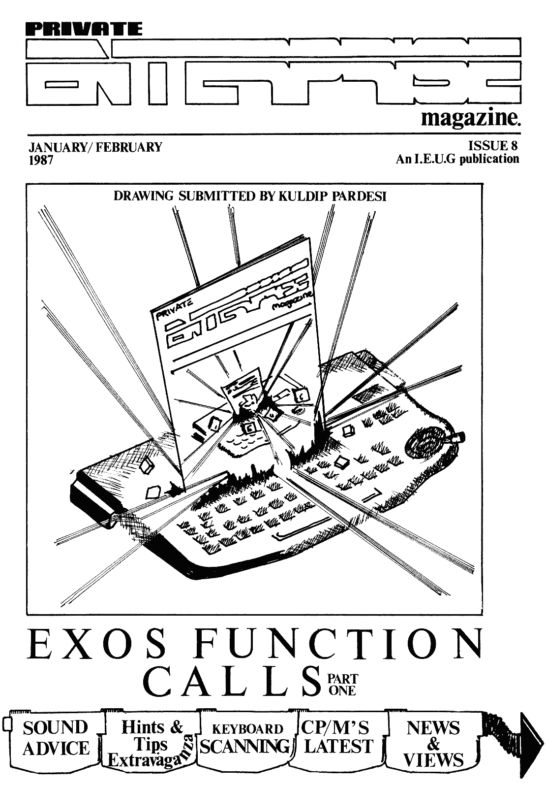

# Private Enterprise Issue 8 (1987.01-02)

[Оригінальний PDF](http://enterprise.iko.hu/magazines/Private_Enterprise_Issue8.pdf)

## Зміст

Editorial  
News Desk  
Ye P.C.W. Show Review
Private Correspondence  
Mike Turner's Hints and Tips Extravaganza  
The Peasy Guide to Using Sound on the Enterprise  
EXOS Functions Calls. Part 1  
CP/M Spot  
Home Produce  
Software Update  
Programming  

## Чернетка вмісту

"page-000.pbm" ------------------------------------------------------------ 
IE RSE: VALI

JANUARY/ FEBRUARY ISSUE 8
1987 | . AnI.E.U.G publication

DRAWING SUBMITTED BY KULDIP PARDESI

EXOS FUNCTION
CALLS®

"page-001.pbm" ------------------------------------------------------------ 
: yo RA id one,”
Disc Utilities oe 3 pee, Ah Printer Utilities
ari . : " Are you always waiting on your
All disk users at some stage desire a ae = tev printer? De your documents
the ability to have direct access to ery Ve 3 | look drab and boring?
the data on their disks, be it S od S 9 Then we perscribe PRINTER
for salvaging corrupted file: Jeers ~ fee TILITIES. «With = this

or just altering programs without rt " Pc, | Mm indispensable too! you can
having to first load them in. — .@pge Dili — : ne weeeem now carry on working
DISK UTILITIES allows you all , : ; ae AMEEA whilst the new printer
this and such gore. A powerful] Samay artes driver continues to print
disk sector editor is just one gem : ‘ cae. . ea ae ee m out up to 14K of text and
of the CP/M tools included on, no? : mm, Va IN} TO SRR PRINTER
this utilities disk. Others 2 ‘2s rm aM ieee ge” UTILITIES also allows you
include DISK, STATUS, CONVER Lge y way. to place control codes

, DUMP, FKEY, SETKEY ihe, eae Tag it ge within a document ready
and WIPE. a ' ae Pate. "Yor interpretation whilst baing printed,
Z na by or and thus giving you access to all your

printers options from within the document.

Joystick
Interface

+ >
o)
i=
1 >
5 oO
”N
me
a.

_ DISK UTILITIES UTILITIES

51/4'£10-95 S17 510-95 3281195 £i1- 95

Now reaching the final stages of
. development, BOXSOFTS SPECTRUM
Frice £12.95 EMULATION UNIT is a breakthrough in

A spin off from our work on emulation techniques enabling the once
1S BASIC EXTENSIONS Adding over 100 the mouse has brought us believed impossible to become a

new copmands to 15 Basic. the intelligent joystick reality, almost 100% spectrum software
Price £7.95 interface. A clever piece af compatible and aver 60% hardware
‘ electronics enabling auto- compatible. This revolutionary product

SCREEN UTILITIES Scrsave .Scrload repeat, twin fire buttons will open up the Enterprise to

Screopy and Scrdump all your graphics. and the ability to use more probably the largest selection of
PY Pate your grap sophisticated products, such games software in the UK today.

Price £5.95 as trackerballs and mice. Improved design has alse enabled us to

cut down on components thus reducing
SOEV Sound and Envelope defining the price well into everybodys range.

utility with auto program generation. This produce we believe will turn
Price §5.95 © SO Enterprise computing up side down.

PAINTBOX and MOUSE
PRINTER CABLES Boxsoft's own brand A full functioned art package and

with full polarization slots. 2 WHITEGATES, 100 STATION RD | mouse with textured fill and spray
Price £10.00 / NEW BARNET HERTS ENS 108 | being just two of it’s features.

ZiZ1P 15 Basic integer compiler

"page-002.pbm" ------------------------------------------------------------ 
Editorial

Yes, | know.... the unbelievable has
happened. An issue has been produced
approximately on time ! If you look on
the back cover of Issue 7, you will see
the immortal words "Issue 8 will be
available early February 1987".

... and here it is !
However, not everything promised in
Issue 7 has appeared. The "Introduction
ta [S-BASIC® article has had to be
postponed until next issue due to It
having to be rewritten. An article of
this kind has to be absolutely right or
it achleves nothing. | felt that the
material I had wasn’t really up to
standard, and there wasn’t time to do
the necessary work in time to meet our
deadline. I think, however, that the
article when finished will be
definitely worth the wait.
A message now to everyone who received
Issue 7 only two days before the
meeting and missed out on attending.
Don’t worry, you didn't really miss
much. See the News page for details,
but the AGM proper will be held on
Saturday April 4th. Details of that
later in this issue too.
A big thumbs up to Martin Gillespie of
Leyton who was quick to respond tu an
enquiry in Popular Computing Weekly
with a reply letter which was published
the following week. | was absolutely
deluged with enquiries (51 phone calls
and letters !) in the two weeks
following the publication of Martin's
letter. If something tucked away in a
letters page can produce that kind of
response, | think we should all get our
pens and paper out !
Finally, while you've got that pen out,
a plea for some more contributions to
THIS magazine. The amount of work | had
to put into this igsue was absolutely
ridiculous -
Editor, and | think |
articles than | edited! Please could we
have some more articles - they don't
have to be literary masterpieces or
theses; 1f you feel you have something
to offer, please write in. The sane few
people have been writing all the
articles since lasue 1 and are reaching
the limit of their endurance. Hany

thanks to both Mike Turner and Chris

Holland for thelr first-time efforts in
this issue. Neil Blaber

I'm supposed to be the {
wrote more}

{THOMSON

PRIVATE

CN Cd

LU [SS anys
CONTENTS...

NEWS DESK

gossip from the

YE P.C.W. SHOW REVIEW

Tis but a memory now, but this tale of
yore brings back gran images of olde

PRIVATE CORRESPONDENCE wr. angry

of Cheshire and fellow users write

HINTS & TIPS EXTRAVAGANZA

The start of a regular ‘word to the

wise‘section (with a bit of help from
you that is!)

PEASY SOUNDS If ‘DAVE* has refused

to let out a sound for you then fear
not; help is on hand for the novice

EXOS FUNCTION CALLS (PART ONE)

Dave Race starts his explanation of
the Enterprise eXpandable Operating
System tor those who prefer their

technical manuals in plain English

Ol VA\ Ge) Od bi The Crowborough

Crusader, our very own floppy disc
jockey gives us his tips for the tap
and all the latest groovy happenings

HOME PRODUCE

ashort and colourful graphics demo

SOFTWARE UPDATE Two more of

BOXSOFTS* recent Utilities are put
under the magnifing glass.

PROGRAMMING Gary Thomson

provides, for all you serious hackers,
the nack of scaning the keyboard

} ES) 8) 2

4

=)
6

All the latest news and
IEUG headquarters

in

3)
10

pA

THE INDEPENDENT ENTERPRISE USER GROUP

P.O.BOX 13,
Crowborough,
East Sussex TN6 1QX

An Independent Enterprise User Group publication. Qriginal artwork and
concept MARK LISSAK, Editor NEIL BLABER, Production EAMONN O‘LEARY
Articles from (in alphabetical order) +: CHRIS HOLLAND, DAVE RACE, GARY
and HIKE TURNER. Private Enterprise magazine {s a copyright of the
Independent Enterprise User Group. No artical may be reproduced in
whole or in part without written consent from the copyright holders.

"page-003.pbm" ------------------------------------------------------------ 
= News Desk:

The A.G.M. that wasn’t

Due to the fact that most members had a
grand total of two days’ notice for the
A.G.M., the stage was set for the

biggest anti-climax in User Group
history. As things turned out, it was
actually quite a useful seeting,
although it never actually became the
A.G.M (more on that later).

An unexpected delay at the printers
(due to a blatantly libellous line Neil
had written into his Verran piece which
had to be withdrawn) and the
particularly bad postal service (second
class post took about six days to
arrive) gaw the predicted two weeks’
notice of the aeeting cut to two days.
This prevented a large nuaber of
members from making it down to the
meeting, although the Hotline was
plagued with messages of support from
most of them !

After various initial problems, like
not being able to get into the hall and
nobody remembering to bring the coffee,
the meeting started with Tis doing his
sales pitch and various new bits of
software being demonstrated.
Unfortunately the mouse interface

comitted harakiri in transit from
Barnet, so there was no mouse demo. For
those who hung around afterwards, there
wag also a tantalising glimpse of
WordPro 100, the CP/M word processor
Neil {s currently working on.

At about 3.00pm, the meeting proper
began with Neil chairing and Martin
Wallace acting as Minutes Secretary.
Due to the circumstances which
preventing so any from attending
(there were only 22 members present),
Neil proposed an emergency motion that
all decisions made at the meeting
should be agreed in principle only, and
would be ratified at an Extraordinary
General Meeting to be held early in
1987. This was seconded by Martin
Wallace and passed by a unanimous vote.
This meeting will be held on Saturday
April 4th. from i.00pa - 5.00pm at the
same venue. Various amendesents were
then sade to the constitution, which
had been circulated at the beginning of
the meeting. When Agenda Item 3 was
reached, "that the constitution be
approved with immediate effect, and
that the meeting then becoae the
A.G.M.", this could not be passed due
to the initial motion. The meeting
therefore never became the A.G.M., and
discussion on the other agenda items
was postponed until April 4th.

Hotline gets a warm reception

The JEUG Hotline, initiated and sanned
exclusively by Neil from his hovel in
Crowborough, is an amazing success. The
phone hasn’t actually stopped ringing
since it was installed in December ! A
good two-way flow of news, hints and
tips has continued unabated well into

February, by which time any novelty
factor associated with having the IEUG

"on-line" in the evenings should have
worn off. It looks like the Hotline is
destined to become a major part of User
Group life... and that Neil is destined
to get very sore ears ! In fact, so
that he can actually get some work done
(or some rest !) on Sunday afternoons,
he has decided to restrict the time to
evenings only, 7.00-10.00pa, 7 days a
week.

IEUG forsake T.E.L for D.LY.

In the wake of last Issue’s slating of
Verran and the adoption of TEI as the
officially endorsed User Group repair
company, we have now discovered that
TEL weren't actually much better than
Verran and have decided to provide our
awn repair service. This will be
carried out by Tim Box, and repair
enquiries should be directed to hin at
the Boxsoft address (found elsewhere in
this magazine).

Disc Drive offer now ready

Prices have now been fixed with Cumana,
and are as follows :

£120.00
£200.00
£150.00
£270.00
£260.00

Single 3.5" drive
Twin 3.5" drive
Single 5.25" drive
Twin 5.25" drive
i+ 3.57 + 5,25"

Drives include power supply, leads and
moulded fused plug. Prices quoted are
inclusive of VAT and courier delivery.
The price of 5.25" drives fixed with
Cumana are rather high, so we advise
members specifically looking for 5.25"

drives to look elsewhere before taking
up this particular offer. Technomatic
of London, for example, are selling
single 5,25" drives at £120.00 each.

Please send orders to "IEUG Disk Drive
Offer" at the Crowborough address.

"page-004.pbm" ------------------------------------------------------------ 
NT

After a suitable rest, a number of Knights did embark upon a

Ye i¥ CW. Show Review

Tige just files by, doean't it ? It only seems like yesterday
when we were cowering in the corner of the Enterprise stand
at last year’s PCW Show. Of course, this year circumstances
were very different to those encountered in 1985. For
starters, we had our own stand - just as well, seeing as
Enterprise had to cry off due to certain difficulties
involving the United Commercial Bank and the Inland Revenue.
Also, due to Enterprise’s non-appearance/existence we had a
free hand to approach all and sundry.in Ye Queste for Ye
Surprisingly Scarce Sacred Supporting Software. And go it was
that our brave stalwarts emerged on the balcony of Castle
Olyapia just in time to be goosed by a pervy robot... if you
are not of a nervous disposition then read on !

YE CASTE IN ORDER OF APPEARANCE

Neil Blaber Gary Thomson Duncan Taylor Tia Box Andy Burnhaa
Dave Race Andy Fitter

Chapter ye Firste - Prelude to Ye Queste

"Tyas early in ye day before the first Trade Day when our
intrepid band of adventurers assembled outside the walls of
Castle Olympia - Sir Spikey the Fluorescent, Sir Garfield the
Diminutive and Sir Duncan the Lubricated arrived first, soon
to be joined by Sir Timbox the Soft and Sir Dataquip the
Hard. Entry was gained under the very noses of the
somnambulent orc guards, and the first tentative steps were
taken towards the Holy Stand of Zob. Alas, when discovered,
the Stand had been plundered of all its riches, and all that
remained were a wooden table (folded) and a plastic chair
(uncomfortable). The walls had been stripped of their fine
tapestries, and there was only one electric socket. A great
depression did fall upon the assembled Knights, but it did
not last long. A band of wandering serfs were encountered and
donated two chairs and a table to the Cause when threatened
with Sir Spikey’s mighty hairdo. Much rejoicing was there in
the Kingdom that night."

Chapter ye Seconde - Attack of the Lynx Beast

"The knights rose with the dawn and prepared to the defend
their stronghold against the fearsome assault of the great
Public. However, their plans were nearly thwarted by the
appearance of a vast bloated monster, clouds of toxic gas
emanating from the region of its armpits. The Knights charged
in to despatch the creature and cleanse the Land of Evil, but
were unable to get within striking range due to the pungent
aroma. The creature suddenly reached within the rolls of fat
and produced an amulet with the aystic runes "Lynx U.G."
inscribed upon it. The Knights were sorely afraid, but Sir

Garfield produced his magic book and cast the mighty spell of
Ridicule upon the creature. This great spell only bounced off
the monster's crusty exterior, but distracted it enough so
that It noticed the picture on the old black & white telly on
its stand was rolling, and it shuffled off to give it a kick.
The crisis had passed, due to the quick thinking of Sir
\ Garfield, and the knights
( change their underwear.

» All

retired to recount ballads and {

perilous Quest of exploration, and did discover that our
stand looked pretty duff in comparison to the others. It was
decided that Sir Spikey, having the worst dress sense, should
go forth and find some White Sticky Tape. Sir Spikey duly
complied, and blundered off into the unknown with a
ridiculous grin on his face. Miraculously, he managed to
locate a merchant with the goods after only a few hours of
searching. Taking a short cut on the return journey, he
entered Castle Olympia via the back entrance. The sight which
greeted his eyes upon his return did freeze him to the spot
in terror. A great enchantment had been cast upon the
occupants of the Castle, transforming all the computers into
cuddly toys ! "Gadzooks," said Sir Spikey, who spent many a
ninute in deep thought before it dawned on him that he'd
wandered into the Soft Toys Fair by mistake. Much michael
extraction at the expense of Sir Spikey was there in the
Kingdom that night.

Chapter ye Thirde ~ The Tin Pervert

So many traumas, and yet the brave Knights had not met the
nighty Public ! Eventually, this momentous event had to
occur, and so it did. Strangely reminiscent of the Trade Days
last year, the Knights were besieged by a vast host of little
kids, all intent on ripping the joystick off the keyboards of
the display machines, Only by resorting to aindless violence
were they able to prevent this, and of course all enjoyed
this immensely.

As the day progressed, strange spectres of the past were
raised amongst the fortifications of the Stand. The face of
Michae! Shirley was observed on more than one occasion, as
the immortal words “it wasn’t ay fault" echoed ominously
overhead. Awed by this vast apparition, the Knights were
sorely afraid and may finally have succumbed to the onslaught
of the little kids. But Lady Luck smiled upon them and this
was prevented by the appearance of an unlikely ally in the
form of the sexually depraved Ariolasoft robot. This metal
maniac seemed to be involved in progoting a game about
pinching peoples’ bottoms, as this was his major activity,
with creeping up behind little girls and saying "boo" loudly
coming a not-very-close second. So proficient was he at these
activities that the attacking children fled in terror. Much
locking of bedroom doors was there in the Kingdom that night.

Chapter ye Pourthe - Of the Six Megahertz and Slimy Pizzas

With the defeat of the initial host of infant barbarians, the
Knights became bolder, especially with the arrival of
reinforcements in the shape of Sir Spiderman and Sir Andy the
Inebriated. First, Sir Andy revealed his Bouncing Ball which
drew great crowds of onlookers. Then, Sir Timbox scrabbled
beneath the Stand and produced the fantastic Six Megahertz.

and the speed of 3D Starstrike was ridiculous. Even the Great

Druid Minter forgot his llamas and drifted across Olympia on
a cloud of intoxicating smoke to observe the Negahertz.

Meanwhile, Sirs Spikey, Garfield and Spideraan ventured forth
to gather pizzas for a hearty repast, only to discover that

those on sale were the ones they didn’t sell last year. Slime
abounded, and Sir Spikey was almost slain by his two enraged

|

i

|

‘
(

{

six had never been observed together at the same tise, |

"page-005.pbm" ------------------------------------------------------------ 
Hi, it’s your fun-loving,
talkin’ and completely overworked old.
Editor here. The move to Sussex has
prompted something of a deluge of mail,
so much so that I've only managed to
dig myself out in time to answer some
of ‘em here ! Thanks to everyone who
wrote in praise of Issue 7, although
the first letter this Issue isn’t quite
so complimentary....

“YOU ILLITERATE,
SELF-INDULGENT...”

1 recently received a copy of "Private
-". It has reminded we that |
intended to write to you after issues
1,2,3,4,5 and 6. 1 put the dotted lines
in the title as on the cover it is
impossible to read the other word in
the title. 1 have just quickly read
through the issue and have noted nearly
60 spelling/typing errors, apart from
the language which is, in many places,
verging on illiteracy.

ee beoree

1 an sure that 1 am not alone in having
bought an Enterprise Computer in order
to learn about elementary computing and
especially with the objective of word
processing. 1 find the machine a
complete white elephant. [I have not
bought a printer as what little | have
read leaves me uncertain as to whether
there is a cheap daisy-wheel which |
could guarantee would be compatible to
just plug in and work.

1 an not particularly numerate and have
no knowledge of computing. Your
articles all appear to be written by
electronics/computing students who
haven't a clue either what the layaan
needs nor how to communicate in plain
English,
sort of transatlantic jargon and is
totally self-indulgent. I find it easy
to see why few people attend your
neetings. The appeal can only be to a

tiny minority of like-ninded
dilettantes.

1 return to one of ay earlier points.

The whole point of word processing is
to enable text to be viewed before

printing. Could anyone take you

The magazine is written in a.

smooth;

gossip, outrage, itS your page.

seriously when you do not even use the
basic functions of the machine !!

Peter Carter
South Wirral
Cheshire

NB. 1 won't print the reply I sent to
this letter, as it was ay own personal
teaction to what Mr. Carter had to say.
However, I'd be interested to hear the
readers’ reactions to the points made
here. I know all about the spelling
mistakes problem - hopefully this issue
shouldn't contain many, but if you find

the articles incomprehensible please
write and tell us - maybe a major
rethink is in order.

TALES OF MEPHISTO

In Issue 7 of Private Enterprise, you
wrote that the assets of Enterprise
have been bought by Broadlight Ltd. of
London Wi. Well, I have heard that the
German company Mephisto has taken over
the production and sale of Enterprise
and accessories. Do you know anything
about this company, ie. their address ?

| don’t understand why you never wrote
about this, but it is obviously well
known by a lot of Enterprise owners
that the first Enterprise 64s do have
some errors which makes the expansion
port useless. I've just bought an EXDOS

module (so has one of ay friends) which

works as it should on a newer
Enterprise 128, but doesn’t work on our
old 64s. Once I spoke with the previous
president of the Danish Users Group,
"Enter’ and he knew what to do about it
(some resistors were wrong, as far as |
remenber) but I don’t have his name or

fugber any more; so I ask you - what
can 1 do about it ? 1 have a little
knowledge about electronics, but as
able to solder.

Finally, 1 would like to know if it is
possible to buy an upgrade of the EX0S
and Basic 2.0 ? If yes, then by whoa ?
And the price ?

Jorgen Winther
Toftlund
DENMARK

NB. It looks like you've got sone
information on the fate of Enterprise
GmbH, (see Issue 2 News for details)
who sold the machine in Germany under
the name Mephisto. They mysteriously
disappeared about the time Enterprise
went under, so they may have resurfaced
using the name Mephisto Computers. We
don't know their address, but if anyone
finds out please let us know.

Oops ! Looks like a sajor oversight on
our part about the duff machines.
Personally, 1 didn?t know that there
were any faulty 64s knocking about,
although the early 1285 were all unable
to work with the disk interface. There
are some internal modifications needed
to rectify this, for which we can
supply instructions (Gary successfully
got his machine working using these
mods, so we know they work).

I's afraid we're ina stalemate with
the EXOS and Basic upgrades at the

moment, but | can say things should
improve within the next month or so.

"page-006.pbm" ------------------------------------------------------------ 
TIP FOR THE TOP

| have just received Issue 7 of Private

Enterprise and 1] think it’s great, but

I think it would be a better buy having}
a ‘'Playing Tips’ section where peoplefProblea ? Well, the anual is written|use the asserbler ?
jargonese, and}
reading it in an attempt to understand}

could send in tips for games. Maybe you
could have a Top Ten list of software.
I would also like to know what happened
to games such as Super Pipeline 2 and
Cauldron. Are they ever going to be
released ?

Maybe you could have a competition
every igsue where you could give away a
gage 2? Competitions could have
questions or a practical answer such as
drawing or programaing.

Here are a few playing tips of my own :

KING OF THE CASTLE - To complete the
game you must get rid of the cat which
blocks the exit. To do this, you aust
collect the charcoal and the sulphur
and drop “them both over the saltpetre
in front of the cat. Then drop the
Magic Flare onto all of this and you
can say goodbye to the cat !

THE ABYSS - When coming to drop the
bomb to blow up the force field, drop
it from the top of the screen, then go
out of the screen and back. If there
had been any photon thrusters they will
have disappeared.

| need some help as well - does anyone
Iknow what to do in Alrwolf except blow
ryourself up ?

Finally, ] have sent you a small
ipicture. What do you think of it ?
Could it be used as a cover drawing ?

i
|

Kuldip Pardesi
Manor Park
London E12

NB.
games tips -

Cheers for the artwork and the
as you can see, we've

started a Tips Page this
Although this will cover both

actually
issue.

programming tips and games tips (not)

really enough of either to warrant a
page to themselves), it will definitely
fill a gap in the contents of the mag.
Are there any other budding artists out
there willing to show their talent ??

Once upon a tine

FORTH ATTEMPT

I] thought I knew 4
little of the philosophy of Forth
programming, so 1 purchased 1S-FORTH.

in pdeudo-intellectual

how to use this Forth has left me lost
and confused. Can anyone help ? And can
anyone define an INTEGER SIN function (
not as silly as it sounds) ? What |
nean is a Forth word equivalent to the
BASIC line :

HOD (1000#SIN(X))

If you can answer these you'll make me
a very happy aan. | might even be able
to produce some pretty, if not very
useful, Forth routines for Home Produce
(well, they say bribery will get you
everywhere) !

Peter Stensones
Hull

North Humberside

NB. I’m afraid there aren't any Forth

buffs amongst the magazine stalwarts,
so we'll have to rely on someone out
there to answer this query. I[ know
there’s at least one of you that should
know the answer (Richard Mishra and
Andrew Richards take note !).

DODGY EXCHANGE

Firstly let me congratulate you on
producing the bast yet issue of Private
Enterprise; Issue 7 was a thoroughly
good read. The article on the
Enterprise Saga was brilliant. The news
that a Spectrum emulation unit {fs on
the way is great, but one thing | would
like to know is whether it includes
games that would run on the 128K
Spectrum (for 128K Enterprise owners,

af course).
i

good idea, but you may be helping
pirates get copies of new games. All
they have to do is copy the original
and offer it to you to swap (they keep
the copy and offer the original). Are
you going to continue this possibly
dangerous service 2

| have a couple of questions about the

\Zzzip,

. j register will ba closed for good.
The Software Register could have been a

4S-BASIC Extensions program on sale!

from Boxsoft.
fe.

Is it compatible with;
can it be compiled and, |
secondly, how is the assembler used ?!

Vould it be worth a machine code]
programmer getting this program just to

John Foster
Sheffield

NB. The idea for the Software Register
wasn't actually mine, so I think it
best that the organiser of this
service answers your particular
criticism:

The decision to start the register was
not taken lightly; however in the end
it was agreed that the need to put,
users who could help each other out |
together outweighed the slight risk of
abuse by dishonest participants. It
aust be remembered that, ag yet, there.
are no new games as such avalible for |
piracy or otherwise and this includes
legitamate sale; only existing games|
.that are not at present available at
all come under this scheme. The risk |
of piracy as you outlined is in fact
very small as the pirate would have to
give up his or her hard won original
in order to take part. It would be -the
plrate who in effect would be left
with the illeagal copy and for no real |

| financial gain. Compare this with what |
jusually happens with pira cy and you |

will see it‘s hardly worth the effort. |
In answer to your final question on

athig matter, no, we do not (and indeed

did not ) intend the register to be |
anything more than a temporary service |
to get us over the software blackspot |
we are at present in. All those who |
took part will be notified one way or |
the other by the end of April at the,
latest, by this time the software,

situation should be resolved and the |

|
The other query 13 really Boxsoft's |

domain, so I'l] pass the buck on that |

one, too ... |

jThe short answer is no. The reason for}

this {s 2ZZip was written ronths before]
the relase of 15 Extensions so Peter
Hiner did not know of the extral

CONTINUED ON P. 21

"page-007.pbm" ------------------------------------------------------------ 
—— MIKE TURNER'S HINTS

Welcome to a new page in the magazine.
This spot is going to be a "hints and
tips" column for members who are having
trouble using the machine or playing
games (Arcade, Adventure etc...) and
for members who have tips for msaking
life easier on the Enterprise.

Hi there - my name is Mike Turner and
I'a the man who will be writing this
action packed, fast moving, wild living
death defying page. (Well... it sounds
good). How they ever roped me into this
I'll never know. Maybe it was something
to do with sy arm being forced up ry
back. (Just joking chaps, I’m loving
this). I's here now, arred with py
trusty Enterprise, fingers nimble, aug
of tea and rearing to go.

Members are invited to send in any
questions they may have relating to the
machine or games. No question is too
big, no question too trivial. Ask it
and we shall try our very best to
answer it, or we promise to eat our
joystick adapters, Questions which are
sent in will be printed along with the
answer (space permitting). Any question
that cannot be answered by me or any of
the team will also be printed (space
permitting again) with the member's
address (if they so desire) so that any
other member who can answer the
question can send the answer direct to
the person. (It may help members to get
in touch with others and share ideas).
Who knows, maybe someone has the
solution to quitting Eddie The
Exterminator !

And before 1 forget, could you please
remember to put your names and
addresses on all docugents that are
sent in. Due to the hectic. life I lead
papers are getting separated and | find
it hard to work out who sent in what.
So if Fred Seith does not want his tip
for getting past screen 1 in Devil's
Lair credited to Joe Bloggs then
please, please, please (beg, beg) put
your name and address on all documents.

Below are a few tips and questions we
have received from meabers wishing to
share their new-found techniques with
the rest of the world (!!)...

We have had members writing in about
how to use the ‘TIME’ and ‘DATE’

commands as they seem to have been
cryptically written in the User Manual
(and this mag, so 1] hear). Well, 1
shall have an attempt at explaining
thea.

First the format which is as below:-

DATE "YYYYNMDD" (ENTER)

Where 'YYYY’=Year
” ‘MM? =Month

" 'DD' =Day

To enter the date 25th Dec 1999 you
would type in the line as follows:-

DATE "49991225" (ENTER)

To print the date at any time, just use
‘PRINT DATES? (ENTER) and the current
date will be printed as below.

19991225
With time it is slightly different :
TIME "HH:MM:SS" (ENTER)

Where 'HH'=Hours
" ‘HM’ =Minutes
" 168' =Seconds

(24 hour format)

So, 10:25pm would be entered like
this :-

TIME *22:25:00" (ENTER)

To print the time again as below :-

PRINT TIMES (ENTER)

Someone aut there is having trouble
with the "BIAS' command, as to what it
actually does !

The *BIAS’ command is only used when in
{6 colour graphics mode (hires or
lores). What the command actually does
is to assign the colours 8 to 15 in the
palette to a group of elght colours.

There are 32 groups of colours and they
are arranged as below.

0-7 8-15 16-23 24-31 32-39 etc..

The numbers above are the actual colour
numbers. So if you were to set the bias
to mumber 34, then from above we can
gee that the group with the colours 32
to 39 would be chosen and the colours 8
to 15 in the palette would be assigned
to these colours, le.

32
33

Colour number 8 would
Colour nugber 9 would
and so on.

Mark Procter from Ruislip, Middlesex,
writes to say that he has a better way
of defining your own default text page
than that described in issue 3 :

i. Open and display your text page
where you want.

2. SET EDITOR VIDEO channel! nuagber of
your text page.

3. CLOSE £0.
4. OPEN £0:"EDITOR:"

NOTE: IN STEP 2, DO NOT PRECEDE CHANNEL
NUMBER WITH £7, te.

type SET EDITOR VIDEO 110.

Steps 1 and 2 can be performed in
immediate mode, but 3 and 4 MUST be

done from within a program.

Another tip from Mark, this time for
disc users with 1S-DQS.

1. Boot up 1S-DOS

2. SAVE 0 *.COM

Then just type **' to run the command.

"page-008.pbm" ------------------------------------------------------------ 
The above command has the effect of|After entering the program type 'RUN’.
resetting to IS-DOS pointers to the|You will be asked to enter a command,
Transient Program Area (TPA) and the|just enter the command as you would
previous program that had been calledjnormally do in immediate mode, eg.

from disk under 15-D0S will be re-|LIST, TEXT, RUN etc..

started.

When you have finished entering the
commands just enter 'XXX’ to exit. The
program creates ai file called
EXECUTE’. This is the file that the

user will run each time the computer is
used.

NOTE: The machine will crash if no
program has been called since booting

I5-DOS. Certain programs eg. (CHKDSK)
will corrupt the TPA and when you try
to reactivate by typing '** (ENTER) a
corrupted version will run and even if

the disk is OK, it will return errors. {100 PROGRAM "BOOT.BAS*

110 DEF CREATE
120 TEXT
130 OPEN £10:"EXECUTE" ACCESS OUTPUT
routine which | have found|!40 DO
This has been written by {50 LINE INPUT PROMPT "COMMAND: "sA$
160 AS=UCASE$(A$)
{70 IF AS="XXX" THEN EXIT DO
Most Disk Operating Systems (DOS)|!80 PRINT £10:A$

provide what is termed an EXECute file, |190 LOOP
These files (there can only be one in|200 PRINT £10:"CLOSE £10"

existence on any directory) are booted 210 END DEF

up (run aS soon as the computer 1s 220 !

powered up) and then run. What they do 230 DEF READ

is make the computer run through a set 240 OPEN £10: "EXECUTE"
sequence, substituting all {nput 250 CAPTURE FROM £10 TO £105
expected from the user setting up 260 END DEF

cettain parameters (screens, type of a

printer, date etc.)

Who says we're not world famous ?

Here is a
very useful,

Frank Jagler from Hattingen, Germany.

Now for sone tips, hints and problems
EXDOS does provide such a file (useful[Playing games.
if you have EXDOS and a disc drive) but
have no fear, Mr. Jagler does provide

such a system for tape based users,

User having trouble with Return To
Eden. Would like the answers to these
problems. How to get past the
The listing provides two procedures,|Leviathian, what are the Airbrush and
one for creating the file and the other/the Fig Leaf for? Also how to get off
for reading it. After having typed the Tiny Island. Doesn't ask much does
"RUN’, the procedures can be started by|he?.
entering "CALL CREATE’ and *CALL READ’. Vell, come on guys and gals surely
there is a solution out there to help
IS-BASIC handles all communications this poor lost soul (1 know... tell you
through an editor channel (£0). The next issue.. heh heh - Ed).
Editor in turn uses the Keyboard device
for input and the Video device for Please can anybody send

output. All that hag to be done is to playing Airwolf and Devil’s Lair which

‘Capture’ the input from the tape/must surely rate as two of the hardest
channel and substitute it for the input games in the universe, especially

expected from the keyboard channel (f[Devil's Lair. This game seems to be
105). This is what READ does. ade to test our very sanity.

in tips for

| have only one small tip for Airwolf
and that is to try and shoot the saal!
boxes with the small light-blue tip as
these will remove some of the barriers.
I’a still playing the game so hopefully
more tips to follow.

Someone has written in asking how to
make the Hidden Surfaces demo (Issue 4)
work on the 64. Well, as the owner of
said machine, what I have done is to
make the variable "NFRAMES’ in line 240

equal to 10. This seems to work just
fine.

Staying with the same program, it looks
like the Basic doesn’t work with the
line:

IF COL > 0 THEN

This line is numbered as 770 on the

Greatest Hits tape or as 850 in Issue
4,

If you change the line to :
IF SGN (COL) = -1 THEN
the program works ok,

One last point - someone has sent in
the solutions to rescuing all eight
sarcerors in the game Sorcery. This, |
feel, would ruin the playability of the
game so | shall not print them here,
but anyone can send ina request for
them if they so wish and a copy will be
forwarded to thea,

50 now it is up to you to start sending
in those tips and questions (the more
the merrier), Please do not wait for
Joe next door to send the tips because

if you all do that, guess what happens
'! BI BI for now...

Mike Turner

"page-009.pbm" ------------------------------------------------------------ 
Those of you who made it to the 9th Pcwjcontrol lable
Show may ‘have had the (mis) fortune to [ENVELOPE

come across the guys of the IEUG
blasting out of a 100 watt Amplifier
various ‘orrible noises. [I have to
admit they were ay fault. | also have
to admit | was lucky in missing this as
they were attempting to get their mouse
to work at the time (Friday), and
trying not to jump on it in rage and
frustration.

Anyway, enough of the grovelling
apologies, as to make amends, | have
produced something of a ‘first’ in
‘Private Enterprise’ - an article by a
person not called Dave Race?? No, an
article on how to use the ’Dave' sound
chip, written by An Idiot, for, ahen,
Non-Technically Minded Persona such as
the majority of the IEUG membership.

To kick off, the ‘Dave’ custom sound
chip can be described as being able to
output four-part sound. The first three

channels or sources give out a clear
square-wave tone. These are numbered 0
to 2. The fourth source is the
obligatory 'white nolse’ channel, which
supplies a hissing or ’slushy’ noise,
as with an untuned radio. It is known
as source 3 (Look at the manual...).

This summary could describe the
standard arrangement of aost computer
sound chip capabilities (Amstrad et
al..). The Enterprise ‘Dave’ chip
departs froma this in a number of

interesting ways, in that it is able to
offer such options as genuine stereo,

THE PEASY
GUIDE TO
USING

SOUND
ON THE

ENTERPRISE

from both BASIC and
statements. Also, Ring
Modulation, which lends a aetallic
*Spacey' effect to any sound. There are
several types of white noise, and a
high and low pass filter. These are
directly accessible from BASIC in the
torm of the SOUND STYLE command. Listed
below are a few well known ones (and
some less well known ones |

discovered...)

SOUND STYLE 16 - Low distortion. This

can, under certain circumstances give
tise to a sound not unlike an electric
guitar. It can be combined with other
SOUND STYLE options from STYLE 64.

SQUND STYLE 32 - Medium distortion. A
compromise between STYLE 16 and 48. |

personally have not much used it. Like
STYLE 16, can be combined with other

‘STYLE parageters.

SOUND STYLE 48 - High distortion. Gives
a thunder-like nolge, and unlike white
noise, is a relatively ‘clean’ sound
and can be varied by pitch, thus making
it more flexible in use. Can again be
combined with other STYLE parameters.

SQUND STYLE 64 - High pass filter. This
is most commonly used on two sound
channels together (0 and 1) to produce
the filter effect in which only the
part of a tone above the filter cutoff
point is heard,to give a high
‘gtrained’ quality to a sound. Can. be
combined with all the previous STYLE
parameters and some others.

SOUND STYLE 128 - Ring modulation. This
is achieved with channels 0 and 2
working together to produce that
distinctive ‘spacey’ metallic sound
described earlier. Variants of this
STYLE are discussed below.

SOUND STYLE 144 - A fateful union of
SOUND STYLES 128 and 16, use as STYLE
128. Also note STYLEs 160 and 176,
which add ring modulation to STYLE 32
and 48 respectively.

SOUND STYLE 192 - A combination of ring

modulation and high pass filter. Again
use as STYLE 128. This option leads to

a very subdued sound on its own. Beef

it up with, say something in another
channel! or STYLE...

SOUND STYLE 255 - the highest number
possible. Gives rise to a musical,
tinkling white noise sound type. It is

possibly an amalgaa of all previous
STYLES?? SOUND STYLEs 250-255 are best

used either on their own, or else in
channel 3 with STYLE 128 in channel 4.

N.B. What | think is the LOW PASS
FILTER, is activated by SQUND STYLE 34
in source 3 (the white noise channel),
in conjunction with various STYLES, in
source 1. Doing as the manual (at least
my early incorrect copy) suggests, that
is, STYLE 32 in source 3, with A.N.
Other STYLE in source 2, does not the
blindest bit of good as there is too
much unwanted white noise...

"page-010.pbm" ------------------------------------------------------------ 
In order to illustrate the above

listing.
dimension of ring modulation is addea
to what would be a continuous rise and
fall STYLE 48 peal of thunder.

{00 DQ
{10 FOR C=1 Td 3

120 FOR A=125 TO 1 STEP-1
130 SOUND PITCH A, DURATION 4,
SOURCE 2,STYLE 176
NEXT A
FOR B=125 TO 1 STEP-2
SOUND PITCH B, DURATION 4,
SOURCE 0,STYLE 176
IF C=3 THEN STOP
{80 NEXT B
190 NEXT C
200 LOOP UNTIL C=3

140
150
160

70

A few points to note; DO.. LOOP becomes
DO.. LOOP UNTIL, with the controlling
variable as C, and the control point as
line 170. If you want to include this
routine in a larger sound or pusic
prograa, line 170 could become a GOTO (
yuk ! Ed.) statement. DO.. LOOP on its
own would merely mean the program going
on all night. It is the interaction of
ting modulation on the two STYLE 48
sounds that produces the alarming
electric ‘ripple? of lightning
discharge to break up what would
otherwise be the single sound type in
the progres.

Here is another favourite routine of
mine, a ‘Heavy Metal? ascending guitar
riff, produced by a combination of
STYLE 192 in source 0, STYLE 64 in

source l,and STYLE 16 in 2:

100 DO

{10 FOR C=1 TO 3

120 FOR A=18 TO 46 STEP 2.4

{30 FOR B=10 TO 20 STEP 2

{40 SOUND PITCH A, DURATION B,
STYLE 192,SQURCE 0

SOUND PITCH A-9, DURATION B,
STYLE 64,SQURCE 1

SOUND PITCH A+12, DURATION B,
STYLE 16,SQURCE 2

IF C=3 THEN STOP

180 NEXT

190 NEXT

200 NEXT

210 LOOP UNTIL C=3

150

160

170

Again note that DO.. LOOP is the main(The

information, here is a brief easy BASIC| controlling structure of this routine, |statement
In this case, the extrajand that the STOP statement on line 170 imagination.

can be replaced with GOTO (ugh! another
one! Ed.), if you wish to include it in
any larger programs.

A rajor part of the Enterprise's sound
production capabilities is the ability
to modify the pure, boring square wave
tone by the use of ENVELOPE in a SOUND
statement. ENVELOPE is set up, firstly
by giving it a number and line, eg.

100 ENVELOPE NUMBER 1;2,0,40,30;5, 20,
63, 20;1,-63,63, 10;6,63, -63,50

The ENVELOPE can be broken down into
four parameters per phase. The first
number sets the pitch value (High or
Low?), the second and third values
control the LEFT and RIGHT stereo
channels respectively. Finally, the
last number before the seaicolon deals
with duration (5051 second). The
Enterprise ENVELOPE is flexible enough
to permit anything up to 21 phases (
Generated from Sound Utility in Issue
3.) of these four values, or else they
can be kept as simple ag you want. You
are not, on the one hand, stuck with
setting up 14 parameters before you get
a squeak out of the BRC ENVELOPE. Or
stuck with the Commodore’ sASDR
limitation. However, as in the example
above, the ASDR (Attack, Substain, Decay,
Release) philosophy is best to stick
with if you want an easy life.....

To the example ENVELOPE,add these
lines.....

110 SOUND PITCH 40, DURATION 150,
STYLE 48, ENVELOPE {

120 SOUND PITCH 45, DURATION 200,
STYLE 48, ENVELOPE 1,SOURCE !

The ENVELOPE modifies the sound by
creating a left to right ‘Wraparound’
effect, controlled by the stereo
parameters, particularly in the last
two phases. This particular ENVELOPE
had a total duration of 410, or just
over 2 seconds. Generally, short sharp
(le, twangy) sounds are better produced
with lower duration values, and
longer, more 'whooshy’ sounds need high
duration values.

usefulness the ENVELOPE
is only limited by your

For example, this listing
below works equally well with or
without an ENVELOPE, but the sound in
each case is quite different....

100 ENVELOPE NUMBER 1;-12,63,20,5;2, 40,
10,433, 30, 63,8
FOR A=57 TO 58 STEP .2
FOR B=80 TO 40 STEP-3
SOUND PITCH A+B+B, DURATION 9,
STYLE 128
SOUND PITCH A/B/B, DURATION 9,
SOURCE 2, STYLE 128,ENVELOPE 1
NEXT
NEXT

of

110
120
130

140

150
160

To notice the differences, remove line|

100, and also the ENVELOPE statement on
the end of line 140. In this case it is
also interesting to note that the
ENVELOPE is only three phases long,
that is twelve parameters in total.

Finally, ("Thank God!" 1 hear you cry)
there are a number of areas and ideas |
would like to touch on that more
advanced users could try. For example,
you could set up sound sources by
OPENing and CLOSEing channels. The
default Sound output channel is channel
£103. The use of user-defined sound
Sources could put a greater flexibility
of sound use into the users hands. |
have not looked at the use of such
areas as the SYNC statement, which
sychronises sounds from more than one
source, or the INTERRUPT statement,
which can replace any current sound
with a new one. These will need a
different article. Other ways of
expanding the sound and ausical
capabilities of the Enterprise include
hardware modifications to enable MIDI
connection to a keyboard or sequencer.
This has been done (1 as tellably
informed by Tia Box...) by R.A.Penfold
in his publication MIDI and your
Micro’ (Bernard  Babini publishing)
I have yet to find the
Also, there is the possibility
of adding a sound sampling capability
with an analogue to digital convertor, |
and the appropriate software. | am sure
there is someone out there who {gs

putting the finishing touches to such a
device...

| Chris Holland

"page-011.pbm" ------------------------------------------------------------ 
Private Enterprise publications proudly
presents EX0S Function Calls , or The
Enterprise Technical Manual in 144
weekly parts.

If anyone can remember back to issue 7
they will recall that I did an article
on system variables. In the article |
made the prowise that we would be
covering EX0S function calls in the
near future, i.e. sometime in the next
year or so. What | didn‘t realise was
that our beloved editor would think
such an article would be a great idea,
especially if yours truly wrote it. So
here | sit, Neil standing over me with
a sawn off Doc Martin, desperately
trying to come to terms with machine
code .... again ! :

Because | am not exactly one of the
worlds greatest machine code
programmers, anyone want to buy a
slightly used assembler, I shall try to
present the subject of EX0S function
calls in a way that will hopefully be
of use to, and understood by, Basic
programmers. Purists should be warned
that this will involve calling machine
code routines from basic programmes and
the use of the infamous ALLOCATE
command.

In general a function call is made by
executing RST 30h followed by the
number of the function, ‘h’ indicates
that the number is in hexadecimal e.g.
30h is the same as 48 decimal. The
function may require that certain
registers are set before it fs called,
these are referred to as it's
parameters and will be explained for
each function call.

Usually the function will give values
to certain registers, the results of
the function call. Register A, for
instance, is normally used as an error
indicater. If everything has gone 0.K.
A will be zero, otherwise it will be
set toa value indicating what sort of
error has occured, the Z flag will also
be reset to 1 if an error has occured.
If a RST i8h is performed after a
function call an error can be detected
and the sachine will return to basic
with a suitable error code. Unless
stated otherwise the register pairs HL,

IX, TY, BC’, DE’ and HL’ are
preserved by EXOS function codes.

Take a look at the article on system
variables, there is an example of
function 16 which is used to set, read

or toggle a system variable. The code

shown is a little meaningless as | have
put the value 3 in B, which is supposed
to be set to 0, i or 2, so let's change
it to something a little more sensible:

LD 8,2
LD C,26

«toggle the variable>

<the variable controlling
whether the status line is
displayed>

<calls a EX0S function
<specifies which function is
required>

<check to see if an error
has occured>

<return to wherever
routine was called from>

RST 48
DEFB 16

RST 24

RET the

This will toggle the status line every
time the code is called, and could be
coded with the following basic prograp:

{0 ALLOCATE 10

20 CODE TOGGLE_STATUS=HEX$("06, 02, 0E,
1A, F7,10,DF,C9")

30 CALL USR(TOGGLE_STATUS, 0)

Which when run will toggle the status
line - magic, eh? Of course this woulc
mean that you would need three bits o1
code for every system variable, whicl
does sem a little wasteful. Note.
however that CALL USR allows a value ti
be passed to HL; this value could the
be used to decide which variable i:
being affected, and in the case of SE
the desired value could be passed to D
The resulting code would look lik
this.

<the value of H will be set
by the call routine>

Cagain the value will be set
by the call routine>

<this time we want to set
the variable>

RST 48 4 >

DEFB i6 <all as above>

RST 24 < >

RET < >

LD C,H
LD D,L

LD B,1

"page-012.pbm" ------------------------------------------------------------ 
/In basic this would be:

{0 ALLOCATE 10
20 CODE SET_VARIABLE=HEX$("4C,55, 06,
Of,F7,10,DF,C9")

The function would then be called by|
the command:

CALL USR(SET_VARI ABLE, 256*VAR+YVAL)

where VAR is the system variable being
set and VAL is the value to be given to
the variable, e.g.

CALL USR(SET_VARIABLE, 7167)

will set the border white.

As you have probably realised by now
anyone who wants to use these special
function calls is going to have to be
able to convert the mnemonics to hex
Values, and a little knowledge of

machine code would be a great help. The|

tome | use is "Programming the 280", by

Rodnay Zaks. Whilst the teaching part
of this can be a little heavy it does
have a tremendous reference section on
the 280 instruction set and | heartily
recommend it.

There is a complete list of function
calls on pages 201 and 202 of the
programming guide, as you can see many
of them are concerned with handling
channels, so | shall deal with these
functions first of all - yes, this will
be another of my multipart epics.

Function | Open Channel

Parameters:

A Number to be given to channel. This
must not be set to 255, this is the
channel used to cancel redirects
and captures - wore about which
later.

DE Address in memory of the device

and/or filename that this channel

will be associated with. The first
byte will be the length of the
string.

The device name takes the form:
{{device-name} {{"-"}unit-number}":")}

where (} denotes an optional part and *
" denotes literal characters. The
device name can be up to 28 letters
long. The unit number, if specified,
can be seperated from the device nage
with "-" or it can immediately follow
it.

Examples: TAPE:, VIDEQ:, DISK-1: etc.

The filename can also be up to 28
characters long, and follows the usual
rules of EX0S / EXDOS filenames. If no

device name is given then the default
device will be used,

If using Basic, then code the device /
filename seperately. This will allow
you to obtain the address from the
vatiable used in the code statement,

don‘t panic! an example follows the
description,

Results:

A Error indicator, will be non-zero
if an error has eccured during the
function call. See the beginning
of this article for more details,

Description:

This function opens a channel just like
the basic OPEN command does. If an
attempt ig sade to open a file that

does not already exist then an error
will be generated.

Unit numbers and filenames are ignored
by devices that do not support then,

é.g. VIDEO:,KEYBOARD: etc. If a unit
nuaber is not given and the device does
Support unit numbers, e.g. DISK:, then

the default will be used, the current
drive in the case of DISK:,

It should be noted that many devices
require that certain system variables
are set before a channel is opened to
them, just as they would if a channel
was opened from basic, e.g. before

"page-013.pbm" ------------------------------------------------------------ 
openning a channel to VIDEO: systeml|length byte at the beginning, at the |Function 3
variables 22 to 25 must be set to the| address
FILENAME.

‘desired values.
Exagple.

Suppose we wanted to open channel
a file that we have already created,
say TEXTFILE.WP for example.
machine code for this would be:

LD A,t

LD DE, FILENAME ADDRESS
RST 30h

DEFB 1

RST {8h

RET

In Basic this would be:

10 ALLOCATE 100

20 CODE FILENAME=HEX$(*0,0,0,0,0,0,0,
0,0,0,0,0,0,0,0,0,0,0")

30 LET FILENAMES="TAPE: TEXTF ILE, WP*

40 POKE FILENAME, LEN(FILENAME$)

50 FOR COUNT=1 TO LEN(FILENAMES)

60 POKE FILENAME+N, ORD(FILENAMES(N) )

70 NEXT COUNT
80 CODE OPENCHAN=HEX$("3E, 01, 11")&
WORDS (FILENAME) &HEX$ ("F7, 01, DF,C7®)

90 CALL USR(OQPENCHAN, 0)
100 FOR COUNT=1 TO 100
{10 GET £1:A%

120 PRINT A$;

{30 NEXT COUNT

140 CLOSE £1

Line 10 simply allocates an area 100
bytes long to be used for machine code,
and moves the basic program up 100
bytes in memory; plenty enough for our
program.

Line
this
name
puts
area

20 fills the first 18 bytes of
with zero. We will put the file
in this area. The CODE command

the semory address at which this
starts into the variable FILENAME.

Line 30 puts our filename into the
string variable FILENAMES,

Line 40 pokes the length of our
filename into the memory location held
in FILENAME, then lines 50 to 70 poke
the ascii values of each character in
the filenase into the memory. We now
have the filename in memory, with it's

stored in the variable

in memory, the command WORD$(FILENANE)

{ to| converts the address held in FILENAME

into the correct hex format. The

The| Snemonic:

LD DE, FILENAME ADDRESS
becones:
HEX$ ("11") &WORDS$ (FILENAME)

Line 90 calls the machine code routine,
and lines 100 to 140 simply demonstrate
that the routine has worked. If you
want to prove that the error handling
works in the routine leave out the
CLOSE command in the last line and try
running the program twice. You should
get an error message the second tine.

Function 2 Create Channel

Parameters: As for function { above.

Results: As for function 1.
Description:

This function is identical in every way
ta function { except for the cassette

_|and dise drivers.

In the case of the cassette driver this
function operates in the same way a3
the basic command:-

OPEN fchan:"filename” ACCESS OUTPUT
whereas function 1 is equivalent to:-

QPEN Echan:"filename" ACCESS INPUT

With the disk driver this function will
open a file, destroying any existing
file of the same name. Obviously the
file does not have to already exist for
this function to work.

In both of the above cases the device
being used will try to set aside a
buffer for input/output, if there isn’t
enough RAM for this buffer an error
will be generated.

Close Channel

Parameters:

Line 80 puts the machine code routinejA Channel number. As usual this should

not be 255.

Results:

A Error indicator, as in function |.

Description:

This simply closes the specified
channel, just like the basic CLOSE
command. An error will occur if an
attempt is made to close a channel! that
does not exist.

Before the channel is closed it*‘s
buffers are flushed and any RAM
allocated to it is freed for use.

For example if we were dealing with a
tape channel there would be an area of
RAM, the channel buffer, in which
characters would be stored before being
sent to the tape. The computer will
wait until this buffer is full and will
then send it‘s contents to the tape $s a
single block. Obviously the chances are
that when you close a channel there
will be some characters in it; flushing
means that these characters are sent to
the tape, as opposed to losing then.
When the buffer has been flushed the
RAM set aside for it will be de-
allocated.

Function 4 Destroy Channel

Parameters: As for function 3.
Results: As for function 3.

Description:

This function is identical to function
3 for all devices except the disk
driver.

In the case of the disk driver this

function will delete the file being
accessed by the specified channel,

Function 5 Read Character

Parameters:

A Channel number. Not 255

"page-014.pbm" ------------------------------------------------------------ 
Results:

A Error indicator, as in function i.

B ASCII value of character returned
from channel.

Description:

This function reads a character from

the specified channel and puts it‘s
ASCII value in B.

The function will wait until a
character is ready, thus it is possible
for- a routine to hang up indefinitely
when using this function. When dealing
with files an error will be generated
if an attempt is made to read a
character after the end of the file has
been reached.

Exagple.

code will read a
character from the keyboard, channel
105, and put its ASCII value in

register L which will then be returned
to the user.

The following

LD A,105 <The keyboard channel>
RST 30h = <Call function >

DEFB OS << — and >

RST 18h <check for errors>

LD H,00 <Zero register H and >
LD L,B <put value in B into L>
RET

This becomes the basic program:

{0 ALLOCATE 100

20 CODE READ_CHR=HEX$("3E,69,F7,05,DF,
26, 00,68, C9")

30 DO

40 PRINT CHRS(USR(READ_CHR,0))

50 LOOP

Line 40 prints out the character
defined by the value in L. The program
will continue until either the stop key
is pressed or until an invalid code is
sent to the editor.

In fact the code to clear register H is
nat necessary as the USR function puts
zero into the register pair HL when the

code is called. This means that we can
leave out the code 26,00 in line 20.

Function 6

Parameters:

‘interest of machine codists this block

Read Block Example:

The following code will use functions
i, 3 and 6 to open a channel to a
previously created file, TESTFILE.TXT;
tread a block of data 1000 bytes long
trom the file; store the data at

address {0000 onwards; and finally
close the channel:

A Channel number to read from.

Not 255.

BC Number of bytes, i.e. characters to
be read. This should of course be
coded in the usual way, i.e.
least significant byte followed by
most significant byte.

LD A, 1

LD DE, FILENAME ADDRESS
RST 30h

DEFB 1

RST {8h

DE Buffer address, i.e. the address in

memory where the characters will be
stored.

LD A,t

LD BC, 1000
LD DE, 10000
RST 30h
DEFB 6

RST 18h

Results:

A Error indicator.

BC The number of bytes left to be
read. This will only be of
importance if there has been an
error during the read.

LD A,1i
RST 30h

DEFB 3
The modified buffer address. This|RST i8h

will be equal to the original |RET

buffer address plus the number of

bytes read and therefore followgjThe different function calls have been
the data which has just been read. seperated to make the code easier to
understand. As you can see we have to
load A with the channel nuaber after
every function call. This is because A
This function reads a block of data,|is used as the error indicator and
the size of which is specified in BC,/s0 its value is changed by the
from the specified channel. As thejfunction calls. The Basic for this code
length of the block is stored in BC it|would be:

may be anything from 0 to 65535 bytes 100 ALLOCATE 200

long. 110 CODE FILENAME=HEX$("0,0,0,0,0,0,0,
0,0,0,0,0,0,0,0,0,0)

120 LET FILENAME$="TESTFILE. TXT"

130 POKE FILENAME, LEN(FILENAMES)

140 FOR N={ TO LEN(FILENAMES)

{50 POKE FILENAME+N, ORD(FILENAMES(N))
{60 NEXT
170 CODE PROG=HEX$("3E,01,11")&

WORDS (FILENAME) &HEX$ ("F7, 1, DF")

An error will be generated if an
; 180 CODE READBLK=HEX$(*3E, 01,01,E8,03,
attempt is sade to read past the end of 11,10,27,F7,6, DF")

ae eae me we te en 190 CODE CLOSE=HEX$("3E,01,F7,3,DF, C9")
200 CALL USR(PROG, 0)

correctly. 210 FOR N=10000 TO 11000

220 PRINT CHRS(PEEK(N));
230 NEXT

Description:

The first character read in will be put
at the address specified in DE, any
further characters will be stored
sequentially from this point; for the

nay cross segment boundaries.

As mentioned above, BC and DE will be
valid even if an error occurs so that

the read may continue from the bytelAgain the seperate functions are shown
where the error occured. as three different code statements.

"page-015.pbm" ------------------------------------------------------------ 
When the first block is called, CALL
USR(PROG,O), all three blocks will be
tun through until the RET is reached in
the third block.

Lines 210 to 230 are there to prove
that the data has been read correctly.

Function 7 Write Character

Parameters:
A Channel number to write to. Not 255
B ASCII] code of character to be

written.
Results:

A Error indicator.
Desription:

This function sends the character
stored in B to the specified channel.

An error will be generated if the

channel has not been openned.

If writing to a file the character will
be placed in the channel buffer, if
this fills the buffer, its contents
will be written to the file. This is
why a channel*s buffer is flushed
before the channel is closed.

Function 8 Write Block

Parameters:

A Channel
Not 255.

number to be written to.

BC Number of bytes to be written.

DE Address where characters are to be

read from.
Results:
A Error indicator.

BC The number of bytes that are still
to be written. This will be valid

even if an error has occurred.

The modified buffer address, i.e.
the address that the write function
has got up to.

Description:

This function is the ‘write’ equivalent
of Function 6, read block. It will send
a block of data, the length of which is
stored in BC, starting at the address
in DE to the channel specified in A.

As in Function 7 a channel buffer will
be used when writing to a file.

BC and DE are valid at all times, as in
Function 6, so if an error occurs
operation can be continued from the

byte which caused the error.
Example.

In the example for Function 6 | have
used a FOR...NEXT loop to peek the
values read in from the text file. This
could be replaced by the following
code:

LD A,0

LD BC, 1000
LD DE, 10000
RST 30h
DEFB 8

RST {8h

RET

<We want to send the data>
<to the Editor, channel 0>

Note that BC and DE are given the sane
values as they were for function 6.

In the Basic program we would replace
lines 210 to 230 with:

210 CODE WRITEBLK=HEX$("3E,00,01,£6,03,

41,10,27,F7,08,DF,C9")
220 CALL USR(WRITEBLK, 0)

Function 9 Read Channel Status
Parameters:
A Channel number, not 255.

Results:

A Error indicator.

C Channel status, this will be one
of the following:

OOh if a character is ready to be read,
FFh if at the end of a file,
Olh if neither of the above.

Description.

This function checks to see whether a
character can be read from the channel
specified in A.

It is especially useful if reading fron
a non-file handling device where a read
character call would wait indefinately
if a character was not available.

Example.

The following code would be part of a
larger program, the code checks to see
if a character is waiting to be read
fron the keyboard. If there is a
character ready it is read, otherwise
the read function is skipped:

LD A,105 <Load A with the keyboard >
<channel >
«Check to see whether there >
(is a character waiting to >
<be read from channel 105 >
«Compare the value in A with>
<that in C. If no error has>
“occured then A will be>
‘reset to zero at this point>
<and so if C is also 0 the Z>
(flag will be set. >
<If the 2 flag is not set>
<then C wasn't 0, i.e. no>
<character is waiting from>
<the keyboard. So jump over>
<the following call if Z is>
<not set. >
<The keyboard channel again >
«Read a character. This will>
<only be run if a character>
{is ready to be read. >
«Continue with the rest of>
<the program >

RST 30h
ee)
RST 18H
CPC

LD A, 105
RST 30h
DEFB 05
RST 18H

Note that in the above it is not
necessary to zero A before comparing it
with C as this will already have been

done by the previous function call,
presuming no error occurred,

Next issue 1 shall continue with
function calls pertaining to channels,
with such goodies as redirecting and
capturing channels, conning a disk
machine that it wants to load from tape
all the time and RANDOM ACCESS FILES !

See you in a couple of aonths.

Dave Race

"page-016.pbm" ------------------------------------------------------------ 
The CP/M Spot

(Write to IEUG PUBLIC DOMAIN SOFTWARE at the User Group address enclosing ais.a.e. for a free synopsis catalogue.)

When | wrote the first CP/M Page in the
last issue | had no idea of the amount
of interest it would generate. My
thanks to everyone who sent in orders,
even though it meant a few very late

nights / early mornings trying to make
up the backlog due to the sheer numbers
involved ! |

CATALOGUES

Due to the frantic rush to get Issue 7
out, the material that appeared on the
CP/M Page last time wasn't actually the

final copy of what | wanted printing.
One change that didn’t make it into the

mag involved clarifying an ambiguity
about the catalogues on disk. The £5.00
fee doesn’t actually cover the cost of
the disk, although it does include
return postage.

PRICES REVISION

Another change that didn’t make it into
the mag was a pricing revision !

The copying charge remains the same :

£2.50 per volume for 1-9
£1.75 per volume for 10+

However, my disk prices have dropped
significantly (esp. 3.5") :

£1.50 per 5.25" (DS) disk for 1-9
£1.00 per 5.25" (DS) disk for 10+

£2.50 per 3.5"
£2.00 per 3.5"

(DS) disk for 1-9
(DS) disk for 10+

Postage and packing rates remain the
same (50p for up to first 3, then 7p
per disk after that).

Phew, that’s all the bodges from
December out of the way - now on to the
new stuff...

By Neil Blaber

YOUR CONTRIBUTIONS

In addition to putting tested and
installed CP/M software in the IEUG
library, I am also very interested in
any Enterprise-specific software that
anyone cares to put into the library.
So, dig out all those old software
projects that were shelved ‘halfway
through because they were unsaleable,
and give this method of distribution a
thought. If you think that you may
still be able to make some money on it,
donate it as a "User Supported" ites
for which you will receive a small sum
if the purchaser finds your program of
use. More details on this from me on
request.

PUBLIC DOMAIN v USER SUPPORTED

Some of the items in the library are
what is known as "User Supported”
prograegs. This means the author retains
copyright, although the Public Domain
is used for distribution purposes. It
is a "Try Before You Buy" system in
which the user is encouraged to send
the author a sum of money if he feels
the program to be worthwhile. It is a
moral obligation rather than a legal
one, of course, to pay up if you use
the program and think it is good.
However, there is a problem in that
most of the programs in the library are
of American origin, and that sending
money off to the States may seem to
most of you to be rather a waste of
time. | will endeavour to arrange
things with specific authors if the
demand ig great enough (1 have already
had a nuaber of people enquire about
donating to the author of Leisure
Ledger, reviewed later).

REVIEWS

Due to the sheer number of voluses|
involved, people have found it very
difficult to pick out the better iteas
from the library. To aid people in
this, | will from this issue onwards
review a number of programs which have
attracted ay particlur interest. Anyone
wishing to write a short piece on any
volume they have ordered (either which
they think is excellent or that should
be avoided at all costs) is invited to
do so. The CP/M Spot may hopefully
become a major part of the aag if. you
all write in ! Anyway, here’s this
issue's reviews.

SCRIVENER (Vol CPNBBUK 73)

Scrivener
It is

is a "macro text processor".
unlike any text processing
program | have ever seen in that it
allows you to enumerate figures
contained in an ordinary text file.
This is only one of its many functions,
however, and it also allows you
mailmerging facilities (the ability to
automatically put different names, etc.
on standard letters, the names and
addresses being held in another file).
It comes with a huge, very well written
manual (text file on disk), and is well
worth investigating. It needs no
installation, and will work with any
ASCII] file (WP files printed to disk
are fine).

ZASM - PROLINK (Vols CPHBBUK 56/7)

If you're an assembly language
programmer and are sick of DEVPAC, well
maybe here’s your salvation. ZASM is a
fully implemented Z80 assembler which
is also compatible with Microsoft's M80
assembler (and hence able to assemble
any M80 code in the Library). Prolink
is a Microgoft L80 compatible linker,
and together they make a formidable
team. ZASM has been fully trsted in the
field and is currently being used to
write a major piece of Enterprise-
specific software.

"page-017.pbm" ------------------------------------------------------------ 
——QQNaaaaaaaeeaeamaa=n~aaaaeaaaeaaaaoaoaoaommamaeaeaeaaammeae=QqQeameaeaeeeeeeeee== =
EEEEEE——————EeEeEeEeEeEeEeE==eeee==aom=a=a===eeeeeSeeeeeSoaa TT

LEISURE LEDGER (on Vol CPMBBUK 66) HUNT THE WUMPUS (on Vol BO0G 11)

This is a very easy to use, menu-driven|There are a vast number of games in the
personal ledger program. You canjlibrary written in Microsoft Basic.
actually maintain 3 ledgers at once,/Almost without exception, they are so
and it achieves such functions as|badly written that the coding sakes
automatic debit of account on ajEddie the Exterminator look like a work
particular date without the user havingjof art. These are the games dredged up
to learn a complex set of commands fron the earliest days of
(such as is the case with spreadsheet|microcomputers, defore the advent of
programs such as SuperCalc). However,/graphics or people who knew how to
this is a User Supported program and isiwrite games. They need MBasic to run,
a "limited life" demo version, althoughjalthough there are ways round this (
it is fully implemented. | have written|contact me for details), and have a
to the author in order to sort out the;aorbid fascination that just sakes you
problem of paynent if anyone thinks it}want to play sore of them. Hunt the
is worthwhile (and | feel it certainly|Wumpus is probably the worst game ever
is), I have installed Leisure Ledgerjwritten in the entire history of
already for the Enterprise so it can bejcomputing. It is dull, totally randor,
tun straight away (although it has the/requires no skill to play and is
best Install program I’ve seen yet injimpossible to try to play properly
the Library). anyway. | love it !

er

AEP AINE

LATEST DEVELOPMENTS

Programs | am-currently working on
which should be available fairly soon
in the IEUG library include WordPro-
400, a nice vord processor written in
Turbo Pascal which | am altering and
compiling (the source code is actually
on the same volume as Leisure Ledger),
so | can add features if there is a
demand. Other programs being worked on
include the CBO small C compiler
(currently moded for the NewBrain), the
Bradford fancy font program (although
this is a struggle - it just seems to
lock up the machine), and the PC-File
database program (currently set up for
the Osborne and has no Install program
or easily recognisable data area).

Oh well, that’s about it for this
issue. Please let me have your comments
on the volumes you order, as 1 don’t
get the time to look through all the
stuff I'm sending out - it may well be
that I'm overlooking some gems.

Neil Blaber

"page-018.pbm" ------------------------------------------------------------ 
POWERHOUSE

require

FREETANCE
PROGRAMMERS

Hor a Number of Projects Planned for 1987

We are concentrating on serious applications and games software, mainly
disk—based, although certain programs will be released on tape if there is sufficient
demand. If you feel you are a reasonably talented programmer/ designer, having a
reasonable working knowledge of Z80 and/or a high—level language (such as C or

Turbo/Hisoft/Pro—Pascal) and wish to gain optimum reward for your efforts, then
contact Neil Blaber on

08926 — 63298

during office hours, or on

08926 — 3890

between 7.00pm and 10.00pm any day during the week.

If you have a program you are currently working on which you feel has the
potential to be a hit, we would be delighted to discuss it with you.

"page-019.pbm" ------------------------------------------------------------ 
= Home Produce

100 PROGRAM "pal anim. bas"
USMEELLLEILTTT LITT CLITT ETE Liiitty

110 DIM CLR(9,8)

120 FOR X=0 TO 8

130 FOR Y=1 TO 7

140 READ CLR(X,Y)

150 NEXT X

160 NEXT Y

UMPCS LSTISCILESe Less sssitiiite
170 SET VIDEO COLOUR 2

180 SET VIDEO MODE 1

190 SET VIDEO Y 27

350 NEXT X

360 UAHBHBA HHH AAG EEE REE
370 PLOT 640, 260,

380 FOR X=1 TO 200 STEP 16

390 © CALL -INKINC

400 PLOT ELLIPSE X,200-X,

410 NEXT X
ADO USO OE ee

425 CALL PALSWITCH
426 UG BHHB HHO UB OOH OSU B OBOE

430 DEF PALSWITCH

580
590
600
610
620

SET PALETTE 0,E,F,G,A,B,C,D
SET PALETTE 0,D,E,F,G,A,B,C
SET PALETTE 0,C,D,E,F,G,A,B
SET PALETTE 0,B,C,D,E,F,G,A
SET PALETTE 0,A,B,C,D,E,F,G

630 NEXT Y
640 NEXT X

650 RESTORE

660 LOOP
670 END DEF

UME SESLESISILILIS SSeS SLI t el tet teers!

200 OPEN £10i:*VIDEO:" 440 LET 2=2
210 DISPLAY EL01:AT 1 FROM 1 TO 27 450 DO

220 LET INK=0:LET CN=O:LET CNi=2 460
VRIVMERSSSSISSSOCIIILL STIS isesi tiie 470

240 FOR X=400 TO 971 STEP 4 480
250 LET CN=CNt 490
260 IF CN>CN1 THEN LET CN=O:LET CNi= |500

CNA#1.2:CALL INKINC 510
270 PLOT 0,X;1279,X 520

280 NEXT X 530
Va UMBETISICOLICCSSSe Tees cates estas es 540

300 FOR X=971 TO 0 STEP-4

310 LET CN=CN+1

320 IF CN>8 THEN LET CN=O:CALL INKINC|550
330. PLOT 1279,971-X;1279-(X+100),0  |560
340 = PLOT 0,971-X;X+100,0 {570

ELSE

END IF

(FROME PAGEE 5E)E

coapanions for eating his pizza with his fingers. However,
bribery was in the air, and for the price of a round of
drinks Sir Spikey’s life was spared.

And 30 it progressed, with the crowd being hypnotically drawn
by the Bouncing Ball and the Megahertz while being repulsed
by the bloated Lynx Beast (who still hadn’t changed his shirt
aince the Show started) and other noxious creatures nearby,
resulting in scores of people bouncing uncontrollably between
the stands (and being goosed by the robot on the way). One
exceedingly hairy specimen even interviewed Sir Garfield,
although the magazine he worked for went Bang within minutes
of misquoting his profound words. Sir Spikey and his trusty
sidekick Sir Dataquip visited many a software house that day,
and many business cards were exchanged for scruffy bits of
’ paper due to a severe lack of JIEUG business cards.
Encouraging were the signs, and happy were the Knights at
heir progress. So happy were Sirs Spikey and Andy that they
did partake of a binge with Palace Software and committed
various atrocities in an Italian restaurant.

Chapter ye Fifthe - Drunkenness and a Near Migs

And verily did the sun rise to greet the Final Day, which saw
Sir Andy (in his usual early morning state) and Sir Spikey
(not much better) staggering sleepily towards the Castle.
As the Castle became visible, a-nearby aotorist, blinded by
Sir Spikey’s hideous jumper, mounted the pavement and drove
} straight towards our heroes,

20

IF 2=1 THEN 710
LET 2=2

LET Z=1

FOR X=0 TO 7
IF Z=1 THEN LET A=CLR(K, 1)
IF Z=2 THEN LET A=255
LET B=CLR(X, 2):LET C=CLR(X,3) {790 DATA 126,48, 176,6, 134,54, 182
:LET D=CLR(X, 4) :LET E=CLR(X,5)/800 DATA 0,32, 32, 4,4, 36, 36
:LET F=CLR(X,6):LET G=CLR(X,7)|810 DATA 64,40, 104,5,69, 45, 109
FOR Y=1.T0 20

SET PALETTE 0,G,A,B,C,D,E,F
SET PALETTE 0,F,6,A,8,C,D,E| TIM BOX &G.MORGAN

pausing only to smash up the ,

690 DEF INKINC
700° LET INK=INK+1

IF INK>7 THEN LET INK=1

720 SET INK INK

730 END DEF

740 DATA 64,8, 72, 1,65, 9, 73

750 DATA 64,136,200, 17,81, 153, 217
760 DATA 128,80, 208, 10, 138,90, 218
770 DATA 128, 16,144, 2,130, 18, 146
780 DATA 192, 24,216, 3, 195, 27,219

820 DATA 192,56, 248, 7, 199,63, 255

front af the local estate agents. Summoning up all their vast
reserves of courage, the brave pair turned and legged it into
the nearest alley, only just ahead of the oncoming car. The
rotorist, able to see once more, decided that stopping was a
bad idea and accelerated up the road, trailing glass and tyre
rubber behind hia. The two, shaking their heads to clear the
fog that such rapid movement had created between their ears,
crawled on towards the Castle, unable to believe that they
had almost been hit-and-run victias.

More sorties were made to software houses that day, but were
unsuccessful due to copious amounts of intoxicating liquids
having been iabibed by the subjects of the various

negotiations. As the day progressed, sore and mare of the
occupants of other stands were found either lying on the
floor or in the process of running full-pelt to the loo while
doing various facial exercises. Upon returning to ‘the Stand,
Sir Spiderman and Sir Andy were discovered to be in
possession of various alcoholic substances and were seriously
congidering lying on the floor. After being force-fed half a
jar of instant coffee granules each, they suddenly found
themselves capable of carrying some of the baggage as the
rest of the knights packed up the Stand.

Truly it had been a gost successful campaign for the Knights,
who then ali dropped into total obscurity apart from Sir Andy
who found a spare bottle on the way home and lived happily
ever after.

HE END (FOR NOW) Neil Blaber

"page-020.pbm" ------------------------------------------------------------ 
Software Update

Nage : SOEV Sound/Envelope utility
Producer : Boxsoft

Category : Utility

Price =: £5.95

If you’re one of those people who have
been wanting to play about with the
sound capabilities of the Enterprise,

but have been dissuaded by the less-:

than-brilliant section in the Basic
manual, then SOEV say be what you're
looking for. It runs either as a
system extension or as an applications
program (you get both versions on your
tape), and there are separate versions
for the 64K and 128K machines (you in
fact get all four on the tape). The
first thing to greet you upon starting
up SOEV is a yukky whoosing sound
vaguely reminiscent of that associated
with the early Entersoft offerings.
However, things get much better fron
there onwards, as you are then plunged
into the Sounds option, which
incidentally is a wonderful yellow and
brown affair.

You can then enter values for Sound
Nuaber, Envelope Number, Volume (Left
and Right), Style, Source, Duration,
Syne etc. and then press "E", which
takes you into a screen where you can
graphically define the shape of an
envelope for the sound. You can then
play the sound to find out what a mess
you've made. You see, this is a
purpose-built utility that can be used
to suck about with, plugging in
numbers until you get a sound you
like, and then the resulting nolse can
be saved either as 1S~BASIC code or as
an escape sequence which can be used
from Pascal, machine code or whatever.

If you felt Jost when I started
quoting the various categories of
values to enter, not to worry - you
don’t need to know what they mean in
order to make sounds with SOEV, and
playing about is the best way of
learning. SOEV fills what was quite an

alarming gap in the range of
Enterprise software ~- now let's see
some gound demos appearing in the
magazine !

IS-BASIC Extensions
: Boxsoft

Language
: £7.95

Nane
Producer
Category
Price

If [| told you that someone had
produced a piece of software that
would give you sprite control, a
number of desirable but previously
unavailable graphics functions and a
built-in assembler as an addition to
IS-BASIC and wag selling it for under
a tenner, you would think |
pulling one of your extremities. Well,
my friends, | can say with hand on
heart that such an item exists - it is
Boxsoft's IS-BASIC Extensions. This
inspirational artifact comes in five
portions, which gives you the option
of omitting a section containing
commands or functions you are not
using in a particular progran.
However, after the program has been
written with the various parts loaded

in a particular order, they must
always be loaded in that same order

for the program to run correctly (just
make a note in a comment at the
beginning of your program of which
parts you used and in which order and
you should be OK). | must admit that |
didn’t have the time to sit down and
write my own example programs to test

out the various functions that the
Extensions provide, but having
exagined the example program that
Boxsoft provide with the package and
tun it a number of times, ay
conclusion is that the sprite facility
can be used to get good, fast onscreen

graphics, even from raw uncompiled old
IS-BASIC.

My complaints (and there are two) are
that the documentation | was supplied
with was concise to the point of only
giving details of the syntax of the
various commands together with a brief
explanation, although Tim assures ge
that a new manual will be available
about the time that you read this, and
that anyone having bought the Basic

Extensions prior to the new sanual.

being written will be issued with one
free when it is released. My other
complaint, which is really only a
quibble, ig that there seems to be a

bit too MUCH in the way of extra

‘yet released.
was pf

features, to the extent that some are |
a little extraneous. For.exagple, how
many times will you require a function
built into a language which draws a
menu on the screen which can only be a
40 character text screen with a
maxinua of 24 entries in the senu ?

‘The section which does this can be

conveniently left out, and all in all
| feel IS-BASIC Extensions to be the
best value for money of any utility

Neil Blaber
CONTINUED FROM P.7

commands Andrew Richards was to add.
The assmebler built in to IS Extentions
is only a simple one. If you want to
write large and complicated amounts of
code it is recommened you use a
dedicated assembler.

THE ERRATA PAGE-WELL, ALMOST.

Issue 7 made history in many ways not
only was it the biggest issue ever but
it also had the largest number of
errors. We would like to appologise
for this state of affairs and put the
major boobs to right here (for reasons
of space we will not cover spelling
errors or mistakes in the CP/M spot as
this is delt with in detail in that
section this issue).

Firstly the nameless writer of the
piracy piece on the FORUM page was in
fact Gary Thomson. in the middle of
the second column on page {1 of the
Enterprise saga the sentence should
have = gone’...it is not really
worthwhile for enthusiasts, as opposed
to buisness or specialist users to
take a gamble with first generation
{6-bit offerings; and this is doubly
so for those starting out, who are
not...". The top line of the third
column on page 18 of the Software
register should read *...the presently
unobtainable commercial software so
far...‘°. Also the opening introduction
to the Software archive page opposite
this should read ‘Despite the fact
that most commercial software, with
the exception of those reffered to on
page 6, are at present...*. Finally
the third Jine of the second column
that reads on from this should |
continue ‘...facility (see opposite);
starting...*.

a |

"page-021.pbm" ------------------------------------------------------------ 
Ad d Programming
Reading the keyboard is
fundamental to sost programs. This isyis true (see fig 3).

made sinple in most cases by the use of|Writing an algoritha to test a key is

the available EXOS functions. For those/fairly simple. The one problem is that); A =

who want to detect more than one keylyou must not allow the normal EXO0S
being pressed, ar who does not wish tolkeyboard scanning routine to run in
use EXOS here is a direct way ofibetween the OUT and IN commands,
reading the keyboard. otherwise the port will be corrupted.
The keyboard is set up as a matrix of|This means that you must use machine
10 by 8 lines, with each key at anicode to disable interrupts before the
intersection (see fig 1). OUT, and re-enable them after the IN.

. Those not using EX05 at all (EX0S being
fig.1 COLUMN [aisabied) will have no probles
02345678

To test for a key "A" pressed:

LD
DI
OUT
IN
EI
BIT
JR

A,i > "A" in row i
; disable interrupts
(£B5),A 3 Scan row
, (EBS)
; re-enable interrupts
6,A 3 test bit 6
Z,yesitis; Yes A is pressed

4 otherwise it’s not

NO COTA Ur Ba Ga Ro eet

Here
general scanning routine for Basic.

To see if a key is pressed, the row on
which that key lies aust be selected.
This is done by OUTing the row number
to port £B5 (181). Reading port £B5
again gives which keys are pressed on
that row. For each key there is a bit
which is SET (1) if the key is NOT
pressed and RESET (0) if pressed. The
keys and the bits are shown in Fig 2.
The external joysticks may. also be
scanned in this way but port £BG (182)
should be uged for the IN command. The

fig.2 BIT
'8 23 4

A general scanning routine can be
sinply written by combining the row and
bit values for a key into a single
nusber. The routine is given this
number and returns a value showing if
the key is pressed. OQne way of
combining the values is to multiply the
row nugber by 256 and ta add the binary
value of the bit to test. That is:

Bit O21 Bit i= 2 Bit 2=4
Bit 3= 8 ate...

fig.3

PORT B6

(External
joysticks):

fs)

{-FIRE
{-UP
{-DOWN
1-LEFT
{-RIGHT
2-F IRE
2-UP
2-DOUN
2-LEFT
2-RIGHT

mmo O&O fe Gt he &

—SCANNING THE KEYBOARD

pretty 0 bit is reset if the joystick function A Table of such values can be built up
for direct use:

320 B= 4 ete,

is the assembly listing of a

; HL holds the information on the key

; to be tested :

: Herow nuaber, L=bit mask

+ HL returns 0 if key not pressed and 1
; if it is

LD
DI
OUT
IN
El
AND
JR
LD
RET

yesitis LD
RET

iskey A,H
(£B5),A
A, (£B5)

L
zZ,yesitis
HL, 0

HL, 1

The Basic Code for the routine is:

10 ALLOCATE 40

20 CODE 1SKEY=HEX$("7C,F3,D3, B5,DB, BS,
FB, A5, 28, 04, 21,00, 00,C9, 21, 01,00,
co")

30!

40 DO

50 ! Test for Q (2+256#2)

60 QKEY=USR(ISKEY,514)

0 IF QKEY THEN PRINT "Q*;
80 LOOP

In Pascal the routine is very similar,
except that the IX register is used to
access the parameters of the function.

FUNCTION iskey (keyno: INTEGER) :BQOLEAN;
BEGIN
INLINE( EDD, £7£, £03, £F3, £03, £BS, EFB,
EDD, £AG, £02, £28, £04, £3E, 0, £18, £02,
£3E,1, DD, £77, £04);
END;

The function "“iskey" returns TRUE if
the key specified is pressed.

My thanks to Matthew Edwards for the
port numbers and usage.

Gary Thomson

"page-022.pbm" ------------------------------------------------------------ 
PAN alavelelavesave = Magrclemacci
step in Enterprise Expansion

Rememember the original Enterprise Soon you will be able to free your

specification - "Expandable up to 4 Enterprise from the limitations of

Megabytes", and the superb original it’s memory and from the poor

plans for it’s hardware. quality built-in ports, with a
totally new expansion system, designed
to grow with your computing needs.

A motherboard system is the backbone
of a professional computer,and ours
will take the Enterprise firaly into
the realms of buisiness computers, and
hardware and software development
systems casting many times more,

A new range of plug-in cards is being
developed, including memory cardss
professional serial and parallel
interfacess relay control cards etc.;
and exciting new developments like an
EFROM programmer: sound sampler, video
diqitisers second processor. and
sprite board are in the pipeline for
Text year,

The basis of the system will be the
“mini motherboard", very similar to
the Enterprise ~ EXDQS connecting box:
and sitting where the fabled “base
unit’ would have sal.

One card can plug into this mini
motherboard. and will provide a low-
cast introduction to the system.
Larger motherboards will alsa plug
into this) mint motherboard: and will
allow the connection of 4. & or more
cards.

The system is compatible with all
hardware expansions including EXDQS,

AGIN UE!

We are a couple of electronic
engineering students who are keen to
see the Enterprise flourish as a top
quality machine in the home and in
business.

If you have experience in amateur or

professional electronics design and

Send an SAE for technical details to: to cet ine aysten goign el
Andy Burnham, c _ .

; . Contact us if you have ideas for cards

pent ae Richards Hall, ta fit on the system, or if you have/

designed and built similar circuits.
Loughborough: We will pay generous royal ties.

LE11 3UQ The motherbaards should be in small-
scale production by the end of the

year, with lots of cards following on

Dataquip *”
Electronics 3 cong

3 port parallel cara.
| . a a es
Expanding the Enterprise 256K Memor

K Memory Expansion.

"page-023.pbm" ------------------------------------------------------------ 
THE IEUG ANNUAL GENERAL MEETING 1986

which never actually happened on December i3thiwill now take place on :

Saturday, April 4th 1987 from 12.00pm - 5.00pm

at St. Mary’s Hall, Hendon Lane, Finchley Central.

Bus routes are 143, 13, 260 and 26
Tube : Northern Line to Finchley Central.

1. Apologies for absence

2. Minutes of the Ordinary General Meeting held on Saturday
Deceaber, 13th 1986.

3. Matters arising

4, Motion from the Executive.

"That the proposals agreed in principle at the OGM held
43.12.86 andamended by Council] be ratified forthwith. This
Council meeting is now the Anuual Meeting of the IEUG."

5. Executive reports and questions from the Floor.
6. Election of Officers for parlod 1987/88.

Chairman
Secretary
Treasurer

7. Financial strategy for 1967/88, including subscription fees
for the forthcoming year.

8. Any Other Business.

Motions for “Any Other Business" and nominations to User Group
posts, can be sent by post to the Secretary, IEUG, P.O. Box 13
Crowborough, EAST SUSSEX, TN6 1UL, or handed to him personally
any time before 3pm on Saturday 4th April 1987.

Motions and nominations should be countersigned by a seconder in
addition to being signed by the proposer, both of whom aust be
IEUG meabers. In the event of there only being a single candidate
for any particular post, nominations may be taken from the Floor
on the day of the meeting. Information on any particular post may
be obtained from the Secretary at the above address or via th
EUG Hotline.

