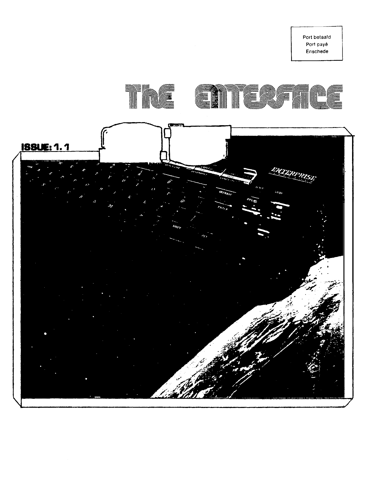
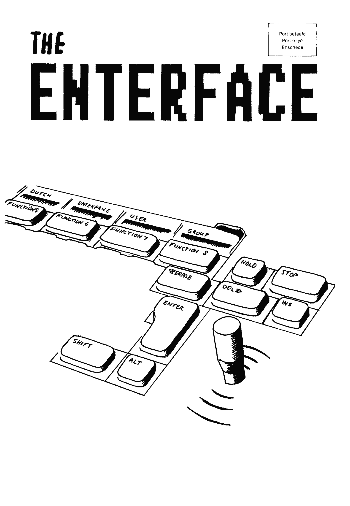
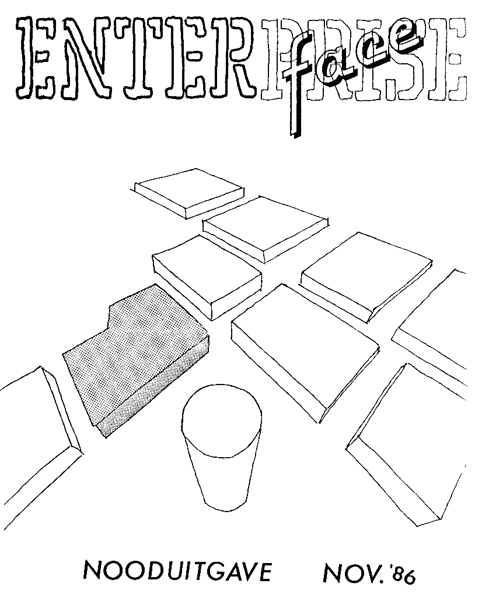
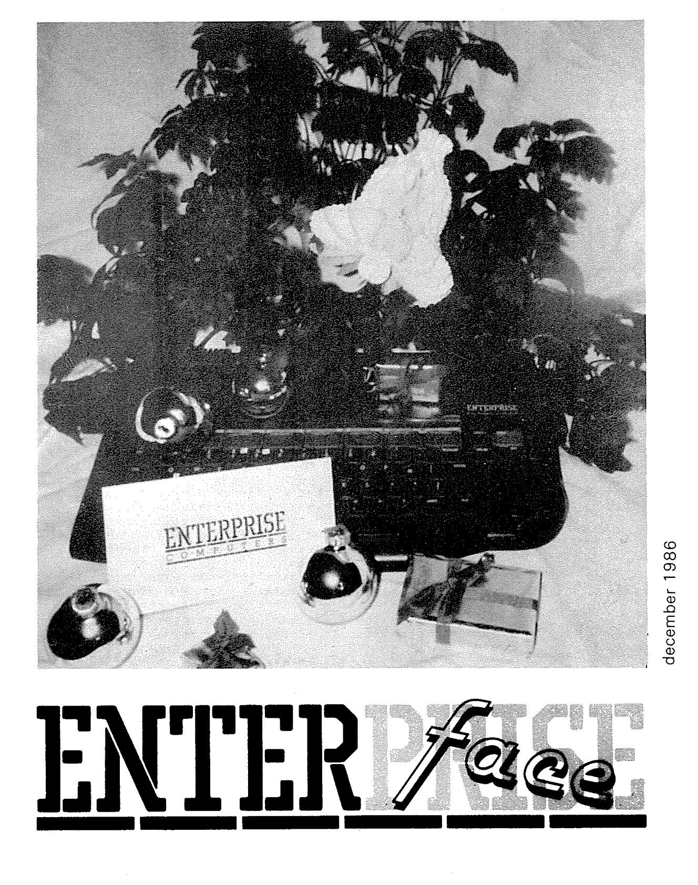

# ENTER*face*

## 1985

 

[ef-85-09](magz/enterface-nl/ef-85-09.md)

## 1986

  

    
    
<a href="magz/enterface-nl/ef-86-05.html">Травень</a>

  

  

    
    
<a href="magz/enterface-nl/ef-86-09.html">Вересень</a>

  

  

    
    
<a href="magz/enterface-nl/ef-86-11-nooduitgave.html">Листопад (екстрений випуск)</a>

  

  

    
    
<a href="magz/enterface-nl/ef-86-12.html">Грудень</a>

  

## 1987

[ef-87-02-03](magz/enterface-nl/ef-87-02-03.md)

[ef-87-04-jaarvergadering](magz/enterface-nl/ef-87-04-jaarvergadering.md)

[ef-87-04-05](magz/enterface-nl/ef-87-04-05.md)

[ef-87-06-07](magz/enterface-nl/ef-87-06-07.md)

[ef-87-10-11](magz/enterface-nl/ef-87-10-11.md)

[ef-87-12-01](magz/enterface-nl/ef-87-12-01.md)

## 1988

[ef-88-02-03](magz/enterface-nl/ef-88-02-03.md)

[ef-88-04-05](magz/enterface-nl/ef-88-04-05.md)

[ef-88-06-07](magz/enterface-nl/ef-88-06-07.md)

[ef-88-09-11](magz/enterface-nl/ef-88-09-11.md)

## 1989

[ef-89-01-02](magz/enterface-nl/ef-89-01-02.md)

[ef-89-05-06](magz/enterface-nl/ef-89-05-06.md)

