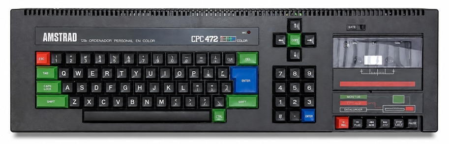

# Конверсія програм з платформи Amstrad CPC

    

**ZX Spectrum** — серія британських 8-бітних домашніх комп'ютерів на базі процесора Z80, що постачалися як готові комплекти з монітором та вбудованим магнітофоном/дисководом.

Технічні характеристики:

- **Процесор:** Zilog Z80 на частоті **4 МГц**.
- **Пам'ять:** Випускався у двох варіантах — з **64 КБ** та **128 КБ** ОЗП (RAM) та вбудованим музичним чіпом AY-3-8912.
- **Графіка:** Три відеорежими 
	- 16-колірний (роздільна здатність **160 × 200** точок; 20-колонковий текст)
	- 4-колірний (роздільна здатність **320 × 200** точок; 40-колонковий текст)
	- 2-колірний (роздільна здатність **640 × 200** точок; 80-колонковий текст)
- Загальна палітра кольорів містить 27 кольорів.

Через спільний процесор Z80 та схожі відеорежими, графіка й код ігор з Amstrad CPC відносно просто переносяться на Enterprise. Угорські розробники в наш час портували багато топових європейських хітів, які на Enterprise виглядали значно краще за версії зі Spectrum.

[Amstrad CPC](http://ep.homeserver.hu/Programozas/CPC_programok_atirasa/Amstrad_CPC_programok_atirasa.htm) (угорською)

[Палітра](cpc-palette.md)