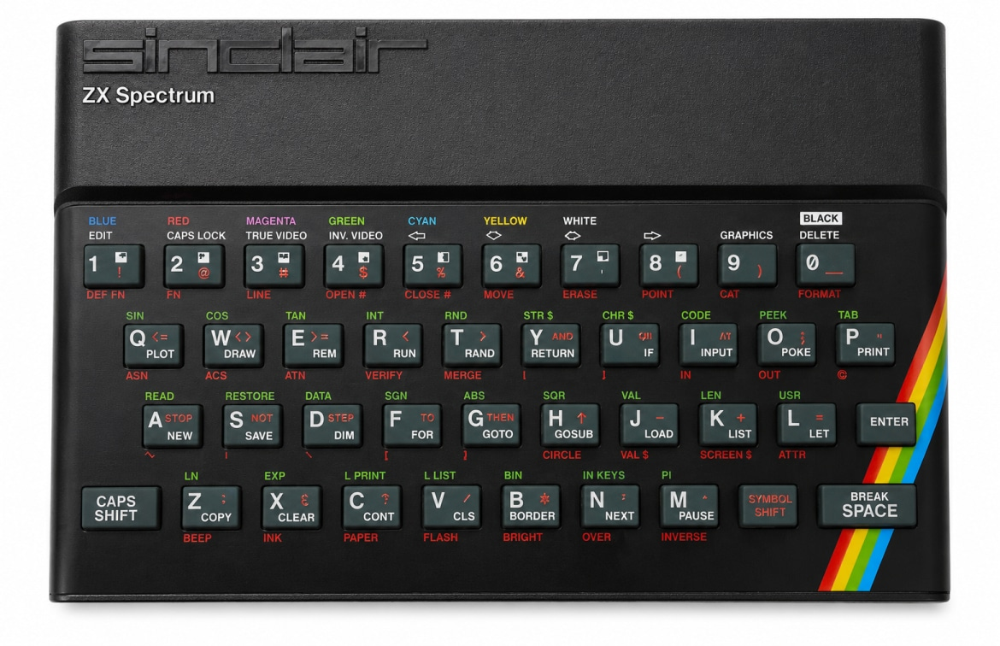

# Конверсія програм з платформи ZX Spectrum

    

**ZX Spectrum** — 8-бітний домашній комп'ютер на базі процесора Z80, випущений у 1982 році. Завдяки низькій ціні він став шалено популярним у Європі, породивши величезну бібліотеку ігор та програм.

Коли на угорському ринку з'явився технічно досконаліший Enterprise, Spectrum усе ще утримував лідерство за кількістю ігор. Оскільки обидві машини працювали на процесорі Z80 та завдяки гнучкості апаратного наповнення , угорські ентузіасти створили багато портів ігор із ZX Spectrum на Enterprise. Це не лише врятувало Enterprise від дефіциту софту, а й назавжди пов'язало історію та спадщину цих двох платформ.

Технічні характеристики:

- **Процесор:** Zilog Z80A на частоті **3,5 МГц**.
- **Пам'ять:** Випускався у двох варіантах — з **16 КБ** або **48 КБ** ОЗП (RAM). Пізніше з'явилися офіційні моделі з **128 КБ** та вбудованим музичним чіпом AY-3-8912.
- **Графіка:** Роздільна здатність **256 x 192** точок. Палітра складалася з 8 кольорів (кожен мав звичайну та підвищену яскравість, що давало 15 відтінків, оскільки чорний в обох режимах однаковий).
  
- **«Атрибутний конфлікт»:** Головне технічне обмеження графіки. Колір задавався не для кожного пікселя окремо, а для значень кольору «паперу» та «чорнила» в межах квадратного знакомісця **8x8 пікселів**. Коли рухомий спрайт одного кольору накладався на фон іншого кольору, виникало характерне змішування або різка зміна кольорів — візитна картка ігор для Spectrum.

[Портування зі Спектруму](https://ep128.hu/Ep_Konyv/Sp-Ep_konvertalas.htm) (угорською) - цикл статей з угорського журналу Spectrum Világ з доповненнями від [ZozoSoft](../../peoples/community/zozosoft.md) та [IstvanV](../../peoples/community/istvanv.md).

[Converting Spectrum programs to run on the Enterprise](http://enterprise.iko.hu/technical/Converting_Spectrum_programs.pdf) (офіційна інструкція)

[Палітра](zx-palette.md)