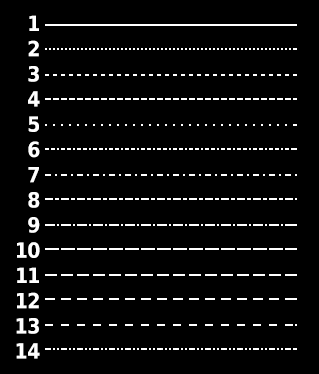

# Опис бібліотеки
HiSoft Pascal не містить жодних графічних інструкцій, і, на відміну від версії Spectrum, для версії Enterprise офіційно не було створено жодної зовнішньої колекції підпрограм. Цей недолік був заповнений колекцією графічних підпрограм PoviSoft, яка містить усі графічні функції, що підтримуються EXOS (і деякі додаткові, складніші функції).
Ви можете додати бібліотеку у вашу програму за допомогою директиви **F** (див. [Додаток B](../hisoft-pascal_man-en/man_s3-2-compile-options.md#Option%20F)), але оскільки вона використовує процедуру SETVAR, ви також повинні спочатку завантажити бібліотеку [OS.HPU](os.hpu.md):

```
{$F OS.HPU }
{$F GRAFCS.HPU }
```

На випадок, якщо ви не будете використовувати у своїй програмі інші процедури з [OS.HPU](os.hpu.md), підготовлено версію **GRAFCSX.HPU**, яка відрізняється лише тим, що містить процедуру **SETVAR**. Отже, якщо ви використовуєте **GRAFCSX.HPU**, вам не потрібно (і не можна) завантажувати [OS.HPU](os.hpu.md).
Колекція підпрограм містить наступні процедури (всі параметри в процедурах мають тип [INTEGER](../hisoft-pascal_man-en/man_s1-3-uns-number.md), тому ми не будемо їх тут згадувати!):

# GRAFON(CH,MODE,COLOR,XSIZE,YSIZE)
Створити сторінку відео з номером каналу **CH** з відеорежимом **MODE**, кольоровим режимом **COLOR**, розмірами **XSIZE** та **YSIZE** (розміри у знакомісцях текстового режиму 40).

# GRAFOFF(CH)
Закрити попередньо відкритий канал **CH**. Може використовуватися для закриття будь-якого каналу. Не забудьте закрити усі відкриті відеосторінки перед завершенням програми!

# DISPLAY(CH,AT,FROM,TO)
Відобразити створену сторінку відео з номером каналу **CH**. Параметр **AT** - це позиція, де буде розміщено верхній рядок сегмента. Параметри **FROM** і **TO** є символьними рядками сторінки, яка має відображатися, і визначають верхній і нижній рядки сегмента.

# GOXY(CH,X,Y)
Поставити текстовий курсор на відеосторінці **CH** по координатах **X** (колонка) та **Y** (рядок). Не впливає на розміщення графічного променя.

# CLEAR(CH)
Очищення відеосторінки **CH**.

# MODE40
Відкриває текстову відеосторінку за замовчуванням (номер каналу 120), яка використовується HiSoft Pascal у режимі **40** символів.

# MODE80
Відкриває текстову відеосторінку за замовчуванням (номер каналу 120), яка використовується HiSoft Pascal у режимі **80** символів.

# CHARACTER(N,R1,R2,R3,R4,R5,R6,R7,R8,R9)
Призначити форму символу з номером **N** (ASCII). Кожен параметр відповідає рядку, рухаючись зверху вниз.

# PLOT(CH,X,Y)
Перемістити промінь малювання на графічній відеосторінці з номером каналу **CH** в положення **X**, **Y**. Якщо промінь малювання увімкнений, то буде проведена лінія від попередньої позиції променя.

# PLOTREL(CH,X,Y)
Перемістити промінь малювання на графічній відеосторінці з номером каналу **CH** з поточної позиції на відстань **X**, **Y**. Тобто **X** і **Y** є відносними координатами, тому вони також можуть набувати від’ємних значень. Якщо промінь малювання увімкнений, то буде проведена лінія від попередньої позиції променя.

# BEAMON(CH)
Увімкнути промінь малювання на відеосторінці з номером каналу **CH**.

# BEAMOFF(CH)
Вимкнути промінь малювання на відеосторінці з номером каналу **CH**.

# FILL(CH)
Заповнити закритий контур фігури поточним кольором чорнила, починаючи з поточної позиції променя відеосторінки з номером каналу **CH**.

# MOVETO(CH,X,Y)
Перемістити промінь малювання в положення **X**, **Y** без малювання лінії на відеосторінці **CH**.

# MOVEREL(CH,X,Y)
Перемістити промінь малювання на відстань **X**, **Y** без малювання лінії на відеосторінці **CH**. **X** і **Y** є відносними координатами, тому вони також можуть набувати від’ємних значень.

# DRAW(CH,X1,Y1,X2,Y2)
Намалювати лінію між точками з координатами **X1**,**Y1** і **X2**,**Y2** на відеосторінці з номером каналу **CH**.

# BOX(CH,X1,Y1,X2,Y2)
Намалювати прямокутник на відеосторінці з номером каналу **CH**. Два протилежні кути прямокутника є точками з координатами **X1**,**Y1** і **X2**,**Y2**.

# ELLIPSE(CH,X,Y)
Намалювати еліпс на відеосторінці з номером каналу **CH** із центром у поточній позиції променя малювання. **X** — горизонтальний радіус еліпса, **Y** — вертикальний радіус. Якщо **X** і **Y** рівні, буде намальоване коло. Якщо ви не хочете, щоб точка в центрі еліпса була видимою, вимкніть промінь малювання перед вибором центральної точки.

# PALETTE(CH,C0,C1,C2,C3,C4,C5,C6,C7)
Встановити палітру кольорів для відеосторінки з номером каналу **CH**. Значення **C0**-**C7** повинні бути вказані навіть у графічних режимах з двома та чотирма кольорами.

# INK(CH,COLOR)
Встановити колір чорнила на відеосторінці з номером каналу **CH** на номер кольору **COLOR** у палітрі кольорів.

# PAPER(CH,COLOR)
Встановити колір паперу на відеосторінці з номером каналу **CH** на номер кольору **COLOR** у палітрі кольорів.

# LINESTYLE(CH,MODE)
Вибрати стиль лінії на відеосторінці з номером каналу **CH** в залежності від значення параметра **MODE** (**1**-**14**).



# LINEMODE(CH,MODE)
Визначити взаємодію кольорів між старими та новими лініями екрана на відеосторінці з номером каналу **CH**. У режимі **0** (за замовчуванням) кольори нових рядків перезаписують старі, тоді як в інших режимах кольори поєднуються наступним чином:  

- **1**: або (OR)  
- **2**: і (AND)  
- **3**: виключний або (XOR).

# VSYNCWAIT(N)
NICK дозволяє вам чекати в залежності від тактового сигналу. Оскільки він не залежить від тактової частоти процесора, він призупиняє виконання програми на однаковий час на турбо/нетурбо машинах. Якщо код, що виконується між викликами або обробкою переривань EXOS, є повільним, переривання можуть бути втрачені, і в цьому випадку час очікування може дещо залежати від тактової частоти процесора. **N** - 8-бітний параметр, **0** відповідає **256** (найдовше очікування).