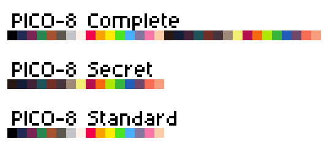

# Підбір палітри

Стандартна палітра Pico-8 містить 16 кольорів, але додатково є ще 16 "секретних" кольорів.



Кількість стандартних кольорів (якими зазвичай користуються) якраз така сама як і в Ентерпрайза. Але через специфіку 16-колірного режиму графіки ідеально підібрати кольори не так вже і просто.

Таблиця найбільш наближених кольорів:

|         №         |     RGB-код     |                          Колір<br>Pico-8                          |                            Колір<br>EP                            |       RGB       | Номер палітри |
|:-----------------:|:---------------:|:-----------------------------------------------------------------:|:-----------------------------------------------------------------:|:---------------:|:-------------:|
|         0         |    (2, 4, 8)    |  |  |    (0, 0, 0)    |       0       |
|         1         |  (29, 43, 83)   |  |  |  (36, 36, 85)   |      224      |
|         2         |  (126, 37, 83)  |  |  |  (109, 36, 85)  |      232      |
|         3         |  (0, 135, 81)   |  |  |  (0, 146, 85)   |      34       |
|         4         |  (171, 82, 54)  |  |  |  (146, 73, 0)   |      17       |
|         5         |  (95, 87, 79)   |  |  |  (73, 73, 85)   |      56       |
|         6         | (194, 195, 199) |  |  | (182, 182, 170) |      199      |
|         7         | (255, 241, 232) |  |  | (255, 255, 255) |      255      |
|         8         |  (255, 0, 77)   |  |  |  (255, 0, 85)   |      105      |
|         9         |  (255, 163, 0)  |  |  |  (255, 146, 0)  |      75       |
|        10         | (255, 236, 39)  |  |  |  (255, 219, 0)  |      91       |
|        11         |  (0, 228, 54)   |  |  |  (0, 219, 85)   |      50       |
|        12         | (41, 173, 255)  |  |  | (36, 182, 255)  |      230      |
|        13         | (131, 118, 156) |  |  | (146, 146, 170) |       7       |
|        14         | (255, 119, 168) |  |  | (255, 109, 170) |      221      |
|        15         | (255, 204, 170) |  |  | (255, 219, 170) |      95       |
|                   |                 |                                                                   |                                                                   |                 |               |
| 0<sup>+128</sup>  |  (40, 24, 20)   |  |  |   (36, 00, 0)   |      64       |
| 1<sup>+128</sup>  |  (19, 29, 54)   |  |  |   (0, 0, 85)    |      32       |
| 2<sup>+128</sup>  |  (64, 33, 54)   |  |  |  (73, 36, 85)   |      168      |
| 3<sup>+128</sup>  |  (31, 83, 90)   |  |  |  (36, 73, 85)   |      112      |
| 4<sup>+128</sup>  |  (112, 46, 39)  |  |  |  (109, 36, 0)   |      200      |
| 5<sup>+128</sup>  |  (71, 51, 59)   |  |  |   (73, 36, 0)   |      136      |
| 6<sup>+128</sup>  | (160, 136, 120) |  |  | (146, 109, 85)  |      177      |
| 7<sup>+128</sup>  | (242, 239, 117) |  |  | (255, 255, 85)  |      251      |
| 8<sup>+128</sup>  |  (182, 13, 79)  |  |  |  (182, 0, 85)   |      97       |
| 9<sup>+128</sup>  | (246, 106, 15)  |  |  |  (255, 109, 0)  |      217      |
| 10<sup>+128</sup> |  (174, 231, 1)  |  |  |  (182, 219, 0)  |      83       |
| 11<sup>+128</sup> |  (56, 181, 59)  |  |  |  (73, 182, 85)  |      170      |
| 12<sup>+128</sup> |  (34, 91, 184)  |  |  |  (36, 73, 170)  |      84       |
| 13<sup>+128</sup> | (114, 70, 102)  |  |  |  (109, 73, 85)  |      120      |
| 14<sup>+128</sup> | (246, 109, 85)  |  |  | (255, 109, 85)  |      249      |
| 15<sup>+128</sup> | (248, 156, 126) |  |  | (255, 146, 85)  |      107      |


Через те що друга половина кольорів палітри вибирається через BIAS, то деякі кольори будуть відрізнятись значно сильніше. Ось для прикладу палітра яку можна взяти для початку.

|  №  |     RGB-код     |                          Колір<br>Pico-8                          |                            Колір<br>EP                            |       RGB       | Номер палітри<br>(глобальний) | Номер палітри<br>(локальний) |
|:---:|:---------------:|:-----------------------------------------------------------------:|:-----------------------------------------------------------------:|:---------------:|:-----------------------------:|:----------------------------:|
|  0  |    (2, 4, 8)    |  |  |    (0, 0, 0)    |               0               |              0               |
|  1  |  (29, 43, 83)   |  |  |  (36, 36, 85)   |              224              |              1               |
|  2  |  (126, 37, 83)  |  |  |  (109, 36, 85)  |              232              |              2               |
|  3  |  (0, 135, 81)   |  |  |  (109, 219, 0)  |         90 (BIAS 88)          |              10              |
|  4  |  (171, 82, 54)  |  |  |  (146, 73, 0)   |              17               |              3               |
|  5  |  (95, 87, 79)   |  |  |  (109, 73, 0)   |         88 (BIAS 88)          |              8               |
|  6  | (194, 195, 199) |  |  | (182, 182, 170) |              199              |              4               |
|  7  | (255, 241, 232) |  |  | (255, 255, 255) |              255              |              7               |
|  8  |  (255, 0, 77)   |  |  |  (255, 73, 0)   |         89 (BIAS 88)          |              9               |
|  9  |  (255, 163, 0)  |  |  |  (255, 146, 0)  |              75               |              5               |
| 10  | (255, 236, 39)  |  |  |  (255, 219, 0)  |         91 (BIAS 88)          |              11              |
| 11  |  (0, 228, 54)   |  |  | (109, 219, 170) |         94 (BIAS 88)          |              14              |
| 12  | (41, 173, 255)  |  |  | (36, 182, 255)  |              230              |              6               |
| 13  | (131, 118, 156) |  |  | (109, 73, 170)  |         92 (BIAS 88)          |              12              |
| 14  | (255, 119, 168) |  |  | (255, 73, 170)  |         93 (BIAS 88)          |              13              |
| 15  | (255, 204, 170) |  |  | (255, 219, 170) |         95 (BIAS 88)          |              15              |

```
Palette: 0,224,232,17,199,75,230,255
BIAS: 88
```

Але якщо у грі Pico-8 деякі кольори не використовуються, то можна підібрати BIAS у який попадуть найменш важливі кольори. А важливі розмістити у місцях 0-7.