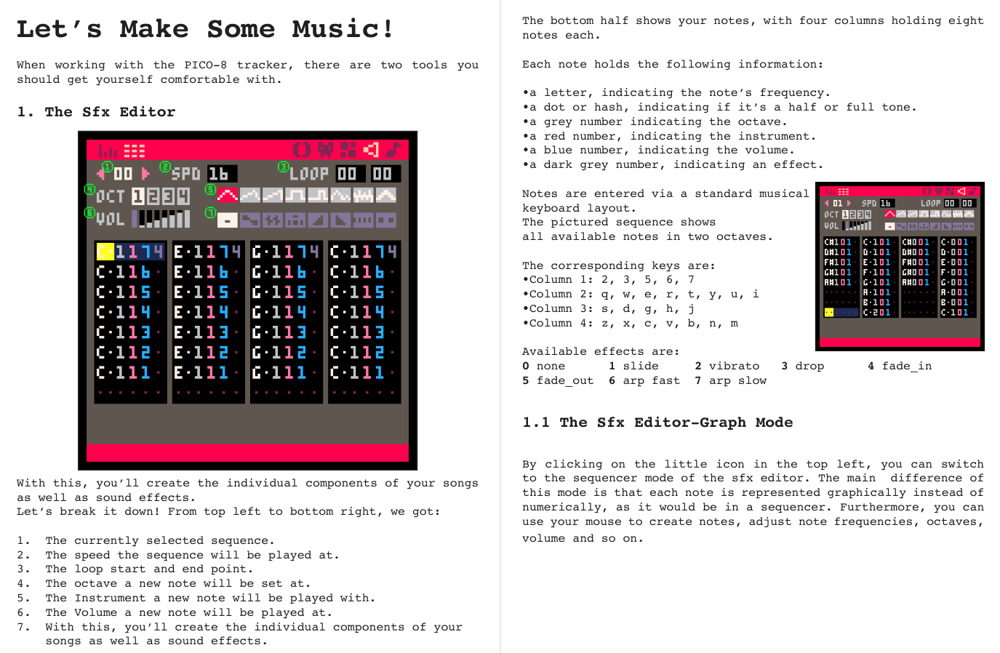
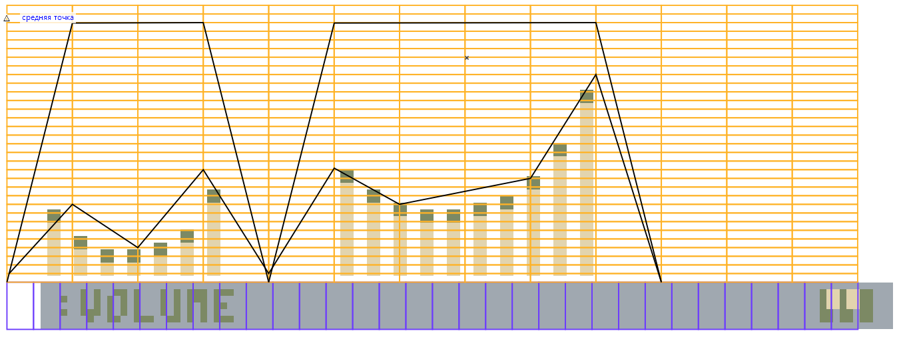
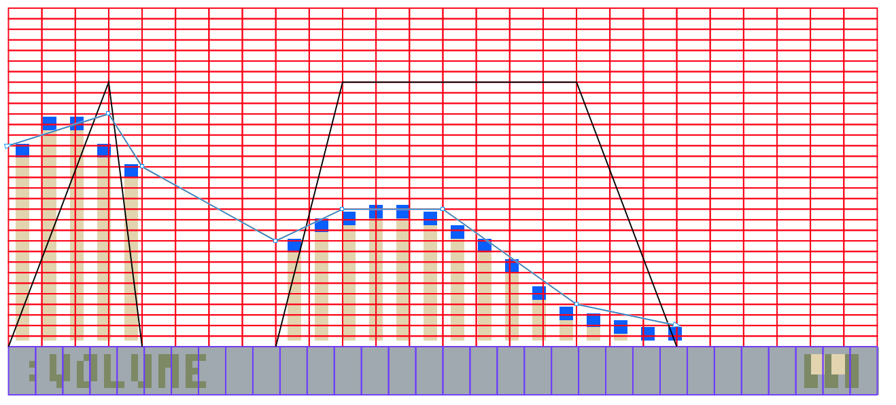

# "Конвертація" звуків з Pico-8

Чесно кажучи, конвертацію це важко назвати - скоріше, створення звуків дещо схожих на оригінал. 

Наведу сторінки з журналу **Pico-8 Zine №1** де розписаний інтерфейс трекеру:



Довжина звучання кожної ноти залежить від швидкості звуку (**SPD**):  
**1**: 8.31 мс  
**2**: 16.59 мс  
...  
і т.д.

Мінімальна довжина звучання ноти у Ентерпрайза становить 20 мс. Тому можна звуки зробити або повільнішими, щоб програвалась кожна нота, або для зберігання загальної довжини звуку можна використати наближений метод. Я користувався наступним: на скріншот з трекеру (де у вигляді графіку показана висота тону) накладав сітки різної роздільності. Для звуків 2-ї швидкості використовував сітку з 26 горизонтальними клітинками, а для 1-ї - з 13 клітинками. Потім прикидував яка мінімальна кількість фаз мені потрібна (крім зміни висоти звуку треба додатково зважати на зміну гучності)

 

Після чого кожна фаза огинаючої записав у тестову бейсік програму типу такої:

```
1 CLOSE #103
5 SET SOUND BUFFER 60
6 OPEN #103:"sound:"
7 set key click off

10 ENVELOPE NUMBER 10;2,63,63,1;6,0,0,1;9,0,0,1
20 ENVELOPE NUMBER 1;0,63,63,1;5,0,0,4;3,0,0,1
30 ENVELOPE NUMBER 2;0,63,63,1;6,0,0,1
40 ENVELOPE NUMBER 3;-4,63,63,1;-2,0,0,1;9,0,0,2;26,0,0,2
50 ENVELOPE NUMBER 4;10,63,63,1;-6,0,0,1;9,0,0,1;-13,-63,-63,1;16,63,63,1;-5,0,0,1;4,0,0,2;13,0,0,1;-28,-63,-63,1
60 ENVELOPE NUMBER 5;0,63,63,1;RELEASE;-20,-33,-33,40
70 ENVELOPE NUMBER 6;6,63,63,2;0,-63,-63,1;-1,0,0,4;2,63,63,2;0,-63,-63,1;1,0,0,5;3,63,63,2;0,-63,-63,1;1,0,0,5;4,63,63,2;0,-63,-63,1
80 ENVELOPE NUMBER 7;4,63,63,3;-7,-63,-63,1;-11,0,0,4;5,63,63,2;0,0,0,3;-15,0,0,4;-3,-63,-63,3
90 ENVELOPE NUMBER 8;0,63,63,6;0,0,0,6;0,-63,-63,8

93 DO
94   DO
95     A$=INKEY$
96   LOOP UNTIL A$<>""
97   SELECT CASE A$
98   CASE "@"
100     SOUND PITCH 8,LEFT 255,RIGHT 255,DURATION 3,ENVELOPE 10
105   CASE "1"
110     SOUND PITCH 7,LEFT 255,RIGHT 255,DURATION 6,ENVELOPE 1
115   CASE "2"
130     SOUND PITCH 12,LEFT 255,RIGHT 255,DURATION 2,ENVELOPE 2
135   CASE "3"
140     SOUND PITCH 16,LEFT 255,RIGHT 255,DURATION 6,ENVELOPE 3
145   CASE "4"
150     SOUND PITCH 5,LEFT 255,RIGHT 255,DURATION 18,ENVELOPE 4
155   CASE "5"
160     SOUND PITCH 50,LEFT 255,RIGHT 255,DURATION 30,ENVELOPE 5,STYLE 48
165   CASE "6"
170     SOUND PITCH 10,LEFT 255,RIGHT 255,DURATION 26,ENVELOPE 6
175   CASE "7"
180     SOUND PITCH 34,LEFT 255,RIGHT 255,DURATION 20,ENVELOPE 7
185   CASE "8"
190     SOUND PITCH 5,LEFT 20,RIGHT 20,DURATION 20,ENVELOPE 8,SOURCE 3
191   CASE "9"
195     SOUND PITCH 38,LEFT 114,RIGHT 114,DURATION 2 !9
200   END SELECT
210 LOOP
```

І коли готові звучання влаштовують, можна їх перенести у код програми, або зберегти огинаючі у окремий файл у вигляді esc-послідовностей. А потім завантаживши при старті програми використовувати їх стандартним шляхом (використовуючи процедуру [Sound](sound.hpu.md)).

Зберегти огинаючі у файл FILENAME.ENV можна наступною програмою на бейсіку:
```
5 OPEN #1:"FILENAME.ENV" ACCESS OUTPUT

10 ENVELOPE #1:NUMBER 10;2,63,63,1;6,0,0,1;9,0,0,1
20 ENVELOPE #1:NUMBER 1;0,63,63,1;5,0,0,4;3,0,0,1
30 ENVELOPE #1:NUMBER 2;0,63,63,1;6,0,0,1
40 ENVELOPE #1:NUMBER 3;-4,63,63,1;-2,0,0,1;9,0,0,2;26,0,0,2
50 ENVELOPE #1:NUMBER 4;10,63,63,1;-6,0,0,1;9,0,0,1;-13,-63,-63,1;16,63,63,1;-5,0,0,1;4,0,0,2;13,0,0,1;-28,-63,-63,1
60 ENVELOPE #1:NUMBER 5;0,63,63,1;RELEASE;-20,-33,-33,40
70 ENVELOPE #1:NUMBER 6;6,63,63,2;0,-63,-63,1;-1,0,0,4;2,63,63,2;0,-63,-63,1;1,0,0,5;3,63,63,2;0,-63,-63,1;1,0,0,5;4,63,63,2;0,-63,-63,1
80 ENVELOPE #1:NUMBER 7;4,63,63,3;-7,-63,-63,1;-11,0,0,4;5,63,63,2;0,0,0,3;-15,0,0,4;-3,-63,-63,3
90 ENVELOPE #1:NUMBER 8;0,63,63,6;0,0,0,6;0,-63,-63,8

100 CLOSE #1
```

Процедура завантаження огинаючих у вигляді esc-послідовностей з файлу у аудіобуфер:
```
SetVar(15,255);                       {збільшуємо розмір аудіобуферу (при потребі)}
SoundInit;                            {ініціалізація звуку (відкриваємо аудіоканал #103)}
tin('MOLEMOLE.ENV', addr(compmap));   {завантаження файлу у пам'ять (тимчасово можна використати масив змінних необхідного розміру)}
ra:=chr(103);                         {заносимо номер звукового каналу у RA}
rde:=addr(compmap);                   {заносимо адресу початку даних у RDE}
rbc:=309;                             {заносимо кількість аудіоданих (розмір файлу) у RBC}
Exos(8);                              {виконуємо функцію EXOS 8 (записати дані у канал)}
```


# Таблиця орієнтовної відповідності нот до висоти звуку

| нота  | позначення | Pitch<br>(октава 0) | Pitch<br>(октава 1) | Pitch<br>(октава 2) | Pitch<br>(октава 3) |
|:-----:|:----------:|:-------------------:|:-------------------:|:-------------------:|:-------------------:|
|  ДО   |   **C**    |          7          |         19          |         31          |         43          |
|  ДО#  |   **C#**   |          8          |         20          |         32          |         44          |
|  РЕ   |   **D**    |          9          |         21          |         33          |         45          |
|  РЕ#  |   **D#**   |         10          |         22          |         34          |         46          |
|  МІ   |   **E**    |         11          |         23          |         35          |         47          |
|  ФА   |   **F**    |         12          |         24          |         36          |         48          |
|  ФА#  |   **F#**   |         13          |         25          |         37          |         49          |
| СОЛЬ  |   **G**    |         14          |         26          |         38          |         50          |
| СОЛЬ# |   **G#**   |         15          |         27          |         39          |         51          |
|  ЛЯ   |   **A**    |         16          |         28          |         40          |         52          |
|  ЛЯ#  |   **A#**   |         17          |         29          |         41          |         53          |
|  СІ   |   **B**    |         18          |         30          |         42          |         54          |
