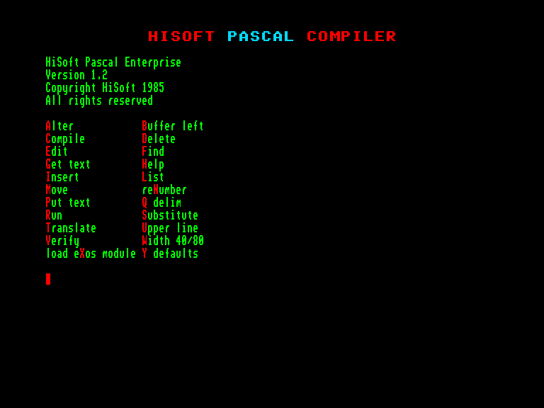

# HiSoft Pascal

 

Розробник: [HiSoft](../companies/hisoft-systems.md)

----

[HiSoft Pascal Manual](../manuals/pr-hisoft-pascal-manual-en.md) (EN)  
[Hisoft Pascal Felhasználói kézikönyv](http://ep128.hu/Ep_Util/Hisoft_Pascal.htm) (HU)  

 - [список констант, типів, змінних, процедур та функцій](hisoft-pascal/hpascal-identifiers.md)
 - [опції компілятора](../manuals/hisoft-pascal-man-en/man_s3-2-compile-options.md)
 - [список помилок](../manuals/hisoft-pascal-man-en/man_a1-errors.md)

[Особливості компілятора](hisoft-pascal/tips-particulars.md)  

[Enterprise Wiki](https://wiki.enterpriseforever.com/index.php?title=HiSoft_Pascal) (HU) Сторінка на Enterprise Wiki

### Додаткові бібліотеки
[GRAPH16](hisoft-pascal/hpu/graph16.hpu.md) – 16-колірний графічний режим, робота із спрайтами та мишою.  
- [GRAPH16-PICO8 mod](hisoft-pascal/hpu/snpico.hpu.md) - модифікація бібліотеки для простішого адаптування ігор з Pico-8   

[GRAFCS / TEXTVID](hisoft-pascal/hpu/grafcs-textvid.hpu.md) – робота з графічними та текстовими відеосторінками використовуючи функції EXOS.  
[LPTUNIT](hisoft-pascal/hpu/lptunit.hpu.md) – робота з відеоекранами.  
[SOUND](hisoft-pascal/hpu/sound.hpu.md) – робота із звуком.  
[OS](hisoft-pascal/hpu/os.hpu.md) – додаткові функції EXOS.  

## Статті у періодичних виданнях

[Hisoft Pascal. Parts 1-2](../press/magz/enterpress-hu/2017-03-06/enterpress_2017-n2-3-hisoft-pascal_en.md) (EN)  
[Hisoft Pascal. Parts 1-2](http://enterprise.iko.hu/magazines/Enterpress_2017_per_2-3.pdf#page=10) (HU)  
Стаття опублікована у журналі **Enterpress 2017 №2-3** розповідає про нововведення у Hisoft Pascal версії 1.2, роботу з клавіатурою та джойстиком і вставками машинного коду.

[Hisoft Pascal. Part 3](../press/magz/enterpress-hu/2017-07-08/enterpress_2017-n4-hisoft-pascal_en.md) (EN)  
[Hisoft Pascal. Part 3](http://enterprise.iko.hu/magazines/Enterpress_2017_per_4.pdf#page=11) (HU)  
Стаття опублікована у журналі **Enterpress 2017 №4** розповідає про відеосторінки та графічні процедури.

[File management in Pascal](../press/magz/enterpress-hu/2017-09-12/enterpress_2017-n5-6-file-mngmnt_en.md) (EN)  
[File kezelés a Pascal-ban](http://enterprise.iko.hu/magazines/Enterpress_2017_per_5-6.pdf#page=8) (HU)  
Стаття опублікована у журналі **Enterpress 2017 №5-6** розповідає про роботу з файлами.

[Implementing string management functions](../press/magz/enterpress-hu/2017-09-12/enterpress_2017-n5-6-strings_en.md) (EN)  
[Sztringkezelő függvények megvalósítása](http://enterprise.iko.hu/magazines/Enterpress_2017_per_5-6.pdf#page=9) (HU)  
Стаття опублікована у журналі **Enterpress 2017 №5-6** розповідає про процедури для роботи з стрінгами.

[The mysteries of HiSoft Pascal](../press/magz/enterpress-hu/2018-01-04/enterpress%202018-n1-2-hisoft-pascal-myst_en.md) (EN)  
[A HiSoft Pascal rejtelmei](http://enterprise.iko.hu/magazines/Enterpress_2018_per_1.pdf#page=10) (HU)  
Стаття опублікована у журналі **Enterpress 2018 №1-2** розповідає про тонкощі оптимізації додавання та множення чисел.