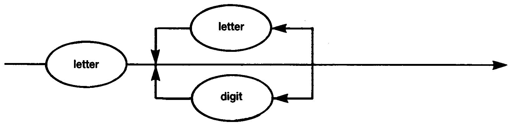

# 1.1 IDENTIFIER

Only the first **10** characters of an identifier are treated as significant.

Identifiers may contain lower or upper case letters. Lower case is not converted to uppercase so that the identifiers `HELLO`, `HELlo` and `hello` are all different. Reserved words and predefined identifiers may only be entered in upper case.
