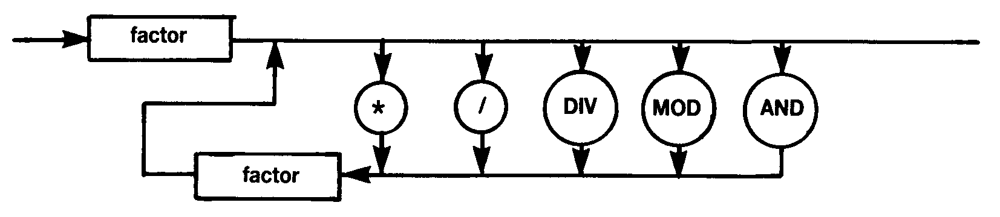

# 1.11 TERM

The lowerbound of a set is always zero and the set size is always the maximum of the base type of the set. Thus a **SET OF CHAR** always occupies **32** bytes (a possible **256** elements — one bit for each element). Similarly a `SET OF 0..10` is equivalent to `SET OF 0..255`.
