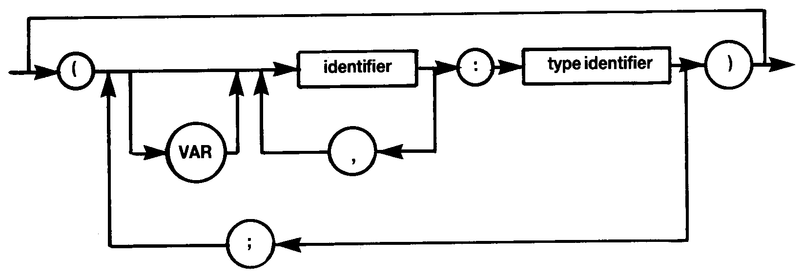

# 1.14 PARAMETER LIST

A type identifier must be used following the colon – otherwise `*ERROR* 44` will result.

Variable parameters as well as value parameters are fully supported.
Procedures and functions are not valid as parameters.
