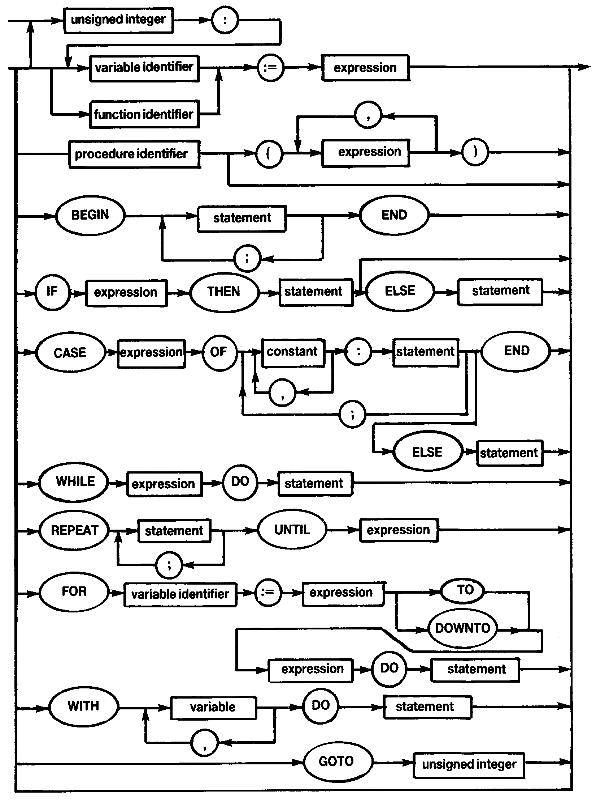

# 1.15 STATEMENT

**Assignment statements:**

See [Section 1.7](man_s1-7-type.md) for information on which assignment statements are illegal.

**CASE statements:**  

An entirely null case list is not allowed i.e. `CASE OF END`; will generate an error (`*ERROR* 13`).

The **ELSE** clause, which is an alternative to **END**, is executed if the selector ('expression' overleaf) is not found in one of the case lists ('constant' overleaf).

If the **END** terminator is used and the selector is not found then control is passed to the statement following the **END**.

**FOR statements:**

Variable parameters may not be used as **FOR** statement variables. This would be inefficient and it is certainly usual practice to use variable parameters sparingly, using local parameters instead, where possible.

**GOTO statements:**

It is only possible to **GOTO** a label which is present in the same block as the **GOTO** statement and at the same level.

You may not use **GOTO** to jump out of a **FOR** statement.

Labels must be declared (using the Reserved Word **LABEL**) in the block in which they are used; a label consists of at least one and up to four digits. When a label is used to mark a statement it must appear at the beginning of the statement and be followed by a colon — '**:**'.

