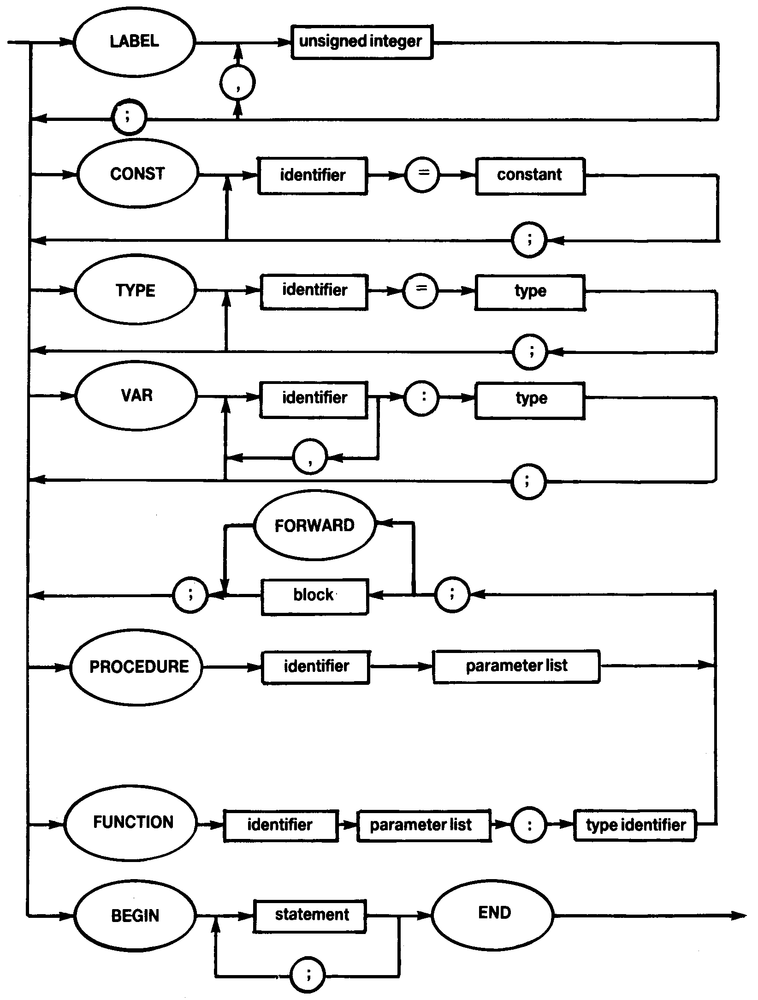

# 1.16 BLOCK



**Forward References**

As in the Pascal User Manual and Report (Section 11.C.1) procedures and functions may be referenced before they declared through use of the Reserved Word **FORWARD** e.g.

```
PROCEDURE a(y:t); FORWARD;	(* procedure a declared to be *)
PROCEDURE b(x:t);			(* forward of this statement *)
	BEGIN
	…
	a(p);					(* procedure a referenced. *)
	…
	END;
PROCEDURE a;				(* actual declaration of procedure *)
	BEGIN
	…
	b(q);
	…
	END;
```
Note that the parameters and result type of the procedure a are declared along with **FORWARD** and are not repeated in the main declaration of the procedure. Remember, **FORWARD** is a Reserved Word.
