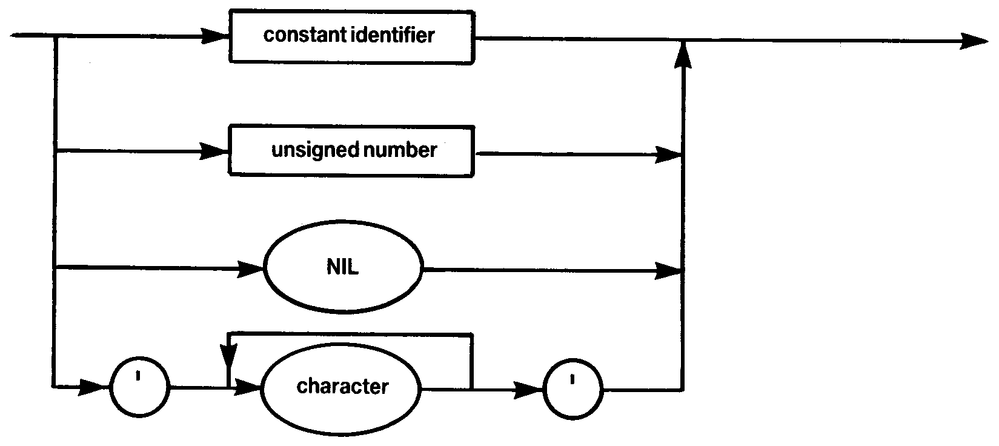

# 1.4 UNSIGNED CONSTANT

Note that strings may not contain more than **255** characters. String types are `ARRAY [1..N] OF CHAR` where **N** is an integer between **1** and **255** inclusive. Literal strings should not contain end-of-line characters (`CHR(13)`) — if they do then an '`*ERROR* 68`' is generated.

The characters available are the full expanded set of ASCII values with **256** elements. To maintain compatibility with Standard Pascal the null character is not represented as `''`; instead `CHR(0)` should be used.
