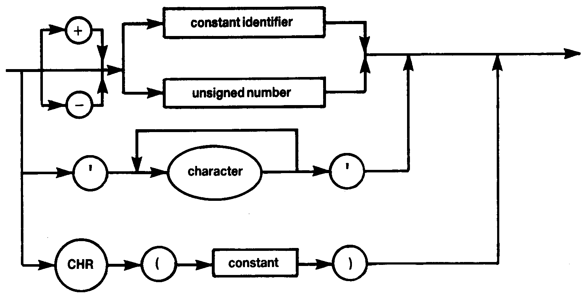

# 1.5 CONSTANT



The non-standard **CHR** construct is provided here so that constants may be used for control characters. In this case the constant in parentheses must be of type integer.

E.G.
```
CONST	bs=CHR(8);
		cr=CHR(13);
```
