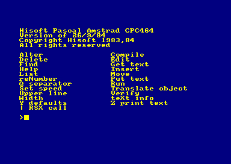
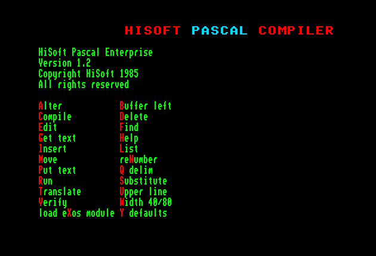

# HiSoft Pascal

Written by [Zoltán Povázsay (Povi)](../../community/povi.md)  
Published in [Enterpress 2017 \#2-3](http://enterprise.iko.hu/magazines/Enterpress_2017_per_2-3_UK.pdf#page=10)  

In the first three years of the Enterpress magazine (1990-92), a [12-part series of articles](http://www.ep128.hu/Ep_Konyv/Enterpress_Pascal.htm) featured the Pascal language from the pen of László Ujlaki. The primary target audience of the publication were Enterprise users who knew well IS-BASIC and were enough „skilled”. The speed of BASIC limits the writing of „more serious” programs, and one of the biggest shortcomings of the [ZZZIP Basic compiler](../zzzip-compiler.md) is that it does not accept floating point numbers.  

However, there are few applications on the Enterprise written in Pascal, the ones I know made with Borland Turbo Pascal, running in [IS-DOS](../../software/ss-is-dos.md) (CP/M); for example PCBPrise, an electronic PCB design program.

The other Pascal compiler available for the Enterprise is an HiSoft’s product. This program is undeniably undervalued, which is partly understandable, as the compiler only implements the standard Pascal, so its features are behind Turbo Pascal’s ones: the biggest drawback is the lack of a string type.  
However, with my current article, I would like to recommend the use of HiSoft Pascal because although the lack of string type is really annoying, the program still has advantages over Turbo Pascal. What are these?  
British HiSoft originally developed the Pascal compiler for Spectrum, but later released it on several Z80-based machines, including CPC and Enterprise. The „most advanced”, CP/M version, was the unnoticed HiSoft Pascal80. Despite its Spectrum roots, it is not a Spectrum mere transcript, but a program that maximally (and correctly) uses [EXOS](../../software/ss-exos.md) and translates the source code into a 5-header executable (Translate command).

Only with this feature, you’ve already gained one extra point against Turbo Pascal, as this means that you do not need [IS-DOS](../../software/ss-is-dos.md) or the compiler to run the compiled programs.  



However, it is also surprising that Turbo Pascal - unlike its name says - produces a slower code than HiSoft Pascal. This velocity difference is mainly apparent when calculating floating point numbers, and it is because Turbo Pascal stores the real numbers in 6-bytes while HiSoft does it in only 4 bytes.

Of course, due of the smaller size, the representation of the numbers is less accurate and the numbered range is smaller, but in my opinion, this accuracy is also quite appropriate for us (since we do not want to emulate the first second of the Big Bang) and speed is always the preferable characteristic on this type of machines.

It could have contributed to HiSoft Pascal’s unjustly unnoticed role the fact that in the past (in the '90s) there was no documentation available. Nowadays, with almost anything on the net, when Google can find anything - though I found a number of different HiSoft Pascal versions - the Enterprise version does not seem to exist. But the Enterprise specific commands have been figured out thanks to the partial disassembly of the program.

As mentioned above, the Enterprise version exploits the possibilities of [EXOS](../../software/ss-exos.md), but previously there was no way to read about the implementation of a function named [EXOS](../../manuals/hisoft-pascal-man-en/man_s2-4-6-exos.md) and the associated [pre-defined RA, RB, RBC, etc. variables](../../manuals/hisoft-pascal-man-en/man_s2-3-variables.md)! Also it was not possible to read about the procedures and functions that, although not part of standard Pascal, are available at HiSoft Pascal (eg INCH, MAKESTR, TIN, TOUT etc.). In the forthcoming article series, we will be talking about these undocumented commands, I will show you various tips and tricks that hopefully will persuade more people to use Pascal!



Although the last official version **1.1** of Hisoft Pascal is a very powerful tool, enhanced version **1.2** from [PovySoft](../../community/povi.md) contains useful modifications and improvements:

Now the system starts on an 80-character screen mode instead of only 40. Has been corrected a bug that appeared when in a program a row of numbers is followed by 13 spaces. The source code now can be also written in lowercase (for better readability). However, after the input, the commands are stored tokenized in the memory and displayed as capitalized on the program listing. It no more writes spaces after the numbers, matching Turbo Pascal. The [PAGE](../../manuals/hisoft-pascal-man-en/man_s2-4-1-page.md) procedure has been fixed: **CHR (26)** is sent to the screen and **CHR (12)** is sent to the printer. The **EXOS** calls are now converted to a procedure (see below).  
Three new functions and three new procedures have been implemented.

## New functions  
Function `Swap (x: integer): integer;` Replaces the bottom and top bytes of the argument.  
Function `Hi (x: integer): char;` Returns the top byte of the argument.  
Function `Lo (x: integer): char;` Returns the bottom byte of the argument.

## New procedures
Procedure `ClrScr;` Deletes the screen and places the cursor in the upper left corner.  
Procedure `GotoXY (x, y: integer);` Position the text cursor in the x-th column and y in the row of the screen.  
Procedure `SetVar (ExosVariable: integer; NewValue: integer);` Sets the **ExosVariable** EXOS variable to **NewValue**.

### Example
`SetVar (27, 255);` The Border color is changed to white.

## Using the EXOS procedure
With the [EXOS](../../manuals/hisoft-pascal-man-en/man_s2-4-6-exos.md) procedure - however surprising - we can do EXOS calls within Pascal. EXOS calls expect parameters on the **A**, **BC** and **DE** registers, and the results are returned in the same registers. The **A**-register will returns a **Zero** status code if the call was successful, otherwise it will return the error value status. HiSoft Pascal has already predefined the **RA**, **RB**, **RC**, **RD**, and **RE** char types, and **RBC** and **RDE** integer variables: these can be used when calling the [EXOS](../../manuals/hisoft-pascal-man-en/man_s2-4-6-exos.md) procedure.

### Example
```
program time;
begin
  exos(32);
  write('Current time is: ');
  write(ord(rc):2:H, ':');
  write(ord(rd):2:H, ':');
  write(ord(re):2:H)
end.
```

### Comment
On previous versions of HiSoft Pascal the [EXOS](../../manuals/hisoft-pascal-man-en/man_s2-4-6-exos.md) command was not a procedure, instead it was implemented as a function, the resulting value stored in **A**. Since Pascal unfortunately does not allow calling functions, the returned value was not usable somehow, so if we did not need the result, then at least one dummy variable assignment had to be made, for example: `tmp: = exos (32);`.

This has changed on version **1.2**, the [EXOS](../../manuals/hisoft-pascal-man-en/man_s2-4-6-exos.md) command has been modified. Now we don’t lose information, because the value of register **A** is automatically added to the built-in **RA** variable. Therefore, what has been implemented on the EXOS function on the new version is: Now we can Test the **RA** variable to check whether the EXOS call was successful.

## Keyboard and joystick use In HiSoft Pascal

In the previous issue I’ve shown how to call Exos Functions from within Pascal, and now let’s look at how to read the keyboard and joystick. In the second half of the article, I will show you how to use a machine tool to accelerate our prepared functions a bit. HiSoft Pascal has „stock” implemented function called “**inch**”, which can be used to read the keyboard.

`Function inch: char;`

The function does not wait for the key to be pressed: if no key is pressed, it returns zero, otherwise it returns the ASCII code of the pressed key.

### Example
```
program TestInCh;
var ch : char;
begin
  writeln('Press any key...');
  repeat
    ch := inch;
  until ch <> chr(0);
  writeln('You pressed ', ch)
end.
```

The **inch** function is an hybrid solution compared with the more standard ReadKey and KeyPressed functions from Turbo Pascal, so let’s see how those functions can be implemented!

HiSoft Pascal uses the **KEYBOARD:** device, the **105** channel is opened for it and we will use it in our functions:

```
function KeyPressed : boolean;
begin
  ra := chr(105);
  exos(9); 
  KeyPressed := rc = chr(0) 
end; 
```
```
function ReadKey : char; 
begin 
  ra := chr(105); 
  exos(5); 
  ReadKey := rb 
end;
```

Using these functions, we are able to observe the keyboard and even the built-in joystick as the main directions correspond to the following ASCII codes:

Up = chr(176),  
Down = chr(180),   
Left = chr(184),   
Right = chr(188)  

However, to read the joystick, a more elaborate method would be a function that behaves like the [JOY](../../manuals/is-basic-man-en/functions/man_fn-joy.md) function of IS-BASIC. It would be possible to read not only the main but also the diagonal directions (for example *leftup*), and the reading of the external joysticks. Fortunately, the EXOS 11 function does exactly that (too). Let’s see its implementation:

```
function ReadJoy(n: integer) : integer; 
begin 
  ra := chr(105); 
  rb := chr(9); 
  rc := chr(n); 
  exos(11); 
  ReadJoy := ord(rc); 
end;
```

Since there is no implicit type conversion between integer and char, we are forced to use the chr() and ord() functions. Of course, this is not a problem, as the char type was basically designed to store characters; It was not by accident that the later versions of Pascal introduced the 8-bit bytes and short ones of all types. Due to the lack of these latter types, we can see the above-mentioned forced solving. Another interesting thing, which is due to the shortcomings of the HiSoft compiler:  

If instead of `ra: = chr(105)` we write `ra: = 'i'` (the lowercase ASCII code 105), then the compiler produces a faster 7-clock cycles code. However, I do not recommend this solution, because it would be at the expense of readability and maintenance of the source code (not worth 1.75 μs).

The input parameter of the **ReadJoy** function is the joystick type (**0**: internal, **1**: ext1, **2**: ext2), the return value of the read direction:  
- **0** = nothing
- **1** = right
- **2** = left
- **4** = down
- **8** = up
- **16** = fire (space).

In the case of a diagonal direction, the sum of the two main directions is the result (for example **5** = right down). The function does not verify the correctness of the argument, it will read the ext2 joystick (EXOS property) for an invalid value. We can therefore see that the behavior of the function is the same as the [JOY](../../manuals/is-basic-man-en/functions/man_fn-joy.md) command of IS-BASIC.

Of course, besides the functions described above, you can also directly read the ports so that you can detect keypresses that do not provide an ASCII code (for example SHIFT, ALT, etc.) on their own. For reading and writing Z80 ports, HiSoft Pascal provides the **inp** function and the **out** procedure:  

`function inp(Port: integer) : char;`  
`procedure out(Port: integer; Value: char);`

## Using machine code in HiSoft Pascal

Unfortunately, in HiSoft Pascal there is no way to write inline assembly inserts (such as on PC Turbo Pascal), but with the INLINE command, you can place machine code routines in the source code.

In order to use the function or process parameters in the machine routine, let’s know how the translator stores them.

`procedure test(i: real; j: integer);`

In this case, the variable **j** is located at addresses **IX+2** and **IX+3**, and the variable **i** is located at addresses **IX+4**, **IX+5**, **IX+6** and **IX+7**. The reservation of parameters supplied by value depends on the size of the type (so it takes 4 bytes for our real-type i variable).

The situation is different with reference parameters: 

`procedure test(i: integer; var x: real);`

In this case, the value of **x** is not the value (which occupies 4 bytes), but only the memory address that occupies two bytes. So the address of variable **x** is given by **IX+2** and **IX+3**, and the value i is given at addresses **IX+4** and **IX+5**.

For functions, the return value will be send back to the memory address above the input parameters:

`function test(p, q: integer): real;`

Thus, in this case, the value of **q** is at **IX+2** and **IX+3**, the value of **p** is located at addresses **IX+4** and **IX+5**, and the return value of the function will be stored at **IX+6**, **IX+7**, **IX+8** and **IX+9**.

After that, let’s see how to write the **KeyPressed**, **ReadKey**, and **ReadJoy** functions as a machine-code readable routine:

`Function KeyPressed: boolean;`
`Function ReadKey: char;`

The above two functions are „simple case”: they do not have input parameters, and the type of return values of both functions is byte:

So we have to place the result at the address **IX+2**. For a boolean type implemented in Pascal, you should know that „**false**” is stored as **0**, and „**true**” is stored as **1** (unlike, for example, with C, where all non-zero values are true), You will have to pay attention to this when writing your routine.

### Let’s see the implementation

```
function KeyPressed : boolean; 
begin 
  inline(#3E,#69)     {LD A,105}; 
  inline(#F7,#09)     {EXOS 9}; 
  inline(#79)         {LD A,C}; 
  inline(#ED,#44)     {NEG}; 
  inline(#3C)         {INC A}; 
  inline(#DD,#77,#02) {LD (IX+2),A}; 
end;
```
```
function ReadKey : char; 
begin 
  inline(#3E,#69)     {LD A,105}; 
  inline(#F7,#05)     {EXOS 5}; 
  inline(#DD,#70,#02) {LD (IX+2),B}; 
end; 
```

Let’s read the ReadJoy function: 

`function ReadJoy(n: integer) : integer;`

The **n** argument of the function is obtained at addresses **IX+2** and **IX+3**, in the low-endian form (ie, the lower byte will be at the lower address, ie **IX+2**).

The result of the function should be placed on the address **IX+4** and **IX+5**, also in a small-endian form. Since the result of the EXOS 11 function call is only one byte, we need to place **0** in address **IX+5**. In the example below, let’s take advantage of the fact that the value of register **A** after the call is always **0**, so we write it to **IX+5**: 

```
function ReadJoy(n: integer) : integer; 
begin 
  inline(#3E,#69)     {LD A,105}; 
  inline(#06,#09)     {LD B,9}; 
  inline(#DD,#4E,#02) {LD C,(IX+2)}; 
  inline(#F7,#0B)     {EXOS 11}; 
  inline(#DD,#71,#04) {LD (IX+4),C}; 
  inline(#DD,#77,#05) {LD (IX+5),A}; 
end;
```

The [following sections](enterpress2017-4_en.md) of this article series, will be about the use of VIDEO: pages, graphics, and file management.