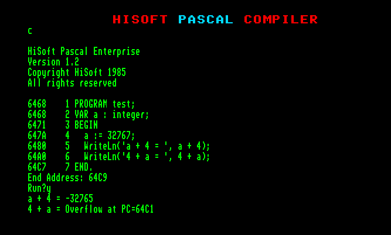
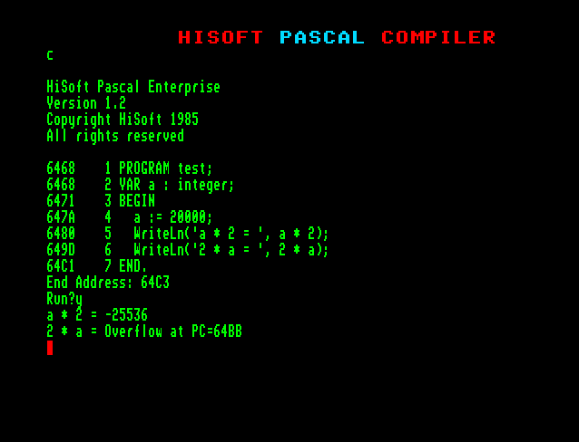

# The mysteries of HiSoft Pascal

Written by [Zoltán Povázsay (Povi)](../../community/povi.md)  
Published in [Enterpress 2018 \#1-2](http://enterprise.iko.hu/magazines/Enterpress_2018_per_1-2_UK.pdf#page=10)  

Let’s start this article with a riddle: What does the following program say? 

```
program test; 
var a : integer; 
begin 
  a := 32767; 
  WriteLn('a + 4 = ', a + 4); 
  WriteLn('4 + a = ', 4 + a); 
end.
```

The watchful reader may immediately suspect that the result of the operation will certainly not fit within the range represented by an integer: the result is greater than **2<sup>15</sup>-1**, or **32767**. The more watchful reader who has already read HiSoft Pascal’s description of the „[Compiler Options](../../manuals/hisoft-pascal-man-en/man_s3-2-compile-options.md)” which says, „*if the overflow control compile option is switched on, the program will stop with an overflow error message!*”

Let’s see what the documentation says about this: the ‚`O`’ option controls overflow handling for certain arithmetic instructions. Integer multiplication and division, and all real type operations are always checked. In the case of integer addition and subtraction, it is checked only if the option (`O+`) is switched on. The default is that this option is on. 

Based on the above, we expect the program to stop around the first **WriteLn** line with an overflow error message. What do we see instead? 



The first **WriteLn** line ran without errors, although the overflow monitoring option is on!

Still is the sum dependent of the order of the addition? Or is the compiler just beeing faulty? Let’s see what the compiler generates for the second case (4 + a):

```
ld   hl, 4        ; HL = 4 
push hl           ; HL to the stack 
ld   hl, (0xfffe) ; HL = a 
pop  de           ; DE = 4 (pop from the top of the stack) 
or   a            ; clear Carry flag 
adc  hl, de       ; HL = HL + DE + Carry 
call pe, 0x6a6    ; in case of overflow jump to 0x6a6 
```

At first glance, it might be strange why the compiler use the slower **ADC** command (15 clocks) instead of the **ADD** (11 clocks) and even have to delete the Carry flag before (plus 4 clocks) to get a good result. The explanation is that the **ADD** command does not set the overflow flag, but the **ADC** command does, and that is what we need when the overflow check is on! At an overflow event, the routine at address **0x6a6** will state the error message and the program stops. 

Of course, when the overflow control is off, the compiler will use the faster **ADD** command: 

```
ld   hl, 4        ; HL = 4 
push hl           ; HL to the stack 
ld   hl, (0xfffe) ; HL = a 
pop  de           ; DE = 4 (pop form the top of the stack) 
add  hl, de       ; HL = HL + DE 
```

But let’s go back to the first case (a + 4), which ran also when overflow control was on: 

```
ld   hl, (0xfffe) ; HL = a 
inc  hl           ; HL = HL + 1 
inc  hl           ; HL = HL + 1 
inc  hl           ; HL = HL + 1 
inc  hl           ; HL = HL + 1 
```

The compiler recognizes that four **inc hl** commands (24 clocks) are faster than putting the 4 into the **DE** register (31 clocks) and then **add** (11 clocks). The only problem is that during the high optimization it forgets that the overflow detection option is on. The compiler always generates the above code, regardless of the value of the „`O`” option.

Based on these, this is an error in the compiler, so it’s good to know about it. If the overflow test is important for us (it is switched on) and one part of the addition is constant **1**, **2**, **3** or **4**, place it to the left side! In case the overflow check is off, place the constant to the right so the compiler can generate faster code! 

Let’s take a look at the following case: 

```
program test; 
var a : integer; 
begin 
  a := 20000; 
  WriteLn('a * 2 = ', a * 2);
  WriteLn('2 * a = ', 2 * a); 
end.
```

According to Pascal documentation, integer multiplications are always checked for overflow, regardless of the value of the “`O`” option. Instead, we see that the first multiplication runs, even though the result is greater than **32767**.



Do you think the documentation is not good? Is it possible to switch off the overflow option for the multiplication operations? This is contradicted by the fact that our second WriteLn line actually stopped with an overflow error message! Then how it could be?! 

The program will always have the same result, regardless of the compile option. The first multiplication always runs correctly, the second always stops with overflow. What is the difference between the two multiplications? Would it not be true that the product value is independent of the order of the factors?! We may suspect that there will be something similar in this case as in the addition case. 

Let’s see what the compliler produces for **2 * a**: 

```
ld   hl, 2        ; HL = 2 
push hl           ; HL to the top of the stack 
ld   hl, (0xfffe) ; HL = a (variable „a” is at address 0xfffe) 
pop  de           ; DE = 2 (pop from the top of the stack) 
call 0x077e       ; multiplication rutine: HL = HL * DE
```

The first four lines are similar to the addition case: inserting the two operands into the **HL** and **DE** registers. And finally calling the routine at **0x077e**, which makes all the multiplication (and handles any overflow), then returns the result in the **HL** register. 

For inverse factors (**a * 2**), the compiler generates the following code: 

```
ld   hl, (0xfffe) ; HL = a 
add  hl, hl       ; HL = HL + HL 
```

Indeed, our guess was good, an optimisation happened here too: the compiler recognizes that it can produce much faster code if it does not call the multiplier routine, but makes the multiplication by two with a simple addition. The only beauty issue is that, although the documentation says that there is always an overflow test for the whole multiplication, this is not the case, regardless of what is set in the „`O`” option. 

What can we do about it? If we insist on overflow testing and one factor of our multiplication is constant, put it to the left, in which case the compiler will always generate code that uses the multiplier routine. However, if you want to take advantage of the speed increase resulting from optimization, let’s put our constant factor to the right! Of course, there will not always be optimization, just only for cases of **2**, **3**, **4**, **5**, **6**, **8**, **9**, **10**, **12**, **16** and **20**.