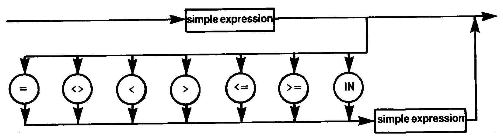

# 1.13 EXPRESSION

When using **IN**, the set attributes are the full range of the type of the simple expression with the exception of integer arguments for which the attributes are taken as if **[0..255]** had been encountered.

The above syntax applies when comparing strings of the same length, pointers and all scalar types. Sets may be compared using **>=**, **<=**, **<>** or **=**. Pointers may only be compared using **=** and **<>**.
