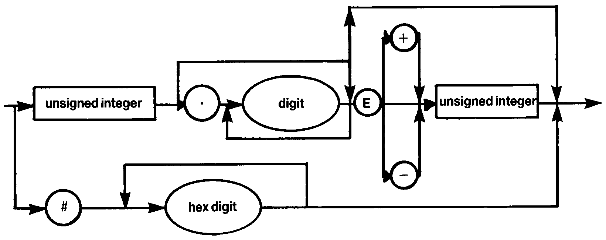

# 1.3 UNSIGNED NUMBER

**Integers** have an absolute value less than or equal to **32767** in HiSoft Pascal. Larger whole numbers are treated as **reals**.

The mantissa of **reals** is **23 bits** in length. The accuracy attained using reals is therefore about **7** significant figures. Note that accuracy is lost if the result of a calculation is much less then the absolute values of its arguments e.g. **2.00002 - 2** does not yield **0.00002**. This is due to the inaccuracy involved in representing decimal fractions as binary fractions. It does not occur when integers of moderate size are represented as reals e.g. **200002 - 200000 = 2** exactly.

The largest **real** available is **3.4E38** while the smallest is **5.9E-39**.

There is no point in using more than **7** digits in the mantissa when specifying reals since extra digits are ignored except for their place value.

When accuracy is important avoid leading zeroes since these count as one of the digits. Thus **0.000123456** is represented less accurately than **1.23456E-4**.

Hexadecimal numbers are available for programmers to specify memory addresses for assembly language linkage inter alia. Note that there must be at least one hexadecimal digit present after the '**£**', otherwise an error (`*ERROR* 51`) will be generated.
